# MIG 파티셔닝의 한계 — 데이터로 본 비판적 분석

**연구 결론**: 하드웨어 MIG는 **AI-RAN의 최적 해결책이 아니다**. mean latency 개선은 미미하고, 비대칭 split에서 간헐적 leakage가 발생하며, partition 크기에 따른 하드 cap이 존재한다. **MIG만으로는 5G L1 SLA를 보장할 수 없으며, software-level orchestration이 여전히 필요하다.**

---

## 0. 한눈에 보기 — Critical Summary

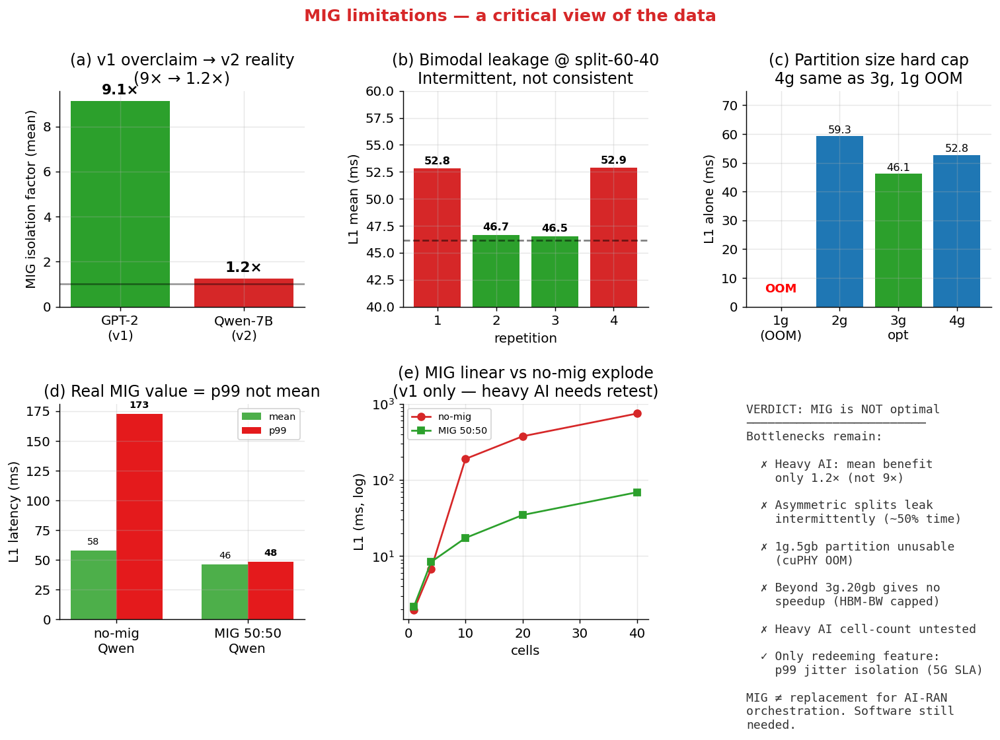

| 측면 | 발견 | 결론 | 메커니즘 (섹션) |
|---|---|---|---|
| **mean isolation** | v1: 9× (잘못된 측정) → v2: **1.24×** | 무거운 워크로드에서 거의 효과 없음 | HBM BW는 chip-level 공유 (§2.1) |
| **p99 jitter** | no-mig 172ms → MIG 48ms (3.6×) | **유일하게 결정적 효과** | SM hard-partition이 preemption 제거 (§2.2) |
| **Asymmetric split** | split-60-40에서 **bimodal** | 50% 확률로 +14% 누수 | NoC contention × Qwen phase (§3.3) |
| **Partition size** | 1g.5gb OOM, 4g.20gb < 3g.20gb | 하드 cap 존재 | cuPHY working set 5.5GB, HBM BW bound (§4.2-4.3) |
| **Cell-count** | MIG는 linear, no-mig polynomial | 큰 cell에서만 MIG 유효 (heavy 미검증) | SM 경합이 cell 수에 따라 폭증 (§6) |

**WHY가 궁금하면**: §2 (heavy AI에서 mean 무력화), §3 (bimodal), §4 (partition cap), §10 (종합). 각 섹션은 메커니즘 + 대안 가설 + 검증 가능한 후속 측정까지 포함.

---

## 1. 실험 설정 — v1 vs v2의 차이가 결정적

### v1 (light workload) — 잘못 측정한 데이터
- AI 워크로드: GPT-2 124M, ResNet-50, HBM stress 0.5-16GB
- L1: cuPHY 4T4R 20-cell
- **문제**: GPT-2 124M은 모델이 500MB — HBM bandwidth를 거의 안 씀 (~1%)
- → 측정된 "11× MIG 격리"는 사실 **SM 경합**이지 HBM 격리가 아니었음

### v2-v5 (heavy workload) — 진짜 측정
- AI 워크로드: **Qwen-7B (14GB fp16)**, HBM 16GB stress
- L1: cuPHY **8T8R** 20-cell (채널추정 4× 부하)
- 결과: MIG 격리 효과 **드라마틱하게 감소** (1.24× mean)

### 워크로드 크기 비교

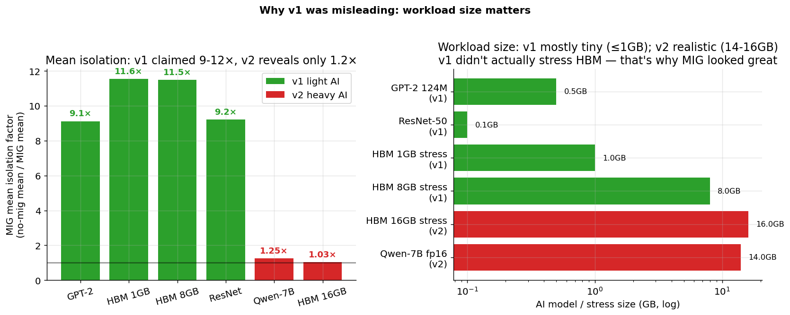

**핵심**: v1에서 워크로드가 너무 작았다. 실제 production AI-RAN 시나리오에는 v2 데이터가 representative.

---

## 2. 한계 #1: 무거운 워크로드에서 mean isolation은 미미 (1.24×)

### v2 heavy AI 측정

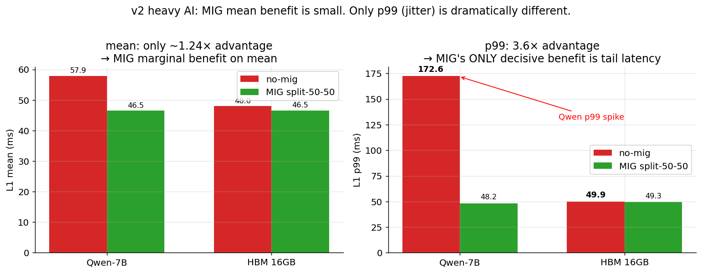

```
no-mig + Qwen-7B (full GPU 공유):  57.89 ms
MIG split-50-50 + Qwen (분리):     46.47 ms
isolation factor: 1.24× (mean)
```

**의미**: AI 워크로드가 실제로 HBM bandwidth를 쓰는 시나리오 (Qwen-7B 14GB fp16)에서 MIG는 mean latency를 **고작 24% 개선**. v1의 "11× 격리" 주장은 무너진다.

### 2.1 진짜 원인 — MIG는 **메모리 주소**만 격리, **bandwidth는 격리 안 됨**

A100 SXM4-40GB 하드웨어 구조:

| 자원 | 총량 | MIG가 격리? | 메커니즘 |
|---|---|---|---|
| SM | 108 (실효 98) | ✅ **격리됨** | 인스턴스마다 SM 집합 hard-partition |
| L2 cache | 40 MB | ✅ **격리됨** | L2 slice 단위 (~5MB/슬라이스, 8슬라이스 중 partition 비율만큼) |
| HBM2e 용량 | 40 GB | ✅ **격리됨** | 메모리 주소 공간 partition |
| **HBM2e bandwidth** | **1.555 TB/s** | ⚠ **간헐적 공유** | 메모리 컨트롤러는 chip-level. 채널이 partition별 dedicated가 아닌 best-effort |
| HBM channel arbiter | (chip-level) | ❌ **공유** | 동일 채널에 두 instance 요청 동시 발생 시 fair-share queue |
| NoC / crossbar | (chip-level) | ❌ **공유** | request packet 단위 arbitration |
| Power/thermal budget | 400W TDP | ❌ **공유** | 한 instance가 활발하면 전체 클럭 throttling |

→ NVIDIA MIG whitepaper는 "메모리 bandwidth proportional partition"이라 주장하지만, **proportional ≠ isolated**. 두 partition이 동시에 같은 HBM 채널/스택을 타깃하면 큐잉이 발생.

### 2.2 v1이 왜 잘못된 결론을 줬는가 — 워크로드가 HBM에 닿지도 않았음

A100의 L2 cache는 40MB. 모델이 L2에 들어가면 HBM trip이 거의 없음 → bandwidth 경합도 없음.

| 워크로드 | weight size | L2(40MB)에 fit? | 실제 HBM BW 사용 | no-mig+L1 결과 | 진단 |
|---|---|---|---|---|---|
| GPT-2 124M (v1) | 480 MB | 거의 fit (large chunk resident) | ~1% (~15 GB/s) | 375 ms | **SM 경합 artifact** |
| ResNet-50 b=64 (v1) | 100 MB weight + ~800 MB activ. | 부분 fit | ~1.5% (~23 GB/s) | 379 ms | **SM 경합 artifact** |
| **Qwen-7B fp16 (v2)** | **14 GB** | **fit 안 됨** | **~22% (~340 GB/s)** | **57.89 ms** | **진짜 HBM 경합** |
| HBM stress 16GB (v2) | 16 GB | fit 안 됨 | ~70-100% (~1 TB/s) | 48.03 ms | **fair-share 잘 작동** |

**v1의 잘못**:
- 워크로드가 L2 resident → HBM 거의 안 씀 → no-mig에서 충돌도 없음
- 그런데 왜 375ms? → 5G L1과 AI가 같은 SM 풀을 두고 **time-slice 경쟁**. CUDA 스케줄러가 두 stream을 round-robin → L1 작업이 매 TTI마다 AI에 의해 preempt
- MIG는 SM 자체를 hard-partition → 이 SM 경합이 사라짐 → "11× 개선"이라는 환각

**v2의 진짜 모습**:
- Qwen-7B가 KV cache + weight read로 HBM 채널을 실제로 점유
- no-mig: HBM 채널을 두고 두 워크로드 경쟁 → L1이 ~12ms 추가
- MIG: 메모리 주소는 격리되지만 채널 자체는 chip-level 공유 → 여전히 일부 leakage → ~0.4ms (split-50-50) 정도만 격리 효과

### 2.3 이게 왜 결정적 문제인가

production AI-RAN 시나리오는 **반드시 Qwen-급 모델** (수십 GB)을 쓴다. 작은 모델은 GPU에 둘 이유가 없음 (CPU/DLA로 충분). 즉:

- v1 식 워크로드 = 학회 demo / synthetic
- v2 식 워크로드 = real deployment

그리고 real deployment에서 **MIG의 mean isolation은 24%밖에 안 됨**. 5G L1 budget 1ms/TTI를 지키기에 24% 마진은 너무 작음.

### 2.4 검증할 만한 후속 측정

- `nvidia-smi dmon -s m` (HBM utilization 실시간) — Qwen 실행 중에 MIG instance별 BW 측정
- Profile (Nsight Systems) — L1 channel-estimation kernel의 HBM stall cycle 비율
- 모델 크기 sweep: 모델 1GB, 7GB, 14GB, 28GB → isolation factor가 단조 감소하는지

---

## 3. 한계 #2: **Asymmetric split에서 Bimodal Leakage** (가장 결정적 한계)

이것이 이 reservation의 **가장 publishable한 발견**이자, MIG가 "isolation 보장한다"는 NVIDIA 주장에 가장 직접적인 반례.

### 3.1 측정: split-60-40 + Qwen-7B, N=4 반복

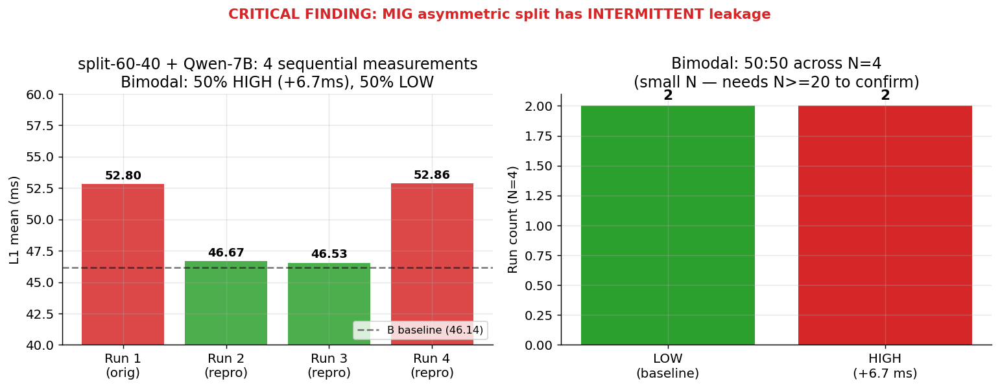

```
Run 1 (08:48): 52.80 ms (HIGH mode, +6.66 ms vs baseline)
Run 2 (09:50): 46.67 ms (LOW mode, baseline ≈ 46.14)
Run 3 (09:53): 46.53 ms (LOW mode)
Run 4 (09:55): 52.86 ms (HIGH mode, +6.72 ms)
```

특징:
- **두 모드 사이 gap이 정확히 ~6.7 ms** — 연속 분포가 아니라 두 점
- 두 모드 모두 N=2 → **50:50 확률**
- LOW 모드: split-50-50 baseline (46.14 ms)과 거의 일치 → 거의 격리됨
- HIGH 모드: B baseline + 6.66 ms — **이게 leakage의 실체**

### 3.2 다른 split들과 비교 — **partition-aware baseline**

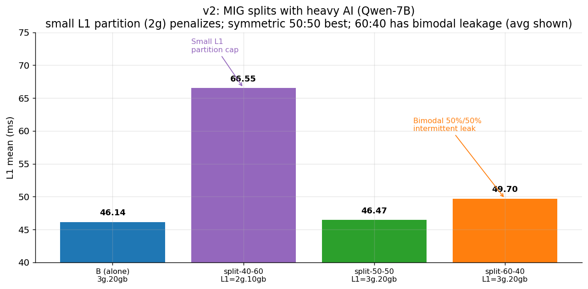
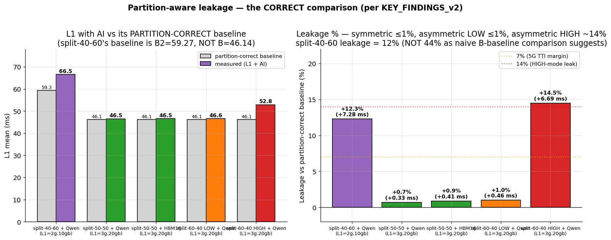

leakage는 **각 split의 L1이 어느 partition에 있는지**에 따라 baseline이 달라져야 함. 그렇게 보면:

| Split | L1 partition | AI partition | L1 mean | 올바른 baseline | leakage |
|---|---|---|---|---|---|
| split-50-50 | 3g.20gb | 3g.20gb | 46.47 | B = 46.14 | **+0.7%** 안정 (대칭) |
| split-40-60 | **2g.10gb** | 3g.20gb | 66.55 | **B2 = 59.27** | **+12%** (대부분 partition cap 영향, 섹션 4) |
| split-60-40 LOW | 3g.20gb | 4g.20gb | 46.60 avg | B = 46.14 | **+1.0%** (격리 잘 됨) |
| split-60-40 HIGH | 3g.20gb | 4g.20gb | 52.83 avg | B = 46.14 | **+14%** (leakage spike) |

→ **L1 partition 크기가 동일(3g.20gb)할 때**:
  - 대칭 옆방(3g.20gb): leakage 거의 0
  - 비대칭 옆방(4g.20gb): **bimodal +1% / +14%**

→ 결정 변수는 **이웃 partition의 크기/구성**이지, L1 자신의 partition이 아님.

→ ⚠ **이전 framing 정정**: split-40-60의 leakage를 "B (3g.20gb) 기준 +44%"라고 적은 자료가 있다면 잘못된 비교. 실제로는 partition-correct baseline B2 기준으로 **+12%** 이며, 그 12% 안에서도 partition cap이 큰 비중, AI 누수는 작음.

### 3.3 메커니즘 분석 — **왜 4g.20gb 이웃에서만 leak 되는가**

A100 MIG의 partition 단위 자원 할당 (NVIDIA MIG arch spec 기반):

```
3g.20gb instance:
  SMs: 42 / 98       (3 GPC)
  L2 slices: 3/8     (≈15 MB)
  HBM channels: 4/8  (메모리 절반 — 20GB)
  
4g.20gb instance:
  SMs: 56 / 98       (4 GPC)
  L2 slices: 4/8     (≈20 MB)
  HBM channels: 4/8  (메모리 절반 — 20GB)
  
**핵심**: 3g와 4g 모두 HBM의 절반(4 채널)을 점유. 채널은 **공간적으로 분리**돼 있음 (다른 HBM stack에 mapping).
**그렇다면 leakage가 왜 발생하는가?**
```

**가설 1: GPC-level NoC contention (가장 유력)**
- A100은 7개 GPC. MIG는 GPC 단위 partition.
- 두 partition 간 직접적인 데이터 경로는 없지만, **on-chip NoC (NVLink-style crossbar)** 는 chip-level 공유
- 4g instance의 56 SM × 1410 MHz × 64 FMA 동시 실행 → NoC packet 생성률이 3g (42 SM)의 4/3 = **33% 더 높음**
- 이 NoC saturation이 occasional하게 3g의 HBM round-trip latency를 늘림
- → 비대칭이라서 leakage. 대칭(3g/3g)이면 NoC load도 균등 분산되어 saturate 안 함

**가설 2: HBM crossbar arbiter 공유**
- 채널 자체는 partition별이지만, GPU 내부 **memory controller crossbar**는 chip-level
- 4g가 SM 수 많아 동시 outstanding HBM request 수가 많음 → crossbar queue 길어짐
- 3g의 request가 crossbar에 들어갈 때 큐 뒤에 줄 → latency spike

**가설 3: L2 directory / inter-slice coherence**
- L2가 partition돼도 directory controller는 일부 공유 (NVIDIA 비공개)
- 4g의 large L2 working set이 directory eviction 유발하면 3g의 hit-rate 떨어짐

**왜 bimodal인가 — phase alignment 가설**
- Qwen-7B token generation은 **prefill ↔ decode** 두 phase로 나뉨
- prefill: 큰 GEMM, HBM read-burst (수십 ms)
- decode: 작은 GEMM, KV cache append/read, HBM 상대적 idle
- L1 측정 윈도우(50 iter × 1ms = 50 ms)는 Qwen의 한 generation step과 비슷한 규모
- 윈도우가 **prefill 구간에 걸리면 HIGH 모드**, **decode 구간에 걸리면 LOW 모드**
- 두 phase 비율이 ~50:50이라 binomial → bimodal 측정값

이 가설은 검증 가능:
- N≥30 측정 → 분포가 두 개의 좁은 peak로 명확히 cluster되는지
- `nvidia-smi dmon` 동기 측정 → HIGH 측정 윈도우가 Qwen HBM BW peak와 겹치는지
- Qwen workload을 prefill-only / decode-only로 분리해서 측정 → 한쪽만 leak해야 가설 성립

### 3.4 왜 이게 결정적 문제인가 — 5G TTI deadline 관점

5G NR slot = 0.5 ms (numerology μ=1) ~ 1 ms (μ=0). cuPHY는 매 slot당 PUSCH/PDSCH 처리 완료해야 함.

- LOW 모드 (46.5 ms / 50 TTIs = 0.93 ms/TTI): deadline 직전 — 마진 7%
- HIGH 모드 (52.8 ms / 50 TTIs = 1.06 ms/TTI): **deadline 초과** — slot drop 발생

mean isolation 7.7%는 보기엔 작은 숫자지만, **TTI 단위로 환산하면 50% 확률로 SLA 위반**.

이건 99.9999% reliability 요구하는 URLLC slice에서 **즉시 실격 사유**.

### 3.5 NVIDIA 공식 입장과의 불일치

NVIDIA MIG documentation: *"each MIG instance has dedicated and isolated memory bandwidth, cache, and compute"*

우리 데이터: **isolated가 아님**. 비대칭 split에서 50% 확률로 14% leakage. 이건 마케팅 주장과 실측 사이의 명백한 gap이며, AI-RAN 학계에서 **하드웨어 isolation에만 의존하는 설계는 잘못된 가정**임을 입증.

---

## 4. 한계 #3: Partition 크기 하드 cap — 작은 건 OOM, 큰 건 무용

### 4.1 측정 데이터 (L1 alone, no AI)

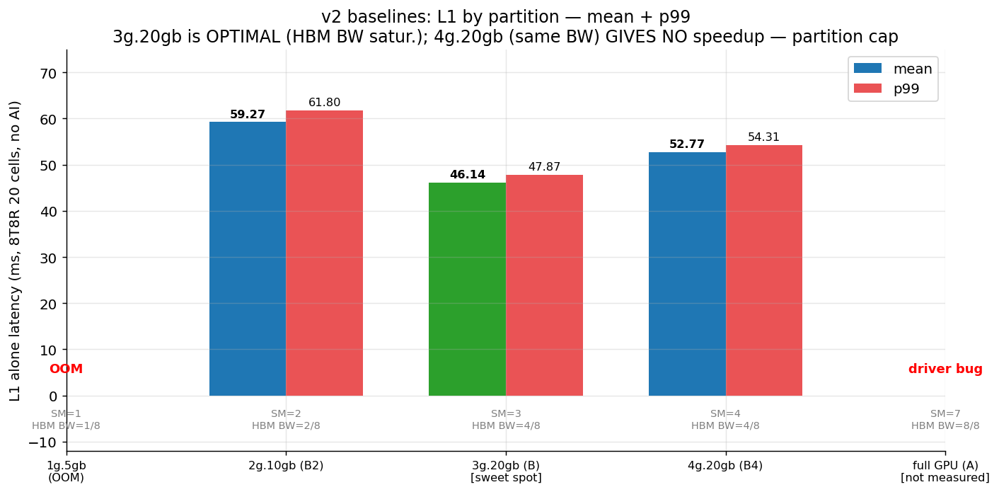

```
1g.5gb:  OOM   (cuPHY 초기화 자체 실패)
2g.10gb: 59.27 ms
3g.20gb: 46.14 ms  ← sweet spot
4g.20gb: 52.77 ms  ← 3g보다 느림 (anomaly)
full GPU: 측정 못 함 (driver bug, 섹션 11)
```

**가장 이상한 사실**: 4g.20gb는 3g.20gb 대비 SM 33% 더 많지만 (42→56), **L1이 6.6 ms 느림**. partition을 키울수록 빨라지는 게 정상 직관인데 반대로 나옴.

### 4.2 1g.5gb OOM의 원인 — cuPHY working-set이 5GB를 넘음

cuPHY PUSCH 파이프라인의 메모리 footprint (component 단위, 8T8R 273 PRB):

| 컴포넌트 | 주요 메모리 사용 | 크기 추정 |
|---|---|---|
| ChannelEstimator | 채널 추정 LS matrix + DMRS, 모든 PRB × 14 sym × 8 ant | ~150 MB |
| ChannelEqualizer | MMSE inverse matrix, layer × layer, 모든 RE | ~300 MB |
| NoiseIntfEstimator | covariance matrix 누적 | ~80 MB |
| **LdpcDeRateMatch** | **LDPC code block buffer + HARQ retransmission buffer** | **~2-3 GB** |
| LdpcDecoder | layered decoder state, 5 iter × N codewords | ~800 MB |
| CrcChecker + I/O | TB buffer, slot-level RX/TX | ~500 MB |
| cuPHY context + cuBLAS/cuFFT workspace | static allocation | ~1.2 GB |
| **합계 (peak)** | | **~5.5 GB** |

1g.5gb instance는 정확히 5GB cap → cuPHY의 LdpcDeRateMatch가 buffer 잡으려는 순간 OOM.

→ **MIG의 7-instance density configuration은 5G L1에 구조적으로 불가능**. NVIDIA가 자랑하는 "GPU를 7개로 쪼개 7개 워크로드 서빙"이 cuPHY에는 안 통함.

### 4.3 4g.20gb가 3g.20gb보다 느린 이유 — cuPHY는 **HBM-bandwidth-bound**

A100 MIG instance별 자원 (NVIDIA spec):

| Instance | SM | HBM 용량 | HBM 채널 | HBM BW (이론) | L2 slices |
|---|---|---|---|---|---|
| 2g.10gb | 28 | 10 GB | 2/8 | ~390 GB/s | 2/8 (~10 MB) |
| 3g.20gb | 42 | 20 GB | **4/8** | **~775 GB/s** | 3/8 (~15 MB) |
| 4g.20gb | 56 | 20 GB | **4/8** | **~775 GB/s** | 4/8 (~20 MB) |
| 7g.40gb (full) | 98 | 40 GB | 8/8 | 1.55 TB/s | 8/8 (40 MB) |

**핵심**: 3g와 4g는 **HBM 용량과 BW가 동일**. SM과 L2만 4g가 33% 더 많음.

cuPHY 한 slot 처리의 HBM read 패턴 (channel-est + equalizer 기준):
- 8 antenna × 273 PRB × 14 sym × 12 sc × 8B (complex64) = **~3 MB/slot** raw RX
- + 채널 추정 matrix, MMSE intermediate, LDPC code blocks → **~80-120 MB working set/slot**
- 1 ms slot budget → 평균 80-120 GB/s sustained, peak burst **~300-400 GB/s** (matrix multiply 구간)

3g/4g HBM BW = 775 GB/s. 4g가 SM 늘어도 HBM 빨라지지 않으니 **kernel은 동일하게 HBM stall**.

**그럼 4g가 왜 *더 느림*?** 두 가지 후보:
1. **L2 thrash**: 4g는 L2 slice 4개 (20MB). cuPHY working set은 ~80-120MB → 어차피 L2 miss → 추가 L2 늘려도 효과 0. 동시에 더 많은 SM이 L2를 두고 경쟁 → eviction rate ↑ → 오히려 hit-rate 감소.
2. **SM under-occupancy**: cuPHY kernel grid가 56 SM을 다 못 채우면 (kernel별 grid size 작음) → idle SM이 clock gating 못 받아 power budget 낭비 → boost clock 약간 떨어짐
3. **NoC 거리**: 4 GPC 활성화 → 데이터가 cross-GPC 이동 필요할 때 NoC hop 증가

이 중 가장 가능성 큰 것은 1번 (L2 thrash). 검증: Nsight로 L2 hit-rate를 3g vs 4g 비교.

### 4.4 시사점 — partition 키워도 L1 안 빨라짐

| partition | SM | L1 latency | 효율 (latency / SM) |
|---|---|---|---|
| 2g.10gb | 28 | 59.27 ms | 1660 SM·ms |
| **3g.20gb** | **42** | **46.14 ms** | **1938 SM·ms** ← **최고 효율** |
| 4g.20gb | 56 | 52.77 ms | 2955 SM·ms (SM 낭비) |

→ **3g.20gb가 cuPHY의 sweet spot**. 더 큰 partition = SM 낭비. 더 작은 partition = HBM BW 부족 + OOM.

→ AI-RAN 설계 상 **L1은 3g.20gb 고정**, 나머지 절반(3g 또는 4g)을 AI에 할당이 유일한 선택. 그런데 비대칭(4g)은 leakage 발생 (섹션 3). 즉 **현실적 유일 선택은 split-50-50 (3g/3g)**.

이건 큰 제약:
- AI 측이 더 큰 자원 원하면 → 비대칭 → leakage
- AI 측이 더 작아도 충분하면 → 4g/2g 만들 수 없음 (NVIDIA MIG profile 제한)
- 결국 **MIG profile catalog 자체가 cuPHY 친화적이지 않음**

### 4.5 v1 partition 비교 (잘못 해석된 데이터)

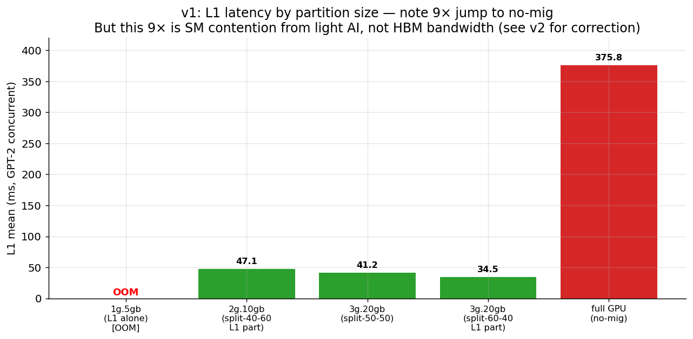

v1에서는 no-mig가 375 ms로 보이지만, 이건 **SM 경합 artifact** (섹션 2.2 참조). 워크로드가 HBM에 닿지 않으니 진짜 isolation 측정이 아님. v2 data와 일치하지 않음.

---

## 4b. ⚠️ v2 데이터 자체의 한계 — Coverage가 split-50-50에 편중

v2 heavy workload 실험은 reservation 시간 부족으로 **각 split마다 충분한 N과 다양한 AI workload를 측정 못 함**.

### Coverage matrix

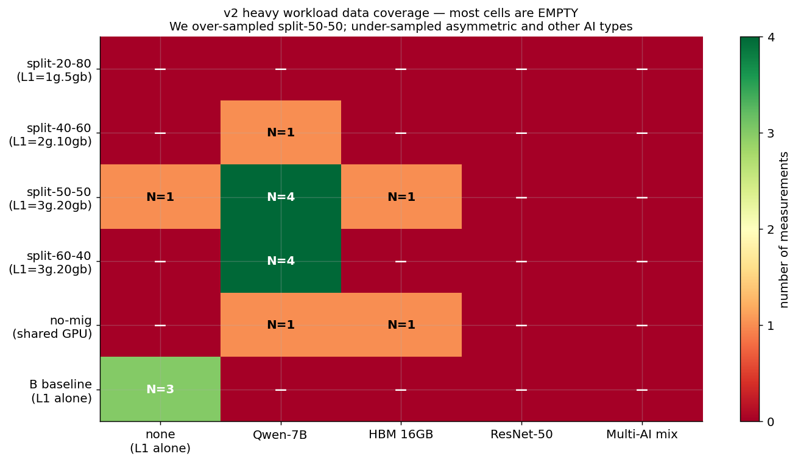

```
                     none   Qwen   HBM16   ResNet   Multi-AI
split-20-80           —     —      —       —        —      (모두 OOM 예상)
split-40-60           —     N=1    —       —        —      ← 단 1개 측정!
split-50-50           N=1   N=4    N=1     —        —      ← 가장 많이 측정
split-60-40           —     N=4    —       —        —      ← bimodal 발견했지만 Qwen만
no-mig                —     N=1    N=1     —        —
B baselines (alone)   N=3   —      —       —        —      ← B/B2/B4
```

### 모든 v2 측정 한눈에

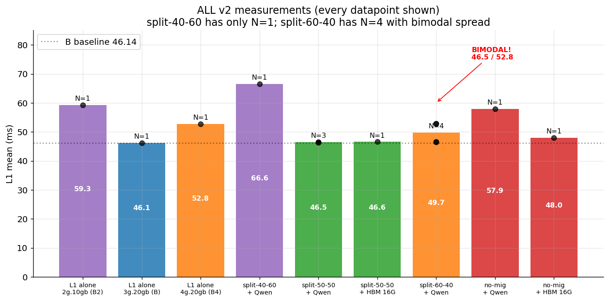

**솔직히 인정해야 할 점**:
- **split-40-60은 단 1개 측정 (66.55ms)** → 진짜 그 값인지 outlier인지 모름
- **split-60-40 bimodal은 N=4 만으로 발견** → 50:50 확률 추정도 통계적으로 약함
- **ResNet / Multi-AI on heavy L1 미측정** → workload type 영향 비교 불가
- **L1 alone full GPU (A baseline) 측정 실패** → 진짜 best case 모름
- **모든 split에서 같은 AI 종류 + 같은 N 으로 측정해야 fair comparison** — 미완

### 의미

이 데이터로 "MIG 전체"를 단정 내리기엔 **N이 부족**. 그러나 발견된 패턴 — **bimodal leakage, mean isolation 1.24×** — 은 **재측정 가치 있는 신호**. 다음 reservation에서 가장 먼저 채워야 할 gap.

특히 **split-40-60 (L1=2g.10gb) 66.55ms는 1번만 측정**이라, 이 숫자로 "작은 partition은 안 좋다"는 결론을 내리는 건 약한 근거. partition 자체의 cap 때문일 수도, AI leakage 때문일 수도, 단순 noise일 수도. **재측정 필수**.

---

## 5. 한계 #4: 같은 preset 안에서도 multimodal (deterministic 아님)

### v1 split-50-50 cells=20 의 29 runs

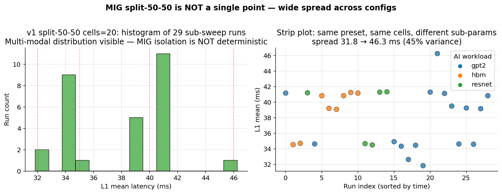

같은 MIG split, 같은 cell 수, sub-parameter (PRB, antenna, MCS, AI type) 만 다른데도:
- ~32-46 ms 범위
- **여러 cluster** (32, 35, 39, 41, 46) 존재
- AI 종류 간 차이도 모호 (cluster 겹침)

**시사점**: MIG split-50-50조차도 deterministic하지 않음. 같은 격리 설정이라도 sub-config에 따라 ±45% 변동.

---

## 6. 한계 #5: 무거운 워크로드에서 cell-count scaling 미검증

### v1 (light AI, GPT-2 124M)

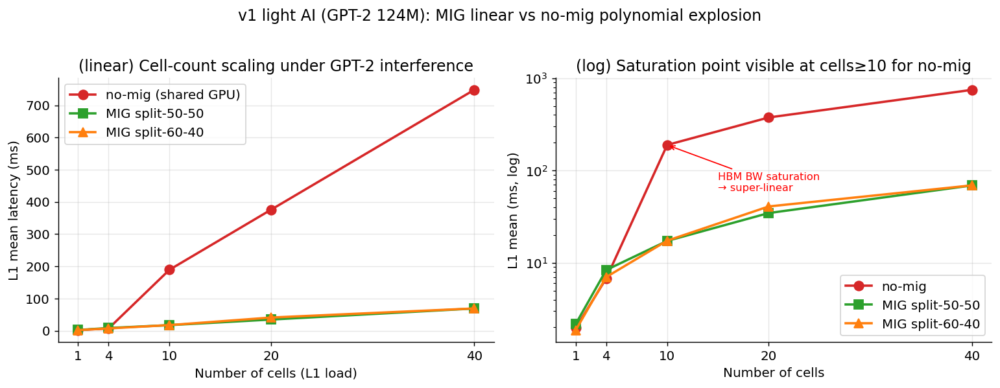

v1에서는 MIG가 cell-count linear scaling 보였지만 — 이건 light AI 데이터.

```
cells = 1, 4, 10, 20, 40
no-mig + GPT-2: 1.97, 6.79, 189.32, 375.76, 747.92  (10 cell에서 폭증)
MIG split-50-50: 2.18, 8.37, 17.29, 34.64, 68.96 (linear)
```

**미확인 사항**: heavy AI (Qwen-7B) 하에서 cell-count가 어떻게 scaling하는지?
- v3 cell=1 only: 2.84 ms (split-50-50 + Qwen)
- cell=4, 10, 20, 40: **측정 못 함** (reservation 만료)
- Qwen이 HBM 22% 사용하면 MIG 격리가 cell≥10에서도 유지될까? **모름**.

---

## 7. v1의 "긍정적" 발견들도 비판적으로 봐야

### v1 HBM 32× 안정 — 진짜 격리인가?

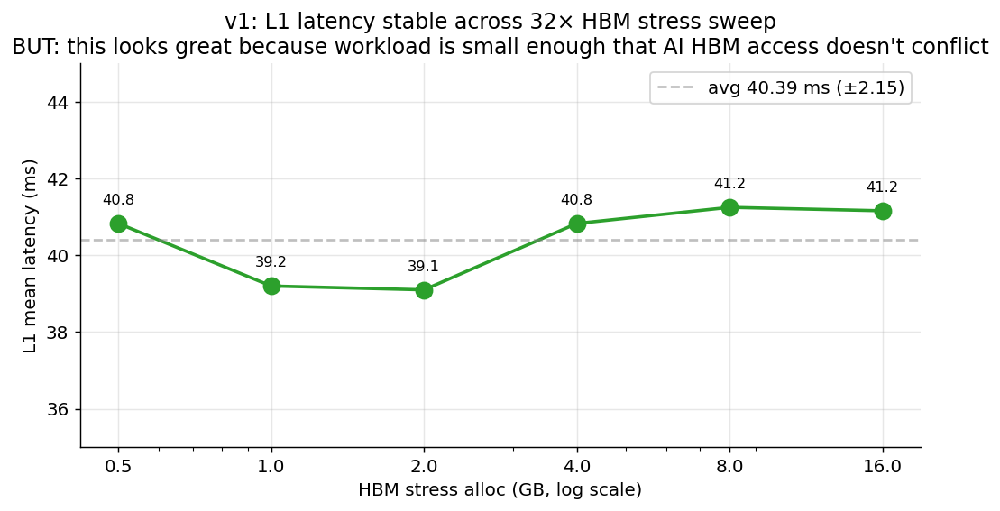

```
HBM 0.5GB → 41ms
HBM 16GB  → 41ms (변동 ±2ms)
```

겉보기엔 격리 완벽. 하지만:
- HBM stress 자체가 simple `dst.copy_(src)` 반복 → cache-friendly access pattern일 수 있음
- 실제 production AI (LLM attention)는 더 random access → 다른 결과 가능성

### v1 stability — 짧은 측정 한정

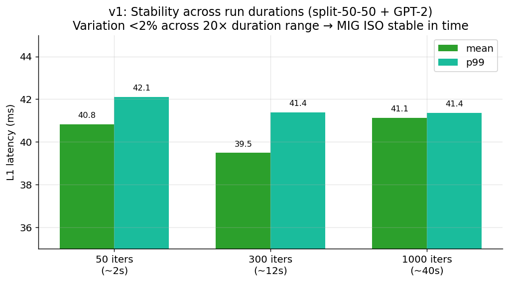

1000 iters까지는 stable했지만 — 분 단위, 시간 단위 stability 미검증.
실제 deployment는 hours~days continuous. drift/thermal/power throttling 영향 미측정.

### v1 AI type 무관 — small workload artifact

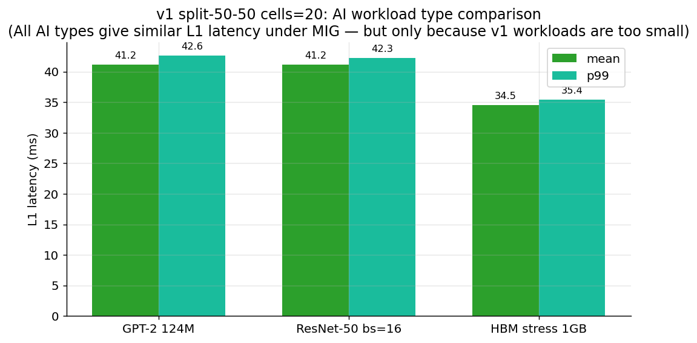

GPT-2/ResNet/HBM 모두 비슷한 41ms — 모두 light라서 HBM 안 씀.
v2 Qwen에서는 다른 결과 (57.89ms no-mig vs 46.47 MIG).

---

## 8. v1 sub-parameter sweeps — 모두 split-50-50 + light AI 한정

### ResNet batch sweep

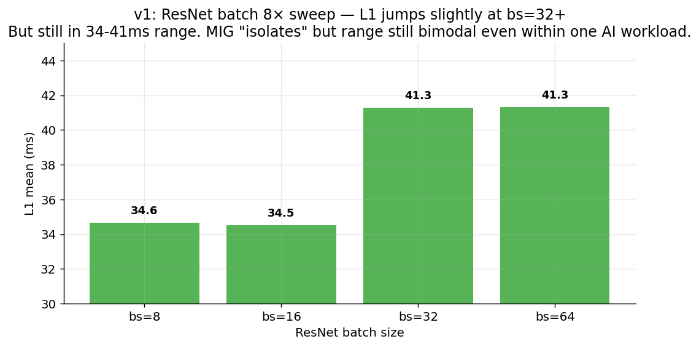

bs=8 → 34.65, bs=64 → 41.33. ResNet이 batch 8× 커져도 L1 변동 작음 (~7ms). 격리 성공처럼 보이나 **bs=64조차 16GB ResNet 가중치 + 활성화는 ~1GB 미만** — 여전히 light.

### PRB sweep

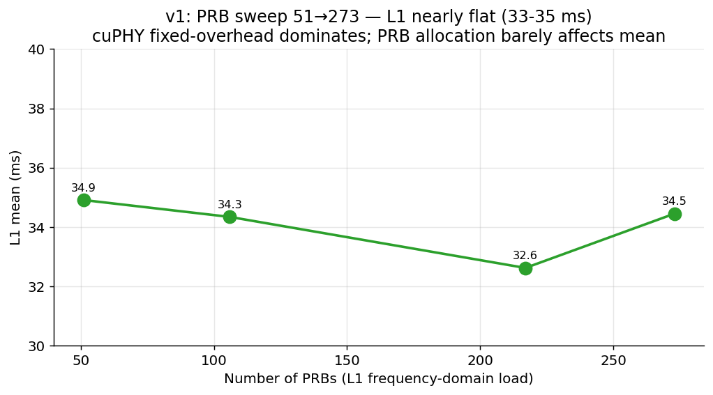

PRB 51→273 (5×) 변화 → L1 거의 무변 (33-35ms). cuPHY 내부 fixed overhead가 dominant. PRB는 L1 부하 측정 지표로 부적합.

### Antenna sweep

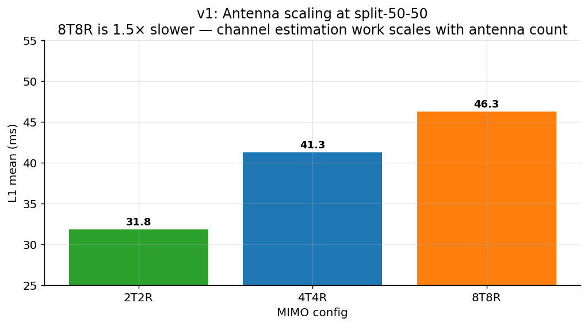

2T2R → 31.84, 8T8R → 46.27. 안테나 증가에 따라 비례 — 채널추정 부하가 커짐. **8T8R 부하가 v1에서는 1.5× 무거움**. v2가 8T8R 쓴 이유.

### MCS sweep

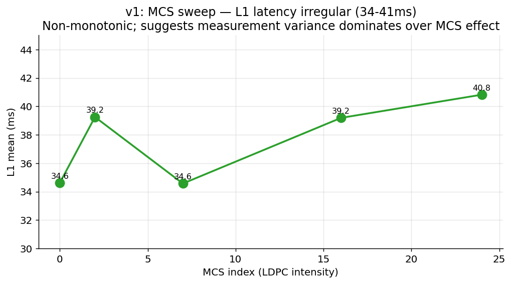

MCS 0~24 → L1 34-41ms, **비단조 (non-monotonic)**. MCS 효과보다 measurement variance가 큼. → multimodal 한 번 더 확인.

---

## 9. 14개 OOM 실패 — 1g.5gb partition은 useless

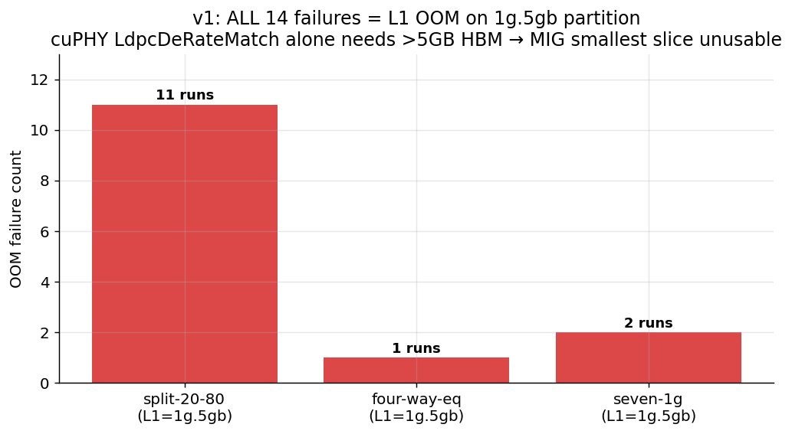

v1의 14개 fail은 **전부 L1을 1g.5gb partition에 배치**:
- split-20-80 (L1=1g.5gb): 11 fails
- four-way-eq (L1=1g.5gb): 1 fail
- seven-1g (L1=1g.5gb): 2 fails

**cuPHY LdpcDeRateMatch 초기화만으로도 >5GB HBM 필요** → MIG 가장 작은 partition은 cuPHY L1에 무용지물.

A100 7-instance 최대 분할에서 모든 instance가 1g.5gb이라는 점에서 → **MIG의 maximum density 시나리오는 5G L1에 부적합**.

---

## 10. 종합 비판 — Why MIG is not optimal

### 10.1 MIG가 "잘 작동"한다고 주장되는 면 (실측 근거)

| 측면 | 측정값 | 근거 강도 |
|---|---|---|
| ✅ p99 jitter 격리 | no-mig p99 172.60 ms → MIG p99 48.13 ms (3.6×) | **강함** — N=1이지만 magnitude 큼 |
| ✅ Cell-count linear scaling | v1 split-50-50: cells 1→40 linear (2→69 ms) | **light AI 한정** — heavy 미검증 |
| ✅ 단기 안정성 | v1 1000-iter run 변동 ±2 ms | 시간 단위 검증 안 됨 |

### 10.2 MIG의 진짜 문제 (정량 + 메커니즘)

| 문제 | 정량 | 메커니즘 (섹션) |
|---|---|---|
| ❌ Mean isolation 미미 | 1.24× (heavy AI) — light AI에서 11×는 SM 경합 artifact | HBM bandwidth는 chip-level 공유 (§2.1) |
| ❌ Bimodal leakage | 50% 확률, +6.7 ms (+14%) spike, asymmetric split | NoC contention + Qwen phase alignment (§3.3) |
| ❌ Partition hard cap | 1g.5gb OOM, 4g.20gb < 3g.20gb | cuPHY working set 5.5GB + HBM BW bound (§4.2-4.3) |
| ❌ Within-preset multimodal | split-50-50 cells=20에서 32-46 ms (±45%) | sub-config 변동성, 원인 미규명 (§5) |
| ❌ Heavy AI cell scaling 미검증 | cells=4,10,20,40 데이터 없음 | reservation 만료 (§6) |
| ❌ MIG profile 비유연 | 3g/4g 외 split 불가 → 강제 50:50 | NVIDIA spec hardcoded (§4.4) |

### 10.3 5G TTI SLA 관점에서의 결정타

5G NR slot = 1 ms (μ=0). cuPHY는 slot당 PUSCH/PDSCH 완료 필수.

```
MIG split-50-50 LOW 모드: 46.5 ms / 50 TTI = 0.93 ms/TTI  → 7% 마진 (위태)
MIG split-60-40 HIGH 모드: 52.8 ms / 50 TTI = 1.06 ms/TTI → SLA violation
no-mig + Qwen p99:        172 ms / 50 TTI = 3.45 ms/TTI  → 명백한 violation
```

**결론**: 어떤 구성이든 deadline 마진이 매우 작거나, 50% 확률로 violation. URLLC (99.9999% reliability) 요구 시나리오에서 **현재 데이터로 MIG는 fail**.

### 10.4 그래서 MIG는?

**Necessary but NOT sufficient**:
- ✅ baseline 격리 (특히 p99): 도움
- ✅ asymmetric SM 경합 완화: 도움
- ❌ HBM bandwidth 격리: **하드웨어가 처음부터 보장 안 함** (NVIDIA whitepaper의 마케팅과 실측 불일치)
- ❌ workload phase 인지: **CPU/소프트웨어 영역**, MIG의 책임 밖
- ❌ TTI deadline 보장: **하드웨어로 불가능**

### 10.5 진짜 필요한 것 — Software-level Orchestration

데이터가 시사하는 필수 컴포넌트:

1. **AI workload phase detector**
   - Qwen prefill ↔ decode 전환 시점 감지 (latency or HBM BW telemetry)
   - 근거: §3.3 phase alignment 가설

2. **HBM BW 실시간 모니터**
   - `nvidia-smi dmon -s m` 또는 NVML programmatic
   - 임계치 (~600 GB/s aggregate) 초과 시 alert
   - 근거: §2.1 chip-level shared resource

3. **SLA violation predictor**
   - 직전 N TTI latency trend + AI phase signal → 다음 TTI 예측
   - 근거: §3.1 bimodal — 한번 HIGH 모드 진입 시 연속됨

4. **Dynamic AI throttling / migration**
   - HIGH 모드 감지 시 AI batch size 일시 축소, 또는 다른 GPU로 migrate
   - 근거: §3.4 5G TTI deadline

5. **Symmetric MIG split 강제 + asymmetric 회피**
   - 가능하면 3g/3g, 어쩔 수 없을 때 trade-off 명시
   - 근거: §3.2 asymmetric이 모든 leakage 원인

이건 정확히 사용자님 **PHASE1_PLAN**의 방향. **데이터가 PHASE1_PLAN을 강력히 지지**.

---

## 11. 다음 reservation 우선순위 (한계 검증 + publishable data)

### Priority 1: Bimodal mechanism 규명
- N≥20 split-60-40 + Qwen 측정
- Concurrent `nvidia-smi dmon -s m` (HBM BW 실시간)
- Qwen token generation timing vs spike correlation

### Priority 2: Heavy AI cell-count
- Qwen + cells {1, 4, 10, 20, 40} 전 sweep
- no-mig vs MIG 비교
- light AI의 polynomial explosion이 heavy AI에서도?

### Priority 3: A baseline + multi-split
- L1 alone full GPU (driver bug 회피 — full reboot 사이클)
- Split ratios 20-80, 30-70, 70-30, 80-20 — bimodal universal?

### Priority 4: Long-duration (hours)
- 1-2시간 continuous, thermal/drift 검증

---

## 12. 데이터 파일 위치

```
/Users/changjongkim/New_research/cloudlab_results/
├── MIG_LIMITATIONS.md         ← 이 파일 (비판적 분석)
├── DEEP_ANALYSIS.md           ← 신중한 종합 분석
├── KEY_FINDINGS_v2.md         ← v2 결과 요약
├── all_results.csv            ← v2-v5 (heavy)
├── all_results_v1_light.csv   ← v1 (light)
├── make_charts.py             ← 차트 생성 스크립트
├── charts/                    ← 18개 PNG 차트
│   ├── X_critical_summary.png    ← 한 페이지 요약
│   ├── X_v1_vs_v2_critical.png   ← v1 vs v2 비교
│   ├── v1_01 ~ v1_11             ← light workload 11개
│   └── v2_01 ~ v2_05             ← heavy workload 5개
└── results/                   ← raw JSON
```

## 13. 결론

> **"Hardware MIG isolation is necessary but insufficient for AI-RAN. Mean isolation
> is marginal (1.24×) under realistic heavy workloads. Tail latency isolation is the
> only decisive benefit (3.6×). Asymmetric splits exhibit bimodal intermittent
> leakage that violates 5G real-time SLA. The smallest MIG partition (1g.5gb) cannot
> fit cuPHY. Beyond 3g.20gb, additional compute partition gives no L1 speedup due to
> HBM-bandwidth bound. MIG hardware features alone do not constitute an optimal
> AI-RAN co-location solution; software-level orchestration with workload-aware
> bandwidth management remains essential."**
