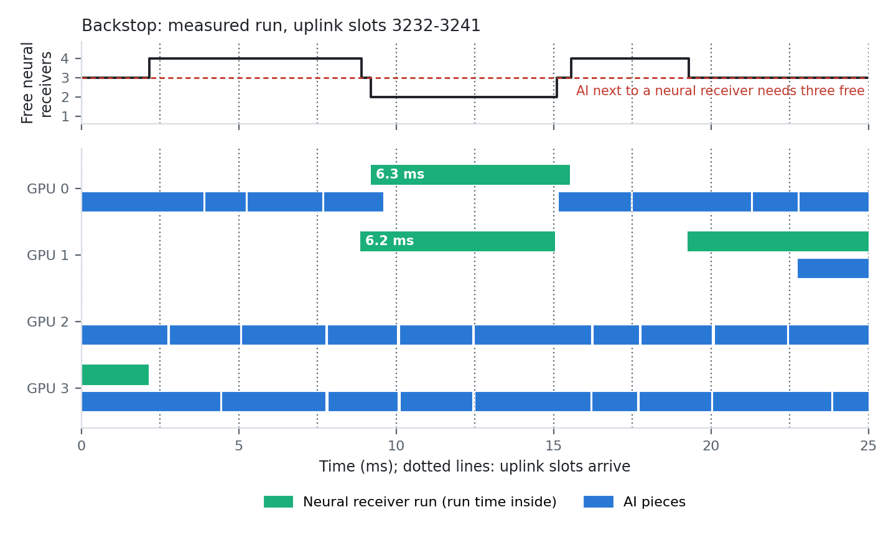

# Backstop: AI-RAN 공유 GPU에서 Neural Receiver 복구 경로와 AI 추론의 공존

**기준일:** 2026-10-02
**연구 주제:** 무선 PHY와 외부 AI 추론이 같은 GPU를 쓰는 AI-RAN 서버에서, neural receiver(NRx)를 실패한 transport block(TB)의 복구 경로로 쓰면서 L1 마감과 복구 수를 지키고 AI 추론을 최대한 처리하는 GPU 공유 방식
**현재 단계:** 스킴 구현, 수신기 검증, 기존 방식 다섯 가지와의 sweep 비교, 논문 초안 작성을 마쳤다. 실제 L2 연동과 실측 채널 검증은 하지 않았다.
**논문 초안:** [paper/backstop_slot_v7/main.pdf](paper/backstop_slot_v7/main.pdf) (14쪽)

이 문서는 저장소의 단일 진입점이다. 문제 정의, 기존 연구와의 차이, 노벨티를 확보한 방법, 스킴, 실험 결과, 한계, 결론을 순서대로 적는다. 모든 수치는 12장에 적은 원본 파일에서 나온 값이다.

## 목차

1. [문제 정의](#1-문제-정의)
2. [기존 연구와의 차이](#2-기존-연구와의-차이)
3. [노벨티를 확보한 방법](#3-노벨티를-확보한-방법)
4. [스킴](#4-스킴)
5. [실험 환경과 방법](#5-실험-환경과-방법)
6. [실험 결과](#6-실험-결과)
7. [유리하지 않은 결과와 철회한 주장](#7-유리하지-않은-결과와-철회한-주장)
8. [한계](#8-한계)
9. [결론](#9-결론)
10. [재현 방법](#10-재현-방법)
11. [연구 경과](#11-연구-경과)
12. [저장소 구조와 원본 파일](#12-저장소-구조와-원본-파일)

---

## 1. 문제 정의

### 1.1 배경

AI-RAN 서버는 여러 셀의 uplink PHY를 GPU에서 복호하고, 남는 GPU 시간으로 AI 추론 요청을 처리한다. 무선 작업에는 슬롯 단위 마감이 있고 AI 요청에는 응답 시간 제한이 있다.

이 연구의 시간 조건은 다음과 같다.

| 항목 | 값 | 근거 |
|---|---|---|
| TDD 패턴 | DDDSU, subcarrier 간격 30 kHz | 셀마다 2.5 ms에 UL 슬롯 하나 |
| L1 마감 | 수신 샘플 도착 후 4.0 ms | 샘플은 슬롯 시작 0.5 ms 뒤 도착, L1 결과는 슬롯 시작 4.5 ms 뒤 필요 |
| 재전송 | 원래 슬롯의 7.5 ms 뒤 UL 슬롯 | 바로 앞 S 슬롯에서 K2=1로 grant. PUSCH 준비 시간 12심볼(TS 38.214 표 6.4-1) |
| 복구 마감 | 도착 후 11.5 ms | 4.2절 |

Neural receiver는 채널 추정, 등화, demapping을 학습된 모델로 대체하는 수신기다. 기존 수신기(이 연구에서는 NVIDIA Aerial cuPHY)가 복호하지 못한 TB를 복호하면 그 TB의 재전송이 없어지고 UL 슬롯 하나가 남는다.

### 1.2 측정으로 확인한 두 사실

**사실 1. 기존 수신기보다 확실히 나은 NRx는 UL 주기보다 느리다.** 두 수신기의 LDPC 반복 횟수를 20회로 맞추고 공개 NRx(NVlabs `neural_rx`)와 cuPHY를 같은 슬롯에서 비교했다(6.1절).

- 실시간용 모델 `nrx_rt`(엔진 1.35 ms)는 두 UE의 채널 상관이 중간 이상일 때만 cuPHY보다 많이 복호한다. 상관이 낮은 채널과 UMi 채널에서는 cuPHY 실패의 2%만 추가로 복호한다.
- 큰 모델 `nrx_large`(엔진 4.29 ms)는 시험한 세 채널 모두에서 cuPHY 실패의 15–67%를 추가로 복호한다.
- 큰 모델의 슬롯 하나 경로는 단독 5.3 ms, 셀과 같이 돌 때 6.3 ms다. UL 주기 2.5 ms의 2.1–2.5배이므로 매 슬롯에 돌릴 수 없다.

**사실 2. 기존 GPU 공유 수단은 NRx의 복구를 지키지 못한다.** 16셀, GPU 4장, 큰 모델을 복구 경로로 쓰는 조건에서 AI를 같은 GPU에 넣었다(6.4절).

- MPS 비율 한도는 프로세스 시작 뒤 바꿀 수 없다. 전 부하에서 복구를 지키는 비율은 10%이고, 그 비율의 AI 처리량은 5.2k tokens/s다. 비율을 50%로 올리면 복구를 9.2% 잃고 L1 놓침이 0.10%가 된다.
- AI를 낮은 MPS 우선순위로 두면 L1 마감은 지켜진다. 그러나 복구를 8.0% 잃는다.
- GPU에 무선 작업이 없을 때만 AI를 돌리면 복구는 99.7%를 지키지만 AI 처리량이 4.7k tokens/s다.

### 1.3 문제 진술

위 두 사실에서 문제는 다음과 같이 정해진다.

> 큰 NRx를 매 슬롯의 수신기로 쓸 수 없으므로 실패한 TB의 복구 경로로 써야 한다. 이 복구 경로는 기존 수신기, AI 추론과 같은 GPU를 쓴다. (a) 모든 TB의 L1 마감, (b) NRx가 복구하는 TB 수, (c) AI 요청의 응답 시간 제한을 함께 지키면서 AI 처리량을 최대화하는 GPU 공유 방식이 필요하다.

기존 수단이 (b)를 지키지 못하는 이유는 6.8절의 측정으로 확인했다. 실패한 TB는 도착 후 3.9 ms 안에 NRx를 시작해야 하고, 그때 NRx가 모두 실행 중이면 그 TB의 복구 기회는 없어진다. AI가 NRx를 느리게 만들면 NRx가 늦게 비고, 다음 실패 TB가 빈 NRx를 찾지 못한다. 비율 한도와 우선순위는 실행 중인 작업의 속도만 조절하므로 이 상태를 보지 못한다.

---

## 2. 기존 연구와의 차이

### 2.1 무선과 다른 작업이 GPU를 나누는 연구

| 연구 | GPU의 무선 작업 | NRx | 외부 AI | GPU를 나누는 방법 | 결정 간격 | 확인 범위 |
|---|---|---|---|---|---|---|
| YinYangRAN (INFOCOM'24) | LDPC 복호 | 없음 | 트래픽 예측 모델 추론 | MPS 비율. 학습된 예측기가 비율 선택 | 1초 이상. 비율 변경 0.27초 동안 CPU로 처리 | 원문 |
| CloudRIC (MobiCom'24) | LDPC 복호. 여러 DU가 CPU와 GPU pool 공유 | 없음 | 없음 | 요청마다 처리기 선택 | 요청 단위 | 원문 |
| Concordia (SIGCOMM'21) | CPU vRAN 전체 (GPU 아님) | 없음 | 일반 CPU 작업 | 무선이 쓸 core를 예측해 예약 | – | 이전 검토 |
| AI-RAN 실험 (SoftBank·NVIDIA, arXiv'25) | Aerial 5G (4T4R, 100 MHz) | 동시 실행 실험에 없음 | LLM | MIG 40% / 60% 고정 분할 | 고정 | 원문 |
| Interplay (INFOCOM'25 WS), CAORA (arXiv'25) | 작업량 수준 모델 | 없음 | AI | MIG 동적 분할 | orchestrator | 이전 검토 |
| SMEC (NSDI'26) | srsRAN (별도 서버) | 없음 | MEC GPU 작업 | MEC 서버에서 MPS 우선순위 | – | 이전 검토 |
| **Backstop** | cuPHY PUSCH 전체 + **NRx** | **있음** | Qwen2.5-1.5B prefill | 낮은 우선순위 AI를 조각 단위로 허락 | 15–57 µs | – |

평가 규모는 다음과 같다.

| 연구 | 무선 규모 | GPU | 외부 AI | 무선 입력 |
|---|---|---|---|---|
| YinYangRAN | 100 MHz DU 1개 | A100 1장 | 있음 | 모의 RU·UE |
| CloudRIC | 100 MHz DU 최대 30개 | V100 1장 + CPU pool | 없음 | 모의 RU·UE |
| AI-RAN 실험 | gNB 1개 | GH200의 GPU 1장 | 있음 | 실제 망 |
| ARCHES | 셀 1개 | GH200 | 없음 | 실제 망 |
| **Backstop** | 100 MHz 셀 16–48개 | A100 4장 | 있음 | 미리 생성한 IQ |

- 이 연구들의 GPU 무선 작업은 LDPC 복호 또는 기존 PHY다. 확인한 범위에서 NRx를 무선 작업에 넣고 외부 AI와 GPU를 나눈 연구는 없다.
- 이 연구들의 무선 작업은 TB마다 필수 작업 하나이고 마감도 하나다. Backstop의 무선 작업은 필수 작업(기존 수신기)과 선택 작업(NRx 복구) 둘이고 마감도 둘이다.
- 셀 수만 보면 CloudRIC이 같은 규모다. 외부 AI와 GPU를 나누는 연구 가운데서는 확인한 범위에서 Backstop의 평가 규모가 가장 크다.
- Backstop의 입력은 미리 생성한 IQ이고, AI-RAN 실험과 ARCHES는 실제 망이다.

### 2.2 Neural receiver 연구

| 연구 | 다루는 것 | 외부 AI와 GPU 공유 | 확인 범위 |
|---|---|---|---|
| DeepRx (2021), 5G NR MU-MIMO NRx (2023) | NRx 모델과 BLER | 없음 | 참고문헌 |
| 실시간 NRx (NVIDIA, 2025) | A100에서 1 ms 안에 도는 NRx, site-specific 미세 조정 | 없음 | 초록 |
| ARCHES (arXiv'26) | Aerial PUSCH 안에서 AI 채널 추정기와 MMSE 추정기를 슬롯 경계에서 전환 | 없음 | 원문 |
| OCUDU dApp (arXiv'26) | 수신 체인 안의 신경망 equalizer. 기존 경로를 항상 유지 | 초록에 없음 | 초록 |

- 이 연구들은 NRx의 복호 성능과 수신기 전환 시점을 다룬다. NRx가 쓰는 GPU 시간이 다른 작업의 마감에 주는 영향과, 남는 GPU를 AI에 줄 수 있는 양은 다루지 않는다.
- NVlabs의 NRx 평가는 LDPC 20회를 쓰고 cuPHY의 기본 설정은 이 연구의 TB 크기에서 10회다. 반복 횟수를 맞춘 비교는 확인한 범위에서 없다(3.1절).

### 2.3 일반 GPU 스케줄링 연구

| 연구 | 끼워 넣는 단위 | 넣어도 되는지 판단하는 기준 | 무선 마감 계산 |
|---|---|---|---|
| REEF (OSDI'22) | GPU kernel | 우선순위. 높은 우선순위가 오면 낮은 쪽을 중단 | 없음 |
| Orion (EuroSys'24) | GPU kernel | 높은 우선순위 작업이 없을 때, 또는 kernel이 작고 자원 성격이 다를 때 | 없음 |
| DARIS (DAC'25) | DNN stage | MPS·stream·stage 경계 | 관측 기준 |
| XSched (OSDI'25), nvtaskset | context, kernel | 우선순위 | 없음 |
| **Backstop** | LLM prefill의 layer × token 묶음 (세 가지 크기) | TB별 마감 여유 + 빈 NRx 수 | TB마다 계산 |

- AI를 작은 단위로 나눠 높은 우선순위 작업 사이에 넣는 방법은 이 연구들에 이미 있다. Backstop의 노벨티는 이 방법 자체에 있지 않다.
- 이 연구들은 실행 중인 높은 우선순위 작업의 지연을 보호한다. 아직 시작하지 않은 복구 작업이 쓸 자원(빈 NRx)을 보호하는 기준은 없다.

### 2.4 차이 요약

| 항목 | 기존 연구 | Backstop |
|---|---|---|
| GPU의 무선 작업 | LDPC 복호 또는 기존 PHY | 기존 수신기(모든 TB) + NRx(실패한 TB) |
| NRx의 역할 | 기존 수신기의 대체 또는 슬롯 단위 전환 | 기존 수신기가 실패한 TB의 복구 경로 |
| TB당 마감 | 하나 | 둘: L1 마감 4.0 ms, 복구 마감 11.5 ms |
| NRx를 돌릴 TB | 모든 TB 또는 채널·MAC 지표로 선택 | 그 TB의 기존 수신기 결과(실패 code block 수)로 선택 |
| 수신기 비교 조건 | LDPC 반복 횟수가 수신기마다 다름 | 두 수신기 모두 20회 |
| AI에 GPU를 주는 방법 | 고정 비율, 1초 이상 간격의 비율 변경, 우선순위 | 낮은 우선순위 + 조각마다 허락 |
| AI 허락의 판단 기준 | 간섭 크기, 우선순위 | TB별 마감 여유와 서버 전체의 빈 NRx 수 |
| 평가 (외부 AI와 공유하는 연구) | DU 또는 gNB 1개, GPU 1장 | 16–48셀, GPU 4장 |

### 2.5 실험에서 기존 방식을 구현한 방법

기존 방식과의 성능 비교는 그 방식의 동작을 이 저장소의 런타임에 구현해서 했다. 해당 논문의 코드를 실행하지 않았다. 따라서 비교 결과는 "그 방식"에 대한 것이고 "그 시스템"에 대한 것이 아니다.

| 비교 대상 | 구현 | 대응하는 기존 연구 | 원본과 다른 점 |
|---|---|---|---|
| 고정 비율 | AI worker에 MPS 비율 고정 | AI-RAN 실험의 MIG 분할 | MIG 대신 MPS 비율 사용 |
| 부하 따라 비율 | GPU마다 비율이 다른 AI worker를 미리 띄우고, 최근 100 ms 무선 부하로 하나만 활성화 | YinYangRAN | 예측기 없음. 전환 비용 0. 부하를 즉시 알거나 1초 늦게 앎. 비율 2–3개 |
| 낮은 우선순위 | AI worker에 `CUDA_MPS_CLIENT_PRIORITY=1`, 비율 한도와 조합 | SMEC | SMEC은 무선과 다른 서버에서 사용 |
| 낮은 우선순위 + 부하 따라 비율 | 위 둘의 조합 | 해당 연구 없음 | 기존 수단으로 구성할 수 있는 가장 강한 조합 |
| 유휴 시간만 | GPU에 무선 작업이 없을 때만 AI. 다음 UL 도착 전에 종료 | Orion, REEF | kernel 단위가 아니라 AI 단위 기준 |
| 보호 없음 | 비율 100%, 우선순위 같음 | 기본 MPS | – |

비교 대상에 유리한 가정을 두었다. 전환 비용은 0이고(MPS 비율은 실제로는 프로세스를 다시 띄워야 바뀐다), 부하를 지연 없이 아는 경우를 포함했다. NRx 규칙, AI 요청, 요청 배치와 입장 제어는 모든 방식이 같다.

---

## 3. 노벨티를 확보한 방법

노벨티는 주장으로 정하지 않고 측정에서 도출했다. 각 항목은 측정 → 발견 → 설계 → 반증 시도의 순서로 확보했다. 반증에 실패한 항목만 남겼고, 반증된 주장은 7장에 적었다.

### 3.1 N1: LDPC 반복 횟수를 맞춘 수신기 비교

- **측정.** 같은 슬롯을 cuPHY와 NRx로 복호하되 두 수신기의 LDPC 반복 횟수를 10, 20, 40회로 맞췄다.
- **발견.** 횟수를 맞추지 않으면 실시간용 NRx가 cuPHY 실패의 25–35%를 복호하는 것처럼 보인다(cuPHY 10회, NRx 20회). 20회로 맞추면 2%다. cuPHY를 10회에서 20회로 올리는 것만으로 단일 UE 실패 TB 158개 중 152개가 복호된다.
- **결과.** 같은 횟수에서 cuPHY보다 확실히 나은 것은 큰 모델(`nrx_large`)뿐이고, 그 이득은 채널에 따라 15–67%다(6.1절).
- **의미.** 이후의 모든 주장은 "큰 NRx를 쓴다"를 전제로 한다. 이 전제가 문제(1.2절 사실 1)를 만든다.

이 항목은 연구 도중 자기 결과를 반증하면서 확보했다. 초기에 보고한 "NRx가 기존 실패의 62%를 복호한다"는 cuPHY 10회 기준에서만 성립했고, 철회했다(7장).

### 3.2 N2: 큰 NRx를 복구 전용으로 쓰는 구조와 두 마감

- **측정.** 큰 모델을 모든 슬롯에 돌리는 방식과 실패한 TB에만 돌리는 방식을 비교했다.
- **발견.** 상관이 낮은 채널과 UMi에서 "cuPHY만 성공한 TB"가 0개다. 따라서 "cuPHY 먼저, 실패하면 NRx"의 복호 결과는 NRx를 모든 슬롯에 돌린 결과와 같다(TB 600개 중 572개). NRx 실행은 슬롯의 25%로 줄어든다.
- **설계.** TB마다 L1 마감(4.0 ms, 기존 수신기)과 복구 마감(11.5 ms, NRx)을 둔다. NRx 결과가 복구 마감 안에 나오면 그 TB의 재전송을 취소한다.
- **검증.** 큰 모델을 주 수신기로 쓰면 NRx가 슬롯의 39%만 처리하고 복호 성공이 89.4%다. 복구 방식은 94.5–95.1%다(6.2절).

### 3.3 N3: 기존 수신기의 실패 code block 수로 복구할 TB 선택

- **측정.** 기존 수신기가 보고하는 실패 code block 수와 NRx 복구 성공률의 관계를 채널별로 측정했다.
- **발견.** UMi 채널에서 실패 TB의 87%는 code block이 전부 실패한 것이고 NRx도 그 2%만 복구한다. 실패 code block이 9개 이하인 슬롯의 TB는 93%가 복구된다.
- **설계.** 슬롯의 실패 code block 수가 K 이하인 TB만 NRx로 보낸다.
- **검증.** UMi에서 NRx 실행이 85% 줄고 복구는 5% 준다(6.3절). 기존 연구는 NRx를 돌릴 대상을 채널·MAC 지표나 슬롯 단위로 고르고, 그 TB의 복호 결과로 고르지 않는다.

### 3.4 N4: 복구를 잃는 원인의 규명

- **측정.** AI를 넣은 실행에서 잃은 복구를 AI 없는 실행과 TB 단위로 대조해 원인을 분류했다.
- **발견.** 보호 없음을 제외하면 잃은 복구의 83–99%가 "빈 NRx가 없어 시작하지 못함"이고, "NRx가 복구 마감 뒤에 끝남"은 17% 이하다(6.8절). AI 없이도 후보의 4%가 같은 이유로 버려지고, 이 값은 NRx 4개·실행 6.3 ms·초당 243회 조건의 Erlang-B 계산(5%)과 맞는다.
- **의미.** "실행 중인 NRx가 마감 안에 끝나는가"만 보는 규칙은 충분하지 않다. 이 연구의 이전 규칙(v12)이 그런 규칙이었고, 낮은 우선순위 + 고정 비율과 같은 성능이었다(7장).

### 3.5 N5: 빈 NRx 여유를 지키는 AI 허락 규칙

- **설계.** AI를 낮은 MPS 우선순위로 실행하고 조각 단위로 허락한다. NRx가 실행 중인 GPU에서는 서버 전체의 빈 NRx가 R개 이상일 때만 AI 조각을 허락한다. NRx 4개에서 R=3이며, 이는 "다른 NRx가 실행 중이 아닐 때만"과 같다.
- **근거.** NRx 하나만 실행 중이면 그 NRx가 늦게 끝나도 다음 실패 TB는 다른 NRx를 쓴다. 두 개 이상 실행 중이면 느려진 NRx가 다음 실패 TB의 시작을 막는다.
- **검증.** 낮은 우선순위만 쓰면 48.4k tokens/s에 복구 92.0%다. NRx 옆에서 AI를 금지하면 25.3k에 97.4%다. 빈 NRx 여유 규칙은 39.5k에 97.4%다(6.8절). 복구를 유지하면서 AI 처리량이 1.56배가 된다.

### 3.6 검증 방식

- **강한 기준선을 포함했다.** 낮은 MPS 우선순위는 이 연구의 이전 규칙과 같은 성능을 내는 기준선이었다. 이 기준선을 제외하면 "고정 10%의 5배"라는 결과가 나오지만, 낮은 우선순위를 아는 독자에게 방어할 수 없다. 기준선에 포함하고 그 위에서 규칙을 다시 설계했다.
- **비교 대상에 유리한 가정을 두었다.** 2.5절.
- **유리하지 않은 조건을 측정하고 기록했다.** GPU 1장, 48셀, 셀 버스트, 20셀(7장).
- **자기 결과를 반증했다.** NRx 입력 형식 오류, LDPC 횟수 불일치, 우선순위 없는 기준선의 세 가지를 발견해 이전 수치를 철회했다(7장).

---

## 4. 스킴

### 4.1 구성

서버에 네 종류의 프로세스가 있다. 모든 프로세스는 공유 메모리의 상태 하나와 시계 하나를 읽는다.

| 프로세스 | 수 | 하는 일 |
|---|---|---|
| 기존 수신기 | 셀마다 하나 | 2.5 ms마다 그 셀의 TB를 cuPHY로 복호. CRC 결과와 실패 code block 수를 상태에 기록 |
| NRx | GPU마다 하나 | TB 하나씩 복호. 모든 셀의 슬롯 버퍼를 매핑해 어느 셀의 TB든 처리 |
| AI worker | GPU마다 하나 | LLM prefill을 단위로 나눠, 허락받은 조각 안에서만 실행 |
| Controller | 서버에 하나 | 실패 TB를 NRx에 배정, GPU별 AI 조각 허락, AI 요청을 GPU에 배치 |

### 4.2 복구 경로

1. 슬롯의 샘플이 도착하면 기존 수신기가 복호한다. L1 마감은 도착 후 4.0 ms다.
2. CRC가 실패하고 슬롯의 실패 code block 수가 K 이하면 그 TB는 복구 후보가 된다(K=9, 채널 혼합 조건).
3. Controller는 후보의 최신 시작 시각을 `도착 + 복구 마감 − NRx 시간 한도 = 도착 + 11.5 − 7.6 = 도착 + 3.9 ms`로 계산한다.
4. 후보를 최신 시작 시각 순으로 빈 NRx에 배정한다. 최신 시작 시각을 넘긴 후보는 버리고 그 TB는 재전송된다.
5. NRx 결과는 CRC 통과, payload 일치, 복구 마감 안 종료를 모두 만족할 때만 복구로 센다.

복구 마감 6.5 ms는 기존 재전송 슬롯을 유지하지만 큰 모델(6.3 ms)이 들어가지 않는다. 11.5 ms는 복구에 실패한 TB의 재전송을 5 ms 늦춘다(6.10절).

### 4.3 AI 허락

AI worker는 Qwen2.5-1.5B prefill을 "layer 하나 × token 묶음(128, 512, 1,024)" 단위로 나눈다. 각 단위는 GPU graph 하나이고 측정한 시간 한도가 있다. AI worker는 낮은 MPS 우선순위로 실행하고 비율 한도는 두지 않는다.

Controller는 루프마다 GPU별로 다음 조건을 모두 만족하는 가장 큰 단위 크기 c를 골라, AI 작업량 4 ms 이하의 조각을 허락한다.

| 조건 | 내용 |
|---|---|
| 빈 NRx 여유 | 이 GPU에서 NRx가 실행 중이면, 서버의 빈 NRx가 R개 이상이어야 한다 (NRx 4개에서 R=3) |
| 실행 중인 NRx의 마감 | 이 GPU의 모든 실행 중 NRx에 대해 `시작 시각 + B(c) ≤ 복구 마감`. B(c)는 크기 c의 AI와 같이 돌 때의 NRx 시간 한도 |
| 기존 수신기 | 크기 c가 기존 수신기 옆에서 허용되지 않으면, 이 GPU의 셀이 복호 중이 아니어야 하고 조각이 다음 슬롯 도착 전에 끝나야 한다 |
| 곧 시작할 NRx | 이 GPU의 TB가 아직 후보가 될 수 있으면, 조각이 그 TB의 최신 시작 시각 전에 끝나야 한다 |
| 대기 중인 후보 | 빈 NRx를 기다리는 후보가 없어야 한다 |

조건을 만족하는 크기가 없으면 그 루프에서 그 GPU에는 AI를 주지 않는다. Controller 루프 하나는 15–57 µs다.

아래 그림은 측정한 실행에서 GPU 4장의 25 ms 구간이다. 0–2 ms에는 GPU 3의 NRx 하나만 실행 중이어서 AI가 옆에서 실행된다. 9 ms에 GPU 0과 GPU 1에서 NRx 둘이 시작하면 빈 NRx가 2개가 되고, GPU 0의 AI가 멈춘다. 두 NRx는 6.2–6.3 ms(단독 실행과 같은 시간)에 끝난다. NRx가 없는 GPU 2, 3의 AI는 계속 실행된다.



### 4.4 시간 한도

한도는 평가 하드웨어에서 모든 셀이 실행되고 한 단위 크기의 낮은 우선순위 AI가 계속 실행되는 조건으로 측정했다(16셀).

| AI | 기존 수신기 완료 p99 / p99.9 (ms) | NRx 실행 p50 / p99 (ms) |
|---|---|---|
| 없음 | 2.92 / 3.23 | 6.28 / 6.79 |
| 비율 70%, 128 token | 3.25 / 3.46 | 7.37 / 8.09 |
| 비율 70%, 1,024 token | 3.96 / 4.52 | 8.39 / 9.43 |
| 낮은 우선순위 + 70%, 128 token | 3.19 / 3.56 | 7.25 / 7.56 |
| 낮은 우선순위 + 70%, 1,024 token | 3.30 / 4.29 | 7.60 / 8.04 |
| 낮은 우선순위, 한도 없음, 1,024 token | 3.44 / 4.05 | 7.89 / 8.51 |

- NRx 시간 한도: 단독 7.6 ms, AI와 같이 돌 때 8.1 / 8.5 / 8.7 ms(128 / 512 / 1,024 token).
- GPU당 4셀에서는 세 크기 모두 기존 수신기 옆에서 허용한다. GPU당 5셀에서는 128 token만 허용한다(기존 수신기 완료 p99.9: 128 token 3.65 ms, 512 token 4.45 ms, 1,024 token 4.28 ms).
- AI 요청은 "시간 제한의 75% 안에 끝난다"고 예측될 때만 받는다. 모든 방식이 같은 입장 제어를 쓴다.

구현은 cuPHY, TensorRT, PyTorch 위의 Python 약 3.0천 줄이다(`scripts_for_node/backstop_slot/`).

---

## 5. 실험 환경과 방법

| 항목 | 값 |
|---|---|
| 시스템 | NERSC Perlmutter, 노드 하나 |
| GPU | NVIDIA A100 80GB × 4, MPS, MIG 미사용 |
| CPU | AMD EPYC 7763, 64 core |
| 컨테이너 | Shifter, `nvcr.io/nvidia/aerial/aerial-cuda-accelerated-ran:25-3-cubb` |
| 기존 수신기 | Aerial cuPHY PUSCH (MMSE, 시간 보간), LDPC 20회 |
| NRx | NVlabs `neural_rx`의 `nrx_large` (2-UE MU-MIMO, 273 PRB, TensorRT FP16), 뒤의 LDPC 20회 |
| 셀 | 100 MHz. 약한 셀: 2-UE MU-MIMO, 16QAM, 273 PRB, 슬롯당 code block 20개. 나머지: 단일 UE, 2 layer |
| 약한 셀의 채널 | NVlabs link simulation의 세 채널을 섞음: 상관 낮음 2–3 dB, 상관 높음 13–16 dB, UMi 4–6 dB |
| 기본 배치 | 16셀, GPU당 4셀, GPU당 약한 셀 1개, GPU당 NRx 1개 |
| AI | Qwen2.5-1.5B prefill, prompt 최대 1,024 token(BurstGPT 길이 분포), 시간 제한 200 ms |
| AI 제공량 | GPU당 초당 32개 요청(서버 53k tokens/s)이 기본 |
| 실행 길이 | 10–40초. 시드 2–3개 평균 |

측정 지표는 다음과 같다.

| 지표 | 정의 |
|---|---|
| AI 처리량 | 200 ms 안에 끝난 요청의 prompt token 수(초당). 제한을 넘긴 요청은 세지 않는다 |
| L1 놓침 | 기존 수신기 결과가 L1 마감(4.0 ms)을 넘긴 TB의 비율 |
| 복구 유지율 | 복구 마감 안에 NRx가 복구한 TB 수를 같은 시드의 AI 없는 실행과 비교한 비율 |
| NRx 제때 완료 | 실행한 NRx 가운데 복구 마감 안에 끝난 비율 |

모든 측정은 GPU에서의 end-to-end 실행이다. cuPHY가 모든 TB를 복호하고, NRx가 실제 수신 슬롯을 복호하고, AI worker가 실제 prefill을 실행한다. 슬롯은 미리 생성했고 RU와 L2는 없다.

---

## 6. 실험 결과

### 6.1 수신기 비교 (LDPC 반복 횟수 일치)

실시간용 모델 `nrx_rt`와 cuPHY.

| 채널 | TB | LDPC | cuPHY | nrx_rt | NRx만 성공 | cuPHY만 성공 | cuPHY 실패 중 NRx가 복호 |
|---|---|---|---|---|---|---|---|
| 2-UE 16QAM, 상관 낮음, 2–3 dB | 600 | 10 | 438 | 396 | 4 | 46 | 2% |
| | | 20 | 515 | 484 | 2 | 33 | 2% |
| | | 40 | 541 | 511 | 3 | 33 | 5% |
| 2-UE 16QAM, UMi, 1–6 dB | 600 | 10 | 405 | 402 | 4 | 7 | 2% |
| | | 20 | 425 | 420 | 4 | 9 | 2% |
| | | 40 | 431 | 425 | 2 | 8 | 1% |
| 2-UE 16QAM, 상관 중간, 8–18 dB | 600 | 20 | 321 | 372 | 59 | 8 | 21% |
| 2-UE 16QAM, 상관 높음, 10–16 dB | 1,400 | 10 | 844 | 976 | 167 | 35 | 30% |
| | | 20 | 946 | 1,099 | 174 | 21 | 38% |
| | | 40 | 979 | 1,135 | 180 | 24 | 43% |

큰 모델 `nrx_large`와 cuPHY.

| 채널 | TB | LDPC | cuPHY | nrx_large | NRx만 성공 | cuPHY만 성공 | cuPHY 실패 중 NRx가 복호 |
|---|---|---|---|---|---|---|---|
| 상관 낮음, 2–3 dB | 600 | 10 | 438 | 534 | 96 | 0 | 59% |
| | | 20 | 515 | 572 | 57 | 0 | 67% |
| | | 40 | 540 | 579 | 39 | 0 | 65% |
| UMi, 1–6 dB | 600 | 10 | 405 | 436 | 31 | 0 | 16% |
| | | 20 | 425 | 451 | 26 | 0 | 15% |
| | | 40 | 431 | 458 | 27 | 0 | 16% |
| 상관 높음, 10–16 dB | 1,400 | 10 | 843 | 1,069 | 248 | 22 | 45% |
| | | 20 | 947 | 1,159 | 233 | 21 | 51% |
| | | 40 | 981 | 1,191 | 226 | 16 | 54% |

단일 UE(pyAerial 예제 NRx, QPSK, CDL-D).

| SNR 구간 | TB | LDPC | cuPHY | NRx | cuPHY 실패 중 NRx가 복호 |
|---|---|---|---|---|---|
| −3.8 ~ −3.2 dB | 512 | 10 | 354 | 439 | 85/158 (54%) |
| | | 20 | 506 | 510 | 5/6 |
| | | 40 | 512 | 512 | – |
| −4.6 ~ −2.4 dB | 512 | 10 | 284 | 311 | 12% |
| | | 20 | 376 | 386 | 12% |
| | | 40 | 410 | 414 | 11% |

| 모델 | 엔진 GPU 시간 | 슬롯 하나의 경로 (단독) | 셀과 같이 돌 때 | cuPHY (같은 슬롯) |
|---|---|---|---|---|
| nrx_rt | 1.35 ms | 2.4 ms | 2.7–3.0 ms | 0.8–0.9 ms |
| nrx_large | 4.29 ms | 5.3 ms | 6.3 ms | 0.8–0.9 ms |

- 단일 UE의 좁은 SNR 구간에서 cuPHY는 10회 354개, 20회 506개, 40회 512개를 복호한다. 10회 기준의 NRx 이득(54%)은 대부분 반복 횟수 차이다.
- 20회의 비용은 code block 13개 TB에서 +19%(0.79 → 0.94 ms), 20개 TB에서 +15%(0.78 → 0.90 ms)다.
- 런타임 경로(LS 추정 → TensorRT → LDPC)는 LDPC를 20회로 맞추면 NVlabs 자체 평가와 TB 800개 중 794개가 일치한다.
- NRx 입력 형식: LS 추정값을 DMRS 심볼 순서로 펼치고 1/√2를 곱해야 한다. pyAerial 예제 형식으로 넣으면 약한 TB 256개 중 NRx 복호가 134개이고, 맞는 형식은 211개다.

### 6.2 복구 경로 단독 (AI 없음)

| 조건 | 약한 셀 TB 중 cuPHY 실패 | 그중 NRx가 제때 복구 |
|---|---|---|
| 상관 낮음, 16셀, 4,000 주기 | 14.3–14.6% | 63–66% |
| 상관 높음, 16셀 | 16.1–16.4% | 53–57% |
| 채널 혼합(K=9), 16셀 | 15.8–17.3% | 38% |

| 큰 모델의 사용 방식 (약한 셀 4개, AI 없음) | NRx가 처리한 슬롯 | 약한 셀의 복호 성공 |
|---|---|---|
| 주 수신기 (모든 슬롯을 NRx로) | 39% | 89.4% |
| 복구 경로 (실패한 TB만) | 실패한 TB의 슬롯만 처리, NRx 용량의 55% 사용 | 94.5–95.1% |

- 상관 낮은 채널의 단독 복호: TB 600개 중 cuPHY 515, NRx 572, cuPHY만 성공 0. 실패한 TB에만 NRx를 돌린 결과(572)가 모든 슬롯에 돌린 결과(572)와 같고, NRx 실행은 슬롯 300개 중 74개(25%)다.
- 채널 혼합 단독 복호: TB 2,000개 중 cuPHY 1,663, NRx 1,796, NRx만 성공 149(cuPHY 실패 337개의 44%), cuPHY만 성공 16.

### 6.3 복구할 TB 선택

| 채널 | 실패 code block 수 (슬롯의 두 UE 합) | 복구 성공률 |
|---|---|---|
| 상관 낮음 | 1–3개 | 97% (38개 중 37개) |
| | 4–9개 | 54% (24개 중 13개) |
| | 10개 이상 | 30% (23개 중 7개) |
| UMi | 9개 이하 | 93% (14개 중 13개) |
| | 전부 실패 (실패 TB의 87%) | 2% |
| 채널 혼합 | 9개 이하 | 75% (167개 중 125개) |
| | 10개 이상 | 14% (170개 중 24개) |

| 조건 (AI 없음) | 규칙 | NRx 실행 | 복구한 TB | 실행당 복구 |
|---|---|---|---|---|
| UMi, 약한 셀 4개 | 실패 전부 | 4,891–4,926 | 663–757 | – |
| | 9개 이하 | 651–777 | 589–746 | – |
| 상관 낮음, 약한 셀 8개 | 실패 전부 | 5,572–5,707 | 4,124–4,513 | 0.77 |
| | 9개 이하 | 4,445–4,672 | 3,857–4,348 | 0.90 |
| | 3개 이하 | 3,077–3,722 | 3,005–3,758 | 0.99 |

- UMi에서 9개 이하 규칙은 NRx 실행을 85% 줄이고 복구를 5% 줄인다.
- 약한 셀 8개(NRx 용량 부족)에서 3개 이하 규칙은 실행을 40%, 복구를 22% 줄이고 실행당 복구를 0.77에서 0.99로 올린다.
- 실패 수가 적은 TB에 NRx를 먼저 주는 순위 방식(문턱 없음)은 복구가 4% 적었다. 문턱 방식을 쓴다.

### 6.4 AI 부하 sweep: L1 마감과 AI 처리량

16셀 전 부하, 시드 3. AI 제공량 13k / 27k / 53k / 106k tokens/s. 칸은 "AI 처리량 / 복구 유지율 / L1 놓침"이다. AI 없는 실행은 L1 놓침 0.033%, 복구 초당 202 TB다.

| 방식 | 13k 제공 | 27k 제공 | 53k 제공 | 106k 제공 |
|---|---|---|---|---|
| **Backstop** | 13.3k / 98.8% / 0.04% | 26.7k / 98.1% / 0.03% | **39.5k / 97.4% / 0.04%** | 28.1k / 97.8% / 0.03% |
| 고정 10% | 3.0k / 97.9% / 0.03% | 4.4k / 97.7% / 0.05% | 5.2k / 97.1% / 0.05% | 5.6k / 97.7% / 0.03% |
| 고정 30% | 13.1k / 97.0% / 0.04% | 21.3k / 94.7% / 0.05% | 20.3k / 93.7% / 0.04% | 16.7k / 94.4% / 0.06% |
| 고정 50% | 13.3k / 97.3% / 0.05% | 26.5k / 95.1% / 0.05% | 35.5k / 90.8% / 0.10% | 24.6k / 91.2% / 0.11% |
| 보호 없음 (고정 100%) | 13.3k / 93.0% / 0.32% | 26.7k / 83.8% / 0.61% | 50.6k / 53.2% / 2.04% | 34.9k / 70.5% / 0.95% |
| 낮은 우선순위 + 30% | 12.9k / 97.8% / 0.04% | 18.9k / 97.3% / 0.05% | 17.7k / 96.4% / 0.03% | 15.2k / 96.2% / 0.06% |
| 낮은 우선순위 + 50% | 13.3k / 97.8% / 0.04% | 26.1k / 96.7% / 0.03% | 32.6k / 94.3% / 0.04% | 23.1k / 94.5% / 0.05% |
| 낮은 우선순위 + 70% | 13.3k / 97.9% / 0.03% | 26.7k / 96.8% / 0.06% | 41.9k / 93.4% / 0.05% | 28.6k / 92.8% / 0.04% |
| 낮은 우선순위, 한도 없음 | 13.3k / 97.7% / 0.04% | 26.7k / 96.3% / 0.06% | 48.4k / 92.0% / 0.07% | 33.4k / 91.7% / 0.04% |
| 유휴 시간만 | – | – | 4.7k / 99.7% / 0.03% | – |


- **L1 마감.** Backstop의 L1 놓침은 모든 AI 부하에서 0.03–0.04%로 AI 없는 실행(0.033%)과 같다. 우선순위 없는 고정 50%는 0.10–0.11%, 보호 없음은 0.3–2.0%다(기존 수신기 완료 p99.9 5.2 ms). 낮은 우선순위를 쓰는 방식은 0.03–0.07%다.
- **AI 처리량.** 제공량 13k, 27k에서 Backstop은 모든 요청을 처리한다. 53k에서 39.5k를 처리하고 복구 97.4%를 유지한다. 같은 복구 수준의 고정 10%(5.2k)의 7.6배, 낮은 우선순위 + 30%(17.7k)의 2.2배다.
- **같은 AI 처리량.** 낮은 우선순위 + 70%는 41.9k를 처리하고 복구를 6.6% 잃는다. Backstop은 2.6%를 잃는다(2.5배 적음).
- **과부하(106k).** 모든 방식의 처리량이 줄어든다. 입장 제어가 짧은 요청을 주로 받아 token당 GPU 시간이 늘기 때문이다. Backstop 28.1k에 97.8%, 낮은 우선순위 + 70% 28.6k에 92.8%.
- 시드 범위(53k 제공): Backstop AI 37.4–41.9k, 복구 97.1–97.6%. 고정 10% 5.1–5.5k, 96.8–97.7%. 낮은 우선순위 + 30% 17.6–17.8k, 96.2–96.9%. 낮은 우선순위 + 70% 39.7–44.3k, 92.5–94.4%.

### 6.5 부하 변화

#### 6.5.1 전 부하와 절반 부하의 교대

2초마다 "모든 셀 활성"과 "셀마다 확률 0.5로 활성"이 교대한다. 16셀, 20초 실행, 시드 3.

| 방식 | AI 처리량 (시드 범위) | 복구 유지율 (시드 범위) | L1 놓침 |
|---|---|---|---|
| **Backstop** | **46.2k** (45.2–48.0k) | **98.8%** (98.3–99.2%) | 0.03% |
| 고정 10% | 5.8k (5.7–5.9k) | 98.6% (98.5–98.6%) | 0.03% |
| 고정 30% | 22.6k (21.9–23.2k) | 96.0% (95.8–96.3%) | 0.03% |
| 부하 따라 10/50% | 23.6k (23.0–24.3k) | 97.7% (97.6–97.8%) | 0.02% |
| 부하 따라 10/50%, 1초 지연 | 20.0k (19.8–20.4k) | 96.1% (95.7–96.5%) | 0.04% |
| 낮은 우선순위 + 30% | 20.9k (20.0–21.5k) | 97.8% (97.4–98.0%) | 0.02% |
| 낮은 우선순위 + 50% | 37.0k (35.6–38.1k) | 96.5% (96.3–96.7%) | 0.03% |
| 낮은 우선순위 + 70% | 46.5k (45.2–48.0k) | 95.4% (95.0–95.7%) | 0.03% |
| 낮은 우선순위 + 부하 따라 30/70% | 34.5k (33.9–34.9k) | 97.5% (97.3–97.7%) | 0.02% |
| 낮은 우선순위 + 부하 따라 30/70%, 1초 지연 | 32.1k (31.2–32.9k) | 96.5% (96.4–96.6%) | 0.02% |


- 고정 10%의 8.0배(복구 수준 같음), 부하 따라 비율의 2.0배(1초 지연 시 2.3배), 낮은 우선순위 + 부하 따라 비율의 1.34배(1초 지연 시 1.44배)다. 부하 따라 비율 계열 네 가지와의 비교에서 Backstop의 복구 유지율이 1.1–2.7%p 높다.
- 낮은 우선순위 + 70%는 AI 처리량이 같고(46.5k) 복구를 4.6% 잃는다. Backstop은 1.2%를 잃는다(3.8배 적음).

교대 간격을 바꾼 결과(0.2초와 5초는 시드 2)다. 칸은 "AI 처리량 / 복구 유지율"이다.

| 교대 간격 | Backstop | 고정 10% | 부하 따라 10/50% (1초 지연) | 낮은 우선순위 + 부하 따라 30/70% (1초 지연) | 낮은 우선순위 + 70% |
|---|---|---|---|---|---|
| 0.2초 | 48.4k / 98.7% | 5.7k / 98.7% | 21.7k / 96.8% (19.9k / 95.0%) | 35.9k / 97.2% (34.5k / 96.1%) | 47.2k / 95.5% |
| 2초 | 46.2k / 98.8% | 5.8k / 98.6% | 23.6k / 97.7% (20.0k / 96.1%) | 34.5k / 97.5% (32.1k / 96.5%) | 46.5k / 95.4% |
| 5초 | 46.2k / 98.6% | 5.7k / 98.8% | 23.9k / 98.0% (21.7k / 97.9%) | 34.3k / 97.6% (32.3k / 97.3%) | 46.2k / 94.7% |


0.2초 교대에서 부하 따라 10/50%의 L1 놓침은 0.05%, 1초 지연 시 0.13%다. Backstop은 0.03%다.

#### 6.5.2 무작위 계단 부하

활성 셀 비율이 25 / 50 / 75 / 100% 사이를 0.5–1.5초 간격의 무작위 시점에 바뀐다. 16셀, 40초 실행, 시드 2. 칸은 "AI 처리량 / 복구 유지율"이다.

| 방식 | 전체 | 부하 25% 구간 | 부하 50% 구간 | 부하 75% 구간 | 부하 100% 구간 |
|---|---|---|---|---|---|
| **Backstop** | **48.6k / 99.3%** | 50.6k / 100% | 52.3k / 99.9% | 48.3k / 99.3% | 41.6k / 99.0% |
| 고정 10% | 5.9k / 99.3% | 6.0k / 100% | 6.2k / 99.9% | 6.0k / 99.6% | 5.5k / 98.5% |
| 부하 따라 10/30/50% | 29.1k / 98.2% | 44.9k / 99.8% | 43.9k / 99.3% | 24.6k / 98.6% | 3.6k / 96.9% |
| 낮은 우선순위 + 30% | 21.7k / 98.8% | 25.1k / 99.9% | 23.6k / 99.9% | 20.7k / 99.1% | 18.1k / 97.8% |
| 낮은 우선순위 + 50% | 38.9k / 97.7% | 43.0k / 100% | 42.0k / 99.9% | 37.7k / 98.8% | 33.3k / 94.7% |
| 낮은 우선순위 + 70% | 48.0k / 97.2% | 49.7k / 99.9% | 51.1k / 100% | 47.1k / 98.1% | 43.3k / 93.9% |
| 낮은 우선순위 + 부하 따라 30/50/70% | 40.3k / 98.5% | 49.9k / 100% | 50.9k / 99.9% | 39.1k / 98.9% | 20.2k / 96.9% |
| 위와 같음, 1초 지연 | 39.5k / 97.2% | 40.9k / 100% | 39.7k / 100% | 38.9k / 98.4% | 38.3k / 93.7% |


- Backstop은 AI 처리량과 복구 유지율이 모두 가장 높다(복구는 고정 10%와 같음).
- 차이는 전 부하 구간에서 생긴다. Backstop은 그 구간에서 41.6k를 처리하고 99.0%를 유지한다. 부하 따라 비율은 낮은 비율로 내려가 20.2k를 처리하고, 고정 70%는 43.3k를 처리하지만 복구가 93.9%다.
- 부하를 1초 늦게 알면 전 부하 구간에 높은 비율이 남아 복구가 93.7%다.
- L1 놓침은 모든 방식이 0.004–0.03%다(AI 없음 0.005%).

#### 6.5.3 버스트

칸은 "AI 처리량 / 복구 유지율"이다. 시드 2.

| 조건 | Backstop | 고정 10% | 낮은 우선순위 + 30% | 낮은 우선순위 + 70% | 낮은 우선순위 + 부하 따라 30/70% (1초 지연) |
|---|---|---|---|---|---|
| AI 요청 버스트 (도착 간격 변동계수 4), 16셀 전 부하 | 26.8k / 98.3% | 3.7k / 98.0% | 12.7k / 97.6% | 27.6k / 95.2% | – |
| 셀 버스트 20 ms, 16셀 | 52.4k / 99.6% | 6.1k / 100% | 23.7k / 99.6% | 51.1k / 99.3% | 51.1k / 99.1% (49.8k / 99.5%) |
| 셀 버스트 2초, 16셀 | 51.6k / 99.3% | 6.1k / 99.7% | 23.2k / 99.0% | 50.4k / 98.2% | 45.6k / 98.4% (45.0k / 98.4%) |
| 셀 버스트 20 ms, 32셀 | 39.9k / 98.3% | 5.4k / 99.0% | 17.4k / 98.1% | 40.9k / 95.9% | 19.2k / 97.5% (18.6k / 97.9%) |
| 셀 버스트 2초, 32셀 | 40.1k / 97.6% | 5.5k / 98.6% | 18.2k / 98.2% | 41.9k / 95.7% | 22.3k / 97.3% (22.3k / 97.6%) |

- 셀 버스트는 각 셀이 독립적으로 켜지고 꺼지는 조건이다(평균 절반 부하, 평균 연속 활성 20 ms 또는 2초).
- AI 요청 버스트에서 Backstop은 고정 10%의 7.2배, 낮은 우선순위 + 30%의 2.1배다. L1 놓침 0.03%.
- 16셀 셀 버스트는 NRx 수요가 전 부하의 절반이다. 낮은 우선순위 + 70%와의 차이가 작다(AI 처리량 +2.4–2.5%, 복구 +0.3–1.1%p).
- 셀 버스트의 L1 놓침은 AI 없이도 높다. 16셀 2초 버스트 0.17%, 32셀 20 ms 버스트 0.11%, 32셀 2초 버스트 0.83%(GPU 하나에 6–8셀이 수 초 동안 활성). 모든 방식이 AI 없는 실행과 같은 수준이거나 그보다 높고 Backstop이 낮지 않다. 이 조건으로 L1을 비교하지 않는다.

### 6.6 NRx 수요 sweep: NRx 처리량과 복구 마감

16셀 전 부하, AI 53k 제공. 약한 셀 수를 0 / 2 / 4 / 6 / 8개로 늘렸다. 시드 2(4개는 시드 3). 칸은 "AI 처리량 / 복구 유지율"이다.

| 약한 셀 | AI 없이 NRx 실행 (TB/s) | AI 없이 복구 (TB/s) | Backstop: AI / 복구 (TB/s) / 유지율 | 고정 10% | 고정 30% | 낮은 우선순위 + 30% | 낮은 우선순위 + 50% | 낮은 우선순위 + 70% |
|---|---|---|---|---|---|---|---|---|
| 0 | 0 | 0 | 53.9k / – / – | 6.0k | – | 28.4k | – | 53.4k |
| 2 | 278 | 125 | 51.1k / 124 / 99.0% | 5.5k / 98.8% | 23.2k / 97.3% | 21.4k / 98.1% | 38.9k / 97.7% | 48.5k / 97.8% |
| 4 | 459 | 202 | 39.5k / 196 / 97.4% | 5.2k / 97.1% | 20.3k / 93.7% | 17.7k / 96.4% | 32.6k / 94.3% | 41.9k / 93.4% |
| 6 | 673 | 282 | 25.9k / 276 / 97.8% | 4.8k / 98.3% | 16.6k / 95.5% | 14.0k / 96.8% | 24.8k / 95.0% | 32.1k / 94.8% |
| 8 | 863 | 366 | 14.6k / 355 / 96.9% | 4.4k / 97.6% | 14.4k / 90.7% | 11.3k / 95.4% | 19.2k / 92.2% | 25.4k / 89.3% |


- **NRx 처리량.** Backstop에서 복구는 초당 124 → 196 → 276 → 355 TB로 수요에 따라 증가하고, 모든 지점에서 AI 없는 실행의 96.9–99.0%다.
- **복구 마감.** 실행한 NRx 가운데 복구 마감 안에 끝난 비율은 99.9–100%다.
- **AI의 양보.** NRx 수요가 0이면 Backstop은 제공된 AI를 모두 처리한다(53.9k). 수요가 늘면 AI 처리량을 줄인다(51.1k → 14.6k). 고정 방식은 줄이지 못하고 복구를 잃는다. 낮은 우선순위 + 70%는 약한 셀 8개에서 복구를 10.7% 잃는다.
- 약한 셀 8개에서 Backstop은 고정 10%의 3.3배다. 낮은 우선순위 + 30%보다 AI 처리량이 1.3배이고 복구 유지율이 1.5%p 높다.
- L1 놓침: Backstop 0.03–0.05%, AI 없는 실행 0.03–0.08%.

### 6.7 규모

#### 6.7.1 셀 수

GPU 4장, AI 53k 제공. 같은 무선 부하를 더 많은 셀에 나눴다. 칸은 "AI 처리량 / 복구 유지율 / L1 놓침"이다. 시드 2(16셀은 시드 3).

| 셀 | AI 없음 L1 놓침 | Backstop | 고정 10% | 낮은 우선순위 + 30% | 낮은 우선순위 + 50% | 낮은 우선순위 + 70% |
|---|---|---|---|---|---|---|
| 16 (전 부하) | 0.03% | 39.5k / 97.4% / 0.04% | 5.2k / 97.1% / 0.05% | 17.7k / 96.4% / 0.03% | 32.6k / 94.3% / 0.04% | 41.9k / 93.4% / 0.05% |
| 32 (절반 부하) | 0.03% | 38.0k / 98.6% / 0.06% | 5.1k / 99.2% / 0.06% | 16.9k / 99.0% / 0.05% | 31.1k / 97.3% / 0.05% | 40.0k / 96.3% / 0.06% |
| 48 (1/3 부하) | 0.09% | 37.7k / 98.3% / 0.14% | 5.1k / 99.3% / 0.12% | 16.8k / 98.6% / 0.12% | 31.1k / 97.0% / 0.11% | 39.4k / 96.5% / 0.09% |
| 20 (전 부하, GPU당 5셀) | 0.03% | 27.2k / 96.1% / 0.03% | 5.1k / 99.3% / 0.02% | 17.0k / 96.1% / 0.04% | 31.8k / 94.4% / 0.05% | 40.5k / 94.2% / 0.04% |


- 16, 32, 48셀에서 Backstop의 AI 처리량은 37.7–39.5k, 복구 유지율은 97.4–98.6%다. 고정 10%의 7.4–7.6배, 낮은 우선순위 + 30%의 2.2배다.
- 48셀은 한 슬롯에 GPU당 최대 12셀이 활성이다. AI 없이 L1 놓침이 0.09%이고 모든 방식이 0.09–0.14%다. Backstop이 낮지 않다.
- 20셀 전 부하에서 Backstop은 기존 수신기 옆에 128 token 단위만 허용한다. L1 놓침 0.034%(AI 없음 0.025%). 우선순위 없는 고정 30%와 50%는 0.10%와 0.23%, 낮은 우선순위·한도 없음은 0.09%다. AI 처리량은 같은 복구(96.1%)의 낮은 우선순위 + 30%의 1.6배다. 고정 10%는 복구를 99.3% 유지하며, Backstop은 그보다 3.2%p 낮다.
- 프로토타입은 셀마다 프로세스 하나를 쓰고 MPS는 GPU당 약 15개 프로세스까지 받는다. 48셀이 실행 가능한 최대다.

#### 6.7.2 GPU 수

GPU당 4셀, 전 부하, 시드 2(4장은 시드 3). 칸은 "AI 처리량 / 복구 유지율"이다.

| GPU (셀) | AI 없이 복구 (TB/s) | Backstop | 고정 10% | 낮은 우선순위 + 30% | 낮은 우선순위 + 50% | 낮은 우선순위 + 70% |
|---|---|---|---|---|---|---|
| 1 (4) | 53 | 8.8k / 100% | 1.1k / 100% | 3.7k / 100% | 6.9k / 100.8% | 8.4k / 100% |
| 2 (8) | 110 | 19.4k / 98.5% | 2.3k / 98.7% | 8.1k / 99.0% | 15.4k / 98.6% | 19.4k / 96.9% |
| 4 (16) | 202 | 39.5k / 97.4% | 5.2k / 97.1% | 17.7k / 96.4% | 32.6k / 94.3% | 41.9k / 93.4% |


- Backstop의 AI 처리량은 GPU 수에 비례한다(GPU당 8.8k, 9.7k, 9.9k). 복구도 53, 110, 202 TB/s로 비례한다.
- 빈 NRx 여유 규칙의 효과는 NRx가 여러 개일 때 생긴다. GPU 1장(NRx 1개)에서는 NRx가 길어져도 잃는 복구가 같아 모든 방식이 100%이고, Backstop과 낮은 우선순위 + 70%가 같다. GPU 2장에서 +1.6%p, 4장에서 +4.0%p다.
- GPU 1장에서 Backstop의 L1 놓침은 0.085%(p99.9 3.98 ms)로 AI 없는 실행(0.035%)보다 높다. 시드 2, 10초 실행의 값이다.

### 6.8 규칙별 기여와 복구를 잃는 원인

16셀 전 부하, AI 53k 제공.

규칙을 하나씩 더한 결과(시드 3):

| 구성 | AI 처리량 | 복구 유지율 | L1 놓침 |
|---|---|---|---|
| 낮은 우선순위만 (허락 없음) | 48.4k | 92.0% | 0.07% |
| + 조각 허락, NRx 옆에서 AI 금지 | 25.3k | 97.4% | 0.04% |
| + 빈 NRx 2개 이상이면 NRx 옆 허용 | 41.3k | 96.5% | 0.05% |
| **+ 빈 NRx 3개 이상이면 NRx 옆 허용 (Backstop)** | **39.5k** | **97.4%** | 0.04% |
| Backstop + 비율 한도 70% | 34.9k | 96.2% | 0.03% |
| v12 규칙 (우선순위 같음, 한도 70%, 마감 조건만) | 22.8k | 97.1% | 0.03% |

잃은 복구의 원인(시드 1, 2 합계, AI 없는 실행과 TB 단위 대조):

| 방식 | 잃은 복구 | 빈 NRx가 없어 시작 못 함 | NRx가 복구 마감 뒤에 끝남 | NRx 실행 시간 중앙값 |
|---|---|---|---|---|
| AI 없음 | – | – | – | 6.3 ms |
| Backstop | 120 | 119 | 0 | 7.0 ms |
| 고정 10% | 128 | 123 | 3 | 6.8 ms |
| 고정 30% | 256 | 249 | 6 | 7.5 ms |
| 고정 50% | 373 | 309 | 61 | 8.2 ms |
| 보호 없음 (고정 100%) | 1,849 | 391 | 1,452 | 9.1 ms |
| 낮은 우선순위 + 30% | 153 | 150 | 3 | 7.0 ms |
| 낮은 우선순위 + 70% | 278 | 272 | 3 | 7.6 ms |
| 낮은 우선순위, 한도 없음 | 337 | 313 | 23 | 8.0 ms |

- 낮은 우선순위만으로는 AI 처리량이 가장 많고 복구를 8.0% 잃는다.
- NRx 옆에서 AI를 금지하면 복구는 유지되고 AI 처리량이 절반이 된다.
- 빈 NRx 여유 규칙(R=3)은 복구를 유지하면서 AI 처리량을 25.3k에서 39.5k로 올린다. NRx 실행 시간의 21%는 NRx 하나만 실행 중인 시간이고, 그 시간에는 AI가 옆에서 실행돼도 잃는 복구가 없다.
- 비율 한도 70%를 더하면 AI 처리량만 줄어든다.
- 보호 없음을 제외하면 잃은 복구의 83–99%가 "빈 NRx가 없어 시작 못 함"이다.
- Backstop의 NRx 실행 시간 중앙값(7.0 ms)은 낮은 우선순위 + 30%와 같고 AI 처리량은 2.2배다.

### 6.9 AI 조각 길이

16셀 전 부하, 시드 1과 2, 같은 job에서 측정. 칸은 "AI 처리량 / 복구 유지율"이다.

| 조각 한도 | 빈 NRx 여유 3 | 빈 NRx 여유 2 |
|---|---|---|
| 4.0 ms (sweep에 사용) | 40.2k / 98.0% | 41.2k / 97.7% |
| 2.5 ms | 40.1k / 98.8% | 41.7k / 98.2% |
| 1.5 ms | 36.0k / 98.8% | 37.7k / 98.2% |

- 낮은 우선순위의 AI 조각은 무선 작업 옆에서 한도보다 오래 걸린다(실제 시간 중앙값 2.3 ms, p90 4.6 ms, p99 8.7 ms). AI를 멈춰야 하는 NRx 시간의 42%에서 이전에 허락한 조각이 아직 실행 중이다.
- 조각을 2.5 ms로 줄이면 AI 처리량은 같고 복구 유지율이 0.5–0.8%p 오른다. 이 차이는 실행 간 변동(같은 시드와 설정이 job에 따라 97.4%와 98.0%)과 같은 크기다. sweep은 4.0 ms로 실행했다.
- 1.5 ms는 1,024 token 단위를 쓸 수 없어 AI 처리량이 10% 준다.

### 6.10 복구 마감이 재전송 일정에 주는 영향 (계산)

실제 L2로 확인하지 않은 계산이다.

| 복구 마감 | 복구 실패 시 재전송 슬롯 | 복구 경로가 없을 때 대비 |
|---|---|---|
| 6.5 ms | T0 + 7.5 ms | 같음 |
| 11.5 ms | T0 + 12.5 ms | 5 ms 늦음 |
| 16.5 ms | T0 + 17.5 ms | 10 ms 늦음 |

상관 낮은 채널, 11.5 ms 기준: 약한 셀 TB의 14.5%가 기존 수신기에서 실패하고 그 64%가 복구된다. 복구된 TB(약한 셀 TB의 9.3%)는 재전송이 없어지고, 데이터가 재전송 성공 시점보다 약 1 ms 빨리 나온다. 복구되지 않은 TB(5.2%)는 5 ms 늦게 재전송된다. 실패 TB 평균 +1.2 ms, 전체 TB 평균 +0.17 ms다. NRx로 보내지 않기로 한 TB(6.3절의 규칙에서 제외된 TB)는 기다릴 필요가 없으나, 현재 실험은 이 구분을 재전송 시각에 반영하지 않았다.

---

## 7. 유리하지 않은 결과와 철회한 주장

### 7.1 Backstop이 우위가 아닌 조건

| 조건 | 결과 | 원인 |
|---|---|---|
| GPU 1장 | 낮은 우선순위 + 70%와 같음 (8.8k 대 8.4k, 둘 다 복구 100%) | NRx가 하나라 빈 NRx 여유 규칙이 작동하지 않음 |
| 48셀, 1/3 부하 | L1 놓침 0.14%. AI 없음 0.09%, 다른 방식 0.09–0.14% | 한 슬롯에 GPU당 최대 12셀 활성. 단위 크기 규칙을 활성 셀 4개 기준으로 보정함 |
| 셀 버스트 (16셀, 평균 절반 부하) | 낮은 우선순위 + 70% 대비 AI +2.4–2.5%, 복구 +0.3–1.1%p | NRx 수요가 절반이라 낮은 우선순위만으로 복구를 거의 유지 |
| 셀 버스트 2초, 32셀 | 모든 방식의 L1 놓침 0.9–1.5% (AI 없음 0.83%) | 무선만으로 GPU 용량 초과 |
| 20셀 전 부하 | 고정 10%(복구 99.3%)보다 복구 유지율 3.2%p 낮음 | GPU당 5셀에서 NRx 여유가 줄어듦 |
| AI 처리량만 비교 | 낮은 우선순위·한도 없음이 48.4k로 Backstop(39.5k)보다 많음 | 그 방식은 복구를 8.0% 잃음. Backstop의 우위는 복구를 유지하는 조건에서 성립 |

### 7.2 철회한 주장

| 이전 주장 | 철회 이유 | 현재 값 |
|---|---|---|
| NRx가 기존 수신기 실패의 62%를 복호한다 (단일 UE) | cuPHY LDPC 10회 기준. 20회로 맞추면 cuPHY가 스스로 96%를 복호 | 같은 횟수에서 11–12% (넓은 SNR 구간) |
| NVlabs 실시간 모델이 실패의 25–35%를 복호한다 (상관 낮음) | NVlabs 평가의 LDPC가 20회, cuPHY가 10회 | 같은 횟수에서 2% |
| 2026-10-01 이전의 "복구한 TB" 수치 전부 | NRx 입력(LS 추정값의 배열 순서와 배율)이 모델의 학습 형식과 달랐음 | 교정 후 NRx 복호 134 → 211 (TB 256개) |
| 고정 10%의 5.0배, 부하 따라 비율의 1.17배, 27.4k @ 98.6% (v12) | 낮은 우선순위를 쓰지 않은 기준선과의 비교. v12 규칙은 낮은 우선순위 + 고정 비율과 같은 선 위에 있었음 | 46.2k @ 98.8%, 8.0배, 2.0배, 낮은 우선순위 결합 대비 1.34배 |
| MPS 낮은 우선순위는 효과가 없다 | 작은 NRx 조건의 결과 | 큰 NRx 조건에서 고정 30%는 복구 93.7%, 낮은 우선순위 + 30%는 96.4% |
| NRx 부하가 작으면 고정 비율이 낫다 (v12) | v12 규칙 기준 | v13 규칙은 NRx 수요 0에서 제공된 AI를 모두 처리 (53.9k, 낮은 우선순위·한도 없음 53.8k와 같음) |

### 7.3 쓰지 않는 문장

| 문장 | 이유 |
|---|---|
| "YinYangRAN, SMEC, Orion보다 낫다" | 그 방식을 이 저장소의 코드에 구현해 비교했고 원본 시스템을 실행하지 않았다 |
| "L1 마감을 보장한다" | L1 놓침 0.03–0.04%는 AI 없는 실행과 같다는 뜻이다. 프로토타입의 측정값이고 한도가 아니다 |
| "모든 규모에서 L1을 더 잘 지킨다" | 48셀과 셀 버스트에서 성립하지 않는다 |
| "GPU 수와 무관하게 우위다" | GPU 1장에서 성립하지 않는다 |
| "NRx를 쓰는 연구가 없다", "최초" | NRx 자체는 여러 연구가 쓴다. 조사는 전수 조사가 아니다 |
| "빈 NRx 여유 규칙이 최적이다" | 여유 수(R=3)는 NRx 4개 조건에서 수동으로 정했다 |

---

## 8. 한계

1. **입력.** 슬롯은 NVlabs 공개 설정의 합성 채널로 미리 생성했다. RU와 실측 IQ는 사용하지 않았다.
2. **L2.** 복구 마감(11.5 ms)은 TDD 패턴과 PUSCH 준비 시간에서 계산했고 L2 스택으로 검증하지 않았다.
3. **비교 대상.** 모두 이 저장소에 구현한 방식이다. 부하 따라 비율 방식에는 예측기가 없다.
4. **규모.** 큰 NRx는 전 부하에서 GPU당 4–5셀이 한계다. 32셀과 48셀은 부분 부하에서 실행했다. GPU는 4장까지다.
5. **통계.** 시드 2–3개, 실행 10–40초다. 같은 설정의 복구 유지율은 job에 따라 약 0.5%p 변동한다.
6. **수동 설정.** 빈 NRx 여유 수, 단위 크기 규칙, 실패 code block 문턱 K를 GPU 수, GPU당 셀 수, 채널에 따라 수동으로 정했다.
7. **조각 한도.** 실행 중인 AI 조각은 조건이 깨져도 끝까지 실행된다. 낮은 우선순위에서 조각의 실제 시간이 한도의 2배까지 늘어난다.
8. **L1 수준.** L1 놓침 0.03–0.04%는 Python 프로토타입의 값이다. 99.999% 수준의 신뢰도는 검증하지 않았다.
9. **하드웨어.** A100 80GB만 사용했다.
10. **AI 작업.** LLM prefill 한 종류다. 생성(decode) 단계와 여러 종류의 AI 작업은 v13 조건에서 측정하지 않았다.

---

## 9. 결론

1. **수신기.** LDPC 반복 횟수를 맞추면 실시간용 NRx는 UE 간 상관이 중간 이상일 때만 cuPHY보다 많이 복호한다. 시험한 세 채널 모두에서 cuPHY 실패의 15–67%를 추가로 복호하는 것은 큰 모델이고, 그 실행 시간은 UL 주기의 2배 이상이다.
2. **구조.** 큰 NRx는 실패한 TB에만, L1 마감보다 늦은 복구 마감으로 실행하는 복구 경로로 쓸 수 있다. 실패 code block 수로 대상을 고르면 NRx 실행이 40–85% 줄고 복구는 5–22% 준다.
3. **원인.** AI와 같은 GPU에서 복구를 잃는 원인은 NRx의 마감 초과가 아니라 실패 TB가 시작 시각 안에 빈 NRx를 찾지 못하는 것이다. 낮은 MPS 우선순위는 L1 마감을 지키고 복구를 8% 잃는다.
4. **규칙.** AI를 낮은 우선순위로 실행하고 조각 단위로 허락하며, NRx 옆에서는 다른 NRx가 실행 중이 아닐 때만 허락한다. 16셀 전 부하에서 39.5k tokens/s를 처리하고 복구의 97.4%를 유지한다. L1 놓침은 AI 없는 실행과 같다.
5. **비교.** 같은 복구 수준에서 고정 비율의 7.6–8.2배, 부하 따라 비율의 1.7–2.0배, 낮은 우선순위 + 고정 30%의 2.2배, 낮은 우선순위 + 부하 따라 비율의 1.2–1.34배다. 같은 AI 처리량의 낮은 우선순위 + 70%보다 잃는 복구가 2.5–4.0배 적다.
6. **범위.** 이 결과는 AI 제공량 13k–106k tokens/s, 약한 셀 0–8개, 16–48셀, GPU 2–4장, 부하 교대 0.2–5초, 무작위 계단 부하, AI 요청 버스트에서 같은 순서로 나타난다. GPU 1장에서는 낮은 우선순위 + 70%와 같다. 48셀과 셀 버스트에서는 L1 우위가 없다.

---

## 10. 재현 방법

```bash
cd /pscratch/sd/s/sgkim/kcj/airan_cloudlab
cp scripts_for_node/backstop_slot/campaigns/*.sh run_state/backstop_slot/          # 실행 위치로 복사
salloc -N 1 -C "gpu&hbm80g" -q interactive -A m5320_g -t 04:00:00 --no-shell      # job J
R="srun --jobid=J --overlap -N1 -n1 --gpus-per-node=4"
C=run_state/backstop_slot

# 수신기 비교 (6.1절)
$R bash $C/ldpc_check.sh

# 시간 한도 측정 (4.4절). 20셀은 CELLS=20 TAG=k20 EXTRA="--weak-fraction 0.2"
$R bash $C/v13_cal.sh

# sweep (6.4–6.9절)
$R bash $C/v13b.sh aiload phase steps
$R bash $C/v13_chain2.sh nrx cells gpus dense burst aiburst
$R bash $C/v13c.sh burst16 piece

# 표와 그림 (로그인 노드)
bash $C/v13_report.sh J[,J2]
```

- `campaigns/`의 스크립트는 `run_state/backstop_slot/`에서 실행한 것의 사본이다. 데이터셋, TensorRT 엔진, NVlabs 코드(`run_state/`, `runtime/`, `third_party/`)는 저장소에 포함하지 않았다. 새로 받은 저장소에서는 이 세 가지를 먼저 준비해야 한다.
- `srun`에 `--gpus-per-node=4`가 없으면 CUDA 오류가 난다. 한 명령은 2시간 이내로 나눠 실행한다. `run_matrix.sh`는 같은 job에서 끝난 실행을 건너뛴다.
- 실행 이름은 `<tag><seed>n`(AI 없음)과 `<tag><seed>r<AI 부하><방식>`이다.

| tag | 조건 | 방식 코드 | 의미 |
|---|---|---|---|
| `q` | AI 부하 sweep, 16셀 전 부하 | `vf` | Backstop |
| `ha` `hb` `hc` | 부하 교대 0.2 / 2 / 5초 | `sP` | 고정 P% |
| `st` | 무작위 계단 부하 | `pP` | 낮은 우선순위 + P% |
| `wa`–`wd` | 약한 셀 0 / 2 / 6 / 8개 | `dAxBlN` | 부하 따라 비율 A/B%, N 주기 지연 |
| `ga` `gb` | GPU 1 / 2장 | `eAxBlN` | 위와 같음 + 낮은 우선순위 |
| `ca` `cb` `da` | 32 / 48 / 20셀 | `i` | 유휴 시간만 |
| `ba` `bc` `bd` `be` | 셀 버스트 (32셀, 16셀) | `v4` | v12 규칙 |
| `ab` | AI 요청 버스트 | `ve` `vd` `vc` | 규칙별 구성 (6.8절) |

논문 초안 빌드:

```bash
cd paper/backstop_slot_v7 && module load texlive/2024 && latexmk -pdf -interaction=nonstopmode main.tex
```

---

## 11. 연구 경과

| 기간 | 내용 | 결과 |
|---|---|---|
| 2026-05 ~ 08 | CloudLab d8545에서 MIG 기반 L1–NRx 배치(DART-Rx) | MIG cross-partition P2P는 L1 간섭이 1.04배, same-partition은 1.6–1.7배 |
| 2026-06 | Perlmutter에서 MIG 미사용 측정 | MPS에서 L1 + NRx p99 40 ms, time-slicing 389 ms |
| 2026-09-19 ~ 25 | SoftWall: MPS 위에서 선택적 NRx의 복구 의무를 인증하는 runtime (주기 180 ms harness) | 형식 모델, fault 검증, 원고 작성. 처리량 우위는 기각. production timing(4.5 ms) 미충족 |
| 2026-09-28 | 시스템 이름을 Backstop으로 변경 | – |
| 2026-09-29 ~ 30 | 슬롯 단위 재설계: UL 주기 2.5 ms, L1 마감 4.0 ms, 8–40셀, AI 단위 분할 | 두 마감, 실패 code block 규칙, 단위 크기별 허락 |
| 2026-10-01 | 수신기 검증: NRx 입력 교정, LDPC 횟수 일치, NVlabs 모델 도입(v4–v12) | 큰 NRx를 복구 전용으로 쓰는 구조 확정. 이전 수치 철회 |
| 2026-10-02 | 기존 방식 다섯 가지와의 sweep(v13) | 낮은 우선순위 기준선 도입, 빈 NRx 여유 규칙, 이 문서의 6.4–6.9절 |

2026-09-25 기준의 이전 README(SoftWall 단계의 정의, 결과, 기각된 주장, production gate)는 [docs/archive/README_SOFTWALL_20260925.md](docs/archive/README_SOFTWALL_20260925.md)에 보존했다. SoftWall 원고는 `paper/softwall_sigmetrics27/`에 있고 현재 스킴을 기술하지 않는다.

---

## 12. 저장소 구조와 원본 파일

### 12.1 먼저 읽을 문서

| 순서 | 문서 | 내용 |
|---|---|---|
| 1 | [paper/backstop_slot_v7/main.pdf](paper/backstop_slot_v7/main.pdf) | 논문 초안 (영문, 14쪽) |
| 2 | [docs/current/BACKSTOP_V13_SWEEPS_KO.md](docs/current/BACKSTOP_V13_SWEEPS_KO.md) | 기존 방식과의 sweep 비교. 6.4–6.9절의 근거 |
| 3 | [docs/current/BACKSTOP_V4_VERIFICATION_KO.md](docs/current/BACKSTOP_V4_VERIFICATION_KO.md) | 수신기 검증과 v4–v12 실험. 6.1–6.3, 6.10절의 근거 |
| 4 | [docs/current/BACKSTOP_SLOT_DIFFERENTIATION_KO.md](docs/current/BACKSTOP_SLOT_DIFFERENTIATION_KO.md) | 기존 연구와의 차이, 출처 링크, 쓸 수 있는 문장 |
| 5 | [docs/current/BACKSTOP_SLOT_DESIGN_KO.md](docs/current/BACKSTOP_SLOT_DESIGN_KO.md) | 설계와 코드 대응. 15장이 v13 변경 |
| 6 | [docs/current/CURRENT_RESEARCH_INDEX_KO.md](docs/current/CURRENT_RESEARCH_INDEX_KO.md) | 전체 문서 인덱스 |

### 12.2 수치의 원본

| 절 | 원본 |
|---|---|
| 6.1 | `results/backstop_slot/raw/ldpc_check_*`, `mu_probe_*` (요약은 검증 문서 2장) |
| 6.2, 6.3 | `results/backstop_slot/v7_*`, `v8_*` (검증 문서 6.1–6.8절) |
| 6.4–6.8 | `results/backstop_slot/sweep_<tag>_c<셀>_j59192512_59199237.json`, `v13_report_j59192512_59199237.md` |
| 6.5.2 | `results/backstop_slot/series_st_c16_j59192512_59199237.json` |
| 그림 | `docs/current/figures/backstop_v13/`, `results/backstop_slot/v13_*.png` |

실행별 원자료(`results/backstop_slot/raw/`, 37 GB)는 저장소에 포함하지 않았다.

### 12.3 디렉터리

| 경로 | 역할 |
|---|---|
| `scripts_for_node/backstop_slot/` | 현재 스킴: controller, 수신기 worker, AI worker, 설정 생성, 분석, 그림 |
| `scripts_for_node/backstop_slot/campaigns/` | 실험 실행 스크립트 사본 |
| `results/backstop_slot/` | 현재 스킴의 결과 요약(JSON, 표, 그림) |
| `paper/backstop_slot_v7/` | 현재 논문 초안 |
| `docs/current/` | 현재 판단에 쓰는 문서 |
| `docs/archive/` | 이전 가설과 보고서. 현재 결론으로 쓰지 않음 |
| `paper/softwall_sigmetrics27/` | SoftWall 단계의 원고 (기록) |
| `scripts_for_node/softwall_same_gpu/`, `results/softwall_*` | SoftWall 단계의 코드와 결과 (기록) |
| `results/<날짜>/`, `task1_*`, `scripts_node/` | CloudLab MIG 단계의 결과와 스크립트 (기록) |

주요 코드 파일:

| 파일 | 역할 |
|---|---|
| `controller4.py` | NRx 배정, AI 조각 허락(빈 NRx 여유 규칙 포함), AI 요청 배치, 비교 대상(부하 따라 비율) |
| `conv_worker.py`, `slot_radio.py`, `mu_radio.py` | 기존 수신기와 NRx 경로 |
| `nrx_lane.py` | NRx 프로세스 |
| `ai_worker2.py`, `qwen_units.py` | AI 단위 분할과 조각 실행 |
| `ai_worker_dyn.py` | 비교 대상: 비율별 AI worker |
| `make_config.py`, `launch_slot.py`, `run_matrix.sh` | 설정 생성과 실행 |
| `analyze_sweep.py`, `analyze_series.py`, `plot_v13.py`, `plot_reserve_timeline.py` | 분석과 그림 |
| `probe_ldpc.py`, `probe_mu.py` | 수신기 비교 |

### 12.4 관리 원칙

- 실패한 실험과 철회한 주장은 삭제하지 않고 기록한다.
- 결과 문장에는 조건을 붙인다. 측정값을 보장으로 쓰지 않는다.
- 수치는 원본 파일로 추적할 수 있어야 한다.
- 비교 대상은 구현한 방식의 이름으로 부르고, 원본 시스템의 이름으로 부르지 않는다.
- 이 저장소는 changjongkim 계정으로 push한다(저장소 local 설정의 `core.sshCommand`, `user.name`, `user.email`).
