# Antiphase: AI-RAN 서버의 GPU에서 무선 수신과 AI 추론을 함께 돌리기

*Antiphase: Sharing a Base-Station GPU between Radio Reception and AI Inference, with the Radio Protected First*

**기준일:** 2026-10-10 (측정은 2026-10-07까지, 재전송 일정과 실행별 여유의 분석은 2026-10-10) · **논문 초안:** [paper/backstop_slot_v14/main.pdf](paper/backstop_slot_v14/main.pdf) (영문, 36쪽) · **그림:** [docs/current/figures/backstop_v14/](docs/current/figures/backstop_v14/), [docs/current/slides/antiphase_deck/](docs/current/slides/antiphase_deck/)

AI-RAN 서버는 기지국의 무선 신호 처리와 AI 추론을 같은 GPU에서 돌린다. 이 연구는 그 GPU에 세 가지 작업을 함께 올린다. 모든 데이터 블록(TB)을 복호하는 기존 수신기(cuPHY), 기존 수신기가 실패한 블록을 다시 복호해 살리는 neural receiver(NRx), 남는 GPU 시간에 도는 AI 추론이다. NRx가 블록을 살리는 것을 **복구**라고 부른다. 복구된 블록은 재전송하지 않아도 된다.

Antiphase는 **NRx가 도는 동안 그 GPU의 AI를 멈추고, NRx가 쉬는 동안 AI에 GPU 전체를 주는** 방식이다. 이름은 위상이 반대인 두 신호(antiphase)에서 왔다. AI-RAN 서버가 GPU를 나누는 목적은 무선이 남기는 GPU 시간을 AI에 쓰는 것이고, 그때 무선은 성능을 지켜야 한다. 그래서 이 문서는 모든 방식을 두 단계로 본다. **먼저 무선을 지키는가, 그다음 GPU를 얼마나 쓰는가.**

> **핵심 결과.** rate control이 MCS를 고르는 42개 조건 모두에서 2-UE 셀의 goodput 손실(조건별 평균)이 0.5% 이하다(41개 조건은 0.3% 이하; 가장 어려운 조건은 실행 16개 평균 0.36%, 시드 9개로 묶은 평균 0.43%이고 95% 구간은 0.29–0.57%). AI가 L1 지연 p99.9에 더하는 값은 0.04–0.06 ms이고 비율 방식은 그 2.8–21배를 더한다. AI는 34.1k–44.7k tokens/s를 처리해 고정 10%의 6.4–7.5배, 낮은 우선순위 + 30%의 1.9–2.0배다. 뒤에 올 실패를 모두 아는 오프라인 스케줄의 추정 처리량과 비교하면 그 70%를 처리하고, 복구를 지키는 기존 수단은 11–37%를 처리한다. 표는 1.5절에 있다.

<p align="center">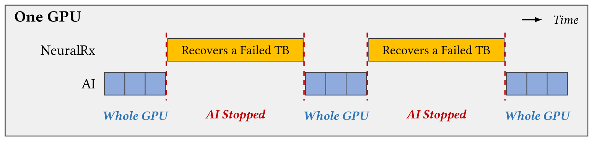</p>
<p align="center"><b>그림 1.</b> Antiphase의 동작. GPU 한 장의 시간축에서 NRx가 실패한 TB를 복구하는 동안 그 GPU의 AI는 멈추고, 그 밖의 시간에는 AI가 GPU 전체를 쓴다.</p>

**목차:** [1. 서론](#1-서론) · [2. 배경](#2-배경) · [3. 설계](#3-설계) · [4. 평가](#4-평가) · [5. 비용과 한계](#5-비용과-한계) · [6. 결론](#6-결론) · [7. 재현 방법](#7-재현-방법) · [8. 연구 경과](#8-연구-경과) · [9. 저장소 구조와 원본 파일](#9-저장소-구조와-원본-파일)

이 문서는 저장소의 단일 진입점이다. 모든 수치는 9장에 적은 원본 파일에서 나온 값이다. 디렉터리와 파일 이름(`backstop_slot`, `BACKSTOP_*.md`)과 코드 식별자(`backstop_units`)에는 이전 이름 Backstop이 남아 있다. 그림 안의 글자는 영어이고, NeuralRx는 본문의 NRx와 같다.

---

## 1. 서론

### 1.1 연구의 필요성: 한 GPU에 세 가지 작업

기지국은 셀의 uplink(UL) 신호를 수 ms 안에 복호해야 하고, 이 작업을 GPU에서 한다. 무선 작업은 GPU를 다 채우지 않는다. AI가 없는 서버에서 GPU에 아무 작업도 없는 시간은 전 부하에서 26%, 부하가 바뀌는 조건에서 37–43%다(4.7절). 가장 긴 무선 작업인 NRx가 쉬는 시간은 전 부하에서 64%다(4.12절). AI-RAN 서버는 이 시간을 AI 추론에 쓴다. 그러면 제한 시간이 서로 다른 세 가지 작업이 한 GPU에 놓인다.

<p align="center">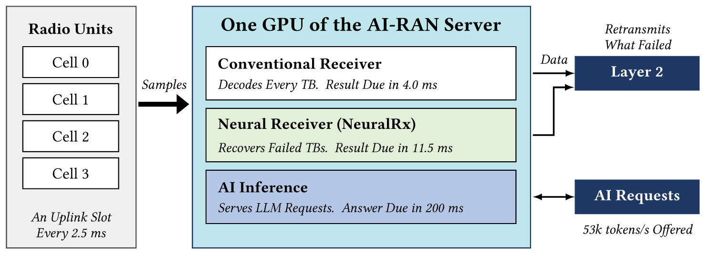</p>
<p align="center"><b>그림 2.</b> AI-RAN 서버의 GPU 한 장에서 도는 세 가지 작업. 왼쪽: 각 셀의 radio unit이 2.5 ms마다 UL 슬롯 하나의 샘플을 보낸다. 가운데: 기존 수신기, NRx, AI 추론과 각 작업의 제한 시간. 오른쪽: 복호한 데이터는 L2로 가고 L2는 실패한 TB를 재전송시킨다. AI 요청은 외부에서 들어온다(실험에서는 53k tokens/s 제공).</p>

| 작업 | 하는 일 | 제한 시간 |
|---|---|---|
| 기존 수신기 (NVIDIA Aerial cuPHY) | 모든 셀의 모든 TB를 복호한다 | 샘플 도착 4.0 ms 뒤 (L1 마감) |
| NRx (NVlabs `nrx_large`) | 기존 수신기가 실패한 TB를 신경망으로 다시 복호한다 | 샘플 도착 11.5 ms 뒤 (복구 마감) |
| AI 추론 | LLM 요청을 처리한다 | 요청마다 200 ms |

- 무선 작업은 2.5 ms마다 반복되고, AI 요청은 임의의 시점에 온다.
- 이 연구가 다루는 문제는 모든 무선 결과가 제시간에 나오게 하면서 AI에 GPU 시간을 최대한 많이 주는 것이다.

### 1.2 전송 블록의 두 마감

TB(transport block)는 한 사용자가 UL 슬롯 하나에 보내는 데이터다. TB에는 마감이 둘 있다.

<p align="center">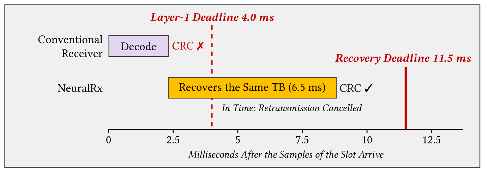</p>
<p align="center"><b>그림 3.</b> TB 하나의 시간축. 위: 기존 수신기는 2.3 ms 안에 끝나고 CRC가 실패한다. 아래: NRx는 같은 TB에 6.5 ms가 걸려 8.8 ms에 끝난다. 점선은 L1 마감(4.0 ms), 실선은 복구 마감(11.5 ms)이다.</p>

- **L1 마감 4.0 ms.** 기존 수신기의 결과는 샘플 도착 4.0 ms 뒤까지 나와야 한다. 모든 TB에 해당한다.
- CRC가 실패하면 그 TB는 재전송된다. 재전송은 새 데이터를 실을 수 있었던 UL 슬롯 하나를 쓴다.
- **복구 마감 11.5 ms.** NRx가 같은 샘플을 샘플 도착 11.5 ms 뒤까지 복호하면 재전송이 취소된다. 이것이 복구다.
- 기존 수신기의 복호는 마감이 이른 필수 작업이고, 복구는 마감이 늦은 선택 작업이다. 셀의 데이터 전송률을 올리는 것은 뒤의 작업이다. rate control이 MCS를 고를 때 복구 경로는 2-UE 셀의 goodput을 상관 높은 채널에서 11–40% 올린다(4.9절).
- 기존 연구의 무선 작업은 TB마다 작업 하나, 마감 하나다(2.6절). 두 마감의 값이 나온 근거는 3.4절에 있다.

### 1.3 기존 방법의 한계: GPU 비율은 NRx를 늦추고 복구를 잃게 한다

기존 방식은 AI에 GPU의 일정 비율을 준다. 고정 비율을 주거나, 낮은 우선순위에 한도를 두는 방식이다. 두 경우 모두 AI가 GPU에 항상 올라가 있고, NRx가 도는 동안에도 그렇다.

<p align="center">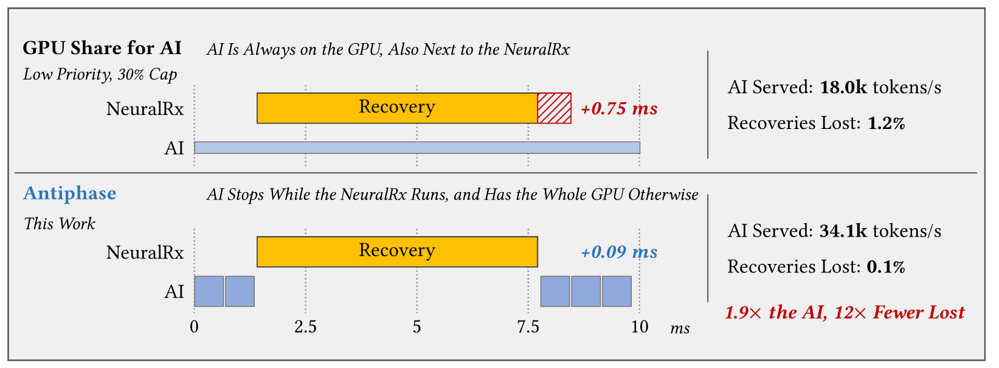</p>
<p align="center"><b>그림 4.</b> GPU 한 장의 두 시간축. 위: GPU 비율 방식(낮은 우선순위 + 30% 한도). AI 띠가 시간축 전체를 덮고, 빗금은 NRx의 늘어난 실행 시간이다. 아래: Antiphase. AI 조각은 NRx 실행의 앞뒤에만 있다. 오른쪽 수치는 16셀·GPU 4장 전 부하의 측정값이다(시드 5).</p>

- 비율 방식에서 NRx 실행은 0.75 ms 길어진다(낮은 우선순위 + 30%).
- 길어진 실행도 자기 복구 마감은 지킨다. 손실은 한 단계 뒤에 생긴다. NRx가 더 오래 붙잡혀 있어서 다음 실패 TB가 빈 NRx를 찾지 못하고 재전송된다. 이것이 **잃은 복구**다(2.4절).
- Antiphase에서는 실행이 0.09 ms 길어진다. 실행 중에 그 GPU의 AI가 멈추기 때문이다. 실행 밖에서는 AI가 비율에 묶이지 않고 GPU 전체를 쓴다.
- 전 부하에서 AI 처리량은 **34.1k tokens/s 대 18.0k(1.9배)**이고, 잃은 복구는 0.1% 대 1.2%다.
- 기존 수단 가운데 복구를 1.2% 이하로 잃는 것은 AI를 18k 이하로 처리하고, AI를 20k 넘게 처리하는 것은 복구를 4.9–6.3% 잃는다(2.3절).

문제를 한 문장으로 적으면 다음과 같다.

> 큰 NRx는 매 슬롯의 수신기로 쓸 수 없으므로 실패한 TB의 복구에 쓴다. 이 복구 경로는 기존 수신기, AI 추론과 같은 GPU를 쓴다. (a) 모든 TB의 L1 마감, (b) NRx가 복구하는 TB 수, (c) AI 요청의 응답 시간 제한을 함께 지키면서 AI 처리량을 가장 크게 하는 GPU 공유 방식이 필요하다.

### 1.4 접근: 기준 하나, 규칙 셋

> **무선을 먼저 지키고, 그 안에서 GPU를 AI에 쓴다. 지키는 기준은 "AI에 GPU의 몇 %를 줄 것인가"가 아니라 "NRx가 UL 슬롯 하나를 더 붙잡는 실행을 늘리지 않을 것"이다. 대표 조건에서 그 여유의 중앙값이 1.2 ms다.**

기준은 측정에서 찾은 손실 경로(2.4절)와 그 경로를 적은 모델(2.5절)에서 나온다. 세 규칙이 이 기준을 구현한다(3장).

- **규칙 1, 복구 경로.** 큰 NRx를 기존 수신기가 실패한 TB에만 돌리고, L1 마감보다 늦은 복구 마감을 따로 둔다. NRx 실행이 슬롯의 25%로 줄어 NRx를 지킬 수 있게 된다.
- **규칙 2, NRx가 도는 GPU의 AI를 멈춘다.** AI를 멈출 수 있는 짧은 조각으로 허락하고, 그 GPU의 NRx가 시작하면 조각을 멈춘다(중앙값 0.43 ms). NRx 실행 시간이 여유 안에 머문다.
- **규칙 3, 큰 AI 연산은 기존 수신기와 겹치지 않게 한다.** 시간 한도가 1.2 ms를 넘는 AI 단위는 그 GPU의 기존 수신기가 복호 중이 아닐 때만 허락한다. 기존 수신기가 L1 마감 안에 머문다.

세 규칙에는 GPU 수, 셀 수, NRx 수에 따라 정하는 값이 없다. 모든 실험에 설정 하나를 쓴다.

### 1.5 주요 결과

| 단계 | 무엇이 | Antiphase | 비교 | 절 |
|---|---|---|---|---|
| **1. 무선을 지키는가** | 무선 처리량 | rate control이 MCS를 고르는 마흔두 조건(Es/No 일곱 값, 채널 셋, 계단과 연속으로 변하는 채널, 섞인 채널) 모두에서 2-UE 셀의 goodput 손실(조건별 평균)이 **0.5% 이하**다. 41개 조건은 0.3% 이하이고, 손실이 가장 큰 조건(2-UE 셀 8개·목표 1%, NRx 수요가 용량 근처)은 0.36%다(시드 아홉 개, 실행 16개의 평균; 표준오차 0.08%p, 측정별 0.0–0.7%). 시드별로 묶은 평균은 0.43%이고 95% 구간은 0.29–0.57%다. 같은 조건에서 낮은 우선순위 + 30%는 2.25%를 잃는다(실행 14개, Antiphase의 6.3배; 4.9.10절). 설정은 하나다 | GPU 비율 방식은 조건에 따라 잃는다: 고정 10% 최대 1.1%, 낮은 우선순위 + 30% 최대 2.3%, 한도 없음 최대 8.2%. 2-UE 셀 8개에서는 한도를 10%로 내려도 0.8–0.9%를 잃는다. **모든 조건을 지키는 한도 값이 없다** | 4.9 |
| | L1 지연 | AI를 넣어도 L1 복호 지연(p99.9)이 **0.04–0.06 ms** 는다 (정상 상태) | 비율 방식은 0.14–0.87 ms 늘린다. **2.8–21배** | 4.7 |
| | L1 마감 | 실행 시작 구간이 지난 뒤 L1 마감을 넘는 TB가 **AI 없는 서버와 같다**: 16셀 3 / 320만, GPU 1장 0 / 80만, 20셀 3 / 230만, 48셀 17 / 192만 | AI 없는 서버 0, 0, 2, 17개. 고정 10%는 GPU 1장에서 46개, 낮은 우선순위 + 30%는 21개, 한도 없음은 16셀에서 174개 | 4.8 |
| | NRx와 복구 | NRx 실행 시간이 **0.07–0.09 ms** 늘고 복구를 **99.9%** 유지한다 | 비율 방식은 NRx를 0.44–1.71 ms 늦춘다(**5.2–19배**). 부하가 바뀌면 추정기 방식은 복구를 2.2–4.7% 잃는다 | 4.7, 4.11 |
| **2. GPU를 얼마나 쓰는가** | AI 처리량 | 34.1k–44.7k tokens/s | 고정 10%의 **6.4–7.5배**, 낮은 우선순위 + 30%의 **1.9–2.0배**, 낮은 우선순위 + 추정기(구현한 기존 수단 가운데 가장 강한 조합)의 **1.2–1.9배** | 4.10, 4.11 |
| | 오프라인 참조값 대비 | 뒤에 올 실패를 모두 아는 오프라인 스케줄이 처리할 것으로 추정한 AI의 **70%**를 처리한다 (AI가 GPU를 쓰는 시간으로는 64%) | 복구를 지키는 기존 수단은 11–37%. **1.9–6.4배** | 4.12 |
| | AI 응답 시간 | 요청 지연 p99가 **175–187 ms**로 제한(200 ms) 안이다 | 부하가 바뀔 때 추정기를 쓰는 두 방식은 388–528 ms | 4.7 |
| **3. AI를 더 처리하는 방식** | 무선에서 치르는 값 | – | 낮은 우선순위 + 70%와 한도 없음은 AI를 1.1–1.4배(rate control에서는 최대 4.2배) 처리하고, 복구 2.7–6.3%, goodput 0.4–8.2%(상관 낮은 채널에서는 0.0–0.4%), L1 꼬리 최대 0.89 ms를 낸다. 같은 한도의 값이 부하와 채널에 따라 바뀐다 | 5.1 |
| **지키는 것의 값** | 복구 경로 | rate control이 MCS를 고를 때 2-UE 셀의 goodput을 상관 높은 채널에서 **11–40%**, 상관 낮은 채널에서 4–9% 올린다 (고정 MCS에서는 5.6%) | 복구 경로가 없는 서버 | 4.18, 4.9 |
| **손실 예측** | 모델 | 672개 실험의 복구 손실을 **평균 오차 0.82%p**로 계산한다 | 모델이 없으면 방식마다 실험으로 확인해야 한다 | 4.13 |

측정 조건: A100 GPU 4장, 100 MHz 셀 16개, 초당 53k token 분량의 LLM 요청(200 ms 안에 끝나야 함). 세 가지 무선 부하(계속 전 부하, 2초마다 바뀜, 무작위로 바뀜)를 시드 5개로 쟀다.

<p align="center">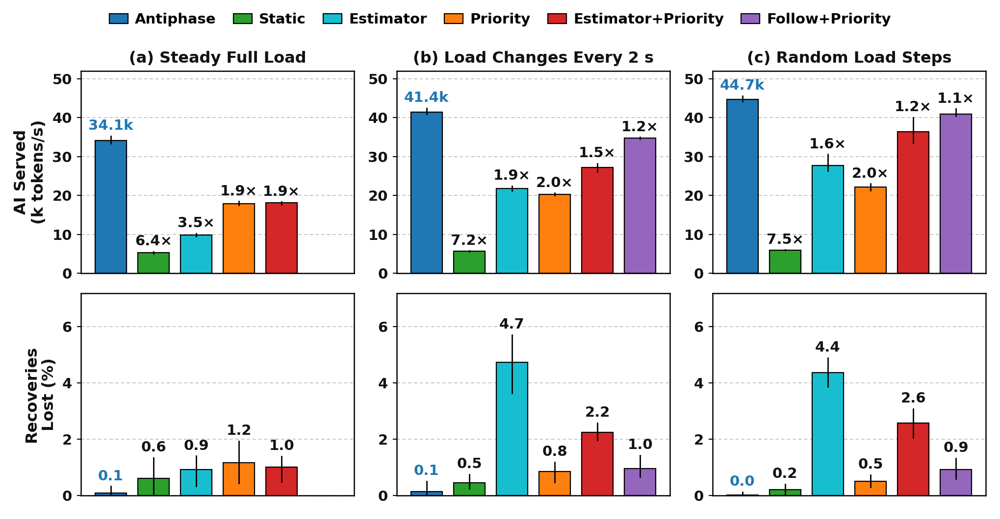</p>
<p align="center"><b>그림 5.</b> 세 가지 무선 부하에서의 AI 처리량(위)과 잃은 복구(아래). 방식 이름은 4.2절의 표에 있다.</p>

- 위 줄은 AI 처리량, 아래 줄은 잃은 복구다. **세 부하 조건 모두에서 Antiphase가 복구를 가장 적게 잃고, 그림의 방식 가운데 AI를 가장 많이 처리한다.**
- 기준선 막대 위의 숫자는 "Antiphase가 그 방식보다 AI를 몇 배 처리하는가"다. 전 부하에서 Static의 6.4배, Estimator의 3.5배, Priority와 Estimator+Priority의 1.9배다.
- 부하가 바뀌면 추정기를 쓰는 두 방식은 결정이 1초 늦어 복구를 2.2–4.7% 잃는다. Antiphase는 0.0–0.1%다.
- 기준선은 GPU 몫을 늘려서 Antiphase를 따라오지 못한다. Priority의 한도를 30%에서 50%로 올리면 AI는 32.7k로 Antiphase(34.1k)에 가까워지지만 잃은 복구가 1.2%에서 4.5%로 는다(4.10절).
- 뒤에 올 실패를 모두 아는 오프라인 스케줄이 복구를 잃지 않고 처리할 것으로 추정한 AI를 100%로 두면, Antiphase는 그 70%를 처리하고 복구를 지키는 기존 수단은 11–37%를 처리한다. 이 100%는 추정한 참조값이고 증명한 상한이 아니다(4.12절).
- NRx와 AI를 넣은 서버에서 무선 작업의 지연은 0일 수 없다. 무엇이 얼마를 더하는지는 세 단계(기존 수신기만, NRx 추가, AI 추가)로 나눠 4.7절에 적었다. L1 꼬리를 가장 크게 늘리는 것은 NRx이고(p99.9 +1.5 ms), Antiphase의 AI는 그 위에 0.03–0.04 ms를 더한다.

### 1.6 기여와 적용 범위

<p align="center">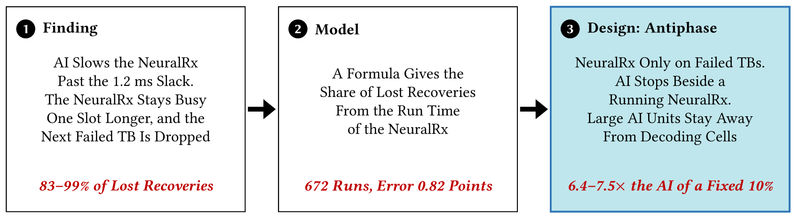</p>
<p align="center"><b>그림 6.</b> 새로운 점 세 가지와 그 관계. 발견이 제어할 양을 정하고, 모델이 그 양을 수치로 바꾸고, 설계가 실행 시간을 그 수치 안에 둔다.</p>

| # | 새로운 점 | 한 문장 | 근거 |
|---|---|---|---|
| 1 | **발견: AI가 복구를 잃게 만드는 경로** | AI가 NRx를 1.2 ms 넘게 늦추면 NRx가 GPU를 한 슬롯 더 붙잡고, 그 사이에 실패한 다음 블록은 갈 NRx가 없어 버려진다. NRx 자체는 마감을 지키므로 마감 검사로는 보이지 않는다 | 잃은 복구의 83–99%가 이 경로다 (2.4절) |
| 2 | **모델: 복구 손실을 계산하는 식** | NRx를 "기다릴 수 없는 손님을 받는 창구"로 보고, NRx 실행 시간에서 잃는 복구의 비율을 계산한다 | 672개 실험을 평균 오차 0.82%p로 맞춘다. 한 조건은 실험 전에 계산해 0.7%p 안에서 맞았다 (2.5, 4.13절) |
| 3 | **설계: Antiphase** | 큰 NRx를 실패한 블록에만 쓰고, NRx가 도는 GPU의 AI는 곧바로 멈추며(중앙값 0.43 ms), 큰 AI 연산은 기존 수신기와 겹치지 않게 한다 | AI 처리량이 고정 10%의 6.4–7.5배이고 복구는 99.9%다 (3.1, 4.10, 4.11절) |

- 세 가지는 이어진다. 발견은 제어할 양을 정한다: NRx가 GPU를 붙잡는 시간이다. 모델은 그 양을 수치로 바꾼다: 증가 1.2 ms 이하다. 설계는 실행 시간을 그 수치 안에 두고 GPU의 나머지를 AI에 쓴다.
- 기존 연구와 공유하는 것: AI를 작은 단위로 나누는 것, 낮은 우선순위로 실행하는 것, 낮은 우선순위 작업을 멈추는 것은 기존 GPU 스케줄러에 있다(2.6.3절). 새로운 것은 AI를 허락하는 기준이다.
- 주장하지 않는 것: NRx 자체가 새롭다는 것, 기존 연구의 원래 시스템보다 낫다는 것. 비교는 그 방식을 이 저장소의 런타임에 구현해서 했다(4.2, 5.4절).

기존 연구와의 차이는 한 줄이다. **무선 작업과 AI가 GPU를 나누는 연구는 NRx를 다루지 않고, NRx 연구는 AI와 GPU를 나누지 않는다.** 이 연구는 둘을 한 GPU에 올리고, 그때 생기는 손실을 설명하고 막는다(2.6절).

적용 범위는 다음과 같다.

| 다루는 것 | 다루지 않는 것 |
|---|---|
| Uplink 데이터 채널(PUSCH)의 수신 | Downlink, 제어 채널 |
| NVIDIA cuPHY와 공개 NRx 모델(NVlabs) | NRx 모델 자체의 개선 |
| A100 GPU 1–4장, 셀 4–48개, MPS | 다른 GPU, 여러 서버에 걸친 배치 |
| LLM 프롬프트 처리와 토큰 생성, 임베딩, 이미지 분류 (모델 4개) | 모델 교체, GPU 메모리 부족 |
| 미리 생성한 무선 신호(IQ)의 재생 | 실제 안테나와 실측 채널 |
| 재전송과 goodput의 계산, outer loop를 넣은 MCS 선택 | 실제 L2 스택과 HARQ |

AI를 Antiphase보다 더 처리하는 방식(낮은 우선순위 + 70%, 한도 없음)은 그만큼을 무선에서 낸다. 그 값은 5.1절에, Antiphase 자신의 비용과 범위는 5.2절에 적었다.

### 1.7 용어

<p align="center">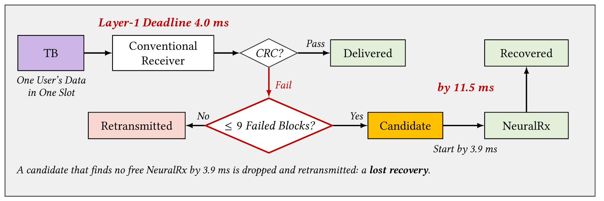</p>
<p align="center"><b>그림 7.</b> TB 하나의 흐름. 기존 수신기가 복호하고 CRC가 통과하면 전달된다. 실패하면 슬롯의 실패 code block 수를 보고, 9개 이하이면 후보가 되어 NRx로 간다. NRx가 복구 마감 안에 복호하면 복구되고, 그렇지 않으면 재전송된다.</p>

| 용어 | 뜻 |
|---|---|
| TB (transport block) | 한 슬롯에 한 사용자가 보내는 데이터 블록 |
| 기존 수신기 | NVIDIA Aerial cuPHY. 모든 TB를 복호한다 |
| NRx | Neural receiver. 채널 추정부터 복조까지를 신경망으로 하는 수신기 |
| 복구 | 기존 수신기가 실패한 TB를 NRx가 복호해 재전송을 없애는 것 |
| 복구 유지율 | AI를 넣은 서버가 복구한 TB 수 ÷ AI 없는 서버가 복구한 TB 수. 100%에서 뺀 값이 "잃은 복구"다 |
| 후보 | NRx로 보낼 실패 TB. 실패 code block이 K개 이하인 슬롯의 TB다 |
| L1 마감 | 기존 수신기의 결과가 나와야 하는 시각. 샘플 도착 4.0 ms 뒤 |
| 복구 마감 | NRx 결과가 이때까지 나와야 재전송을 취소할 수 있다. 샘플 도착 11.5 ms 뒤 |
| 2-UE 셀 | 두 사용자가 같은 자원을 쓰는 셀. 기존 수신기가 자주 실패해 NRx가 필요하다 |
| AI 처리량 | 시간 제한(200 ms) 안에 끝난 요청의 token 수(초당) |
| AI 조각 | Controller가 한 번에 허락하는 AI 실행 구간. 최대 4 ms |
| AI 단위 | GPU에 한 번에 올리는 연산 묶음. 크기 등급마다 잰 시간 한도가 0.45–1.33 ms다 |
| 고정 N% | MPS로 AI에 GPU thread의 N%를 고정해 주는 방식 |
| 낮은 우선순위 + N% | AI를 낮은 MPS 우선순위로 돌리고 N% 한도를 두는 방식. "한도 없음"은 한도를 두지 않은 것이다 |
| 추정기 방식 | 학습된 추정기가 1초마다 AI의 GPU 몫을 고르는 방식. YinYangRAN의 설계를 재구성했다 |
| 부하 따라 비율 | 무선 부하를 지연 없이 알고 AI의 몫을 바꾸는 방식. 전환 비용이 0인 이상화다 |

---

## 2. 배경

### 2.1 두 수신기: 빠른 기존 수신기와 느린 NRx

기존 수신기는 채널 추정, 등화, 복조(demapping), LDPC 복호, CRC를 차례로 수행하고 슬롯 하나에 0.8–0.9 ms가 걸린다. NRx는 앞의 세 단계를 신경망 하나로 대신하고 LDPC 복호기는 그대로 쓴다.

<p align="center">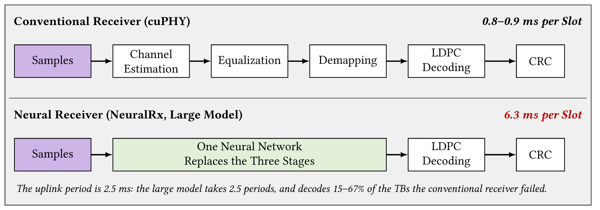</p>
<p align="center"><b>그림 8.</b> 두 수신기의 단계. 위: 기존 수신기. 아래: NRx. 신경망 하나가 채널 추정, 등화, 복조를 대신한다. 오른쪽 시간은 슬롯 하나에 드는 GPU 시간이고 셀과 함께 돌 때의 측정값이다. 두 수신기는 모든 비교에서 같은 LDPC 복호기를 20회 반복으로 쓴다.</p>

두 수신기의 LDPC 반복 횟수를 20회로 맞추고 공개 NRx(NVlabs `neural_rx`)의 두 모델을 cuPHY와 같은 슬롯에서 비교했다(4.4절).

| NRx 모델 | cuPHY가 실패한 TB 가운데 추가로 복호 | 실행 시간 | UL 주기(2.5 ms) 대비 |
|---|---|---|---|
| 실시간용 `nrx_rt` | 2% (상관 낮은 채널, UMi). 상관이 중간 이상인 채널에서만 21–38% | 엔진 1.35 ms | 0.5배 |
| 큰 모델 `nrx_large` | **15–67%** (시험한 세 채널 모두) | 혼자 5.3 ms, 셀과 함께 **6.3 ms** | **2.1–2.5배** |

- 확실히 더 살리는 것은 큰 모델뿐이다.
- 큰 모델은 UL 주기보다 2.5배 길어 매 슬롯에 돌릴 수 없다.
- 반복 횟수를 맞추지 않으면 실시간용 모델이 cuPHY 실패의 25–35%를 복호하는 것처럼 보인다. 20회로 맞추면 2%다. NVlabs의 NRx 평가는 LDPC 20회를 쓰고 cuPHY의 기본 설정은 이 연구의 TB 크기에서 10회다. 초기에 보고한 "NRx가 기존 실패의 62%를 복호한다"는 cuPHY 10회 기준에서만 성립했고 철회했다(5.3절).

### 2.2 큰 NRx는 실패한 TB에만 쓴다

큰 모델은 느리므로 쓰는 방법이 둘이다. 주 수신기로 두고 처리할 수 있는 슬롯을 모두 복호하게 하거나, 기존 수신기가 모든 TB를 복호하고 NRx에는 실패한 TB만 주는 것이다.

<p align="center">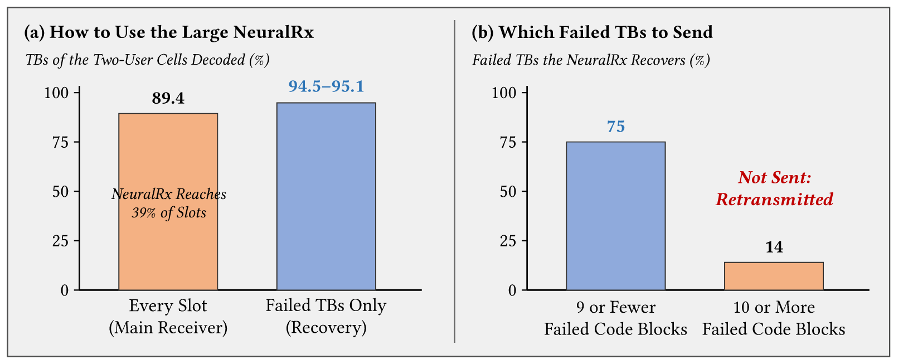</p>
<p align="center"><b>그림 9.</b> (a) 큰 모델을 쓰는 두 방법에서 2-UE 셀의 TB 가운데 복호된 비율(2-UE 셀 4개, AI 없음). (b) 슬롯의 실패 code block 수에 따라 NRx가 복구한 실패 TB의 비율(채널 혼합: 167개 중 125개, 170개 중 24개).</p>

- 주 수신기로 쓰면 NRx가 슬롯의 39%만 처리하고 2-UE 셀의 복호 성공이 89.4%다.
- 실패한 TB에만 쓰면 94.5–95.1%다. 상관 낮은 채널의 단독 복호에서 NRx 실행은 슬롯 300개 중 74개(25%)이고, 복호 결과는 모든 슬롯에 돌린 것과 같다(TB 600개 중 572개, 4.5절).
- **결정 1.** 기존 수신기가 모든 TB를 복호하고 NRx는 실패한 TB만 받는다. 이것이 복구 경로다.
- 실패한 TB를 모두 보낼 필요는 없다. 슬롯의 code block이 많이 실패했으면 NRx도 거의 성공하지 못한다. UMi 채널에서 code block이 전부 실패한 TB는 2%만 복구된다.
- **결정 2.** 슬롯의 code block 20개 가운데 실패가 9개 이하일 때만 후보로 삼는다. UMi 채널에서 NRx 실행이 85% 줄고 복구는 5% 준다(4.6절).

### 2.3 현재의 GPU 공유 방식: AI에 일정 비율을 준다

GPU를 나누는 기존 수단은 비율과 우선순위다. 방식들은 AI의 비율을 정하는 방법에서 서로 다르다.

<p align="center">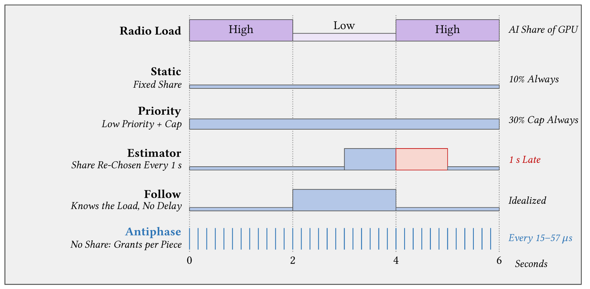</p>
<p align="center"><b>그림 10.</b> 무선 부하가 2초마다 높음과 낮음을 오가는 동안 각 방식이 AI에 주는 GPU 몫. 빨간 블록은 추정기 방식이 부하가 오른 뒤에도 1초 동안 큰 몫을 주는 구간이다. 높이는 동작 방식을 나타낸 것이고, 실험 설정값은 10%와 30%다.</p>

- **고정 비율 (Static).** MPS로 AI에 GPU의 10%를 고정으로 준다. AI-RAN 실험의 고정 분할에 해당한다.
- **낮은 우선순위 + 한도 (Priority).** AI를 낮은 MPS 우선순위로 돌리고 30% 한도를 둔다.
- **추정기 (Estimator).** 학습된 추정기가 1초마다 안전한 가장 큰 비율을 고른다(YinYangRAN 설계의 재구성). 비율을 바꾸면 AI가 0.27초 멈춘다.
- **부하 따라 비율 (Follow).** 무선 부하를 지연 없이 알고 전환 비용이 0인 이상화다.
- 어느 방식에서나 NRx가 도는 동안 AI가 GPU에 남아 있다. 결정 간격은 초 단위인데 NRx 실행은 6.3 ms 안에 시작하고 끝난다. Antiphase에는 비율이 없고, 15–57 µs마다 조각 단위로 결정한다.

기존 수단은 "AI를 많이"와 "복구를 지킴"을 함께 얻지 못한다. 16셀, GPU 4장에서 큰 모델을 복구에 쓰고 AI를 같은 GPU에 넣었다(전 부하, 4.10절).

| 기존 수단 | AI 처리량 (tokens/s) | 잃은 복구 |
|---|---|---|
| GPU에 무선 작업이 없을 때만 AI | 4.7k | 0.3% |
| 고정 10% | 5.3k | 0.6% |
| 추정기 방식 | 9.8k | 0.9% (부하가 2초마다 바뀌면 4.7%) |
| 낮은 우선순위 + 30% 한도 | 18.0k | 1.2% |
| 고정 30% | 20.2k | 4.9% |
| 낮은 우선순위 + 70% 한도 | 42.4k | 5.6% |
| 낮은 우선순위, 한도 없음 | 49.0k | 6.3% |

- 복구를 1.2% 이하로 잃는 수단은 AI를 18k 이하로 처리한다.
- AI를 20k 넘게 처리하는 수단은 복구를 4.9–6.3% 잃는다.
- Antiphase는 34.1k를 처리하고 복구를 0.1% 잃는다.

"무선 작업이 없을 때만 AI"는 이전 규칙의 실험에서 잰 값이다(4.19절).

### 2.4 발견: AI는 NRx가 GPU를 한 슬롯 더 붙잡게 한다

기존 수단이 복구를 잃는 이유는 NRx가 마감을 넘겨서가 아니다. 측정에서 찾은 경로는 다음과 같다.

1. **실패한 TB는 기다릴 수 없다.** 샘플 도착 3.9 ms 안에 NRx를 시작해야 복구 마감(11.5 ms)을 지킨다. 그때 빈 NRx가 없으면 그 TB의 복구 기회는 사라진다.
2. **NRx는 혼자 돌 때 UL 슬롯 두 개 동안 바쁘다.** 실행 시간이 6.3 ms이므로, 한 TB를 받으면 두 슬롯 뒤의 TB부터 다시 받을 수 있다. 이때 남는 여유가 1.2 ms다.
3. **AI가 NRx를 1.2 ms 넘게 늦추면 세 슬롯 동안 바쁘다.** 비율 한도와 낮은 우선순위는 NRx를 1–2 ms 늦춘다. NRx는 여전히 복구 마감 안에 끝나지만, 한 슬롯 더 붙잡힌 동안 실패한 TB는 빈 NRx를 찾지 못한다.

<p align="center">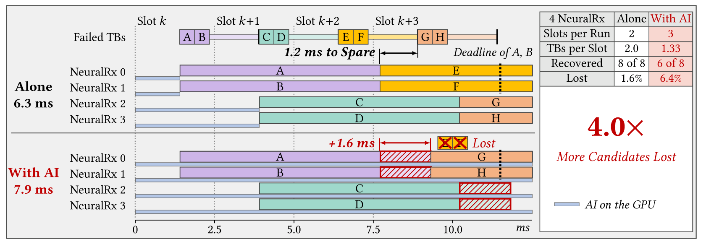</p>
<p align="center"><b>그림 11.</b> NRx 4개에 슬롯마다 실패 TB가 2개씩(A–H) 오는 예. 위: NRx가 혼자 돌면 실행(6.3 ms)이 두 슬롯 뒤의 TB가 시작해야 하는 시각보다 1.2 ms 먼저 끝나 8개를 모두 복구한다. 아래: AI 옆에서 실행이 7.9 ms가 되면 0.4 ms 늦어 E와 F를 잃는다.</p>

- 그림은 NRx 4개에 슬롯마다 실패 TB가 2개씩(A–H) 오는 예를 실제 시간축(ms)에 그린 것이다. TB는 어디서나 같은 색이다(슬롯 k 보라, k+1 청록, k+2 금색, k+3 주황). TB 뒤의 옅은 띠는 그 TB가 NRx에서 시작할 수 있는 구간이고, 띠 끝의 세로줄이 가장 늦은 시작 시각이다. 가는 파란 띠는 그 GPU에서 도는 AI다.
- 위: NRx가 혼자 돌면(6.3 ms) 1.4 ms에 시작한 실행이 7.7 ms에 끝난다. E, F의 가장 늦은 시작(8.9 ms)보다 1.2 ms 이르다. E, F는 A, B가 쓰던 NRx를 받고 8개를 모두 복구한다. NRx 하나가 두 슬롯을 붙잡으므로 NRx 4개는 슬롯당 TB 4 / 2 = 2.0개를 받는다.
- 아래: AI 옆에서 7.9 ms가 되면 실행이 9.3 ms에 끝난다. 자기 복구 마감(11.5 ms)보다는 이르지만 E, F의 가장 늦은 시작보다 0.4 ms 늦다. E, F를 잃고 8개 중 6개만 복구한다. NRx 하나가 세 슬롯을 붙잡으므로 슬롯당 4 / 3 = 1.33개만 받는다.
- 16셀 측정(시드 5)에서 버린 후보는 AI가 없을 때 1.6%, 낮은 우선순위 AI(한도 없음)일 때 6.4%로 4.0배다(4.14절).

잃은 복구를 원인별로 나눈 측정은 다음과 같다.

| 측정 | 값 |
|---|---|
| 잃은 복구 가운데 "빈 NRx가 없어 시작하지 못함" | 83–99% |
| 잃은 복구 가운데 "NRx가 복구 마감 뒤에 끝남" | 17% 이하 |
| NRx 실행 시간: 혼자 / 낮은 우선순위 AI 옆 | 6.3 ms / 7.3–8.0 ms (복구 마감 11.5 ms 안) |
| NRx가 붙잡히는 UL 슬롯 수: 혼자 / AI 옆 | 2 / 3 |
| 세 슬롯을 붙잡는 실행의 비율: AI 없음 / 낮은 우선순위만 | 10% / 88% |

- AI를 넣은 실행에서 잃은 복구를 AI 없는 실행과 TB 단위로 대조해 원인을 나눴다.
- NRx는 AI 옆에서도 복구 마감을 지킨다. 따라서 "NRx가 제때 끝나는가"만 보는 검사는 이 손실을 찾지 못한다.
- 기존 연구는 NRx를 GPU 공유 대상으로 다루지 않으므로 이 경로를 다루지 않는다.

### 2.5 모델: 잃는 복구의 비율은 NRx 실행 시간에서 정해진다

발견한 경로는 식으로 적을 수 있다. NRx를 창구로, 실패 TB를 빈 창구가 없으면 떠나는 손님으로 두는 손실 시스템이다. 손실 시스템이라는 틀은 대기열 이론의 것이다. 이 연구가 더한 것은 복구 경로를 그 틀로 옮긴 것(슬롯마다 묶음으로 오는 도착, 슬롯 수로 끊기는 점유, 시작 한계 L, 연속한 슬롯의 도착 상관)과 측정과의 대조다.

슬롯 k에서 오프셋 s에 시작한 실행이 그 NRx를 붙잡는 슬롯 수는 다음과 같다.

```text
h = ceil((s + S − L) / P)        P = UL 주기 2.5 ms,  L = 가장 늦은 시작 3.9 ms,  S = NRx 실행 시간
```

- s = 1.4 ms에서 S = 6.3 ms(혼자)면 h = 2다. S가 7.5 ms를 넘으면 h = 3이다.
- 그 사이의 여유는 `2P + L − c − S = 8.9 − 1.4 − 6.3 = 1.2 ms`다(c는 기존 수신기 결과가 나오는 시각).
- 닫힌 형태는 NRx마다 상태(비어 있음, 이번 슬롯에 풀림, 1·2·3슬롯 더 붙잡힘)를 둔 Markov chain이다. 입력은 넷이다: NRx 수, 슬롯당 후보 수의 전이 행렬, 기존 수신기 결과가 나오는 시각의 분포, NRx 실행 시간의 분포. 방식의 차이는 뒤의 두 분포로만 들어간다.

| 검증 | 값 |
|---|---|
| 대조한 실험 | 672개 (NRx 1·2·4개, 4–48셀, 방식과 설정 35가지) |
| 계산한 손실과 실측의 상관 | 0.994 |
| 평균 절대 오차 | 0.82%p |
| 모델을 정한 뒤에 잰 260개 실험의 오차 | 0.61%p |
| 실험 전에 계산한 예측 (20셀, NRx 시간 한도 변경) | 실측과 0.0–0.7%p 차이 |

**모델이 주는 설계 기준.** 목표는 "AI에 GPU의 몇 %를 줄 것인가"가 아니라 "3슬롯 실행의 비율을 AI 없는 서버의 값에 둘 것"이다. 실행이 3슬롯이 되는 조건은 `c + S > 2P + L`이고, 여유 `2P + L − c − S`는 실행마다 다르다. 1.2 ms는 c와 S가 중앙값일 때의 여유다. AI가 없어도 c가 늦은 실행은 3슬롯이 된다(실행별 분포는 4.13.2절).

| 방식 | NRx 실행 시간의 증가 (중앙값) | 3슬롯 실행 (AI 없음 10%) | 잃은 복구 |
|---|---|---|---|
| Antiphase | +0.09 ms | 11% | 0.1% |
| 낮은 우선순위 + 30% | +0.75 ms | 30% | 1.2% |
| 낮은 우선순위 + 70% | +1.33 ms | 86% | 5.6% |
| 낮은 우선순위, 한도 없음 | +1.72 ms | 88% | 6.3% |

검증의 세부와 예측 대 실측 그림은 4.13절에 있다(그림 32).

### 2.6 기존 연구

<p align="center">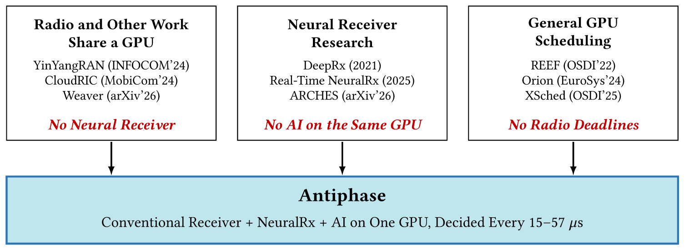</p>
<p align="center"><b>그림 12.</b> 기존 연구의 세 갈래와 각 갈래에 빠진 요소. Antiphase는 기존 수신기, NRx, AI를 한 GPU에 올린다.</p>

세 갈래의 기존 연구가 있고, 어느 것도 이 문제를 다루지 않는다.

| 갈래 | 하는 일 | 빠진 것 |
|---|---|---|
| 무선과 다른 작업이 GPU를 나누는 연구 (2.6.1절) | LDPC 복호나 기존 PHY와 다른 작업 사이에서 GPU 몫을 정한다. 결정 간격은 1초 이상이다 | NRx가 없다. TB마다 작업 하나, 마감 하나만 있다 |
| Neural receiver 연구 (2.6.2절) | NRx 모델과 복호 성능을 다룬다 | 같은 GPU의 AI가 없다 |
| 일반 GPU 스케줄링 연구 (2.6.3절) | 우선순위가 높은 작업의 지연을 지킨다 | 무선 마감이 없다. NRx가 GPU를 붙잡는 시간은 보지 않는다 |

Antiphase는 기존 수신기, NRx, AI를 한 GPU에 올리고 15–57 µs마다 결정한다.

#### 2.6.1 무선과 다른 작업이 GPU를 나누는 연구

| 연구 | GPU의 무선 작업 | NRx | 외부 AI | GPU를 나누는 방법 | 결정 간격 | 확인 범위 |
|---|---|---|---|---|---|---|
| YinYangRAN (INFOCOM'24) | LDPC 복호 | 없음 | 트래픽 예측 모델 추론 | MPS 비율. 학습된 신뢰도 추정기가 비율 선택 | 1초 이상. 비율 변경 0.27초 동안 무선은 CPU로 처리 | 원문 |
| CloudRIC (MobiCom'24) | LDPC 복호. 여러 DU가 CPU와 GPU pool 공유 | 없음 | 없음 | 요청마다 처리기 선택 | 요청 단위 | 원문 |
| Concordia (SIGCOMM'21) | CPU vRAN 전체 (GPU 아님) | 없음 | 일반 CPU 작업 | 무선이 쓸 core를 예측해 예약 | – | 이전 검토 |
| AI-RAN 실험 (SoftBank·NVIDIA, arXiv'25) | Aerial 5G (4T4R, 100 MHz) | 동시 실행 실험에 없음 | LLM | MIG 40% / 60% 고정 분할 | 고정 | 원문 |
| Interplay (INFOCOM'25 WS), CAORA (arXiv'25) | 작업량 수준 모델 | 없음 | AI | MIG 동적 분할 | orchestrator | 이전 검토 |
| SMEC (NSDI'26) | srsRAN (별도 서버) | 없음 | MEC GPU 작업 | MEC 서버에서 MPS 우선순위 | – | 이전 검토 |
| Weaver (arXiv'26, 2609.35276) | LDPC 복호 (OAI) | 없음 | foundation model 학습 (시간 제한 없음) | CUDA green context로 SM을 나눔. 슬롯의 MCS와 PRB에서 무선이 쓸 SM 수를 정하고, MAC scheduler가 그 수요를 고르게 만듦 | 슬롯 | 원문 요약 |
| **Antiphase** | cuPHY PUSCH 전체 + **NRx** | **있음** | LLM 프롬프트 처리와 토큰 생성, 임베딩, 이미지 분류 (모델 4개) | 낮은 우선순위 AI를 조각 단위로 허락하고 NRx가 시작하면 중단 | 15–57 µs | – |

평가 규모는 다음과 같다.

| 연구 | 무선 규모 | GPU | 외부 AI | 무선 입력 |
|---|---|---|---|---|
| YinYangRAN | 100 MHz DU 1개 | A100 1장 | 있음 | 모의 RU·UE |
| CloudRIC | 100 MHz DU 최대 30개 | V100 1장 + CPU pool | 없음 | 모의 RU·UE |
| AI-RAN 실험 | gNB 1개 | GH200의 GPU 1장 | 있음 | 실제 망 |
| ARCHES | 셀 1개 | GH200 | 없음 | 실제 망 |
| Weaver | gNB 1개 (학습은 8곳의 GPU 클러스터와 모의) | DGX Spark, L40S | 있음 (학습) | USRP와 실제 단말, 모의 UE |
| **Antiphase** | 100 MHz 셀 4–48개 | A100 1–4장 | 있음 | 미리 생성한 IQ |

- 이 연구들의 GPU 무선 작업은 LDPC 복호 또는 기존 PHY다. 확인한 범위에서 NRx를 무선 작업에 넣고 외부 AI와 GPU를 나눈 연구는 없다.
- 이 연구들의 무선 작업은 TB마다 필수 작업 하나이고 마감도 하나다. Antiphase의 무선 작업은 필수 작업(기존 수신기)과 선택 작업(NRx 복구) 둘이고 마감도 둘이다.
- 셀 수만 보면 CloudRIC이 같은 규모다. 외부 AI와 GPU를 나누는 연구 가운데서는 확인한 범위에서 Antiphase의 평가 규모가 가장 크다.
- Antiphase의 입력은 미리 생성한 IQ이고, AI-RAN 실험과 ARCHES는 실제 망이다.
- Weaver는 GPU를 SM으로 나눠(공간) 격리하고, Antiphase는 NRx가 도는 동안 AI를 세워(시간) 나눈다. Weaver의 무선 작업은 LDPC 복호이고 NRx가 없다. 같은 수단(green context)을 이 testbed에 구현해 쟀다: NRx는 SM을 26% 내주면 실행이 15% 길어져 여유(1.2 ms)의 70%를 쓰고, AI를 항상 SM 조각에 두는 방식은 Antiphase보다 goodput을 더 잃는다(4.9.10절). Weaver 시스템을 실행한 것은 아니다.

#### 2.6.2 Neural receiver 연구

| 연구 | 다루는 것 | 외부 AI와 GPU 공유 | 확인 범위 |
|---|---|---|---|
| DeepRx (2021), 5G NR MU-MIMO NRx (2023) | NRx 모델과 BLER | 없음 | 참고문헌 |
| 실시간 NRx (NVIDIA, 2025) | A100에서 1 ms 안에 도는 NRx, site-specific 미세 조정 | 없음 | 초록 |
| ARCHES (arXiv'26) | Aerial PUSCH 안에서 AI 채널 추정기와 MMSE 추정기를 슬롯 경계에서 전환 | 없음 | 원문 |
| OCUDU dApp (arXiv'26) | 수신 체인 안의 신경망 equalizer. 기존 경로를 항상 유지 | 초록에 없음 | 초록 |

- 이 연구들은 NRx의 복호 성능과 수신기 전환 시점을 다룬다. NRx가 쓰는 GPU 시간이 다른 작업의 마감에 주는 영향과, 남는 GPU를 AI에 줄 수 있는 양은 다루지 않는다.
- NVlabs의 NRx 평가는 LDPC 20회를 쓰고 cuPHY의 기본 설정은 이 연구의 TB 크기에서 10회다. 반복 횟수를 맞춘 비교는 확인한 범위에서 없다(2.1절).
- 복호가 늦어질 때의 HARQ를 다룬 연구로 Nuberu(MobiCom'21)가 있다. 자원이 부족한 가상화 DU에서 복호가 끝나기 전에 복호 가능 여부를 추정해(early HARQ) 응답 시각을 지킨다. Antiphase는 추정하지 않는다. NR의 UL HARQ가 비동기인 점을 써서, 복구 결과가 나올 때까지 재전송 grant를 미룬다(3.4절).

#### 2.6.3 일반 GPU 스케줄링 연구

| 연구 | 끼워 넣는 단위 | 넣어도 되는지 판단하는 기준 | 무선 마감 계산 |
|---|---|---|---|
| REEF (OSDI'22) | GPU kernel | 우선순위. 높은 우선순위가 오면 낮은 쪽을 중단 | 없음 |
| Orion (EuroSys'24) | GPU kernel | 높은 우선순위 작업이 없을 때, 또는 kernel이 작고 자원 성격이 다를 때 | 없음 |
| DARIS (DAC'25) | DNN stage | MPS·stream·stage 경계 | 관측 기준 |
| XSched (OSDI'25), nvtaskset | context, kernel | 우선순위 | 없음 |
| GPreempt (ATC'25) | GPU context (timeslice 양보로 전환) | 우선순위. 지연이 중요한 작업이 오면 40 µs 안에 선점 | 없음 |
| **Antiphase** | 시간 한도를 잰 단위 (LLM layer × token 묶음, 출력 토큰의 layer 묶음, encoder layer × 배치) | TB별 마감 여유 + 이 GPU에서 NRx가 도는지 | TB마다 계산 |

- AI를 작은 단위로 나눠 높은 우선순위 작업 사이에 넣는 방법과, 높은 우선순위 작업이 오면 낮은 쪽을 멈추는 방법은 이 연구들에 이미 있다. Antiphase의 노벨티는 이 방법 자체에 있지 않다.
- 이 연구들은 실행 중인 높은 우선순위 작업의 지연을 보호한다. Antiphase가 보호하는 것은 실행 중인 NRx의 지연이 아니라 **다음 실패 TB가 쓸 NRx**다. NRx가 조금 느려져도 그 TB는 마감 안에 끝나지만, 그 NRx가 한 슬롯 더 붙잡혀 다음 후보가 버려진다(2.5절의 모델). 이 기준은 위 연구들에 없다.

#### 2.6.4 차이 요약

| 항목 | 기존 연구 | Antiphase |
|---|---|---|
| GPU의 무선 작업 | LDPC 복호 또는 기존 PHY | 기존 수신기(모든 TB) + NRx(실패한 TB) |
| NRx의 역할 | 기존 수신기의 대체 또는 슬롯 단위 전환 | 기존 수신기가 실패한 TB의 복구 경로 |
| TB당 마감 | 하나 | 둘: L1 마감 4.0 ms, 복구 마감 11.5 ms |
| NRx를 돌릴 TB | 모든 TB 또는 채널·MAC 지표로 선택 | 그 TB의 기존 수신기 결과(실패 code block 수)로 선택 |
| 수신기 비교 조건 | LDPC 반복 횟수가 수신기마다 다름 | 두 수신기 모두 20회 |
| AI에 GPU를 주는 방법 | 고정 비율, 1초 이상 간격의 비율 변경, 우선순위 | 낮은 우선순위 + 조각마다 허락 + NRx 시작 시 중단 |
| AI 허락의 판단 기준 | 간섭 크기, 우선순위, 학습된 신뢰도 추정 | TB별 마감 여유와 NRx가 붙잡히는 슬롯 수 |
| 복구 손실의 설명 | 없음 (NRx를 다루지 않음) | 손실 시스템 모델과 닫힌 형태 (4.13절) |
| AI 작업 | 한 종류 | 프롬프트 처리, 토큰 생성, 임베딩, 이미지 분류를 같은 규칙으로 |
| 평가 (외부 AI와 공유하는 연구) | DU 또는 gNB 1개, GPU 1장 | 4–48셀, GPU 1–4장 |

### 2.7 설계 요구사항

배경의 측정에서 설계가 지켜야 할 요구사항이 나온다.

| 요구사항 | 근거 |
|---|---|
| 모든 TB의 L1 마감(4.0 ms)을 지킨다 | 기존 수신기의 복호는 필수 작업이다. NRx를 넣으면 L1 지연 p99.9가 1.5 ms에서 3.0–3.1 ms가 되어 마감 여유가 0.9–1.0 ms 남는다(4.7절). AI는 그 안에서 돌아야 한다 |
| 3슬롯 실행을 늘리지 않는다 | NRx가 UL 슬롯 하나를 더 붙잡으면 다음 후보를 잃는다. 대표 조건에서 여유의 중앙값은 1.2 ms이고 실행마다 다르다(2.4, 2.5, 4.13.2절) |
| NRx 실행(6.3 ms)보다 짧은 간격으로 결정한다 | 1초마다 고른 비율은 6.3 ms 안에 시작하고 끝나는 NRx에 대응하지 못한다. 부하가 바뀌면 추정기 방식은 복구를 2.2–4.7% 잃는다(4.11절) |
| 허락한 AI를 곧바로 멈출 수 있다 | 실패 TB는 임의의 시점에 생기고 3.9 ms 안에 NRx를 시작해야 한다. 멈추지 못하는 조각은 AI가 꺼져 있어야 할 시간의 43%에 남아 있었다(4.14절) |
| GPU에 올리는 AI 연산의 길이를 안다 | Controller가 시간을 지키려면 올리는 연산이 얼마나 걸리는지 알아야 한다(3.5절) |
| 부하와 규모에 따라 바꾸는 값이 없다 | 운영자는 부하를 알기 전에는 한도의 값을 알 수 없다. 모든 조건을 지키는 한도 값이 없다(4.9절) |

---

## 3. 설계

### 3.1 목표: 기준 하나, 규칙 셋

설계는 AI-RAN 서버의 목표에서 출발한다. 먼저 무선을 지키고, 그 한도 안에서 GPU를 AI에 쓴다. 모델이 준 기준은 "NRx가 UL 슬롯 하나를 더 붙잡는 실행을 늘리지 않을 것"이고(대표 조건에서 여유 1.2 ms), 세 규칙이 이 기준을 구현한다. 각 규칙은 AI가 무선을 늦추는 경로를 하나씩 없앤다.

<p align="center">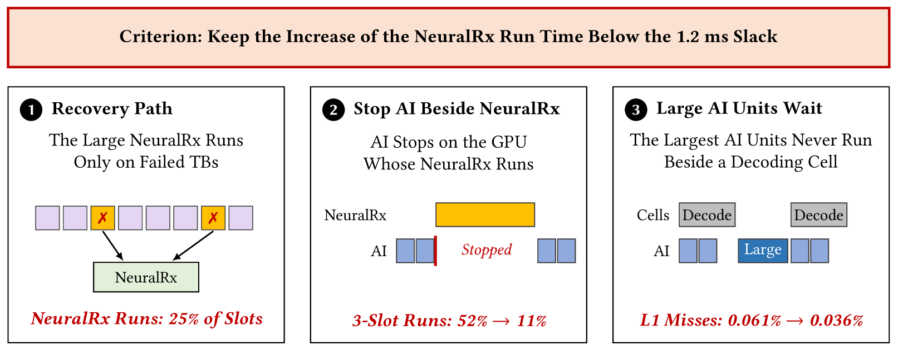</p>
<p align="center"><b>그림 13.</b> 기준과 세 규칙. 위쪽 띠는 모델에서 나온 기준이고, 상자는 세 규칙과 16셀 전 부하에서 측정한 효과다.</p>

| 규칙 | 하는 일 | 지키는 것 | 효과 (16셀 전 부하) |
|---|---|---|---|
| **1. 복구 경로** | 큰 NRx를 실패한 TB에만 돌린다. 실패 code block이 K개 이하인 슬롯만 보내고, L1 마감보다 늦은 복구 마감(11.5 ms)을 둔다 | 나머지 두 규칙의 전제 | NRx 실행이 슬롯의 25%로 준다. 복호 결과는 매 슬롯에 돌린 것과 같다 |
| **2. NRx가 도는 GPU의 AI를 멈춘다** | AI를 낮은 우선순위의 조각으로 허락한다. 조각은 연산 묶음 사이에서 중단 표시를 읽는다. 그 GPU의 NRx가 시작하면 중단 표시를 쓴다 | NRx (다음 실패 TB가 쓸 NRx) | AI가 꺼져 있어야 할 시간에 남아 있는 비율 43% → 6%. 세 슬롯을 붙잡는 NRx 실행 52% → 11% (AI 없음 10%) |
| **3. 큰 AI 연산은 기존 수신기와 겹치지 않게 한다** | 시간 한도가 1.2 ms를 넘는 AI 단위는 그 GPU의 기존 수신기가 복호 중이 아닐 때만 허락한다 | 기존 수신기 (L1 마감) | L1 놓침 0.061% → 0.036% (AI 없음 0.032%) |

- 이 규칙에는 NRx 수에 따라 정하는 값이 없다. GPU 1장과 2장에서도 같은 규칙을 쓴다(4.15절).
- AI 작업의 종류와 무관하다. LLM 프롬프트 처리, 토큰 생성, 임베딩, 이미지 분류를 모두 "시간 한도를 잰 단위"로 나누고, 규칙은 단위의 크기 등급만 본다. 모델 4개와 작업 5종류를 함께 돌려도 복구 99.7%를 유지한다(4.17절).

### 3.2 구조

서버에 네 종류의 프로세스가 있다. 모든 프로세스는 공유 메모리의 상태 하나와 시계 하나를 읽는다.

| 프로세스 | 수 | 하는 일 |
|---|---|---|
| 기존 수신기 | 셀마다 하나 | 2.5 ms마다 그 셀의 TB를 cuPHY로 복호. CRC 결과와 실패 code block 수를 상태에 기록 |
| NRx | GPU마다 하나 | TB 하나씩 복호. 모든 셀의 슬롯 버퍼를 매핑해 어느 셀의 TB든 처리 |
| AI worker | GPU마다 하나 | AI 작업을 단위로 나눠, 허락받은 조각 안에서만 실행. 단위 묶음 사이에서 중단 표시를 읽음 |
| Controller | 서버에 하나 | 실패 TB를 NRx에 배정, GPU별 AI 조각 허락과 중단, AI 요청을 GPU에 배정 |

<p align="center"></p>
<p align="center"><b>그림 14.</b> Antiphase의 전체 구조. 위는 Controller(한 프로세스), 아래는 GPU 네 장의 기존 수신기, NRx, AI worker다. 금색 칸은 2-UE 셀이다.</p>

| 층 | 구성 요소 | 하는 일 |
|---|---|---|
| Control Layer (Controller, 한 프로세스) | TB State | 셀·슬롯마다 한 줄. 기존 수신기의 결과, 실패 code block 수, 복구 상태. 모든 프로세스가 공유 메모리로 읽는다 |
| | NeuralRx Assigner | 실패한 TB를 빈 NRx에 배정한다 (3.3절) |
| | AI Admission | GPU마다 AI 조각을 허락하고 멈춘다 (3.6절) |
| | Request Dispatcher | AI 요청을 가장 먼저 끝낼 GPU에 배정하고, 제한 안에 못 끝낼 요청은 받지 않는다 (3.8절) |
| Data Layer (GPU 네 장, MPS) | Conventional Receivers | 셀마다 한 프로세스. 2.5 ms마다 cuPHY로 복호하고, 최근 슬롯의 샘플을 GPU 메모리의 슬롯 ring에 둔다 |
| | NeuralRx | GPU마다 하나. 실패한 TB를 하나씩 복호한다. 모든 셀의 슬롯 ring을 CUDA IPC로 읽으므로 어느 GPU의 셀이든 맡는다 |
| | AI Worker | GPU마다 하나. 낮은 우선순위로, 허락받은 조각 안에서만 AI를 돌린다 |

금색 칸은 2-UE 셀이다(GPU마다 하나). 상자 안의 내용은 3.3절·3.6절 그림과 같은 순간의 상태다: GPU 0과 GPU 1의 NRx가 슬롯 2731, 2732를 처리 중이고, GPU 1–3의 AI worker가 요청을 하나씩 갖고 있다. 아래 화살표는 어느 셀의 샘플이 어느 GPU로 들어가는지다. Controller의 루프 하나는 15–57 µs다.

### 3.3 규칙 1: 복구 경로

<p align="center">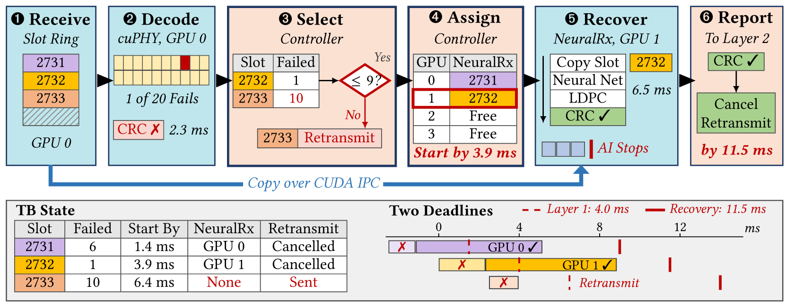</p>
<p align="center"><b>그림 15.</b> 복구 경로의 여섯 단계. 셀 0의 연속한 실패 TB 셋(슬롯 2731, 2732, 2733)이 왼쪽에서 오른쪽으로 지나간다. 파란 상자는 GPU에서 하는 단계, 복숭아색 상자는 Controller가 하는 단계다.</p>

그림은 복구 경로를 여섯 단계의 절차로 그린 것이다. 측정한 실행에서 셀 0의 연속한 실패 TB 셋(슬롯 2731, 2732, 2733)이 왼쪽에서 오른쪽으로 지나간다. 파란 상자는 GPU에서 하는 단계, 복숭아색 상자는 controller가 하는 단계다. TB는 모든 상자에서 같은 색이다(2731 보라, 2732 금색, 2733 주황). 시각은 슬롯 2732의 샘플 도착 기준이다.

| 단계 | 하는 일 | 그림의 값 |
|---|---|---|
| ❶ Receive | 슬롯의 샘플이 그 셀의 슬롯 ring에 도착한다 | 셀 0은 GPU 0에 있다 |
| ❷ Decode | cuPHY가 복호하고, CRC 결과와 실패 code block 수를 TB State에 적는다 | 슬롯 2732는 도착 2.3 ms 뒤 CRC 실패, code block 20개 중 1개 실패 |
| ❸ Select | NeuralRx Assigner가 실패 code block이 9개 이하인 TB만 후보로 둔다 | 슬롯 2732는 후보. 슬롯 2733은 10개 실패여서 재전송한다 |
| ❹ Assign | 가장 늦은 시작 시각이 이른 후보부터 빈 NRx에 배정한다. 빈 NRx 가운데 AI 조각이 돌지 않는 GPU를 먼저 고른다 | GPU 0의 NRx는 슬롯 2731을 처리 중이어서 GPU 1의 NRx에 배정. 3.9 ms 안에 시작해야 한다 |
| ❺ Recover | NRx가 그 슬롯을 셀의 GPU에서 자기 GPU로 CUDA IPC로 복사해 복호한다(신경망 → LDPC → CRC) | 2.3 ms에 시작해 8.8 ms에 끝남(6.5 ms). 그 순간 GPU 1의 AI는 멈춘다(3.6절) |
| ❻ Report | 결과가 복구 마감(11.5 ms) 전에 나오면 그 TB의 재전송을 취소한다 | 슬롯 2731과 2732는 복구되어 재전송 취소, 슬롯 2733은 재전송 |

❺의 복사는 그림에서 단계 아래를 지나는 파란 화살표다(GPU 0의 슬롯 ring → GPU 1의 NRx). 그림 아래 왼쪽은 여섯 단계가 끝난 뒤의 TB State이고(TB마다 한 줄), 오른쪽 띠는 세 TB의 두 마감이다. cuPHY는 셋 모두 L1 마감(도착 + 4.0 ms) 안에 끝났지만 CRC가 실패했다. 두 복구는 복구 마감(도착 + 11.5 ms)보다 2.7–3.9 ms 먼저 끝났다.

규칙을 순서대로 적으면 다음과 같다.

1. 슬롯의 샘플이 도착하면 기존 수신기가 복호한다. L1 마감은 도착 후 4.0 ms다.
2. CRC가 실패하고 슬롯의 실패 code block 수가 K 이하면 그 TB는 복구 후보가 된다(K=9, 채널 혼합 조건).
3. Controller는 후보의 최신 시작 시각을 `도착 + 복구 마감 − NRx 시간 한도 = 도착 + 11.5 − 7.6 = 도착 + 3.9 ms`로 계산한다.
4. 후보를 최신 시작 시각 순으로 빈 NRx에 배정한다. 최신 시작 시각을 넘긴 후보는 버리고 그 TB는 재전송된다.
5. NRx 결과는 CRC 통과, payload 일치, 복구 마감 안 종료를 모두 만족할 때만 복구로 센다.

복구 마감은 설정값이다. 기존 재전송 슬롯(T0 + 7.5 ms)을 그대로 쓰려면 복구 결과가 5.0 ms 안에 나와야 하는데, 큰 모델(6.3 ms)은 그 안에 들어가지 않는다. 11.5 ms에서는 복구에 실패한 TB의 재전송이 UL 기회 셋(7.5 ms) 늦어진다(3.4, 4.18절).

### 3.4 복구 경로의 시간 상수

복구 경로의 상수는 UL 주기, 재전송 시점, NRx의 측정된 실행 시간에서 나온다. 실험마다 조정하는 값은 없다.

<p align="center">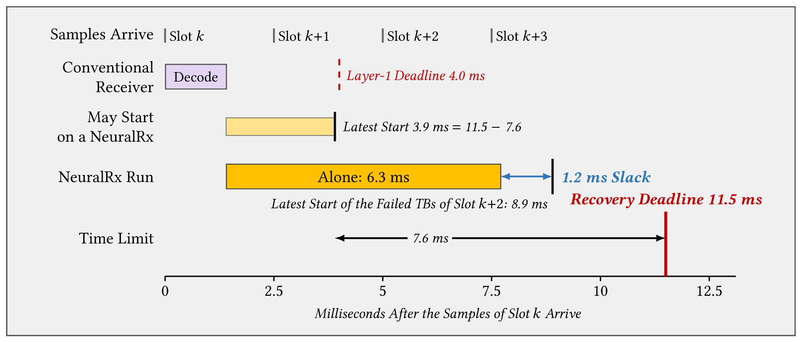</p>
<p align="center"><b>그림 16.</b> 실패 TB 하나의 시간축. 위에서부터 기존 수신기의 복호와 L1 마감(4.0 ms), 후보가 NRx에서 시작할 수 있는 구간(3.9 ms까지), NRx 실행(6.3 ms)과 그 시간 한도(7.6 ms), 복구 마감(11.5 ms)이다. 파란 화살표는 여유 1.2 ms다.</p>

| 항목 | 값 | 근거 |
|---|---|---|
| Uplink 주기 | 2.5 ms | TDD 패턴 DDDSU, subcarrier 간격 30 kHz. 셀마다 2.5 ms에 UL 슬롯 하나 |
| L1 마감 | 샘플 도착 4.0 ms 뒤 | 샘플은 슬롯 시작 0.5 ms 뒤에 도착하고, 결과는 슬롯 시작 4.5 ms 뒤에 필요하다 |
| 재전송 (복구 경로 없음) | 원래 슬롯의 7.5 ms 뒤 (T0 + 7.5 ms) | L1 결과는 T0 + 4.5 ms에 나온다. MAC은 UL grant를 전송 슬롯보다 약 3슬롯(1.5 ms) 앞서 확정하므로 grant는 T0 + 6.0–7.0 ms의 슬롯에서 나간다(K2 = 3–1). PUSCH 준비 시간은 12심볼이다(TS 38.214 표 6.4-1) |
| 복구 마감 | 샘플 도착 11.5 ms 뒤 (T0 + 12.0 ms) | NRx 결과가 이때까지 나오면 MAC이 재전송 grant를 보내지 않는다. 복구에 실패하면 grant는 T0 + 13.5 ms 이후의 슬롯에서 나가고 재전송은 T0 + 15.0 ms의 UL 슬롯에 실린다 (3.3절) |

- **NRx 시간 한도 7.6 ms.** NRx 실행 한 번의 상한이다. 모든 셀이 도는 조건에서 한 번 잰 값이고, 20셀에서는 모델로 다시 정했다(4.16.3절).
- **가장 늦은 시작 3.9 ms** = 복구 마감 11.5 − 시간 한도 7.6. 그때까지 NRx를 시작하지 못한 후보는 버리고 그 TB는 재전송된다.
- **여유 1.2 ms.** 혼자 도는 실행은 6.3 ms다. 1.4 ms에 시작하면 7.7 ms에 끝나고, 두 슬롯 뒤의 실패 TB는 8.9 ms(= 2 × 2.5 + 3.9)까지 시작해야 한다. 이 1.2 ms가 AI를 포함해 그 GPU의 다른 작업이 써서는 안 되는 시간이다(2.5절).
- NRx 시간 한도: 7.6 ms(16셀과 20셀). 낮은 우선순위 AI가 옆에서 계속 돌면 NRx 실행은 7.3–7.9 ms로 늘어난다(빈 NRx 여유를 쓸 때의 한도 8.1 / 8.5 / 8.7 ms).
- NRx 시간 한도는 최신 시작 시각 `L = 복구 마감 − 한도`를 정한다. 한도를 크게 잡으면 복구 마감을 넘기는 실행이 줄고, L이 당겨져 3슬롯 실행이 는다. 20셀에서 한도 8.6 ms(v13의 값)는 여유를 0.05 ms로 만들어 AI 없이도 실행의 47%가 3슬롯이었고, 7.6 ms에서는 17%다. 한도는 닫힌 형태로 정했다(4.16.3절).

#### 복구 경로가 실제 MAC에서 성립하는가

실제 L2는 실행하지 않았다. 규격과 공개 스택의 설정으로 일정을 점검했다.

- **규격.** NR의 UL HARQ는 비동기이고 재전송은 gNB가 DCI로 스케줄한다(TS 38.300 5.3.5.4절: "The gNB schedules each uplink transmission and retransmission using the uplink grant on DCI"; TS 38.321 5.4.2.1절). 단말은 같은 HARQ 프로세스에 새 grant가 올 때까지 데이터를 버퍼에 둔다. 따라서 재전송 grant를 미루거나 보내지 않는 것은 gNB의 결정이고 단말은 바뀌지 않는다.
- **선행 시간.** MAC은 grant를 전송 직전에 정할 수 없다. Aerial의 L2 adapter 설정은 3슬롯 앞이다(`slot_advance: 3`). 조사한 다른 공개 스택의 기본값은 srsRAN 5슬롯, OAI 6슬롯이다(소스의 기본 설정을 조사한 값이고 실행해 확인하지 않았다).
- **일정.** 3슬롯이면 T0 + 15.0 ms의 UL 슬롯에 대해 T0 + 13.0 ms(K2 = 1) 또는 T0 + 12.5 ms(K2 = 2)까지 결정할 수 있다. 복구 마감 11.5 ms(T0 + 12.0 ms)는 그보다 0.5–1.0 ms 이르다. 선행 시간이 6슬롯이면 같은 마감에서 재전송이 T0 + 17.5 ms에 실린다(5슬롯은 K2 = 1일 때만 T0 + 15.0 ms에 맞는다).
- **비용.** 복구에 실패한 TB의 재전송이 7.5 ms 늦고(선행 시간이 6슬롯이면 10 ms), 그 TB가 HARQ 프로세스를 그만큼 더 붙잡는다. 지연 p99가 12.0 ms에서 19.5 ms가 되고, 사용자가 동시에 쓰는 HARQ 프로세스는 최대 6개다(NR은 16개, 4.18.1절).
- **조건.** DRX를 쓰면 drx-RetransmissionTimerUL이 이 간격보다 길어야 한다(TS 38.321 5.7절). K2 = 1은 PUSCH 준비 시간이 12심볼인 단말에서 CORESET이 1심볼이고 첫 PUSCH 심볼이 DM-RS일 때만 성립하므로 K2 = 2의 경우를 함께 적었다.
- **확인하지 않은 것.** L1이 실패로 보고한 TB의 늦은 CRC 통과를 MAC에 전달하는 경로(FAPI)는 구현하지 않았다(5.5절).

### 3.5 AI 단위

Controller가 시간을 지키려면 GPU에 올리는 AI 연산이 얼마나 걸리는지 알아야 한다. 그래서 모든 AI 작업을 길이를 잰 단위로 나눈다.

<p align="center">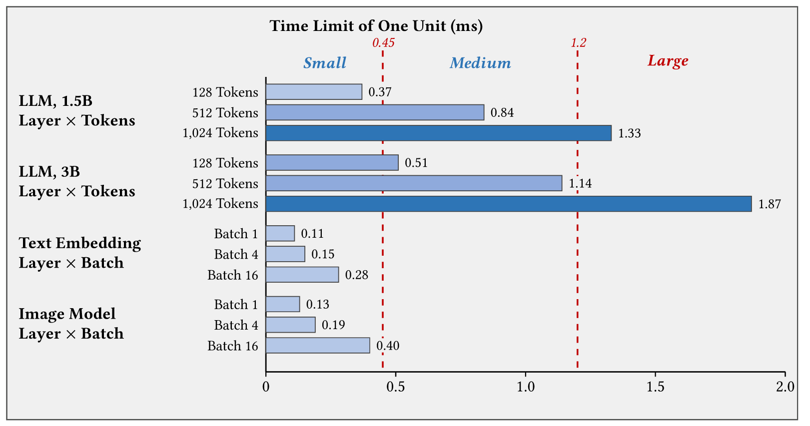</p>
<p align="center"><b>그림 17.</b> 네 모델의 AI 단위 하나의 시간 한도. 점선은 크기 등급의 경계(0.45 ms, 1.2 ms)다. 가장 큰 등급에 드는 단위는 1.5B 모델과 3B 모델의 1,024 token layer 둘이다.</p>

모든 AI 작업을 단위로 나눈다. 단위는 고정 버퍼 위에서 잡은 CUDA graph 하나이고, 혼자 돌 때의 GPU 시간을 한 번 재서 한도(p99.9의 1.1배)로 쓴다.

| 모델 | 단위 | 한도 (ms) |
|---|---|---|
| Qwen2.5-1.5B | layer 하나 × 128 / 512 / 1,024 token | 0.37 / 0.84 / 1.33 |
| | 출력 토큰 하나 = layer 3개씩의 묶음 10개 | 묶음당 0.59–0.72 |
| Qwen2.5-3B | layer 하나 × 128 / 512 / 1,024 token | 0.51 / 1.14 / 1.87 |
| BAAI/bge-base-en-v1.5 | layer 하나 × 배치 1 / 4 / 16 | 0.11 / 0.15 / 0.28 |
| google/vit-base-patch16-224 | layer 하나 × 배치 1 / 4 / 16 | 0.13 / 0.19 / 0.40 |

단위는 한도에 따라 크기 등급(0.45 ms 이하 / 1.2 ms 이하 / 그 위)에 속한다. Controller는 등급만 보고, 모델과 작업 종류를 모른다. 가장 큰 등급에 드는 것은 1.5B의 1,024 token layer(1.33 ms)와 3B의 1,024 token layer(1.87 ms)다.

### 3.6 규칙 2: AI 허락과 중단

<p align="center">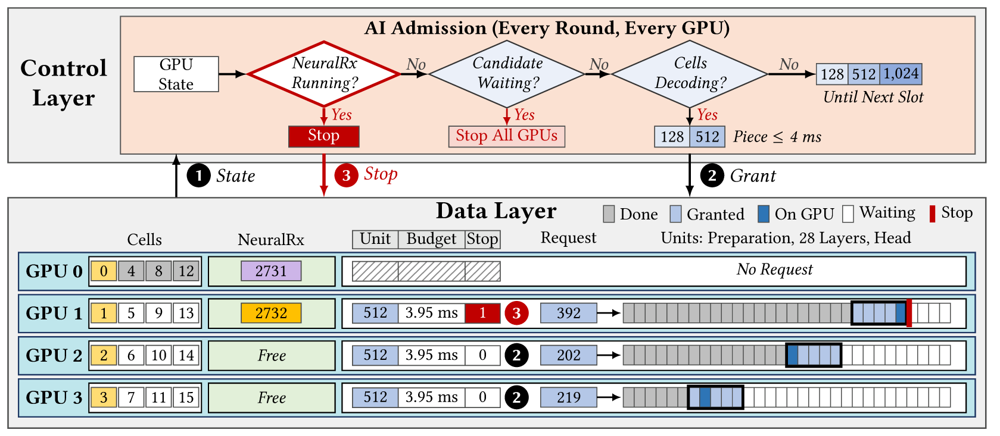</p>
<p align="center"><b>그림 18.</b> AI 허락과 중단. 위: AI Admission이 GPU 하나에 대해 하는 세 가지 판단. 아래: GPU 1의 NRx가 슬롯 2732를 시작한 순간의 GPU별 셀, NRx, 허락, AI 요청의 단위.</p>

그림은 3.3절 그림의 TB(슬롯 2732)를 GPU 1의 NRx가 시작한 순간(도착 2.3 ms)의 측정값이다. 위는 AI Admission이 GPU 하나에 대해 하는 판단 순서이고, 아래는 GPU마다 셀(회색 = 복호 중), NRx, 허락(Grant), AI 요청의 단위들이다. 512 token 이하의 요청은 단위 30개다(준비 1, layer 28, 출력 head 1).

| 단계 | 하는 일 | 그림의 값 |
|---|---|---|
| ❶ | GPU State에 GPU마다 NRx가 처리 중인 TB, 복호 중인 셀 수, AI 조각이 GPU에 있는지를 둔다 | GPU 0은 슬롯 2731, GPU 1은 슬롯 2732를 복구 중. GPU 0의 셀 3개가 복호 중 |
| ❷ | AI Admission이 루프마다 GPU별로 허락을 쓴다: 가장 큰 단위, 4 ms 이하의 작업량, 중단 표시 | GPU 2와 GPU 3은 512 token 단위까지, 3.95 ms의 허락을 받아 단위 5개짜리 조각을 실행 중 |
| ❸ | 그 GPU에서 NRx가 시작하거나 빈 NRx를 기다리는 후보가 생기면 중단 표시를 쓴다. GPU에 올라간 단위가 끝나면 조각이 끝난다 | GPU 1은 중단 표시 1. 요청(392 token)의 단위 30개 중 26번째가 GPU에서 0.45 ms 뒤에 끝나고, 남은 4개는 NRx가 끝나는 8.8 ms까지 기다린다. GPU 0에는 AI 요청이 없다 |

판단 순서는 그림의 마름모 셋이다. NRx가 그 GPU에서 실행 중이면 멈춘다. 빈 NRx를 기다리는 후보가 있으면 모든 GPU를 멈춘다. 셀이 복호 중이면 128, 512 token 단위만 허락하고, 복호 중인 셀이 없으면 다음 슬롯이 도착하기 전까지 1,024 token 단위도 허락한다.

AI worker는 낮은 MPS 우선순위로 실행하고 비율 한도는 두지 않는다. Controller는 루프마다 GPU별로 다음 조건을 모두 만족하는 가장 큰 크기 등급을 골라, AI 작업량 4 ms 이하의 조각을 허락한다.

| 조건 | 내용 |
|---|---|
| NRx | 이 GPU에서 NRx가 실행 중이면 AI를 허락하지 않는다 |
| 대기 중인 후보 | 빈 NRx를 기다리는 후보가 있으면 어느 GPU에도 AI를 허락하지 않는다 |
| 기존 수신기 | 가장 큰 등급(한도 1.2 ms 초과)은 기존 수신기 옆에서 허용하지 않는다. 이 GPU의 셀이 복호 중이 아니어야 하고 조각이 다음 슬롯 도착 전에 끝나야 한다. 작은 두 등급은 기존 수신기 옆에서 허용한다(활성 셀 수와 무관, 3.7절) |

조각은 허락받은 뒤에도 멈출 수 있다. Worker는 단위를 묶음으로 GPU에 올리고, 묶음 사이에서 controller의 중단 표시를 읽는다. Controller는 조건이 깨지면(이 GPU에서 NRx가 시작됨, 후보가 기다림) 중단 표시를 쓴다. 중단 표시부터 조각 종료까지는 중앙값 0.43 ms, p99 1.4 ms다(4.14절).

아래 그림은 측정한 실행에서 GPU 4장의 25 ms 구간이다. GPU 2에서 NRx가 1.5 ms에 시작하면 그 GPU의 AI 조각이 0.3 ms 뒤에 끝나고, NRx가 끝난 7.8 ms에 AI가 다시 시작한다. NRx 실행은 6.2–6.3 ms로 혼자 돌 때와 같다. NRx가 없는 GPU의 AI는 계속 실행된다.

<p align="center"></p>
<p align="center"><b>그림 19.</b> 측정한 실행에서 GPU 4장의 25 ms 구간. 초록은 NRx 실행, 파랑은 AI 조각이다. NRx가 시작하면 그 GPU의 AI 조각이 끝나고, NRx가 끝나면 AI가 다시 시작한다.</p>

- NRx가 도는 GPU의 AI는 멈추고, 새 AI 요청은 controller가 가장 먼저 끝낼 GPU로 배정한다.
- **빈 NRx 여유(조절 값).** "서버의 빈 NRx가 R개 이상이면 NRx 옆에서도 AI를 허락한다"로 규칙을 풀 수 있다. R을 줄이면 AI 처리량이 늘고 복구가 준다(4.14절). 기본은 허락하지 않는 것(R = NRx 수)이다. 3.1절이 그 근거다.
- Controller 루프 하나는 15–57 µs다.

### 3.7 규칙 3: 큰 AI 단위는 기존 수신기와 겹치지 않게 한다

규칙 2는 NRx를 지킨다. 규칙 3은 기존 수신기를 지킨다. NRx가 돌지 않을 때에도 AI는 기존 수신기와 GPU를 나누고, 기존 수신기의 결과는 4.0 ms까지 나와야 한다.

<p align="center">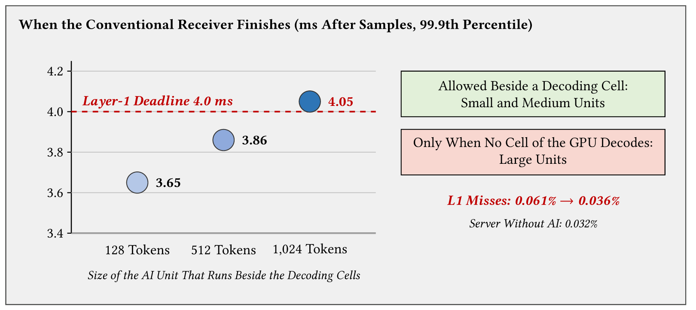</p>
<p align="center"><b>그림 20.</b> 한 크기의 AI 단위가 옆에서 계속 돌 때 기존 수신기가 끝나는 시각(p99.9, GPU당 단일 UE 셀 4개). 128 token과 512 token 단위에서는 3.65 ms와 3.86 ms로 L1 마감(4.0 ms) 안이고, 1,024 token 단위에서는 4.05 ms로 마감을 넘는다.</p>

- 작은 두 등급(한도 1.2 ms 이하)은 복호 중인 셀 옆에서 돌려도 된다.
- 가장 큰 등급은 그 GPU에 복호 중인 셀이 없고 조각이 다음 슬롯 도착 전에 끝날 때만 허락한다.
- 효과(16셀 전 부하): L1 놓침 0.061% → 0.036%(AI 없음 0.032%). AI 처리량은 9% 준다(4.14절).

한도는 평가 하드웨어에서 모든 셀이 실행되고 한 단위 크기의 낮은 우선순위 AI가 계속 실행되는 조건으로 측정했다(16셀).

| AI | 기존 수신기 완료 p99 / p99.9 (ms) | NRx 실행 p50 / p99 (ms) |
|---|---|---|
| 없음 | 2.92 / 3.23 | 6.28 / 6.79 |
| 비율 70%, 128 token | 3.25 / 3.46 | 7.37 / 8.09 |
| 비율 70%, 1,024 token | 3.96 / 4.52 | 8.39 / 9.43 |
| 낮은 우선순위 + 70%, 128 token | 3.19 / 3.56 | 7.25 / 7.56 |
| 낮은 우선순위 + 70%, 1,024 token | 3.30 / 4.29 | 7.60 / 8.04 |
| 낮은 우선순위, 한도 없음, 1,024 token | 3.44 / 4.05 | 7.89 / 8.51 |

- 기존 수신기 옆에서 허용하는 등급은 "그 등급의 AI가 계속 돌 때 기존 수신기 완료 p99.9가 L1 마감(4.0 ms) 안인가"로 정한다. GPU당 4셀에서는 작은 두 등급을 허용한다(단일 UE 셀의 p99.9가 128 token 3.65 ms, 512 token 3.86 ms, 1,024 token 4.05 ms). v13은 GPU당 4셀에서 세 등급을 모두 허용했고 L1 놓침이 올랐다(4.14절).
- 같은 측정을 GPU당 5셀로 하면 128 token 3.65 ms, 512 token 4.45 ms, 1,024 token 4.28 ms다. 이 측정은 NRx가 모든 실패 TB에 대해 돌고 AI가 그 옆에서 계속 도는 조건이다. Antiphase에서는 NRx가 도는 GPU의 AI가 멈추므로 기존 수신기 옆에 NRx와 AI가 함께 있지 않다. 실제 실행에서 작은 두 등급을 활성 셀 수와 무관하게 허용해도, 활성 5셀에서 가장 작은 등급만 허용한 변형과 L1 놓침이 같았다(같은 시드에서 20셀 0.041% 대 0.038%, 32셀 0.038% 대 0.048%, 48셀 0.149% 대 0.147%). 따라서 작은 두 등급은 활성 셀 수와 무관하게 허용한다. 활성 셀 수로 등급을 바꾸는 변형은 채택하지 않았다(4.14절).

### 3.8 AI 요청의 배정과 실행 순서

<p align="center">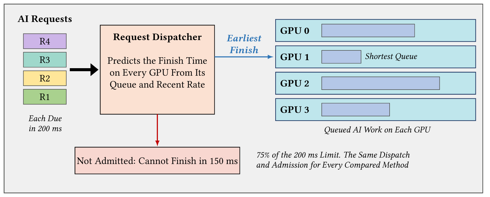</p>
<p align="center"><b>그림 21.</b> AI 요청의 배정. Request Dispatcher가 GPU마다 완료 시각을 대기량과 최근 처리율로 예측하고, 가장 먼저 끝낼 GPU로 요청을 보낸다. 제한의 75%(150 ms) 안에 끝내지 못할 요청은 받지 않는다. 대기 막대의 길이는 설명을 위한 것이다.</p>

- 요청은 서버 전체에 하나의 목록으로 온다. Controller가 요청마다 "가장 먼저 끝낼 GPU"에 배정하고, 제한의 75% 안에 끝내지 못할 요청은 받지 않는다. 예측은 그 GPU의 대기량(시간 제한이 같거나 짧은 작업만)과 최근 처리율로 한다. 모든 방식이 같은 배정과 입장 제어를 쓴다.
- Worker는 조각 안에서 "다음 결과의 시간 제한 − 그 결과까지 남은 작업량"이 가장 이른 작업의 단위를 먼저 올린다. 임베딩과 이미지 항목은 배치를 채우려고 시간 제한의 30%까지 기다린다. 시간 제한이 없는 작업은 다른 작업이 없을 때만 돈다.
- NRx가 도는 GPU는 그 순간 AI를 처리하지 않으므로 예측 완료 시각이 늦어지고, 새 요청은 다른 GPU로 간다.

### 3.9 설정 하나와 조절 값

기본 설정에는 부하나 규모에 따라 조정할 값이 없다. 이 문서의 Antiphase 수치는 모두 기본 설정이다. 무선의 일부를 내주고 AI를 더 처리하는 옵션이 둘 있고, 둘 다 기본값은 끔이다.

| 옵션 | 하는 일 | 측정 |
|---|---|---|
| 빈 NRx 여유 R | 서버의 빈 NRx가 R개 이상이면 도는 NRx 옆에서도 AI를 허락한다 | 전 부하(세 등급을 모두 기존 수신기 옆에서 허용한 설정): NRx 옆 금지 37.6k에 복구 100.0%, 여유 3은 39.8k에 99.3%, 여유 1은 44.0k에 95.1%. rate control의 목표 10%: 여유 3 / 2 / 1이 12.1k / 13.9k / 17.9k에 goodput 손실 0.0 / 0.1 / 0.4%(기본 11.5k, 0.0%) (4.14, 4.9.7절) |
| SM 조각 | NRx가 도는 동안 AI를 멈추지 않고 GPU의 SM 일부(CUDA green context)에서 돌린다 | 28 SM 조각: AI 1.0–1.6배, goodput 손실 0.3–3.3%. 손실은 수단과 무관하게 NRx 실행 시간을 따른다 (4.9.10절) |

- 한도를 20%에서 한도 없음까지 바꾼 비율 방식과 비교하면, 같은 goodput 손실(0.25% 이하)에서 Antiphase의 설정이 AI를 1.2–7.8배 처리한다(그림 26, 4.9.7절).
- 한 번 정해 두고 쓰는 값은 다음과 같다: 실패 code block 문턱 K = 9(채널 혼합), NRx 시간 한도 7.6 ms, 크기 등급의 경계 0.45 ms와 1.2 ms, 조각 하나의 작업량 4 ms, 입장 제어의 75%. 정한 근거와 남은 수동 설정은 5.5절에 있다.

### 3.10 구현

구현은 cuPHY, TensorRT, PyTorch 위의 Python 약 4.1천 줄이다(`scripts_for_node/backstop_slot/`).

| 구성 요소 | 파일 |
|---|---|
| Controller (NRx 배정, AI 허락과 중단, 요청 배정, 비교 대상) | `controller6.py` |
| 기존 수신기와 NRx 경로 | `conv_worker.py`, `slot_radio.py`, `mu_radio.py`, `nrx_lane.py` |
| AI worker와 단위 분할 | `ai_worker2.py`, `qwen_units.py`(프롬프트 처리), `ai_worker5.py`, `model_units.py`(여러 모델과 작업 종류) |
| 복구 손실 모델 | `loss_model.py`, `analyze_chain2.py` |
| SM 조각 옵션 | `greenctx.py` |

전체 파일 목록은 9.3절에 있다.

---

## 4. 평가

### 4.1 실험 환경과 방법

<p align="center">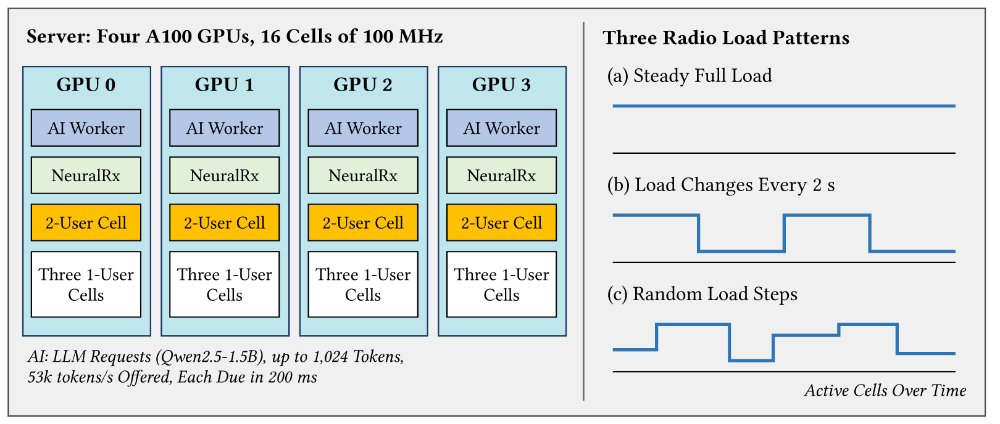</p>
<p align="center"><b>그림 22.</b> 실험 구성. 왼쪽: A100 GPU 네 장 각각에 AI worker, NRx, 2-UE 셀 하나, 단일 UE 셀 셋을 둔다. 오른쪽: 세 가지 무선 부하(계속 전 부하, 2초마다 바뀜, 무작위로 바뀜)의 모양이다.</p>

| 항목 | 값 |
|---|---|
| 시스템 | NERSC Perlmutter, 노드 하나 |
| GPU | NVIDIA A100 80GB × 4, MPS, MIG 미사용 |
| CPU | AMD EPYC 7763, 64 core |
| 컨테이너 | Shifter, `nvcr.io/nvidia/aerial/aerial-cuda-accelerated-ran:25-3-cubb` |
| 기존 수신기 | Aerial cuPHY PUSCH (MMSE, 시간 보간), LDPC 20회 |
| NRx | NVlabs `neural_rx`의 `nrx_large` (2-UE MU-MIMO, 273 PRB, TensorRT FP16), 뒤의 LDPC 20회 |
| 셀 | 100 MHz. 2-UE 셀: 2-UE MU-MIMO, 16QAM(MCS 14), 273 PRB, 슬롯당 code block 20개. 나머지: 단일 UE, 2 layer |
| 2-UE 셀의 채널 | NVlabs link simulation의 세 채널을 섞음: 상관 낮음 2–3 dB, 상관 높음 13–16 dB, UMi 4–6 dB |
| 기본 배치 | 16셀, GPU당 4셀, GPU당 2-UE 셀 1개, GPU당 NRx 1개 |
| 슬롯 반복 | 셀마다 미리 생성한 슬롯 512개를 반복(1.28초). 4.19절의 이전 측정은 128개(0.32초) |
| AI (4.17절을 뺀 절) | Qwen2.5-1.5B 프롬프트 처리, 최대 1,024 token(BurstGPT 길이 분포), 시간 제한 200 ms, GPU당 초당 32개 요청(서버 53k tokens/s) |
| AI (4.17절) | 3.5절의 모델 4개, 작업 5종류 |
| 실행 길이 | 10–40초. 시드 수는 표마다 적음 |
| 긴 실행 (4.8절) | 100초(셀마다 슬롯 40,000개). 같은 job에서 방식을 번갈아 실행하고, 시작 뒤 20초를 뺀 80초를 정상 상태로 본다 |

측정 지표는 다음과 같다.

| 지표 | 정의 |
|---|---|
| AI 처리량 | 200 ms 안에 끝난 요청의 prompt token 수(초당). 제한을 넘긴 요청은 세지 않는다 |
| L1 놓침 | 기존 수신기 결과가 L1 마감(4.0 ms)을 넘긴 TB의 비율. 10–40초 실행의 값은 실행 시작 뒤 첫 몇 초에 생긴 것이 대부분이다. 정상 상태의 값은 4.8절의 긴 실행에서 잰다 |
| 복구 유지율 | 복구 마감 안에 NRx가 복구한 TB 수를 같은 시드의 AI 없는 실행과 비교한 비율 |
| 버려진 후보 | 복구 후보 가운데 최신 시작 시각까지 빈 NRx를 얻지 못한 비율 |
| UL goodput | 새 데이터를 전달한 UL 슬롯의 비율. TB별 기록에 재전송 일정을 적용해 계산 (4.18절) |

모든 측정은 GPU에서의 end-to-end 실행이다. cuPHY가 모든 TB를 복호하고, NRx가 실제 수신 슬롯을 복호하고, AI worker가 실제 모델을 실행한다. 슬롯은 미리 생성했고 RU와 L2는 없다.

#### 검증 방식

- **강한 기준선을 넣었다.** 낮은 MPS 우선순위, 부하를 지연 없이 아는 "부하 따라 비율", YinYangRAN의 설계를 재구성한 추정기 방식, 그리고 이들의 조합이다(4.2절).
- **비교 대상에 유리한 가정을 두었다.** "부하 따라 비율"은 전환 비용이 0이고, 추정기 방식은 모델을 다시 올리는 시간이 없다(4.2절).
- **실험 방법의 편향을 찾아 고쳤다.** 이전에는 셀마다 슬롯 128개를 반복 재생했고, 이 반복이 기준선의 복구 유지율을 약 1%p 낮췄다. 모델을 검증하다가 찾았고 512 슬롯 반복으로 바꿨다(4.13절).
- **오프라인 참조값과의 거리를 쟀다.** 뒤에 올 실패를 모두 아는 오프라인 스케줄의 AI 처리량을 추정했다. Antiphase는 그 70%를 처리한다(4.12절).
- **비용을 측정해 적었다.** Antiphase의 비용(L1 지연의 중앙값, NRx가 도는 동안 쓰지 않는 GPU 시간, 받지 않는 요청)과, AI를 더 처리하는 방식이 무선에서 치르는 값을 조건별로 적었다(5장).
- **자기 결과를 반증했다.** NRx 입력 형식 오류, LDPC 횟수 불일치, 우선순위 없는 기준선, 멈추지 못하는 AI 조각, 128 슬롯 반복, 기존 수신기를 늦추는 큰 AI 단위의 여섯 가지를 찾아 이전 수치와 규칙을 철회했다(5장).

### 4.2 비교한 방식

모든 방식은 같은 런타임에서 같은 수신기, 같은 AI 요청, 같은 요청 배정으로 실행한다. 방식들은 GPU 시간을 AI에 주는 방법에서만 다르다(그림 10).

| 그림의 이름 | 방식 | 이 문서의 표에서 쓰는 이름 |
|---|---|---|
| Static | AI에 GPU의 10%를 고정으로 준다 | 고정 10% |
| Estimator | 학습된 추정기가 1초마다 AI의 몫을 고른다 (YinYangRAN 설계의 재구성) | 추정기로 비율 선택 |
| Priority | AI를 낮은 우선순위로 돌리고 30% 한도를 둔다 | 낮은 우선순위 + 30% |
| Estimator+Priority | 추정기에 낮은 우선순위를 더한다 | 낮은 우선순위 + 추정기 |
| Follow+Priority | 무선 부하를 지연 없이 알고 몫을 바꾼다. 낮은 우선순위를 더한다 | 낮은 우선순위 + 부하 따라 비율 |
| Priority-70, Priority-max | 낮은 우선순위에 70% 한도 / 한도 없음. AI를 더 처리하고 복구를 잃는다 | 낮은 우선순위 + 70%, 한도 없음 |

기존 방식과의 성능 비교는 그 방식의 동작을 이 저장소의 런타임에 구현해서 했다. 해당 논문의 코드를 실행하지 않았다. 따라서 비교 결과는 "그 방식"에 대한 것이고 "그 시스템"에 대한 것이 아니다.

| 비교 대상 | 구현 | 대응하는 기존 연구 | 원본과 다른 점 |
|---|---|---|---|
| 고정 비율 | AI worker에 MPS 비율 고정 | AI-RAN 실험의 MIG 분할 | MIG 대신 MPS 비율 사용 |
| 추정기로 비율 선택 | 1초마다, 직전 1초의 부하 히스토그램과 오프라인 학습한 신뢰도 추정기(분위수 MLP)로 조건을 만족하는 가장 큰 AI 비율을 선택. 비율을 바꾸면 0.266초 동안 AI 중단 | YinYangRAN (YYR-Lite) | 원문 pre-print의 설계를 재구성. 신뢰도 정의는 이 testbed의 값(복구 유지율, L1). 재설정 중 무선은 GPU에서 계속 실행 (4.11절) |
| 부하 따라 비율 | GPU마다 비율이 다른 AI worker를 미리 띄우고, 최근 100 ms 무선 부하로 하나만 활성화 | YinYangRAN의 이상화 | 추정기 없음. 전환 비용 0. 부하를 즉시 앎. 비율 2–3개 |
| 낮은 우선순위 | AI worker에 `CUDA_MPS_CLIENT_PRIORITY=1`, 비율 한도와 조합 | SMEC | SMEC은 무선과 다른 서버에서 사용 |
| 낮은 우선순위 + 추정기 / + 부하 따라 비율 | 위의 조합 | 해당 연구 없음 | 기존 수단으로 구성할 수 있는 가장 강한 조합 |
| 유휴 시간만 | GPU에 무선 작업이 없을 때만 AI. 다음 UL 도착 전에 종료 | Orion, REEF | kernel 단위가 아니라 AI 단위 기준 |
| SM 조각 (4.9.10절) | AI worker를 SM 28개의 CUDA green context에 둔다. 세 가지: 낮은 우선순위 / 보통 우선순위 / NRx를 나머지 80 SM에 둔 고정 분할 | Weaver가 쓰는 수단 | SM 수가 고정이다(Weaver는 슬롯마다 바꾼다). MAC scheduler와 연동하지 않는다. driver API로 구현 |
| 보호 없음 | 비율 100%, 우선순위 같음 | 기본 MPS | – |

비교 대상에 유리한 가정을 두었다. "부하 따라 비율"은 전환 비용이 0이고 부하를 지연 없이 안다. 추정기 방식은 재설정 중에도 무선이 GPU에서 돌고, 비율별 AI worker를 미리 띄워 모델을 다시 올리는 시간이 없다. NRx 규칙, AI 요청, 요청 배치와 입장 제어는 모든 방식이 같다.

### 4.3 결과 요약

| 절 | 질문 | 답 |
|---|---|---|
| 4.4 | 어떤 NRx가 기존 수신기보다 나은가 | 큰 모델만 낫다. cuPHY 실패의 15–67%를 추가로 복호한다. 실행 시간은 UL 주기의 2.5배다 |
| 4.5 | 큰 NRx를 어떻게 쓰는가 | 실패한 TB에만 쓴다. NRx 실행이 슬롯의 25%로 준다 |
| 4.6 | 어떤 실패 TB를 NRx로 보내는가 | 실패 code block이 적은 것만 보낸다. NRx 실행 85% 감소, 복구 5% 감소 |
| 4.7 | NRx와 AI가 무선 작업을 각각 얼마나 늦추는가 | NRx가 L1 p99.9를 1.5 ms에서 3.1 ms로 늘려 마감 여유를 0.9 ms로 줄인다. Antiphase의 AI는 그 위에 +0.04–0.06 ms, NRx 실행에 +0.07–0.09 ms를 더한다. 비율 방식은 **2.8–21배**, **5.2–19배** 더한다. AI 요청 p99 175–187 ms(제한 200 ms) |
| 4.8 | L1 마감을 정말 지키는가 | 놓침은 실행 시작 뒤 첫 몇 초의 현상이다. 그 뒤에는 16셀·GPU 1장·20셀·48셀 모두 AI 없는 서버와 같다(3 / 320만 대 0, 0 대 0, 3 대 2, 17 대 17) |
| 4.9 | rate control이 MCS를 고르면 | 복구 경로 **+11–40%**(상관 높은 채널), +4–9%(상관 낮은 채널). Antiphase는 마흔두 조건 모두 손실 0.5% 이하이고 41개 조건은 0.3% 이하다(Es/No 일곱 값, 채널 셋, 계단과 연속으로 변하는 채널, 섞인 채널). 비율 방식은 최대 8.2%를 잃고, 모든 조건을 지키는 한도 값이 없다(2-UE 셀 8개에서는 10%도 0.8–0.9%를 잃는다). 같은 손실에서 Antiphase의 설정이 AI를 **1.2–7.8배** 처리한다 |
| 4.9.10 | NRx가 도는 동안 AI를 SM 조각(green context)에서 돌리면 | AI 1.0–1.6배, goodput 0.3–3.3% 손실. 손실은 수단과 무관하게 NRx 실행 시간을 따른다(6.4–6.6 ms: 0.0–0.7%, 7.4–7.9 ms: 0.4–3.6%). AI를 항상 28 SM에 두는 기준선은 아홉 경우 모두 Antiphase보다 goodput을 더 잃고 AI는 0.4–1.1배다. 기본값은 조각 없음 |
| 4.10 | 전 부하에서 AI를 얼마나 처리하는가 | 34.1k tokens/s, 복구 99.9%. 고정 10%의 **6.4배**, 낮은 우선순위 + 30%의 **1.9배** |
| 4.11 | 부하가 바뀌면 | 41.4k–44.7k, 복구 99.9–100.0%. 고정 10%의 **7.2–7.5배**, 추정기 방식의 **1.6–1.9배** |
| 4.12 | 얼마나 더 나아질 수 있는가 | 미래를 아는 오프라인 스케줄의 추정 처리량의 **70%**를 처리한다. 기존 수단은 11–37% |
| 4.13 | 손실 모델이 맞는가 | 672개 실험에서 평균 오차 0.82%p |
| 4.13.2 | 여유는 실행마다 같은가 | 다르다. AI가 없어도 실행의 10.6%가 3슬롯이다. Antiphase는 11.2%, 낮은 우선순위 + 30%는 29.9%다(전 부하) |
| 4.14 | 어느 규칙이 얼마나 기여하는가 | 조각 중단과 NRx 옆 금지: 복구 97.8% → 100.0%. 큰 AI 단위 제한: L1 놓침 0.061% → 0.036% |
| 4.15 | GPU 수와 NRx 수요가 달라지면 | GPU 1–2장: 낮은 우선순위 + 30%의 **2.0–2.2배**. 2-UE 셀 8개: 고정 10%의 **2.7배** |
| 4.16 | 셀이 더 많으면 | 20–48셀: 고정 10%의 **5.9–6.2배**, 낮은 우선순위 + 30%의 **1.8–1.9배** |
| 4.17 | 다른 AI 작업에도 통하는가 | 모델 4개, 작업 5종류를 함께 돌려 복구 99.7% |
| 4.18 | 복구가 사용자에게 주는 것 | goodput +5.6%, 재전송 37% 감소 (고정 MCS) |

- 4.4–4.6절은 전제가 되는 수신기 측정, 4.7–4.9절은 무선을 지키는가, 4.10–4.12절은 GPU를 얼마나 쓰는가, 4.13–4.14절은 모델과 규칙의 근거, 4.15–4.18절은 다른 조건, 4.19절은 이전 규칙의 기록이다.
- 표의 "복구"는 복구 유지율(AI 없는 서버가 복구한 TB 수 대비)이다.

### 4.4 수신기 비교 (LDPC 반복 횟수 일치)

> **한 줄 결론.** 큰 NRx만 기존 수신기보다 확실히 낫다. cuPHY가 실패한 TB의 15–67%를 추가로 복호하고, 실행 시간은 UL 주기의 2.5배(6.3 ms)다.

실시간용 모델 `nrx_rt`와 cuPHY.

| 채널 | TB | LDPC | cuPHY | nrx_rt | NRx만 성공 | cuPHY만 성공 | cuPHY 실패 중 NRx가 복호 |
|---|---|---|---|---|---|---|---|
| 2-UE 16QAM, 상관 낮음, 2–3 dB | 600 | 10 | 438 | 396 | 4 | 46 | 2% |
| | | 20 | 515 | 484 | 2 | 33 | 2% |
| | | 40 | 541 | 511 | 3 | 33 | 5% |
| 2-UE 16QAM, UMi, 1–6 dB | 600 | 10 | 405 | 402 | 4 | 7 | 2% |
| | | 20 | 425 | 420 | 4 | 9 | 2% |
| | | 40 | 431 | 425 | 2 | 8 | 1% |
| 2-UE 16QAM, 상관 중간, 8–18 dB | 600 | 20 | 321 | 372 | 59 | 8 | 21% |
| 2-UE 16QAM, 상관 높음, 10–16 dB | 1,400 | 10 | 844 | 976 | 167 | 35 | 30% |
| | | 20 | 946 | 1,099 | 174 | 21 | 38% |
| | | 40 | 979 | 1,135 | 180 | 24 | 43% |

큰 모델 `nrx_large`와 cuPHY.

| 채널 | TB | LDPC | cuPHY | nrx_large | NRx만 성공 | cuPHY만 성공 | cuPHY 실패 중 NRx가 복호 |
|---|---|---|---|---|---|---|---|
| 상관 낮음, 2–3 dB | 600 | 10 | 438 | 534 | 96 | 0 | 59% |
| | | 20 | 515 | 572 | 57 | 0 | 67% |
| | | 40 | 540 | 579 | 39 | 0 | 65% |
| UMi, 1–6 dB | 600 | 10 | 405 | 436 | 31 | 0 | 16% |
| | | 20 | 425 | 451 | 26 | 0 | 15% |
| | | 40 | 431 | 458 | 27 | 0 | 16% |
| 상관 높음, 10–16 dB | 1,400 | 10 | 843 | 1,069 | 248 | 22 | 45% |
| | | 20 | 947 | 1,159 | 233 | 21 | 51% |
| | | 40 | 981 | 1,191 | 226 | 16 | 54% |

단일 UE(pyAerial 예제 NRx, QPSK, CDL-D).

| SNR 구간 | TB | LDPC | cuPHY | NRx | cuPHY 실패 중 NRx가 복호 |
|---|---|---|---|---|---|
| −3.8 ~ −3.2 dB | 512 | 10 | 354 | 439 | 85/158 (54%) |
| | | 20 | 506 | 510 | 5/6 |
| | | 40 | 512 | 512 | – |
| −4.6 ~ −2.4 dB | 512 | 10 | 284 | 311 | 12% |
| | | 20 | 376 | 386 | 12% |
| | | 40 | 410 | 414 | 11% |

| 모델 | 엔진 GPU 시간 | 슬롯 하나의 경로 (단독) | 셀과 같이 돌 때 | cuPHY (같은 슬롯) |
|---|---|---|---|---|
| nrx_rt | 1.35 ms | 2.4 ms | 2.7–3.0 ms | 0.8–0.9 ms |
| nrx_large | 4.29 ms | 5.3 ms | 6.3 ms | 0.8–0.9 ms |

- 단일 UE의 좁은 SNR 구간에서 cuPHY는 10회 354개, 20회 506개, 40회 512개를 복호한다. 10회 기준의 NRx 이득(54%)은 대부분 반복 횟수 차이다.
- 20회의 비용은 code block 13개 TB에서 +19%(0.79 → 0.94 ms), 20개 TB에서 +15%(0.78 → 0.90 ms)다.
- 런타임 경로(LS 추정 → TensorRT → LDPC)는 LDPC를 20회로 맞추면 NVlabs 자체 평가와 TB 800개 중 794개가 일치한다.
- NRx 입력 형식: LS 추정값을 DMRS 심볼 순서로 펼치고 1/√2를 곱해야 한다. pyAerial 예제 형식으로 넣으면 약한 TB 256개 중 NRx 복호가 134개이고, 맞는 형식은 211개다.

### 4.5 복구 경로 단독 (AI 없음)

> **한 줄 결론.** 큰 NRx를 실패한 TB에만 돌리면 NRx 실행이 슬롯의 25%로 줄고, 복호 결과는 매 슬롯에 돌린 것과 같다.

| 조건 | 2-UE 셀 TB 중 cuPHY 실패 | 그중 NRx가 제때 복구 |
|---|---|---|
| 상관 낮음, 16셀, 4,000 주기 | 14.3–14.6% | 63–66% |
| 상관 높음, 16셀 | 16.1–16.4% | 53–57% |
| 채널 혼합(K=9), 16셀 | 15.8–17.3% | 38% |

| 큰 모델의 사용 방식 (2-UE 셀 4개, AI 없음) | NRx가 처리한 슬롯 | 2-UE 셀의 복호 성공 |
|---|---|---|
| 주 수신기 (모든 슬롯을 NRx로) | 39% | 89.4% |
| 복구 경로 (실패한 TB만) | 실패한 TB의 슬롯만 처리, NRx 용량의 55% 사용 | 94.5–95.1% |

- 상관 낮은 채널의 단독 복호: TB 600개 중 cuPHY 515, NRx 572, cuPHY만 성공 0. 실패한 TB에만 NRx를 돌린 결과(572)가 모든 슬롯에 돌린 결과(572)와 같고, NRx 실행은 슬롯 300개 중 74개(25%)다.
- 채널 혼합 단독 복호: TB 2,000개 중 cuPHY 1,663, NRx 1,796, NRx만 성공 149(cuPHY 실패 337개의 44%), cuPHY만 성공 16.

### 4.6 복구할 TB 선택

> **한 줄 결론.** 실패 code block이 적은 슬롯만 NRx로 보내면 NRx 실행이 85% 줄고 복구는 5% 준다(UMi 채널).

| 채널 | 실패 code block 수 (슬롯의 두 UE 합) | 복구 성공률 |
|---|---|---|
| 상관 낮음 | 1–3개 | 97% (38개 중 37개) |
| | 4–9개 | 54% (24개 중 13개) |
| | 10개 이상 | 30% (23개 중 7개) |
| UMi | 9개 이하 | 93% (14개 중 13개) |
| | 전부 실패 (실패 TB의 87%) | 2% |
| 채널 혼합 | 9개 이하 | 75% (167개 중 125개) |
| | 10개 이상 | 14% (170개 중 24개) |

| 조건 (AI 없음) | 규칙 | NRx 실행 | 복구한 TB | 실행당 복구 |
|---|---|---|---|---|
| UMi, 2-UE 셀 4개 | 실패 전부 | 4,891–4,926 | 663–757 | – |
| | 9개 이하 | 651–777 | 589–746 | – |
| 상관 낮음, 2-UE 셀 8개 | 실패 전부 | 5,572–5,707 | 4,124–4,513 | 0.77 |
| | 9개 이하 | 4,445–4,672 | 3,857–4,348 | 0.90 |
| | 3개 이하 | 3,077–3,722 | 3,005–3,758 | 0.99 |

- UMi에서 9개 이하 규칙은 NRx 실행을 85% 줄이고 복구를 5% 줄인다.
- 2-UE 셀 8개(NRx 용량 부족)에서 3개 이하 규칙은 실행을 40%, 복구를 22% 줄이고 실행당 복구를 0.77에서 0.99로 올린다.
- 실패 수가 적은 TB에 NRx를 먼저 주는 순위 방식(문턱 없음)은 복구가 4% 적었다. 문턱 방식을 쓴다.

### 4.7 보호와 지연: 스케줄링 지표

**한 줄 결론.** 정상 상태에서 Antiphase는 무선 작업의 꼬리 지연을 AI 없는 서버와 거의 같게 둔다(L1 p99.9 +0.04–0.06 ms, NRx 실행 +0.07–0.09 ms). 기준선은 2.8–21배, 5.2–19배 더 늦춘다. 실행 시작 구간이 지난 뒤 L1 마감을 넘긴 TB는 320만 개 중 3개이고(AI 없음 0개), AI 요청은 제한 시간 안에 끝난다(p99 175–187 ms).

#### 세 단계로 나눈 L1 지연 (전 부하와 rate control, 100초 실행)

NRx와 AI를 넣은 서버에서 무선 작업의 지연은 0일 수 없다. 그래서 기준을 세 단계로 나눈다: 기존 수신기만 도는 서버, NRx를 더한 서버, AI까지 더한 서버. 각 단계가 무엇을 얼마나 더하는지를 적는다. 아래 표는 100초 실행의 정상 상태 값이다(처음 20초 제외). 칸은 "L1 지연 p99.9 / L1 마감(4.0 ms)을 넘긴 TB 수"다.

<p align="center">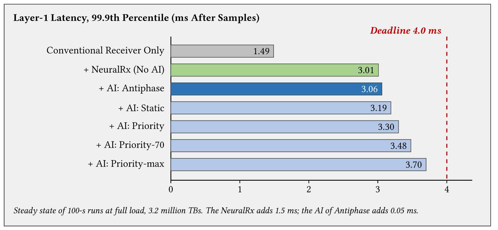</p>
<p align="center"><b>그림 23.</b> 세 단계의 L1 지연 p99.9(전 부하, 고정 MCS, 100초 실행의 정상 상태). 기존 수신기만 도는 서버, NRx를 더한 서버, 각 방식의 AI를 더한 서버다. 점선은 L1 마감(4.0 ms)이다.</p>

| 단계 | 전 부하, 고정 MCS (TB 320만 개) | rate control, 목표 10% (단일 UE 셀의 TB 115만 개) |
|---|---|---|
| 기존 수신기만 (NRx 없음, AI 없음) | 1.49 ms / 0 | 1.50 ms / 0 |
| + NRx (AI 없음) | 3.01 ms / 0 | 3.11 ms / 0 |
| **+ AI, Antiphase** | **3.06 ms / 3** | **3.14 ms / 3** |
| + AI, 고정 10% | 3.19 ms / 6 | 3.28 ms / 0 |
| + AI, 낮은 우선순위 + 30% | 3.30 ms / 0 | 3.40 ms / 11 |
| + AI, 낮은 우선순위 + 70% | 3.48 ms / 10 | 3.58 ms / 9 |
| + AI, 낮은 우선순위만 | 3.70 ms / 174 | 3.89 ms / 470 |

- **L1 꼬리를 가장 크게 늘리는 것은 NRx다.** NRx를 넣으면 p99.9가 1.5 ms 늘어 마감 여유(2.5 ms)의 61–64%가 사라지고 0.9–1.0 ms가 남는다. 그 대가로 2-UE 셀의 goodput이 11–31% 오른다.
- **AI는 남은 여유 안에서 돌아야 한다.** Antiphase는 0.03–0.04 ms를 더한다. 낮은 우선순위 + 30%는 0.28–0.29 ms를 더하고, 낮은 우선순위만 쓰면 0.69–0.78 ms를 더해 174–470개의 TB가 마감을 넘는다.
- 손실이 작다는 것은 간섭이 없다는 뜻이 아니다. 지연이 남은 여유 안에 머물러 마감 초과나 잃은 복구로 바뀌지 않는다는 뜻이다.
- 이 표(`l1_levels_long_full.txt`)와 아래의 방식별 표(`sched_metrics.txt`)는 같은 100초 실행을 따로 집계한 것이고, p99.9가 0.01 ms까지 다르다.

#### rate control 조건에서의 세 단계

같은 세 단계를 rate control을 넣은 실행(4.9절)에서도 쟀다. 그 실행에는 복구 경로가 없는 서버가 들어 있고, 단일 UE 셀은 세 단계에서 워크로드가 같다(MCS 고정). 그 셀들의 L1 지연을 비교했다(`analyze_l1_levels.py`, 20초 실행에서 처음 5초 제외, 조건마다 TB 14만–22만 개).

| 단계 | 목표 10% | 목표 3% | 목표 1% | 목표 1%, 2-UE 셀 8개 |
|---|---|---|---|---|
| 기존 수신기만: 중앙값 / p99.9 | 1.40 / 1.51 | 1.41 / 1.51 | 1.39 / 1.52 | 1.39 / 1.50 |
| + NRx (AI 없음) | 2.09 / 3.10 | 1.46 / 3.08 | 1.40 / 3.05 | 1.61 / 3.05 |
| **+ AI, Antiphase** | 2.07 / **3.14** | 1.88 / **3.12** | 1.89 / **3.12** | 1.88 / **3.13** |
| + AI, 고정 10% | 2.17 / 3.31 | 1.66 / 3.29 | 1.50 / 3.22 | 1.76 / 3.27 |
| + AI, 낮은 우선순위 + 30% | 2.31 / 3.40 | 1.92 / 3.38 | 1.70 / 3.37 | 1.90 / 3.41 |
| + AI, 낮은 우선순위 + 70% | 2.41 / 3.56 | 2.16 / 3.53 | 1.85 / 3.48 | 2.01 / 3.51 |
| + AI, 낮은 우선순위만 | 2.54 / 4.00 | 2.29 / 3.85 | 1.95 / 3.73 | 2.04 / 3.74 |
| NRx가 p99.9에 더하는 값 | 1.59 ms | 1.56 ms | 1.53 ms | 1.55 ms |
| Antiphase의 AI가 그 위에 더하는 값 | 0.03 ms | 0.04 ms | 0.06 ms | 0.07 ms |

- **NRx가 L1 꼬리를 1.5 ms 늘린다.** 기존 수신기만 돌 때 p99.9는 1.50–1.52 ms이고 마감(4.0 ms)까지 2.5 ms가 남는다. NRx를 더하면 3.05–3.10 ms가 되어 여유의 62–64%가 사라지고 0.90–0.95 ms가 남는다. NRx가 도는 동안 같은 GPU의 기존 수신기가 느려지기 때문이다. 그 대가가 goodput +11–31%다(4.9절).
- **AI는 남은 0.9 ms 안에서 돌아야 한다.** Antiphase는 0.03–0.07 ms를 더해 0.86–0.88 ms를 남긴다. 고정 10%는 0.17–0.21 ms, 낮은 우선순위 + 30%는 0.30–0.36 ms, 낮은 우선순위 + 70%는 0.43–0.46 ms를 더한다. 낮은 우선순위만 쓰면 0.68–0.90 ms를 더해 여유가 0.00–0.27 ms 남는다.
- **손실이 작다는 것은 간섭이 없다는 뜻이 아니다.** 지연이 남은 여유 안에 머물러 마감 초과로 바뀌지 않는다는 뜻이다. 20초 실행은 실행 시작 구간의 놓침이 섞이므로 마감을 넘긴 TB 수는 이 표에 넣지 않았다(4.8절의 100초 실행으로 센다).
- 아래의 정상 상태 표에서 "AI 없음"은 둘째 단계(NRx는 있고 AI는 없는 서버)다.

표준 조건(목표 10%)은 100초 실행으로도 쟀다(`campaigns/v18_long_cl.sh`, 시드 3, 처음 20초 제외, 단계마다 단일 UE 셀의 TB 115만 개). NRx가 시간의 68%를 돌아 L1 여유가 가장 좁은 조건이고, Antiphase와 낮은 우선순위 + 30%의 AI 처리량이 같은 조건이다(4.9.6절).

| 단계 | AI 처리량 | 2-UE 셀의 goodput (NRx만 있는 서버 대비) | 잃은 복구 | L1 지연 중앙값 / p99.9 / p99.99 | 마감 여유 (p99.9) | L1 마감을 넘긴 TB (115만 개 중) |
|---|---|---|---|---|---|---|
| 기존 수신기만 | – | −10.7% | – | 1.39 / 1.50 / 1.53 ms | 2.50 ms | 0 |
| + NRx (AI 없음) | – | 기준 | 기준 | 2.10 / 3.11 / 3.22 ms | 0.89 ms | 0 |
| **+ AI, Antiphase** | **11.5k** | **0.0%** | **0.9%** | 2.07 / **3.14** / 3.25 ms | **0.86 ms** | **3** |
| + AI, 고정 10% | 4.8k | −0.1% | 2.6% | 2.16 / 3.28 / 3.42 ms | 0.72 ms | 0 |
| + AI, 낮은 우선순위 + 30% | 11.5k | −0.2% | 4.2% | 2.32 / 3.40 / 3.55 ms | 0.60 ms | 11 |
| + AI, 낮은 우선순위 + 70% | 25.6k | −0.6% | 9.7% | 2.42 / 3.58 / 3.78 ms | 0.42 ms | 9 |
| + AI, 낮은 우선순위만 | 30.7k | −1.0% | 14.4% | 2.54 / 3.89 / 4.20 ms | 0.11 ms | 470 |

- **같은 AI를 처리하는 두 방식이 무선에 하는 일은 다르다.** Antiphase와 낮은 우선순위 + 30%는 둘 다 11.5k를 처리한다. Antiphase는 L1 p99.9에 0.03 ms를 더하고 복구를 0.9% 잃는다. 낮은 우선순위 + 30%는 0.29 ms를 더하고(10배) 복구를 4.2% 잃는다. L1 마감을 넘긴 TB는 3개와 11개다(AI 없는 서버는 0개).
- **낮은 우선순위만 쓰면 L1 마감을 넘는다.** p99.99가 4.20 ms이고 115만 개 중 470개(0.041%)가 마감을 넘는다. 여유는 0.11 ms가 남는다.
- 100초 실행의 goodput과 AI 처리량은 20초 실행(4.9.2절)과 같다.

원본: `results/backstop_slot/l1_levels.txt`, `l1_levels.json`, `l1_levels_long_cl.txt`, `la_closed_lga.txt`.

#### AI가 더하는 것: 방식별 지표

스케줄러가 지켜야 하는 것은 둘이다. 무선 작업의 지연을 늘리지 않는 것(보호)과 AI 요청의 지연을 줄이는 것이다. 앞 절들의 AI 처리량과 복구 유지율에 더해, 프로세스별 기록에서 다음 지표를 뽑았다(`analyze_sched.py`, 16셀, GPU 4장, 시드 5).

<p align="center">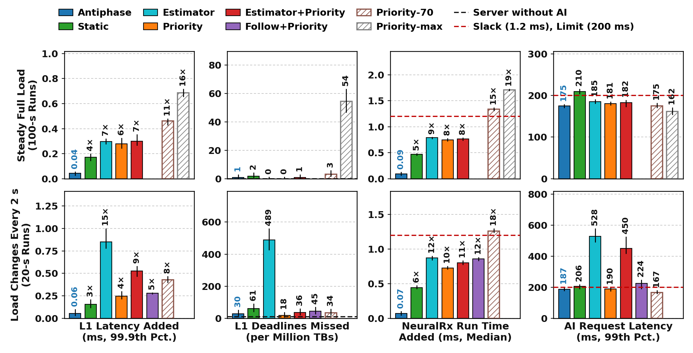</p>
<p align="center"><b>그림 24.</b> AI가 무선 작업에 더하는 지연과 AI 요청의 지연. 위는 전 부하, 아래는 2초마다 바뀌는 부하다. 기준선 막대 위의 숫자는 그 방식이 Antiphase보다 몇 배 더 늘리는가다.</p>

- 위 줄은 전 부하(100초 실행에서 처음 20초를 뺀 80초), 아래 줄은 부하가 2초마다 바뀌는 조건(20초 실행에서 처음 5초를 뺀 15초)이다. 막대가 낮을수록 좋다.
- 첫째·셋째 칸은 AI 없는 서버 대비 늘어난 값이다. 기준선 막대 위의 숫자는 "그 방식이 Antiphase보다 몇 배 더 늘리는가"다.
- 둘째 칸은 L1 마감을 넘긴 TB를 백만 개당으로 적었다. 세로선은 95% 구간이다.
- 검은 점선은 AI 없는 서버의 값, 빨간 점선은 NRx의 여유(1.2 ms)와 AI 요청의 제한(200 ms)이다.

전 부하, 정상 상태의 값은 다음과 같다(100초 실행 5개에서 처음 20초를 뺌, 방식마다 TB 320만 개). 지연은 ms다.

| 방식 | AI 처리량 (k tok/s) | 복구 유지 | L1 지연 p50 / p99.9 / p99.99 | L1 마감을 넘긴 TB | NRx 실행 p50 / p99 | AI 요청 지연 p50 / p99 | 받지 않은 요청 | GPU 유휴 |
|---|---|---|---|---|---|---|---|---|
| 기존 수신기만 (NRx 없음, AI 없음) | 0.0 | – | 1.38 / 1.49 / 1.55 | 0 / 3.20M | – | – | – | – |
| AI 없음 (NRx 있음) | 0.0 | 100.0% | 1.39 / 3.01 / 3.18 | 0 / 3.20M | 6.28 / 6.57 | – | – | 26.4% |
| **Antiphase** | **34.1** | **99.9%** | 1.81 / **3.06** / **3.18** | **3 / 3.20M** | **6.38** / 6.82 | 77 / **175** | 16.4% | 1.0% |
| 고정 10% (Static) | 5.6 | 99.3% | 1.47 / 3.18 / 3.34 | 6 / 3.20M | 6.76 / 7.05 | 120 / 210 | 64.9% | 2.1% |
| 추정기 (Estimator) | 11.0 | 98.7% | 1.54 / 3.31 / 3.47 | 0 / 3.20M | 7.07 / 7.36 | 84 / 185 | 46.8% | 1.4% |
| 낮은 우선순위 + 30% (Priority) | 17.6 | 98.8% | 1.61 / 3.29 / 3.46 | 0 / 3.20M | 7.03 / 7.29 | 79 / 181 | 33.9% | 1.5% |
| 낮은 우선순위 + 추정기 | 17.6 | 98.7% | 1.62 / 3.31 / 3.48 | 3 / 3.20M | 7.05 / 7.31 | 77 / 182 | 33.8% | 1.4% |
| 낮은 우선순위 + 70% | 42.6 | 94.3% | 1.80 / 3.47 / 3.63 | 10 / 3.20M | 7.63 / 7.98 | 73 / 175 | 9.2% | 1.1% |
| 낮은 우선순위, 한도 없음 | 48.9 | 93.7% | 1.90 / 3.70 / 3.94 | 174 / 3.20M | 8.00 / 8.53 | 61 / 162 | 4.0% | 1.7% |

100초 실행의 AI 처리량과 복구 유지율은 10초 실행의 대표 결과(4.10절: 34.1k에 99.9%)와 같다. 첫 줄은 복구 경로 없이 기존 수신기만 돌린 100초 실행이다(`campaigns/v16_long_x.sh`, 시드 5). 이 조건에서 NRx는 L1 p99.9에 1.52 ms를 더하고(여유 2.51 ms의 61%), Antiphase의 AI는 그 위에 0.04 ms를 더한다.

세 부하 조건을 함께 보면 다음과 같다(전 부하 / 2초마다 바뀜 / 무작위로 바뀜). 뒤의 두 조건은 20초와 40초 실행에서 처음 5초를 뺀 값이다.

| 지표 | Antiphase | 기준선 |
|---|---|---|
| L1 지연 p99.9의 증가 | 0.04 / 0.06 / 0.04 ms | 고정 10% 0.17 / 0.16 / 0.14. 낮은 우선순위 + 30% 0.28 / 0.25 / 0.25. 추정기 0.30 / 0.85 / 0.87. 낮은 우선순위 + 70% 0.46 / 0.43 / 0.40. 한도 없음 0.69(전 부하) |
| L1 지연 p99.99 | 3.18 ms (전 부하, AI 없음과 같음) | 3.34–3.94 ms |
| L1 마감을 넘긴 TB (백만 개당) | 0.9 / 30 / 36 | AI 없음 0 / 11 / 13. 추정기 0 / 489 / 571. 한도 없음 54(전 부하) |
| NRx 실행 중앙값의 증가 | 0.09 / 0.07 / 0.08 ms | 0.44–1.71 ms. 낮은 우선순위 + 70%와 한도 없음은 여유 1.2 ms를 넘는다 |
| AI 요청 지연 p99 (제한 200 ms) | 175 / 187 / 184 ms | 고정 10% 210 / 206 / 222. 낮은 우선순위 + 30% 181 / 190 / 195. 추정기 185 / 528 / 414. 낮은 우선순위 + 추정기 182 / 450 / 388. 낮은 우선순위 + 70% 175 / 167 / 166 |
| 배정한 요청 중 제한 안에 끝난 비율 | 99.8 / 99.0 / 99.3% | 추정기 99.4 / 84.3 / 84.0%. 낮은 우선순위 + 추정기 99.6 / 85.7 / 88.5% |
| 받지 않은 요청 | 16.4 / 9.6 / 6.9% | 고정 10% 63–65%. 낮은 우선순위 + 30% 28–34%. 낮은 우선순위 + 70% 3.8–9.2% |
| GPU 유휴 시간 | 1.0 / 2.4 / 4.0% | AI 없음 26.4 / 36.9 / 43.2% |
| NRx 옆에 AI가 있는 시간 | 2.4 / 1.7 / 1.4% | 19–38% |

읽는 법은 다음과 같다.

- **무선 보호.** 정상 상태에서 AI 없는 서버의 L1 지연 p99.9는 3.01 ms로 마감(4.0 ms)까지 0.99 ms가 남는다. Antiphase는 여기에 0.04 ms를 더하고, p99.99(3.18 ms)는 AI 없는 서버와 같다. 한도 없는 낮은 우선순위는 p99.9에 0.69 ms를 더한다. 부하가 바뀌면 추정기를 쓰는 두 방식은 결정이 1초 늦어 0.53–0.87 ms를 더하고, 낮은 우선순위가 없는 추정기 방식은 TB의 0.05%가 마감을 넘는다.
- **L1 놓침.** 시작 구간이 지나면 거의 없다. 전 부하 80초 × 시드 5에서 AI 없음 0개, Antiphase 3개, 비율 한도를 둔 기준선 0–10개, 한도 없는 방식 174개다(4.8절).
- **NRx.** 기준선은 NRx를 0.44–1.71 ms 늦춘다. 1.2 ms를 넘는 두 방식이 복구를 5.7–6.3% 잃는 방식이다(2.5절의 모델).
- **AI 지연.** Antiphase의 요청 지연 p99는 세 조건 모두 제한 안이다. 전 부하의 정상 상태에서는 기준선도 162–210 ms다. Request Dispatcher가 제때 끝낼 수 있는 요청만 받기 때문이고, GPU 시간이 적은 방식은 그만큼 요청을 받지 않는다(Antiphase 16%, 낮은 우선순위 + 30% 34%, 고정 10% 65%). 부하가 바뀌면 추정기를 쓰는 두 방식이 388–528 ms로 제한의 1.9–2.6배다.
- **GPU 시간.** AI를 넣은 방식은 모두 GPU를 89–99%의 시간 동안 채운다. 차이는 채운 시간이 무선 작업에 무엇을 하는가다. Antiphase에서 NRx 옆에 AI가 남는 시간은 1.4–2.4%(중단 뒤 끝나는 단위)이고, 기준선은 19–38%다.

Antiphase가 치르는 비용은 다음과 같다.

- **L1 지연의 중앙값은 0.38–0.42 ms 는다**(1.39 → 1.81 ms). 작은 두 단위 등급이 기존 수신기 옆에서 돌기 때문이다. 낮은 우선순위 + 70%와 같은 수준이고, 고정 10%(+0.08 ms)와 낮은 우선순위 + 30%(+0.22 ms)보다 크다. 꼬리(p99.9 +0.04 ms, p99.99 +0.00 ms)는 늘지 않는다. 이 값은 "기존 수신기 옆에 허용하는 단위 등급"이 정하고, 가장 작은 등급만 허용하면 +0.20 ms가 된다(4.14절).
- **받지 않는 요청이 6.9–16.4%다.** 대표 조건의 제공량(53k)이 Antiphase의 용량(34k)보다 크기 때문이다. 제공량이 27k 이하면 0.6% 이하다(4.16.1절). 복구를 잃는 두 방식(낮은 우선순위 + 70%, 한도 없음)은 3.8–9.2%만 받지 않는다.
- **전 부하에서 AI 요청 지연은 방식을 가르지 못한다.** 입장 제어가 있는 방식은 모두 p99가 162–210 ms다.

원본: `results/backstop_slot/sched_xa_c16_j59414960_w20.json`(전 부하), `sched_{fb,fc}_c16_j59210955_59313958_w5.json`, `sched_metrics.txt`.

### 4.8 긴 실행으로 본 L1 놓침

**한 줄 결론.** L1 마감을 넘긴 TB는 실행을 시작한 뒤 첫 몇 초에 몰려 있고 AI가 없어도 똑같이 생긴다. 20초가 지나면 Antiphase의 L1 놓침은 네 조건(16셀, GPU 1장, 20셀, 48셀) 모두에서 AI 없는 서버와 같다: 3 / 320만, 0 / 80만, 3 / 230만, 17 / 192만(AI 없음 0, 0, 2, 17). 앞서 적은 "L1 놓침 0.02–0.13%"는 이 시작 구간의 값이다.

10–40초 실행에서는 L1 놓침이 실행당 수십 개여서 방식 간 차이를 가릴 수 없었다. 그래서 100초 실행(셀마다 슬롯 40,000개)을 같은 job에서 방식을 번갈아 돌렸다(`campaigns/v16_long.sh`, 16셀과 GPU 1장은 시드 5, 20셀과 48셀은 시드 3). 스킴과 설정은 그대로이고 실행 길이만 바꿨다.

L1 마감을 넘긴 TB를 실행 시작부터의 시간대별로 세면 다음과 같다(100초 실행 5개의 합).

| 조건 | 방식 | 첫 5초 | 5–10초 | 10–20초 | 20초 이후 |
|---|---|---|---|---|---|
| 16셀, GPU 4장 | AI 없음 | 125 | 14 | 0 | 0 / 3.20M |
| | **Antiphase** | 113 | 7 | 8 | **3 / 3.20M** |
| | 고정 10% | 74 | 11 | 2 | 6 / 3.20M |
| | 추정기 | 40 | 19 | 7 | 0 / 3.20M |
| | 낮은 우선순위 + 30% | 101 | 11 | 0 | 0 / 3.20M |
| | 낮은 우선순위 + 추정기 | 74 | 8 | 0 | 3 / 3.20M |
| | 낮은 우선순위 + 70% | 185 | 13 | 13 | 10 / 3.20M |
| | 낮은 우선순위, 한도 없음 | 167 | 41 | 19 | 174 / 3.20M |
| 4셀, GPU 1장 | AI 없음 | 23 | 0 | 0 | 0 / 0.80M |
| | **Antiphase** | 64 | 2 | 1 | **0 / 0.80M** |
| | 고정 10% | 48 | 2 | 0 | 46 / 0.80M |
| | 낮은 우선순위 + 30% | 41 | 0 | 0 | 21 / 0.80M |
| 20셀, GPU 4장 (GPU당 5셀) | AI 없음 | 88 | 0 | 0 | 2 / 2.30M |
| | **Antiphase** | 99 | 0 | 2 | **3 / 2.30M** |
| | 고정 10% | 54 | 4 | 0 | 0 / 2.30M |
| | 낮은 우선순위 + 30% | 70 | 5 | 0 | 1 / 2.30M |
| 48셀, 1/3 부하 (GPU당 12셀) | AI 없음 | 30 | 0 | 0 | 17 / 1.92M |
| | **Antiphase** | 70 | 0 | 0 | **17 / 1.92M** |
| | 고정 10% | 42 | 10 | 3 | 26 / 1.92M |
| | 낮은 우선순위 + 30% | 64 | 11 | 3 | 14 / 1.92M |

- **놓침은 시작 구간에 있다.** AI 없는 서버의 139개는 모두 첫 10초에 있다. Antiphase는 131개 중 128개가 첫 20초에 있다. 프로세스가 막 떠서 CUDA 모듈과 버퍼가 처음 쓰이는 구간이고, 스케줄링 방식과 무관하게 생긴다.
- **정상 상태에서 Antiphase의 L1 놓침은 AI 없는 서버와 같다.** 16셀에서 3 / 320만(95% 구간 0.0000–0.0003%, AI 없음 0), GPU 1장에서 0 / 80만(0), 20셀에서 3 / 230만(2), 48셀에서 17 / 192만(17)이다. 두 비율의 차이는 네 조건 모두 통계 오차 안이다(z = +1.7, 0.0, +0.4, 0.0).
- **48셀에서는 AI 없이도 100만 TB에 9개가 넘는다.** GPU 하나에 최대 12셀이 한 슬롯에 활성이기 때문이고, Antiphase가 여기에 더하는 것은 없다(17개 대 17개).
- **기준선은 일부 조건에서 정상 상태에서도 놓친다.** 한도 없는 낮은 우선순위는 16셀에서 174개(0.0054%)다. GPU 1장에서는 고정 10%가 46개(0.0057%), 낮은 우선순위 + 30%가 21개(0.0026%)다.
- **이전의 약점 둘이 사라진다.** "GPU 1장에서 Antiphase의 L1 놓침이 AI 없는 서버보다 높다"(0.039% 대 0.018%)와 "48셀에서 AI를 넣은 방식 가운데 Antiphase가 가장 높다"(0.130% 대 0.090%)는 10초 실행의 시작 구간에서 나온 차이였다. 정상 상태에서는 AI 없는 서버와 같다.
- 이 문서의 다른 절에 적힌 L1 놓침은 10–40초 실행의 값이다. 같은 길이의 실행끼리 비교한 값으로 읽어야 하고, 정상 상태의 비율이 아니다.

GPU 1장의 정상 상태 값(100초 실행 5개, 처음 20초 제외)은 다음과 같다.

| 방식 | AI 처리량 (k tok/s) | 복구 유지 | L1 지연 p50 / p99.9 / p99.99 | L1 마감을 넘긴 TB | NRx 실행 p50 / p99 | AI 요청 지연 p50 / p99 | 받지 않은 요청 |
|---|---|---|---|---|---|---|---|
| AI 없음 | 0.0 | 100.0% | 1.34 / 3.01 / 3.09 | 0 / 0.80M | 6.16 / 6.40 | – | – |
| **Antiphase** | **8.2** | **100.0%** | 1.73 / **2.96** / **3.08** | **0 / 0.80M** | **6.28** / 6.74 | 70 / 162 | 20.7% |
| 고정 10% | 1.1 | 100.0% | 1.40 / 3.05 / 4.55 | 46 / 0.80M | 6.69 / 6.97 | 121 / 194 | 73.0% |
| 낮은 우선순위 + 30% | 3.9 | 100.0% | 1.50 / 3.15 / 3.54 | 21 / 0.80M | 6.93 / 7.21 | 72 / 170 | 42.8% |

20셀과 48셀의 정상 상태 값(100초 실행 3개, 처음 20초 제외)은 다음과 같다.

| 조건 | 방식 | AI 처리량 (k tok/s) | 복구 유지 | L1 지연 p50 / p99.9 / p99.99 | L1 마감을 넘긴 TB | NRx 실행 p50 / p99 | AI 요청 지연 p50 / p99 |
|---|---|---|---|---|---|---|---|
| 20셀 | AI 없음 | 0.0 | 100.0% | 1.51 / 3.18 / 3.30 | 2 / 2.30M | 6.39 / 6.72 | – |
| | **Antiphase** | **32.1** | **99.8%** | 1.92 / **3.21** / **3.32** | **3 / 2.30M** | **6.53** / 6.98 | 77 / 176 |
| | 고정 10% | 5.6 | 98.7% | 1.60 / 3.36 / 3.51 | 0 / 2.30M | 6.95 / 7.25 | 118 / 211 |
| | 낮은 우선순위 + 30% | 17.1 | 97.6% | 1.71 / 3.43 / 3.61 | 1 / 2.30M | 7.17 / 7.47 | 79 / 186 |
| 48셀 | AI 없음 | 0.0 | 100.0% | 1.52 / 3.25 / 3.47 | 17 / 1.92M | 6.26 / 6.80 | – |
| | **Antiphase** | **33.0** | **99.8%** | 1.87 / **3.28** / **3.52** | **17 / 1.92M** | **6.44** / 7.03 | 77 / 180 |
| | 고정 10% | 5.6 | 99.5% | 1.60 / 3.42 / 3.67 | 26 / 1.92M | 6.85 / 7.38 | 120 / 212 |
| | 낮은 우선순위 + 30% | 17.3 | 98.9% | 1.75 / 3.46 / 3.71 | 14 / 1.92M | 7.08 / 7.60 | 78 / 184 |

- 20셀과 48셀에서 Antiphase는 L1 지연 p99.9를 0.03 ms 늘린다. 고정 10%는 0.16–0.17 ms(5.7–6.3배), 낮은 우선순위 + 30%는 0.21–0.25 ms(7.2–9.1배)다.
- AI 처리량은 고정 10%의 5.7–5.9배, 낮은 우선순위 + 30%의 1.9배로 10초 실행의 값(4.16.3절)과 같다.

원본: `results/backstop_slot/warmup_{xa_c16,xs_c4,xv_c20,xn_c48}_j59414960.json`, `sched_{xa_c16,xs_c4,xv_c20,xn_c48}_j59414960_w20.json`. 분석은 `analyze_warmup.py`와 `WARMUP_S=20 analyze_sched.py`다. 20셀의 두 실행과 48셀의 두 실행은 다른 실행과 겹쳐 돌아 버렸고(`_collision` 접미사로 보존) 같은 job에서 다시 쟀다.

### 4.9 닫힌 루프 link adaptation: 방식별 셀 goodput

> **한 줄 결론.** outer loop가 MCS를 고르면 복구 경로는 2-UE 셀의 goodput을 상관 높은 채널에서 **11–40%**, 상관 낮은 채널에서 4–9% 올린다. AI를 넣으면 비율 방식은 최대 8.2%를 잃고, Antiphase는 마흔두 조건 모두에서 손실이 0.5% 이하다(41개 조건은 0.3% 이하, 가장 큰 조건은 실행 16개 평균 0.36%: 4.9.10절). 4.9.2–4.9.7절은 상관 높은 채널의 16 dB이고, 다른 Es/No·다른 채널·계단으로 변하는 채널은 4.9.8절, 연속으로 변하는 채널과 섞인 채널은 4.9.9절이다.

4.18.2–4.18.3절은 MCS를 고정하고 잰 오류율의 계산이다. 이 절은 outer-loop link adaptation을 런타임에 넣어 2-UE 셀이 슬롯마다 MCS를 고르게 하고, GPU를 나누는 방식별로 셀 goodput을 쟀다(job 59345188, 59362400; `la_cl.sh`, `la_cl2.sh`, `analyze_la_closed.py`).

실험 전의 예상은 "rate control이 복구 경로를 믿고 MCS를 올린 상태에서 복구를 6–10% 잃으면 MCS가 한 단계 내려가고 goodput이 약 10% 준다"였다. 측정은 이 예상과 다르다.

| 질문 | 측정 |
|---|---|
| 복구를 잃으면 MCS가 한 단계 내려가는가 | 내려가지 않는다. outer loop는 이웃한 단계에 머무는 시간의 비를 바꾼다. 평균 MCS의 변화는 최대 0.64단계다 |
| 재전송이 느는가 | 늘지 않는다. 재전송이 필요한 TB의 비율은 모든 방식에서 목표와 같다 |
| goodput은 얼마나 주는가 | 16 dB의 아홉 조건: 목표 10%에서 1.0% 이하, 목표 3%에서 3.9% 이하(GPU 4장·2-UE 셀 4개는 1.4% 이하), 목표 1%에서 최대 8.2%. 다른 조건(4.9.8절): 14 dB의 목표 10%에서 최대 2.5%, 상관 낮은 채널에서 0.4% 이하. 가장 큰 값은 목표 1%, 2-UE 셀 8개에서 낮은 우선순위만 쓴 방식이다 |
| Antiphase는 | 아홉 조건 가운데 여덟에서 AI 없는 실행의 0.3% 안이다(−0.2 ~ +0.2%). 2-UE 셀 8개·목표 1%는 이 절의 측정에서 0.34%, 시드를 늘린 실행 16개의 평균으로 0.36%다(4.9.10절) |
| 복구 경로의 이득은 | 목표 10%에서 +10.9–12.0%, 목표 3%에서 +25.9–31.1%, 목표 1%에서 +24.4–31.0% |

#### 4.9.1 방법

| 항목 | 값 |
|---|---|
| 채널 | 2-UE 셀은 상관 높은 채널(DoubleTDLhigh), Es/No 16 dB. 단일 UE 셀은 4.10절과 같다 |
| MCS 단계 | MCS 10–16의 7단계. 단계마다 슬롯 768개를 따로 생성했고, 셀은 그 가운데 512개를 반복한다 |
| outer loop | 셀마다 단계 위의 포인터 하나. 재전송이 필요한 TB마다 δ만큼 내리고, 그렇지 않은 TB마다 δ·τ/(1−τ)만큼 올린다(δ = 0.25단계, τ = 목표). 슬롯의 MCS는 포인터의 정수 부분이다. ACK와 NACK의 계단 비로 오류율 목표를 정하는 일반적인 outer-loop link adaptation이다 |
| 재전송이 필요한 TB | 기존 수신기가 복호하지 못했고, NRx가 복구 마감(11.5 ms) 전에 복구하지도 못한 TB |
| 피드백 | 슬롯의 결과를 6 UL 주기(15 ms) 뒤에 포인터에 반영한다 |
| 목표 τ | 10%, 3%, 1% |
| goodput | (TB 비트의 합) / (TB 수 + 재전송 수 / 0.95). 사용자의 UL 슬롯 하나가 나르는 새 데이터다. 재전송은 그 사용자의 UL 슬롯 하나를 쓰고 95% 성공한다 |
| 실행 | 8,000 주기(20초), 앞의 800 주기는 제외. AI 53k tokens/s 제공(GPU 2장 26.5k, 1장 13.2k). 방식은 4.11절과 같다 |
| 런타임 | 셀 worker가 슬롯의 단계를 공유 상태에 적고, NRx lane은 그 단계의 rate recovery와 LDPC 설정으로 전환한다. NRx 엔진은 하나다 |

고정 MCS에서 잰 단계별 오류율(Es/No 16 dB, TB 1,536개, 시간 제한 없음):

| MCS | 10 | 11 | 12 | 13 | 14 | 15 | 16 |
|---|---|---|---|---|---|---|---|
| TB 비트 | 52,224 | 58,384 | 67,584 | 75,792 | 83,976 | 94,248 | 100,392 |
| 기존 수신기의 오류율 | 1.4% | 3.3% | 7.0% | 13.3% | 29.6% | 49.7% | 65.5% |
| 복구 뒤의 오류율 | 0.1% | 0.1% | 0.7% | 2.7% | 13.0% | 34.9% | 55.5% |

#### 4.9.2 16셀, GPU 4장, 2-UE 셀 4개

<p align="center">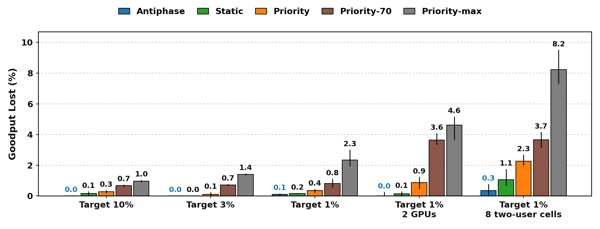</p>
<p align="center"><b>그림 25.</b> rate control을 넣었을 때 방식별로 2-UE 셀이 잃는 goodput(AI 없는 서버 대비).</p>

막대는 AI를 넣었을 때 2-UE 셀이 잃는 goodput(AI 없는 서버 대비)이다. Antiphase는 다섯 조건 모두 0.4% 이하다. AI 처리량과 함께 그린 그림은 [closed_loop_link_adaptation.png](docs/current/figures/backstop_v14/closed_loop_link_adaptation.png)다.

그림의 세로축은 2-UE 셀의 goodput(AI 없는 복구 경로 대비), 가로축은 AI 처리량이다. 세로 막대는 시드의 범위다.

목표 10%:

| 방식 | 시드 | 평균 MCS | 재전송이 필요한 TB | goodput (bits/사용자 슬롯) | 복구 경로 없음 대비 | AI 없는 복구 경로 대비 | 후보가 난 슬롯 | NRx를 못 받은 후보 | 마감 뒤에 끝난 NRx | AI 처리량 | L1 놓침 |
|---|---|---|---|---|---|---|---|---|---|---|---|
| 복구 경로 없음 | 3 | 12.46 | 10.0% | 64.6k | – | −10.7% | 18.1% | – | – | – | 0.008% |
| 복구 경로 없음 + 낮은 우선순위 AI(한도 없음) | 2 | 12.47 | 10.0% | 64.6k | – | −10.6% | 18.1% | – | – | 53.0k | 0.011% |
| 복구 경로, AI 없음 | 3 | 13.50 | 10.0% | 72.3k | +12.0% | – | 28.7% | 6.7% | 0.0% | – | 0.016% |
| **Antiphase** | 3 | 13.50 | 10.0% | 72.3k | +12.0% | +0.0% | 28.7% | 7.0% | 0.0% | 11.4k | 0.023% |
| Antiphase의 다른 설정: 빈 NRx 여유 3 | 2 | 13.50 | 10.0% | 72.3k | +11.9% | −0.0% | 28.6% | 7.3% | 0.0% | 12.0k | 0.020% |
| Antiphase의 다른 설정: 빈 NRx 여유 1 | 2 | 13.46 | 10.0% | 72.0k | +11.4% | −0.4% | 28.3% | 10.9% | 0.0% | 17.5k | 0.026% |
| 고정 10% | 3 | 13.49 | 10.0% | 72.2k | +11.8% | −0.1% | 28.4% | 8.6% | 0.0% | 4.6k | 0.018% |
| 낮은 우선순위 + 30% | 3 | 13.47 | 10.0% | 72.1k | +11.7% | −0.3% | 28.4% | 9.7% | 0.0% | 11.5k | 0.019% |
| 낮은 우선순위 + 70% | 3 | 13.44 | 10.0% | 71.8k | +11.2% | −0.7% | 27.9% | 14.2% | 0.1% | 25.4k | 0.032% |
| 낮은 우선순위, 한도 없음 | 3 | 13.41 | 10.0% | 71.6k | +10.9% | −1.0% | 27.5% | 14.7% | 3.0% | 30.1k | 0.083% |

목표 3%:

| 방식 | 시드 | 평균 MCS | 재전송이 필요한 TB | goodput (bits/사용자 슬롯) | 복구 경로 없음 대비 | AI 없는 복구 경로 대비 | 후보가 난 슬롯 | NRx를 못 받은 후보 | 마감 뒤에 끝난 NRx | AI 처리량 | L1 놓침 |
|---|---|---|---|---|---|---|---|---|---|---|---|
| 복구 경로 없음 | 2 | 10.68 | 3.0% | 54.8k | – | −23.7% | 5.6% | – | – | – | 0.009% |
| 복구 경로 없음 + 낮은 우선순위 AI(한도 없음) | 2 | 10.68 | 3.0% | 54.8k | – | −23.7% | 5.6% | – | – | 53.0k | 0.011% |
| 복구 경로, AI 없음 | 2 | 12.79 | 3.0% | 71.8k | +31.1% | – | 21.7% | 2.5% | 0.0% | – | 0.011% |
| **Antiphase** | 2 | 12.80 | 3.0% | 71.9k | +31.3% | +0.2% | 21.7% | 2.8% | 0.0% | 19.8k | 0.018% |
| 고정 10% | 2 | 12.81 | 3.0% | 72.0k | +31.4% | +0.2% | 21.6% | 3.7% | 0.0% | 5.0k | 0.030% |
| 낮은 우선순위 + 30% | 2 | 12.78 | 3.0% | 71.7k | +31.0% | −0.1% | 21.3% | 4.5% | 0.0% | 14.0k | 0.025% |
| 낮은 우선순위 + 70% | 2 | 12.73 | 3.0% | 71.3k | +30.2% | −0.7% | 20.8% | 7.1% | 0.1% | 32.8k | 0.029% |
| 낮은 우선순위, 한도 없음 | 2 | 12.67 | 3.0% | 70.8k | +29.3% | −1.4% | 20.1% | 7.3% | 2.1% | 39.4k | 0.044% |

목표 1%:

| 방식 | 시드 | 평균 MCS | 재전송이 필요한 TB | goodput (bits/사용자 슬롯) | 복구 경로 없음 대비 | AI 없는 복구 경로 대비 | 후보가 난 슬롯 | NRx를 못 받은 후보 | 마감 뒤에 끝난 NRx | AI 처리량 | L1 놓침 |
|---|---|---|---|---|---|---|---|---|---|---|---|
| 복구 경로 없음 | 3 | 10.00 | 1.6% | 51.4k | – | −23.7% | 3.0% | – | – | – | 0.009% |
| 복구 경로 없음 + 낮은 우선순위 AI(한도 없음) | 2 | 10.00 | 1.7% | 51.3k | – | −23.9% | 3.1% | – | – | 53.0k | 0.023% |
| 복구 경로, AI 없음 | 3 | 12.06 | 1.0% | 67.3k | +31.0% | – | 14.1% | 0.1% | 0.0% | – | 0.014% |
| **Antiphase** | 3 | 12.05 | 1.0% | 67.2k | +30.9% | −0.1% | 14.0% | 0.2% | 0.0% | 33.7k | 0.019% |
| Antiphase의 다른 설정: 빈 NRx 여유 3 | 2 | 12.06 | 1.0% | 67.3k | +31.2% | −0.2% | 14.0% | 0.4% | 0.0% | 35.2k | 0.028% |
| Antiphase의 다른 설정: 빈 NRx 여유 1 | 2 | 12.01 | 1.0% | 66.9k | +30.4% | −0.8% | 13.6% | 1.5% | 0.1% | 40.1k | 0.035% |
| 고정 10% | 3 | 12.04 | 1.0% | 67.2k | +30.8% | −0.2% | 14.0% | 0.3% | 0.0% | 5.6k | 0.014% |
| 낮은 우선순위 + 30% | 3 | 12.03 | 1.0% | 67.1k | +30.6% | −0.4% | 13.9% | 0.7% | 0.0% | 18.0k | 0.021% |
| 낮은 우선순위 + 70% | 3 | 11.99 | 1.0% | 66.7k | +30.0% | −0.8% | 13.6% | 1.6% | 0.1% | 41.9k | 0.014% |
| 낮은 우선순위, 한도 없음 | 3 | 11.88 | 1.0% | 65.7k | +28.0% | −2.3% | 12.6% | 1.4% | 2.0% | 49.0k | 0.040% |

- "복구 경로 없음"의 목표 1%는 가장 낮은 단계(MCS 10)에서도 재전송이 1.6%여서 목표를 맞추지 못한다. 더 낮은 단계가 있으면 goodput이 더 낮아지므로 복구 경로의 이득(+31.0%)은 하한이다.
- "NRx를 못 받은 후보"와 "마감 뒤에 끝난 NRx"는 후보(실패 code block이 9개 이하인 슬롯) 가운데의 비율이다. 복구를 잃은 방식은 MCS가 내려가 후보 자체도 준다.

#### 4.9.3 NRx 수요가 크거나 서버가 작은 조건

칸은 "AI 처리량 / goodput(AI 없는 복구 경로 대비) / 평균 MCS의 변화"다. 2-UE 셀 8개는 16셀·GPU 4장, GPU 2장은 8셀·2-UE 셀 2개, GPU 1장은 4셀·2-UE 셀 1개다.

| 조건 | 시드 | 복구 경로의 이득 (평균 MCS) | AI 없음: 후보가 난 슬롯 / NRx를 못 받은 후보 | **Antiphase** | 고정 10% | 낮은 우선순위 + 30% | 낮은 우선순위 + 70% | 낮은 우선순위, 한도 없음 |
|---|---|---|---|---|---|---|---|---|
| GPU 4장, 2-UE 셀 4개, 목표 10% | 3 | +12.0% (12.46 → 13.50) | 28.7% / 6.7% | 11.4k / +0.0% / +0.00 | 4.6k / −0.1% / −0.01 | 11.5k / −0.3% / −0.03 | 25.4k / −0.7% / −0.06 | 30.1k / −1.0% / −0.09 |
| GPU 4장, 2-UE 셀 4개, 목표 3% | 2 | +31.1% (10.68 → 12.79) | 21.7% / 2.5% | 19.8k / +0.2% / +0.01 | 5.0k / +0.2% / +0.02 | 14.0k / −0.1% / −0.01 | 32.8k / −0.7% / −0.06 | 39.4k / −1.4% / −0.13 |
| GPU 4장, 2-UE 셀 4개, 목표 1% | 3 | +31.0% (10.00 → 12.06) | 14.1% / 0.1% | 33.7k / −0.1% / −0.01 | 5.6k / −0.2% / −0.01 | 18.0k / −0.4% / −0.03 | 41.9k / −0.8% / −0.06 | 49.0k / −2.3% / −0.18 |
| 2-UE 셀 8개, 목표 3% | 2 | +25.9% (10.68 → 12.43) | 18.1% / 15.4% | 6.8k / −0.2% / −0.02 | 4.4k / −0.7% / −0.06 | 10.3k / −1.2% / −0.10 | 21.5k / −2.0% / −0.17 | 28.2k / −3.9% / −0.33 |
| 2-UE 셀 8개, 목표 1% | 3 | +26.5% (10.00 → 11.79) | 11.9% / 4.9% | 17.0k / −0.3% / −0.03 | 5.0k / −1.1% / −0.08 | 14.3k / −2.3% / −0.16 | 34.1k / −3.7% / −0.27 | 45.5k / −8.2% / −0.64 |
| GPU 2장, 목표 10% | 2 | +10.9% (12.46 → 13.41) | 28.4% / 14.1% | 7.0k / −0.1% / −0.01 | 2.2k / −0.3% / −0.03 | 5.9k / −0.3% / −0.02 | 14.7k / −0.8% / −0.08 | 17.0k / −1.0% / −0.10 |
| GPU 2장, 목표 3% | 2 | +26.0% (10.82 → 12.58) | 20.0% / 8.5% | 11.9k / +0.1% / +0.01 | 2.4k / −0.2% / −0.02 | 7.3k / −0.4% / −0.03 | 18.2k / −1.1% / −0.10 | 21.1k / −1.6% / −0.14 |
| GPU 2장, 목표 1% | 3 | +29.2% (10.00 → 11.94) | 12.8% / 2.7% | 17.6k / +0.0% / +0.00 | 2.6k / −0.1% / −0.01 | 9.0k / −0.9% / −0.07 | 21.9k / −3.6% / −0.27 | 24.7k / −4.6% / −0.34 |
| GPU 1장, 목표 1% | 2 | +24.4% (10.00 → 11.67) | 10.1% / 8.3% | 9.0k / −0.0% / −0.00 | 1.1k / −0.0% / −0.00 | 4.5k / −0.3% / −0.02 | 10.2k / −2.4% / −0.17 | 11.5k / −2.5% / −0.18 |

#### 4.9.4 outer loop의 계단 크기

계단 δ를 0.25단계에서 0.5단계로 바꿔 두 조건을 다시 쟀다(시드 1).

| 조건 | 시드 | 복구 경로의 이득 (평균 MCS) | AI 없음: 후보가 난 슬롯 / NRx를 못 받은 후보 | **Antiphase** | 고정 10% | 낮은 우선순위 + 30% | 낮은 우선순위 + 70% | 낮은 우선순위, 한도 없음 |
|---|---|---|---|---|---|---|---|---|
| GPU 4장, 2-UE 셀 4개, 목표 10%, δ = 0.25 | 3 | +12.0% (12.46 → 13.50) | 28.7% / 6.7% | 11.4k / +0.0% / +0.00 | 4.6k / −0.1% / −0.01 | 11.5k / −0.3% / −0.03 | 25.4k / −0.7% / −0.06 | 30.1k / −1.0% / −0.09 |
| 같은 조건, δ = 0.5 | 1 | +11.5% (12.28 → 13.23) | 25.7% / 4.2% | 13.7k / −0.1% / −0.01 | – | – | 26.4k / −0.4% / −0.04 | 32.0k / −0.6% / −0.06 |
| 2-UE 셀 8개, 목표 1%, δ = 0.25 | 3 | +26.5% (10.00 → 11.79) | 11.9% / 4.9% | 17.0k / −0.3% / −0.03 | 5.0k / −1.1% / −0.08 | 14.3k / −2.3% / −0.16 | 34.1k / −3.7% / −0.27 | 45.5k / −8.2% / −0.64 |
| 같은 조건, δ = 0.5 | 1 | +25.3% (10.05 → 11.77) | 11.6% / 4.9% | 17.4k / −0.3% / −0.03 | – | 13.8k / −1.8% / −0.14 | 33.0k / −3.1% / −0.24 | 43.6k / −6.5% / −0.52 |

- 계단 0.5에서 방식의 순서와 손실의 크기 범위는 같다. 목표 10%: 낮은 우선순위 + 70% −0.4%, 한도 없음 −0.6%(계단 0.25: −0.7%, −1.0%). 2-UE 셀 8개, 목표 1%: 낮은 우선순위 + 30% −1.8%, + 70% −3.1%, 한도 없음 −6.5%(계단 0.25: −2.3%, −3.7%, −8.2%).
- Antiphase는 −0.1%와 −0.3%다.
- 계단이 크면 포인터가 넓은 범위의 단계를 오간다(목표 10%에서 MCS 11–15). 평균 MCS와 복구 경로의 이득이 조금 낮다(+11.5%, +25.3%).

#### 4.9.5 읽는 법

- **복구 경로의 이득은 닫힌 루프에서 고정 MCS의 계산보다 크다.** 고정 MCS(4.18.1절)는 +5.6%였다. outer loop가 복구 뒤의 오류율로 MCS를 고르면 목표 10%에서 평균 MCS가 12.46에서 13.50으로 올라 +12.0%다(4.18.3절에서 같은 Es/No의 계산은 +14.4%). 목표 3%와 1%에서는 +24–31%다. 이 채널에서 기존 수신기의 오류율은 MCS를 내려도 천천히 줄어(MCS 10에서 1.4%), 복구 경로가 없으면 엄격한 목표를 맞추려고 약 두 단계를 내려야 한다.
- **outer loop는 잃은 복구를 재전송이 아니라 낮은 MCS로 바꾼다.** 재전송이 필요한 TB의 비율은 모든 방식에서 목표와 같다(10.0%, 3.0%, 1.0%). 복구를 잃은 방식은 낮은 단계에 머무는 슬롯이 많다. 목표 1%에서 MCS 11 이하의 슬롯은 AI 없는 실행 5%, 낮은 우선순위만 쓴 방식 17%다. 2-UE 셀 8개에서는 23%와 70%다.
- **MCS는 한 단계 내려가지 않는다.** outer loop는 이웃한 단계를 오가며 평균 오류율을 목표에 맞춘다. 잃은 복구가 오류율을 올린 만큼만 낮은 단계의 시간이 는다. 평균 MCS의 변화는 최대 0.64단계다(TB 크기는 단계마다 7–16% 다르다).
- **같은 손실의 비용은 목표가 엄격할수록 크다.** 후보의 1%를 더 잃을 때 goodput은 목표 10%에서 0.09%, 목표 3%에서 0.15–0.37%, 목표 1%에서 0.5–0.8% 준다(고정 MCS의 계산은 잃은 복구 1%에 0.056%p). 복구 뒤의 오류율이 MCS 한 단계에 변하는 폭은 목표 10% 근처(MCS 13 → 14)에서 10.3%p, 목표 1% 근처(MCS 12 → 13)에서 2.0%p다. 같은 오류율 증가를 메우는 데 필요한 MCS 이동이 다섯 배다.
- **손실이 크게 보이는 조건은 엄격한 목표와 큰 NRx 수요의 조합이다.** 목표 1%, 2-UE 셀 8개: 낮은 우선순위 + 30% −2.3%, + 70% −3.7%, 한도 없음 −8.2%(평균 MCS −0.64단계, 시드별 −7.3 ~ −9.5%). 목표 1%, GPU 2장: −0.9%, −3.6%, −4.6%. 목표 1%, GPU 1장: −0.3%, −2.4%, −2.5%. 이 세 조건에서 낮은 우선순위 + 30%는 Antiphase보다 AI를 적게 처리하고(14.3k 대 17.0k, 9.0k 대 17.6k, 4.5k 대 9.0k) goodput도 낮다.
- **Antiphase는 아홉 조건 모두에서 goodput을 AI 없는 실행의 0.4% 안으로 유지한다**(−0.34 ~ +0.2%, 시드별 −0.7 ~ +0.3%). 가장 큰 조건인 2-UE 셀 8개·목표 1%는 시드를 아홉 개로 늘려 0.36%다(4.9.10절). AI 처리량은 NRx가 도는 시간에 따라 달라, GPU 4장에서 6.8k–33.7k다.
- **목표 10%에서 비율 방식이 치르는 값.** outer loop가 MCS를 올려 후보가 난 슬롯이 28.7%가 되고(목표 1%에서 14.1%), NRx가 시간의 68%를 돈다. AI 없이도 후보의 6.7%가 NRx를 받지 못한다. Antiphase는 NRx가 쉬는 시간에 AI를 돌려 11.4k를 처리하고 goodput을 지킨다(0.0%). 비율 방식은 도는 NRx 옆에서 AI를 돌린다. 낮은 우선순위 + 30%는 11.5k를 처리하고 goodput 0.3%를 내고, + 70%는 25.4k에 0.7%, 한도 없음은 30.1k에 1.0%를 낸다. 같은 세 한도가 2-UE 셀 8개의 목표 1%에서는 2.3%, 3.7%, 8.2%를 낸다. 한도의 값은 부하를 알기 전에는 알 수 없다. NRx 옆의 AI를 허용하는 Antiphase의 다른 설정은 빈 NRx 여유 3이 12.0k에 0.0%, 여유 1이 17.5k에 0.4%다. 2-UE 셀 8개의 목표 3%에서 Antiphase는 6.8k를 처리하고 0.2% 안에 있고, 낮은 우선순위 + 30%는 10.3k를 처리하고 1.2%를 낸다(4.9.6절).
- **복구 경로는 AI 시간을 쓴다.** 복구 경로가 없으면 낮은 우선순위 AI가 제공량 전부(53.0k)를 처리하고 2-UE 셀의 goodput은 10.6–23.9% 낮다. 복구 경로를 쓰고 goodput을 유지할 때의 AI 처리량은 목표 10%에서 11.4k, 3%에서 19.8k, 1%에서 33.7k다.
- **L1 놓침.** 낮은 우선순위만 쓴 방식은 0.025–0.260%로 AI 없는 실행(0.009–0.016%, GPU 1장 0.061%)보다 높다. Antiphase는 0.013–0.043%다.
- **논리.** 닫힌 루프의 측정이 뒷받침하는 문장은 셋이다. (1) 복구 경로는 용량을 늘린다(+10.9–31.1%). (2) 복구를 잃으면 outer loop가 MCS를 내려 그 용량을 깎는다. 깎이는 폭은 목표가 엄격하고 NRx 수요가 용량에 가까울수록 크다(16 dB의 목표 10%에서 1.0% 이하, 목표 1%에서 최대 8.2%). (3) Antiphase는 그 용량을 0.5% 안에서 유지한다(41개 조건에서 0.3% 안). "복구를 잃으면 goodput이 약 10% 준다"는 문장은 쓰지 않는다.
- 한계: 여기까지의 아홉 조건은 채널 하나, Es/No 하나(16 dB), 고정된 채널 통계(슬롯 512개 반복)다. 다른 Es/No, 상관 낮은 채널, 2초마다 변하는 채널은 4.9.8절에서 쟀다. "복구 경로 없음"의 목표 1%는 가장 낮은 단계에서 목표를 맞추지 못한다. 재전송은 계산이다(HARQ 결합 없음, 성공 확률 0.95). outer loop는 포인터 한 가지 형태(계단 0.25와 0.5)만 쟀다. 한 단계에 머물다가 오류율이 문턱을 넘으면 내려가는 link adaptation은 재지 않았다. 그 방식에서는 손실이 0이거나 한 단계의 차이다. 목표 3%와 GPU 1장, 2-UE 셀 8개의 목표 3%는 시드 2, 계단 0.5는 시드 1이다.

#### 4.9.6 AI 처리량을 정하는 것: NRx가 쉬는 시간

Antiphase는 NRx가 쉬는 시간에 GPU를 AI에 다 주고, 비율 방식은 항상 GPU의 일부를 AI에 준다. 그래서 Antiphase의 AI 처리량은 NRx가 쉬는 시간을 따라간다. AI 없는 실행의 기록에서 NRx가 도는 시간을 쟀다(`analyze_optimum.py`).

| 조건 | NRx가 도는 시간 | NRx가 쉬는 시간 | Antiphase의 AI 처리량 (AI 없는 서버 대비 goodput) | 낮은 우선순위 + 30% (goodput) | AI 처리량의 배수 | 미래를 아는 스케줄 (추정) |
|---|---|---|---|---|---|---|
| 목표 1% | 36% | 64% | 33.7k (−0.1%) | 18.0k (−0.4%) | 1.9배 | 49.0k |
| 목표 3% | 54% | 46% | 19.8k (+0.2%) | 14.0k (−0.1%) | 1.4배 | 39.4k |
| 목표 1%, 2-UE 셀 8개 | 59% | 41% | 17.0k (−0.3%) | 14.3k (−2.3%) | 1.2배 | 35.2k |
| 목표 10% | 68% | 32% | 11.4k (0.0%) | 11.5k (−0.3%) | 1.0배 | 27.8k |
| 참고: 전 부하, 고정 MCS (4.10절) | 36% | 64% | 34.1k | 18.0k | 1.9배 | 49.0k |

- **쉬는 시간이 64%면 1.9배, 32%면 같은 양이다.** "쉬는 시간 동안 GPU 전부"와 "항상 GPU의 30%"를 비교하는 것이므로, 쉬는 시간이 30%에 가까워지면 두 양이 같아진다.
- **목표 10%에서 NRx가 쉬지 못하는 이유.** outer loop는 재전송이 필요한 TB가 10%가 될 때까지 MCS를 올린다. 실패가 많아지고 그 실패가 NRx로 간다. 슬롯의 28.7%에서 후보가 나고 NRx는 한 번에 2.5슬롯을 쓴다.
- **같은 양을 처리해도 무선에 하는 일은 다르다.** 목표 10%를 100초 실행으로 재면(4.7절) 두 방식 모두 11.5k를 처리한다. 낮은 우선순위 + 30%는 NRx 옆에서 AI를 돌려 복구를 4.2% 잃고 goodput 0.2%를 내며, L1 p99.9에 0.29 ms를 더해 마감 여유를 0.60 ms로 줄이고, L1 마감을 넘긴 TB가 115만 개 중 11개다. Antiphase는 복구 0.9%, goodput 0.0%, L1 +0.03 ms(여유 0.86 ms), 3개다. 같은 한도가 2-UE 셀 8개에서는 AI를 덜 처리하면서 goodput 2.3%를 낸다.
- **NRx가 도는 시간은 Antiphase가 쓰지 않는 시간이다.** 미래를 아는 스케줄은 그 시간의 일부를 AI에 줄 수 있어 27.8k–49.0k를 처리한다. Antiphase는 그 41–69%다(4.12절과 같은 계산).

원본: `results/backstop_slot/optimum_gap_closed.txt`, `la_closed_{laa,lac,lab,laf}.txt`.

#### 4.9.7 한도를 바꿔 가며 본 goodput과 AI 처리량

> **한 줄 결론.** 한도 값을 잘 고르는 것으로는 Antiphase를 대신하지 못한다. 한도를 올리면 AI와 함께 goodput 손실이 늘고, 2-UE 셀 8개에서는 한도를 10%로 내려도 0.8–0.9%를 잃는다. 네 조건 모두에서 Antiphase의 설정이 같은 손실 이하로 AI를 더 처리한다.

낮은 우선순위의 한도를 20–70%와 한도 없음으로 바꾸고, Antiphase는 NRx 옆의 AI를 허용하는 설정(빈 NRx 여유 3, 2, 1)까지 함께 쟀다. 조건은 넷이고 시드는 3개다. 한 시드의 모든 방식을 같은 job에서 돌렸다(job 59423316, 59439086, `campaigns/v17_frontier.sh`).

<p align="center">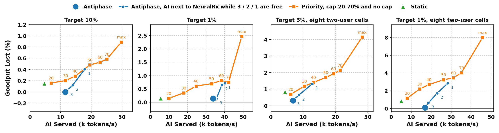</p>
<p align="center"><b>그림 26.</b> 한도를 바꿔 가며 본 AI 처리량과 잃은 goodput. 주황 선은 낮은 우선순위의 한도, 큰 파란 점은 Antiphase, 파란 선은 빈 NRx 여유를 둔 Antiphase의 다른 설정이다.</p>

가로축은 AI 처리량, 세로축은 AI 없는 서버 대비 잃은 goodput이다. 오른쪽 아래가 좋다. 주황 선은 한도(숫자는 한도 값, max는 한도 없음), 초록 세모는 고정 10%, 큰 파란 점은 Antiphase, 파란 선은 Antiphase의 다른 설정(숫자는 빈 NRx 여유)이다.

칸은 "AI 처리량 / 잃은 goodput"이다.

| 조건 | **Antiphase** | 고정 10% | 한도 20% | 한도 30% | 한도 50% | 한도 70% | 한도 없음 |
|---|---|---|---|---|---|---|---|
| 2-UE 셀 4개, 목표 10% | **11.5k / 0.0%** | 4.7k / 0.2% | 6.9k / 0.2% | 11.6k / 0.2% | 19.6k / 0.5% | 25.1k / 0.6% | 29.8k / 0.9% |
| 2-UE 셀 4개, 목표 1% | **33.8k / 0.1%** | 5.5k / 0.2% | 9.9k / 0.2% | 17.9k / 0.4% | 32.9k / 0.7% | 42.1k / 0.8% | 49.2k / 2.5% |
| 2-UE 셀 8개, 목표 3% | **6.9k / 0.3%** | 4.4k / 0.8% | 6.2k / 0.7% | 10.4k / 1.2% | 17.0k / 1.7% | 21.4k / 2.1% | 28.3k / 4.2% |
| 2-UE 셀 8개, 목표 1% | **16.9k / 0.1%** | 4.9k / 0.9% | 8.0k / 1.2% | 14.2k / 2.2% | 26.2k / 3.2% | 35.1k / 4.0% | 45.7k / 8.0% |

Antiphase의 다른 설정(빈 NRx 여유 3 / 2 / 1):

| 조건 | 여유 3 | 여유 2 | 여유 1 |
|---|---|---|---|
| 2-UE 셀 4개, 목표 10% | 12.1k / 0.0% | 13.9k / 0.1% | 17.9k / 0.4% |
| 2-UE 셀 4개, 목표 1% | 35.6k / 0.1% | 38.5k / 0.7% | 40.1k / 0.7% |
| 2-UE 셀 8개, 목표 3% | 7.1k / 0.4% | 8.7k / 0.7% | 12.8k / 1.3% |
| 2-UE 셀 8개, 목표 1% | 18.6k / 0.6% | 23.0k / 1.7% | 28.3k / 2.9% |

- **goodput을 0.3% 안에서 지키는 한도 값은 조건마다 다르고, 없는 조건도 있다.** 2-UE 셀 4개의 목표 10%에서는 한도 30%까지, 목표 1%에서는 한도 20%까지가 0.3% 안이다. 2-UE 셀 8개에서는 고정 10%도 0.8–0.9%를 잃는다. Antiphase는 설정을 바꾸지 않고 네 조건에서 0.0–0.3%다(가장 큰 값은 2-UE 셀 8개·목표 3%의 0.32%, 시드별 0.15–0.45%).
- **한도를 올리면 AI와 손실이 함께 는다.** 한도 20%에서 한도 없음으로 가면 손실이 0.2%에서 0.9%(목표 10%), 0.2%에서 2.5%(목표 1%), 0.7%에서 4.2%, 1.2%에서 8.0%(2-UE 셀 8개)로 는다. 손실 없이 AI를 더 주는 한도 값은 없다.
- **같은 손실에서 Antiphase의 설정이 AI를 더 처리한다.** 네 조건 모두에서, Antiphase의 어느 설정보다 AI를 같거나 더 처리하면서 손실이 같거나 적은 한도는 없다. 반대로 Antiphase의 설정은 한도 10–30%(목표 10%), 10–60%(목표 1%), 10–20%(2-UE 셀 8개, 목표 3%), 10–50%(2-UE 셀 8개, 목표 1%)보다 AI를 같거나 더 처리하고 손실이 같거나 적다.
- **손실 0.25% 이하에서 처리하는 AI.** 두 설정 사이와 AI 없음 사이를 직선으로 이어 읽으면 Antiphase는 15.7k / 36.5k / 5.4k / 17.6k, 한도 방식은 13.4k / 15.4k / 2.5k / 2.2k다. Antiphase가 1.2배 / 2.4배 / 2.2배 / 7.8배다.
- **빈 NRx 여유는 Antiphase 안의 조절 값이다.** NRx 옆의 AI를 허용하면 AI가 늘고 손실도 는다(목표 10%에서 여유 1은 17.9k에 0.4%). 기본값은 NRx 옆 금지이고, 이 문서의 Antiphase 수치는 모두 기본값이다.
- 시드별 값의 차이는 0.1–0.3%p이고, 0.1%p의 차이는 시드 변동과 구분되지 않는다(`frontier_closed.txt`에 시드 범위).

원본: `results/backstop_slot/la_closed_{lfa,lfb,lfc,lfd}.json`, `frontier_closed.txt`, `frontier_closed.json`.

#### 4.9.8 다른 Es/No, 다른 채널, 변하는 채널

> **한 줄 결론.** Es/No를 14 dB와 20 dB로 바꿔도, 상관 낮은 채널로 바꿔도, Es/No가 2초마다 바뀌어도 결과는 같다. Antiphase는 열두 조건 모두에서 goodput을 0.3% 안에서 지키고, 비율 방식은 조건에 따라 0.0–7.0%를 잃는다.

4.9.2–4.9.7절은 상관 높은 채널의 16 dB 한 점이다. 조건을 세 방향으로 넓혔다(`campaigns/v19_esno.sh`, job 59429165, 59439086).

| 방향 | 내용 | 실행 |
|---|---|---|
| 다른 Es/No | 상관 높은 채널의 14 dB와 20 dB. MCS 10–16의 슬롯을 새로 생성했다(단계마다 640개) | 20초, 시드 2 |
| 다른 채널 | 상관 낮은 채널의 6 dB. 복구 경로의 이득이 작은 채널이다 | 20초, 시드 2 |
| 변하는 채널 | 2-UE 셀이 14, 16, 20 dB 사이를 옮겨 다닌다. 한 Es/No에 2초 머문 뒤 다른 값으로 무작위로 옮기고, 바뀌는 시각은 셀마다 다르다. outer loop는 채널이 바뀐 것을 모르고 결과만 보고 MCS를 따라간다 | 40초, 시드 3 |

변하는 채널은 실험 코드를 넓혀 만들었다(`la_states.py`: 셀이 Es/No 상태마다 MCS 단계별 슬롯을 갖는다). 스킴은 그대로다. 같은 데이터를 상태 두 개로 올린 시험에서 상태 하나일 때와 무선 결과가 같았다(평균 MCS 13.50 대 13.48, 복구한 TB 1,392개 대 1,399개).

<p align="center">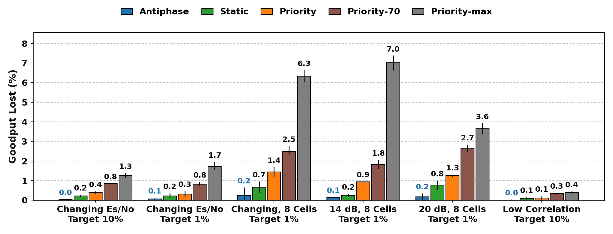</p>
<p align="center"><b>그림 27.</b> 다른 Es/No, 상관 낮은 채널, 2초마다 변하는 채널에서 방식별로 잃는 goodput.</p>

막대는 AI를 넣었을 때 2-UE 셀이 잃는 goodput이다(8 Cells는 2-UE 셀 8개). 칸은 "AI 처리량 / AI 없는 서버 대비 goodput"이다.

| 조건 | 복구 경로의 이득 | NRx가 도는 시간 | **Antiphase** | 고정 10% | 낮은 우선순위 + 30% | + 70% | 한도 없음 |
|---|---|---|---|---|---|---|---|
| 변하는 Es/No, 목표 10% | +12.5% | 70% | **10.4k / −0.0%** | 4.7k / −0.2% | 11.3k / −0.4% | 24.6k / −0.8% | 30.1k / −1.3% |
| 변하는 Es/No, 목표 1% | +28.4% | 35% | **34.4k / −0.1%** | 5.6k / −0.2% | 18.1k / −0.3% | 42.9k / −0.8% | 49.1k / −1.7% |
| 변하는 Es/No, 목표 1%, 2-UE 셀 8개 | +25.5% | 58% | **17.4k / −0.2%** | 5.1k / −0.7% | 13.9k / −1.4% | 33.0k / −2.5% | 43.8k / −6.3% |
| 14 dB, 목표 10% | +13.9% | 80% | **6.1k / −0.1%** | 4.3k / −0.4% | 10.0k / −0.7% | 20.7k / −1.3% | 25.8k / −2.5% |
| 14 dB, 목표 1% | +18.2% | 39% | **31.5k / −0.1%** | 5.4k / −0.1% | 17.0k / −0.2% | 41.2k / −0.6% | 49.2k / −2.2% |
| 14 dB, 목표 1%, 2-UE 셀 8개 | +15.6% | 60% | **15.5k / −0.1%** | 4.9k / −0.2% | 13.3k / −0.9% | 31.3k / −1.8% | 45.2k / −7.0% |
| 20 dB, 목표 10% | +10.8% | 55% | **18.7k / +0.0%** | 5.0k / −0.1% | 13.5k / −0.1% | 31.2k / −0.4% | 36.2k / −0.5% |
| 20 dB, 목표 1% | +40.2% | 29% | **38.5k / +0.1%** | 5.7k / +0.1% | 19.3k / −0.0% | 45.3k / −0.5% | 50.5k / −0.6% |
| 20 dB, 목표 1%, 2-UE 셀 8개 | +39.5% | 58% | **17.2k / −0.2%** | 5.0k / −0.8% | 13.5k / −1.3% | 31.9k / −2.7% | 38.3k / −3.7% |
| 상관 낮은 채널 6 dB, 목표 10% | +4.3% | 52% | **21.7k / −0.0%** | 5.1k / −0.1% | 14.2k / −0.1% | 33.3k / −0.3% | 39.1k / −0.4% |
| 상관 낮은 채널 6 dB, 목표 1% | +8.4% | 16% | **47.8k / −0.0%** | 6.0k / −0.0% | 22.9k / −0.0% | 50.4k / −0.0% | 52.6k / −0.0% |
| 상관 낮은 채널 6 dB, 목표 1%, 2-UE 셀 8개 | +8.6% | 33% | **36.2k / −0.0%** | 5.5k / −0.0% | 18.5k / −0.0% | 43.7k / −0.2% | 49.6k / −0.2% |

변하는 채널에서는 낮은 우선순위 + 50%도 쟀다: 19.0k / −0.7%, 33.4k / −0.7%, 25.2k / −2.0%.

- **Antiphase는 열두 조건 모두에서 goodput을 지킨다.** AI 없는 서버 대비 +0.1%에서 −0.2%다. 가장 큰 손실은 변하는 채널·2-UE 셀 8개의 0.24%(시드별 −0.64 ~ +0.04%)다. 채널이 2초마다 바뀌어도 고정된 채널과 같다. 4.9.2–4.9.4절의 아홉 조건과 합쳐 스물한 조건에서 손실이 0.5% 이하다(가장 큰 것은 2-UE 셀 8개·목표 1%이고, 첫 측정 0.34%, 시드를 늘린 실행 16개의 평균 0.36%다: 4.9.10절. 나머지 스무 조건은 0.3% 이하다).
- **비율 방식이 잃는 goodput은 조건에 따라 크게 다르다.** 고정 10%는 0.0–0.8%, 낮은 우선순위 + 30%는 0.0–1.4%, + 70%는 0.0–2.7%, 한도 없음은 0.0–7.0%다. 큰 값은 모두 상관 높은 채널의 2-UE 셀 8개다: 14 dB, 16 dB, 20 dB, 변하는 채널 어디서나 낮은 우선순위 + 30%가 0.9–2.2%를 잃는다.
- **복구 경로의 이득은 상관 높은 채널에서 11–40%, 상관 낮은 채널에서 4–9%다.** 목표 1%의 20 dB에서 가장 크다(+40%). 복구 경로가 없는 서버는 목표 1%를 맞추려고 MCS를 10.0까지 내린다(14 dB와 변하는 채널에서는 가장 낮은 단계에서도 재전송이 1.8–2.8%여서 이득은 하한이다).
- **상관 낮은 채널에서는 복구의 값이 작고, 비율 방식이 치르는 값도 작다.** 한도 없음이 0.0–0.4%를 잃는다. 이 채널에서는 NRx가 시간의 16–52%만 돌므로 Antiphase가 21.7k–47.8k를 처리하고, 낮은 우선순위 + 30%의 1.5–2.1배다. 낮은 우선순위 + 70%와 한도 없음은 Antiphase의 1.1–1.8배를 처리하고 0.0–0.4%를 낸다.
- **AI 처리량은 NRx가 쉬는 시간을 따라간다**(4.9.6절). 쉬는 시간과 "Antiphase / 낮은 우선순위 + 30%"의 AI 처리량 비는 다음과 같다. 쉬는 시간 20%(14 dB, 목표 10%): 0.6배. 30–32%: 0.9–1.0배. 40–48%: 1.2–1.5배. 61–71%: 1.9–2.0배. 84%: 2.1배. 14 dB의 목표 10%는 NRx가 시간의 80%를 도는 조건이다. Antiphase는 6.1k를 처리하고 goodput을 지키며, 낮은 우선순위 + 30%는 10.0k를 처리하고 0.7%를 낸다.
- **L1 지연**(단일 UE 셀, `l1_levels_esno.txt`). 열두 조건에서 NRx는 p99.9에 1.45–1.62 ms를 더한다(마감 여유의 59–65%). 그 위에 Antiphase는 0.00–0.13 ms, 고정 10%는 0.12–0.22 ms, 낮은 우선순위 + 30%는 0.23–0.34 ms, + 70%는 0.43–0.52 ms, 한도 없음은 0.60–0.89 ms를 더한다.
- **한도 없음은 2-UE 셀 8개에서 L1 마감을 넘긴다.** 실행 전체의 L1 놓침이 변하는 채널에서 0.27%, 14 dB에서 0.61%다(Antiphase 0.010%, 0.023%; 20–40초 실행이라 시작 구간의 놓침이 들어 있다).
- 한계: 재전송은 계산이다(HARQ 결합 없음). 상관 낮은 채널과 14·20 dB는 시드 2다. 변하는 채널의 Es/No는 세 값 사이의 계단이고 머무는 시간은 2초 하나다. UMi 채널은 닫힌 루프로 재지 않았다.

원본: `results/backstop_slot/la_closed_{lva,lvb,lvc,lha,lhb,lhc,lja,ljb,ljc,lwa,lwb,lwc}.json`, `.txt`, `l1_levels_esno.txt`, `optimum_gap_esno.txt`.

#### 4.9.9 연속적으로 변하는 채널, 섞인 채널, 상관 낮은 채널의 L1

> **한 줄 결론.** Es/No가 슬롯마다 조금씩 변해도, 한 서버에 채널이 다른 셀이 섞여 있어도, 상관 낮은 채널의 Es/No를 바꿔도 결과는 같다. Antiphase는 열여덟 조건에서 goodput을 0.3% 이하로 잃고, 비율 방식은 최대 3.7%를 잃는다. 섞인 채널에서 비율 방식의 손실은 상관 높은 셀에 몰린다(평균 1.6%인 방식이 그 셀에서는 3.1%).

4.9.8절을 넓혔다(`campaigns/v20_cont.sh`, job 59465023, 59466250; 2026-10-06 밤). job 59472374, 59473418 포함. 스킴은 그대로다. 느린 변화와 빠른 변화는 시드 2, 무작위 변화는 시드 3이다.

**방법: 잡음을 더해 Es/No를 만든다.** 연속적으로 변하는 Es/No는 채널을 다시 생성하지 않고 만든다(`make_esno_dataset.py`). 20 dB로 생성한 슬롯에 백색 잡음을 더하면 같은 채널과 같은 TB를 더 낮은 Es/No로 받은 슬롯이 된다. 생성기의 잡음 분산은 `N0 = 1.2671 × 10^(−Es/No / 10)`이고 MCS와 채널에 무관하다(Sionna의 `ebnodb2no`에 이 설정의 resource grid를 넣은 값, `nv/n0_probe.py`). 따라서 Es/No를 e로 낮추려면 분산 `1.2671 × (10^(−e/10) − 10^(−2))`의 잡음을 더한다. 슬롯마다 e가 다른 데이터를 만들어 그대로 재생하므로 실험 코드는 바뀌지 않는다.

이 방법으로 만든 16 dB와 14 dB 슬롯을 직접 생성한 슬롯과 대조했다(슬롯 640개와 768·640개, 두 수신기가 복호한 TB의 비율).

| MCS | 16 dB, 기존 수신기: 만든 것 / 생성한 것 | 16 dB, NRx | 14 dB, 기존 수신기 | 14 dB, NRx |
|---|---|---|---|---|
| 10 | 98.4% / 98.6% | 100.0% / 99.9% | 97.6% / 97.2% | 99.9% / 100.0% |
| 12 | 92.1% / 93.0% | 98.8% / 99.2% | 83.2% / 83.8% | 97.1% / 97.5% |
| 13 | 84.1% / 86.7% | 95.5% / 96.9% | 66.3% / 67.7% | 89.3% / 90.5% |
| 14 | 69.1% / 70.4% | 85.3% / 85.7% | 44.1% / 45.9% | 69.1% / 71.4% |
| 16 | 32.3% / 34.5% | 37.3% / 40.0% | 12.1% / 14.1% | 18.6% / 20.3% |

일곱 단계 모두에서 차이가 2.9%p 이내이고 표본 오차 안이다(`queue/check_synth.py`의 기준: 3σ + 1.5%p). 만든 쪽이 평균 1%p쯤 낮은데, 바탕이 된 20 dB 슬롯과 16·14 dB 슬롯의 채널 표본이 다르다.

**궤적.** 모든 MCS 단계가 같은 궤적을 쓰고, 셀마다 재생 위치가 달라 Es/No가 변하는 시점이 다르다. 실행은 40초다.

| 이름 | Es/No | 변하는 속도 |
|---|---|---|
| 느린 변화 | 14–20 dB를 5.12초 주기로 오르내린다 | 최대 3.7 dB/초 |
| 빠른 변화 | 14–20 dB를 1.28초 주기로 오르내린다 | 최대 14.7 dB/초 |
| 무작위 변화 | 평균 16.5 dB, 표준편차 1.75 dB, 상관 시간 1초인 무작위 과정(13–20 dB로 제한) | 슬롯마다 변한다 |

<p align="center">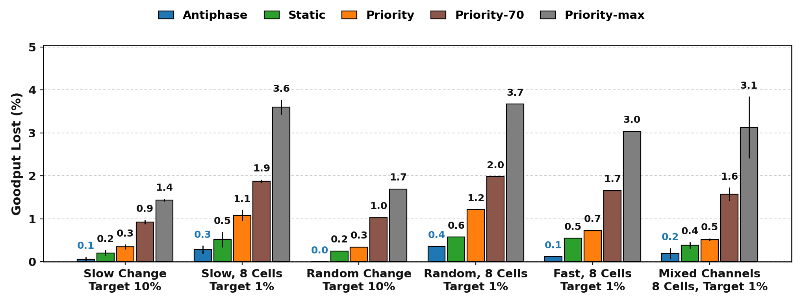</p>
<p align="center"><b>그림 28.</b> 연속적으로 변하는 채널과 섞인 채널에서 방식별로 잃는 goodput.</p>

칸은 "AI 처리량 / AI 없는 서버 대비 goodput"이다.

| 조건 | 시드 | 복구 경로의 이득 | **Antiphase** | 고정 10% | 낮은 우선순위 + 30% | + 50% | + 70% | 한도 없음 |
|---|---|---|---|---|---|---|---|---|
| 느린 변화, 목표 10% | 2 | +13.1% | **11.3k / −0.1%** | 4.8k / −0.2% | 11.6k / −0.3% | 19.5k / −0.7% | 25.7k / −0.9% | 30.7k / −1.4% |
| 느린 변화, 목표 1% | 2 | +29.0% | **36.9k / −0.0%** | 5.7k / −0.1% | 18.8k / −0.2% | 34.7k / −0.4% | 44.2k / −0.4% | 50.2k / −1.0% |
| 느린 변화, 목표 1%, 2-UE 셀 8개 | 2 | +27.7% | **18.9k / −0.3%** | 5.1k / −0.5% | 14.2k / −1.1% | 25.9k / −1.6% | 33.8k / −1.9% | 42.6k / −3.6% |
| 무작위 변화, 목표 10% | 3 | +12.9% | **10.2k / −0.0%** | 4.7k / −0.3% | 11.2k / −0.4% | 18.7k / −0.8% | 24.2k / −1.0% | 29.4k / −1.6% |
| 무작위 변화, 목표 1% | 3 | +27.9% | **36.4k / −0.1%** | 5.7k / −0.2% | 18.7k / −0.4% | 34.9k / −0.8% | 44.3k / −1.0% | 50.0k / −1.5% |
| 무작위 변화, 목표 1%, 2-UE 셀 8개 | 3 | +24.7% | **20.3k / −0.2%** | 5.2k / −0.5% | 14.7k / −1.2% | 27.4k / −1.9% | 35.4k / −2.0% | 43.7k / −3.7% |
| 빠른 변화, 목표 10% | 2 | +13.8% | **12.0k / −0.1%** | 4.8k / −0.2% | 11.6k / −0.3% | 19.6k / −0.6% | 25.7k / −0.8% | 30.3k / −1.2% |
| 빠른 변화, 목표 1% | 2 | +28.7% | **37.1k / −0.0%** | 5.7k / −0.1% | 18.8k / −0.2% | 34.8k / −0.4% | 44.1k / −0.5% | 50.1k / −1.1% |
| 빠른 변화, 목표 1%, 2-UE 셀 8개 | 2 | +26.5% | **19.3k / −0.1%** | 5.1k / −0.5% | 14.2k / −0.7% | 26.0k / −1.6% | 33.6k / −1.5% | 42.3k / −3.3% |

- **Antiphase는 아홉 조건에서 0.0–0.3%를 잃는다.** 2-UE 셀 4개에서는 0.1% 이하이고, 2-UE 셀 8개에서는 0.1–0.3%다(시드별 0.08–0.36%). 2-UE 셀 8개에서 고정 10%는 0.5%, 낮은 우선순위 + 30%는 0.7–1.2%, 한도 없음은 3.3–3.7%를 잃는다.
- **결과는 채널이 고정일 때(4.9.2절), 계단으로 변할 때(4.9.8절)와 같은 모양이다.** 변하는 속도가 3.7 dB/초에서 14.7 dB/초로 올라가도 방식의 순서와 손실의 크기가 같다.
- 목표 10%에서 Antiphase와 낮은 우선순위 + 30%의 AI 처리량이 같은 것도 그대로다(10.2k–12.0k 대 11.2k–11.6k). 그 방식은 goodput 0.3–0.4%를 낸다.

outer loop가 변하는 Es/No를 따라가는지를 슬롯의 Es/No별로 봤다(`analyze_la_track.py`, 복구 경로가 있고 AI가 없는 서버).

| 조건 | Es/No가 가장 낮은 구간 → 가장 높은 구간 | 평균 MCS | 구간별 재전송이 필요한 TB |
|---|---|---|---|
| 느린 변화, 목표 10% | 14–15 dB → 19–20 dB | 12.64 → 14.48 | 9.6–10.7% |
| 빠른 변화, 목표 10% | 14–15 dB → 19–20 dB | 12.54 → 14.53 | 9.3–11.8% |
| 무작위 변화, 목표 10% | 13–14 dB → 19–20 dB | 12.39 → 14.54 | 8.7–13.3% |
| 느린 변화, 목표 1% | 14–15 dB → 19–20 dB | 11.32 → 12.61 | 0.4–1.5% |
| 빠른 변화, 목표 1% | 14–15 dB → 19–20 dB | 11.67 → 12.11 | 0.1–2.4% |
| 무작위 변화, 목표 1% | 13–14 dB → 19–20 dB | 11.25 → 12.14 | 0.2–1.9% |

- **목표 10%에서는 outer loop가 세 궤적을 모두 따라간다.** Es/No가 낮은 구간에서 높은 구간으로 가면 평균 MCS가 약 2단계 오르고, 재전송이 필요한 TB는 구간마다 목표 근처다.
- **목표 1%에서는 빠른 변화를 따라가지 못한다.** 올라가는 계단이 작아서(TB당 0.0025단계) 빠른 변화에서는 MCS가 0.4단계만 움직이고, Es/No가 낮은 구간에서 재전송이 2.4%로 목표를 넘는다. 평균은 1.0%로 맞는다. 이 조건에서도 방식 간 결과는 같다.
- 복구 경로가 없는 서버는 목표 1%에서 가장 낮은 단계(MCS 10)에 머문다.

**섞인 채널.** 2-UE 셀의 절반은 상관 높은 채널(16 dB), 절반은 상관 낮은 채널(6 dB)이다(`la_states.py`의 셀별 고정 배정, 시드 2).

| 조건 | 시드 | 복구 경로의 이득 | **Antiphase** | 고정 10% | 낮은 우선순위 + 30% | + 70% | 한도 없음 |
|---|---|---|---|---|---|---|---|
| 2-UE 셀 4개 (2 + 2), 목표 10% | 2 | +7.8% | **15.2k / −0.0%** | 4.9k / −0.1% | 12.6k / −0.2% | 29.4k / −0.5% | 34.5k / −0.5% |
| 2-UE 셀 4개 (2 + 2), 목표 1% | 2 | +18.5% | **41.1k / −0.0%** | 5.7k / −0.0% | 20.1k / −0.0% | 46.6k / −0.2% | 51.5k / −0.3% |
| 2-UE 셀 8개 (4 + 4), 목표 1% | 2 | +17.8% | **23.3k / −0.2%** | 5.2k / −0.4% | 15.1k / −0.5% | 36.9k / −1.6% | 45.2k / −3.1% |

2-UE 셀 8개, 목표 1%의 goodput을 셀의 채널별로 나누면 다음과 같다.

| 방식 | 상관 높은 셀 4개 | 상관 낮은 셀 4개 |
|---|---|---|
| **Antiphase** | −0.4% | −0.0% |
| 고정 10% | −0.8% | +0.0% |
| 낮은 우선순위 + 30% | −1.1% | −0.0% |
| 낮은 우선순위 + 70% | −3.1% | −0.2% |
| 낮은 우선순위, 한도 없음 | −6.4% | −0.2% |

- **손실은 상관 높은 셀에 몰린다.** 낮은 우선순위 + 70%는 평균 1.6%를 잃지만 상관 높은 셀은 3.1%를 잃고 낮은 셀은 0.2%를 잃는다. 한도 없음은 6.4%와 0.2%다. 평균만 보면 가려지고, 한도는 가장 나쁜 셀에 맞춰야 한다.
- Antiphase는 평균 0.2%(상관 높은 셀 0.4%)를 잃는다.

**상관 낮은 채널의 L1 (100초 실행).** 6 dB, 목표 10%, 시드 3, 처음 20초 제외. L1은 단일 UE 셀의 TB 115만 개다.

| 단계 | AI 처리량 / goodput | L1 지연 중앙값 / p99.9 / p99.99 | 마감 여유 (p99.9) | L1 마감을 넘긴 TB |
|---|---|---|---|---|
| 기존 수신기만 | – | 1.40 / 1.49 / 1.54 ms | 2.51 ms | 0 |
| + NRx (AI 없음) | – | 1.45 / 3.13 / 3.22 ms | 0.87 ms | 0 |
| **+ AI, Antiphase** | **21.1k / +0.0%** | 1.91 / **3.13** / 3.24 ms | **0.87 ms** | **4** |
| + AI, 고정 10% | 5.2k / −0.0% | 1.56 / 3.25 / 3.39 ms | 0.75 ms | 7 |
| + AI, 낮은 우선순위 + 30% | 14.3k / −0.1% | 1.82 / 3.39 / 3.54 ms | 0.61 ms | 0 |
| + AI, 낮은 우선순위 + 70% | 33.7k / −0.3% | 2.13 / 3.57 / 3.78 ms | 0.43 ms | 13 |
| + AI, 낮은 우선순위만 | 39.5k / −0.3% | 2.33 / 3.89 / 4.21 ms | 0.11 ms | 505 |

- **이 채널에서는 한도 70%까지 L1 마감 초과로 갈리지 않는다.** 마감을 넘긴 TB가 Antiphase 4개, 한도 30% 0개, 한도 70% 13개다. 한도 없음만 505개(0.044%)이고 p99.99가 마감을 넘는다.
- **갈리는 것은 여유다.** Antiphase는 NRx만 있는 서버와 같은 0.87 ms를 남기고, 한도 30%는 0.61 ms, 한도 70%는 0.43 ms를 남긴다.
- **이 채널에서 한도 70%는 쓸 만한 선택이다.** goodput 0.3%와 L1 여유의 절반을 내고 Antiphase의 1.6배를 처리한다. 복구 경로의 이득이 4%로 작은 채널이어서 잃을 것이 적다. Antiphase는 낮은 우선순위 + 30%의 1.5배를 goodput 손실 없이 처리한다.
- NRx는 이 채널에서도 L1 p99.9에 1.64 ms를 더한다(여유의 65%).

**상관 낮은 채널의 다른 Es/No.** 8 dB로 생성한 슬롯에 잡음을 더해 4.5 dB와 7.5 dB를 만들었다. 같은 방법으로 만든 6 dB는 직접 생성한 6 dB와 MCS 10–16의 오류율이 3.6%p 이내로 같다. 4.5 dB와 7.5 dB는 시드 2, 6 dB는 시드 3이다.

| Es/No, 조건 | 복구 경로의 이득 | **Antiphase** | 고정 10% | 낮은 우선순위 + 30% | + 70% | 한도 없음 |
|---|---|---|---|---|---|---|
| 4.5 dB, 목표 10% | +5.5% | **11.0k / −0.2%** | 4.6k / −0.1% | 11.3k / −0.3% | 24.7k / −0.6% | 30.3k / −0.9% |
| 4.5 dB, 목표 1% | +4.1% | **49.5k / −0.0%** | 6.1k / −0.0% | 24.0k / −0.0% | 51.0k / −0.0% | 52.8k / +0.0% |
| 4.5 dB, 목표 1%, 2-UE 셀 8개 | +4.6% | **40.6k / −0.0%** | 5.7k / −0.0% | 20.1k / −0.1% | 46.0k / −0.1% | 51.0k / −0.2% |
| 6 dB, 목표 10% (4.9.8절) | +4.3% | **21.5k / +0.0%** | 5.1k / −0.0% | 14.3k / −0.1% | 33.5k / −0.3% | 39.0k / −0.3% |
| 6 dB, 목표 1% | +8.6% | **47.6k / −0.0%** | 6.0k / −0.0% | 23.0k / −0.0% | 50.2k / −0.0% | 52.5k / −0.0% |
| 6 dB, 목표 1%, 2-UE 셀 8개 | +8.7% | **36.0k / −0.0%** | 5.6k / −0.0% | 18.6k / −0.0% | 43.5k / −0.2% | 49.4k / −0.2% |
| 7.5 dB, 목표 10% | +5.5% | **27.3k / +0.0%** | 5.2k / −0.0% | 15.8k / −0.0% | 37.0k / −0.3% | 43.0k / −0.3% |
| 7.5 dB, 목표 1% | +6.8% | **48.6k / −0.0%** | 6.0k / +0.0% | 23.4k / −0.0% | 50.5k / −0.0% | 52.8k / −0.0% |
| 7.5 dB, 목표 1%, 2-UE 셀 8개 | +6.6% | **38.8k / +0.0%** | 5.6k / +0.0% | 19.6k / −0.0% | 44.4k / −0.1% | 50.2k / −0.1% |

- **이 채널에서는 Es/No를 바꿔도 비율 방식의 손실이 작다.** 가장 큰 값이 4.5 dB·목표 10%의 한도 없음 0.9%이고(한도 70%는 0.6%), 목표 1%에서는 0.2% 이하다. 복구 경로의 이득이 4–9%인 채널이다.
- **Antiphase는 아홉 조건에서 0.2% 이하를 잃는다**(4.5 dB·목표 10%에서 0.16%). 4.5 dB의 목표 10%는 슬롯의 29%에서 후보가 나서 NRx가 오래 도는 조건이고, AI 처리량이 낮은 우선순위 + 30%와 같다(11.0k 대 11.3k). 나머지 여덟 조건에서는 그 1.5–2.1배를 처리한다.
- 7.5 dB의 목표 10%에서는 outer loop가 가장 높은 단계(MCS 16)에 닿아 재전송이 7.4%에 머문다. 복구 경로의 이득(+5.5%)은 하한이다.

**UMi 채널.** 워크로드의 셋째 채널이다. 10 dB의 슬롯을 생성해 목표 10%와 3%로 쟀다(시드 2). 이 채널은 가장 낮은 단계(MCS 10)에서도 기존 수신기의 오류율이 1.5% 아래로 내려가지 않아 목표 1%는 잴 수 없다.

| 조건 | 복구 경로의 이득 | **Antiphase** | 고정 10% | 낮은 우선순위 + 30% | + 70% | 한도 없음 |
|---|---|---|---|---|---|---|
| 목표 10% | +5.3% | **24.4k / −0.0%** | 5.2k / −0.0% | 15.3k / −0.0% | 35.7k / −0.1% | 41.6k / −0.3% |
| 목표 3% | +1.5% | **36.9k / +0.0%** | 5.6k / +0.0% | 18.4k / −0.0% | 43.6k / −0.0% | 49.4k / −0.3% |
| 목표 3%, 2-UE 셀 8개 | +1.4% | **16.1k / −0.1%** | 4.8k / −0.1% | 13.1k / −0.1% | 29.4k / −0.3% | 37.1k / −0.7% |

- **이 채널에서는 복구 경로의 이득이 1–5%다.** NRx가 복호하는 실패가 적은 채널이다(4.4절). 목표 3%에서는 복구 경로가 있어도 없어도 outer loop가 가장 낮은 단계에 머물고 재전송이 4.9–5.0%와 6.4%로 목표를 넘는다. 이 두 조건은 MCS 선택이 일어나지 않는 조건이다.
- **비율 방식의 손실은 0.7% 이하, Antiphase는 0.1% 이하다.** 목표 10%에서 Antiphase는 24.4k를 처리하고 낮은 우선순위 + 30%(15.3k)의 1.6배다. 한도 70%는 35.7k를 처리하고 0.1%를 낸다.
- 세 채널을 놓고 보면 복구 경로의 이득과 비율 방식이 치르는 값이 함께 움직인다: 상관 높은 채널(이득 11–40%, 손실 최대 8.2%), 상관 낮은 채널(4–9%, 최대 0.9%), UMi(1–5%, 최대 0.7%).

원본: `results/backstop_slot/la_closed_{lxa,lxb,lxc,lya,lyb,lyc,lza,lzb,lzc,lma,lmb,lmc,lgw,lpa,lpb,lpc,lqa,lqb,lqc}.json`, `.txt`, `la_track.txt`, `l1_levels_long_low.txt`, `synth_check.txt`.

#### 4.9.10 NRx가 도는 동안 AI를 SM 조각에 두는 옵션과 green context 기준선

> **한 줄 결론.** NRx가 도는 동안 AI를 멈추지 않고 GPU의 SM 일부(CUDA green context)로 옮기면 AI는 늘지만 그만큼 goodput을 낸다. 28 SM 조각은 AI를 1.0–1.2배(NRx가 SM 전부를 쓸 때) 또는 1.1–1.6배(NRx를 나머지 80 SM에 둘 때)로 늘리고 goodput을 0.3–1.9% 또는 0.5–3.3% 잃는다. 수단이 MPS 비율이든 SM 조각이든 goodput 손실은 NRx 실행이 길어진 만큼 나온다. AI를 항상 28 SM에 두는 green context 기준선은 아홉 경우 모두 Antiphase보다 goodput을 더 잃는다. 기본값(조각 없음)은 그대로다.

**왜 쟀나.** Antiphase는 GPU를 시간으로 나눈다: NRx가 도는 GPU에서는 AI가 선다. 2-UE 셀 4개·목표 10%에서 NRx는 GPU 시간의 68%를 쓰고, 그 시간에 AI는 돌지 않는다. Weaver는 CUDA green context로 SM을 나눠 RAN과 AI를 격리한다(2.6.1절). 그래서 두 가지를 쟀다. 첫째, Antiphase에 "NRx가 도는 동안 AI를 작은 SM 조각에서 계속 돌린다"는 옵션을 넣으면 AI가 얼마나 늘고 무선은 무엇을 내는가. 둘째, green context만 쓰는 방식(AI가 항상 SM 조각에 있음)은 기준선으로서 어디에 놓이는가.

**구현.** 이 서버의 MPS에는 SM을 나누는 기능이 없어서(CUDA 13.1부터) driver API의 green context를 쓴다(`greenctx.py`).

- AI worker는 context를 둘 갖는다: GPU 전체(기본 context)와 SM N개(green context). 모델의 가중치는 두 context가 같이 쓴다. CUDA graph는 context마다 따로 캡처한다(기본 context에서 캡처한 graph는 green context의 stream에 올려도 SM 제한을 따르지 않는다). 전환은 0.8 µs이고, 전환 전에 앞 조각이 끝나 있어야 한다.
- controller는 허락마다 어느 쪽에서 돌릴지 알린다. NRx가 도는 GPU에는 조각 허락을, 아닌 GPU에는 지금까지와 같은 허락을 준다. NRx 후보가 기다리는 동안에는 지금까지처럼 어느 쪽에도 허락하지 않는다. NRx가 끝나면 조각에서 도는 AI에 중단을 알리고, 돌던 단위가 끝난 뒤 GPU 전체로 돌아온다.
- NRx lane도 green context에 둘 수 있다(조각이 남긴 SM). 이때 조각의 SM은 AI만 쓴다.
- 설정: `--ai-slice-sms N`(옵션, 0이 기본값이고 지금까지의 Antiphase다), `--ai-green-sms N`(기준선: AI가 항상 SM N개), `--nrx-off-slice 1`(NRx를 나머지 SM에 둔다).

A100의 SM은 108개다. AI 단위(Qwen2.5-1.5B의 layer 단위)가 조각에 혼자 있을 때 걸리는 시간은 다음과 같다(`slice_units_j59472374.txt`).

| 조각 | 128 토큰 단위 | 512 토큰 단위 | 1,024 토큰 단위 |
|---|---|---|---|
| GPU 전체 (108 SM) | 0.29 ms | 0.65 ms | 1.02 ms |
| 28 SM (26%) | 1.8배 | 2.5배 | 2.7배 |
| 16 SM (15%) | 2.7배 | 4.0배 | 4.6배 |
| 12 SM (11%) | 3.3배 | 5.2배 | 6.0배 |

**방식.** 닫힌 루프의 세 조건(4.9.2–4.9.3절의 2-UE 셀 4개·목표 10%, 4개·목표 1%, 8개·목표 1%)에서 시드 2로 쟀다. 실행은 20초다.

| 이름 | AI | NRx |
|---|---|---|
| **Antiphase** (기본) | NRx가 도는 GPU에서 선다 | SM 전부 |
| 조각 12 / 16 / 28 | NRx가 도는 동안 SM 12 / 16 / 28개로 옮긴다 | SM 전부 (조각의 SM도 쓴다) |
| 조각 16 / 28, NRx 분리 | 같다 | 나머지 92 / 80 SM |
| 항상 28 SM, 낮은 우선순위 | 항상 SM 28개 | SM 전부 |
| 항상 28 SM, 보통 우선순위 | 항상 SM 28개 | SM 전부 |
| 항상 28 SM, NRx 분리 (고정 분할) | 항상 SM 28개, 낮은 우선순위 | 나머지 80 SM |
| 낮은 우선순위 + 30% / + 70% | MPS 비율 30% / 70% | SM 전부 |

<p align="center">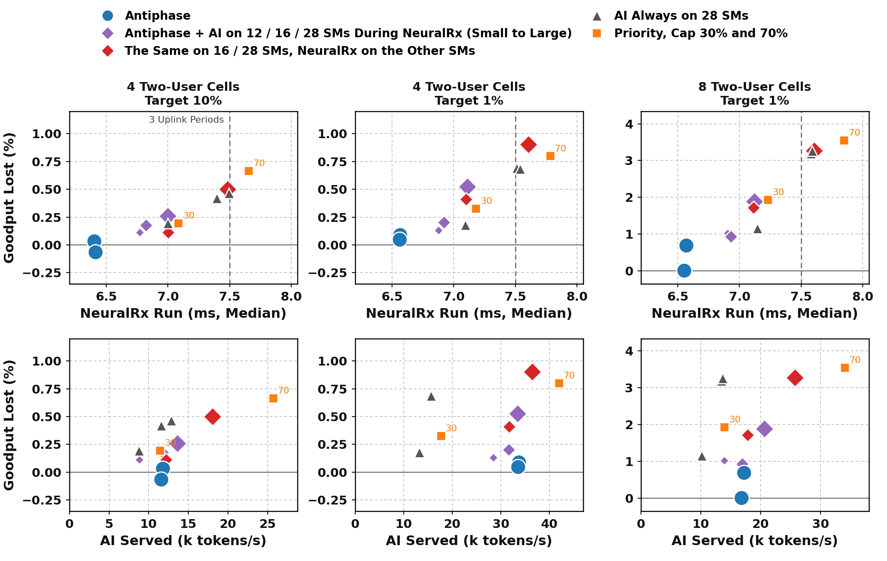</p>
<p align="center"><b>그림 29.</b> SM 조각에서 AI를 돌릴 때 잃는 goodput: NRx 실행 시간과 AI 처리량에 대해.</p>

**결과 1: NRx가 SM 전부를 쓸 때** (job 59472374, 59478477). 칸은 "AI 처리량 / AI 없는 서버 대비 goodput"이다.

| 조건 | **Antiphase** | 조각 12 | 조각 16 | 조각 28 | 항상 28 SM, 낮은 우선순위 | 낮은 우선순위 + 30% | + 70% |
|---|---|---|---|---|---|---|---|
| 2-UE 셀 4개, 목표 10% | **11.8k / −0.0%** | 8.8k / −0.1% | 11.7k / −0.2% | 13.6k / −0.3% | 8.8k / −0.2% | 11.4k / −0.2% | 25.7k / −0.7% |
| 2-UE 셀 4개, 목표 1% | **33.7k / −0.1%** | 28.5k / −0.1% | 31.7k / −0.2% | 33.4k / −0.5% | 13.2k / −0.2% | 17.7k / −0.3% | 41.9k / −0.8% |
| 2-UE 셀 8개, 목표 1% | **16.8k / −0.0%** | 13.9k / −1.0% | 16.9k / −0.9% | 20.6k / −1.9% | 10.2k / −1.2% | 13.9k / −1.9% | 34.0k / −3.6% |

- **28 SM 조각은 NRx가 오래 도는 두 조건에서 AI를 1.2배로 늘리고 goodput 0.3%와 1.9%를 낸다.** 목표 10%에서 13.6k 대 11.8k, 2-UE 셀 8개에서 20.6k 대 16.8k다. NRx가 37%만 도는 조건(2-UE 셀 4개·목표 1%)에서는 AI가 늘지 않고(33.4k 대 33.7k) goodput만 0.5% 준다.
- **12 SM과 16 SM 조각은 AI를 늘리지 못한다**(기본의 0.7–0.8배와 0.9–1.0배). goodput은 0.1–1.0%를 낸다.
- **28 SM 조각은 낮은 우선순위 + 30%와 비슷한 손실에서 AI를 1.2–1.9배 처리한다**(13.6k 대 11.4k, 33.4k 대 17.7k, 20.6k 대 13.9k; 손실은 0.3 / 0.5 / 1.9% 대 0.2 / 0.3 / 1.9%). 비슷한 값을 치를 때는 그 비율 방식보다 낫다.

**결과 2: NRx를 조각 밖에 둘 때** (job 59478478, 스크립트 사본 `scripts_slice2`).

| 조건 | **Antiphase** | 조각 16, NRx는 92 SM | 조각 28, NRx는 80 SM | 항상 28 SM, 보통 우선순위 | 항상 28 SM, NRx는 80 SM |
|---|---|---|---|---|---|
| 2-UE 셀 4개, 목표 10% | **11.6k / +0.1%** | 12.2k / −0.1% | 18.0k / −0.5% | 11.6k / −0.4% | 12.8k / −0.5% |
| 2-UE 셀 4개, 목표 1% | **33.5k / −0.0%** | 31.7k / −0.4% | 36.5k / −0.9% | 15.4k / −0.7% | 15.6k / −0.7% |
| 2-UE 셀 8개, 목표 1% | **17.2k / −0.7%** | 17.8k / −1.7% | 25.7k / −3.3% | 13.4k / −3.2% | 13.6k / −3.3% |

- **NRx를 80 SM에 두면 AI는 1.1–1.6배가 되고 goodput은 0.5–3.3%를 낸다.** 조각의 SM을 AI만 쓰므로 AI는 더 빨라지지만 NRx는 SM 26%를 잃는다.
- **같은 손실에서는 낮은 우선순위 + 70%가 AI를 더 처리한다**(25.7k / −0.7% 대 18.0k / −0.5%, 41.9k / −0.8% 대 36.5k / −0.9%, 34.0k / −3.6% 대 25.7k / −3.3%). SM을 갈라 주는 것이 MPS 비율보다 나은 맞교환이 아니다.
- **green context만 쓰는 세 기준선은 아홉 경우 모두 Antiphase보다 goodput을 더 잃는다**(0.2–3.3% 대 같은 job의 Antiphase −0.1 ~ 0.7%). AI는 Antiphase의 0.4–1.1배다: NRx가 적게 도는 조건(목표 1%, 2-UE 셀 4개)에서는 13.2k–15.6k로 Antiphase 33.5k의 절반이 안 된다. AI가 GPU의 26%에 묶여 있기 때문이다.
- 2-UE 셀 8개·목표 1%의 Antiphase가 이 job에서 −0.7%다. 이 조건은 실행마다 기준(AI 없는 서버)과 Antiphase가 각각 ±0.2%쯤 움직인다. 같은 job 안의 방식 간 비교는 기준이 같아서 이 편차의 영향을 받지 않는다(조각 28·NRx 분리는 같은 job의 Antiphase보다 2.6%p 더 잃는다). 이 조건의 값은 아래에서 시드를 늘려 다시 쟀다.

**2-UE 셀 8개·목표 1%를 시드 아홉 개로.** 이 조건은 42개 조건 가운데 Antiphase의 손실이 가장 큰 조건이다(NRx 수요가 용량에 가깝다). 시드 1–3을 네 번의 측정에서 실행 10개로 쟀고, 새 시드 여섯 개(4–9)를 한 job에서 더 쟀다(job 59482496, `la_cl4.sh lec`).

| 측정 | 시드 | Antiphase의 goodput (AI 없는 서버 대비, 실행별) | 평균 |
|---|---|---|---|
| 4.9.3절 | 1–3 | −0.09, −0.20, −0.74% | −0.34% |
| 4.9.7절 | 1–3 | +0.12, −0.22, −0.20% | −0.10% |
| 결과 1의 job | 1–2 | −0.28, +0.25% | −0.01% |
| 결과 2의 job | 1–2 | −0.80, −0.59% | −0.70% |
| 새 시드 | 4–9 | −0.36, −0.36, −0.30, −0.77, −0.63, −0.51% | −0.49% |
| **전체** | 아홉 개, 실행 16개 | +0.25 ~ −0.80% | **−0.36%** (표준오차 0.08%p) |

| 새 시드 여섯 개 (4–9) | AI 처리량 | goodput (실행별 범위) | 복구 |
|---|---|---|---|
| **Antiphase** | **16.1k** | **−0.49%** (−0.30 ~ −0.77%) | −2.6% |
| 낮은 우선순위 + 30% | 13.8k | −2.38% (−2.17 ~ −2.62%) | −12.6% |

- **이 조건에서 Antiphase의 손실은 0.36%다**(실행 16개의 평균, 표준오차 0.08%p, 95% 구간 0.19–0.52%). 같은 시드의 실행을 묶어 시드 9개로 보면 평균 0.43%이고 95% 구간은 0.29–0.57%다. 구간의 위쪽은 0.5%를 넘으므로 "0.5% 이하"는 조건별 평균에 대한 문장이다. 측정 하나(시드 2–6개)의 평균은 0.0%에서 0.7%까지 나온다. 4.9.3절의 표에 적은 0.34%는 첫 측정의 값이다.
- **낮은 우선순위 + 30%는 같은 조건에서 2.25%를 잃는다**(실행 14개, 실행별 1.72–2.67%). Antiphase의 6.3배이고, AI는 Antiphase보다 적다(13.8k 대 16.1k). 실행별 범위가 겹치지 않는다.
- NRx 수요가 용량에 가까우면 Antiphase도 복구를 2–3% 잃는다. AI 조각이 멈춘 뒤 돌던 단위가 끝날 때까지 NRx가 0.1–0.2 ms 길어지기 때문이다(NRx 실행 중앙값 6.40 → 6.57 ms). 다른 41개 조건의 손실은 0.3% 이하다(2-UE 셀 8개·목표 3%는 두 측정에서 0.20%와 0.32%).

**전 부하, 고정 MCS (16셀, 10초, 시드 2).** rate control이 없는 조건이다. 칸은 "AI 처리량 / AI 없는 서버 대비 복구".

| **Antiphase** | 조각 12 | 조각 16 | 조각 28 | 항상 28 SM, 낮은 우선순위 | 낮은 우선순위 + 30% | + 70% |
|---|---|---|---|---|---|---|
| **34.0k / −0.2%** | 28.0k / −1.1% | 32.8k / −1.1% | 33.4k / −2.1% | 13.1k / −1.4% | 17.5k / −1.8% | 41.9k / −6.0% |

- 이 조건에서는 조각이 AI를 늘리지 못하고(0.8–1.0배) 복구만 1.1–2.1% 낸다.

**L1 지연 (100초 실행).** 2-UE 셀 4개·목표 10%, 시드 3, 처음 20초 제외. L1은 단일 UE 셀의 TB 115만 개다. 두 job은 각각 자기 기준(NRx만)과 Antiphase를 함께 쟀다.

| 방식 | AI 처리량 / goodput | 복구 | L1 지연 중앙값 / p99.9 / p99.99 | 마감 여유 (p99.9) | L1 마감을 넘긴 TB |
|---|---|---|---|---|---|
| NRx만 (AI 없음) | – | – | 2.10 / 3.10 / 3.22 ms | 0.90 ms | 0 |
| **Antiphase** | **11.5k / −0.0%** | −0.5% | 2.07 / **3.15** / 3.26 ms | **0.85 ms** | 2 |
| 조각 16 | 11.7k / −0.2% | −2.5% | 2.16 / 3.21 / 3.35 ms | 0.79 ms | 5 |
| 조각 28 | 13.7k / −0.2% | −3.6% | 2.21 / 3.33 / 3.46 ms | 0.67 ms | 0 |
| 항상 28 SM, 낮은 우선순위 | 8.9k / −0.2% | −3.3% | 2.26 / 3.36 / 3.50 ms | 0.64 ms | 2 |
| NRx만 (둘째 job) | – | – | 2.10 / 3.09 / 3.21 ms | 0.91 ms | 0 |
| **Antiphase** (둘째 job) | **11.5k / −0.0%** | −0.6% | 2.06 / **3.13** / 3.25 ms | **0.87 ms** | 0 |
| 항상 28 SM, 보통 우선순위 | 11.6k / −0.4% | −6.7% | 2.37 / 3.66 / 3.85 ms | 0.34 ms | 34 |
| 항상 28 SM, NRx는 80 SM | 12.7k / −0.5% | −8.3% | 1.95 / 2.84 / 2.94 ms | 1.16 ms | 0 |

- **조각은 L1 여유도 쓴다.** Antiphase는 L1 p99.9에 0.04–0.06 ms를 더하고, 조각 16은 0.12 ms, 조각 28은 0.23 ms를 더한다. 조각 28은 낮은 우선순위 + 30%(+0.29 ms, 4.7절)에 가깝다.
- **AI를 보통 우선순위로 항상 28 SM에 두면 L1이 가장 많이 늦는다.** p99.9가 0.56 ms 늘어 여유가 0.34 ms가 되고, 115만 TB 중 34개가 마감을 넘는다. 그 28 SM에서 AI가 기존 수신기와 같은 우선순위로 다툰다.
- **NRx를 80 SM에 가두면 L1은 빨라지고 복구를 잃는다.** L1 p99.9가 AI 없는 서버보다 0.25 ms 낮다(2.84 대 3.09 ms). 기존 수신기가 나머지 28 SM에서 NRx와 다투지 않기 때문이다. 대신 NRx가 7.5 ms로 길어져 복구 8.3%와 goodput 0.5%를 낸다. L1 여유와 복구를 맞바꾸는 설정이다. NRx가 L1에 더하는 1.6 ms(4.7절)를 SM 분할로 줄일 수 있다는 것은 따로 다룰 만한 관찰이고, 이 연구의 규칙에는 넣지 않았다.

**왜 이렇게 되는가: NRx 실행 시간.** 그림의 윗줄이 답이다. goodput 손실은 수단과 무관하게 NRx 실행의 길이를 따라간다.

| 방식 | NRx가 쓰는 SM | NRx 실행 중앙값 (4셀·10% / 4셀·1% / 8셀·1%) | 99번째 백분위 | goodput 손실 |
|---|---|---|---|---|
| AI 없음 | 108 | 6.30 / 6.35 / 6.40 ms | 6.6–6.8 ms | – |
| **Antiphase** | 108 | **6.40 / 6.56 / 6.56 ms** | 6.9–7.0 ms | 0.0–0.1% / 0.0–0.7% |
| 조각 12 | 108 | 6.77 / 6.88 / 6.90 ms | 7.1–7.2 ms | 0.1% / 1.0% |
| 조각 16 | 108 | 6.82 / 6.92 / 6.93 ms | 7.2–7.3 ms | 0.2% / 0.9% |
| 조각 28 | 108 | 7.00 / 7.11 / 7.12 ms | 7.3–7.5 ms | 0.3–0.5% / 1.9% |
| 항상 28 SM, 낮은 우선순위 | 108 | 7.00 / 7.09 / 7.15 ms | 7.3–7.4 ms | 0.2% / 1.2% |
| 낮은 우선순위 + 30% | 108 | 7.08 / 7.18 / 7.23 ms | 7.4–7.6 ms | 0.2–0.3% / 1.9% |
| 조각 16, NRx는 92 SM | 92 | 7.00 / 7.10 / 7.12 ms | 7.4–7.6 ms | 0.1–0.4% / 1.7% |
| 항상 28 SM, 보통 우선순위 | 108 | 7.40 / 7.51 / 7.58 ms | 7.8–8.0 ms | 0.4–0.7% / 3.2% |
| 조각 28, NRx는 80 SM | 80 | 7.48 / 7.61 / 7.61 ms | 7.9–8.1 ms | 0.5–0.9% / 3.3% |
| 항상 28 SM, NRx는 80 SM | 80 | 7.50 / 7.54 / 7.59 ms | 7.9–8.0 ms | 0.5–0.7% / 3.3% |
| 낮은 우선순위 + 70% | 108 | 7.65 / 7.78 / 7.85 ms | 8.1–8.3 ms | 0.7–0.8% / 3.6% |

(goodput 손실은 "2-UE 셀 4개의 두 조건 / 8개 조건"이다.)

- **2.5절의 모델이 말한 경로 그대로다.** NRx 실행이 7.5 ms(UL 주기 셋)를 넘으면 그 GPU의 NRx가 UL 슬롯 하나를 더 붙잡고, 다음 후보가 NRx를 얻지 못한다. AI 없이 6.3 ms이므로 여유는 1.2 ms다. 실행 중앙값이 6.4–6.6 ms인 방식(Antiphase)은 0.0–0.7%를, 6.8–7.2 ms인 방식은 0.1–1.9%를, 7.4–7.9 ms인 방식은 0.4–3.6%를 잃는다. MPS 비율인지 SM 조각인지는 이 순서를 바꾸지 않는다.
- **NRx는 SM을 내주면 그만큼 길어진다.** NRx만 돌릴 때 80 SM에서 5.59 → 6.43 ms다(+0.84 ms, 여유 1.2 ms의 70%; `gc_probe_j59473418.txt`). 실험에서는 AI가 옆에 있어 7.5–7.6 ms가 되고 여유를 다 쓴다. 92 SM에서는 7.0–7.1 ms다.
- **SM 조각은 격리해 주지만, NRx에 필요한 것은 격리가 아니고 SM이다.** NRx를 80 SM에 가두면(조각 28·NRx 분리) AI와 SM을 다투지 않는데도 SM 전부를 쓰며 낮은 우선순위 AI와 다툴 때(조각 28)보다 0.5 ms 더 길다.

**왜 AI가 기대만큼 늘지 않는가.** GPU 시간이 어디에 쓰였는지를 조각 기록에서 셌다(`analyze_slice.py`, 2-UE 셀 4개·목표 10%).

| 방식 | NRx가 도는 시간 | AI가 GPU 전체에서 도는 시간 | AI가 조각에서 도는 시간 (NRx 옆 / NRx가 끝난 뒤) | 조각 위 AI 조각의 길이 (GPU 전체 한도 대비): NRx 옆 / 혼자 |
|---|---|---|---|---|
| **Antiphase** | 68% | 32% | – | – |
| 조각 12 | 71% | 19% | 60% / 10% | 11.5배 / 3.4배 |
| 조각 16 | 70% | 24% | 60% / 6% | 9.3배 / 2.6배 |
| 조각 28 | 71% | 23% | 60% / 6% | 7.1배 / 2.4배 |
| 조각 16, NRx는 92 SM | 72% | 20% | 61% / 8% | 6.3배 / 3.3배 |
| 조각 28, NRx는 80 SM | 72% | 22% | 60% / 6% | 4.0배 / 2.4배 |

(GPU 전체에서 AI 조각은 한도의 1.1배가 걸린다.)

- **NRx 옆의 조각은 느리다.** NRx는 우선순위가 높고 조각의 SM도 쓴다. 28 SM 조각의 AI는 혼자일 때 한도의 2.4배가 걸리는데 NRx 옆에서는 7.1배가 걸린다. GPU 시간의 60%를 조각에서 보내도 GPU 전체 시간의 9%어치만 처리한다. NRx를 조각 밖에 두면 4.0배가 된다.
- **GPU 전체에서 도는 시간이 준다.** 32% → 19–24%다. NRx가 도는 시간이 68%에서 70–72%로 늘고, NRx가 끝날 때 조각에서 돌던 단위가 조각에서 끝까지 돈다(GPU 시간의 6–10%).
- 그래서 작은 조각(12·16 SM)은 얻는 것보다 잃는 것이 많다.

**읽는 법.**

- **옵션은 동작하고, AI를 위해 무선을 내는 설정이다.** 조각 28은 AI 1.2배에 goodput 0.3–1.9%, 조각 28·NRx 분리는 AI 1.1–1.6배에 0.5–3.3%다. 4.9.7절의 "NRx 옆에서 AI를 허용하는 설정"과 같은 종류의 맞교환이고, 낮은 우선순위 + 30%보다는 나은 점(같은 손실에서 AI 1.2–1.9배)이다. 무선을 먼저 지킨다는 기준에서는 기본값(조각 없음)이 맞다. 기본값을 바꾸지 않았다.
- **SM을 나누는 수단은 "NRx가 도는 동안 AI를 세운다"는 규칙을 대신하지 못한다.** AI를 항상 28 SM에 두면 NRx가 7.0–7.6 ms로 길어져 goodput 0.2–3.3%를 내고, AI는 GPU의 26%에 묶여 Antiphase의 0.4–1.1배다. Antiphase는 NRx가 쉴 때 GPU 전체를 AI에 주고 NRx가 돌 때 GPU 전체를 NRx에 준다.
- **한계.** 시드 2, 20초 실행, 조각 크기 셋, AI 모델 하나다. NRx 실행마다 SM 수를 바꾸는 방식(후보의 여유가 클 때만 조각을 허용)은 재지 않았다. MPS의 SM 분할 기능(CUDA 13.1)은 이 서버에 없어 driver API로 구현했다.

원본: `results/backstop_slot/la_closed_{lsa,lsb,lsc,lsg}.json`·`.txt`(NRx가 SM 전부를 쓸 때), `la_closed_{lta,ltb,ltc,ltg}.json`·`.txt`(NRx를 조각 밖에 둘 때), `slice_time.txt`·`slice_time_{s1,s2,off}.json`(`analyze_slice.py`), `l1_levels_slice.txt`, `l1_levels_slice_off.txt`, `slice_units_j59472374.txt`, `gc_probe_j59473418.txt`. 캠페인: `campaigns/v21_slice.sh`, `campaigns/v22_slice2.sh`.

### 4.10 전 부하: AI 처리량과 복구 유지율

> **한 줄 결론.** Antiphase는 34.1k tokens/s를 처리하고 복구를 99.9% 유지한다. 고정 10%의 **6.4배**, 낮은 우선순위 + 30%의 **1.9배**다. 낮은 우선순위 + 70%는 1.24배 많이 처리하지만 복구를 5.6% 잃는다.

16셀 전 부하, GPU 4장, AI 53k tokens/s 제공, 512 슬롯 반복, 10초 실행, 시드 5(일부 방식은 시드 2). AI 없는 실행은 복구 초당 187 TB다.

| 방식 | AI 처리량 (시드 범위) | 복구 유지율 (시드 범위) | L1 놓침 | 시드 | Antiphase의 AI 처리량 배수 |
|---|---|---|---|---|---|
| AI 없음 | – | 100% | 0.032% | 5 | – |
| **Antiphase** | **34.1k** (33.4–35.3k) | **99.9%** (99.7–100.3%) | 0.036% | 5 | – |
| 고정 10% | 5.3k (5.1–5.6k) | 99.4% (98.7–99.9%) | 0.032% | 5 | 6.41배 |
| 고정 30% | 20.2k (20.1–20.3k) | 95.1% (94.9–95.2%) | 0.051% | 2 | 1.69배 |
| 낮은 우선순위 + 30% | 18.0k (17.6–18.5k) | 98.8% (98.1–99.6%) | 0.037% | 5 | 1.90배 |
| 낮은 우선순위 + 50% | 32.7k (32.5–33.0k) | 95.5% (95.5–95.5%) | 0.040% | 2 | 1.04배 |
| 낮은 우선순위 + 70% | 42.4k (41.1–43.4k) | 94.4% (93.6–95.1%) | 0.037% | 5 | 0.81배 |
| 낮은 우선순위, 한도 없음 | 49.0k (47.5–49.9k) | 93.7% (93.4–94.5%) | 0.044% | 5 | 0.70배 |
| 추정기로 비율 선택 | 9.8k (9.5–10.3k) | 99.1% (98.6–99.7%) | 0.019% | 5 | 3.48배 |
| 낮은 우선순위 + 추정기 | 18.1k (17.7–18.4k) | 99.0% (98.6–99.5%) | 0.018% | 5 | 1.88배 |
| Antiphase의 다른 설정: 큰 단위도 기존 수신기 옆 허용 | 37.6k (36.4–38.6k) | 100.0% (99.8–100.3%) | 0.061% | 5 | 0.91배 |
| Antiphase의 다른 설정: 위 + 빈 NRx 여유 3 | 39.8k (38.5–41.6k) | 99.3% (99.0–99.7%) | 0.038% | 5 | 0.86배 |
| v13 규칙 (조각 중단 없음, 빈 NRx 여유 3) | 39.5k (39.0–40.0k) | 97.8% (97.6–98.0%) | 0.025% | 2 | 0.86배 |

<p align="center">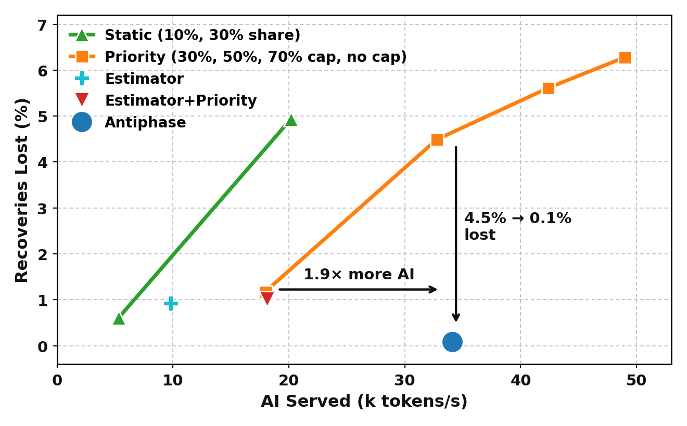</p>
<p align="center"><b>그림 30.</b> 전 부하에서의 AI 처리량과 잃은 복구. 기준선은 GPU 몫을 늘리면 선을 따라 오른쪽 위로 간다.</p>

기준선이 GPU 몫을 늘리면 선을 따라 오른쪽 위로 간다(AI는 늘고 복구를 잃는다). Antiphase는 오른쪽 아래에 있다. 그림의 이름은 4.2절의 표에 있다. 방식 전체를 그린 그림은 [tradeoff_full_load.png](docs/current/figures/backstop_v14/tradeoff_full_load.png)다.

- **복구.** Antiphase는 복구를 AI 없는 실행과 같은 수로 유지한다(99.9%, 시드 범위 99.7–100.3%).
- **L1 마감.** Antiphase의 L1 놓침은 0.036%(시드별 0.016–0.057%), AI 없는 실행은 0.032%(0.028–0.049%)다. 기존 수신기 완료 p99.9는 3.14 ms(AI 없음 3.10 ms, 낮은 우선순위 + 70% 3.51 ms)다.
- **AI 처리량.** 복구 98.8% 이상을 유지하는 기존 수단 가운데 AI 처리량이 가장 큰 것은 낮은 우선순위 + 추정기(18.1k)와 낮은 우선순위 + 30%(18.0k)다. Antiphase는 그 1.9배다. 고정 10%의 6.4배, 추정기 방식의 3.5배다.
- **AI 처리량이 더 큰 방식.** 낮은 우선순위 + 70%(42.4k)와 한도 없음(49.0k)은 Antiphase보다 24–44% 많이 처리하고 복구를 5.6–6.3% 잃는다.
- **추정기 방식.** 전 부하가 계속되면 추정기는 고정 20%(낮은 우선순위에서는 30%)를 고른다. 결과는 그 고정 비율과 같다.
- **Antiphase의 다른 설정.** 가장 큰 AI 단위(한도 1.2 ms 초과)도 기존 수신기 옆에서 돌리면 AI 처리량이 10% 늘고 L1 놓침이 0.061%로 는다. 빈 NRx 여유 3을 더하면 AI가 6% 더 늘고 복구가 0.7%p 준다(4.14절).
- **v13 규칙과의 차이.** 복구 유지율이 97.8%에서 99.9%로 오르고 AI 처리량은 14% 준다(4.14절).

### 4.11 부하 변화

> **한 줄 결론.** 부하가 바뀌어도 41.4k–44.7k tokens/s를 처리하고 복구를 99.9–100.0% 유지한다. 고정 10%의 **7.2–7.5배**, 추정기 방식의 **1.6–1.9배**다. 부하를 지연 없이 아는 이상적인 방식(낮은 우선순위 포함)보다 1.09–1.19배 많다.

16셀, GPU 4장, AI 53k 제공, 512 슬롯 반복, 시드 5(고정 30%와 낮은 우선순위 + 50%는 시드 2).

#### 4.11.1 전 부하와 절반 부하의 교대

2초마다 "모든 셀 활성"과 "셀마다 확률 0.5로 활성"이 교대한다. 20초 실행.

| 방식 | AI 처리량 (시드 범위) | 복구 유지율 (시드 범위) | L1 놓침 | Antiphase의 AI 처리량 배수 |
|---|---|---|---|---|
| AI 없음 | – | 100% | 0.018% | – |
| **Antiphase** | **41.4k** (40.9–42.5k) | **99.9%** (99.5–100.0%) | 0.019% | – |
| 고정 10% | 5.7k (5.6–5.8k) | 99.5% (99.3–99.7%) | 0.016% | 7.21배 |
| 고정 30% | 22.6k (22.3–22.9k) | 97.0% (96.6–97.4%) | 0.025% | 1.83배 |
| 낮은 우선순위 + 30% | 20.3k (20.0–20.7k) | 99.2% (98.8–99.5%) | 0.018% | 2.04배 |
| 낮은 우선순위 + 50% | 36.8k (36.3–37.3k) | 97.1% (96.5–97.6%) | 0.012% | 1.13배 |
| 낮은 우선순위 + 70% | 46.9k (46.1–47.5k) | 96.0% (95.4–96.6%) | 0.021% | 0.88배 |
| 부하 따라 10/50% | 23.8k (23.4–24.4k) | 99.2% (98.7–99.5%) | 0.014% | 1.74배 |
| 낮은 우선순위 + 부하 따라 30/70% | 34.7k (34.5–35.0k) | 99.0% (98.6–99.3%) | 0.018% | 1.19배 |
| 추정기로 비율 선택 | 21.8k (21.1–22.5k) | 95.3% (94.3–96.4%) | 0.055% | 1.90배 |
| 낮은 우선순위 + 추정기 | 27.2k (26.1–28.3k) | 97.8% (97.4–98.0%) | 0.016% | 1.52배 |
| Antiphase의 다른 설정: 큰 단위도 기존 수신기 옆 허용 | 44.9k (43.9–45.6k) | 99.8% (99.6–99.9%) | 0.023% | 0.92배 |

#### 4.11.2 무작위 계단 부하

활성 셀 비율이 25 / 50 / 75 / 100% 사이를 0.5–1.5초 간격의 무작위 시점에 바뀐다. 40초 실행.

| 방식 | AI 처리량 (시드 범위) | 복구 유지율 (시드 범위) | L1 놓침 | Antiphase의 AI 처리량 배수 |
|---|---|---|---|---|
| AI 없음 | – | 100% | 0.008% | – |
| **Antiphase** | **44.7k** (44.2–45.6k) | **100.0%** (99.9–100.1%) | 0.005% | – |
| 고정 10% | 6.0k (5.9–6.0k) | 99.8% (99.6–100.0%) | 0.007% | 7.47배 |
| 낮은 우선순위 + 30% | 22.2k (21.3–23.1k) | 99.5% (99.3–99.7%) | 0.008% | 2.02배 |
| 낮은 우선순위 + 70% | 48.6k (48.1–49.1k) | 97.3% (96.6–98.0%) | 0.004% | 0.92배 |
| 부하 따라 10/30/50% | 30.0k (28.8–32.5k) | 98.6% (98.2–98.9%) | 0.052% | 1.49배 |
| 낮은 우선순위 + 부하 따라 30/50/70% | 40.9k (40.4–42.3k) | 99.1% (98.7–99.4%) | 0.005% | 1.09배 |
| 추정기로 비율 선택 | 27.7k (26.3–30.6k) | 95.6% (95.1–96.1%) | 0.068% | 1.62배 |
| 낮은 우선순위 + 추정기 | 36.4k (33.4–40.1k) | 97.4% (96.9–98.0%) | 0.007% | 1.23배 |
| Antiphase의 다른 설정: 큰 단위도 기존 수신기 옆 허용 | 47.8k (47.3–48.2k) | 99.9% (99.8–100.1%) | 0.011% | 0.94배 |

부하 수준별 결과(칸은 "AI 처리량 / 복구 유지율"):

| 방식 | 부하 25% 구간 | 50% 구간 | 75% 구간 | 100% 구간 |
|---|---|---|---|---|
| **Antiphase** | 50.7k / 100.0% | 48.8k / 100.0% | 43.4k / 100.1% | **34.9k / 100.0%** |
| 고정 10% | 6.2k / 99.9% | 6.1k / 100.0% | 5.9k / 100.0% | 5.7k / 99.4% |
| 낮은 우선순위 + 30% | 25.4k / 99.9% | 23.7k / 99.9% | 20.8k / 99.8% | 18.3k / 98.9% |
| 낮은 우선순위 + 70% | 51.1k / 100.0% | 50.6k / 99.8% | 47.9k / 98.2% | 44.0k / 94.3% |
| 부하 따라 10/30/50% | 45.7k / 99.8% | 44.1k / 99.1% | 24.0k / 98.6% | 3.9k / 97.8% |
| 낮은 우선순위 + 부하 따라 30/50/70% | 51.2k / 100.0% | 51.0k / 99.9% | 39.1k / 99.2% | 20.4k / 98.2% |
| 추정기로 비율 선택 | 30.9k / 99.8% | 26.2k / 99.2% | 28.0k / 96.6% | 25.2k / 91.7% |
| 낮은 우선순위 + 추정기 | 39.8k / 99.9% | 33.1k / 99.7% | 36.0k / 98.3% | 35.4k / 94.7% |

이 결과는 그림 5에 그렸다.

기준선 막대 위의 숫자는 Antiphase가 그 방식보다 AI를 몇 배 처리하는가이고, 아래 줄은 잃은 복구(100% − 복구 유지율)다. 여덟 방식을 모두 그린 그림은 [headline_load_patterns.png](docs/current/figures/backstop_v14/headline_load_patterns.png)에 있다.

#### 4.11.3 읽는 법

- **Antiphase는 세 조건 모두에서 복구 99.9% 이상을 유지하고 L1 놓침이 AI 없는 실행과 같다**(0.005–0.036% 대 0.008–0.032%; 실행 시작 구간을 포함한 값이고 정상 상태의 값은 4.8절). AI 처리량은 고정 10%의 6.4–7.5배, 낮은 우선순위 + 30%의 1.9–2.0배다.
- **부하를 지연 없이 아는 "부하 따라 비율"** (전환 비용 0)과 비교하면 1.5–1.7배이고 복구 유지율이 0.7–1.4%p 높다. 낮은 우선순위를 더한 것과 비교하면 1.09–1.19배, 0.9%p다.
- **추정기로 비율을 고르는 방식** (1초마다 결정, 재설정 0.266초)과 비교하면 1.6–1.9배이고 복구 유지율이 4.4–4.6%p 높다. 낮은 우선순위를 더한 것과 비교하면 1.23–1.52배, 2.1–2.6%p다.
- **추정기 방식이 복구를 잃는 이유.** 결정이 직전 1초의 부하에 근거한다. 2초 교대에서 비율 결정은 20, 20, 70, 70, 20, 20, …%로 부하보다 1초 늦는다. 전 부하 구간의 절반 동안 70%가 적용된다. 계단 부하의 100% 구간에서 복구 유지율이 91.7%다. YinYangRAN의 결정 간격(1초 이상)은 MPS 재설정 비용에서 오는 설계 값이다.
- **차이는 전 부하 구간에서 생긴다.** 계단 부하의 100% 구간에서 Antiphase는 34.9k를 처리하고 100.0%를 유지한다. 부하 따라 비율은 낮은 비율로 내려가 3.9k–20.4k를 처리한다. 낮은 우선순위 + 70%와 낮은 우선순위 + 추정기는 35.4k–44.0k를 처리하지만 복구가 94.3–94.7%다.
- **낮은 우선순위 + 70%** 는 부하가 바뀌는 조건에서 AI를 Antiphase보다 9–13% 많이 처리하고 복구를 2.7–3.9%p 더 잃는다.

### 4.12 미래를 아는 스케줄과의 거리

<p align="center">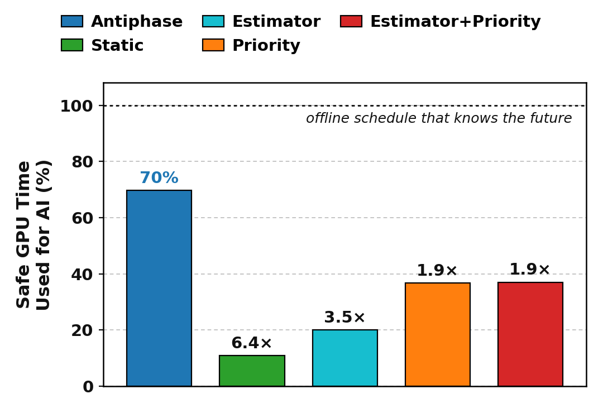</p>
<p align="center"><b>그림 31.</b> 뒤에 올 실패를 모두 아는 오프라인 스케줄의 추정 AI 처리량(100%)에 대한 각 방식의 AI 처리량(전 부하).</p>

> **한 줄 결론.** Antiphase는 뒤에 올 실패를 모두 아는 오프라인 스케줄의 추정 처리량의 **70%**를 처리한다(전 부하; AI가 GPU를 쓰는 시간으로는 64%). 복구를 지키는 기존 수단은 11–37%다. Antiphase가 **1.9–6.4배**다. 이 값은 추정한 참조값이고 증명한 상한이 아니다.

Antiphase는 NRx가 도는 동안 그 GPU의 AI를 멈춘다. 뒤에 올 후보를 미리 안다면 대부분의 NRx 실행 옆에서 AI를 돌려도 복구를 잃지 않는다. 그 참조값을 AI 없는 실행의 기록(후보가 난 슬롯, 각 NRx 실행의 시작 시각과 길이)에서 계산했다(`analyze_optimum.py`).

| 계산 | 가정 | AI가 돌 수 있는 GPU 시간 |
|---|---|---|
| 규칙의 이상값 | NRx가 도는 동안만 그 GPU의 AI를 끈다. 중단 지연과 허락의 손실이 없다 | 1 − (NRx 실행 시간의 합) / (GPU 시간) |
| 미래를 아는 스케줄 | 모든 후보와 실행 시간을 미리 안다. 시작 시각을 AI 없는 실행과 같게 두므로 잃는 후보가 없다. NRx 옆의 AI는 그 NRx가 다음 실행의 시작 전에 끝나는 한도까지 돈다. AI 옆의 NRx는 0.786배 속도로 진행한다(실측 6.29 ms 대 8.01 ms) | 실행마다 AI를 꺼야 하는 시간만 뺌 |
| 규칙 없음 | AI를 끄지 않는다(낮은 우선순위만) | 1 (복구를 잃음) |

"미래를 아는 스케줄의 AI 처리량"은 Antiphase의 측정 처리량에 AI 시간의 비(미래를 아는 스케줄 / Antiphase 실측)를 곱한 추정이고, 낮은 우선순위만 쓴 방식의 측정값(전 부하 49.0k)을 넘지 않게 했다. 그 측정이 없는 조건은 제공량을 넘지 않게 했다.

| 조건 | NRx가 도는 시간 | AI 시간: 규칙의 이상값 | Antiphase 실측 | 미래를 아는 스케줄 (줄여야 하는 실행) | AI 처리량: Antiphase | 미래를 아는 스케줄 (추정) | Antiphase / 참조값 |
|---|---|---|---|---|---|---|---|
| 16셀 전 부하 | 36% | 64% | 62% | 96.5% (13%) | 34.1k @ 99.9% | 49.0k | **70%** |
| 16셀 2초 교대 | 27% | 73% | 69% | 98.1% (9%) | 41.4k @ 99.9% | 53.0k | 78% |
| 16셀 무작위 계단 | 22% | 78% | 72% | 98.9% (7%) | 44.7k @ 100.0% | 53.0k | 84% |
| 2-UE 셀 2개 | 18% | 82% | 77% | 99.6% (3%) | 46.6k @ 100.0% | 53.0k | 88% |
| 2-UE 셀 6개 | 54% | 46% | 45% | 89.0% (29%) | 19.9k @ 100.0% | 39.2k | 51% |
| 2-UE 셀 8개 | 67% | 33% | 33% | 76.1% (48%) | 11.8k @ 99.6% | 27.3k | 43% |
| GPU 2장, 2-UE 셀 2개 | 34% | 66% | 61% | 93.8% (24%) | 16.6k @ 100.0% | 25.6k | 65% |
| GPU 2장, 2-UE 셀 4개 | 61% | 39% | 35% | 78.6% (46%) | 6.9k @ 99.9% | 15.5k | 45% |
| GPU 1장, 2-UE 셀 1개 | 30% | 70% | 59% | 94.6% (24%) | 8.5k @ 99.8% | 13.2k | 64% |
| GPU 1장, 2-UE 셀 2개 | 50% | 50% | 40% | 84.8% (43%) | 4.5k @ 97.7% | 9.6k | 47% |
| 20셀 전 부하 | 37% | 63% | 61% | 96.3% (14%) | 31.4k @ 99.5% | 49.3k | 64% |
| 32셀 절반 부하 | 37% | 63% | 62% | 97.5% (11%) | 33.4k @ 100.0% | 52.6k | 63% |
| 48셀 1/3 부하 | 37% | 63% | 61% | 97.4% (11%) | 32.6k @ 99.7% | 52.1k | 63% |

전 부하에서 다른 방식의 위치(참조값 49.0k 대비):

| 방식 | AI 처리량 | 복구 유지율 | 참조값 대비 |
|---|---|---|---|
| **Antiphase** | 34.1k | 99.9% | **70%** |
| Antiphase의 다른 설정: 빈 NRx 여유 3 | 39.8k | 99.3% | 81% |
| 고정 10% | 5.3k | 99.4% | 11% |
| 추정기로 비율 선택 | 9.8k | 99.1% | 20% |
| 낮은 우선순위 + 30% | 18.0k | 98.8% | 37% |
| 낮은 우선순위 + 추정기 | 18.1k | 99.0% | 37% |
| 낮은 우선순위 + 70% | 42.4k | 94.4% | 87% |
| 조각 중단, 빈 NRx 여유 1 | 44.0k | 95.1% | 90% |

- **Antiphase의 구현은 자기 규칙의 이상값에 가깝다.** 전 부하에서 AI가 실제로 돈 시간은 62%이고 규칙의 이상값은 64%다(97%). 중단 지연과 조각 허락으로 잃는 시간은 2%p다. GPU 1장에서는 59% 대 70%, 40% 대 50%로 차이가 크다.
- **미래를 알면 AI를 꺼야 하는 시간은 3.5%다.** 전 부하에서 NRx 실행의 13%만 다음 후보 때문에 줄여야 하고, 나머지 87%는 AI 옆에서 끝까지 돌아도 그 NRx가 필요해지기 전에 끝난다.
- **Antiphase는 그 참조값의 70%를 처리한다**(전 부하). 복구 98.8% 이상을 지키는 기존 수단은 11–37%다. 부하가 낮으면 참조값에 가깝고(78–88%), NRx 수요가 크면 멀다(43–51%).
- **남은 차이는 정보의 차이다.** 어느 NRx가 두 슬롯 뒤에 필요한지는 그 슬롯의 복호가 끝나야 안다(실행 시작 약 5.0 ms 뒤). 그때까지 AI를 옆에서 돌리면 실행이 이미 1.07 ms 늦어져 여유(1.2 ms)가 0.13 ms 남는다. 중단 지연(중앙값 0.43 ms, p99 1.44 ms)과 실행 시간의 변동이 그보다 크다. 실측에서 빈 NRx 여유 3은 복구를 0.6%p 잃었고, 여유를 쓰는 규칙(NRx가 다음 후보를 받을 수 있는 시각까지 AI 허락)은 4.0%p 잃었다(128 슬롯 반복에서 95.1% 대 NRx 옆 금지 99.1%, 4.14절).
- 따라서 복구를 잃지 않으면서 참조값에 다가가려면 "두 슬롯 뒤의 실패"를 미리 아는 수단이 필요하다. 후보의 도착은 연속 슬롯에 몰리지만(같은 셀이 다음 슬롯에도 후보를 낼 확률 0.19–0.26, 평균 0.145) 이 정도의 상관으로는 부족하다.
- 한계: 참조값은 증명한 상한이 아니라 추정이다. AI 처리량은 AI 시간의 비로 환산했다. NRx 옆의 AI는 혼자 돌 때보다 느리므로 추정은 높은 쪽으로 치우친다. 전 부하만 낮은 우선순위 방식의 측정값(49.0k)을 넘지 않게 했다. 미래를 아는 스케줄은 시작 시각을 바꾸지 않는 스케줄 가운데 최적이다(실행을 NRx에 배정하는 순서는 줄이는 시간이 가장 작게 골랐다). 시작을 늦추는 스케줄까지 넣은 최적은 이보다 높거나 같고 100% 이하다.

### 4.13 복구 손실 모델의 검증

> **한 줄 결론.** 닫힌 형태의 모델이 672개 실험의 손실을 평균 오차 0.82%p(상관 0.994)로 맞춘다. 모델을 정한 뒤에 잰 260개 실험에서는 0.61%p다.

2.5절의 모델을 실측과 대조했다. 지표는 "복구 후보 가운데 빈 NRx를 얻지 못해 버려진 비율"이다.

| 계산 | 입력 | 대조한 실행 | 상관 | 평균 절대 오차 | 평균 편향 |
|---|---|---|---|---|---|
| 사건 모의 | AI 없는 실행의 후보 도착, NRx 실행 시간(혼자 / AI 옆), 규칙, 중단 지연 | AI가 있는 실행 334개 | 0.995 | 0.77%p | +0.46%p |
| **닫힌 형태** | NRx 수, 슬롯당 후보 수의 전이 행렬, 후보가 알려지는 시각 c와 NRx 실행 시간 S의 분포(같은 조건의 다른 시드) | 실행 672개 (AI 없는 실행 포함) | 0.994 | 0.82%p | +0.06%p |
| 닫힌 형태, 처음의 실행 | 같음 | 412개 | 0.993 | 0.95%p | +0.07%p |
| 닫힌 형태, 모델을 정한 뒤에 측정한 실행 | 같음 | 260개 | 0.996 | 0.61%p | +0.06%p |
| 닫힌 형태, 3슬롯 실행의 비율 f를 실측에서 넣음 | NRx 수, 전이 행렬, f | 처음의 412개 | 0.993 | 0.92%p | −0.14%p |
| 닫힌 형태, f 실측, 후보 도착을 독립으로 가정 | NRx 수, 2-UE 셀 수, 후보 확률, f | 처음의 412개 | 0.972 | 2.87%p | −2.76%p |

대조한 실행은 NRx 1 / 2 / 4개(106 / 78 / 488개 실행), 4–48셀, 2-UE 셀 1–12개, 방식과 설정 35가지, 128 슬롯 반복과 512 슬롯 반복이다. 닫힌 형태의 평균 절대 오차는 NRx 4개에서 0.48%p, 2개에서 1.45%p, 1개에서 1.93%p다. 닫힌 형태가 계산한 3슬롯 실행의 비율은 실측과 상관 0.985, 평균 절대 오차 3.4%p다.

모델을 정한 뒤에 측정한 260개 실행은 AI 부하 13k / 27k / 106k, AI 요청 버스트, 20셀(최신 시작 시각 2.9 ms와 3.9 ms), 32셀, 48셀, GPU 1장의 시드 3–5, 교대 간격 0.2초 / 2초 / 5초, 무작위 계단, 셀 버스트다(4.15, 4.16절). 조건별 평균 절대 오차는 0.06–0.62%p이고, 두 조건이 그보다 크다: GPU 1장(2.7%p, 크게 예측)과 32셀 2초 버스트(1.4%p, 작게 예측).

<p align="center"></p>
<p align="center"><b>그림 32.</b> 복구 손실 모델의 예측 대 실측. (a) 사건 모의, 382개 실행. (b) 닫힌 형태, 672개 실행.</p>

그림의 (a)는 AI 없는 실행 48개를 포함한 382개 실행이다(평균 절대 오차 0.70%p). (b)는 f를 넣지 않는 닫힌 형태의 672개 실행이다. 범례의 "GPU share policies"는 고정 비율, 부하 따라 비율, 추정기로 고른 비율이다.

512 슬롯 반복의 조건별 값. 칸은 "버려진 후보: 실측 / 닫힌 형태 / 사건 모의"이고 괄호는 "3슬롯 실행의 비율: 실측 → 닫힌 형태"다.

| NRx 수, 2-UE 셀 수 | AI 없음 | **Antiphase** | 낮은 우선순위 + 30% | 낮은 우선순위 + 70% |
|---|---|---|---|---|
| 4, 2 | 0.0 / 0.1 / 0.0% (4 → 3%) | 0.0 / 0.1 / 0.2% (7 → 5%) | 0.5 / 0.2 / 0.6% (19 → 19%) | 1.3 / 1.0 / 1.3% (78 → 77%) |
| 4, 4 (시드 5) | 1.6 / 1.6 / 1.7% (10 → 7%) | 1.7 / 1.9 / 2.2% (11 → 10%) | 2.6 / 2.9 / 2.5% (30 → 31%) | 6.2 / 5.7 / 7.0% (86 → 86%) |
| 4, 6 | 4.7 / 4.4 / 4.5% (14 → 13%) | 4.8 / 4.7 / 5.7% (17 → 16%) | 6.8 / 7.5 / 7.2% (42 → 47%) | 11.4 / 12.0 / 12.6% (90 → 91%) |
| 4, 8 | 10.1 / 10.5 / 9.9% (21 → 22%) | 10.5 / 10.9 / 12.4% (23 → 24%) | 13.6 / 15.5 / 14.3% (51 → 57%) | 19.7 / 20.4 / 21.2% (89 → 91%) |
| 2, 2 | 7.0 / 7.5 / 6.8% (14 → 10%) | 7.2 / 8.0 / 7.3% (16 → 15%) | 7.4 / 9.8 / 7.6% (26 → 31%) | 14.1 / 14.2 / 16.8% (78 → 78%) |
| 2, 4 | 19.3 / 20.7 / 18.9% (21 → 20%) | 19.4 / 21.1 / 20.6% (24 → 24%) | 22.3 / 25.2 / 22.5% (40 → 50%) | 28.8 / 30.0 / 31.2% (83 → 85%) |
| 1, 1 | 16.8 / 17.3 / 16.8% (5 → 6%) | 17.0 / 18.0 / 16.8% (13 → 13%) | 16.8 / 19.4 / 16.8% (16 → 27%) | 24.1 / 22.7 / 26.9% (65 → 63%) |
| 1, 2 | 30.9 / 33.0 / 30.5% (8 → 14%) | 31.9 / 33.8 / 31.8% (19 → 20%) | 32.5 / 36.3 / 32.6% (26 → 41%) | 40.3 / 40.0 / 43.5% (69 → 72%) |

- **방식의 차이는 3슬롯 실행의 비율 f로 요약되고, f는 c와 S의 분포에서 나온다.** 빈 NRx에서 바로 시작한 실행은 `P(c + S > 2P + L)`의 확률로 3슬롯이 된다. NRx가 풀리기를 기다린 실행은 전체의 약 8%이고 그 93%가 3슬롯이다. 16셀·2-UE 셀 4개에서 f는 AI 없는 실행 0.10, Antiphase 0.11, 낮은 우선순위 + 30% 0.30, + 70% 0.86이다.
- **Antiphase는 여덟 조건 모두에서 버려진 후보가 AI 없는 실행보다 1.0%p 이내로 많다.** 낮은 우선순위 + 70%는 1.3–9.6%p 많다.
- **후보 도착은 독립이 아니다.** 한 셀이 어느 슬롯에 후보를 내면 다음 슬롯에도 낼 확률이 0.19–0.26이다(평균 확률 0.145). 독립으로 가정하면 손실을 절반 이하로 본다.
- **모델이 맞지 않는 곳.** "NRx가 다음 후보를 받을 수 있는 시각까지 AI를 허락"하는 규칙에서 사건 모의가 1.0–3.0%p 작게 예측한다(이 규칙은 NRx 실행 시간의 예측에 의존한다). 빈 NRx 여유 1(NRx 2개)에서 2.0%p 작게 예측한다. 2-UE 셀 8개의 Antiphase에서 1.9%p 크게 예측한다. 닫힌 형태는 NRx 1–2개에서 낮은 우선순위 + 30%의 손실을 2.4–3.8%p 크게 본다(3슬롯 실행의 비율을 5–15%p 크게 계산한다). NRx 1개의 실행 106개에서 평균 1.2%p 크게 본다. 부하가 수 초 단위로 바뀌는 조건(32셀 2초 버스트)에서는 1.4%p 작게 본다. 닫힌 형태는 도착을 1차 전이 행렬 하나로 적고, 부하 구간이 바뀌는 것을 넣지 않는다. 닫힌 형태의 입력 c와 S는 그 방식의 실행에서 잰 분포다. 측정 없이 방식의 S를 예측하지는 않는다.
- **모델이 찾아 준 실험 방법의 편향.** v13까지는 셀마다 슬롯 128개를 반복했다(0.32초). 여러 셀의 실패가 겹치는 슬롯이 0.32초마다 되풀이돼, AI 없는 실행의 손실이 시드에 따라 1.45%와 3.76%였고 닫힌 형태와 맞지 않았다. 512 슬롯 반복에서는 시드 간 차이가 1.30–1.34%로 줄었다. 같은 조건을 두 반복 길이로 재면(시드 2) 기준선의 복구 유지율이 1.0–1.5%p 오른다(고정 10%: 98.0 → 99.3%, 낮은 우선순위 + 30%: 97.2 → 98.7%, 낮은 우선순위 + 70%: 93.0 → 94.0%). 4.19절의 수치는 이만큼 기준선에 불리하다.

#### 4.13.1 NRx 실행이 길어질 때의 손실

닫힌 형태에 AI 없는 실행의 c와 S를 넣고 S에 일정한 증가를 더해 손실을 계산했다(16셀, 2-UE 셀 4개, NRx 4개). 점선은 기존 수신기 결과가 AI 때문에 0.3 ms 늦게 나오는 경우다. 점은 측정한 방식이고, 가로축은 그 방식의 NRx 실행 시간 중앙값에서 AI 없는 실행의 중앙값(6.29 ms)을 뺀 값이다.

<p align="center"></p>
<p align="center"><b>그림 33.</b> NRx 실행 시간의 증가와 손실. 곡선은 닫힌 형태의 계산이고 점은 측정한 방식이다.</p>

| NRx 실행 시간의 증가 (ms) | 0 | 0.2 | 0.4 | 0.6 | 0.8 | 1.0 | 1.2 | 1.4 | 1.6 |
|---|---|---|---|---|---|---|---|---|---|
| 버려진 후보, 닫힌 형태 | 1.5% | 1.8% | 2.2% | 2.5% | 2.8% | 3.0% | 3.8% | 5.9% | 6.2% |
| 3슬롯 실행의 비율, 닫힌 형태 | 7% | 13% | 22% | 30% | 35% | 40% | 55% | 95% | 100% |
| 버려진 후보, 기존 수신기 결과도 0.3 ms 늦음 | 2.0% | 2.4% | 2.7% | 2.9% | 3.3% | 4.9% | 6.1% | 6.2% | 6.2% |

| 방식 | NRx 실행 시간의 증가 | 버려진 후보 (실측) | 3슬롯 실행의 비율 (실측) |
|---|---|---|---|
| AI 없음 | 0 | 1.6% | 10% |
| **Antiphase** | +0.09 ms | 1.7% | 11% |
| 빈 NRx 여유 3 + 중단 | +0.30 ms | 2.4% | 35% |
| 고정 10% | +0.49 ms | 2.2% | 24% |
| 낮은 우선순위 + 30% | +0.75 ms | 2.6% | 30% |
| v13 규칙 (중단 없음) | +0.75 ms | 3.2% | 52% |
| 낮은 우선순위 + 50% | +1.04 ms | 4.7% | 60% |
| 고정 30% | +1.21 ms | 5.0% | 68% |
| 낮은 우선순위 + 70% | +1.33 ms | 6.2% | 86% |
| 빈 NRx 여유 1 + 중단 | +1.47 ms | 5.2% | 81% |
| 낮은 우선순위, 한도 없음 | +1.72 ms | 6.4% | 88% |

- **손실에는 두 수준이 있다.** 모든 실행이 2슬롯이면 1.5%, 모든 실행이 3슬롯이면 6.2%다. NRx 실행 시간의 증가가 1.0 ms 이하면 손실이 3.0% 이하이고, 1.0–1.4 ms에서 6%로 오른다. 그 뒤로는 실행이 더 길어져도 손실이 거의 늘지 않는다(4슬롯이 되기까지 2.5 ms가 더 남는다).
- **여유는 1.2 ms다.** `2P + L − c − S = 5.0 + 3.9 − 1.4 − 6.3 = 1.2 ms`. 후보가 알려지는 시각 c가 늦어지면 여유가 그만큼 준다(점선).
- **측정한 13개 방식은 두 곡선 사이에 있거나 0.3%p 안이다.** 빈 NRx 여유 1만 0.8%p 아래다. 고정 비율은 AI가 켜진 구간에서만 NRx를 늦추므로, 중앙값이 같은 일정한 증가보다 실행 시간이 넓게 퍼진다.
- **설계 기준.** 복구를 지키려면 GPU 비율이 아니라 NRx 실행 시간의 증가를 여유 안에 두어야 한다. 비율 30%는 증가가 0.75–1.21 ms여서 여유의 경계에 있고, 70% 이상은 여유를 넘는다. Antiphase는 +0.09 ms다.

#### 4.13.2 실행별 여유와 3슬롯 실행

> **한 줄 결론.** 여유는 실행마다 다르다. AI가 없어도 전 부하에서 실행의 10.6%가 3슬롯이다. Antiphase는 이 비율을 11.2%로 두고, 낮은 우선순위 + 30%는 29.9%로 올린다. 복구를 지키는지는 "실행 시간의 증가가 1.2 ms보다 작은가"가 아니라 "3슬롯 실행의 비율이 AI 없는 서버와 같은가"로 본다.

NRx 실행마다 시작 오프셋 s와 길이 S를 기록에서 읽어 여유 `2P + L − (s + S)`를 계산했다(`analyze_slack.py`, 기존 실행의 기록). 여유가 음수인 실행이 3슬롯 실행이다.

| 조건 | 방식 | 여유의 중앙값 | 3슬롯 실행 | NRx를 못 받은 후보 |
|---|---|---|---|---|
| 전 부하, 고정 MCS (시드 5) | AI 없음 | 1.19 ms | 10.6% | 1.66% |
| | **Antiphase** | 0.67 ms | **11.2%** | 1.68% |
| | 낮은 우선순위 + 30% | 0.29 ms | 29.9% | 2.65% |
| | 낮은 우선순위 + 70% | −1.18 ms | 86.7% | 6.38% |
| rate control, 목표 10% (시드 3) | AI 없음 | 0.77 ms | 21.2% | 6.52% |
| | **Antiphase** | 0.49 ms | **25.0%** | 7.29% |
| | 낮은 우선순위 + 30% | −0.05 ms | 52.2% | 9.87% |
| 2-UE 셀 8개, 목표 1% (시드 4–9) | AI 없음 | 0.91 ms | 27.3% | 5.23% |
| | **Antiphase** | 0.29 ms | **34.2%** | 5.81% |
| | 낮은 우선순위 + 30% | −0.20 ms | 65.5% | 8.18% |

- **AI가 없어도 여유는 1.2 ms가 아닌 실행이 많다.** 전 부하에서 여유가 0.43 ms(중단 지연의 중앙값)보다 작은 실행이 26%이고, 0보다 작은 실행이 10.6%다. 기존 수신기 결과가 늦게 나오거나 빈 NRx를 기다린 실행이다.
- **Antiphase도 여유의 일부를 쓴다.** 원인은 둘이다. 기존 수신기 결과가 중앙값으로 0.14–0.35 ms 늦게 나온다(작은 두 등급의 AI 단위가 복호 중인 셀 옆에서 돈다). 그리고 실행의 64–82%에서 AI가 NRx 시작 뒤에도 GPU에 남는다(중앙값 0.4 ms, p99 1.4–1.5 ms). 남은 시간 1 ms마다 실행이 약 0.3 ms 길어진다.
- **그 결과가 NRx 수요가 큰 조건의 손실이다.** 2-UE 셀 8개·목표 1%에서 3슬롯 실행이 27.3%에서 34.2%로 늘고, 이 조건의 goodput 손실이 42개 조건 가운데 가장 크다(4.9.10절).
- **중단을 더 빠르게 해도 얻는 것은 한정된다.** 같은 기록으로 추정하면, 남는 시간을 0.37 ms(가장 작은 등급의 한도)로 제한할 때 이 조건의 3슬롯 실행은 34.2%에서 32.9%가 되고, 남는 시간이 0이어도 30.4%다(AI 없음 27.3%). GPreempt처럼 수십 µs 안에 선점하는 수단을 써도 줄일 수 있는 것은 이 범위다. 그래서 중단 방식은 바꾸지 않았다.
- 낮은 우선순위 + 30%에서는 AI가 실행 내내 옆에 있어(중앙값 7.0 ms) 실행이 0.75 ms 길어지고, 3슬롯 실행이 AI 없는 서버의 2.4–2.8배가 된다.

원본: `results/backstop_slot/slack_{fa,lfa,lfc,lec}.json`.

### 4.14 규칙의 근거: 조각 중단, NRx 옆 금지, 기존 수신기 옆의 단위 크기

> **한 줄 결론.** AI 조각을 멈출 수 있게 하고 NRx가 도는 GPU의 AI를 금지하면, AI가 남아 있는 시간이 43%에서 6%로 줄고 복구가 97.8%에서 100.0%로 오른다. 가장 큰 AI 단위를 기존 수신기와 겹치지 않게 하면 L1 놓침이 0.061%에서 0.036%로 준다.

16셀 전 부하, AI 53k 제공, 512 슬롯 반복. 규칙을 하나씩 바꾼 결과다.

| 구성 | AI 처리량 | 복구 유지율 | L1 놓침 (AI 없음 0.032%) | 버려진 후보 (AI 없음 1.6%) | 3슬롯 실행의 비율 (AI 없음 10%) | 시드 |
|---|---|---|---|---|---|---|
| 낮은 우선순위만 (허락 없음) | 49.0k | 93.7% | 0.044% | 6.4% | 88% | 5 |
| 조각 허락, 중단 없음, 빈 NRx 여유 3 (v13 규칙) | 39.5k | 97.8% | 0.025% | 3.2% | 52% | 2 |
| 조각 중단, 빈 NRx 여유 1 | 44.0k | 95.1% | 0.066% | 5.2% | 81% | 2 |
| 조각 중단, 빈 NRx 여유 2 | 42.2k | 96.6% | 0.051% | 4.1% | 64% | 2 |
| 조각 중단, 빈 NRx 여유 3 | 39.8k | 99.3% | 0.038% | 2.4% | 35% | 5 |
| 조각 중단, NRx 옆 금지 | 37.6k | 100.0% | 0.061% | 1.8% | 14% | 5 |
| **조각 중단, NRx 옆 금지, 가장 큰 단위는 기존 수신기 옆 금지 (Antiphase)** | **34.1k** | **99.9%** | **0.036%** | **1.7%** | **11%** | 5 |

AI가 꺼져 있어야 하는 시간에 실제로 꺼져 있는가:

| | v13 규칙 (중단 없음) | 빈 NRx 여유 3 + 중단 | NRx 옆 금지 + 중단 | **Antiphase** |
|---|---|---|---|---|
| AI가 꺼져 있어야 하는 NRx 시간 중 AI가 남아 있는 비율 | 43% | 15% | 7% | **6%** |
| 중단 표시 → 조각 종료, 중앙값 / p90 / p99 | 멈추지 못함. 조각 길이 2.3 / 4.4 / 8.6 ms | 0.65 / 2.17 / 3.91 ms | 0.46 / 1.37 / 2.41 ms | **0.43 / 1.12 / 1.44 ms** |
| NRx 실행 시간 중앙값 (혼자 6.28 ms) | 7.04 ms | 6.58 ms | 6.39 ms | **6.38 ms** |

기존 수신기 옆에서 허용하는 단위 크기(같은 job의 실행, 시드 3):

| 설정 | AI 처리량 | 복구 유지율 | L1 놓침 | 기존 수신기 완료 중앙값 | 기존 수신기 완료 p99.9 |
|---|---|---|---|---|---|
| AI 없음 | – | 100% | 0.029% | 1.40 ms | 3.12 ms |
| 세 등급 모두 허용 | 37.3k | 99.7% | 0.049% | 1.83 ms | 3.51 ms |
| **가장 큰 등급(한도 1.2 ms 초과) 금지 (Antiphase)** | **33.9k** | **99.8%** | **0.030%** | **1.82 ms** | **3.10 ms** |
| 가장 작은 등급만 허용 | 24.2k | 99.8% | 0.032% | 1.60 ms | 3.07 ms |
| 세 등급 모두 허용 + 비율 한도 70% | 30.7k | 99.9% | 0.025% | 1.73 ms | 3.11 ms |

- **조각 중단.** v13의 조각은 허락받은 뒤 멈추지 못했고, 낮은 우선순위의 조각은 무선 작업 옆에서 길어졌다. AI가 꺼져 있어야 하는 시간의 43%에서 AI가 남아 있었다. 묶음 사이에서 중단 표시를 읽게 하면 6–7%로 준다. 남은 시간은 이미 GPU에 올라간 묶음이 끝날 때까지의 시간이다.
- **빈 NRx 여유.** 여유를 줄이면 3슬롯 실행의 비율이 14 → 35 → 64 → 81%로 늘고, 버려진 후보가 1.8 → 2.4 → 4.1 → 5.2%로 는다. AI 처리량은 37.6k → 44.0k로 는다. 빈 NRx 여유는 복구와 AI를 맞바꾸는 조절 값이다.
- **기본값을 NRx 옆 금지로 둔 이유.** (a) 복구를 AI 없는 실행과 같은 수로 유지하는 설정이다. (b) NRx 수에 따라 값을 고를 필요가 없다(4.15절). (c) 사건 모의는 여유 3과 금지의 손실 차이를 0.1%p로 보는데 실측은 0.6%p다. 모델 오차 안의 차이로 여유 값을 고르면 복구를 잃는다.
- **기존 수신기 옆의 단위 크기.** 가장 큰 등급의 AI 단위(1.33 ms)가 기존 수신기 옆에서 돌면 L1 놓침이 0.049–0.061%로 오른다. 3.7절의 한도 측정에서 이 등급은 기존 수신기 완료 p99.9를 4.05 ms로 만들어 L1 마감(4.0 ms)을 넘는다. 이 등급을 기존 수신기가 복호 중이 아닐 때로 미루면 L1 놓침과 p99.9가 AI 없는 실행과 같아지고 AI 처리량이 9% 준다. v13은 세 등급을 모두 허용했다.
- **L1 지연의 중앙값은 이 설정 값이 정한다.** Antiphase의 기본값(작은 두 등급 허용)은 기존 수신기 완료 중앙값을 0.42 ms 늘린다(1.40 → 1.82 ms). 가장 작은 등급만 허용하면 증가가 0.20 ms로 절반이 되고 AI 처리량은 24.2k로 29% 준다(그래도 낮은 우선순위 + 30%의 1.3배). 두 설정 모두 꼬리(p99.9)는 AI 없는 실행과 같다. L1은 마감이 있는 작업이므로 기본값은 꼬리를 기준으로 정했다. 중앙값을 낮춰야 하는 배치에서는 스킴을 바꾸지 않고 이 값만 바꾸면 된다.
- **v13에서 "NRx 옆 금지"가 25.3k에 97.4%였던 이유.** 조각을 멈출 수 없어서, 이 GPU에서 NRx가 시작할 수 있는 시간 전체에 조각을 허락하지 않았다. 조각 중단이 있으면 NRx가 실제로 시작할 때까지 AI를 돌릴 수 있다.
- **버린 규칙.** "NRx가 다음 후보를 받을 수 있는 시각까지의 여유를 AI에 쓴다"는 규칙은 40.7k에 95.1%였다(128 슬롯 반복). 여유를 다 쓰면 다음 후보가 늦게 시작해 연쇄로 3슬롯 실행이 된다.

기존 수신기 옆의 등급을 그 슬롯의 활성 셀 수로 바꾸는 변형(같은 job, 시드 2). 칸은 "AI 처리량 / 복구 유지율 / L1 놓침"이다.

| 조건 (L1 놓침, AI 없음) | **작은 두 등급을 항상 허용 (Antiphase)** | 활성 5셀: 가장 작은 등급만, 6셀 이상: 없음 | 활성 2셀 이하: 가장 큰 등급도 | 활성 3셀 이하: 가장 큰 등급도 |
|---|---|---|---|---|
| 16셀, 2초 교대 (0.013%) | **41.2k / 99.9% / 0.021%** | 같음 | 40.5k / 99.9% / 0.025% | 33.5k / 99.8% / 0.018% |
| 16셀, 무작위 계단 (0.005%) | **44.3k / 99.9% / 0.008%** | 같음 | 43.0k / 99.8% / 0.004% | 41.6k / 99.8% / 0.006% |
| 20셀, 전 부하 (0.042%) | **31.5k / 99.6% / 0.041%** | 22.6k / 99.8% / 0.038% | – | – |
| 32셀, 절반 부하 (0.040%) | **33.6k / 100.0% / 0.038%** | 17.7k / 100.1% / 0.048% | 33.6k / 100.0% / 0.035% | – |
| 48셀, 1/3 부하 (0.105%) | **32.7k / 99.7% / 0.149%** | 16.0k / 99.9% / 0.147% | 32.4k / 99.9% / 0.145% | – |

- **활성 셀이 많을 때 등급을 줄이는 변형.** 3.7절의 한도 측정(GPU당 5셀)을 따르면 활성 5셀에서는 가장 작은 등급만 허용해야 한다. 이 변형은 AI 처리량을 28–51% 줄이고 L1 놓침은 바꾸지 않았다. 한도 측정은 NRx와 AI가 함께 계속 도는 조건이고, Antiphase에서는 그 둘이 함께 돌지 않는다.
- **활성 셀이 적을 때 가장 큰 등급을 허용하는 변형.** 활성 2셀에서 가장 큰 등급의 한도 측정값은 3.49 ms, 3셀에서는 4.27 ms다. 2셀 이하에서 허용하면 AI 처리량이 0–3% 줄고, 3셀 이하에서 허용하면 6–19% 준다. Worker는 프롬프트의 chunk 크기를 최근 20 ms에 허용된 가장 큰 크기로 고른다. 큰 chunk를 고른 뒤 활성 셀이 늘면 그 단위가 기존 수신기가 비는 시간으로 밀린다. 2초 교대의 한 GPU에서 1,024 token chunk를 고른 요청은 Antiphase 0개, 2셀 이하 변형 5개, 3셀 이하 변형 77개(요청 629개 중)이고, AI가 GPU를 쓴 시간은 3셀 이하 변형에서 17% 적다.
- 따라서 등급 규칙은 활성 셀 수와 무관하게 둔다.

### 4.15 규모: NRx 수요와 GPU 수

> **한 줄 결론.** GPU 1–2장(GPU마다 2-UE 셀 하나)에서 낮은 우선순위 + 30%의 **2.0–2.2배**를 처리하고 복구를 99.8–100.0% 유지한다. 2-UE 셀이 8개로 늘면 AI 처리량은 11.8k로 줄지만 고정 10%의 **2.7배**다.

전 부하, AI는 GPU당 초당 32개 요청, 512 슬롯 반복, 시드 2(16셀·2-UE 셀 4개와 GPU 1장의 두 조건은 시드 5). 칸은 "AI 처리량 / 복구 유지율"이다.

| 조건 | AI 없이 복구 (TB/s) | **Antiphase** | 고정 10% | 낮은 우선순위 + 30% | 낮은 우선순위 + 70% |
|---|---|---|---|---|---|
| GPU 4장, 16셀, 2-UE 셀 2개 | 101 | **46.6k / 100.0%** | 5.7k / 99.5% | 22.3k / 99.5% | 49.8k / 98.4% |
| GPU 4장, 16셀, 2-UE 셀 4개 | 187 | **34.1k / 99.9%** | 5.3k / 99.4% | 18.0k / 98.8% | 42.4k / 94.4% |
| GPU 4장, 16셀, 2-UE 셀 6개 | 283 | **19.9k / 100.0%** | 4.8k / 98.2% | 14.1k / 97.4% | 32.8k / 92.8% |
| GPU 4장, 16셀, 2-UE 셀 8개 | 359 | **11.8k / 99.6%** | 4.4k / 97.8% | 11.5k / 96.0% | 26.3k / 88.7% |
| GPU 2장, 8셀, 2-UE 셀 2개 | 95 | **16.6k / 100.0%** | 2.4k / 99.4% | 8.2k / 99.4% | 20.3k / 91.5% |
| GPU 2장, 8셀, 2-UE 셀 4개 | 154 | **6.9k / 99.9%** | 2.0k / 99.2% | 5.8k / 96.6% | 14.2k / 88.3% |
| GPU 1장, 4셀, 2-UE 셀 1개 | 39 | **8.5k / 99.8%** | 1.1k / 99.7% | 3.9k / 100.0% | 9.3k / 92.3% |
| GPU 1장, 4셀, 2-UE 셀 2개 | 64 | **4.5k / 97.7%** | 1.0k / 97.5% | 2.9k / 96.8% | 8.1k / 84.1% |

<p align="center">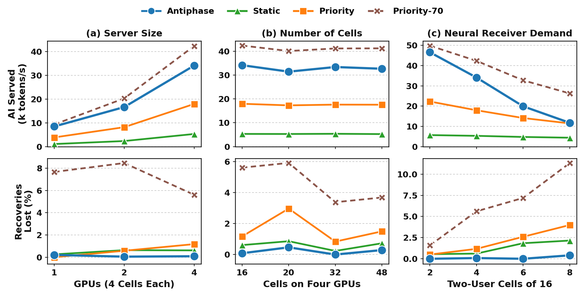</p>
<p align="center"><b>그림 34.</b> GPU 수, 셀 수, NRx 수요에 따른 AI 처리량(위)과 잃은 복구(아래).</p>

- (a) GPU 1, 2, 4장(GPU마다 2-UE 셀 하나): Antiphase는 Static의 6.4–7.8배, Priority의 1.9–2.2배를 처리한다.
- (b) 16–48셀: Static의 5.9–6.4배, Priority의 1.8–1.9배다(4.16.3절).
- (c) 2-UE 셀이 2개에서 8개로 늘면 NRx가 도는 시간이 길어져 배수가 준다: Static 대비 8.2배 → 2.7배, Priority 대비 2.1배 → 1.0배. 8개일 때 Priority는 복구를 4.0% 잃고 Antiphase는 0.4% 잃는다.
- Priority-70(점선)은 AI를 더 처리하지만 복구를 1.6–11.3% 잃는다.

- **GPU 2장과 4장의 여섯 조건에서 Antiphase는 복구 99.6% 이상을 유지한다.** AI 처리량은 고정 10%의 2.7–8.2배, 낮은 우선순위 + 30%의 1.0–2.1배다. 이 규칙에는 NRx 수에 따라 정하는 값이 없다. v13의 "빈 NRx 여유" 규칙은 NRx가 4개일 때만 뜻이 있었다.
- **GPU 1장(시드 5).** 2-UE 셀이 하나면 Antiphase는 8.5k에 99.8%(시드 범위 99.7–100.0%)이고, 낮은 우선순위 + 70%는 9.3k에 92.3%다. 2-UE 셀이 둘이면 NRx 하나가 수요를 감당하지 못한다(AI 없이도 후보의 31%가 버려진다). 이때 Antiphase는 4.5k에 97.7%(95.9–100.2%)로 고정 10%(1.0k, 97.5%), 낮은 우선순위 + 30%(2.9k, 96.8%)와 복구가 같고 AI 처리량이 1.6–4.5배다. 낮은 우선순위 + 70%는 8.1k에 84.1%다.
- **낮은 우선순위 + 70%** 는 AI를 1.07–2.2배 처리하고 복구를 1.6–16% 잃는다. NRx 수요가 클수록, NRx가 적을수록 손실이 크다.
- **AI의 양보.** NRx 수요가 늘면 NRx가 실행 중인 시간이 늘고 AI가 쓸 시간이 준다. 2-UE 셀 2 / 4 / 6 / 8개에서 Antiphase의 AI 처리량은 46.6k / 34.1k / 19.9k / 11.8k다. 이 조건에서 AI를 더 처리하려면 복구를 내주어야 한다(빈 NRx 여유, 4.14절).
- **L1 놓침.** GPU 2장과 4장의 조건에서 Antiphase는 0.022–0.058%, 같은 job의 AI 없는 실행은 0.028–0.059%다. GPU 1장(시드 5)에서는 Antiphase가 0.039%와 0.059%, AI 없는 실행이 0.018%와 0.038%다. 같은 조건에서 고정 10%는 0.072%와 0.058%, 낮은 우선순위 + 30%는 0.043%와 0.039%, + 70%는 0.023%와 0.067%다. GPU 1장에서는 AI를 넣은 방식 대부분의 L1 놓침이 AI 없는 실행보다 높고, Antiphase는 그 범위 안에 있다. 기존 수신기 옆의 단위 크기를 가장 작은 등급으로 줄여도 같았다(0.044–0.068%, 시드 2). TB 수가 실행당 2만 개여서 0.05%가 10 TB다.
- 셀 수를 늘린 조건(20셀, 32셀, 48셀)은 4.16절에 있다.

### 4.16 그 밖의 조건: AI 부하, AI 요청 버스트, 셀 수, 교대 간격, 셀 버스트

> **한 줄 결론.** 20셀, 32셀, 48셀에서 31.4k–33.4k tokens/s를 처리하고 복구를 99.5–100.0% 유지한다. 고정 10%의 **5.9–6.2배**, 낮은 우선순위 + 30%의 **1.8–1.9배**다.

512 슬롯 반복, 시드 2(셀 수는 시드 4). 모든 방식을 같은 job에서 측정했다. 칸은 "AI 처리량 / 복구 유지율 / L1 놓침"이다.

#### 4.16.1 AI 부하

16셀 전 부하. AI 제공량 13k / 27k / 106k tokens/s(53k는 4.10절의 값, 시드 5). AI 없는 실행의 L1 놓침은 0.025%다.

| 방식 | 13k 제공 | 27k 제공 | 53k 제공 | 106k 제공 |
|---|---|---|---|---|
| **Antiphase** | **13.0k / 99.8% / 0.020%** | **26.7k / 99.4% / 0.024%** | **34.1k / 99.9% / 0.036%** | **24.3k / 100.0% / 0.026%** |
| 고정 10% | 2.9k / 99.3% / 0.026% | 4.2k / 99.3% / 0.035% | 5.3k / 99.4% / 0.032% | 5.5k / 99.2% / 0.038% |
| 낮은 우선순위 + 30% | 12.7k / 99.3% / 0.031% | 18.9k / 99.1% / 0.018% | 18.0k / 98.8% / 0.037% | 15.1k / 98.3% / 0.030% |
| 낮은 우선순위 + 70% | 13.0k / 99.2% / 0.038% | 26.9k / 97.3% / 0.023% | 42.4k / 94.4% / 0.037% | 27.9k / 93.6% / 0.029% |
| 낮은 우선순위, 한도 없음 | 13.0k / 98.9% / 0.038% | 27.0k / 97.7% / 0.049% | 49.0k / 93.7% / 0.044% | 33.3k / 92.5% / 0.035% |

- 제공량 13k와 27k에서 Antiphase는 모든 요청을 처리하고 복구 99.4–99.8%를 유지한다. 낮은 우선순위 + 70%와 한도 없음도 모든 요청을 처리하고, 27k에서 복구가 97.3–97.7%다.
- **과부하(106k).** 모든 방식의 처리량이 53k 제공 때보다 준다. 입장 제어가 짧은 요청을 주로 받아 token당 GPU 시간이 늘기 때문이다. Antiphase는 24.3k에 100.0%, 낮은 우선순위 + 70%는 27.9k에 93.6%, 한도 없음은 33.3k에 92.5%다.
- Antiphase의 L1 놓침은 모든 AI 부하에서 0.020–0.036%다(AI 없음 0.025–0.032%).

제공량에 따른 AI 요청의 지연과 받지 않은 요청(같은 실행에서 `analyze_sched.py`로 계산, 53k는 4.8절의 긴 실행):

| 제공량 | Antiphase의 처리량 | 받지 않은 요청 | 요청 지연 p50 / p99 | L1 지연 p99.9의 증가 | GPU 유휴 |
|---|---|---|---|---|---|
| 13k | 13.0k | 0.0% | 30 / 77 ms | +0.02 ms | 17.4% |
| 27k | 26.7k | 0.6% | 42 / 115 ms | +0.03 ms | 8.6% |
| 53k | 34.1k | 16.4% | 77 / 175 ms | +0.04 ms | 1.0% |
| 106k | 24.3k | 44.7% | 113 / 203 ms | +0.04 ms | 0.4% |

- **받지 않는 요청은 제공량이 용량을 넘을 때 생긴다.** 제공량이 27k 이하면 Antiphase는 요청의 99.4% 이상을 받고 요청 지연 p99가 77–115 ms다. 대표 조건의 53k는 Antiphase의 용량(34k)을 넘게 잡은 값이어서 16%를 받지 않는다.
- 같은 27k에서 낮은 우선순위 + 30%는 18.9k만 처리하고 13.2%를 받지 않는다(지연 p99 179 ms). 고정 10%는 51.4%를 받지 않는다. 낮은 우선순위 + 70%는 0.1%만 받지 않지만 복구가 97.3%다.
- 106k에서는 Antiphase의 요청 지연 p99가 203 ms로 제한(200 ms)을 조금 넘는다.

#### 4.16.2 AI 요청 버스트

16셀 전 부하. AI 요청의 도착 간격 변동계수 4, 평균 제공량 53k.

| 방식 | AI 처리량 | 복구 유지율 | L1 놓침 |
|---|---|---|---|
| AI 없음 | – | 100% | 0.015% |
| **Antiphase** | **23.3k** | **99.5%** | 0.021% |
| 고정 10% | 3.6k | 99.0% | 0.035% |
| 낮은 우선순위 + 30% | 12.8k | 98.7% | 0.036% |
| 낮은 우선순위 + 70% | 27.4k | 95.9% | 0.044% |

- 요청이 몰려 오면 시간 제한 안에 끝낼 수 없는 요청이 늘어 모든 방식의 처리량이 준다. Antiphase는 고정 10%의 6.5배, 낮은 우선순위 + 30%의 1.8배를 처리한다. 낮은 우선순위 + 70%는 18% 많이 처리하고 복구를 4.1% 잃는다.

#### 4.16.3 셀 수: 20셀, 32셀, 48셀

GPU 4장. 20셀은 전 부하(GPU당 5셀), 32셀은 셀마다 확률 0.5로 활성(GPU당 8셀), 48셀은 확률 1/3로 활성(GPU당 12셀)이다. NRx 시간 한도는 세 조건 모두 7.6 ms다.

| 조건 | AI 없음: 복구 TB/s, L1 놓침 | **Antiphase** | 고정 10% | 낮은 우선순위 + 30% | 낮은 우선순위 + 70% |
|---|---|---|---|---|---|
| 20셀, 전 부하 | 188, 0.032% | **31.4k / 99.5% / 0.044%** | 5.3k / 99.1% / 0.037% | 17.3k / 97.0% / 0.035% | 40.1k / 94.1% / 0.054% |
| 32셀, 절반 부하 | 195, 0.037% | **33.4k / 100.0% / 0.041%** | 5.4k / 99.8% / 0.038% | 17.6k / 99.2% / 0.048% | 41.1k / 96.6% / 0.051% |
| 48셀, 1/3 부하 | 199, 0.090% | **32.6k / 99.7% / 0.130%** | 5.3k / 99.3% / 0.125% | 17.6k / 98.5% / 0.112% | 41.2k / 96.3% / 0.117% |

- **Antiphase는 세 조건에서 31.4k–33.4k를 처리하고 복구 99.5–100.0%를 유지한다**(시드 4, 시드 범위 99.4–100.1%). 고정 10%의 5.9–6.2배, 낮은 우선순위 + 30%의 1.8–1.9배다. 낮은 우선순위 + 70%는 23–28% 많이 처리하고 복구를 3.4–5.9% 잃는다.
- 20셀과 32셀에서 Antiphase의 L1 놓침은 0.044%와 0.041%, AI 없는 실행은 0.032%와 0.037%다. 다른 방식은 0.035–0.054%다.
- **48셀에서는 AI를 넣은 모든 방식의 L1 놓침이 AI 없는 실행보다 높다**(0.112–0.130% 대 0.090%). 한 슬롯에 GPU 하나에서 최대 12셀이 활성이고, AI 없이도 기존 수신기 완료 p99.9가 3.8–3.9 ms다. Antiphase는 0.130%로 그 가운데 가장 높다.

**20셀의 NRx 시간 한도를 모델로 정했다.** v13은 20셀에서 NRx 시간 한도를 8.6 ms로 두었다(AI 옆에서 NRx가 길어지는 것을 감안한 값). 최신 시작 시각이 `L = 11.5 − 8.6 = 2.9 ms`가 되고 여유가 `2P + L − c − S = 5.0 + 2.9 − 1.45 − 6.40 = 0.05 ms`로 줄어, AI 없이도 실행의 47%가 3슬롯이었다. 이 한도에서는 모든 방식이 복구를 3–5% 잃었다(활성 5셀에서 가장 작은 등급만 허용한 설정 97.2%, 고정 10% 96.7%, 낮은 우선순위 + 30% 95.9%, + 70% 95.4%; 시드 2). v14의 규칙은 NRx 옆에서 AI를 돌리지 않으므로 한도를 16셀과 같은 7.6 ms로 둘 수 있다. 닫힌 형태에 한도 8.6 ms 실행의 c와 S를 넣고 `L = 3.9 ms`의 손실을 실행 전에 계산했고(`results/backstop_slot/prediction_dense76_20cells.txt`), 그 뒤에 측정했다.

| 방식 | 버려진 후보: 한도 8.6 ms 실측 | 한도 7.6 ms 예측 | 한도 7.6 ms 실측 | 3슬롯 실행의 비율: 예측 | 실측 |
|---|---|---|---|---|---|
| AI 없음 | 3.6% | 1.6% | 1.6% | 11% | 17% |
| Antiphase (활성 5셀에서 가장 작은 등급만 허용한 설정) | 6.4% | 1.8% | 1.8% | 15% | 18% |
| 낮은 우선순위 + 30% | 6.8% | 3.1% | 3.8% | 43% | 47% |
| 낮은 우선순위 + 70% | 7.0% | 5.7% | 6.2% | 92% | 92% |

- 예측과 실측의 차이는 0.0–0.7%p다(예측에 쓴 것과 같은 시드 2개). 같은 시드에서 AI 없는 실행의 복구도 초당 185 TB에서 190 TB로 는다. NRx 실행이 복구 마감을 넘긴 비율은 0.0–0.2%다.
- NRx 시간 한도는 "복구 마감을 넘기는 실행"과 "3슬롯 실행"을 맞바꾸는 값이고, 닫힌 형태로 정할 수 있다.

#### 4.16.4 교대 간격

16셀. 전 부하와 절반 부하가 0.2초 / 2초 / 5초마다 교대한다(2초는 4.11.1절의 값, 시드 5).

| 방식 | 0.2초마다 | 2초마다 | 5초마다 |
|---|---|---|---|
| AI 없음 | – / 100% / 0.010% | – / 100% / 0.018% | – / 100% / 0.030% |
| **Antiphase** | **42.5k / 99.8% / 0.015%** | **41.4k / 99.9% / 0.019%** | **41.2k / 99.8% / 0.024%** |
| 고정 10% | 5.7k / 99.3% / 0.013% | 5.7k / 99.5% / 0.016% | 5.8k / 99.7% / 0.015% |
| 낮은 우선순위 + 30% | 20.4k / 98.8% / 0.021% | 20.3k / 99.2% / 0.018% | 20.5k / 99.2% / 0.012% |
| 낮은 우선순위 + 70% | 47.4k / 95.9% / 0.017% | 46.9k / 96.0% / 0.021% | 46.3k / 95.9% / 0.029% |
| 부하 따라 10/50% | 21.9k / 97.3% / 0.072% | 23.8k / 99.2% / 0.014% | 23.9k / 99.1% / 0.013% |
| 낮은 우선순위 + 부하 따라 30/70% | 36.1k / 97.6% / 0.042% | 34.7k / 99.0% / 0.018% | 34.2k / 99.0% / 0.018% |
| 추정기로 비율 선택 | 24.9k / 94.0% / 0.238% | 21.8k / 95.3% / 0.055% | 25.8k / 97.9% / 0.041% |
| 낮은 우선순위 + 추정기 | 34.2k / 96.6% / 0.011% | 27.2k / 97.8% / 0.016% | 30.9k / 98.7% / 0.024% |

- **Antiphase의 결과는 교대 간격과 무관하다**(41.2k–42.5k, 99.8–99.9%).
- **부하를 보고 비율을 바꾸는 방식은 간격이 짧을수록 복구를 잃는다.** "부하 따라 비율"은 최근 100 ms의 부하로 판단하고, 0.2초 교대에서 97.3–97.6%다. 추정기 방식은 1초마다 결정하고, 0.2초 교대에서 94.0%(L1 놓침 0.238%), 5초 교대에서 97.9%다.
- Antiphase의 AI 처리량은 고정 10%의 7.1–7.5배, 낮은 우선순위 + 추정기의 1.24–1.52배, 낮은 우선순위 + 부하 따라 비율의 1.18–1.20배다.

#### 4.16.5 셀 버스트

셀마다 독립으로 켜지고 꺼진다. 켜진 구간의 평균 길이는 20 ms 또는 2초이고 평균 부하는 절반이다. 20초 실행.

| 조건 | AI 없음: 복구 TB/s, L1 놓침 | **Antiphase** | 고정 10% | 낮은 우선순위 + 30% | 낮은 우선순위 + 70% | 낮은 우선순위 + 부하 따라 30/70% |
|---|---|---|---|---|---|---|
| 16셀, 20 ms 버스트 | 94, 0.060% | **49.6k / 100.1% / 0.077%** | 6.0k / 100.0% / 0.066% | 23.8k / 99.8% / 0.074% | 51.1k / 99.5% / 0.069% | 51.1k / 99.5% / 0.069% |
| 16셀, 2초 버스트 | 99, 0.249% | **48.0k / 99.8% / 0.311%** | 6.0k / 99.7% / 0.257% | 23.2k / 99.4% / 0.274% | 50.4k / 98.6% / 0.308% | 45.6k / 98.9% / 0.308% |
| 32셀, 20 ms 버스트 | 196, 0.105% | **33.5k / 99.7% / 0.121%** | 5.4k / 99.2% / 0.116% | 17.7k / 98.5% / 0.115% | 41.3k / 96.2% / 0.129% | 19.3k / 98.5% / 0.116% |
| 32셀, 2초 버스트 | 181, 1.107% | **34.4k / 99.1% / 1.561%** | 5.5k / 98.8% / 1.299% | 18.2k / 98.2% / 1.577% | 42.1k / 95.4% / 1.897% | 22.6k / 97.6% / 1.584% |

- **16셀.** 평균 부하가 절반이어서 NRx 수요가 전 부하의 절반이다. 모든 방식이 복구 98.6% 이상을 유지한다. Antiphase는 48.0k–49.6k에 99.8–100.1%, 낮은 우선순위 + 70%는 50.4k–51.1k에 98.6–99.5%다. 이 조건에서 두 방식의 차이는 AI 3–5%와 복구 0.6–1.2%p다.
- **32셀.** Antiphase는 33.5k–34.4k에 99.1–99.7%다. 고정 10%의 6.2–6.3배, 낮은 우선순위 + 30%의 1.9배, 낮은 우선순위 + 부하 따라 비율의 1.5–1.7배다. 낮은 우선순위 + 70%는 22–23% 많이 처리하고 복구를 3.8–4.6% 잃는다.
- **L1 놓침은 버스트 조건에서 AI 없이도 높다.** 2초 버스트에서는 한 GPU의 여러 셀이 수 초 동안 함께 켜진다. 16셀 2초 버스트는 AI 없이 0.249%, 32셀 2초 버스트는 1.107%(기존 수신기 완료 p99.9 21 ms)다. AI를 넣은 모든 방식이 그보다 높고(16셀 0.257–0.311%, 32셀 1.299–1.897%), Antiphase는 낮지 않다. 이 조건으로 L1을 비교하지 않는다.

### 4.17 여러 종류의 AI 작업

> **한 줄 결론.** 모델 4개와 AI 작업 5종류를 함께 돌려도 같은 규칙으로 복구 99.7%를 유지한다. 낮은 우선순위 + 30%는 복구 98.5%이고 chat 응답의 31%만 제때 낸다(Antiphase 92%).

16셀 전 부하, 512 슬롯 반복, 10초 실행. 3.5절의 모델 4개로 다섯 종류의 작업을 한 GPU에서 함께 돌렸다. 모든 방식을 같은 job에서 쟀다(시드 3).

| 종류 | 모델 | 작업 | 시간 제한 | GPU당 제공량 |
|---|---|---|---|---|
| chat | Qwen2.5-1.5B | 프롬프트 처리 뒤 출력 토큰 최대 64개 생성 | 첫 토큰 200 ms, 그 뒤 토큰마다 50 ms | 0.8 요청/s, 세션 4개 |
| large | Qwen2.5-3B | 프롬프트 처리 | 400 ms | 2 요청/s |
| embed | bge-base (BERT) | 문장 임베딩, 배치 1/4/16 | 50 ms | 150건/s |
| vision | ViT-base | 이미지 분류, 배치 1/4/16 | 50 ms | 60건/s |
| filler | Qwen2.5-1.5B | 1,024 token 프롬프트 처리, 항상 대기 | 없음 | – |

시간 제한이 있는 작업만으로 GPU 시간의 약 65%가 필요하다.

| 방식 | 복구 유지율 | L1 놓침 | chat: 제때 나온 출력 토큰/s (모든 토큰이 제때인 응답, 거절) | large: 제한 안 프롬프트 토큰/s (거절) | embed 건/s | vision 건/s | filler 토큰/s |
|---|---|---|---|---|---|---|---|
| AI 없음 | 100% | 0.026% | – | – | – | – | – |
| **Antiphase** | **99.7%** | 0.010% | 119 (92%, 거절 10%) | 3.7k (11%) | 593 | 237 | 5.4k |
| 고정 10% | 99.3% | 0.003% | 6 (0%, 거절 64%) | 0.0k (67%) | 117 | 36 | 3.0k |
| 낮은 우선순위 + 30% | 98.5% | 0.008% | 81 (31%, 거절 29%) | 1.2k (28%) | 542 | 210 | 3.9k |
| 고정 30% | 97.3% | 0.015% | 95 (55%, 거절 25%) | 2.2k (24%) | 572 | 224 | 4.6k |
| 낮은 우선순위 + 70% | 96.5% | 0.008% | 141 (100%, 거절 2%) | 4.5k (2%) | 593 | 237 | 12.8k |
| 낮은 우선순위, 한도 없음 | 94.0% | 0.023% | 154 (100%, 거절 0%) | 4.6k (0%) | 594 | 238 | 18.6k |
| Antiphase의 다른 설정: 큰 단위도 기존 수신기 옆 허용 | 99.7% | 0.005% | 124 (87%, 거절 9%) | 3.7k (11%) | 592 | 237 | 6.7k |

<p align="center"></p>
<p align="center"><b>그림 35.</b> 모델 4개와 AI 작업 5종류를 함께 돌렸을 때의 복구 유지율과 작업 종류별 처리량.</p>

- **Antiphase는 복구 99.7%를 유지하면서 시간 제한이 있는 작업의 대부분을 처리한다.** 임베딩과 이미지 분류는 전부, 3B 프롬프트는 한도 없는 방식의 80%(3.7k / 4.6k), chat 출력 토큰은 77%(119 / 154)를 제때 내고, 받은 chat 응답의 92%가 모든 토큰이 제때다.
- 복구 98.5% 이상을 유지하는 기존 수단(고정 10%, 낮은 우선순위 + 30%)과 비교하면 chat 출력 토큰 1.5배 이상, 모든 토큰이 제때인 응답 92% 대 31% 이하, 3B 프롬프트 3.1배 이상이다. 전 부하에서 추정기 방식은 고정 20%와 낮은 우선순위 + 30%를 고르므로(4.10절) 이 표의 낮은 우선순위 + 30%가 그에 해당한다.
- **시간 제한이 없는 작업은 Antiphase가 적게 처리한다.** 낮은 우선순위 + 70%와 한도 없음은 filler를 2.4–3.4배 처리하고 시간 제한이 있는 작업도 거의 전부 처리한다. 그 대가는 복구 3.2–5.7%p다.
- Antiphase는 chat 요청의 10%와 3B 요청의 11%를 받지 않는다. NRx가 도는 동안(6.4 ms) 그 GPU의 AI가 멈추므로 시간 제한 안에 끝낼 수 있는 양이 준다.
- 규칙을 바꾸지 않고 다섯 종류가 돌았다. Controller는 단위의 크기 등급만 보고 모델과 작업 종류를 모른다. L1 놓침은 모든 방식이 AI 없는 실행 이하다.
- 크기 등급의 경계를 0.90 ms로 두면 3B의 512 token layer(1.14 ms)가 기존 수신기 옆에서 금지되어 3B 프롬프트가 1.4k, 모든 토큰이 제때인 chat 응답이 18%로 떨어졌다. 경계는 한도 측정에 맞춰 1.2 ms로 정했다(4.14절).

chat만 제공한 조건(GPU당 1.5 요청/s, 세션 6개, 시드 2, 같은 job):

| 방식 | 복구 유지율 | 제때 나온 출력 토큰/s | 모든 토큰이 제때인 응답 | 거절 |
|---|---|---|---|---|
| **Antiphase** | **99.7%** | 258 | 100% | 11% |
| 고정 10% | 98.6% | 145 | 70% | 43% |
| 낮은 우선순위 + 30% | 98.6% | 268 | 96% | 7% |
| 고정 30% | 98.1% | 276 | 98% | 7% |
| 낮은 우선순위 + 70% | 97.7% | 297 | 100% | 3% |
| 낮은 우선순위, 한도 없음 | 97.2% | 300 | 100% | 3% |

- 토큰 생성만 있는 조건은 GPU 시간의 약 40%를 쓴다. 비율 30% 이상의 방식은 출력 토큰을 89% 이상 제때 낸다.
- Antiphase의 출력 토큰은 한도 없는 방식의 86%이고, 받은 응답은 모두 제때다. 복구 유지율은 다른 방식보다 1.1–2.5%p 높다.

### 4.18 복구를 사용자 지표로: UL goodput, 재전송, 지연, link adaptation

> **한 줄 결론.** 복구 경로는 2-UE 셀의 goodput을 5.6% 올리고 재전송을 37% 줄인다(고정 MCS). Antiphase는 이 이득을 0.03%p 안에서 유지한다.

#### 4.18.1 재전송 일정을 적용한 계산

실행이 남긴 TB별 기록(기존 수신기 성공 여부, NRx 시작 여부, 복구 성공과 시각)에 재전송 일정을 적용했다(`mac_goodput.py`). 물리 계층의 재전송과 L2는 실행하지 않았다.

| 경우 | 일정 (슬롯 시작 T0 기준) |
|---|---|
| 기존 수신기가 복호 | T0 + 4.5 ms에 전달 |
| NRx가 복구 | NRx 종료 시각에 전달, 재전송 없음 |
| 복구 후보가 아니거나 NRx를 얻지 못함 | T0 + 7.5 ms의 UL 슬롯에 재전송 (복구 경로가 없을 때와 같음) |
| NRx를 돌렸으나 복구 실패 | T0 + 15.0 ms의 UL 슬롯에 재전송 (7.5 ms 늦음. MAC이 grant를 3슬롯 앞서 확정한다: 3.4절) |
| 재전송 | 성공 확률 0.95, 실패하면 7.5 ms 뒤 다시, 최대 4회 |

사용자는 항상 보낼 데이터가 있다(full buffer). 재전송 하나는 새 데이터가 쓸 UL 슬롯 하나를 쓴다. goodput은 새 데이터를 전달한 슬롯의 비율이다.

16셀 전 부하, AI 53k 제공, 512 슬롯 반복, 시드 5(4.10절의 실행):

| 방식 | 2-UE 셀 goodput (복구 경로 없음 대비) | 재전송 / TB 100개 | 지연 평균 / p99 (ms) | 전체 셀 goodput |
|---|---|---|---|---|
| 복구 경로 없음 | 기준 | 16.9 | 5.77 / 12.0 | 기준 |
| 복구 경로, AI 없음 | +5.61% | 10.7 | 5.69 / 19.5 | +2.38% |
| **Antiphase** | **+5.63%** | 10.7 | 5.71 / 19.5 | +2.39% |
| 고정 10% | +5.60% | 10.7 | 5.72 / 19.5 | +2.38% |
| 추정기로 비율 선택 | +5.58% | 10.7 | 5.74 / 19.5 | +2.38% |
| 낮은 우선순위 + 추정기 | +5.58% | 10.7 | 5.74 / 19.5 | +2.37% |
| 낮은 우선순위 + 30% | +5.57% | 10.7 | 5.74 / 19.5 | +2.37% |
| 낮은 우선순위 + 70% | +5.31% | 11.0 | 5.78 / 19.5 | +2.26% |
| 낮은 우선순위, 한도 없음 | +5.27% | 11.1 | 5.80 / 19.5 | +2.25% |

- **복구 경로의 가치.** 2-UE 셀의 UL goodput이 5.6% 오르고, TB 100개당 재전송이 16.9개에서 10.7개로 준다(−37%). 1-UE 셀을 포함한 전체로는 +2.4%다.
- **방식 간 차이는 작다.** 잃은 복구 1%는 2-UE 셀 goodput 약 0.06%p다. 복구 99.9%(Antiphase)와 93.7%(낮은 우선순위, 한도 없음)의 차이는 goodput 0.36%p다.
- **NRx 수요가 큰 조건에서는 차이가 0.5–0.6%p다.** 2-UE 셀 8개(16셀)에서 복구 경로의 이득은 AI 없이 +5.29%, Antiphase +5.26%, 고정 10% +5.17%, 낮은 우선순위 + 30% +5.07%, + 70% +4.67%다. GPU 2장·2-UE 셀 4개에서는 +4.57%, Antiphase +4.58%, 고정 10% +4.53%, 낮은 우선순위 + 30% +4.41%, + 70% +4.03%다(시드 2).
- 따라서 Antiphase의 결과는 "복구 경로의 goodput 이득(+5.61%)을 그대로 두고(+5.63%) AI를 34.1k tokens/s 처리한다"로 적는다. 같은 이득을 유지하는 기존 수단(고정 10%, 추정기, 낮은 우선순위 + 30%)의 AI 처리량은 5.3k–18.1k다.
여덟 조건의 값(2-UE 셀의 goodput 이득, 복구 경로가 없을 때 대비). "잃은 복구 1%의 비용"은 방식들의 (잃은 복구, goodput 이득)에 맞춘 직선의 기울기다(`analyze_goodput_slope.py`).

| 조건 | 복구 경로, AI 없음 | **Antiphase** | 고정 10% | 낮은 우선순위 + 30% | 낮은 우선순위 + 70% | 잃은 복구 1%의 비용 |
|---|---|---|---|---|---|---|
| 16셀 전 부하 (시드 5) | +5.61% | **+5.63%** | +5.60% | +5.57% | +5.31% | 0.053%p |
| 16셀 2초 교대 (시드 5) | +5.65% | **+5.65%** | +5.63% | +5.61% | +5.42% | 0.055%p |
| 16셀 무작위 계단 (시드 5) | +5.62% | **+5.61%** | +5.60% | +5.58% | +5.45% | 0.062%p |
| 16셀, 2-UE 셀 8개 (시드 2) | +5.29% | **+5.26%** | +5.17% | +5.07% | +4.67% | 0.055%p |
| GPU 2장, 2-UE 셀 4개 (시드 2) | +4.57% | **+4.58%** | +4.53% | +4.41% | +4.03% | 0.046%p |
| 20셀 전 부하 (시드 4) | +5.63% | **+5.60%** | +5.58% | +5.46% | +5.29% | 0.058%p |
| 32셀 절반 부하 (시드 4) | +5.83% | **+5.83%** | +5.81% | +5.78% | +5.62% | 0.060%p |
| 48셀 1/3 부하 (시드 4) | +5.93% | **+5.92%** | +5.89% | +5.85% | +5.71% | 0.060%p |

- **여덟 조건에서 복구 경로의 이득은 +4.6–5.9%이고, Antiphase는 그 이득을 0.03%p 안에서 유지한다.** 잃은 복구 1%의 비용은 0.046–0.062%p(평균 0.056%p)다.
- 부하가 바뀌는 조건에서 추정기 방식의 이득은 +5.36–5.38%(낮은 우선순위를 더하면 +5.46–5.53%)다.
- **p99 지연은 복구 경로에서 나빠진다(12.0 → 19.5 ms).** NRx를 돌렸으나 복구하지 못한 TB의 재전송이 7.5 ms 늦기 때문이다. 평균 지연은 준다(5.77 → 5.69 ms). MAC의 선행 시간이 6슬롯이면 재전송이 T0 + 17.5 ms에 실려 p99가 22.0 ms가 된다(평균 5.74 ms). goodput은 재전송 슬롯과 무관하다.
- **HARQ 프로세스.** 복구 마감 11.5 ms는 TB 하나가 HARQ 프로세스를 붙잡는 시간을 늘린다. 2-UE 셀의 사용자 하나가 동시에 쓰는 HARQ 프로세스는 복구 경로가 없을 때 평균 2.51개, p99.9 5개, 최대 6개이고, 복구 경로가 있을 때(모든 방식) 평균 2.50–2.54개, p99.9 5개, 최대 6개다. NR의 상향 HARQ 프로세스 16개 안이다.

복구 마감에 따른 재전송 슬롯:

| 복구 마감 (샘플 도착 기준) | 복구 실패 시 재전송 슬롯 | 복구 경로가 없을 때 대비 |
|---|---|---|
| 5.0 ms 이하 | T0 + 7.5 ms | 같음. 큰 NRx(6.3 ms)가 들어가지 않음 |
| 10.0 ms 이하 | T0 + 12.5 ms | 5 ms 늦음. 가장 늦은 시작이 2.4 ms 이하가 되어 큰 NRx로는 쓰지 않음 |
| **11.5 ms (이 문서)**, 12.5 ms 이하 | T0 + 15.0 ms | 7.5 ms 늦음 |
| 15.0 ms 이하 | T0 + 17.5 ms | 10 ms 늦음 |

(MAC의 선행 시간 3슬롯, K2 = 1 기준. K2 = 2면 각 경계가 0.5 ms 이르다.)

#### 4.18.2 link adaptation: 복구 경로가 있으면 더 높은 MCS를 쓰는가

2-UE 셀(16QAM, 273 PRB, 상관 낮은 TDL 채널)의 MCS를 10–16으로 바꾸고, 고정 Es/No 4.5–7.5 dB(0.5 dB 간격)에서 두 수신기로 같은 슬롯을 복호했다(LDPC 20회, MCS와 Es/No마다 TB 300개). `nrx_large`는 16QAM의 LLR을 내므로 부호율이 달라도 같은 엔진을 쓴다. goodput은 `TB 크기 / (1 + 오류율 / 0.95)`로 계산했다. 복구 경로의 오류율에는 시간 조건을 적용한 복구 비율(오프라인 복구의 86%)을 썼다.

MCS를 고르는 규칙 두 가지를 비교했다. "goodput 최대"는 goodput이 가장 큰 MCS를 고르고, "10% 목표"는 첫 전송 오류율이 10% 이하인 가장 높은 MCS를 고른다(outer-loop link adaptation의 일반적인 목표). 복구 경로가 있으면 복구 뒤의 오류율로 고른다.

| Es/No (dB) | goodput 최대 MCS: 기존 → 복구 경로 | goodput 이득 | 10% 목표 MCS: 기존 → 복구 경로 | 이득: MCS를 그대로 | 이득: MCS를 올림 |
|---|---|---|---|---|---|
| 4.5 | 12 → **13** | +3.9% | 12 → 12 | +3.5% | +3.5% |
| 5.0 | 13 → 13 | +6.7% | 12 → **13** | +1.2% | +9.4% |
| 5.5 | 13 → **14** | +5.7% | 13 → 13 | +3.2% | +3.2% |
| 6.0 | 14 → 14 | +5.9% | 14 → 14 | +5.9% | +5.9% |
| 6.5 | 14 → **15** | +4.6% | 14 → 14 | +2.1% | +2.1% |
| 7.0 | 15 → 15 | +6.0% | 14 → **15** | +1.5% | +8.9% |
| 7.5 | 15 → **16** | +3.5% | 15 → **16** | +3.0% | +3.5% |
| 평균 | 7개 중 4개에서 한 단계 오름 | **+5.1%** | 7개 중 3개에서 한 단계 오름 | +2.9% | **+5.2%** |

| MCS | 부호율 | 오류율이 10%가 되는 Es/No: 기존 수신기 | 복구 경로 | 차이 |
|---|---|---|---|---|
| 13 | 0.479 | 5.05 dB | 4.63 dB | 0.42 dB |
| 14 | 0.540 | 5.89 dB | 5.51 dB | 0.39 dB |
| 15 | 0.602 | 7.03 dB | 6.55 dB | 0.49 dB |

<p align="center"></p>
<p align="center"><b>그림 36.</b> link adaptation.</p>

첫 전송 오류율 목표를 바꾼 경우(MCS는 기존 수신기의 오류율이 목표 이하인 가장 높은 값, Es/No 7개의 평균, 슬롯당 bit):

| 기존 수신기의 오류율 목표 | 기존 수신기만 | 복구 경로 (같은 MCS) | 이득 |
|---|---|---|---|
| 5% | 74.5k | 75.5k | +1.3% |
| 10% | **76.1k** | 78.4k | +2.9% |
| 20% | 75.9k | **80.3k** | +5.8% |
| 30% | 73.8k | **80.3k** | +8.8% |
| 40% | 72.6k | 79.7k | +9.8% |

- **복구 경로가 있으면 오류율 목표를 올릴 수 있다.** 기존 수신기만 쓰면 10% 목표가 최선이다(76.1k). 복구 경로가 있으면 20–30% 목표가 최선이고(80.3k), 최선끼리 비교해 +5.5%다. 목표를 올리면 NRx 수요가 는다.
- **복구 경로는 오류율 10% 지점을 0.4–0.5 dB 낮춘다.** MCS 한 단계의 간격은 0.84–1.14 dB다. 따라서 복구 경로는 MCS 0.4–0.5단계에 해당하고, 시험한 Es/No의 약 절반에서 MCS가 한 단계 오른다. 두 단계 오른 점은 없다.
- **goodput 이득은 평균 +5.1–5.2%다.** 10% 목표 규칙에서 MCS를 그대로 두면 +2.9%이고, 복구 뒤의 오류율로 MCS를 고르면 +5.2%다. MCS가 오른 점에서는 +3.5–9.4%다.
- MCS가 오르면 첫 전송의 실패가 늘어 NRx 수요가 는다(예: 5.0 dB에서 MCS 12 → 13이면 기존 수신기 실패 1.7% → 10.7%). 4.15절의 결과대로 NRx 수요가 늘면 AI가 쓸 GPU 시간이 준다.
- 한계: 고정 Es/No에서 MCS별로 따로 잰 오류율의 계산이다. 점마다 TB 300개여서 오류율 10% 근처의 점(10.2%, 10.8%)은 통계 오차 안에 있다. 다른 두 채널은 4.18.3절에 있다. outer loop를 런타임에 넣어 방식별로 잰 결과는 4.9절에 있다. 채널이 변하는 조건의 rate control과 HARQ 결합은 실행하지 않았다.

#### 4.18.3 link adaptation: 상관이 높은 채널과 UMi

4.18.2절과 같은 방법으로 워크로드의 나머지 두 채널을 쟀다. 상관 높은 TDL 채널은 Es/No 12–24 dB(2 dB 간격, 점마다 TB 300개, 오류율이 목표에 가까운 20·22 dB의 MCS 14·15는 600개), UMi는 4–14 dB(2 dB 간격, 점마다 TB 200개, 8–14 dB의 MCS 13–16은 400개), MCS 10–16이다.

| 채널 | Es/No | 오류율 10% 지점의 이동 | 10% 목표: MCS를 그대로 | 10% 목표: 복구 뒤의 오류율로 MCS 선택 | goodput 최대 규칙 | 오류율 목표를 고를 때 (최선끼리) |
|---|---|---|---|---|---|---|
| 상관 낮음 (4.18.2절) | 4.5–7.5 dB | 0.4–0.5 dB | +2.9% | +5.2% (7개 중 3개에서 한 단계) | +5.1% | +5.5% |
| **상관 높음** | 12–24 dB | **2.5–4.0 dB** | +5.2% | **+11.8%** (7개 중 6개에서 한 단계) | +8.3% | +7.5% |
| UMi | 4–14 dB | 0.2–1.5 dB | +1.6% | 통계 오차 안 (아래) | +2.0% | +2.1% |

상관 높은 채널의 Es/No별 값(10% 목표 규칙):

| Es/No (dB) | MCS: 기존 → 복구 경로 | 올린 MCS의 오류율: 기존 수신기 → 복구 뒤 | 이득: MCS를 그대로 | 이득: MCS를 올림 |
|---|---|---|---|---|
| 12 | 10 → **11** | 16.3% → 3.7% | +6.5% | +16.3% |
| 14 | 11 → **12** | 18.7% → 4.6% | +4.8% | +16.6% |
| 16 | 12 → **13** | 17.0% → 5.0% | +5.6% | +14.4% |
| 18 | 13 → **14** | 18.3% → 8.9% | +6.8% | +10.9% |
| 20 | 13 → **14** | 11.3% → 3.3% | +2.7% | +11.2% |
| 22 | 14 → **15** | 13.2% → 8.4% | +6.1% | +13.2% |
| 24 | 15 → 15 | – | +4.3% | +4.3% |

| MCS | 오류율이 10%가 되는 Es/No: 기존 수신기 | 복구 경로 | 차이 |
|---|---|---|---|
| 12 | 15.3 dB | 12.8 dB | 2.5 dB |
| 13 | 17.7 dB | 14.7 dB | 3.0 dB |
| 14 | 21.3 dB | 17.3 dB | 4.0 dB |
| 15 | 24.0 dB | 20.8 dB | 3.2 dB |

<p align="center"></p>
<p align="center"><b>그림 37.</b> link adaptation, 상관 높은 채널.</p>

- **상관이 높은 채널에서 복구 경로는 MCS 한 단계 이상에 해당한다.** 두 UE의 채널이 비슷하면 기존 수신기의 오류율이 SNR을 올려도 천천히 준다(MCS 14: 16 dB에서 25.7%, 24 dB에서 7.3%). 복구 경로는 오류율 10% 지점을 2.5–4.0 dB 낮춘다. 10% 목표 규칙에서 7개 Es/No 중 6개에서 MCS가 한 단계 오르고 goodput이 11.8% 는다. 12–18 dB의 네 점은 올린 MCS의 기존 수신기 오류율이 16–19%여서 통계 오차와 무관하다. 20 dB와 22 dB는 TB 600개로 다시 쟀고 기존 수신기 오류율이 11.3%와 13.2%다.
- MCS를 그대로 두어도 +5.2%이고, goodput이 가장 큰 MCS를 고르는 규칙에서는 +8.3%다. 오류율 목표를 고를 때는 기존 수신기만 쓰면 30% 목표가 최선(슬롯당 70.7k bit), 복구 경로가 있으면 20–30% 목표가 최선(76.0k)이고 최선끼리 +7.5%다.
- **UMi에서는 이득이 작다.** 복구 경로가 오류율을 0–7%p 낮추고, goodput 이득은 +1.6–2.1%다. UMi는 실패한 TB의 87%가 모든 code block 실패이고 NRx가 그 TB를 복구하지 못한다(4.6절). 10% 목표 규칙에서 MCS가 바뀌는 점은 6개 중 1개(12 dB)이고, 그 점의 기존 수신기 오류율이 10.5%(TB 400개 중 42개)여서 목표 10%와 구분되지 않는다. 결과로 쓰지 않는다.
- 세 채널을 합치면 "복구 경로가 있으면 더 높은 MCS를 쓸 수 있는가"의 답은 채널에 따라 다르다: 상관이 높은 채널에서는 대부분의 SNR에서 한 단계, 상관이 낮은 채널에서는 약 절반의 SNR에서 한 단계, UMi에서는 확인되지 않는다.
- MCS를 올리면 NRx 수요가 는다. 상관 높은 채널 16 dB에서 MCS 12 → 13이면 기존 수신기 실패가 7.0%에서 17.0%로 는다.

### 4.19 이전 규칙(v13)으로 측정한 조건

> **한 줄 결론.** 이 절은 이전 규칙(v13)의 기록이다. 현재 규칙의 값은 4.10–4.18절에 있다.

이 절의 표는 2026-10-02에 v13 규칙(AI 조각이 멈추지 못함, 빈 NRx 여유 3, 세 단위 크기를 모두 기존 수신기 옆에서 허용)과 128 슬롯 반복으로 측정한 것이다. 표의 "Antiphase"는 v13 규칙이다. 같은 조건을 v14 규칙과 512 슬롯 반복으로 다시 잰 값은 4.10–4.18절에 있다. 이 절은 기록이다.

- 128 슬롯 반복은 기준선의 복구 유지율을 1.0–1.5%p 낮춘다(4.13절). 이 절의 배수는 기준선에 그만큼 불리하다.
- 같은 조건(512 슬롯 반복)을 두 규칙으로 잰 값: 전 부하에서 v13 규칙 39.5k에 97.8%(L1 놓침 0.025%), v14 규칙 34.1k에 99.9%(0.036%)(4.10절).
- 방식의 순서는 4.10–4.11절과 같다.
- NRx 수요와 GPU 1·2장의 결과는 4.15절의 측정(512 슬롯 반복, v14 규칙)이 대신한다. GPU 1장에서 "모든 방식이 복구 100%"였던 것은 128 슬롯 반복의 결과다.

#### 4.19.1 AI 부하 sweep

16셀 전 부하, 시드 3. AI 제공량 13k / 27k / 53k / 106k tokens/s. 칸은 "AI 처리량 / 복구 유지율 / L1 놓침"이다. AI 없는 실행은 L1 놓침 0.033%, 복구 초당 202 TB다.

| 방식 | 13k 제공 | 27k 제공 | 53k 제공 | 106k 제공 |
|---|---|---|---|---|
| **Antiphase (v13 규칙)** | 13.3k / 98.8% / 0.04% | 26.7k / 98.1% / 0.03% | **39.5k / 97.4% / 0.04%** | 28.1k / 97.8% / 0.03% |
| 고정 10% | 3.0k / 97.9% / 0.03% | 4.4k / 97.7% / 0.05% | 5.2k / 97.1% / 0.05% | 5.6k / 97.7% / 0.03% |
| 고정 30% | 13.1k / 97.0% / 0.04% | 21.3k / 94.7% / 0.05% | 20.3k / 93.7% / 0.04% | 16.7k / 94.4% / 0.06% |
| 고정 50% | 13.3k / 97.3% / 0.05% | 26.5k / 95.1% / 0.05% | 35.5k / 90.8% / 0.10% | 24.6k / 91.2% / 0.11% |
| 보호 없음 (고정 100%) | 13.3k / 93.0% / 0.32% | 26.7k / 83.8% / 0.61% | 50.6k / 53.2% / 2.04% | 34.9k / 70.5% / 0.95% |
| 낮은 우선순위 + 30% | 12.9k / 97.8% / 0.04% | 18.9k / 97.3% / 0.05% | 17.7k / 96.4% / 0.03% | 15.2k / 96.2% / 0.06% |
| 낮은 우선순위 + 50% | 13.3k / 97.8% / 0.04% | 26.1k / 96.7% / 0.03% | 32.6k / 94.3% / 0.04% | 23.1k / 94.5% / 0.05% |
| 낮은 우선순위 + 70% | 13.3k / 97.9% / 0.03% | 26.7k / 96.8% / 0.06% | 41.9k / 93.4% / 0.05% | 28.6k / 92.8% / 0.04% |
| 낮은 우선순위, 한도 없음 | 13.3k / 97.7% / 0.04% | 26.7k / 96.3% / 0.06% | 48.4k / 92.0% / 0.07% | 33.4k / 91.7% / 0.04% |
| 유휴 시간만 | – | – | 4.7k / 99.7% / 0.03% | – |

<p align="center"></p>
<p align="center"><b>그림 38.</b> AI 부하 sweep (이전 규칙 v13의 측정).</p>

<p align="center"></p>
<p align="center"><b>그림 39.</b> 전 부하에서의 AI 처리량과 복구 유지율 (이전 규칙 v13의 측정).</p>

- **L1 마감.** Antiphase의 L1 놓침은 모든 AI 부하에서 0.03–0.04%로 AI 없는 실행(0.033%)과 같다. 우선순위 없는 고정 50%는 0.10–0.11%, 보호 없음은 0.3–2.0%다(기존 수신기 완료 p99.9 5.2 ms). 낮은 우선순위를 쓰는 방식은 0.03–0.07%다.
- **AI 처리량.** 제공량 13k, 27k에서 Antiphase는 모든 요청을 처리한다. 53k에서 39.5k를 처리하고 복구 97.4%를 유지한다. 같은 복구 수준의 고정 10%(5.2k)의 7.6배, 낮은 우선순위 + 30%(17.7k)의 2.2배다.
- **같은 AI 처리량.** 낮은 우선순위 + 70%는 41.9k를 처리하고 복구를 6.6% 잃는다. Antiphase는 2.6%를 잃는다(2.5배 적음).
- **과부하(106k).** 모든 방식의 처리량이 줄어든다. 입장 제어가 짧은 요청을 주로 받아 token당 GPU 시간이 늘기 때문이다. Antiphase 28.1k에 97.8%, 낮은 우선순위 + 70% 28.6k에 92.8%.
- 시드 범위(53k 제공): Antiphase AI 37.4–41.9k, 복구 97.1–97.6%. 고정 10% 5.1–5.5k, 96.8–97.7%. 낮은 우선순위 + 30% 17.6–17.8k, 96.2–96.9%. 낮은 우선순위 + 70% 39.7–44.3k, 92.5–94.4%.

#### 4.19.2 부하 변화

**전 부하와 절반 부하의 교대**

2초마다 "모든 셀 활성"과 "셀마다 확률 0.5로 활성"이 교대한다. 16셀, 20초 실행, 시드 3.

| 방식 | AI 처리량 (시드 범위) | 복구 유지율 (시드 범위) | L1 놓침 |
|---|---|---|---|
| **Antiphase (v13 규칙)** | **46.2k** (45.2–48.0k) | **98.8%** (98.3–99.2%) | 0.03% |
| 고정 10% | 5.8k (5.7–5.9k) | 98.6% (98.5–98.6%) | 0.03% |
| 고정 30% | 22.6k (21.9–23.2k) | 96.0% (95.8–96.3%) | 0.03% |
| 부하 따라 10/50% | 23.6k (23.0–24.3k) | 97.7% (97.6–97.8%) | 0.02% |
| 부하 따라 10/50%, 1초 지연 | 20.0k (19.8–20.4k) | 96.1% (95.7–96.5%) | 0.04% |
| 낮은 우선순위 + 30% | 20.9k (20.0–21.5k) | 97.8% (97.4–98.0%) | 0.02% |
| 낮은 우선순위 + 50% | 37.0k (35.6–38.1k) | 96.5% (96.3–96.7%) | 0.03% |
| 낮은 우선순위 + 70% | 46.5k (45.2–48.0k) | 95.4% (95.0–95.7%) | 0.03% |
| 낮은 우선순위 + 부하 따라 30/70% | 34.5k (33.9–34.9k) | 97.5% (97.3–97.7%) | 0.02% |
| 낮은 우선순위 + 부하 따라 30/70%, 1초 지연 | 32.1k (31.2–32.9k) | 96.5% (96.4–96.6%) | 0.02% |

<p align="center"></p>
<p align="center"><b>그림 40.</b> 부하 교대에서의 AI 처리량과 복구 유지율 (이전 규칙 v13의 측정).</p>

- 고정 10%의 8.0배(복구 수준 같음), 부하 따라 비율의 2.0배(1초 지연 시 2.3배), 낮은 우선순위 + 부하 따라 비율의 1.34배(1초 지연 시 1.44배)다. 부하 따라 비율 계열 네 가지와의 비교에서 Antiphase의 복구 유지율이 1.1–2.7%p 높다.
- 낮은 우선순위 + 70%는 AI 처리량이 같고(46.5k) 복구를 4.6% 잃는다. Antiphase는 1.2%를 잃는다(3.8배 적음).

교대 간격을 바꾼 결과(0.2초와 5초는 시드 2)다. 칸은 "AI 처리량 / 복구 유지율"이다.

| 교대 간격 | Antiphase (v13 규칙) | 고정 10% | 부하 따라 10/50% (1초 지연) | 낮은 우선순위 + 부하 따라 30/70% (1초 지연) | 낮은 우선순위 + 70% |
|---|---|---|---|---|---|
| 0.2초 | 48.4k / 98.7% | 5.7k / 98.7% | 21.7k / 96.8% (19.9k / 95.0%) | 35.9k / 97.2% (34.5k / 96.1%) | 47.2k / 95.5% |
| 2초 | 46.2k / 98.8% | 5.8k / 98.6% | 23.6k / 97.7% (20.0k / 96.1%) | 34.5k / 97.5% (32.1k / 96.5%) | 46.5k / 95.4% |
| 5초 | 46.2k / 98.6% | 5.7k / 98.8% | 23.9k / 98.0% (21.7k / 97.9%) | 34.3k / 97.6% (32.3k / 97.3%) | 46.2k / 94.7% |

<p align="center"></p>
<p align="center"><b>그림 41.</b> 교대 간격별 결과 (이전 규칙 v13의 측정).</p>

0.2초 교대에서 부하 따라 10/50%의 L1 놓침은 0.05%, 1초 지연 시 0.13%다. Antiphase는 0.03%다.

**무작위 계단 부하**

활성 셀 비율이 25 / 50 / 75 / 100% 사이를 0.5–1.5초 간격의 무작위 시점에 바뀐다. 16셀, 40초 실행, 시드 2. 칸은 "AI 처리량 / 복구 유지율"이다.

| 방식 | 전체 | 부하 25% 구간 | 부하 50% 구간 | 부하 75% 구간 | 부하 100% 구간 |
|---|---|---|---|---|---|
| **Antiphase (v13 규칙)** | **48.6k / 99.3%** | 50.6k / 100% | 52.3k / 99.9% | 48.3k / 99.3% | 41.6k / 99.0% |
| 고정 10% | 5.9k / 99.3% | 6.0k / 100% | 6.2k / 99.9% | 6.0k / 99.6% | 5.5k / 98.5% |
| 부하 따라 10/30/50% | 29.1k / 98.2% | 44.9k / 99.8% | 43.9k / 99.3% | 24.6k / 98.6% | 3.6k / 96.9% |
| 낮은 우선순위 + 30% | 21.7k / 98.8% | 25.1k / 99.9% | 23.6k / 99.9% | 20.7k / 99.1% | 18.1k / 97.8% |
| 낮은 우선순위 + 50% | 38.9k / 97.7% | 43.0k / 100% | 42.0k / 99.9% | 37.7k / 98.8% | 33.3k / 94.7% |
| 낮은 우선순위 + 70% | 48.0k / 97.2% | 49.7k / 99.9% | 51.1k / 100% | 47.1k / 98.1% | 43.3k / 93.9% |
| 낮은 우선순위 + 부하 따라 30/50/70% | 40.3k / 98.5% | 49.9k / 100% | 50.9k / 99.9% | 39.1k / 98.9% | 20.2k / 96.9% |
| 위와 같음, 1초 지연 | 39.5k / 97.2% | 40.9k / 100% | 39.7k / 100% | 38.9k / 98.4% | 38.3k / 93.7% |

<p align="center"></p>
<p align="center"><b>그림 42.</b> 무작위 계단 부하의 시간별 결과 (이전 규칙 v13의 측정).</p>

<p align="center"></p>
<p align="center"><b>그림 43.</b> 무작위 계단 부하에서의 AI 처리량과 복구 유지율 (이전 규칙 v13의 측정).</p>

- Antiphase는 AI 처리량과 복구 유지율이 모두 가장 높다(복구는 고정 10%와 같음).
- 차이는 전 부하 구간에서 생긴다. Antiphase는 그 구간에서 41.6k를 처리하고 99.0%를 유지한다. 부하 따라 비율은 낮은 비율로 내려가 20.2k를 처리하고, 고정 70%는 43.3k를 처리하지만 복구가 93.9%다.
- 부하를 1초 늦게 알면 전 부하 구간에 높은 비율이 남아 복구가 93.7%다.
- L1 놓침은 모든 방식이 0.004–0.03%다(AI 없음 0.005%).

**버스트**

칸은 "AI 처리량 / 복구 유지율"이다. 시드 2.

| 조건 | Antiphase (v13 규칙) | 고정 10% | 낮은 우선순위 + 30% | 낮은 우선순위 + 70% | 낮은 우선순위 + 부하 따라 30/70% (1초 지연) |
|---|---|---|---|---|---|
| AI 요청 버스트 (도착 간격 변동계수 4), 16셀 전 부하 | 26.8k / 98.3% | 3.7k / 98.0% | 12.7k / 97.6% | 27.6k / 95.2% | – |
| 셀 버스트 20 ms, 16셀 | 52.4k / 99.6% | 6.1k / 100% | 23.7k / 99.6% | 51.1k / 99.3% | 51.1k / 99.1% (49.8k / 99.5%) |
| 셀 버스트 2초, 16셀 | 51.6k / 99.3% | 6.1k / 99.7% | 23.2k / 99.0% | 50.4k / 98.2% | 45.6k / 98.4% (45.0k / 98.4%) |
| 셀 버스트 20 ms, 32셀 | 39.9k / 98.3% | 5.4k / 99.0% | 17.4k / 98.1% | 40.9k / 95.9% | 19.2k / 97.5% (18.6k / 97.9%) |
| 셀 버스트 2초, 32셀 | 40.1k / 97.6% | 5.5k / 98.6% | 18.2k / 98.2% | 41.9k / 95.7% | 22.3k / 97.3% (22.3k / 97.6%) |

- 셀 버스트는 각 셀이 독립적으로 켜지고 꺼지는 조건이다(평균 절반 부하, 평균 연속 활성 20 ms 또는 2초).
- AI 요청 버스트에서 Antiphase는 고정 10%의 7.2배, 낮은 우선순위 + 30%의 2.1배다. L1 놓침 0.03%.
- 16셀 셀 버스트는 NRx 수요가 전 부하의 절반이다. 낮은 우선순위 + 70%와의 차이가 작다(AI 처리량 +2.4–2.5%, 복구 +0.3–1.1%p).
- 셀 버스트의 L1 놓침은 AI 없이도 높다. 16셀 2초 버스트 0.17%, 32셀 20 ms 버스트 0.11%, 32셀 2초 버스트 0.83%(GPU 하나에 6–8셀이 수 초 동안 활성). 모든 방식이 AI 없는 실행과 같은 수준이거나 그보다 높고 Antiphase가 낮지 않다. 이 조건으로 L1을 비교하지 않는다.

#### 4.19.3 NRx 수요 sweep

16셀 전 부하, AI 53k 제공. 2-UE 셀 수를 0 / 2 / 4 / 6 / 8개로 늘렸다. 시드 2(4개는 시드 3). 칸은 "AI 처리량 / 복구 유지율"이다.

| 2-UE 셀 | AI 없이 NRx 실행 (TB/s) | AI 없이 복구 (TB/s) | Antiphase: AI / 복구 (TB/s) / 유지율 | 고정 10% | 고정 30% | 낮은 우선순위 + 30% | 낮은 우선순위 + 50% | 낮은 우선순위 + 70% |
|---|---|---|---|---|---|---|---|---|
| 0 | 0 | 0 | 53.9k / – / – | 6.0k | – | 28.4k | – | 53.4k |
| 2 | 278 | 125 | 51.1k / 124 / 99.0% | 5.5k / 98.8% | 23.2k / 97.3% | 21.4k / 98.1% | 38.9k / 97.7% | 48.5k / 97.8% |
| 4 | 459 | 202 | 39.5k / 196 / 97.4% | 5.2k / 97.1% | 20.3k / 93.7% | 17.7k / 96.4% | 32.6k / 94.3% | 41.9k / 93.4% |
| 6 | 673 | 282 | 25.9k / 276 / 97.8% | 4.8k / 98.3% | 16.6k / 95.5% | 14.0k / 96.8% | 24.8k / 95.0% | 32.1k / 94.8% |
| 8 | 863 | 366 | 14.6k / 355 / 96.9% | 4.4k / 97.6% | 14.4k / 90.7% | 11.3k / 95.4% | 19.2k / 92.2% | 25.4k / 89.3% |

<p align="center"></p>
<p align="center"><b>그림 44.</b> NRx 수요 sweep (이전 규칙 v13의 측정).</p>

- **NRx 처리량.** Antiphase에서 복구는 초당 124 → 196 → 276 → 355 TB로 수요에 따라 증가하고, 모든 지점에서 AI 없는 실행의 96.9–99.0%다.
- **복구 마감.** 실행한 NRx 가운데 복구 마감 안에 끝난 비율은 99.9–100%다.
- **AI의 양보.** NRx 수요가 0이면 Antiphase는 제공된 AI를 모두 처리한다(53.9k). 수요가 늘면 AI 처리량을 줄인다(51.1k → 14.6k). 고정 방식은 줄이지 못하고 복구를 잃는다. 낮은 우선순위 + 70%는 2-UE 셀 8개에서 복구를 10.7% 잃는다.
- 2-UE 셀 8개에서 Antiphase는 고정 10%의 3.3배다. 낮은 우선순위 + 30%보다 AI 처리량이 1.3배이고 복구 유지율이 1.5%p 높다.
- L1 놓침: Antiphase 0.03–0.05%, AI 없는 실행 0.03–0.08%.

#### 4.19.4 규모

**셀 수**

GPU 4장, AI 53k 제공. 같은 무선 부하를 더 많은 셀에 나눴다. 칸은 "AI 처리량 / 복구 유지율 / L1 놓침"이다. 시드 2(16셀은 시드 3).

| 셀 | AI 없음 L1 놓침 | Antiphase (v13 규칙) | 고정 10% | 낮은 우선순위 + 30% | 낮은 우선순위 + 50% | 낮은 우선순위 + 70% |
|---|---|---|---|---|---|---|
| 16 (전 부하) | 0.03% | 39.5k / 97.4% / 0.04% | 5.2k / 97.1% / 0.05% | 17.7k / 96.4% / 0.03% | 32.6k / 94.3% / 0.04% | 41.9k / 93.4% / 0.05% |
| 32 (절반 부하) | 0.03% | 38.0k / 98.6% / 0.06% | 5.1k / 99.2% / 0.06% | 16.9k / 99.0% / 0.05% | 31.1k / 97.3% / 0.05% | 40.0k / 96.3% / 0.06% |
| 48 (1/3 부하) | 0.09% | 37.7k / 98.3% / 0.14% | 5.1k / 99.3% / 0.12% | 16.8k / 98.6% / 0.12% | 31.1k / 97.0% / 0.11% | 39.4k / 96.5% / 0.09% |
| 20 (전 부하, GPU당 5셀) | 0.03% | 27.2k / 96.1% / 0.03% | 5.1k / 99.3% / 0.02% | 17.0k / 96.1% / 0.04% | 31.8k / 94.4% / 0.05% | 40.5k / 94.2% / 0.04% |

<p align="center"></p>
<p align="center"><b>그림 45.</b> 셀 수별 결과 (이전 규칙 v13의 측정).</p>

- 16, 32, 48셀에서 Antiphase의 AI 처리량은 37.7–39.5k, 복구 유지율은 97.4–98.6%다. 고정 10%의 7.4–7.6배, 낮은 우선순위 + 30%의 2.2배다.
- 48셀은 한 슬롯에 GPU당 최대 12셀이 활성이다. AI 없이 L1 놓침이 0.09%이고 모든 방식이 0.09–0.14%다. Antiphase가 낮지 않다.
- 20셀 전 부하에서 Antiphase는 기존 수신기 옆에 128 token 단위만 허용한다. L1 놓침 0.034%(AI 없음 0.025%). 우선순위 없는 고정 30%와 50%는 0.10%와 0.23%, 낮은 우선순위·한도 없음은 0.09%다. AI 처리량은 같은 복구(96.1%)의 낮은 우선순위 + 30%의 1.6배다. 고정 10%는 복구를 99.3% 유지하며, Antiphase는 그보다 3.2%p 낮다.
- 프로토타입은 셀마다 프로세스 하나를 쓰고 MPS는 GPU당 약 15개 프로세스까지 받는다. 48셀이 실행 가능한 최대다.

**GPU 수**

GPU당 4셀, 전 부하, 시드 2(4장은 시드 3). 칸은 "AI 처리량 / 복구 유지율"이다.

| GPU (셀) | AI 없이 복구 (TB/s) | Antiphase (v13 규칙) | 고정 10% | 낮은 우선순위 + 30% | 낮은 우선순위 + 50% | 낮은 우선순위 + 70% |
|---|---|---|---|---|---|---|
| 1 (4) | 53 | 8.8k / 100% | 1.1k / 100% | 3.7k / 100% | 6.9k / 100.8% | 8.4k / 100% |
| 2 (8) | 110 | 19.4k / 98.5% | 2.3k / 98.7% | 8.1k / 99.0% | 15.4k / 98.6% | 19.4k / 96.9% |
| 4 (16) | 202 | 39.5k / 97.4% | 5.2k / 97.1% | 17.7k / 96.4% | 32.6k / 94.3% | 41.9k / 93.4% |

<p align="center"></p>
<p align="center"><b>그림 46.</b> GPU 수별 결과 (이전 규칙 v13의 측정).</p>

- Antiphase의 AI 처리량은 GPU 수에 비례한다(GPU당 8.8k, 9.7k, 9.9k). 복구도 53, 110, 202 TB/s로 비례한다.
- 빈 NRx 여유 규칙의 효과는 NRx가 여러 개일 때 생긴다. GPU 1장(NRx 1개)에서는 NRx가 길어져도 잃는 복구가 같아 모든 방식이 100%이고, Antiphase와 낮은 우선순위 + 70%가 같다. GPU 2장에서 +1.6%p, 4장에서 +4.0%p다.
- GPU 1장에서 Antiphase의 L1 놓침은 0.085%(p99.9 3.98 ms)로 AI 없는 실행(0.035%)보다 높다. 시드 2, 10초 실행의 값이다.

#### 4.19.5 규칙별 기여와 복구를 잃는 원인

16셀 전 부하, AI 53k 제공.

규칙을 하나씩 더한 결과(시드 3):

| 구성 | AI 처리량 | 복구 유지율 | L1 놓침 |
|---|---|---|---|
| 낮은 우선순위만 (허락 없음) | 48.4k | 92.0% | 0.07% |
| + 조각 허락, NRx 옆에서 AI 금지 | 25.3k | 97.4% | 0.04% |
| + 빈 NRx 2개 이상이면 NRx 옆 허용 | 41.3k | 96.5% | 0.05% |
| **+ 빈 NRx 3개 이상이면 NRx 옆 허용 (v13 규칙)** | **39.5k** | **97.4%** | 0.04% |
| Antiphase + 비율 한도 70% | 34.9k | 96.2% | 0.03% |
| v12 규칙 (우선순위 같음, 한도 70%, 마감 조건만) | 22.8k | 97.1% | 0.03% |

잃은 복구의 원인(시드 1, 2 합계, AI 없는 실행과 TB 단위 대조):

| 방식 | 잃은 복구 | 빈 NRx가 없어 시작 못 함 | NRx가 복구 마감 뒤에 끝남 | NRx 실행 시간 중앙값 |
|---|---|---|---|---|
| AI 없음 | – | – | – | 6.3 ms |
| Antiphase (v13 규칙) | 120 | 119 | 0 | 7.0 ms |
| 고정 10% | 128 | 123 | 3 | 6.8 ms |
| 고정 30% | 256 | 249 | 6 | 7.5 ms |
| 고정 50% | 373 | 309 | 61 | 8.2 ms |
| 보호 없음 (고정 100%) | 1,849 | 391 | 1,452 | 9.1 ms |
| 낮은 우선순위 + 30% | 153 | 150 | 3 | 7.0 ms |
| 낮은 우선순위 + 70% | 278 | 272 | 3 | 7.6 ms |
| 낮은 우선순위, 한도 없음 | 337 | 313 | 23 | 8.0 ms |

- 낮은 우선순위만으로는 AI 처리량이 가장 많고 복구를 8.0% 잃는다.
- NRx 옆에서 AI를 금지하면 복구는 유지되고 AI 처리량이 절반이 된다.
- 빈 NRx 여유 규칙(R=3)은 복구를 유지하면서 AI 처리량을 25.3k에서 39.5k로 올린다. NRx 실행 시간의 21%는 NRx 하나만 실행 중인 시간이고, 그 시간에는 AI가 옆에서 실행돼도 잃는 복구가 없다.
- 비율 한도 70%를 더하면 AI 처리량만 줄어든다.
- 보호 없음을 제외하면 잃은 복구의 83–99%가 "빈 NRx가 없어 시작 못 함"이다.
- Antiphase의 NRx 실행 시간 중앙값(7.0 ms)은 낮은 우선순위 + 30%와 같고 AI 처리량은 2.2배다.

#### 4.19.6 AI 조각 길이

16셀 전 부하, 시드 1과 2, 같은 job에서 측정. 칸은 "AI 처리량 / 복구 유지율"이다.

| 조각 한도 | 빈 NRx 여유 3 | 빈 NRx 여유 2 |
|---|---|---|
| 4.0 ms (sweep에 사용) | 40.2k / 98.0% | 41.2k / 97.7% |
| 2.5 ms | 40.1k / 98.8% | 41.7k / 98.2% |
| 1.5 ms | 36.0k / 98.8% | 37.7k / 98.2% |

- 낮은 우선순위의 AI 조각은 무선 작업 옆에서 한도보다 오래 걸린다(실제 시간 중앙값 2.3 ms, p90 4.6 ms, p99 8.7 ms). AI를 멈춰야 하는 NRx 시간의 42%에서 이전에 허락한 조각이 아직 실행 중이다.
- 조각을 2.5 ms로 줄이면 AI 처리량은 같고 복구 유지율이 0.5–0.8%p 오른다. 이 차이는 실행 간 변동(같은 시드와 설정이 job에 따라 97.4%와 98.0%)과 같은 크기다. sweep은 4.0 ms로 실행했다.
- 1.5 ms는 1,024 token 단위를 쓸 수 없어 AI 처리량이 10% 준다.

---

## 5. 비용과 한계

Antiphase보다 AI를 더 처리하는 방식이 무선에서 치르는 값(5.1절), Antiphase 자신의 비용과 범위(5.2절), 철회한 주장(5.3절), 쓰지 않는 문장(5.4절), 한계(5.5절)를 적는다.

### 5.1 AI를 더 처리하는 방식이 무선에서 치르는 값

Antiphase보다 AI를 더 처리하는 방식은 모두 NRx와 기존 수신기 옆에서 AI를 돌리는 비율 방식이고, 그만큼을 무선에서 낸다. 조건별로 "얼마를 더 처리하고 무엇을 내는가"를 적는다.

| 조건 | 방식: AI 처리량 (Antiphase 대비) | 무선에서 치르는 값 (Antiphase의 값) | 절 |
|---|---|---|---|
| 전 부하, 고정 MCS | 낮은 우선순위 + 70%: 42.4k (1.24배). 한도 없음: 49.0k (1.44배) | 복구 5.6%, 6.3% (0.1%). L1 p99.9 +0.46, +0.69 ms (+0.04 ms). 한도 없음은 정상 상태에서 L1 마감을 넘긴 TB가 174 / 320만 (3개) | 4.10, 4.7 |
| 2초 교대, 무작위 계단 | 낮은 우선순위 + 70%: 46.9k, 48.6k (1.13배, 1.09배) | 복구 4.0%, 2.7% (0.1%, 0.0%) | 4.11 |
| rate control, 목표 10% | 낮은 우선순위 + 30%: 11.5k (1.0배). + 70%: 25.4k (2.2배). 한도 없음: 30.1k (2.6배) | goodput 0.3%, 0.7%, 1.0% (0.0%). L1 p99.9 +0.30, +0.46, +0.90 ms (+0.03 ms). 한도 없음은 L1 마감 여유가 0이 된다 | 4.9, 4.7 |
| rate control, 목표 1% | 낮은 우선순위 + 70%: 41.9k (1.2배). 한도 없음: 49.0k (1.5배) | goodput 0.8%, 2.3% (0.1%) | 4.9 |
| rate control, 목표 3%, 2-UE 셀 8개 | 낮은 우선순위 + 30%: 10.3k (1.5배). + 70%: 21.5k (3.2배). 한도 없음: 28.2k (4.1배) | goodput 1.2%, 2.0%, 3.9% (0.2%) | 4.9 |
| rate control, 목표 1%, 2-UE 셀 8개 | 낮은 우선순위 + 70%: 34.1k (2.0배). 한도 없음: 45.5k (2.7배). 낮은 우선순위 + 30%는 14.3k로 Antiphase(17.0k)보다 적다 | goodput 3.7%, 8.2%, 30%는 2.3% (0.3%) | 4.9 |
| rate control, 14 dB, 목표 10% (NRx가 시간의 80%를 돎) | 낮은 우선순위 + 30%: 10.0k (1.6배). + 70%: 20.7k (3.4배). 한도 없음: 25.8k (4.2배) | goodput 0.7%, 1.3%, 2.5% (0.1%) | 4.9.8 |
| rate control, 2초마다 변하는 Es/No, 목표 10% | 낮은 우선순위 + 30%: 11.3k (1.1배). + 70%: 24.6k (2.4배). 한도 없음: 30.1k (2.9배) | goodput 0.4%, 0.8%, 1.3% (0.0%) | 4.9.8 |
| rate control, 2-UE 셀 8개, 목표 1%: 14 dB / 20 dB / 변하는 Es/No | 낮은 우선순위 + 70%: 31.3k / 31.9k / 33.0k (1.9–2.0배). 한도 없음: 45.2k / 38.3k / 43.8k (2.2–2.9배) | goodput 1.8 / 2.7 / 2.5%, 한도 없음 7.0 / 3.7 / 6.3% (0.1–0.2%). 한도 없음은 실행 전체의 L1 놓침이 0.27–0.61% | 4.9.8 |
| rate control, 상관 낮은 채널 (세 조건) | 낮은 우선순위 + 70%: 33.3k / 50.4k / 43.7k (1.1–1.5배). 한도 없음: 39.1k / 52.6k / 49.6k (1.1–1.8배) | goodput 0.0–0.3%, 0.0–0.4% (0.0%). 복구 경로의 이득이 4–9%로 작은 채널이어서 값도 작다 | 4.9.8 |
| rate control, SM 조각 옵션 (목표 10% / 목표 1% / 2-UE 셀 8개·목표 1%) | Antiphase + 조각 28: 13.6k / 33.4k / 20.6k (1.0–1.2배). NRx를 80 SM에 두면 18.0k / 36.5k / 25.7k (1.1–1.6배) | goodput 0.3 / 0.5 / 1.9%, NRx 분리는 0.5 / 0.9 / 3.3% (같은 job의 Antiphase 0.0–0.7%). L1 p99.9 +0.23 ms (+0.06 ms) | 4.9.10 |
| NRx 수요가 큰 조건, 고정 MCS (16셀·2-UE 셀 8개, 8셀·2-UE 셀 4개) | 낮은 우선순위 + 70%: 26.3k, 14.2k (2.2배, 2.1배) | 복구 11–12% (0.1–0.4%) | 4.15 |
| AI 과부하(106k 제공), AI 요청 버스트 | 낮은 우선순위 + 70%: 27.9k, 27.4k (1.15배, 1.18배) | 복구 6.4%, 4.1% (0.0%, 0.5%) | 4.16.1, 4.16.2 |
| 16셀 셀 버스트 | 낮은 우선순위 + 70%: 50.4k–51.1k (1.03–1.05배) | 복구 0.5–1.4% (0.0–0.2%). 평균 부하가 절반이어서 NRx 수요가 적은 조건이다 | 4.16.5 |
| 시간 제한이 없는 AI 작업 (다섯 종류 혼합) | filler: 낮은 우선순위 + 70% 12.8k (2.4배), 한도 없음 18.6k (3.4배). chat 출력과 3B 프롬프트는 한도 없음이 1.2–1.3배 | 복구 3.5%, 6.0% (0.3%) | 4.17 |

- **값은 부하와 채널에 따라 바뀐다.** 낮은 우선순위 + 70%가 내는 goodput은 0.0%에서 4.0%까지, + 30%는 0.0%에서 2.3%까지 조건에 따라 달라진다. 고정 10%도 2-UE 셀 8개에서 1.1%를 낸다. 운영자는 부하를 알기 전에는 한도의 값을 알 수 없고, 모든 조건을 0.3% 안에서 지키는 한도 값은 없다. Antiphase는 설정을 바꾸지 않고 마흔두 조건 모두에서 0.5% 이하다(41개 조건은 0.3% 이하). 한도를 20%에서 한도 없음까지 바꿔 본 네 조건에서, 어떤 한도도 Antiphase의 설정보다 같은 손실 이하로 AI를 더 처리하지 못했다(4.9.7절).
- **고정 MCS에서는 값이 goodput으로 작게 보인다.** 잃은 복구 1%가 goodput 약 0.06%p여서, 복구 99.9%와 93.7%의 차이가 2-UE 셀 goodput 0.36%p다(NRx 수요가 큰 조건에서 0.5–0.6%p). rate control이 MCS를 고르면 잃은 복구가 낮은 MCS로 바뀌어 0.7–8.2%가 된다(4.9.5절).
- **Antiphase와 AI 처리량이 같아지는 조건은 NRx가 쉬는 시간이 30% 근처인 조건이다**(rate control의 목표 10%: 쉬는 시간 30–32%). 그 조건에서도 비율 방식은 goodput 0.2–0.4%와 L1 마감 여유 0.29 ms를 낸다(4.9.6절). 쉬는 시간이 20%인 14 dB의 목표 10%에서는 낮은 우선순위 + 30%가 AI를 1.6배 처리하고 goodput 0.7%를 낸다.

### 5.2 Antiphase의 비용과 범위

| 항목 | 값 | 원인과 조절 |
|---|---|---|
| L1 지연의 중앙값 | 0.38–0.42 ms 는다(1.39 → 1.81 ms). 꼬리는 늘지 않는다(p99.9 +0.04 ms, p99.99 +0.00 ms) | 작은 두 단위 등급을 기존 수신기 옆에서 돌린다. 가장 작은 등급만 허용하면 +0.20 ms이고 AI는 24.2k (4.7, 4.14절) |
| NRx가 도는 동안의 GPU 시간 | AI에 쓰지 않는다. 미래를 아는 스케줄의 70%(전 부하), 43–51%(NRx 수요가 큰 조건), 35–91%(rate control의 열여섯 조건)를 처리한다 | 어느 NRx가 두 슬롯 뒤에 필요한지 미리 알지 못한다 (4.12, 4.9.6절). 이 시간에 AI를 SM 조각에서 돌리는 옵션이 있고, AI 1.0–1.6배에 goodput 0.3–3.3%를 낸다. 기본값은 끔 (4.9.10절) |
| 받지 않는 AI 요청 | 제공량 53k에서 6.9–16.4%. 제공량 27k 이하에서 0.6% 이하 | 제공량이 Antiphase의 용량(34k)을 넘는 조건이다 (4.7, 4.16.1절) |
| AI 요청 지연 | p99 175–187 ms로 제한 안이다. 전 부하의 정상 상태에서는 모든 방식이 162–210 ms여서 방식 간 차이가 없다 | 입장 제어가 제때 끝낼 요청만 받는다. 차이는 받지 않는 요청의 비율과 처리량으로 나타난다 |
| NRx 용량을 넘는 수요 | GPU 1장, 2-UE 셀 2개에서 복구 유지율 97.7%(고정 10% 97.5%, 낮은 우선순위 + 30% 96.8%) | NRx 하나가 수요를 감당하지 못한다. AI 없이도 후보의 31%가 버려진다 |
| 복구 경로 자체의 비용 | NRx가 L1 p99.9를 1.5 ms에서 3.1 ms로 늘린다(마감 여유 2.5 → 0.9 ms). UL 지연 p99가 12.0 ms에서 19.5 ms가 된다 | NRx가 기존 수신기와 GPU를 나눈다. 복구에 실패한 TB의 재전송이 7.5 ms 늦다 (3.4, 4.7, 4.18절) |
| 중단 뒤에 남는 AI | NRx 실행의 64–82%에서 AI가 시작 뒤에도 남는다(중앙값 0.4 ms). 2-UE 셀 8개·목표 1%에서 3슬롯 실행이 27.3%에서 34.2%가 된다 | GPU에 올라간 단위는 끝까지 실행된다. 남는 시간이 0이어도 30.4%로 추정된다 (4.13.2절) |
| 복구 경로의 이득은 채널에 따라 다르다 | 고정 Es/No의 계산에서 상관 높은 채널 +11.8%, 상관 낮은 채널 +5.1–5.2%, UMi +1.6–2.1%(MCS 상승은 확인되지 않음) | 복구 경로가 오류율 10% 지점을 낮추는 폭이 2.5–4.0 dB, 0.4–0.5 dB, 0.2–1.5 dB다 (4.18절) |
| 셀 버스트의 L1 놓침 | 16셀 2초 버스트 0.311%(AI 없음 0.249%), 32셀 2초 버스트 1.561%(AI 없음 1.107%) | 한 GPU의 여러 셀이 수 초 동안 함께 켜지는 과부하다. AI를 넣은 모든 방식이 AI 없는 실행보다 높다. 8–20초 실행의 값이다 (4.16.5절) |

복구 경로 자체가 L1에 더하는 값과 각 방식의 AI가 그 위에 더하는 값을 나눠 그린 것이 그림 23이다(4.7절).

### 5.3 철회한 주장

| 이전 주장 | 철회 이유 | 현재 값 |
|---|---|---|
| NRx가 기존 수신기 실패의 62%를 복호한다 (단일 UE) | cuPHY LDPC 10회 기준. 20회로 맞추면 cuPHY가 스스로 96%를 복호 | 같은 횟수에서 11–12% (넓은 SNR 구간) |
| NVlabs 실시간 모델이 실패의 25–35%를 복호한다 (상관 낮음) | NVlabs 평가의 LDPC가 20회, cuPHY가 10회 | 같은 횟수에서 2% |
| 2026-10-01 이전의 "복구한 TB" 수치 전부 | NRx 입력(LS 추정값의 배열 순서와 배율)이 모델의 학습 형식과 달랐음 | 교정 후 NRx 복호 134 → 211 (TB 256개) |
| 고정 10%의 5.0배, 부하 따라 비율의 1.17배, 27.4k @ 98.6% (v12) | 낮은 우선순위를 쓰지 않은 기준선과의 비교 | 4.11절 |
| MPS 낮은 우선순위는 효과가 없다 | 작은 NRx 조건의 결과 | 큰 NRx 조건에서 고정 30%는 복구 95.1%, 낮은 우선순위 + 30%는 98.8% |
| 빈 NRx 여유 규칙(빈 NRx 여유 3)이 복구를 유지한다: 39.5k @ 97.4% (v13) | AI 조각이 멈추지 못해, AI가 꺼져 있어야 할 시간의 43%에서 AI가 남아 있었음 | 조각 중단 + NRx 옆 금지 + 큰 단위는 기존 수신기 옆 금지: 34.1k @ 99.9% |
| v13의 배수(고정 10%의 7.6–8.2배, 낮은 우선순위 + 30%의 2.2배, 부하 따라 비율의 1.7–2.0배) | 128 슬롯 반복이 기준선의 복구 유지율을 약 1%p 낮춤. 낮은 우선순위 + 30%는 512 슬롯 반복에서 복구 98.8–99.5%를 유지함 | 512 슬롯 반복, 시드 5: 6.4–7.5배, 1.9–2.0배, 1.5–1.7배 |
| GPU 1장에서는 지킬 것이 없다 (모든 방식이 복구 100%) | 128 슬롯 반복, 2-UE 셀 1개의 결과 | 512 슬롯 반복(시드 5)에서 낮은 우선순위 + 70%는 9.3k에 복구 92.3%, Antiphase는 8.5k에 99.8% |
| 기존 수신기 옆에서 세 단위 크기를 모두 허용한다 (v13, v14 초기) | 512 슬롯 반복의 전 부하 여섯 조건에서 L1 놓침이 AI 없는 실행보다 0.01–0.05%p 높았음(0.035–0.091%). 한도 측정에서 가장 큰 단위의 p99.9가 4.05 ms로 마감을 넘었는데 허용했음 | 가장 큰 단위 금지: 0.036% (AI 없음 0.032%), AI 처리량 −9% |
| "GPU 1장, 20셀, 48셀에서 Antiphase의 L1 놓침이 AI 없는 서버보다 높다" (10초 실행: GPU 1장 0.039–0.059% 대 0.018–0.038%, 20셀 0.044% 대 0.032%, 48셀 0.130% 대 0.090%) | 실행 시작 구간(첫 20초)의 놓침이 섞인 값이다. 100초 실행으로 다시 쟀다 | 정상 상태에서 같다: GPU 1장 0 대 0 / 80만, 20셀 3 대 2 / 230만, 48셀 17 대 17 / 192만 (4.8절) |
| "고정 10%와 추정기 방식의 AI 요청 지연 p99가 245–531 ms다" (10–40초 실행) | 실행 시작 구간에 부풀려진 값이다 | 전 부하의 정상 상태에서 162–210 ms. 부하가 바뀔 때의 추정기 방식만 388–528 ms (4.7절) |
| "NRx가 다음 후보를 받을 수 있는 시각까지의 여유를 AI에 쓰면 손실 없이 AI가 는다" (v14 초기 가설) | 모델과 실측 모두 복구 4–5%p 손실 | 규칙에서 제외 |
| "rate control이 복구 경로를 믿고 MCS를 올린 상태에서 복구를 6–10% 잃으면 MCS가 한 단계 내려가 goodput이 약 10% 준다" (2026-10-04의 예상) | outer loop를 넣어 쟀다. outer loop는 이웃한 단계에 머무는 시간의 비를 바꾸고, 평균 MCS의 변화는 최대 0.64단계다 | 목표 10%에서 1.0% 이하. 목표 1%에서 0.0–8.2%이고 가장 큰 값은 2-UE 셀 8개, 낮은 우선순위만 쓴 방식 (4.9절) |

### 5.4 쓰지 않는 문장

| 문장 | 이유 |
|---|---|
| "YinYangRAN, SMEC, Orion보다 낫다" | 그 방식을 이 저장소의 코드에 구현해 비교했고 원본 시스템을 실행하지 않았다. 추정기 방식은 pre-print의 설계를 재구성한 것이다 |
| "무손실", "손실 없이" | NRx와 AI를 넣은 서버에서 무선 작업의 지연은 0이 아니다. NRx가 L1 p99.9를 1.5 ms 늘리고, Antiphase의 AI가 0.03–0.07 ms를 더한다. 쓸 수 있는 문장은 "AI가 더하는 것이 얼마다", "AI 없는 서버의 0.5% 안이다"다 (4.7절) |
| "L1 마감을 보장한다" | 측정한 것은 "실행 시작 구간이 지난 뒤 L1 놓침이 AI 없는 서버와 같다"(네 조건에서 0–17개 / 80만–320만 TB)는 것이다. 프로토타입의 측정값이고 한도가 아니다. 표본이 수백만 TB여서 99.999%를 넘는 수준은 말할 수 없다 |
| "복구 경로가 AI 방식에 따라 사용자 처리량을 크게 바꾼다" (조건 없이) | 방식 간 goodput 차이는 고정 MCS에서 0.4%p 이하, 닫힌 루프의 목표 10%에서 1.0% 이하(NRx가 시간의 80%를 도는 14 dB에서 최대 2.5%), 상관 낮은 채널에서 0.4% 이하다. 2–8%의 차이는 상관 높은 채널에서 목표가 1–3%인 조건의 값이고, 3% 이상은 NRx 수요가 용량에 가까울 때다. 조건을 함께 적는다 |
| "복구를 잃으면 MCS가 한 단계 내려간다" | 측정한 평균 MCS의 변화는 최대 0.64단계다 (4.9절) |
| "복구 경로가 있으면 더 높은 MCS를 쓴다" | 고정 MCS의 계산에서는 시험한 Es/No의 절반에서 한 단계 오른다. 닫힌 루프의 측정(평균 MCS +0.9–2.1단계)은 상관 높은 채널의 Es/No 한 점이다 |
| "모든 조건에서 goodput 손실 0.5% 이하를 보장한다" | 0.5%는 측정한 42개 조건의 조건별 평균이다. 가장 어려운 조건은 시드 9개의 평균이 0.43%이고 95% 구간의 위쪽이 0.57%다 (4.9.10절) |
| "상한의 70%" | 미래를 아는 오프라인 스케줄의 값은 AI 시간의 비로 환산한 추정이고 증명한 상한이 아니다 (4.12절) |
| "NRx를 쓰는 연구가 없다", "최초" | NRx 자체는 여러 연구가 쓴다. 조사는 전수 조사가 아니다 |
| "모델이 규칙을 정한다" | 모델은 규칙의 순서를 맞히지만 금지와 빈 NRx 여유 3의 차이는 모델 오차 안에 있다. 기본값은 실측으로 정했다 |

### 5.5 한계

1. **입력.** 슬롯은 NVlabs 공개 설정의 합성 채널로 미리 생성했다. RU와 실측 IQ는 사용하지 않았다. 셀마다 슬롯 512개(1.28초)를 반복한다.
2. **L2.** 복구 마감(11.5 ms)과 재전송 슬롯은 TDD 패턴, PUSCH 준비 시간, MAC이 grant를 3슬롯 앞서 확정한다는 가정에서 계산했다(3.4절). 실제 L2는 실행하지 않았고, L1이 실패로 보고한 TB의 늦은 CRC 통과를 MAC에 전달하는 경로는 구현하지 않았다. UL goodput과 지연(4.18절)은 TB별 기록에 재전송 일정을 적용한 계산이고 L2 스택과 실제 HARQ로 검증하지 않았다. link adaptation(4.18절)은 세 채널의 고정 Es/No에서 MCS별로 따로 잰 오류율의 계산이다(점마다 TB 200–600개). outer loop를 넣은 측정(4.9절)은 채널 셋(상관 높은 채널의 14·16·20 dB, 상관 낮은 채널의 4.5·6·7.5 dB, UMi의 10 dB), Es/No가 계단과 연속으로 변하는 조건, 두 채널이 섞인 조건이고, outer loop는 한 가지 형태(계단 0.25와 0.5)다. 연속으로 변하는 Es/No는 생성한 슬롯에 잡음을 더해 만들었고 채널 자체는 반복 재생이다. UMi의 목표 3%에서는 outer loop가 가장 낮은 MCS에 머문다. 재전송은 계산이며 HARQ 결합을 넣지 않았다.
3. **비교 대상.** 모두 이 저장소에 구현한 방식이다. 추정기 방식은 YinYangRAN pre-print의 설계를 재구성한 것이고, 신뢰도의 정의·추정기의 구조·학습 자료가 원문과 다르다. look-ahead가 있는 변형(YYR-Full)은 구현하지 않았다.
4. **규모.** 큰 NRx는 전 부하에서 GPU당 4–5셀이 한계다. v14의 규칙은 4–48셀, GPU 1–4장에서 측정했다(20셀, 32셀, 48셀은 시드 4, 4.16절). 48셀은 GPU 하나에 최대 12셀이 한 슬롯에 활성이어서 AI 없이도 정상 상태에서 100만 TB에 9개가 L1 마감을 넘는다(Antiphase도 9개, 4.8절).
5. **통계.** 대표 조건과 GPU 1장은 시드 5, 20–48셀은 시드 4, 그 밖은 시드 2–3이다. 실행은 10–40초다. 같은 설정의 복구 유지율은 job에 따라 약 0.5%p 변동한다. 10–40초 실행의 L1 놓침은 실행당 수십 TB의 사건이고 대부분 실행 시작 구간에서 나온다. 방식 간 L1 놓침의 비교는 100초 실행의 정상 상태(4.8절: 16셀과 GPU 1장은 시드 5, 20셀과 48셀은 시드 3)로 한다. 부하가 바뀌는 조건과 32셀은 100초로 재지 않았다.
6. **수동 설정.** 기존 수신기 옆에서 허용하는 단위 등급(한도 1.2 ms 이하)은 GPU당 4셀의 한도 측정으로 정했고, 활성 셀 수와 무관하게 쓴다(4.14절). NRx 시간 한도(7.6 ms)는 한 번 잰 값이고, 20셀에서는 닫힌 형태로 다시 정했다(4.16.3절). 실패 code block 문턱 K는 채널에 따라 수동으로 정했다. 빈 NRx 여유는 기본값(NRx 옆 금지)에서 조절할 필요가 없다.
7. **조각 중단.** 중단 표시 뒤에도 GPU에 올라간 단위는 끝까지 실행된다(중앙값 0.43 ms, p99 1.4 ms). AI가 꺼져 있어야 할 시간의 6%에서 AI가 남아 있다.
8. **L1 수준.** 10–40초 실행의 L1 놓침 0.005–0.13%는 프로세스가 막 뜬 실행 시작 구간(첫 20초)의 값이고 AI 없는 실행에서도 생긴다. 프로토타입이 차갑게 시작하는 것이 원인이고 없애지 않았다. 정상 상태에서 Antiphase의 L1 놓침은 AI 없는 서버와 같지만(4.8절), 표본이 조건마다 80만–320만 TB여서 99.999%를 넘는 신뢰도는 검증하지 못한다. L1 지연의 중앙값은 0.4 ms 는다(4.7절).
9. **모델.** 닫힌 형태의 입력인 c와 S의 분포는 그 방식의 실행에서 잰 것이다. 측정 없이 방식의 S를 예측하지는 않는다(AI 없는 실행의 분포에 일정한 증가를 더한 계산과 20셀의 사전 예측은 4.13.1, 4.16.3절). 도착은 1차 전이 행렬 하나로 적어, 부하가 수 초 단위로 바뀌는 조건에서 손실을 작게 본다(32셀 2초 버스트 1.4%p). 사건 모의는 금지와 빈 NRx 여유 3의 차이를 실측보다 작게 본다. NRx 1–2개에서 오차가 1.45–1.93%p로 NRx 4개(0.48%p)보다 크다.
10. **하드웨어.** A100 80GB만 사용했다.
11. **AI 작업.** 모델 4개, 작업 5종류다. 모든 모델의 가중치가 GPU에 올라가 있고(GPU당 약 10 GB), 모델 교체와 메모리 압박은 다루지 않았다. 출력 토큰은 응답당 64개까지다.

---

## 6. 결론

1. **큰 NRx는 복구에만 쓸 수 있다.** LDPC 반복 횟수를 맞추면 기존 수신기보다 확실히 나은 NRx는 큰 모델뿐이다. cuPHY가 실패한 TB의 15–67%를 추가로 복호하지만, 실행 시간이 UL 주기의 2.5배(6.3 ms)다. 실패한 TB에만 돌리면 NRx 실행이 슬롯의 25%로 준다.
2. **AI는 NRx를 조금만 늦춰도 복구를 잃게 만든다.** NRx가 1.2 ms 넘게 늦어지면 GPU를 한 슬롯 더 붙잡고, 그 사이의 실패 TB가 빈 NRx를 찾지 못한다. 잃은 복구의 83–99%가 이 경로다. NRx는 마감을 지키므로 마감 검사로는 보이지 않는다.
3. **이 손실은 계산할 수 있다.** 닫힌 형태의 모델이 672개 실험의 손실을 평균 오차 0.82%p로 맞춘다. 한 조건은 실험 전에 계산해 0.7%p 안에서 맞았다.
4. **NRx를 넣으면 L1 마감 여유가 2.5 ms에서 0.9 ms로 준다.** 기존 수신기만 돌 때 L1 지연 p99.9는 1.5 ms이고, NRx를 더하면 3.1 ms다. AI는 남은 0.9 ms 안에서 돌아야 한다. AI-RAN 서버에서 지연은 0이 될 수 없고, 지켜야 하는 것은 지연이 여유를 넘지 않는 것이다.
5. **Antiphase는 설정 하나로 모든 측정 조건에서 무선을 지킨다.** rate control을 넣은 마흔두 조건(Es/No 일곱 값, 채널 셋, 계단과 연속으로 변하는 채널, 섞인 채널)에서 2-UE 셀의 goodput 손실(조건별 평균)이 0.5% 이하다(41개 조건은 0.3% 이하, 가장 큰 조건은 실행 16개 평균 0.36%, 시드별 평균 0.43%이고 같은 조건의 낮은 우선순위 + 30%는 2.25%). 정상 상태에서 L1 지연 p99.9에 0.04–0.06 ms를 더하고, 실행 시작 구간이 지난 뒤 L1 마감을 넘는 TB는 AI 없는 서버와 같다(16셀 3 / 320만 대 0, GPU 1장 0 대 0, 20셀 3 대 2, 48셀 17 대 17). 복구는 99.9–100.0%를 유지한다.
6. **GPU 비율 방식은 지키지 못한다.** 고정 비율과 낮은 우선순위는 무선이 무엇을 하든 AI를 돌린다. 모든 조건을 지키는 한도 값이 없다. 고정 10%는 goodput을 최대 1.1%, 낮은 우선순위 + 30%는 최대 2.3% 잃는다. L1 꼬리에 0.14–0.87 ms를 더하고(Antiphase의 2.8–21배), GPU 1장에서는 80만 TB 중 21–46개가 L1 마감을 넘는다(Antiphase와 AI 없는 서버는 0개). 추정기로 비율을 고르면 부하가 바뀔 때 복구를 2.2–4.7% 잃는다.
7. **Antiphase는 GPU를 더 쓴다.** 16셀, GPU 4장에서 34.1k–44.7k tokens/s를 처리한다. 고정 10%의 6.4–7.5배, 낮은 우선순위 + 30%의 1.9–2.0배, 추정기 방식에 낮은 우선순위를 더한 것의 1.2–1.9배다. 뒤에 올 실패를 모두 아는 오프라인 스케줄의 추정 AI 처리량의 70%를 처리하고(전 부하), 복구를 지키는 기존 수단은 11–37%를 처리한다. AI 요청 지연 p99는 175–187 ms로 제한 안이다.
8. **규모가 달라져도 같은 규칙이 통한다.** GPU 1–2장에서 낮은 우선순위 + 30%의 2.0–2.2배, 20–48셀에서 고정 10%의 5.9–6.2배를 처리한다. 모델 4개와 AI 작업 5종류를 함께 돌려도 복구 99.7%를 유지한다.
9. **복구 경로는 무선 처리량을 올린다.** outer loop가 MCS를 고르면 2-UE 셀의 goodput이 상관 높은 채널에서 11–40%(목표 10%에서 11–14%, 목표 1–3%에서 16–40%), 상관 낮은 채널에서 4–9% 오른다. 복구를 잃으면 outer loop가 MCS를 내린다.
10. **AI를 더 처리하는 방식은 무선으로 값을 치른다.** 낮은 우선순위 + 70%와 한도 없음은 AI를 1.1–1.4배(rate control에서는 최대 4.2배) 처리하고, 복구 2.7–6.3%, goodput 0.4–8.2%(상관 낮은 채널에서는 0.0–0.4%), L1 꼬리 최대 0.89 ms를 낸다. 같은 한도 70%의 값이 조건에 따라 0.0%에서 4.0%로 바뀐다. 한도를 20%에서 한도 없음까지 바꿔 보면 AI와 손실이 함께 늘고, 어떤 한도도 Antiphase의 설정보다 같은 손실 이하로 AI를 더 처리하지 못한다. rate control의 목표 10%에서는 NRx가 시간의 68%를 돌아 Antiphase의 AI 처리량(11.4k)이 낮은 우선순위 + 30%(11.5k)와 같고, 그 방식은 goodput 0.3%와 L1 마감 여유 0.30 ms를 낸다.
11. **SM을 나누는 수단은 이 규칙을 대신하지 못한다.** NRx가 도는 동안 AI를 SM 조각(CUDA green context)에 두면 AI는 1.0–1.6배가 되고 goodput 0.3–3.3%를 낸다. goodput 손실은 MPS 비율이든 SM 조각이든 NRx 실행이 길어진 만큼 나온다: NRx는 SM을 26% 내주면 15% 길어지고, 여유는 1.2 ms(19%)다. AI를 항상 28 SM에 두는 방식은 아홉 경우 모두 Antiphase보다 goodput을 더 잃고 AI는 0.4–1.1배다.
12. **Antiphase의 비용.** L1 지연의 중앙값이 0.4 ms 는다(설정 값으로 0.2 ms까지 줄일 수 있다). NRx가 도는 동안의 GPU 시간은 AI에 쓰지 않는다(미래를 아는 스케줄의 41–88%). 시간 제한이 없는 AI 작업은 낮은 우선순위만 쓰는 방식이 3.4배 처리한다. 입력은 미리 생성한 신호이고 실제 L2와 연동하지 않았다.

---

## 7. 재현 방법

```bash
cd /pscratch/sd/s/sgkim/kcj/airan_cloudlab
cp -r scripts_for_node/backstop_slot/campaigns/*.sh scripts_for_node/backstop_slot/campaigns/classes5 run_state/backstop_slot/   # 실행 위치로 복사
salloc -N 1 -C "gpu&hbm80g" -q interactive -A m5320_g -t 04:00:00 --no-shell      # job J
R="srun --jobid=J --overlap -N1 -n1 --gpus-per-node=4 --export=ALL"
C=run_state/backstop_slot

# 수신기 비교 (4.4절)
$R bash $C/ldpc_check.sh

# 추정기 학습 자료와 학습 (4.11절의 추정기 방식)
$R bash $C/v14c.sh yyrcal
python3 scripts_for_node/backstop_slot/yyr_train.py results/backstop_slot/yyr_estimator_fixed_jJ.json   J:za:16:s J:zb:16:s J:zc:16:s J:zd:16:s
python3 scripts_for_node/backstop_slot/yyr_train.py results/backstop_slot/yyr_estimator_lowprio_jJ.json J:za:16:p J:zb:16:p J:zc:16:p J:zd:16:p

# 전 부하, 2초 교대, 무작위 계단 (4.10, 4.11절): 기준선, 그다음 Antiphase. 추정기 파일 이름은 v14_headline1.sh 안에 있다
SEEDS="1 2 3 4 5" $R bash $C/v14_headline1.sh full alt steps
$R bash $C/v14_final.sh full alt steps

# 다른 규모 (4.15절): 기준선, 그다음 Antiphase와 2-UE 셀 2·6개
$R bash $C/v14d.sh w8 gpu1 gpu2
$R bash $C/v14_final.sh sizes

# 규칙 비교 (4.14절): 기존 수신기 옆의 단위 크기, 빈 NRx 여유 2
$R bash $C/v14e.sh conv
$R bash $C/v14d.sh ringtest

# 여러 종류의 AI 작업 (4.17절): 단위 한도 측정 뒤 실행
$R bash $C/v15.sh bench
$R bash $C/v15_samejob.sh

# link adaptation (4.18절): 상관 낮은 채널, 상관 높은 채널, UMi (la_streams.sh는 GPU별로 MCS를 나눠 동시에 실행)
$R bash $C/la.sh DoubleTDLlow 5,6,7 150
$R bash $C/la_more.sh
$R bash $C/la_streams.sh DoubleTDLhigh 12,14,16,18,20,22,24 150 "0:10 13 16" "1:14 11" "2:15 12"
$R bash $C/la_streams.sh UMi 4,6,8,10,12,14 100 "1:14 12 10" "2:15 13 11" "3:16"
SUFFIX=_b $R bash $C/la_streams.sh DoubleTDLhigh 20,22 150 "0:14" "1:15"        # 목표에 가까운 두 점의 TB를 600개로
SUFFIX=_b $R bash $C/la_streams.sh UMi 8,10,12,14 100 "0:13" "1:14" "2:15" "3:16"  # UMi의 MCS 13–16을 TB 400개로

# 닫힌 루프 link adaptation (4.9절): MCS 10–16의 슬롯을 만든 뒤(생성이 끝나기 전에는 실행하지 않는다) 방식별로 실행
$R bash $C/la_cl_gen.sh high16 DoubleTDLhigh 16 768 "0:13 16" "1:14 11" "2:12 10" "3:15"
$R bash $C/la_cl_chain.sh                    # 목표 10%, 1% (시드 1–2)
$R bash $C/la_cl_chain2.sh                   # 목표 3%, 복구 경로 없음 + AI, 빈 NRx 여유 3·1
$R bash $C/la_cl_chain3.sh                   # GPU 2장(목표 1%, 10%), 2-UE 셀 8개(목표 1%), 시드 3
$R bash $C/la_cl_chain4.sh                   # GPU 2장 시드 3, GPU 1장(목표 1%). job이 끝나 여기서 멈췄고 나머지는 다음 줄에서 실행
$R bash $C/la_cl_chain6.sh                   # 2-UE 셀 8개 시드 3, 계단 0.5, 2-UE 셀 8개와 GPU 2장의 목표 3%

# 그 밖의 조건 (4.16절), GPU 1장의 시드 3–5 (4.15절), 등급 규칙의 변형 (4.14절). v14h.sh의 wd가 Antiphase다
$R bash $C/v14g_chain.sh a                   # AI 부하, AI 요청 버스트, GPU 1장 시드 3–5, 32·48셀(wm, 기준선)
$R bash $C/v14h.sh actcal                    # 활성 2·3셀에서의 한도 측정
$R bash $C/v14h_chain.sh pilot               # 2초 교대·무작위 계단의 wm / wa / wb, 20셀(한도 7.6 ms), 32·48셀의 wd / we
$R bash $C/v14h_chain_b.sh                   # 교대 간격 0.2초·5초, 셀 버스트

# 긴 실행 (4.7, 4.8절): 100초 실행을 같은 job에서 방식을 번갈아 돌린다. 한 명령은 2시간 이내이고, 한 번에 하나만 돌린다
$R bash $C/v16_long.sh long16                # 16셀: n wd s10 p30 p70, 시드 1–5 (약 60분)
$R bash $C/v16_long_b.sh                     # 16셀: p100 yyp yyr, 시드 1–5 (약 40분)
$R bash $C/v16_long.sh long1                 # GPU 1장: n wd s10 p30, 시드 1–5 (약 45분)
$R bash $C/v16_long.sh long20 long48         # 20셀과 48셀: n wd s10 p30, 시드 1–3 (약 70분)
$R bash $C/v16_long_x.sh                     # 16셀, 기존 수신기만 (NRx 없음, AI 없음), 시드 1–5 (약 12분)
$R bash $C/v18_long_cl.sh                    # rate control 목표 10%의 100초 실행: x n wm s10 p30 p70 p100, 시드 1–3 (약 50분)
J6=J bash scripts_for_node/backstop_slot/campaigns/v14_report.sh sched   # 정상 상태의 지표와 시간대별 놓침 -> sched_metrics.txt, sched_*_w20.json, warmup_*.json
$R bash $C/la_cl_gen.sh high14 DoubleTDLhigh 14 640 "0:13 16" "1:14 11" "2:12 10" "3:15"   # 14 dB 슬롯 (약 55분; high20, "low6 DoubleTDLlow 6"도 같은 방법). 생성 중에는 다른 측정을 하지 않는다
$R bash $C/v19_esno.sh static14 static20 low6     # 다른 Es/No와 상관 낮은 채널 (4.9.8절), 각 약 40분
$R bash $C/v19_esno.sh vary vary8                 # 2초마다 변하는 Es/No (4.9.8절), 약 70분과 35분
JV=J JW=J bash scripts_for_node/backstop_slot/campaigns/v14_report.sh esno   # 4.9.8절의 표와 그림 -> la_closed_l{v,h,j,w}?.txt, l1_levels_esno.txt, optimum_gap_esno.txt
# 4.9.9절: 잡음을 더해 만든 Es/No 궤적, 상관 낮은 채널의 100초 실행, 섞인 채널 (UMi와 다른 Es/No는 진행 중)
$R bash $C/v20_cont.sh synth && bash $C/queue/check_synth.sh      # 잡음을 더해 만든 16·14 dB 슬롯과 생성한 슬롯의 대조
$R bash $C/v20_cont.sh traj                                       # 궤적 데이터 (dataset_la_cslow, cfast, cwalk)
$R bash $C/v20_cont.sh slow "1 2"; $R bash $C/v20_cont.sh walk "1 2 3"; $R bash $C/v20_cont.sh fast "1 2"
$R bash $C/v20_cont.sh long_low; $R bash $C/v20_cont.sh mixed
JC=J JD=J bash scripts_for_node/backstop_slot/campaigns/v14_report.sh cont    # 4.9.9절의 표와 그림 -> la_closed_l{x,y,z,m}?.txt, la_track.txt, l1_levels_long_low.txt

# 4.9.10절: SM 조각 옵션과 green context 기준선 (기본값은 조각 없음; --ai-slice-sms N, --ai-green-sms N, --nrx-off-slice 1)
$R bash $C/v21_slice.sh cal                                       # AI 단위가 조각(12·16·28 SM)에서 걸리는 시간 -> slice_units_j<job>.txt
$R bash $C/v21_slice.sh cl "1 2"; $R bash $C/v21_slice.sh fa "1 2"; $R bash $C/v21_slice.sh long "1 2 3"      # NRx가 SM 전부를 쓸 때
$R bash $C/v22_slice2.sh cl "1 2"; POLS="n wm gn28 gd28" $R bash $C/v22_slice2.sh long "1 2 3"                # NRx를 조각 밖에 둘 때
WEAK=0.5 $R bash $C/la_cl4.sh lec 0.01 "4 5 6 7 8 9" "n wm p30"                                              # 2-UE 셀 8개·목표 1%의 시드 4–9
JS=J1,J2 JSL=J JT=J JTL=J JE=J bash scripts_for_node/backstop_slot/campaigns/v14_report.sh slice   # -> la_closed_l{s,t}?.txt, slice_time.txt, l1_levels_slice*.txt, eval_slice.png
# 여러 단계를 차례로 돌리려면 campaigns/queue/runner.sh를 쓴다 (todo에 "N|이름|분|명령"을 적고 nohup setsid로 띄움; 한 번에 하나만 돈다)
JF=J bash scripts_for_node/backstop_slot/campaigns/v14_report.sh frontier   # 한도를 바꿔 가며 본 goodput과 AI (4.9.7절; $R bash $C/v17_frontier.sh "1 2 3"의 job) -> frontier_closed.txt, eval_frontier.png
JL=J1,J2 bash scripts_for_node/backstop_slot/campaigns/v14_report.sh levels   # 세 단계(기존 수신기만 / + NRx / + AI)의 L1 지연 -> l1_levels.txt, 닫힌 루프 조건에서 NRx가 도는 시간 -> optimum_gap_closed.txt (4.7, 4.9.6절; JL은 닫힌 루프 실행의 job)

# 표와 그림 (로그인 노드). J1 = 시드 1–2와 규칙 비교, J3 = 시드 3–5·다른 규모·link adaptation·Antiphase의 세 부하 조건,
# J4 = Antiphase의 다른 규모와 여러 AI 작업, J5 = GPU 1장 시드 3–5와 4.16절 (J2 = 여러 AI 작업의 첫 측정)
J1=.. J2=.. J3=.. J4=.. J5=.. bash scripts_for_node/backstop_slot/campaigns/v14_report.sh
bash scripts_for_node/backstop_slot/campaigns/v14_report.sh optimum                          # 4.12절 (GPU 실행 없음)
JL=J[,J2] bash scripts_for_node/backstop_slot/campaigns/v14_report.sh lacl                   # 4.9절: la_closed_<tag>.json/.txt와 그림
cd scripts_for_node/backstop_slot && V14=1 OUR_V14=wd python3 analyze_sweep.py J5 tv 20     # 4.16절의 표: ta tu (16), tv (20), tm (32), tn (48)

# 4.19절의 이전 측정
$R bash $C/v13_cal.sh; $R bash $C/v13b.sh aiload phase steps; $R bash $C/v13_chain2.sh nrx cells gpus dense burst aiburst; $R bash $C/v13c.sh burst16 piece
bash $C/v13_report.sh J[,J2]
```

- 같은 노드에서 두 실행이 겹치면 결과가 깨진다(L1 놓침이 10%를 넘는 값으로 드러난다). 세션이 끊긴 뒤 다시 걸 때는 노드에 남은 프로세스가 없는지 먼저 확인한다.
- `campaigns/`의 스크립트는 `run_state/backstop_slot/`에서 실행한 것의 사본이다. 데이터셋, TensorRT 엔진, NVlabs 코드, 모델 가중치(`run_state/`, `runtime/`, `third_party/`)는 저장소에 포함하지 않았다. 새로 받은 저장소에서는 이것들을 먼저 준비해야 한다.
- `srun`에 `--gpus-per-node=4`가 없으면 CUDA 오류가 난다. 한 명령은 2시간 이내로 나눠 실행한다. `run_matrix.sh`는 같은 job에서 끝난 실행을 건너뛴다.
- 실행 이름은 `<tag><seed>n`(AI 없음)과 `<tag><seed>r<AI 부하><방식>`이다.

| tag | 조건 | 방식 코드 | 의미 |
|---|---|---|---|
| `fa` `fb` `fc` | 전 부하 / 2초 교대 / 무작위 계단 (512 슬롯 반복) | `wm` | Antiphase: 조각 중단, NRx 옆 금지, 가장 큰 AI 단위는 기존 수신기 옆 금지 |
| `sx` `sy` `sw` | 2-UE 셀 2 / 6 / 8개 | `wn` `ws` `wc` | Antiphase의 다른 설정: 모든 크기 허용 / 가장 작은 등급만 / 모든 크기 + 70% 한도 |
| `fv` | 기존 수신기 옆의 단위 크기 비교 (전 부하) | `wrR` | `wn` + 빈 NRx 여유 R |
| `sa` `sb` / `sc` `sd` | GPU 1장 / 2장 | `vf` | v13 규칙: 조각 중단 없음, 빈 NRx 여유 3 |
| `ka` `kb` | chat만 / 다섯 종류의 AI 작업 (`wr` = `wn` + 빈 NRx 여유 3) | `sP` / `pP` | 고정 P% / 낮은 우선순위 + P% |
| `za`–`zd` | 추정기 학습 자료 (부하 0.25–1.0, 시드 7) | `dAxBlN` / `eAxBlN` | 부하 따라 비율 A/B%, N 주기 지연 / + 낮은 우선순위 |
| `r` `rw` `ra`–`rd` `rr` | 규칙 비교 (128 슬롯 반복; `rr`은 512) | `yyr` / `yyp` | 추정기로 비율 선택 / + 낮은 우선순위 |
| `ta` `tu` / `tv` `tm` `tn` | AI 부하, AI 요청 버스트 / 20셀(한도 7.6 ms), 32셀, 48셀 (4.16절) | `wd` | Antiphase(`wm`과 같은 규칙. GPU당 5셀 이상인 조건에서는 `v14h.sh`의 `wd`가 Antiphase) |
| `to` / `tb` `tc` / `tp`–`ts` | 20셀(한도 8.6 ms) / 교대 간격 0.2초, 5초 / 셀 버스트 | `wa` `wb` `we`, `v14g.sh`·`v14h.sh`의 `wm` | 기존 수신기 옆의 등급을 활성 셀 수로 고르는 변형 (4.14절, 채택하지 않음) |
| `lsa` `lsb` `lsc` `lsg` / `lta` `ltb` `ltc` `ltg` / `gs` | SM 조각 (4.9.10절): 닫힌 루프 세 조건과 100초 실행, NRx가 SM 전부를 쓸 때 / NRx를 조각 밖에 둘 때 / 전 부하 고정 MCS | `wsN` `wdN` / `gN` `gnN` `gdN` | Antiphase + SM N개 조각 (NRx는 SM 전부 / 나머지 SM) / AI가 항상 SM N개 (낮은 우선순위 / 보통 우선순위 / NRx는 나머지 SM) |
| `q` `ha`–`hc` `st` `wa`–`wd` `ga` `gb` `ca` `cb` `da` `ba`–`be` `ab` | 4.19절의 이전 측정 | `wuR` `i` `v4` `ve` `vd` `vc` | 재사용 시각 규칙, 유휴 시간만, 이전 규칙들 |

논문 초안 빌드:

```bash
cd paper/backstop_slot_v14 && bash figures.sh && module load texlive/2024 && latexmk -pdf -interaction=nonstopmode main.tex
```

`paper/backstop_slot_v14`가 v14의 규칙과 수치로 쓴 초안이고, `paper/backstop_slot_v7`은 v13의 초안이다.

1–4장의 설명용 그림(n00–n17) 빌드:

```bash
bash docs/current/slides/antiphase_deck/figsrc/build.sh                      # 17장 전부 (texlive 2024의 pdflatex와 gs)
bash docs/current/slides/antiphase_deck/figsrc/build.sh n03_share n10_rules  # 일부만
```

---

## 8. 연구 경과

| 기간 | 내용 | 결과 |
|---|---|---|
| 2026-05 ~ 08 | CloudLab d8545에서 MIG 기반 L1–NRx 배치(DART-Rx) | MIG cross-partition P2P는 L1 간섭이 1.04배, same-partition은 1.6–1.7배 |
| 2026-06 | Perlmutter에서 MIG 미사용 측정 | MPS에서 L1 + NRx p99 40 ms, time-slicing 389 ms |
| 2026-09-19 ~ 25 | SoftWall: MPS 위에서 선택적 NRx의 복구 의무를 인증하는 runtime (주기 180 ms harness) | 형식 모델, fault 검증, 원고 작성. 처리량 우위는 기각. production timing(4.5 ms) 미충족 |
| 2026-09-28 | 시스템 이름을 Backstop으로 변경 | – |
| 2026-09-29 ~ 30 | 슬롯 단위 재설계: UL 주기 2.5 ms, L1 마감 4.0 ms, 8–40셀, AI 단위 분할 | 두 마감, 실패 code block 규칙, 단위 크기별 허락 |
| 2026-10-01 | 수신기 검증: NRx 입력 교정, LDPC 횟수 일치, NVlabs 모델 도입(v4–v12) | 큰 NRx를 복구 전용으로 쓰는 구조 확정. 이전 수치 철회 |
| 2026-10-02 | 기존 방식 다섯 가지와의 sweep(v13) | 낮은 우선순위 기준선 도입, 빈 NRx 여유 규칙 (4.19절) |
| 2026-10-02 ~ 04 | 복구 손실 모델, 조각 중단, 추정기 기준선, 여러 AI 작업, UL goodput, link adaptation(v14) | 손실 모델과 닫힌 형태. 규칙을 "조각 중단 + NRx 옆 금지 + 큰 AI 단위는 기존 수신기 옆 금지"로 변경. 512 슬롯 반복·시드 5로 재측정 (4.10–4.18절(4.12·4.16절 제외)) |
| 2026-10-04 | 4–48셀, AI 부하, 버스트의 재측정. 모델을 정한 뒤 잰 260개 실행으로 검증. 미래를 아는 스케줄과의 비교 | 닫힌 형태가 672개 실행을 0.82%p로 맞춤. 오프라인 참조값의 70%(전 부하) (4.13, 4.16, 4.12절) |
| 2026-10-04 ~ 05 | outer loop를 런타임에 넣은 닫힌 루프 link adaptation (아홉 조건, 실행 179개) | 복구 경로의 이득 +11–31%. "복구를 잃으면 goodput 약 10% 손실"이라는 예상을 기각: 목표 10%에서 1.0% 이하, 목표 1%에서 최대 8.2% (4.9절) |
| 2026-10-05 | 시스템 이름을 Antiphase로 변경 | 디렉터리·파일 이름과 코드 식별자는 유지 |
| 2026-10-06 | 100초 실행(정상 상태), 세 단계의 L1 지연, 한도를 바꿔 가며 본 맞교환, 다른 Es/No·상관 낮은 채널·변하는 채널 (실행 468개) | L1 놓침은 실행 시작 구간의 현상. NRx가 L1 여유의 61–64%를 쓰고 Antiphase의 AI는 0.03–0.04 ms를 더함. 결과를 "먼저 무선을 지키는가, 그다음 GPU를 얼마나 쓰는가" 순서로 정리. 닫힌 루프 스물한 조건에서 손실 0.3% 이하 (4.7, 4.8, 4.9.6–4.9.8절) |
| 2026-10-06 ~ 07 | 연속으로 변하는 채널, 섞인 채널, 상관 낮은 채널의 다른 Es/No와 100초 실행, UMi 채널. SM 조각 옵션과 green context 기준선. 가장 어려운 조건의 시드 추가 | 닫힌 루프 마흔두 조건. SM을 나누는 수단은 규칙을 대신하지 못함: 손실은 NRx 실행 시간을 따름. 2-UE 셀 8개·목표 1%는 실행 16개 평균 0.36%여서 대표 문장을 "0.5% 이하(41개 조건은 0.3% 이하)"로 고침 (4.9.9, 4.9.10절) |
| 2026-10-10 | 설명용 그림 17장(서버 구성, 두 마감, 비율 방식과의 대비, 기존 연구, 수신기, 시간 상수, AI 단위, 규칙 3, 요청 배정, 실험 구성, 세 단계의 L1 지연 등)을 그리고 README를 서론 → 배경 → 설계 → 평가 순서로 다시 구성 | 수치는 바뀌지 않았다. 절 번호가 바뀌었다(이전 6.x절 → 4.x절, 7–8장 → 5장). 그림은 `docs/current/slides/antiphase_deck/` |

| 2026-10-10 | 재전송 일정의 점검(MAC이 grant를 3슬롯 앞서 확정), 실행별 여유와 3슬롯 실행의 분석 (GPU 실행 없음) | 복구 마감 11.5 ms는 그대로 성립한다. 복구에 실패한 TB의 재전송 슬롯은 T0 + 15.0 ms다(지연 p99 17.0 → 19.5 ms, goodput 변화 없음). 기준을 "3슬롯 실행의 비율"로 적었다. 오프라인 스케줄의 값을 추정한 참조값으로 표기했다 (3.4, 4.13.2, 4.18.1, 4.12절) |
2026-09-25 기준의 이전 README(SoftWall 단계의 정의, 결과, 기각된 주장, production gate)는 [docs/archive/README_SOFTWALL_20260925.md](docs/archive/README_SOFTWALL_20260925.md)에 보존했다. SoftWall 원고는 `paper/softwall_sigmetrics27/`에 있고 현재 스킴을 기술하지 않는다.

---

## 9. 저장소 구조와 원본 파일

### 9.1 먼저 읽을 문서

| 순서 | 문서 | 내용 |
|---|---|---|
| 1 | [docs/current/BACKSTOP_V14_MODEL_AND_EXTENSIONS_KO.md](docs/current/BACKSTOP_V14_MODEL_AND_EXTENSIONS_KO.md) | 복구 손실 모델, 조각 중단, 추정기 기준선, UL goodput, 여러 AI 작업, link adaptation, 미래를 아는 스케줄과의 거리(9장), 닫힌 루프 link adaptation(10장). 4.9–4.18절의 근거 |
| 2 | [docs/current/BACKSTOP_V13_SWEEPS_KO.md](docs/current/BACKSTOP_V13_SWEEPS_KO.md) | 이전 규칙의 sweep. 4.19절의 근거 |
| 3 | [docs/current/BACKSTOP_V4_VERIFICATION_KO.md](docs/current/BACKSTOP_V4_VERIFICATION_KO.md) | 수신기 검증과 v4–v12 실험. 4.4–4.6절의 근거 |
| 4 | [docs/current/BACKSTOP_SLOT_DIFFERENTIATION_KO.md](docs/current/BACKSTOP_SLOT_DIFFERENTIATION_KO.md) | 기존 연구와의 차이, 출처 링크 (v13 기준) |
| 5 | [docs/current/BACKSTOP_SLOT_DESIGN_KO.md](docs/current/BACKSTOP_SLOT_DESIGN_KO.md) | 설계와 코드 대응 (v13 기준) |
| 6 | [paper/backstop_slot_v14/main.pdf](paper/backstop_slot_v14/main.pdf) | 논문 초안 (영문, 36쪽). v14의 규칙과 수치. 설계 절마다 그림(전체 구조, 복구 경로, 손실 모델, AI 허락·중단)이 있고, 평가 첫 절에 결과 요약 표와 그림이 있다. 손실 모델 절, 추정기 기준선, 여러 AI 작업, goodput, link adaptation, 미래를 아는 스케줄과의 거리, 닫힌 루프 link adaptation 포함. v13 초안은 `paper/backstop_slot_v7` |
| 7 | [docs/current/CURRENT_RESEARCH_INDEX_KO.md](docs/current/CURRENT_RESEARCH_INDEX_KO.md) | 전체 문서 인덱스 |

### 9.2 수치의 원본

| 절 | 원본 |
|---|---|
| 4.4 | `results/backstop_slot/raw/ldpc_check_*`, `mu_probe_*` (요약은 검증 문서 2장) |
| 4.5, 4.6 | `results/backstop_slot/v7_*`, `v8_*` (검증 문서 6.1–6.8절) |
| 4.7, 4.8 | `results/backstop_slot/sched_<tag>_c<셀>_j<job>[_w<초>].json`, `warmup_<tag>_*.json`, `sched_metrics.txt`(`analyze_sched.py`, `analyze_warmup.py`), `l1_levels.json`, `l1_levels.txt`(`analyze_l1_levels.py`: 기존 수신기만 / + NRx / + AI), `l1_levels_long_cl.txt`, `la_closed_lga.txt`(목표 10%의 100초 실행), `l1_levels_long_full.txt`(전 부하의 100초 실행, 기존 수신기만 포함) |
| 4.9 | `results/backstop_slot/la_closed_<tag>.json`, `.txt` (tag: `laa` 목표 10%, `lac` 3%, `lab` 1%, `lae` `lah` `lad` GPU 2장의 10% / 3% / 1%, `lag` GPU 1장 1%, `lai` `laf` 2-UE 셀 8개의 3% / 1%, `lal` `lak` 계단 0.5의 목표 10% / 2-UE 셀 8개 1%; job 59345188, 59362400). 단계별 수신기 비교는 `raw/lacl_high16_m<MCS>.json`(저장소에 없음, 4.9.1절의 표가 그 값) |
| 4.9.6 | `results/backstop_slot/optimum_gap_closed.json`, `optimum_gap_closed.txt` (닫힌 루프 조건에서 NRx가 도는 시간과 오프라인 참조값) |
| 4.9.7 | `results/backstop_slot/la_closed_{lfa,lfb,lfc,lfd}.json`, `.txt`, `frontier_closed.json`, `frontier_closed.txt` (`analyze_frontier.py`) |
| 4.9.8 | `results/backstop_slot/la_closed_{lva,lvb,lvc}.json`(변하는 Es/No), `la_closed_{lha,lhb,lhc}.json`(14 dB), `la_closed_{lja,ljb,ljc}.json`(20 dB), `la_closed_{lwa,lwb,lwc}.json`(상관 낮은 채널), `.txt`, `l1_levels_esno.txt`, `optimum_gap_esno.txt` |
| 4.9.9 | `results/backstop_slot/la_closed_{lxa,lxb,lxc}.json`(느린 변화), `{lya,lyb,lyc}`(빠른 변화), `{lza,lzb,lzc}`(무작위 변화), `{lma,lmb,lmc}`(섞인 채널), `{lpa,lpb,lpc}`·`{lqa,lqb,lqc}`(상관 낮은 채널 4.5·7.5 dB), `{lua,lub,luc}`(UMi), `la_closed_lgw.json`·`l1_levels_long_low.txt`(상관 낮은 채널 100초), `la_track.txt`(Es/No 추종; `analyze_la_track.py`) |
| 4.9.10 | `results/backstop_slot/la_closed_{lsa,lsb,lsc,lsg}.json`(SM 조각, NRx는 SM 전부), `la_closed_{lta,ltb,ltc,ltg}.json`(NRx는 조각 밖), `la_closed_lec.json`(2-UE 셀 8개·목표 1%의 시드 4–9), `slice_time.txt`·`slice_time_{s1,s2,off}.json`(GPU 시간과 NRx 실행 시간; `analyze_slice.py`), `l1_levels_slice.txt`, `l1_levels_slice_off.txt`, `slice_units_j59472374.txt`(조각에서의 AI 단위 시간), `gc_probe_j59473418.txt`(노드 탐침) |
| 4.10, 4.11 | `results/backstop_slot/sweep_{fa,fb,fc}_c16_j59210955_59313958.json`, `series_fc_c16_j59210955_59313958.json` |
| 4.12 | `results/backstop_slot/optimum_gap.json`, `optimum_gap.txt` |
| 4.13 | `results/backstop_slot/loss_model_*.json`(사건 모의), `loss_lane_*.json`(닫힌 형태), `loss_chain_*.json`(f를 실측에서 넣은 닫힌 형태), `sensitivity_fa_j59210955_59313958.json`, `rule_choice_*.json` |
| 4.13.2 | `results/backstop_slot/slack_{fa,lfa,lfc,lec}.json` (`analyze_slack.py`) |
| 4.14 | `results/backstop_slot/sweep_fa_*.json`, `sweep_fv_c16_j59313958.json`, `sweep_rr_c16_j59210955.json`, `sweep_{fb,fc}_c16_j59321430.json`(등급 규칙의 변형) |
| 4.15 | `results/backstop_slot/sweep_{sx,sy}_c16_j59318975.json`, `sweep_sw_c16_j59313958_59318975.json`, `sweep_{sa,sb}_c4_j59313958_59318975_59321430.json`, `sweep_{sc,sd}_c8_j59313958_59318975.json` |
| 4.16 | `results/backstop_slot/sweep_{ta,tu}_c16_j59321430.json`, `sweep_{to,tv}_c20_j59321430.json`, `sweep_tm_c32_j59321430.json`, `sweep_tn_c48_j59321430.json`, `prediction_dense76_20cells.txt`(실행 전에 적은 예측) |
| 4.17 | `results/backstop_slot/classes5_{kb,ka}_c16_j59318975.json`, `unit_bounds5.json` |
| 4.18 | `results/backstop_slot/mac_goodput_fa_j59210955_59313958.json`, `mac_goodput_fb_fc_j59210955_59313958.json`, `mac_goodput_sw_sd_j59313958_59318975.json`, `mac_goodput_tv_tm_tn_j59321430.json`, `goodput_slope.json`, `link_adaptation_{DoubleTDLlow,DoubleTDLhigh,UMi}.json` |
| 4.10, 4.11, 4.13–4.15, 4.17, 4.18 전체 표 | `results/backstop_slot/v14_report_j59210955_59318975.md` (`campaigns/v14_report.sh`의 출력) |
| 4.19 | `results/backstop_slot/sweep_<tag>_c<셀>_j59192512_59199237.json`, `v13_report_j59192512_59199237.md` |
| 추정기 | `results/backstop_slot/yyr_estimator_{fixed,lowprio}_j59210955.json` |
| 그림 | `docs/current/figures/backstop_v14/`, `docs/current/figures/backstop_v13/`, `docs/current/slides/antiphase_deck/`(1–4장의 설명용 그림) |

실행별 원자료(`results/backstop_slot/raw/`)는 저장소에 포함하지 않았다.

### 9.3 디렉터리

| 경로 | 역할 |
|---|---|
| `scripts_for_node/backstop_slot/` | 현재 스킴: controller, 수신기 worker, AI worker, 모델, 설정 생성, 분석, 그림 |
| `scripts_for_node/backstop_slot/campaigns/` | 실험 실행 스크립트 사본 |
| `results/backstop_slot/` | 현재 스킴의 결과 요약(JSON, 표, 그림) |
| `paper/backstop_slot_v14/` | 논문 초안 (v14 기준; `figures.sh`가 그림을 만든다) |
| `paper/backstop_slot_v7/` | 논문 초안 (v13 기준, 기록) |
| `docs/current/` | 현재 판단에 쓰는 문서 |
| `docs/current/slides/antiphase_deck/` | 1–4장의 설명용 그림 17장(`n00`–`n17`). TikZ 소스와 `build.sh`는 `figsrc/` |
| `docs/archive/` | 이전 가설과 보고서. 현재 결론으로 쓰지 않음 |
| `paper/softwall_sigmetrics27/` | SoftWall 단계의 원고 (기록) |
| `scripts_for_node/softwall_same_gpu/`, `results/softwall_*` | SoftWall 단계의 코드와 결과 (기록) |
| `results/<날짜>/`, `task1_*`, `scripts_node/` | CloudLab MIG 단계의 결과와 스크립트 (기록) |

주요 코드 파일:

| 파일 | 역할 |
|---|---|
| `controller6.py` | NRx 배정, AI 조각 허락과 중단, AI 요청 배정, 비교 대상(부하 따라 비율, 추정기) |
| `controller5.py`, `controller4.py` | 프롬프트 처리만 있는 조건(4.10–4.15절)의 controller, v13 controller |
| `conv_worker.py`, `slot_radio.py`, `mu_radio.py` | 기존 수신기와 NRx 경로 |
| `nrx_lane.py` | NRx 프로세스 |
| `ai_worker2.py`, `qwen_units.py` | 프롬프트 처리의 단위 분할과 조각 실행(중단 포함) |
| `ai_worker5.py`, `model_units.py`, `ai_arrivals5.py`, `bench_units5.py` | 여러 모델·작업 종류: 단위, 한도 측정, 실행 순서, 도착 목록 |
| `ai_worker_dyn.py`, `yyr_train.py` | 비교 대상: 비율별 AI worker, 신뢰도 추정기 학습 |
| `loss_model.py`, `loss_trace.py`, `analyze_loss_model.py`, `analyze_chain.py`, `analyze_chain2.py`, `analyze_sensitivity.py`, `choose_rule.py` | 복구 손실 모델(사건 모의, 닫힌 형태 `lane_chain`)과 실측 대조, NRx 실행 시간의 증가에 대한 민감도 |
| `mac_goodput.py`, `analyze_la.py` | 재전송 일정을 적용한 goodput 계산, link adaptation 분석 |
| `analyze_optimum.py` | 미래를 아는 스케줄의 AI 시간과 Antiphase의 거리 (4.12절) |
| `analyze_slack.py` | NRx 실행별 여유, 3슬롯 실행의 원인, NRx 시작 뒤에 남는 AI (4.13.2절) |
| `analyze_latest_start.py`, `analyze_latest_start_methods.py`, `analyze_time_limit.py` | 가장 늦은 시작과 NRx 시간 한도를 바꿨을 때의 손실을 사건 모의 모델로 계산 (측정이 아니고 본문의 수치로 쓰지 않음; `latest_start_*.json`, `time_limit_choice.json`) |
| `analyze_la_closed.py`, `table_la_closed.py` | 닫힌 루프 link adaptation의 방식별 셀 goodput (4.9절). outer loop는 `conv_worker.py`, 단계 전환은 `mu_radio.py`와 `nrx_lane.py` |
| `analyze_stop.py`, `analyze_l1.py`, `analyze_classes5.py`, `analyze_sweep.py`, `analyze_series.py`, `table_v14.py`, `table_la.py` | 표 |
| `plot_v14.py`, `plot_paper.py`, `plot_v13.py`, `plot_reserve_timeline.py` | 그림 (`plot_paper.py`: 논문 크기) |
| `plot_eval.py` | 평가 그림: 지표 하나에 그림 하나, 방식마다 색 고정, 기준선 막대에 Antiphase의 배수 (`headline`, `tradeoff`, `scale`, `use`, `closed`) |
| `analyze_sched.py`, `analyze_warmup.py`, `analyze_late.py`, `table_sched.py` | 방식별 스케줄링 지표(L1 지연과 놓침, NRx 실행 시간, AI 요청 지연, GPU 시간)와 시간대별 L1 놓침 (4.7, 4.8절) |
| `analyze_l1_levels.py` | 세 단계(기존 수신기만 / + NRx / + AI)의 L1 지연 (4.7절) |
| `analyze_frontier.py` | 한도를 바꿔 가며 본 AI 처리량과 goodput 손실, 같은 손실에서의 AI 처리량 (4.9.7절) |
| `analyze_la_track.py` | Es/No가 슬롯마다 변할 때 outer loop의 추종: 슬롯의 Es/No별 평균 MCS와 재전송 (4.9.9절) |
| `la_states.py` | 닫힌 루프에서 2-UE 셀의 채널 상태: 여러 Es/No 사이를 옮기거나 셀마다 다른 채널을 고정 (4.9.8절) |
| `make_esno_dataset.py`, `nv/n0_probe.py` | 생성한 슬롯에 잡음을 더해 Es/No 궤적을 따르는 데이터를 만듦, 생성기의 잡음 분산 (4.9.9절) |
| `campaigns/queue/runner.sh` | 대기열 실행기: todo의 단계를 노드에서 하나씩 차례로 실행하고, 노드 시간이 모자라면 새로 잡는다 |
| `make_config.py`, `launch_slot.py`, `run_matrix.sh` | 설정 생성과 실행 |
| `probe_ldpc.py`, `probe_mu.py` | 수신기 비교 |

### 9.4 관리 원칙

- 실패한 실험과 철회한 주장은 삭제하지 않고 기록한다. 결함이 있던 실행의 원자료는 접미사(`.stopbug`, `_batchbug`, `_smokeN`, `_cls090`)를 붙여 보존한다.
- 결과 문장에는 조건을 붙인다. 측정값을 보장으로 쓰지 않는다.
- 수치는 원본 파일로 추적할 수 있어야 한다.
- 비교 대상은 구현한 방식의 이름으로 부르고, 원본 시스템의 이름으로 부르지 않는다.
- 이 저장소는 changjongkim 계정으로 push한다(저장소 local 설정의 `core.sshCommand`, `user.name`, `user.email`).
