# Antiphase: AI-RAN 공유 GPU에서 Neural Receiver 복구 경로와 AI 추론의 공존

**기준일:** 2026-10-05
**연구 주제:** 무선 PHY와 외부 AI 추론이 같은 GPU를 쓰는 AI-RAN 서버에서, neural receiver(NRx)를 실패한 transport block(TB)의 복구 경로로 쓰면서 L1 마감과 복구 수를 지키고 AI 추론을 최대한 처리하는 GPU 공유 방식
**현재 단계:** 스킴 구현, 수신기 검증, 복구 손실 모델, 기존 방식 일곱 가지와의 비교(시드 5), 여러 종류의 AI 작업, UL goodput과 link adaptation 계산, outer loop를 넣은 닫힌 루프 link adaptation 측정, 미래를 아는 스케줄과의 비교를 마쳤다. 실제 L2 연동과 실측 채널 검증은 하지 않았다.
**논문 초안:** [paper/backstop_slot_v14/main.pdf](paper/backstop_slot_v14/main.pdf) (24쪽). 이 문서의 규칙(v14)과 수치를 기술한다. 2026-10-02의 규칙(v13)으로 쓴 초안은 [paper/backstop_slot_v7/main.pdf](paper/backstop_slot_v7/main.pdf)에 남겼다.

**이름:** Antiphase는 위상이 180° 어긋난 두 신호를 뜻한다. 이 스킴에서 한 GPU의 AI는 그 GPU의 NRx와 엇갈려 돈다(NRx가 도는 동안 AI는 멈춘다). 2026-10-05에 Backstop에서 바꿨다. 디렉터리와 파일 이름(`backstop_slot`, `BACKSTOP_*.md`), 코드의 식별자(`backstop_units`)는 그대로다.

이 문서는 저장소의 단일 진입점이다. 문제 정의, 기존 연구와의 차이, 노벨티를 확보한 방법, 스킴, 실험 결과, 한계, 결론을 순서대로 적는다. 모든 수치는 12장에 적은 원본 파일에서 나온 값이다.

### 요약

| 항목 | 결과 | 절 |
|---|---|---|
| 수신기 | LDPC 횟수를 맞추면 큰 NRx만 시험한 세 채널 모두에서 cuPHY 실패의 15–67%를 추가로 복호한다. 실행 시간은 UL 주기의 2배 이상이어서 실패한 TB의 복구 경로로만 쓸 수 있다 | 6.1–6.3 |
| 복구를 잃는 원인과 모델 | AI 옆에서 NRx 실행이 여유 1.2 ms보다 많이 늦어지면 NRx가 GPU를 세 슬롯 동안 붙잡고, 다음 실패 TB가 빈 NRx를 찾지 못한다. 닫힌 형태의 모델이 672개 실행의 손실을 평균 절대 오차 0.82%p로 맞춘다 | 6.6 |
| AI 처리량 (16셀, GPU 4장, 시드 5) | 전 부하 34.1k, 2초 교대 41.4k, 무작위 계단 44.7k tokens/s에 복구 99.9–100.0%. 고정 10%의 6.4–7.5배, 추정기로 비율을 고르는 방식에 낮은 우선순위를 더한 것의 1.2–1.9배 | 6.4–6.5 |
| 상한과의 거리 | 후보 도착을 미리 아는 오프라인 스케줄의 70%(전 부하). 조건에 따라 43–88% | 6.12 |
| 사용자 지표 | 복구 경로는 2-UE 셀의 goodput을 고정 MCS에서 5.6%, outer loop가 MCS를 고르면 11–31% 올린다. 복구를 잃으면 outer loop가 MCS를 내린다. 손실은 목표 10%에서 1.0% 이하, 목표 1%에서 최대 8.2%이고, Antiphase는 아홉 조건 모두 0.3% 안이다 | 6.9, 6.13 |
| 우위가 아닌 조건 | AI 처리량만 보면 낮은 우선순위·한도 없음이 44% 많다. 닫힌 루프의 목표 10%에서는 AI 처리량이 낮은 우선순위 + 30%와 같다. GPU 1장, 20셀, 48셀에서 L1 놓침이 AI 없는 실행보다 높다 | 7 |

## 목차

1. [문제 정의](#1-문제-정의)
2. [기존 연구와의 차이](#2-기존-연구와의-차이)
3. [노벨티를 확보한 방법](#3-노벨티를-확보한-방법)
4. [스킴](#4-스킴)
5. [실험 환경과 방법](#5-실험-환경과-방법)
6. [실험 결과](#6-실험-결과)
7. [유리하지 않은 결과와 철회한 주장](#7-유리하지-않은-결과와-철회한-주장)
8. [한계](#8-한계)
9. [결론](#9-결론)
10. [재현 방법](#10-재현-방법)
11. [연구 경과](#11-연구-경과)
12. [저장소 구조와 원본 파일](#12-저장소-구조와-원본-파일)

---

## 1. 문제 정의

### 1.1 배경

AI-RAN 서버는 여러 셀의 uplink PHY를 GPU에서 복호하고, 남는 GPU 시간으로 AI 추론 요청을 처리한다. 무선 작업에는 슬롯 단위 마감이 있고 AI 요청에는 응답 시간 제한이 있다.

이 연구의 시간 조건은 다음과 같다.

| 항목 | 값 | 근거 |
|---|---|---|
| TDD 패턴 | DDDSU, subcarrier 간격 30 kHz | 셀마다 2.5 ms에 UL 슬롯 하나 |
| L1 마감 | 수신 샘플 도착 후 4.0 ms | 샘플은 슬롯 시작 0.5 ms 뒤 도착, L1 결과는 슬롯 시작 4.5 ms 뒤 필요 |
| 재전송 | 원래 슬롯의 7.5 ms 뒤 UL 슬롯 | 바로 앞 S 슬롯에서 K2=1로 grant. PUSCH 준비 시간 12심볼(TS 38.214 표 6.4-1) |
| 복구 마감 | 도착 후 11.5 ms | 4.2절 |

Neural receiver는 채널 추정, 등화, demapping을 학습된 모델로 대체하는 수신기다. 기존 수신기(이 연구에서는 NVIDIA Aerial cuPHY)가 복호하지 못한 TB를 복호하면 그 TB의 재전송이 없어지고 UL 슬롯 하나가 남는다.

### 1.2 측정으로 확인한 두 사실

**사실 1. 기존 수신기보다 확실히 나은 NRx는 UL 주기보다 느리다.** 두 수신기의 LDPC 반복 횟수를 20회로 맞추고 공개 NRx(NVlabs `neural_rx`)와 cuPHY를 같은 슬롯에서 비교했다(6.1절).

- 실시간용 모델 `nrx_rt`(엔진 1.35 ms)는 두 UE의 채널 상관이 중간 이상일 때만 cuPHY보다 많이 복호한다. 상관이 낮은 채널과 UMi 채널에서는 cuPHY 실패의 2%만 추가로 복호한다.
- 큰 모델 `nrx_large`(엔진 4.29 ms)는 시험한 세 채널 모두에서 cuPHY 실패의 15–67%를 추가로 복호한다.
- 큰 모델의 슬롯 하나 경로는 단독 5.3 ms, 셀과 같이 돌 때 6.3 ms다. UL 주기 2.5 ms의 2.1–2.5배이므로 매 슬롯에 돌릴 수 없다.

**사실 2. 기존 GPU 공유 수단은 NRx의 복구를 지키면서 AI를 많이 처리하지 못한다.** 16셀, GPU 4장, 큰 모델을 복구 경로로 쓰는 조건에서 AI를 같은 GPU에 넣었다(6.4, 6.5절).

- MPS 비율 한도: 전 부하에서 복구를 99% 이상 유지하는 비율은 10%이고, 그 비율의 AI 처리량은 5.3k tokens/s다. 30%로 올리면 복구를 4.9% 잃는다.
- 낮은 MPS 우선순위: L1 마감은 지켜진다. 한도 없이 쓰면 복구를 6.3% 잃는다. 30% 한도와 같이 쓰면 복구 98.8%에 AI 18.0k다.
- 학습된 추정기로 1초마다 비율을 고르는 방식(YinYangRAN의 설계를 재구성): 전 부하에서 20%를 골라 AI 9.8k다. 부하가 2초마다 바뀌면 결정이 1초 늦어 복구를 4.7% 잃는다.
- GPU에 무선 작업이 없을 때만 AI를 돌리면 복구는 99.7%를 유지하지만 AI 처리량이 4.7k tokens/s다(6.14절).

### 1.3 문제 진술

위 두 사실에서 문제는 다음과 같이 정해진다.

> 큰 NRx를 매 슬롯의 수신기로 쓸 수 없으므로 실패한 TB의 복구 경로로 써야 한다. 이 복구 경로는 기존 수신기, AI 추론과 같은 GPU를 쓴다. (a) 모든 TB의 L1 마감, (b) NRx가 복구하는 TB 수, (c) AI 요청의 응답 시간 제한을 함께 지키면서 AI 처리량을 최대화하는 GPU 공유 방식이 필요하다.

기존 수단이 (b)를 지키지 못하는 이유는 3.4절의 모델로 설명된다. 실패한 TB는 도착 후 3.9 ms 안에 NRx를 시작해야 하고, 그때 NRx가 모두 실행 중이면 그 TB의 복구 기회는 없어진다. NRx 실행은 혼자 6.3 ms이고 UL 주기 2.5 ms의 두 슬롯 동안 NRx를 붙잡는다. AI 옆에서 7.5 ms를 넘으면 세 슬롯을 붙잡는다. 비율 한도와 우선순위는 NRx를 1–2 ms 느리게 만들 뿐이지만, 그 차이가 두 슬롯을 세 슬롯으로 바꾸고 다음 실패 TB가 빈 NRx를 찾지 못하게 한다.

---

## 2. 기존 연구와의 차이

### 2.1 무선과 다른 작업이 GPU를 나누는 연구

| 연구 | GPU의 무선 작업 | NRx | 외부 AI | GPU를 나누는 방법 | 결정 간격 | 확인 범위 |
|---|---|---|---|---|---|---|
| YinYangRAN (INFOCOM'24) | LDPC 복호 | 없음 | 트래픽 예측 모델 추론 | MPS 비율. 학습된 신뢰도 추정기가 비율 선택 | 1초 이상. 비율 변경 0.27초 동안 무선은 CPU로 처리 | 원문 |
| CloudRIC (MobiCom'24) | LDPC 복호. 여러 DU가 CPU와 GPU pool 공유 | 없음 | 없음 | 요청마다 처리기 선택 | 요청 단위 | 원문 |
| Concordia (SIGCOMM'21) | CPU vRAN 전체 (GPU 아님) | 없음 | 일반 CPU 작업 | 무선이 쓸 core를 예측해 예약 | – | 이전 검토 |
| AI-RAN 실험 (SoftBank·NVIDIA, arXiv'25) | Aerial 5G (4T4R, 100 MHz) | 동시 실행 실험에 없음 | LLM | MIG 40% / 60% 고정 분할 | 고정 | 원문 |
| Interplay (INFOCOM'25 WS), CAORA (arXiv'25) | 작업량 수준 모델 | 없음 | AI | MIG 동적 분할 | orchestrator | 이전 검토 |
| SMEC (NSDI'26) | srsRAN (별도 서버) | 없음 | MEC GPU 작업 | MEC 서버에서 MPS 우선순위 | – | 이전 검토 |
| **Antiphase** | cuPHY PUSCH 전체 + **NRx** | **있음** | LLM 프롬프트 처리와 토큰 생성, 임베딩, 이미지 분류 (모델 4개) | 낮은 우선순위 AI를 조각 단위로 허락하고 NRx가 시작하면 중단 | 15–57 µs | – |

평가 규모는 다음과 같다.

| 연구 | 무선 규모 | GPU | 외부 AI | 무선 입력 |
|---|---|---|---|---|
| YinYangRAN | 100 MHz DU 1개 | A100 1장 | 있음 | 모의 RU·UE |
| CloudRIC | 100 MHz DU 최대 30개 | V100 1장 + CPU pool | 없음 | 모의 RU·UE |
| AI-RAN 실험 | gNB 1개 | GH200의 GPU 1장 | 있음 | 실제 망 |
| ARCHES | 셀 1개 | GH200 | 없음 | 실제 망 |
| **Antiphase** | 100 MHz 셀 4–48개 | A100 1–4장 | 있음 | 미리 생성한 IQ |

- 이 연구들의 GPU 무선 작업은 LDPC 복호 또는 기존 PHY다. 확인한 범위에서 NRx를 무선 작업에 넣고 외부 AI와 GPU를 나눈 연구는 없다.
- 이 연구들의 무선 작업은 TB마다 필수 작업 하나이고 마감도 하나다. Antiphase의 무선 작업은 필수 작업(기존 수신기)과 선택 작업(NRx 복구) 둘이고 마감도 둘이다.
- 셀 수만 보면 CloudRIC이 같은 규모다. 외부 AI와 GPU를 나누는 연구 가운데서는 확인한 범위에서 Antiphase의 평가 규모가 가장 크다.
- Antiphase의 입력은 미리 생성한 IQ이고, AI-RAN 실험과 ARCHES는 실제 망이다.

### 2.2 Neural receiver 연구

| 연구 | 다루는 것 | 외부 AI와 GPU 공유 | 확인 범위 |
|---|---|---|---|
| DeepRx (2021), 5G NR MU-MIMO NRx (2023) | NRx 모델과 BLER | 없음 | 참고문헌 |
| 실시간 NRx (NVIDIA, 2025) | A100에서 1 ms 안에 도는 NRx, site-specific 미세 조정 | 없음 | 초록 |
| ARCHES (arXiv'26) | Aerial PUSCH 안에서 AI 채널 추정기와 MMSE 추정기를 슬롯 경계에서 전환 | 없음 | 원문 |
| OCUDU dApp (arXiv'26) | 수신 체인 안의 신경망 equalizer. 기존 경로를 항상 유지 | 초록에 없음 | 초록 |

- 이 연구들은 NRx의 복호 성능과 수신기 전환 시점을 다룬다. NRx가 쓰는 GPU 시간이 다른 작업의 마감에 주는 영향과, 남는 GPU를 AI에 줄 수 있는 양은 다루지 않는다.
- NVlabs의 NRx 평가는 LDPC 20회를 쓰고 cuPHY의 기본 설정은 이 연구의 TB 크기에서 10회다. 반복 횟수를 맞춘 비교는 확인한 범위에서 없다(3.1절).

### 2.3 일반 GPU 스케줄링 연구

| 연구 | 끼워 넣는 단위 | 넣어도 되는지 판단하는 기준 | 무선 마감 계산 |
|---|---|---|---|
| REEF (OSDI'22) | GPU kernel | 우선순위. 높은 우선순위가 오면 낮은 쪽을 중단 | 없음 |
| Orion (EuroSys'24) | GPU kernel | 높은 우선순위 작업이 없을 때, 또는 kernel이 작고 자원 성격이 다를 때 | 없음 |
| DARIS (DAC'25) | DNN stage | MPS·stream·stage 경계 | 관측 기준 |
| XSched (OSDI'25), nvtaskset | context, kernel | 우선순위 | 없음 |
| **Antiphase** | 시간 한도를 잰 단위 (LLM layer × token 묶음, 출력 토큰의 layer 묶음, encoder layer × 배치) | TB별 마감 여유 + 이 GPU에서 NRx가 도는지 | TB마다 계산 |

- AI를 작은 단위로 나눠 높은 우선순위 작업 사이에 넣는 방법과, 높은 우선순위 작업이 오면 낮은 쪽을 멈추는 방법은 이 연구들에 이미 있다. Antiphase의 노벨티는 이 방법 자체에 있지 않다.
- 이 연구들은 실행 중인 높은 우선순위 작업의 지연을 보호한다. Antiphase가 보호하는 것은 실행 중인 NRx의 지연이 아니라 **다음 실패 TB가 쓸 NRx**다. NRx가 조금 느려져도 그 TB는 마감 안에 끝나지만, 그 NRx가 한 슬롯 더 붙잡혀 다음 후보가 버려진다(3.4절의 모델). 이 기준은 위 연구들에 없다.

### 2.4 차이 요약

| 항목 | 기존 연구 | Antiphase |
|---|---|---|
| GPU의 무선 작업 | LDPC 복호 또는 기존 PHY | 기존 수신기(모든 TB) + NRx(실패한 TB) |
| NRx의 역할 | 기존 수신기의 대체 또는 슬롯 단위 전환 | 기존 수신기가 실패한 TB의 복구 경로 |
| TB당 마감 | 하나 | 둘: L1 마감 4.0 ms, 복구 마감 11.5 ms |
| NRx를 돌릴 TB | 모든 TB 또는 채널·MAC 지표로 선택 | 그 TB의 기존 수신기 결과(실패 code block 수)로 선택 |
| 수신기 비교 조건 | LDPC 반복 횟수가 수신기마다 다름 | 두 수신기 모두 20회 |
| AI에 GPU를 주는 방법 | 고정 비율, 1초 이상 간격의 비율 변경, 우선순위 | 낮은 우선순위 + 조각마다 허락 + NRx 시작 시 중단 |
| AI 허락의 판단 기준 | 간섭 크기, 우선순위, 학습된 신뢰도 추정 | TB별 마감 여유와 NRx가 붙잡히는 슬롯 수 |
| 복구 손실의 설명 | 없음 (NRx를 다루지 않음) | 손실 시스템 모델과 닫힌 형태 (6.6절) |
| AI 작업 | 한 종류 | 프롬프트 처리, 토큰 생성, 임베딩, 이미지 분류를 같은 규칙으로 |
| 평가 (외부 AI와 공유하는 연구) | DU 또는 gNB 1개, GPU 1장 | 4–48셀, GPU 1–4장 |

### 2.5 실험에서 기존 방식을 구현한 방법

기존 방식과의 성능 비교는 그 방식의 동작을 이 저장소의 런타임에 구현해서 했다. 해당 논문의 코드를 실행하지 않았다. 따라서 비교 결과는 "그 방식"에 대한 것이고 "그 시스템"에 대한 것이 아니다.

| 비교 대상 | 구현 | 대응하는 기존 연구 | 원본과 다른 점 |
|---|---|---|---|
| 고정 비율 | AI worker에 MPS 비율 고정 | AI-RAN 실험의 MIG 분할 | MIG 대신 MPS 비율 사용 |
| 추정기로 비율 선택 | 1초마다, 직전 1초의 부하 히스토그램과 오프라인 학습한 신뢰도 추정기(분위수 MLP)로 조건을 만족하는 가장 큰 AI 비율을 선택. 비율을 바꾸면 0.266초 동안 AI 중단 | YinYangRAN (YYR-Lite) | 원문 pre-print의 설계를 재구성. 신뢰도 정의는 이 testbed의 값(복구 유지율, L1). 재설정 중 무선은 GPU에서 계속 실행 (6.5절) |
| 부하 따라 비율 | GPU마다 비율이 다른 AI worker를 미리 띄우고, 최근 100 ms 무선 부하로 하나만 활성화 | YinYangRAN의 이상화 | 추정기 없음. 전환 비용 0. 부하를 즉시 앎. 비율 2–3개 |
| 낮은 우선순위 | AI worker에 `CUDA_MPS_CLIENT_PRIORITY=1`, 비율 한도와 조합 | SMEC | SMEC은 무선과 다른 서버에서 사용 |
| 낮은 우선순위 + 추정기 / + 부하 따라 비율 | 위의 조합 | 해당 연구 없음 | 기존 수단으로 구성할 수 있는 가장 강한 조합 |
| 유휴 시간만 | GPU에 무선 작업이 없을 때만 AI. 다음 UL 도착 전에 종료 | Orion, REEF | kernel 단위가 아니라 AI 단위 기준 |
| 보호 없음 | 비율 100%, 우선순위 같음 | 기본 MPS | – |

비교 대상에 유리한 가정을 두었다. "부하 따라 비율"은 전환 비용이 0이고 부하를 지연 없이 안다. 추정기 방식은 재설정 중에도 무선이 GPU에서 돌고, 비율별 AI worker를 미리 띄워 모델을 다시 올리는 시간이 없다. NRx 규칙, AI 요청, 요청 배치와 입장 제어는 모든 방식이 같다.

---

## 3. 노벨티를 확보한 방법

노벨티는 주장으로 정하지 않고 측정에서 도출했다. 각 항목은 측정 → 발견 → 설계 → 반증 시도의 순서로 확보했다. 반증에 실패한 항목만 남겼고, 반증된 주장은 7장에 적었다.

### 3.1 N1: LDPC 반복 횟수를 맞춘 수신기 비교

- **측정.** 같은 슬롯을 cuPHY와 NRx로 복호하되 두 수신기의 LDPC 반복 횟수를 10, 20, 40회로 맞췄다.
- **발견.** 횟수를 맞추지 않으면 실시간용 NRx가 cuPHY 실패의 25–35%를 복호하는 것처럼 보인다(cuPHY 10회, NRx 20회). 20회로 맞추면 2%다. cuPHY를 10회에서 20회로 올리는 것만으로 단일 UE 실패 TB 158개 중 152개가 복호된다.
- **결과.** 같은 횟수에서 cuPHY보다 확실히 나은 것은 큰 모델(`nrx_large`)뿐이고, 그 이득은 채널에 따라 15–67%다(6.1절).
- **의미.** 이후의 모든 주장은 "큰 NRx를 쓴다"를 전제로 한다. 이 전제가 문제(1.2절 사실 1)를 만든다.

이 항목은 연구 도중 자기 결과를 반증하면서 확보했다. 초기에 보고한 "NRx가 기존 실패의 62%를 복호한다"는 cuPHY 10회 기준에서만 성립했고, 철회했다(7장).

### 3.2 N2: 큰 NRx를 복구 전용으로 쓰는 구조와 두 마감

- **측정.** 큰 모델을 모든 슬롯에 돌리는 방식과 실패한 TB에만 돌리는 방식을 비교했다.
- **발견.** 상관이 낮은 채널과 UMi에서 "cuPHY만 성공한 TB"가 0개다. 따라서 "cuPHY 먼저, 실패하면 NRx"의 복호 결과는 NRx를 모든 슬롯에 돌린 결과와 같다(TB 600개 중 572개). NRx 실행은 슬롯의 25%로 줄어든다.
- **설계.** TB마다 L1 마감(4.0 ms, 기존 수신기)과 복구 마감(11.5 ms, NRx)을 둔다. NRx 결과가 복구 마감 안에 나오면 그 TB의 재전송을 취소한다.
- **검증.** 큰 모델을 주 수신기로 쓰면 NRx가 슬롯의 39%만 처리하고 복호 성공이 89.4%다. 복구 방식은 94.5–95.1%다(6.2절). 재전송 일정을 적용하면 복구 경로는 2-UE 셀의 UL goodput을 5.6% 올리고 재전송을 37% 줄인다(6.9절). outer loop가 MCS를 고르면 상관 높은 채널에서 목표 10%일 때 12.0%, 목표 1–3%일 때 24–31% 올린다(6.13절).

### 3.3 N3: 기존 수신기의 실패 code block 수로 복구할 TB 선택

- **측정.** 기존 수신기가 보고하는 실패 code block 수와 NRx 복구 성공률의 관계를 채널별로 측정했다.
- **발견.** UMi 채널에서 실패 TB의 87%는 code block이 전부 실패한 것이고 NRx도 그 2%만 복구한다. 실패 code block이 9개 이하인 슬롯의 TB는 93%가 복구된다.
- **설계.** 슬롯의 실패 code block 수가 K 이하인 TB만 NRx로 보낸다.
- **검증.** UMi에서 NRx 실행이 85% 줄고 복구는 5% 준다(6.3절). 기존 연구는 NRx를 돌릴 대상을 채널·MAC 지표나 슬롯 단위로 고르고, 그 TB의 복호 결과로 고르지 않는다.

### 3.4 N4: 복구 손실 모델

- **측정.** AI를 넣은 실행에서 잃은 복구를 AI 없는 실행과 TB 단위로 대조했다. 보호 없음을 제외하면 잃은 복구의 83–99%가 "빈 NRx가 없어 시작하지 못함"이고, "NRx가 복구 마감 뒤에 끝남"은 17% 이하다.
- **모델.** NRx N개는 기다릴 수 없는 후보를 받는 손실 시스템이다. 슬롯 k의 오프셋 s에서 시작한 실행이 그 NRx를 붙잡는 슬롯 수는

  ```text
  h = ceil((s + S − L) / P)        P = UL 주기 2.5 ms,  L = 최신 시작 3.9 ms,  S = NRx 실행 시간
  ```

  이다. s = 1.4 ms에서 S = 6.3 ms(혼자)면 h = 2, S > 7.5 ms면 h = 3이다. **AI가 복구를 잃게 만드는 경로는 NRx의 마감 초과가 아니라 h가 2에서 3으로 바뀌는 것이다.** 낮은 우선순위 AI 옆의 NRx(7.3–8.0 ms)는 복구 마감(11.5 ms)을 지키지만 h = 3이 된다.
- **닫힌 형태.** NRx마다 상태(비어 있음, 이번 슬롯에 풀림, 1·2·3슬롯 더 붙잡힘)를 둔 Markov chain이다. 입력은 넷이다: NRx 수 N, 슬롯당 후보 수의 전이 행렬 T(AI 없는 실행에서 측정), 후보가 알려지는 시각 c의 분포, NRx 실행 시간 S의 분포. 3슬롯 실행의 비율 f는 입력이 아니고 식이 계산한다. 빈 NRx에서 바로 시작한 실행은 `P(c + S > 2P + L)`의 확률로 3슬롯이 되고, NRx가 풀리기를 기다린 실행(전체의 약 8%)은 늦게 시작하므로 93%가 3슬롯이 된다. 방식의 차이는 S와 c의 분포로만 들어간다.
- **검증.** 6.6절. 닫힌 형태를 NRx 1·2·4개, 4–48셀, 약한 셀 1–12개, 방식과 설정 35가지의 실행 672개와 대조했다. 상관 0.994, 평균 절대 오차 0.82%p, 평균 편향 +0.06%p다. S와 c의 분포는 같은 조건의 다른 시드에서 가져왔다. 672개 가운데 260개는 모델을 정한 뒤에 측정한 실행이고(다른 AI 부하, 버스트, 20–48셀, 부하 변화), 그 실행의 평균 절대 오차는 0.61%p다. 20셀에서 NRx 시간 한도를 바꿨을 때의 손실은 실행 전에 계산했고 0.0–0.7%p 안에서 맞았다(6.11.3절).
- **모델이 주는 설계 기준.** 손실은 NRx 실행 시간의 증가에 대해 두 수준을 가진다. 16셀·약한 셀 4개에서 증가가 1.0 ms 이하면 손실이 1.5–3.0%이고, 1.4 ms 이상이면 모든 실행이 3슬롯이 되어 6.2%다. 그 사이의 여유는 `2P + L − c − S = 8.9 − 1.4 − 6.3 = 1.2 ms`다. 따라서 규칙의 목표는 GPU 비율이 아니라 "NRx 실행 시간의 증가를 이 여유 안에 두는 것"이다(Antiphase +0.09 ms, 낮은 우선순위 + 70% +1.33 ms).
- **의미.** 이 모델이 3.5절 규칙의 근거다. 기존 연구는 NRx를 GPU 공유 대상으로 다루지 않으므로 이 손실 경로를 다루지 않는다.

### 3.5 N5: NRx가 도는 GPU의 AI를 멈추는 규칙

- **모델이 말한 것.** (a) NRx를 조금이라도 느리게 하면 h = 3이 되므로, NRx 옆에서 AI를 "덜" 돌리는 것으로는 부족하다. 비율 한도와 우선순위가 복구를 지키지 못하는 이유다. (b) AI를 멈춰야 할 때 실제로 멈추기까지의 시간이 손실을 정한다.
- **이전 규칙의 결함.** v13의 AI 조각은 허락받은 뒤에는 끝날 때까지 멈추지 못했다. "AI가 꺼져 있어야 하는 NRx 시간"의 43%에서 AI가 남아 있었다.
- **설계.** AI 조각을 단위 묶음으로 올리고 묶음 사이에서 중단 표시를 읽는다. 이 GPU에서 NRx가 시작하면 controller가 중단 표시를 쓴다. NRx가 도는 GPU에는 AI를 허락하지 않는다. 한도가 1.2 ms를 넘는 AI 단위는 기존 수신기가 복호 중이 아닐 때만 허락한다.
- **검증.** 16셀 전 부하에서 AI가 남아 있는 시간이 43%에서 6%로, NRx 실행 중앙값이 7.04 ms에서 6.38 ms(혼자 6.28 ms)로, 3슬롯 실행의 비율이 52%에서 11%(AI 없음 10%)로 준다. 결과는 34.1k tokens/s에 복구 99.9%, L1 놓침 0.036%(AI 없음 0.032%)다(시드 5). 낮은 우선순위만 쓰면 49.0k에 93.7%, v13 규칙은 39.5k에 97.8%다(6.4, 6.7절).
- **GPU 수와 무관.** 이 규칙에는 NRx 수에 따라 정하는 값이 없다(6.8절). v13의 "빈 NRx 여유" 규칙은 NRx 4개에서만 뜻이 있었다.

### 3.6 N6: 모든 AI 작업을 시간 한도를 잰 단위로

- **설계.** LLM 프롬프트 처리, 출력 토큰 생성, 임베딩, 이미지 분류를 모두 "시간 한도를 잰 단위"로 쪼갠다(4.3절). 출력 토큰 하나는 layer 묶음 10개로 나눈다. Controller의 규칙은 단위의 크기 등급만 본다.
- **검증.** 모델 4개, 작업 5종류를 한 GPU에서 함께 돌렸다. 규칙을 바꾸지 않고 복구 99.7%를 유지했고, 임베딩과 이미지 분류는 전부, 3B 프롬프트는 한도 없는 방식의 80%, chat 출력 토큰은 77%를 제때 냈다(6.10절).

### 3.7 검증 방식

- **강한 기준선을 포함했다.** 낮은 MPS 우선순위, 부하를 지연 없이 아는 "부하 따라 비율", YinYangRAN의 설계를 재구성한 "추정기로 비율 선택", 그리고 이들의 조합이다(2.5절).
- **비교 대상에 유리한 가정을 두었다.** 2.5절.
- **실험 방법의 편향을 찾아 고쳤다.** v13까지 셀마다 슬롯 128개를 반복 재생했고, 이 반복이 기준선의 복구 유지율을 약 1%p 낮췄다. 모델의 검증 과정에서 이 편향을 찾았고 512 슬롯 반복으로 확인했다. 6.4–6.10절은 512 슬롯 반복이다(6.6절).
- **유리하지 않은 결과를 측정하고 기록했다.** GPU 1장의 L1 놓침, NRx 수요가 큰 조건, 시간 제한이 없는 AI 작업, UL goodput으로 본 방식 간 차이, link adaptation의 MCS 선택, 닫힌 루프의 목표 10%에서 AI 처리량이 낮은 우선순위 + 30%와 같아지는 것(7장).
- **상한과의 거리를 쟀다.** 후보 도착을 미리 아는 오프라인 스케줄을 계산해 Antiphase가 그 상한의 몇 %인지 적었다(전 부하 70%, 6.12절).
- **자기 결과를 반증했다.** NRx 입력 형식 오류, LDPC 횟수 불일치, 우선순위 없는 기준선, 멈추지 못하는 AI 조각, 128 슬롯 반복, 기존 수신기를 늦추는 큰 AI 단위의 여섯 가지를 발견해 이전 수치와 규칙을 철회했다(7장).

---

## 4. 스킴

### 4.1 구성

서버에 네 종류의 프로세스가 있다. 모든 프로세스는 공유 메모리의 상태 하나와 시계 하나를 읽는다.

| 프로세스 | 수 | 하는 일 |
|---|---|---|
| 기존 수신기 | 셀마다 하나 | 2.5 ms마다 그 셀의 TB를 cuPHY로 복호. CRC 결과와 실패 code block 수를 상태에 기록 |
| NRx | GPU마다 하나 | TB 하나씩 복호. 모든 셀의 슬롯 버퍼를 매핑해 어느 셀의 TB든 처리 |
| AI worker | GPU마다 하나 | AI 작업을 단위로 나눠, 허락받은 조각 안에서만 실행. 단위 묶음 사이에서 중단 표시를 읽음 |
| Controller | 서버에 하나 | 실패 TB를 NRx에 배정, GPU별 AI 조각 허락과 중단, AI 요청을 GPU에 배정 |

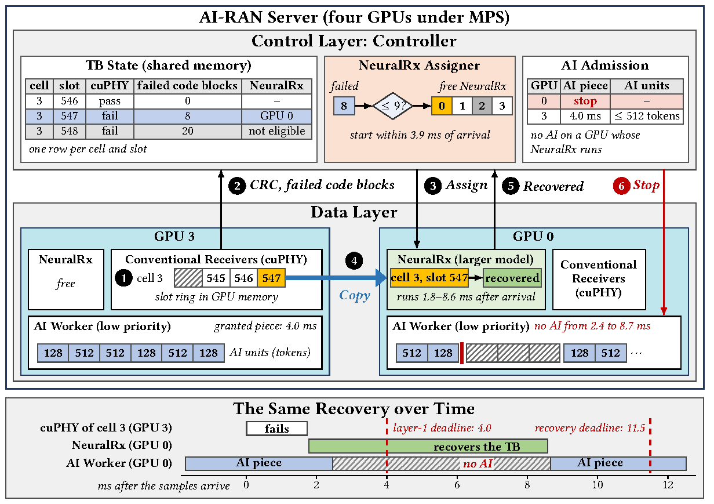

그림은 측정한 실행의 복구 하나(셀 3, 슬롯 547)를 값과 함께 그린 것이다. GPU 네 장 가운데 둘을 보였다.

| 단계 | 하는 일 | 그림의 값 |
|---|---|---|
| ❶ | 슬롯의 샘플이 그 셀의 슬롯 ring(기존 수신기의 GPU 메모리)에 도착하고 cuPHY가 복호한다 | 셀 3은 GPU 3에 있다. 복호는 도착 1.7 ms 뒤에 끝났고 CRC가 실패했다 |
| ❷ | 기존 수신기가 CRC 결과와 실패 code block 수를 TB 상태에 적는다 | 실패 code block 8개 |
| ❸ | Controller가 실패 code block 수가 문턱(9) 이하인 TB를 빈 NRx에 배정한다. 도착 3.9 ms 안에 시작해야 한다 | GPU 2의 NRx는 다른 TB를 처리 중이어서 GPU 0의 NRx에 배정 |
| ❹ | NRx가 그 슬롯을 셀의 GPU에서 자기 GPU로 복사해 복호한다 | 도착 1.8 ms에 시작해 8.6 ms에 끝남 |
| ❺ | 결과가 복구 마감(11.5 ms) 전에 나오면 그 TB의 재전송을 취소한다 | 복구 성공 |
| ❻ | Controller가 GPU마다 AI 조각을 허락한다. NRx가 시작한 GPU의 조각은 멈춘다 | GPU 0의 AI는 2.4 ms부터 8.7 ms까지 돌지 않는다. GPU 3의 AI는 512 token 이하의 단위로 계속 돈다 |

아래 띠는 같은 복구를 시간 순서로 그린 것이다. GPU 0의 AI는 그 GPU의 NRx와 엇갈려 돈다. 슬롯 548은 실패 code block이 20개여서 NRx에 보내지 않는다.

### 4.2 복구 경로

1. 슬롯의 샘플이 도착하면 기존 수신기가 복호한다. L1 마감은 도착 후 4.0 ms다.
2. CRC가 실패하고 슬롯의 실패 code block 수가 K 이하면 그 TB는 복구 후보가 된다(K=9, 채널 혼합 조건).
3. Controller는 후보의 최신 시작 시각을 `도착 + 복구 마감 − NRx 시간 한도 = 도착 + 11.5 − 7.6 = 도착 + 3.9 ms`로 계산한다.
4. 후보를 최신 시작 시각 순으로 빈 NRx에 배정한다. 최신 시작 시각을 넘긴 후보는 버리고 그 TB는 재전송된다.
5. NRx 결과는 CRC 통과, payload 일치, 복구 마감 안 종료를 모두 만족할 때만 복구로 센다.

복구 마감 6.5 ms는 기존 재전송 슬롯을 유지하지만 큰 모델(6.3 ms)이 들어가지 않는다. 11.5 ms는 복구에 실패한 TB의 재전송을 5 ms 늦춘다(6.9절).

### 4.3 AI 단위

모든 AI 작업을 단위로 나눈다. 단위는 고정 버퍼 위에서 잡은 CUDA graph 하나이고, 혼자 돌 때의 GPU 시간을 한 번 재서 한도(p99.9의 1.1배)로 쓴다.

| 모델 | 단위 | 한도 (ms) |
|---|---|---|
| Qwen2.5-1.5B | layer 하나 × 128 / 512 / 1,024 token | 0.37 / 0.84 / 1.33 |
| | 출력 토큰 하나 = layer 3개씩의 묶음 10개 | 묶음당 0.59–0.72 |
| Qwen2.5-3B | layer 하나 × 128 / 512 / 1,024 token | 0.51 / 1.14 / 1.87 |
| BAAI/bge-base-en-v1.5 | layer 하나 × 배치 1 / 4 / 16 | 0.11 / 0.15 / 0.28 |
| google/vit-base-patch16-224 | layer 하나 × 배치 1 / 4 / 16 | 0.13 / 0.19 / 0.40 |

단위는 한도에 따라 크기 등급(0.45 ms 이하 / 1.2 ms 이하 / 그 위)에 속한다. Controller는 등급만 보고, 모델과 작업 종류를 모른다. 가장 큰 등급에 드는 것은 1.5B의 1,024 token layer(1.33 ms)와 3B의 1,024 token layer(1.87 ms)다.

### 4.4 AI 허락과 중단

AI worker는 낮은 MPS 우선순위로 실행하고 비율 한도는 두지 않는다. Controller는 루프마다 GPU별로 다음 조건을 모두 만족하는 가장 큰 크기 등급을 골라, AI 작업량 4 ms 이하의 조각을 허락한다.

| 조건 | 내용 |
|---|---|
| NRx | 이 GPU에서 NRx가 실행 중이면 AI를 허락하지 않는다 |
| 대기 중인 후보 | 빈 NRx를 기다리는 후보가 있으면 어느 GPU에도 AI를 허락하지 않는다 |
| 기존 수신기 | 가장 큰 등급(한도 1.2 ms 초과)은 기존 수신기 옆에서 허용하지 않는다. 이 GPU의 셀이 복호 중이 아니어야 하고 조각이 다음 슬롯 도착 전에 끝나야 한다. 작은 두 등급은 기존 수신기 옆에서 허용한다(활성 셀 수와 무관, 4.6절) |

조각은 허락받은 뒤에도 멈출 수 있다. Worker는 단위를 묶음으로 GPU에 올리고, 묶음 사이에서 controller의 중단 표시를 읽는다. Controller는 조건이 깨지면(이 GPU에서 NRx가 시작됨, 후보가 기다림) 중단 표시를 쓴다. 중단 표시부터 조각 종료까지는 중앙값 0.43 ms, p99 1.4 ms다(6.7절).

아래 그림은 측정한 실행에서 GPU 4장의 25 ms 구간이다. GPU 2에서 NRx가 1.5 ms에 시작하면 그 GPU의 AI 조각이 0.3 ms 뒤에 끝나고, NRx가 끝난 7.8 ms에 AI가 다시 시작한다. NRx 실행은 6.2–6.3 ms로 혼자 돌 때와 같다. NRx가 없는 GPU의 AI는 계속 실행된다.

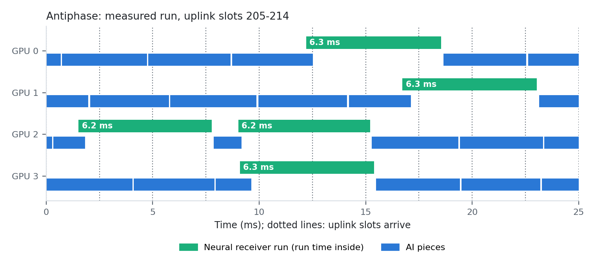

- NRx가 도는 GPU의 AI는 멈추고, 새 AI 요청은 controller가 가장 먼저 끝낼 GPU로 배정한다.
- **lane 여유(조절 값).** "서버의 빈 NRx가 R개 이상이면 NRx 옆에서도 AI를 허락한다"로 규칙을 풀 수 있다. R을 줄이면 AI 처리량이 늘고 복구가 준다(6.7절). 기본은 허락하지 않는 것(R = NRx 수)이다. 3.5절이 그 근거다.
- Controller 루프 하나는 15–57 µs다.

### 4.5 AI 요청의 배정과 실행 순서

- 요청은 서버 전체에 하나의 목록으로 온다. Controller가 요청마다 "가장 먼저 끝낼 GPU"에 배정하고, 제한의 75% 안에 끝내지 못할 요청은 받지 않는다. 예측은 그 GPU의 대기량(시간 제한이 같거나 짧은 작업만)과 최근 처리율로 한다. 모든 방식이 같은 배정과 입장 제어를 쓴다.
- Worker는 조각 안에서 "다음 결과의 시간 제한 − 그 결과까지 남은 작업량"이 가장 이른 작업의 단위를 먼저 올린다. 임베딩과 이미지 항목은 배치를 채우려고 시간 제한의 30%까지 기다린다. 시간 제한이 없는 작업은 다른 작업이 없을 때만 돈다.

### 4.6 시간 한도

한도는 평가 하드웨어에서 모든 셀이 실행되고 한 단위 크기의 낮은 우선순위 AI가 계속 실행되는 조건으로 측정했다(16셀).

| AI | 기존 수신기 완료 p99 / p99.9 (ms) | NRx 실행 p50 / p99 (ms) |
|---|---|---|
| 없음 | 2.92 / 3.23 | 6.28 / 6.79 |
| 비율 70%, 128 token | 3.25 / 3.46 | 7.37 / 8.09 |
| 비율 70%, 1,024 token | 3.96 / 4.52 | 8.39 / 9.43 |
| 낮은 우선순위 + 70%, 128 token | 3.19 / 3.56 | 7.25 / 7.56 |
| 낮은 우선순위 + 70%, 1,024 token | 3.30 / 4.29 | 7.60 / 8.04 |
| 낮은 우선순위, 한도 없음, 1,024 token | 3.44 / 4.05 | 7.89 / 8.51 |

- NRx 시간 한도: 7.6 ms(16셀과 20셀). 낮은 우선순위 AI가 옆에서 계속 돌면 NRx 실행은 7.3–7.9 ms로 늘어난다(lane 여유를 쓸 때의 한도 8.1 / 8.5 / 8.7 ms).
- NRx 시간 한도는 최신 시작 시각 `L = 복구 마감 − 한도`를 정한다. 한도를 크게 잡으면 복구 마감을 넘기는 실행이 줄고, L이 당겨져 3슬롯 실행이 는다. 20셀에서 한도 8.6 ms(v13의 값)는 여유를 0.05 ms로 만들어 AI 없이도 실행의 47%가 3슬롯이었고, 7.6 ms에서는 17%다. 한도는 닫힌 형태로 정했다(6.11.3절).
- 기존 수신기 옆에서 허용하는 등급은 "그 등급의 AI가 계속 돌 때 기존 수신기 완료 p99.9가 L1 마감(4.0 ms) 안인가"로 정한다. GPU당 4셀에서는 작은 두 등급을 허용한다(단일 UE 셀의 p99.9가 128 token 3.65 ms, 512 token 3.86 ms, 1,024 token 4.05 ms). v13은 GPU당 4셀에서 세 등급을 모두 허용했고 L1 놓침이 올랐다(6.7절).
- 같은 측정을 GPU당 5셀로 하면 128 token 3.65 ms, 512 token 4.45 ms, 1,024 token 4.28 ms다. 이 측정은 NRx가 모든 실패 TB에 대해 돌고 AI가 그 옆에서 계속 도는 조건이다. Antiphase에서는 NRx가 도는 GPU의 AI가 멈추므로 기존 수신기 옆에 NRx와 AI가 함께 있지 않다. 실제 실행에서 작은 두 등급을 활성 셀 수와 무관하게 허용해도, 활성 5셀에서 가장 작은 등급만 허용한 변형과 L1 놓침이 같았다(같은 시드에서 20셀 0.041% 대 0.038%, 32셀 0.038% 대 0.048%, 48셀 0.149% 대 0.147%). 따라서 작은 두 등급은 활성 셀 수와 무관하게 허용한다. 활성 셀 수로 등급을 바꾸는 변형은 채택하지 않았다(6.7절).

구현은 cuPHY, TensorRT, PyTorch 위의 Python 약 4.1천 줄이다(`scripts_for_node/backstop_slot/`).

---

## 5. 실험 환경과 방법

| 항목 | 값 |
|---|---|
| 시스템 | NERSC Perlmutter, 노드 하나 |
| GPU | NVIDIA A100 80GB × 4, MPS, MIG 미사용 |
| CPU | AMD EPYC 7763, 64 core |
| 컨테이너 | Shifter, `nvcr.io/nvidia/aerial/aerial-cuda-accelerated-ran:25-3-cubb` |
| 기존 수신기 | Aerial cuPHY PUSCH (MMSE, 시간 보간), LDPC 20회 |
| NRx | NVlabs `neural_rx`의 `nrx_large` (2-UE MU-MIMO, 273 PRB, TensorRT FP16), 뒤의 LDPC 20회 |
| 셀 | 100 MHz. 약한 셀: 2-UE MU-MIMO, 16QAM(MCS 14), 273 PRB, 슬롯당 code block 20개. 나머지: 단일 UE, 2 layer |
| 약한 셀의 채널 | NVlabs link simulation의 세 채널을 섞음: 상관 낮음 2–3 dB, 상관 높음 13–16 dB, UMi 4–6 dB |
| 기본 배치 | 16셀, GPU당 4셀, GPU당 약한 셀 1개, GPU당 NRx 1개 |
| 슬롯 반복 | 셀마다 미리 생성한 슬롯 512개를 반복(1.28초). 6.14절의 이전 측정은 128개(0.32초) |
| AI (6.4–6.9절) | Qwen2.5-1.5B 프롬프트 처리, 최대 1,024 token(BurstGPT 길이 분포), 시간 제한 200 ms, GPU당 초당 32개 요청(서버 53k tokens/s) |
| AI (6.10절) | 4.3절의 모델 4개, 작업 5종류 |
| 실행 길이 | 10–40초. 시드 수는 표마다 적음 |

측정 지표는 다음과 같다.

| 지표 | 정의 |
|---|---|
| AI 처리량 | 200 ms 안에 끝난 요청의 prompt token 수(초당). 제한을 넘긴 요청은 세지 않는다 |
| L1 놓침 | 기존 수신기 결과가 L1 마감(4.0 ms)을 넘긴 TB의 비율 |
| 복구 유지율 | 복구 마감 안에 NRx가 복구한 TB 수를 같은 시드의 AI 없는 실행과 비교한 비율 |
| 버려진 후보 | 복구 후보 가운데 최신 시작 시각까지 빈 NRx를 얻지 못한 비율 |
| UL goodput | 새 데이터를 전달한 UL 슬롯의 비율. TB별 기록에 재전송 일정을 적용해 계산 (6.9절) |

모든 측정은 GPU에서의 end-to-end 실행이다. cuPHY가 모든 TB를 복호하고, NRx가 실제 수신 슬롯을 복호하고, AI worker가 실제 모델을 실행한다. 슬롯은 미리 생성했고 RU와 L2는 없다.

---

## 6. 실험 결과

### 6.1 수신기 비교 (LDPC 반복 횟수 일치)

실시간용 모델 `nrx_rt`와 cuPHY.

| 채널 | TB | LDPC | cuPHY | nrx_rt | NRx만 성공 | cuPHY만 성공 | cuPHY 실패 중 NRx가 복호 |
|---|---|---|---|---|---|---|---|
| 2-UE 16QAM, 상관 낮음, 2–3 dB | 600 | 10 | 438 | 396 | 4 | 46 | 2% |
| | | 20 | 515 | 484 | 2 | 33 | 2% |
| | | 40 | 541 | 511 | 3 | 33 | 5% |
| 2-UE 16QAM, UMi, 1–6 dB | 600 | 10 | 405 | 402 | 4 | 7 | 2% |
| | | 20 | 425 | 420 | 4 | 9 | 2% |
| | | 40 | 431 | 425 | 2 | 8 | 1% |
| 2-UE 16QAM, 상관 중간, 8–18 dB | 600 | 20 | 321 | 372 | 59 | 8 | 21% |
| 2-UE 16QAM, 상관 높음, 10–16 dB | 1,400 | 10 | 844 | 976 | 167 | 35 | 30% |
| | | 20 | 946 | 1,099 | 174 | 21 | 38% |
| | | 40 | 979 | 1,135 | 180 | 24 | 43% |

큰 모델 `nrx_large`와 cuPHY.

| 채널 | TB | LDPC | cuPHY | nrx_large | NRx만 성공 | cuPHY만 성공 | cuPHY 실패 중 NRx가 복호 |
|---|---|---|---|---|---|---|---|
| 상관 낮음, 2–3 dB | 600 | 10 | 438 | 534 | 96 | 0 | 59% |
| | | 20 | 515 | 572 | 57 | 0 | 67% |
| | | 40 | 540 | 579 | 39 | 0 | 65% |
| UMi, 1–6 dB | 600 | 10 | 405 | 436 | 31 | 0 | 16% |
| | | 20 | 425 | 451 | 26 | 0 | 15% |
| | | 40 | 431 | 458 | 27 | 0 | 16% |
| 상관 높음, 10–16 dB | 1,400 | 10 | 843 | 1,069 | 248 | 22 | 45% |
| | | 20 | 947 | 1,159 | 233 | 21 | 51% |
| | | 40 | 981 | 1,191 | 226 | 16 | 54% |

단일 UE(pyAerial 예제 NRx, QPSK, CDL-D).

| SNR 구간 | TB | LDPC | cuPHY | NRx | cuPHY 실패 중 NRx가 복호 |
|---|---|---|---|---|---|
| −3.8 ~ −3.2 dB | 512 | 10 | 354 | 439 | 85/158 (54%) |
| | | 20 | 506 | 510 | 5/6 |
| | | 40 | 512 | 512 | – |
| −4.6 ~ −2.4 dB | 512 | 10 | 284 | 311 | 12% |
| | | 20 | 376 | 386 | 12% |
| | | 40 | 410 | 414 | 11% |

| 모델 | 엔진 GPU 시간 | 슬롯 하나의 경로 (단독) | 셀과 같이 돌 때 | cuPHY (같은 슬롯) |
|---|---|---|---|---|
| nrx_rt | 1.35 ms | 2.4 ms | 2.7–3.0 ms | 0.8–0.9 ms |
| nrx_large | 4.29 ms | 5.3 ms | 6.3 ms | 0.8–0.9 ms |

- 단일 UE의 좁은 SNR 구간에서 cuPHY는 10회 354개, 20회 506개, 40회 512개를 복호한다. 10회 기준의 NRx 이득(54%)은 대부분 반복 횟수 차이다.
- 20회의 비용은 code block 13개 TB에서 +19%(0.79 → 0.94 ms), 20개 TB에서 +15%(0.78 → 0.90 ms)다.
- 런타임 경로(LS 추정 → TensorRT → LDPC)는 LDPC를 20회로 맞추면 NVlabs 자체 평가와 TB 800개 중 794개가 일치한다.
- NRx 입력 형식: LS 추정값을 DMRS 심볼 순서로 펼치고 1/√2를 곱해야 한다. pyAerial 예제 형식으로 넣으면 약한 TB 256개 중 NRx 복호가 134개이고, 맞는 형식은 211개다.

### 6.2 복구 경로 단독 (AI 없음)

| 조건 | 약한 셀 TB 중 cuPHY 실패 | 그중 NRx가 제때 복구 |
|---|---|---|
| 상관 낮음, 16셀, 4,000 주기 | 14.3–14.6% | 63–66% |
| 상관 높음, 16셀 | 16.1–16.4% | 53–57% |
| 채널 혼합(K=9), 16셀 | 15.8–17.3% | 38% |

| 큰 모델의 사용 방식 (약한 셀 4개, AI 없음) | NRx가 처리한 슬롯 | 약한 셀의 복호 성공 |
|---|---|---|
| 주 수신기 (모든 슬롯을 NRx로) | 39% | 89.4% |
| 복구 경로 (실패한 TB만) | 실패한 TB의 슬롯만 처리, NRx 용량의 55% 사용 | 94.5–95.1% |

- 상관 낮은 채널의 단독 복호: TB 600개 중 cuPHY 515, NRx 572, cuPHY만 성공 0. 실패한 TB에만 NRx를 돌린 결과(572)가 모든 슬롯에 돌린 결과(572)와 같고, NRx 실행은 슬롯 300개 중 74개(25%)다.
- 채널 혼합 단독 복호: TB 2,000개 중 cuPHY 1,663, NRx 1,796, NRx만 성공 149(cuPHY 실패 337개의 44%), cuPHY만 성공 16.

### 6.3 복구할 TB 선택

| 채널 | 실패 code block 수 (슬롯의 두 UE 합) | 복구 성공률 |
|---|---|---|
| 상관 낮음 | 1–3개 | 97% (38개 중 37개) |
| | 4–9개 | 54% (24개 중 13개) |
| | 10개 이상 | 30% (23개 중 7개) |
| UMi | 9개 이하 | 93% (14개 중 13개) |
| | 전부 실패 (실패 TB의 87%) | 2% |
| 채널 혼합 | 9개 이하 | 75% (167개 중 125개) |
| | 10개 이상 | 14% (170개 중 24개) |

| 조건 (AI 없음) | 규칙 | NRx 실행 | 복구한 TB | 실행당 복구 |
|---|---|---|---|---|
| UMi, 약한 셀 4개 | 실패 전부 | 4,891–4,926 | 663–757 | – |
| | 9개 이하 | 651–777 | 589–746 | – |
| 상관 낮음, 약한 셀 8개 | 실패 전부 | 5,572–5,707 | 4,124–4,513 | 0.77 |
| | 9개 이하 | 4,445–4,672 | 3,857–4,348 | 0.90 |
| | 3개 이하 | 3,077–3,722 | 3,005–3,758 | 0.99 |

- UMi에서 9개 이하 규칙은 NRx 실행을 85% 줄이고 복구를 5% 줄인다.
- 약한 셀 8개(NRx 용량 부족)에서 3개 이하 규칙은 실행을 40%, 복구를 22% 줄이고 실행당 복구를 0.77에서 0.99로 올린다.
- 실패 수가 적은 TB에 NRx를 먼저 주는 순위 방식(문턱 없음)은 복구가 4% 적었다. 문턱 방식을 쓴다.

### 6.4 전 부하: AI 처리량과 복구 유지율

16셀 전 부하, GPU 4장, AI 53k tokens/s 제공, 512 슬롯 반복, 10초 실행, 시드 5(일부 방식은 시드 2). AI 없는 실행은 복구 초당 187 TB다.

| 방식 | AI 처리량 (시드 범위) | 복구 유지율 (시드 범위) | L1 놓침 | 시드 | Antiphase의 AI 처리량 배수 |
|---|---|---|---|---|---|
| AI 없음 | – | 100% | 0.032% | 5 | – |
| **Antiphase** | **34.1k** (33.4–35.3k) | **99.9%** (99.7–100.3%) | 0.036% | 5 | – |
| 고정 10% | 5.3k (5.1–5.6k) | 99.4% (98.7–99.9%) | 0.032% | 5 | 6.41배 |
| 고정 30% | 20.2k (20.1–20.3k) | 95.1% (94.9–95.2%) | 0.051% | 2 | 1.69배 |
| 낮은 우선순위 + 30% | 18.0k (17.6–18.5k) | 98.8% (98.1–99.6%) | 0.037% | 5 | 1.90배 |
| 낮은 우선순위 + 50% | 32.7k (32.5–33.0k) | 95.5% (95.5–95.5%) | 0.040% | 2 | 1.04배 |
| 낮은 우선순위 + 70% | 42.4k (41.1–43.4k) | 94.4% (93.6–95.1%) | 0.037% | 5 | 0.81배 |
| 낮은 우선순위, 한도 없음 | 49.0k (47.5–49.9k) | 93.7% (93.4–94.5%) | 0.044% | 5 | 0.70배 |
| 추정기로 비율 선택 | 9.8k (9.5–10.3k) | 99.1% (98.6–99.7%) | 0.019% | 5 | 3.48배 |
| 낮은 우선순위 + 추정기 | 18.1k (17.7–18.4k) | 99.0% (98.6–99.5%) | 0.018% | 5 | 1.88배 |
| Antiphase의 다른 설정: 큰 단위도 기존 수신기 옆 허용 | 37.6k (36.4–38.6k) | 100.0% (99.8–100.3%) | 0.061% | 5 | 0.91배 |
| Antiphase의 다른 설정: 위 + lane 여유 3 | 39.8k (38.5–41.6k) | 99.3% (99.0–99.7%) | 0.038% | 5 | 0.86배 |
| v13 규칙 (조각 중단 없음, lane 여유 3) | 39.5k (39.0–40.0k) | 97.8% (97.6–98.0%) | 0.025% | 2 | 0.86배 |

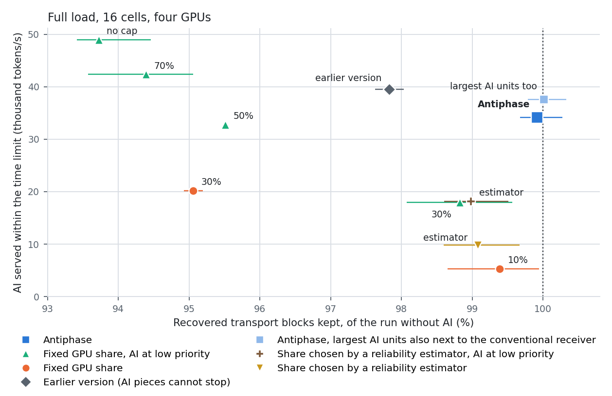

- **복구.** Antiphase는 복구를 AI 없는 실행과 같은 수로 유지한다(99.9%, 시드 범위 99.7–100.3%).
- **L1 마감.** Antiphase의 L1 놓침은 0.036%(시드별 0.016–0.057%), AI 없는 실행은 0.032%(0.028–0.049%)다. 기존 수신기 완료 p99.9는 3.14 ms(AI 없음 3.10 ms, 낮은 우선순위 + 70% 3.51 ms)다.
- **AI 처리량.** 복구 98.8% 이상을 유지하는 기존 수단 가운데 AI 처리량이 가장 큰 것은 낮은 우선순위 + 추정기(18.1k)와 낮은 우선순위 + 30%(18.0k)다. Antiphase는 그 1.9배다. 고정 10%의 6.4배, 추정기 방식의 3.5배다.
- **AI 처리량이 더 큰 방식.** 낮은 우선순위 + 70%(42.4k)와 한도 없음(49.0k)은 Antiphase보다 24–44% 많이 처리하고 복구를 5.6–6.3% 잃는다.
- **추정기 방식.** 전 부하가 계속되면 추정기는 고정 20%(낮은 우선순위에서는 30%)를 고른다. 결과는 그 고정 비율과 같다.
- **Antiphase의 다른 설정.** 가장 큰 AI 단위(한도 1.2 ms 초과)도 기존 수신기 옆에서 돌리면 AI 처리량이 10% 늘고 L1 놓침이 0.061%로 는다. lane 여유 3을 더하면 AI가 6% 더 늘고 복구가 0.7%p 준다(6.7절).
- **v13 규칙과의 차이.** 복구 유지율이 97.8%에서 99.9%로 오르고 AI 처리량은 14% 준다(6.7절).

### 6.5 부하 변화

16셀, GPU 4장, AI 53k 제공, 512 슬롯 반복, 시드 5(고정 30%와 낮은 우선순위 + 50%는 시드 2).

#### 6.5.1 전 부하와 절반 부하의 교대

2초마다 "모든 셀 활성"과 "셀마다 확률 0.5로 활성"이 교대한다. 20초 실행.

| 방식 | AI 처리량 (시드 범위) | 복구 유지율 (시드 범위) | L1 놓침 | Antiphase의 AI 처리량 배수 |
|---|---|---|---|---|
| AI 없음 | – | 100% | 0.018% | – |
| **Antiphase** | **41.4k** (40.9–42.5k) | **99.9%** (99.5–100.0%) | 0.019% | – |
| 고정 10% | 5.7k (5.6–5.8k) | 99.5% (99.3–99.7%) | 0.016% | 7.21배 |
| 고정 30% | 22.6k (22.3–22.9k) | 97.0% (96.6–97.4%) | 0.025% | 1.83배 |
| 낮은 우선순위 + 30% | 20.3k (20.0–20.7k) | 99.2% (98.8–99.5%) | 0.018% | 2.04배 |
| 낮은 우선순위 + 50% | 36.8k (36.3–37.3k) | 97.1% (96.5–97.6%) | 0.012% | 1.13배 |
| 낮은 우선순위 + 70% | 46.9k (46.1–47.5k) | 96.0% (95.4–96.6%) | 0.021% | 0.88배 |
| 부하 따라 10/50% | 23.8k (23.4–24.4k) | 99.2% (98.7–99.5%) | 0.014% | 1.74배 |
| 낮은 우선순위 + 부하 따라 30/70% | 34.7k (34.5–35.0k) | 99.0% (98.6–99.3%) | 0.018% | 1.19배 |
| 추정기로 비율 선택 | 21.8k (21.1–22.5k) | 95.3% (94.3–96.4%) | 0.055% | 1.90배 |
| 낮은 우선순위 + 추정기 | 27.2k (26.1–28.3k) | 97.8% (97.4–98.0%) | 0.016% | 1.52배 |
| Antiphase의 다른 설정: 큰 단위도 기존 수신기 옆 허용 | 44.9k (43.9–45.6k) | 99.8% (99.6–99.9%) | 0.023% | 0.92배 |

#### 6.5.2 무작위 계단 부하

활성 셀 비율이 25 / 50 / 75 / 100% 사이를 0.5–1.5초 간격의 무작위 시점에 바뀐다. 40초 실행.

| 방식 | AI 처리량 (시드 범위) | 복구 유지율 (시드 범위) | L1 놓침 | Antiphase의 AI 처리량 배수 |
|---|---|---|---|---|
| AI 없음 | – | 100% | 0.008% | – |
| **Antiphase** | **44.7k** (44.2–45.6k) | **100.0%** (99.9–100.1%) | 0.005% | – |
| 고정 10% | 6.0k (5.9–6.0k) | 99.8% (99.6–100.0%) | 0.007% | 7.47배 |
| 낮은 우선순위 + 30% | 22.2k (21.3–23.1k) | 99.5% (99.3–99.7%) | 0.008% | 2.02배 |
| 낮은 우선순위 + 70% | 48.6k (48.1–49.1k) | 97.3% (96.6–98.0%) | 0.004% | 0.92배 |
| 부하 따라 10/30/50% | 30.0k (28.8–32.5k) | 98.6% (98.2–98.9%) | 0.052% | 1.49배 |
| 낮은 우선순위 + 부하 따라 30/50/70% | 40.9k (40.4–42.3k) | 99.1% (98.7–99.4%) | 0.005% | 1.09배 |
| 추정기로 비율 선택 | 27.7k (26.3–30.6k) | 95.6% (95.1–96.1%) | 0.068% | 1.62배 |
| 낮은 우선순위 + 추정기 | 36.4k (33.4–40.1k) | 97.4% (96.9–98.0%) | 0.007% | 1.23배 |
| Antiphase의 다른 설정: 큰 단위도 기존 수신기 옆 허용 | 47.8k (47.3–48.2k) | 99.9% (99.8–100.1%) | 0.011% | 0.94배 |

부하 수준별 결과(칸은 "AI 처리량 / 복구 유지율"):

| 방식 | 부하 25% 구간 | 50% 구간 | 75% 구간 | 100% 구간 |
|---|---|---|---|---|
| **Antiphase** | 50.7k / 100.0% | 48.8k / 100.0% | 43.4k / 100.1% | **34.9k / 100.0%** |
| 고정 10% | 6.2k / 99.9% | 6.1k / 100.0% | 5.9k / 100.0% | 5.7k / 99.4% |
| 낮은 우선순위 + 30% | 25.4k / 99.9% | 23.7k / 99.9% | 20.8k / 99.8% | 18.3k / 98.9% |
| 낮은 우선순위 + 70% | 51.1k / 100.0% | 50.6k / 99.8% | 47.9k / 98.2% | 44.0k / 94.3% |
| 부하 따라 10/30/50% | 45.7k / 99.8% | 44.1k / 99.1% | 24.0k / 98.6% | 3.9k / 97.8% |
| 낮은 우선순위 + 부하 따라 30/50/70% | 51.2k / 100.0% | 51.0k / 99.9% | 39.1k / 99.2% | 20.4k / 98.2% |
| 추정기로 비율 선택 | 30.9k / 99.8% | 26.2k / 99.2% | 28.0k / 96.6% | 25.2k / 91.7% |
| 낮은 우선순위 + 추정기 | 39.8k / 99.9% | 33.1k / 99.7% | 36.0k / 98.3% | 35.4k / 94.7% |

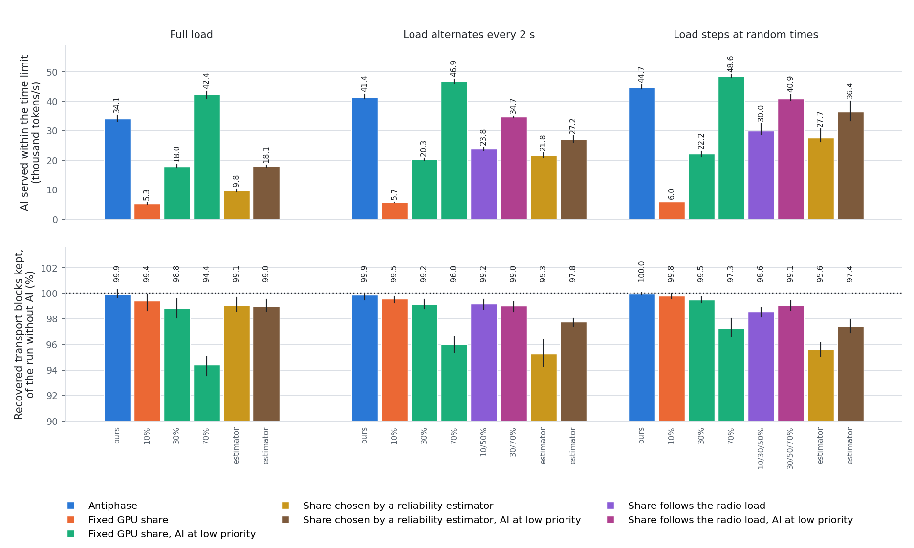

#### 6.5.3 읽는 법

- **Antiphase는 세 조건 모두에서 복구 99.9% 이상을 유지하고 L1 놓침이 AI 없는 실행과 같다**(0.005–0.036% 대 0.008–0.032%). AI 처리량은 고정 10%의 6.4–7.5배, 낮은 우선순위 + 30%의 1.9–2.0배다.
- **부하를 지연 없이 아는 "부하 따라 비율"** (전환 비용 0)과 비교하면 1.5–1.7배이고 복구 유지율이 0.7–1.4%p 높다. 낮은 우선순위를 더한 것과 비교하면 1.09–1.19배, 0.9%p다.
- **추정기로 비율을 고르는 방식** (1초마다 결정, 재설정 0.266초)과 비교하면 1.6–1.9배이고 복구 유지율이 4.4–4.6%p 높다. 낮은 우선순위를 더한 것과 비교하면 1.23–1.52배, 2.1–2.6%p다.
- **추정기 방식이 복구를 잃는 이유.** 결정이 직전 1초의 부하에 근거한다. 2초 교대에서 비율 결정은 20, 20, 70, 70, 20, 20, …%로 부하보다 1초 늦는다. 전 부하 구간의 절반 동안 70%가 적용된다. 계단 부하의 100% 구간에서 복구 유지율이 91.7%다. YinYangRAN의 결정 간격(1초 이상)은 MPS 재설정 비용에서 오는 설계 값이다.
- **차이는 전 부하 구간에서 생긴다.** 계단 부하의 100% 구간에서 Antiphase는 34.9k를 처리하고 100.0%를 유지한다. 부하 따라 비율은 낮은 비율로 내려가 3.9k–20.4k를 처리한다. 낮은 우선순위 + 70%와 낮은 우선순위 + 추정기는 35.4k–44.0k를 처리하지만 복구가 94.3–94.7%다.
- **낮은 우선순위 + 70%** 는 부하가 바뀌는 조건에서 AI를 Antiphase보다 9–13% 많이 처리하고 복구를 2.7–3.9%p 더 잃는다.

### 6.6 복구 손실 모델의 검증

3.4절의 모델을 실측과 대조했다. 지표는 "복구 후보 가운데 빈 NRx를 얻지 못해 버려진 비율"이다.

| 계산 | 입력 | 대조한 실행 | 상관 | 평균 절대 오차 | 평균 편향 |
|---|---|---|---|---|---|
| 사건 모의 | AI 없는 실행의 후보 도착, NRx 실행 시간(혼자 / AI 옆), 규칙, 중단 지연 | AI가 있는 실행 334개 | 0.995 | 0.77%p | +0.46%p |
| **닫힌 형태** | NRx 수, 슬롯당 후보 수의 전이 행렬, 후보가 알려지는 시각 c와 NRx 실행 시간 S의 분포(같은 조건의 다른 시드) | 실행 672개 (AI 없는 실행 포함) | 0.994 | 0.82%p | +0.06%p |
| 닫힌 형태, 처음의 실행 | 같음 | 412개 | 0.993 | 0.95%p | +0.07%p |
| 닫힌 형태, 모델을 정한 뒤에 측정한 실행 | 같음 | 260개 | 0.996 | 0.61%p | +0.06%p |
| 닫힌 형태, 3슬롯 실행의 비율 f를 실측에서 넣음 | NRx 수, 전이 행렬, f | 처음의 412개 | 0.993 | 0.92%p | −0.14%p |
| 닫힌 형태, f 실측, 후보 도착을 독립으로 가정 | NRx 수, 약한 셀 수, 후보 확률, f | 처음의 412개 | 0.972 | 2.87%p | −2.76%p |

대조한 실행은 NRx 1 / 2 / 4개(106 / 78 / 488개 실행), 4–48셀, 약한 셀 1–12개, 방식과 설정 35가지, 128 슬롯 반복과 512 슬롯 반복이다. 닫힌 형태의 평균 절대 오차는 NRx 4개에서 0.48%p, 2개에서 1.45%p, 1개에서 1.93%p다. 닫힌 형태가 계산한 3슬롯 실행의 비율은 실측과 상관 0.985, 평균 절대 오차 3.4%p다.

모델을 정한 뒤에 측정한 260개 실행은 AI 부하 13k / 27k / 106k, AI 요청 버스트, 20셀(최신 시작 시각 2.9 ms와 3.9 ms), 32셀, 48셀, GPU 1장의 시드 3–5, 교대 간격 0.2초 / 2초 / 5초, 무작위 계단, 셀 버스트다(6.8, 6.11절). 조건별 평균 절대 오차는 0.06–0.62%p이고, 두 조건이 그보다 크다: GPU 1장(2.7%p, 크게 예측)과 32셀 2초 버스트(1.4%p, 작게 예측).

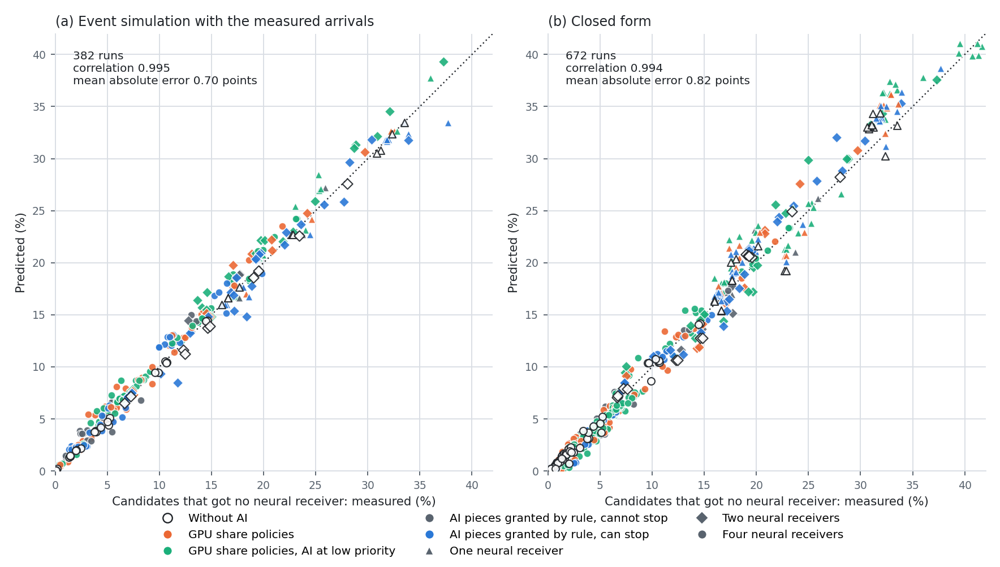

그림의 (a)는 AI 없는 실행 48개를 포함한 382개 실행이다(평균 절대 오차 0.70%p). (b)는 f를 넣지 않는 닫힌 형태의 672개 실행이다. 범례의 "GPU share policies"는 고정 비율, 부하 따라 비율, 추정기로 고른 비율이다.

512 슬롯 반복의 조건별 값. 칸은 "버려진 후보: 실측 / 닫힌 형태 / 사건 모의"이고 괄호는 "3슬롯 실행의 비율: 실측 → 닫힌 형태"다.

| NRx 수, 약한 셀 수 | AI 없음 | **Antiphase** | 낮은 우선순위 + 30% | 낮은 우선순위 + 70% |
|---|---|---|---|---|
| 4, 2 | 0.0 / 0.1 / 0.0% (4 → 3%) | 0.0 / 0.1 / 0.2% (7 → 5%) | 0.5 / 0.2 / 0.6% (19 → 19%) | 1.3 / 1.0 / 1.3% (78 → 77%) |
| 4, 4 (시드 5) | 1.6 / 1.6 / 1.7% (10 → 7%) | 1.7 / 1.9 / 2.2% (11 → 10%) | 2.6 / 2.9 / 2.5% (30 → 31%) | 6.2 / 5.7 / 7.0% (86 → 86%) |
| 4, 6 | 4.7 / 4.4 / 4.5% (14 → 13%) | 4.8 / 4.7 / 5.7% (17 → 16%) | 6.8 / 7.5 / 7.2% (42 → 47%) | 11.4 / 12.0 / 12.6% (90 → 91%) |
| 4, 8 | 10.1 / 10.5 / 9.9% (21 → 22%) | 10.5 / 10.9 / 12.4% (23 → 24%) | 13.6 / 15.5 / 14.3% (51 → 57%) | 19.7 / 20.4 / 21.2% (89 → 91%) |
| 2, 2 | 7.0 / 7.5 / 6.8% (14 → 10%) | 7.2 / 8.0 / 7.3% (16 → 15%) | 7.4 / 9.8 / 7.6% (26 → 31%) | 14.1 / 14.2 / 16.8% (78 → 78%) |
| 2, 4 | 19.3 / 20.7 / 18.9% (21 → 20%) | 19.4 / 21.1 / 20.6% (24 → 24%) | 22.3 / 25.2 / 22.5% (40 → 50%) | 28.8 / 30.0 / 31.2% (83 → 85%) |
| 1, 1 | 16.8 / 17.3 / 16.8% (5 → 6%) | 17.0 / 18.0 / 16.8% (13 → 13%) | 16.8 / 19.4 / 16.8% (16 → 27%) | 24.1 / 22.7 / 26.9% (65 → 63%) |
| 1, 2 | 30.9 / 33.0 / 30.5% (8 → 14%) | 31.9 / 33.8 / 31.8% (19 → 20%) | 32.5 / 36.3 / 32.6% (26 → 41%) | 40.3 / 40.0 / 43.5% (69 → 72%) |

- **방식의 차이는 3슬롯 실행의 비율 f로 요약되고, f는 c와 S의 분포에서 나온다.** 빈 NRx에서 바로 시작한 실행은 `P(c + S > 2P + L)`의 확률로 3슬롯이 된다. NRx가 풀리기를 기다린 실행은 전체의 약 8%이고 그 93%가 3슬롯이다. 16셀·약한 셀 4개에서 f는 AI 없는 실행 0.10, Antiphase 0.11, 낮은 우선순위 + 30% 0.30, + 70% 0.86이다.
- **Antiphase는 여덟 조건 모두에서 버려진 후보가 AI 없는 실행보다 1.0%p 이내로 많다.** 낮은 우선순위 + 70%는 1.3–9.6%p 많다.
- **후보 도착은 독립이 아니다.** 한 셀이 어느 슬롯에 후보를 내면 다음 슬롯에도 낼 확률이 0.19–0.26이다(평균 확률 0.145). 독립으로 가정하면 손실을 절반 이하로 본다.
- **모델이 맞지 않는 곳.** "NRx가 다음 후보를 받을 수 있는 시각까지 AI를 허락"하는 규칙에서 사건 모의가 1.0–3.0%p 작게 예측한다(이 규칙은 NRx 실행 시간의 예측에 의존한다). lane 여유 1(NRx 2개)에서 2.0%p 작게 예측한다. 약한 셀 8개의 Antiphase에서 1.9%p 크게 예측한다. 닫힌 형태는 NRx 1–2개에서 낮은 우선순위 + 30%의 손실을 2.4–3.8%p 크게 본다(3슬롯 실행의 비율을 5–15%p 크게 계산한다). NRx 1개의 실행 106개에서 평균 1.2%p 크게 본다. 부하가 수 초 단위로 바뀌는 조건(32셀 2초 버스트)에서는 1.4%p 작게 본다. 닫힌 형태는 도착을 1차 전이 행렬 하나로 적고, 부하 구간이 바뀌는 것을 넣지 않는다. 닫힌 형태의 입력 c와 S는 그 방식의 실행에서 잰 분포다. 측정 없이 방식의 S를 예측하지는 않는다.
- **모델이 찾아 준 실험 방법의 편향.** v13까지는 셀마다 슬롯 128개를 반복했다(0.32초). 여러 셀의 실패가 겹치는 슬롯이 0.32초마다 되풀이돼, AI 없는 실행의 손실이 시드에 따라 1.45%와 3.76%였고 닫힌 형태와 맞지 않았다. 512 슬롯 반복에서는 시드 간 차이가 1.30–1.34%로 줄었다. 같은 조건을 두 반복 길이로 재면(시드 2) 기준선의 복구 유지율이 1.0–1.5%p 오른다(고정 10%: 98.0 → 99.3%, 낮은 우선순위 + 30%: 97.2 → 98.7%, 낮은 우선순위 + 70%: 93.0 → 94.0%). 6.14절의 수치는 이만큼 기준선에 불리하다.

#### 6.6.1 NRx 실행이 길어질 때의 손실

닫힌 형태에 AI 없는 실행의 c와 S를 넣고 S에 일정한 증가를 더해 손실을 계산했다(16셀, 약한 셀 4개, NRx 4개). 점선은 기존 수신기 결과가 AI 때문에 0.3 ms 늦게 나오는 경우다. 점은 측정한 방식이고, 가로축은 그 방식의 NRx 실행 시간 중앙값에서 AI 없는 실행의 중앙값(6.29 ms)을 뺀 값이다.

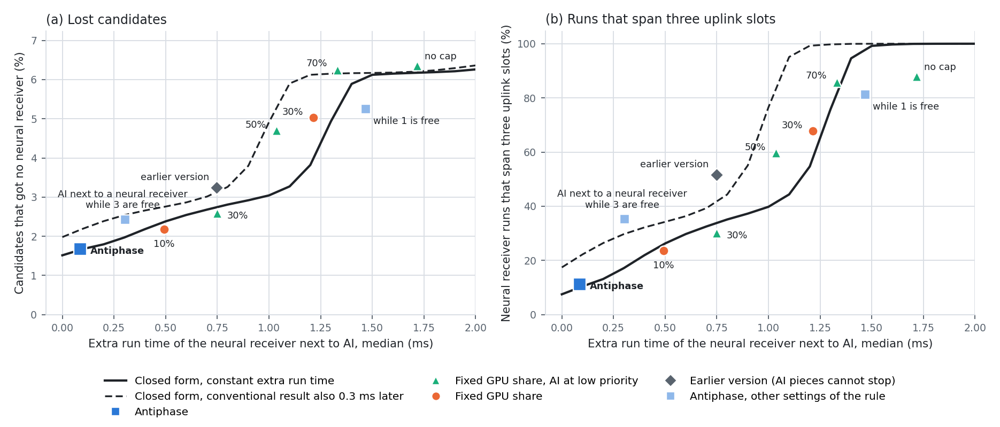

| NRx 실행 시간의 증가 (ms) | 0 | 0.2 | 0.4 | 0.6 | 0.8 | 1.0 | 1.2 | 1.4 | 1.6 |
|---|---|---|---|---|---|---|---|---|---|
| 버려진 후보, 닫힌 형태 | 1.5% | 1.8% | 2.2% | 2.5% | 2.8% | 3.0% | 3.8% | 5.9% | 6.2% |
| 3슬롯 실행의 비율, 닫힌 형태 | 7% | 13% | 22% | 30% | 35% | 40% | 55% | 95% | 100% |
| 버려진 후보, 기존 수신기 결과도 0.3 ms 늦음 | 2.0% | 2.4% | 2.7% | 2.9% | 3.3% | 4.9% | 6.1% | 6.2% | 6.2% |

| 방식 | NRx 실행 시간의 증가 | 버려진 후보 (실측) | 3슬롯 실행의 비율 (실측) |
|---|---|---|---|
| AI 없음 | 0 | 1.6% | 10% |
| **Antiphase** | +0.09 ms | 1.7% | 11% |
| lane 여유 3 + 중단 | +0.30 ms | 2.4% | 35% |
| 고정 10% | +0.49 ms | 2.2% | 24% |
| 낮은 우선순위 + 30% | +0.75 ms | 2.6% | 30% |
| v13 규칙 (중단 없음) | +0.75 ms | 3.2% | 52% |
| 낮은 우선순위 + 50% | +1.04 ms | 4.7% | 60% |
| 고정 30% | +1.21 ms | 5.0% | 68% |
| 낮은 우선순위 + 70% | +1.33 ms | 6.2% | 86% |
| lane 여유 1 + 중단 | +1.47 ms | 5.2% | 81% |
| 낮은 우선순위, 한도 없음 | +1.72 ms | 6.4% | 88% |

- **손실에는 두 수준이 있다.** 모든 실행이 2슬롯이면 1.5%, 모든 실행이 3슬롯이면 6.2%다. NRx 실행 시간의 증가가 1.0 ms 이하면 손실이 3.0% 이하이고, 1.0–1.4 ms에서 6%로 오른다. 그 뒤로는 실행이 더 길어져도 손실이 거의 늘지 않는다(4슬롯이 되기까지 2.5 ms가 더 남는다).
- **여유는 1.2 ms다.** `2P + L − c − S = 5.0 + 3.9 − 1.4 − 6.3 = 1.2 ms`. 후보가 알려지는 시각 c가 늦어지면 여유가 그만큼 준다(점선).
- **측정한 13개 방식은 두 곡선 사이에 있거나 0.3%p 안이다.** lane 여유 1만 0.8%p 아래다. 고정 비율은 AI가 켜진 구간에서만 NRx를 늦추므로, 중앙값이 같은 일정한 증가보다 실행 시간이 넓게 퍼진다.
- **설계 기준.** 복구를 지키려면 GPU 비율이 아니라 NRx 실행 시간의 증가를 여유 안에 두어야 한다. 비율 30%는 증가가 0.75–1.21 ms여서 여유의 경계에 있고, 70% 이상은 여유를 넘는다. Antiphase는 +0.09 ms다.

### 6.7 규칙의 근거: 조각 중단, NRx 옆 금지, 기존 수신기 옆의 단위 크기

16셀 전 부하, AI 53k 제공, 512 슬롯 반복. 규칙을 하나씩 바꾼 결과다.

| 구성 | AI 처리량 | 복구 유지율 | L1 놓침 (AI 없음 0.032%) | 버려진 후보 (AI 없음 1.6%) | 3슬롯 실행의 비율 (AI 없음 10%) | 시드 |
|---|---|---|---|---|---|---|
| 낮은 우선순위만 (허락 없음) | 49.0k | 93.7% | 0.044% | 6.4% | 88% | 5 |
| 조각 허락, 중단 없음, lane 여유 3 (v13 규칙) | 39.5k | 97.8% | 0.025% | 3.2% | 52% | 2 |
| 조각 중단, lane 여유 1 | 44.0k | 95.1% | 0.066% | 5.2% | 81% | 2 |
| 조각 중단, lane 여유 2 | 42.2k | 96.6% | 0.051% | 4.1% | 64% | 2 |
| 조각 중단, lane 여유 3 | 39.8k | 99.3% | 0.038% | 2.4% | 35% | 5 |
| 조각 중단, NRx 옆 금지 | 37.6k | 100.0% | 0.061% | 1.8% | 14% | 5 |
| **조각 중단, NRx 옆 금지, 가장 큰 단위는 기존 수신기 옆 금지 (Antiphase)** | **34.1k** | **99.9%** | **0.036%** | **1.7%** | **11%** | 5 |

AI가 꺼져 있어야 하는 시간에 실제로 꺼져 있는가:

| | v13 규칙 (중단 없음) | lane 여유 3 + 중단 | NRx 옆 금지 + 중단 | **Antiphase** |
|---|---|---|---|---|
| AI가 꺼져 있어야 하는 NRx 시간 중 AI가 남아 있는 비율 | 43% | 15% | 7% | **6%** |
| 중단 표시 → 조각 종료, 중앙값 / p90 / p99 | 멈추지 못함. 조각 길이 2.3 / 4.4 / 8.6 ms | 0.65 / 2.17 / 3.91 ms | 0.46 / 1.37 / 2.41 ms | **0.43 / 1.12 / 1.44 ms** |
| NRx 실행 시간 중앙값 (혼자 6.28 ms) | 7.04 ms | 6.58 ms | 6.39 ms | **6.38 ms** |

기존 수신기 옆에서 허용하는 단위 크기(같은 job의 실행, 시드 3):

| 설정 | AI 처리량 | 복구 유지율 | L1 놓침 | 기존 수신기 완료 p99.9 |
|---|---|---|---|---|
| AI 없음 | – | 100% | 0.029% | 3.12 ms |
| 세 등급 모두 허용 | 37.3k | 99.7% | 0.049% | 3.51 ms |
| **가장 큰 등급(한도 1.2 ms 초과) 금지 (Antiphase)** | **33.9k** | **99.8%** | **0.030%** | **3.10 ms** |
| 가장 작은 등급만 허용 | 24.2k | 99.8% | 0.032% | 3.07 ms |
| 세 등급 모두 허용 + 비율 한도 70% | 30.7k | 99.9% | 0.025% | 3.11 ms |

- **조각 중단.** v13의 조각은 허락받은 뒤 멈추지 못했고, 낮은 우선순위의 조각은 무선 작업 옆에서 길어졌다. AI가 꺼져 있어야 하는 시간의 43%에서 AI가 남아 있었다. 묶음 사이에서 중단 표시를 읽게 하면 6–7%로 준다. 남은 시간은 이미 GPU에 올라간 묶음이 끝날 때까지의 시간이다.
- **lane 여유.** 여유를 줄이면 3슬롯 실행의 비율이 14 → 35 → 64 → 81%로 늘고, 버려진 후보가 1.8 → 2.4 → 4.1 → 5.2%로 는다. AI 처리량은 37.6k → 44.0k로 는다. lane 여유는 복구와 AI를 맞바꾸는 조절 값이다.
- **기본값을 NRx 옆 금지로 둔 이유.** (a) 복구를 AI 없는 실행과 같은 수로 유지하는 설정이다. (b) NRx 수에 따라 값을 고를 필요가 없다(6.8절). (c) 사건 모의는 여유 3과 금지의 손실 차이를 0.1%p로 보는데 실측은 0.6%p다. 모델 오차 안의 차이로 여유 값을 고르면 복구를 잃는다.
- **기존 수신기 옆의 단위 크기.** 가장 큰 등급의 AI 단위(1.33 ms)가 기존 수신기 옆에서 돌면 L1 놓침이 0.049–0.061%로 오른다. 4.6절의 한도 측정에서 이 등급은 기존 수신기 완료 p99.9를 4.05 ms로 만들어 L1 마감(4.0 ms)을 넘는다. 이 등급을 기존 수신기가 복호 중이 아닐 때로 미루면 L1 놓침과 p99.9가 AI 없는 실행과 같아지고 AI 처리량이 9% 준다. v13은 세 등급을 모두 허용했다.
- **v13에서 "NRx 옆 금지"가 25.3k에 97.4%였던 이유.** 조각을 멈출 수 없어서, 이 GPU에서 NRx가 시작할 수 있는 시간 전체에 조각을 허락하지 않았다. 조각 중단이 있으면 NRx가 실제로 시작할 때까지 AI를 돌릴 수 있다.
- **버린 규칙.** "NRx가 다음 후보를 받을 수 있는 시각까지의 여유를 AI에 쓴다"는 규칙은 40.7k에 95.1%였다(128 슬롯 반복). 여유를 다 쓰면 다음 후보가 늦게 시작해 연쇄로 3슬롯 실행이 된다.

기존 수신기 옆의 등급을 그 슬롯의 활성 셀 수로 바꾸는 변형(같은 job, 시드 2). 칸은 "AI 처리량 / 복구 유지율 / L1 놓침"이다.

| 조건 (L1 놓침, AI 없음) | **작은 두 등급을 항상 허용 (Antiphase)** | 활성 5셀: 가장 작은 등급만, 6셀 이상: 없음 | 활성 2셀 이하: 가장 큰 등급도 | 활성 3셀 이하: 가장 큰 등급도 |
|---|---|---|---|---|
| 16셀, 2초 교대 (0.013%) | **41.2k / 99.9% / 0.021%** | 같음 | 40.5k / 99.9% / 0.025% | 33.5k / 99.8% / 0.018% |
| 16셀, 무작위 계단 (0.005%) | **44.3k / 99.9% / 0.008%** | 같음 | 43.0k / 99.8% / 0.004% | 41.6k / 99.8% / 0.006% |
| 20셀, 전 부하 (0.042%) | **31.5k / 99.6% / 0.041%** | 22.6k / 99.8% / 0.038% | – | – |
| 32셀, 절반 부하 (0.040%) | **33.6k / 100.0% / 0.038%** | 17.7k / 100.1% / 0.048% | 33.6k / 100.0% / 0.035% | – |
| 48셀, 1/3 부하 (0.105%) | **32.7k / 99.7% / 0.149%** | 16.0k / 99.9% / 0.147% | 32.4k / 99.9% / 0.145% | – |

- **활성 셀이 많을 때 등급을 줄이는 변형.** 4.6절의 한도 측정(GPU당 5셀)을 따르면 활성 5셀에서는 가장 작은 등급만 허용해야 한다. 이 변형은 AI 처리량을 28–51% 줄이고 L1 놓침은 바꾸지 않았다. 한도 측정은 NRx와 AI가 함께 계속 도는 조건이고, Antiphase에서는 그 둘이 함께 돌지 않는다.
- **활성 셀이 적을 때 가장 큰 등급을 허용하는 변형.** 활성 2셀에서 가장 큰 등급의 한도 측정값은 3.49 ms, 3셀에서는 4.27 ms다. 2셀 이하에서 허용하면 AI 처리량이 0–3% 줄고, 3셀 이하에서 허용하면 6–19% 준다. Worker는 프롬프트의 chunk 크기를 최근 20 ms에 허용된 가장 큰 크기로 고른다. 큰 chunk를 고른 뒤 활성 셀이 늘면 그 단위가 기존 수신기가 비는 시간으로 밀린다. 2초 교대의 한 GPU에서 1,024 token chunk를 고른 요청은 Antiphase 0개, 2셀 이하 변형 5개, 3셀 이하 변형 77개(요청 629개 중)이고, AI가 GPU를 쓴 시간은 3셀 이하 변형에서 17% 적다.
- 따라서 등급 규칙은 활성 셀 수와 무관하게 둔다.

### 6.8 규모: NRx 수요와 GPU 수

전 부하, AI는 GPU당 초당 32개 요청, 512 슬롯 반복, 시드 2(16셀·약한 셀 4개와 GPU 1장의 두 조건은 시드 5). 칸은 "AI 처리량 / 복구 유지율"이다.

| 조건 | AI 없이 복구 (TB/s) | **Antiphase** | 고정 10% | 낮은 우선순위 + 30% | 낮은 우선순위 + 70% |
|---|---|---|---|---|---|
| GPU 4장, 16셀, 약한 셀 2개 | 101 | **46.6k / 100.0%** | 5.7k / 99.5% | 22.3k / 99.5% | 49.8k / 98.4% |
| GPU 4장, 16셀, 약한 셀 4개 | 187 | **34.1k / 99.9%** | 5.3k / 99.4% | 18.0k / 98.8% | 42.4k / 94.4% |
| GPU 4장, 16셀, 약한 셀 6개 | 283 | **19.9k / 100.0%** | 4.8k / 98.2% | 14.1k / 97.4% | 32.8k / 92.8% |
| GPU 4장, 16셀, 약한 셀 8개 | 359 | **11.8k / 99.6%** | 4.4k / 97.8% | 11.5k / 96.0% | 26.3k / 88.7% |
| GPU 2장, 8셀, 약한 셀 2개 | 95 | **16.6k / 100.0%** | 2.4k / 99.4% | 8.2k / 99.4% | 20.3k / 91.5% |
| GPU 2장, 8셀, 약한 셀 4개 | 154 | **6.9k / 99.9%** | 2.0k / 99.2% | 5.8k / 96.6% | 14.2k / 88.3% |
| GPU 1장, 4셀, 약한 셀 1개 | 39 | **8.5k / 99.8%** | 1.1k / 99.7% | 3.9k / 100.0% | 9.3k / 92.3% |
| GPU 1장, 4셀, 약한 셀 2개 | 64 | **4.5k / 97.7%** | 1.0k / 97.5% | 2.9k / 96.8% | 8.1k / 84.1% |

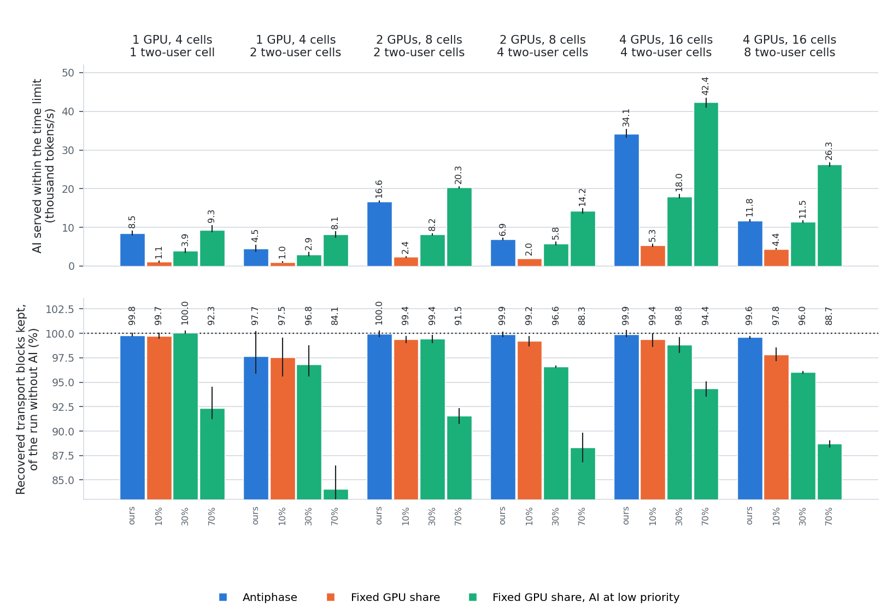

- **GPU 2장과 4장의 여섯 조건에서 Antiphase는 복구 99.6% 이상을 유지한다.** AI 처리량은 고정 10%의 2.7–8.2배, 낮은 우선순위 + 30%의 1.0–2.1배다. 이 규칙에는 NRx 수에 따라 정하는 값이 없다. v13의 "빈 NRx 여유" 규칙은 NRx가 4개일 때만 뜻이 있었다.
- **GPU 1장(시드 5).** 약한 셀이 하나면 Antiphase는 8.5k에 99.8%(시드 범위 99.7–100.0%)이고, 낮은 우선순위 + 70%는 9.3k에 92.3%다. 약한 셀이 둘이면 NRx 하나가 수요를 감당하지 못한다(AI 없이도 후보의 31%가 버려진다). 이때 Antiphase는 4.5k에 97.7%(95.9–100.2%)로 고정 10%(1.0k, 97.5%), 낮은 우선순위 + 30%(2.9k, 96.8%)와 복구가 같고 AI 처리량이 1.6–4.5배다. 낮은 우선순위 + 70%는 8.1k에 84.1%다.
- **낮은 우선순위 + 70%** 는 AI를 1.07–2.2배 처리하고 복구를 1.6–16% 잃는다. NRx 수요가 클수록, NRx가 적을수록 손실이 크다.
- **AI의 양보.** NRx 수요가 늘면 NRx가 실행 중인 시간이 늘고 AI가 쓸 시간이 준다. 약한 셀 2 / 4 / 6 / 8개에서 Antiphase의 AI 처리량은 46.6k / 34.1k / 19.9k / 11.8k다. 이 조건에서 AI를 더 처리하려면 복구를 내주어야 한다(lane 여유, 6.7절).
- **L1 놓침.** GPU 2장과 4장의 조건에서 Antiphase는 0.022–0.058%, 같은 job의 AI 없는 실행은 0.028–0.059%다. GPU 1장(시드 5)에서는 Antiphase가 0.039%와 0.059%, AI 없는 실행이 0.018%와 0.038%다. 같은 조건에서 고정 10%는 0.072%와 0.058%, 낮은 우선순위 + 30%는 0.043%와 0.039%, + 70%는 0.023%와 0.067%다. GPU 1장에서는 AI를 넣은 방식 대부분의 L1 놓침이 AI 없는 실행보다 높고, Antiphase는 그 범위 안에 있다. 기존 수신기 옆의 단위 크기를 가장 작은 등급으로 줄여도 같았다(0.044–0.068%, 시드 2). TB 수가 실행당 2만 개여서 0.05%가 10 TB다.
- 셀 수를 늘린 조건(20셀, 32셀, 48셀)은 6.11절에 있다.

### 6.9 복구를 사용자 지표로: UL goodput, 재전송, 지연, link adaptation

#### 6.9.1 재전송 일정을 적용한 계산

실행이 남긴 TB별 기록(기존 수신기 성공 여부, NRx 시작 여부, 복구 성공과 시각)에 재전송 일정을 적용했다(`mac_goodput.py`). 물리 계층의 재전송과 L2는 실행하지 않았다.

| 경우 | 일정 (슬롯 시작 T0 기준) |
|---|---|
| 기존 수신기가 복호 | T0 + 4.5 ms에 전달 |
| NRx가 복구 | NRx 종료 시각에 전달, 재전송 없음 |
| 복구 후보가 아니거나 NRx를 얻지 못함 | T0 + 7.5 ms의 UL 슬롯에 재전송 (복구 경로가 없을 때와 같음) |
| NRx를 돌렸으나 복구 실패 | T0 + 12.5 ms의 UL 슬롯에 재전송 (5 ms 늦음) |
| 재전송 | 성공 확률 0.95, 실패하면 7.5 ms 뒤 다시, 최대 4회 |

사용자는 항상 보낼 데이터가 있다(full buffer). 재전송 하나는 새 데이터가 쓸 UL 슬롯 하나를 쓴다. goodput은 새 데이터를 전달한 슬롯의 비율이다.

16셀 전 부하, AI 53k 제공, 512 슬롯 반복, 시드 5(6.4절의 실행):

| 방식 | 2-UE 셀 goodput (복구 경로 없음 대비) | 재전송 / TB 100개 | 지연 평균 / p99 (ms) | 전체 셀 goodput |
|---|---|---|---|---|
| 복구 경로 없음 | 기준 | 16.9 | 5.77 / 12.0 | 기준 |
| 복구 경로, AI 없음 | +5.61% | 10.7 | 5.64 / 17.0 | +2.38% |
| **Antiphase** | **+5.63%** | 10.7 | 5.66 / 17.0 | +2.39% |
| 고정 10% | +5.60% | 10.7 | 5.67 / 17.0 | +2.38% |
| 추정기로 비율 선택 | +5.58% | 10.7 | 5.68 / 17.0 | +2.38% |
| 낮은 우선순위 + 추정기 | +5.58% | 10.7 | 5.69 / 17.0 | +2.37% |
| 낮은 우선순위 + 30% | +5.57% | 10.7 | 5.69 / 17.0 | +2.37% |
| 낮은 우선순위 + 70% | +5.31% | 11.0 | 5.72 / 17.0 | +2.26% |
| 낮은 우선순위, 한도 없음 | +5.27% | 11.1 | 5.75 / 17.0 | +2.25% |

- **복구 경로의 가치.** 2-UE 셀의 UL goodput이 5.6% 오르고, TB 100개당 재전송이 16.9개에서 10.7개로 준다(−37%). 1-UE 셀을 포함한 전체로는 +2.4%다.
- **방식 간 차이는 작다.** 잃은 복구 1%는 2-UE 셀 goodput 약 0.06%p다. 복구 99.9%(Antiphase)와 93.7%(낮은 우선순위, 한도 없음)의 차이는 goodput 0.36%p다.
- **NRx 수요가 큰 조건에서는 차이가 0.5–0.6%p다.** 약한 셀 8개(16셀)에서 복구 경로의 이득은 AI 없이 +5.29%, Antiphase +5.26%, 고정 10% +5.17%, 낮은 우선순위 + 30% +5.07%, + 70% +4.67%다. GPU 2장·약한 셀 4개에서는 +4.57%, Antiphase +4.58%, 고정 10% +4.53%, 낮은 우선순위 + 30% +4.41%, + 70% +4.03%다(시드 2).
- 따라서 Antiphase의 결과는 "복구 경로의 goodput 이득(+5.61%)을 그대로 두고(+5.63%) AI를 34.1k tokens/s 처리한다"로 적는다. 같은 이득을 유지하는 기존 수단(고정 10%, 추정기, 낮은 우선순위 + 30%)의 AI 처리량은 5.3k–18.1k다.
여덟 조건의 값(2-UE 셀의 goodput 이득, 복구 경로가 없을 때 대비). "잃은 복구 1%의 비용"은 방식들의 (잃은 복구, goodput 이득)에 맞춘 직선의 기울기다(`analyze_goodput_slope.py`).

| 조건 | 복구 경로, AI 없음 | **Antiphase** | 고정 10% | 낮은 우선순위 + 30% | 낮은 우선순위 + 70% | 잃은 복구 1%의 비용 |
|---|---|---|---|---|---|---|
| 16셀 전 부하 (시드 5) | +5.61% | **+5.63%** | +5.60% | +5.57% | +5.31% | 0.053%p |
| 16셀 2초 교대 (시드 5) | +5.65% | **+5.65%** | +5.63% | +5.61% | +5.42% | 0.055%p |
| 16셀 무작위 계단 (시드 5) | +5.62% | **+5.61%** | +5.60% | +5.58% | +5.45% | 0.062%p |
| 16셀, 약한 셀 8개 (시드 2) | +5.29% | **+5.26%** | +5.17% | +5.07% | +4.67% | 0.055%p |
| GPU 2장, 약한 셀 4개 (시드 2) | +4.57% | **+4.58%** | +4.53% | +4.41% | +4.03% | 0.046%p |
| 20셀 전 부하 (시드 4) | +5.63% | **+5.60%** | +5.58% | +5.46% | +5.29% | 0.058%p |
| 32셀 절반 부하 (시드 4) | +5.83% | **+5.83%** | +5.81% | +5.78% | +5.62% | 0.060%p |
| 48셀 1/3 부하 (시드 4) | +5.93% | **+5.92%** | +5.89% | +5.85% | +5.71% | 0.060%p |

- **여덟 조건에서 복구 경로의 이득은 +4.6–5.9%이고, Antiphase는 그 이득을 0.03%p 안에서 유지한다.** 잃은 복구 1%의 비용은 0.046–0.062%p(평균 0.056%p)다.
- 부하가 바뀌는 조건에서 추정기 방식의 이득은 +5.36–5.38%(낮은 우선순위를 더하면 +5.46–5.53%)다.
- **p99 지연은 복구 경로에서 나빠진다(12.0 → 17.0 ms).** NRx를 돌렸으나 복구하지 못한 TB의 재전송이 5 ms 늦기 때문이다. 평균 지연은 준다(5.77 → 5.64 ms).
- **HARQ 프로세스.** 복구 마감 11.5 ms는 TB 하나가 HARQ 프로세스를 붙잡는 시간을 늘린다. 2-UE 셀의 사용자 하나가 동시에 쓰는 HARQ 프로세스는 복구 경로가 없을 때 평균 2.51개, p99.9 5개, 최대 6개이고, 복구 경로가 있을 때(모든 방식) 평균 2.48–2.52개, p99.9 5개, 최대 6개다. NR의 상향 HARQ 프로세스 16개 안이다.

복구 마감에 따른 재전송 슬롯:

| 복구 마감 | 복구 실패 시 재전송 슬롯 | 복구 경로가 없을 때 대비 |
|---|---|---|
| 6.5 ms | T0 + 7.5 ms | 같음. 큰 NRx(6.3 ms)가 들어가지 않음 |
| 11.5 ms | T0 + 12.5 ms | 5 ms 늦음 |
| 16.5 ms | T0 + 17.5 ms | 10 ms 늦음 |

#### 6.9.2 link adaptation: 복구 경로가 있으면 더 높은 MCS를 쓰는가

2-UE 셀(16QAM, 273 PRB, 상관 낮은 TDL 채널)의 MCS를 10–16으로 바꾸고, 고정 Es/No 4.5–7.5 dB(0.5 dB 간격)에서 두 수신기로 같은 슬롯을 복호했다(LDPC 20회, MCS와 Es/No마다 TB 300개). `nrx_large`는 16QAM의 LLR을 내므로 부호율이 달라도 같은 엔진을 쓴다. goodput은 `TB 크기 / (1 + 오류율 / 0.95)`로 계산했다. 복구 경로의 오류율에는 시간 조건을 적용한 복구 비율(오프라인 복구의 86%)을 썼다.

MCS를 고르는 규칙 두 가지를 비교했다. "goodput 최대"는 goodput이 가장 큰 MCS를 고르고, "10% 목표"는 첫 전송 오류율이 10% 이하인 가장 높은 MCS를 고른다(outer-loop link adaptation의 일반적인 목표). 복구 경로가 있으면 복구 뒤의 오류율로 고른다.

| Es/No (dB) | goodput 최대 MCS: 기존 → 복구 경로 | goodput 이득 | 10% 목표 MCS: 기존 → 복구 경로 | 이득: MCS를 그대로 | 이득: MCS를 올림 |
|---|---|---|---|---|---|
| 4.5 | 12 → **13** | +3.9% | 12 → 12 | +3.5% | +3.5% |
| 5.0 | 13 → 13 | +6.7% | 12 → **13** | +1.2% | +9.4% |
| 5.5 | 13 → **14** | +5.7% | 13 → 13 | +3.2% | +3.2% |
| 6.0 | 14 → 14 | +5.9% | 14 → 14 | +5.9% | +5.9% |
| 6.5 | 14 → **15** | +4.6% | 14 → 14 | +2.1% | +2.1% |
| 7.0 | 15 → 15 | +6.0% | 14 → **15** | +1.5% | +8.9% |
| 7.5 | 15 → **16** | +3.5% | 15 → **16** | +3.0% | +3.5% |
| 평균 | 7개 중 4개에서 한 단계 오름 | **+5.1%** | 7개 중 3개에서 한 단계 오름 | +2.9% | **+5.2%** |

| MCS | 부호율 | 오류율이 10%가 되는 Es/No: 기존 수신기 | 복구 경로 | 차이 |
|---|---|---|---|---|
| 13 | 0.479 | 5.05 dB | 4.63 dB | 0.42 dB |
| 14 | 0.540 | 5.89 dB | 5.51 dB | 0.39 dB |
| 15 | 0.602 | 7.03 dB | 6.55 dB | 0.49 dB |

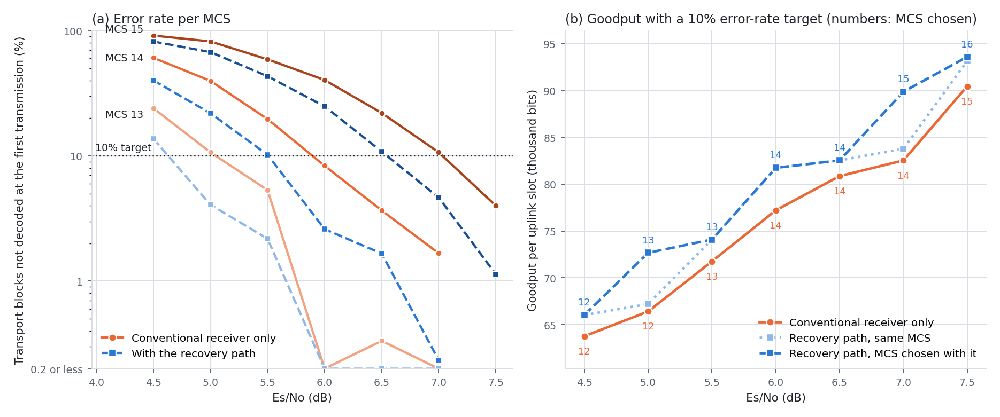

첫 전송 오류율 목표를 바꾼 경우(MCS는 기존 수신기의 오류율이 목표 이하인 가장 높은 값, Es/No 7개의 평균, 슬롯당 bit):

| 기존 수신기의 오류율 목표 | 기존 수신기만 | 복구 경로 (같은 MCS) | 이득 |
|---|---|---|---|
| 5% | 74.5k | 75.5k | +1.3% |
| 10% | **76.1k** | 78.4k | +2.9% |
| 20% | 75.9k | **80.3k** | +5.8% |
| 30% | 73.8k | **80.3k** | +8.8% |
| 40% | 72.6k | 79.7k | +9.8% |

- **복구 경로가 있으면 오류율 목표를 올릴 수 있다.** 기존 수신기만 쓰면 10% 목표가 최선이다(76.1k). 복구 경로가 있으면 20–30% 목표가 최선이고(80.3k), 최선끼리 비교해 +5.5%다. 목표를 올리면 NRx 수요가 는다.
- **복구 경로는 오류율 10% 지점을 0.4–0.5 dB 낮춘다.** MCS 한 단계의 간격은 0.84–1.14 dB다. 따라서 복구 경로는 MCS 0.4–0.5단계에 해당하고, 시험한 Es/No의 약 절반에서 MCS가 한 단계 오른다. 두 단계 오른 점은 없다.
- **goodput 이득은 평균 +5.1–5.2%다.** 10% 목표 규칙에서 MCS를 그대로 두면 +2.9%이고, 복구 뒤의 오류율로 MCS를 고르면 +5.2%다. MCS가 오른 점에서는 +3.5–9.4%다.
- MCS가 오르면 첫 전송의 실패가 늘어 NRx 수요가 는다(예: 5.0 dB에서 MCS 12 → 13이면 기존 수신기 실패 1.7% → 10.7%). 6.8절의 결과대로 NRx 수요가 늘면 AI가 쓸 GPU 시간이 준다.
- 한계: 고정 Es/No에서 MCS별로 따로 잰 오류율의 계산이다. 점마다 TB 300개여서 오류율 10% 근처의 점(10.2%, 10.8%)은 통계 오차 안에 있다. 다른 두 채널은 6.9.3절에 있다. outer loop를 런타임에 넣어 방식별로 잰 결과는 6.13절에 있다. 채널이 변하는 조건의 rate control과 HARQ 결합은 실행하지 않았다.

#### 6.9.3 link adaptation: 상관이 높은 채널과 UMi

6.9.2절과 같은 방법으로 워크로드의 나머지 두 채널을 쟀다. 상관 높은 TDL 채널은 Es/No 12–24 dB(2 dB 간격, 점마다 TB 300개, 오류율이 목표에 가까운 20·22 dB의 MCS 14·15는 600개), UMi는 4–14 dB(2 dB 간격, 점마다 TB 200개, 8–14 dB의 MCS 13–16은 400개), MCS 10–16이다.

| 채널 | Es/No | 오류율 10% 지점의 이동 | 10% 목표: MCS를 그대로 | 10% 목표: 복구 뒤의 오류율로 MCS 선택 | goodput 최대 규칙 | 오류율 목표를 고를 때 (최선끼리) |
|---|---|---|---|---|---|---|
| 상관 낮음 (6.9.2절) | 4.5–7.5 dB | 0.4–0.5 dB | +2.9% | +5.2% (7개 중 3개에서 한 단계) | +5.1% | +5.5% |
| **상관 높음** | 12–24 dB | **2.5–4.0 dB** | +5.2% | **+11.8%** (7개 중 6개에서 한 단계) | +8.3% | +7.5% |
| UMi | 4–14 dB | 0.2–1.5 dB | +1.6% | 통계 오차 안 (아래) | +2.0% | +2.1% |

상관 높은 채널의 Es/No별 값(10% 목표 규칙):

| Es/No (dB) | MCS: 기존 → 복구 경로 | 올린 MCS의 오류율: 기존 수신기 → 복구 뒤 | 이득: MCS를 그대로 | 이득: MCS를 올림 |
|---|---|---|---|---|
| 12 | 10 → **11** | 16.3% → 3.7% | +6.5% | +16.3% |
| 14 | 11 → **12** | 18.7% → 4.6% | +4.8% | +16.6% |
| 16 | 12 → **13** | 17.0% → 5.0% | +5.6% | +14.4% |
| 18 | 13 → **14** | 18.3% → 8.9% | +6.8% | +10.9% |
| 20 | 13 → **14** | 11.3% → 3.3% | +2.7% | +11.2% |
| 22 | 14 → **15** | 13.2% → 8.4% | +6.1% | +13.2% |
| 24 | 15 → 15 | – | +4.3% | +4.3% |

| MCS | 오류율이 10%가 되는 Es/No: 기존 수신기 | 복구 경로 | 차이 |
|---|---|---|---|
| 12 | 15.3 dB | 12.8 dB | 2.5 dB |
| 13 | 17.7 dB | 14.7 dB | 3.0 dB |
| 14 | 21.3 dB | 17.3 dB | 4.0 dB |
| 15 | 24.0 dB | 20.8 dB | 3.2 dB |

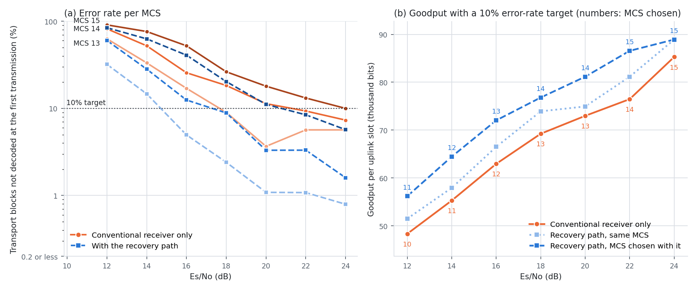

- **상관이 높은 채널에서 복구 경로는 MCS 한 단계 이상에 해당한다.** 두 UE의 채널이 비슷하면 기존 수신기의 오류율이 SNR을 올려도 천천히 준다(MCS 14: 16 dB에서 25.7%, 24 dB에서 7.3%). 복구 경로는 오류율 10% 지점을 2.5–4.0 dB 낮춘다. 10% 목표 규칙에서 7개 Es/No 중 6개에서 MCS가 한 단계 오르고 goodput이 11.8% 는다. 12–18 dB의 네 점은 올린 MCS의 기존 수신기 오류율이 16–19%여서 통계 오차와 무관하다. 20 dB와 22 dB는 TB 600개로 다시 쟀고 기존 수신기 오류율이 11.3%와 13.2%다.
- MCS를 그대로 두어도 +5.2%이고, goodput이 가장 큰 MCS를 고르는 규칙에서는 +8.3%다. 오류율 목표를 고를 때는 기존 수신기만 쓰면 30% 목표가 최선(슬롯당 70.7k bit), 복구 경로가 있으면 20–30% 목표가 최선(76.0k)이고 최선끼리 +7.5%다.
- **UMi에서는 이득이 작다.** 복구 경로가 오류율을 0–7%p 낮추고, goodput 이득은 +1.6–2.1%다. UMi는 실패한 TB의 87%가 모든 code block 실패이고 NRx가 그 TB를 복구하지 못한다(6.3절). 10% 목표 규칙에서 MCS가 바뀌는 점은 6개 중 1개(12 dB)이고, 그 점의 기존 수신기 오류율이 10.5%(TB 400개 중 42개)여서 목표 10%와 구분되지 않는다. 결과로 쓰지 않는다.
- 세 채널을 합치면 "복구 경로가 있으면 더 높은 MCS를 쓸 수 있는가"의 답은 채널에 따라 다르다: 상관이 높은 채널에서는 대부분의 SNR에서 한 단계, 상관이 낮은 채널에서는 약 절반의 SNR에서 한 단계, UMi에서는 확인되지 않는다.
- MCS를 올리면 NRx 수요가 는다. 상관 높은 채널 16 dB에서 MCS 12 → 13이면 기존 수신기 실패가 7.0%에서 17.0%로 는다.

### 6.10 여러 종류의 AI 작업

16셀 전 부하, 512 슬롯 반복, 10초 실행. 4.3절의 모델 4개로 다섯 종류의 작업을 한 GPU에서 함께 돌렸다. 모든 방식을 같은 job에서 쟀다(시드 3).

| 종류 | 모델 | 작업 | 시간 제한 | GPU당 제공량 |
|---|---|---|---|---|
| chat | Qwen2.5-1.5B | 프롬프트 처리 뒤 출력 토큰 최대 64개 생성 | 첫 토큰 200 ms, 그 뒤 토큰마다 50 ms | 0.8 요청/s, 세션 4개 |
| large | Qwen2.5-3B | 프롬프트 처리 | 400 ms | 2 요청/s |
| embed | bge-base (BERT) | 문장 임베딩, 배치 1/4/16 | 50 ms | 150건/s |
| vision | ViT-base | 이미지 분류, 배치 1/4/16 | 50 ms | 60건/s |
| filler | Qwen2.5-1.5B | 1,024 token 프롬프트 처리, 항상 대기 | 없음 | – |

시간 제한이 있는 작업만으로 GPU 시간의 약 65%가 필요하다.

| 방식 | 복구 유지율 | L1 놓침 | chat: 제때 나온 출력 토큰/s (모든 토큰이 제때인 응답, 거절) | large: 제한 안 프롬프트 토큰/s (거절) | embed 건/s | vision 건/s | filler 토큰/s |
|---|---|---|---|---|---|---|---|
| AI 없음 | 100% | 0.026% | – | – | – | – | – |
| **Antiphase** | **99.7%** | 0.010% | 119 (92%, 거절 10%) | 3.7k (11%) | 593 | 237 | 5.4k |
| 고정 10% | 99.3% | 0.003% | 6 (0%, 거절 64%) | 0.0k (67%) | 117 | 36 | 3.0k |
| 낮은 우선순위 + 30% | 98.5% | 0.008% | 81 (31%, 거절 29%) | 1.2k (28%) | 542 | 210 | 3.9k |
| 고정 30% | 97.3% | 0.015% | 95 (55%, 거절 25%) | 2.2k (24%) | 572 | 224 | 4.6k |
| 낮은 우선순위 + 70% | 96.5% | 0.008% | 141 (100%, 거절 2%) | 4.5k (2%) | 593 | 237 | 12.8k |
| 낮은 우선순위, 한도 없음 | 94.0% | 0.023% | 154 (100%, 거절 0%) | 4.6k (0%) | 594 | 238 | 18.6k |
| Antiphase의 다른 설정: 큰 단위도 기존 수신기 옆 허용 | 99.7% | 0.005% | 124 (87%, 거절 9%) | 3.7k (11%) | 592 | 237 | 6.7k |

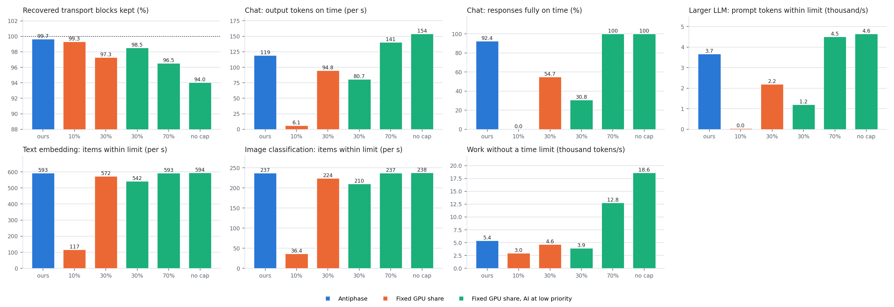

- **Antiphase는 복구 99.7%를 유지하면서 시간 제한이 있는 작업의 대부분을 처리한다.** 임베딩과 이미지 분류는 전부, 3B 프롬프트는 한도 없는 방식의 80%(3.7k / 4.6k), chat 출력 토큰은 77%(119 / 154)를 제때 내고, 받은 chat 응답의 92%가 모든 토큰이 제때다.
- 복구 98.5% 이상을 유지하는 기존 수단(고정 10%, 낮은 우선순위 + 30%)과 비교하면 chat 출력 토큰 1.5배 이상, 모든 토큰이 제때인 응답 92% 대 31% 이하, 3B 프롬프트 3.1배 이상이다. 전 부하에서 추정기 방식은 고정 20%와 낮은 우선순위 + 30%를 고르므로(6.4절) 이 표의 낮은 우선순위 + 30%가 그에 해당한다.
- **시간 제한이 없는 작업은 Antiphase가 적게 처리한다.** 낮은 우선순위 + 70%와 한도 없음은 filler를 2.4–3.4배 처리하고 시간 제한이 있는 작업도 거의 전부 처리한다. 그 대가는 복구 3.2–5.7%p다.
- Antiphase는 chat 요청의 10%와 3B 요청의 11%를 받지 않는다. NRx가 도는 동안(6.4 ms) 그 GPU의 AI가 멈추므로 시간 제한 안에 끝낼 수 있는 양이 준다.
- 규칙을 바꾸지 않고 다섯 종류가 돌았다. Controller는 단위의 크기 등급만 보고 모델과 작업 종류를 모른다. L1 놓침은 모든 방식이 AI 없는 실행 이하다.
- 크기 등급의 경계를 0.90 ms로 두면 3B의 512 token layer(1.14 ms)가 기존 수신기 옆에서 금지되어 3B 프롬프트가 1.4k, 모든 토큰이 제때인 chat 응답이 18%로 떨어졌다. 경계는 한도 측정에 맞춰 1.2 ms로 정했다(6.7절).

chat만 제공한 조건(GPU당 1.5 요청/s, 세션 6개, 시드 2, 같은 job):

| 방식 | 복구 유지율 | 제때 나온 출력 토큰/s | 모든 토큰이 제때인 응답 | 거절 |
|---|---|---|---|---|
| **Antiphase** | **99.7%** | 258 | 100% | 11% |
| 고정 10% | 98.6% | 145 | 70% | 43% |
| 낮은 우선순위 + 30% | 98.6% | 268 | 96% | 7% |
| 고정 30% | 98.1% | 276 | 98% | 7% |
| 낮은 우선순위 + 70% | 97.7% | 297 | 100% | 3% |
| 낮은 우선순위, 한도 없음 | 97.2% | 300 | 100% | 3% |

- 토큰 생성만 있는 조건은 GPU 시간의 약 40%를 쓴다. 비율 30% 이상의 방식은 출력 토큰을 89% 이상 제때 낸다.
- Antiphase의 출력 토큰은 한도 없는 방식의 86%이고, 받은 응답은 모두 제때다. 복구 유지율은 다른 방식보다 1.1–2.5%p 높다.

### 6.11 그 밖의 조건: AI 부하, AI 요청 버스트, 셀 수, 교대 간격, 셀 버스트

512 슬롯 반복, 시드 2(셀 수는 시드 4). 모든 방식을 같은 job에서 측정했다. 칸은 "AI 처리량 / 복구 유지율 / L1 놓침"이다.

#### 6.11.1 AI 부하

16셀 전 부하. AI 제공량 13k / 27k / 106k tokens/s(53k는 6.4절의 값, 시드 5). AI 없는 실행의 L1 놓침은 0.025%다.

| 방식 | 13k 제공 | 27k 제공 | 53k 제공 | 106k 제공 |
|---|---|---|---|---|
| **Antiphase** | **13.0k / 99.8% / 0.020%** | **26.7k / 99.4% / 0.024%** | **34.1k / 99.9% / 0.036%** | **24.3k / 100.0% / 0.026%** |
| 고정 10% | 2.9k / 99.3% / 0.026% | 4.2k / 99.3% / 0.035% | 5.3k / 99.4% / 0.032% | 5.5k / 99.2% / 0.038% |
| 낮은 우선순위 + 30% | 12.7k / 99.3% / 0.031% | 18.9k / 99.1% / 0.018% | 18.0k / 98.8% / 0.037% | 15.1k / 98.3% / 0.030% |
| 낮은 우선순위 + 70% | 13.0k / 99.2% / 0.038% | 26.9k / 97.3% / 0.023% | 42.4k / 94.4% / 0.037% | 27.9k / 93.6% / 0.029% |
| 낮은 우선순위, 한도 없음 | 13.0k / 98.9% / 0.038% | 27.0k / 97.7% / 0.049% | 49.0k / 93.7% / 0.044% | 33.3k / 92.5% / 0.035% |

- 제공량 13k와 27k에서 Antiphase는 모든 요청을 처리하고 복구 99.4–99.8%를 유지한다. 낮은 우선순위 + 70%와 한도 없음도 모든 요청을 처리하고, 27k에서 복구가 97.3–97.7%다.
- **과부하(106k).** 모든 방식의 처리량이 53k 제공 때보다 준다. 입장 제어가 짧은 요청을 주로 받아 token당 GPU 시간이 늘기 때문이다. Antiphase는 24.3k에 100.0%, 낮은 우선순위 + 70%는 27.9k에 93.6%, 한도 없음은 33.3k에 92.5%다.
- Antiphase의 L1 놓침은 모든 AI 부하에서 0.020–0.036%다(AI 없음 0.025–0.032%).

#### 6.11.2 AI 요청 버스트

16셀 전 부하. AI 요청의 도착 간격 변동계수 4, 평균 제공량 53k.

| 방식 | AI 처리량 | 복구 유지율 | L1 놓침 |
|---|---|---|---|
| AI 없음 | – | 100% | 0.015% |
| **Antiphase** | **23.3k** | **99.5%** | 0.021% |
| 고정 10% | 3.6k | 99.0% | 0.035% |
| 낮은 우선순위 + 30% | 12.8k | 98.7% | 0.036% |
| 낮은 우선순위 + 70% | 27.4k | 95.9% | 0.044% |

- 요청이 몰려 오면 시간 제한 안에 끝낼 수 없는 요청이 늘어 모든 방식의 처리량이 준다. Antiphase는 고정 10%의 6.5배, 낮은 우선순위 + 30%의 1.8배를 처리한다. 낮은 우선순위 + 70%는 18% 많이 처리하고 복구를 4.1% 잃는다.

#### 6.11.3 셀 수: 20셀, 32셀, 48셀

GPU 4장. 20셀은 전 부하(GPU당 5셀), 32셀은 셀마다 확률 0.5로 활성(GPU당 8셀), 48셀은 확률 1/3로 활성(GPU당 12셀)이다. NRx 시간 한도는 세 조건 모두 7.6 ms다.

| 조건 | AI 없음: 복구 TB/s, L1 놓침 | **Antiphase** | 고정 10% | 낮은 우선순위 + 30% | 낮은 우선순위 + 70% |
|---|---|---|---|---|---|
| 20셀, 전 부하 | 188, 0.032% | **31.4k / 99.5% / 0.044%** | 5.3k / 99.1% / 0.037% | 17.3k / 97.0% / 0.035% | 40.1k / 94.1% / 0.054% |
| 32셀, 절반 부하 | 195, 0.037% | **33.4k / 100.0% / 0.041%** | 5.4k / 99.8% / 0.038% | 17.6k / 99.2% / 0.048% | 41.1k / 96.6% / 0.051% |
| 48셀, 1/3 부하 | 199, 0.090% | **32.6k / 99.7% / 0.130%** | 5.3k / 99.3% / 0.125% | 17.6k / 98.5% / 0.112% | 41.2k / 96.3% / 0.117% |

- **Antiphase는 세 조건에서 31.4k–33.4k를 처리하고 복구 99.5–100.0%를 유지한다**(시드 4, 시드 범위 99.4–100.1%). 고정 10%의 5.9–6.2배, 낮은 우선순위 + 30%의 1.8–1.9배다. 낮은 우선순위 + 70%는 23–28% 많이 처리하고 복구를 3.4–5.9% 잃는다.
- 20셀과 32셀에서 Antiphase의 L1 놓침은 0.044%와 0.041%, AI 없는 실행은 0.032%와 0.037%다. 다른 방식은 0.035–0.054%다.
- **48셀에서는 AI를 넣은 모든 방식의 L1 놓침이 AI 없는 실행보다 높다**(0.112–0.130% 대 0.090%). 한 슬롯에 GPU 하나에서 최대 12셀이 활성이고, AI 없이도 기존 수신기 완료 p99.9가 3.8–3.9 ms다. Antiphase는 0.130%로 그 가운데 가장 높다.

**20셀의 NRx 시간 한도를 모델로 정했다.** v13은 20셀에서 NRx 시간 한도를 8.6 ms로 두었다(AI 옆에서 NRx가 길어지는 것을 감안한 값). 최신 시작 시각이 `L = 11.5 − 8.6 = 2.9 ms`가 되고 여유가 `2P + L − c − S = 5.0 + 2.9 − 1.45 − 6.40 = 0.05 ms`로 줄어, AI 없이도 실행의 47%가 3슬롯이었다. 이 한도에서는 모든 방식이 복구를 3–5% 잃었다(활성 5셀에서 가장 작은 등급만 허용한 설정 97.2%, 고정 10% 96.7%, 낮은 우선순위 + 30% 95.9%, + 70% 95.4%; 시드 2). v14의 규칙은 NRx 옆에서 AI를 돌리지 않으므로 한도를 16셀과 같은 7.6 ms로 둘 수 있다. 닫힌 형태에 한도 8.6 ms 실행의 c와 S를 넣고 `L = 3.9 ms`의 손실을 실행 전에 계산했고(`results/backstop_slot/prediction_dense76_20cells.txt`), 그 뒤에 측정했다.

| 방식 | 버려진 후보: 한도 8.6 ms 실측 | 한도 7.6 ms 예측 | 한도 7.6 ms 실측 | 3슬롯 실행의 비율: 예측 | 실측 |
|---|---|---|---|---|---|
| AI 없음 | 3.6% | 1.6% | 1.6% | 11% | 17% |
| Antiphase (활성 5셀에서 가장 작은 등급만 허용한 설정) | 6.4% | 1.8% | 1.8% | 15% | 18% |
| 낮은 우선순위 + 30% | 6.8% | 3.1% | 3.8% | 43% | 47% |
| 낮은 우선순위 + 70% | 7.0% | 5.7% | 6.2% | 92% | 92% |

- 예측과 실측의 차이는 0.0–0.7%p다(예측에 쓴 것과 같은 시드 2개). 같은 시드에서 AI 없는 실행의 복구도 초당 185 TB에서 190 TB로 는다. NRx 실행이 복구 마감을 넘긴 비율은 0.0–0.2%다.
- NRx 시간 한도는 "복구 마감을 넘기는 실행"과 "3슬롯 실행"을 맞바꾸는 값이고, 닫힌 형태로 정할 수 있다.

#### 6.11.4 교대 간격

16셀. 전 부하와 절반 부하가 0.2초 / 2초 / 5초마다 교대한다(2초는 6.5.1절의 값, 시드 5).

| 방식 | 0.2초마다 | 2초마다 | 5초마다 |
|---|---|---|---|
| AI 없음 | – / 100% / 0.010% | – / 100% / 0.018% | – / 100% / 0.030% |
| **Antiphase** | **42.5k / 99.8% / 0.015%** | **41.4k / 99.9% / 0.019%** | **41.2k / 99.8% / 0.024%** |
| 고정 10% | 5.7k / 99.3% / 0.013% | 5.7k / 99.5% / 0.016% | 5.8k / 99.7% / 0.015% |
| 낮은 우선순위 + 30% | 20.4k / 98.8% / 0.021% | 20.3k / 99.2% / 0.018% | 20.5k / 99.2% / 0.012% |
| 낮은 우선순위 + 70% | 47.4k / 95.9% / 0.017% | 46.9k / 96.0% / 0.021% | 46.3k / 95.9% / 0.029% |
| 부하 따라 10/50% | 21.9k / 97.3% / 0.072% | 23.8k / 99.2% / 0.014% | 23.9k / 99.1% / 0.013% |
| 낮은 우선순위 + 부하 따라 30/70% | 36.1k / 97.6% / 0.042% | 34.7k / 99.0% / 0.018% | 34.2k / 99.0% / 0.018% |
| 추정기로 비율 선택 | 24.9k / 94.0% / 0.238% | 21.8k / 95.3% / 0.055% | 25.8k / 97.9% / 0.041% |
| 낮은 우선순위 + 추정기 | 34.2k / 96.6% / 0.011% | 27.2k / 97.8% / 0.016% | 30.9k / 98.7% / 0.024% |

- **Antiphase의 결과는 교대 간격과 무관하다**(41.2k–42.5k, 99.8–99.9%).
- **부하를 보고 비율을 바꾸는 방식은 간격이 짧을수록 복구를 잃는다.** "부하 따라 비율"은 최근 100 ms의 부하로 판단하고, 0.2초 교대에서 97.3–97.6%다. 추정기 방식은 1초마다 결정하고, 0.2초 교대에서 94.0%(L1 놓침 0.238%), 5초 교대에서 97.9%다.
- Antiphase의 AI 처리량은 고정 10%의 7.1–7.5배, 낮은 우선순위 + 추정기의 1.24–1.52배, 낮은 우선순위 + 부하 따라 비율의 1.18–1.20배다.

#### 6.11.5 셀 버스트

셀마다 독립으로 켜지고 꺼진다. 켜진 구간의 평균 길이는 20 ms 또는 2초이고 평균 부하는 절반이다. 20초 실행.

| 조건 | AI 없음: 복구 TB/s, L1 놓침 | **Antiphase** | 고정 10% | 낮은 우선순위 + 30% | 낮은 우선순위 + 70% | 낮은 우선순위 + 부하 따라 30/70% |
|---|---|---|---|---|---|---|
| 16셀, 20 ms 버스트 | 94, 0.060% | **49.6k / 100.1% / 0.077%** | 6.0k / 100.0% / 0.066% | 23.8k / 99.8% / 0.074% | 51.1k / 99.5% / 0.069% | 51.1k / 99.5% / 0.069% |
| 16셀, 2초 버스트 | 99, 0.249% | **48.0k / 99.8% / 0.311%** | 6.0k / 99.7% / 0.257% | 23.2k / 99.4% / 0.274% | 50.4k / 98.6% / 0.308% | 45.6k / 98.9% / 0.308% |
| 32셀, 20 ms 버스트 | 196, 0.105% | **33.5k / 99.7% / 0.121%** | 5.4k / 99.2% / 0.116% | 17.7k / 98.5% / 0.115% | 41.3k / 96.2% / 0.129% | 19.3k / 98.5% / 0.116% |
| 32셀, 2초 버스트 | 181, 1.107% | **34.4k / 99.1% / 1.561%** | 5.5k / 98.8% / 1.299% | 18.2k / 98.2% / 1.577% | 42.1k / 95.4% / 1.897% | 22.6k / 97.6% / 1.584% |

- **16셀.** 평균 부하가 절반이어서 NRx 수요가 전 부하의 절반이다. 모든 방식이 복구 98.6% 이상을 유지한다. Antiphase는 48.0k–49.6k에 99.8–100.1%, 낮은 우선순위 + 70%는 50.4k–51.1k에 98.6–99.5%다. 이 조건에서 두 방식의 차이는 AI 3–5%와 복구 0.6–1.2%p다.
- **32셀.** Antiphase는 33.5k–34.4k에 99.1–99.7%다. 고정 10%의 6.2–6.3배, 낮은 우선순위 + 30%의 1.9배, 낮은 우선순위 + 부하 따라 비율의 1.5–1.7배다. 낮은 우선순위 + 70%는 22–23% 많이 처리하고 복구를 3.8–4.6% 잃는다.
- **L1 놓침은 버스트 조건에서 AI 없이도 높다.** 2초 버스트에서는 한 GPU의 여러 셀이 수 초 동안 함께 켜진다. 16셀 2초 버스트는 AI 없이 0.249%, 32셀 2초 버스트는 1.107%(기존 수신기 완료 p99.9 21 ms)다. AI를 넣은 모든 방식이 그보다 높고(16셀 0.257–0.311%, 32셀 1.299–1.897%), Antiphase는 낮지 않다. 이 조건으로 L1을 비교하지 않는다.

### 6.12 미래를 아는 스케줄과의 거리

Antiphase는 NRx가 도는 동안 그 GPU의 AI를 멈춘다. 뒤에 올 후보를 미리 안다면 대부분의 NRx 실행 옆에서 AI를 돌려도 복구를 잃지 않는다. 그 상한을 AI 없는 실행의 기록(후보가 난 슬롯, 각 NRx 실행의 시작 시각과 길이)에서 계산했다(`analyze_optimum.py`).

| 계산 | 가정 | AI가 돌 수 있는 GPU 시간 |
|---|---|---|
| 규칙의 이상값 | NRx가 도는 동안만 그 GPU의 AI를 끈다. 중단 지연과 허락의 손실이 없다 | 1 − (NRx 실행 시간의 합) / (GPU 시간) |
| 미래를 아는 스케줄 | 모든 후보와 실행 시간을 미리 안다. 시작 시각을 AI 없는 실행과 같게 두므로 잃는 후보가 없다. NRx 옆의 AI는 그 NRx가 다음 실행의 시작 전에 끝나는 한도까지 돈다. AI 옆의 NRx는 0.786배 속도로 진행한다(실측 6.29 ms 대 8.01 ms) | 실행마다 AI를 꺼야 하는 시간만 뺌 |
| 규칙 없음 | AI를 끄지 않는다(낮은 우선순위만) | 1 (복구를 잃음) |

"미래를 아는 스케줄의 AI 처리량"은 Antiphase의 측정 처리량에 AI 시간의 비(미래를 아는 스케줄 / Antiphase 실측)를 곱한 추정이고, 낮은 우선순위만 쓴 방식의 측정값(전 부하 49.0k)을 넘지 않게 했다. 그 측정이 없는 조건은 제공량을 상한으로 두었다.

| 조건 | NRx가 도는 시간 | AI 시간: 규칙의 이상값 | Antiphase 실측 | 미래를 아는 스케줄 (줄여야 하는 실행) | AI 처리량: Antiphase | 미래를 아는 스케줄 (추정) | Antiphase / 상한 |
|---|---|---|---|---|---|---|---|
| 16셀 전 부하 | 36% | 64% | 62% | 96.5% (13%) | 34.1k @ 99.9% | 49.0k | **70%** |
| 16셀 2초 교대 | 27% | 73% | 69% | 98.1% (9%) | 41.4k @ 99.9% | 53.0k | 78% |
| 16셀 무작위 계단 | 22% | 78% | 72% | 98.9% (7%) | 44.7k @ 100.0% | 53.0k | 84% |
| 약한 셀 2개 | 18% | 82% | 77% | 99.6% (3%) | 46.6k @ 100.0% | 53.0k | 88% |
| 약한 셀 6개 | 54% | 46% | 45% | 89.0% (29%) | 19.9k @ 100.0% | 39.2k | 51% |
| 약한 셀 8개 | 67% | 33% | 33% | 76.1% (48%) | 11.8k @ 99.6% | 27.3k | 43% |
| GPU 2장, 약한 셀 2개 | 34% | 66% | 61% | 93.8% (24%) | 16.6k @ 100.0% | 25.6k | 65% |
| GPU 2장, 약한 셀 4개 | 61% | 39% | 35% | 78.6% (46%) | 6.9k @ 99.9% | 15.5k | 45% |
| GPU 1장, 약한 셀 1개 | 30% | 70% | 59% | 94.6% (24%) | 8.5k @ 99.8% | 13.2k | 64% |
| GPU 1장, 약한 셀 2개 | 50% | 50% | 40% | 84.8% (43%) | 4.5k @ 97.7% | 9.6k | 47% |
| 20셀 전 부하 | 37% | 63% | 61% | 96.3% (14%) | 31.4k @ 99.5% | 49.3k | 64% |
| 32셀 절반 부하 | 37% | 63% | 62% | 97.5% (11%) | 33.4k @ 100.0% | 52.6k | 63% |
| 48셀 1/3 부하 | 37% | 63% | 61% | 97.4% (11%) | 32.6k @ 99.7% | 52.1k | 63% |

전 부하에서 다른 방식의 위치(상한 49.0k 대비):

| 방식 | AI 처리량 | 복구 유지율 | 상한 대비 |
|---|---|---|---|
| **Antiphase** | 34.1k | 99.9% | **70%** |
| Antiphase의 다른 설정: lane 여유 3 | 39.8k | 99.3% | 81% |
| 고정 10% | 5.3k | 99.4% | 11% |
| 추정기로 비율 선택 | 9.8k | 99.1% | 20% |
| 낮은 우선순위 + 30% | 18.0k | 98.8% | 37% |
| 낮은 우선순위 + 추정기 | 18.1k | 99.0% | 37% |
| 낮은 우선순위 + 70% | 42.4k | 94.4% | 87% |
| 조각 중단, lane 여유 1 | 44.0k | 95.1% | 90% |

- **Antiphase의 구현은 자기 규칙의 이상값에 가깝다.** 전 부하에서 AI가 실제로 돈 시간은 62%이고 규칙의 이상값은 64%다(97%). 중단 지연과 조각 허락으로 잃는 시간은 2%p다. GPU 1장에서는 59% 대 70%, 40% 대 50%로 차이가 크다.
- **미래를 알면 AI를 꺼야 하는 시간은 3.5%다.** 전 부하에서 NRx 실행의 13%만 다음 후보 때문에 줄여야 하고, 나머지 87%는 AI 옆에서 끝까지 돌아도 그 NRx가 필요해지기 전에 끝난다.
- **Antiphase는 그 상한의 70%를 처리한다**(전 부하). 복구 98.8% 이상을 지키는 기존 수단은 11–37%다. 부하가 낮으면 상한에 가깝고(78–88%), NRx 수요가 크면 멀다(43–51%).
- **남은 차이는 정보의 차이다.** 어느 NRx가 두 슬롯 뒤에 필요한지는 그 슬롯의 복호가 끝나야 안다(실행 시작 약 5.0 ms 뒤). 그때까지 AI를 옆에서 돌리면 실행이 이미 1.07 ms 늦어져 여유(1.2 ms)가 0.13 ms 남는다. 중단 지연(중앙값 0.43 ms, p99 1.44 ms)과 실행 시간의 변동이 그보다 크다. 실측에서 lane 여유 3은 복구를 0.6%p 잃었고, 여유를 쓰는 규칙(NRx가 다음 후보를 받을 수 있는 시각까지 AI 허락)은 4.0%p 잃었다(128 슬롯 반복에서 95.1% 대 NRx 옆 금지 99.1%, 6.7절).
- 따라서 복구를 잃지 않으면서 상한에 다가가려면 "두 슬롯 뒤의 실패"를 미리 아는 수단이 필요하다. 후보의 도착은 연속 슬롯에 몰리지만(같은 셀이 다음 슬롯에도 후보를 낼 확률 0.19–0.26, 평균 0.145) 이 정도의 상관으로는 부족하다.
- 한계: 상한의 AI 처리량은 AI 시간의 비로 환산한 추정이다. NRx 옆의 AI는 혼자 돌 때보다 느리므로 추정은 상한 쪽으로 치우친다. 전 부하만 낮은 우선순위 방식의 측정값(49.0k)을 상한으로 썼다. 미래를 아는 스케줄은 시작 시각을 바꾸지 않는 스케줄 가운데 최적이다(실행을 NRx에 배정하는 순서는 줄이는 시간이 가장 작게 골랐다). 시작을 늦추는 스케줄까지 넣은 최적은 이보다 높거나 같고 100% 이하다.

### 6.13 닫힌 루프 link adaptation: 방식별 셀 goodput

6.9.2–6.9.3절은 MCS를 고정하고 잰 오류율의 계산이다. 이 절은 outer-loop link adaptation을 런타임에 넣어 2-UE 셀이 슬롯마다 MCS를 고르게 하고, GPU를 나누는 방식별로 셀 goodput을 쟀다(job 59345188, 59362400; `la_cl.sh`, `la_cl2.sh`, `analyze_la_closed.py`).

실험 전의 예상은 "rate control이 복구 경로를 믿고 MCS를 올린 상태에서 복구를 6–10% 잃으면 MCS가 한 단계 내려가고 goodput이 약 10% 준다"였다. 측정은 이 예상과 다르다.

| 질문 | 측정 |
|---|---|
| 복구를 잃으면 MCS가 한 단계 내려가는가 | 내려가지 않는다. outer loop는 이웃한 단계에 머무는 시간의 비를 바꾼다. 평균 MCS의 변화는 최대 0.64단계다 |
| 재전송이 느는가 | 늘지 않는다. 재전송이 필요한 TB의 비율은 모든 방식에서 목표와 같다 |
| goodput은 얼마나 주는가 | 목표 10%에서 1.0% 이하, 목표 3%에서 3.9% 이하(GPU 4장·2-UE 셀 4개는 1.4% 이하), 목표 1%에서 최대 8.2%. 가장 큰 값은 목표 1%, 2-UE 셀 8개에서 낮은 우선순위만 쓴 방식이다 |
| Antiphase는 | 아홉 조건 모두에서 AI 없는 실행의 0.3% 안이다(−0.3 ~ +0.2%) |
| 복구 경로의 이득은 | 목표 10%에서 +10.9–12.0%, 목표 3%에서 +25.9–31.1%, 목표 1%에서 +24.4–31.0% |

#### 6.13.1 방법

| 항목 | 값 |
|---|---|
| 채널 | 2-UE 셀은 상관 높은 채널(DoubleTDLhigh), Es/No 16 dB. 단일 UE 셀은 6.4절과 같다 |
| MCS 단계 | MCS 10–16의 7단계. 단계마다 슬롯 768개를 따로 생성했고, 셀은 그 가운데 512개를 반복한다 |
| outer loop | 셀마다 단계 위의 포인터 하나. 재전송이 필요한 TB마다 δ만큼 내리고, 그렇지 않은 TB마다 δ·τ/(1−τ)만큼 올린다(δ = 0.25단계, τ = 목표). 슬롯의 MCS는 포인터의 정수 부분이다. ACK와 NACK의 계단 비로 오류율 목표를 정하는 일반적인 outer-loop link adaptation이다 |
| 재전송이 필요한 TB | 기존 수신기가 복호하지 못했고, NRx가 복구 마감(11.5 ms) 전에 복구하지도 못한 TB |
| 피드백 | 슬롯의 결과를 6 UL 주기(15 ms) 뒤에 포인터에 반영한다 |
| 목표 τ | 10%, 3%, 1% |
| goodput | (TB 비트의 합) / (TB 수 + 재전송 수 / 0.95). 사용자의 UL 슬롯 하나가 나르는 새 데이터다. 재전송은 그 사용자의 UL 슬롯 하나를 쓰고 95% 성공한다 |
| 실행 | 8,000 주기(20초), 앞의 800 주기는 제외. AI 53k tokens/s 제공(GPU 2장 26.5k, 1장 13.2k). 방식은 6.5절과 같다 |
| 런타임 | 셀 worker가 슬롯의 단계를 공유 상태에 적고, NRx lane은 그 단계의 rate recovery와 LDPC 설정으로 전환한다. NRx 엔진은 하나다 |

고정 MCS에서 잰 단계별 오류율(Es/No 16 dB, TB 1,536개, 시간 제한 없음):

| MCS | 10 | 11 | 12 | 13 | 14 | 15 | 16 |
|---|---|---|---|---|---|---|---|
| TB 비트 | 52,224 | 58,384 | 67,584 | 75,792 | 83,976 | 94,248 | 100,392 |
| 기존 수신기의 오류율 | 1.4% | 3.3% | 7.0% | 13.3% | 29.6% | 49.7% | 65.5% |
| 복구 뒤의 오류율 | 0.1% | 0.1% | 0.7% | 2.7% | 13.0% | 34.9% | 55.5% |

#### 6.13.2 16셀, GPU 4장, 2-UE 셀 4개

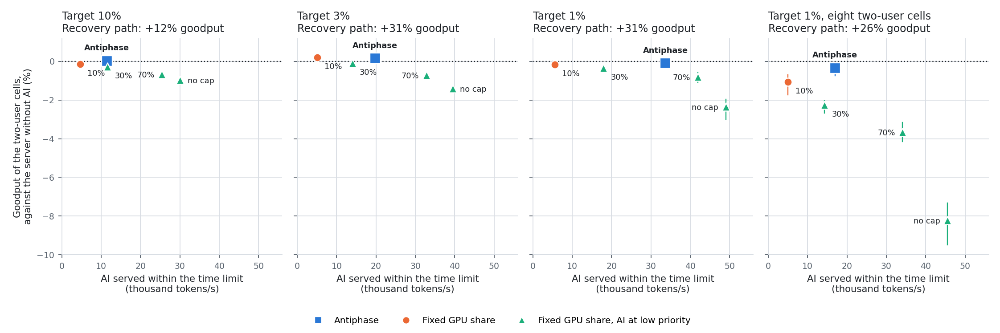

그림의 세로축은 2-UE 셀의 goodput(AI 없는 복구 경로 대비), 가로축은 AI 처리량이다. 세로 막대는 시드의 범위다.

목표 10%:

| 방식 | 시드 | 평균 MCS | 재전송이 필요한 TB | goodput (bits/사용자 슬롯) | 복구 경로 없음 대비 | AI 없는 복구 경로 대비 | 후보가 난 슬롯 | NRx를 못 받은 후보 | 마감 뒤에 끝난 NRx | AI 처리량 | L1 놓침 |
|---|---|---|---|---|---|---|---|---|---|---|---|
| 복구 경로 없음 | 3 | 12.46 | 10.0% | 64.6k | – | −10.7% | 18.1% | – | – | – | 0.008% |
| 복구 경로 없음 + 낮은 우선순위 AI(한도 없음) | 2 | 12.47 | 10.0% | 64.6k | – | −10.6% | 18.1% | – | – | 53.0k | 0.011% |
| 복구 경로, AI 없음 | 3 | 13.50 | 10.0% | 72.3k | +12.0% | – | 28.7% | 6.7% | 0.0% | – | 0.016% |
| **Antiphase** | 3 | 13.50 | 10.0% | 72.3k | +12.0% | +0.0% | 28.7% | 7.0% | 0.0% | 11.4k | 0.023% |
| Antiphase의 다른 설정: lane 여유 3 | 2 | 13.50 | 10.0% | 72.3k | +11.9% | −0.0% | 28.6% | 7.3% | 0.0% | 12.0k | 0.020% |
| Antiphase의 다른 설정: lane 여유 1 | 2 | 13.46 | 10.0% | 72.0k | +11.4% | −0.4% | 28.3% | 10.9% | 0.0% | 17.5k | 0.026% |
| 고정 10% | 3 | 13.49 | 10.0% | 72.2k | +11.8% | −0.1% | 28.4% | 8.6% | 0.0% | 4.6k | 0.018% |
| 낮은 우선순위 + 30% | 3 | 13.47 | 10.0% | 72.1k | +11.7% | −0.3% | 28.4% | 9.7% | 0.0% | 11.5k | 0.019% |
| 낮은 우선순위 + 70% | 3 | 13.44 | 10.0% | 71.8k | +11.2% | −0.7% | 27.9% | 14.2% | 0.1% | 25.4k | 0.032% |
| 낮은 우선순위, 한도 없음 | 3 | 13.41 | 10.0% | 71.6k | +10.9% | −1.0% | 27.5% | 14.7% | 3.0% | 30.1k | 0.083% |

목표 3%:

| 방식 | 시드 | 평균 MCS | 재전송이 필요한 TB | goodput (bits/사용자 슬롯) | 복구 경로 없음 대비 | AI 없는 복구 경로 대비 | 후보가 난 슬롯 | NRx를 못 받은 후보 | 마감 뒤에 끝난 NRx | AI 처리량 | L1 놓침 |
|---|---|---|---|---|---|---|---|---|---|---|---|
| 복구 경로 없음 | 2 | 10.68 | 3.0% | 54.8k | – | −23.7% | 5.6% | – | – | – | 0.009% |
| 복구 경로 없음 + 낮은 우선순위 AI(한도 없음) | 2 | 10.68 | 3.0% | 54.8k | – | −23.7% | 5.6% | – | – | 53.0k | 0.011% |
| 복구 경로, AI 없음 | 2 | 12.79 | 3.0% | 71.8k | +31.1% | – | 21.7% | 2.5% | 0.0% | – | 0.011% |
| **Antiphase** | 2 | 12.80 | 3.0% | 71.9k | +31.3% | +0.2% | 21.7% | 2.8% | 0.0% | 19.8k | 0.018% |
| 고정 10% | 2 | 12.81 | 3.0% | 72.0k | +31.4% | +0.2% | 21.6% | 3.7% | 0.0% | 5.0k | 0.030% |
| 낮은 우선순위 + 30% | 2 | 12.78 | 3.0% | 71.7k | +31.0% | −0.1% | 21.3% | 4.5% | 0.0% | 14.0k | 0.025% |
| 낮은 우선순위 + 70% | 2 | 12.73 | 3.0% | 71.3k | +30.2% | −0.7% | 20.8% | 7.1% | 0.1% | 32.8k | 0.029% |
| 낮은 우선순위, 한도 없음 | 2 | 12.67 | 3.0% | 70.8k | +29.3% | −1.4% | 20.1% | 7.3% | 2.1% | 39.4k | 0.044% |

목표 1%:

| 방식 | 시드 | 평균 MCS | 재전송이 필요한 TB | goodput (bits/사용자 슬롯) | 복구 경로 없음 대비 | AI 없는 복구 경로 대비 | 후보가 난 슬롯 | NRx를 못 받은 후보 | 마감 뒤에 끝난 NRx | AI 처리량 | L1 놓침 |
|---|---|---|---|---|---|---|---|---|---|---|---|
| 복구 경로 없음 | 3 | 10.00 | 1.6% | 51.4k | – | −23.7% | 3.0% | – | – | – | 0.009% |
| 복구 경로 없음 + 낮은 우선순위 AI(한도 없음) | 2 | 10.00 | 1.7% | 51.3k | – | −23.9% | 3.1% | – | – | 53.0k | 0.023% |
| 복구 경로, AI 없음 | 3 | 12.06 | 1.0% | 67.3k | +31.0% | – | 14.1% | 0.1% | 0.0% | – | 0.014% |
| **Antiphase** | 3 | 12.05 | 1.0% | 67.2k | +30.9% | −0.1% | 14.0% | 0.2% | 0.0% | 33.7k | 0.019% |
| Antiphase의 다른 설정: lane 여유 3 | 2 | 12.06 | 1.0% | 67.3k | +31.2% | −0.2% | 14.0% | 0.4% | 0.0% | 35.2k | 0.028% |
| Antiphase의 다른 설정: lane 여유 1 | 2 | 12.01 | 1.0% | 66.9k | +30.4% | −0.8% | 13.6% | 1.5% | 0.1% | 40.1k | 0.035% |
| 고정 10% | 3 | 12.04 | 1.0% | 67.2k | +30.8% | −0.2% | 14.0% | 0.3% | 0.0% | 5.6k | 0.014% |
| 낮은 우선순위 + 30% | 3 | 12.03 | 1.0% | 67.1k | +30.6% | −0.4% | 13.9% | 0.7% | 0.0% | 18.0k | 0.021% |
| 낮은 우선순위 + 70% | 3 | 11.99 | 1.0% | 66.7k | +30.0% | −0.8% | 13.6% | 1.6% | 0.1% | 41.9k | 0.014% |
| 낮은 우선순위, 한도 없음 | 3 | 11.88 | 1.0% | 65.7k | +28.0% | −2.3% | 12.6% | 1.4% | 2.0% | 49.0k | 0.040% |

- "복구 경로 없음"의 목표 1%는 가장 낮은 단계(MCS 10)에서도 재전송이 1.6%여서 목표를 맞추지 못한다. 더 낮은 단계가 있으면 goodput이 더 낮아지므로 복구 경로의 이득(+31.0%)은 하한이다.
- "NRx를 못 받은 후보"와 "마감 뒤에 끝난 NRx"는 후보(실패 code block이 9개 이하인 슬롯) 가운데의 비율이다. 복구를 잃은 방식은 MCS가 내려가 후보 자체도 준다.

#### 6.13.3 NRx 수요가 크거나 서버가 작은 조건

칸은 "AI 처리량 / goodput(AI 없는 복구 경로 대비) / 평균 MCS의 변화"다. 2-UE 셀 8개는 16셀·GPU 4장, GPU 2장은 8셀·2-UE 셀 2개, GPU 1장은 4셀·2-UE 셀 1개다.

| 조건 | 시드 | 복구 경로의 이득 (평균 MCS) | AI 없음: 후보가 난 슬롯 / NRx를 못 받은 후보 | **Antiphase** | 고정 10% | 낮은 우선순위 + 30% | 낮은 우선순위 + 70% | 낮은 우선순위, 한도 없음 |
|---|---|---|---|---|---|---|---|---|
| GPU 4장, 2-UE 셀 4개, 목표 10% | 3 | +12.0% (12.46 → 13.50) | 28.7% / 6.7% | 11.4k / +0.0% / +0.00 | 4.6k / −0.1% / −0.01 | 11.5k / −0.3% / −0.03 | 25.4k / −0.7% / −0.06 | 30.1k / −1.0% / −0.09 |
| GPU 4장, 2-UE 셀 4개, 목표 3% | 2 | +31.1% (10.68 → 12.79) | 21.7% / 2.5% | 19.8k / +0.2% / +0.01 | 5.0k / +0.2% / +0.02 | 14.0k / −0.1% / −0.01 | 32.8k / −0.7% / −0.06 | 39.4k / −1.4% / −0.13 |
| GPU 4장, 2-UE 셀 4개, 목표 1% | 3 | +31.0% (10.00 → 12.06) | 14.1% / 0.1% | 33.7k / −0.1% / −0.01 | 5.6k / −0.2% / −0.01 | 18.0k / −0.4% / −0.03 | 41.9k / −0.8% / −0.06 | 49.0k / −2.3% / −0.18 |
| 2-UE 셀 8개, 목표 3% | 2 | +25.9% (10.68 → 12.43) | 18.1% / 15.4% | 6.8k / −0.2% / −0.02 | 4.4k / −0.7% / −0.06 | 10.3k / −1.2% / −0.10 | 21.5k / −2.0% / −0.17 | 28.2k / −3.9% / −0.33 |
| 2-UE 셀 8개, 목표 1% | 3 | +26.5% (10.00 → 11.79) | 11.9% / 4.9% | 17.0k / −0.3% / −0.03 | 5.0k / −1.1% / −0.08 | 14.3k / −2.3% / −0.16 | 34.1k / −3.7% / −0.27 | 45.5k / −8.2% / −0.64 |
| GPU 2장, 목표 10% | 2 | +10.9% (12.46 → 13.41) | 28.4% / 14.1% | 7.0k / −0.1% / −0.01 | 2.2k / −0.3% / −0.03 | 5.9k / −0.3% / −0.02 | 14.7k / −0.8% / −0.08 | 17.0k / −1.0% / −0.10 |
| GPU 2장, 목표 3% | 2 | +26.0% (10.82 → 12.58) | 20.0% / 8.5% | 11.9k / +0.1% / +0.01 | 2.4k / −0.2% / −0.02 | 7.3k / −0.4% / −0.03 | 18.2k / −1.1% / −0.10 | 21.1k / −1.6% / −0.14 |
| GPU 2장, 목표 1% | 3 | +29.2% (10.00 → 11.94) | 12.8% / 2.7% | 17.6k / +0.0% / +0.00 | 2.6k / −0.1% / −0.01 | 9.0k / −0.9% / −0.07 | 21.9k / −3.6% / −0.27 | 24.7k / −4.6% / −0.34 |
| GPU 1장, 목표 1% | 2 | +24.4% (10.00 → 11.67) | 10.1% / 8.3% | 9.0k / −0.0% / −0.00 | 1.1k / −0.0% / −0.00 | 4.5k / −0.3% / −0.02 | 10.2k / −2.4% / −0.17 | 11.5k / −2.5% / −0.18 |

#### 6.13.4 outer loop의 계단 크기

계단 δ를 0.25단계에서 0.5단계로 바꿔 두 조건을 다시 쟀다(시드 1).

| 조건 | 시드 | 복구 경로의 이득 (평균 MCS) | AI 없음: 후보가 난 슬롯 / NRx를 못 받은 후보 | **Antiphase** | 고정 10% | 낮은 우선순위 + 30% | 낮은 우선순위 + 70% | 낮은 우선순위, 한도 없음 |
|---|---|---|---|---|---|---|---|---|
| GPU 4장, 2-UE 셀 4개, 목표 10%, δ = 0.25 | 3 | +12.0% (12.46 → 13.50) | 28.7% / 6.7% | 11.4k / +0.0% / +0.00 | 4.6k / −0.1% / −0.01 | 11.5k / −0.3% / −0.03 | 25.4k / −0.7% / −0.06 | 30.1k / −1.0% / −0.09 |
| 같은 조건, δ = 0.5 | 1 | +11.5% (12.28 → 13.23) | 25.7% / 4.2% | 13.7k / −0.1% / −0.01 | – | – | 26.4k / −0.4% / −0.04 | 32.0k / −0.6% / −0.06 |
| 2-UE 셀 8개, 목표 1%, δ = 0.25 | 3 | +26.5% (10.00 → 11.79) | 11.9% / 4.9% | 17.0k / −0.3% / −0.03 | 5.0k / −1.1% / −0.08 | 14.3k / −2.3% / −0.16 | 34.1k / −3.7% / −0.27 | 45.5k / −8.2% / −0.64 |
| 같은 조건, δ = 0.5 | 1 | +25.3% (10.05 → 11.77) | 11.6% / 4.9% | 17.4k / −0.3% / −0.03 | – | 13.8k / −1.8% / −0.14 | 33.0k / −3.1% / −0.24 | 43.6k / −6.5% / −0.52 |

- 계단 0.5에서 방식의 순서와 손실의 크기 범위는 같다. 목표 10%: 낮은 우선순위 + 70% −0.4%, 한도 없음 −0.6%(계단 0.25: −0.7%, −1.0%). 2-UE 셀 8개, 목표 1%: 낮은 우선순위 + 30% −1.8%, + 70% −3.1%, 한도 없음 −6.5%(계단 0.25: −2.3%, −3.7%, −8.2%).
- Antiphase는 −0.1%와 −0.3%다.
- 계단이 크면 포인터가 넓은 범위의 단계를 오간다(목표 10%에서 MCS 11–15). 평균 MCS와 복구 경로의 이득이 조금 낮다(+11.5%, +25.3%).

#### 6.13.5 읽는 법

- **복구 경로의 이득은 닫힌 루프에서 고정 MCS의 계산보다 크다.** 고정 MCS(6.9.1절)는 +5.6%였다. outer loop가 복구 뒤의 오류율로 MCS를 고르면 목표 10%에서 평균 MCS가 12.46에서 13.50으로 올라 +12.0%다(6.9.3절에서 같은 Es/No의 계산은 +14.4%). 목표 3%와 1%에서는 +24–31%다. 이 채널에서 기존 수신기의 오류율은 MCS를 내려도 천천히 줄어(MCS 10에서 1.4%), 복구 경로가 없으면 엄격한 목표를 맞추려고 약 두 단계를 내려야 한다.
- **outer loop는 잃은 복구를 재전송이 아니라 낮은 MCS로 바꾼다.** 재전송이 필요한 TB의 비율은 모든 방식에서 목표와 같다(10.0%, 3.0%, 1.0%). 복구를 잃은 방식은 낮은 단계에 머무는 슬롯이 많다. 목표 1%에서 MCS 11 이하의 슬롯은 AI 없는 실행 5%, 낮은 우선순위만 쓴 방식 17%다. 2-UE 셀 8개에서는 23%와 70%다.
- **MCS는 한 단계 내려가지 않는다.** outer loop는 이웃한 단계를 오가며 평균 오류율을 목표에 맞춘다. 잃은 복구가 오류율을 올린 만큼만 낮은 단계의 시간이 는다. 평균 MCS의 변화는 최대 0.64단계다(TB 크기는 단계마다 7–16% 다르다).
- **같은 손실의 비용은 목표가 엄격할수록 크다.** 후보의 1%를 더 잃을 때 goodput은 목표 10%에서 0.09%, 목표 3%에서 0.15–0.37%, 목표 1%에서 0.5–0.8% 준다(고정 MCS의 계산은 잃은 복구 1%에 0.056%p). 복구 뒤의 오류율이 MCS 한 단계에 변하는 폭은 목표 10% 근처(MCS 13 → 14)에서 10.3%p, 목표 1% 근처(MCS 12 → 13)에서 2.0%p다. 같은 오류율 증가를 메우는 데 필요한 MCS 이동이 다섯 배다.
- **손실이 크게 보이는 조건은 엄격한 목표와 큰 NRx 수요의 조합이다.** 목표 1%, 2-UE 셀 8개: 낮은 우선순위 + 30% −2.3%, + 70% −3.7%, 한도 없음 −8.2%(평균 MCS −0.64단계, 시드별 −7.3 ~ −9.5%). 목표 1%, GPU 2장: −0.9%, −3.6%, −4.6%. 목표 1%, GPU 1장: −0.3%, −2.4%, −2.5%. 이 세 조건에서 낮은 우선순위 + 30%는 Antiphase보다 AI를 적게 처리하고(14.3k 대 17.0k, 9.0k 대 17.6k, 4.5k 대 9.0k) goodput도 낮다.
- **Antiphase는 아홉 조건 모두에서 goodput을 AI 없는 실행의 0.3% 안으로 유지한다**(−0.3 ~ +0.2%, 시드별 −0.7 ~ +0.3%). AI 처리량은 NRx가 도는 시간에 따라 달라, GPU 4장에서 6.8k–33.7k다.
- **목표 10%에서는 Antiphase에 불리하다.** outer loop가 MCS를 올려 후보가 난 슬롯이 28.7%가 된다(목표 1%에서 14.1%). AI 없이도 후보의 6.7%가 NRx를 받지 못한다. Antiphase의 AI 처리량은 11.4k로 낮은 우선순위 + 30%(11.5k, goodput −0.3%)와 같다. 낮은 우선순위 + 70%는 goodput 0.7%를 내주고 25.4k, 한도 없음은 1.0%를 내주고 30.1k를 처리한다. NRx 옆의 AI를 허용하는 변형도 이 구간을 메우지 못한다(lane 여유 3: 12.0k에 0.0%, 여유 1: 17.5k에 −0.4%). 2-UE 셀 8개의 목표 3%에서는 Antiphase(6.8k, −0.2%)이 낮은 우선순위 + 30%(10.3k, −1.2%)보다 AI를 적게 처리한다.
- **복구 경로는 AI 시간을 쓴다.** 복구 경로가 없으면 낮은 우선순위 AI가 제공량 전부(53.0k)를 처리하고 2-UE 셀의 goodput은 10.6–23.9% 낮다. 복구 경로를 쓰고 goodput을 유지할 때의 AI 처리량은 목표 10%에서 11.4k, 3%에서 19.8k, 1%에서 33.7k다.
- **L1 놓침.** 낮은 우선순위만 쓴 방식은 0.025–0.260%로 AI 없는 실행(0.009–0.016%, GPU 1장 0.061%)보다 높다. Antiphase는 0.013–0.043%다.
- **논리.** 닫힌 루프의 측정이 뒷받침하는 문장은 셋이다. (1) 복구 경로는 용량을 늘린다(+10.9–31.1%). (2) 복구를 잃으면 outer loop가 MCS를 내려 그 용량을 깎는다. 깎이는 폭은 목표가 엄격하고 NRx 수요가 용량에 가까울수록 크다(목표 10%에서 1.0% 이하, 목표 1%에서 최대 8.2%). (3) Antiphase는 그 용량을 0.3% 안에서 유지한다. "복구를 잃으면 goodput이 약 10% 준다"는 문장은 쓰지 않는다.
- 한계: 채널 하나, Es/No 하나(16 dB), 고정된 채널 통계(슬롯 512개 반복)다. 채널이 변할 때의 추종은 재지 않았다. "복구 경로 없음"의 목표 1%는 가장 낮은 단계에서 목표를 맞추지 못한다. 재전송은 계산이다(HARQ 결합 없음, 성공 확률 0.95). outer loop는 포인터 한 가지 형태(계단 0.25와 0.5)만 쟀다. 한 단계에 머물다가 오류율이 문턱을 넘으면 내려가는 link adaptation은 재지 않았다. 그 방식에서는 손실이 0이거나 한 단계의 차이다. 목표 3%와 GPU 1장, 2-UE 셀 8개의 목표 3%는 시드 2, 계단 0.5는 시드 1이다.

### 6.14 이전 규칙(v13)으로 측정한 조건

이 절의 표는 2026-10-02에 v13 규칙(AI 조각이 멈추지 못함, lane 여유 3, 세 단위 크기를 모두 기존 수신기 옆에서 허용)과 128 슬롯 반복으로 측정한 것이다. 표의 "Antiphase"는 v13 규칙이다. 같은 조건을 v14 규칙과 512 슬롯 반복으로 다시 잰 값은 6.4–6.11절에 있다. 이 절은 기록이다.

- 128 슬롯 반복은 기준선의 복구 유지율을 1.0–1.5%p 낮춘다(6.6절). 이 절의 배수는 기준선에 그만큼 불리하다.
- 같은 조건(512 슬롯 반복)을 두 규칙으로 잰 값: 전 부하에서 v13 규칙 39.5k에 97.8%(L1 놓침 0.025%), v14 규칙 34.1k에 99.9%(0.036%)(6.4절).
- 방식의 순서는 6.4–6.5절과 같다.
- NRx 수요와 GPU 1·2장의 결과는 6.8절의 측정(512 슬롯 반복, v14 규칙)이 대신한다. GPU 1장에서 "모든 방식이 복구 100%"였던 것은 128 슬롯 반복의 결과다.

#### 6.14.1 AI 부하 sweep

16셀 전 부하, 시드 3. AI 제공량 13k / 27k / 53k / 106k tokens/s. 칸은 "AI 처리량 / 복구 유지율 / L1 놓침"이다. AI 없는 실행은 L1 놓침 0.033%, 복구 초당 202 TB다.

| 방식 | 13k 제공 | 27k 제공 | 53k 제공 | 106k 제공 |
|---|---|---|---|---|
| **Antiphase (v13 규칙)** | 13.3k / 98.8% / 0.04% | 26.7k / 98.1% / 0.03% | **39.5k / 97.4% / 0.04%** | 28.1k / 97.8% / 0.03% |
| 고정 10% | 3.0k / 97.9% / 0.03% | 4.4k / 97.7% / 0.05% | 5.2k / 97.1% / 0.05% | 5.6k / 97.7% / 0.03% |
| 고정 30% | 13.1k / 97.0% / 0.04% | 21.3k / 94.7% / 0.05% | 20.3k / 93.7% / 0.04% | 16.7k / 94.4% / 0.06% |
| 고정 50% | 13.3k / 97.3% / 0.05% | 26.5k / 95.1% / 0.05% | 35.5k / 90.8% / 0.10% | 24.6k / 91.2% / 0.11% |
| 보호 없음 (고정 100%) | 13.3k / 93.0% / 0.32% | 26.7k / 83.8% / 0.61% | 50.6k / 53.2% / 2.04% | 34.9k / 70.5% / 0.95% |
| 낮은 우선순위 + 30% | 12.9k / 97.8% / 0.04% | 18.9k / 97.3% / 0.05% | 17.7k / 96.4% / 0.03% | 15.2k / 96.2% / 0.06% |
| 낮은 우선순위 + 50% | 13.3k / 97.8% / 0.04% | 26.1k / 96.7% / 0.03% | 32.6k / 94.3% / 0.04% | 23.1k / 94.5% / 0.05% |
| 낮은 우선순위 + 70% | 13.3k / 97.9% / 0.03% | 26.7k / 96.8% / 0.06% | 41.9k / 93.4% / 0.05% | 28.6k / 92.8% / 0.04% |
| 낮은 우선순위, 한도 없음 | 13.3k / 97.7% / 0.04% | 26.7k / 96.3% / 0.06% | 48.4k / 92.0% / 0.07% | 33.4k / 91.7% / 0.04% |
| 유휴 시간만 | – | – | 4.7k / 99.7% / 0.03% | – |

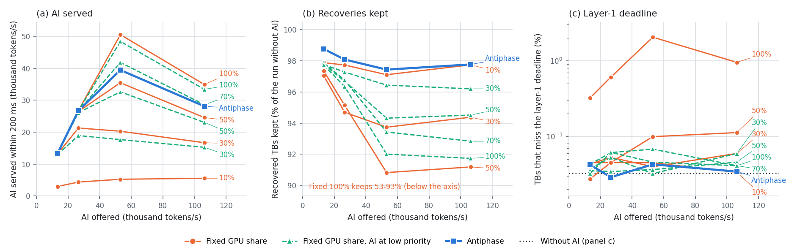

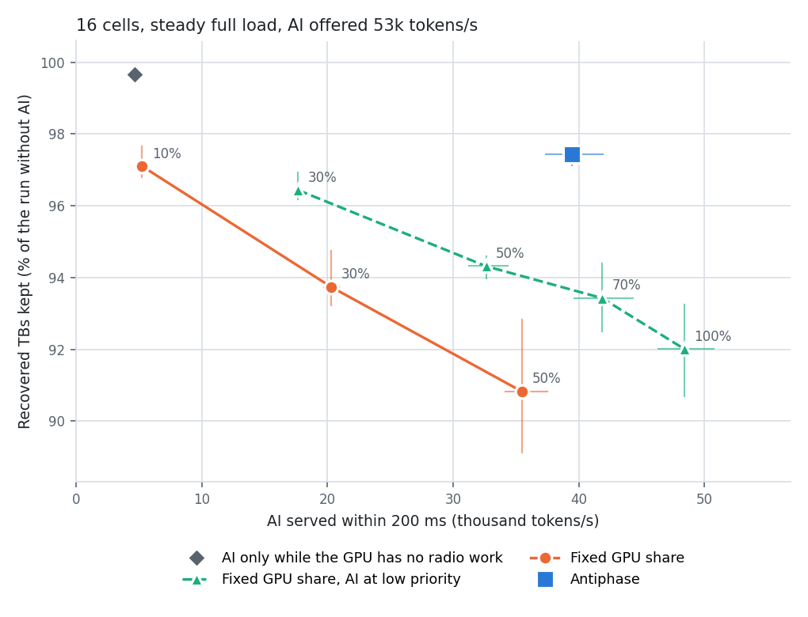

- **L1 마감.** Antiphase의 L1 놓침은 모든 AI 부하에서 0.03–0.04%로 AI 없는 실행(0.033%)과 같다. 우선순위 없는 고정 50%는 0.10–0.11%, 보호 없음은 0.3–2.0%다(기존 수신기 완료 p99.9 5.2 ms). 낮은 우선순위를 쓰는 방식은 0.03–0.07%다.
- **AI 처리량.** 제공량 13k, 27k에서 Antiphase는 모든 요청을 처리한다. 53k에서 39.5k를 처리하고 복구 97.4%를 유지한다. 같은 복구 수준의 고정 10%(5.2k)의 7.6배, 낮은 우선순위 + 30%(17.7k)의 2.2배다.
- **같은 AI 처리량.** 낮은 우선순위 + 70%는 41.9k를 처리하고 복구를 6.6% 잃는다. Antiphase는 2.6%를 잃는다(2.5배 적음).
- **과부하(106k).** 모든 방식의 처리량이 줄어든다. 입장 제어가 짧은 요청을 주로 받아 token당 GPU 시간이 늘기 때문이다. Antiphase 28.1k에 97.8%, 낮은 우선순위 + 70% 28.6k에 92.8%.
- 시드 범위(53k 제공): Antiphase AI 37.4–41.9k, 복구 97.1–97.6%. 고정 10% 5.1–5.5k, 96.8–97.7%. 낮은 우선순위 + 30% 17.6–17.8k, 96.2–96.9%. 낮은 우선순위 + 70% 39.7–44.3k, 92.5–94.4%.

#### 6.14.2 부하 변화

**전 부하와 절반 부하의 교대**

2초마다 "모든 셀 활성"과 "셀마다 확률 0.5로 활성"이 교대한다. 16셀, 20초 실행, 시드 3.

| 방식 | AI 처리량 (시드 범위) | 복구 유지율 (시드 범위) | L1 놓침 |
|---|---|---|---|
| **Antiphase (v13 규칙)** | **46.2k** (45.2–48.0k) | **98.8%** (98.3–99.2%) | 0.03% |
| 고정 10% | 5.8k (5.7–5.9k) | 98.6% (98.5–98.6%) | 0.03% |
| 고정 30% | 22.6k (21.9–23.2k) | 96.0% (95.8–96.3%) | 0.03% |
| 부하 따라 10/50% | 23.6k (23.0–24.3k) | 97.7% (97.6–97.8%) | 0.02% |
| 부하 따라 10/50%, 1초 지연 | 20.0k (19.8–20.4k) | 96.1% (95.7–96.5%) | 0.04% |
| 낮은 우선순위 + 30% | 20.9k (20.0–21.5k) | 97.8% (97.4–98.0%) | 0.02% |
| 낮은 우선순위 + 50% | 37.0k (35.6–38.1k) | 96.5% (96.3–96.7%) | 0.03% |
| 낮은 우선순위 + 70% | 46.5k (45.2–48.0k) | 95.4% (95.0–95.7%) | 0.03% |
| 낮은 우선순위 + 부하 따라 30/70% | 34.5k (33.9–34.9k) | 97.5% (97.3–97.7%) | 0.02% |
| 낮은 우선순위 + 부하 따라 30/70%, 1초 지연 | 32.1k (31.2–32.9k) | 96.5% (96.4–96.6%) | 0.02% |

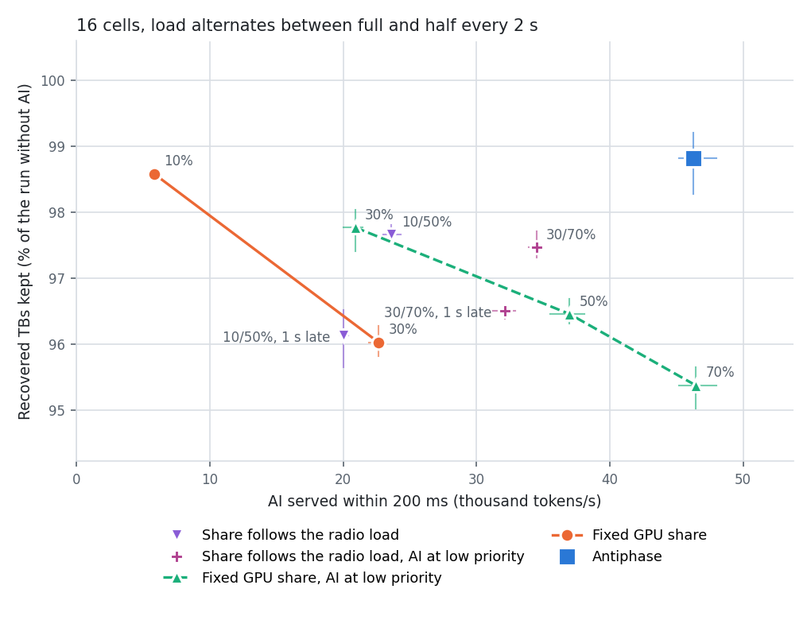

- 고정 10%의 8.0배(복구 수준 같음), 부하 따라 비율의 2.0배(1초 지연 시 2.3배), 낮은 우선순위 + 부하 따라 비율의 1.34배(1초 지연 시 1.44배)다. 부하 따라 비율 계열 네 가지와의 비교에서 Antiphase의 복구 유지율이 1.1–2.7%p 높다.
- 낮은 우선순위 + 70%는 AI 처리량이 같고(46.5k) 복구를 4.6% 잃는다. Antiphase는 1.2%를 잃는다(3.8배 적음).

교대 간격을 바꾼 결과(0.2초와 5초는 시드 2)다. 칸은 "AI 처리량 / 복구 유지율"이다.

| 교대 간격 | Antiphase (v13 규칙) | 고정 10% | 부하 따라 10/50% (1초 지연) | 낮은 우선순위 + 부하 따라 30/70% (1초 지연) | 낮은 우선순위 + 70% |
|---|---|---|---|---|---|
| 0.2초 | 48.4k / 98.7% | 5.7k / 98.7% | 21.7k / 96.8% (19.9k / 95.0%) | 35.9k / 97.2% (34.5k / 96.1%) | 47.2k / 95.5% |
| 2초 | 46.2k / 98.8% | 5.8k / 98.6% | 23.6k / 97.7% (20.0k / 96.1%) | 34.5k / 97.5% (32.1k / 96.5%) | 46.5k / 95.4% |
| 5초 | 46.2k / 98.6% | 5.7k / 98.8% | 23.9k / 98.0% (21.7k / 97.9%) | 34.3k / 97.6% (32.3k / 97.3%) | 46.2k / 94.7% |

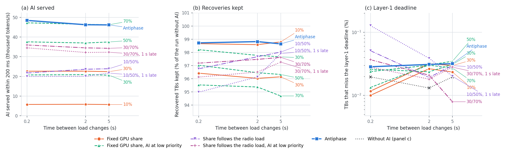

0.2초 교대에서 부하 따라 10/50%의 L1 놓침은 0.05%, 1초 지연 시 0.13%다. Antiphase는 0.03%다.

**무작위 계단 부하**

활성 셀 비율이 25 / 50 / 75 / 100% 사이를 0.5–1.5초 간격의 무작위 시점에 바뀐다. 16셀, 40초 실행, 시드 2. 칸은 "AI 처리량 / 복구 유지율"이다.

| 방식 | 전체 | 부하 25% 구간 | 부하 50% 구간 | 부하 75% 구간 | 부하 100% 구간 |
|---|---|---|---|---|---|
| **Antiphase (v13 규칙)** | **48.6k / 99.3%** | 50.6k / 100% | 52.3k / 99.9% | 48.3k / 99.3% | 41.6k / 99.0% |
| 고정 10% | 5.9k / 99.3% | 6.0k / 100% | 6.2k / 99.9% | 6.0k / 99.6% | 5.5k / 98.5% |
| 부하 따라 10/30/50% | 29.1k / 98.2% | 44.9k / 99.8% | 43.9k / 99.3% | 24.6k / 98.6% | 3.6k / 96.9% |
| 낮은 우선순위 + 30% | 21.7k / 98.8% | 25.1k / 99.9% | 23.6k / 99.9% | 20.7k / 99.1% | 18.1k / 97.8% |
| 낮은 우선순위 + 50% | 38.9k / 97.7% | 43.0k / 100% | 42.0k / 99.9% | 37.7k / 98.8% | 33.3k / 94.7% |
| 낮은 우선순위 + 70% | 48.0k / 97.2% | 49.7k / 99.9% | 51.1k / 100% | 47.1k / 98.1% | 43.3k / 93.9% |
| 낮은 우선순위 + 부하 따라 30/50/70% | 40.3k / 98.5% | 49.9k / 100% | 50.9k / 99.9% | 39.1k / 98.9% | 20.2k / 96.9% |
| 위와 같음, 1초 지연 | 39.5k / 97.2% | 40.9k / 100% | 39.7k / 100% | 38.9k / 98.4% | 38.3k / 93.7% |

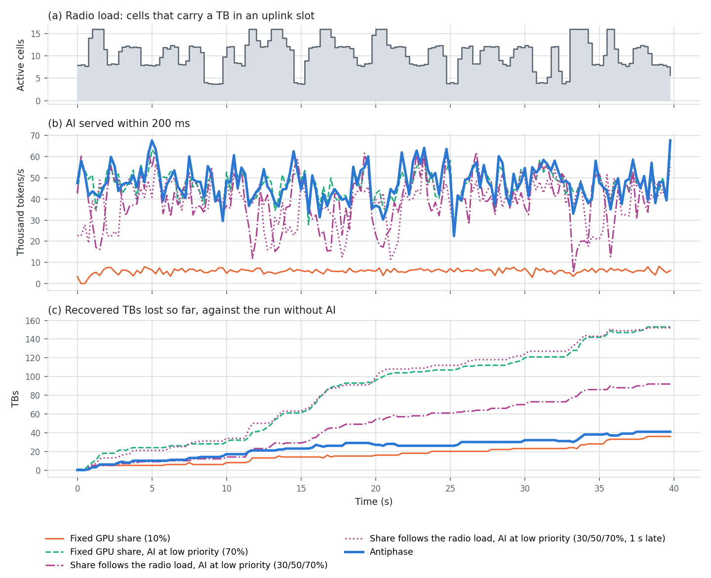

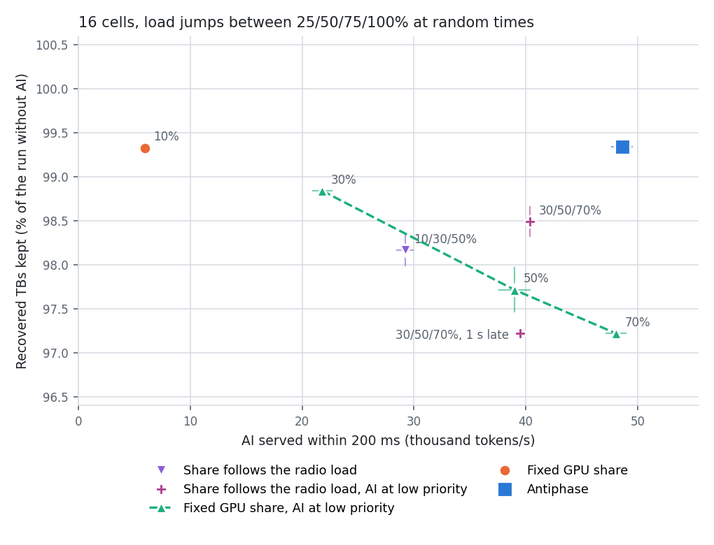

- Antiphase는 AI 처리량과 복구 유지율이 모두 가장 높다(복구는 고정 10%와 같음).
- 차이는 전 부하 구간에서 생긴다. Antiphase는 그 구간에서 41.6k를 처리하고 99.0%를 유지한다. 부하 따라 비율은 낮은 비율로 내려가 20.2k를 처리하고, 고정 70%는 43.3k를 처리하지만 복구가 93.9%다.
- 부하를 1초 늦게 알면 전 부하 구간에 높은 비율이 남아 복구가 93.7%다.
- L1 놓침은 모든 방식이 0.004–0.03%다(AI 없음 0.005%).

**버스트**

칸은 "AI 처리량 / 복구 유지율"이다. 시드 2.

| 조건 | Antiphase (v13 규칙) | 고정 10% | 낮은 우선순위 + 30% | 낮은 우선순위 + 70% | 낮은 우선순위 + 부하 따라 30/70% (1초 지연) |
|---|---|---|---|---|---|
| AI 요청 버스트 (도착 간격 변동계수 4), 16셀 전 부하 | 26.8k / 98.3% | 3.7k / 98.0% | 12.7k / 97.6% | 27.6k / 95.2% | – |
| 셀 버스트 20 ms, 16셀 | 52.4k / 99.6% | 6.1k / 100% | 23.7k / 99.6% | 51.1k / 99.3% | 51.1k / 99.1% (49.8k / 99.5%) |
| 셀 버스트 2초, 16셀 | 51.6k / 99.3% | 6.1k / 99.7% | 23.2k / 99.0% | 50.4k / 98.2% | 45.6k / 98.4% (45.0k / 98.4%) |
| 셀 버스트 20 ms, 32셀 | 39.9k / 98.3% | 5.4k / 99.0% | 17.4k / 98.1% | 40.9k / 95.9% | 19.2k / 97.5% (18.6k / 97.9%) |
| 셀 버스트 2초, 32셀 | 40.1k / 97.6% | 5.5k / 98.6% | 18.2k / 98.2% | 41.9k / 95.7% | 22.3k / 97.3% (22.3k / 97.6%) |

- 셀 버스트는 각 셀이 독립적으로 켜지고 꺼지는 조건이다(평균 절반 부하, 평균 연속 활성 20 ms 또는 2초).
- AI 요청 버스트에서 Antiphase는 고정 10%의 7.2배, 낮은 우선순위 + 30%의 2.1배다. L1 놓침 0.03%.
- 16셀 셀 버스트는 NRx 수요가 전 부하의 절반이다. 낮은 우선순위 + 70%와의 차이가 작다(AI 처리량 +2.4–2.5%, 복구 +0.3–1.1%p).
- 셀 버스트의 L1 놓침은 AI 없이도 높다. 16셀 2초 버스트 0.17%, 32셀 20 ms 버스트 0.11%, 32셀 2초 버스트 0.83%(GPU 하나에 6–8셀이 수 초 동안 활성). 모든 방식이 AI 없는 실행과 같은 수준이거나 그보다 높고 Antiphase가 낮지 않다. 이 조건으로 L1을 비교하지 않는다.

#### 6.14.3 NRx 수요 sweep

16셀 전 부하, AI 53k 제공. 약한 셀 수를 0 / 2 / 4 / 6 / 8개로 늘렸다. 시드 2(4개는 시드 3). 칸은 "AI 처리량 / 복구 유지율"이다.

| 약한 셀 | AI 없이 NRx 실행 (TB/s) | AI 없이 복구 (TB/s) | Antiphase: AI / 복구 (TB/s) / 유지율 | 고정 10% | 고정 30% | 낮은 우선순위 + 30% | 낮은 우선순위 + 50% | 낮은 우선순위 + 70% |
|---|---|---|---|---|---|---|---|---|
| 0 | 0 | 0 | 53.9k / – / – | 6.0k | – | 28.4k | – | 53.4k |
| 2 | 278 | 125 | 51.1k / 124 / 99.0% | 5.5k / 98.8% | 23.2k / 97.3% | 21.4k / 98.1% | 38.9k / 97.7% | 48.5k / 97.8% |
| 4 | 459 | 202 | 39.5k / 196 / 97.4% | 5.2k / 97.1% | 20.3k / 93.7% | 17.7k / 96.4% | 32.6k / 94.3% | 41.9k / 93.4% |
| 6 | 673 | 282 | 25.9k / 276 / 97.8% | 4.8k / 98.3% | 16.6k / 95.5% | 14.0k / 96.8% | 24.8k / 95.0% | 32.1k / 94.8% |
| 8 | 863 | 366 | 14.6k / 355 / 96.9% | 4.4k / 97.6% | 14.4k / 90.7% | 11.3k / 95.4% | 19.2k / 92.2% | 25.4k / 89.3% |

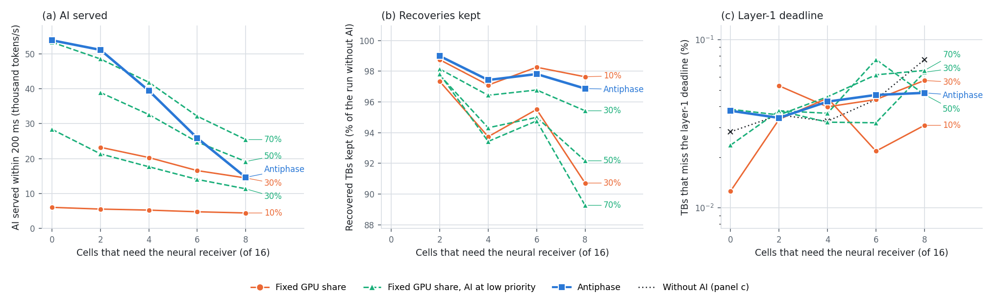

- **NRx 처리량.** Antiphase에서 복구는 초당 124 → 196 → 276 → 355 TB로 수요에 따라 증가하고, 모든 지점에서 AI 없는 실행의 96.9–99.0%다.
- **복구 마감.** 실행한 NRx 가운데 복구 마감 안에 끝난 비율은 99.9–100%다.
- **AI의 양보.** NRx 수요가 0이면 Antiphase는 제공된 AI를 모두 처리한다(53.9k). 수요가 늘면 AI 처리량을 줄인다(51.1k → 14.6k). 고정 방식은 줄이지 못하고 복구를 잃는다. 낮은 우선순위 + 70%는 약한 셀 8개에서 복구를 10.7% 잃는다.
- 약한 셀 8개에서 Antiphase는 고정 10%의 3.3배다. 낮은 우선순위 + 30%보다 AI 처리량이 1.3배이고 복구 유지율이 1.5%p 높다.
- L1 놓침: Antiphase 0.03–0.05%, AI 없는 실행 0.03–0.08%.

#### 6.14.4 규모

**셀 수**

GPU 4장, AI 53k 제공. 같은 무선 부하를 더 많은 셀에 나눴다. 칸은 "AI 처리량 / 복구 유지율 / L1 놓침"이다. 시드 2(16셀은 시드 3).

| 셀 | AI 없음 L1 놓침 | Antiphase (v13 규칙) | 고정 10% | 낮은 우선순위 + 30% | 낮은 우선순위 + 50% | 낮은 우선순위 + 70% |
|---|---|---|---|---|---|---|
| 16 (전 부하) | 0.03% | 39.5k / 97.4% / 0.04% | 5.2k / 97.1% / 0.05% | 17.7k / 96.4% / 0.03% | 32.6k / 94.3% / 0.04% | 41.9k / 93.4% / 0.05% |
| 32 (절반 부하) | 0.03% | 38.0k / 98.6% / 0.06% | 5.1k / 99.2% / 0.06% | 16.9k / 99.0% / 0.05% | 31.1k / 97.3% / 0.05% | 40.0k / 96.3% / 0.06% |
| 48 (1/3 부하) | 0.09% | 37.7k / 98.3% / 0.14% | 5.1k / 99.3% / 0.12% | 16.8k / 98.6% / 0.12% | 31.1k / 97.0% / 0.11% | 39.4k / 96.5% / 0.09% |
| 20 (전 부하, GPU당 5셀) | 0.03% | 27.2k / 96.1% / 0.03% | 5.1k / 99.3% / 0.02% | 17.0k / 96.1% / 0.04% | 31.8k / 94.4% / 0.05% | 40.5k / 94.2% / 0.04% |

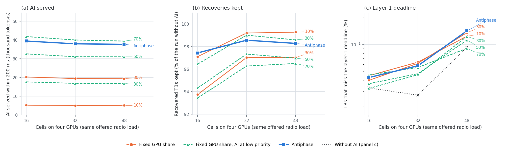

- 16, 32, 48셀에서 Antiphase의 AI 처리량은 37.7–39.5k, 복구 유지율은 97.4–98.6%다. 고정 10%의 7.4–7.6배, 낮은 우선순위 + 30%의 2.2배다.
- 48셀은 한 슬롯에 GPU당 최대 12셀이 활성이다. AI 없이 L1 놓침이 0.09%이고 모든 방식이 0.09–0.14%다. Antiphase가 낮지 않다.
- 20셀 전 부하에서 Antiphase는 기존 수신기 옆에 128 token 단위만 허용한다. L1 놓침 0.034%(AI 없음 0.025%). 우선순위 없는 고정 30%와 50%는 0.10%와 0.23%, 낮은 우선순위·한도 없음은 0.09%다. AI 처리량은 같은 복구(96.1%)의 낮은 우선순위 + 30%의 1.6배다. 고정 10%는 복구를 99.3% 유지하며, Antiphase는 그보다 3.2%p 낮다.
- 프로토타입은 셀마다 프로세스 하나를 쓰고 MPS는 GPU당 약 15개 프로세스까지 받는다. 48셀이 실행 가능한 최대다.

**GPU 수**

GPU당 4셀, 전 부하, 시드 2(4장은 시드 3). 칸은 "AI 처리량 / 복구 유지율"이다.

| GPU (셀) | AI 없이 복구 (TB/s) | Antiphase (v13 규칙) | 고정 10% | 낮은 우선순위 + 30% | 낮은 우선순위 + 50% | 낮은 우선순위 + 70% |
|---|---|---|---|---|---|---|
| 1 (4) | 53 | 8.8k / 100% | 1.1k / 100% | 3.7k / 100% | 6.9k / 100.8% | 8.4k / 100% |
| 2 (8) | 110 | 19.4k / 98.5% | 2.3k / 98.7% | 8.1k / 99.0% | 15.4k / 98.6% | 19.4k / 96.9% |
| 4 (16) | 202 | 39.5k / 97.4% | 5.2k / 97.1% | 17.7k / 96.4% | 32.6k / 94.3% | 41.9k / 93.4% |

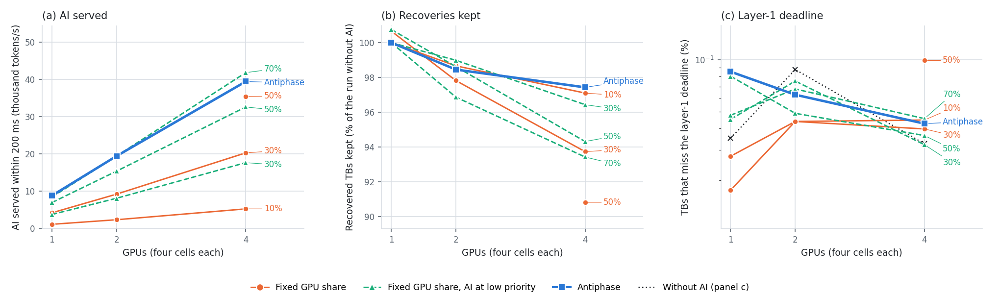

- Antiphase의 AI 처리량은 GPU 수에 비례한다(GPU당 8.8k, 9.7k, 9.9k). 복구도 53, 110, 202 TB/s로 비례한다.
- 빈 NRx 여유 규칙의 효과는 NRx가 여러 개일 때 생긴다. GPU 1장(NRx 1개)에서는 NRx가 길어져도 잃는 복구가 같아 모든 방식이 100%이고, Antiphase와 낮은 우선순위 + 70%가 같다. GPU 2장에서 +1.6%p, 4장에서 +4.0%p다.
- GPU 1장에서 Antiphase의 L1 놓침은 0.085%(p99.9 3.98 ms)로 AI 없는 실행(0.035%)보다 높다. 시드 2, 10초 실행의 값이다.

#### 6.14.5 규칙별 기여와 복구를 잃는 원인

16셀 전 부하, AI 53k 제공.

규칙을 하나씩 더한 결과(시드 3):

| 구성 | AI 처리량 | 복구 유지율 | L1 놓침 |
|---|---|---|---|
| 낮은 우선순위만 (허락 없음) | 48.4k | 92.0% | 0.07% |
| + 조각 허락, NRx 옆에서 AI 금지 | 25.3k | 97.4% | 0.04% |
| + 빈 NRx 2개 이상이면 NRx 옆 허용 | 41.3k | 96.5% | 0.05% |
| **+ 빈 NRx 3개 이상이면 NRx 옆 허용 (v13 규칙)** | **39.5k** | **97.4%** | 0.04% |
| Antiphase + 비율 한도 70% | 34.9k | 96.2% | 0.03% |
| v12 규칙 (우선순위 같음, 한도 70%, 마감 조건만) | 22.8k | 97.1% | 0.03% |

잃은 복구의 원인(시드 1, 2 합계, AI 없는 실행과 TB 단위 대조):

| 방식 | 잃은 복구 | 빈 NRx가 없어 시작 못 함 | NRx가 복구 마감 뒤에 끝남 | NRx 실행 시간 중앙값 |
|---|---|---|---|---|
| AI 없음 | – | – | – | 6.3 ms |
| Antiphase (v13 규칙) | 120 | 119 | 0 | 7.0 ms |
| 고정 10% | 128 | 123 | 3 | 6.8 ms |
| 고정 30% | 256 | 249 | 6 | 7.5 ms |
| 고정 50% | 373 | 309 | 61 | 8.2 ms |
| 보호 없음 (고정 100%) | 1,849 | 391 | 1,452 | 9.1 ms |
| 낮은 우선순위 + 30% | 153 | 150 | 3 | 7.0 ms |
| 낮은 우선순위 + 70% | 278 | 272 | 3 | 7.6 ms |
| 낮은 우선순위, 한도 없음 | 337 | 313 | 23 | 8.0 ms |

- 낮은 우선순위만으로는 AI 처리량이 가장 많고 복구를 8.0% 잃는다.
- NRx 옆에서 AI를 금지하면 복구는 유지되고 AI 처리량이 절반이 된다.
- 빈 NRx 여유 규칙(R=3)은 복구를 유지하면서 AI 처리량을 25.3k에서 39.5k로 올린다. NRx 실행 시간의 21%는 NRx 하나만 실행 중인 시간이고, 그 시간에는 AI가 옆에서 실행돼도 잃는 복구가 없다.
- 비율 한도 70%를 더하면 AI 처리량만 줄어든다.
- 보호 없음을 제외하면 잃은 복구의 83–99%가 "빈 NRx가 없어 시작 못 함"이다.
- Antiphase의 NRx 실행 시간 중앙값(7.0 ms)은 낮은 우선순위 + 30%와 같고 AI 처리량은 2.2배다.

#### 6.14.6 AI 조각 길이

16셀 전 부하, 시드 1과 2, 같은 job에서 측정. 칸은 "AI 처리량 / 복구 유지율"이다.

| 조각 한도 | 빈 NRx 여유 3 | 빈 NRx 여유 2 |
|---|---|---|
| 4.0 ms (sweep에 사용) | 40.2k / 98.0% | 41.2k / 97.7% |
| 2.5 ms | 40.1k / 98.8% | 41.7k / 98.2% |
| 1.5 ms | 36.0k / 98.8% | 37.7k / 98.2% |

- 낮은 우선순위의 AI 조각은 무선 작업 옆에서 한도보다 오래 걸린다(실제 시간 중앙값 2.3 ms, p90 4.6 ms, p99 8.7 ms). AI를 멈춰야 하는 NRx 시간의 42%에서 이전에 허락한 조각이 아직 실행 중이다.
- 조각을 2.5 ms로 줄이면 AI 처리량은 같고 복구 유지율이 0.5–0.8%p 오른다. 이 차이는 실행 간 변동(같은 시드와 설정이 job에 따라 97.4%와 98.0%)과 같은 크기다. sweep은 4.0 ms로 실행했다.
- 1.5 ms는 1,024 token 단위를 쓸 수 없어 AI 처리량이 10% 준다.

---

## 7. 유리하지 않은 결과와 철회한 주장

### 7.1 Antiphase가 우위가 아닌 조건과 지표

| 조건 또는 지표 | 결과 | 원인 |
|---|---|---|
| AI 처리량만 비교 | 낮은 우선순위·한도 없음이 49.0k로 Antiphase(34.1k)보다 44% 많음. 낮은 우선순위 + 70%는 세 부하 조건에서 9–24% 많음 | 그 방식들의 복구 유지율은 93.7–97.3%. Antiphase의 우위는 복구를 유지하는 조건에서 성립 |
| UL goodput | 복구 99.9%와 93.7%의 차이가 2-UE 셀 goodput 0.36%p. NRx 수요가 큰 조건에서 0.5–0.6%p | 잃은 복구 1% = goodput 약 0.06%p. 복구를 잃는 비용은 사용자 처리량으로 보면 작음 |
| 시간 제한이 없는 AI 작업 | 다섯 종류를 함께 돌릴 때 filler 5.4k tokens/s. 낮은 우선순위 + 70%는 12.8k, 한도 없음은 18.6k | NRx가 도는 GPU의 AI를 멈추므로 AI가 쓰는 GPU 시간이 적음 |
| chat과 3B 프롬프트 | 다섯 종류를 함께 돌릴 때 chat 출력 토큰은 한도 없는 방식의 77%, 3B 프롬프트는 80%. 요청의 10–11%를 받지 않음 | NRx가 도는 6.4 ms 동안 그 GPU의 AI가 멈춤 |
| GPU 1장의 L1 놓침 | 0.039%와 0.059%(시드 5). AI 없는 실행은 0.018%와 0.038%. 고정 10%는 0.072%와 0.058% | GPU 1장에서는 AI를 넣은 방식 대부분이 AI 없는 실행보다 높음. 기존 수신기 옆의 단위를 줄여도 같음 |
| GPU 1장, 약한 셀 2개 | 복구 유지율 97.7%. 고정 10%(97.5%), 낮은 우선순위 + 30%(96.8%)와 같음 | NRx 하나가 수요를 감당하지 못하는 조건(AI 없이도 후보의 31%가 버려짐) |
| NRx 수요가 큰 조건 (16셀·약한 셀 8개, 8셀·약한 셀 4개) | AI 처리량 11.8k, 6.9k. 낮은 우선순위 + 70%는 26.3k, 14.2k (복구 88–89%) | NRx가 거의 항상 실행 중이어서 AI가 쓸 시간이 38–43% |
| 닫힌 루프 link adaptation, 목표 10% | Antiphase 11.4k에 goodput 0.0%. 낮은 우선순위 + 30%는 11.5k에 −0.3%, + 70%는 25.4k에 −0.7%, 한도 없음은 30.1k에 −1.0% | outer loop가 MCS를 올려 NRx 수요가 두 배가 된다(후보가 난 슬롯 28.7%). NRx가 도는 시간이 길어 Antiphase의 AI 시간이 줄고, goodput 1%를 내주는 방식이 AI를 2.6배 처리 (6.13절) |
| 닫힌 루프에서 복구를 잃는 비용 | 목표 10%에서 모든 방식의 goodput 손실이 1.0% 이하. 2% 이상은 목표 1–3%에서만 나오고, 3% 이상은 그 가운데 NRx 수요가 용량에 가까운 조건(2-UE 셀 8개, GPU 2장)에서만 나옴 | outer loop가 평균 MCS를 최대 0.64단계 내려 재전송률을 목표에 맞춤. 한 단계가 내려가지 않음 (6.13절) |
| 미래를 아는 스케줄과의 거리 | 전 부하에서 상한의 70%. NRx 수요가 큰 조건에서 43–51% | 어느 NRx가 두 슬롯 뒤에 필요한지 미리 알지 못해 NRx가 도는 동안 AI를 모두 멈춤 (6.12절) |
| link adaptation | 상관 낮은 채널에서는 Es/No 7개 중 3–4개에서만 MCS가 한 단계 오름(+5.1–5.2%). UMi에서는 +1.6–2.1%이고 MCS 상승이 확인되지 않음. 상관 높은 채널에서는 +11.8% | 복구 경로가 오류율 10% 지점을 낮추는 폭이 채널마다 다름(0.4–0.5 dB, 0.2–1.5 dB, 2.5–4.0 dB). UMi는 NRx가 복구하는 실패가 적음 |
| p99 지연 | 복구 경로가 없을 때 12.0 ms, 있을 때 17.0 ms | 복구에 실패한 TB의 재전송이 5 ms 늦음 |
| 48셀·1/3 부하와 20셀의 L1 놓침 | 48셀: Antiphase 0.130%. AI 없음 0.090%, 고정 10% 0.125%, 낮은 우선순위 + 30% 0.112%, + 70% 0.117%. 20셀: Antiphase 0.044%, AI 없음 0.032% (시드 4) | 48셀은 한 슬롯에 GPU 하나에서 최대 12셀이 활성. AI를 넣은 모든 방식이 AI 없는 실행보다 높고 Antiphase가 그 가운데 가장 높음 (6.11.3절) |
| 과부하(AI 106k 제공)와 AI 요청 버스트의 AI 처리량 | 24.3k, 23.3k. 낮은 우선순위 + 70%는 27.9k, 27.4k (복구 93.6%, 95.9%) | 6.11.1–6.11.2절 |
| 셀 버스트의 L1 놓침 | 16셀 2초 버스트 0.311%(AI 없음 0.249%), 32셀 2초 버스트 1.561%(AI 없음 1.107%) | 한 GPU의 여러 셀이 수 초 동안 함께 켜지는 과부하. AI를 넣은 모든 방식이 AI 없는 실행보다 높음 (6.11.5절) |
| 16셀 셀 버스트의 AI 처리량 | 48.0k–49.6k. 낮은 우선순위 + 70%는 50.4k–51.1k에 복구 98.6–99.5% | 평균 부하가 절반이어서 NRx 수요가 적음. 낮은 우선순위만으로 복구를 거의 잃지 않음 |

### 7.2 철회한 주장

| 이전 주장 | 철회 이유 | 현재 값 |
|---|---|---|
| NRx가 기존 수신기 실패의 62%를 복호한다 (단일 UE) | cuPHY LDPC 10회 기준. 20회로 맞추면 cuPHY가 스스로 96%를 복호 | 같은 횟수에서 11–12% (넓은 SNR 구간) |
| NVlabs 실시간 모델이 실패의 25–35%를 복호한다 (상관 낮음) | NVlabs 평가의 LDPC가 20회, cuPHY가 10회 | 같은 횟수에서 2% |
| 2026-10-01 이전의 "복구한 TB" 수치 전부 | NRx 입력(LS 추정값의 배열 순서와 배율)이 모델의 학습 형식과 달랐음 | 교정 후 NRx 복호 134 → 211 (TB 256개) |
| 고정 10%의 5.0배, 부하 따라 비율의 1.17배, 27.4k @ 98.6% (v12) | 낮은 우선순위를 쓰지 않은 기준선과의 비교 | 6.5절 |
| MPS 낮은 우선순위는 효과가 없다 | 작은 NRx 조건의 결과 | 큰 NRx 조건에서 고정 30%는 복구 95.1%, 낮은 우선순위 + 30%는 98.8% |
| 빈 NRx 여유 규칙(lane 여유 3)이 복구를 유지한다: 39.5k @ 97.4% (v13) | AI 조각이 멈추지 못해, AI가 꺼져 있어야 할 시간의 43%에서 AI가 남아 있었음 | 조각 중단 + NRx 옆 금지 + 큰 단위는 기존 수신기 옆 금지: 34.1k @ 99.9% |
| v13의 배수(고정 10%의 7.6–8.2배, 낮은 우선순위 + 30%의 2.2배, 부하 따라 비율의 1.7–2.0배) | 128 슬롯 반복이 기준선의 복구 유지율을 약 1%p 낮춤. 낮은 우선순위 + 30%는 512 슬롯 반복에서 복구 98.8–99.5%를 유지함 | 512 슬롯 반복, 시드 5: 6.4–7.5배, 1.9–2.0배, 1.5–1.7배 |
| GPU 1장에서는 지킬 것이 없다 (모든 방식이 복구 100%) | 128 슬롯 반복, 약한 셀 1개의 결과 | 512 슬롯 반복(시드 5)에서 낮은 우선순위 + 70%는 9.3k에 복구 92.3%, Antiphase는 8.5k에 99.8% |
| 기존 수신기 옆에서 세 단위 크기를 모두 허용한다 (v13, v14 초기) | 512 슬롯 반복의 전 부하 여섯 조건에서 L1 놓침이 AI 없는 실행보다 0.01–0.05%p 높았음(0.035–0.091%). 한도 측정에서 가장 큰 단위의 p99.9가 4.05 ms로 마감을 넘었는데 허용했음 | 가장 큰 단위 금지: 0.036% (AI 없음 0.032%), AI 처리량 −9% |
| "NRx가 다음 후보를 받을 수 있는 시각까지의 여유를 AI에 쓰면 손실 없이 AI가 는다" (v14 초기 가설) | 모델과 실측 모두 복구 4–5%p 손실 | 규칙에서 제외 |
| "rate control이 복구 경로를 믿고 MCS를 올린 상태에서 복구를 6–10% 잃으면 MCS가 한 단계 내려가 goodput이 약 10% 준다" (2026-10-04의 예상) | outer loop를 넣어 쟀다. outer loop는 이웃한 단계에 머무는 시간의 비를 바꾸고, 평균 MCS의 변화는 최대 0.64단계다 | 목표 10%에서 1.0% 이하. 목표 1%에서 0.0–8.2%이고 가장 큰 값은 2-UE 셀 8개, 낮은 우선순위만 쓴 방식 (6.13절) |

### 7.3 쓰지 않는 문장

| 문장 | 이유 |
|---|---|
| "YinYangRAN, SMEC, Orion보다 낫다" | 그 방식을 이 저장소의 코드에 구현해 비교했고 원본 시스템을 실행하지 않았다. 추정기 방식은 pre-print의 설계를 재구성한 것이다 |
| "L1 마감을 보장한다" | GPU 2장과 4장에서 L1 놓침이 AI 없는 실행과 같은 수준(0.005–0.058% 대 0.008–0.059%)이라는 뜻이다. 프로토타입의 측정값이고 한도가 아니다. GPU 1장에서는 더 높다 |
| "복구 경로가 AI 방식에 따라 사용자 처리량을 크게 바꾼다" | 방식 간 goodput 차이는 고정 MCS에서 0.4%p 이하, 닫힌 루프의 목표 10%에서 1.0% 이하다. 2–8%의 차이는 목표가 1–3%인 조건의 값이고, 3% 이상은 NRx 수요가 용량에 가까울 때다 |
| "복구를 잃으면 MCS가 한 단계 내려간다" | 측정한 평균 MCS의 변화는 최대 0.64단계다 (6.13절) |
| "복구 경로가 있으면 더 높은 MCS를 쓴다" | 고정 MCS의 계산에서는 시험한 Es/No의 절반에서 한 단계 오른다. 닫힌 루프의 측정(평균 MCS +0.9–2.1단계)은 상관 높은 채널의 Es/No 한 점이다 |
| "NRx를 쓰는 연구가 없다", "최초" | NRx 자체는 여러 연구가 쓴다. 조사는 전수 조사가 아니다 |
| "모델이 규칙을 정한다" | 모델은 규칙의 순서를 맞히지만 금지와 lane 여유 3의 차이는 모델 오차 안에 있다. 기본값은 실측으로 정했다 |

---

## 8. 한계

1. **입력.** 슬롯은 NVlabs 공개 설정의 합성 채널로 미리 생성했다. RU와 실측 IQ는 사용하지 않았다. 셀마다 슬롯 512개(1.28초)를 반복한다.
2. **L2.** 복구 마감(11.5 ms)은 TDD 패턴과 PUSCH 준비 시간에서 계산했다. UL goodput과 지연(6.9절)은 TB별 기록에 재전송 일정을 적용한 계산이고 L2 스택과 실제 HARQ로 검증하지 않았다. link adaptation(6.9절)은 세 채널의 고정 Es/No에서 MCS별로 따로 잰 오류율의 계산이다(점마다 TB 200–600개). outer loop를 넣은 측정(6.13절)은 상관 높은 채널의 Es/No 한 점, outer loop 한 가지 형태(계단 0.25와 0.5)이고 채널 통계가 고정이다. 재전송은 계산이며 HARQ 결합을 넣지 않았다. 채널이 변하는 조건의 rate control을 실행하지 않았다.
3. **비교 대상.** 모두 이 저장소에 구현한 방식이다. 추정기 방식은 YinYangRAN pre-print의 설계를 재구성한 것이고, 신뢰도의 정의·추정기의 구조·학습 자료가 원문과 다르다. look-ahead가 있는 변형(YYR-Full)은 구현하지 않았다.
4. **규모.** 큰 NRx는 전 부하에서 GPU당 4–5셀이 한계다. v14의 규칙은 4–48셀, GPU 1–4장에서 측정했다(20셀, 32셀, 48셀은 시드 4, 6.11절). 48셀에서는 AI를 넣은 모든 방식의 L1 놓침이 AI 없는 실행보다 높다.
5. **통계.** 대표 조건과 GPU 1장은 시드 5, 20–48셀은 시드 4, 그 밖은 시드 2–3이다. 실행은 10–40초다. 같은 설정의 복구 유지율은 job에 따라 약 0.5%p 변동한다. L1 놓침은 실행당 수십 TB의 사건이고 시드에 따라 0.02–0.06%로 달라진다. 0.02%p 이하의 차이는 확정하지 못한다.
6. **수동 설정.** 기존 수신기 옆에서 허용하는 단위 등급(한도 1.2 ms 이하)은 GPU당 4셀의 한도 측정으로 정했고, 활성 셀 수와 무관하게 쓴다(6.7절). NRx 시간 한도(7.6 ms)는 한 번 잰 값이고, 20셀에서는 닫힌 형태로 다시 정했다(6.11.3절). 실패 code block 문턱 K는 채널에 따라 수동으로 정했다. lane 여유는 기본값(NRx 옆 금지)에서 조절할 필요가 없다.
7. **조각 중단.** 중단 표시 뒤에도 GPU에 올라간 단위는 끝까지 실행된다(중앙값 0.43 ms, p99 1.4 ms). AI가 꺼져 있어야 할 시간의 6%에서 AI가 남아 있다.
8. **L1 수준.** L1 놓침 0.005–0.06%는 Python 프로토타입의 값이고 AI 없는 실행에서도 같은 수준이다. GPU 1장에서는 Antiphase의 L1 놓침이 AI 없는 실행보다 0.02%p 높고(0.039%와 0.059% 대 0.018%와 0.038%), 고정 비율 방식과 같은 범위다. 원인을 없애지 못했다. 99.999% 수준의 신뢰도는 검증하지 않았다.
9. **모델.** 닫힌 형태의 입력인 c와 S의 분포는 그 방식의 실행에서 잰 것이다. 측정 없이 방식의 S를 예측하지는 않는다(AI 없는 실행의 분포에 일정한 증가를 더한 계산과 20셀의 사전 예측은 6.6.1, 6.11.3절). 도착은 1차 전이 행렬 하나로 적어, 부하가 수 초 단위로 바뀌는 조건에서 손실을 작게 본다(32셀 2초 버스트 1.4%p). 사건 모의는 금지와 lane 여유 3의 차이를 실측보다 작게 본다. NRx 1–2개에서 오차가 1.45–1.93%p로 NRx 4개(0.48%p)보다 크다.
10. **하드웨어.** A100 80GB만 사용했다.
11. **AI 작업.** 모델 4개, 작업 5종류다. 모든 모델의 가중치가 GPU에 올라가 있고(GPU당 약 10 GB), 모델 교체와 메모리 압박은 다루지 않았다. 출력 토큰은 응답당 64개까지다.

---

## 9. 결론

1. **수신기.** LDPC 반복 횟수를 맞추면 실시간용 NRx는 UE 간 상관이 중간 이상일 때만 cuPHY보다 많이 복호한다. 시험한 세 채널 모두에서 cuPHY 실패의 15–67%를 추가로 복호하는 것은 큰 모델이고, 그 실행 시간은 UL 주기의 2배 이상이다.
2. **구조.** 큰 NRx는 실패한 TB에만, L1 마감보다 늦은 복구 마감으로 실행하는 복구 경로로 쓸 수 있다. 실패 code block 수로 대상을 고르면 NRx 실행이 40–85% 줄고 복구는 5–22% 준다. 재전송 일정을 적용하면 복구 경로는 2-UE 셀의 UL goodput을 5.6% 올리고 재전송을 37% 줄인다. p99 지연은 12 ms에서 17 ms로 는다.
3. **손실 모델.** AI와 같은 GPU에서 복구를 잃는 원인은 NRx의 마감 초과가 아니다. NRx 실행이 7.5 ms를 넘으면 NRx를 두 슬롯이 아니라 세 슬롯 동안 붙잡고, 다음 실패 TB가 빈 NRx를 찾지 못한다. 이 관계를 Markov chain으로 적은 닫힌 형태는 672개 실행(NRx 1·2·4개, 4–48셀)의 손실을 평균 절대 오차 0.82%p로 맞춘다. 그 가운데 260개는 모델을 정한 뒤에 측정했다(0.61%p). 손실은 NRx 실행 시간의 증가가 여유 1.2 ms를 넘을 때 오르고, 20셀에서 NRx 시간 한도를 바꿨을 때의 손실을 실행 전에 0.0–0.7%p 안에서 예측했다.
4. **규칙.** AI를 낮은 우선순위로 실행하고 조각 단위로 허락한다. NRx가 시작한 GPU의 AI 조각은 묶음 경계에서 멈추고, 가장 큰 AI 단위는 기존 수신기가 복호 중이 아닐 때만 허락한다. 16셀 전 부하에서 34.1k tokens/s를 처리하고 복구를 AI 없는 실행과 같은 수로 유지한다(시드 5, 99.7–100.3%). L1 놓침은 0.036%로 AI 없는 실행(0.032%)과 같은 수준이다. 이 규칙에는 NRx 수에 따라 정하는 값이 없다. GPU 2장과 4장, 약한 셀 2–8개의 조건에서 복구 99.6% 이상을 유지하고, GPU 1장에서는 97.7–99.8%다. 20셀, 32셀, 48셀에서는 31.4k–33.4k에 99.5–100.0%다.
5. **비교.** 복구 98.8% 이상을 유지하는 기존 수단과 비교한 AI 처리량은 고정 비율의 6.4–7.5배, 낮은 우선순위 + 고정 30%의 1.9–2.0배, 부하를 지연 없이 아는 "부하 따라 비율"의 1.5–1.7배(낮은 우선순위를 더하면 1.09–1.19배)다. YinYangRAN의 설계를 재구성한 추정기 방식과 비교하면 전 부하에서 3.5배, 부하가 바뀌는 조건에서 1.6–1.9배이고 복구 유지율이 4.4–4.6%p 높다. 낮은 우선순위에 높은 비율(70% 이상)을 주는 방식은 AI를 9–44% 더 처리하고 복구를 2.7–6.3% 잃는다.
6. **AI 작업의 범위.** 프롬프트 처리, 토큰 생성, 임베딩, 이미지 분류를 시간 한도를 잰 단위로 나누면 같은 규칙이 그대로 적용된다. 다섯 종류를 함께 돌릴 때 복구 99.7%를 유지하면서 임베딩과 이미지 분류는 전부, 3B 프롬프트는 한도 없는 방식의 80%, chat 출력 토큰은 77%를 제때 내고, 받은 chat 응답의 92%가 모든 토큰이 제때다.
7. **link adaptation.** 복구 경로가 첫 전송 오류율 10% 지점을 낮추는 폭은 채널에 따라 다르다. 상관이 높은 채널에서 2.5–4.0 dB(7개 Es/No 중 6개에서 MCS 한 단계 상승, goodput +11.8%), 상관이 낮은 채널에서 0.4–0.5 dB(약 절반에서 한 단계, +5.2%), UMi에서 0.2–1.5 dB(+1.6–2.1%, MCS 상승은 확인되지 않음)다. 고정 Es/No의 계산이다. outer loop를 런타임에 넣은 측정(상관 높은 채널, 16 dB)에서 복구 경로는 2-UE 셀의 goodput을 목표 10%일 때 12.0%, 목표 1–3%일 때 24–31% 올린다.
8. **닫힌 루프에서 복구를 잃는 비용.** outer loop는 잃은 복구를 재전송이 아니라 낮은 MCS로 바꾼다. 재전송률은 모든 방식에서 목표와 같고, 평균 MCS가 최대 0.64단계 내려간다. 잃은 후보 1%의 비용은 목표 10%에서 goodput 0.09%, 목표 1%에서 0.5–0.8%다. 방식 간 goodput 차이는 목표 10%에서 1.0% 이하이고, 목표 1%이면서 NRx 수요가 용량에 가까운 조건에서 2–8%다(2-UE 셀 8개: 낮은 우선순위 + 30% −2.3%, + 70% −3.7%, 한도 없음 −8.2%; Antiphase −0.3%). Antiphase는 측정한 조건 모두에서 AI 없는 실행의 0.3% 안이다.
9. **상한과의 거리.** 후보 도착을 미리 아는 오프라인 스케줄과 비교하면 Antiphase는 그 AI 처리량의 70%를 처리한다(전 부하). 부하가 낮으면 78–88%, NRx 수요가 크면 43–51%다. 복구 98.8% 이상을 지키는 기존 수단은 11–37%다. 남은 차이는 어느 NRx가 두 슬롯 뒤에 필요한지 미리 알지 못하는 데서 나온다.
10. **한정.** 고정 MCS에서 복구를 잃는 비용은 사용자 처리량으로 보면 작다(여덟 조건에서 잃은 복구 1% = goodput 0.05–0.06%p). 닫힌 루프의 목표 10%에서는 Antiphase의 AI 처리량(11.4k)이 낮은 우선순위 + 30%(11.5k, goodput −0.3%)와 같고, 낮은 우선순위 + 70%는 goodput 0.7%를 내주고 2.2배를 처리한다. AI 처리량만 보면 낮은 우선순위에 높은 비율을 주는 방식이 더 많이 처리한다. GPU 1장, 20셀, 48셀, 2초 셀 버스트에서는 L1 놓침이 AI 없는 실행보다 높다. 평균 부하가 절반인 16셀 셀 버스트에서는 낮은 우선순위 + 70%와 거의 같다. 시간 제한이 없는 AI 작업은 낮은 우선순위·한도 없음이 3.4배 더 처리한다.

---

## 10. 재현 방법

```bash
cd /pscratch/sd/s/sgkim/kcj/airan_cloudlab
cp -r scripts_for_node/backstop_slot/campaigns/*.sh scripts_for_node/backstop_slot/campaigns/classes5 run_state/backstop_slot/   # 실행 위치로 복사
salloc -N 1 -C "gpu&hbm80g" -q interactive -A m5320_g -t 04:00:00 --no-shell      # job J
R="srun --jobid=J --overlap -N1 -n1 --gpus-per-node=4 --export=ALL"
C=run_state/backstop_slot

# 수신기 비교 (6.1절)
$R bash $C/ldpc_check.sh

# 추정기 학습 자료와 학습 (6.5절의 추정기 방식)
$R bash $C/v14c.sh yyrcal
python3 scripts_for_node/backstop_slot/yyr_train.py results/backstop_slot/yyr_estimator_fixed_jJ.json   J:za:16:s J:zb:16:s J:zc:16:s J:zd:16:s
python3 scripts_for_node/backstop_slot/yyr_train.py results/backstop_slot/yyr_estimator_lowprio_jJ.json J:za:16:p J:zb:16:p J:zc:16:p J:zd:16:p

# 전 부하, 2초 교대, 무작위 계단 (6.4, 6.5절): 기준선, 그다음 Antiphase. 추정기 파일 이름은 v14_headline1.sh 안에 있다
SEEDS="1 2 3 4 5" $R bash $C/v14_headline1.sh full alt steps
$R bash $C/v14_final.sh full alt steps

# 다른 규모 (6.8절): 기준선, 그다음 Antiphase와 약한 셀 2·6개
$R bash $C/v14d.sh w8 gpu1 gpu2
$R bash $C/v14_final.sh sizes

# 규칙 비교 (6.7절): 기존 수신기 옆의 단위 크기, lane 여유 2
$R bash $C/v14e.sh conv
$R bash $C/v14d.sh ringtest

# 여러 종류의 AI 작업 (6.10절): 단위 한도 측정 뒤 실행
$R bash $C/v15.sh bench
$R bash $C/v15_samejob.sh

# link adaptation (6.9절): 상관 낮은 채널, 상관 높은 채널, UMi (la_streams.sh는 GPU별로 MCS를 나눠 동시에 실행)
$R bash $C/la.sh DoubleTDLlow 5,6,7 150
$R bash $C/la_more.sh
$R bash $C/la_streams.sh DoubleTDLhigh 12,14,16,18,20,22,24 150 "0:10 13 16" "1:14 11" "2:15 12"
$R bash $C/la_streams.sh UMi 4,6,8,10,12,14 100 "1:14 12 10" "2:15 13 11" "3:16"
SUFFIX=_b $R bash $C/la_streams.sh DoubleTDLhigh 20,22 150 "0:14" "1:15"        # 목표에 가까운 두 점의 TB를 600개로
SUFFIX=_b $R bash $C/la_streams.sh UMi 8,10,12,14 100 "0:13" "1:14" "2:15" "3:16"  # UMi의 MCS 13–16을 TB 400개로

# 닫힌 루프 link adaptation (6.13절): MCS 10–16의 슬롯을 만든 뒤(생성이 끝나기 전에는 실행하지 않는다) 방식별로 실행
$R bash $C/la_cl_gen.sh high16 DoubleTDLhigh 16 768 "0:13 16" "1:14 11" "2:12 10" "3:15"
$R bash $C/la_cl_chain.sh                    # 목표 10%, 1% (시드 1–2)
$R bash $C/la_cl_chain2.sh                   # 목표 3%, 복구 경로 없음 + AI, lane 여유 3·1
$R bash $C/la_cl_chain3.sh                   # GPU 2장(목표 1%, 10%), 2-UE 셀 8개(목표 1%), 시드 3
$R bash $C/la_cl_chain4.sh                   # GPU 2장 시드 3, GPU 1장(목표 1%). job이 끝나 여기서 멈췄고 나머지는 다음 줄에서 실행
$R bash $C/la_cl_chain6.sh                   # 2-UE 셀 8개 시드 3, 계단 0.5, 2-UE 셀 8개와 GPU 2장의 목표 3%

# 그 밖의 조건 (6.11절), GPU 1장의 시드 3–5 (6.8절), 등급 규칙의 변형 (6.7절). v14h.sh의 wd가 Antiphase다
$R bash $C/v14g_chain.sh a                   # AI 부하, AI 요청 버스트, GPU 1장 시드 3–5, 32·48셀(wm, 기준선)
$R bash $C/v14h.sh actcal                    # 활성 2·3셀에서의 한도 측정
$R bash $C/v14h_chain.sh pilot               # 2초 교대·무작위 계단의 wm / wa / wb, 20셀(한도 7.6 ms), 32·48셀의 wd / we
$R bash $C/v14h_chain_b.sh                   # 교대 간격 0.2초·5초, 셀 버스트

# 표와 그림 (로그인 노드). J1 = 시드 1–2와 규칙 비교, J3 = 시드 3–5·다른 규모·link adaptation·Antiphase의 세 부하 조건,
# J4 = Antiphase의 다른 규모와 여러 AI 작업, J5 = GPU 1장 시드 3–5와 6.11절 (J2 = 여러 AI 작업의 첫 측정)
J1=.. J2=.. J3=.. J4=.. J5=.. bash scripts_for_node/backstop_slot/campaigns/v14_report.sh
bash scripts_for_node/backstop_slot/campaigns/v14_report.sh optimum                          # 6.12절 (GPU 실행 없음)
JL=J[,J2] bash scripts_for_node/backstop_slot/campaigns/v14_report.sh lacl                   # 6.13절: la_closed_<tag>.json/.txt와 그림
cd scripts_for_node/backstop_slot && V14=1 OUR_V14=wd python3 analyze_sweep.py J5 tv 20     # 6.11절의 표: ta tu (16), tv (20), tm (32), tn (48)

# 6.14절의 이전 측정
$R bash $C/v13_cal.sh; $R bash $C/v13b.sh aiload phase steps; $R bash $C/v13_chain2.sh nrx cells gpus dense burst aiburst; $R bash $C/v13c.sh burst16 piece
bash $C/v13_report.sh J[,J2]
```

- `campaigns/`의 스크립트는 `run_state/backstop_slot/`에서 실행한 것의 사본이다. 데이터셋, TensorRT 엔진, NVlabs 코드, 모델 가중치(`run_state/`, `runtime/`, `third_party/`)는 저장소에 포함하지 않았다. 새로 받은 저장소에서는 이것들을 먼저 준비해야 한다.
- `srun`에 `--gpus-per-node=4`가 없으면 CUDA 오류가 난다. 한 명령은 2시간 이내로 나눠 실행한다. `run_matrix.sh`는 같은 job에서 끝난 실행을 건너뛴다.
- 실행 이름은 `<tag><seed>n`(AI 없음)과 `<tag><seed>r<AI 부하><방식>`이다.

| tag | 조건 | 방식 코드 | 의미 |
|---|---|---|---|
| `fa` `fb` `fc` | 전 부하 / 2초 교대 / 무작위 계단 (512 슬롯 반복) | `wm` | Antiphase: 조각 중단, NRx 옆 금지, 가장 큰 AI 단위는 기존 수신기 옆 금지 |
| `sx` `sy` `sw` | 약한 셀 2 / 6 / 8개 | `wn` `ws` `wc` | Antiphase의 다른 설정: 모든 크기 허용 / 가장 작은 등급만 / 모든 크기 + 70% 한도 |
| `fv` | 기존 수신기 옆의 단위 크기 비교 (전 부하) | `wrR` | `wn` + lane 여유 R |
| `sa` `sb` / `sc` `sd` | GPU 1장 / 2장 | `vf` | v13 규칙: 조각 중단 없음, lane 여유 3 |
| `ka` `kb` | chat만 / 다섯 종류의 AI 작업 (`wr` = `wn` + lane 여유 3) | `sP` / `pP` | 고정 P% / 낮은 우선순위 + P% |
| `za`–`zd` | 추정기 학습 자료 (부하 0.25–1.0, 시드 7) | `dAxBlN` / `eAxBlN` | 부하 따라 비율 A/B%, N 주기 지연 / + 낮은 우선순위 |
| `r` `rw` `ra`–`rd` `rr` | 규칙 비교 (128 슬롯 반복; `rr`은 512) | `yyr` / `yyp` | 추정기로 비율 선택 / + 낮은 우선순위 |
| `ta` `tu` / `tv` `tm` `tn` | AI 부하, AI 요청 버스트 / 20셀(한도 7.6 ms), 32셀, 48셀 (6.11절) | `wd` | Antiphase(`wm`과 같은 규칙. GPU당 5셀 이상인 조건에서는 `v14h.sh`의 `wd`가 Antiphase) |
| `to` / `tb` `tc` / `tp`–`ts` | 20셀(한도 8.6 ms) / 교대 간격 0.2초, 5초 / 셀 버스트 | `wa` `wb` `we`, `v14g.sh`·`v14h.sh`의 `wm` | 기존 수신기 옆의 등급을 활성 셀 수로 고르는 변형 (6.7절, 채택하지 않음) |
| `q` `ha`–`hc` `st` `wa`–`wd` `ga` `gb` `ca` `cb` `da` `ba`–`be` `ab` | 6.14절의 이전 측정 | `wuR` `i` `v4` `ve` `vd` `vc` | 재사용 시각 규칙, 유휴 시간만, 이전 규칙들 |

논문 초안 빌드:

```bash
cd paper/backstop_slot_v14 && bash figures.sh && module load texlive/2024 && latexmk -pdf -interaction=nonstopmode main.tex
```

`paper/backstop_slot_v14`가 v14의 규칙과 수치로 쓴 초안이고, `paper/backstop_slot_v7`은 v13의 초안이다.

---

## 11. 연구 경과

| 기간 | 내용 | 결과 |
|---|---|---|
| 2026-05 ~ 08 | CloudLab d8545에서 MIG 기반 L1–NRx 배치(DART-Rx) | MIG cross-partition P2P는 L1 간섭이 1.04배, same-partition은 1.6–1.7배 |
| 2026-06 | Perlmutter에서 MIG 미사용 측정 | MPS에서 L1 + NRx p99 40 ms, time-slicing 389 ms |
| 2026-09-19 ~ 25 | SoftWall: MPS 위에서 선택적 NRx의 복구 의무를 인증하는 runtime (주기 180 ms harness) | 형식 모델, fault 검증, 원고 작성. 처리량 우위는 기각. production timing(4.5 ms) 미충족 |
| 2026-09-28 | 시스템 이름을 Backstop으로 변경 | – |
| 2026-09-29 ~ 30 | 슬롯 단위 재설계: UL 주기 2.5 ms, L1 마감 4.0 ms, 8–40셀, AI 단위 분할 | 두 마감, 실패 code block 규칙, 단위 크기별 허락 |
| 2026-10-01 | 수신기 검증: NRx 입력 교정, LDPC 횟수 일치, NVlabs 모델 도입(v4–v12) | 큰 NRx를 복구 전용으로 쓰는 구조 확정. 이전 수치 철회 |
| 2026-10-02 | 기존 방식 다섯 가지와의 sweep(v13) | 낮은 우선순위 기준선 도입, 빈 NRx 여유 규칙 (6.14절) |
| 2026-10-02 ~ 04 | 복구 손실 모델, 조각 중단, 추정기 기준선, 여러 AI 작업, UL goodput, link adaptation(v14) | 손실 모델과 닫힌 형태. 규칙을 "조각 중단 + NRx 옆 금지 + 큰 AI 단위는 기존 수신기 옆 금지"로 변경. 512 슬롯 반복·시드 5로 재측정 (6.4–6.10절) |
| 2026-10-04 | 4–48셀, AI 부하, 버스트의 재측정. 모델을 정한 뒤 잰 260개 실행으로 검증. 미래를 아는 스케줄과의 비교 | 닫힌 형태가 672개 실행을 0.82%p로 맞춤. 상한의 70%(전 부하) (6.6, 6.11, 6.12절) |
| 2026-10-04 ~ 05 | outer loop를 런타임에 넣은 닫힌 루프 link adaptation (아홉 조건, 실행 179개) | 복구 경로의 이득 +11–31%. "복구를 잃으면 goodput 약 10% 손실"이라는 예상을 기각: 목표 10%에서 1.0% 이하, 목표 1%에서 최대 8.2% (6.13절) |
| 2026-10-05 | 시스템 이름을 Antiphase로 변경 | 디렉터리·파일 이름과 코드 식별자는 유지 |

2026-09-25 기준의 이전 README(SoftWall 단계의 정의, 결과, 기각된 주장, production gate)는 [docs/archive/README_SOFTWALL_20260925.md](docs/archive/README_SOFTWALL_20260925.md)에 보존했다. SoftWall 원고는 `paper/softwall_sigmetrics27/`에 있고 현재 스킴을 기술하지 않는다.

---

## 12. 저장소 구조와 원본 파일

### 12.1 먼저 읽을 문서

| 순서 | 문서 | 내용 |
|---|---|---|
| 1 | [docs/current/BACKSTOP_V14_MODEL_AND_EXTENSIONS_KO.md](docs/current/BACKSTOP_V14_MODEL_AND_EXTENSIONS_KO.md) | 복구 손실 모델, 조각 중단, 추정기 기준선, UL goodput, 여러 AI 작업, link adaptation, 미래를 아는 스케줄과의 거리(9장), 닫힌 루프 link adaptation(10장). 6.4–6.13절의 근거 |
| 2 | [docs/current/BACKSTOP_V13_SWEEPS_KO.md](docs/current/BACKSTOP_V13_SWEEPS_KO.md) | 이전 규칙의 sweep. 6.14절의 근거 |
| 3 | [docs/current/BACKSTOP_V4_VERIFICATION_KO.md](docs/current/BACKSTOP_V4_VERIFICATION_KO.md) | 수신기 검증과 v4–v12 실험. 6.1–6.3절의 근거 |
| 4 | [docs/current/BACKSTOP_SLOT_DIFFERENTIATION_KO.md](docs/current/BACKSTOP_SLOT_DIFFERENTIATION_KO.md) | 기존 연구와의 차이, 출처 링크 (v13 기준) |
| 5 | [docs/current/BACKSTOP_SLOT_DESIGN_KO.md](docs/current/BACKSTOP_SLOT_DESIGN_KO.md) | 설계와 코드 대응 (v13 기준) |
| 6 | [paper/backstop_slot_v14/main.pdf](paper/backstop_slot_v14/main.pdf) | 논문 초안 (영문, 24쪽). v14의 규칙과 수치. 손실 모델 절, 추정기 기준선, 여러 AI 작업, goodput, link adaptation, 미래를 아는 스케줄과의 거리, 닫힌 루프 link adaptation 포함. v13 초안은 `paper/backstop_slot_v7` |
| 7 | [docs/current/CURRENT_RESEARCH_INDEX_KO.md](docs/current/CURRENT_RESEARCH_INDEX_KO.md) | 전체 문서 인덱스 |

### 12.2 수치의 원본

| 절 | 원본 |
|---|---|
| 6.1 | `results/backstop_slot/raw/ldpc_check_*`, `mu_probe_*` (요약은 검증 문서 2장) |
| 6.2, 6.3 | `results/backstop_slot/v7_*`, `v8_*` (검증 문서 6.1–6.8절) |
| 6.4, 6.5 | `results/backstop_slot/sweep_{fa,fb,fc}_c16_j59210955_59313958.json`, `series_fc_c16_j59210955_59313958.json` |
| 6.6 | `results/backstop_slot/loss_model_*.json`(사건 모의), `loss_lane_*.json`(닫힌 형태), `loss_chain_*.json`(f를 실측에서 넣은 닫힌 형태), `sensitivity_fa_j59210955_59313958.json`, `rule_choice_*.json` |
| 6.7 | `results/backstop_slot/sweep_fa_*.json`, `sweep_fv_c16_j59313958.json`, `sweep_rr_c16_j59210955.json`, `sweep_{fb,fc}_c16_j59321430.json`(등급 규칙의 변형) |
| 6.8 | `results/backstop_slot/sweep_{sx,sy}_c16_j59318975.json`, `sweep_sw_c16_j59313958_59318975.json`, `sweep_{sa,sb}_c4_j59313958_59318975_59321430.json`, `sweep_{sc,sd}_c8_j59313958_59318975.json` |
| 6.9 | `results/backstop_slot/mac_goodput_fa_j59210955_59313958.json`, `mac_goodput_fb_fc_j59210955_59313958.json`, `mac_goodput_sw_sd_j59313958_59318975.json`, `mac_goodput_tv_tm_tn_j59321430.json`, `goodput_slope.json`, `link_adaptation_{DoubleTDLlow,DoubleTDLhigh,UMi}.json` |
| 6.10 | `results/backstop_slot/classes5_{kb,ka}_c16_j59318975.json`, `unit_bounds5.json` |
| 6.4–6.10 전체 표 | `results/backstop_slot/v14_report_j59210955_59318975.md` (`campaigns/v14_report.sh`의 출력) |
| 6.11 | `results/backstop_slot/sweep_{ta,tu}_c16_j59321430.json`, `sweep_{to,tv}_c20_j59321430.json`, `sweep_tm_c32_j59321430.json`, `sweep_tn_c48_j59321430.json`, `prediction_dense76_20cells.txt`(실행 전에 적은 예측) |
| 6.12 | `results/backstop_slot/optimum_gap.json`, `optimum_gap.txt` |
| 6.13 | `results/backstop_slot/la_closed_<tag>.json`, `.txt` (tag: `laa` 목표 10%, `lac` 3%, `lab` 1%, `lae` `lah` `lad` GPU 2장의 10% / 3% / 1%, `lag` GPU 1장 1%, `lai` `laf` 2-UE 셀 8개의 3% / 1%, `lal` `lak` 계단 0.5의 목표 10% / 2-UE 셀 8개 1%; job 59345188, 59362400). 단계별 수신기 비교는 `raw/lacl_high16_m<MCS>.json`(저장소에 없음, 6.13.1절의 표가 그 값) |
| 6.14 | `results/backstop_slot/sweep_<tag>_c<셀>_j59192512_59199237.json`, `v13_report_j59192512_59199237.md` |
| 추정기 | `results/backstop_slot/yyr_estimator_{fixed,lowprio}_j59210955.json` |
| 그림 | `docs/current/figures/backstop_v14/`, `docs/current/figures/backstop_v13/` |

실행별 원자료(`results/backstop_slot/raw/`)는 저장소에 포함하지 않았다.

### 12.3 디렉터리

| 경로 | 역할 |
|---|---|
| `scripts_for_node/backstop_slot/` | 현재 스킴: controller, 수신기 worker, AI worker, 모델, 설정 생성, 분석, 그림 |
| `scripts_for_node/backstop_slot/campaigns/` | 실험 실행 스크립트 사본 |
| `results/backstop_slot/` | 현재 스킴의 결과 요약(JSON, 표, 그림) |
| `paper/backstop_slot_v14/` | 논문 초안 (v14 기준; `figures.sh`가 그림을 만든다) |
| `paper/backstop_slot_v7/` | 논문 초안 (v13 기준, 기록) |
| `docs/current/` | 현재 판단에 쓰는 문서 |
| `docs/archive/` | 이전 가설과 보고서. 현재 결론으로 쓰지 않음 |
| `paper/softwall_sigmetrics27/` | SoftWall 단계의 원고 (기록) |
| `scripts_for_node/softwall_same_gpu/`, `results/softwall_*` | SoftWall 단계의 코드와 결과 (기록) |
| `results/<날짜>/`, `task1_*`, `scripts_node/` | CloudLab MIG 단계의 결과와 스크립트 (기록) |

주요 코드 파일:

| 파일 | 역할 |
|---|---|
| `controller6.py` | NRx 배정, AI 조각 허락과 중단, AI 요청 배정, 비교 대상(부하 따라 비율, 추정기) |
| `controller5.py`, `controller4.py` | 프롬프트 처리만 있는 조건(6.4–6.8절)의 controller, v13 controller |
| `conv_worker.py`, `slot_radio.py`, `mu_radio.py` | 기존 수신기와 NRx 경로 |
| `nrx_lane.py` | NRx 프로세스 |
| `ai_worker2.py`, `qwen_units.py` | 프롬프트 처리의 단위 분할과 조각 실행(중단 포함) |
| `ai_worker5.py`, `model_units.py`, `ai_arrivals5.py`, `bench_units5.py` | 여러 모델·작업 종류: 단위, 한도 측정, 실행 순서, 도착 목록 |
| `ai_worker_dyn.py`, `yyr_train.py` | 비교 대상: 비율별 AI worker, 신뢰도 추정기 학습 |
| `loss_model.py`, `loss_trace.py`, `analyze_loss_model.py`, `analyze_chain.py`, `analyze_chain2.py`, `analyze_sensitivity.py`, `choose_rule.py` | 복구 손실 모델(사건 모의, 닫힌 형태 `lane_chain`)과 실측 대조, NRx 실행 시간의 증가에 대한 민감도 |
| `mac_goodput.py`, `analyze_la.py` | 재전송 일정을 적용한 goodput 계산, link adaptation 분석 |
| `analyze_optimum.py` | 미래를 아는 스케줄의 AI 시간과 Antiphase의 거리 (6.12절) |
| `analyze_la_closed.py`, `table_la_closed.py` | 닫힌 루프 link adaptation의 방식별 셀 goodput (6.13절). outer loop는 `conv_worker.py`, 단계 전환은 `mu_radio.py`와 `nrx_lane.py` |
| `analyze_stop.py`, `analyze_l1.py`, `analyze_classes5.py`, `analyze_sweep.py`, `analyze_series.py`, `table_v14.py`, `table_la.py` | 표 |
| `plot_v14.py`, `plot_paper.py`, `plot_v13.py`, `plot_reserve_timeline.py` | 그림 (`plot_paper.py`: 논문 크기) |
| `make_config.py`, `launch_slot.py`, `run_matrix.sh` | 설정 생성과 실행 |
| `probe_ldpc.py`, `probe_mu.py` | 수신기 비교 |

### 12.4 관리 원칙

- 실패한 실험과 철회한 주장은 삭제하지 않고 기록한다. 결함이 있던 실행의 원자료는 접미사(`.stopbug`, `_batchbug`, `_smokeN`, `_cls090`)를 붙여 보존한다.
- 결과 문장에는 조건을 붙인다. 측정값을 보장으로 쓰지 않는다.
- 수치는 원본 파일로 추적할 수 있어야 한다.
- 비교 대상은 구현한 방식의 이름으로 부르고, 원본 시스템의 이름으로 부르지 않는다.
- 이 저장소는 changjongkim 계정으로 push한다(저장소 local 설정의 `core.sshCommand`, `user.name`, `user.email`).
