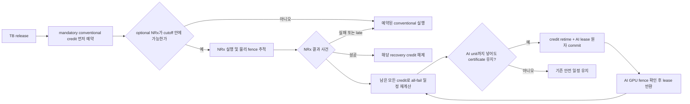

> **보관 사유 (2026-09-25):** 이 문서는 실험 이력으로 보존한다. 최신 스킴과 claim boundary는 `docs/current`의 원고·모델·production gate 문서가 권위 기준이며, 과거 GPU0 전용, MIG, CloudLab 또는 4-GPU pool 가정은 현재 논문의 근거가 아니다.

# SoftWall 현재 스킴과 노벨티 판정 — 2026-09-25

## 한 문장 결론

SoftWall은 MIG 없이 같은 GPU의 MPS 위에서 NeuralRx와 허용된 AI inference를
함께 실행하되, 모든 허용 NeuralRx가 실패하거나 늦는 경우에도 각 RAN 요청의
conventional 복구가 deadline 전에 끝나는 **all-fail certificate**를 계속 보유하고,
복구 credit의 재배치와 AI lease 발급을 하나의 원자 transaction으로 처리하는
runtime substrate다.

현재 증거는 이 **조건부 복구 자원 가상화와 물리 lifecycle 관리**를 시스템
노벨티 후보로 지지한다. 반면 새로운 optimizer가 강한 `max-radio + exact recourse`
보다 우수하다는 가설과, NRx 개수를 안정적인 AI 비용으로 사용하는 가설은 각각
C102와 C104/C105에서 기각됐다. [논문 전환안](SOFTWALL_SUBSTRATE_ENVELOPE_PAPER_PLAN_KO.md)에
따라 추가 optimizer 우위 추적은 종료하고 substrate와 feasibility envelope를 중심으로
평가한다. 실제 BurstGPT→Qwen trace와 강한 baseline의 C113도 완료됐다. SoftWall은
두 seed의 full replay에서 81/88회의 원자 exchange를 safety 위반 없이 실행했지만,
safe work-conserving 대비 추가 적시 token 이득은 +0.113%/+0.099%이고 bootstrap CI가
0을 포함했다. 정확한 상태는 **구현·물리 검증된 조건부 복구 substrate와 실측
feasibility envelope는 성립하지만, 새로운 optimizer와 추가 처리량 우위는 기각**이다.
Confirm114는 이 계약을 local CUDA-IPC endpoint와 remote NVLink-P2P endpoint가 섞인
2-GPU 경로로 확장했다. 실제 P2P payload 10,000회, remote NeuralRx 1,000회와 두 개의
4셀/Qwen/fault 통합 arm이 관측된 safety 위반 없이 통과했다.
C115의 같은 2-GPU 예산 10-arm 비교도 safety와 decision parity를 통과했지만 추가 token
효과는 +0.080%/+0.138%이고 두 CI가 0을 포함했다. 멀티 GPU 성능 우위도 기각한다.
C116은 controller의 2-endpoint 가정을 제거해 local 1개+remote 2개 endpoint를 두 seed에서
실행했고, 세 endpoint의 dispatch/completion 일치와 atomic exchange 90/98회, 위반 0을 얻었다.
C117은 full co-run mode에서 home front/back 2 ms 후보를 각각 한 tail로 기각했다. 그
실패를 보존하고 3 ms 후보를 새 seed에 고정한 C118은 두 arm의 모든 system/component
gate를 통과했다. 멀티 GPU service bound는 isolated scalar가 아니라 co-run class를 포함한
vector로 관리해야 한다.
C119/C120은 GPU0 local 1개+GPU1/2/3 remote 3개로 네 physical GPU를 모두 사용했다.
네 formal arm의 endpoint lifecycle과 system safety는 통과했지만 eager-loading OOM,
backward P2P 100 us와 home back 3 ms 후보 실패가 나타났다. 4-GPU에서는 직접 자격화한
end-to-end path를 runtime 계약으로 쓰고 component vector는 진단 입력으로 제한한다.
Endpoint-only envelope checker는 GPU1/2/4×cell4/8/12에서 4-cell 세 점을 QSU, 8/12-cell
여섯 점을 home-memory MI로 분류했다. Endpoint 추가만으로 GPU0 receiver residency는
줄지 않으므로 다음 scale 단계는 sharded-home 구조여야 한다.
C121은 2 GPU에 4셀 home을 각각 배치한 8셀 mode, C122는 4 GPU에 3셀 home을 각각
배치한 12셀 mode를 두 독립 arm씩 실행했다. 모든 home의 release 차이는 0 ns였고 총
13,600 TB에서 관측된 safety 위반은 0이었다. 이로써 disjoint-home certificate 합성과
receiver-memory 수평 scale-out은 물리 근거를 얻었다. C123은 하나의 global AI queue를
두 home의 local certificate와 합성해 request 2,268개를 duplicate/outstanding 0으로
완료했다. C124가 conv12 mode를 12.535096 ms tail로 반증했고, C125는 계산된 certificate와
실제 executor 순서가 다르면 fail-closed한다는 반례를 만들었다. 이를 고친 C126 conv25
certificate executor는 8 arm·21,760 TB·2,496 atomic exchange에서 safety 위반 0이었다.
Global routing의 처리량 우위와 strict same-radio comparison은 실패했다.
C127은 post-apply global commit reply loss를 두 arm에 주입했다. 영향받은 home은 ambiguous
request를 재시도하지 않고 신규 global AI만 닫은 채 RAN을 계속했고, 다른 home은 AI를
계속했다. 총 5,440 TB와 fault 뒤 home 0의 2,490 TB에서 safety 위반 0, home 1의 fault 뒤
AI 1,668개, duplicate commit/execution 0을 기록했다.
C128--132는 broker process fail-stop에서 빠져 있던 제어 경로 시간 계약을 찾아 닫았다.
C129에서는 Qwen이 물리 완료된 뒤 무제한 `complete` RPC가 97.259 ms 더 막혀 D155 복구가
실패했다. C132는 `prepare+commit+complete` 세 RPC를 각각 5 ms로 제한하고 총 15 ms와
physical guard 2 ms를 AI admission에서 차감했다. 두 arm의 5,440 TB와 crash 탐지 뒤
4,976 TB에서 모든 safety 위반과 duplicate execution이 0이었다. 이 결과는 fault
semantics를 지지하지만, C138 이후 5 ms wall-bound 시간 mode는 UQ다.
C133은 같은 계약으로 prepare와 complete 적용 뒤 fault를 두 arm씩 추가했다. C132와 합친
prepare/commit/complete 각 2-arm, 16,320 TB에서 crash 뒤 14,938 TB를 계속했고 safety
위반과 duplicate execution은 0이었다.
C134는 새 allocation 58823497과 다른 A100 node nid002688에서 같은 세 fault point를
각 두 arm으로 재자격했다. 16,320 TB와 crash 뒤 14,926 TB, containment 전 AI 354개에서
모든 safety·artifact·duplicate gate가 통과했다.
Envelope V9은 cross-home slack 오류를, V10은 용량 기하와 결정시각의 혼동을 교정했다.
이후 구현 감사에서 V10이 실제 endpoint `ring_depth=1`을 반복 completion slot처럼 계산하고
executor phase를 합친 오류를 찾았다. V11은 finite ring과 rejected-recovery ordering을
mode 축에 넣었다. 독립 exact oracle은 18개 scenario, 39개 endpoint pool과 10,920개
bounded 상태에서 checker와 같은 최대 수락 수를 냈고 schedule 오류는 0이었다.
V11은 C132--134 full-control mode에서 finite ring과 executor phase를 교정했다. V12는
runtime의 별도 AI completion guard 2 ms까지 반영해
`AI40+control15+guard2=57 ms`가 58 ms decision window에 들어가는 후보 두 개를 유지했다.
C135는 실행 전 protocol을 고정한 뒤 두 독립 arm에서
정확한 후보 분기 288회와 AI40 exchange 5회씩, 2,560 TB의 안전 위반 0을 확인했다.
C136은 이전 node를 제외한 `nid002817`에서 새 6 arm을 재자격했다. C135와 합친 두 node,
8 arm, 10,240 TB와 38개 목표 exchange의 선언 위반은 0이며, 모든 목표 사건이 static
−4 ms/conditional +1 ms 판정을 유지했다.
별도 A100 allocation의 Aerial155+Qwen3+DART30, 총188개 회귀시험도 모두 통과했다.
이는 추가 총처리량 우위가 아니라 **조건부 credit 삭제가 static slack 밖의 bounded AI
class를 실제로 여는 mechanism**의 예측 검증이다.

C137의 정상 RPC 5,993회는 5 ms 안이었지만 C138의 faulting prepare/complete는
5.205/5.831 ms에 반환됐다. 따라서 V13은 socket timeout 5 ms와 admission wall bound
7 ms를 분리하고 control 21 ms를 청구한다. C139는 새 node의 6 arm·16,320 TB와
RPC 2,020회에서 최대 5.653 ms, 7 ms 초과와 safety 위반 0을 확인했다. 이 보정으로
AI40은 63 ms가 되어 탈락한다. 대신 `AI35+control21+guard2=58 ms`가 static slack
53 ms 밖이면서 conditional window 58 ms에 정확히 들어간다. C140 두 arm은 target
branch 309회 중 이 exchange를 8회 실행했고 모든 static margin은 −5 ms, conditional
margin은 0 ms였다. 이 시점의 권위 mechanism class는 V13 AI35였다.
C141은 독립 node `nid001372`에서 같은 corrected contract를 다시 실행해 control fault
6/6 arm과 AI35 2/2 arm을 통과했다. C139/C140과 합친 두 node 결과는 control RPC4,030회
최대5.775660 ms·7 ms 초과0, AI35 exchange15, 선언 safety 위반0이다.

V14 physical mode는 **pipelined control + AI45**다. V14는 `prepare`, `abort`, `complete`를
전용 비동기 control worker로 옮기고 실제 GPU launch 전 `commit`만 동기적으로 기다린다.
Staged token은 현재 recovery horizon이 짧다는 이유로 버리지 않고 request deadline까지
보유하며, launch 직전에 현재 certificate로 다시 검증한다. 이에 따라 critical-path 식은
`AI45+commit7+guard2=54 ms`가 되어 static slack 53 ms 밖, conditional window 58 ms 안에
4 ms 여유로 들어간다. C142는 `nid001361`의 두 arm·2,560 TB에서 목표 분기305·AI45
exchange9·위반0을, C143은 control fault 6 arm·16,320 TB에서 fault 뒤14,184 TB와
duplicate/safety 위반0을 기록했다. 특히 deferred RPC 1,584회 중 50회가 7 ms를 넘었지만
commit 340회는 모두 7 ms 안이었다. C144는 이전 node를 제외한 `nid002049`에서 AI45와
세 fault point를 재자격해 6,080 TB·AI45 exchange2·fault 뒤3,730 TB의 모든 gate를
통과했다. V13은 synchronous reference mode로 보존한다.

후속 구현 감사는 V14가 staged token을 유지한 채 두 번째 prepare를 낼 수 있는 미검증
ownership branch를 찾았다. 결정적 두-request 대조에서 broker-held 2개 중 client가 1개만
추적하는 상태가 재현됐다. C142/C144 실제 arm은 outstanding 0으로 끝났지만 이 branch를
gate하지 않았으므로 V14 envelope 자격은 UQ로 강등한다. V15는 staged/offered token이
있으면 prepare를 억제하고 그 횟수와 최대 unlaunched token 수를 계측한다. CPU 회귀와
finite model v2는 통과했으며, 이 시점의 runtime 후보는 **V15 single-token pipelined AI45**이고
두-node 물리 재자격 전까지 UQ였다. C145 `nid001244`와 C146 `nid003417`의 8개 arm은
합계 12,160 TB, AI45 exchange12, fault 뒤 radio7,463, prepare 억제537회,
maximum unlaunched token1, safety·duplicate 위반0으로 모두 통과했다. 다만 이 물리
matrix는 finite model의 네 state-changing operation 중 abort post-apply reply-loss를 직접
주입하지 않았다. V16 gate는 이 공백을 명시해 V15 three-point row를 UQ로 내렸다.
C147 `nid003197`과 C148 `nid001005`의 독립 abort arm은 3,200 TB, fault 뒤 radio2,662,
target 실행0, prepare 억제129회, maximum unlaunched token1과 safety 위반0으로 통과했다.
C145--C148을 결합하면 operation별 두 arm, 서로 다른 노드4개, radio15,360, fault 뒤
10,125, 억제666회다. 따라서 현재 권위 mode는 **V16 four-point-qualified single-token
pipelined AI45 QSU**다. Runtime 동작은 V15와 같고 V16은 자격 기준을 강화한 것이다. 상세는
[ownership correction](SOFTWALL_V14_OWNERSHIP_CORRECTION_KO.md)과
[C145--C146 결과](SOFTWALL_CONFIRM145_146_V15_SINGLE_TOKEN_RESULT_KO.md),
[C147--C148 결과](SOFTWALL_CONFIRM147_148_V16_FOUR_POINT_RESULT_KO.md)에 있다.

V16까지의 multi-home 안전성은 home마다 mandatory recovery GPU/lane이 분리된다는 전제다.
Shared recovery GPU로 확장할 때 이 전제에서 생기는 공백을 V17 control-plane 후보로
분리했다. 25 ms recovery, D100, 한 lane에서 두 home이 각각 3개와 2개의 debt를 가지면
local calendar는 둘 다 가능하지만 전역 125 ms는 불가능하다. 새 global certificate는
모든 home의 obligation과 shared AI lease를 한 generation에서 함께 검사한다. 기본 시험
6개와 equal-deadline 25개·capacity 1/2 variable timing/blackout 3,400개 상태를 통과했고 독립 oracle
불일치는 0이었다. Local-safe/global-unsafe 반례는 10개다. 이 control-plane model만으로는
물리 shared recovery mode를 자격화하지 않으며 V16 QSU 범위를 확장하지 않는다.

C151/C152는 이 모델의 debt를 실행할 물리 경로를 두 새 A100 node에서 검증했다. GPU0/1의
두 home이 실제 PUSCH window를 CUDA IPC+NVLink P2P로 GPU2의 한 persistent cuPHY
conventional worker에 보내고 decoded TB/CRC를 돌려받았다. Frozen source와 서로 다른
사전 seed에서 합계 request 1,000건이 전부 정답이고 global-order·P2P·IPC lifecycle 오류는
0이었다. 두 node의 worker-path p99는 3.146/2.918 ms지만 최대 11.871/10.909 ms이므로 이를
service bound로 채택하지 않는다. C151/C152만으로는 global certificate가 이 worker와
Qwen lease를 deadline 아래 함께 구동하지 않았으므로 당시 integrated mode는 UQ였다. 상세는
[V17 shared-recovery 모델](SOFTWALL_SHARED_RECOVERY_V17_MODEL_KO.md)과
[C151/C152 결과](SOFTWALL_CONFIRM151_152_SHARED_RECOVERY_PATH_KO.md)에 있다.

C153은 이 남은 glue를 한 A100 node에서 처음 실행했다. Local 3+2 debt가 각각 feasible인
상태에서 global fifth debt를 launch 전에 거절하고, 한 success 뒤에는 AI35를 거절한 채
두 success 뒤에만 Qwen lease를 열었다. 실제 Qwen host/GPU 23.059/21.733 ms의 fence 뒤
두 certificate-ordered shared cuPHY recovery와 home commit이 97.644 ms 안에 끝났고 D155
miss·decode·credit·P2P/IPC 위반은 0이었다.

C154/C155는 같은 source의 `all_fail`, `conditional_open`, `all_success`, `overload` 네
branch를 서로 다른 두 A100 node에서 독립 seed와 반대 실행 순서로 고정해 재실행했다.
여덟 arm 합계 submitted36, accepted32, global reject4, injected success12, Qwen lease4,
physical shared recovery20, correct home commit20, deadline miss0이었다. 따라서
**controlled-outcome synthetic integrated mode**는 두 노드 finite-sample gate를 통과했다.
이 단계의 NRx 결과는 prospectively controlled injection이므로 당시 actual TensorRT
NeuralRx 전이는 UQ였다. C157A/C157B는 GPU3의 실제 TensorRT NeuralRx CRC를 45 ms cutoff
전에 관측해 global credit을 해소했고, 두 A100 node 합계 actual success4, Qwen2,
same-input conventional-equivalent recovery4, single commit8, miss0을 기록했다. 따라서
warm synthetic actual-NRx transition은 finite-sample PASS다. 통합 fault matrix, WCET와
production expiry는 계속 UQ다. 상세는
[C153 결과](SOFTWALL_CONFIRM153_INTEGRATED_RESULT_KO.md)와
[C154/C155 holdout](SOFTWALL_CONFIRM154_155_CONTROLLED_HOLDOUT_KO.md),
[C157 actual-NRx 결과](SOFTWALL_CONFIRM157_ACTUAL_NRX_RESULT_KO.md)에 있다.

C158은 이 전이를 persistent mode에서 두 node·500 epoch로 반복했다. Actual TensorRT
NeuralRx request2,000 중 success1,440은 debt를 해제했고 failure/late560은 GPU2 shared
cuPHY recovery로 이어졌다. Qwen500과 radio single commit2,000에서 deadline·bound·credit·
input round-trip·response echo violation은 0이었다. 이 과정에서 per-epoch filesystem
control tail, host doorbell의 불충분한 response 증명과 monitor first-use JIT를 실제 실패로
찾아 persistent mmap control, byte-exact 양방향 echo와 readiness preflight로 교정했다.
이 결과는 P600/D155 warm qualification이었다. C159-Q1은 channel/oracle 생성을 readiness 전
GPU bank로 옮기고 P180/D155에서 같은 물리 전이를 두 새 node에 재자격했다. 합계 actual
NRx2,000, success1,418, shared recovery582, Qwen500, commit2,000에서 miss·bound·credit·
input/output fence·recovery contract 위반은 0이었다. Whole-path cold preflight 최대
64.750 ms와 warm recovery 최대 11.555 ms를 분리했으므로 context-64 P180 warm mode는
finite-sample PASS다. C159-Q2는 16--512 token 여섯 class를 두 node·1,200 epoch에서
재자격했다. Actual NRx4,800, success3,488, shared recovery1,312, Qwen1,077, commit4,800에서
miss·bound·transport·recovery contract 위반은 0이었다. Stale lease와 sequential outcome
replay 반례를 bounded revalidation/physical latest-start 및 common-cutoff batch transition으로
교정했다. C159-Q3 exact calibration oracle은 empirical recovery-first Event-driven과 SoftWall을
각 385,262 token으로 동일하게 판정해 5% 성능 holdout을 중단했다. Integrated fault는 UQ다.

C156/C156b는 이 transaction을 두 node의 Nsight GPU timeline에서 검사했다. 첫 호환성 오류를 보존한 뒤,
두 번째 arm은 fixed `[45,80] ms` lease가 profiler 아래 3.153 ms 초과돼 실제로 실패했다.
V17.1은 실제 launch decision 시각에서 `control5+AI35` blackout과 남은 recovery를 함께
재배치한다. 세 번째 arm은 Qwen kernel1,224, recovery kernel106, NVTX range8,
두 node 합계 Qwen kernel2,448, recovery kernel212, 미귀속 event0, 금지 overlap0 ns,
correct commit4/4와 D155 miss0으로 각각 11개 gate를 통과했다.
상세는 [C156 결과](SOFTWALL_CONFIRM156_GPU_TIMELINE_RESULT_KO.md)에 있다.

## 해결하는 문제

MPS는 여러 CUDA process를 동시에 실행하게 해 주지만 RAN deadline이나 간섭 상한을
보장하지 않는다. 또 optional NeuralRx가 실패할 수 있다면, 실행 중 남는 GPU를 단순히
AI에 주는 순간 향후 conventional 복구 공간을 침범할 수 있다.

SoftWall은 남는 SM 비율 자체를 나누는 대신, 아직 해결되지 않은 RAN 요청마다
`deadline 전에 반드시 실행 가능한 conventional 복구 구간`을 credit으로 유지한다.
NeuralRx 성공으로 credit이 소멸하거나 실패 시각이 드러나면 남은 credit들을 다시
배치하고, 그래도 all-fail 일정이 남는 시간에만 bounded AI work unit을 허가한다.



여러 RAN home이 한 external-AI trace를 공유할 때는 global ownership과 local safety를
다음 순서로 합성한다.

```mermaid
flowchart LR
    B[Global broker<br/>request ownership] -->|async prepare| S[Staged token]
    S --> H{현재 certificate로<br/>launch-time 재검증}
    H -- horizon short<br/>deadline remains --> S
    H -- expired/impossible -->|async abort| B
    H -- feasible --> L[recovery retime + local AI lease]
    L -->|sync commit, <= Bc| B
    B -->|ACK| Q[Qwen physical execution]
    Q -->|GPU fence| R[local lease retire]
    R -->|async complete| B
    B -. ambiguity .-> F[token quarantine<br/>new global AI 차단]
    F --> RR[certificate-order<br/>local RAN recovery 계속]
```

이때 AI admission이 보는 비용은 `B_AI`만이 아니다.

```text
t_launch + B_commit + B_AI + G_physical
    <= min(AI deadline, earliest certified recovery start)
```

Global broker는 어느 home이 AI request를 소유하는지만 직렬화한다. Mandatory conventional
recovery, NRx endpoint와 IPC credit은 home별로 분리돼 있다. 비동기 prepare/abort/complete는
local recovery executor를 막지 않으며, commit만 위 식의 budget 안에 성공해야 실제 Qwen을
launch한다. 적용 여부가 불명확한 token은 재사용하지 않는다.

## 스킴의 상태, 행동, 불변식

사건 시각 `t`의 온라인 상태는 다음만 포함한다.

- 각 TB의 release, MAC expiry, 관측 가능한 채널 feature, 아직 미해결인 복구 의무
- endpoint별 queue와 물리적으로 미완료인 NRx/IPC credit
- 그 시각까지 도착한 AI 요청의 deadline, 가치, 검증된 최대 work-unit
- mode별로 사전 자격화된 전체 host-to-commit 서비스 상한

미래 AI 도착, 미래 CRC, held-out 정답, 생성기의 true SNR, 미래 GPU 실행시간은
정책 입력으로 쓰지 않는다.

각 사건에서 가능한 행동은 `(NRx 수락과 endpoint, NRx 관측 순서, conventional
복구 순서와 시각, 지금 발급할 AI lease)`다. runtime은 다음 순서로 한 행동만
commit하고 다음 사건에서 다시 계산한다.

1. `reserve_mandatory`: optional 결정을 하기 전에 모든 수락 TB의 conventional
   credit을 먼저 확보한다.
2. `admit_nrx`: NRx의 예측 완료가 요청별 fallback cutoff를 넘지 않을 때만
   optional 경로를 붙인다.
3. `all-fail certificate`: 아직 미해결인 NRx가 전부 실패하거나 late인 분기에서
   모든 conventional commit이 각 expiry 전에 끝나는 충돌 없는 일정을 만든다.
4. `replan_and_lease`: 복수 recovery credit의 새 위치와 AI unit의 실행 구간을
   함께 검사하고, 둘 다 가능할 때만 원자적으로 바꾼다. 실패하면 기존 달력은
   그대로 남는다.
5. 물리 GPU 완료 fence가 확인되기 전에는 NRx endpoint, IPC buffer, AI lease를
   반환하지 않는다. timeout이나 stale 결과도 물리 종료 전까지 credit을 점유한다.

핵심 안전 불변식은 다음과 같다.

> 어떤 시각에도 이미 허가된 모든 RAN 요청에 대해, 허용된 모든 NRx 실패·지연
> 분기에서 `conventional_commit_i <= MAC_expiry_i`를 만족하는 충돌 없는 복구
> 계획이 남아 있어야 하며, 물리적으로 끝나지 않은 GPU/IPC 자원은 재사용하지 않는다.

이 보장은 자격화된 작업 class와 서비스 상한 안에서만 성립한다. 표본 최대나 p99를
WCET로 부르지 않는다.

## 무엇이 우리 기여 후보인가

개별 부품인 MPS cap, channel gate, 조기 conventional, 빈 시간의 AI 실행,
queue-aware endpoint 선택은 기여로 주장하지 않는다. 강한 baseline에도 모두 제공한다.
기여 후보는 다음 조합과 실행 계약이다.

1. **조건부 복구 credit 가상화:** optional NeuralRx가 만든 미해결 conventional
   의무를 요청별 credit으로 표현하고, 여러 셀 사이에서 사건마다 재배치한다.
2. **all-fail certificate 기반 admission:** 평균 성공률이나 관측된 p99가 아니라,
   허용한 모든 NRx가 실패하는 분기에도 남는 구체적 복구 일정을 admission 증명서로 쓴다.
3. **복수 credit retiming과 AI lease의 원자 transaction:** 달력을 먼저 비우고
   나중에 AI를 넣는 식의 중간 위험 상태가 없다. 새 달력과 AI 허가가 함께 성공하거나
   모두 실패한다.
4. **논리 일정과 물리 lifecycle의 결합:** CUDA worker의 완료 fence, IPC slot,
   timeout 뒤 미완료 kernel, 단일 radio commit을 같은 credit 수명 규칙에 묶는다.
5. **관측 사건 기반 slack 회수:** NRx 결과를 먼저 관측하고 성공하면 credit을
   해제하며, 실패하면 예약된 conventional을 실행한다. 이 조건부 slack만 허용된
   AI request에 판매한다.
6. **Transport-independent endpoint contract:** conventional recovery는 home GPU에
   남겨 두고 local IPC 또는 remote P2P endpoint의 queue·ring·physical completion을
   같은 credit lifecycle에 포함한다.
7. **Certificate-conformant execution:** no-NRx, NRx fail/late 등 원인이 다른 ready
   recovery를 하나로 합쳐 live-credit 순서로 dispatch한다.
8. **Global request/local certificate composition:** generation-tagged global AI hold를
   선택된 home의 local atomic lease와 직렬화해 중복 실행 없이 여러 home이 한 trace를 쓴다.
9. **Ambiguous-commit containment:** broker가 commit을 적용한 뒤 reply를 잃으면 token을
   재시도·재할당하지 않고 해당 home의 신규 AI만 차단한다. Local RAN certificate와 다른
   home의 실행은 계속한다.
10. **Launch-time revalidated pipelined control:** global ownership의 `prepare/abort/complete`를
    RAN 경로 밖에서 처리하고, staged token을 현재 certificate로 재검증한 뒤 동기 `commit`
    ACK가 있을 때만 GPU work를 제출한다. 비동기 ambiguity는 token quarantine으로 흡수하고
    local recovery를 멈추지 않는다. V13의 모든-RPC 동기 청구는 비교 가능한 안전 기준으로
    보존한다.
11. **Home-local envelope semantics:** multi-home conditional slack을 각 home에서 실제로
    수락된 NRx 수에만 연결하고, 제한된 동기 endpoint model의 greedy cardinality를 독립
    exact oracle로 검사한다.
12. **Decision-time envelope semantics:** `W+Delta`를 용량 필요조건으로 한정하고,
    observe-all까지의 NRx bound·rejected recovery·control budget을 차감한 뒤 실제
    exchange-only service 가능성을 판정한다.
13. **Shared-recovery global certificate와 물리 data-plane fence:** 여러 RAN home이 같은 mandatory recovery
    lane을 사용할 때 모든 home의 debt, shared AI blackout과 generation을 한 executable
    schedule로 commit한다. Actual NRx와 shared cuPHY worker 사이의 input round-trip 및
    response read-back echo를 generation에 결합하고 completion doorbell 전에 검증한다.
    C158은 이 결합을 두 node의 2,000 actual-NRx request에서 반복했다.

따라서 논문의 중심 표현은 `novel MPS isolation`이나 `novel optimizer`가 아니라
**MIG-off MPS AI-and-RAN을 위한 certified conditional-recovery substrate** 또는
**failure-contingent slack virtualization**이 적절하다.

## 현재 증거와 기각된 주장

| 질문 | 현재 결과 | 판정 |
|---|---|---|
| 복수 복구 credit과 AI lease를 원자적으로 처리하는가 | runtime 단위시험 21개, fault regression 10,000회; C73/C76 물리 통합 | 구현 기여 성립 |
| 4셀·같은 GPU·MPS에서 fault와 lease lifecycle을 지키는가 | C80: conventional commit 37회, 복구 전 AI lease 완료·반환 92회, miss/bound/credit 위반 0 | 유한 표본 물리 gate 통과 |
| 실제 GPU kernel이 겹쳤는가 | C68 8.932 ms, C70 12.309 ms의 kernel overlap 계측 | host overlap 한계 해소 |
| observe-first mode가 Qwen과 4셀에서 안전했는가 | C100: 새 두 seed×1,000 release, NRx45/conv12/AI50 위반과 deadline miss 0 | 유한 표본 통과 |
| 실패가 AI slack을 실제로 줄이는가 | C101 identical-PHY ABBA: fault arm의 적시 Qwen 반환이 −7, −14 | 조건부 복구 메커니즘 확인 |
| 새 공동 optimizer가 강한 정책보다 좋은가 | C102 실행 가능 39건에서 guarded joint와 `max-radio + exact recourse`가 선택·AI·정답 모두 동일 | **기각** |
| exact가 1-swap보다 좋은가 | C102에서 39/39 동일; 이전 일반 packing 우위는 AI-RAN 고유성이 아님 | **기각** |
| NRx 2개가 AI에 주는 비용을 안정적 scalar로 쓸 수 있는가 | C104 ABBA에서 부호 반전, C105 same-process interleave의 네 strata도 불일치; 적시 AI 차이 CI 모두 0 포함 | **기각** |
| 실제 AI-and-RAN 서비스에서 강한 baseline보다 유효 AI가 늘어나는가 | C113 BurstGPT 1,136-request full replay: SoftWall +0.113%/+0.099%, 두 CI 모두 0 포함 | **추가 처리량 우위 기각** |
| 계약이 remote GPU NeuralRx에도 유지되는가 | C114: P2P 왕복 10,000회, actual NRx 1,000/1,000 correct, 두 4셀 통합 arm의 atomic exchange 각 85회와 safety 위반 0 | **2-GPU 유한 표본 통과** |
| 같은 2-GPU 예산에서 추가 AI 처리량이 있는가 | C115 10-arm ABBA: +0.080%/+0.138%, CI [−478,834.5]/[−124,884.5] | **우위 기각** |
| 3개 heterogeneous endpoint의 credit lifecycle이 맞는가 | C116: timed admission 331/263/126, 320/265/134; worker count 일치, exchange90/98, 위반0 | **유한 표본 통과** |
| 멀티 GPU component bound를 분해해 자격화했는가 | C117: home 2 ms 후보 FAIL; C118: 새 seed에서 home 3 ms, P2P 250/100 us, remote NRx2.5 ms, worker6 ms, 전체25 ms 위반0 | **exact warm mode 유한 표본 통과** |
| 네 physical GPU에서 lifecycle이 유지되는가 | C119/C120: 네 formal arm의 4 endpoint use/count와 system safety 통과; eager OOM과 fine component 두 gate 실패 | **통합 경로 통과, component 일반화 기각** |
| Recovery home을 분할하면 cell scale 경계가 이동하는가 | C121/C122 총13,600 TB 위반0; 후속 C124가 4-cell/home conv12 tail 반증 | **4GPU/12셀 exact mode 유지, 2GPU/8셀 conv12 UQ** |
| 하나의 AI queue를 여러 local certificate와 합성하는가 | C123 두 arm, 2,268 request, duplicate/outstanding 0 | **제한된 global ownership 합성 통과** |
| 계산된 certificate가 실제 executor 순서로 보존되는가 | C125 ordering 반례; C126 conv25 8 arm, 21,760 TB·2,496 exchange, safety 위반0 | **반례와 수정 mode 확보** |
| Global routing이 static partition보다 빠른가 | C126 +0.0049%/+0.0236%, CI 하한0, strict radio parity FAIL | **우위 기각** |
| Global commit 결과가 애매해져도 RAN과 다른 home이 계속되는가 | C127 두 arm: 5,440 TB, fault 뒤 home0 2,490 TB·home1 AI 1,668, duplicate 0 | **제한된 at-most-once fault 격리 통과** |
| Broker process가 어느 transaction point에서 죽어도 local RAN이 계속되는가 | C129 unbounded complete RPC FAIL; C132/C133 첫 node와 C134 독립 node에서 prepare·commit·complete 각2 arm, 합계32,640 TB 위반0 | **두 A100 node의 bounded volatile mode 통과** |
| Envelope가 physical endpoint/executor를 정확히 반영하는가 | cross-home·unlimited-ring·phase 오류 교정; 39 pool+10,920 bounded state exact 차이0 | **제한된 동기 모델 감사 통과** |
| 조건부 용량이 static slack 밖의 service class를 여는가 | C140+C141: 두 node·4 arm, 분기602·AI35 exchange15·5,120 TB 위반0 | **corrected synthetic mechanism mode same-family 재현** |
| Timeout과 admission wall bound가 구분되는가 | C138 5 ms gate FAIL; C139 fault matrix RPC2,020, max5.653ms<7ms | **5 ms timeout/7 ms charge 분리 통과; WCET 아님** |
| 비동기 global control이 RAN critical path와 분리되는가 | C142--C144 두 node: AI45 exchange11; fault9 arm·21,120 TB·fault 뒤17,914 TB; deferred RPC 7ms 초과50, safety·duplicate 위반0 | **V14 timing/fault 증거는 통과, ownership 미검증으로 현재 mode UQ** |
| Retained token 뒤 ownership이 추적 가능한가 | 결정적 회귀에서 V14 untracked held token1; V15 0. C145/C146 두 node·12,160 TB·AI45 exchange12·fault6 arm, 억제537회, 최대 unlaunched1 | **V15 runtime ownership 통과** |
| 네 broker operation의 post-apply reply-loss가 물리적으로 닫혔는가 | C145--C148 네 node·operation별2 arm·radio15,360·fault 뒤10,125·target 중복0·억제666·max token1 | **V16 four-point 유한 표본 QSU** |
| Pipelined ownership protocol의 reply-loss와 single-token 상태가 안전한가 | model v2: fault protocol 16 state·20 edge + ownership 4 state·8 edge, violation0 | **bounded state space 전수 통과** |
| 여러 home이 recovery GPU를 공유할 때 local certificate만으로 충분한가 | local-safe/global-unsafe10/25; exact3,400 oracle 차이0; C151/C152 request1,000; C156/C156b kernel2,660·overlap0; C159-Q2 P180 actual NRx4,800; C161 fault NRx2,800·miss0 | **P180 variable-context와 A0--A6 qualified-node PASS; one lifecycle UQ** |
| 현재 trace에서 atomic AI-first가 strong recovery-first보다 material한가 | C159-Q3 exact offline: empirical 385,262=385,262 token; contract sensitivity +0.066% | **5% MDE 실패, performance holdout 중단** |
| Actual-NRx와 AI/recovery lifecycle fault가 물리 경로에서 닫히는가 | C160 state51; C161 full actual NRx2,800·recovery942·commit2,800·miss0; event pair40·terminal fault4·continuation260 | **A0--A6 qualified-node PASS; nid001044 lifecycle UQ** |
| production RAN deadline의 완전 보장인가 | synthetic P180/D155와 자격화된 mode의 유한 표본 | 아직 미검증 |

C102의 61개 infeasible은 scheduling 실패가 아니다. [사후 분해](../../results/softwall_same_gpu/confirm102_feasibility_posthoc.json)에서
61개 모두 최대 두 NRx로도 예측 radio floor가 도달 불가능했고, schedule-safe subset
자체가 없는 사례는 0개였다. 실행 가능한 39개 중 조건부 AI 용량은 37개에서 달랐고
20개에는 radio guard 안의 복수 subset이 있었지만, max-radio보다 AI가 나은 guarded
선택은 0개였다. AI 개선 후보 8개는 모두 허용 radio guard 밖이었다. 따라서 정확한
결론은 제약 부재가 아니라 **radio-noninferior한 중간 tradeoff 부재**다.

음성 결과는 약점만은 아니다. exact 탐색의 일반 knapsack 효과, run drift로 생긴
거짓 NRx 비용, 약한 staged baseline에 대한 이득을 노벨티에서 제거했기 때문에
최종 주장의 범위가 명확해졌다.

## 강한 baseline과 최종 판정

최종 비교는 모두 같은 GPU, MIG OFF, 같은 MPS cap, 같은 PHY/AI trace, 같은 서비스
상한과 all-fail 안전 판정기를 사용한다.

| 정책 | 역할 |
|---|---|
| Uncontrolled MPS | 간섭과 deadline 실패를 보여 주는 진단 기준선 |
| Static safe partition/calendar | 고정 MPS cap, channel gate, queue-aware endpoint, 조기 복구, 보수적 고정 recovery calendar, bounded AI |
| Safe greedy retiming | 위 안전장치에 AI 수요 인지 recovery retiming과 사건별 재계획까지 제공 |
| `max-radio + exact recourse` | 무선 선택 후 남은 구간의 AI 배치를 정확히 푸는 현재 가장 강한 정책 기준선 |
| SoftWall transaction | 동일 안전장치에서 조건부 credit과 request lease를 원자적으로 공동 관리 |
| Offline oracle | 미래 결과를 보는 성능 상한이며 온라인 경쟁 정책으로 세지 않음 |

최종 workload는 BurstGPT의 실제 도착시각과 request size를 Qwen2.5-1.5B prefill에
매핑하고, 원 trace에 없는 SLO는 synthetic 1,000 ms로 명시했다. 같은 trace를 ABBA
순서와 독립 seed로 반복해 다음을 함께 판정했다.

- RAN deadline miss, NRx/conventional bound 위반, 잔여 credit과 stale commit
- paired radio correct/utility 및 사전 고정한 비열등성 기준
- offered AI 요청 수, admission, deadline 전 완료 가치, late/reject
- controller 계산비용, GPU kernel overlap, lifecycle mode별 결과

성능 정책 노벨리티는 C102로 종료됐다. C113은 모든 시스템에 같은 radio 선택과 안전장치를
주고 static safe calendar와 safe work-conserving 대비 복수 credit의 원자적 교환을
검사했다. Static은 73,841/73,770 token, work-conserving 평균은
224,891.5/224,608.0, SoftWall 평균은 225,146.5/224,830.0이었다. SoftWall의 추가
효과는 +0.113%/+0.099%이며 두 bootstrap CI가 0을 포함해 사전 outcome gate에 실패했다.
따라서 처리량 우위 주장도 종료하고 substrate와 feasibility envelope를 주 기여로 평가한다.

사후 envelope 분해에서 4셀·conv12 mode의 최대 추가 회수 구간은 36 ms였지만, 최종
trace의 99.824%는 65/75 ms 계약 unit이었다. 기존 slack `W`, 회수 구간 `Δ`, AI bound
`B_eff`에 대해 SoftWall만 새 admission을 만들 수 있는 용량 필요조건은
`W < B_eff ≤ W+Δ`다. 여기에 실제 decision time 뒤에도 recovery 하나 전까지 작업이
끝나는 조건이 추가된다. 작은 unit은 이 조건에 가까워도 offered load가 낮으면 두 시스템이
모두 처리하고, 부하를 높인 후보 mode는 먼저 bound 자격을 통과해야 한다. 이 세 상태가
각각 no-benefit, no-pressure, unqualified envelope를 이룬다.

C162는 이 정성적 envelope를 current shared-recovery mode의 예측기로 구체화했다. Qualified
state 16,023개에서 analytic/exact mismatch0, 기존 C159-Q2 physical lease decision
1,200/1,200 일치, 두 새 node의 prespecified boundary180/180 일치를 얻었다. Actual NRx720,
physical recovery330, Qwen90, commit720, miss0이며 context64의 conservative 88 ms 허가와
89 ms 거절을 각30회 재현했다. Recovery12, cold/long-idle, failed/unknown node는 계산상
여유가 있어도 UQ로 유지한다. 상세는
[C162 결과](SOFTWALL_C162_PREDICTIVE_ENVELOPE_RESULT_KO.md)를 따른다.
Candidate scheduler와 독립 verifier의 scale audit도 임의 small state600개 false-safe0,
현재 mode16,023개 exact 차이0, large state2,800개 verifier 실패0을 얻었다. Debt64의
decision/verifier p99는1.494/0.131 ms다. Exact-feasible504개 중 10개를 보수적으로
거절했으므로 최적성 대신 certified safety와 finite CPU latency를 주장한다.

## 현재 논문성 판정

| 축 | 현재 수준 | 이유 |
|---|---|---|
| 문제 정의 | 강함 | MPS가 주지 않는 deadline 보장과 conditional recovery라는 AI-RAN 고유 충돌이 명확함 |
| 시스템 구현 | 강함 | multi-credit, atomic lease, certificate executor, global request broker, launch-time revalidation, pipelined control, ambiguity quarantine, remote endpoint와 sharded home까지 구현됨 |
| 안전성 논리 | 강함/조건부 | all-fail invariant·executor refinement·finite-ring/phase-aware decision 조건·exact endpoint audit가 있으며 production WCET/DU 계약은 남음 |
| 알고리즘 노벨티 | 종료 | C102에서 강한 max-radio+exact recourse와 동일하여 추가 추적 중단 |
| 실용 성능 증거 | 경계 확정 | 실제 trace에서 static 대비 큰 회수, strong work-conserving 대비 추가 우위는 없음 |
| 전체 탑 컨퍼런스 준비도 | 조건부 후보 | qualified warm predictive envelope와 64-debt certified scheduling은 방어 가능하나 production timing과 bound 일반화가 필요 |

지금부터의 목표는 C113 결과를 바꾸는 추가 정책 탐색이 아니다. 실제 DU의 `d_MAC`을
확보하고, service-bound/lifecycle/work-unit 축의 envelope를 예측하는 모델과 production
mode·cross-family 재자격으로 atomic conditional-credit substrate의 적용 조건을 명확히 하는 것이다.

C163은 이 목표를 받을 raw-event builder와 request-specific exact/certified bridge,
artifact reconstruction·clock error·outcome visibility·physical lease parity validator를
구현했고 단위시험 24개를 통과했다. 실제 DU/FAPI trace와 명시적 gNB expiry는 아직 없으므로
상태는 `UQ_NO_PRODUCTION_TRACE`이며, 이 준비 결과를 production 보장의 증거로 세지 않는다.

C164는 qualification을 node/GPU/software/placement/lifecycle fingerprint와 epoch/generation
token에 묶었다. 상태모델은 9개 lifecycle과 8개 restart 전이의 unqualified admission을 모두
차단했다. `idle_30s_first` boundary subset은 서로 다른 A100 node에서 30.029초 idle 뒤
180 round·actual NRx720·recovery330·Qwen90·commit720·miss0으로 통과했다. 이는 해당
idle subset의 자격이다. Quiescent MPS restart도 두 다른 A100 node에서 이전 4-GPU client
epoch, daemon 완전 종료, 다른 control/server PID와 socket inode의 새 epoch를 증명하고
fresh-client requalification 뒤 180 round·actual NRx720·recovery330·Qwen90·commit720·miss0으로
통과했다. 이는 restart 후 첫 요청 boundary의 자격이며 restart 중 availability, process/model
cold, reconnect, 긴 idle과 full class vector의 자격은 아니다. Qwen reload는 같은 GPU2에서
fresh load와 여섯 class warmup을 두 node 합계60회 수행하는 동안 4-cell mandatory
release3,334·cell decode13,336을 miss0·cell25 위반0으로 처리했다. Optional inference는 0으로
닫았으므로 `qwen_reload_mandatory_continuity`만 자격화하고 reload 중 AI availability는 UQ다.

멀티 GPU는 이 목표의 확장 축이다. 단일 GPU CUDA IPC 결과를 기준점으로 유지하고,
conventional recovery가 있는 home GPU와 remote P2P NeuralRx endpoint 사이의 transport,
ring, endpoint credit을 같은 certificate에 연결한다. C114는 4×A100 NVLink node에서
local 1개+remote 1개 endpoint의 cross-process payload, actual NeuralRx와 SoftWall/Qwen/fault
transaction을 통과했다. C115는 같은 2-GPU 예산의 strong baseline을 완료해 성능 우위를
기각했다. C116은 3개 endpoint까지 완료했고 C117/C118은 2 ms 실패와 3 ms 재자격으로
component별 co-run 경계를 만들었다. C119/C120은 네 GPU·네 endpoint까지 확장하면서
memory/lifecycle과 component 일반화 경계를 확인했다. Endpoint-only와 sharded-home
cell 4/8/12 deterministic grid를 만들고 C121/C122를 실행했다. C124--126은 bound와
executor를 mode 축으로 분리해 2-home×8의 conv12를 UQ로 내리고 conv25 certificate
executor를 QSU로 올렸다. C123은 global AI ownership을, C127은 한 post-apply commit
reply loss의 home별 fail-closed 격리를 구현했다. C129의 broker fail-stop 반례 뒤 C132는
세 synchronous RPC의 총 15 ms와 2 ms guard를 admission에 포함해 양 home의 local RAN
continuation을 검증했다. C133은 세 post-apply control point의 coverage를 완성했고 C134는 다른 A100 node에서 같은 6-arm matrix를 재자격했다. C138은 5 ms가 fault-return wall bound가 아님을 보였고,
C139/C140은 7 ms admission bound와 AI35 class로 계약을 다시 닫았다.
V11은 이 과거 full-control mode의 물리 ring과 executor phase를 모델에 맞췄다. V12는
AI completion guard 2 ms까지 더해 static 53 ms slack 밖의 57 ms transaction을
conditional 58 ms window에서 허가했다. C135/C136은 두 A100 node의 8 arm에서 이를
38회 실행했고, 사건별 감사는 38/38에서 static margin −4 ms와 conditional margin
+1 ms를 확인했다.
C137은 별도 RPC-instrumented mode를 세 번째 A100 node에서 6 arm 실행했다. Broker
prepare/commit/complete 5,993회의 최대 wall time은 2.593595 ms로 선언 5 ms 안이었고,
같은 7,680 TB·AI40 exchange28의 safety 위반도 0이었다. C135/C136과 C137은 계측 여부가
다른 exact mode이므로 reliability 표본으로 합치지 않고, 세 node 합계는 mechanism
cross-mode reproduction으로만 사용한다.
C138 이후 이 세 node 자료는 과거 mechanism evidence이며 현재 control-time qualification은
C139/C140의 synchronous corrected mode는 C141 독립 node에서 다시 통과했다. 이어 V14는
prepare/abort/complete를 비동기화하고 commit만 7 ms로 청구해 AI45 conditional class를
C142와 C144의 두 A100 node에서 재현했다. C143/C144의 9개 fault arm과 유한 상태 모델은
reply-loss ambiguity를 token quarantine으로 흡수하면서 local RAN이 계속됨을 확인했다.
후속 two-request 감사가 V14의 retained-token ownership 공백을 찾아 이 mode를 UQ로
강등했다. V15는 home당 staged/offered token을 하나로 제한했고, C145/C146의 두 새 A100
node에서 해당 억제 분기와 AI45/fault matrix를 다시 통과했다. C147/C148은 두 추가 A100
node에서 abort post-apply 분기를 닫았다. 따라서 현재 권위 conditional class는
**V16 four-point-qualified single-token AI45**이고, V15는 sealed runtime/timing base,
V14는 역사적 timing/fault 증거, V13 AI35는 synchronous reference다.
남은 멀티 GPU 과제는 shared NRx/recovery가
있는 non-separable certificate, broker restart와 durable reconciliation,
cross-family hardware 일반화다.
[Endpoint-only envelope](SOFTWALL_ENDPOINT_OFFLOAD_ENVELOPE_RESULT_KO.md)와 상세 결과는
[C114 보고서](SOFTWALL_CONFIRM114_MULTIGPU_RESULT_KO.md),
[C115 보고서](SOFTWALL_CONFIRM115_MULTIGPU_BASELINE_RESULT_KO.md),
[C116 보고서](SOFTWALL_CONFIRM116_THREE_ENDPOINT_RESULT_KO.md),
[C117 실패 경계](SOFTWALL_CONFIRM117_COMPONENT_BOUND_RESULT_KO.md),
[C118 재자격](SOFTWALL_CONFIRM118_COMPONENT_REQUALIFICATION_RESULT_KO.md),
[C119/C120 4-GPU 결과](SOFTWALL_CONFIRM119_120_FOUR_GPU_RESULT_KO.md),
[C121/C122 sharded-home 결과](SOFTWALL_CONFIRM121_122_SHARDED_HOME_RESULT_KO.md),
[C123--126 global AI 결과](SOFTWALL_CONFIRM123_126_GLOBAL_AI_RESULT_KO.md),
[C127 broker fault 결과](SOFTWALL_CONFIRM127_BROKER_FAULT_RESULT_KO.md),
[C128--132 broker fail-stop 결과](SOFTWALL_CONFIRM128_132_BROKER_CRASH_RESULT_KO.md),
[C128--133 control-point matrix](SOFTWALL_CONFIRM128_133_CONTROL_FAULT_RESULT_KO.md),
[C134 독립 node 재자격](SOFTWALL_CONFIRM134_INDEPENDENT_NODE_RESULT_KO.md),
[C135 conditional AI40 결과](SOFTWALL_CONFIRM135_V11_AI40_RESULT_KO.md),
[C136 독립 node 재자격](SOFTWALL_CONFIRM136_V12_REQUALIFICATION_RESULT_KO.md),
[C137 RPC telemetry](SOFTWALL_CONFIRM137_SERVICE_BOUND_TELEMETRY_RESULT_KO.md),
[C138–C140 correction](SOFTWALL_CONFIRM138_140_CONTROL_BOUND_CORRECTION_KO.md),
[C141 독립-node 재자격](SOFTWALL_CONFIRM141_V13_INDEPENDENT_RESULT_KO.md),
[V14 pipelined control 설계](SOFTWALL_PIPELINED_CONTROL_DESIGN_KO.md),
[C142--C144 결과](SOFTWALL_CONFIRM142_144_V14_PIPELINED_RESULT_KO.md),
[V14 ownership 교정](SOFTWALL_V14_OWNERSHIP_CORRECTION_KO.md),
[C145--C146 V15 결과](SOFTWALL_CONFIRM145_146_V15_SINGLE_TOKEN_RESULT_KO.md),
[C147--C148 V16 결과](SOFTWALL_CONFIRM147_148_V16_FOUR_POINT_RESULT_KO.md),
[C160 fault model](SOFTWALL_C160_FAULT_MODEL_RESULT_KO.md),
[C161 1단계 physical fault](SOFTWALL_C161_PHASE1_RESULT_KO.md),
[C161 2단계 physical fault](SOFTWALL_C161_PHASE2_RESULT_KO.md)에 있고,
구현·모델 순서는
[멀티 GPU·모델링 고도화 로드맵](SOFTWALL_MULTIGPU_MODELING_ROADMAP_KO.md)에 둔다.
현재 권위 모델 산출물은 [V16 prediction](../../results/softwall_multigpu/softwall_sharded_home_envelope_prediction_v16.json),
[V16 validation summary](../../results/softwall_multigpu/softwall_envelope_v16_validation_summary.json),
[pipelined-control finite model v2](../../results/softwall_multigpu/softwall_pipelined_control_model_v2.json),
[V14→V15 ownership regression](../../results/softwall_multigpu/softwall_v14_v15_staged_ownership_regression_v1.json),
[C145 결과](../../results/softwall_multigpu/confirm145_v15_single_token_result.json),
[C146 결과](../../results/softwall_multigpu/confirm146_v15_single_token_result.json),
[C147 결과](../../results/softwall_multigpu/confirm147_v16_abort_result.json),
[C148 결과](../../results/softwall_multigpu/confirm148_v16_abort_result.json),
[V16 manifest](../../results/softwall_multigpu/softwall_v16_four_point_manifest.json)이다.
과거 corrected synchronous 자료는 [V13 prediction](../../results/softwall_multigpu/softwall_sharded_home_envelope_prediction_v13.json),
[V13 validation summary](../../results/softwall_multigpu/softwall_envelope_v13_validation_summary.json),
[V12→V13 regression](../../results/softwall_multigpu/softwall_envelope_v12_v13_control_bound_regression_v1.json),
[service-bound qualification v3](../../results/softwall_multigpu/softwall_service_bound_qualification_v3.json),
[V13 manifest](../../results/softwall_multigpu/softwall_v13_corrected_control_manifest.json),
[service-bound qualification v4](../../results/softwall_multigpu/softwall_service_bound_qualification_v4.json),
[V13 cross-node manifest](../../results/softwall_multigpu/softwall_v13_cross_node_manifest.json)이다.
과거 재현성 자료는 [V12 prediction](../../results/softwall_multigpu/softwall_sharded_home_envelope_prediction_v12.json),
[V12 validation summary](../../results/softwall_multigpu/softwall_envelope_v12_validation_summary.json),
[V12 manifest](../../results/softwall_multigpu/softwall_sharded_home_envelope_manifest_v12.json),
[cross-node validation summary](../../results/softwall_multigpu/softwall_envelope_v12_cross_node_validation_summary.json),
[cross-node manifest](../../results/softwall_multigpu/softwall_envelope_v12_cross_node_manifest.json),
[service-bound qualification v2](../../results/softwall_multigpu/softwall_service_bound_qualification_v2.json),
[service-bound v2 manifest](../../results/softwall_multigpu/softwall_service_bound_v2_manifest.json)에 보존한다.
