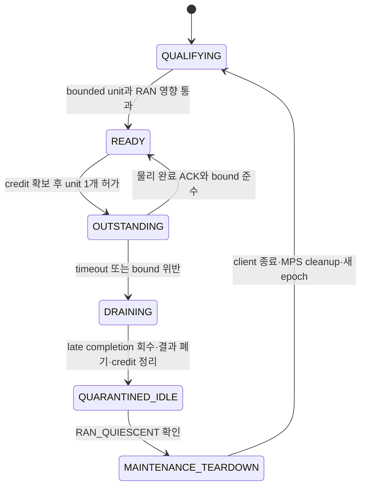

> **보관 사유 (2026-09-25):** 이 문서는 실험 이력으로 보존한다. 최신 스킴과 claim boundary는 `docs/current`의 원고·모델·production gate 문서가 권위 기준이며, 과거 GPU0 전용, MIG, CloudLab 또는 4-GPU pool 가정은 현재 논문의 근거가 아니다.

# SoftWall: 같은 GPU의 MPS 공유 타당성과 첫 실험

**기준일:** 2026-09-21 UTC. **판정:** 동일 GPU/MIG OFF/MPS feasibility를 실제 valid PUSCH와 NeuralRx로 실행했다. S0, 제한 S1과 실제 외부 transaction을 연결한 S2 optional NeuralRx/recovery vertical slice를 완료했다. Confirm45/47의 독립 seed·역순 eager 비교는 모두 frozen gate를 통과했다. Unconditional hard deadline은 아직 입증되지 않았다. 실행 결과와 실패 조건은 [실험 gate ledger](../../results/softwall_same_gpu/EXPERIMENT_GATE_LEDGER_KO.md)를 따른다.

사용자가 확정한 목표는 **“허용한 AI 작업 안에서 RAN deadline 보장, 남는 자원으로 AI 처리량 확보”**다. 따라서 MIG OFF인 **동일 물리 GPU**에서 RAN과 협조적인 AI worker를 함께 실행하는 검증을 필수 첫 게이트로 삼는다. L1 전용 GPU + 별도 NRx/AI pool은 비교 구성과 후속 확장이다. 이전 문서의 2-GPU 우선순위를 이 결정으로 대체한다.

프로젝트 파일·실행 상태·새 결과의 루트는 `/pscratch/sd/s/sgkim/kcj/airan_cloudlab`로 제한했다. Slurm job `58625542`, `58637416`, `58660634`에서 실제 MPS server/client, full-PHY RAN, NeuralRx, Qwen2.5-1.5B 및 합성 compute/HBM 부하를 실행했다. Heavy Qwen, AI fault, 자연 채널 S2와 두 셀 fallback 결과까지 프로젝트 내부 보고서에 정리했다.

## 1. 정확히 무엇을 보장할 것인가

목표 계약은 다음과 같다.

> 정해진 RAN 도착·무선 부하 범위와 실행환경에서, 허용 목록의 AI가 정해진 실행 단위·미완료 작업 수·메모리/전송 규칙을 지키면 모든 대상 RAN 요청이 자신의 실제 expiry 안에 완료되도록 한다. 그 조건에서 AI의 유효 처리량을 최대화한다.

- Deadline 준수와 단독 실행 때의 동일 latency는 다르다. 공유로 조금 느려져도 deadline 내 완료하면 목표를 충족한다.
- RAN 부하 범위에는 셀 수, PRB/MCS, LDPC 반복 상한, arrival burst/jitter, CPU 제어 지연 등을 명시한다. RAN 요청을 누락하거나 arrival을 늦춰 성공률을 높이지 않는다.
- AI 허용 목록은 모델 이름뿐 아니라 shape, batch, prefill/decode 또는 training phase, 실행 단위, 동시 worker 수, DMA와 allocation 정책까지 정의한다.
- 범위 안에서 발생한 miss는 실패다. 결과를 본 뒤 실패 workload를 조용히 범위 밖으로 옮기지 않는다. 범위를 변경하면 새 계약으로 다시 평가한다.
- 무선 CRC-fail을 기한 내 반환한 것과 계산 deadline miss는 구분한다. Optional NRx를 도입할 때는 correct-TB/유효 bit의 하한도 함께 고정한다.
- GPU/driver 고장과 비협조적 무제한 제출은 이 계약의 대상이 아니다. 성능 보호를 장애·보안 격리 전체와 동일시하지 않는다.

**보장 근거는 두 층으로 분리한다.** 조건부 hard deadline 주장은 실행시간·잔여 blocking·호스트 지연 등의 상한과 예약 가능성 분석이 필요하다. 측정 최대값이나 p99에 margin을 붙인 값은 우선 경험적 예산이다. 이 단계에서 말할 수 있는 것은 명시한 조건에서의 관측 결과이며, “miss 0회”만으로 모든 미래 실행의 보장을 증명하지 않는다. 상한을 방어하지 못하면 해당 결과를 통계적 SLO 검증으로 표시한다.

## 2. MPS 기능과 현재 환경

| 수단 | 확인한 기능 | 설계에 미치는 영향 |
|---|---|---|
| 일반 MPS active-thread 비율 | 사용 가능한 실행 자원을 제한하지만 전용 SM을 예약하지 않음. 일반적인 process 설정은 시작 시 적용 | coarse tuning baseline. 매 slot 비율 변경으로 즉시 회수한다고 설계하지 않음 |
| CUDA stream priority | 실행 순서의 힌트이며 이미 실행 중인 작업을 선점하지 않음 | 긴 AI kernel의 중단 수단으로 사용할 수 없음 |
| 최신 MPS static SM partitioning | Ampere 이상에서 전용 SM 배정. 다른 partition이 빈 SM을 자동으로 빌리지 못함 | MIG 없는 추가 baseline 후보. SM 전용 배정만으로 전체 RAN deadline이나 HBM 대역폭 예약이 따라온다고 가정하지 않음 |

근거: [NVIDIA MPS resource provisioning](https://docs.nvidia.com/deploy/mps/when-to-use-mps.html), [CUDA stream priority API](https://docs.nvidia.com/cuda/cuda-runtime-api/group__CUDART__STREAM.html), [MPS static SM partitioning](https://docs.nvidia.com/deploy/mps/common-tasks.html).

Static SM 모드는 dynamic 비율 제한과 별개이며, 그 모드에서는 dynamic provisioning 설정이 무시된다. 이를 함께 조절하는 하나의 actuator로 설명하지 않는다. “MPS는 어떤 경우에도 전용 SM을 제공하지 않는다”는 문장도 최신 기능을 고려하면 부정확하다. 지원 여부와 모드를 명시해야 한다. [NVIDIA static SM 제약](https://docs.nvidia.com/deploy/mps/when-to-use-mps.html#static-sm-partitioning)

실제 실험 환경:

```text
Slurm job 58625542, node nid001201
NVIDIA A100-SXM4-40GB, driver 580.178.04, MIG Disabled
Aerial CUDA-Accelerated RAN 25.3.2, commit 3bf76a43dceb493b00f2ee75fdfbb87038eab7c6
실제 MPS control/server 및 client 등록 확인
cap50 client가 108 SM 중 54 SM을 보는 것을 확인
```

이번 결과는 위 allocation의 GPU0 한 개에서 측정했다. MPS static SM partitioning은 설치된 제어 도구에서 확인되지 않아 사용하지 않았고, 일반 active-thread percentage와 workload admission만 사용했다.

## 3. 지금 해볼 만한 이유와 아직 부족한 증거

실행 결과로 feasibility 자체는 확인됐다. Valid paired 2-cell full-PHY 조건에서 NeuralRx S0는 0/5,000 miss와 380.9 inference/s, NeuralRx cap80 S1은 0/5,000 miss와 860.3/s를 기록했다. Heavy Qwen batch 8/context 512에서는 cap100이 153/5,000 miss였지만 cap80은 0/5,000 miss와 cap100 처리량의 약 85%를 기록했다. HBM copy는 무제어 상태에서 2,963/3,000 miss, S0에서 0/3,000 miss였다. 이 수치는 MPS cap 하나가 모든 workload를 격리하는 것이 아니라 S0 admission과 workload별 S1 qualification이 모두 필요함을 보여준다.

S2도 실제로 실행됐다. −8.5 dB 자연 채널에서 conventional-only와 NeuralRx-only 성공 trace가 모두 존재했고, 10,000 one-cell paired releases에서 S2는 eager dual 대비 −0.0300 pp의 utility 차이와 95% CI [−0.0819,+0.0219] pp로 사전 비열등성 한계 −0.25 pp를 통과하면서 background 처리량을 3.17% 높였다. 보수적 host-tail budget의 3,000 two-cell releases에서는 deadline·branch-bound·AI 위반 없이 utility 비열등성과 background +5.53%를 달성했다. 100건의 의도적 late admission은 모두 optional NRx를 거부하고 conventional로 안전하게 전환됐다.

별도 MPS client의 physical overrun도 진단했다. 40회 NeuralRx graph unit은 cap100에서 약 45 ms, cap20에서 약 126 ms 실행됐고 5 ms timeout 뒤에도 RAN과 실제로 겹쳤다. P60/D25는 cap100 2/1,500, cap20 1/1,500 miss로 실패해 MPS cap만의 완전 격리를 반증했다. D35에서 cap20은 5,000 releases와 1,500 overlap 모두 miss 0이었지만 cap100의 non-overlap release에서 36 ms residual tail이 한 번 발생했다. Worker 없는 conventional-only 10,000 releases는 miss 0, GPU max 7.571 ms였다. 따라서 workload bound뿐 아니라 MPS campaign state와 drain/quarantine도 contract 대상이다.

후속 confirm29–30은 recovery 동작 자체를 분리했다. 새 admission만 막고 context를 idle로 둔 경우 cap20에서 1/5,000 miss가 남았고, late response drain 직후 process/MPS client를 종료한 경우 cap100 6/5,000, cap20 11/5,000 miss가 발생했다. 모든 miss는 worker physical completion/retirement 뒤였고 active-overlap miss는 0이었다. 따라서 fail-closed는 `(결과 폐기, credit 유지, 새 admission 차단)`을 즉시 수행하되, CUDA context/MPS client teardown은 RAN-free maintenance window에서만 수행해야 한다.

Confirm31은 worker를 live RAN 종료 뒤에만 멈추고 20초 quiet interval 후 새 conventional process를 시작했다. 기록상 cap100/20 각각 3,000 post-maintenance releases에서 miss 0이었지만, 사후 monotonic timestamp 대조에서 다른 sham-retirement campaign과 release 구간이 겹친 사실이 확인됐다. 이 자료는 PASS 근거에서 제외하며 lifecycle 복귀 경로는 전역 experiment lock 아래 단독 재실행해야 한다.

Confirm32는 clean request-specific PUSCH/channel-estimate와 output LLR을 CUDA IPC로 교환하는 별도 cap80 endpoint를 timed epoch 전체에 상주시켰다. 10,000 releases에서 correct 10,000/10,000, miss/timeout 0, response p99 4.125 ms였고 endpoint는 86 SM을 확인했다. 따라서 clean same-request physical endpoint vertical slice는 성립했다.

Confirm33은 같은 외부 endpoint를 −8.5 dB 자연 채널로 확장했다. 10,000 releases에서 자연 fallback 221건 중 conventional path가 47건을 복구했고, deadline miss와 endpoint timeout은 0, response p99/max는 6.004/30.669 ms였다. 따라서 same-request natural recovery의 physical vertical slice도 성립했다. Background lease와 강한 paired baseline은 별도 gate로 남는다.

동시에 hard guarantee에 필요한 증거는 아직 부족하다. RAN-alone의 관측 최악값이 20.999 ms로 21 ms deadline에 매우 가깝고, Qwen S0 50 ms-period 실험은 AI overlap 없이도 1/1,500 miss가 발생했다. 따라서 현 단계의 0 miss 결과는 통계적 qualification이며, RAN과 AI의 방어 가능한 실행 상한 및 workload 전환 뒤 residual state 상한이 추가로 필요하다.

기존 [Perlmutter 보고서](../../results/visual_evidence/PERLMUTTER_NOMIG_VISUAL_EVIDENCE_KR.md)의 frame p99는 NeuralRx 동거에서 default 389ms → MPS 40ms로 개선됐지만, HBM 포화에서는 426ms → 6985ms로 악화된 조건도 있다. **이 수치는 기존 보고서의 관측값이며 이번에 다시 측정한 결과가 아니다.**

이는 공유의 이득과 workload 의존성을 동시에 보여준다. 그러나 해당 harness에는 잦은 allocation/free 등의 영향이 섞여 있고, 이 frame 수치를 실제 slot deadline 성공으로 바꿔 해석할 수 없다. 깨끗한 상주 버퍼 경로에서 다시 분해해야 한다.

또한 [real_l1.py](../../scripts_for_node/task1/real_l1.py)의 `run_one_cell()`은 CE/NI/EQ 후 LLR를 반환하고 de-rate-match/LDPC/CRC를 미뤄 둔다. 입력도 합성 tensor다. 첫 실험 전에 실제 paired radio 입력과 전체 완료 경로를 연결해야 한다. 상세 수치 정정은 [기존 검토](RESEARCH_PLAN_SOFTWALL_REVIEW_KO.md)를 따른다.

## 4. 제안 스킴: 실행을 허가하고 실제 완료까지 추적

```text
CPU 제어기: RAN 예약 calendar + AI 허가/완료 + 물리 자원 credit
                        │
               같은 GPU / MIG OFF / MPS
               ├─ RAN: 필수 PHY → LDPC/CRC → commit
               └─ AI: 허가된 unit 하나 → 실제 GPU 완료 → 다음 허가
```

**S0: 시간 분리부터 성립시킨다.**

1. RAN full path를 상주 버퍼로 준비하고 요청마다 release와 absolute expiry를 기록한다. 모든 셀의 필수 실행 구간을 먼저 예약한다.
2. AI는 모델을 상주시킨 worker 하나로 시작하고, 미완료 unit은 최대 하나로 제한한다. GPU kernel뿐 아니라 copy와 숨은 비동기 제출도 해당 unit에 포함한다.
3. 현재 시각을 `t`, 다음 보호 구간의 시작을 `s`, 제어 지연 예산을 `H`, unit의 완료 비용 예산을 `C`, guard를 `G`라 하면, **`t + H + C + G <= s`**인 경우에만 새 unit을 허가한다. `s`에는 알려진 arrival jitter를 반영하고, 현재 보호 구간 중에는 허가하지 않는다. 이 식은 AI admission 조건이며 전체 RAN schedulability 증명을 대신하지 않는다.
4. Worker의 제출 완료 ACK가 아닌 **관련 모든 stream/DMA의 실제 완료 event**를 확인한다. 그 전에는 unit·버퍼·credit을 반환하지 않는다. RAN 보호 구간에는 background를 겹치지 않는다.
5. 보호 구간에서 RAN을 완료하고, 예약 해제 후 남는 구간에 다음 AI unit을 허가한다. AI 실행 후의 cache 상태·clock·전력 영향도 RAN 비용 및 guard 검증에 포함한다.

이 단계는 같은 GPU를 시간에 따라 공유하는 강한 baseline이다. MPS를 사용해도 동시 실행 이득까지 입증한 것은 아니다. AI kernel이 길면 priority로 잘라 낼 수 없으므로 실제로 분할 가능한 연산을 쓰거나 해당 unit을 거절한다. LLM의 한 token이나 training의 한 layer가 충분히 짧다고 미리 가정하지 않는다. 분할 오버헤드와 최종 AI 결과의 유효성도 확인한다.

**S1: 검증한 조합에 한해 제한된 동시 실행을 허용한다.**

- Compute/HBM/copy 특성, tensor shape, phase, 미완료 unit 수에 따라 RAN 비용을 측정하고, 허용된 overlap 상태를 예약 모델에 넣는다.
- 모든 기존 RAN 예약이 유지되는 조합만 허가한다. 메모리 집중 phase는 시간 분리로 돌아가는 정책도 비교한다.
- 예측 오차나 bound 위반 시 새 AI 허가는 중지한다. **이미 실행 중인 unit은 이 조치로 없어지지 않으므로 현재 RAN 요청의 안전을 자동 복구한다고 주장하지 않는다.** 위반 자체와 영향받은 요청을 결과에 남긴다.
- Late unit이 끝나면 결과를 폐기하고 endpoint 상태를 `QUARANTINED_IDLE`로 둔다. 실시간 release가 계속되는 동안 process kill/CUDA context destruction을 실행하지 않는다. `RAN_QUIESCENT`가 확인된 maintenance window에서만 client를 종료하고 MPS cleanup 완료 뒤 재qualification한다.
- 초기에는 시작 시 정한 MPS cap을 유지하고 runtime actuator는 unit 허가량과 overlap 여부로 한정한다.

**S2: Optional NRx와 recovery를 결합한다.** 첫 vertical slice를 완료했다. NRx admission 때 endpoint와 conventional recovery 구간을 함께 확보하고, 그 예약을 제외한 여유에서 background를 허가한다. 결과는 single-commit/epoch로 fence하며 늦은 admission은 conventional로 fail-closed한다. 두 logical cell의 correlated recovery도 단일 fallback lane의 비중첩 interval로 검증했다. 별도 process/context의 physical overrun 진단은 MPS cap만으로 D25를 보호할 수 없음을 보였고, Confirm30은 즉시 client teardown도 D35를 보호하지 못함을 보였다. Confirm32/33의 same-request CUDA-IPC endpoint, Confirm42의 실제 transaction 연결을 거쳐 Confirm45/47의 독립 seed·역순 eager 비교에서 완료 AI +2.95%/+2.41% 및 +1.38%/+1.11%를 얻었고, 모두 frozen gate를 통과했다. Confirm43/44의 gap lease ON/OFF는 추가 처리량을 보였으나 두 protocol 모두 NRx 30 ms 상한 gate에 실패했다. 오염된 Confirm31 maintenance 자료는 제외했고, Confirm46 CPU socket sham 대조는 GPU/MPS client 수명주기의 deadline 위험을 확인했다. 남은 연구 범위는 강한 기존 기법 결합 baseline, 독립 cell/channel, 고장 상황의 fallback과 방어 가능한 timing bound다.

구체적인 endpoint lifecycle은 다음과 같다.



`DRAINING` 이후 현재 요청은 예약한 conventional 경로로 끝내고 late NRx 결과는 commit하지 않는다. `QUARANTINED_IDLE`에서는 새 work를 전혀 내리지 않는다. Process 종료를 이 상태 진입 동작으로 묶지 않는 것이 confirm30에서 얻은 핵심 수정이다.

## 5. 첫 실험의 최소 matrix와 순서

| 순서 | 구성 / 작업 | 확인할 질문 |
|---|---|---|
| P0 | 실제 timing 정의 + full-PHY RAN 단독 | 같은 offered load에서 RAN 자체가 expiry를 충족하는가? |
| P1 | 허용 AI의 unit 길이·완료/제어 비용·분할 손실 측정 | RAN 여유 구간에 실제 유효 AI 작업이 들어가는가? |
| P2 | RAN + 무제어 MPS, 튜닝한 cap/priority MPS | 기본 공유와 coarse 제어의 한계는 무엇인가? |
| P3 | S0: RAN 보호 구간 + AI 실제 완료 확인 | Deadline을 지키면서 의미 있는 AI 처리량이 남는가? |
| P4 | S1: 제한된 overlap + 같은 조건의 S0 | 같은 RAN 요구에서 시간 분리보다 추가 이득이 있는가? |
| P5 | S2: optional NRx/recovery 공동 제어 — vertical slice 완료 | eager와 비열등한 utility에서 one-cell +3.17%, two-cell +5.53% background 이득. 별도 endpoint process와 더 강한 baseline은 후속 |
| 선택 | 지원 환경에서 MPS static SM partitioning | 전용 SM 배정만으로 충분한지, 유휴 자원·메모리 경합 비용이 남는지? |

최소 AI 부하는 compute 중심 GEMM, HBM 중심 연산, 전송 중심 부하, 실제 AI 한 종류로 시작한다. 합성 부하는 원인 분해용이며 최종 AI 처리량의 대체 지표로 쓰지 않는다. Allocation 압박은 상주 버퍼 본 실험과 분리한 진단 조건으로 둔다. 각 부하에서 unit 크기와 RAN 직전 제출 시점, prefill/decode 등의 phase 전환을 바꾼다. 한 worker·한 셀부터 시작해 worker/셀/burst를 늘린다.

공통 측정 항목:

- Offered 요청 기준 RAN miss, 최대·tail response time, enqueue 지연, CRC-fail, correct-TB/유효 bit. Arrival은 이전 요청 완료와 독립적으로 생성한다.
- AI **완료된 유효 작업** 처리량, unit 크기, 분할/제어 비용, 허가 거절 이유, 보호 구간 유휴 시간.
- 예약 대비 실제 완료 오차, 보호 구간을 침범한 unit/DMA, 미완료 credit과 buffer 수명.
- 동일 trace·deadline·radio workload·CPU/GPU 예산, 반복 run, 전체 표본 수, warm-up/계측 비용. 낮은 miss율은 표본 규모와 상관성을 고려해 해석한다.

S0의 통과 조건은 workload 범위를 미리 고정한 상태에서 RAN 요구를 충족하고 유효 AI 처리량이 남는 것이다. AI를 전부 막아 얻은 miss 0은 공유 성공이 아니다. 실용적으로 필요한 AI 처리량 하한은 대규모 실험 전에 정한다. S1은 같은 RAN 요구를 만족하는 S0보다 좋아야 추가 복잡도가 정당화된다.

P0 실패 시 모델/PHY 구현과 timing부터 수정한다. P1에서 어떤 유효 unit도 들어가지 않으면 그 AI workload에 대해서는 여유 자원 회수가 성립하지 않는다. S0만 성공하면 시간 분리 결과로 보고하며, 동시 실행 격리 성공으로 확대하지 않는다. S1이나 static SM만으로 충분하면 복잡한 predictor/공동 제어가 꼭 필요하다는 주장을 고집하지 않는다.

## 6. 연구 novelty와 다음 구현 작업

**“MPS로 RAN과 AI를 공유”, “AI를 작은 단위로 나누어 여유 시간에 실행”만으로는 새로움이 부족하다.** [기존 related-work 조사](SOFTWALL_RELATED_WORK_AUDIT_KO.md)에는 YinYangRAN과 MobiUK 2026의 AI-and-RAN 안전 공유 초록 등 가까운 접근이 포함되어 있다. 현재 방향이 단순 시간 분리로 좁아질수록 이들과의 비교가 더 중요해진다. 해당 조사에서 읽은 초록의 원 URL은 이번 재접속에서 열리지 않아 새 내용은 추가 확인하지 못했다.

방어할 후보는 **같은 GPU에서 mandatory RAN·선택적 NRx·recovery의 예약을 실제 미완료 AI/DMA와 결합하여, 정해진 deadline/무선 품질 조건에서 공유 이득을 늘리는 정책과 그 분석**이다. 고정 guard·고정 unit·채널 기반 NRx·독립 recovery를 충분히 튜닝한 결합 baseline을 이겨야 한다. 단순 temporal scheduling, 최신 static SM 기능 자체, 기존 DART 코드의 재사용을 각각 새 기여라고 주장하지 않는다.

이 문서 §5의 동일 GPU 최소 matrix는 구현·측정했고, 추가 사전 고정한 Confirm50의 gap lease 비교도 종료했다. 이는 [원 계획서](RESEARCH_PLAN_SOFTWALL_KO.md)의 P0–P7 전체 완료를 뜻하지 않는다. 아래 세 항목은 조건부 시스템 구성의 실측 근거를 넘어 더 강한 논문 주장이나 운영 보증을 목표로 할 때 남는 연구 범위다.

1. **Same-request endpoint 장애 수명:** 정상 경로의 별도-process request/response 및 background lease는 검증했다. 이제 실제 timed-out request의 nonblocking timeout, late-response drain, buffer/credit 수명과 유지·maintenance teardown 후 재허가 조건을 검증한다.
2. **Radio/arrival 범위 확대:** 독립 cell/channel, MCS, 비동기 burst와 실제 offered queue에서 deadline-valid correct-TB 또는 delivered bit를 평가한다.
3. **상한과 강한 baseline:** RAN 희귀 tail을 분해해 timing contract를 강화하고, 충분히 튜닝한 채널 gate+고정 recovery+독립 lease 및 다중 GPU DART와 비교한다.

새 결과는 프로젝트 내부 `results/softwall_same_gpu/`, 실행 상태·MPS pipe/log·사용자 지정 cache는 `run_state/softwall_same_gpu/` 아래로 고정한다. 실행 전 실험 GPU 사용 권한과 기존 client 점유를 확인한다. 첫 판단의 핵심은 **“같은 GPU에서 전체 RAN deadline을 지키면서 실제 AI 작업이 얼마나 남는가”**다.
