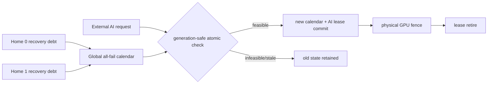

> **보관 사유 (2026-09-25):** 이 문서는 실험 이력으로 보존한다. 최신 스킴과 claim boundary는 `docs/current`의 원고·모델·production gate 문서가 권위 기준이며, 과거 GPU0 전용, MIG, CloudLab 또는 4-GPU pool 가정은 현재 논문의 근거가 아니다.

# SoftWall V17 후보: 여러 RAN home의 shared mandatory-recovery certificate

**상태:** 2026-09-25, C159-Q1/Q2 actual-NRx PASS / C161 A0--A6 qualified-node fault PASS / C162 predictive envelope·64-debt scheduler PASS / Q3 throughput headroom 0  
**현재 권위 물리 mode:** V16 four-point-qualified, disjoint recovery home  
**이 문서의 범위:** shared recovery GPU를 위한 다음 단계 모델과 물리 승격 gate

## 판정

V16까지의 멀티 GPU 경로는 각 RAN home이 자기 mandatory conventional recovery lane을
가지며, global broker는 외부 AI request ownership만 공유한다. 이 구조에서는 각 local
all-fail certificate의 곱으로 전체 안전성을 설명할 수 있다.

여러 home의 conventional recovery까지 한 GPU 또는 한 lane에 모으면 이 합성은 성립하지
않는다. 로컬 calendar가 각각 안전해도 같은 물리 lane에서 합친 부하는 deadline을 넘을 수
있다. 따라서 shared recovery mode에는 모든 home의 미해결 recovery debt와 external-AI
lease를 한 번에 검사하는 **global executable certificate**가 필요하다.

Control-plane 모델은 `MODEL_PASS_PHYSICAL_UQ`를 통과했다. 이어 C151/C152는 두 home의
실제 PUSCH input을 CUDA IPC+NVLink P2P로 한 GPU의 persistent cuPHY conventional worker에
보내고 decoded TB/CRC를 돌려받는 경로를 서로 다른 A100 node 두 곳에서 실행했다. 합계
1,000 request가 전부 정답이고 global-order/lifecycle 오류는 0이었다. C153은 이어
model-issued dispatch와 Qwen/cuPHY transaction을 한 node에서 연결했다. 다만 injected
outcome의 development canary였다. C154/C155는 이후 서로 다른 두 A100 node, 반대 arm 순서와
독립 seed에서 all-fail/conditional/all-success/overload 8개 arm을 모두 통과했다. 따라서
controlled-outcome synthetic V17 integration은 finite-sample PASS지만 actual NeuralRx-driven
mode와 fault mode에는 이 판정을 확장하지 않는다. C156은 fixed lease가 launch control을
포함하지 않는 반례를 찾았고, 실제 decision 시각에서 `control5+AI35`를 선납하는 V17.1로
교정했다. 두-node Nsight arm은 Qwen/recovery kernel2,660과 forbidden overlap0 ns,
certificate/transport phase order, commit4/4와 miss0을 통과했다.
C157A/C157B는 같은 noisy TB의 실제 TensorRT NeuralRx CRC를 global credit transition에
연결했다. 두 node 합계 actual success4, Qwen2, same-input conventional-equivalent
recovery4, single commit8, miss0이었다. 따라서 warm synthetic actual-NRx mode까지
finite-sample PASS였다. C158은 이를 persistent mode에서 두 node·500 epoch로 반복해 actual
NRx2,000, success1,440, shared recovery560, Qwen500, single commit2,000과 deadline·bound·
credit·input/output fence violation0을 얻었다. C159-Q1은 pre-staged input bank와 whole-path
preflight로 `P180/D155` context-64 mode를 두 새 node에서 actual NRx2,000, recovery582,
Qwen500, commit2,000, 위반0으로 재자격했다. C159-Q2는 여섯 Qwen class에서 두 node·
1,200 epoch, actual NRx4,800, recovery1,312, Qwen1,077, commit4,800, 위반0을 얻었다.
C159-Q3의 empirical recovery-first oracle은 SoftWall과 385,262 token으로 같아 performance
holdout을 중단했다. Integrated fault mode는 UQ다.

## 왜 local certificate의 합으로 부족한가

한 recovery job이 25 ms, deadline이 100 ms이고 shared lane이 하나라고 하자.

| Home | 미해결 recovery 수 | 로컬 필요 시간 | 로컬 판정 |
|---|---:|---:|---|
| `h0` | 3 | 75 ms | feasible |
| `h1` | 2 | 50 ms | feasible |
| 합계 | 5 | 125 ms | **shared lane infeasible** |

각 home만 보면 둘 다 안전하지만 두 calendar를 같은 GPU에 놓으면 25 ms가 부족하다.
V17 유한 grid의 25개 `(n0,n1)` 조합에서는 이런 **local-safe/global-unsafe 상태가 10개**
나왔다. Shared resource의 상태를 local 판단기로 검사하면 false-safe가 된다는 직접 반례다.

## 모델

각 미해결 optional NeuralRx 요청의 recovery obligation을 다음처럼 둔다.

```text
R_i = (home_i, request_i, release_i, deadline_i, service_i)
```

Shared recovery capacity가 `m`개 lane일 때 global certificate는 모든 `R_i`에 lane과
`[start_i, finish_i]`를 할당해 다음을 만족한다.

```text
release_i <= start_i
finish_i = start_i + service_i <= deadline_i
같은 lane의 recovery interval은 겹치지 않음
허가된 shared-AI lease와 어떤 recovery lane도 겹치지 않음
```

현재 prototype은 작은 상태를 정확히 검사하기 위해 job 순서와 lane 배치를 exhaustive
search한다. 고정된 순서와 lane에서는 가장 이른 합법 배치가 지배적이므로, 모든 다음
job/lane 선택을 열거하면 입력된 유한 job 집합에 대한 exact certificate가 된다. 이는
대규모 online solver 성능 주장이 아니라 안전 의미론을 고정하는 reference model이다.

## 원자 transaction

`SharedRecoveryCoordinator`는 다음 상태를 한 generation 아래 유지한다.

```text
Y_g = (all-home recovery obligations,
       shared AI leases,
       executable placements,
       generation g)
```

동작은 다음과 같다.

1. `reserve_mandatory`: 새 obligation을 넣은 전역 all-fail schedule이 있을 때만 commit한다.
2. `resolve_success`: NRx 성공으로 debt 하나를 제거하고 남은 certificate를 다시 만든다.
3. `replan_and_lease`: recovery 재배치와 AI lease를 한 후보 상태에서 검사해 함께 commit한다.
4. `retire_lease`: 실제 GPU completion fence가 확인된 lease만 반환한다.
5. 모든 update는 expected generation을 검사한다. 오래된 home view는 새 상태를 덮지 못한다.

후보 schedule이 없거나 generation/fence가 맞지 않으면 obligations, leases, placements와
generation을 모두 그대로 둔다. 이 규칙은 calendar를 먼저 바꾸고 AI lease가 나중에
실패하는 중간 상태를 만들지 않는다.



V17.1의 physical fence는 host completion doorbell만 뜻하지 않는다. C158 mode는 owner가
보존한 input shadow와 worker-side 수신 buffer의 round-trip을 byte-exact 비교하고, worker
output을 owner로 보낸 뒤 worker가 response buffer를 다시 read-back해 원본 output과 비교한다.
두 equality와 generation이 일치한 뒤에만 result를 publish하고 credit을 반환한다. Shared
CRC는 verified boolean을 `0=pass, 1=fail`로 직렬화하며 raw cuPHY byte는 telemetry로만 둔다.
이 fence는 stale/cross-generation transport를 차단하는 prototype contract이고 decoder 자체의
정답 증명은 아니다. CRC pass는 transmitted payload equality로 따로 검사한다.

## 유한 상태 검증 결과

| 검증 | 결과 |
|---|---:|
| 기본 coordinator 단위시험 | 6/6 PASS |
| Equal-deadline `(n0,n1)` 상태 | 25개, analytic capacity와 불일치 0 |
| Local-safe/global-unsafe 반례 | 10개 |
| 한 성공 뒤 25 ms AI lease가 열리는 조건부 상태 | 5개 |
| Variable release/deadline/AI-blackout 상태 | capacity 1/2, 3,400개 |
| 독립 discrete-slot oracle와 불일치 | 0 |
| Reject 뒤 state 변경 | 0 |
| Stale generation 허용 | 0 |
| Fence 없는 lease retire 허용 | 0 |

결과 artifact는
[shared-recovery model v1](../../results/softwall_multigpu/softwall_shared_recovery_model_v1.json)에
고정했다. 구현은
[`shared_recovery_certificate_v1.py`](../../scripts_for_node/softwall_same_gpu/shared_recovery_certificate_v1.py),
검증기는
[`verify_shared_recovery_certificate_v1.py`](../../scripts_for_node/softwall_same_gpu/verify_shared_recovery_certificate_v1.py)다.
다섯 code/test/result 파일의 SHA-256은
[deterministic manifest](../../results/softwall_multigpu/softwall_shared_recovery_model_v1_manifest.json)에
고정했다.

## Shared cuPHY data path 결과

C151/C152의 frozen protocol은 GPU0/1을 두 home source, GPU2를 shared conventional worker로
두고 각 home 250건씩 실행했다. 두 노드 `nid001253`, `nid001280`의 결과는 다음과 같다.

| 항목 | 결합 결과 |
|---|---:|
| Home/worker request | 1,000 / 1,000 |
| Correct decoded TB/CRC | 1,000/1,000 |
| Global-order mismatch | 0 |
| Source/config/P2P/IPC lifecycle 위반 | 0 |
| Worker path p99 | 3.146 / 2.918 ms |
| Worker path max | 11.871 / 10.909 ms |

이는 shared cuPHY data path와 정적 global order의 유한 표본 자격이다. 최대값을 service
bound나 WCET로 사용하지 않는다. [C151/C152 결과](SOFTWALL_CONFIRM151_152_SHARED_RECOVERY_PATH_KO.md)와
[combined qualification](../../results/softwall_multigpu/confirm151_152_shared_conventional_qualification.json),
[24-file manifest](../../results/softwall_multigpu/confirm151_152_shared_conventional_manifest.json)에
근거를 고정했다.

## V16과 V17 후보의 정확한 관계

| 항목 | V16 현재 QSU | V17 후보 |
|---|---|---|
| Mandatory recovery | home별 별도 GPU/lane | 여러 home이 한 GPU/lane 공유 |
| 안전 certificate | local certificate의 곱 | 전 home global executable calendar |
| 공유 대상 | external AI ownership | recovery capacity + AI lease |
| 실제 GPU 경로 | C121--C148에서 실행 | C151/C152 path + C154/C155 integration + C156 timeline + C157 transition + C158 repeated + C159-Q1/Q2 P180 actual NRx |
| 현재 판정 | qualified finite-sample mode | P180 여섯-class actual-NRx, A0--A6 qualified-node fault, predictive envelope와 64-debt certified scheduler PASS; Q3 추가 throughput headroom 0 |

V17 후보는 V16을 대체하거나 V16 결과를 소급해 확장하지 않는다. Physical gate를 통과하면
`disjoint-home composition`보다 일반적인 shared-resource extension으로 논문에 추가할 수 있다.

## 물리 승격에 필요한 구현과 실험

1. **Shared conventional worker — data path와 model-issued canary 완료.** C151/C152에서 한
   GPU의 persistent cuPHY worker가 두 home request 1,000건을 전역 순서로 처리했다.
   C153은 reference model placement가 두 실제 recovery 순서를 직접 발급했다.
2. **Payload transport — two-node controlled holdout 완료.** CUDA IPC+NVLink P2P로 input과
   decoded TB/CRC를 이동하고 handle-close-before-ACK를 검증했다. C153은 generation을
   global schedule과 일치시키고 실제 home radio commit까지 연결했다. C154/C155는 recovery
   20건과 correct commit 20/20을 두 node에서 재현했다.
3. **Global dispatch conformance — controlled holdout PASS.** C153--C155 worker는 global
   placement를 따랐고 rejected fifth request의 physical launch는 0이었다.
4. **Atomic physical lease — controlled holdout PASS.** C154/C155는 success12와 Qwen fence4,
   physical recovery20을 반대 arm 순서에서 위반 없이 실행했다.
5. **Correlated fault.** 두 home의 NRx가 동시에 실패하는 arm, stale/duplicate response,
   broker post-apply reply loss와 shared worker response delay를 포함한다.
6. **Falsification pair — two-node PASS.** C154/C155의 overload/conditional arm은 local
   admission 가능한 fifth debt를 state mutation과 physical launch 없이 총 4회 거절했다.
7. **Controlled integrated holdout 완료.** C154/C155는 같은 source, 반대 branch order와
   독립 seed로 두 node에서 8개 arm을 통과했다.
8. **GPU timeline과 launch-time revalidation 완료.** C156 attempt2는 fixed lease의
   launch-control 누락을 반증했다. V17.1 attempt3은 revalidation1.745 ms,
   dispatch1.768 ms<5, Qwen kernel1,224, recovery kernel106, overlap0 ns와 miss0을 통과했다.
   C156b는 다른 node와 새 seed에서 같은 11개 gate를 재현했다.
9. **Actual NeuralRx holdout 완료.** C157A/C157B는 실제 TensorRT NRx CRC가 success credit을
   해소하고 failure debt만 shared cuPHY로 보내는 전이를 두 node에서 재현했다. 남은
   물리 승격 gate는 integrated fault matrix다.
10. **Repeated data-plane qualification 완료.** C158은 persistent mmap control,
    generation-scoped input round-trip과 response read-back echo, monitor/P2P preflight를
    포함한 frozen source를 두 node의 2,000 actual-NRx request에서 반복했다. `P600` staging
    간격은 통과했고 C159-Q1/Q2가 pre-staged `P180` 여섯-class mode를 별도로 자격화했다.

첫 physical 목표는 처리량 우위가 아니다. **Local-only admission의 false-safe를 실제로
재현하고, global certificate가 그 요청을 GPU launch 전에 거절하면서 이미 허가된 RAN과
bounded AI를 계속 처리하는지**가 핵심 판정이다. 그 뒤에만 static shared calendar와
safe work-conserving baseline을 같은 workload에서 비교한다.

## 논문상 의미와 한계

이 확장은 차별점을 강화한다. 일반 GPU sharing은 실행 중인 queue와 priority를 관리하지만,
이 모델은 여러 RAN home의 optional per-TB NeuralRx가 미래에 만들 수 있는 mandatory
conventional debt를 전역 schedule로 먼저 보유하고, 결과에 따라 해제된 시간만 외부 AI에
lease한다. C151/C152로 debt를 실행할 shared cuPHY/P2P 경로를 세웠고 C153은 model과
runtime의 원자 결합을 처음 실행했다. V17은 controlled-outcome integration과 V17.1 GPU
semantics, C157 transition, C158 반복을 거쳐 C159-Q2의 P180 actual-NRx 4,800-request와
여섯 Qwen class까지 통과했다. Q3에서 strong recovery-first oracle 대비 추가 token headroom은
0.000%로 끝났다. 현재 자격 범위는 warm `P180/D155` variable-context synthetic mode이며
integrated fault, cold/long-idle, production timing은 남아 있다.
