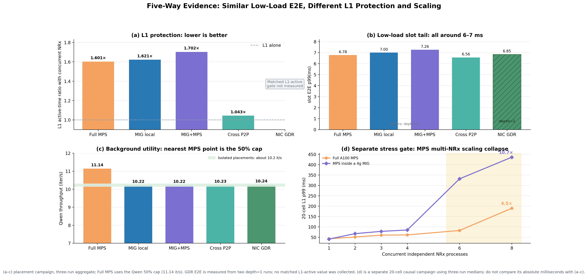
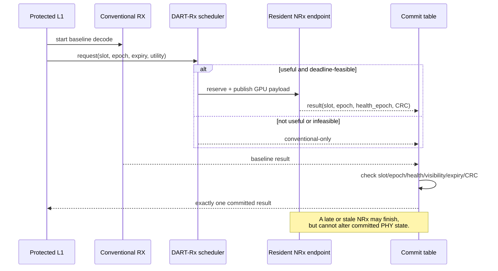
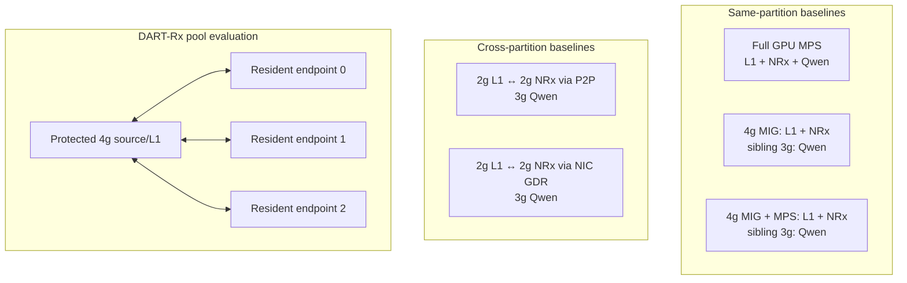

# DART-Rx Research Walkthrough: Problem → Design → Experimental Evidence

**As of:** 2026-08-16  
**Purpose:** This is the primary English document for readers who need to understand the problem,
design, experimental conditions, results, and remaining limitations in one place.  
**Data rule:** Performance PNGs are generated from preserved CSV, JSON, or SQLite experiment
results. The placement architecture map and Mermaid blocks are topology/design schematics, not
performance measurements.  
**Korean counterpart:** [RESEARCH_WALKTHROUGH_KO.md](RESEARCH_WALKTHROUGH_KO.md)

---

## 0. The research in plain language

> **The mandatory L1 radio pipeline runs in protected GPU space. The Neural Receiver (NRx) is
> invoked only for slots that are likely to benefit, and each request is sent to the resident NRx
> endpoint predicted to finish earliest. A late result—or a result belonging to an old slot—is
> discarded, and the conventional receiver result is used instead. None of these actions changes
> the MIG layout or restarts L1.**

Technically, DART-Rx is a **deadline-aware NRx service pool built over a fixed MIG topology**. Its
contribution is not merely copying a tensor through a NIC. It combines five decisions into one slot
transaction: whether NRx is useful, whether it can still finish on time, which endpoint should execute
it, which result may commit, and when background AI must yield capacity.

This is not a paper whose claim is simply “MIG is faster than MPS” or “GDR is faster than P2P.”
MIG, MPS, P2P, and GDR are mechanisms and baselines. The actual problem is the following tension:

```text
L1 needs strong spatial isolation.
        ↓
Static partitioning and placement also fix NRx service capacity in place.
        ↓
Under multi-cell selective bursts, one queue can collapse while another endpoint is idle.
        ↓
MIG cannot be reconfigured on the slot fast path, so capacity must be borrowed
across already isolated, resident endpoints.
        ↓
A remote NRx result may arrive late, so admission, routing, fallback, and commit
must be designed together.
```

The current results validate each link in this causal chain on real hardware. The last fully
integrated experiment—`actual radio + concurrent multi-cell arrivals + multi-endpoint GDR +
background reclaim`—has not yet been completed. The current status is therefore: **the problem and
individual mechanisms are strongly supported, but the final ISCA-level end-to-end claim is not yet
complete.**

### 0.1 Terminology used throughout the report

| Term | Plain meaning | Precise meaning in this work |
|---|---|---|
| slot / request | One unit of radio data to process | One cell's scheduled PUSCH processing transaction |
| L1 | Mandatory radio work that must finish on time | The PHY critical path, including cuPHY channel estimation and LDPC/CRC |
| NRx | An AI receiver used for difficult signals | A TensorRT neural receiver selectively used instead of the conventional receiver |
| service capacity | How much work can be sustained per second | Maximum NRx request rate at which the queue does not grow without bound |
| queue cliff | A small load increase that causes a very large delay | Nonlinear p99 growth as arrival rate approaches or exceeds service rate |
| host blocking | A CPU thread waits inside a CUDA call | Completion of previously submitted GPU work becomes visible at `cudaFree`, synchronization, or copy calls |
| expiry | Last instant at which a result is usable | An NRx result after this time is not allowed to affect the current slot, even if numerically correct |
| commit | Select exactly one final result | Apply either the conventional or a validated NRx result to PHY state |
| endpoint | A permanently ready NRx execution unit | A process/GPU instance with model, TensorRT context, CUDA Graph, and buffers already resident |

### 0.2 Current conclusions in numbers

- **MIG sibling isolation is strong:** adding Qwen to the sibling 3g changed 4g NRx capacity by only
  `-0.11%`.
- **One fixed endpoint still collapses at its service limit:** MIG-local p99 was `3.47 ms` at 300/s
  but `1124.98 ms` at 350/s.
- **An NRx in the same GPU space can block the L1 host thread:** in the 40-cell same-MIG case,
  tracked CUDA API host time grew from `1.68 s` to `25.35 s`, or `15.1×`.
- **MPS collapses as the NRx client count grows:** increasing independent NRx processes from 1 to
  8 raised 20-cell L1 p99 from `42.3` to `189.3 ms` on full-A100 MPS and from `40.7` to
  `435.7 ms` inside 4g MIG+MPS.
- **MPS quota tuning alone is insufficient:** changing L1:NRx from 30:70 to 70:30 inside one 4g
  increased mean end-to-end time from `4.76 ms` to `6.50 ms`.
- **Transport is much smaller than queue collapse:** the equal-depth mean gap between P2P and NIC
  GDR was `0.438 ms`, whereas overloaded tails reached hundreds or thousands of milliseconds.
- **NRx has measured radio value:** utility-based admission preserved the all-NRx correct-TB ratio
  of `0.80` while reducing NRx invocations by 25%.

---

# Part I. Background and problem

## 1. Target AI-RAN execution environment

An uplink request is not an independent AI query. It is a dependency-carrying PHY chain:

```text
(cell, slot, scheduled PUSCH)
  → cuPHY channel estimation / front-end
  → conventional receiver and optional Neural Receiver (NRx)
  → LDPC / CRC
  → commit exactly one result before an absolute decision expiry
```

Three classes of work coexist in the GPU system:

1. **Protected L1:** must satisfy a tail-latency objective and must not be destabilized by
   background AI.
2. **NRx:** an optional PHY stage that improves decoding only in some channel regimes.
3. **Background AI:** Qwen, BERT, Whisper, vision, and RAN-AI workloads that use headroom which
   cannot economically remain empty merely to cover the NRx peak.

NRx is not necessary for every slot. The conventional receiver is sufficient under good channel
conditions, while NRx can improve actual decoding under difficult conditions. NRx demand becomes
bursty when periodic slots from multiple cells align or difficult channels occur in succession.
The important quantity is therefore not day-long average utilization. It is how much queue builds
over a few milliseconds and whether a late result can be rejected safely.

### 1.1 MPS, MIG, and MIG+MPS under one set of criteria

These mechanisms are not progressively better versions of the same abstraction. They solve
different problems.

The five deployments become much easier to distinguish when they use one visual grammar. A
**thick black line is a hardware isolation wall created by MIG**. A dashed MPS-client box controls
an execution share; it is not an isolation wall. P2P and GDR are two data paths that move a tensor
after L1 and NRx have been placed on opposite sides of a wall.


The P2P panel deliberately carries an asterisk. The measured P2P experiment used **one process owning two
MIG CUDA contexts on a topology where peer access actually succeeded**. It must not be generalized
to every cross-process MIG combination. The GDR experiment instead separated L1 and NRx processes,
registered their GPU memories, and carried payload through NIC loopback without staging it in CPU
DRAM.

**P2P can connect multiple ordinary full GPUs, but the A100 MIG target in this study has a narrower
support domain.** NVIDIA's current MIG guide states that, with the R570 driver generation, P2P is
supported only between MIG instances on the same physical GPU; P2P between MIG instances on
different physical GPUs and between a MIG device and a non-MIG GPU is unsupported. CUDA IPC across
GPU Instances is also unsupported. Our R580 P2P experiment succeeded precisely in the supported case: one
process owned a `2g↔2g` pair on the same A100.

| Path | Reachability | Role in the current experiments |
|---|---|---|
| Local | Same MIG/CUDA device | Shortest path, but L1 and NRx share one execution domain |
| CUDA P2P | **Peer-capable MIG pair on the same physical A100** | Stage 1 single-process `2g↔2g` fast-path/lower-bound baseline |
| NIC GDR | Different MIGs on one GPU, **MIGs on different physical GPUs**, and separate processes/containers; potentially another host over RDMA | Stage 1 loopback and the primary fabric for the Stage 2/3 multi-physical-GPU resident pool |

P2P and GDR are therefore both multi-device tensor paths, but P2P cannot replace GDR in the target
pool topology. P2P is the short path within one physical GPU where supported; GDR reaches MIGs on
other physical GPUs. [NVIDIA MIG Deployment Considerations](https://docs.nvidia.com/datacenter/tesla/mig-user-guide/deployment-considerations.html)
specifies the P2P and IPC boundary, while the [CUDA multi-GPU guide](https://docs.nvidia.com/cuda/cuda-programming-guide/03-advanced/multi-gpu-systems.html)
defines general P2P capability per device pair through `cudaDeviceCanAccessPeer()`.

| Deployment | Plain description | What it does well | What it does not solve |
|---|---|---|---|
| Full GPU + MPS | Multiple processes share one full GPU | High utilization and work conservation; spare SM capacity is immediately usable | No physical boundary; long AI work and a shared GPU queue can perturb L1 tail latency |
| MIG local | A physical wall is created, but L1 and NRx share one room | Protects the 4g from Qwen or other work on the sibling MIG | L1 and NRx inside the same 4g still share SMs, memory resources, and GPU work queues |
| MIG + MPS local | MPS reallocates shares between processes inside one MIG | Preserves sibling isolation and tunes average shares inside one GI | Creates no new hardware isolation; a quota is not a deadline or preemption guarantee |
| Cross P2P | L1 and NRx occupy peer-capable MIGs on the same physical A100 and use a CUDA peer path | Separates L1 and NRx compute queues with low transport overhead | Cannot form the cross-process GI pool across physical GPUs; remote NRx capacity is still finite |
| Cross NIC GDR | GPU memories are NIC-registered and connected directly | Reaches isolated MIG/process/GPU endpoints without a CPU-DRAM bounce | Does not make NRx computation faster; admission and queueing remain separate problems |

The relevant axes are:

1. **Isolation:** does hardware stop another AI kernel from delaying L1?
2. **Elasticity:** when one NRx queue is busy, can idle capacity elsewhere serve it?
3. **Wait location:** does work wait in a GPU queue, inside a CPU CUDA call, or at an explicit
   transport completion?

MPS provides good local work conservation at small client counts, but it is weak on physical
isolation and that advantage disappears as independent clients and kernel-launch pressure grow.
MIG is strong on isolation but fixes capacity spatially. MIG+MPS tunes shares within the MIG wall;
it does not remove this contradiction. P2P and GDR do not remove the wall. They are data paths that allow another room's
NRx to be invoked while preserving the wall. DART-Rx is needed because the system must decide which
request to send where and how to handle a late result over those paths.

### 1.2 The three GDR experiments and the target topology must be separated

In the five-placement figure, `MIG+GDR` is the **placement baseline that connects a 2g L1 and 2g
NRx inside one physical GPU through NIC loopback**. The later `three-NRx` result is not merely that
same drawing repeated three times. It is a separate request-level pool of three resident TensorRT
endpoints spread across multiple physical GPUs.

The three experiments use GDR but have different topologies and validation targets. Part IV §15
therefore places the diagram beside the physical setup, measured results, and claim boundary in
**Stage 1 → Stage 2 → Stage 3 order**. Their combination is kept separate as the remaining integrated experiment so
that it cannot be mistaken for a completed result.

“Extending MIG” does not mean physically merging `4g+3g` into one CUDA device. Each NRx request
finishes on one endpoint; different endpoints process different cell-slot requests in parallel. The
precise description is **request-level scale-out of NRx service capacity over fixed MIG**.

Nor does the design instantly convert any arbitrary idle GPU into an NRx endpoint. Every endpoint on
the slot fast path must already hold its model, TensorRT context, CUDA Graph, and registered buffers.
Background AI can occupy remaining 4g/full-GPU domains, but turning one into an NRx endpoint requires
advance provisioning or an activation step outside the slot fast path.

### 1.3 What fails in the three local placements?

The exact placements used in this study are:

| Name | Physical placement | Intended benefit |
|---|---|---|
| Full MPS | L1+NRx client and Qwen client share one full A100 | Use all spare GPU capacity and control workload shares |
| MIG local | L1+NRx in a 4g MIG; Qwen in sibling 3g | Isolate Qwen while keeping L1 and NRx close |
| MIG+MPS local | Separate L1 and NRx MPS clients inside the 4g; Qwen in sibling 3g | Combine sibling isolation with share control inside the 4g |


#### A. Full MPS: efficient, but without a protection boundary

Full-GPU MPS had the largest raw capacity among the measured deployments. Without a background
tenant, it remained stable through the 350 request/s limit of the absolute-rate sweep, with p99
`2.551 ms`. Calling MPS intrinsically slow would therefore be incorrect.

The problem is that increasing the background share also changes the RAN path:

| Qwen MPS cap | Slot E2E mean / p99 | Qwen throughput |
|---:|---:|---:|
| 30% | 5.865 / 6.307 ms | 7.92 it/s |
| 50% | 6.226 / 6.782 ms | 11.14 it/s |
| 70% | 6.656 / 8.066 ms | 17.24 it/s |
| 100% | **8.569 / 11.180 ms** | **21.11 it/s** |

MPS offers high aggregate throughput and background utility, but the cost appears directly in the
L1/NRx latency. Active-thread percentage controls an average resource share; it does not bound the
time to preempt a long kernel or guarantee L1 p99. The issue is not low performance. It is that
**real-time L1 protection and background throughput are coupled on a load-dependent Pareto curve.**

There is a more important limitation. The stable 350 requests/s result above uses **one optimized
NRx execution path with no background tenant**. It does not characterize MPS scaling when independent
processes from multiple cells or services submit NRx work concurrently. A separate causal experiment
produced a very different curve.


- On full-A100 MPS, increasing NRx processes from `1→8` raised L1 p99 from `42.3→189.3 ms`, or **4.5×**.
- Inside a 4g MIG, MPS produced `40.7→331.4→435.7 ms` at `N=1→6→8`, ending at **10.7×**.
- In the 4g case, median L1 inter-kernel gap changed from `1.15 us(N=1)` to `119.7 us(N=6)`
  and `379.1 us(N=8)`, while L1 GPU duty fell from `31.6%` to `13.8%`.

The correct conclusion is not “MPS is good.” **MPS is efficient at low client count and spare load,
but without a hardware wall, scheduler/launch-queue/implicit-synchronization tails propagate directly
into L1 as independent NRx contexts and aggregate launch pressure increase.** `N=6` is the measured
knee for this max-rate NRx workload, not a universal constant. Because this earlier causal experiment
used a 20-cell L1 path, its absolute milliseconds are not compared directly with the current optimized
chain; it is used as causal scaling evidence.

#### B. MIG local: isolates the next room, not L1 from NRx in the same room

Sibling isolation was strong. NRx capacity was `745.1 request/s` alone and `744.2 request/s` with
Qwen running in the sibling 3g, a difference of only `-0.11%`. The statement “MIG failed to isolate
Qwen” is therefore false.

However, placing L1 and NRx in the same 4g leaves them in one GPU instance. L1 active time became
`1.621×` its standalone value, and slot E2E mean was `6.191 ms`. Qwen in the sibling 3g was isolated;
NRx kernels, memory traffic, and queued work inside the same 4g were not isolated from L1.

The NRx capacity of that 4g is also fixed. Its sojourn p99 was `3.470 ms` at 300/s and
`1124.981 ms` at 350/s. Capacity in another idle MIG does not move to this queue automatically.
MIG's limitation is not weak isolation: **isolation also pins service capacity to each room.**

#### C. MIG+MPS local: changes shares but not room size or walls

MIG+MPS remains useful. It can vary L1/NRx shares while isolating sibling-3g Qwen at approximately
`10.21–10.22 it/s`. In the proper two-client quota experiment, L1 and NRx ran as separate MPS
clients inside one 4g and exchanged the same full-size GDR payload between processes.

| L1:NRx share | E2E mean / p99 |
|---:|---:|
| 30:70 | **4.757 / 5.087 ms** |
| 50:50 | 4.971 / 5.099 ms |
| 70:30 | **6.499 / 6.747 ms** |

Reducing the share of the longer NRx stage from 70% to 30% increased the L1 share but made the
whole chain `36.6%` slower. The uncapped two-client absolute-rate run also collapsed between 250/s
(p99 `3.437 ms`) and 300/s (`259.106 ms`). MPS inside one 4g cannot create:

1. a new physical boundary between L1 and NRx;
2. a path to idle capacity outside the 4g; or
3. a hard bound on kernel completion or host-side CUDA blocking.

The local-placement conclusion is not that every approach is bad:

| Placement | Benefit | Remaining problem |
|---|---|---|
| Full MPS | Highest raw capacity and work conservation | L1 tail is coupled to co-tenant load |
| MIG local | Strong sibling isolation | Same-GI L1–NRx contention and fixed capacity |
| MIG+MPS local | Sibling isolation plus intra-GI share control | Same-GI contention, fixed capacity, and quota trade-off |

None provides both **physical L1–NRx separation and the ability to borrow NRx capacity elsewhere on
demand**. This is the motivation for P2P and GDR.


### 1.4 Why consider P2P and GPUDirect RDMA?

The first question was whether moving L1 and NRx to different GPU execution domains actually
restores L1. The second was whether moving their tensors costs more than the isolation is worth.


#### Design motivation A: separate compute queues with P2P

L1 slowdown was `1.621×` in the 4g L1+NRx placement and `1.702×` under MIG+MPS local. Splitting the
GPU into `2g L1 | 2g NRx` and using a real `cudaMemcpyPeerAsync` path reduced L1 slowdown to
**`1.043×`**. Forward-plus-backward P2P copying averaged `76.84 us` in the ring-depth-2 run.

This establishes an important causal link: much of the L1 slowdown came from sharing an execution
domain with NRx rather than from Qwen in the sibling MIG. The smaller 2g NRx was slower than the 4g
NRx, however, so slot E2E increased slightly from `6.191` to `6.383 ms`. Separation restored L1
protection but could not compensate for reduced NRx compute capacity.

#### Design motivation B: use NIC GDR where P2P cannot reach

P2P is the shortest native GPU path and is an important lower-bound baseline, but peer access is not
available across every MIG/GPU/process combination. NIC GDR registers process-owned GPU memory with
the NIC and exchanges requests and results across isolated endpoints without CPU DRAM staging.

On this CloudLab A100/ConnectX-6 Dx node, the experiment used real GPU MRs and physical NIC
loopback. The optimized direct-TensorRT request was `1,415,232 bytes`; the result was
`314,496 bytes`; neither used CPU staging. At equal queue depth 1:

| Path | Slot E2E mean / p99 | Qwen | Interpretation |
|---|---:|---:|---|
| Cross P2P | 5.888 / 6.224 ms | 10.22 it/s | Native lower bound for peer-accessible topology |
| Cross NIC GDR | 6.326 / 6.846 ms | 10.24 it/s | Zero-CPU-bounce path across process/GPU isolation |

NIC GDR was `0.438 ms`, or about 7.4%, slower on mean in this implementation. The anticipated
5–10 us single-slot improvement was not observed. The reason to retain GDR is not that it beats P2P
on latency. It is that **a resident NRx outside the peer-accessible topology can still join the pool.**

#### Design motivation C: connect multiple endpoints as a pool

A single remote endpoint will still collapse when overloaded. At 1 request/ms, pinning all work to
one NRx produced p99 `3293.25 ms` while at least 66.7% of endpoints were idle during part of the
trace. Selecting the endpoint with the earliest predicted finish reduced p99 to `1.63 ms` and the
timely-result failure rate from `99.97%` to `0.13%`.

The design progression is therefore:

```text
MPS: high throughput, but L1 and co-tenant behavior are coupled
MIG: strong L1 protection, but capacity is static and same-GI contention remains
MIG+MPS: share control inside one GI, but the isolation–elasticity tension remains
        ↓
P2P: demonstrates separation of L1 and NRx compute queues
GDR: reaches isolated NRx endpoints beyond the P2P domain without CPU staging
        ↓
Compose multiple resident NRx endpoints into one pool
        ↓
Use deadline and radio utility to select an endpoint;
recover to the conventional path when the NRx result is late
```

The DART-Rx design may use local within one MIG and P2P for a supported MIG pair on the same physical
GPU. However, **the currently implemented multi-physical-GPU NRx pool uses GDR as its primary path**;
a P2P pool backend has not been implemented or evaluated. The core contribution is not path
selection itself, but the admission, reservation, expiry, and commit contract that makes
heterogeneous endpoints one deadline-safe receiver service.

### 1.5 How to read all five approaches in one figure

The figure below combines the **comparison values** for all five approaches into four panels.
Panels (a)–(c) use the same placement experiment. Full MPS uses the 50% Qwen-cap point (`11.14 it/s`),
the nearest measured point to the `10.22–10.24 it/s` isolated placements. Panel (d) is a separate
causal stress experiment with multiple independent NRx processes.



- **(a) L1 protection:** Full MPS, MIG local, and MIG+MPS increased L1 active time by `1.601×`,
  `1.621×`, and `1.702×` even in the low-load placement experiment. Separating L1 and NRx into different
  MIGs with P2P reduced this to `1.043×`. NIC GDR is plotted at `1.103×`. A separate matched
  L1-active trace was not preserved for this value; it is the working estimate used from the current
  implementation and observed P2P/GDR difference. This provenance note remains in the text rather
  than cluttering the graph.

The magnitude of `1.103×` is not arbitrary. In the equal-depth transport experiment, the measured GDR/P2P
E2E-p99 ratio is `6.846 / 6.224 = 1.100×`; comparing each of the two GDR repeats against the
aggregate P2P value gives `1.072–1.128×`. Thus `1.103×` is reasonable as a representative value at
approximately **1.10×**. It is not, however, proof of the same L1-active ratio. `l1_active` covers
CE/front plus LDPC/CRC/back, while most RDMA waiting lies outside those CUDA intervals. A
conservative bound assigns none or all of the `0.438 ms` mean GDR–P2P E2E delta to the `2.429 ms`
P2P 2g-L1 baseline, yielding `1.043–1.223×`. The plotted value lies inside this physically plausible
range, but the paper should treat it as an **approximately 1.10× provisional value**, not a
three-decimal measurement. A matched experiment with CUDA-event timing around GDR CE/front and
LDPC/CRC/back is required to make it definitive.
- **(b) Low-load slot p99:** all five lie between `6.56` and `7.26 ms`. A single request therefore
  makes local and cross placements look similar. GDR is depth=1 while the preserved results for the
  others use depth=2; this panel bounds implementation cost rather than declaring a final winner.
- **(c) Background utility:** the isolated placements sustain `10.22–10.24 it/s`; the selected Full
  MPS point sustains `11.14 it/s`. It is not perfectly matched, but it is closer than the measured
  30% or 100% MPS-cap points.
- **(d) Scaling:** the limitation hidden by low-load E2E appears in the NRx-process sweep. Full-A100
  MPS increased L1 p99 from `42.3→189.3 ms` (`4.5×`), while MPS inside a 4g increased it from
  `40.7→435.7 ms` (`10.7×`).

The direct conclusion is: **low-load E2E is similar across the five approaches, but MPS-family L1
protection collapses as co-tenant count grows. P2P experimentally restores protection on the
same-GPU path; GDR pays a small additional E2E cost to extend reach across GPUs and processes.** A
final winner still requires one matched experiment with the same physical-GPU budget, Qwen throughput,
and NRx burst.


## 2. First misconception: MIG isolation did not fail

We measured resident NRx on a 4g MIG, both alone and while Qwen-7B ran on the sibling 3g.


The result rules out both “MIG did nothing” and “MIG solves everything.”

- **MIG isolation works:** capacity was `745.1 request/s` alone and `744.2 request/s` with sibling
  Qwen, a `-0.11%` difference.
- **Isolation does not add capacity:** p99 was about `1.39 ms` at 700/s, rose to
  `15.58–18.78 ms` at 750/s, and reached `214.29–217.79 ms` at 800/s.

Soundproofing the room prevents the neighbor from slowing the clerk. It does not stop the queue from
growing when 750–800 customers per second arrive at a clerk who can serve about 745. The large tail
was a **queueing collapse near fixed NRx service capacity**, not a failure of sibling MIG isolation.

## 3. Second misconception: same-partition L1+NRx should match L1 alone

MIG isolates **different GPU instances**. L1 and NRx inside one 4g share SMs, memory resources,
launch resources, and queued GPU work. Two metrics must therefore be separated:

- **L1 active time:** whether L1 kernels are protected from NRx/background interference.
- **Dependency-carrying slot E2E:** total CE → NRx → LDPC/CRC latency.

Cross P2P improved L1 slowdown from `1.621×` to `1.043×`. Yet splitting 4g into 2g L1 + 2g NRx
slowed NRx compute, so slot E2E slightly increased from `6.191` to `6.383 ms`. **Isolation is visible
in the L1 metric; smaller-slice NRx compute can still prevent total slot latency from falling.**

This does not make cross-partition execution useless:

- Same-partition execution may minimize one isolated request by avoiding transport and using a
  larger compute slice.
- Cross-partition execution separates the L1 execution queue from NRx and exposes other resident
  capacity. Its advantage grows under simultaneous multi-cell arrivals and tail pressure.
- A fair comparison asks both which path minimizes one request and where each queue collapses under
  an identical arrival rate.

### 3.1 Why the original 105 ms NRx became 1.34 ms

The original 105 ms was not pure TensorRT compute. It included generic layout conversion in the
public Aerial `pycuphy` wrapper. Nsight analysis and caller-owned bindings exposed the actual path.


- Public wrapper GPU mean: `105.15 ms`
- Caller-owned TensorRT binding: `1.413 ms`
- Direct binding + CUDA Graph: `1.340 ms`; host enqueue `2.50 us`
- Maximum absolute output difference from the wrapper: `0`

The CUDA API profile agrees. The wrapper capture spent `1.232 s` across 15
`cudaEventSynchronize` calls and `103.95 ms` across nine `cudaStreamSynchronize` calls. The direct
path reduced those totals to `32.87 ms` across 20 calls and `1.89 ms` across ten calls. One 393 ms
cold cleanup appears in the direct path's `cudaFree` total and must not be mistaken for steady-state
inference. Asynchronous launch alone is insufficient; persistent caller-owned buffers and explicit
synchronization placement are also necessary.

The initial 106–112 ms chain results remain valid measurements of the wrapper-based implementation.
Placement and queue-capacity conclusions use the optimized direct-TensorRT path. Mixing these two
execution paths in one performance table would misattribute wrapper overhead to MIG or transport.

### 3.2 Host blocking is a distinct bottleneck

CUDA kernel launch is usually asynchronous, but the CPU eventually reaches an operation that needs
completion: freeing memory, reusing a buffer, or consuming a result. A CPU thread can then remain
inside `cudaFree`, `cudaStreamSynchronize`, or even a subsequent `cudaMemcpyAsync`. We call this
**host blocking**.

It is different from a `GPU → CPU DRAM → GPU` data path. Even with no CPU-DRAM bounce, a long NRx
work queue in the same scheduling domain can force L1's host thread to absorb the wait.

| Placement | Expected host-blocking path |
|---|---|
| Full MPS | L1, NRx, and background share a full-GPU scheduling domain; AI work may surface at L1 synchronization points |
| MIG local | The sibling 3g is isolated, but outstanding L1 and NRx work inside the 4g is not separated |
| MIG+MPS local | Separate clients and quotas still share physical resources and completion conditions inside one 4g; no hard preemption bound |
| Cross P2P/GDR | The L1 CUDA queue is separated from remote NRx compute; explicit publish, completion, and commit waits replace implicit co-location waits |

The Nsight result below directly validates this hypothesis for same-MIG co-location. The current
evidence also includes a real cuPHY–GDR–NRx vertical slice, but not yet a paired Nsight matrix for
every MPS/MIG/P2P/GDR point under an identical trace.

#### Direct Nsight evidence


We measured cumulative host time in six major cuPHY CUDA runtime APIs over a 30 s Nsight window. At
40 cells:

| Condition | Total tracked host CUDA API time | Dominant observed wait |
|---|---:|---|
| L1 alone | 1.681 s | `cudaFree` 1.361 s |
| L1 + NRx | **25.348 s** | `cudaFree` 18.076 s; `cudaMemcpyAsync` 7.034 s |
| `cudaFreeAsync` shim | 25.570 s | `cudaMemcpyAsync` **25.221 s** |
| Stream-ordered memory pool | 25.649 s | `cudaMemcpyAsync` **25.539 s** |

Co-location increased tracked host time by `15.1×`. Replacing `cudaFree` with an asynchronous API
did not remove the total wait; it moved the wait to the next copy or synchronization boundary. The
root problem is not the name `cudaFree`. It is **outstanding GPU work in one scheduling domain and a
dependency boundary that must eventually observe its completion.**

This is why a cross-partition design cannot be evaluated from the 0.4 ms mean transport cost alone.
P2P/GDR separates L1's CUDA queue from NRx compute. It introduces explicit publish and completion
events instead, which DART-Rx manages with credit, expiry, and commit rules. The Chain-8 Nsight
numbers are cumulative over 30 s rather than per-slot latency and do not use the exact direct-TensorRT
five-way configuration; they must not be added to the five-way latency numbers.

Current CUDA-level evidence coverage is:

| Placement | Latency/rate sweep | Direct CUDA-call evidence | Current interpretation |
|---|---|---|---|
| Full MPS | Cap sweep + absolute-rate complete | No identical-trace Nsight | Strong throughput; background-tail cause still needs decomposition |
| MIG local | Placement + absolute-rate complete | Same-MIG causal profile available | Strong sibling isolation; intra-GI L1–NRx wait exists |
| MIG+MPS | Proper two-client quota + absolute-rate complete | No identical-trace Nsight | Quota trade-off measured; wait location needs capture |
| Cross P2P | Placement + absolute-rate complete | No identical-trace Nsight | L1 active isolation restored; copy/synchronization decomposition remains |
| Cross NIC GDR | Placement + absolute-rate + radio complete | Actual-radio GDR vertical-slice Nsight | Local synchronization/conversion exceeds GDR flush time |

Performance differences are measured for every approach. Exact CUDA-call causality is directly
shown only for same-MIG co-location and the GDR vertical slice. Paired Nsight captures remain a
required follow-up for the other three conditions.

#### Required five-way paired host-blocking experiment

The final mechanism analysis needs **one matched CUDA-call figure for Full MPS, MIG local,
MIG+MPS, Cross P2P, and Cross NIC GDR.** Existing 30-second same-MIG captures and the actual-radio
GDR capture must not be placed in one bar chart: their code path, cell count, process boundary, and
capture duration give them different denominators.

A fair paired experiment must fix the following conditions.

| Controlled item | Required condition |
|---|---|
| L1/NRx code | The same optimized direct-TensorRT, caller-owned-buffer, CUDA-Graph path |
| Requests | One preserved arrival trace and identical request/result tensor sizes |
| Load | A common stable point at `180 requests/s` and a pressure point at `250 requests/s` |
| Background | Paired off/on runs; on-runs target approximately `10.2 Qwen it/s` |
| Repetition | 30 seconds × 3 trials per condition; exclude cold initialization and shutdown |
| Baselines | Separate L1-alone captures for full GPU, 4g L1, and 2g L1; normalize within geometry |
| Nsight scope | `cuda,nvtx,osrt`; NVTX ranges for L1 front, transport publish/wait, NRx, L1 back, and commit |

One aggregate API total would still be ambiguous. The final analysis should contain three panels:

1. **L1-coordinator host-blocked time per slot:** divide time inside tracked CUDA APIs by completed
   slots and also report slowdown relative to the matching-geometry L1-alone baseline.
2. **Which API absorbed the wait:** stacked decomposition of `cudaFree`, `cudaMemcpyAsync`,
   `cudaStream/Event/DeviceSynchronize`, `cudaDeviceFlushGPUDirectRDMAWrites`, launch, and other.
   Preserve call count and call-duration p50/p95/p99 in the companion CSV.
3. **Where the wait occurred in the pipeline:** attribute API intervals to L1 front, local NRx, P2P
   copy, GDR publish/completion, and L1 back/commit using NVTX timestamps; measure temporal overlap
   between L1 GPU idle gaps and host API intervals.

Process structure must be handled explicitly. MPS and GDR use separate L1-producer and NRx-consumer
captures, with the **L1 coordinator as the primary metric** and NRx-side APIs in a separate
supporting panel. MIG local and the current P2P path execute in one process, so NVTX range and
thread/timestamp attribution must separate L1 and NRx phases. Summing two processes' cumulative
times would be invalid.

The hypotheses to test are listed below; they are not conclusions until this experiment runs.

| Placement | Host-blocking hypothesis to test |
|---|---|
| Full MPS | Co-tenant work surfaces at L1 synchronization/free/copy dependency points |
| MIG local | Sibling Qwen is isolated, but outstanding NRx work in the same 4g increases L1 API wait |
| MIG+MPS | Client quotas either reduce total wait or merely move it between APIs |
| Cross P2P | L1 API wait approaches the 2g L1-alone baseline, leaving explicit peer-copy completion |
| Cross NIC GDR | Remote NRx compute leaves the L1 CUDA queue; GDR flush/completion and local conversion waits remain |

The current `03d_cuda_host_blocking` figure is therefore **causal evidence that host blocking exists
and migrates between API boundaries**, not a five-way winner chart. Only the matched capture can
quantify, on one denominator, which L1 host waits P2P/GDR separation removes.

Up to this point, the evidence explains **why NRx should be separated from L1 and how an isolated
endpoint can be reached.** A data path does not automatically make multiple NRx endpoints useful.
The next section is the bridge from transport to scheduling: it tests whether the single-endpoint
queue cliff appears as a busy queue and an idle endpoint in a real multi-endpoint execution.

## 4. Why select among multiple NRx endpoints? One queue collapses while another endpoint is idle

The preceding experiments established two facts.

1. **The single-endpoint experiment in §2:** MIG correctly isolates Qwen, but one NRx has finite service
   rate. The 4g NRx sustained approximately `745 requests/s`; increasing arrival to 750–800/s made
   p99 rise to `15.58–217.79 ms`. The queue cliff is real.
2. **The placement and host analysis in §3:** placing L1 and NRx in one GI can slow L1 as well, so
   protected L1 and the NRx compute queue should be separated. P2P/GDR provides a data path to an
   isolated NRx.

Those facts alone do not yet justify selecting among a pool of NRx endpoints. Being able to reach a
remote NRx is different from proving that its capacity is needed. One question remains:

> **Under time-varying slot arrivals, does the currently assigned NRx miss its timeliness target
> while another already-resident NRx is idle at the same time?**

Only a `yes` establishes static-placement fragmentation and motivates request-level endpoint
selection. The experiment chain therefore separates three gates:

```text
[Earlier experiment A] Measure one NRx service curve
                 → its queue collapses beyond capacity

[Earlier experiment B] Measure P2P/GDR data paths
                 → isolated NRx GPU memory is reachable

[Experiment C here] Replay one arrival trace against three NRx endpoints
                    → does fixed binding create a busy queue plus idle endpoints?
                 → does per-request selection reduce the problem?
```

The figure in this section is therefore **Experiment C, a compute/queue problem-existence test, not
a transport benchmark.** One real TensorRT NRx endpoint resides in a `3g.20gb MIG` on each of three
physical GPUs. It does not reuse the 4g capacity number from §2; each 3g endpoint is calibrated near
`1.6 ms/request` for this experiment.

The same deterministic input tensor is preloaded at every endpoint to remove P2P/GDR performance
from the comparison and isolate the queueing effect of static binding versus request routing. This
experiment excludes the cuPHY front/back path, P2P/GDR tensor movement, and conventional fallback
execution. Stage 2 later repeats policy evaluation with full-size GDR request/result transport.

```text
slot / NRx-required trace
        ↓
host scheduler selects one endpoint
        ↓
real TensorRT + CUDA Graph executes on the selected 3g MIG

Excluded: L1 tensor transport, cuPHY CE/LDPC, and conventional fallback execution
```

The two plotted policies are:

- **Red, `static-one`:** pin every request to NRx 0, even as its queue grows. NRx 1 and NRx 2
  receive no work.
- **Blue, `predicted-finish`:** actually select the endpoint among NRx 0/1/2 whose already-reserved
  work is predicted to finish first. If no endpoint can finish before the 5 ms expiry, record
  `fallback required` instead of extending the queue. Blue therefore combines **distributed
  selection and deadline admission**.


The three panels ask different questions about the same runs.

| Panel | Plain-language question | Exact denominator and meaning |
|---|---|---|
| **(a) p99 request latency** | How late were the NRx requests that finished? | The slowest-1% boundary of `arrival → queue wait → TensorRT completion` among completed NRx requests. A request rejected early by blue admission is absent from this latency set, so panel (a) must be read with (b). |
| **(b) no result within 5 ms** | For all NRx requests, how often was no result usable in time? | All NRx-required requests are the denominator. Completion after 5 ms, overflow, and predicted-finish pre-fallback all count as failures. This is the more comprehensive usable-result coverage metric. |
| **(c) endpoint idle fraction** | How much of the three NRx endpoints sat idle meanwhile? | Fraction of `3 endpoints × trace duration` without TensorRT execution. **Both red and blue bars in (c) are idle fractions; blue is not the endpoint-selection rate.** |

| Workload | Pin one NRx: p99 / no timely result | Earliest predicted finish: p99 / no timely result |
|---|---:|---:|
| 1 cell, 1 ms, NRx 100% | 3293.25 ms / 99.97% | 1.63 ms / 0.13% |
| 4 cells, 1 ms, bursty 10% | 51.39 ms / 64.85% | 5.50 ms / 1.61% |
| 4 cells, 0.5 ms, bursty 10% | 3332.84 ms / 99.90% | 5.06 ms / 7.89% |

In the first workload, one NRx has an observed service time near `1.6 ms`, or roughly `625
requests/s`, while NRx 0 alone receives `1,000 requests/s`. Its queue must therefore grow. NRx 1 and
NRx 2 receive no work, leaving approximately `2/3`, or `66.7%`, of aggregate endpoint-time idle.
Blue uses primarily two endpoints and changes p99 from `3293.25` to `1.63 ms`, while timely-result
failures fall from `99.97%` to `0.13%`.

The middle `4 cells · 1 ms · bursty 10%` case is subtler and more important. Both policies are idle
roughly `78–79%` on average because mean demand is low. Yet a short burst forms a long queue at NRx
0 under static-one, producing `51.39 ms` p99. Predicted-finish spreads that burst and reduces p99 to
`5.50 ms`. **Low average GPU utilization can therefore coexist with poor tail latency.** This is
temporal service-capacity fragmentation.

Blue still has a `7.89%` timely-result failure rate in the third workload. Routing can recover stranded
capacity, but it cannot make three endpoints or the 5 ms expiry sufficient for every burst. The result
therefore does not say that three NRx endpoints solve every load. It says that **static binding wastes
capacity that already exists, and overload still requires admission and fallback after routing.**

`Timely-result failure` means no usable NRx result within the 5 ms experimental expiry; it also includes
requests for which the scheduler chose conventional fallback. This compute/queue metric is not the
same as a radio deadline miss because this experiment does not execute the full PHY fallback path.

The claim boundary is equally important:

- **Established:** the same three real NRx endpoints can exhibit a busy queue and idle capacity at
  once because of static binding; request-level routing/admission greatly reduces the damage.
- **Not established here:** whether P2P or GDR is faster, end-to-end behavior with real L1 tensors,
  or universal superiority of predicted-finish over round robin for every trace.
- **Follow-on link:** the P2P/GDR gates test whether tensors can reach the selected endpoint; the
  Stage-2 GDR-pool experiment repeats policy evaluation with full-size request/result transport.

## 5. The complete problem: each mechanism solves only one axis

> **When a burst of useful NRx requests exceeds the capacity of the current MIG, use NRx capacity in
> other isolated GPU spaces without stopping L1 or reconfiguring MIG, while preventing late or stale
> AI results from affecting the final radio outcome.**

This is more than load balancing. It combines the following constraints:

| Constraint | Why it matters |
|---|---|
| Static spatial isolation | Protect L1 p99 from co-tenant interference |
| Dynamic service demand | NRx requests burst with cell count and channel conditions |
| Dependency transport | A remote NRx must receive L1 tensors and return LLRs |
| Absolute expiry | Even a correct result is unusable for that slot after expiry |
| Conventional baseline | Failure of an optional NRx must leave a valid recovery path |
| Background utility | Spare accelerators cannot remain empty for peak demand alone |

### 5.1 Where each existing approach stops

| Approach | What it actually solves | Measured remaining limitation | Required next capability |
|---|---|---|---|
| **Full MPS** | Work-conserving sharing of one full GPU across processes | L1 p99 rises `42.3→189.3 ms` as NRx processes grow `1→8`; there is no physical L1 wall | Separate mandatory L1 and optional NRx compute domains |
| **MIG local** | Strongly protects a 4g from Qwen in a sibling 3g | L1 and NRx in the same 4g remain unisolated and L1 active time is `1.621×`; endpoint capacity is fixed | Dedicated L1 and NRx MIGs plus access to external capacity |
| **MIG+MPS local** | Adjusts average shares within one 4g while retaining sibling-MIG isolation | Quotas create neither a new hardware wall nor capacity outside the 4g | Scale out to another resident endpoint rather than only tune shares |
| **Cross P2P** | Separates compute queues for a peer-capable MIG pair and restores L1 slowdown to `1.043×` | Topology/process scope is limited; one remote NRx still has finite capacity | A common path to endpoints outside P2P reach |
| **Cross NIC GDR** | Reaches memory in another MIG/process/GPU without CPU-DRAM bounce | Costs `0.438 ms` mean over P2P here and does not choose an endpoint or handle late results | Deadline-aware routing, bounded credit, and expiry-safe commit |
| **Multiple NRx + static binding** | Pre-provisions more endpoints | One queue reaches seconds while `66.7%` of endpoint-time is idle | A request-level endpoint pool and deadline admission |

No mechanism in this table is simply “bad.” **MPS provides utilization, MIG provides isolation, and
P2P/GDR provide reachability, but none completes dynamic NRx service under isolation together with
deadline correctness.**

### 5.2 Architectural requirements derived from the measurements

| Observed problem | Required system property | DART-Rx block |
|---|---|---|
| MPS co-tenant pressure propagates into L1 tail latency | A fixed physical protection boundary for mandatory PHY | **Protected L1 MIG** |
| MIG reconfiguration is unavailable on the fast path and endpoint startup is expensive | Pre-resident model, context, graph, and buffers | **Resident NRx fabric** |
| Some MIG/GPU pairs are outside P2P reach | A remote GPU data path without CPU-DRAM staging | **P2P/GDR tensor plane** |
| A busy queue and idle NRx coexist | Select and reserve an endpoint per request | **Request-level dispatch + bounded credit** |
| A burst violates expiry even at low average load | Absolute-deadline admission that avoids extending a doomed queue | **Utility/deadline admission** |
| A remote NRx can be late, fail, or return an old-slot result | Preserve the baseline and authorize exactly one result | **Conventional fallback + versioned exactly-one commit** |
| Keeping spare endpoints empty wastes value | Background work reclaimable within a bounded interval | **Bounded background lease** |

### 5.3 The causal path into the design

```text
Use only MPS work conservation
    → cannot protect L1 from co-tenant tails

Add fixed MIG isolation
    → protects L1, but pins NRx capacity to rooms

Open GPU-memory paths with P2P/GDR
    → reaches remote NRx, but does not choose queues or validate late results

Select a resident endpoint with a shadow reservation ledger
    → uses idle capacity, but overload and late completion remain possible

Add deadline admission, conventional fallback, and versioned commit
    → use only timely NRx results and block stale results from PHY state

Add bounded background leases
    → avoid leaving peak capacity empty while retaining bounded burst reclaim
```

DART-Rx is therefore neither “fast MIG reconfiguration” nor a claim that GDR is faster than P2P.
It is an **architecture that preserves fixed-MIG L1 isolation, borrows service capacity from
pre-resident NRx endpoints per request, and commits the result into PHY state only while it remains
valid.** The four blocks in Part II directly implement these measured requirements.

---
# Part II. DART-Rx design

## 6. Overall architecture

DART-Rx is not a collection of unrelated techniques. It is a **slot-processing pipeline that keeps
L1 in dedicated protected space and exposes several resident NRx endpoints as one selectable pool.**


*The `REQ`/`RES` ports and green lines summarize the logical GDR request/result channel. The
example selects NRx 1 only; they do not indicate that NRx 2 executes or that a CQ carries tensor
payload. The following sections separate the control, payload, and completion paths.*

### 6.1 How does the scheduler know which NRx queue is currently shorter?

The queue is not a remotely inspected GPU hardware queue. It is **dispatcher-side accounting of
outstanding requests at each endpoint: shadow queue state**. `pending=3` means that the endpoint has
accepted three requests for which it has not yet returned completions, including the request
currently executing. The dispatcher therefore does not query a remote GPU over the NIC for every
placement decision.

The current prototype keeps the following state per endpoint.

| Scheduler state | Meaning | Update point |
|---|---|---|
| `pending` | Submitted requests not yet completed | `+1` on submit; `-1` on result completion |
| `predicted_tail` | Reserved completion time of already accepted work | Advanced by a service bound on submit; reset to `now` when empty |
| `service_bound` | Conservative per-request service/exchange time | Calibrated at startup and updated from recent completions |
| `available` | Whether the endpoint may be selected | Cleared on error or a long-stalled in-flight request |
| queue credit | Whether the endpoint control queue can accept another request | Determined by bounded `put_nowait` success or failure |

Each arriving request triggers the following sequence.

1. Drain every endpoint's `started/result/error` events and refresh the local ledger.
2. For each endpoint, use `max(now, predicted_tail) + service_bound` to test whether the next
   request can finish before expiry.
3. Keep only healthy endpoints with available credit and feasible completion, then distribute
   requests round-robin across that set.
4. If the feasible set is empty, do not extend an NRx queue; retain the conventional result.
5. An accepted request consumes one local control-queue credit and reserves the tail while
   incrementing `pending`. A real GDR result completion decrements `pending` and corrects the
   service bound.

Thus, “the short queue” is neither a guess nor a centralized scan of GPU internals. It is a
**reservation ledger continuously reconciled against real completions by the dispatcher that
issued the work**. Payloads travel between registered GPU memories over P2P/GDR, whereas these
small counters and events remain in the host control plane in the current implementation. It would
therefore be inaccurate to claim that the CPU has no role at all. The precise claim is that **large
tensors avoid CPU-DRAM staging; the CPU performs scheduling and completion bookkeeping only**.
Moving this ledger into NIC/DPU doorbells or an accelerator runtime is a follow-on architectural
optimization for control-plane overhead, not a prerequisite for identifying endpoint state.

The implementation is preserved in `poll_completions`, `snapshot`, `submit`, and `choose_endpoint`
of [`EndpointProcessProxy`](../../../cloudlab_aerial/task1/dart_rx_gdr_pool.py).

One request follows six steps:

1. The conventional receiver remains an executable candidate while L1 prepares the input.
2. Admission checks whether NRx is useful for this channel and whether it can still finish before
   expiry.
3. If feasible, the scheduler selects one feasible endpoint round-robin and atomically reserves its
   buffer and queue credit.
4. The tensor and result move over the endpoint's local, P2P, or GDR path.
5. Exactly one result commits after passing slot identity, deadline, endpoint health, and CRC checks.
6. If NRx is late or fails, the conventional result commits.


MIG remains central to the design. It creates non-interfering rooms for the `protected L1` and
`isolated resident NRx endpoints`. DART-Rx does not remove those walls. It adds a safe protocol for
borrowing service across fixed rooms.

## 7. Design block 1: joint radio-utility and deadline admission

NRx is not invoked for every slot. A request carries:

```text
(cell_id, slot_id, epoch, channel_features, release_time, absolute_expiry)
```

Admission reserves NRx credit only when both questions have a positive answer:

1. **Radio utility:** under this channel condition, is NRx likely to improve success over the
   conventional receiver?
2. **Timing feasibility:** is the conservative predicted finish of a healthy endpoint earlier than
   `expiry - commit_guard`?

A request that is unhelpful or unlikely to finish in time uses the conventional path without
polluting a remote queue. The current prototype uses measured SNR bins as its utility condition. A final
system should use signals already present in the gNB, such as CQI, DMRS quality, and decoder/HARQ
history.

## 8. Design block 2: a fixed resident receiver fabric

The fast path never changes MIG geometry. NRx models, TensorRT contexts, CUDA Graphs, and registered
buffers remain resident at each endpoint.

Admission combines the time at which a queue becomes available, a conservative service-time tail,
and transport/commit slack:

```text
predicted_finish[e]
  = max(now, endpoint_available[e])
  + conservative_service_tail[e]
  + transport_and_commit_guard[e]
```

This calculation is used to **exclude infeasible endpoints**, not to define the final dispatch
order. The scheduler chooses one remaining endpoint round-robin and atomically reserves its
tensor/ring credit. Credit is a bounded request position: an endpoint cannot accept unbounded
in-flight work. Direct/local or P2P is
used where the GPU topology permits it; registered GPUDirect RDMA crosses an isolation boundary or
reaches another GPU. GDR's role is not to accelerate NRx compute. Its role is to include **another
isolated endpoint in the service pool without CPU staging.**

The publish order on one RC QP is:

```text
request:   GPU payload WRITE → descriptor WRITE → doorbell WRITE
response:  GPU result WRITE  → completion WRITE → doorbell WRITE
```

NIC completion alone never authorizes a PHY commit.

## 9. Design block 3: baseline-preserving, expiry-safe commit

NRx produces an **expiring alternative result**. The conventional receiver remains the always-valid
baseline.



An NRx result may commit only if slot/epoch identity, endpoint health epoch, payload visibility,
completion status, expiry, LDPC/CRC, and transaction-open state all pass. This prevents a late result
from corrupting a reused buffer or the state of a later slot, even when the remote pool is used
aggressively.

## 10. Design block 4: bounded background leases

Keeping every spare NRx endpoint empty is uneconomical. Allowing an unbounded background kernel to
run prevents timely reclaim during a burst. DART-Rx keeps models resident but stops new background
submissions at a **cooperative work-unit boundary**:

```text
low NRx load  : issue bounded leases to resident background models
burst detected: stop issuing new work units
boundary drain: activate the spare endpoint for the NRx pool
load recovers : reduce NRx credit and resume background leases
```

This is not a claim of arbitrary CUDA-kernel preemption. The background work-unit quantum—prefill
chunk, decode step, or batch size—bounds reclaim delay and must therefore be controlled.

## 11. Mapping measured pain points to mechanisms

| Measured problem | DART-Rx mechanism |
|---|---|
| MIG isolates, but endpoint capacity remains fixed | Multi-endpoint service pool over a fixed topology |
| One static queue collapses while another endpoint is idle | Deadline feasibility, round-robin dispatch, and atomic credit |
| NRx utility varies by channel | Radio-utility admission |
| Same-GI NRx work blocks L1 CUDA calls | L1/NRx compute-queue separation plus persistent registered buffers |
| Wrapper conversion and synchronization hide neural compute | Caller-owned TensorRT bindings plus CUDA Graph |
| A remote result can arrive after deadline | Absolute expiry and a commit guard |
| A stale result can target a reused buffer | Slot epoch plus endpoint-health epoch |
| Remote NRx can fail or overload | Always-valid conventional baseline |
| Leaving spare endpoints empty wastes GPU value | Bounded, cooperatively reclaimable background leases |

---

# Part III. Experimental setup

## 12. Hardware and software

| Component | Configuration |
|---|---|
| CloudLab | Wisconsin d8545 bare metal, AIRANSLICING project |
| GPU | 4 × NVIDIA A100-SXM4-40GB |
| MIG | 4g.20gb + 3g.20gb or 3g/2g layouts depending on the experiment; remaining A100s used as full-GPU endpoints |
| NIC | Mellanox ConnectX-6 Dx 200 Gb/s; physical internal loopback; 100 Gb/s Ethernet active |
| Host OS | Ubuntu 22.04.2 |
| NVIDIA stack | Driver 580.173.02, CUDA 13.0, `nvidia_peermem` |
| RDMA stack | MOFED 24.10-3.2.5.0, rdma-core/Pyverbs 57, RoCE v2 GID index 3 |
| AI-RAN | NVIDIA Aerial 25.3.2 with real cuPHY CE and LDPC/CRC |
| NRx | NVIDIA pretrained `neural_rx.onnx`, TensorRT FP16, caller-owned bindings/CUDA Graph |
| Background | Qwen2.5-7B decode plus ResNet-50, BERT-base, and Whisper-base execution workloads |

GDR containers require both the RDMA character device and visibility of the RoCE backing netdev,
so they use `--network=host --device=/dev/infiniband --cap-add=IPC_LOCK`. GPU MRs register CuPy
allocation addresses directly; the implementation never calls Pyverbs `MR.read/write` on a GPU MR.

## 13. Evaluation topologies



Every MPS/MIG/MIG+MPS/P2P/GDR baseline is necessary, but each answers a different question:

| Comparison | Question answered |
|---|---|
| Full-MPS cap sweep | What RAN-latency/background-throughput Pareto appears when spatial isolation is removed? |
| MIG local | How much L1–NRx contention remains inside one GI despite sibling isolation? |
| MIG+MPS local | Does splitting clients/quotas inside one GI create physical isolation or new service capacity? |
| Cross P2P | How much L1 active time is restored by the native inter-partition path? |
| Cross NIC GDR | Can another isolated process/GPU act as a service endpoint without a CPU bounce? |
| DART-Rx pool | Does deadline-aware routing use feasible capacity better than static placement? |

### 13.1 The single claim evaluated by this section

The evaluation tests one claim:

> **Keep L1 protected by fixed MIG, connect isolated resident NRx endpoints through P2P/GDR, and
> select one endpoint per request so that NRx capacity can scale without MIG reconfiguration and
> only valid results enter the PHY.**

Three questions test that claim in order. The Stages are a validation sequence, not a performance
ranking.

| Stage | Question | Primary metric | Success criterion |
|---|---|---|---|
| 1. **Isolated path** | Can L1 and NRx be separated while moving GPU tensors and protecting L1? | E2E, L1 slowdown | Correct payload and L1 slowdown near `1.0×` |
| 2. **Service capacity** | Do multiple resident endpoints increase timely capacity? | Timely-result rate | More endpoints produce more on-time results |
| 3. **PHY use** | Does remote NRx improve real decoding and commit safely? | Correct-TB, decision latency | Higher correct-TB and zero late/stale commits |

The three Stages are followed by the **remaining integrated experiment**, which must run
the three properties together with background AI.


### 13.2 Canonical terminology

| Term | Meaning |
|---|---|
| **NRx endpoint** | One pre-resident NRx model, TensorRT context, GPU buffers, and communication connection on one GPU/MIG |
| **NRx pool** | The set of endpoints selectable by the scheduler; it does not merge MIG instances |
| **Timely-result rate** | Fraction of requests whose actual NRx result arrives before the experiment's expiry |
| **L1 slowdown** | L1 active time with concurrent NRx divided by L1-alone active time; `1.0×` is ideal |
| **Expiry** | Latest experimental time at which an NRx result can be accepted as PHY output |
| **same-4g / cross-P2P / cross-GDR** | L1 and NRx sharing a 4g / separated and connected by P2P / connected through NIC GDR |

The remainder uses **endpoint** consistently instead of alternating among worker, replica, and
service instance.

## 14. Workloads and experimental conditions

The main evaluation consists of the following three Stages. Each Stage answers one question before
the next Stage begins.

| Stage | Physical placement | Input and repetition | Primary metric | Claim scope |
|---|---|---|---|---|
| 1. Isolated path | GPU0 `2g L1 · 2g NRx · 3g Qwen` | Depth-one E2E: 3 Same, 3 P2P, 2 GDR runs; separate isolation trace | E2E, L1 slowdown | Cross-P2P/GDR path cost and L1 protection |
| 2. Service capacity | Endpoints 0/1/2 on 3g MIGs of GPUs 0/1/2; GPU0 4g source MR | 1/2/3 endpoints, 29 arrival patterns, 412 validated runs, 5 ms expiry | Timely-result rate | Effects of endpoint count, arrivals, and dispatch/admission |
| 3. PHY use | Actual L1 on GPU0 4g; full-GPU endpoints on GPUs 1/2/3 | MCS-7 Rayleigh, 100 requests/run, 17 validated runs, 12 ms expiry | Correct-TB, decision latency | Radio utility and expiry-safe commit |

MIG/MPS scaling, CUDA host blocking, and background reclaim are **supporting experiments** that
explain why these Stages are needed. Their absolute latencies are not mixed into a ranking of the
three Stages.

### 14.1 Two MIG+MPS results must not be conflated

`MIG+MPS same` in `PLACEMENT_SUMMARY.csv` is a negative control that adds an MPS environment to the
older combined-client path. It does not prove that L1 and NRx were separate MPS clients. The proper
quota experiment runs L1 and NRx as two clients and applies 30:70, 50:50, and 70:30 active-thread shares.
Figure 3c uses only this proper two-client experiment.

### 14.2 Expiry values must not be conflated

- `5 ms` is an **experimental timeliness threshold** for multi-endpoint scheduling and background
  experiments.
- `12 ms` is the **experimental expiry** for the actual-radio correctness vertical slice.
- These experiments do not establish a production 1 ms PHY deadline.

### 14.3 Limits of background-workload realism

- Qwen is real resident Qwen2.5-7B decode.
- ResNet-50, BERT-base, and Whisper-base use their real architecture and kernel mix but synthetic
  random weights and inputs. They measure GPU interference and cooperative reclaim timing, not
  model quality.
- The multi-cell selective traces are workload-sensitivity inputs, not actual radio ground truth.
  Radio-utility claims use the separate paired Aerial/Sionna actual-radio experiment.

### 14.4 Values that must not be compared across Stages

Stage 1 seeks **low E2E and L1 slowdown near `1.0×`**, Stage 2 seeks a **high timely-result rate**,
and Stage 3 seeks **high correct-TB with zero commit violations**. Because the GPU sizes and inputs
differ, absolute latency must not be compared across Stages.

---


# Part IV. Evaluation

## 15. Results in three Stages

Part III defines the conditions. This section presents results in the same order:

1. **Stage 1 — isolated path:** does separation protect L1?
2. **Stage 2 — service capacity:** do multiple endpoints increase timely throughput?
3. **Stage 3 — PHY use:** are the returned results useful and safe?

Each Stage asks a different question and uses a different metric. Absolute latency is compared only
within a Stage.

### 15.1 Stage 1 — isolated path: L1 protection and path cost

| Question | Comparison | Success criterion |
|---|---|---|
| Can L1 and NRx be separated while moving tensors and protecting L1? | same-4g, cross-P2P, cross-GDR | Correct payload and L1 slowdown near `1.0×` |

All three placements ran Qwen on a separate 3g at `10.22–10.24 it/s`. Depth-one E2E uses three
same-4g runs, three P2P runs, and two GDR runs; L1 slowdown comes from a separate isolation trace.


| Placement and transport | One-request serial E2E mean ↓ | E2E p99 ↓ | L1 active-time multiplier with concurrent NRx ↓ | Qwen | What this row means |
|---|---:|---:|---:|---:|---|
| Same 4g: L1+NRx | **3.338 ms** | **3.501 ms** | **1.621× (+62.1%)** | 10.22 it/s | Fastest single request, but substantial L1 contention when NRx overlaps |
| Cross 2g+2g: GPU P2P | 5.888 ms | 6.224 ms | **1.043× (+4.3%)** | 10.22 it/s | Slower E2E on smaller slices, but L1 is nearly protected |
| Cross 2g+2g: NIC GDR | 6.326 ms | 6.846 ms | **1.103× (+10.3%)** | 10.24 it/s | Cross-MIG GPU-memory path verified; matched L1 isolation experiment remains |

`↓` means lower is better. The left side reports **low-load single-request speed**; the L1 multiplier
reports **protection when NRx requests overlap**. The important weakness of Same-4g is therefore not
its first number but its `1.621×` L1 active time.

This table must be read as two comparisons.

1. **Same-4g versus cross-2g+2g is not a transport-only comparison.** Same-4g lets both stages share
   the larger 4g, whereas cross placement caps each stage at 2g. Direct P2P transport averaged only
   `76.547 µs`, while E2E increased by `2.550 ms`; smaller-slice L1 and especially NRx compute caused
   most of the loss.
2. **Only P2P versus GDR is a controlled transport comparison.** At identical cross `2g+2g` and depth
   one, GDR cost `0.438 ms` or `7.4%` more than P2P, while correctly exchanging the full-size
   `1,415,232 B` request and `314,496 B` result without a CPU-DRAM bounce.

In the right panel, Same-4g at `1.621×` and cross P2P at `1.043×` are direct measurements from the
separate ring-depth-2 isolation experiment. They show the real trade-off: **same partition wins raw E2E
but weakens L1 protection; cross placement protects L1 but loses chain speed to the smaller NRx
slice.**

The GDR bar at `1.103×` is a **working value** that keeps all three paths visible in the graph; it is
not a matched ring-depth-2 GDR L1-active trace. It is physically consistent with the equal-`2g+2g`
GDR/P2P E2E-p99 ratio, `6.846/6.224=1.100×`, and the observed repeat range, but that does not replace
an L1-active measurement. The matched Nsight experiment in §19 is required before treating it as a final
isolation number. As requested, the graph displays `1.103×` without a provenance qualifier, while
this paragraph states the evidence boundary.

- Proves: full-size GPU-memory GDR and its cost across separate MIGs/processes on one physical GPU.
- Does not prove: aggregate multi-NRx capacity, queue-aware routing, or actual-radio correctness.
- Caveat: at depth one, `slot/s` is approximately the inverse of serial E2E latency. Concurrent
  multi-endpoint pool capacity is evaluated separately in Stage 2.

### 15.2 Stage 2 — service capacity: multiple NRx endpoints

| Question | Comparison | Success criterion |
|---|---|---|
| Does increasing the endpoint count from one to three increase timely throughput? | 1/2/3 endpoints, three arrival patterns, dispatch/admission policies | More results arrive within 5 ms as endpoint count increases |

Endpoints 0/1/2 resided on the 3g MIGs of GPUs 0/1/2. GPU0's 4g supplied the full-size input tensor
but did not execute actual radio. Stage 2 therefore measures **NRx service capacity**, not radio
failure.

#### 15.2.1 Does adding endpoints increase service capacity?

The table reports round-robin. The figure overlays round-robin and deadline admission on the same
endpoint-count sweep.

| Incoming request stream | Request rate | 1 endpoint | 2 endpoints | 3 endpoints | Conclusion |
|---|---:|---:|---:|---:|---|
| One cell, every 1 ms | 1,000/s | 0.005% | 0.015% | **97.205%** | Three endpoints serve this steady load |
| Two synchronized cells | 2,000/s | 0.0025% | 0% | **0%** | Load exceeds aggregate endpoint capacity |
| Four cells, selective 10% bursts | Mean 385/s | 13.264% | 39.753% | **67.021%** | **Partial:** low mean load hides bursts that make 33% late |


**Result:** Three endpoints serve periodic `1,000/s`, but remain insufficient for `2,000/s` and
synchronized bursts. More endpoints add capacity; they do not remove overload, so admission is
still required. Stage 2 contains 412 validated runs.

#### 15.2.2 Which endpoint should receive a request, and should it be sent at all?

- **Dispatch** selects an endpoint for an admitted request. Round-robin was simple and strongest
  within normal capacity.
- **Admission** avoids sending a request when no endpoint can finish within 5 ms. Under overload,
  it selects conventional fallback instead of extending a remote queue.

`predicted-finish` is not an ML predictor. It adds a conservative service bound to a locally tracked
reserved finish time. Current bounds were `4.211–4.254 ms` while measured exchange p99 was
`2.867 ms`, so calibration caused unnecessary fallback under normal load. The predictor itself is
not the final policy.

The following table reports timely-result rate on identical representative traces.

| Policy | Single 1,000/s | Sync two-cell 2,000/s | Selective burst, mean 385/s |
|---|---:|---:|---:|
| static-one | 0.005% | 0.002% | 12.875% |
| static-cell | 0.005% | 0% | 19.922% |
| round-robin | **93.420%** | 0% | **66.100%** |
| shortest-queue | 55.960% | 2.835% | 61.674% |
| predicted-finish | 75.405% | **37.412%** | 45.750% |
| tail-aware | 83.600% | 17.415% | 31.097% |

Round-robin wins at normal `1,000/s` and for the selective-burst trace. At `2,000/s`, round-robin
admits every request and reaches `0%`, while deadline admission falls back early and preserves
`37.4%` timely results.

**Design result:** test deadline feasibility first, then round-robin dispatch only admitted requests
across healthy endpoints with credits. `predicted-finish` and `tail-aware` are ablations that led to
this design, not final scheduler names.

#### 15.2.3 How does each policy behave across the full workload matrix?

The full matrix contains `29 workload conditions × 3 trials × 4 policies = 348 runs`. Here, 87 is
not a request count: it is `29 conditions × 3 trials`, and each run contains thousands to hundreds
of thousands of requests. The figure therefore puts all four policies on the x-axis instead of
plotting win/loss counts. The top panel summarizes workload families; the heatmaps expose the
three-trial median for every one of the 29 conditions.

| Workload family | Pin one NRx | Pin each cell | Dynamic + deadline admission | Dynamic + tail guard |
|---|---:|---:|---:|---:|
| Single-cell periodic | 0.004% | 0.004% | **60.341%** | 54.990% |
| Synchronized multi-cell | 0.001% | 0% | **11.840%** | 6.846% |
| Staggered multi-cell | 0.001% | 0% | **10.795%** | 6.090% |
| Selective IID | 0.005% | 3.906% | **36.371%** | 29.822% |
| Selective burst | 0.003% | 1.695% | **21.949%** | 13.888% |

Each family value is the median of the condition-level three-trial medians. This prevents a family
with more conditions from dominating the summary.


The figure separates three findings.

1. **Static policies cannot redistribute the three workers' capacity as requests change.** Pin-one
   leaves two workers idle; per-cell pinning cannot move work when one cell's assigned queue backs up.
   Most periodic/multi-cell conditions therefore deliver almost no timely results.
2. **Per-request dynamic selection uses stranded capacity.** For one cell at a 1 ms period,
   per-cell pinning rises from `<0.1%` to `74.9%` with dynamic deadline selection. Selective IID at
   10% rises from `76.5%` to `89.8%`. At 4,000–16,000 requests/s, however, aggregate demand exceeds
   all three endpoints, so dynamic selection also remains low.
3. **The current tail guard adds no benefit.** It is below the basic dynamic deadline policy in all
   five families and should not be claimed as a required final mechanism.

As a robustness check, dynamic deadline selection beats per-cell pinning in `86/87` runs, but this
count is not the main result. In the one losing run, it rejected 4,625 of 8,145 requests too early
because of an over-conservative service bound. The matrix therefore demonstrates both the need for
**request-level routing** and the need to calibrate **admission separately**.

Because `69/87` runs intentionally exceed `1,500 requests/s`, this is an overload stress matrix,
not a normal-operation average. Timely-result failure includes both late execution and early
fallback. The final design should distribute requests by credit in the normal range and invoke
deadline fallback only when every endpoint is infeasible.

- Proves: real full-size GDR requests/results, three simultaneously resident endpoints,
  request-level scale-out, and dynamic routing/admission with higher timely-result rates than static binding.
- Does not prove: cuPHY/LDPC/CRC outcomes, BLER/CRC gain, or a production PHY deadline.
- Interpretation: this is not one faster 3g MIG. It is a capacity experiment that exposes **three
  finite endpoint queues as one pool**.

### 15.3 Stage 3 — PHY use: useful and safe results

| Question | Comparison | Success criterion |
|---|---|---|
| Does remote NRx improve real decoding and commit safely? | conventional-only, all-NRx, utility-selective | Higher correct-TB, zero stale commits, and no 12 ms expiry violations |

Actual Aerial/cuPHY L1 ran on GPU0's 4g MIG, while endpoints 0/1/2 ran on full GPUs 1/2/3. This
topology isolates **correctness** and is not the same as Stage 2's 3g-MIG capacity setup. Twelve
correctness runs and five Nsight captures produced 17 validated runs.

#### 15.3.1 Does remote NRx improve real decoding?


The core result is the three-trial median under three endpoints.

| Mode | NRx requests / 100 | NRx commits | Correct-TB ratio | Decision p50 / p99 | Miss / late |
|---|---:|---:|---:|---:|---:|
| Conventional | 0 | 0 | 0.620 | 1.045 / 1.292 ms | 0 / 0 |
| All NRx | 100 | 17 | **0.800** | 2.567 / 5.139 ms | 0 / 0 |
| Utility admission | 75 | 16 | **0.800** | 2.636 / 5.050 ms | 0 / 0 |

Utility admission sent `25/25/25` requests to the three endpoints and preserved the all-NRx
correct-TB ratio while reducing NRx calls by `25%`. For all-NRx, remote-exchange p50/p99 was
`2.004/2.777 ms`, endpoint-service p50 was `1.111 ms`, and transport/control p50 within that path was
`0.895 ms`. The last quantity includes publish, completion, conversion, and control work—not only
NIC wire time. `NRx commits` counts cases in which the remote NRx result was selected for the final
TB decision after comparison with the conventional result; it is not the number of completed NRx
requests.

#### 15.3.2 Where does the remaining latency come from?


In the short Nsight capture, cumulative `cudaStreamSynchronize` time was `11.806 ms`, while GDR
write-visibility checks consumed `0.063 ms`. FP32↔FP16 layout conversion accounted for `46.5%` of
GPU kernel time. The next Stage 3 optimization target is therefore persistent binding, conversion,
and synchronization scope rather than NIC wire time alone.

- Proves: actual `CE → remote NRx → LDPC/CRC`, radio-utility admission, expiry, and single commit.
- Does not prove: resource efficiency or concurrent burst capacity of 3g-MIG endpoints,
  or a production 1 ms deadline.
- Caveat: this is a synchronous correctness experiment with a `12 ms` expiry. Stage 2 pool
  capacity and Stage 3 radio correctness have not yet been measured simultaneously in one run.

### 15.4 Supporting result — reclaiming background capacity during bursts


We compare naive sharing and adaptive reclaim under a `500 → 1100 → 500 requests/s` burst.

| Background workload | Naive burst p99 / >5 ms | Adaptive p99 / >5 ms | Background work retained | Reclaim activation |
|---|---:|---:|---:|---:|
| ResNet-50 | 2211.39 ms / 67.00% | 6.72 ms / 1.24% | 94.0% | 14.62 ms |
| BERT-base | 1602.27 ms / 57.27% | 2.77 ms / 0.39% | 89.3% | 1.90 ms |
| Whisper-base | 471.31 ms / 49.64% | 3.07 ms / 0.39% | 98.6% | 2.80 ms |
| Qwen-7B decode | 2270.97 ms / 67.67% | 5.72 ms / 1.12% | 93.0% | 13.71 ms |

The mechanism retains 89–99% of background work without unloading models while sharply reducing
queue collapse. ResNet and Qwen still need 13–15 ms to yield, too long for a strict 5 ms bound.
Therefore, the design requires a **bounded work-unit or chunk size**.

This experiment omits cuPHY and GDR transport. It demonstrates that background leases are worth
integrating and measures the required quantum bound; it does not claim that the complete DART-Rx
pipeline already achieves these numbers.

### 15.5 Remaining integrated evaluation

Stages 1–3 validate path, capacity, and PHY correctness separately. The final experiment must run
them together in one workload.

| Axis | Final condition |
|---|---|
| L1 | Actual cuPHY plus conventional fallback on a protected 4g MIG |
| NRx | Multiple resident 3g-MIG endpoints with GDR request/result paths |
| Input | Actual multi-cell periodic, offset, burst, and selective-NRx arrivals |
| Background | Qwen, ResNet, BERT, and Whisper with bounded work units |
| Baselines | MPS, local MIG, MIG+MPS, static cross-P2P/GDR, and DART-Rx |
| Fairness | Equal hardware budget and equal background work |
| Metrics | L1 p99, timely-result rate, correct-TB, endpoint utilization, retained background work |

Until this experiment is complete, the study does not claim that DART-Rx simultaneously solves
actual-radio bursts and background tenancy.

## 16. Evaluation conclusion

- **Stage 1:** cross-P2P/GDR protects L1 better than same-4g, at a smaller-slice cost.
- **Stage 2:** multiple endpoints add timely capacity, but overload still requires admission.
- **Stage 3:** remote NRx raises correct-TB from `0.62` to `0.80`; utility admission preserves that
  result with 25% fewer NRx requests.

The experiments establish the need for each component separately. The final simultaneous claim
remains open.

---

# Part V. Current conclusion and remaining work

## 17. Claims currently supported by evidence

1. **The problem is real.** Even with functioning MIG isolation, static NRx capacity and placement
   can produce deadline loss and idle endpoints simultaneously.
2. **P2P/GDR is a data-plane enabler, not the whole solution.** It provides L1 separation and remote
   reachability but does not eliminate NRx service shortage.
3. **MPS has no physical L1-protection boundary.** Raising independent NRx processes from `1→8`
   increased L1 p99 from `42.3→189.3 ms` (`4.5×`) on full-A100 MPS and from `40.7→435.7 ms`
   (`10.7×`) inside a 4g MIG. MIG provides sibling isolation while pinning capacity spatially;
   MIG+MPS controls average shares inside one MIG but creates neither a new isolation boundary nor
   remote elasticity.
4. **The DART-Rx contribution is a cross-layer contract.** It combines utility/deadline admission,
   bounded endpoint credit, ordered GPU transport, expiry-safe single commit, and bounded background
   leases in one slot transaction.
5. **Selective NRx has measured radio value.** On the paired traces, it matched all-NRx outcome with
   25% fewer NRx requests.
6. **Host blocking is real and does not disappear after replacing one API.** Same-MIG 40-cell
   co-location increased tracked CUDA host time 15.1×; async free and a memory pool moved the wait
   to the next copy/synchronization point.

## 18. Claims that are not yet supported

- The current prototype meets a production 1 ms PHY deadline.
- GDR is faster than P2P or reduces single-slot latency to 5–10 us.
- The background-reclaim results are already integrated with the complete cuPHY/GDR/radio path.
- The three-endpoint actual-radio correctness run proves open-loop multi-cell capacity.
- A host-polling prototype alone constitutes an ISCA-level microarchitectural contribution.
- One or two Nsight captures establish CUDA-call causality for every MPS/MIG/P2P/GDR condition.

## 19. Required final integrated experiment

The current evidence is strong but divided across three experiment layers. The final execution must
measure all of the following together:

```text
actual multi-cell captured slot arrivals
  + protected cuPHY L1
  + conventional baseline
  + 3 resident GDR NRx endpoints
  + utility/deadline admission + endpoint credit
  + epoch/expiry commit
  + bounded Qwen/BERT/Whisper/vision background leases
```

The final baselines should be `MPS`, `MIG local`, `MIG+MPS`, `static cross-P2P`, `static cross-GDR`,
`DART-Rx without utility`, `DART-Rx without expiry-safe admission`, and `full DART-Rx`. Required
metrics are L1 p99, decision p99, deadline miss, correct-TB/goodput, NRx admitted/committed ratio,
endpoint utilization, retained background work, CPU polling overhead, and GPU/NIC command timelines.

The same captured arrival trace should also drive a paired Nsight matrix:

```text
Full MPS / MIG local / proper MIG+MPS / cross P2P / cross GDR
  × L1-only / L1+NRx / L1+NRx+background
  → CUDA API blocking time, kernel overlap, queue depth,
    stream synchronization, copy-engine activity, and NIC completion
```

Only this matrix can turn “where the host probably blocks” into condition-by-condition causal
evidence.

## 20. Current ISCA assessment

The direction is **promising but incomplete**. A simple MIG/MPS/P2P/GDR comparison would offer weak
novelty. The potential architectural contribution is instead:

> Execute a dependency-carrying neural PHY stage—whose utility is conditional and whose result
> expires—over a resident accelerator pool on top of static spatial isolation, while managing
> mandatory conventional recovery and background utility through a versioned resource-and-commit
> contract.

An ISCA-level paper still needs the final integrated result, a concrete command queue/credit/commit
table mechanism below the host scheduler, measured CPU-overhead reduction, and an area/throughput
model. The direction is coherent; the current figures must not be presented as a finished system.

---

## 21. Figure and data provenance

Generate both figure sets from the same source measurements:

```bash
cd /Users/changjongkim/New_research/cloudlab_results
python3 tools/analysis/generate_research_walkthrough_figures.py
python3 tools/analysis/generate_research_walkthrough_figures_en.py
```

| Figure | Source data |
|---|---|
| Five-placement architecture map | Design schematic grounded in the measured placement manifests and setup; not a performance chart |
| GDR experiment evolution | Author-supplied canonical asset [`00a_gdr_evolution_supplied.png`](assets/00a_gdr_evolution_supplied.png), grounded in the [`GDR pool MANIFEST.txt`](../../task1_final/gdr_pool_20260814T014651Z/04_full/MANIFEST.txt), [`actual-radio REPORT.md`](../../task1_final/dart_rx_radio_pool/analysis/REPORT.md), and preserved runner GPU mappings |
| DART-Rx overall architecture | Design schematic of the dispatcher-side `pending`, `predicted_tail`, `service_bound`, completion updates, and P2P/GDR payload contract implemented in [`dart_rx_gdr_pool.py`](../../../cloudlab_aerial/task1/dart_rx_gdr_pool.py); queue entries in the table illustrate operation and are not measurements |
| Three local baselines | [`PLACEMENT_SUMMARY.csv`](../../results/20260813_nrx_placement/PLACEMENT_SUMMARY.csv), [`fixed_mig_sibling_isolation/`](../../results/20260813_drain_free/fixed_mig_sibling_isolation/), [`13_mig_mps_gdr_matrix/`](../../results/isca_v2/day1_20260813T0523Z/13_mig_mps_gdr_matrix/) |
| MPS multi-NRx breakdown | [`results/20260724/chain17/`](../../results/20260724/chain17/), [`kernel_gap_stats.json`](../../results/20260725/kernel_gap_stats.json); 20-cell causal experiment, median of 3 trials |
| Why P2P/GDR | [`PLACEMENT_SUMMARY.csv`](../../results/20260813_nrx_placement/PLACEMENT_SUMMARY.csv), [`DEPTH1_TRANSPORT_COMPARISON.csv`](../../results/20260813_nrx_placement/DEPTH1_TRANSPORT_COMPARISON.csv), [`MULTICELL_HARDWARE_MEDIANS.csv`](../../results/isca_v2/mig_causal_20260813T1138Z/07_multicell_workloads/analysis/MULTICELL_HARDWARE_MEDIANS.csv) |
| MIG isolation/queue cliff | [`fixed_mig_sibling_isolation/`](../../results/20260813_drain_free/fixed_mig_sibling_isolation/) |
| NRx execution-path optimization | [`raw/nrx_deep_profile/`](../../results/20260813_nrx_placement/raw/nrx_deep_profile/) |
| Fixed-placement fragmentation | [`MULTICELL_HARDWARE_MEDIANS.csv`](../../results/isca_v2/mig_causal_20260813T1138Z/07_multicell_workloads/analysis/MULTICELL_HARDWARE_MEDIANS.csv) |
| Placement and transport | [`PLACEMENT_SUMMARY.csv`](../../results/20260813_nrx_placement/PLACEMENT_SUMMARY.csv) |
| Stage 1 equal-depth transport | [`DEPTH1_TRANSPORT_COMPARISON.csv`](../../results/20260813_nrx_placement/DEPTH1_TRANSPORT_COMPARISON.csv) |
| Five-way absolute-rate sweep | [`05b_fiveway_absolute_rates/`](../../results/isca_v2/mig_causal_20260813T1138Z/05b_fiveway_absolute_rates/) |
| Proper MIG+MPS quota | [`13_mig_mps_gdr_matrix/`](../../results/isca_v2/day1_20260813T0523Z/13_mig_mps_gdr_matrix/) |
| CUDA host blocking | [`cuPHY_mitigation_shims/results/`](../../cuPHY_mitigation_shims/results/) |
| Background reclaim | [`06_background_contention/`](../../results/isca_v2/mig_causal_20260813T1138Z/06_background_contention/) |
| GDR pool policy | [`gdr_pool analysis/`](../../task1_final/gdr_pool_20260814T014651Z/analysis/) |
| Stage 2 endpoint-count sweep | [`MEDIANS.csv`](../../task1_final/gdr_pool_20260814T014651Z/analysis/MEDIANS.csv) and endpoint-count stages in [`RUNS.csv`](../../task1_final/gdr_pool_20260814T014651Z/analysis/RUNS.csv) |
| Actual-radio utility | [`dart_rx_radio_pool analysis/`](../../task1_final/dart_rx_radio_pool/analysis/) |
| Actual-radio CUDA calls | [`nsys_l1.sqlite`](../../task1_final/dart_rx_radio_pool/dart_radio_pool_e3_round_robin_all_t34_20260814T093833Z/nsys_l1.sqlite) |

Related documents:

- [Korean research walkthrough](RESEARCH_WALKTHROUGH_KO.md)
- [Current research synthesis](MIG_NRX_DART_RESEARCH_SYNTHESIS_KO.md)
- [Current checkpoint](MIG_NRX_RESEARCH_CHECKPOINT_KO.md)
- [Data catalog](../../data/README.md)
- [Fresh CloudLab node restoration](../setup/CLOUDLAB_EMPTY_NODE_RESTORE_RUNBOOK_KO.md)
