# DART-Rx Research Walkthrough: Problem → Design → Experimental Evidence

**As of:** 2026-08-16  
**Purpose:** This is the primary English document for readers who need to understand the problem,
design, experimental conditions, results, and remaining limitations in one place.  
**Data rule:** Performance PNGs are generated from preserved CSV, JSON, or SQLite experiment
results. The placement architecture map and Mermaid blocks are topology/design schematics, not
performance measurements.  
**Korean counterpart:** [RESEARCH_WALKTHROUGH_KO.md](RESEARCH_WALKTHROUGH_KO.md)

---

## 0. The research in plain language

> **The mandatory L1 radio pipeline runs in protected GPU space. The Neural Receiver (NRx) is
> invoked only for slots that are likely to benefit, and each request is sent to the resident NRx
> worker predicted to finish earliest. A late result—or a result belonging to an old slot—is
> discarded, and the conventional receiver result is used instead. None of these actions changes
> the MIG layout or restarts L1.**

Technically, DART-Rx is a **deadline-aware NRx service pool built over a fixed MIG topology**. Its
contribution is not merely copying a tensor through a NIC. It combines five decisions into one slot
transaction: whether NRx is useful, whether it can still finish on time, which worker should execute
it, which result may commit, and when background AI must yield capacity.

This is not a paper whose claim is simply “MIG is faster than MPS” or “GDR is faster than P2P.”
MIG, MPS, P2P, and GDR are mechanisms and baselines. The actual problem is the following tension:

```text
L1 needs strong spatial isolation.
        ↓
Static partitioning and placement also fix NRx service capacity in place.
        ↓
Under multi-cell selective bursts, one queue can collapse while another endpoint is idle.
        ↓
MIG cannot be reconfigured on the slot fast path, so capacity must be borrowed
across already isolated, resident endpoints.
        ↓
A remote NRx result may arrive late, so admission, routing, fallback, and commit
must be designed together.
```

The current results validate each link in this causal chain on real hardware. The last fully
integrated experiment—`actual radio + concurrent multi-cell arrivals + multi-endpoint GDR +
background reclaim`—has not yet been completed. The current status is therefore: **the problem and
individual mechanisms are strongly supported, but the final ISCA-level end-to-end claim is not yet
complete.**

### 0.1 Terminology used throughout the report

| Term | Plain meaning | Precise meaning in this work |
|---|---|---|
| slot / request | One unit of radio data to process | One cell's scheduled PUSCH processing transaction |
| L1 | Mandatory radio work that must finish on time | The PHY critical path, including cuPHY channel estimation and LDPC/CRC |
| NRx | An AI receiver used for difficult signals | A TensorRT neural receiver selectively used instead of the conventional receiver |
| service capacity | How much work can be sustained per second | Maximum NRx request rate at which the queue does not grow without bound |
| queue cliff | A small load increase that causes a very large delay | Nonlinear p99 growth as arrival rate approaches or exceeds service rate |
| host blocking | A CPU thread waits inside a CUDA call | Completion of previously submitted GPU work becomes visible at `cudaFree`, synchronization, or copy calls |
| expiry | Last instant at which a result is usable | An NRx result after this time is not allowed to affect the current slot, even if numerically correct |
| commit | Select exactly one final result | Apply either the conventional or a validated NRx result to PHY state |
| endpoint | A permanently ready NRx worker | A process/GPU instance with model, TensorRT context, CUDA Graph, and buffers already resident |

### 0.2 Current conclusions in numbers

- **MIG sibling isolation is strong:** adding Qwen to the sibling 3g changed 4g NRx capacity by only
  `-0.11%`.
- **One fixed endpoint still collapses at its service limit:** MIG-local p99 was `3.47 ms` at 300/s
  but `1124.98 ms` at 350/s.
- **An NRx in the same GPU space can block the L1 host thread:** in the 40-cell same-MIG case,
  tracked CUDA API host time grew from `1.68 s` to `25.35 s`, or `15.1×`.
- **MPS collapses as the NRx client count grows:** increasing independent NRx processes from 1 to
  8 raised 20-cell L1 p99 from `42.3` to `189.3 ms` on full-A100 MPS and from `40.7` to
  `435.7 ms` inside 4g MIG+MPS.
- **MPS quota tuning alone is insufficient:** changing L1:NRx from 30:70 to 70:30 inside one 4g
  increased mean end-to-end time from `4.76 ms` to `6.50 ms`.
- **Transport is much smaller than queue collapse:** the equal-depth mean gap between P2P and NIC
  GDR was `0.438 ms`, whereas overloaded tails reached hundreds or thousands of milliseconds.
- **NRx has measured radio value:** utility-based admission preserved the all-NRx correct-TB ratio
  of `0.80` while reducing NRx invocations by 25%.

---

# Part I. Background and problem

## 1. Target AI-RAN execution environment

An uplink request is not an independent AI query. It is a dependency-carrying PHY chain:

```text
(cell, slot, scheduled PUSCH)
  → cuPHY channel estimation / front-end
  → conventional receiver and optional Neural Receiver (NRx)
  → LDPC / CRC
  → commit exactly one result before an absolute decision expiry
```

Three classes of work coexist in the GPU system:

1. **Protected L1:** must satisfy a tail-latency objective and must not be destabilized by
   background AI.
2. **NRx:** an optional PHY stage that improves decoding only in some channel regimes.
3. **Background AI:** Qwen, BERT, Whisper, vision, and RAN-AI workloads that use headroom which
   cannot economically remain empty merely to cover the NRx peak.

NRx is not necessary for every slot. The conventional receiver is sufficient under good channel
conditions, while NRx can improve actual decoding under difficult conditions. NRx demand becomes
bursty when periodic slots from multiple cells align or difficult channels occur in succession.
The important quantity is therefore not day-long average utilization. It is how much queue builds
over a few milliseconds and whether a late result can be rejected safely.

### 1.1 MPS, MIG, and MIG+MPS under one set of criteria

These mechanisms are not progressively better versions of the same abstraction. They solve
different problems.

The five deployments become much easier to distinguish when they use one visual grammar. A
**thick black line is a hardware isolation wall created by MIG**. A dashed MPS-client box controls
an execution share; it is not an isolation wall. P2P and GDR are two data paths that move a tensor
after L1 and NRx have been placed on opposite sides of a wall.

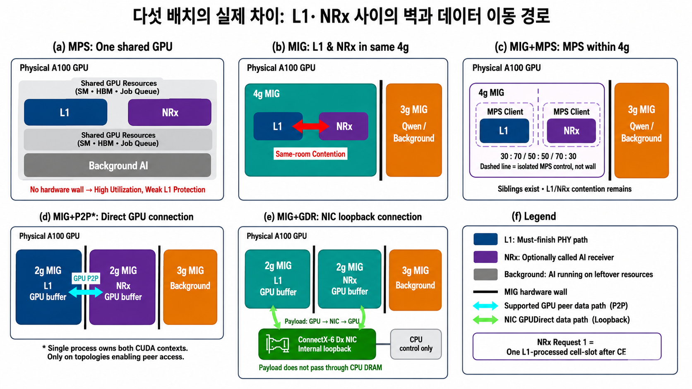

The P2P panel deliberately carries an asterisk. The measured P2P gate used **one process owning two
MIG CUDA contexts on a topology where peer access actually succeeded**. It must not be generalized
to every cross-process MIG combination. The GDR experiment instead separated L1 and NRx processes,
registered their GPU memories, and carried payload through NIC loopback without staging it in CPU
DRAM.

| Deployment | Plain description | What it does well | What it does not solve |
|---|---|---|---|
| Full GPU + MPS | Multiple processes share one full GPU | High utilization and work conservation; spare SM capacity is immediately usable | No physical boundary; long AI work and a shared GPU queue can perturb L1 tail latency |
| MIG local | A physical wall is created, but L1 and NRx share one room | Protects the 4g from Qwen or other work on the sibling MIG | L1 and NRx inside the same 4g still share SMs, memory resources, and GPU work queues |
| MIG + MPS local | MPS reallocates shares between processes inside one MIG | Preserves sibling isolation and tunes average shares inside one GI | Creates no new hardware isolation; a quota is not a deadline or preemption guarantee |
| Cross P2P | L1 and NRx occupy separate GPU partitions connected by a peer path | Separates L1 and NRx compute queues with low transport overhead | Peer access is topology-dependent, and the remote NRx still has finite capacity |
| Cross NIC GDR | GPU memories are NIC-registered and connected directly | Reaches isolated MIG/process/GPU endpoints without a CPU-DRAM bounce | Does not make NRx computation faster; admission and queueing remain separate problems |

The relevant axes are:

1. **Isolation:** does hardware stop another AI kernel from delaying L1?
2. **Elasticity:** when one NRx queue is busy, can idle capacity elsewhere serve it?
3. **Wait location:** does work wait in a GPU queue, inside a CPU CUDA call, or at an explicit
   transport completion?

MPS provides good local work conservation at small client counts, but it is weak on physical
isolation and that advantage disappears as independent clients and kernel-launch pressure grow.
MIG is strong on isolation but fixes capacity spatially. MIG+MPS tunes shares within the MIG wall;
it does not remove this contradiction. P2P and GDR do not remove the wall. They are data paths that allow another room's
NRx to be invoked while preserving the wall. DART-Rx is needed because the system must decide which
request to send where and how to handle a late result over those paths.

### 1.2 The three GDR experiments and the target topology must be separated

In the five-placement figure, `MIG+GDR` is the **placement baseline that connects a 2g L1 and 2g
NRx inside one physical GPU through NIC loopback**. The later `three-NRx` result is not merely that
same drawing repeated three times. It is a separate request-level pool of three resident TensorRT
workers spread across multiple physical GPUs.

The three experiments use GDR but have different topologies and validation targets. Part IV §15
therefore places the diagram beside the physical setup, measured results, and claim boundary in
**Stage 1 → Stage 2 → Stage 3 order**. Stage 4 is kept separate as the remaining integrated gate so
that it cannot be mistaken for a completed result.

“Extending MIG” does not mean physically merging `4g+3g` into one CUDA device. Each NRx request
finishes on one worker; different replicas process different cell-slot requests in parallel. The
precise description is **request-level scale-out of NRx service capacity over fixed MIG**.

Nor does the design instantly convert any arbitrary idle GPU into an NRx worker. Every endpoint on
the slot fast path must already hold its model, TensorRT context, CUDA Graph, and registered buffers.
Background AI can occupy remaining 4g/full-GPU domains, but turning one into an NRx endpoint requires
advance provisioning or an activation step outside the slot fast path.

### 1.3 What fails in the three local placements?

The exact placements used in this study are:

| Name | Physical placement | Intended benefit |
|---|---|---|
| Full MPS | L1+NRx client and Qwen client share one full A100 | Use all spare GPU capacity and control workload shares |
| MIG local | L1+NRx in a 4g MIG; Qwen in sibling 3g | Isolate Qwen while keeping L1 and NRx close |
| MIG+MPS local | Separate L1 and NRx MPS clients inside the 4g; Qwen in sibling 3g | Combine sibling isolation with share control inside the 4g |

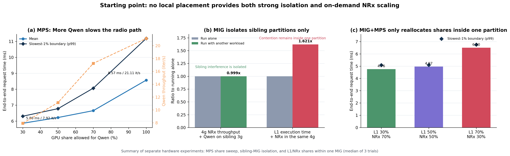

#### A. Full MPS: efficient, but without a protection boundary

Full-GPU MPS had the largest raw capacity among the measured deployments. Without a background
tenant, it remained stable through the 350 request/s limit of the absolute-rate sweep, with p99
`2.551 ms`. Calling MPS intrinsically slow would therefore be incorrect.

The problem is that increasing the background share also changes the RAN path:

| Qwen MPS cap | Slot E2E mean / p99 | Qwen throughput |
|---:|---:|---:|
| 30% | 5.865 / 6.307 ms | 7.92 it/s |
| 50% | 6.226 / 6.782 ms | 11.14 it/s |
| 70% | 6.656 / 8.066 ms | 17.24 it/s |
| 100% | **8.569 / 11.180 ms** | **21.11 it/s** |

MPS offers high aggregate throughput and background utility, but the cost appears directly in the
L1/NRx latency. Active-thread percentage controls an average resource share; it does not bound the
time to preempt a long kernel or guarantee L1 p99. The issue is not low performance. It is that
**real-time L1 protection and background throughput are coupled on a load-dependent Pareto curve.**

There is a more important limitation. The stable 350 requests/s result above uses **one optimized
NRx execution path with no background tenant**. It does not characterize MPS scaling when independent
processes from multiple cells or services submit NRx work concurrently. A separate causal campaign
produced a very different curve.

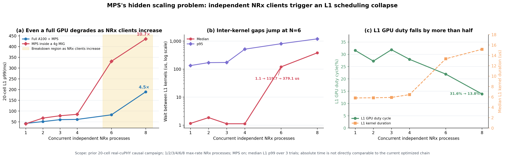

- On full-A100 MPS, increasing NRx processes from `1→8` raised L1 p99 from `42.3→189.3 ms`, or **4.5×**.
- Inside a 4g MIG, MPS produced `40.7→331.4→435.7 ms` at `N=1→6→8`, ending at **10.7×**.
- In the 4g case, median L1 inter-kernel gap changed from `1.15 us(N=1)` to `119.7 us(N=6)`
  and `379.1 us(N=8)`, while L1 GPU duty fell from `31.6%` to `13.8%`.

The correct conclusion is not “MPS is good.” **MPS is efficient at low client count and spare load,
but without a hardware wall, scheduler/launch-queue/implicit-synchronization tails propagate directly
into L1 as independent NRx contexts and aggregate launch pressure increase.** `N=6` is the measured
knee for this max-rate NRx workload, not a universal constant. Because this earlier causal campaign
used a 20-cell L1 path, its absolute milliseconds are not compared directly with the current optimized
chain; it is used as causal scaling evidence.

#### B. MIG local: isolates the next room, not L1 from NRx in the same room

Sibling isolation was strong. NRx capacity was `745.1 request/s` alone and `744.2 request/s` with
Qwen running in the sibling 3g, a difference of only `-0.11%`. The statement “MIG failed to isolate
Qwen” is therefore false.

However, placing L1 and NRx in the same 4g leaves them in one GPU instance. L1 active time became
`1.621×` its standalone value, and slot E2E mean was `6.191 ms`. Qwen in the sibling 3g was isolated;
NRx kernels, memory traffic, and queued work inside the same 4g were not isolated from L1.

The NRx capacity of that 4g is also fixed. Its sojourn p99 was `3.470 ms` at 300/s and
`1124.981 ms` at 350/s. Capacity in another idle MIG does not move to this queue automatically.
MIG's limitation is not weak isolation: **isolation also pins service capacity to each room.**

#### C. MIG+MPS local: changes shares but not room size or walls

MIG+MPS remains useful. It can vary L1/NRx shares while isolating sibling-3g Qwen at approximately
`10.21–10.22 it/s`. In the proper two-client quota experiment, L1 and NRx ran as separate MPS
clients inside one 4g and exchanged the same full-size GDR payload between processes.

| L1:NRx share | E2E mean / p99 |
|---:|---:|
| 30:70 | **4.757 / 5.087 ms** |
| 50:50 | 4.971 / 5.099 ms |
| 70:30 | **6.499 / 6.747 ms** |

Reducing the share of the longer NRx stage from 70% to 30% increased the L1 share but made the
whole chain `36.6%` slower. The uncapped two-client absolute-rate run also collapsed between 250/s
(p99 `3.437 ms`) and 300/s (`259.106 ms`). MPS inside one 4g cannot create:

1. a new physical boundary between L1 and NRx;
2. a path to idle capacity outside the 4g; or
3. a hard bound on kernel completion or host-side CUDA blocking.

The local-placement conclusion is not that every approach is bad:

| Placement | Benefit | Remaining problem |
|---|---|---|
| Full MPS | Highest raw capacity and work conservation | L1 tail is coupled to co-tenant load |
| MIG local | Strong sibling isolation | Same-GI L1–NRx contention and fixed capacity |
| MIG+MPS local | Sibling isolation plus intra-GI share control | Same-GI contention, fixed capacity, and quota trade-off |

None provides both **physical L1–NRx separation and the ability to borrow NRx capacity elsewhere on
demand**. This is the motivation for P2P and GDR.

### 1.4 Why consider P2P and GPUDirect RDMA?

The first question was whether moving L1 and NRx to different GPU execution domains actually
restores L1. The second was whether moving their tensors costs more than the isolation is worth.

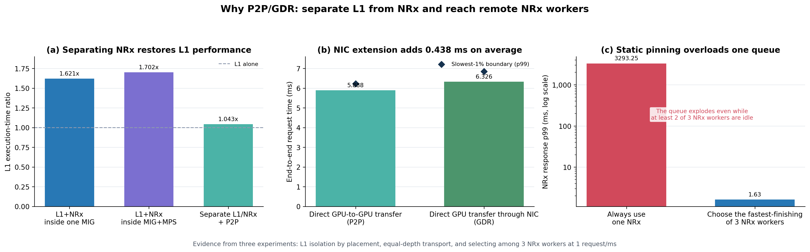

#### Design motivation A: separate compute queues with P2P

L1 slowdown was `1.621×` in the 4g L1+NRx placement and `1.702×` under MIG+MPS local. Splitting the
GPU into `2g L1 | 2g NRx` and using a real `cudaMemcpyPeerAsync` path reduced L1 slowdown to
**`1.043×`**. Forward-plus-backward P2P copying averaged `76.84 us` in the ring-depth-2 run.

This establishes an important causal link: much of the L1 slowdown came from sharing an execution
domain with NRx rather than from Qwen in the sibling MIG. The smaller 2g NRx was slower than the 4g
NRx, however, so slot E2E increased slightly from `6.191` to `6.383 ms`. Separation restored L1
protection but could not compensate for reduced NRx compute capacity.

#### Design motivation B: use NIC GDR where P2P cannot reach

P2P is the shortest native GPU path and is an important lower-bound baseline, but peer access is not
available across every MIG/GPU/process combination. NIC GDR registers process-owned GPU memory with
the NIC and exchanges requests and results across isolated endpoints without CPU DRAM staging.

On this CloudLab A100/ConnectX-6 Dx node, the experiment used real GPU MRs and physical NIC
loopback. The optimized direct-TensorRT request was `1,415,232 bytes`; the result was
`314,496 bytes`; neither used CPU staging. At equal queue depth 1:

| Path | Slot E2E mean / p99 | Qwen | Interpretation |
|---|---:|---:|---|
| Cross P2P | 5.888 / 6.224 ms | 10.22 it/s | Native lower bound for peer-accessible topology |
| Cross NIC GDR | 6.326 / 6.846 ms | 10.24 it/s | Zero-CPU-bounce path across process/GPU isolation |

NIC GDR was `0.438 ms`, or about 7.4%, slower on mean in this implementation. The anticipated
5–10 us single-slot improvement was not observed. The reason to retain GDR is not that it beats P2P
on latency. It is that **a resident NRx outside the peer-accessible topology can still join the pool.**

#### Design motivation C: connect multiple endpoints as a pool

A single remote endpoint will still collapse when overloaded. At 1 request/ms, pinning all work to
one NRx produced p99 `3293.25 ms` while at least 66.7% of endpoints were idle during part of the
trace. Selecting the endpoint with the earliest predicted finish reduced p99 to `1.63 ms` and the
no-timely-result ratio from `99.97%` to `0.13%`.

The design progression is therefore:

```text
MPS: high throughput, but L1 and co-tenant behavior are coupled
MIG: strong L1 protection, but capacity is static and same-GI contention remains
MIG+MPS: share control inside one GI, but the isolation–elasticity tension remains
        ↓
P2P: demonstrates separation of L1 and NRx compute queues
GDR: reaches isolated NRx endpoints beyond the P2P domain without CPU staging
        ↓
Compose multiple resident NRx endpoints into one pool
        ↓
Use deadline and radio utility to select an endpoint;
recover to the conventional path when the NRx result is late
```

DART-Rx does not force every request through local, P2P, or GDR. It uses local when safe and timely,
P2P where peer access exists, and GDR across other process/GPU/isolation boundaries. Its core is not
the path selection itself, but the admission, reservation, expiry, and commit contract that makes
heterogeneous endpoints one deadline-safe receiver service.

## 2. First misconception: MIG isolation did not fail

We measured resident NRx on a 4g MIG, both alone and while Qwen-7B ran on the sibling 3g.

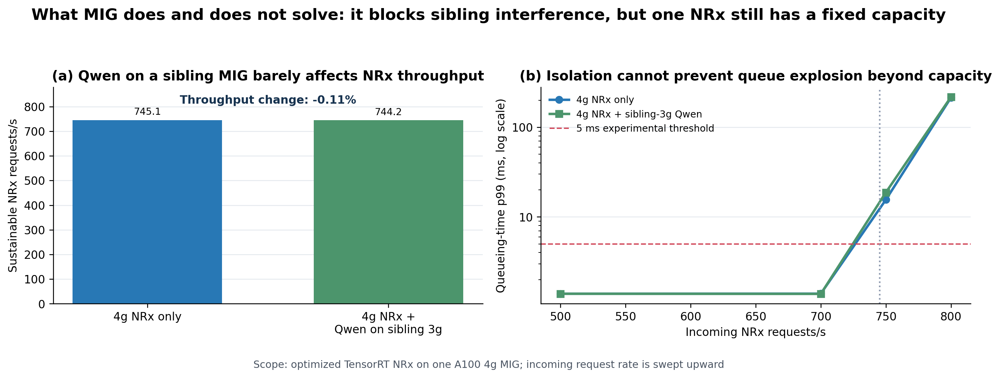

The result rules out both “MIG did nothing” and “MIG solves everything.”

- **MIG isolation works:** capacity was `745.1 request/s` alone and `744.2 request/s` with sibling
  Qwen, a `-0.11%` difference.
- **Isolation does not add capacity:** p99 was about `1.39 ms` at 700/s, rose to
  `15.58–18.78 ms` at 750/s, and reached `214.29–217.79 ms` at 800/s.

Soundproofing the room prevents the neighbor from slowing the clerk. It does not stop the queue from
growing when 750–800 customers per second arrive at a clerk who can serve about 745. The large tail
was a **queueing collapse near fixed NRx service capacity**, not a failure of sibling MIG isolation.

## 3. Second misconception: same-partition L1+NRx should match L1 alone

MIG isolates **different GPU instances**. L1 and NRx inside one 4g share SMs, memory resources,
launch resources, and queued GPU work. Two metrics must therefore be separated:

- **L1 active time:** whether L1 kernels are protected from NRx/background interference.
- **Dependency-carrying slot E2E:** total CE → NRx → LDPC/CRC latency.

Cross P2P improved L1 slowdown from `1.621×` to `1.043×`. Yet splitting 4g into 2g L1 + 2g NRx
slowed NRx compute, so slot E2E slightly increased from `6.191` to `6.383 ms`. **Isolation is visible
in the L1 metric; smaller-slice NRx compute can still prevent total slot latency from falling.**

This does not make cross-partition execution useless:

- Same-partition execution may minimize one isolated request by avoiding transport and using a
  larger compute slice.
- Cross-partition execution separates the L1 execution queue from NRx and exposes other resident
  capacity. Its advantage grows under simultaneous multi-cell arrivals and tail pressure.
- A fair comparison asks both which path minimizes one request and where each queue collapses under
  an identical arrival rate.

### 3.1 Why the original 105 ms NRx became 1.34 ms

The original 105 ms was not pure TensorRT compute. It included generic layout conversion in the
public Aerial `pycuphy` wrapper. Nsight analysis and caller-owned bindings exposed the actual path.

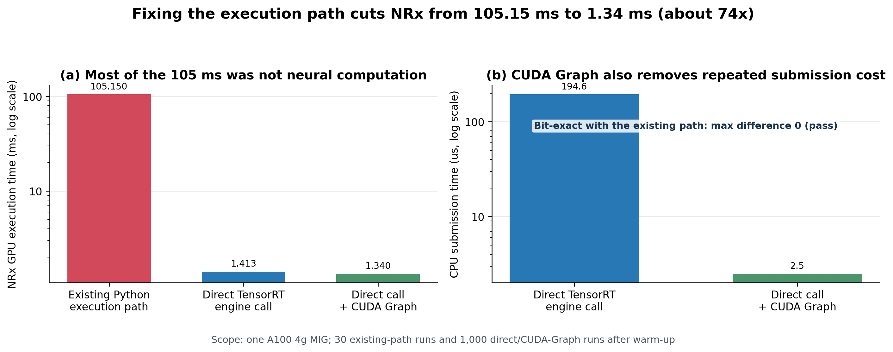

- Public wrapper GPU mean: `105.15 ms`
- Caller-owned TensorRT binding: `1.413 ms`
- Direct binding + CUDA Graph: `1.340 ms`; host enqueue `2.50 us`
- Maximum absolute output difference from the wrapper: `0`

The CUDA API profile agrees. The wrapper capture spent `1.232 s` across 15
`cudaEventSynchronize` calls and `103.95 ms` across nine `cudaStreamSynchronize` calls. The direct
path reduced those totals to `32.87 ms` across 20 calls and `1.89 ms` across ten calls. One 393 ms
cold cleanup appears in the direct path's `cudaFree` total and must not be mistaken for steady-state
inference. Asynchronous launch alone is insufficient; persistent caller-owned buffers and explicit
synchronization placement are also necessary.

The initial 106–112 ms chain results remain valid measurements of the wrapper-based implementation.
Placement and queue-capacity conclusions use the optimized direct-TensorRT path. Mixing these two
execution paths in one performance table would misattribute wrapper overhead to MIG or transport.

### 3.2 Host blocking is a distinct bottleneck

CUDA kernel launch is usually asynchronous, but the CPU eventually reaches an operation that needs
completion: freeing memory, reusing a buffer, or consuming a result. A CPU thread can then remain
inside `cudaFree`, `cudaStreamSynchronize`, or even a subsequent `cudaMemcpyAsync`. We call this
**host blocking**.

It is different from a `GPU → CPU DRAM → GPU` data path. Even with no CPU-DRAM bounce, a long NRx
work queue in the same scheduling domain can force L1's host thread to absorb the wait.

| Placement | Expected host-blocking path |
|---|---|
| Full MPS | L1, NRx, and background share a full-GPU scheduling domain; AI work may surface at L1 synchronization points |
| MIG local | The sibling 3g is isolated, but outstanding L1 and NRx work inside the 4g is not separated |
| MIG+MPS local | Separate clients and quotas still share physical resources and completion conditions inside one 4g; no hard preemption bound |
| Cross P2P/GDR | The L1 CUDA queue is separated from remote NRx compute; explicit publish, completion, and commit waits replace implicit co-location waits |

The Nsight results in Section 16.5 directly validate this hypothesis for same-MIG co-location. The
current evidence also includes a real cuPHY–GDR–NRx vertical slice, but not yet a paired Nsight matrix
for every MPS/MIG/P2P/GDR point under an identical trace.

## 4. Direct evidence that the problem exists

Three independent resident TensorRT endpoints processed single-cell, multi-cell, and selective-burst
traces. We compare pinning every request to one endpoint with selecting the earliest predicted finish.

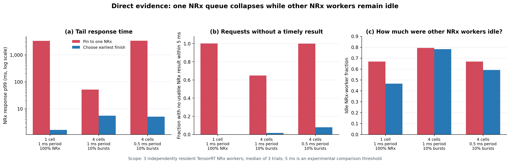

| Workload | Pin one NRx: p99 / no timely result | Earliest predicted finish: p99 / no timely result |
|---|---:|---:|
| 1 cell, 1 ms, NRx 100% | 3293.25 ms / 99.97% | 1.63 ms / 0.13% |
| 4 cells, 1 ms, bursty 10% | 51.39 ms / 64.85% | 5.50 ms / 1.61% |
| 4 cells, 0.5 ms, bursty 10% | 3332.84 ms / 99.90% | 5.06 ms / 7.89% |

Some traces had at least 66.7% aggregate endpoint idleness while the pinned endpoint missed the
timeliness threshold. A low average NRx probability is insufficient: a short burst can overload one
queue while other endpoints are idle. This is direct measurement evidence for the fragmentation
problem.

`No timely result` means no usable NRx result within the 5 ms experimental gate; it also includes
requests for which the scheduler chose conventional fallback. This compute/queue metric is not the
same as a radio deadline miss because this gate does not execute the full PHY fallback path.

## 5. Precise problem statement

> **When a burst of useful NRx requests exceeds the capacity of the current MIG, use NRx capacity in
> other isolated GPU spaces without stopping L1 or reconfiguring MIG, while preventing late or stale
> AI results from affecting the final radio outcome.**

This is more than load balancing. It combines the following constraints:

| Constraint | Why it matters |
|---|---|
| Static spatial isolation | Protect L1 p99 from co-tenant interference |
| Dynamic service demand | NRx requests burst with cell count and channel conditions |
| Dependency transport | A remote NRx must receive L1 tensors and return LLRs |
| Absolute expiry | Even a correct result is unusable for that slot after expiry |
| Conventional baseline | Failure of an optional NRx must leave a valid recovery path |
| Background utility | Spare accelerators cannot remain empty for peak demand alone |

---
# Part II. DART-Rx design

## 6. Overall architecture

DART-Rx is not a collection of unrelated techniques. It is a **slot-processing pipeline that keeps
L1 in dedicated protected space and exposes several resident NRx workers as one selectable pool.**


*The `REQ`/`RES` ports and green lines summarize the logical GDR request/result channel. The
example selects NRx 1 only; they do not indicate that NRx 2 executes or that a CQ carries tensor
payload. The following sections separate the control, payload, and completion paths.*

### 6.1 How does the scheduler know which NRx queue is currently shorter?

The queue is not a remotely inspected GPU hardware queue. It is **dispatcher-side accounting of
outstanding requests at each endpoint: shadow queue state**. `pending=3` means that the endpoint has
accepted three requests for which it has not yet returned completions, including the request
currently executing. The dispatcher therefore does not query a remote GPU over the NIC for every
placement decision.

The current prototype keeps the following state per endpoint.

| Scheduler state | Meaning | Update point |
|---|---|---|
| `pending` | Submitted requests not yet completed | `+1` on submit; `-1` on result completion |
| `predicted_tail` | Reserved completion time of already accepted work | Advanced by a service bound on submit; reset to `now` when empty |
| `service_bound` | Conservative per-request service/exchange time | Calibrated at startup and updated from recent completions |
| `available` | Whether the endpoint may be selected | Cleared on error or a long-stalled in-flight request |
| queue credit | Whether the endpoint control queue can accept another request | Determined by bounded `put_nowait` success or failure |

Each arriving request triggers the following sequence.

1. Drain every endpoint's `started/result/error` events and refresh the local ledger.
2. Predict the next completion at each endpoint as
   `max(now, predicted_tail) + service_bound`.
3. `shortest_queue` selects the smallest `pending`, breaking ties by predicted finish.
   DART-Rx `predicted_finish/tail_aware` directly selects the healthy endpoint with the earliest
   predicted finish.
4. If that prediction is later than slot expiry, do not invoke NRx; retain the conventional result.
5. An accepted request consumes one local control-queue credit and reserves the tail while
   incrementing `pending`. A real GDR result completion decrements `pending` and corrects the
   service bound.

Thus, “the short queue” is neither a guess nor a centralized scan of GPU internals. It is a
**reservation ledger continuously reconciled against real completions by the dispatcher that
issued the work**. Payloads travel between registered GPU memories over P2P/GDR, whereas these
small counters and events remain in the host control plane in the current implementation. It would
therefore be inaccurate to claim that the CPU has no role at all. The precise claim is that **large
tensors avoid CPU-DRAM staging; the CPU performs scheduling and completion bookkeeping only**.
Moving this ledger into NIC/DPU doorbells or an accelerator runtime is a follow-on architectural
optimization for control-plane overhead, not a prerequisite for identifying endpoint state.

The implementation is preserved in `poll_completions`, `snapshot`, `submit`, and `choose_endpoint`
of [`EndpointProcessProxy`](../../../cloudlab_aerial/task1/dart_rx_gdr_pool.py).

One request follows six steps:

1. The conventional receiver remains an executable candidate while L1 prepares the input.
2. Admission checks whether NRx is useful for this channel and whether it can still finish before
   expiry.
3. If feasible, the scheduler atomically reserves buffer and queue credit at the endpoint with the
   earliest predicted finish.
4. The tensor and result move over the endpoint's local, P2P, or GDR path.
5. Exactly one result commits after passing slot identity, deadline, endpoint health, and CRC checks.
6. If NRx is late or fails, the conventional result commits.

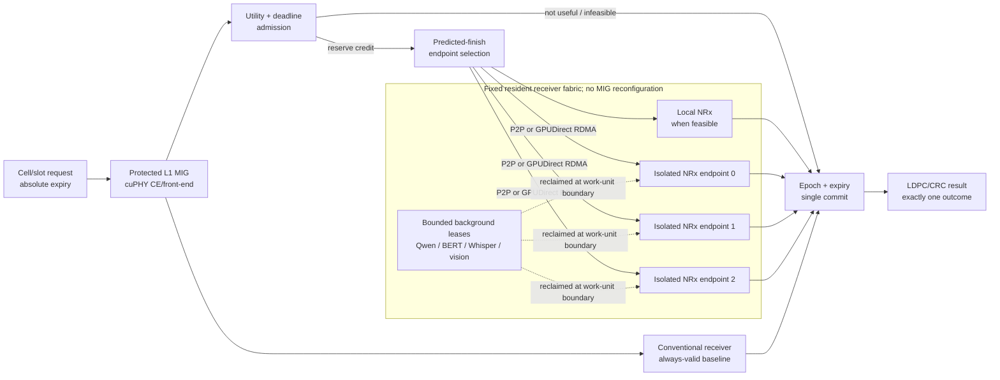

MIG remains central to the design. It creates non-interfering rooms for the `protected L1` and
`isolated resident NRx endpoints`. DART-Rx does not remove those walls. It adds a safe protocol for
borrowing service across fixed rooms.

## 7. Design block 1: joint radio-utility and deadline admission

NRx is not invoked for every slot. A request carries:

```text
(cell_id, slot_id, epoch, channel_features, release_time, absolute_expiry)
```

Admission reserves NRx credit only when both questions have a positive answer:

1. **Radio utility:** under this channel condition, is NRx likely to improve success over the
   conventional receiver?
2. **Timing feasibility:** is the conservative predicted finish of a healthy endpoint earlier than
   `expiry - commit_guard`?

A request that is unhelpful or unlikely to finish in time uses the conventional path without
polluting a remote queue. The current prototype uses measured SNR bins as its utility gate. A final
system should use signals already present in the gNB, such as CQI, DMRS quality, and decoder/HARQ
history.

## 8. Design block 2: a fixed resident receiver fabric

The fast path never changes MIG geometry. NRx models, TensorRT contexts, CUDA Graphs, and registered
buffers remain resident at each endpoint.

Endpoint selection considers more than round robin or instantaneous queue length. It combines the
time at which a queue becomes available, a conservative service-time tail, and transport/commit
slack:

```text
predicted_finish[e]
  = max(now, endpoint_available[e])
  + conservative_service_tail[e]
  + transport_and_commit_guard[e]
```

The scheduler atomically reserves tensor/ring credit at the fastest feasible endpoint. Credit is a
bounded request position: a worker cannot accept unbounded in-flight work. Direct/local or P2P is
used where the GPU topology permits it; registered GPUDirect RDMA crosses an isolation boundary or
reaches another GPU. GDR's role is not to accelerate NRx compute. Its role is to include **another
isolated endpoint in the service pool without CPU staging.**

The publish order on one RC QP is:

```text
request:   GPU payload WRITE → descriptor WRITE → doorbell WRITE
response:  GPU result WRITE  → completion WRITE → doorbell WRITE
```

NIC completion alone never authorizes a PHY commit.

## 9. Design block 3: baseline-preserving, expiry-safe commit

NRx produces an **expiring alternative result**. The conventional receiver remains the always-valid
baseline.

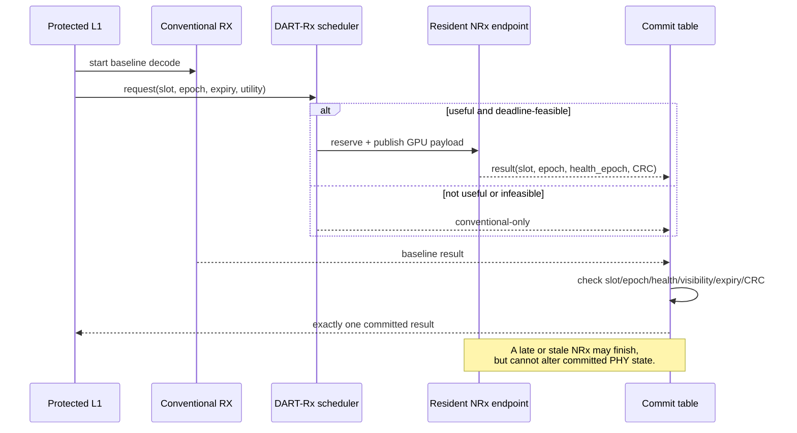

An NRx result may commit only if slot/epoch identity, endpoint health epoch, payload visibility,
completion status, expiry, LDPC/CRC, and transaction-open state all pass. This prevents a late result
from corrupting a reused buffer or the state of a later slot, even when the remote pool is used
aggressively.

## 10. Design block 4: bounded background leases

Keeping every spare NRx endpoint empty is uneconomical. Allowing an unbounded background kernel to
run prevents timely reclaim during a burst. DART-Rx keeps models resident but stops new background
submissions at a **cooperative work-unit boundary**:

```text
low NRx load  : issue bounded leases to resident background models
burst detected: stop issuing new work units
boundary drain: activate the spare endpoint for the NRx pool
load recovers : reduce NRx credit and resume background leases
```

This is not a claim of arbitrary CUDA-kernel preemption. The background work-unit quantum—prefill
chunk, decode step, or batch size—bounds reclaim delay and must therefore be controlled.

## 11. Mapping measured pain points to mechanisms

| Measured problem | DART-Rx mechanism |
|---|---|
| MIG isolates, but endpoint capacity remains fixed | Multi-endpoint service pool over a fixed topology |
| One static queue collapses while another endpoint is idle | Predicted-finish placement and atomic credit |
| NRx utility varies by channel | Radio-utility admission |
| Same-GI NRx work blocks L1 CUDA calls | L1/NRx compute-queue separation plus persistent registered buffers |
| Wrapper conversion and synchronization hide neural compute | Caller-owned TensorRT bindings plus CUDA Graph |
| A remote result can arrive after deadline | Absolute expiry and a commit guard |
| A stale result can target a reused buffer | Slot epoch plus endpoint-health epoch |
| Remote NRx can fail or overload | Always-valid conventional baseline |
| Leaving spare endpoints empty wastes GPU value | Bounded, cooperatively reclaimable background leases |

---

# Part III. Experimental setup

## 12. Hardware and software

| Component | Configuration |
|---|---|
| CloudLab | Wisconsin d8545 bare metal, AIRANSLICING project |
| GPU | 4 × NVIDIA A100-SXM4-40GB |
| MIG | 4g.20gb + 3g.20gb or 3g/2g layouts depending on the experiment; remaining A100s used as full-GPU endpoints |
| NIC | Mellanox ConnectX-6 Dx 200 Gb/s; physical internal loopback; 100 Gb/s Ethernet active |
| Host OS | Ubuntu 22.04.2 |
| NVIDIA stack | Driver 580.173.02, CUDA 13.0, `nvidia_peermem` |
| RDMA stack | MOFED 24.10-3.2.5.0, rdma-core/Pyverbs 57, RoCE v2 GID index 3 |
| AI-RAN | NVIDIA Aerial 25.3.2 with real cuPHY CE and LDPC/CRC |
| NRx | NVIDIA pretrained `neural_rx.onnx`, TensorRT FP16, caller-owned bindings/CUDA Graph |
| Background | Qwen2.5-7B decode plus ResNet-50, BERT-base, and Whisper-base execution workloads |

GDR containers require both the RDMA character device and visibility of the RoCE backing netdev,
so they use `--network=host --device=/dev/infiniband --cap-add=IPC_LOCK`. GPU MRs register CuPy
allocation addresses directly; the implementation never calls Pyverbs `MR.read/write` on a GPU MR.

## 13. Evaluation topologies

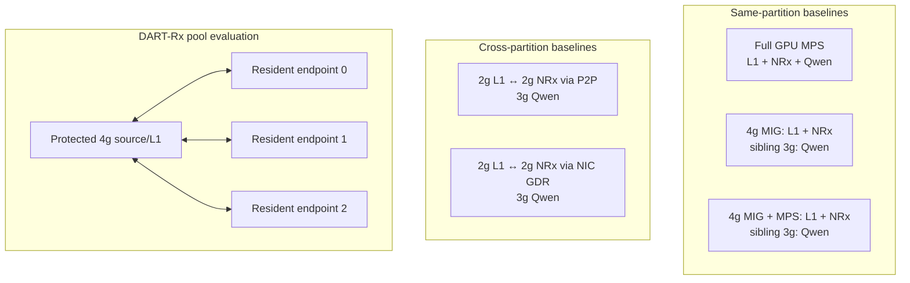

Every MPS/MIG/MIG+MPS/P2P/GDR baseline is necessary, but each answers a different question:

| Comparison | Question answered |
|---|---|
| Full-MPS cap sweep | What RAN-latency/background-throughput Pareto appears when spatial isolation is removed? |
| MIG local | How much L1–NRx contention remains inside one GI despite sibling isolation? |
| MIG+MPS local | Does splitting clients/quotas inside one GI create physical isolation or new service capacity? |
| Cross P2P | How much L1 active time is restored by the native inter-partition path? |
| Cross NIC GDR | Can another isolated process/GPU act as a service endpoint without a CPU bounce? |
| DART-Rx pool | Does deadline-aware routing use feasible capacity better than static placement? |

## 14. Workloads and experimental conditions

| Gate | Input and condition | Repetition | Metric | Scope of evidence |
|---|---|---:|---|---|
| MIG isolation/cliff | 4g NRx at 500/700/750/800 requests/s; sibling-3g Qwen on/off | One hardware run per condition | Capacity, p99, backlog | Isolation and queue cliff |
| Placement/transport | Optimized CE–direct TRT–LDPC chain with Qwen co-tenant | Mostly 3 trials; GDR 2 | L1 active time, E2E, transport, Qwen it/s | MPS/MIG/P2P/GDR trade-offs |
| Five-way absolute rate | Identical 50/100/140/160/180/250/300/350 requests/s traces for MPS/MIG/MIG+MPS/P2P/GDR | 8 rates × 3 trials × 5 = 120 runs | Sojourn p99, throughput | Queue cliff per placement |
| Proper MIG+MPS quota | Separate L1/NRx MPS clients in one 4g at 30:70, 50:50, and 70:30; sibling-3g Qwen | 1,000 slots × 3 trials per split | Mean/p99, Qwen it/s | Actual meaning and limitation of quota |
| CUDA host blocking | Same-MIG cuPHY L1+NRx; 4/10/40/60 cells; baseline/async-free/memory-pool variants | 16 conditions, each a 30 s Nsight trace | Host time per CUDA API | Origin and relocation of synchronization waits |
| Multi-cell problem gate | 1/2/4/8 cells; 0.5/1 ms; synchronized/staggered; selective iid/bursty NRx at 10–100% | 29 traces × 3 trials × 5 policies = 435 rows | p99, no-timely, fallback, idle fraction | Existence of fragmentation |
| Background reclaim | 500/s for 2.01 s → 1100/s for 3 s → 500/s for 3 s | 4 workloads × 2 policies; one run each | Burst p99, ratio over 5 ms, retained work | Online reclaim opportunity |
| Full GDR pool | Full-size GPU request/result; 3 process-isolated endpoints; 5 ms gate | 29 points × 3 trials × 4 policies = 348 full-matrix runs; 412 total | No-timely, rejection, late/expired, timely p99 | Transport/compute/queue scheduler |
| Actual radio | cuPHY CE → GDR NRx → LDPC/CRC; MCS 7 Rayleigh; 100 requests/run | Three-endpoint modes × 3 trials; 17 total runs | Correct TB, NRx requests/commits, decision latency | Radio utility and transaction correctness |

### 14.1 Two MIG+MPS results must not be conflated

`MIG+MPS same` in `PLACEMENT_SUMMARY.csv` is a negative control that adds an MPS environment to the
older combined-client path. It does not prove that L1 and NRx were separate MPS clients. The proper
quota gate runs L1 and NRx as two clients and applies 30:70, 50:50, and 70:30 active-thread shares.
Figure 3c uses only this proper two-client experiment.

### 14.2 Timeliness thresholds must not be conflated

- `5 ms` is an **experimental timeliness threshold** for multi-endpoint scheduling and background
  gates.
- `12 ms` is the **experimental expiry** for the actual-radio correctness vertical slice.
- These experiments do not establish a production 1 ms PHY deadline.

### 14.3 Limits of background-workload realism

- Qwen is real resident Qwen2.5-7B decode.
- ResNet-50, BERT-base, and Whisper-base use their real architecture and kernel mix but synthetic
  random weights and inputs. They measure GPU interference and cooperative reclaim timing, not
  model quality.
- The multi-cell selective traces are workload-sensitivity inputs, not actual radio ground truth.
  Radio-utility claims use the separate paired Aerial/Sionna actual-radio gate.

---


# Part IV. Evaluation

## 15. Stage-by-stage GDR experimental build-up

Stages 1, 2, and 3 in the figure below are not conceptual boxes. They are **three hardware
experiments that answer different questions**. They must not be merged into a claim that all results
were obtained under one topology. Stage 1 validates the data path, Stage 2 validates concurrent
service capacity and routing, and Stage 3 validates actual-radio correctness. Only Stage 4—the gate
that combines all three under one concurrent workload—remains incomplete.


| Stage | Actual physical placement | Primary question | Status |
|---|---|---|---|
| 1. Cross-MIG GDR baseline | GPU0: `2g L1 · 2g NRx · 3g Qwen` | Does GPU-memory transport across a retained MIG wall work at acceptable cost? | Complete |
| 2. Fixed-MIG three-replica GDR pool | GPU0 4g source MR; NRx 0/1/2 on the 3g MIGs of GPUs 0/1/2 | Does request-level aggregation of resident NRx capacity beat static binding? | Complete |
| 3. Actual-radio correctness gate | Actual L1 on GPU0 4g; NRx 0/1/2 on full GPUs 1/2/3 | Can remote results be committed into CE→LDPC/CRC without expiry or duplicate-result errors? | Complete |
| 4. Final integrated gate | Protected L1 4g, resident NRx 3g pool, and background AI | Do all three properties hold simultaneously under actual multi-cell bursts? | **Incomplete** |

### 15.1 Stage 1 — single-GPU cross-MIG GDR baseline

**Purpose.** The first stage isolates data-path feasibility from scheduler behavior. L1 occupies one
2g MIG, NRx occupies another 2g MIG, and Qwen occupies the remaining 3g on one A100. We compare an
available CUDA P2P/IPC path with ConnectX-6 Dx NIC-loopback GDR at the same queue depth of one. The
GDR path transfers a `1,415,232 B` request and a `314,496 B` result between GPU MRs without CPU-DRAM
payload staging.

Stage 1 itself consists of three internal gates rather than one number.

| Internal gate | Repetitions | Controlled variable | Purpose |
|---|---:|---|---|
| Direct-GDR correctness | 2 repeats | Optimized TensorRT contract and real GPU-MR request/result | Verify bidirectional results without CPU payload staging |
| Equal-depth transport | 3 P2P, 2 GDR | Queue depth one for both P2P and GDR | Compare E2E transport cost fairly |
| Ring-depth-2 isolation | 3 P2P | L1-alone versus cross-P2P on the same 2g L1 | Measure L1 active slowdown after moving NRx to another compute queue |

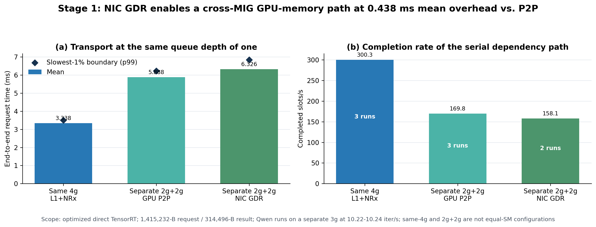

| Cross-MIG transport | E2E mean | E2E p99 | Slot throughput | Qwen | Transport mean |
|---|---:|---:|---:|---:|---:|
| GPU P2P | **5.888 ms** | 6.224 ms | 169.804 slot/s | 10.22 it/s | 76.547 µs |
| NIC GDR loopback | 6.326 ms | 6.846 ms | 158.095 slot/s | 10.24 it/s | Included in E2E difference |

GDR added `0.438 ms`, about `7.4%`, to mean E2E latency relative to P2P. The pipeline nevertheless
remained near 6 ms, while overload tails in later experiments grew to hundreds or thousands of
milliseconds. The conclusion is not that NIC GDR is faster than P2P. It is that **isolated endpoints
can communicate without a CPU bounce, and the next dominant problem is NRx service time and
queueing rather than transport alone.**

- Proves: full-size GPU-memory GDR and its cost across separate MIGs/processes on one physical GPU.
- Does not prove: aggregate multi-NRx capacity, queue-aware routing, or actual-radio correctness.
- Caveat: the main ring-depth-2 P2P run measured L1 active slowdown of `1.043×`; no corresponding
  L1-active value exists for that GDR run, so the same slowdown is not inferred.

### 15.2 Stage 2 — fixed-MIG three-replica GDR pool

**Purpose.** Stage 1 established only one endpoint. Stage 2 asks whether three resident NRx workers
can expose pooled request-level capacity **without reconfiguring fixed MIG**. The 4g on GPU0 served
only as an L1-side source GPU MR; this gate did not execute actual radio. NRx 0/1/2 resided in the 3g
MIGs of GPUs 0/1/2. The 4g domains on GPUs 1/2 and all of GPU3 were unused. Each worker had a separate
process, CUDA context, GPU MR, RC QP, and resident TensorRT/CUDA Graph.

The `412` validated Stage 2 runs form four layers:

| Internal campaign | Runs | Endpoints / policies | Question |
|---|---:|---|---|
| 2A. Smoke | 1 | 3 endpoints · tail-aware | Do three processes/QPs/GPU MRs connect and return valid results? |
| 2B. Replica sweep | 27 | 1/2/3 endpoints × 3 traces × 3 policies | How does timely capacity change with replica count and workload? |
| 2C. Representative policy | 36 | 3 endpoints × 6 traces × 6 policies | How do static, queue, and deadline policies fail differently? |
| 2D. Full matrix | 348 | 87 traces × 4 core policies | Does the improvement persist across the full repeated trace set? |

Here, `requests/s` is the arrival rate of **cell-slot inference requests that the L1-side source
would issue to the NRx pool after CE**. This stage replays those timings and full-size tensors but
does not execute cuPHY CE itself.

#### What exactly are the Stage 2 policies?

| Policy | Endpoint selection | Queue/deadline state | Reject before remote execution? | Campaigns |
|---|---|---|---|---|
| `static-one` | Pin every cell to endpoint 0 | None | No | Representative, full |
| `static-cell` | Pin by `cell_id mod N` | None | No | Representative, full |
| `round-robin` | Repeat 0→1→2 in arrival order | None | No | Replica, representative |
| `shortest-queue` | Endpoint with the fewest pending requests | Pending count; predicted finish breaks ties | No | Representative |
| `predicted-finish` | Minimize `max(now, reserved tail)+service bound` | Calibrated service bound and reserved queue tail | Yes, if predicted completion exceeds expiry | Replica, representative, full |
| `tail-aware` | Earliest predicted finish among endpoints whose guard is open | Adaptive recent-512 p99.5 × 1.10 bound and outlier circuit guard | Yes, if infeasible or all endpoints are guarded | All campaigns |

The static policies, round-robin, and shortest-queue submit remote work without testing deadline
feasibility. Predicted-finish reserves completion using the calibration p95 service bound with a
`1.10×` margin. Tail-aware additionally adapts to the recent tail and temporarily removes an
endpoint when its in-flight request exceeds `1.25×` the bound. A lower no-timely ratio therefore
does not necessarily imply more remote execution; it also reflects admission behavior.

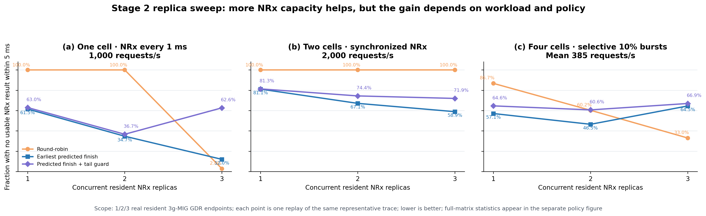

The replica sweep rejects the simplistic conclusion that every policy improves monotonically with
more replicas. For single-cell 1,000/s, predicted-finish no-timely falls
`61.5% → 34.7% → 12.0%`, and round-robin changes from `100.0% → 100.0% → 2.8%`. For synchronized
two-cell 2,000/s, predicted-finish still has `58.9%` no-timely with three replicas because offered
load remains high relative to pool capacity. In the selective burst, three-replica round-robin is
best at `33.0%`, while predicted-finish reaches `64.5%` because of conservative rejection. This
27-run sweep uses one representative replay per point and does not replace full-matrix statistics.

Applying all six policies to the same representative traces likewise shows that no single policy
wins every workload. Values below are the fraction without a usable NRx result within `5 ms`;
lower is better.

| Policy | Single 1,000/s | Sync two-cell 2,000/s | Selective burst, mean 385/s |
|---|---:|---:|---:|
| static-one | 99.995% | 99.998% | 87.125% |
| static-cell | 99.995% | 100.000% | 80.078% |
| round-robin | **6.580%** | 100.000% | **33.900%** |
| shortest-queue | 44.040% | 97.165% | 38.326% |
| predicted-finish | 24.595% | **62.588%** | 54.250% |
| tail-aware | 16.400% | 82.585% | 68.903% |

Round-robin is work-conserving when load fits within pool capacity, but it cannot suppress
overload. Predicted-finish removes futile work under overload but also rejects usable requests.
This is why final DART-Rx admission must combine queue timing with radio utility and a fallback-risk
budget.

The full matrix contained `29 workload points × 3 trials × 4 policies = 348 runs`.

| Policy | Overall no-timely ratio | Paired improvement vs static-one | Paired improvement vs static-cell |
|---|---:|---:|---:|
| static-one | 1.0000 | — | — |
| static-cell | 1.0000 | — | — |
| predicted-finish | **0.8133** | 87/87 traces; median `18.65 pp` | 86/87 traces; median `16.50 pp` |
| tail-aware | 0.8432 | 87/87 traces; median `14.69 pp` | 83/87 traces; median `9.70 pp` |

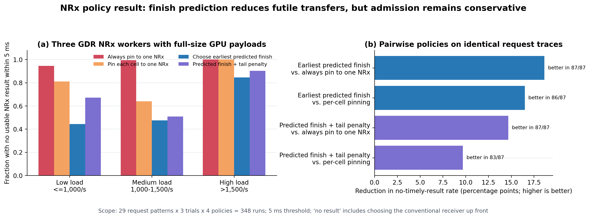

Even at lower loads (`≤1000 requests/s`), no-timely ratios were `0.9451` for static-one, `0.8100`
for static-cell, `0.4439` for predicted-finish, and `0.6708` for tail-aware. Despite its name,
**predicted-finish outperformed tail-aware in this campaign**, so tail-aware is not presented as the
final policy. Timely-only p99 latency was approximately `4.15–4.95 ms`; no-timely includes requests
rejected to the conventional path before execution as well as late work.

- Proves: real full-size GDR requests/results, three simultaneously resident endpoints,
  request-level scale-out, and finish-aware routing that outperforms static binding.
- Does not prove: cuPHY/LDPC/CRC outcomes, BLER/CRC gain, or a production PHY deadline.
- Interpretation: this is not one faster 3g MIG. It is a capacity experiment that exposes **three
  finite service queues as one pool**.

### 15.3 Stage 3 — actual-radio three-endpoint correctness gate

**Purpose.** Stage 2 lacked radio ground truth. Stage 3 sends actual Aerial/cuPHY CE output to remote
NRx, feeds the returned LLRs through LDPC/CRC, and validates utility admission, epoch, expiry, and
single-commit semantics. Its topology differs from Stage 2: actual L1 ran in the 4g MIG on GPU0,
while NRx 0/1/2 ran on **full GPUs** 1/2/3.

Stage 3 separately checks endpoint count, radio mode, and Nsight causality. The one- and two-endpoint
rows are single-run functionality gates; only the three-endpoint modes have three repetitions.
They must not be used as an endpoint-count performance-scaling curve.

| Internal campaign | Runs | Requests / expiry | Role |
|---|---:|---|---|
| 3A. Correctness matrix | 12 | 100 each / 12 ms | Check one/two endpoints and repeat three-endpoint all/conventional/utility modes |
| 3B. Short Nsight capture | 5 | 12 each / 50 ms | Decompose CUDA APIs, kernels, copies, and synchronization; excluded from correctness table |

The validated total is therefore `12+5=17`; the table below uses only campaign 3A.

| Endpoints | Mode | Runs | Correct TB | Decision p50 / p99 | Remote exchange p50 / p99 |
|---:|---|---:|---:|---:|---:|
| 1 | All NRx | 1 | 0.800 | 2.264 / 4.795 ms | 2.087 / 2.290 ms |
| 2 | All NRx | 1 | 0.800 | 2.745 / 5.375 ms | 2.293 / 2.493 ms |
| 2 | Utility | 1 | 0.800 | 2.634 / 5.094 ms | 2.091 / 2.407 ms |
| 3 | All NRx | 3 | 0.800 | 2.567 / 5.139 ms | 2.004 / 2.777 ms |
| 3 | Conventional | 3 | 0.620 | 1.045 / 1.292 ms | — |
| 3 | Utility | 3 | 0.800 | 2.636 / 5.050 ms | 2.013 / 2.967 ms |

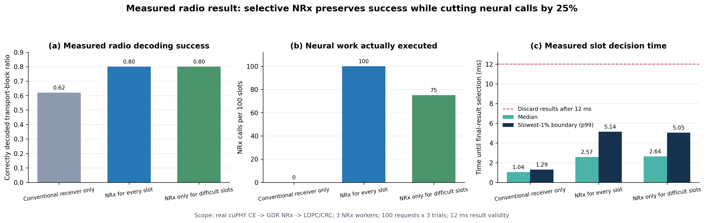

Three-trial medians for the primary three-endpoint comparison within `17` validated runs were:

| Mode | NRx requests / 100 | NRx commits | Correct-TB ratio | Decision p50 / p99 | Miss / late |
|---|---:|---:|---:|---:|---:|
| Conventional | 0 | 0 | 0.620 | 1.045 / 1.292 ms | 0 / 0 |
| All NRx | 100 | 17 | **0.800** | 2.567 / 5.139 ms | 0 / 0 |
| Utility admission | 75 | 16 | **0.800** | 2.636 / 5.050 ms | 0 / 0 |

Utility admission sent `25/25/25` requests to the three endpoints and preserved the all-NRx
correct-TB ratio while reducing NRx calls by `25%`. For all-NRx, remote-exchange p50/p99 was
`2.004/2.777 ms`, worker-service p50 was `1.111 ms`, and transport/control p50 within that path was
`0.895 ms`. The last quantity includes publish, completion, conversion, and control work—not only
NIC wire time. `NRx commits` counts cases in which the remote NRx result was selected for the final
TB decision after comparison with the conventional result; it is not the number of completed NRx
requests.

| Three-endpoint mode | CE+pack→dispatch p50 | Remote exchange p50 / p99 | Worker service p50 | Transport/control p50 | Residual after conventional p50 / p99 |
|---|---:|---:|---:|---:|---:|
| All NRx | 1.331 ms | 2.004 / 2.777 ms | 1.111 ms | 0.895 ms | 0.861 / 1.365 ms |
| Utility | 1.372 ms | 2.013 / 2.967 ms | 1.111 ms | 0.902 ms | 0.838 / 1.574 ms |

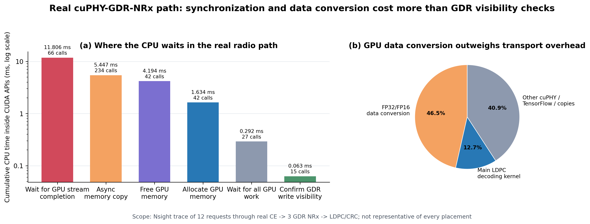

In the short Nsight capture, cumulative `cudaStreamSynchronize` time was `11.806 ms`, while GDR
write-visibility checks consumed `0.063 ms`. FP32↔FP16 layout conversion accounted for `46.5%` of
GPU kernel time. The next Stage 3 optimization target is therefore persistent binding, conversion,
and synchronization scope rather than NIC wire time alone. Section §19.1 interprets the individual
calls in detail.

- Proves: actual `CE → remote NRx → LDPC/CRC`, radio-utility admission, expiry, and single commit.
- Does not prove: resource efficiency of 3g-MIG replicas, concurrent three-replica burst capacity,
  or a production 1 ms deadline.
- Caveat: this is a synchronous correctness gate with a `12 ms` experimental expiry. Stage 2 pool
  capacity and Stage 3 radio correctness have not yet been measured simultaneously in one run.

### 15.4 Stage 4 — remaining final integrated gate

The final experiment must execute the useful pieces of Stages 1–3 simultaneously rather than add
their table entries after the fact. Actual L1 and conventional fallback stay on a protected 4g MIG;
resident NRx replicas occupy several 3g MIGs; Qwen, ResNet, BERT, and Whisper use remaining 4g or
full-GPU domains. Multi-cell periodic/offset bursts and selective NRx requests drive DART-Rx, which
jointly uses utility, deadline, and queue state for endpoint selection, admission, fallback, and
commit.

At minimum, the final gate must compare `static-one`, `static-cell`, round-robin, predicted-finish,
and DART-Rx on the same trace while reporting L1 p99, deadline miss/no-timely ratio, correct TB,
endpoint utilization, and retained background work. **Until Stage 4 is complete, the study must not
claim that a MIG NRx pool simultaneously solves actual-radio bursts and background tenancy.**

Sections §16–20 regroup the same evidence by research question—placement, background, routing, and
radio—rather than execution order.

## 16. Q1 — What do the MIG/MPS/P2P/GDR comparisons establish?

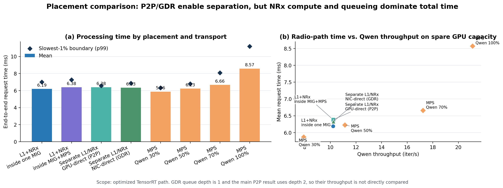

### 16.1 Same-partition versus cross-partition execution

| Configuration | Slot E2E mean | L1 slowdown | Qwen | Interpretation |
|---|---:|---:|---:|---|
| MIG local | 6.191 ms | 1.621× | 10.22 it/s | Sibling Qwen is isolated; intra-GI L1–NRx contention remains |
| MIG+MPS local | 6.383 ms | 1.702× | 10.22 it/s | MPS clients in one GI do not create automatic isolation |
| Cross P2P | 6.383 ms | **1.043×** | 10.23 it/s | Restores L1 isolation; slower 2g NRx offsets the E2E benefit |
| Cross NIC GDR | 6.326 ms | Not measured in this run | 10.24 it/s | Zero-CPU-bounce endpoint; queue depth 1 prevents a direct throughput comparison |

At equal queue depth 1, P2P measured 5.888 ms and GDR 6.326 ms. NIC loopback added 0.438 ms on
mean, while the full pipeline remained near 6 ms and overloaded tails reached hundreds to thousands
of milliseconds. **Transport is not free, but NRx compute and queue stability dominate the current
system.**

### 16.2 Full MPS is not a straw-man baseline

At the 30% Qwen cap, Full MPS produced the lowest E2E mean, 5.865 ms, while Qwen achieved 7.92 it/s.
At 100%, Qwen reached 21.11 it/s and E2E rose to 8.569 ms. MPS can be fast and work-conserving; its
limitation is a load-dependent tail. The purpose of cross placement is not to minimize one mean in
all cases, but to provide **predictable L1 isolation and a composable capacity pool**.

### 16.3 Where does each placement collapse under the same request rate?

The placement experiment above emphasizes a single dependency path. Multi-cell operation also
depends on the sustainable request rate. We therefore replayed identical 50–350 requests/s traces
against five placements in 120 runs. This gate excludes a background co-tenant so that the service
limit of each placement can be isolated. Qwen interference and background reclaim are measured in
separate gates.

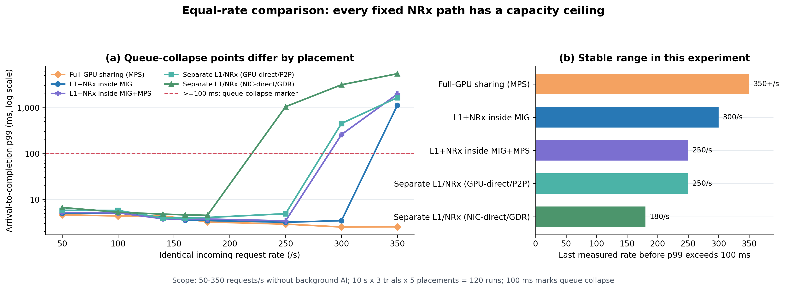

| Placement | Last measured point before p99 exceeded 100 ms | p99 at that point | Next point |
|---|---:|---:|---:|
| Full MPS | At least 350/s | 2.551 ms | No collapse within the sweep |
| MIG local | 300/s | 3.470 ms | 350/s → **1124.981 ms** |
| MIG+MPS, two clients uncapped | 250/s | 3.437 ms | 300/s → **259.106 ms** |
| Cross P2P | 250/s | 4.911 ms | 300/s → **451.798 ms** |
| Cross NIC GDR | 180/s | 4.527 ms | 250/s → **1048.696 ms** |

The 100 ms line is a diagnostic marker for an obvious queue collapse, not a production deadline.
Full MPS uses a full A100, while the local and cross configurations use MIG slices. This is therefore
not an equal-SM microbenchmark. It is the **capacity–isolation trade-off of each deployable package.**

The result sharpens the problem statement:

- Full MPS has the highest raw capacity. A claim that MIG is always faster than MPS would be false.
  The MPS concern is L1-tail predictability under background load, not peak throughput.
- MIG local isolates sibling background work but cannot automatically pull capacity from another
  idle partition after the 4g NRx saturates.
- MIG+MPS partitions one 4g more carefully; it neither increases total 4g capacity nor accesses idle
  capacity beyond the wall.
- A single P2P or GDR endpoint also has finite capacity. DART-Rx does not claim that one remote path
  is infinitely fast; it aggregates **multiple resident endpoints to avoid static-one queue cliffs.**

### 16.4 What changes under proper MIG+MPS quota control?

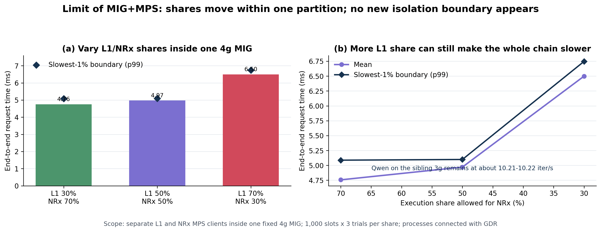

L1 and NRx ran as separate MPS clients inside one 4g while Qwen remained isolated in the sibling 3g
at approximately 10.21–10.22 it/s.

| L1 share | NRx share | E2E mean | E2E p99 |
|---:|---:|---:|---:|
| 30% | 70% | **4.757 ms** | 5.087 ms |
| 50% | 50% | 4.971 ms | 5.099 ms |
| 70% | 30% | **6.499 ms** | 6.747 ms |

Because NRx is the longer stage, increasing L1 share to 70% while reducing NRx to 30% made the full
chain 36.6% slower. MPS percentage is an average active-thread allocation knob, not a physical wall
that guarantees a kernel deadline or preemption time. MIG+MPS selects a Pareto point **inside one
fixed room**; it does not solve burst-time borrowing from another room.

### 16.5 Why does co-location slow the host at the CUDA-call level?

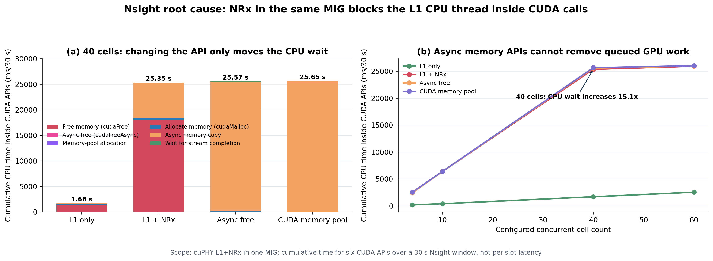

We measured cumulative host time in six major cuPHY CUDA runtime APIs over a 30 s Nsight window. At
40 cells:

| Condition | Total tracked host CUDA API time | Dominant observed wait |
|---|---:|---|
| L1 alone | 1.681 s | `cudaFree` 1.361 s |
| L1 + NRx | **25.348 s** | `cudaFree` 18.076 s; `cudaMemcpyAsync` 7.034 s |
| `cudaFreeAsync` shim | 25.570 s | `cudaMemcpyAsync` **25.221 s** |
| Stream-ordered memory pool | 25.649 s | `cudaMemcpyAsync` **25.539 s** |

Co-location increased tracked host time by `15.1×`. Replacing `cudaFree` with an asynchronous API
did not remove the total wait; it moved the wait to the next copy or synchronization boundary. The
root problem is not the name `cudaFree`. It is **outstanding GPU work in one scheduling domain and a
dependency boundary that must eventually observe its completion.**

This is why a cross-partition design cannot be evaluated from the 0.4 ms mean transport cost alone.
P2P/GDR separates L1's CUDA queue from NRx compute. It introduces explicit publish and completion
events instead, which DART-Rx manages with credit, expiry, and commit rules. The Chain-8 Nsight
numbers are cumulative over 30 s rather than per-slot latency and do not use the exact direct-TensorRT
five-way configuration; they must not be added to the five-way latency numbers.

Current CUDA-level evidence coverage is:

| Placement | Latency/rate sweep | Direct CUDA-call evidence | Current interpretation |
|---|---|---|---|
| Full MPS | Cap sweep + absolute-rate complete | No identical-trace Nsight | Strong throughput; background-tail cause still needs decomposition |
| MIG local | Placement + absolute-rate complete | Same-MIG causal profile available | Strong sibling isolation; intra-GI L1–NRx wait exists |
| MIG+MPS | Proper two-client quota + absolute-rate complete | No identical-trace Nsight | Quota trade-off measured; wait location needs capture |
| Cross P2P | Placement + absolute-rate complete | No identical-trace Nsight | L1 active isolation restored; copy/synchronization decomposition remains |
| Cross NIC GDR | Placement + absolute-rate + radio complete | Actual-radio GDR vertical-slice Nsight | Local synchronization/conversion exceeds GDR flush time |

Performance differences are measured for every approach. Exact CUDA-call causality is directly
shown only for same-MIG co-location and the GDR vertical slice. Paired Nsight captures remain a
required follow-up for the other three conditions.

## 17. Q2 — Can background capacity be reclaimed in time?

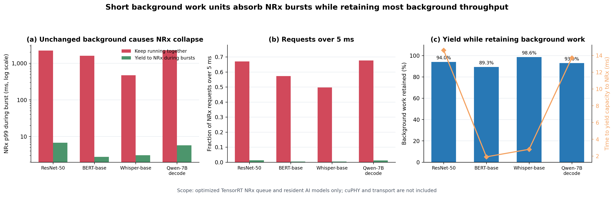

We compare naive sharing and adaptive reclaim under a `500 → 1100 → 500 requests/s` burst.

| Background workload | Naive burst p99 / >5 ms | Adaptive p99 / >5 ms | Background work retained | Reclaim activation |
|---|---:|---:|---:|---:|
| ResNet-50 | 2211.39 ms / 67.00% | 6.72 ms / 1.24% | 94.0% | 14.62 ms |
| BERT-base | 1602.27 ms / 57.27% | 2.77 ms / 0.39% | 89.3% | 1.90 ms |
| Whisper-base | 471.31 ms / 49.64% | 3.07 ms / 0.39% | 98.6% | 2.80 ms |
| Qwen-7B decode | 2270.97 ms / 67.67% | 5.72 ms / 1.12% | 93.0% | 13.71 ms |

The mechanism retains 89–99% of background work without unloading models while sharply reducing
queue collapse. ResNet and Qwen still need 13–15 ms to yield, too long for a strict 5 ms bound.
Therefore, the design requires a **bounded work-unit or chunk size**.

This gate omits cuPHY and GDR transport. It demonstrates that background leases are worth
integrating and measures the required quantum bound; it does not claim that the complete DART-Rx
pipeline already achieves these numbers.

## 18. Q3 — Does routing help in a full-size GDR NRx pool?

Section §15.2 places the replica-sweep and full-matrix policy figures in execution order. This
section only interprets what those results establish about routing.

In the 348-run full matrix—29 workload points × 3 trials × 4 policies—predicted-finish routing
reduced the no-timely-result ratio in 87/87 paired traces versus static-one and 86/87 versus
static-cell. Median improvements were 18.65 and 16.50 percentage points.

The limitations matter:

- Median predicted-finish no-timely ratio across the full trace set remained 81.33%.
- 81.31% came from requests rejected to the conventional path **before remote execution**, not late
  tasks.
- The policy removes nearly all futile remote work, but its admission rule also discards many usable
  NRx opportunities.
- This gate omits cuPHY, conventional decoding, and radio ground truth. `No timely result` is not a
  PHY miss.

The GDR fabric and finish-aware reservation are useful, but a fixed guard is too conservative. Final
admission must jointly optimize radio utility and the acceptable fallback-risk budget.

## 19. Q4 — Is the mechanism useful when connected to actual radio outcomes?

Section §15.3 contains the actual-radio figure and per-endpoint table. This section summarizes the
radio-utility implication.

The table reports three-trial medians using three actual GDR endpoints and the real cuPHY
CE/LDPC/CRC path.

| Mode | NRx requests / 100 | Correct-TB ratio | Decision p50 / p99 |
|---|---:|---:|---:|
| Conventional | 0 | 0.62 | 1.045 / 1.292 ms |
| All NRx | 100 | 0.80 | 2.567 / 5.139 ms |
| Utility admission | 75 | 0.80 | 2.636 / 5.050 ms |

Utility admission preserved the all-NRx correct-TB ratio of `0.80` while reducing neural work by
25%. In each replay, the 75 utility-admitted requests were evenly distributed—25 per endpoint—with
zero deadline misses and zero late completions.

More NRx is not automatically better. Capacity should be spent in channel regions where radio gain
is concentrated. This was a synchronous correctness gate with 12 ms expiry. Evidence that three
replicas sustain concurrent 1 ms arrivals comes from the separate open-loop pool gate, not this run.

### 19.1 Where do the real radio path's CUDA calls and kernels spend time?

Section §15.3 places the Nsight figure beside the Stage 3 execution path. This section interprets
the measurements as an optimization priority.

A 12-request Nsight capture decomposed major CUDA calls in the L1 process:

- `cudaStreamSynchronize`: 66 calls, **11.806 ms** total—the largest CUDA API item
- `cudaMemcpyAsync`: 234 calls, **5.447 ms**
- `cudaFree`: 42 calls, **4.194 ms**
- `cudaMalloc`: 42 calls, **1.634 ms**
- `cudaDeviceSynchronize`: 27 calls, `0.292 ms`
- `cudaDeviceFlushGPUDirectRDMAWrites`: 15 calls, **0.063 ms**

FP32↔FP16 layout conversion accounted for `46.5%` of GPU kernel time and the main LDPC split kernel
for `12.7%`. Local synchronization, allocation/free, copies, and layout conversion outweighed GDR
visibility checks in this capture.

The optimization priority is therefore:

1. remove repeated allocation/free with caller-owned persistent input/output buffers;
2. integrate FP32↔FP16 conversion into the NRx binding layout or perform it once at the producer;
3. narrow synchronization to true dependency boundaries; and
4. then optimize GDR doorbell/flush and polling overhead.

GDR remains necessary for connecting isolated endpoints. The result says only that the current
single-request latency is dominated by local software/CUDA overhead rather than NIC wire time. A
paired Nsight matrix is still required before generalizing one capture to every placement.

## 20. End-to-end evidence chain

| Step | Measured fact | Design implication |
|---:|---|---|
| 1 | MIG sibling isolation protects capacity | Keep protected L1 on fixed MIG |
| 2 | A fixed endpoint reaches a queue cliff near capacity | Manage tail and queue state, not mean latency alone |
| 3 | A busy queue and an idle endpoint coexist | Replace static binding with a resident pool and routing |
| 4 | NRx compute/queueing exceeds P2P/GDR cost | Optimize service capacity rather than transport speed alone |
| 5 | Same-GI co-location increases host CUDA wait by up to 15.1×; async APIs only move the wait | Separate physical queues and make dependencies/commit explicit |
| 6 | Real-radio synchronization/copy/conversion exceeds GDR flush cost | Prioritize persistent bindings and CUDA-path optimization |
| 7 | Bounded background work can release spare capacity | Add reclaimable leases to endpoint headroom |
| 8 | Utility admission cuts NRx work 25% at the same radio outcome | Admit based on radio value as well as timing |
| 9 | Finish-aware routing beats static placement on the actual GDR pool | Reserve endpoints and reject work that cannot finish before expiry |

---

# Part V. Current conclusion and remaining work

## 21. Claims currently supported by evidence

1. **The problem is real.** Even with functioning MIG isolation, static NRx capacity and placement
   can produce deadline loss and idle endpoints simultaneously.
2. **P2P/GDR is a data-plane enabler, not the whole solution.** It provides L1 separation and remote
   reachability but does not eliminate NRx service shortage.
3. **MPS, MIG, and MIG+MPS expose different trade-offs.** Full MPS provides the strongest raw
   capacity in the absolute-rate sweep but risks a load-dependent L1 tail. MIG provides sibling
   isolation while pinning capacity spatially. MIG+MPS controls average shares inside one MIG but
   creates neither a new isolation boundary nor remote elasticity.
4. **The DART-Rx contribution is a cross-layer contract.** It combines utility/deadline admission,
   finish-aware credit, ordered GPU transport, expiry-safe single commit, and bounded background
   leases in one slot transaction.
5. **Selective NRx has measured radio value.** On the paired traces, it matched all-NRx outcome with
   25% fewer NRx requests.
6. **Host blocking is real and does not disappear after replacing one API.** Same-MIG 40-cell
   co-location increased tracked CUDA host time 15.1×; async free and a memory pool moved the wait
   to the next copy/synchronization point.

## 22. Claims that are not yet supported

- The current prototype meets a production 1 ms PHY deadline.
- GDR is faster than P2P or reduces single-slot latency to 5–10 us.
- The background-reclaim results are already integrated with the complete cuPHY/GDR/radio path.
- The three-endpoint actual-radio correctness run proves open-loop multi-cell capacity.
- A host-polling prototype alone constitutes an ISCA-level microarchitectural contribution.
- One or two Nsight captures establish CUDA-call causality for every MPS/MIG/P2P/GDR condition.

## 23. Required final integrated experiment

The current evidence is strong but divided across three experiment layers. The final execution must
measure all of the following together:

```text
actual multi-cell captured slot arrivals
  + protected cuPHY L1
  + conventional baseline
  + 3 resident GDR NRx endpoints
  + utility/deadline predicted-finish admission
  + epoch/expiry commit
  + bounded Qwen/BERT/Whisper/vision background leases
```

The final baselines should be `MPS`, `MIG local`, `MIG+MPS`, `static cross-P2P`, `static cross-GDR`,
`DART-Rx without utility`, `DART-Rx without expiry-safe admission`, and `full DART-Rx`. Required
metrics are L1 p99, decision p99, deadline miss, correct-TB/goodput, NRx admitted/committed ratio,
endpoint utilization, retained background work, CPU polling overhead, and GPU/NIC command timelines.

The same captured arrival trace should also drive a paired Nsight matrix:

```text
Full MPS / MIG local / proper MIG+MPS / cross P2P / cross GDR
  × L1-only / L1+NRx / L1+NRx+background
  → CUDA API blocking time, kernel overlap, queue depth,
    stream synchronization, copy-engine activity, and NIC completion
```

Only this matrix can turn “where the host probably blocks” into condition-by-condition causal
evidence.

## 24. Current ISCA assessment

The direction is **promising but incomplete**. A simple MIG/MPS/P2P/GDR comparison would offer weak
novelty. The potential architectural contribution is instead:

> Execute a dependency-carrying neural PHY stage—whose utility is conditional and whose result
> expires—over a resident accelerator pool on top of static spatial isolation, while managing
> mandatory conventional recovery and background utility through a versioned resource-and-commit
> contract.

An ISCA-level paper still needs the final integrated result, a concrete command queue/credit/commit
table mechanism below the host scheduler, measured CPU-overhead reduction, and an area/throughput
model. The direction is coherent; the current figures must not be presented as a finished system.

---

## 25. Figure and data provenance

Generate both figure sets from the same source measurements:

```bash
cd /Users/changjongkim/New_research/cloudlab_results
python3 tools/analysis/generate_research_walkthrough_figures.py
python3 tools/analysis/generate_research_walkthrough_figures_en.py
```

| Figure | Source data |
|---|---|
| Five-placement architecture map | Design schematic grounded in the measured placement manifests and setup; not a performance chart |
| GDR experiment evolution | Author-supplied canonical asset [`00a_gdr_evolution_supplied.png`](assets/00a_gdr_evolution_supplied.png), grounded in the [`GDR pool MANIFEST.txt`](../../task1_final/gdr_pool_20260814T014651Z/04_full/MANIFEST.txt), [`actual-radio REPORT.md`](../../task1_final/dart_rx_radio_pool/analysis/REPORT.md), and preserved runner GPU mappings |
| DART-Rx overall architecture | Design schematic of the dispatcher-side `pending`, `predicted_tail`, `service_bound`, completion updates, and P2P/GDR payload contract implemented in [`dart_rx_gdr_pool.py`](../../../cloudlab_aerial/task1/dart_rx_gdr_pool.py); queue entries in the table illustrate operation and are not measurements |
| Three local baselines | [`PLACEMENT_SUMMARY.csv`](../../results/20260813_nrx_placement/PLACEMENT_SUMMARY.csv), [`fixed_mig_sibling_isolation/`](../../results/20260813_drain_free/fixed_mig_sibling_isolation/), [`13_mig_mps_gdr_matrix/`](../../results/isca_v2/day1_20260813T0523Z/13_mig_mps_gdr_matrix/) |
| MPS multi-NRx breakdown | [`results/20260724/chain17/`](../../results/20260724/chain17/), [`kernel_gap_stats.json`](../../results/20260725/kernel_gap_stats.json); 20-cell causal campaign, median of 3 trials |
| Why P2P/GDR | [`PLACEMENT_SUMMARY.csv`](../../results/20260813_nrx_placement/PLACEMENT_SUMMARY.csv), [`DEPTH1_TRANSPORT_COMPARISON.csv`](../../results/20260813_nrx_placement/DEPTH1_TRANSPORT_COMPARISON.csv), [`MULTICELL_HARDWARE_MEDIANS.csv`](../../results/isca_v2/mig_causal_20260813T1138Z/07_multicell_workloads/analysis/MULTICELL_HARDWARE_MEDIANS.csv) |
| MIG isolation/queue cliff | [`fixed_mig_sibling_isolation/`](../../results/20260813_drain_free/fixed_mig_sibling_isolation/) |
| NRx execution-path optimization | [`raw/nrx_deep_profile/`](../../results/20260813_nrx_placement/raw/nrx_deep_profile/) |
| Fixed-placement fragmentation | [`MULTICELL_HARDWARE_MEDIANS.csv`](../../results/isca_v2/mig_causal_20260813T1138Z/07_multicell_workloads/analysis/MULTICELL_HARDWARE_MEDIANS.csv) |
| Placement and transport | [`PLACEMENT_SUMMARY.csv`](../../results/20260813_nrx_placement/PLACEMENT_SUMMARY.csv) |
| Stage 1 equal-depth transport | [`DEPTH1_TRANSPORT_COMPARISON.csv`](../../results/20260813_nrx_placement/DEPTH1_TRANSPORT_COMPARISON.csv) |
| Five-way absolute-rate sweep | [`05b_fiveway_absolute_rates/`](../../results/isca_v2/mig_causal_20260813T1138Z/05b_fiveway_absolute_rates/) |
| Proper MIG+MPS quota | [`13_mig_mps_gdr_matrix/`](../../results/isca_v2/day1_20260813T0523Z/13_mig_mps_gdr_matrix/) |
| CUDA host blocking | [`cuPHY_mitigation_shims/results/`](../../cuPHY_mitigation_shims/results/) |
| Background reclaim | [`06_background_contention/`](../../results/isca_v2/mig_causal_20260813T1138Z/06_background_contention/) |
| GDR pool policy | [`gdr_pool analysis/`](../../task1_final/gdr_pool_20260814T014651Z/analysis/) |
| Stage 2 replica sweep | [`MEDIANS.csv`](../../task1_final/gdr_pool_20260814T014651Z/analysis/MEDIANS.csv) and replica stages in [`RUNS.csv`](../../task1_final/gdr_pool_20260814T014651Z/analysis/RUNS.csv) |
| Actual-radio utility | [`dart_rx_radio_pool analysis/`](../../task1_final/dart_rx_radio_pool/analysis/) |
| Actual-radio CUDA calls | [`nsys_l1.sqlite`](../../task1_final/dart_rx_radio_pool/dart_radio_pool_e3_round_robin_all_t34_20260814T093833Z/nsys_l1.sqlite) |

Related documents:

- [Korean research walkthrough](RESEARCH_WALKTHROUGH_KO.md)
- [Current research synthesis](MIG_NRX_DART_RESEARCH_SYNTHESIS_KO.md)
- [Current checkpoint](MIG_NRX_RESEARCH_CHECKPOINT_KO.md)
- [Data catalog](../../data/README.md)
- [Fresh CloudLab node restoration](../setup/CLOUDLAB_EMPTY_NODE_RESTORE_RUNBOOK_KO.md)
