> **⚠ GitHub 렌더링 안내**: 이 원본 문서는 1,486 line · 96 KB · 17 image · 248 table row
> 로 GitHub 웹 UI에서 렌더링이 매우 느리거나 실패할 수 있다. 챕터 분할본을 사용하는 것을
> 권장한다.
>
> 챕터 분할본: [`walkthrough_ko/`](walkthrough_ko/README.md)
> - [Chapter 1 · Problem and context](walkthrough_ko/01_problem_and_context.md)
> - [Chapter 2 · Architecture](walkthrough_ko/02_architecture.md)
> - [Chapter 3 · Evaluation and results](walkthrough_ko/03_evaluation.md)

---

# DART-Rx 연구 전체 설명: 문제 → 설계 → 실험 결과

**기준일:** 2026-08-16
**이 문서의 역할:** 처음 보는 사람이 문제, 설계, 실험 조건, 결과, 아직 남은 한계를 한 번에 이해하기 위한 대표 문서  
**데이터 원칙:** 성능 PNG figure는 보존된 CSV/JSON/SQLite 실험 결과에서 생성했다. 배치
architecture map과 Mermaid 블록은 성능 수치가 아니라 실제 실험 topology를 설명하는 설계도이다.
**영문판:** [RESEARCH_WALKTHROUGH_EN.md](RESEARCH_WALKTHROUGH_EN.md)

---

## 0. 이 연구를 먼저 쉬운 말로 설명하면

> **기지국의 필수 작업인 L1은 자기 GPU 공간에서 보호한다. AI 수신기인 NRx는 필요한
> slot에만 호출하고, 현재 가장 빨리 끝낼 수 있는 상주 NRx endpoint로 보낸다. AI 결과가
> 늦거나 잘못된 slot의 결과이면 버리고, 기존 수신 결과를 사용한다. 이 모든 과정에서
> MIG 구성을 바꾸거나 L1을 재시작하지 않는다.**

기술적으로 표현하면 DART-Rx는 **고정 MIG 위에 만드는 deadline-aware NRx service pool**이다.
여기서 중요한 것은 단순히 NIC로 tensor를 복사하는 것이 아니다. 어떤 NRx endpoint를 쓸지,
지금 보내도 제시간에 끝날지, AI 결과가 늦었을 때 무엇을 쓸지, 놀고 있는 GPU에서 실행하던
background AI를 언제 줄일지를 하나의 slot 처리 규칙으로 묶는다.

이 연구는 “MIG가 MPS보다 빠르다” 또는 “GDR가 P2P보다 빠르다”를 주장하는 논문이 아니다.
MIG/MPS/P2P/GDR는 비교해야 하는 **mechanism과 baseline**이고, 실제 연구 문제는 다음
모순이다.

```text
MIG isolation은 필요하다.
        ↓
하지만 static partition/placement는 NRx service capacity를 고정한다.
        ↓
multi-cell·selective burst에서는 한 queue가 무너지는데 다른 endpoint는 놀 수 있다.
        ↓
MIG를 즉시 재구성할 수 없으므로, 고정된 isolated endpoint 사이에서 capacity를 빌려야 한다.
        ↓
remote NRx는 늦을 수 있으므로 admission, routing, fallback, commit을 함께 설계해야 한다.
```

현재 결과는 이 인과관계의 각 부분을 실제 하드웨어에서 확인했다. 다만
`actual-radio + concurrent multi-cell arrivals + multi-endpoint GDR + background reclaim`을
한 번에 실행한 마지막 통합 실험은 아직 남아 있다. 따라서 현재 상태는 **problem과 각
mechanism은 강하게 지지되지만 최종 ISCA claim은 아직 완결되지 않은 상태**다.

### 0.1 이 문서에서 반복해서 쓰는 말

| 용어 | 쉬운 뜻 | 이 연구에서의 정확한 뜻 |
|---|---|---|
| slot / request | 한 번 처리해야 하는 무선 데이터 단위 | 한 cell의 scheduled PUSCH 처리 transaction |
| L1 | 반드시 제시간에 끝나야 하는 기본 수신 작업 | cuPHY channel estimation, LDPC/CRC 등을 포함한 PHY critical path |
| NRx | 어려운 신호에서 도움을 주는 AI 수신기 | conventional receiver 대신 선택적으로 사용할 수 있는 TensorRT neural receiver |
| service capacity | 1초에 처리할 수 있는 양 | queue가 계속 늘지 않는 최대 NRx request rate |
| queue cliff | 조금 더 들어왔는데 대기시간이 폭발하는 지점 | arrival rate가 service rate에 가까워질 때 p99가 비선형적으로 증가하는 현상 |
| host blocking | CPU thread가 CUDA 호출 안에서 기다리는 현상 | 이미 GPU에 제출된 작업의 완료가 `cudaFree`, sync, copy 같은 API에서 드러나는 것 |
| expiry | 결과를 써도 되는 마지막 시각 | 이 시각 뒤의 NRx 결과는 정확해도 현재 slot에는 사용하지 않음 |
| commit | 최종 결과를 하나만 선택하는 것 | conventional 또는 NRx 중 조건을 통과한 결과 하나만 PHY state에 반영 |
| endpoint | 항상 준비된 NRx 실행 단위 | model, TensorRT context, CUDA Graph, buffer가 미리 올라간 process/GPU instance |

### 0.2 숫자로 미리 보는 현재 결론

- **MIG 격리는 실제로 강했다:** sibling 3g에 Qwen을 실행해도 4g NRx capacity 변화는
  `-0.11%`였다.
- **하지만 고정된 한 endpoint는 넘치면 무너졌다:** MIG local은 300/s에서 p99 `3.47 ms`였지만
  350/s에서 `1124.98 ms`가 됐다.
- **같은 공간의 NRx는 L1 host까지 막을 수 있었다:** 40-cell same-MIG co-location에서 추적한
  CUDA API host time이 `1.68 s → 25.35 s`, `15.1×` 증가했다.
- **MPS는 NRx client 수가 늘면 급격히 무너졌다:** full-A100 MPS에서 독립 NRx process를
  1개에서 8개로 늘리자 20-cell L1 p99가 `42.3 → 189.3 ms`; 4g MIG+MPS에서는
  `40.7 → 435.7 ms`가 됐다.
- **MPS quota만으로는 해결되지 않았다:** 한 4g에서 L1:NRx를 30:70에서 70:30으로 바꾸자
  E2E mean이 `4.76 → 6.50 ms`로 악화됐다.
- **다른 endpoint를 쓰는 비용보다 queue collapse가 훨씬 컸다:** P2P와 NIC GDR의 depth-1
  평균 차이는 `0.438 ms`였고, overload tail은 수백–수천 ms였다.
- **NRx는 실제 radio 가치가 있었다:** utility admission은 all-NRx와 같은 correct-TB `0.80`을
  유지하면서 NRx 요청을 25% 줄였다.

---

# Part I. Background and problem

## 1. 어떤 AI-RAN 실행 환경을 다루는가

하나의 uplink request는 독립적인 AI query가 아니라 PHY dependency chain이다.

```text
(cell, slot, scheduled PUSCH)
  → cuPHY channel estimation / front-end
  → conventional receiver와 선택적 Neural Receiver(NRx)
  → LDPC / CRC
  → absolute decision expiry 전에 하나의 결과 commit
```

동시에 같은 GPU 시스템에는 다음 세 종류의 일이 존재한다.

1. **Protected L1:** deadline과 tail latency를 지켜야 하며 background AI 때문에 흔들리면 안 된다.
2. **NRx:** 특정 channel 구간에서만 conventional receiver보다 이득이 있는 optional PHY stage다.
3. **Background AI:** NRx peak를 위해 항상 비워둘 수 없는 GPU headroom에서 Qwen, BERT,
   Whisper, vision/RAN AI 등을 실행한다.

NRx는 매 slot에 반드시 필요한 단계가 아니다. 채널이 좋은 slot은 기존 수신기로 충분하고,
어려운 채널에서만 NRx가 실제 radio 성공률을 높일 수 있다. 여러 cell의 주기적 slot이
겹치거나 어려운 채널이 연속되면 NRx 요청은 짧은 시간에 몰린다. 따라서 하루 평균 GPU
사용률보다 **몇 ms 동안 queue가 얼마나 쌓이는지**와 **늦은 결과를 안전하게 버릴 수
있는지**가 더 중요하다.

### 1.1 MPS, MIG, MIG+MPS를 같은 기준으로 보면

세 기술은 서로의 상위·하위 버전이 아니다. 서로 다른 문제를 해결한다.

먼저 다섯 배치를 같은 그림 문법으로 보면 차이가 선명해진다. **굵은 검은 선은 MIG가
만드는 하드웨어 격리벽**이고, 점선 client box는 MPS의 실행 몫일 뿐 격리벽이 아니다.
P2P와 GDR는 L1과 NRx 사이에 벽을 만든 뒤 그 벽을 가로질러 tensor를 전달하는 두 data
path다.


그림의 P2P에는 별표가 붙는다. 이번 P2P 실험은 **한 process가 두 MIG CUDA context를
소유하고 peer access가 실제로 성공한 topology**를 측정했다. 이를 모든 cross-process MIG
조합에서 항상 가능한 일반 경로로 해석하면 안 된다. 반면 GDR 실험은 L1/NRx를 별도
process와 GPU memory registration으로 분리하고, payload를 CPU DRAM에 올리지 않은 채 NIC
loopback으로 전달했다.

**일반 full GPU끼리는 P2P로 multi-GPU 통신할 수 있지만, 이 연구의 A100 MIG 조건은 다르다.**
현재 NVIDIA MIG 가이드는 R570 계열에서 같은 physical GPU 안의 MIG instance 사이 P2P만
지원하고, 서로 다른 physical GPU의 MIG끼리 또는 MIG와 non-MIG GPU 사이 P2P는 지원하지
않는다고 명시한다. GPU Instance 사이 CUDA IPC도 지원되지 않는다. 우리 R580 P2P 실험이
성공한 이유도 정확히 같은 A100 안의 `2g↔2g`를 한 process가 소유한 지원 범위였기 때문이다.

| 경로 | 도달 가능한 범위 | 현재 실험에서의 위치 |
|---|---|---|
| Local | 같은 MIG/CUDA device | 가장 짧지만 L1과 NRx가 같은 execution domain을 공유 |
| CUDA P2P | **같은 physical A100 안의 peer-capable MIG pair** | Stage 1의 single-process `2g↔2g` fast-path/lower-bound baseline |
| NIC GDR | 같은 GPU의 다른 MIG, **다른 physical GPU의 MIG**, 별도 process/container; RDMA network면 다른 host도 가능 | Stage 1 loopback과 Stage 2·3 multi-physical-GPU resident pool의 primary fabric |

따라서 P2P와 GDR가 모두 multi-device tensor 전송이라는 점은 맞지만, 우리 target topology에서
P2P가 GDR를 대체하지는 못한다. P2P는 한 physical GPU 안에서 가능한 짧은 경로이고, GDR는
다른 physical GPU의 MIG까지 pool에 포함시키는 경로다. [NVIDIA MIG Deployment
Considerations](https://docs.nvidia.com/datacenter/tesla/mig-user-guide/deployment-considerations.html)은
이 P2P/IPC 범위를 명시하며, [CUDA multi-GPU guide](https://docs.nvidia.com/cuda/cuda-programming-guide/03-advanced/multi-gpu-systems.html)는
일반 P2P 지원 여부를 device pair의 `cudaDeviceCanAccessPeer()` 결과로 정의한다.

| 방식 | 쉽게 말하면 | 잘하는 것 | 해결하지 못하는 것 |
|---|---|---|---|
| Full GPU + MPS | 한 GPU를 여러 process가 함께 사용 | 남는 SM을 다른 일이 즉시 사용하므로 처리량이 높고 work-conserving | 물리적 경계가 없고, 긴 AI 작업과 GPU queue가 L1 tail을 흔들 수 있음 |
| MIG local | GPU 안에 물리적으로 벽을 만들고, 한 방에 L1+NRx 배치 | sibling MIG의 Qwen 같은 작업으로부터 보호 | 같은 4g 방 안의 L1과 NRx는 여전히 SM·memory·CUDA work queue를 공유 |
| MIG + MPS local | MIG 방 안에서 L1/NRx process 몫을 다시 나눔 | sibling 격리를 유지하며 한 GI 안의 평균 share 조절 | 새로운 하드웨어 격리를 만들지 않으며, quota는 deadline/preemption 보장이 아님 |
| Cross P2P | 같은 physical A100의 peer-capable MIG에 L1과 NRx를 나누고 CUDA peer path로 연결 | L1과 NRx compute queue를 분리하면서 낮은 transport 비용 | 다른 physical GPU의 MIG나 cross-process GI pool에는 사용할 수 없고 remote NRx capacity도 유한 |
| Cross NIC GDR | 각 GPU memory를 NIC에 등록하고 직접 연결 | CPU DRAM bounce 없이 다른 MIG/process/GPU를 endpoint로 사용 | NIC가 NRx compute를 빠르게 만들지는 않으며 queue/admission 문제는 별도 |

핵심 차이는 세 축이다.

1. **격리:** L1이 다른 AI kernel 때문에 느려지는 것을 하드웨어가 막아 주는가?
2. **남는 자원 활용:** 한쪽 queue가 바쁠 때 다른 쪽의 여유 capacity를 빌릴 수 있는가?
3. **대기 위치:** GPU 작업이 밀렸을 때 queue에서 기다리는가, CPU CUDA 호출 안에서
   기다리는가, 아니면 명시적인 transport completion에서 기다리는가?

MPS는 client 수가 작을 때 local work conservation에 강하지만 1번이 약하고, 독립 client와
kernel launch rate가 증가하면 그 장점도 급격히 사라진다. MIG는 1번에 강하지만 고정
partition 때문에 2번이 약하다. MIG+MPS는 MIG 벽 안에서 share를 조절할 뿐 이 모순을
없애지 않는다. P2P/GDR는
벽을 없애는 기술이 아니라, **벽을 유지한 채 다른 방의 NRx를 호출할 수 있게 하는 data
path**다. DART-Rx가 필요한 이유는 이 data path 위에서 어떤 요청을 어디로 보낼지와 늦은
결과를 어떻게 처리할지를 결정해야 하기 때문이다.

### 1.2 같은 GDR라도 세 실험과 최종 목표를 구분해야 한다

앞의 다섯 배치 그림에서 `MIG+GDR`는 **물리 GPU 한 개 안의 2g L1과 2g NRx를 NIC
loopback으로 연결한 placement baseline**이다. 이후 보고서에서 말하는 `NRx 3개`는 이
baseline을 세 번 복제한 단순 그림이 아니라, 여러 물리 GPU에 상주시킨 세 TensorRT endpoint를
하나의 request-level pool로 연결한 별도 실험이다.

세 실험은 같은 이름의 GDR를 사용하지만 topology와 검증 대상이 서로 다르다. 그림, 물리 배치,
측정 결과와 claim boundary는 **Part IV §15에서 Stage 1 → Stage 2 → Stage 3 순서로** 함께
정리한다. 세 Stage를 결합하는 작업은 완료된 결과처럼 보이지 않도록 **남은 통합 실험**으로 분리한다.

여기서 “MIG를 연장한다”는 말은 물리적으로 `4g+3g`를 하나의 CUDA device로 합친다는 뜻이
아니다. 각 NRx request는 endpoint 하나에서 끝나고, 여러 cell-slot 요청을 서로 다른 endpoint가
병렬 처리한다. 따라서 정확한 표현은 **fixed MIG 위에서 NRx service capacity를 request
단위로 scale out한다**이다.

또한 임의의 빈 GPU를 발견하자마자 NRx로 바꾸는 구조도 아니다. Slot fast path에 참여하는
endpoint에는 model, TensorRT context, CUDA Graph와 registered buffer가 미리 올라가 있어야
한다. 남는 4g/full-GPU domain에는 background AI를 실행할 수 있지만, 이를 NRx endpoint로
전환하려면 사전 provisioning이나 fast path 밖의 activation 단계가 필요하다.

### 1.3 출발점: 세 가지 local 배치를 실제로 사용하면 무슨 문제가 생기는가

여기서 `MPS`, `MIG`, `MIG+MPS`라는 이름만 비교하면 배치가 모호해진다. 이 연구에서 실제로
비교한 세 local baseline은 다음과 같다.

| 이름 | 실제 배치 | 이 방식에서 기대한 것 |
|---|---|---|
| Full MPS | full A100 하나에 L1+NRx client와 Qwen client를 함께 배치 | 남는 GPU 자원을 모두 활용하고 workload별 share 조절 |
| MIG local | 4g MIG에 L1+NRx, sibling 3g MIG에 Qwen | Qwen은 격리하면서 L1과 NRx는 가까이 배치 |
| MIG+MPS local | 4g MIG 안에서 L1/NRx를 별도 MPS client로 분할, sibling 3g에 Qwen | sibling 격리와 4g 내부 share 조절을 동시에 사용 |

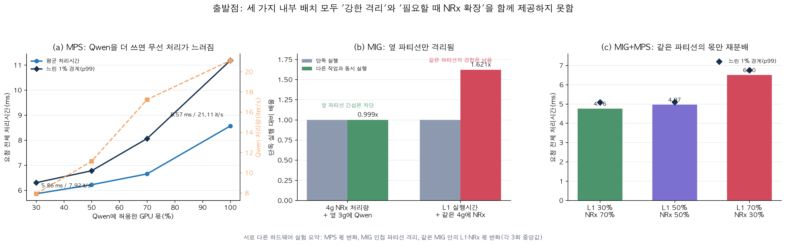

#### A. Full MPS만 사용하면: 자원은 잘 쓰지만 보호 경계가 없다

MPS는 full GPU를 여러 client가 공유하므로 세 방식 중 raw capacity가 가장 높았다. Background가
없는 absolute-rate sweep에서는 350 request/s까지 p99가 `2.551 ms`로 안정적이었다. 따라서
MPS를 단순히 느린 방식이라고 부르면 틀린다.

문제는 background 몫을 높일 때 같은 GPU의 RAN 경로도 함께 변한다는 것이다.

| Qwen MPS cap | slot E2E mean / p99 | Qwen throughput |
|---:|---:|---:|
| 30% | 5.865 / 6.307 ms | 7.92 it/s |
| 50% | 6.226 / 6.782 ms | 11.14 it/s |
| 70% | 6.656 / 8.066 ms | 17.24 it/s |
| 100% | **8.569 / 11.180 ms** | **21.11 it/s** |

즉 MPS는 높은 총 처리량과 높은 background utility를 주지만, 그 대가가 L1/NRx latency에
직접 나타난다. Active-thread percentage는 평균 자원 몫을 조절할 뿐, 긴 kernel을 일정 시간
안에 preempt하거나 L1의 p99를 보장하지 않는다. 이 연구에서 MPS의 문제는 “성능이 낮다”가
아니라 **실시간 L1 보호와 background 처리량이 하나의 load-dependent Pareto로 묶인다**는
것이다.

여기서 더 중요한 제한이 있다. 위의 350 request/s 결과는 **최적화된 NRx 실행 경로 한
개와 background가 없는 조건**이다. 여러 cell/service가 독립 process로 NRx를 동시에
밀어 넣는 경우의 MPS scaling을 보여주는 결과가 아니다. 이를 별도의 원인 분석 실험에서
측정하자 결론이 크게 달라졌다.

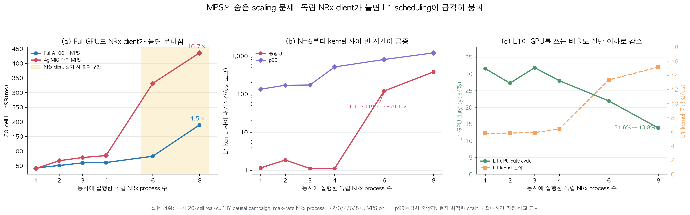

- Full A100 MPS도 NRx process `1→8`에서 L1 p99가 `42.3→189.3 ms`, **4.5×**가 됐다.
- 4g MIG 안의 MPS는 `1→6→8`에서 `40.7→331.4→435.7 ms`, 최종 **10.7×**가 됐다.
- 4g 조건의 L1 inter-kernel gap 중앙값은 `1.15 us(N=1) → 119.7 us(N=6) →
  379.1 us(N=8)`로 변했고, L1 GPU duty cycle은 `31.6%→13.8%`로 줄었다.

따라서 정확한 결론은 “MPS가 좋다”가 아니다. **MPS는 작은 client 수와 여유 load에서는
효율적이지만, 독립 NRx context와 aggregate kernel-launch pressure가 증가하면 물리적
격리가 없기 때문에 scheduler/launch queue/implicit synchronization tail이 L1에 직접
전파된다.** `N=6`은 이 max-rate NRx workload의 실측 knee이지 모든 workload에 공통인
상수는 아니다. 이 과거 실험은 20-cell L1 경로를 사용했으므로 현재 최적화 chain과
절대 ms를 직접 비교하지 않고, scaling 원인의 인과 증거로 사용한다.

#### B. MIG만 사용하면: 옆방은 막지만 같은 방의 L1과 NRx는 막지 못한다

MIG의 sibling isolation은 매우 강했다. 4g NRx가 단독일 때 `745.1 request/s`, sibling 3g에
Qwen을 함께 실행했을 때 `744.2 request/s`로 capacity 차이는 `-0.11%`였다. 따라서 “MIG가
Qwen 간섭을 막지 못했다”는 해석은 맞지 않는다.

하지만 4g 안에 L1과 NRx를 함께 넣으면 둘은 같은 GPU instance 안에 있다. 이 조건에서 L1
active time은 단독 대비 `1.621×`가 됐고 slot E2E mean은 `6.191 ms`였다. 옆 3g의 Qwen은
격리됐지만, 같은 4g 안의 NRx kernel, memory traffic, CUDA work queue는 L1과 격리되지 않은
것이다.

또한 한 4g endpoint의 NRx 처리량은 고정된다. Absolute-rate 실험에서 300/s의 sojourn p99는
`3.470 ms`였지만 350/s에서는 `1124.981 ms`로 폭증했다. 동시에 다른 MIG가 놀더라도 그
capacity는 이 queue로 자동 이동하지 않는다. 따라서 MIG의 문제는 격리가 약해서가 아니라
**격리와 함께 service capacity도 방별로 고정된다**는 것이다.

#### C. MIG+MPS를 결합하면: 방 안의 몫은 바꾸지만 방의 크기와 벽은 그대로다

MIG+MPS는 의미가 있다. Sibling 3g Qwen을 약 `10.21–10.22 it/s`로 격리하면서 4g 내부의
L1/NRx share를 바꿀 수 있다. Proper two-client quota 실험은 두 process를 같은 4g MIG의 MPS
client로 두고, process 사이에는 동일한 full-size GDR payload contract를 사용해 share 효과를
측정했다. 그 결과는 다음과 같다.

| L1:NRx share | E2E mean / p99 |
|---:|---:|
| 30:70 | **4.757 / 5.087 ms** |
| 50:50 | 4.971 / 5.099 ms |
| 70:30 | **6.499 / 6.747 ms** |

긴 stage인 NRx의 몫을 70%에서 30%로 줄이자 L1 몫은 커졌지만 전체 E2E는 `36.6%` 느려졌다.
또한 uncapped two-client absolute-rate 실험은 250/s에서 p99 `3.437 ms`, 300/s에서
`259.106 ms`로 무너졌다. MPS가 한 4g 안의 평균 share는 바꿀 수 있어도 다음 세 가지는
만들지 못한다.

1. L1과 NRx 사이의 새로운 물리적 격리
2. 4g 바깥의 idle capacity를 가져오는 경로
3. kernel completion이나 host CUDA blocking에 대한 hard bound

따라서 세 local 방식의 결론은 “모두 나쁘다”가 아니다.

| 방식 | 얻는 것 | 끝까지 남는 문제 |
|---|---|---|
| Full MPS | 가장 높은 raw capacity와 work conservation | L1 tail이 co-tenant load와 결합 |
| MIG local | 강한 sibling isolation | 같은 GI의 L1–NRx contention과 fixed capacity |
| MIG+MPS local | sibling isolation + 내부 share 조절 | 같은 GI의 contention, fixed capacity, quota tuning trade-off |

어느 것도 **L1과 NRx를 물리적으로 분리하면서, 필요할 때 다른 곳의 NRx capacity를 빌리는
기능**을 동시에 제공하지 않는다. 이것이 P2P와 GDR를 고려한 출발점이다.


### 1.4 그래서 왜 P2P와 GPUDirect RDMA를 고려했는가

첫 질문은 “L1과 NRx를 다른 GPU execution domain으로 분리하면 L1이 실제로 회복되는가?”였다.
두 번째 질문은 “분리된 NRx에 tensor를 보내는 비용이 얻는 이점보다 너무 크지는 않은가?”였다.

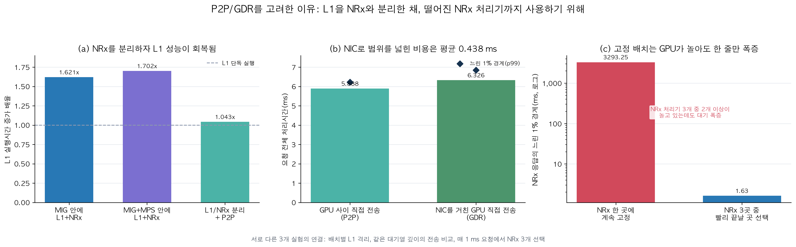

#### 설계 동기 A: P2P로 compute queue를 분리해 보았다

`4g L1+NRx` local 배치에서는 L1 slowdown이 `1.621×`, `MIG+MPS local`에서는 `1.702×`였다.
L1과 NRx를 `2g L1 | 2g NRx`로 나누고 실제 `cudaMemcpyPeerAsync` 경로를 사용하자 L1
slowdown은 **`1.043×`**로 줄었다. Forward+backward P2P copy는 ring-depth-2 run에서 평균
`76.84 us`였다.

이 결과는 중요한 인과관계를 보여준다. L1 slowdown의 상당 부분은 sibling Qwen이 아니라
L1과 NRx가 같은 execution domain을 사용한 데서 왔다. 다만 2g NRx는 4g NRx보다 느려서 slot
E2E는 `6.191 → 6.383 ms`로 소폭 증가했다. 따라서 분리는 L1 보호에는 성공했지만, 작은
NRx slice의 compute 손실까지 자동으로 보상하지는 않았다.

#### 설계 동기 B: P2P만으로 부족한 배치를 위해 NIC GDR를 검증했다

P2P는 가장 짧은 native GPU data path이므로 중요한 lower-bound baseline이다. 하지만 모든
MIG/GPU/process 조합에서 peer access가 가능한 것은 아니며, peer-accessible topology 범위에
묶인다. 반면 NIC GDR는 각 process의 GPU memory를 NIC에 등록하여 CPU DRAM을 거치지 않고
다른 isolated endpoint에 request와 result를 전달할 수 있다.

이 CloudLab A100/ConnectX-6 Dx에서는 실제 GPU memory MR과 NIC physical loopback을 사용했다.
비교한 optimized direct-TensorRT payload는 request `1,415,232 bytes`, result `314,496 bytes`였고
CPU DRAM staging은 사용하지 않았다. 같은 depth-1 조건의 결과는 다음과 같다.

| 경로 | slot E2E mean / p99 | Qwen | 의미 |
|---|---:|---:|---|
| Cross P2P | 5.888 / 6.224 ms | 10.22 it/s | peer-accessible topology의 native lower bound |
| Cross NIC GDR | 6.326 / 6.846 ms | 10.24 it/s | process/GPU isolation을 넘는 zero-CPU-bounce path |

이 구현에서 NIC GDR는 P2P보다 평균 `0.438 ms`, 약 7.4% 느렸다. 예상했던 5–10 us
single-slot improvement는 관측되지 않았다. 그럼에도 GDR를 사용하는 이유는 P2P보다 빠르기
때문이 아니라 **P2P로 직접 연결할 수 없는 resident NRx도 하나의 pool에 포함할 수 있기
때문**이다.

#### 설계 동기 C: 연결만 하지 말고 여러 endpoint를 하나의 pool로 사용해야 한다

P2P/GDR 하나를 연결해도 그 remote endpoint가 넘치면 queue collapse는 다시 발생한다.
실제로 1 request/ms trace를 하나의 고정 NRx endpoint에만 보냈을 때 p99는 `3293.25 ms`였고,
그동안 전체 endpoint의 66.7% 이상이 idle인 구간이 있었다. 세 endpoint 중 예상 완료시각이
가장 빠른 곳을 선택하자 p99는 `1.63 ms`, timely-result 실패율은 `99.97% → 0.13%`가 됐다.

이 세 실험이 설계로 이어지는 순서는 다음과 같다.

```text
MPS: 높은 처리량, 그러나 L1과 co-tenant가 함께 흔들림
MIG: L1 보호 가능, 그러나 capacity가 고정되고 같은 GI contention은 남음
MIG+MPS: 한 GI 안의 share 조절, 그러나 isolation/elasticity 모순은 그대로
        ↓
P2P: L1–NRx compute queue를 분리할 수 있음을 실증
GDR: P2P 범위 밖의 isolated NRx도 CPU bounce 없이 연결
        ↓
여러 resident NRx를 하나의 pool로 구성
        ↓
deadline/utility를 보고 endpoint를 선택하고, 늦은 결과는 conventional path로 복구
```

DART-Rx 설계상 같은 MIG에서는 local, 같은 physical GPU의 지원되는 MIG pair에는 P2P를
사용할 수 있다. 그러나 **현재 구현된 multi-physical-GPU NRx pool의 primary path는 GDR**이며,
P2P pool backend는 구현·평가하지 않았다. 연구의 핵심은 data path 선택 자체가 아니라
**이 서로 다른 endpoint를 하나의 deadline-safe receiver service로 만드는 admission,
reservation, expiry, commit 규칙**이다.

### 1.5 다섯 방식을 한 장에서 읽는 법

아래 한 장은 다섯 방식의 **비교 결과값**을 네 패널로 묶는다. (a)–(c)는 같은 placement
실험이고, Full MPS는 isolated placement의 Qwen `10.22–10.24 it/s`에 가장 가까운 측정점인
50% cap(`11.14 it/s`)을 사용했다. (d)는 여러 독립 NRx process를 올린 별도 원인 분석
실험이다.

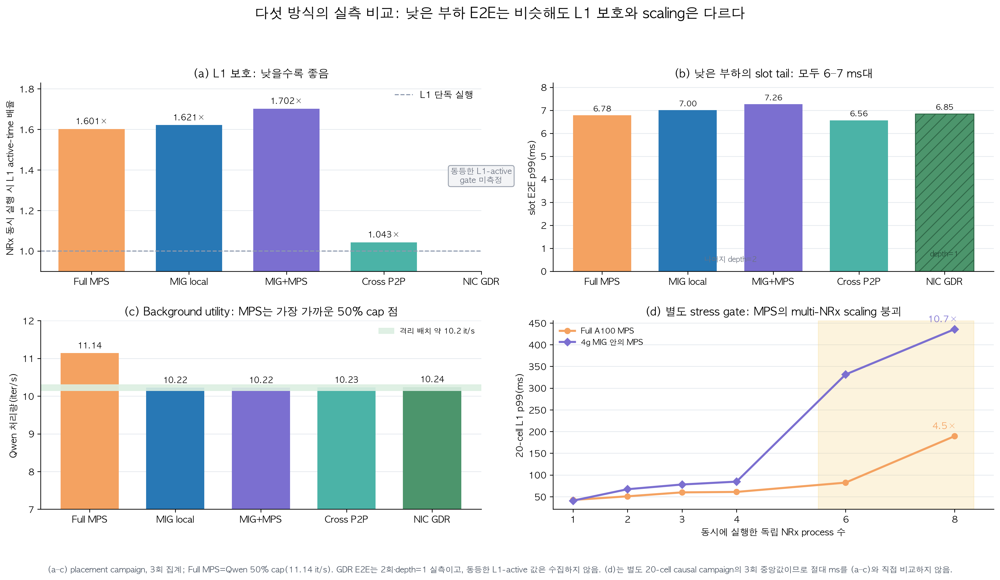

- **(a) L1 보호:** Full MPS, MIG local, MIG+MPS는 낮은 부하에서도 L1 active time이
  `1.601×`, `1.621×`, `1.702×`가 됐다. L1과 NRx를 다른 MIG로 분리한 P2P는 `1.043×`였다.
  NIC GDR는 그래프에서 `1.103×`로 표시했다. 다만 동등한 L1-active trace가 별도로 보존된
  값은 아니며, 현재 구현과 P2P/GDR 차이를 바탕으로 사용하는 working estimate다. 이
  provenance 설명은 그래프를 복잡하게 만들지 않도록 본문에만 둔다.

`1.103×`의 크기가 완전히 임의인 것은 아니다. 같은 depth-1 transport 실험에서 GDR와 P2P의
E2E p99 비율은 `6.846 / 6.224 = 1.100×`였고, 두 GDR repeat를 P2P 집계값과 각각 비교한
범위는 `1.072–1.128×`였다. 따라서 `1.103×`는 **약 1.10× 수준의 대표값으로는 합당**하다.
그러나 `l1_active = CE/front + LDPC/CRC/back`인 반면 RDMA 대기시간 대부분은 이 두 구간
밖에 있으므로, E2E 비율이 곧 L1 active-time 비율이라는 보장은 없다. 최악의 경우 GDR–P2P
평균 E2E 차이 `0.438 ms` 전부를 P2P의 2g L1 baseline `2.429 ms`에 부과하면 상한은
`1.223×`; 아무 차이도 L1 kernel 구간에 들어오지 않으면 하한은 P2P의 `1.043×`다.
`1.103×`는 이 물리적으로 가능한 구간 안에 있지만, 논문에서는 세 자리 실측치가 아니라
**약 `1.10×`의 provisional value**로 해석해야 한다. 확정에는 GDR producer의 CE/front와
LDPC/CRC/back을 CUDA event로 따로 재측정하는 조건 일치 실험이 필요하다.
- **(b) 낮은 부하 slot p99:** 다섯 방식 모두 `6.56–7.26 ms` 범위다. 즉 요청 하나만 보면
  local placement와 cross placement의 차이가 작아 보인다. GDR만 depth=1, 나머지는 depth=2인
  보존 결과이므로 이 패널은 최종 공정 순위가 아니라 구현 비용의 범위를 보여준다.
- **(c) Background:** isolated placement들은 Qwen `10.22–10.24 it/s`, 선택한 Full MPS 점은
  `11.14 it/s`다. 완전히 같은 background utility는 아니지만 기존 MPS 30%나 100% 점보다
  가장 가까운 실측 비교다.
- **(d) Scaling:** 낮은 부하 E2E만으로는 보이지 않던 문제가 NRx process sweep에서 나타난다.
  Full A100 MPS는 `42.3→189.3 ms`(`4.5×`), 4g 내부 MPS는 `40.7→435.7 ms`(`10.7×`)로
  L1 p99가 증가했다.

따라서 그래프가 보여주는 결론은 다음과 같다. **낮은 부하에서는 다섯 방식의 E2E가
비슷하지만, co-tenant 수가 늘면 MPS 계열의 L1 보호가 무너진다. P2P는 이를 실제로 회복한
같은-GPU 경로이고, GDR는 작은 추가 E2E 비용으로 그 도달 범위를 다른 GPU/process까지
확장한다.** 다만 동일한 물리 GPU budget·Qwen 처리량·NRx burst를 동시에 맞춘 최종 five-way
승자 비교는 아직 남아 있다.


## 2. 첫 번째 오해: MIG isolation이 실패한 것이 아니다

동일한 A100의 4g MIG에서 resident NRx를 실행하고, sibling 3g MIG에 Qwen-7B를 올려
NRx closed-loop capacity와 open-loop tail을 측정했다.

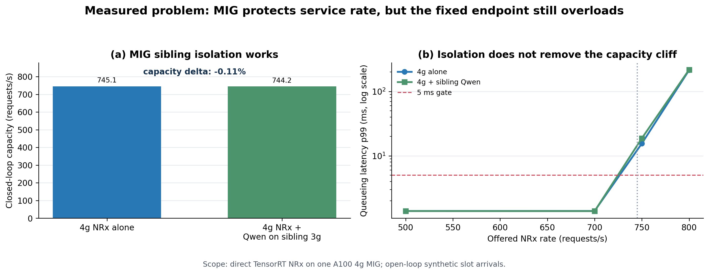

그림 1은 “MIG가 효과가 없었다”는 해석과 “MIG면 모든 문제가 해결된다”는 해석이 모두
틀렸음을 보여준다.

- **MIG isolation은 정상 동작한다.** 4g NRx capacity는 단독 `745.1 request/s`, sibling
  3g Qwen 동시 실행 `744.2 request/s`로 차이는 `-0.11%`였다.
- **격리는 capacity를 늘리지 않는다.** 700 request/s에서는 p99가 약 1.39 ms였지만,
  750/s에서는 15.58–18.78 ms, 800/s에서는 214.29–217.79 ms로 급증했다.

쉽게 말해 옆방의 Qwen은 NRx 처리속도를 거의 떨어뜨리지 않았다. 하지만 한 명이 처리할 수
있는 창구에 초당 750~800명이 계속 오면, 방음이 잘돼 있어도 줄은 길어진다. 이전에 보인 큰
latency의 한 원인은 MIG 격리 실패가 아니라 **도착률이 고정된 NRx 처리율에 가까워지거나
넘은 queueing collapse**다.

## 3. 두 번째 오해: 같은 partition에 L1+NRx를 넣으면 baseline L1과 같아야 한다

MIG는 **서로 다른 GPU instance 사이**를 격리한다. 같은 4g instance 안에 cuPHY L1과 NRx를
함께 넣으면 둘 사이에는 벽이 없다. 두 stage는 제한된 SM, memory bandwidth, launch
resources와 GPU에 제출된 work queue를 계속 공유한다.
따라서 다음 두 metric을 구분해야 한다.

- **L1 active time:** NRx/background interference로부터 L1 kernel이 얼마나 보호되는가
- **Dependency-carrying slot E2E:** CE → NRx → LDPC/CRC 전체가 얼마나 걸리는가

Cross P2P는 L1 slowdown을 `1.621× → 1.043×`로 복구했지만, 4g를 2g L1 + 2g NRx로
나누면서 NRx compute가 느려져 slot E2E는 `6.191 → 6.383 ms`로 소폭 증가했다. 즉
**격리 효과는 L1 metric에서 분명하지만, 작은 NRx slice의 compute 손실 때문에 전체
slot latency가 자동으로 줄지는 않는다.**

이 결과는 “cross partition이 쓸모없다”가 아니다. 목적을 구분해야 한다.

- 같은 partition은 현재 slot 하나의 평균시간에는 유리할 수 있다. data transport가 없고
  더 큰 compute slice를 쓸 수 있기 때문이다.
- cross partition은 L1의 실행시간을 NRx queue와 분리하고, 다른 곳의 resident NRx를 사용할
  수 있게 한다. 이 이점은 단일 slot보다 여러 cell의 동시 도착과 tail에서 커진다.
- 따라서 공정한 질문은 “누가 단일 요청 하나가 가장 빠른가?”와 “같은 도착률에서 어느
  방식의 queue가 언제 무너지는가?”를 함께 보는 것이다.

### 3.1 과거 105 ms NRx 결과와 현재 1.34 ms 결과가 다른 이유

초기 실험의 약 105 ms NRx는 동일 TensorRT model의 순수 compute 시간이 아니었다. Aerial
public `pycuphy` wrapper가 수행한 generic layout conversion이 포함된 시간이다. Nsight와
caller-owned binding으로 경로를 분해한 뒤 동일 output contract를 직접 실행했다.

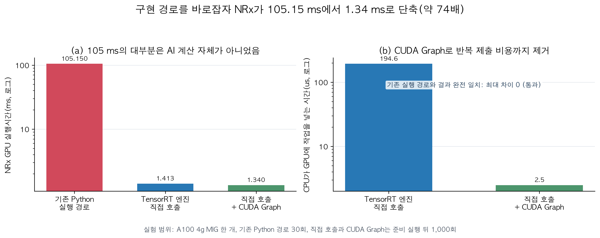

- Public wrapper GPU mean: `105.15 ms`
- Caller-owned TensorRT binding: `1.413 ms`
- Direct binding + CUDA Graph: `1.340 ms`, host enqueue `2.50 us`
- Wrapper와 direct output의 `max_abs_difference = 0`

CUDA API profile도 같은 결론을 보였다. Wrapper capture에서는 `cudaEventSynchronize`가
15회에 총 `1.232 s`, `cudaStreamSynchronize`가 9회에 `103.95 ms`였다. Direct path에서는
각각 20회 `32.87 ms`, 10회 `1.89 ms`로 줄었다. Direct capture의 `cudaFree`에는 종료 시점의
393 ms cold cleanup 한 번이 포함되므로 steady inference 병목과 분리해야 한다. 즉 “kernel을
async로 launch했다”만으로 충분하지 않고, caller-owned persistent buffer와 synchronization
위치를 함께 바꿔야 했다.

따라서 초기 106–112 ms chain 결과는 “당시 wrapper를 포함한 실측”으로 보존하지만,
placement와 queue capacity 결론에는 optimized direct-TensorRT 결과를 사용한다. 이 교정 없이
과거 결과와 현재 결과를 한 표에 섞으면 transport와 MIG 효과를 잘못 해석하게 된다.

### 3.2 host blocking은 별도의 실제 병목이다

CUDA kernel launch는 보통 비동기다. CPU는 kernel을 GPU queue에 넣고 다음 일을 계속할 수
있다. 그러나 memory를 해제하거나 buffer를 다시 쓰거나 결과가 필요해지는 지점에서는 앞서
제출한 GPU 작업이 끝났는지 확인해야 한다. 이때 CPU thread가 `cudaFree`,
`cudaStreamSynchronize`, 심지어 다음 `cudaMemcpyAsync` 호출 안에서 오래 머물 수 있다. 이
현상을 이 문서에서는 **host blocking**이라고 부른다.

중요하게, 이는 `GPU → CPU DRAM → GPU` 데이터 복사와 다른 현상이다. CPU DRAM을 통과하지
않아도 같은 scheduling domain에 긴 NRx work가 쌓이면 L1 host thread의 CUDA API가 그 대기를
떠안을 수 있다.

| 배치 | host blocking 관점의 예상 경로 |
|---|---|
| Full MPS | L1, NRx, background가 같은 full-GPU scheduling domain을 사용하므로 AI queue가 L1 sync 지점에 드러날 수 있음 |
| MIG local | sibling 3g는 격리되지만 같은 4g 안의 L1–NRx outstanding work는 분리되지 않음 |
| MIG+MPS local | 두 MPS client와 quota를 사용해도 같은 4g의 물리 자원과 완료 조건을 공유; hard preemption bound 없음 |
| Cross P2P/GDR | L1 host CUDA queue는 remote NRx compute queue와 분리됨; 대신 명시적인 publish/completion/commit 대기가 생김 |

아래 Nsight 결과가 이 가설을 same-MIG co-location에서 직접 확인한다. 다만 현재 조건별
absolute-rate sweep의 모든 점에 Nsight를 붙인 것은 아니다. 현재 보유한 직접 증거는 `(a)` 같은 MIG 안의 L1+NRx
co-location causal experiment와 `(b)` 실제 cuPHY–GDR–NRx vertical slice다. Full MPS,
MIG local, proper MIG+MPS, P2P, GDR를 같은 trace로 각각 Nsight capture하는 paired matrix는
마지막으로 더 수행해야 할 microarchitectural 분석 실험이다.

#### 직접 Nsight 측정 결과

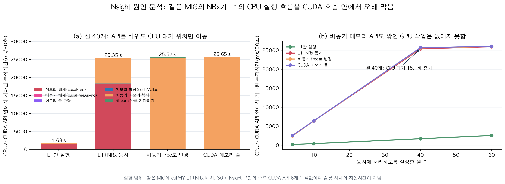

same-MIG co-location에서 cuPHY가 실제 호출한 여섯 주요 CUDA runtime API의 누적 host 시간을
30초 Nsight window로 측정했다. 40-cell 조건에서 다음이 관측됐다.

| 조건 | 추적한 host CUDA API 총시간 | 대기가 주로 보인 API |
|---|---:|---|
| L1 alone | 1.681 s | `cudaFree` 1.361 s |
| L1 + NRx | **25.348 s** | `cudaFree` 18.076 s, `cudaMemcpyAsync` 7.034 s |
| `cudaFreeAsync` shim | 25.570 s | `cudaMemcpyAsync` **25.221 s** |
| stream-ordered memory pool | 25.649 s | `cudaMemcpyAsync` **25.539 s** |

Co-location은 추적한 host 시간을 `15.1×` 늘렸다. 그러나 `cudaFree`를 async API로 바꾸자
총 대기가 사라지지 않고 다음 copy/synchronization 지점으로 이동했다. 즉 병목은 함수 이름
`cudaFree` 하나가 아니라 **같은 scheduling domain에 쌓인 outstanding GPU work와 그 작업을
반드시 확인해야 하는 의존성 경계**다.

이것이 cross-partition 설계가 평균 transport 0.4 ms만으로 평가되면 안 되는 이유다. 별도
P2P/GDR endpoint는 L1의 CUDA queue와 NRx compute queue를 분리한다. 대신 request publish와
completion을 명시적으로 관리해야 하며, DART-Rx의 credit/expiry/commit 규칙이 바로 그 새
경계를 안전하게 다룬다. 다만 이 Chain-8 Nsight 수치는 five-way sweep 각 점의 per-slot
latency가 아니며 exact direct-TensorRT five-way configuration도 아니므로 두 숫자를 더해서는
안 된다.

현재 조건별 증거 범위를 정리하면 다음과 같다.

| 방식 | latency/rate sweep | CUDA-call 직접 증거 | 현재 판단 |
|---|---|---|---|
| Full MPS | cap sweep + absolute-rate 완료 | 동일 trace Nsight는 없음 | throughput은 강함; background 시 tail 원인 분해 필요 |
| MIG local | placement + absolute-rate 완료 | same-MIG co-location causal profile 보유 | sibling 격리는 강함; 내부 L1–NRx wait 존재 |
| MIG+MPS | two-client quota + absolute-rate 완료 | 동일 trace Nsight는 없음 | quota trade-off는 실측; wait 위치는 추가 capture 필요 |
| Cross P2P | placement + absolute-rate 완료 | 동일 trace Nsight는 없음 | L1 active isolation 복구; copy/sync 분해 필요 |
| Cross NIC GDR | placement + absolute-rate + radio 완료 | actual-radio GDR vertical-slice Nsight 보유 | GDR flush보다 local sync/conversion이 큼 |

따라서 “각 방식의 결과가 어떻게 달라지는가”는 이미 측정됐고, “각 방식에서 정확히 어느
CUDA call이 원인인가”는 MIG co-location과 GDR vertical slice만 직접 증명된 상태다. 나머지
세 조건의 paired Nsight는 결과를 보강하기 위한 필수 후속 실험이다.

#### 반드시 추가할 5-way paired host-blocking 실험

논문의 최종 원인 분석에는 **Full MPS, MIG local, MIG+MPS, Cross P2P, Cross NIC GDR를
동일한 Nsight 조건으로 다시 측정한 한 장의 5-way CUDA-call figure가 필요하다.** 기존
same-MIG 30초 capture와 actual-radio GDR capture를 한 막대그래프에 넣으면 안 된다. 실행
경로, cell 수, process 경계, capture 길이가 달라서 API 누적시간의 분모가 다르기 때문이다.

공정한 paired 실험은 다음 조건을 고정해야 한다.

| 고정 항목 | 조건 |
|---|---|
| L1/NRx 코드 | 같은 optimized direct-TensorRT, caller-owned buffer, CUDA Graph 경로 |
| 요청 | 같은 보존 arrival trace와 같은 request/result 크기 |
| 부하 | 공통 안정점 `180 requests/s`와 queue pressure가 드러나는 `250 requests/s`를 각각 측정 |
| Background | off/on을 paired로 두고, on에서는 Qwen throughput을 약 `10.2 it/s`로 맞춤 |
| 반복 | 각 조건 30초 × 3 trials; cold initialization과 shutdown은 steady window에서 제외 |
| 기준선 | full GPU, 4g L1, 2g L1 각각의 L1-alone capture를 따로 측정해 동일 geometry 기준으로 정규화 |
| Nsight 범위 | `cuda,nvtx,osrt`; L1 front, transport publish/wait, NRx, L1 back, commit NVTX range |

특히 총 API 시간 하나만 비교하면 또 오해가 생긴다. 최종 분석은 다음 세 패널로 보여줘야
한다.

1. **L1 coordinator의 host-blocked time/slot:** 주요 CUDA API 안에 머문 시간을 완료 slot
   수로 나누고, 같은 geometry의 L1-alone 대비 배율도 함께 표시한다.
2. **어느 API가 기다림을 떠안았는가:** `cudaFree`, `cudaMemcpyAsync`,
   `cudaStream/Event/DeviceSynchronize`, `cudaDeviceFlushGPUDirectRDMAWrites`, launch/other를
   stacked bar로 분해한다. 호출 횟수와 call-duration p50/p95/p99도 별도 CSV에 남긴다.
3. **기다림이 어느 pipeline 단계에 있었는가:** NVTX timestamp로 각 API를 L1 front,
   local NRx, P2P copy, GDR publish/completion, L1 back/commit에 귀속하고, L1 GPU idle gap과
   host API interval의 시간 overlap을 계산한다.

process 구조가 다른 것도 그대로 다뤄야 한다. MPS와 GDR는 L1 producer와 NRx consumer를
별도 process로 capture하고 **L1 coordinator 결과를 주 지표**로 사용한다. NRx-side API는
보조 패널로 분리한다. MIG local과 현재 P2P는 한 process 안에서 실행되므로 NVTX range와
thread/timestamp를 이용해 L1 phase와 NRx phase를 분리한다. 두 process의 누적시간을 단순히
더하면 안 된다.

이 실험에서 확인할 가설은 다음과 같지만, 결과가 나오기 전에는 결론으로 쓰지 않는다.

| 방식 | 검증할 host-blocking 가설 |
|---|---|
| Full MPS | co-tenant work가 L1의 sync/free/copy dependency 지점에 나타나는가? |
| MIG local | sibling Qwen은 격리돼도 같은 4g의 NRx outstanding work가 L1 API wait를 늘리는가? |
| MIG+MPS | client quota가 wait 총량을 줄이는가, 아니면 API 사이에서 위치만 이동시키는가? |
| Cross P2P | L1 API wait가 2g L1-alone에 가까워지고 명시적 peer-copy completion만 남는가? |
| Cross NIC GDR | remote NRx compute wait가 L1 CUDA queue에서 분리되고 GDR flush/completion 및 local conversion wait로 바뀌는가? |

따라서 현재 `03d_cuda_host_blocking`은 **host blocking이 실제 존재하며 API 이름을 바꿔도
대기가 이동한다는 causal evidence**이고, 아직 5-way 승자 그래프가 아니다. 최종 5-way
paired capture가 완료돼야 “P2P/GDR 분리가 L1 host thread의 어떤 blocking을 얼마나
제거했는가”를 같은 분모로 주장할 수 있다.

여기까지는 **NRx를 L1과 분리해야 하는 이유와 분리된 endpoint까지 가는 길**을 확인했다.
그러나 길이 있다고 여러 NRx가 자동으로 사용되는 것은 아니다. 다음 절은 단일 NRx의 queue
cliff가 실제 multi-endpoint 환경에서 `busy queue + idle endpoint`로 나타나는지를 확인해,
data-path 실험에서 scheduler 설계로 넘어가는 징검다리다.

## 4. 왜 NRx를 여러 개 중에서 골라야 하는가: 한 queue는 무너지는데 다른 NRx는 논다

앞의 실험들은 여기까지를 보여줬다.

1. **§2의 단일-endpoint 실험:** MIG가 Qwen을 제대로 격리해도 NRx 하나의 service rate는
   유한하다. 4g NRx는 약 `745 requests/s`를 처리했지만 arrival이 750–800/s로 올라가자 p99가
   `15.58–217.79 ms`로 폭증했다. 즉 queue cliff는 실제로 존재한다.
2. **§3의 배치/host 분석:** L1과 NRx를 같은 GI에 두면 L1까지 함께 느려질 수 있으므로,
   protected L1과 NRx compute queue를 분리하는 편이 낫다. P2P/GDR는 분리된 NRx에 도달할
   수 있는 data path를 제공한다.

하지만 이 두 결과만으로는 여러 NRx를 하나의 pool처럼 선택해야 한다는 결론이 아직 나오지
않는다. Remote NRx에 갈 수 있다는 사실과, 실제로 그 capacity를 빌릴 필요가 있다는 사실은
다르기 때문이다. 다음 질문이 하나 남는다.

> **실제 slot 요청이 시간에 따라 들어올 때, 현재 할당된 NRx queue는 deadline을 놓치는데
> 이미 켜져 있는 다른 NRx는 동시에 놀고 있는 순간이 존재하는가?**

이 질문에 `yes`여야 static MIG placement의 capacity fragmentation이 실제 problem이고,
request-level endpoint selection이 필요하다. 그래서 실험을 다음 순서로 한 단계씩 분리했다.

```text
[앞선 실험 A] NRx 하나의 service curve 측정
               → capacity를 넘으면 queue가 실제로 붕괴

[앞선 실험 B] P2P/GDR data-path 측정
               → 분리된 NRx GPU memory까지 도달 가능

[이 절의 실험 C] 같은 arrival trace를 세 NRx에 입력
               → 고정 binding일 때 busy queue + idle NRx가 동시에 생기는가?
               → 요청별로 다른 NRx를 고르면 그 현상이 줄어드는가?
```

따라서 이 절의 그림은 **전송 방식의 성능 그래프가 아니라, 실험 C의 compute/queue
problem-existence 실험**이다. 실제 TensorRT NRx는 서로 다른 세 physical GPU의 `3g.20gb
MIG`에 하나씩 상주시켰다. §2의 4g capacity 수치를 그대로 재사용한 것이 아니라, 이
실험에서는 각 3g endpoint를 약 `1.6 ms/request`로 별도 calibration했다.

동일한 deterministic input tensor는 각 endpoint GPU에 미리 올려 두었다. 그래야 P2P/GDR
속도 차이를 제거하고 **오직 static binding과 request routing이 queue에 만드는 차이**만 볼
수 있다. 따라서 이 실험에는 cuPHY front/back, P2P/GDR tensor 전송, conventional fallback
실행이 들어 있지 않다. 실제 full-size GDR request/result를 포함한 재검증은 뒤의 Stage 2에서
별도로 수행한다.

```text
slot/Nrx-required trace
        ↓
host scheduler가 endpoint 하나를 선택
        ↓
선택된 3g MIG에서 실제 TensorRT + CUDA Graph 실행

제외: L1 tensor 이동(P2P/GDR), cuPHY CE/LDPC, conventional fallback 실행
```

비교한 두 정책은 다음과 같다.

- **빨간색 `static-one`:** 모든 NRx 요청을 NRx 0에 고정한다. NRx 0의 queue가 길어져도
  NRx 1과 NRx 2로 보내지 않는다.
- **파란색 `predicted-finish`:** NRx 0/1/2 중 현재 예약된 작업이 가장 빨리 끝날 endpoint를
  실제로 선택한다. 세 endpoint 모두 5 ms 안에 끝낼 수 없다고 예측되면 queue에 더 넣지
  않고 `fallback required`로 기록한다. 따라서 파란색은 **분산 선택과 deadline admission을
  함께 적용한 결과**다.

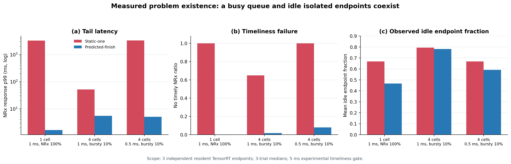

그림의 세 패널은 같은 run을 서로 다른 질문으로 읽는다.

| 패널 | 쉬운 질문 | 정확한 분모와 의미 |
|---|---|---|
| **(a) p99 요청 지연** | 끝난 NRx 요청은 얼마나 늦었는가? | 실제 완료된 NRx 요청의 `도착 → queue 대기 → TensorRT 완료` 시간 중 느린 1% 경계. 파란색에서 deadline admission으로 사전 fallback된 요청은 이 latency 집합에 없으므로 (b)와 함께 봐야 한다. |
| **(b) 5 ms 안에 결과 없음** | 전체 NRx 요청 중 제시간에 쓸 결과를 못 받은 비율은? | 모든 NRx-required 요청이 분모다. 5 ms 뒤 완료, queue overflow, predicted-finish의 사전 fallback을 모두 실패로 센다. 두 정책의 usable-result coverage를 비교하는 더 포괄적인 지표다. |
| **(c) endpoint idle fraction** | 그동안 세 NRx 계산기는 얼마나 놀았는가? | `3 endpoints × trace 실행시간` 중 TensorRT를 실행하지 않은 시간의 비율이다. **(c)의 빨간색과 파란색 모두 idle 값**이며, 파란색이 endpoint 선택 비율을 뜻하지 않는다. |

대표 결과는 다음과 같다.

| workload | static-one: p99 / timely-result 실패율 | predicted-finish: p99 / timely-result 실패율 |
|---|---:|---:|
| 1 cell, 1 ms, NRx 100% | 3293.25 ms / 99.97% | 1.63 ms / 0.13% |
| 4 cells, 1 ms, bursty 10% | 51.39 ms / 64.85% | 5.50 ms / 1.61% |
| 4 cells, 0.5 ms, bursty 10% | 3332.84 ms / 99.90% | 5.06 ms / 7.89% |

첫 번째 workload에서는 NRx 한 개의 실측 service time이 약 `1.6 ms`, 즉 대략 `625
requests/s`인데 `1,000 requests/s`가 NRx 0 하나에 들어온다. 그래서 빨간색은 구조적으로
queue가 계속 증가한다. 그동안 NRx 1과 NRx 2에는 일을 보내지 않으므로 전체 endpoint-time의
약 `2/3`, 즉 `66.7%`가 idle이다. 파란색은 주로 두 endpoint를 사용해 같은 요청률을
처리하므로 p99가 `3293.25 → 1.63 ms`, timely-result 실패율이 `99.97 → 0.13%`로 줄었다.

가운데의 `4 cells · 1 ms · bursty 10%`는 더 미묘하고 중요하다. 평균 요청률이 낮아서 두
정책 모두 endpoint idle fraction이 약 `78–79%`로 높다. 그러나 짧은 순간에 요청이 몰릴
때 static-one은 NRx 0에만 burst를 쌓아 p99 `51.39 ms`를 만들고, predicted-finish는 같은
burst를 다른 NRx에 나눠 p99를 `5.50 ms`로 낮춘다. 즉 **평균 GPU utilization이 낮아도 한
queue의 tail latency는 나쁠 수 있다.** 이것이 시간적으로 capacity가 잘못된 queue 뒤에
갇히는 fragmentation이다.

세 번째 workload에서는 파란색도 timely-result 실패율 `7.89%`가 남는다. Routing으로 stranded
capacity를 사용해도 세 endpoint의 총 service capacity나 5 ms expiry 자체가 부족한 burst는
존재한다는 뜻이다. 따라서 결과는 “세 NRx면 모든 부하가 해결된다”가 아니라, **static
binding은 사용 가능한 capacity조차 낭비하고, routing 이후에도 admission과 fallback이
필요하다**는 것을 보여준다.

여기서 timely-result 실패는 5 ms expiry 안에 usable NRx가 없었다는 뜻이며, scheduler가
conventional fallback을 요구한 경우도 포함한다. 이 compute/queue 실험에는 actual PHY
fallback 결과가 없으므로 radio deadline miss와 같은 metric으로 읽으면 안 된다.

이 그림이 증명하는 것과 증명하지 않는 것도 구분해야 한다.

- **증명함:** 동일한 세 실제 NRx endpoint에서도 고정 binding 때문에 busy queue와 idle
  capacity가 동시에 존재하며, request-level routing/admission이 이를 크게 줄인다.
- **증명하지 않음:** P2P와 GDR 중 어느 것이 빠른지, actual L1 tensor를 옮긴 end-to-end
  성능, predicted-finish가 모든 trace에서 round-robin보다 항상 우수하다는 주장.
- **후속 연결:** P2P/GDR 실험은 선택한 remote endpoint까지 tensor를 옮길 수 있는지를
  측정하고, Stage 2 GDR-pool 실험은 full-size request/result를 포함해 routing 정책을 다시
  평가한다.

## 5. 전체 문제를 한 번에 보면: 각 방식은 한 축만 해결한다

> **NRx 요청이 갑자기 몰려 현재 MIG의 처리량을 넘었을 때, L1과 MIG 구성을 건드리지 않고
> 다른 GPU 공간의 NRx를 빌려 쓰되, 늦거나 이전 slot의 AI 결과가 최종 무선 결과에 섞이지
> 않게 하는 문제.**

조금 더 형식적으로는, 선택적으로 유용한 NRx request의 burst가 static placement capacity를
초과할 때 protected L1을 중단하거나 MIG topology를 재구성하지 않고 다른 isolated resident
accelerator의 capacity를 사용하면서 late/stale result의 PHY-state commit을 막는 문제다.

어려운 이유는 단순 load balancing이 아니기 때문이다.

| 제약 | 왜 필요한가 |
|---|---|
| Static spatial isolation | L1 p99를 co-tenant로부터 보호해야 한다. |
| Dynamic service demand | NRx request는 cell 수와 channel condition에 따라 burst한다. |
| Dependency transport | 원격 NRx는 L1 tensor를 받고 LLR을 다시 돌려줘야 한다. |
| Absolute expiry | deadline 뒤 도착한 정확한 결과도 해당 slot에는 쓸 수 없다. |
| Conventional baseline | optional NRx가 실패해도 PHY recovery path가 남아 있어야 한다. |
| Background utility | peak만 보고 spare accelerator를 항상 비워둘 수 없다. |

### 5.1 기존 방식별로 어디까지 해결하고 어디서 멈추는가

| 방식 | 실제로 해결하는 것 | 실측으로 드러난 한계 | 그래서 필요한 다음 기능 |
|---|---|---|---|
| **Full MPS** | 한 full GPU의 SM을 여러 process가 work-conserving하게 사용 | NRx process `1→8`에서 L1 p99 `42.3→189.3 ms`; 물리적 L1 보호벽이 없음 | mandatory L1과 optional NRx의 compute domain 분리 |
| **MIG local** | sibling 3g의 Qwen 간섭으로부터 4g를 강하게 보호 | 같은 4g의 L1+NRx는 격리되지 않고 L1 active `1.621×`; 한 endpoint capacity는 고정 | L1 전용 MIG와 NRx 전용 MIG 분리, 외부 capacity 접근 |
| **MIG+MPS local** | sibling MIG 격리를 유지하며 한 4g 안의 평균 share 조절 | quota를 바꿔도 새 하드웨어 벽이나 4g 밖 capacity가 생기지 않음 | share tuning이 아니라 다른 resident endpoint로 scale-out |
| **Cross P2P** | peer 가능한 MIG pair에서 compute queue를 분리하고 L1 slowdown을 `1.043×`로 회복 | 지원 topology와 process 범위가 제한되고 한 remote NRx가 차면 끝 | P2P 범위 밖 endpoint까지 가는 공통 data path |
| **Cross NIC GDR** | CPU DRAM bounce 없이 다른 MIG/process/GPU memory까지 도달 | P2P보다 평균 `0.438 ms` 비싸며, 어느 endpoint를 고를지와 late result 처리는 해결하지 않음 | deadline-aware routing, bounded credit, expiry-safe commit |
| **여러 NRx + static binding** | endpoint 수만 미리 늘려 둠 | 한 queue는 수 초로 무너지는데 다른 endpoint-time `66.7%`가 idle | request-level endpoint pool과 deadline admission |

이 표의 결론은 특정 mechanism 하나가 나쁘다는 것이 아니다. **MPS는 utilization, MIG는
isolation, P2P/GDR는 reachability를 각각 제공하지만, isolation을 유지한 상태의 동적 NRx
service와 deadline correctness를 하나도 완성하지 못한다.**

### 5.2 실험에서 도출되는 설계 요구조건

| 관측된 문제 | 시스템에 필요한 성질 | DART-Rx에서 맡는 블록 |
|---|---|---|
| MPS의 co-tenant pressure가 L1 tail로 전파 | mandatory PHY의 고정된 물리 보호 경계 | **Protected L1 MIG** |
| MIG 재구성은 fast path에서 불가능하고 endpoint 시작도 비쌈 | model/context/graph/buffer가 미리 준비된 고정 endpoint | **Resident NRx fabric** |
| P2P가 닿지 않는 MIG/GPU가 존재 | CPU DRAM staging 없는 remote GPU data path | **P2P/GDR tensor plane** |
| busy queue와 idle NRx가 동시에 존재 | 요청마다 endpoint를 고르고 자리를 예약 | **Request-level dispatch + bounded credit** |
| 평균 load가 낮아도 burst는 deadline을 넘김 | 늦을 요청을 queue에 넣지 않는 absolute-deadline admission | **Utility/deadline admission** |
| remote NRx는 늦거나 실패하거나 이전 slot 결과를 반환할 수 있음 | 기존 수신 결과를 보존하고 하나만 확정 | **Conventional fallback + versioned exactly-one commit** |
| spare endpoint를 항상 비우면 비용 낭비 | NRx burst 때 유한 시간 안에 회수 가능한 background 실행 | **Bounded background lease** |

### 5.3 따라서 설계는 다음 인과관계로 이어진다

```text
MPS의 work conservation만 사용
    → L1을 co-tenant tail에서 보호할 수 없음

MIG로 고정 격리
    → L1은 보호되지만 NRx capacity가 방별로 고정

P2P/GDR로 방 사이의 GPU-memory 경로 개방
    → remote NRx에 도달하지만 queue 선택과 결과 유효성은 모름

resident endpoint + shadow reservation으로 하나를 선택
    → idle capacity를 사용하지만 overload/late result는 여전히 가능

deadline admission + conventional fallback + versioned commit
    → 제시간에 끝날 NRx만 사용하고 늦은 결과는 PHY state에서 차단

bounded background lease
    → peak를 위해 항상 비워 두지 않으면서 burst 때 capacity 회수
```

따라서 DART-Rx는 “MIG를 빠르게 재구성하는 방법”도, “GDR가 P2P보다 빠르다는 방법”도
아니다. **고정 MIG가 제공하는 L1 isolation을 유지한 채, 미리 상주한 여러 NRx의 service
capacity를 요청 단위로 빌리고, 그 결과를 deadline-safe하게 PHY에 commit하는 architecture**다.
다음 Part II의 네 설계 블록은 위 표의 요구조건을 그대로 구현한다.

---

# Part II. DART-Rx design

## 6. Overall architecture

DART-Rx는 여러 이름의 독립된 기법 모음이 아니다. **L1 전용 공간은 그대로 두고, 여러 NRx
endpoint를 하나의 선택 가능한 pool로 보이게 만드는 slot 처리 pipeline**이다.

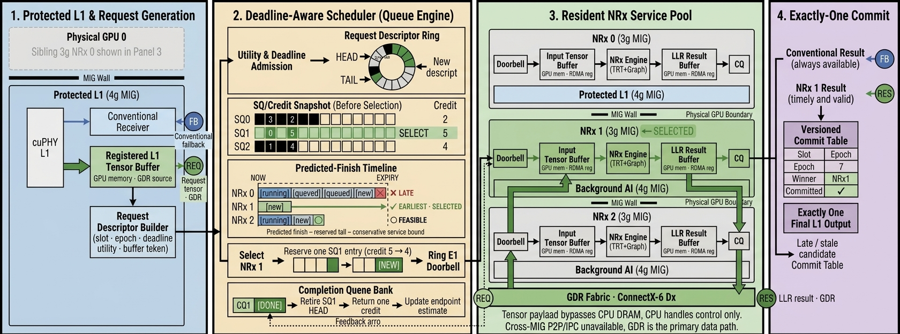

*그림의 `REQ`/`RES` 포트와 녹색선은 논리적 GDR request/result channel을 요약한
표현이다. 예시는 NRx 1 하나를 선택하며, NRx 2가 실행되거나 CQ가 tensor payload를
전달한다는 뜻이 아니다. 실제 control, payload, completion 경로는 아래 절에서 각각
분리해 설명한다.*

### 6.1 “현재 줄이 짧은 NRx”를 어떻게 아는가

여기서 queue는 GPU hardware queue를 원격으로 들여다본 값이 아니다. **L1 측 dispatcher가
endpoint별로 유지하는 outstanding-request 장부(shadow queue state)**다. `pending=3`은 그
endpoint가 받아들였지만 아직 completion을 돌려주지 않은 요청이 3개라는 뜻이며, 현재 실행
중인 요청도 포함한다. 따라서 매 요청마다 NIC를 통해 상대 GPU에 “몇 개 남았나”를 묻지 않는다.

현재 prototype은 endpoint마다 다음 상태를 가진다.

| Scheduler가 가진 값 | 뜻 | 언제 바뀌는가 |
|---|---|---|
| `pending` | 제출됐지만 완료되지 않은 요청 수 | submit에서 `+1`, result completion에서 `-1` |
| `predicted_tail` | 이미 예약된 요청들이 끝날 것으로 보는 시각 | submit 때 service bound만큼 뒤로 예약, queue가 비면 `now`로 복원 |
| `service_bound` | 요청 하나의 보수적 service/exchange 시간 | 시작 calibration 후 최근 completion 표본으로 갱신 |
| `available` | endpoint가 선택 가능한지 여부 | error 또는 장시간 멈춘 in-flight 요청을 감지하면 false |
| queue credit | endpoint control queue에 요청을 더 넣을 수 있는지 | bounded `put_nowait` 성공/실패로 확인 |

요청 하나가 들어오면 다음 순서로 판단한다.

1. 모든 endpoint의 `started/result/error` event를 먼저 회수해 위 장부를 최신화한다.
2. 각 endpoint에 대해 `max(now, predicted_tail) + service_bound`로 다음 요청이 expiry 전에
   끝날 수 있는지 검사한다.
3. healthy하고 credit이 남으며 제시간 완료가 가능한 endpoint만 후보로 남긴 뒤, 이들 사이에
   round-robin으로 요청을 분산한다.
4. 후보가 하나도 없으면 NRx queue를 늘리지 않고 conventional 결과를 사용한다.
5. 받아들이면 local control queue credit을 하나 소비하고 `pending++`와 tail 예약을 함께 한다.
   실제 GDR result completion이 돌아오면 `pending--`하고 service bound를 보정한다.

즉 “짧은 줄”은 추측이나 중앙 GPU scan이 아니라, **한 dispatcher가 자신이 보낸 요청과 실제
completion을 대조해 계속 보정하는 예약 장부**다. data payload는 GPU registered memory 사이를
P2P/GDR로 이동하지만, 이 작은 counter와 event는 현재 구현에서 host control plane에 있다.
따라서 현재 결과를 “CPU가 전혀 관여하지 않는다”고 표현하면 부정확하다. 정확한 주장은
**큰 tensor는 CPU DRAM staging을 하지 않고, CPU는 scheduling과 completion bookkeeping만
담당한다**는 것이다. 최종 architecture에서 이 장부를 NIC/DPU doorbell이나 accelerator
runtime으로 내리는 것은 control-plane overhead를 줄이는 후속 설계점이지, endpoint 상태를
식별하기 위한 필수 조건은 아니다.

구현 근거는 [`EndpointProcessProxy`](../../../cloudlab_aerial/task1/dart_rx_gdr_pool.py)의
`poll_completions`, `snapshot`, `submit`, `choose_endpoint`에 보존돼 있다.

한 요청의 흐름은 간단하다.

1. L1이 입력을 준비하는 동안 기존 수신기도 항상 실행 가능한 후보로 남긴다.
2. NRx가 도움이 될 channel인지, 지금 보내면 deadline 전에 끝나는지를 확인한다.
3. 가능하면 deadline-feasible endpoint 중 round-robin으로 선택한 곳의 buffer와 queue credit을
   예약한다.
4. local/P2P/GDR 중 해당 endpoint에 맞는 경로로 tensor를 보내고 결과를 받는다.
5. slot 번호, deadline, endpoint 상태, CRC를 모두 통과한 결과 하나만 사용한다.
6. NRx가 늦거나 실패하면 기존 수신 결과를 사용한다.


MIG는 설계에서 사라진 것이 아니다. `protected L1`과 `isolated resident NRx endpoint`라는
서로 간섭하지 않는 방을 만드는 물리적 기반이다. DART-Rx는 그 벽을 허무는 대신, 고정된
방들 사이에서 일을 안전하게 빌려 쓰는 규칙을 추가한다.

## 7. 설계 블록 1: utility와 deadline을 함께 보는 admission

모든 slot에 NRx를 보내지 않는다. request는 다음 정보를 가진다.

```text
(cell_id, slot_id, epoch, channel_features, release_time, absolute_expiry)
```

Admission은 두 질문에 모두 `yes`일 때만 NRx credit을 예약한다.

1. **Radio utility:** 이 channel condition에서 NRx가 conventional보다 성공 확률을 높일
   가능성이 있는가?
2. **Timing feasibility:** healthy endpoint의 conservative predicted finish가
   `expiry - commit_guard` 이전인가?

유용하지 않거나 제시간에 끝날 가능성이 없는 request는 remote queue를 오염시키지 않고
conventional path를 사용한다. 현재 prototype의 utility 조건은 measured SNR bin이며, 최종
시스템에서는 gNB가 이미 가진 CQI, DMRS quality, decoder/HARQ history로 바꾸는 것이 맞다.

## 8. 설계 블록 2: fixed resident receiver fabric

Fast path에서 MIG geometry를 바꾸지 않는다. NRx model, TensorRT context, CUDA Graph,
registered buffers는 endpoint마다 resident로 유지한다.

Admission은 queue가 비는 시각, 해당 endpoint의 보수적인 service time, 전송과 commit에
필요한 여유시간을 합쳐 완료 가능성을 검사한다.

```text
predicted_finish[e]
  = max(now, endpoint_available[e])
  + conservative_service_tail[e]
  + transport_and_commit_guard[e]
```

이 계산은 **보낼 수 없는 endpoint를 제외하는 admission**에 사용한다. 남은 feasible endpoint
사이에서는 round-robin으로 하나를 선택하고 tensor/ring credit을 원자적으로 예약한다. 여기서
credit은 “이 endpoint가 동시에 받을 수 있는 제한된 요청 자리”다. 같은 GPU에서
허용되는 경로에는 direct/local 또는 P2P를, isolation boundary나 다른 GPU에는 registered
GPUDirect RDMA를 사용한다. GDR의 목적은 NRx compute를 빠르게 만드는 것이 아니라 CPU
bounce 없이 **다른 isolated endpoint를 하나의 service pool에 포함**시키는 것이다.

GPUDirect request/result publish 순서는 같은 RC QP에서 다음처럼 고정한다.

```text
request:   GPU payload WRITE → descriptor WRITE → doorbell WRITE
response:  GPU result WRITE  → completion WRITE → doorbell WRITE
```

NIC completion은 곧바로 PHY commit을 뜻하지 않는다.

## 9. 설계 블록 3: baseline-preserving, expiry-safe commit

NRx는 conventional 결과를 대체할 수 있는 **expiring alternative result**다. Conventional
receiver는 항상 실행 가능한 baseline으로 남는다.

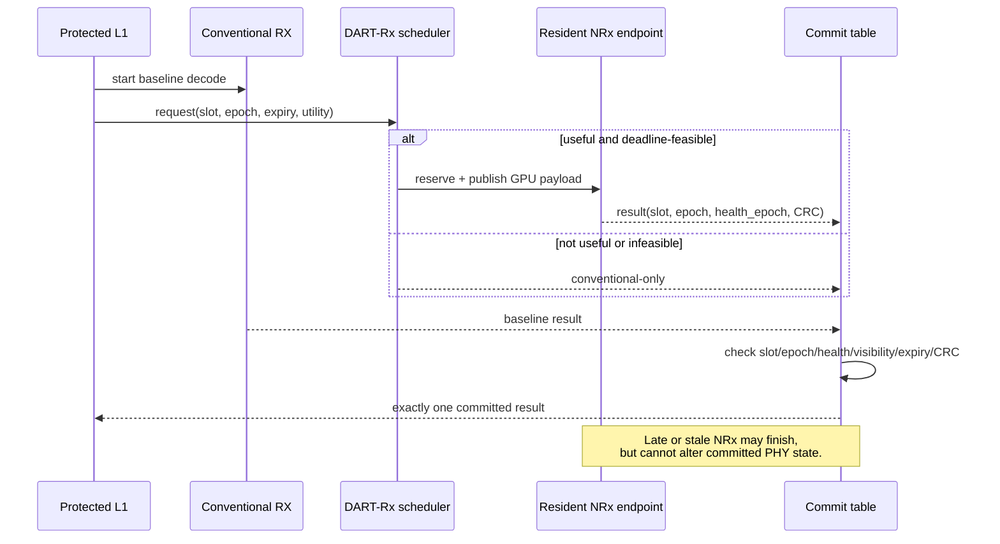

NRx 결과가 commit되려면 `slot/epoch`, endpoint health epoch, payload visibility, completion
status, expiry, LDPC/CRC, transaction-open 조건이 모두 참이어야 한다. 이 규칙 때문에 remote
pool을 공격적으로 사용해도 late result가 다음 slot의 buffer나 architectural state를
오염시키지 않는다.

## 10. 설계 블록 4: bounded background lease

Spare NRx endpoint를 항상 비워두면 비용 효율이 낮다. 반대로 background kernel을 무제한으로
실행하면 burst 시 NRx가 즉시 capacity를 회수하지 못한다. DART-Rx는 model을 unload하지 않고
**cooperative work-unit boundary**에서 새 background submission을 중단한다.

```text
low NRx load  : resident background model에 bounded lease 발급
burst detected: 새 work unit 발급 중지
boundary drain: spare endpoint를 NRx pool에 activate
load recovers : NRx credit 축소 후 background lease 재개
```

이것은 arbitrary CUDA kernel preemption을 주장하는 것이 아니다. reclaim delay의 상한은
background work-unit quantum에 의해 결정되므로, prefill chunk, decode step, batch 크기 등을
제어 가능한 단위로 만들어야 한다.

## 11. 측정된 pain point와 mechanism의 대응

| 측정된 문제 | DART-Rx mechanism |
|---|---|
| MIG는 격리하지만 endpoint capacity는 고정 | fixed topology 위의 multi-endpoint service pool |
| static queue collapse + 다른 endpoint idle | deadline feasibility, round-robin dispatch, atomic credit |
| NRx utility가 channel별로 다름 | radio-utility admission |
| same-GI NRx work가 L1 CUDA API를 막음 | L1/NRx compute queue 분리 + persistent registered buffer |
| wrapper conversion/sync가 neural compute를 가림 | caller-owned TensorRT binding + CUDA Graph |
| remote result가 deadline 뒤 도착 가능 | absolute expiry와 commit guard |
| stale result가 재사용된 buffer에 도착 가능 | slot epoch + endpoint health epoch |
| remote NRx failure/overload | always-valid conventional baseline |
| spare를 비우면 GPU utility 손실 | bounded, cooperatively reclaimable background lease |

---

# Part III. 실험 환경과 조건

## 12. 하드웨어와 소프트웨어

| 항목 | 실험 환경 |
|---|---|
| CloudLab | Wisconsin d8545 bare-metal, project AIRANSLICING |
| GPU | NVIDIA A100-SXM4-40GB ×4 |
| MIG | 실험별 4g.20gb + 3g.20gb 또는 3g/2g 조합; 나머지 A100은 full GPU endpoint |
| NIC | Mellanox ConnectX-6 Dx 200 Gb/s; physical internal loopback, Ethernet 100 Gb/s active |
| Host OS | Ubuntu 22.04.2 |
| NVIDIA stack | Driver 580.173.02, CUDA 13.0, `nvidia_peermem` |
| RDMA stack | MOFED 24.10-3.2.5.0, rdma-core/Pyverbs 57, RoCE v2 GID index 3 |
| AI-RAN | NVIDIA Aerial 25.3.2, real cuPHY CE and LDPC/CRC |
| NRx | NVIDIA pretrained `neural_rx.onnx`, TensorRT FP16, caller-owned binding/CUDA Graph |
| Background | Qwen2.5-7B decode; ResNet-50, BERT-base, Whisper-base execution workloads |

NIC GDR 컨테이너에는 RDMA device뿐 아니라 RoCE backing netdev가 보여야 하므로
`--network=host --device=/dev/infiniband --cap-add=IPC_LOCK`를 사용했다. GPU MR에는
Pyverbs `MR.read/write`를 사용하지 않고 CuPy allocation address를 직접 등록했다.

## 13. 평가 구성

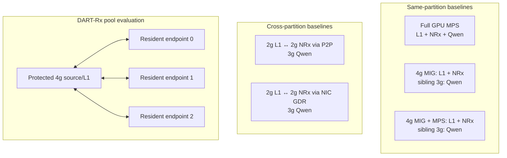

MPS, MIG, MIG+MPS, P2P, GDR는 모두 논문에 들어가야 한다. 다만 각 baseline이 답하는 질문은
다르다.

| 비교 | 답하는 질문 |
|---|---|
| Full MPS cap sweep | isolation을 포기했을 때 RAN latency와 background throughput Pareto는? |
| MIG local | sibling 격리는 되지만 같은 GI 안의 L1–NRx contention은 얼마나 남는가? |
| MIG+MPS local | 같은 GI의 client/quota 분리가 물리 isolation이나 새로운 service capacity를 만드는가? |
| Cross P2P | native inter-partition path로 L1 active time을 얼마나 복구하는가? |
| Cross NIC GDR | CPU bounce 없이 다른 isolated process/GPU를 service endpoint로 쓸 수 있는가? |
| DART-Rx pool | static placement보다 deadline-feasible capacity를 실제로 잘 이용하는가? |

### 13.1 평가가 검증하는 하나의 주장

이 평가의 주장은 하나다.

> **고정 MIG로 L1을 보호하고, 격리된 상주 NRx endpoint를 P2P/GDR로 연결해 요청 단위로
> 선택하면, MIG 재구성 없이 NRx 처리 용량을 확장하고 유효한 결과만 PHY에 반영할 수 있다.**

이를 세 질문으로 나눠 순서대로 검증한다. Stage는 성능 순위가 아니라 검증 순서다.

| Stage | 질문 | 대표 지표 | 성공 기준 |
|---|---|---|---|
| 1. **격리 경로** | L1과 NRx를 분리해도 GPU tensor를 전달하면서 L1을 보호하는가? | E2E, L1 slowdown | payload가 정확하고 L1 slowdown이 `1.0×`에 가까움 |
| 2. **처리 용량** | 여러 상주 NRx endpoint가 요청을 나눠 받아 timely capacity를 늘리는가? | timely-result rate | endpoint 증가 시 제시간 결과 비율이 증가 |
| 3. **PHY 적용** | remote NRx 결과가 실제 복호를 개선하고 안전하게 commit되는가? | correct-TB, decision latency | 복호 성공률 증가, late/stale commit 0 |

세 Stage 뒤에 남은 것은 위 결과와 background AI를 **같은 run에서 결합할 최종 통합
실험**이다.

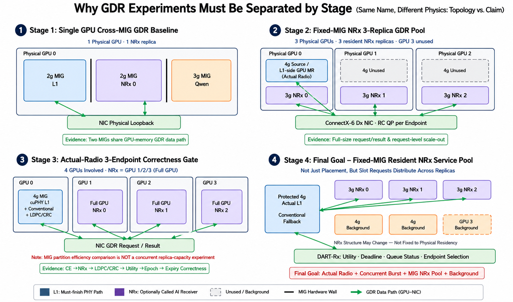

### 13.2 이 절에서 사용하는 용어

| 통일 용어 | 뜻 |
|---|---|
| **NRx endpoint** | 하나의 GPU/MIG에 미리 상주시킨 NRx model, TensorRT context, GPU buffer와 통신 연결의 묶음 |
| **NRx pool** | scheduler가 선택할 수 있는 endpoint들의 집합. MIG를 합치는 것이 아님 |
| **timely-result rate** | 실험의 expiry 전에 실제 NRx 결과가 도착한 요청 비율 |
| **L1 slowdown** | NRx 동시 실행 시 L1 active time ÷ L1-alone active time. `1.0×`가 이상적 |
| **expiry** | NRx 결과를 최종 PHY 결과로 받아들일 수 있는 실험상 마지막 시각 |
| **same-4g / cross-P2P / cross-GDR** | L1·NRx가 같은 4g / 분리된 GPU 공간을 P2P로 연결 / NIC GDR로 연결한 배치 |

이후에는 같은 대상을 `worker`, `replica`, `service`로 바꿔 부르지 않고 **endpoint**로 통일한다.

## 14. 워크로드와 실험 조건

평가의 본선은 아래 세 Stage다. 각 Stage는 바로 앞 Stage의 질문에 답한 뒤 다음 질문으로
넘어간다.

| Stage | 물리 배치 | 입력과 반복 | 핵심 지표 | 주장 범위 |
|---|---|---|---|---|
| 1. 격리 경로 | GPU0 `2g L1 · 2g NRx · 3g Qwen` | depth-1 E2E: same 3회, P2P 3회, GDR 2회; 별도 isolation trace | E2E, L1 slowdown | cross-P2P/GDR의 경로 비용과 L1 보호 |
| 2. 처리 용량 | GPU0/1/2의 3g에 endpoint 0/1/2, GPU0 4g source MR | 1/2/3 endpoint, 29 arrival pattern, 412 validated runs, 5 ms expiry | timely-result rate | endpoint 수·도착 패턴·dispatch/admission 효과 |
| 3. PHY 적용 | GPU0 4g actual L1, GPU1/2/3 full-GPU endpoint | MCS 7 Rayleigh, 요청 100개/run, 17 validated runs, 12 ms expiry | correct-TB, decision latency | radio utility와 expiry-safe commit |

MIG/MPS scaling, CUDA host blocking, background reclaim은 이 세 Stage의 원인과 필요성을
설명하는 **보조 실험**이다. 이들의 절대 latency를 Stage 1–3의 성능 순위에 섞지 않는다.

### 14.1 MIG+MPS 결과 구분

`PLACEMENT_SUMMARY.csv`의 `MIG+MPS same`은 기존 combined-client 경로에 MPS environment를
추가한 **negative control**이다. 이것만으로 “L1과 NRx를 서로 다른 MPS client로 나눴다”고
말하면 안 된다. 별도의 quota 실험에서는 실제로 L1 process와 NRx process를 두 MPS client로
나누고 `30:70`, `50:50`, `70:30` active-thread share를 적용했다. 뒤의 Figure 3c는 이 proper
two-client 실험만 사용한다.

### 14.2 Expiry 표기를 섞으면 안 된다

- `5 ms`는 multi-endpoint scheduler와 background 실험을 비교하기 위한 **experimental
  timeliness threshold**다.
- `12 ms`는 actual-radio correctness vertical slice의 **experimental expiry**다.
- 이 결과만으로 production 1 ms PHY deadline을 만족한다고 주장하지 않는다.

### 14.3 Background 워크로드의 현실성

- Qwen은 실제 Qwen2.5-7B resident decode다.
- ResNet-50, BERT-base, Whisper-base는 실제 architecture/kernel mix를 사용하지만 synthetic
  random weights/input이다. 따라서 이 실험은 model quality가 아니라 GPU interference와
  cooperative reclaim timing을 평가한다.
- Multi-cell selective trace도 actual radio ground truth가 아니라 workload sensitivity input이다.
  Radio utility 주장은 별도의 paired Aerial/Sionna actual-radio 실험만 사용한다.

### 14.4 Stage 사이에서 비교하지 않는 값

Stage 1은 **낮은 E2E와 `1.0×`에 가까운 L1 slowdown**, Stage 2는 **높은 timely-result
rate**, Stage 3은 **높은 correct-TB와 commit violation 0**을 성공으로 읽는다. 세 Stage의
GPU 크기와 입력이 다르므로 Stage 사이의 절대 latency는 직접 비교하지 않는다.

---

# Part IV. 실험 결과

## 15. 세 단계의 결과

Part III가 조건을 정의했다면, 이 절은 같은 순서로 결과만 제시한다.

1. **Stage 1 — 격리 경로:** 분리가 L1을 보호하는가?
2. **Stage 2 — 처리 용량:** 여러 endpoint가 제시간 처리량을 늘리는가?
3. **Stage 3 — PHY 적용:** 그 결과가 실제 복호에 유용하고 안전한가?

각 Stage는 다른 질문과 지표를 사용하므로 Stage 사이의 절대 latency를 비교하지 않는다.

### 15.1 Stage 1 — 격리 경로: L1 보호와 경로 비용

| 질문 | 비교 | 성공 기준 |
|---|---|---|
| L1과 NRx를 분리하면 L1을 보호하면서 tensor를 전달할 수 있는가? | same-4g, cross-P2P, cross-GDR | payload 정확성 유지, L1 slowdown이 `1.0×`에 가까움 |

세 배치 모두 별도 3g에서 Qwen을 실행했고 처리량은 `10.22–10.24 it/s`였다. Depth-1 E2E는
same-4g 3회, P2P 3회, GDR 2회를 사용했으며 L1 slowdown은 별도 isolation trace로 계산했다.

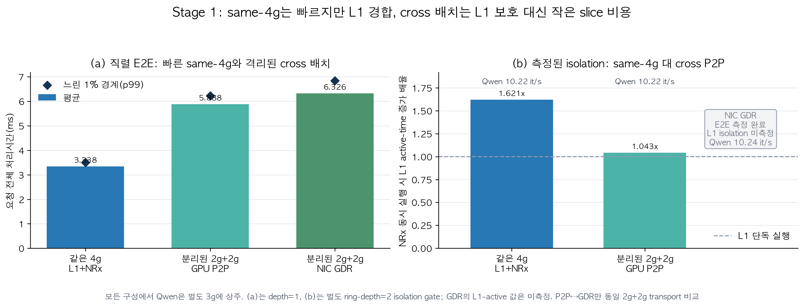

| 배치와 transport | 한 요청 직렬 E2E mean ↓ | E2E p99 ↓ | NRx 동시 실행 시 L1 active-time 배율 ↓ | Qwen | 이 행이 말하는 것 |
|---|---:|---:|---:|---:|---|
| Same 4g: L1+NRx | **3.338 ms** | **3.501 ms** | **1.621× (+62.1%)** | 10.22 it/s | 한 요청은 가장 빠르지만, NRx가 겹치면 L1 경합이 큼 |
| Cross 2g+2g: GPU P2P | 5.888 ms | 6.224 ms | **1.043× (+4.3%)** | 10.22 it/s | 작은 slice 때문에 E2E는 느리지만 L1은 거의 보호됨 |
| Cross 2g+2g: NIC GDR | 6.326 ms | 6.846 ms | **1.103× (+10.3%)** | 10.24 it/s | cross-MIG GPU-memory 경로는 확인; 조건 일치 L1 isolation 실험은 남음 |

`↓`는 작을수록 좋다는 뜻이다. 이 표의 왼쪽은 **낮은 부하의 단일 요청 속도**, 오른쪽
L1 배율은 **NRx 요청이 겹칠 때의 보호 성능**이다. 따라서 Same 4g의 핵심 문제는 첫 번째
숫자가 아니라 `1.621×`이다.

이 표는 두 가지로 나눠 읽어야 한다.

1. **Same 4g 대 cross 2g+2g는 transport만의 비교가 아니다.** Same 4g에서는 두 stage가
   큰 4g를 공유하지만 cross에서는 L1과 NRx가 각각 2g로 제한된다. Cross P2P의 직접 전송은
   평균 `76.547 µs`뿐인데 E2E는 `2.550 ms` 증가했다. 주원인은 NIC/P2P가 아니라 작은 slice에서
   L1과 특히 NRx compute가 느려진 것이다.
2. **P2P 대 GDR만 공정한 transport 비교다.** 동일한 cross `2g+2g`, depth 1에서 GDR는
   P2P보다 평균 `0.438 ms`, 약 `7.4%` 비쌌다. 그래도 CPU DRAM bounce 없이 full-size request
   `1,415,232 B`와 result `314,496 B`를 정확히 왕복했다.

오른쪽의 L1 slowdown에서 Same 4g의 `1.621×`와 Cross P2P의 `1.043×`는 별도 ring-depth-2
isolation 실험의 직접 측정이다. **same partition이 raw E2E는 빠르지만 L1 보호가 약하고,
cross placement는 L1을 보호하지만 작은 NRx slice 때문에 전체 chain이 느려지는 trade-off**를
보여준다.

GDR 막대의 `1.103×`는 그래프에서 세 경로를 빠짐없이 읽기 위한 **working value**다. 동일한
ring-depth-2 GDR L1-active trace를 수집한 값은 아니다. 동일 `2g+2g`에서 GDR/P2P E2E p99 비율
`6.846/6.224=1.100×`과 관측 반복 범위가 이 값과 물리적으로 일치하지만, 이것은 L1 active-time
측정을 대체하지 않는다. 따라서 논문의 확정 isolation 수치로 사용하기 전 §19의 matched
Nsight 실험을 실행해야 한다. 그림 안에는 요청대로 `1.103×`를 표시하고, 이 증거 수준은
본문에서만 구분한다.

- 증명함: 한 물리 GPU의 서로 다른 MIG/process 사이 full-size GPU-memory GDR 경로와 비용.
- 증명하지 않음: 여러 NRx의 capacity 합산, queue-aware routing, actual-radio correctness.
- 주의: depth 1의 `slot/s`는 한 요청씩 직렬 처리한 E2E의 역수에 가깝다. 여러 endpoint의
  concurrent pool capacity는 Stage 2에서 별도로 평가한다.

### 15.2 Stage 2 — 처리 용량: 여러 NRx endpoint 사용

| 질문 | 비교 | 성공 기준 |
|---|---|---|
| endpoint를 1개에서 3개로 늘리면 제시간 처리량이 증가하는가? | endpoint 1/2/3개, 세 arrival pattern, dispatch/admission 정책 | 5 ms 안에 도착한 결과 비율이 endpoint 수와 함께 증가 |

GPU0/1/2의 3g MIG에 endpoint 0/1/2를 상주시켰다. GPU0의 4g는 full-size input tensor를
제공하는 source MR로만 사용했고 actual radio는 실행하지 않았다. 따라서 이 Stage는 **NRx
처리 용량**을 측정하며 radio failure를 측정하지 않는다.

#### 15.2.1 Endpoint를 늘리면 처리 용량이 늘어나는가

표의 수치는 모든 요청을 순서대로 보내는 round-robin 결과다. 그림은 같은 endpoint-count
sweep에서 round-robin과 deadline admission을 함께 보여준다.

| 들어온 요청 흐름 | 요청률 | endpoint 1개 | endpoint 2개 | endpoint 3개 | 결론 |
|---|---:|---:|---:|---:|---|
| 셀 1개, 매 1 ms | 1,000/s | 0.005% | 0.015% | **97.205%** | 3개 endpoint가 이 일정한 부하를 처리함 |
| 셀 2개, 같은 시각에 요청 | 2,000/s | 0.0025% | 0% | **0%** | 3개 endpoint의 합산 용량보다 큼 |
| 셀 4개, 10% 선택 burst | 평균 385/s | 13.264% | 39.753% | **67.021%** | **부분 성공:** 평균 부하는 낮지만 순간 burst 때문에 33%는 늦음 |

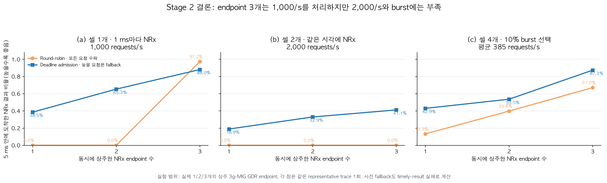

**결론:** endpoint 3개는 periodic `1,000/s`를 처리했지만 `2,000/s`와 synchronized burst에서는
부족했다. Endpoint 추가는 용량을 늘리지만 overload를 제거하지 않으므로 admission이 필요하다.
전체 Stage 2 결과는 412 validated runs이다.

#### 15.2.2 어떤 endpoint로 보낼 것인가, 아예 보내지 않을 것인가

- **Dispatch**는 수락한 요청을 어느 endpoint에 보낼지 정한다. 정상 부하에서는
  round-robin이 가장 단순하고 강했다.
- **Admission**은 어느 endpoint에서도 5 ms 안에 끝낼 수 없는 요청을 보내지 않는 결정이다.
  Overload에서는 queue를 더 쌓지 않고 conventional fallback을 선택한다.

`predicted-finish`는 AI 예측기가 아니다. Scheduler가 completion으로 갱신하는 endpoint별
예약 종료시각에 보수적인 service bound를 더해 5 ms 안에 끝날지를 계산한다. 현재 calibration은
실제 exchange p99 `2.867 ms`보다 큰 `4.211–4.254 ms`를 사용해 정상 부하에서도 불필요한
fallback을 만들었다. 따라서 predictor 자체가 최종 정책은 아니다.

아래는 같은 대표 trace에서 측정한 timely-result rate다.

| 정책 | Single 1,000/s | Sync 2-cell 2,000/s | Selective burst 평균 385/s |
|---|---:|---:|---:|
| static-one | 0.005% | 0.002% | 12.875% |
| static-cell | 0.005% | 0% | 19.922% |
| round-robin | **93.420%** | 0% | **66.100%** |
| shortest-queue | 55.960% | 2.835% | 61.674% |
| predicted-finish | 75.405% | **37.412%** | 45.750% |
| tail-aware | 83.600% | 17.415% | 31.097% |

정상 `1,000/s`와 selective burst에서는 round-robin이 가장 높았다. 반대로 `2,000/s`
overload에서는 round-robin이 모든 요청을 queue에 넣어 `0%`가 된 반면 deadline admission은
일부 요청을 일찍 fallback해 `37.4%`의 timely result를 보존했다.

**설계 결론:** 먼저 deadline feasibility를 검사하고, 통과한 요청만 credit이 남은 endpoint에
round-robin으로 dispatch한다. `predicted-finish`와 `tail-aware`는 이 결론을 얻기 위한
ablation이며 최종 scheduler 이름으로 사용하지 않는다.

#### 15.2.3 전체 workload에서 정책별로 무엇이 달라지는가

Full matrix는 `29 workload 조건 × 3회 × 4정책 = 348회`다. 여기서 87은 요청 수가 아니라
`29조건 × 3회`인 **전체 workload 실행 수**이며, 각 실행에는 수천~수십만 개 요청이 들어 있다.
아래 그림은 승패 횟수 대신 x축에 네 정책을 모두 놓는다. 위 막대는 workload 종류별 중앙값,
아래 heatmap은 29개 조건 각각의 3회 중앙값이다.

| workload 종류 | 한 NRx 고정 | 셀마다 NRx 고정 | 동적 선택 + deadline admission | 동적 선택 + tail guard |
|---|---:|---:|---:|---:|
| 단일 셀 주기 요청 | 0.004% | 0.004% | **60.341%** | 54.990% |
| 다중 셀 동시 도착 | 0.001% | 0% | **11.840%** | 6.846% |
| 다중 셀 엇갈린 도착 | 0.001% | 0% | **10.795%** | 6.090% |
| 선택적 IID 호출 | 0.005% | 3.906% | **36.371%** | 29.822% |
| 선택적 burst 호출 | 0.003% | 1.695% | **21.949%** | 13.888% |

표와 그림의 family 값은 먼저 각 조건의 3회 중앙값을 구한 뒤, 같은 workload 종류 안에서 다시
중앙값을 취했다. 따라서 조건 수가 많은 family가 결과를 과도하게 지배하지 않는다.

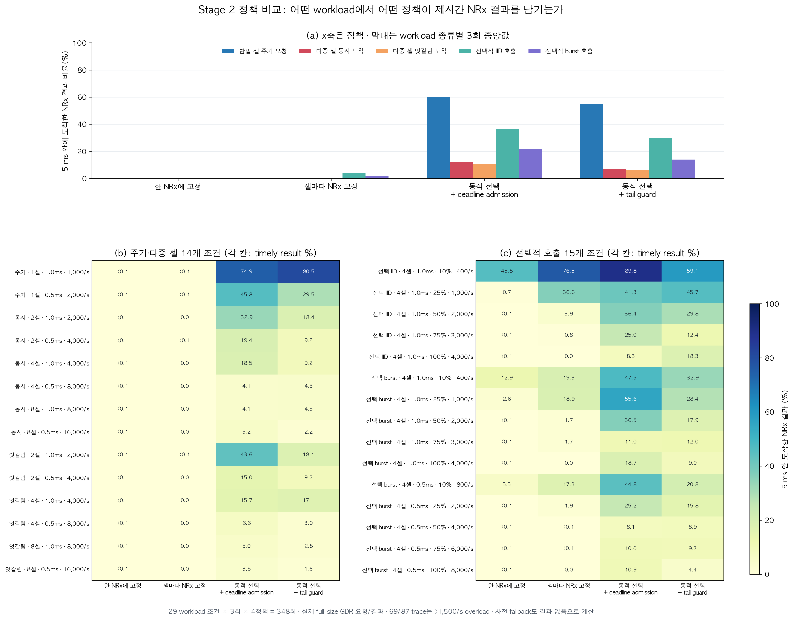

그림은 세 가지를 구분한다.

1. **고정 정책은 상주 NRx 세 개의 용량을 요청에 맞춰 재분배하지 못한다.** 한 NRx 고정은
   나머지 두 개를 놀리고, 셀별 고정은 특정 셀의 queue가 밀려도 다른 endpoint로 옮기지 못한다.
   그 결과 periodic/multi-cell 조건 대부분에서 timely result가 거의 0%다.
2. **요청 단위 동적 선택은 실제로 stranded capacity를 사용한다.** 예를 들어 1-cell 1 ms에서는
   셀별 고정 `<0.1%`가 동적 deadline 정책 `74.9%`로, selective-IID 10%에서는 `76.5%`가
   `89.8%`로 증가했다. 반면 4,000–16,000/s 구간은 endpoint 세 개의 총 capacity 자체를
   넘으므로 동적 선택도 낮다.
3. **tail guard는 현재 calibration에서 추가 이득이 아니다.** 다섯 family 모두 기본 동적
   deadline 정책보다 낮았다. 최종 정책의 필수 mechanism으로 주장하지 않는다.

Paired robustness check에서는 동적 deadline 정책이 셀별 고정보다 `86/87` 실행에서 높았지만,
이 숫자는 메인 결과가 아니다. 유일하게 나빴던 실행은 동적 정책이 8,145개 중 4,625개를 너무
보수적으로 사전 fallback한 calibration 실패였다. 따라서 이 결과는 **request-level routing의
필요성**과 **admission calibration의 분리 필요성**을 함께 보여준다.

또한 `69/87` 실행은 `>1,500 request/s`인 의도적인 overload stress다. timely-result 실패에는
늦은 실행뿐 아니라 사전 fallback도 포함된다. 이 결과는 현재 predictor가 최적이라는 증거가
아니며, 최종 설계는 정상 범위에서 credit 기반 분산을 하고 모든 endpoint가 불가능할 때만
deadline fallback을 적용해야 한다.

- 증명함: 실제 full-size GDR request/result, 세 endpoint 동시 상주, request-level scale-out,
  static binding보다 높은 timely-result를 만드는 동적 routing/admission.
- 증명하지 않음: cuPHY/LDPC/CRC 결과, BLER/CRC gain, production PHY deadline.
- 해석: 이 단계는 “3g MIG 하나가 더 빨라졌다”가 아니라 **세 개의 유한한 endpoint queue를
  하나의 pool로 사용했다**는 capacity 실험이다.

### 15.3 Stage 3 — PHY 적용: 유용하고 안전한 결과인가

| 질문 | 비교 | 성공 기준 |
|---|---|---|
| remote NRx 결과가 실제 복호를 개선하고 안전하게 선택되는가? | conventional-only, all-NRx, utility-selective | correct-TB 증가, 12 ms expiry 위반과 stale commit 0 |

GPU0의 4g MIG에서 actual Aerial/cuPHY L1을 실행하고 GPU1/2/3의 full GPU에 endpoint 0/1/2를
상주시켰다. 이 topology는 **correctness를 분리 검증**하기 위한 것이며 Stage 2의 3g-MIG
capacity 실험과 동일하지 않다. Correctness 12회와 Nsight capture 5회, 총 17회가 검증됐다.

#### 15.3.1 Remote NRx가 실제 복호를 개선하는가

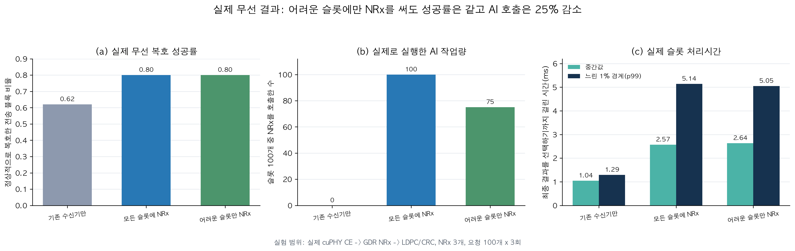

핵심 비교는 3-endpoint 조건의 3-trial median이다.

| mode | NRx requests / 100 | NRx commits | correct TB ratio | decision p50 / p99 | miss / late |
|---|---:|---:|---:|---:|---:|
| conventional | 0 | 0 | 0.620 | 1.045 / 1.292 ms | 0 / 0 |
| all NRx | 100 | 17 | **0.800** | 2.567 / 5.139 ms | 0 / 0 |
| utility admission | 75 | 16 | **0.800** | 2.636 / 5.050 ms | 0 / 0 |

Utility mode는 세 endpoint에 `25/25/25`개 요청을 보냈고, all-NRx와 같은 correct-TB ratio를
유지하면서 NRx 호출을 `25%` 줄였다. all-NRx의 remote exchange p50/p99는
`2.004/2.777 ms`, endpoint service p50은 `1.111 ms`, 그중 transport/control p50은
`0.895 ms`였다. 이 숫자는 NIC wire time만이 아니라 publish, completion, conversion과 control
경로를 포함한다. 여기서 `NRx commits`는 NRx가 완료된 횟수가 아니라, conventional 결과와
비교한 뒤 최종 TB 결정에 remote NRx 결과를 선택한 횟수다.

#### 15.3.2 남은 latency는 어디에서 생기는가

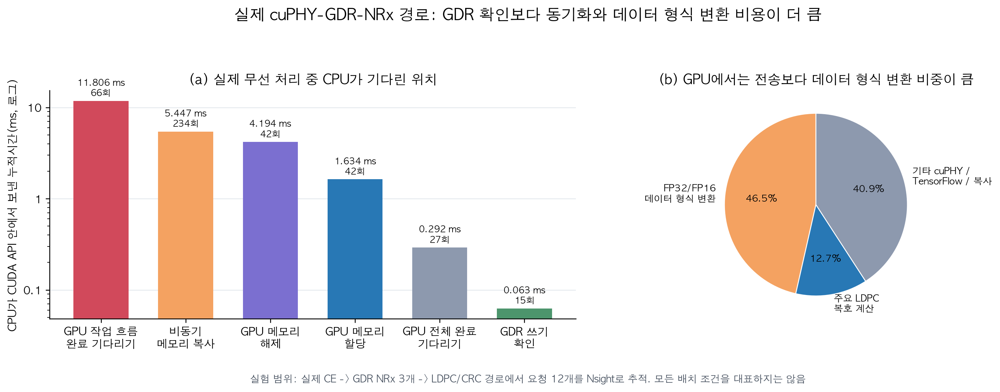

Nsight short capture에서는 `cudaStreamSynchronize`가 총 `11.806 ms`인 반면 GDR write
visibility 확인은 `0.063 ms`였다. GPU kernel 시간의 `46.5%`는 FP32↔FP16 layout conversion에
사용됐다. 즉 Stage 3의 다음 최적화 대상은 NIC wire 자체보다 persistent binding, conversion과
synchronization 범위다.

- 증명함: actual `CE → remote NRx → LDPC/CRC`, radio-utility admission, expiry와 단일 commit.
- 증명하지 않음: 3g MIG endpoint의 자원 효율과 concurrent burst capacity,
  production 1 ms deadline.
- 주의: 이 실험은 `12 ms` experimental expiry를 사용한 synchronous correctness 실험이다.
  Stage 2의 pool capacity와 Stage 3의 radio correctness를 아직 한 run에서 동시에 측정하지
  않았다.

### 15.4 보조 결과 — burst 중 background capacity 회수

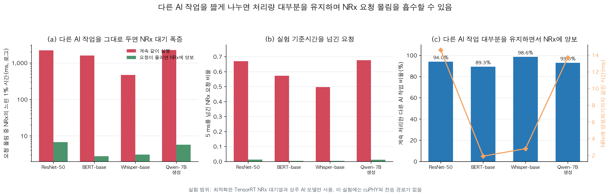

`500 → 1100 → 500 request/s` burst에서 naive sharing과 adaptive reclaim을 비교했다.

| background | naive burst p99 / >5 ms | adaptive p99 / >5 ms | background work retained | reclaim activation |
|---|---:|---:|---:|---:|
| ResNet-50 | 2211.39 ms / 67.00% | 6.72 ms / 1.24% | 94.0% | 14.62 ms |
| BERT-base | 1602.27 ms / 57.27% | 2.77 ms / 0.39% | 89.3% | 1.90 ms |
| Whisper-base | 471.31 ms / 49.64% | 3.07 ms / 0.39% | 98.6% | 2.80 ms |
| Qwen-7B decode | 2270.97 ms / 67.67% | 5.72 ms / 1.12% | 93.0% | 13.71 ms |

결과는 background model을 unload하지 않고도 89–99%의 work를 보존하며 queue collapse를
크게 줄일 수 있음을 보여준다. 동시에 ResNet/Qwen의 13–15 ms reclaim delay는 strict 5 ms
bound에 너무 길다. 따라서 설계에는 **bounded work unit/chunk size**가 반드시 필요하다.

이 실험에는 cuPHY와 GDR transport가 없다. 즉 이것은 “완성된 DART-Rx가 위 숫자를 달성했다”가
아니라 background lease mechanism을 구현할 가치와 필요한 quantum bound를 측정한 결과다.

### 15.5 아직 남은 통합 평가

Stage 1–3은 각각 경로, 용량, PHY correctness를 검증했지만 아직 한 run에서 동시에 실행하지
않았다. 최종 평가는 다음 조건을 하나의 workload에 넣어야 한다.

| 축 | 최종 조건 |
|---|---|
| L1 | protected 4g MIG의 actual cuPHY와 conventional fallback |
| NRx | 여러 3g-MIG 상주 endpoint, GDR request/result |
| 입력 | actual multi-cell periodic·offset·burst와 selective NRx 요청 |
| Background | Qwen, ResNet, BERT, Whisper의 bounded work unit |
| 비교군 | MPS, local MIG, MIG+MPS, static cross-P2P/GDR, DART-Rx |
| 공정성 | 같은 hardware budget과 같은 background work |
| 지표 | L1 p99, timely-result rate, correct-TB, endpoint utilization, background work |

이 통합 평가가 끝나기 전에는 “DART-Rx가 actual-radio burst와 background tenant를 동시에
해결했다”고 주장하지 않는다.

## 16. 평가 결론

- **Stage 1:** cross-P2P/GDR는 same-4g보다 L1을 잘 보호하지만 작은 slice 비용이 있다.
- **Stage 2:** 여러 endpoint는 실제 timely capacity를 늘리지만 overload에는 admission이 필요하다.
- **Stage 3:** remote NRx는 correct-TB를 `0.62→0.80`으로 높였고 utility admission은 같은 결과를
  25% 적은 NRx 요청으로 얻었다.

따라서 세 구성요소의 필요성은 측정했지만, 이들이 동시에 동작한다는 최종 claim은 아직 남아
있다.

---

# Part V. 현재 결론과 남은 일

## 17. 지금 주장할 수 있는 것

1. **문제는 실제로 존재한다.** MIG isolation이 정상이어도 static NRx capacity/placement 때문에
   deadline miss와 idle endpoint가 동시에 발생한다.
2. **P2P/GDR는 해결책 전체가 아니라 data-plane enabler다.** L1 isolation과 remote endpoint
   reachability를 제공하지만 NRx service shortage를 없애지는 않는다.
3. **MPS에는 물리적 L1 보호 경계가 없다.** 독립 NRx process를 `1→8`개로 늘리자 full-A100
   MPS의 L1 p99가 `42.3→189.3 ms`(`4.5×`), 4g 내부 MPS는 `40.7→435.7 ms`(`10.7×`)가 됐다.
   MIG는 sibling isolation을 제공하지만 capacity를 방별로 고정하고, MIG+MPS는 한 MIG 안의
   평균 share만 조절할 뿐 새 isolation boundary나 remote elasticity를 만들지 않는다.
4. **DART-Rx의 핵심은 cross-layer contract다.** utility/deadline admission, bounded endpoint
   credit, ordered GPU transport, expiry-safe single commit, bounded background lease를
   하나의 slot transaction으로 묶는다.
5. **Selective NRx는 실제 radio value가 있다.** 현재 paired trace에서는 all-NRx와 같은
   outcome을 25% 적은 NRx request로 얻었다.
6. **host blocking은 실제이며 단일 API 교체로 사라지지 않았다.** same-MIG 40-cell
   co-location에서 추적 CUDA API host time이 15.1× 증가했고, async free/memory pool은 대기를
   다음 copy/sync 지점으로 옮겼다.

## 18. 아직 주장하면 안 되는 것

- 현재 prototype이 production 1 ms PHY deadline을 만족한다.
- GDR가 P2P보다 빠르거나 single-slot latency를 5–10 μs로 만든다.
- Background reclaim 결과가 이미 full cuPHY/GDR/radio path와 통합됐다.
- 3-endpoint actual-radio correctness run이 open-loop multi-cell capacity를 증명한다.
- Host polling prototype만으로 ISCA급 microarchitecture contribution이 완성됐다.
- 현재 한두 개 Nsight capture가 모든 MPS/MIG/P2P/GDR 조건의 CUDA-call 원인을 증명한다.

## 19. 최종적으로 필요한 통합 실험

현재 evidence는 강하지만 세 실험 층이 분리돼 있다. 마지막 핵심은 하나의 실행에서 다음을
동시에 측정하는 것이다.

```text
actual multi-cell captured slot arrivals
  + protected cuPHY L1
  + conventional baseline
  + 3 resident GDR NRx endpoints
  + utility/deadline admission + endpoint credit
  + epoch/expiry commit
  + Qwen/BERT/Whisper/vision bounded background leases
```

최종 비교군은 `MPS`, `MIG local`, `MIG+MPS`, `static cross-P2P`, `static cross-GDR`,
`DART-Rx without utility`, `DART-Rx without expiry-safe admission`, `full DART-Rx`가 되어야 한다.
측정값은 L1 p99, decision p99, deadline miss, correct-TB/goodput, NRx admitted/committed ratio,
endpoint utilization, background work, CPU polling overhead, GPU/NIC command timeline이다.

통합 실험과 별도로 같은 captured arrival trace를 사용해 각 배치의 Nsight를 짝지어야 한다.

```text
Full MPS / MIG local / proper MIG+MPS / cross P2P / cross GDR
  × L1-only / L1+NRx / L1+NRx+background
  → CUDA API blocking time, kernel overlap, queue depth,
    stream synchronization, copy engine, NIC completion을 같은 경계로 비교
```

이 matrix가 있어야 “어느 조건에서 host가 왜 막혔는가”를 추정이 아니라 조건별 인과관계로
주장할 수 있다.

## 20. ISCA 관점의 현재 판정

**긍정적이지만 미완성**이다. 단순 MIG/MPS/P2P/GDR 비교에 머물렀다면 novelty가 약했을
것이다. 현재는 다음 조합이 architecture contribution 후보가 됐다.

> Static spatial isolation 위에서, value가 조건부이고 결과가 만료되는 dependent neural PHY
> stage를 resident accelerator pool로 실행하며, mandatory conventional recovery와 background
> utility를 하나의 versioned resource/commit contract로 관리한다.

ISCA 수준으로 만들려면 마지막 통합 결과와 함께 host scheduler를 넘는 구체적인 command
queue/credit/commit-table microarchitecture, CPU overhead 제거 효과, area/throughput model이
필요하다. 즉 방향은 맞지만 현재 figure들을 “최종 완성”으로 포장해서는 안 된다.

---

## 21. Figure와 데이터 provenance

Figure 생성 명령:

```bash
cd /Users/changjongkim/New_research/cloudlab_results
python3 tools/analysis/generate_research_walkthrough_figures.py
python3 tools/analysis/generate_research_walkthrough_figures_en.py
```

| figure | 원본 데이터 |
|---|---|
| Five-placement architecture map | 실제 실험 배치 manifest와 setup에 근거한 설계 설명도; 성능 그래프가 아님 |
| GDR experiment evolution | 저자 제공 canonical asset [`00a_gdr_evolution_supplied.png`](assets/00a_gdr_evolution_supplied.png); [`GDR pool MANIFEST.txt`](../../task1_final/gdr_pool_20260814T014651Z/04_full/MANIFEST.txt), [`actual-radio REPORT.md`](../../task1_final/dart_rx_radio_pool/analysis/REPORT.md), 보존된 runner의 GPU mapping에 근거한 topology 설명도 |
| DART-Rx overall architecture | 실제 [`dart_rx_gdr_pool.py`](../../../cloudlab_aerial/task1/dart_rx_gdr_pool.py)의 dispatcher-side `pending`, `predicted_tail`, `service_bound`, completion update와 P2P/GDR payload contract를 그린 설계 설명도; 표 안 queue 상태는 동작 예시이지 측정값이 아님 |
| Three local baselines | [`PLACEMENT_SUMMARY.csv`](../../results/20260813_nrx_placement/PLACEMENT_SUMMARY.csv), [`fixed_mig_sibling_isolation/`](../../results/20260813_drain_free/fixed_mig_sibling_isolation/), [`13_mig_mps_gdr_matrix/`](../../results/isca_v2/day1_20260813T0523Z/13_mig_mps_gdr_matrix/) |
| MPS multi-NRx breakdown | [`results/20260724/chain17/`](../../results/20260724/chain17/), [`kernel_gap_stats.json`](../../results/20260725/kernel_gap_stats.json); 20-cell causal experiment, 3회 중앙값 |
| Why P2P/GDR | [`PLACEMENT_SUMMARY.csv`](../../results/20260813_nrx_placement/PLACEMENT_SUMMARY.csv), [`DEPTH1_TRANSPORT_COMPARISON.csv`](../../results/20260813_nrx_placement/DEPTH1_TRANSPORT_COMPARISON.csv), [`MULTICELL_HARDWARE_MEDIANS.csv`](../../results/isca_v2/mig_causal_20260813T1138Z/07_multicell_workloads/analysis/MULTICELL_HARDWARE_MEDIANS.csv) |
| Fig. 1 MIG isolation/queue cliff | [`results/20260813_drain_free/fixed_mig_sibling_isolation/`](../../results/20260813_drain_free/fixed_mig_sibling_isolation/) |
| NRx wrapper optimization | [`raw/nrx_deep_profile/`](../../results/20260813_nrx_placement/raw/nrx_deep_profile/) |
| Fig. 2 placement fragmentation | [`MULTICELL_HARDWARE_MEDIANS.csv`](../../results/isca_v2/mig_causal_20260813T1138Z/07_multicell_workloads/analysis/MULTICELL_HARDWARE_MEDIANS.csv) |
| Fig. 3 placement/transport | [`PLACEMENT_SUMMARY.csv`](../../results/20260813_nrx_placement/PLACEMENT_SUMMARY.csv) |
| Stage 1 equal-depth transport | [`DEPTH1_TRANSPORT_COMPARISON.csv`](../../results/20260813_nrx_placement/DEPTH1_TRANSPORT_COMPARISON.csv) |
| Five-way absolute-rate sweep | [`05b_fiveway_absolute_rates/`](../../results/isca_v2/mig_causal_20260813T1138Z/05b_fiveway_absolute_rates/) |
| Proper MIG+MPS quota | [`13_mig_mps_gdr_matrix/`](../../results/isca_v2/day1_20260813T0523Z/13_mig_mps_gdr_matrix/) |
| CUDA host blocking | [`cuPHY_mitigation_shims/results/`](../../cuPHY_mitigation_shims/results/) |
| Fig. 4 background reclaim | [`06_background_contention/`](../../results/isca_v2/mig_causal_20260813T1138Z/06_background_contention/) |
| Fig. 5 GDR pool policy | [`gdr_pool analysis/`](../../task1_final/gdr_pool_20260814T014651Z/analysis/) |
| Stage 2 endpoint-count sweep | [`MEDIANS.csv`](../../task1_final/gdr_pool_20260814T014651Z/analysis/MEDIANS.csv), endpoint-count stages의 [`RUNS.csv`](../../task1_final/gdr_pool_20260814T014651Z/analysis/RUNS.csv) |
| Fig. 6 actual radio utility | [`dart_rx_radio_pool analysis/`](../../task1_final/dart_rx_radio_pool/analysis/) |
| Actual radio CUDA calls | [`nsys_l1.sqlite`](../../task1_final/dart_rx_radio_pool/dart_radio_pool_e3_round_robin_all_t34_20260814T093833Z/nsys_l1.sqlite) |

관련 상세 문서:

- [현재 연구 종합본](MIG_NRX_DART_RESEARCH_SYNTHESIS_KO.md)
- [현재 연구 체크포인트](MIG_NRX_RESEARCH_CHECKPOINT_KO.md)
- [데이터 카탈로그](../../data/README.md)
- [새 CloudLab 노드 복구 절차](../setup/CLOUDLAB_EMPTY_NODE_RESTORE_RUNBOOK_KO.md)
