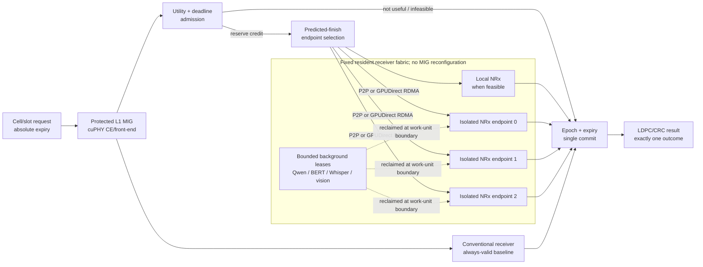
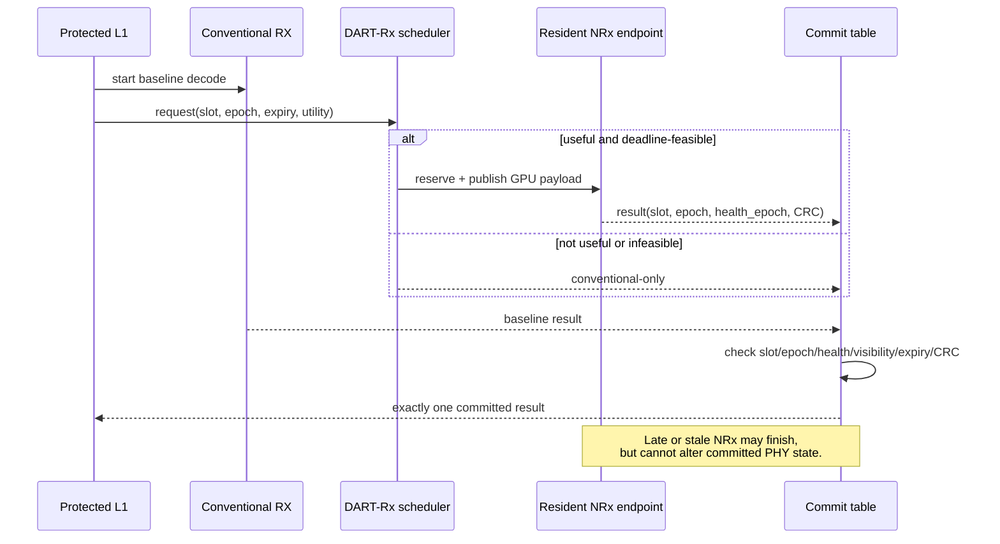
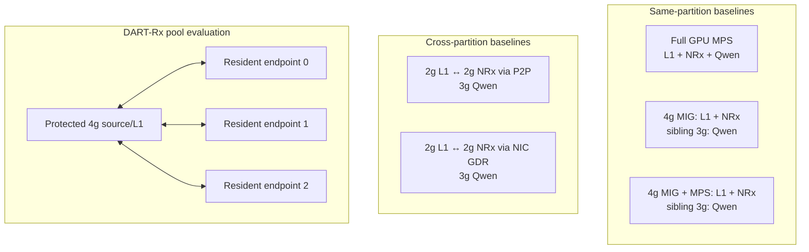
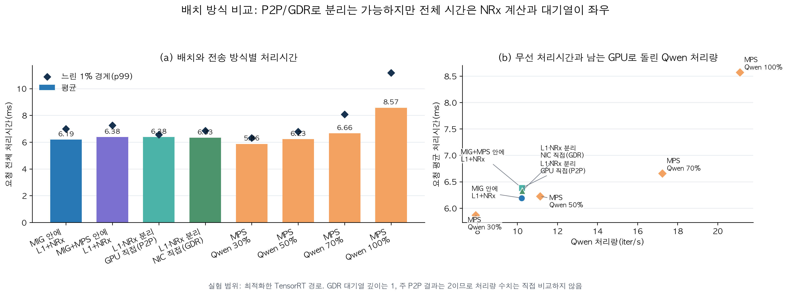
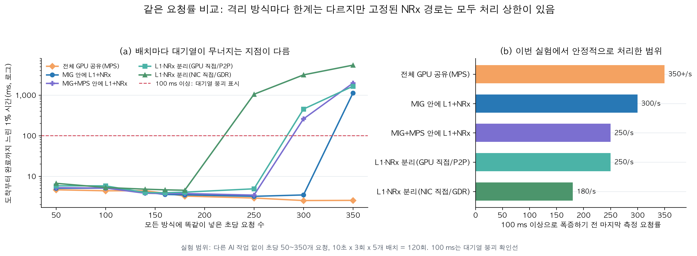
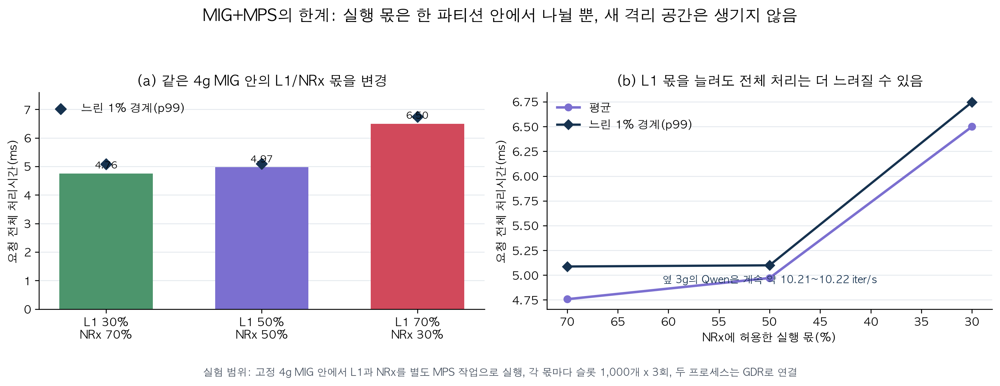

# DART-Rx 연구 전체 설명: 문제 → 설계 → 실험 결과

**기준일:** 2026-08-16
**이 문서의 역할:** 처음 보는 사람이 문제, 설계, 실험 조건, 결과, 아직 남은 한계를 한 번에 이해하기 위한 대표 문서  
**데이터 원칙:** 성능 PNG figure는 보존된 CSV/JSON/SQLite 실험 결과에서 생성했다. 배치
architecture map과 Mermaid 블록은 성능 수치가 아니라 실제 실험 topology를 설명하는 설계도이다.
**영문판:** [RESEARCH_WALKTHROUGH_EN.md](RESEARCH_WALKTHROUGH_EN.md)

---

## 0. 이 연구를 먼저 쉬운 말로 설명하면

> **기지국의 필수 작업인 L1은 자기 GPU 공간에서 보호한다. AI 수신기인 NRx는 필요한
> slot에만 호출하고, 현재 가장 빨리 끝낼 수 있는 상주 NRx worker로 보낸다. AI 결과가
> 늦거나 잘못된 slot의 결과이면 버리고, 기존 수신 결과를 사용한다. 이 모든 과정에서
> MIG 구성을 바꾸거나 L1을 재시작하지 않는다.**

기술적으로 표현하면 DART-Rx는 **고정 MIG 위에 만드는 deadline-aware NRx service pool**이다.
여기서 중요한 것은 단순히 NIC로 tensor를 복사하는 것이 아니다. 어떤 NRx worker를 쓸지,
지금 보내도 제시간에 끝날지, AI 결과가 늦었을 때 무엇을 쓸지, 놀고 있는 GPU에서 실행하던
background AI를 언제 줄일지를 하나의 slot 처리 규칙으로 묶는다.

이 연구는 “MIG가 MPS보다 빠르다” 또는 “GDR가 P2P보다 빠르다”를 주장하는 논문이 아니다.
MIG/MPS/P2P/GDR는 비교해야 하는 **mechanism과 baseline**이고, 실제 연구 문제는 다음
모순이다.

```text
MIG isolation은 필요하다.
        ↓
하지만 static partition/placement는 NRx service capacity를 고정한다.
        ↓
multi-cell·selective burst에서는 한 queue가 무너지는데 다른 endpoint는 놀 수 있다.
        ↓
MIG를 즉시 재구성할 수 없으므로, 고정된 isolated endpoint 사이에서 capacity를 빌려야 한다.
        ↓
remote NRx는 늦을 수 있으므로 admission, routing, fallback, commit을 함께 설계해야 한다.
```

현재 결과는 이 인과관계의 각 부분을 실제 하드웨어에서 확인했다. 다만
`actual-radio + concurrent multi-cell arrivals + multi-endpoint GDR + background reclaim`을
한 번에 실행한 마지막 통합 실험은 아직 남아 있다. 따라서 현재 상태는 **problem과 각
mechanism은 강하게 지지되지만 최종 ISCA claim은 아직 완결되지 않은 상태**다.

### 0.1 이 문서에서 반복해서 쓰는 말

| 용어 | 쉬운 뜻 | 이 연구에서의 정확한 뜻 |
|---|---|---|
| slot / request | 한 번 처리해야 하는 무선 데이터 단위 | 한 cell의 scheduled PUSCH 처리 transaction |
| L1 | 반드시 제시간에 끝나야 하는 기본 수신 작업 | cuPHY channel estimation, LDPC/CRC 등을 포함한 PHY critical path |
| NRx | 어려운 신호에서 도움을 주는 AI 수신기 | conventional receiver 대신 선택적으로 사용할 수 있는 TensorRT neural receiver |
| service capacity | 1초에 처리할 수 있는 양 | queue가 계속 늘지 않는 최대 NRx request rate |
| queue cliff | 조금 더 들어왔는데 대기시간이 폭발하는 지점 | arrival rate가 service rate에 가까워질 때 p99가 비선형적으로 증가하는 현상 |
| host blocking | CPU thread가 CUDA 호출 안에서 기다리는 현상 | 이미 GPU에 제출된 작업의 완료가 `cudaFree`, sync, copy 같은 API에서 드러나는 것 |
| expiry | 결과를 써도 되는 마지막 시각 | 이 시각 뒤의 NRx 결과는 정확해도 현재 slot에는 사용하지 않음 |
| commit | 최종 결과를 하나만 선택하는 것 | conventional 또는 NRx 중 조건을 통과한 결과 하나만 PHY state에 반영 |
| endpoint | 항상 준비된 NRx worker | model, TensorRT context, CUDA Graph, buffer가 미리 올라간 process/GPU instance |

### 0.2 숫자로 미리 보는 현재 결론

- **MIG 격리는 실제로 강했다:** sibling 3g에 Qwen을 실행해도 4g NRx capacity 변화는
  `-0.11%`였다.
- **하지만 고정된 한 endpoint는 넘치면 무너졌다:** MIG local은 300/s에서 p99 `3.47 ms`였지만
  350/s에서 `1124.98 ms`가 됐다.
- **같은 공간의 NRx는 L1 host까지 막을 수 있었다:** 40-cell same-MIG co-location에서 추적한
  CUDA API host time이 `1.68 s → 25.35 s`, `15.1×` 증가했다.
- **MPS는 NRx client 수가 늘면 급격히 무너졌다:** full-A100 MPS에서 독립 NRx process를
  1개에서 8개로 늘리자 20-cell L1 p99가 `42.3 → 189.3 ms`; 4g MIG+MPS에서는
  `40.7 → 435.7 ms`가 됐다.
- **MPS quota만으로는 해결되지 않았다:** 한 4g에서 L1:NRx를 30:70에서 70:30으로 바꾸자
  E2E mean이 `4.76 → 6.50 ms`로 악화됐다.
- **다른 endpoint를 쓰는 비용보다 queue collapse가 훨씬 컸다:** P2P와 NIC GDR의 depth-1
  평균 차이는 `0.438 ms`였고, overload tail은 수백–수천 ms였다.
- **NRx는 실제 radio 가치가 있었다:** utility admission은 all-NRx와 같은 correct-TB `0.80`을
  유지하면서 NRx 요청을 25% 줄였다.

---

# Part I. Background and problem

## 1. 어떤 AI-RAN 실행 환경을 다루는가

하나의 uplink request는 독립적인 AI query가 아니라 PHY dependency chain이다.

```text
(cell, slot, scheduled PUSCH)
  → cuPHY channel estimation / front-end
  → conventional receiver와 선택적 Neural Receiver(NRx)
  → LDPC / CRC
  → absolute decision expiry 전에 하나의 결과 commit
```

동시에 같은 GPU 시스템에는 다음 세 종류의 일이 존재한다.

1. **Protected L1:** deadline과 tail latency를 지켜야 하며 background AI 때문에 흔들리면 안 된다.
2. **NRx:** 특정 channel 구간에서만 conventional receiver보다 이득이 있는 optional PHY stage다.
3. **Background AI:** NRx peak를 위해 항상 비워둘 수 없는 GPU headroom에서 Qwen, BERT,
   Whisper, vision/RAN AI 등을 실행한다.

NRx는 매 slot에 반드시 필요한 단계가 아니다. 채널이 좋은 slot은 기존 수신기로 충분하고,
어려운 채널에서만 NRx가 실제 radio 성공률을 높일 수 있다. 여러 cell의 주기적 slot이
겹치거나 어려운 채널이 연속되면 NRx 요청은 짧은 시간에 몰린다. 따라서 하루 평균 GPU
사용률보다 **몇 ms 동안 queue가 얼마나 쌓이는지**와 **늦은 결과를 안전하게 버릴 수
있는지**가 더 중요하다.

### 1.1 MPS, MIG, MIG+MPS를 같은 기준으로 보면

세 기술은 서로의 상위·하위 버전이 아니다. 서로 다른 문제를 해결한다.

먼저 다섯 배치를 같은 그림 문법으로 보면 차이가 선명해진다. **굵은 검은 선은 MIG가
만드는 하드웨어 격리벽**이고, 점선 client box는 MPS의 실행 몫일 뿐 격리벽이 아니다.
P2P와 GDR는 L1과 NRx 사이에 벽을 만든 뒤 그 벽을 가로질러 tensor를 전달하는 두 data
path다.


그림의 P2P에는 별표가 붙는다. 이번 P2P gate는 **한 process가 두 MIG CUDA context를
소유하고 peer access가 실제로 성공한 topology**를 측정했다. 이를 모든 cross-process MIG
조합에서 항상 가능한 일반 경로로 해석하면 안 된다. 반면 GDR 실험은 L1/NRx를 별도
process와 GPU memory registration으로 분리하고, payload를 CPU DRAM에 올리지 않은 채 NIC
loopback으로 전달했다.

| 방식 | 쉽게 말하면 | 잘하는 것 | 해결하지 못하는 것 |
|---|---|---|---|
| Full GPU + MPS | 한 GPU를 여러 process가 함께 사용 | 남는 SM을 다른 일이 즉시 사용하므로 처리량이 높고 work-conserving | 물리적 경계가 없고, 긴 AI 작업과 GPU queue가 L1 tail을 흔들 수 있음 |
| MIG local | GPU 안에 물리적으로 벽을 만들고, 한 방에 L1+NRx 배치 | sibling MIG의 Qwen 같은 작업으로부터 보호 | 같은 4g 방 안의 L1과 NRx는 여전히 SM·memory·CUDA work queue를 공유 |
| MIG + MPS local | MIG 방 안에서 L1/NRx process 몫을 다시 나눔 | sibling 격리를 유지하며 한 GI 안의 평균 share 조절 | 새로운 하드웨어 격리를 만들지 않으며, quota는 deadline/preemption 보장이 아님 |
| Cross P2P | L1과 NRx를 다른 GPU partition에 두고 GPU 경로로 연결 | L1과 NRx compute queue를 분리하면서 낮은 transport 비용 | MIG 사이 P2P가 허용되는 topology가 제한적이고 remote NRx capacity는 여전히 유한 |
| Cross NIC GDR | 각 GPU memory를 NIC에 등록하고 직접 연결 | CPU DRAM bounce 없이 다른 MIG/process/GPU를 endpoint로 사용 | NIC가 NRx compute를 빠르게 만들지는 않으며 queue/admission 문제는 별도 |

핵심 차이는 세 축이다.

1. **격리:** L1이 다른 AI kernel 때문에 느려지는 것을 하드웨어가 막아 주는가?
2. **남는 자원 활용:** 한쪽 queue가 바쁠 때 다른 쪽의 여유 capacity를 빌릴 수 있는가?
3. **대기 위치:** GPU 작업이 밀렸을 때 queue에서 기다리는가, CPU CUDA 호출 안에서
   기다리는가, 아니면 명시적인 transport completion에서 기다리는가?

MPS는 client 수가 작을 때 local work conservation에 강하지만 1번이 약하고, 독립 client와
kernel launch rate가 증가하면 그 장점도 급격히 사라진다. MIG는 1번에 강하지만 고정
partition 때문에 2번이 약하다. MIG+MPS는 MIG 벽 안에서 share를 조절할 뿐 이 모순을
없애지 않는다. P2P/GDR는
벽을 없애는 기술이 아니라, **벽을 유지한 채 다른 방의 NRx를 호출할 수 있게 하는 data
path**다. DART-Rx가 필요한 이유는 이 data path 위에서 어떤 요청을 어디로 보낼지와 늦은
결과를 어떻게 처리할지를 결정해야 하기 때문이다.

### 1.2 같은 GDR라도 세 실험과 최종 목표를 구분해야 한다

앞의 다섯 배치 그림에서 `MIG+GDR`는 **물리 GPU 한 개 안의 2g L1과 2g NRx를 NIC
loopback으로 연결한 placement baseline**이다. 이후 보고서에서 말하는 `NRx 3개`는 이
baseline을 세 번 복제한 단순 그림이 아니라, 여러 물리 GPU에 상주시킨 세 TensorRT worker를
하나의 request-level pool로 연결한 별도 실험이다.

세 실험은 같은 이름의 GDR를 사용하지만 topology와 검증 대상이 서로 다르다. 그림, 물리 배치,
측정 결과와 claim boundary는 **Part IV §15에서 Stage 1 → Stage 2 → Stage 3 순서로** 함께
정리한다. Stage 4는 완료된 결과처럼 보이지 않도록 남은 최종 통합 gate로 분리한다.

여기서 “MIG를 연장한다”는 말은 물리적으로 `4g+3g`를 하나의 CUDA device로 합친다는 뜻이
아니다. 각 NRx request는 worker 하나에서 끝나고, 여러 cell-slot 요청을 서로 다른 replica가
병렬 처리한다. 따라서 정확한 표현은 **fixed MIG 위에서 NRx service capacity를 request
단위로 scale out한다**이다.

또한 임의의 빈 GPU를 발견하자마자 NRx로 바꾸는 구조도 아니다. Slot fast path에 참여하는
endpoint에는 model, TensorRT context, CUDA Graph와 registered buffer가 미리 올라가 있어야
한다. 남는 4g/full-GPU domain에는 background AI를 실행할 수 있지만, 이를 NRx endpoint로
전환하려면 사전 provisioning이나 fast path 밖의 activation 단계가 필요하다.

### 1.3 출발점: 세 가지 local 배치를 실제로 사용하면 무슨 문제가 생기는가

여기서 `MPS`, `MIG`, `MIG+MPS`라는 이름만 비교하면 배치가 모호해진다. 이 연구에서 실제로
비교한 세 local baseline은 다음과 같다.

| 이름 | 실제 배치 | 이 방식에서 기대한 것 |
|---|---|---|
| Full MPS | full A100 하나에 L1+NRx client와 Qwen client를 함께 배치 | 남는 GPU 자원을 모두 활용하고 workload별 share 조절 |
| MIG local | 4g MIG에 L1+NRx, sibling 3g MIG에 Qwen | Qwen은 격리하면서 L1과 NRx는 가까이 배치 |
| MIG+MPS local | 4g MIG 안에서 L1/NRx를 별도 MPS client로 분할, sibling 3g에 Qwen | sibling 격리와 4g 내부 share 조절을 동시에 사용 |


#### A. Full MPS만 사용하면: 자원은 잘 쓰지만 보호 경계가 없다

MPS는 full GPU를 여러 client가 공유하므로 세 방식 중 raw capacity가 가장 높았다. Background가
없는 absolute-rate sweep에서는 350 request/s까지 p99가 `2.551 ms`로 안정적이었다. 따라서
MPS를 단순히 느린 방식이라고 부르면 틀린다.

문제는 background 몫을 높일 때 같은 GPU의 RAN 경로도 함께 변한다는 것이다.

| Qwen MPS cap | slot E2E mean / p99 | Qwen throughput |
|---:|---:|---:|
| 30% | 5.865 / 6.307 ms | 7.92 it/s |
| 50% | 6.226 / 6.782 ms | 11.14 it/s |
| 70% | 6.656 / 8.066 ms | 17.24 it/s |
| 100% | **8.569 / 11.180 ms** | **21.11 it/s** |

즉 MPS는 높은 총 처리량과 높은 background utility를 주지만, 그 대가가 L1/NRx latency에
직접 나타난다. Active-thread percentage는 평균 자원 몫을 조절할 뿐, 긴 kernel을 일정 시간
안에 preempt하거나 L1의 p99를 보장하지 않는다. 이 연구에서 MPS의 문제는 “성능이 낮다”가
아니라 **실시간 L1 보호와 background 처리량이 하나의 load-dependent Pareto로 묶인다**는
것이다.

여기서 더 중요한 제한이 있다. 위의 350 request/s 결과는 **최적화된 NRx 실행 경로 한
개와 background가 없는 조건**이다. 여러 cell/service가 독립 process로 NRx를 동시에
밀어 넣는 경우의 MPS scaling을 보여주는 결과가 아니다. 이를 별도의 causal campaign에서
측정하자 결론이 크게 달라졌다.


- Full A100 MPS도 NRx process `1→8`에서 L1 p99가 `42.3→189.3 ms`, **4.5×**가 됐다.
- 4g MIG 안의 MPS는 `1→6→8`에서 `40.7→331.4→435.7 ms`, 최종 **10.7×**가 됐다.
- 4g 조건의 L1 inter-kernel gap 중앙값은 `1.15 us(N=1) → 119.7 us(N=6) →
  379.1 us(N=8)`로 변했고, L1 GPU duty cycle은 `31.6%→13.8%`로 줄었다.

따라서 정확한 결론은 “MPS가 좋다”가 아니다. **MPS는 작은 client 수와 여유 load에서는
효율적이지만, 독립 NRx context와 aggregate kernel-launch pressure가 증가하면 물리적
격리가 없기 때문에 scheduler/launch queue/implicit synchronization tail이 L1에 직접
전파된다.** `N=6`은 이 max-rate NRx workload의 실측 knee이지 모든 workload에 공통인
상수는 아니다. 이 과거 campaign은 20-cell L1 경로를 사용했으므로 현재 최적화 chain과
절대 ms를 직접 비교하지 않고, scaling 원인의 인과 증거로 사용한다.

#### B. MIG만 사용하면: 옆방은 막지만 같은 방의 L1과 NRx는 막지 못한다

MIG의 sibling isolation은 매우 강했다. 4g NRx가 단독일 때 `745.1 request/s`, sibling 3g에
Qwen을 함께 실행했을 때 `744.2 request/s`로 capacity 차이는 `-0.11%`였다. 따라서 “MIG가
Qwen 간섭을 막지 못했다”는 해석은 맞지 않는다.

하지만 4g 안에 L1과 NRx를 함께 넣으면 둘은 같은 GPU instance 안에 있다. 이 조건에서 L1
active time은 단독 대비 `1.621×`가 됐고 slot E2E mean은 `6.191 ms`였다. 옆 3g의 Qwen은
격리됐지만, 같은 4g 안의 NRx kernel, memory traffic, CUDA work queue는 L1과 격리되지 않은
것이다.

또한 한 4g endpoint의 NRx 처리량은 고정된다. Absolute-rate 실험에서 300/s의 sojourn p99는
`3.470 ms`였지만 350/s에서는 `1124.981 ms`로 폭증했다. 동시에 다른 MIG가 놀더라도 그
capacity는 이 queue로 자동 이동하지 않는다. 따라서 MIG의 문제는 격리가 약해서가 아니라
**격리와 함께 service capacity도 방별로 고정된다**는 것이다.

#### C. MIG+MPS를 결합하면: 방 안의 몫은 바꾸지만 방의 크기와 벽은 그대로다

MIG+MPS는 의미가 있다. Sibling 3g Qwen을 약 `10.21–10.22 it/s`로 격리하면서 4g 내부의
L1/NRx share를 바꿀 수 있다. Proper two-client quota gate는 두 process를 같은 4g MIG의 MPS
client로 두고, process 사이에는 동일한 full-size GDR payload contract를 사용해 share 효과를
측정했다. 그 결과는 다음과 같다.

| L1:NRx share | E2E mean / p99 |
|---:|---:|
| 30:70 | **4.757 / 5.087 ms** |
| 50:50 | 4.971 / 5.099 ms |
| 70:30 | **6.499 / 6.747 ms** |

긴 stage인 NRx의 몫을 70%에서 30%로 줄이자 L1 몫은 커졌지만 전체 E2E는 `36.6%` 느려졌다.
또한 uncapped two-client absolute-rate 실험은 250/s에서 p99 `3.437 ms`, 300/s에서
`259.106 ms`로 무너졌다. MPS가 한 4g 안의 평균 share는 바꿀 수 있어도 다음 세 가지는
만들지 못한다.

1. L1과 NRx 사이의 새로운 물리적 격리
2. 4g 바깥의 idle capacity를 가져오는 경로
3. kernel completion이나 host CUDA blocking에 대한 hard bound

따라서 세 local 방식의 결론은 “모두 나쁘다”가 아니다.

| 방식 | 얻는 것 | 끝까지 남는 문제 |
|---|---|---|
| Full MPS | 가장 높은 raw capacity와 work conservation | L1 tail이 co-tenant load와 결합 |
| MIG local | 강한 sibling isolation | 같은 GI의 L1–NRx contention과 fixed capacity |
| MIG+MPS local | sibling isolation + 내부 share 조절 | 같은 GI의 contention, fixed capacity, quota tuning trade-off |

어느 것도 **L1과 NRx를 물리적으로 분리하면서, 필요할 때 다른 곳의 NRx capacity를 빌리는
기능**을 동시에 제공하지 않는다. 이것이 P2P와 GDR를 고려한 출발점이다.

### 1.4 그래서 왜 P2P와 GPUDirect RDMA를 고려했는가

첫 질문은 “L1과 NRx를 다른 GPU execution domain으로 분리하면 L1이 실제로 회복되는가?”였다.
두 번째 질문은 “분리된 NRx에 tensor를 보내는 비용이 얻는 이점보다 너무 크지는 않은가?”였다.


#### 설계 동기 A: P2P로 compute queue를 분리해 보았다

`4g L1+NRx` local 배치에서는 L1 slowdown이 `1.621×`, `MIG+MPS local`에서는 `1.702×`였다.
L1과 NRx를 `2g L1 | 2g NRx`로 나누고 실제 `cudaMemcpyPeerAsync` 경로를 사용하자 L1
slowdown은 **`1.043×`**로 줄었다. Forward+backward P2P copy는 ring-depth-2 run에서 평균
`76.84 us`였다.

이 결과는 중요한 인과관계를 보여준다. L1 slowdown의 상당 부분은 sibling Qwen이 아니라
L1과 NRx가 같은 execution domain을 사용한 데서 왔다. 다만 2g NRx는 4g NRx보다 느려서 slot
E2E는 `6.191 → 6.383 ms`로 소폭 증가했다. 따라서 분리는 L1 보호에는 성공했지만, 작은
NRx slice의 compute 손실까지 자동으로 보상하지는 않았다.

#### 설계 동기 B: P2P만으로 부족한 배치를 위해 NIC GDR를 검증했다

P2P는 가장 짧은 native GPU data path이므로 중요한 lower-bound baseline이다. 하지만 모든
MIG/GPU/process 조합에서 peer access가 가능한 것은 아니며, peer-accessible topology 범위에
묶인다. 반면 NIC GDR는 각 process의 GPU memory를 NIC에 등록하여 CPU DRAM을 거치지 않고
다른 isolated endpoint에 request와 result를 전달할 수 있다.

이 CloudLab A100/ConnectX-6 Dx에서는 실제 GPU memory MR과 NIC physical loopback을 사용했다.
비교한 optimized direct-TensorRT payload는 request `1,415,232 bytes`, result `314,496 bytes`였고
CPU DRAM staging은 사용하지 않았다. 같은 depth-1 조건의 결과는 다음과 같다.

| 경로 | slot E2E mean / p99 | Qwen | 의미 |
|---|---:|---:|---|
| Cross P2P | 5.888 / 6.224 ms | 10.22 it/s | peer-accessible topology의 native lower bound |
| Cross NIC GDR | 6.326 / 6.846 ms | 10.24 it/s | process/GPU isolation을 넘는 zero-CPU-bounce path |

이 구현에서 NIC GDR는 P2P보다 평균 `0.438 ms`, 약 7.4% 느렸다. 예상했던 5–10 us
single-slot improvement는 관측되지 않았다. 그럼에도 GDR를 사용하는 이유는 P2P보다 빠르기
때문이 아니라 **P2P로 직접 연결할 수 없는 resident NRx도 하나의 pool에 포함할 수 있기
때문**이다.

#### 설계 동기 C: 연결만 하지 말고 여러 endpoint를 하나의 pool로 사용해야 한다

P2P/GDR 하나를 연결해도 그 remote endpoint가 넘치면 queue collapse는 다시 발생한다.
실제로 1 request/ms trace를 하나의 고정 NRx endpoint에만 보냈을 때 p99는 `3293.25 ms`였고,
그동안 전체 endpoint의 66.7% 이상이 idle인 구간이 있었다. 세 endpoint 중 예상 완료시각이
가장 빠른 곳을 선택하자 p99는 `1.63 ms`, no-timely ratio는 `99.97% → 0.13%`가 됐다.

이 세 실험이 설계로 이어지는 순서는 다음과 같다.

```text
MPS: 높은 처리량, 그러나 L1과 co-tenant가 함께 흔들림
MIG: L1 보호 가능, 그러나 capacity가 고정되고 같은 GI contention은 남음
MIG+MPS: 한 GI 안의 share 조절, 그러나 isolation/elasticity 모순은 그대로
        ↓
P2P: L1–NRx compute queue를 분리할 수 있음을 실증
GDR: P2P 범위 밖의 isolated NRx도 CPU bounce 없이 연결
        ↓
여러 resident NRx를 하나의 pool로 구성
        ↓
deadline/utility를 보고 endpoint를 선택하고, 늦은 결과는 conventional path로 복구
```

DART-Rx는 local, P2P, GDR 중 하나만 고집하지 않는다. 같은 endpoint에서 안전하고 제시간에
끝나면 local을, peer access가 가능하면 P2P를, 다른 process/GPU/isolation domain에는 GDR를
사용한다. 연구의 핵심은 data path 선택 그 자체가 아니라 **이 서로 다른 endpoint를 하나의
deadline-safe receiver service로 만드는 admission, reservation, expiry, commit 규칙**이다.

## 2. 첫 번째 오해: MIG isolation이 실패한 것이 아니다

동일한 A100의 4g MIG에서 resident NRx를 실행하고, sibling 3g MIG에 Qwen-7B를 올려
NRx closed-loop capacity와 open-loop tail을 측정했다.


그림 1은 “MIG가 효과가 없었다”는 해석과 “MIG면 모든 문제가 해결된다”는 해석이 모두
틀렸음을 보여준다.

- **MIG isolation은 정상 동작한다.** 4g NRx capacity는 단독 `745.1 request/s`, sibling
  3g Qwen 동시 실행 `744.2 request/s`로 차이는 `-0.11%`였다.
- **격리는 capacity를 늘리지 않는다.** 700 request/s에서는 p99가 약 1.39 ms였지만,
  750/s에서는 15.58–18.78 ms, 800/s에서는 214.29–217.79 ms로 급증했다.

쉽게 말해 옆방의 Qwen은 NRx 처리속도를 거의 떨어뜨리지 않았다. 하지만 한 명이 처리할 수
있는 창구에 초당 750~800명이 계속 오면, 방음이 잘돼 있어도 줄은 길어진다. 이전에 보인 큰
latency의 한 원인은 MIG 격리 실패가 아니라 **도착률이 고정된 NRx 처리율에 가까워지거나
넘은 queueing collapse**다.

## 3. 두 번째 오해: 같은 partition에 L1+NRx를 넣으면 baseline L1과 같아야 한다

MIG는 **서로 다른 GPU instance 사이**를 격리한다. 같은 4g instance 안에 cuPHY L1과 NRx를
함께 넣으면 둘 사이에는 벽이 없다. 두 stage는 제한된 SM, memory bandwidth, launch
resources와 GPU에 제출된 work queue를 계속 공유한다.
따라서 다음 두 metric을 구분해야 한다.

- **L1 active time:** NRx/background interference로부터 L1 kernel이 얼마나 보호되는가
- **Dependency-carrying slot E2E:** CE → NRx → LDPC/CRC 전체가 얼마나 걸리는가

Cross P2P는 L1 slowdown을 `1.621× → 1.043×`로 복구했지만, 4g를 2g L1 + 2g NRx로
나누면서 NRx compute가 느려져 slot E2E는 `6.191 → 6.383 ms`로 소폭 증가했다. 즉
**격리 효과는 L1 metric에서 분명하지만, 작은 NRx slice의 compute 손실 때문에 전체
slot latency가 자동으로 줄지는 않는다.**

이 결과는 “cross partition이 쓸모없다”가 아니다. 목적을 구분해야 한다.

- 같은 partition은 현재 slot 하나의 평균시간에는 유리할 수 있다. data transport가 없고
  더 큰 compute slice를 쓸 수 있기 때문이다.
- cross partition은 L1의 실행시간을 NRx queue와 분리하고, 다른 곳의 resident NRx를 사용할
  수 있게 한다. 이 이점은 단일 slot보다 여러 cell의 동시 도착과 tail에서 커진다.
- 따라서 공정한 질문은 “누가 단일 요청 하나가 가장 빠른가?”와 “같은 도착률에서 어느
  방식의 queue가 언제 무너지는가?”를 함께 보는 것이다.

### 3.1 과거 105 ms NRx 결과와 현재 1.34 ms 결과가 다른 이유

초기 실험의 약 105 ms NRx는 동일 TensorRT model의 순수 compute 시간이 아니었다. Aerial
public `pycuphy` wrapper가 수행한 generic layout conversion이 포함된 시간이다. Nsight와
caller-owned binding으로 경로를 분해한 뒤 동일 output contract를 직접 실행했다.


- Public wrapper GPU mean: `105.15 ms`
- Caller-owned TensorRT binding: `1.413 ms`
- Direct binding + CUDA Graph: `1.340 ms`, host enqueue `2.50 us`
- Wrapper와 direct output의 `max_abs_difference = 0`

CUDA API profile도 같은 결론을 보였다. Wrapper capture에서는 `cudaEventSynchronize`가
15회에 총 `1.232 s`, `cudaStreamSynchronize`가 9회에 `103.95 ms`였다. Direct path에서는
각각 20회 `32.87 ms`, 10회 `1.89 ms`로 줄었다. Direct capture의 `cudaFree`에는 종료 시점의
393 ms cold cleanup 한 번이 포함되므로 steady inference 병목과 분리해야 한다. 즉 “kernel을
async로 launch했다”만으로 충분하지 않고, caller-owned persistent buffer와 synchronization
위치를 함께 바꿔야 했다.

따라서 초기 106–112 ms chain 결과는 “당시 wrapper를 포함한 실측”으로 보존하지만,
placement와 queue capacity 결론에는 optimized direct-TensorRT 결과를 사용한다. 이 교정 없이
과거 결과와 현재 결과를 한 표에 섞으면 transport와 MIG 효과를 잘못 해석하게 된다.

### 3.2 host blocking은 별도의 실제 병목이다

CUDA kernel launch는 보통 비동기다. CPU는 kernel을 GPU queue에 넣고 다음 일을 계속할 수
있다. 그러나 memory를 해제하거나 buffer를 다시 쓰거나 결과가 필요해지는 지점에서는 앞서
제출한 GPU 작업이 끝났는지 확인해야 한다. 이때 CPU thread가 `cudaFree`,
`cudaStreamSynchronize`, 심지어 다음 `cudaMemcpyAsync` 호출 안에서 오래 머물 수 있다. 이
현상을 이 문서에서는 **host blocking**이라고 부른다.

중요하게, 이는 `GPU → CPU DRAM → GPU` 데이터 복사와 다른 현상이다. CPU DRAM을 통과하지
않아도 같은 scheduling domain에 긴 NRx work가 쌓이면 L1 host thread의 CUDA API가 그 대기를
떠안을 수 있다.

| 배치 | host blocking 관점의 예상 경로 |
|---|---|
| Full MPS | L1, NRx, background가 같은 full-GPU scheduling domain을 사용하므로 AI queue가 L1 sync 지점에 드러날 수 있음 |
| MIG local | sibling 3g는 격리되지만 같은 4g 안의 L1–NRx outstanding work는 분리되지 않음 |
| MIG+MPS local | 두 MPS client와 quota를 사용해도 같은 4g의 물리 자원과 완료 조건을 공유; hard preemption bound 없음 |
| Cross P2P/GDR | L1 host CUDA queue는 remote NRx compute queue와 분리됨; 대신 명시적인 publish/completion/commit 대기가 생김 |

이 가설은 뒤의 Nsight 실험에서 직접 확인한다. 다만 현재 조건별 absolute-rate sweep의 모든
점에 Nsight를 붙인 것은 아니다. 현재 보유한 직접 증거는 `(a)` 같은 MIG 안의 L1+NRx
co-location causal experiment와 `(b)` 실제 cuPHY–GDR–NRx vertical slice다. Full MPS,
MIG local, proper MIG+MPS, P2P, GDR를 같은 trace로 각각 Nsight capture하는 paired matrix는
마지막으로 더 수행해야 할 microarchitectural gate다.

## 4. 실제 problem existence: busy queue와 idle capacity가 동시에 존재한다

3개의 독립 resident TensorRT endpoint에 single-cell, multi-cell, selective burst trace를
입력하고 static-one과 predicted-finish placement를 비교했다.


대표 결과는 다음과 같다.

| workload | static-one: p99 / no-timely | predicted-finish: p99 / no-timely |
|---|---:|---:|
| 1 cell, 1 ms, NRx 100% | 3293.25 ms / 99.97% | 1.63 ms / 0.13% |
| 4 cells, 1 ms, bursty 10% | 51.39 ms / 64.85% | 5.50 ms / 1.61% |
| 4 cells, 0.5 ms, bursty 10% | 3332.84 ms / 99.90% | 5.06 ms / 7.89% |

static-one이 miss를 만드는 동안 전체 endpoint idle fraction이 66.7% 이상인 사례가 존재했다.
낮은 평균 NRx 비율에서도 burst가 한 queue에 몰리면 해당 queue는 deadline을 놓치고 다른
endpoint는 idle일 수 있다. 이 결과가 연구 problem의 직접적인 실측 증거다.

여기서 `no-timely`는 5 ms experimental gate 안에 usable NRx가 없었다는 뜻이며, scheduler가
conventional fallback을 요구한 경우도 포함한다. 이 compute/queue gate에는 actual PHY
fallback 결과가 없으므로 radio deadline miss와 같은 metric으로 읽으면 안 된다.

## 5. 문제를 정확히 정의하면

> **NRx 요청이 갑자기 몰려 현재 MIG의 처리량을 넘었을 때, L1과 MIG 구성을 건드리지 않고
> 다른 GPU 공간의 NRx를 빌려 쓰되, 늦거나 이전 slot의 AI 결과가 최종 무선 결과에 섞이지
> 않게 하는 문제.**

조금 더 형식적으로는, 선택적으로 유용한 NRx request의 burst가 static placement capacity를
초과할 때 protected L1을 중단하거나 MIG topology를 재구성하지 않고 다른 isolated resident
accelerator의 capacity를 사용하면서 late/stale result의 PHY-state commit을 막는 문제다.

어려운 이유는 단순 load balancing이 아니기 때문이다.

| 제약 | 왜 필요한가 |
|---|---|
| Static spatial isolation | L1 p99를 co-tenant로부터 보호해야 한다. |
| Dynamic service demand | NRx request는 cell 수와 channel condition에 따라 burst한다. |
| Dependency transport | 원격 NRx는 L1 tensor를 받고 LLR을 다시 돌려줘야 한다. |
| Absolute expiry | deadline 뒤 도착한 정확한 결과도 해당 slot에는 쓸 수 없다. |
| Conventional baseline | optional NRx가 실패해도 PHY recovery path가 남아 있어야 한다. |
| Background utility | peak만 보고 spare accelerator를 항상 비워둘 수 없다. |

---

# Part II. DART-Rx design

## 6. Overall architecture

DART-Rx는 여러 이름의 독립된 기법 모음이 아니다. **L1 전용 공간은 그대로 두고, 여러 NRx
worker를 하나의 선택 가능한 pool로 보이게 만드는 slot 처리 pipeline**이다.


*그림의 `REQ`/`RES` 포트와 녹색선은 논리적 GDR request/result channel을 요약한
표현이다. 예시는 NRx 1 하나를 선택하며, NRx 2가 실행되거나 CQ가 tensor payload를
전달한다는 뜻이 아니다. 실제 control, payload, completion 경로는 아래 절에서 각각
분리해 설명한다.*

### 6.1 “현재 줄이 짧은 NRx”를 어떻게 아는가

여기서 queue는 GPU hardware queue를 원격으로 들여다본 값이 아니다. **L1 측 dispatcher가
endpoint별로 유지하는 outstanding-request 장부(shadow queue state)**다. `pending=3`은 그
endpoint가 받아들였지만 아직 completion을 돌려주지 않은 요청이 3개라는 뜻이며, 현재 실행
중인 요청도 포함한다. 따라서 매 요청마다 NIC를 통해 상대 GPU에 “몇 개 남았나”를 묻지 않는다.

현재 prototype은 endpoint마다 다음 상태를 가진다.

| Scheduler가 가진 값 | 뜻 | 언제 바뀌는가 |
|---|---|---|
| `pending` | 제출됐지만 완료되지 않은 요청 수 | submit에서 `+1`, result completion에서 `-1` |
| `predicted_tail` | 이미 예약된 요청들이 끝날 것으로 보는 시각 | submit 때 service bound만큼 뒤로 예약, queue가 비면 `now`로 복원 |
| `service_bound` | 요청 하나의 보수적 service/exchange 시간 | 시작 calibration 후 최근 completion 표본으로 갱신 |
| `available` | endpoint가 선택 가능한지 여부 | error 또는 장시간 멈춘 in-flight 요청을 감지하면 false |
| queue credit | endpoint control queue에 요청을 더 넣을 수 있는지 | bounded `put_nowait` 성공/실패로 확인 |

요청 하나가 들어오면 다음 순서로 판단한다.

1. 모든 endpoint의 `started/result/error` event를 먼저 회수해 위 장부를 최신화한다.
2. 각 endpoint에 대해
   `max(now, predicted_tail) + service_bound`로 다음 요청의 완료시각을 예측한다.
3. `shortest_queue`는 `pending`이 가장 작은 곳을 고르고, 동률이면 predicted finish를 본다.
   DART-Rx의 `predicted_finish/tail_aware`는 처음부터 predicted finish가 가장 빠르고 healthy한
   endpoint를 고른다.
4. 그 시각이 slot expiry보다 늦으면 NRx에 보내지 않고 conventional 결과를 사용한다.
5. 받아들이면 local control queue credit을 하나 소비하고 `pending++`와 tail 예약을 함께 한다.
   실제 GDR result completion이 돌아오면 `pending--`하고 service bound를 보정한다.

즉 “짧은 줄”은 추측이나 중앙 GPU scan이 아니라, **한 dispatcher가 자신이 보낸 요청과 실제
completion을 대조해 계속 보정하는 예약 장부**다. data payload는 GPU registered memory 사이를
P2P/GDR로 이동하지만, 이 작은 counter와 event는 현재 구현에서 host control plane에 있다.
따라서 현재 결과를 “CPU가 전혀 관여하지 않는다”고 표현하면 부정확하다. 정확한 주장은
**큰 tensor는 CPU DRAM staging을 하지 않고, CPU는 scheduling과 completion bookkeeping만
담당한다**는 것이다. 최종 architecture에서 이 장부를 NIC/DPU doorbell이나 accelerator
runtime으로 내리는 것은 control-plane overhead를 줄이는 후속 설계점이지, endpoint 상태를
식별하기 위한 필수 조건은 아니다.

구현 근거는 [`EndpointProcessProxy`](../../../cloudlab_aerial/task1/dart_rx_gdr_pool.py)의
`poll_completions`, `snapshot`, `submit`, `choose_endpoint`에 보존돼 있다.

한 요청의 흐름은 간단하다.

1. L1이 입력을 준비하는 동안 기존 수신기도 항상 실행 가능한 후보로 남긴다.
2. NRx가 도움이 될 channel인지, 지금 보내면 deadline 전에 끝나는지를 확인한다.
3. 가능하면 가장 빨리 끝날 resident NRx endpoint의 buffer와 queue credit을 예약한다.
4. local/P2P/GDR 중 해당 endpoint에 맞는 경로로 tensor를 보내고 결과를 받는다.
5. slot 번호, deadline, endpoint 상태, CRC를 모두 통과한 결과 하나만 사용한다.
6. NRx가 늦거나 실패하면 기존 수신 결과를 사용한다.



MIG는 설계에서 사라진 것이 아니다. `protected L1`과 `isolated resident NRx endpoint`라는
서로 간섭하지 않는 방을 만드는 물리적 기반이다. DART-Rx는 그 벽을 허무는 대신, 고정된
방들 사이에서 일을 안전하게 빌려 쓰는 규칙을 추가한다.

## 7. 설계 블록 1: utility와 deadline을 함께 보는 admission

모든 slot에 NRx를 보내지 않는다. request는 다음 정보를 가진다.

```text
(cell_id, slot_id, epoch, channel_features, release_time, absolute_expiry)
```

Admission은 두 질문에 모두 `yes`일 때만 NRx credit을 예약한다.

1. **Radio utility:** 이 channel condition에서 NRx가 conventional보다 성공 확률을 높일
   가능성이 있는가?
2. **Timing feasibility:** healthy endpoint의 conservative predicted finish가
   `expiry - commit_guard` 이전인가?

유용하지 않거나 제시간에 끝날 가능성이 없는 request는 remote queue를 오염시키지 않고
conventional path를 사용한다. 현재 prototype의 utility gate는 measured SNR bin이며, 최종
시스템에서는 gNB가 이미 가진 CQI, DMRS quality, decoder/HARQ history로 바꾸는 것이 맞다.

## 8. 설계 블록 2: fixed resident receiver fabric

Fast path에서 MIG geometry를 바꾸지 않는다. NRx model, TensorRT context, CUDA Graph,
registered buffers는 endpoint마다 resident로 유지한다.

Endpoint 선택은 단순히 번갈아 보내거나 현재 queue 길이만 보지 않는다. queue가 비는 시각,
해당 worker의 느린 쪽 service time, 전송과 commit에 필요한 여유시간을 합쳐 완료시각을
추정한다.

```text
predicted_finish[e]
  = max(now, endpoint_available[e])
  + conservative_service_tail[e]
  + transport_and_commit_guard[e]
```

feasible endpoint 중 가장 빠른 곳의 tensor/ring credit을 원자적으로 예약한다. 여기서
credit은 “이 worker가 동시에 받을 수 있는 제한된 요청 자리”다. 같은 GPU에서
허용되는 경로에는 direct/local 또는 P2P를, isolation boundary나 다른 GPU에는 registered
GPUDirect RDMA를 사용한다. GDR의 목적은 NRx compute를 빠르게 만드는 것이 아니라 CPU
bounce 없이 **다른 isolated endpoint를 하나의 service pool에 포함**시키는 것이다.

GPUDirect request/result publish 순서는 같은 RC QP에서 다음처럼 고정한다.

```text
request:   GPU payload WRITE → descriptor WRITE → doorbell WRITE
response:  GPU result WRITE  → completion WRITE → doorbell WRITE
```

NIC completion은 곧바로 PHY commit을 뜻하지 않는다.

## 9. 설계 블록 3: baseline-preserving, expiry-safe commit

NRx는 conventional 결과를 대체할 수 있는 **expiring alternative result**다. Conventional
receiver는 항상 실행 가능한 baseline으로 남는다.



NRx 결과가 commit되려면 `slot/epoch`, endpoint health epoch, payload visibility, completion
status, expiry, LDPC/CRC, transaction-open 조건이 모두 참이어야 한다. 이 규칙 때문에 remote
pool을 공격적으로 사용해도 late result가 다음 slot의 buffer나 architectural state를
오염시키지 않는다.

## 10. 설계 블록 4: bounded background lease

Spare NRx endpoint를 항상 비워두면 비용 효율이 낮다. 반대로 background kernel을 무제한으로
실행하면 burst 시 NRx가 즉시 capacity를 회수하지 못한다. DART-Rx는 model을 unload하지 않고
**cooperative work-unit boundary**에서 새 background submission을 중단한다.

```text
low NRx load  : resident background model에 bounded lease 발급
burst detected: 새 work unit 발급 중지
boundary drain: spare endpoint를 NRx pool에 activate
load recovers : NRx credit 축소 후 background lease 재개
```

이것은 arbitrary CUDA kernel preemption을 주장하는 것이 아니다. reclaim delay의 상한은
background work-unit quantum에 의해 결정되므로, prefill chunk, decode step, batch 크기 등을
제어 가능한 단위로 만들어야 한다.

## 11. 측정된 pain point와 mechanism의 대응

| 측정된 문제 | DART-Rx mechanism |
|---|---|
| MIG는 격리하지만 endpoint capacity는 고정 | fixed topology 위의 multi-endpoint service pool |
| static queue collapse + 다른 endpoint idle | predicted-finish placement와 atomic credit |
| NRx utility가 channel별로 다름 | radio-utility admission |
| same-GI NRx work가 L1 CUDA API를 막음 | L1/NRx compute queue 분리 + persistent registered buffer |
| wrapper conversion/sync가 neural compute를 가림 | caller-owned TensorRT binding + CUDA Graph |
| remote result가 deadline 뒤 도착 가능 | absolute expiry와 commit guard |
| stale result가 재사용된 buffer에 도착 가능 | slot epoch + endpoint health epoch |
| remote NRx failure/overload | always-valid conventional baseline |
| spare를 비우면 GPU utility 손실 | bounded, cooperatively reclaimable background lease |

---

# Part III. Experimental setup

## 12. 하드웨어와 소프트웨어

| 항목 | 실험 환경 |
|---|---|
| CloudLab | Wisconsin d8545 bare-metal, project AIRANSLICING |
| GPU | NVIDIA A100-SXM4-40GB ×4 |
| MIG | 실험별 4g.20gb + 3g.20gb 또는 3g/2g 조합; 나머지 A100은 full GPU endpoint |
| NIC | Mellanox ConnectX-6 Dx 200 Gb/s; physical internal loopback, Ethernet 100 Gb/s active |
| Host OS | Ubuntu 22.04.2 |
| NVIDIA stack | Driver 580.173.02, CUDA 13.0, `nvidia_peermem` |
| RDMA stack | MOFED 24.10-3.2.5.0, rdma-core/Pyverbs 57, RoCE v2 GID index 3 |
| AI-RAN | NVIDIA Aerial 25.3.2, real cuPHY CE and LDPC/CRC |
| NRx | NVIDIA pretrained `neural_rx.onnx`, TensorRT FP16, caller-owned binding/CUDA Graph |
| Background | Qwen2.5-7B decode; ResNet-50, BERT-base, Whisper-base execution workloads |

NIC GDR 컨테이너에는 RDMA device뿐 아니라 RoCE backing netdev가 보여야 하므로
`--network=host --device=/dev/infiniband --cap-add=IPC_LOCK`를 사용했다. GPU MR에는
Pyverbs `MR.read/write`를 사용하지 않고 CuPy allocation address를 직접 등록했다.

## 13. 평가 topology



MPS, MIG, MIG+MPS, P2P, GDR는 모두 논문에 들어가야 한다. 다만 각 baseline이 답하는 질문은
다르다.

| 비교 | 답하는 질문 |
|---|---|
| Full MPS cap sweep | isolation을 포기했을 때 RAN latency와 background throughput Pareto는? |
| MIG local | sibling 격리는 되지만 같은 GI 안의 L1–NRx contention은 얼마나 남는가? |
| MIG+MPS local | 같은 GI의 client/quota 분리가 물리 isolation이나 새로운 service capacity를 만드는가? |
| Cross P2P | native inter-partition path로 L1 active time을 얼마나 복구하는가? |
| Cross NIC GDR | CPU bounce 없이 다른 isolated process/GPU를 service endpoint로 쓸 수 있는가? |
| DART-Rx pool | static placement보다 deadline-feasible capacity를 실제로 잘 이용하는가? |

## 14. Workload와 실험 조건

| Gate | 입력/조건 | 반복 | metric | 증명 범위 |
|---|---|---:|---|---|
| MIG isolation/cliff | 4g NRx, 500/700/750/800 request/s, sibling 3g Qwen on/off | 조건당 1 hardware run | capacity, p99, backlog | isolation과 queue cliff |
| Placement/transport | optimized CE–direct TRT–LDPC chain, Qwen co-tenant | 대부분 3 trials; GDR 2 | L1 active, E2E, transport, Qwen it/s | MPS/MIG/P2P/GDR trade-off |
| Five-way absolute-rate | 같은 50/100/140/160/180/250/300/350 request/s trace를 MPS/MIG/MIG+MPS/P2P/GDR에 입력 | 8 rates × 3 trials × 5 = 120 runs | sojourn p99, throughput | 방식별 queue cliff |
| Proper MIG+MPS quota | 한 4g MIG의 별도 L1/NRx MPS client, L1:NRx 30:70/50:50/70:30, sibling 3g Qwen | split당 1,000 slots × 3 trials | mean/p99, Qwen it/s | quota의 실제 의미와 한계 |
| CUDA host blocking | same-MIG cuPHY L1+NRx, 4/10/40/60 cells, no-shim/async-free/mempool | 16 conditions, 각 30 s Nsight | API별 host time | synchronization wait의 원인/이동 |
| Multi-cell problem gate | 1/2/4/8 cells, 0.5/1 ms, sync/stagger, selective iid/bursty 10–100% | 29 traces × 3 trials × 5 policies = 435 rows | p99, no-timely, fallback, idle | fragmentation 존재 |
| Background reclaim | 500/s 2.01 s → 1100/s 3 s → 500/s 3 s | 4 workloads × 2 policies, 조건당 1 run | burst p99, 5 ms ratio, work retained | online reclaim opportunity |
| Full GDR pool | full-size GPU request/result, 3 process-isolated endpoints, 5 ms gate | 29 points × 3 trials × 4 policies = 348 full-matrix runs; 412 total | no-timely, reject, late/expired, timely p99 | transport/compute/queue scheduler |
| Actual radio | cuPHY CE → GDR NRx → LDPC/CRC, MCS 7 Rayleigh, 100 requests/run | 3-endpoint modes 3 trials; 17 runs total | correct TB, NRx requests/commits, decision latency | radio utility와 transaction correctness |

### 14.1 두 종류의 MIG+MPS 결과를 구분해야 한다

`PLACEMENT_SUMMARY.csv`의 `MIG+MPS same`은 기존 combined-client 경로에 MPS environment를
추가한 **negative control**이다. 이것만으로 “L1과 NRx를 서로 다른 MPS client로 나눴다”고
말하면 안 된다. 별도의 quota gate에서는 실제로 L1 process와 NRx process를 두 MPS client로
나누고 `30:70`, `50:50`, `70:30` active-thread share를 적용했다. 뒤의 Figure 3c는 이 proper
two-client 실험만 사용한다.

### 14.2 Deadline 표기를 섞으면 안 된다

- `5 ms`는 multi-endpoint scheduler와 background gate를 비교하기 위한 **experimental
  timeliness threshold**다.
- `12 ms`는 actual-radio correctness vertical slice의 **experimental expiry**다.
- 이 결과만으로 production 1 ms PHY deadline을 만족한다고 주장하지 않는다.

### 14.3 Background workload realism의 경계

- Qwen은 실제 Qwen2.5-7B resident decode다.
- ResNet-50, BERT-base, Whisper-base는 실제 architecture/kernel mix를 사용하지만 synthetic
  random weights/input이다. 따라서 이 gate는 model quality가 아니라 GPU interference와
  cooperative reclaim timing을 평가한다.
- Multi-cell selective trace도 actual radio ground truth가 아니라 workload sensitivity input이다.
  Radio utility 주장은 별도의 paired Aerial/Sionna actual-radio gate만 사용한다.

---

# Part IV. Evaluation

## 15. Stage-by-stage GDR 실험 빌드업

아래 그림의 Stage 1, 2, 3은 아이디어 스케치가 아니라 **서로 다른 질문을 실제 하드웨어에서
검증한 세 실험**이다. 중요한 점은 세 결과를 한 topology에서 동시에 얻었다고 합치지 않는
것이다. Stage 1은 data path, Stage 2는 concurrent service capacity와 routing, Stage 3은
actual-radio correctness를 차례로 검증한다. Stage 4만 아직 이 세 축을 하나의 동시 workload로
결합하지 못한 최종 목표다.


| 단계 | 실제 물리 배치 | 핵심 질문 | 상태 |
|---|---|---|---|
| 1. Cross-MIG GDR baseline | GPU0: `2g L1 · 2g NRx · 3g Qwen` | MIG 벽을 유지한 GPU-memory transport가 실제로 동작하고 비용이 감당 가능한가? | 완료 |
| 2. Fixed-MIG 3-replica GDR pool | GPU0 4g source MR, GPU0/1/2의 3g에 NRx 0/1/2 | 여러 resident NRx의 capacity를 요청 단위로 합치면 static binding보다 나은가? | 완료 |
| 3. Actual-radio correctness gate | GPU0 4g actual L1, GPU1/2/3 full GPU에 NRx 0/1/2 | remote NRx 결과를 CE→LDPC/CRC 경로에 만료·중복 없이 안전하게 commit할 수 있는가? | 완료 |
| 4. Final integrated gate | protected L1 4g + resident NRx 3g pool + background AI | 위 세 기능이 actual multi-cell burst에서 동시에 성립하는가? | **미완료** |

### 15.1 Stage 1 — single-GPU cross-MIG GDR baseline

**목적.** 첫 단계는 scheduler 성능이 아니라 data-path feasibility를 분리한다. 한 A100의 2g
MIG에는 L1, 다른 2g MIG에는 NRx, 남은 3g에는 Qwen을 두었다. MIG 사이 CUDA P2P/IPC가
허용되는 특수 경로와 ConnectX-6 Dx NIC loopback GDR를 같은 queue depth 1에서 비교했다.
GDR 경로는 `1,415,232 B` request와 `314,496 B` result를 GPU MR 사이에서 옮기며 CPU DRAM
payload staging을 사용하지 않았다.

Stage 1도 하나의 숫자가 아니라 세 개의 내부 gate로 구성된다.

| 내부 gate | 반복 | 통제한 변수 | 사용 목적 |
|---|---:|---|---|
| Direct-GDR correctness | 2 repeats | optimized TensorRT contract와 실제 GPU MR request/result | CPU payload staging 없이 양방향 결과가 일치하는지 확인 |
| Equal-depth transport | P2P 3회, GDR 2회 | P2P와 GDR 모두 queue depth 1 | transport 방식의 E2E 비용을 공정하게 비교 |
| Ring-depth-2 isolation | P2P 3회 | L1 alone vs cross-P2P, 동일 2g L1 | NRx를 다른 compute queue로 분리했을 때 L1 active slowdown 측정 |


| Cross-MIG transport | E2E mean | E2E p99 | slot throughput | Qwen | transport mean |
|---|---:|---:|---:|---:|---:|
| GPU P2P | **5.888 ms** | 6.224 ms | 169.804 slot/s | 10.22 it/s | 76.547 µs |
| NIC GDR loopback | 6.326 ms | 6.846 ms | 158.095 slot/s | 10.24 it/s | E2E 차이에 포함 |

GDR의 평균 E2E 비용은 P2P보다 `0.438 ms`, 약 `7.4%` 컸다. 그러나 pipeline은 여전히 6 ms
수준이고 이후 overload queue tail은 수백–수천 ms까지 증가한다. 따라서 이 단계의 결론은
“NIC가 P2P보다 빠르다”가 아니다. **CPU bounce 없이 격리된 endpoint를 연결할 수 있고,
transport보다 NRx service time과 queue가 더 큰 다음 병목**이라는 것이다.

- 증명함: 한 물리 GPU의 서로 다른 MIG/process 사이 full-size GPU-memory GDR 경로와 비용.
- 증명하지 않음: 여러 NRx의 capacity 합산, queue-aware routing, actual-radio correctness.
- 주의: main ring-depth-2 P2P run에서는 L1 active slowdown `1.043×`를 측정했지만, 해당 GDR
  run에는 대응 L1-active 값이 없다. GDR도 동일 slowdown이라고 추정하지 않는다.

### 15.2 Stage 2 — fixed-MIG NRx 3-replica GDR pool

**목적.** Stage 1이 endpoint 하나의 연결 가능성만 보였으므로, 두 번째 단계는 고정 MIG를
재구성하지 않고 **세 resident NRx worker의 service capacity를 request-level로 합칠 수
있는지** 검증한다. GPU0의 4g는 L1-side source GPU MR 역할만 수행하고 actual radio를 실행하지
않았다. GPU0/1/2의 3g MIG에 NRx 0/1/2를 각각 상주시켰으며 GPU1/2의 4g와 GPU3은 사용하지
않았다. 각 worker는 독립 process, CUDA context, GPU MR, RC QP, resident TensorRT/CUDA Graph를
가졌다.

Stage 2의 `412`개 validated run은 다음 네 층으로 구성된다.

| 내부 campaign | runs | endpoint / 정책 | 질문 |
|---|---:|---|---|
| 2A. Smoke | 1 | 3 endpoint · tail-aware | 세 process/QP/GPU MR이 연결되고 결과가 돌아오는가? |
| 2B. Replica sweep | 27 | 1/2/3 endpoint × 3 trace × 3 정책 | replica 수를 늘리면 workload별 timely capacity가 어떻게 변하는가? |
| 2C. Representative policy | 36 | 3 endpoint × 6 trace × 6 정책 | 단순·queue·deadline 정책의 failure mode가 어떻게 다른가? |
| 2D. Full matrix | 348 | 87 trace × 4 핵심 정책 | 반복 trace 전체에서도 개선이 유지되는가? |

여기서 `requests/s`는 **CE 뒤에 L1-side source가 NRx pool로 보낼 cell-slot 추론 요청의
도착률**이다. 이 Stage는 그 요청 timing과 full-size tensor를 replay하지만 cuPHY CE 자체는
실행하지 않는다.

#### Stage 2에서 비교한 정책은 정확히 무엇인가

| 정책 | endpoint 선택 | queue/deadline 상태 사용 | 요청을 미리 거절하는가? | 포함 campaign |
|---|---|---|---|---|
| `static-one` | 모든 cell을 endpoint 0에 고정 | 없음 | 아니오 | representative, full |
| `static-cell` | `cell_id mod N`으로 cell별 endpoint 고정 | 없음 | 아니오 | representative, full |
| `round-robin` | 도착 순서대로 0→1→2 반복 | 없음 | 아니오 | replica, representative |
| `shortest-queue` | pending request가 가장 적은 endpoint | queue 길이, 동률이면 predicted finish | 아니오 | representative |
| `predicted-finish` | `max(now, reserved tail)+service bound`가 가장 작은 endpoint | calibration 기반 service bound와 예약된 queue tail | deadline 뒤 완료 예상이면 conventional path로 reject | replica, representative, full |
| `tail-aware` | predicted-finish 중 guard가 열린 endpoint | 최근 512개 p99.5 × 1.10 adaptive bound, outlier circuit guard | deadline infeasible 또는 모든 endpoint guarded면 reject | 모든 campaign |

`static-*`, round-robin과 shortest-queue는 deadline feasibility를 확인하지 않고 일단 remote
queue에 넣는다. `predicted-finish`는 초기 calibration p95에 `1.10×` margin을 둔 service bound로
완료시각을 예약한다. `tail-aware`는 여기에 최근 tail을 반영하고, 진행 중 요청이 bound의
`1.25×`를 넘으면 해당 endpoint를 일시적으로 후보에서 제외한다. 따라서 no-timely가 낮다는
것과 많은 요청을 remote로 실행한다는 것은 같은 뜻이 아니다.


Replica sweep은 “replica가 많을수록 항상 모든 정책이 좋아진다”는 단순 결론을 부정한다.
Single-cell 1,000/s에서 predicted-finish no-timely는 `61.5% → 34.7% → 12.0%`, round-robin은
`100.0% → 100.0% → 2.8%`로 개선됐다. 반면 synchronized 2-cell 2,000/s는 3개를 사용해도
predicted-finish가 `58.9%`로, offered load가 pool capacity에 비해 여전히 높았다. Selective
burst에서는 round-robin이 3개에서 `33.0%`로 가장 좋고 predicted-finish는 보수적 reject 때문에
`64.5%`였다. 이 27-run sweep은 한 representative trace씩의 causal 결과이며 full-matrix
통계를 대신하지 않는다.

6개 정책을 같은 representative trace에 적용한 결과도 한 정책이 모든 workload에서
우세하지 않음을 보여준다. 아래 값은 `5 ms` 안에 사용할 NRx 결과가 없었던 비율이며 낮을수록
좋다.

| 정책 | Single 1,000/s | Sync 2-cell 2,000/s | Selective burst 평균 385/s |
|---|---:|---:|---:|
| static-one | 99.995% | 99.998% | 87.125% |
| static-cell | 99.995% | 100.000% | 80.078% |
| round-robin | **6.580%** | 100.000% | **33.900%** |
| shortest-queue | 44.040% | 97.165% | 38.326% |
| predicted-finish | 24.595% | **62.588%** | 54.250% |
| tail-aware | 16.400% | 82.585% | 68.903% |

Round-robin은 load가 pool capacity 안에 있을 때 work conservation이 좋지만 overload를 미리
차단하지 않는다. Predicted-finish는 overload에서 futile work를 막지만 usable request도
거절한다. 이것이 최종 DART-Rx 정책이 queue time만 보지 않고 radio utility와 fallback risk
budget까지 함께 봐야 하는 이유다.

Full matrix는 `29 workload points × 3 trials × 4 policies = 348 runs`였다.

| 정책 | 전체 no-timely ratio | static-one 대비 paired 개선 | static-cell 대비 paired 개선 |
|---|---:|---:|---:|
| static-one | 1.0000 | — | — |
| static-cell | 1.0000 | — | — |
| predicted-finish | **0.8133** | 87/87 trace, median `18.65%p` | 86/87 trace, median `16.50%p` |
| tail-aware | 0.8432 | 87/87 trace, median `14.69%p` | 83/87 trace, median `9.70%p` |


낮은 부하(`≤1000 request/s`)에서도 no-timely ratio는 static-one `0.9451`, static-cell
`0.8100`, predicted-finish `0.4439`, tail-aware `0.6708`이었다. 이 campaign에서는 이름과
달리 **predicted-finish가 tail-aware보다 우수**했으므로 tail-aware를 최종 정책이라고
주장하지 않는다. Timely completion만 계산한 p99는 대략 `4.15–4.95 ms`였고, no-timely에는
늦은 실행뿐 아니라 conventional path로 보낸 사전 reject가 포함된다.

- 증명함: 실제 full-size GDR request/result, 세 endpoint 동시 상주, request-level scale-out,
  static binding보다 나은 finish-aware routing.
- 증명하지 않음: cuPHY/LDPC/CRC 결과, BLER/CRC gain, production PHY deadline.
- 해석: 이 단계는 “3g MIG 하나가 더 빨라졌다”가 아니라 **세 개의 유한한 service queue를
  하나의 pool로 사용했다**는 capacity 실험이다.

### 15.3 Stage 3 — actual-radio 3-endpoint correctness gate

**목적.** Stage 2에는 radio ground truth가 없었다. 세 번째 단계는 actual Aerial/cuPHY L1의
CE 결과를 remote NRx에 보내고, 돌아온 LLR을 LDPC/CRC까지 처리하여 utility admission,
epoch, expiry와 single-commit가 올바른지 검증한다. 이 gate의 topology는 Stage 2와 다르다.
GPU0의 4g MIG에서 actual L1을 실행했고, GPU1/2/3의 **full GPU**에 NRx 0/1/2를 두었다.

Stage 3도 endpoint 수 확인, radio mode 비교, Nsight 원인 분석을 분리했다. Endpoint 1/2
결과는 각 1회 기능 gate이고, endpoint 3의 세 mode만 각 3회 반복했으므로 endpoint 수에 따른
성능 scaling curve로 사용하면 안 된다.

| 내부 campaign | runs | request 수 / expiry | 역할 |
|---|---:|---|---|
| 3A. Correctness matrix | 12 | 각 100개 / 12 ms | endpoint 1·2 기능 확인과 3-endpoint all/conventional/utility 반복 비교 |
| 3B. Nsight short capture | 5 | 각 12개 / 50 ms | CUDA API, kernel, copy/synchronization 원인 분해; correctness 표에서는 제외 |

따라서 총 validated run은 `12+5=17`이다. 아래 표는 3A만 사용한다.

| endpoint | mode | runs | correct TB | decision p50 / p99 | remote exchange p50 / p99 |
|---:|---|---:|---:|---:|---:|
| 1 | all NRx | 1 | 0.800 | 2.264 / 4.795 ms | 2.087 / 2.290 ms |
| 2 | all NRx | 1 | 0.800 | 2.745 / 5.375 ms | 2.293 / 2.493 ms |
| 2 | utility | 1 | 0.800 | 2.634 / 5.094 ms | 2.091 / 2.407 ms |
| 3 | all NRx | 3 | 0.800 | 2.567 / 5.139 ms | 2.004 / 2.777 ms |
| 3 | conventional | 3 | 0.620 | 1.045 / 1.292 ms | — |
| 3 | utility | 3 | 0.800 | 2.636 / 5.050 ms | 2.013 / 2.967 ms |


전체 `17`개 validated run 중 핵심 3-endpoint 비교의 3-trial median은 다음과 같다.

| mode | NRx requests / 100 | NRx commits | correct TB ratio | decision p50 / p99 | miss / late |
|---|---:|---:|---:|---:|---:|
| conventional | 0 | 0 | 0.620 | 1.045 / 1.292 ms | 0 / 0 |
| all NRx | 100 | 17 | **0.800** | 2.567 / 5.139 ms | 0 / 0 |
| utility admission | 75 | 16 | **0.800** | 2.636 / 5.050 ms | 0 / 0 |

Utility mode는 세 endpoint에 `25/25/25`개 요청을 보냈고, all-NRx와 같은 correct-TB ratio를
유지하면서 NRx 호출을 `25%` 줄였다. all-NRx의 remote exchange p50/p99는
`2.004/2.777 ms`, worker service p50은 `1.111 ms`, 그중 transport/control p50은
`0.895 ms`였다. 이 숫자는 NIC wire time만이 아니라 publish, completion, conversion과 control
경로를 포함한다. 여기서 `NRx commits`는 NRx가 완료된 횟수가 아니라, conventional 결과와
비교한 뒤 최종 TB 결정에 remote NRx 결과를 선택한 횟수다.

| 3-endpoint mode | CE+pack→dispatch p50 | remote exchange p50 / p99 | worker service p50 | transport/control p50 | conventional 뒤 남은 wait p50 / p99 |
|---|---:|---:|---:|---:|---:|
| all NRx | 1.331 ms | 2.004 / 2.777 ms | 1.111 ms | 0.895 ms | 0.861 / 1.365 ms |
| utility | 1.372 ms | 2.013 / 2.967 ms | 1.111 ms | 0.902 ms | 0.838 / 1.574 ms |


Nsight short capture에서는 `cudaStreamSynchronize`가 총 `11.806 ms`인 반면 GDR write
visibility 확인은 `0.063 ms`였다. GPU kernel 시간의 `46.5%`는 FP32↔FP16 layout conversion에
사용됐다. 즉 Stage 3의 다음 최적화 대상은 NIC wire 자체보다 persistent binding, conversion과
synchronization 범위다. 상세 호출 수는 §19.1에서 다시 해석한다.

- 증명함: actual `CE → remote NRx → LDPC/CRC`, radio-utility admission, expiry와 단일 commit.
- 증명하지 않음: 3g MIG replica의 자원 효율, 3 replica의 concurrent burst capacity,
  production 1 ms deadline.
- 주의: 이 gate는 `12 ms` experimental expiry를 사용한 synchronous correctness gate다.
  Stage 2의 pool capacity와 Stage 3의 radio correctness를 아직 한 run에서 동시에 측정하지
  않았다.

### 15.4 Stage 4 — 아직 남은 final integrated gate

최종 실험은 Stage 1–3의 좋은 부분을 단순히 표에서 합치는 것이 아니라 실제로 동시에 실행해야
한다. Protected 4g MIG에는 actual L1과 conventional fallback을 고정하고, 여러 3g MIG에는
resident NRx replica를 둔다. 남는 4g/full-GPU domain에서는 Qwen, ResNet, BERT, Whisper 같은
background AI를 실행한다. Multi-cell periodic/offset burst와 selective NRx 요청을 넣고,
DART-Rx가 utility, deadline, queue 상태를 함께 사용해 endpoint 선택·admission·fallback commit을
수행해야 한다.

최종 비교는 최소한 `static-one`, `static-cell`, round-robin, predicted-finish와 DART-Rx를 같은
trace에서 비교하고, L1 p99, deadline miss/no-timely, correct TB, endpoint utilization,
background work retained를 함께 보고해야 한다. **Stage 4가 완료되기 전에는 “MIG NRx pool이
actual-radio burst와 background tenant를 동시에 해결했다”는 최종 ISCA claim을 하지 않는다.**

이후 §16–20은 위 실험을 실행 순서가 아니라 placement, background, routing, radio라는 연구
질문별로 다시 분석한다.

## 16. Q1 — MIG/MPS/P2P/GDR 비교에서 무엇을 배웠는가



### 16.1 같은 partition과 cross partition

| 구성 | slot E2E mean | L1 slowdown | Qwen | 해석 |
|---|---:|---:|---:|---|
| MIG local | 6.191 ms | 1.621× | 10.22 it/s | sibling Qwen 격리, L1–NRx 내부 contention은 유지 |
| MIG+MPS local | 6.383 ms | 1.702× | 10.22 it/s | 같은 GI의 MPS client가 자동 isolation을 만들지 않음 |
| Cross P2P | 6.383 ms | **1.043×** | 10.23 it/s | L1 isolation 복구, 2g NRx compute 손실로 E2E 이득 상쇄 |
| Cross NIC GDR | 6.326 ms | 해당 run 미측정 | 10.24 it/s | zero-CPU-copy endpoint 가능; depth 1이라 처리량 직접 비교 금지 |

동일 depth-1 비교에서 P2P는 5.888 ms, GDR는 6.326 ms였다. NIC loopback은 평균
0.438 ms 느렸지만 전체 pipeline은 6 ms대이고 overload tail은 수백–수천 ms다. 따라서
**transport는 무시할 수 없지만 현재 지배 병목은 NRx compute와 queue stability**다.

### 16.2 Full MPS도 단순히 나쁜 baseline은 아니다

Qwen cap 30%에서 E2E 5.865 ms로 가장 낮았지만 Qwen은 7.92 it/s였다. cap 100%에서는
Qwen 21.11 it/s를 얻는 대신 E2E가 8.569 ms로 증가했다. MPS는 work-conserving하고 빠를 수
있지만 load-dependent tail을 만든다. Cross placement의 목적은 최저 평균 하나가 아니라
**예측 가능한 L1 isolation과 capacity pool 구성**이다.

### 16.3 같은 요청률을 넣으면 각 방식은 어디서 무너지는가

위의 depth 실험은 요청 하나의 경로를 본다. 실제 multi-cell에서는 처리시간뿐 아니라 초당
몇 개를 지속해서 받을 수 있는지가 중요하다. 그래서 완전히 같은 50–350 request/s trace를
다섯 방식에 넣어 120회 실행했다. 이 gate에는 background co-tenant를 넣지 않아 각
placement 자체의 service limit를 먼저 분리했다. Background와의 trade-off는 앞의 Qwen cap
sweep과 뒤의 reclaim 실험에서 별도로 측정했다.



| 방식 | p99가 100 ms를 넘기 전 마지막 측정점 | 그 지점 p99 | 다음 측정점 |
|---|---:|---:|---:|
| Full MPS | 적어도 350/s | 2.551 ms | sweep 범위 안에서 collapse 없음 |
| MIG local | 300/s | 3.470 ms | 350/s → **1124.981 ms** |
| MIG+MPS (two clients, uncapped) | 250/s | 3.437 ms | 300/s → **259.106 ms** |
| Cross P2P | 250/s | 4.911 ms | 300/s → **451.798 ms** |
| Cross NIC GDR | 180/s | 4.527 ms | 250/s → **1048.696 ms** |

`100 ms`는 production deadline이 아니라 queue collapse를 눈에 띄게 구분하기 위한 진단선이다.
여기서 Full MPS는 full A100을 사용하고 local/cross 방식은 MIG slice를 사용하므로, 이 표는
동일한 SM 수의 순수 성능 비교가 아니다. **실제 배치 package가 제공하는 capacity와 isolation
trade-off**다.

이 결과가 보여주는 문제의식은 다음과 같다.

- Full MPS는 raw capacity가 가장 높았다. 따라서 연구가 “MIG가 언제나 MPS보다 빠르다”고
  주장하면 틀린다. MPS의 문제는 최대 처리량이 아니라 background load에 따른 L1 tail과
  예측 가능성이다.
- MIG local은 sibling background를 훌륭히 막지만, 4g 안의 NRx capacity 이상을 다른 idle
  partition에서 자동으로 가져오지 못한다.
- MIG+MPS는 한 4g를 더 잘 나누는 도구일 뿐, 4g의 총 capacity를 늘리거나 벽 밖의 idle
  capacity를 가져오지 않는다.
- P2P/GDR의 단일 remote endpoint도 당연히 유한하다. DART-Rx의 주장은 remote path 하나가
  무한히 빠르다는 것이 아니라, **여러 resident endpoint를 묶어 static-one의 queue cliff를
  피한다**는 것이다.

### 16.4 Proper MIG+MPS에서 quota를 바꾸면 무엇이 달라지는가



한 4g MIG 안에 L1과 NRx를 실제 별도 MPS client로 두고 active-thread share를 바꿨다.
sibling 3g에서는 Qwen이 계속 약 10.21–10.22 it/s로 실행됐다.

| L1 share | NRx share | E2E mean | E2E p99 |
|---:|---:|---:|---:|
| 30% | 70% | **4.757 ms** | 5.087 ms |
| 50% | 50% | 4.971 ms | 5.099 ms |
| 70% | 30% | **6.499 ms** | 6.747 ms |

NRx가 더 긴 stage이므로 L1 몫을 70%로 늘리고 NRx를 30%로 줄이면 전체 chain은 오히려
36.6% 느려졌다. MPS percentage는 평균 active-thread 자원 배분을 조절하는 knob이지,
kernel deadline이나 preemption 시간을 보장하는 벽이 아니다. 이 결과는 MIG+MPS가
쓸모없다는 뜻이 아니라, **고정된 한 방 안에서 L1/NRx의 Pareto point를 고르는 방식**이라는
뜻이다. burst 때 다른 방의 여유 capacity를 가져오는 문제는 그대로 남는다.

### 16.5 CUDA-call 수준에서 co-location은 왜 host까지 느리게 만드는가


same-MIG co-location에서 cuPHY가 실제 호출한 여섯 주요 CUDA runtime API의 누적 host 시간을
30초 Nsight window로 측정했다. 40-cell 조건에서 다음이 관측됐다.

| 조건 | 추적한 host CUDA API 총시간 | 대기가 주로 보인 API |
|---|---:|---|
| L1 alone | 1.681 s | `cudaFree` 1.361 s |
| L1 + NRx | **25.348 s** | `cudaFree` 18.076 s, `cudaMemcpyAsync` 7.034 s |
| `cudaFreeAsync` shim | 25.570 s | `cudaMemcpyAsync` **25.221 s** |
| stream-ordered memory pool | 25.649 s | `cudaMemcpyAsync` **25.539 s** |

Co-location은 추적한 host 시간을 `15.1×` 늘렸다. 그러나 `cudaFree`를 async API로 바꾸자
총 대기가 사라지지 않고 다음 copy/synchronization 지점으로 이동했다. 즉 병목은 함수 이름
`cudaFree` 하나가 아니라 **같은 scheduling domain에 쌓인 outstanding GPU work와 그 작업을
반드시 확인해야 하는 의존성 경계**다.

이것이 cross-partition 설계가 평균 transport 0.4 ms만으로 평가되면 안 되는 이유다. 별도
P2P/GDR endpoint는 L1의 CUDA queue와 NRx compute queue를 분리한다. 대신 request publish와
completion을 명시적으로 관리해야 하며, DART-Rx의 credit/expiry/commit 규칙이 바로 그 새
경계를 안전하게 다룬다. 다만 이 Chain-8 Nsight 수치는 five-way sweep 각 점의 per-slot
latency가 아니며 exact direct-TensorRT five-way configuration도 아니므로 두 숫자를 더해서는
안 된다.

현재 조건별 증거 범위를 정리하면 다음과 같다.

| 방식 | latency/rate sweep | CUDA-call 직접 증거 | 현재 판단 |
|---|---|---|---|
| Full MPS | cap sweep + absolute-rate 완료 | 동일 trace Nsight는 없음 | throughput은 강함; background 시 tail 원인 분해 필요 |
| MIG local | placement + absolute-rate 완료 | same-MIG co-location causal profile 보유 | sibling 격리는 강함; 내부 L1–NRx wait 존재 |
| MIG+MPS | two-client quota + absolute-rate 완료 | 동일 trace Nsight는 없음 | quota trade-off는 실측; wait 위치는 추가 capture 필요 |
| Cross P2P | placement + absolute-rate 완료 | 동일 trace Nsight는 없음 | L1 active isolation 복구; copy/sync 분해 필요 |
| Cross NIC GDR | placement + absolute-rate + radio 완료 | actual-radio GDR vertical-slice Nsight 보유 | GDR flush보다 local sync/conversion이 큼 |

따라서 “각 방식의 결과가 어떻게 달라지는가”는 이미 측정됐고, “각 방식에서 정확히 어느
CUDA call이 원인인가”는 MIG co-location과 GDR vertical slice만 직접 증명된 상태다. 나머지
세 조건의 paired Nsight는 결과를 보강하기 위한 필수 후속 실험이다.

## 17. Q2 — background capacity를 실제로 회수할 수 있는가


`500 → 1100 → 500 request/s` burst에서 naive sharing과 adaptive reclaim을 비교했다.

| background | naive burst p99 / >5 ms | adaptive p99 / >5 ms | background work retained | reclaim activation |
|---|---:|---:|---:|---:|
| ResNet-50 | 2211.39 ms / 67.00% | 6.72 ms / 1.24% | 94.0% | 14.62 ms |
| BERT-base | 1602.27 ms / 57.27% | 2.77 ms / 0.39% | 89.3% | 1.90 ms |
| Whisper-base | 471.31 ms / 49.64% | 3.07 ms / 0.39% | 98.6% | 2.80 ms |
| Qwen-7B decode | 2270.97 ms / 67.67% | 5.72 ms / 1.12% | 93.0% | 13.71 ms |

결과는 background model을 unload하지 않고도 89–99%의 work를 보존하며 queue collapse를
크게 줄일 수 있음을 보여준다. 동시에 ResNet/Qwen의 13–15 ms reclaim delay는 strict 5 ms
bound에 너무 길다. 따라서 설계에는 **bounded work unit/chunk size**가 반드시 필요하다.

이 gate에는 cuPHY와 GDR transport가 없다. 즉 이것은 “완성된 DART-Rx가 위 숫자를 달성했다”가
아니라 background lease mechanism을 구현할 가치와 필요한 quantum bound를 측정한 결과다.

## 18. Q3 — actual full-size GDR pool에서 routing policy가 동작하는가

Stage 2의 replica sweep과 full-matrix 정책 그래프는 §15.2에 실행 순서대로 배치했다. 여기서는
그 결과가 routing claim에 주는 의미만 다시 해석한다.

29 workload points × 3 trials × 4 policies의 348-run full matrix에서 predicted-finish는
static-one보다 87/87, static-cell보다 86/87 paired trace에서 no-timely ratio를 낮췄다.
median 개선은 각각 18.65, 16.50 percentage point였다.

그러나 이 결과를 과대해석하면 안 된다.

- 전체 trace median에서 predicted-finish no-timely는 여전히 81.33%였다.
- 그중 81.31%는 늦게 보낸 작업이 아니라 conventional path로 **미리 reject**한 요청이다.
- 따라서 이 정책은 futile remote work를 거의 제거했지만 usable NRx opportunity도 많이
  버리는 보수적인 admission이다.
- 이 gate에는 cuPHY/conventional/radio ground truth가 없다. `no-timely`는 PHY miss가 아니다.

즉 GDR fabric과 finish-aware reservation의 필요성은 확인됐지만, 최종 정책은 fixed guard가
아니라 radio utility와 fallback risk budget을 함께 최적화해야 한다.

## 19. Q4 — 실제 radio 결과까지 연결하면 가치가 있는가

Actual-radio 결과 그래프와 endpoint별 표는 §15.3에 배치했다. 여기서는 radio utility 관점의
핵심 비교를 요약한다.

3개의 actual GDR endpoint와 real cuPHY CE/LDPC/CRC path를 사용한 3-trial median 결과다.

| mode | NRx requests / 100 | correct TB ratio | decision p50 / p99 |
|---|---:|---:|---:|
| conventional | 0 | 0.62 | 1.045 / 1.292 ms |
| all NRx | 100 | 0.80 | 2.567 / 5.139 ms |
| utility admission | 75 | 0.80 | 2.636 / 5.050 ms |

Utility mode는 all-NRx와 같은 `0.80` correct-TB ratio를 유지하면서 NRx 요청을 25% 줄였다.
세 replay trace에서 utility mode의 요청은 endpoint마다 25개씩 분배됐고 deadline miss와
late completion은 0이었다.

이것이 “NRx를 많이 실행할수록 좋다”가 아닌 이유다. Radio gain이 집중된 channel 구간에
capacity를 써야 같은 delivered outcome을 더 적은 neural work로 얻는다. 다만 이 실험은
12 ms expiry의 synchronous correctness gate이므로, 3 replicas가 concurrent 1 ms arrival을
처리한다는 증거는 별도의 open-loop pool 결과에서 가져와야 한다.

### 19.1 실제 radio path의 CUDA call과 kernel은 어디에 시간을 쓰는가

Stage 3의 Nsight 그림은 §15.3에 실제 실행 순서와 함께 배치했다. 여기서는 그 수치를
최적화 우선순위 관점에서 풀어 쓴다.

12-request Nsight capture에서 L1 process의 주요 CUDA API와 GPU kernel 시간을 분해했다.

- `cudaStreamSynchronize`: 66회, 총 **11.806 ms**, CUDA API 시간 중 가장 큰 항목
- `cudaMemcpyAsync`: 234회, 총 **5.447 ms**
- `cudaFree`: 42회, 총 **4.194 ms**
- `cudaMalloc`: 42회, 총 **1.634 ms**
- `cudaDeviceSynchronize`: 27회, 총 `0.292 ms`
- `cudaDeviceFlushGPUDirectRDMAWrites`: 15회, 총 **0.063 ms**

GPU kernel 시간에서는 FP32↔FP16 layout conversion이 `46.5%`, main LDPC split kernel이
`12.7%`였다. 이 capture에서 NIC GDR flush 자체보다 local synchronization, allocation/free,
copy, datatype/layout conversion이 훨씬 컸다.

따라서 다음 최적화 우선순위는 분명하다.

1. caller-owned persistent input/output buffer로 반복 allocation/free를 줄인다.
2. FP32↔FP16 conversion을 NRx binding layout과 통합하거나 producer 단계에서 한 번만 한다.
3. 필요한 dependency 지점만 남기고 stream synchronization 범위를 좁힌다.
4. 그 뒤에 GDR doorbell/flush와 polling overhead를 최적화한다.

이 순서는 GDR가 중요하지 않다는 뜻이 아니다. GDR는 isolated endpoint를 연결하는 데
필요하다. 다만 현재 구현에서 single-request latency를 지배하는 비용은 NIC wire time보다
local software/CUDA path라는 뜻이다. 또한 이 한 capture를 모든 MIG/MPS 조건의 CUDA-call
분포로 일반화하지 않으며, 동일 trace의 paired Nsight matrix가 후속 실험으로 남아 있다.

## 20. 전체 evidence chain

| 순서 | 실험이 확인한 사실 | 설계로 이어지는 이유 |
|---:|---|---|
| 1 | MIG sibling isolation은 capacity를 보호한다. | protected L1은 fixed MIG로 유지한다. |
| 2 | 고정 endpoint는 capacity 근처에서 queue cliff가 난다. | average latency가 아니라 tail/queue를 관리한다. |
| 3 | busy queue와 idle endpoint가 동시에 존재한다. | static binding 대신 resident pool과 routing이 필요하다. |
| 4 | P2P/GDR 비용보다 NRx compute/queue가 더 크다. | transport speed 자체가 아니라 service capacity를 최적화한다. |
| 5 | same-GI co-location은 host CUDA wait를 최대 15.1× 늘리고 async API는 대기 위치만 옮겼다. | physical queue separation과 explicit dependency/commit가 필요하다. |
| 6 | actual radio path에서 GDR flush보다 sync/copy/conversion이 컸다. | persistent binding과 CUDA-call path 최적화가 우선이다. |
| 7 | background work를 bounded하게 줄이면 spare를 회수할 수 있다. | endpoint headroom에 reclaimable lease를 둔다. |
| 8 | utility admission은 같은 radio outcome에서 NRx work를 25% 줄였다. | timing뿐 아니라 radio value를 admission에 포함한다. |
| 9 | actual GDR pool에서 finish-aware policy가 static보다 우세하다. | endpoint reservation과 expiry-aware rejection이 필요하다. |

---

# Part V. 현재 결론과 남은 일

## 21. 지금 주장할 수 있는 것

1. **문제는 실제로 존재한다.** MIG isolation이 정상이어도 static NRx capacity/placement 때문에
   deadline miss와 idle endpoint가 동시에 발생한다.
2. **P2P/GDR는 해결책 전체가 아니라 data-plane enabler다.** L1 isolation과 remote endpoint
   reachability를 제공하지만 NRx service shortage를 없애지는 않는다.
3. **MPS, MIG, MIG+MPS는 서로 다른 trade-off다.** Full MPS는 이번 absolute-rate sweep에서
   가장 높은 raw capacity를 보였지만 load-dependent L1 tail의 위험이 있다. MIG는 sibling
   isolation을 제공하지만 capacity를 방별로 고정한다. MIG+MPS는 한 MIG 안의 평균 share를
   조절하지만 새 isolation boundary나 remote elasticity를 만들지 않는다.
4. **DART-Rx의 핵심은 cross-layer contract다.** utility/deadline admission, finish-aware
   endpoint credit, ordered GPU transport, expiry-safe single commit, bounded background lease를
   하나의 slot transaction으로 묶는다.
5. **Selective NRx는 실제 radio value가 있다.** 현재 paired trace에서는 all-NRx와 같은
   outcome을 25% 적은 NRx request로 얻었다.
6. **host blocking은 실제이며 단일 API 교체로 사라지지 않았다.** same-MIG 40-cell
   co-location에서 추적 CUDA API host time이 15.1× 증가했고, async free/memory pool은 대기를
   다음 copy/sync 지점으로 옮겼다.

## 22. 아직 주장하면 안 되는 것

- 현재 prototype이 production 1 ms PHY deadline을 만족한다.
- GDR가 P2P보다 빠르거나 single-slot latency를 5–10 μs로 만든다.
- Background reclaim 결과가 이미 full cuPHY/GDR/radio path와 통합됐다.
- 3-endpoint actual-radio correctness run이 open-loop multi-cell capacity를 증명한다.
- Host polling prototype만으로 ISCA급 microarchitecture contribution이 완성됐다.
- 현재 한두 개 Nsight capture가 모든 MPS/MIG/P2P/GDR 조건의 CUDA-call 원인을 증명한다.

## 23. 최종적으로 필요한 통합 실험

현재 evidence는 강하지만 세 실험 층이 분리돼 있다. 마지막 핵심은 하나의 실행에서 다음을
동시에 측정하는 것이다.

```text
actual multi-cell captured slot arrivals
  + protected cuPHY L1
  + conventional baseline
  + 3 resident GDR NRx endpoints
  + utility/deadline predicted-finish admission
  + epoch/expiry commit
  + Qwen/BERT/Whisper/vision bounded background leases
```

최종 비교군은 `MPS`, `MIG local`, `MIG+MPS`, `static cross-P2P`, `static cross-GDR`,
`DART-Rx without utility`, `DART-Rx without expiry-safe admission`, `full DART-Rx`가 되어야 한다.
측정값은 L1 p99, decision p99, deadline miss, correct-TB/goodput, NRx admitted/committed ratio,
endpoint utilization, background work, CPU polling overhead, GPU/NIC command timeline이다.

통합 실험과 별도로 같은 captured arrival trace를 사용해 각 배치의 Nsight를 짝지어야 한다.

```text
Full MPS / MIG local / proper MIG+MPS / cross P2P / cross GDR
  × L1-only / L1+NRx / L1+NRx+background
  → CUDA API blocking time, kernel overlap, queue depth,
    stream synchronization, copy engine, NIC completion을 같은 경계로 비교
```

이 matrix가 있어야 “어느 조건에서 host가 왜 막혔는가”를 추정이 아니라 조건별 인과관계로
주장할 수 있다.

## 24. ISCA 관점의 현재 판정

**긍정적이지만 미완성**이다. 단순 MIG/MPS/P2P/GDR 비교에 머물렀다면 novelty가 약했을
것이다. 현재는 다음 조합이 architecture contribution 후보가 됐다.

> Static spatial isolation 위에서, value가 조건부이고 결과가 만료되는 dependent neural PHY
> stage를 resident accelerator pool로 실행하며, mandatory conventional recovery와 background
> utility를 하나의 versioned resource/commit contract로 관리한다.

ISCA 수준으로 만들려면 마지막 통합 결과와 함께 host scheduler를 넘는 구체적인 command
queue/credit/commit-table microarchitecture, CPU overhead 제거 효과, area/throughput model이
필요하다. 즉 방향은 맞지만 현재 figure들을 “최종 완성”으로 포장해서는 안 된다.

---

## 25. Figure와 데이터 provenance

Figure 생성 명령:

```bash
cd /Users/changjongkim/New_research/cloudlab_results
python3 tools/analysis/generate_research_walkthrough_figures.py
python3 tools/analysis/generate_research_walkthrough_figures_en.py
```

| figure | 원본 데이터 |
|---|---|
| Five-placement architecture map | 실제 실험 배치 manifest와 setup에 근거한 설계 설명도; 성능 그래프가 아님 |
| GDR experiment evolution | 저자 제공 canonical asset [`00a_gdr_evolution_supplied.png`](assets/00a_gdr_evolution_supplied.png); [`GDR pool MANIFEST.txt`](../../task1_final/gdr_pool_20260814T014651Z/04_full/MANIFEST.txt), [`actual-radio REPORT.md`](../../task1_final/dart_rx_radio_pool/analysis/REPORT.md), 보존된 runner의 GPU mapping에 근거한 topology 설명도 |
| DART-Rx overall architecture | 실제 [`dart_rx_gdr_pool.py`](../../../cloudlab_aerial/task1/dart_rx_gdr_pool.py)의 dispatcher-side `pending`, `predicted_tail`, `service_bound`, completion update와 P2P/GDR payload contract를 그린 설계 설명도; 표 안 queue 상태는 동작 예시이지 측정값이 아님 |
| Three local baselines | [`PLACEMENT_SUMMARY.csv`](../../results/20260813_nrx_placement/PLACEMENT_SUMMARY.csv), [`fixed_mig_sibling_isolation/`](../../results/20260813_drain_free/fixed_mig_sibling_isolation/), [`13_mig_mps_gdr_matrix/`](../../results/isca_v2/day1_20260813T0523Z/13_mig_mps_gdr_matrix/) |
| MPS multi-NRx breakdown | [`results/20260724/chain17/`](../../results/20260724/chain17/), [`kernel_gap_stats.json`](../../results/20260725/kernel_gap_stats.json); 20-cell causal campaign, 3회 중앙값 |
| Why P2P/GDR | [`PLACEMENT_SUMMARY.csv`](../../results/20260813_nrx_placement/PLACEMENT_SUMMARY.csv), [`DEPTH1_TRANSPORT_COMPARISON.csv`](../../results/20260813_nrx_placement/DEPTH1_TRANSPORT_COMPARISON.csv), [`MULTICELL_HARDWARE_MEDIANS.csv`](../../results/isca_v2/mig_causal_20260813T1138Z/07_multicell_workloads/analysis/MULTICELL_HARDWARE_MEDIANS.csv) |
| Fig. 1 MIG isolation/queue cliff | [`results/20260813_drain_free/fixed_mig_sibling_isolation/`](../../results/20260813_drain_free/fixed_mig_sibling_isolation/) |
| NRx wrapper optimization | [`raw/nrx_deep_profile/`](../../results/20260813_nrx_placement/raw/nrx_deep_profile/) |
| Fig. 2 placement fragmentation | [`MULTICELL_HARDWARE_MEDIANS.csv`](../../results/isca_v2/mig_causal_20260813T1138Z/07_multicell_workloads/analysis/MULTICELL_HARDWARE_MEDIANS.csv) |
| Fig. 3 placement/transport | [`PLACEMENT_SUMMARY.csv`](../../results/20260813_nrx_placement/PLACEMENT_SUMMARY.csv) |
| Stage 1 equal-depth transport | [`DEPTH1_TRANSPORT_COMPARISON.csv`](../../results/20260813_nrx_placement/DEPTH1_TRANSPORT_COMPARISON.csv) |
| Five-way absolute-rate sweep | [`05b_fiveway_absolute_rates/`](../../results/isca_v2/mig_causal_20260813T1138Z/05b_fiveway_absolute_rates/) |
| Proper MIG+MPS quota | [`13_mig_mps_gdr_matrix/`](../../results/isca_v2/day1_20260813T0523Z/13_mig_mps_gdr_matrix/) |
| CUDA host blocking | [`cuPHY_mitigation_shims/results/`](../../cuPHY_mitigation_shims/results/) |
| Fig. 4 background reclaim | [`06_background_contention/`](../../results/isca_v2/mig_causal_20260813T1138Z/06_background_contention/) |
| Fig. 5 GDR pool policy | [`gdr_pool analysis/`](../../task1_final/gdr_pool_20260814T014651Z/analysis/) |
| Stage 2 replica sweep | [`MEDIANS.csv`](../../task1_final/gdr_pool_20260814T014651Z/analysis/MEDIANS.csv), replica stages의 [`RUNS.csv`](../../task1_final/gdr_pool_20260814T014651Z/analysis/RUNS.csv) |
| Fig. 6 actual radio utility | [`dart_rx_radio_pool analysis/`](../../task1_final/dart_rx_radio_pool/analysis/) |
| Actual radio CUDA calls | [`nsys_l1.sqlite`](../../task1_final/dart_rx_radio_pool/dart_radio_pool_e3_round_robin_all_t34_20260814T093833Z/nsys_l1.sqlite) |

관련 상세 문서:

- [현재 연구 종합본](MIG_NRX_DART_RESEARCH_SYNTHESIS_KO.md)
- [현재 연구 체크포인트](MIG_NRX_RESEARCH_CHECKPOINT_KO.md)
- [데이터 카탈로그](../../data/README.md)
- [새 CloudLab 노드 복구 절차](../setup/CLOUDLAB_EMPTY_NODE_RESTORE_RUNBOOK_KO.md)
