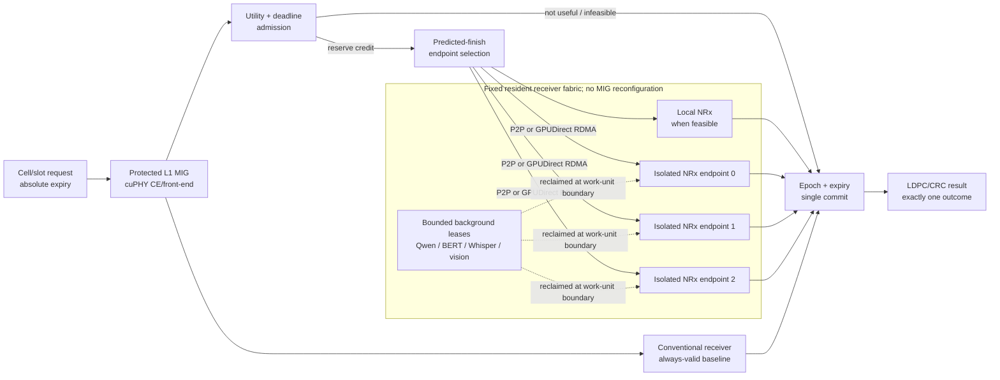
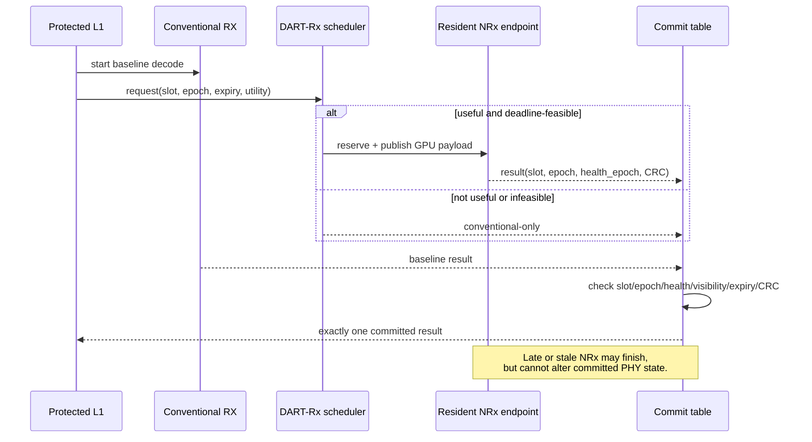
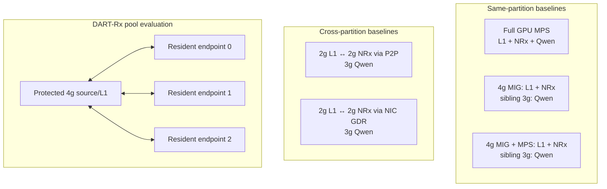

# DART-Rx 연구 전체 설명: Background → Design → Evaluation

**기준일:** 2026-08-15  
**이 문서의 역할:** 처음 보는 사람이 문제, 설계, 실험 조건, 결과, 아직 남은 한계를 한 번에 이해하기 위한 대표 문서  
**데이터 원칙:** 아래 PNG figure는 모두 보존된 CSV/JSON 실험 결과에서 생성했다. Mermaid 블록만 설계 설명도이다.

---

## 0. 먼저 한 문장으로

> **고정 MIG는 L1을 잘 격리하지만 NRx 처리 용량도 endpoint별로 고정한다. DART-Rx는
> MIG를 재구성하거나 protected L1을 중단하지 않고, 선택적으로 유용한 NRx request를
> deadline 안에 끝낼 수 있는 resident accelerator로 보내며, 늦거나 stale한 결과는
> conventional PHY 결과를 침범하지 못하게 하는 receiver service architecture다.**

이 연구는 “MIG가 MPS보다 빠르다” 또는 “GDR가 P2P보다 빠르다”를 주장하는 논문이 아니다.
MIG/MPS/P2P/GDR는 비교해야 하는 **mechanism과 baseline**이고, 실제 연구 문제는 다음
모순이다.

```text
MIG isolation은 필요하다.
        ↓
하지만 static partition/placement는 NRx service capacity를 고정한다.
        ↓
multi-cell·selective burst에서는 한 queue가 무너지는데 다른 endpoint는 놀 수 있다.
        ↓
MIG를 즉시 재구성할 수 없으므로, 고정된 isolated endpoint 사이에서 capacity를 빌려야 한다.
        ↓
remote NRx는 늦을 수 있으므로 admission, routing, fallback, commit을 함께 설계해야 한다.
```

현재 결과는 이 인과관계의 각 부분을 실제 하드웨어에서 확인했다. 다만
`actual-radio + concurrent multi-cell arrivals + multi-endpoint GDR + background reclaim`을
한 번에 실행한 마지막 통합 실험은 아직 남아 있다. 따라서 현재 상태는 **problem과 각
mechanism은 강하게 지지되지만 최종 ISCA claim은 아직 완결되지 않은 상태**다.

---

# Part I. Background and problem

## 1. 어떤 AI-RAN 실행 환경을 다루는가

하나의 uplink request는 독립적인 AI query가 아니라 PHY dependency chain이다.

```text
(cell, slot, scheduled PUSCH)
  → cuPHY channel estimation / front-end
  → conventional receiver와 선택적 Neural Receiver(NRx)
  → LDPC / CRC
  → absolute decision expiry 전에 하나의 결과 commit
```

동시에 같은 GPU 시스템에는 다음 세 종류의 일이 존재한다.

1. **Protected L1:** deadline과 tail latency를 지켜야 하며 background AI 때문에 흔들리면 안 된다.
2. **NRx:** 특정 channel 구간에서만 conventional receiver보다 이득이 있는 optional PHY stage다.
3. **Background AI:** NRx peak를 위해 항상 비워둘 수 없는 GPU headroom에서 Qwen, BERT,
   Whisper, vision/RAN AI 등을 실행한다.

NRx invocation은 매 slot 동일하지 않다. 여러 cell의 주기적 slot이 합쳐지고, hard-channel
구간이 연속되면 selective NRx request가 burst한다. 따라서 평균 utilization만 맞아도 되는
batch inference와 달리, 짧은 시간의 queue buildup과 결과 expiry가 핵심이다.

## 2. 첫 번째 오해: MIG isolation이 실패한 것이 아니다

동일한 A100의 4g MIG에서 resident NRx를 실행하고, sibling 3g MIG에 Qwen-7B를 올려
NRx closed-loop capacity와 open-loop tail을 측정했다.


그림 1의 결론은 두 문장이다.

- **MIG isolation은 정상 동작한다.** 4g NRx capacity는 단독 `745.1 request/s`, sibling
  3g Qwen 동시 실행 `744.2 request/s`로 차이는 `-0.11%`였다.
- **격리는 capacity를 늘리지 않는다.** 700 request/s에서는 p99가 약 1.39 ms였지만,
  750/s에서는 15.58–18.78 ms, 800/s에서는 214.29–217.79 ms로 급증했다.

따라서 이전에 보인 큰 latency가 “MIG가 실제로 격리하지 못해서” 발생한 것은 아니다.
도착률이 고정된 service capacity에 가까워지거나 넘으면서 생긴 queueing collapse다.

## 3. 두 번째 오해: 같은 partition에 L1+NRx를 넣으면 baseline L1과 같아야 한다

MIG는 **서로 다른 GPU instance 사이**를 격리한다. 같은 4g instance 안에 cuPHY L1과 NRx를
함께 넣으면 두 stage는 제한된 SM, memory bandwidth, launch resources를 계속 공유한다.
따라서 다음 두 metric을 구분해야 한다.

- **L1 active time:** NRx/background interference로부터 L1 kernel이 얼마나 보호되는가
- **Dependency-carrying slot E2E:** CE → NRx → LDPC/CRC 전체가 얼마나 걸리는가

Cross P2P는 L1 slowdown을 `1.621× → 1.043×`로 복구했지만, 4g를 2g L1 + 2g NRx로
나누면서 NRx compute가 느려져 slot E2E는 `6.191 → 6.383 ms`로 소폭 증가했다. 즉
**격리 효과는 L1 metric에서 분명하지만, 작은 NRx slice의 compute 손실 때문에 전체
slot latency가 자동으로 줄지는 않는다.**

### 3.1 과거 105 ms NRx 결과와 현재 1.34 ms 결과가 다른 이유

초기 실험의 약 105 ms NRx는 동일 TensorRT model의 순수 compute 시간이 아니었다. Aerial
public `pycuphy` wrapper가 수행한 generic layout conversion이 포함된 시간이다. Nsight와
caller-owned binding으로 경로를 분해한 뒤 동일 output contract를 직접 실행했다.


- Public wrapper GPU mean: `105.15 ms`
- Caller-owned TensorRT binding: `1.413 ms`
- Direct binding + CUDA Graph: `1.340 ms`, host enqueue `2.50 us`
- Wrapper와 direct output의 `max_abs_difference = 0`

따라서 초기 106–112 ms chain 결과는 “당시 wrapper를 포함한 실측”으로 보존하지만,
placement와 queue capacity 결론에는 optimized direct-TensorRT 결과를 사용한다. 이 교정 없이
과거 결과와 현재 결과를 한 표에 섞으면 transport와 MIG 효과를 잘못 해석하게 된다.

## 4. 실제 problem existence: busy queue와 idle capacity가 동시에 존재한다

3개의 독립 resident TensorRT endpoint에 single-cell, multi-cell, selective burst trace를
입력하고 static-one과 predicted-finish placement를 비교했다.


대표 결과는 다음과 같다.

| workload | static-one: p99 / no-timely | predicted-finish: p99 / no-timely |
|---|---:|---:|
| 1 cell, 1 ms, NRx 100% | 3293.25 ms / 99.97% | 1.63 ms / 0.13% |
| 4 cells, 1 ms, bursty 10% | 51.39 ms / 64.85% | 5.50 ms / 1.61% |
| 4 cells, 0.5 ms, bursty 10% | 3332.84 ms / 99.90% | 5.06 ms / 7.89% |

static-one이 miss를 만드는 동안 전체 endpoint idle fraction이 66.7% 이상인 사례가 존재했다.
낮은 평균 NRx 비율에서도 burst가 한 queue에 몰리면 해당 queue는 deadline을 놓치고 다른
endpoint는 idle일 수 있다. 이 결과가 연구 problem의 직접적인 실측 증거다.

여기서 `no-timely`는 5 ms experimental gate 안에 usable NRx가 없었다는 뜻이며, scheduler가
conventional fallback을 요구한 경우도 포함한다. 이 compute/queue gate에는 actual PHY
fallback 결과가 없으므로 radio deadline miss와 같은 metric으로 읽으면 안 된다.

## 5. 문제를 정확히 정의하면

> **선택적으로 유용한 NRx request의 burst가 static MIG placement를 초과할 때, protected
> L1을 중단하거나 MIG topology를 재구성하지 않고 다른 isolated resident accelerator의
> capacity를 사용하면서, late/stale NRx가 PHY state에 commit되지 않도록 하는 문제.**

어려운 이유는 단순 load balancing이 아니기 때문이다.

| 제약 | 왜 필요한가 |
|---|---|
| Static spatial isolation | L1 p99를 co-tenant로부터 보호해야 한다. |
| Dynamic service demand | NRx request는 cell 수와 channel condition에 따라 burst한다. |
| Dependency transport | 원격 NRx는 L1 tensor를 받고 LLR을 다시 돌려줘야 한다. |
| Absolute expiry | deadline 뒤 도착한 정확한 결과도 해당 slot에는 쓸 수 없다. |
| Conventional baseline | optional NRx가 실패해도 PHY recovery path가 남아 있어야 한다. |
| Background utility | peak만 보고 spare accelerator를 항상 비워둘 수 없다. |

---

# Part II. DART-Rx design

## 6. Overall architecture

DART-Rx는 여러 이름의 독립된 기법 모음이 아니라, 아래 하나의 slot transaction pipeline이다.



MIG는 설계에서 사라진 것이 아니다. `protected L1`과 `isolated resident NRx endpoint`를
만드는 물리적 isolation substrate다. DART-Rx가 추가하는 것은 고정 topology 위의 동적
service contract다.

## 7. 설계 블록 1: utility와 deadline을 함께 보는 admission

모든 slot에 NRx를 보내지 않는다. request는 다음 정보를 가진다.

```text
(cell_id, slot_id, epoch, channel_features, release_time, absolute_expiry)
```

Admission은 두 질문에 모두 `yes`일 때만 NRx credit을 예약한다.

1. **Radio utility:** 이 channel condition에서 NRx가 conventional보다 성공 확률을 높일
   가능성이 있는가?
2. **Timing feasibility:** healthy endpoint의 conservative predicted finish가
   `expiry - commit_guard` 이전인가?

유용하지 않거나 제시간에 끝날 가능성이 없는 request는 remote queue를 오염시키지 않고
conventional path를 사용한다. 현재 prototype의 utility gate는 measured SNR bin이며, 최종
시스템에서는 gNB가 이미 가진 CQI, DMRS quality, decoder/HARQ history로 바꾸는 것이 맞다.

## 8. 설계 블록 2: fixed resident receiver fabric

Fast path에서 MIG geometry를 바꾸지 않는다. NRx model, TensorRT context, CUDA Graph,
registered buffers는 endpoint마다 resident로 유지한다.

Endpoint 선택은 단순 round-robin이나 shortest queue length가 아니라 다음 완료시각을
추정한다.

```text
predicted_finish[e]
  = max(now, endpoint_available[e])
  + conservative_service_tail[e]
  + transport_and_commit_guard[e]
```

feasible endpoint 중 가장 빠른 곳의 tensor/ring credit을 원자적으로 예약한다. 같은 GPU에서
허용되는 경로에는 direct/local 또는 P2P를, isolation boundary나 다른 GPU에는 registered
GPUDirect RDMA를 사용한다. GDR의 목적은 NRx compute를 빠르게 만드는 것이 아니라 CPU
bounce 없이 **다른 isolated endpoint를 하나의 service pool에 포함**시키는 것이다.

GPUDirect request/result publish 순서는 같은 RC QP에서 다음처럼 고정한다.

```text
request:   GPU payload WRITE → descriptor WRITE → doorbell WRITE
response:  GPU result WRITE  → completion WRITE → doorbell WRITE
```

NIC completion은 곧바로 PHY commit을 뜻하지 않는다.

## 9. 설계 블록 3: baseline-preserving, expiry-safe commit

NRx는 conventional 결과를 대체할 수 있는 **expiring alternative result**다. Conventional
receiver는 항상 실행 가능한 baseline으로 남는다.



NRx 결과가 commit되려면 `slot/epoch`, endpoint health epoch, payload visibility, completion
status, expiry, LDPC/CRC, transaction-open 조건이 모두 참이어야 한다. 이 규칙 때문에 remote
pool을 공격적으로 사용해도 late result가 다음 slot의 buffer나 architectural state를
오염시키지 않는다.

## 10. 설계 블록 4: bounded background lease

Spare NRx endpoint를 항상 비워두면 비용 효율이 낮다. 반대로 background kernel을 무제한으로
실행하면 burst 시 NRx가 즉시 capacity를 회수하지 못한다. DART-Rx는 model을 unload하지 않고
**cooperative work-unit boundary**에서 새 background submission을 중단한다.

```text
low NRx load  : resident background model에 bounded lease 발급
burst detected: 새 work unit 발급 중지
boundary drain: spare endpoint를 NRx pool에 activate
load recovers : NRx credit 축소 후 background lease 재개
```

이것은 arbitrary CUDA kernel preemption을 주장하는 것이 아니다. reclaim delay의 상한은
background work-unit quantum에 의해 결정되므로, prefill chunk, decode step, batch 크기 등을
제어 가능한 단위로 만들어야 한다.

## 11. 측정된 pain point와 mechanism의 대응

| 측정된 문제 | DART-Rx mechanism |
|---|---|
| MIG는 격리하지만 endpoint capacity는 고정 | fixed topology 위의 multi-endpoint service pool |
| static queue collapse + 다른 endpoint idle | predicted-finish placement와 atomic credit |
| NRx utility가 channel별로 다름 | radio-utility admission |
| remote result가 deadline 뒤 도착 가능 | absolute expiry와 commit guard |
| stale result가 재사용된 buffer에 도착 가능 | slot epoch + endpoint health epoch |
| remote NRx failure/overload | always-valid conventional baseline |
| spare를 비우면 GPU utility 손실 | bounded, cooperatively reclaimable background lease |

---

# Part III. Experimental setup

## 12. 하드웨어와 소프트웨어

| 항목 | 실험 환경 |
|---|---|
| CloudLab | Wisconsin d8545 bare-metal, project AIRANSLICING |
| GPU | NVIDIA A100-SXM4-40GB ×4 |
| MIG | 실험별 4g.20gb + 3g.20gb 또는 3g/2g 조합; 나머지 A100은 full GPU endpoint |
| NIC | Mellanox ConnectX-6 Dx 200 Gb/s; physical internal loopback, Ethernet 100 Gb/s active |
| Host OS | Ubuntu 22.04.2 |
| NVIDIA stack | Driver 580.173.02, CUDA 13.0, `nvidia_peermem` |
| RDMA stack | MOFED 24.10-3.2.5.0, rdma-core/Pyverbs 57, RoCE v2 GID index 3 |
| AI-RAN | NVIDIA Aerial 25.3.2, real cuPHY CE and LDPC/CRC |
| NRx | NVIDIA pretrained `neural_rx.onnx`, TensorRT FP16, caller-owned binding/CUDA Graph |
| Background | Qwen2.5-7B decode; ResNet-50, BERT-base, Whisper-base execution workloads |

NIC GDR 컨테이너에는 RDMA device뿐 아니라 RoCE backing netdev가 보여야 하므로
`--network=host --device=/dev/infiniband --cap-add=IPC_LOCK`를 사용했다. GPU MR에는
Pyverbs `MR.read/write`를 사용하지 않고 CuPy allocation address를 직접 등록했다.

## 13. 평가 topology



MPS, MIG, MIG+MPS, P2P, GDR는 모두 논문에 들어가야 한다. 다만 각 baseline이 답하는 질문은
다르다.

| 비교 | 답하는 질문 |
|---|---|
| Full MPS cap sweep | isolation을 포기했을 때 RAN latency와 background throughput Pareto는? |
| MIG local | sibling 격리는 되지만 같은 GI 안의 L1–NRx contention은 얼마나 남는가? |
| MIG+MPS local | 같은 GI의 MPS context 추가가 isolation/capacity를 자동 개선하는가? |
| Cross P2P | native inter-partition path로 L1 active time을 얼마나 복구하는가? |
| Cross NIC GDR | CPU bounce 없이 다른 isolated process/GPU를 service endpoint로 쓸 수 있는가? |
| DART-Rx pool | static placement보다 deadline-feasible capacity를 실제로 잘 이용하는가? |

## 14. Workload와 실험 조건

| Gate | 입력/조건 | 반복 | metric | 증명 범위 |
|---|---|---:|---|---|
| MIG isolation/cliff | 4g NRx, 500/700/750/800 request/s, sibling 3g Qwen on/off | 조건당 1 hardware run | capacity, p99, backlog | isolation과 queue cliff |
| Placement/transport | optimized CE–direct TRT–LDPC chain, Qwen co-tenant | 대부분 3 trials; GDR 2 | L1 active, E2E, transport, Qwen it/s | MPS/MIG/P2P/GDR trade-off |
| Multi-cell problem gate | 1/2/4/8 cells, 0.5/1 ms, sync/stagger, selective iid/bursty 10–100% | 29 traces × 3 trials × 5 policies = 435 rows | p99, no-timely, fallback, idle | fragmentation 존재 |
| Background reclaim | 500/s 2.01 s → 1100/s 3 s → 500/s 3 s | 4 workloads × 2 policies, 조건당 1 run | burst p99, 5 ms ratio, work retained | online reclaim opportunity |
| Full GDR pool | full-size GPU request/result, 3 process-isolated endpoints, 5 ms gate | 29 points × 3 trials × 4 policies = 348 full-matrix runs; 412 total | no-timely, reject, late/expired, timely p99 | transport/compute/queue scheduler |
| Actual radio | cuPHY CE → GDR NRx → LDPC/CRC, MCS 7 Rayleigh, 100 requests/run | 3-endpoint modes 3 trials; 17 runs total | correct TB, NRx requests/commits, decision latency | radio utility와 transaction correctness |

### 14.1 Deadline 표기를 섞으면 안 된다

- `5 ms`는 multi-endpoint scheduler와 background gate를 비교하기 위한 **experimental
  timeliness threshold**다.
- `12 ms`는 actual-radio correctness vertical slice의 **experimental expiry**다.
- 이 결과만으로 production 1 ms PHY deadline을 만족한다고 주장하지 않는다.

### 14.2 Background workload realism의 경계

- Qwen은 실제 Qwen2.5-7B resident decode다.
- ResNet-50, BERT-base, Whisper-base는 실제 architecture/kernel mix를 사용하지만 synthetic
  random weights/input이다. 따라서 이 gate는 model quality가 아니라 GPU interference와
  cooperative reclaim timing을 평가한다.
- Multi-cell selective trace도 actual radio ground truth가 아니라 workload sensitivity input이다.
  Radio utility 주장은 별도의 paired Aerial/Sionna actual-radio gate만 사용한다.

---

# Part IV. Evaluation

## 15. Q1 — MIG/MPS/P2P/GDR 비교에서 무엇을 배웠는가


### 15.1 같은 partition과 cross partition

| 구성 | slot E2E mean | L1 slowdown | Qwen | 해석 |
|---|---:|---:|---:|---|
| MIG local | 6.191 ms | 1.621× | 10.22 it/s | sibling Qwen 격리, L1–NRx 내부 contention은 유지 |
| MIG+MPS local | 6.383 ms | 1.702× | 10.22 it/s | 같은 GI의 MPS client가 자동 isolation을 만들지 않음 |
| Cross P2P | 6.383 ms | **1.043×** | 10.23 it/s | L1 isolation 복구, 2g NRx compute 손실로 E2E 이득 상쇄 |
| Cross NIC GDR | 6.326 ms | 해당 run 미측정 | 10.24 it/s | zero-CPU-copy endpoint 가능; depth 1이라 처리량 직접 비교 금지 |

동일 depth-1 비교에서 P2P는 5.888 ms, GDR는 6.326 ms였다. NIC loopback은 평균
0.438 ms 느렸지만 전체 pipeline은 6 ms대이고 overload tail은 수백–수천 ms다. 따라서
**transport는 무시할 수 없지만 현재 지배 병목은 NRx compute와 queue stability**다.

### 15.2 Full MPS도 단순히 나쁜 baseline은 아니다

Qwen cap 30%에서 E2E 5.865 ms로 가장 낮았지만 Qwen은 7.92 it/s였다. cap 100%에서는
Qwen 21.11 it/s를 얻는 대신 E2E가 8.569 ms로 증가했다. MPS는 work-conserving하고 빠를 수
있지만 load-dependent tail을 만든다. Cross placement의 목적은 최저 평균 하나가 아니라
**예측 가능한 L1 isolation과 capacity pool 구성**이다.

## 16. Q2 — background capacity를 실제로 회수할 수 있는가


`500 → 1100 → 500 request/s` burst에서 naive sharing과 adaptive reclaim을 비교했다.

| background | naive burst p99 / >5 ms | adaptive p99 / >5 ms | background work retained | reclaim activation |
|---|---:|---:|---:|---:|
| ResNet-50 | 2211.39 ms / 67.00% | 6.72 ms / 1.24% | 94.0% | 14.62 ms |
| BERT-base | 1602.27 ms / 57.27% | 2.77 ms / 0.39% | 89.3% | 1.90 ms |
| Whisper-base | 471.31 ms / 49.64% | 3.07 ms / 0.39% | 98.6% | 2.80 ms |
| Qwen-7B decode | 2270.97 ms / 67.67% | 5.72 ms / 1.12% | 93.0% | 13.71 ms |

결과는 background model을 unload하지 않고도 89–99%의 work를 보존하며 queue collapse를
크게 줄일 수 있음을 보여준다. 동시에 ResNet/Qwen의 13–15 ms reclaim delay는 strict 5 ms
bound에 너무 길다. 따라서 설계에는 **bounded work unit/chunk size**가 반드시 필요하다.

이 gate에는 cuPHY와 GDR transport가 없다. 즉 이것은 “완성된 DART-Rx가 위 숫자를 달성했다”가
아니라 background lease mechanism을 구현할 가치와 필요한 quantum bound를 측정한 결과다.

## 17. Q3 — actual full-size GDR pool에서 routing policy가 동작하는가


29 workload points × 3 trials × 4 policies의 348-run full matrix에서 predicted-finish는
static-one보다 87/87, static-cell보다 86/87 paired trace에서 no-timely ratio를 낮췄다.
median 개선은 각각 18.65, 16.50 percentage point였다.

그러나 이 결과를 과대해석하면 안 된다.

- 전체 trace median에서 predicted-finish no-timely는 여전히 81.33%였다.
- 그중 81.31%는 늦게 보낸 작업이 아니라 conventional path로 **미리 reject**한 요청이다.
- 따라서 이 정책은 futile remote work를 거의 제거했지만 usable NRx opportunity도 많이
  버리는 보수적인 admission이다.
- 이 gate에는 cuPHY/conventional/radio ground truth가 없다. `no-timely`는 PHY miss가 아니다.

즉 GDR fabric과 finish-aware reservation의 필요성은 확인됐지만, 최종 정책은 fixed guard가
아니라 radio utility와 fallback risk budget을 함께 최적화해야 한다.

## 18. Q4 — 실제 radio 결과까지 연결하면 가치가 있는가


3개의 actual GDR endpoint와 real cuPHY CE/LDPC/CRC path를 사용한 3-trial median 결과다.

| mode | NRx requests / 100 | correct TB ratio | decision p50 / p99 |
|---|---:|---:|---:|
| conventional | 0 | 0.62 | 1.045 / 1.292 ms |
| all NRx | 100 | 0.80 | 2.567 / 5.139 ms |
| utility admission | 75 | 0.80 | 2.636 / 5.050 ms |

Utility mode는 all-NRx와 같은 `0.80` correct-TB ratio를 유지하면서 NRx 요청을 25% 줄였다.
세 replay trace에서 utility mode의 요청은 endpoint마다 25개씩 분배됐고 deadline miss와
late completion은 0이었다.

이것이 “NRx를 많이 실행할수록 좋다”가 아닌 이유다. Radio gain이 집중된 channel 구간에
capacity를 써야 같은 delivered outcome을 더 적은 neural work로 얻는다. 다만 이 실험은
12 ms expiry의 synchronous correctness gate이므로, 3 replicas가 concurrent 1 ms arrival을
처리한다는 증거는 별도의 open-loop pool 결과에서 가져와야 한다.

## 19. 전체 evidence chain

| 순서 | 실험이 확인한 사실 | 설계로 이어지는 이유 |
|---:|---|---|
| 1 | MIG sibling isolation은 capacity를 보호한다. | protected L1은 fixed MIG로 유지한다. |
| 2 | 고정 endpoint는 capacity 근처에서 queue cliff가 난다. | average latency가 아니라 tail/queue를 관리한다. |
| 3 | busy queue와 idle endpoint가 동시에 존재한다. | static binding 대신 resident pool과 routing이 필요하다. |
| 4 | P2P/GDR 비용보다 NRx compute/queue가 더 크다. | transport speed 자체가 아니라 service capacity를 최적화한다. |
| 5 | background work를 bounded하게 줄이면 spare를 회수할 수 있다. | endpoint headroom에 reclaimable lease를 둔다. |
| 6 | utility admission은 같은 radio outcome에서 NRx work를 25% 줄였다. | timing뿐 아니라 radio value를 admission에 포함한다. |
| 7 | actual GDR pool에서 finish-aware policy가 static보다 우세하다. | endpoint reservation과 expiry-aware rejection이 필요하다. |

---

# Part V. 현재 결론과 남은 일

## 20. 지금 주장할 수 있는 것

1. **문제는 실제로 존재한다.** MIG isolation이 정상이어도 static NRx capacity/placement 때문에
   deadline miss와 idle endpoint가 동시에 발생한다.
2. **P2P/GDR는 해결책 전체가 아니라 data-plane enabler다.** L1 isolation과 remote endpoint
   reachability를 제공하지만 NRx service shortage를 없애지는 않는다.
3. **MPS와 MIG는 서로 다른 trade-off다.** MPS는 빠르고 work-conserving할 수 있지만 tail
   isolation이 약하고, MIG는 predictable하지만 capacity fragmentation을 만든다.
4. **DART-Rx의 핵심은 cross-layer contract다.** utility/deadline admission, finish-aware
   endpoint credit, ordered GPU transport, expiry-safe single commit, bounded background lease를
   하나의 slot transaction으로 묶는다.
5. **Selective NRx는 실제 radio value가 있다.** 현재 paired trace에서는 all-NRx와 같은
   outcome을 25% 적은 NRx request로 얻었다.

## 21. 아직 주장하면 안 되는 것

- 현재 prototype이 production 1 ms PHY deadline을 만족한다.
- GDR가 P2P보다 빠르거나 single-slot latency를 5–10 μs로 만든다.
- Background reclaim 결과가 이미 full cuPHY/GDR/radio path와 통합됐다.
- 3-endpoint actual-radio correctness run이 open-loop multi-cell capacity를 증명한다.
- Host polling prototype만으로 ISCA급 microarchitecture contribution이 완성됐다.

## 22. 최종적으로 필요한 통합 실험

현재 evidence는 강하지만 세 실험 층이 분리돼 있다. 마지막 핵심은 하나의 실행에서 다음을
동시에 측정하는 것이다.

```text
actual multi-cell captured slot arrivals
  + protected cuPHY L1
  + conventional baseline
  + 3 resident GDR NRx endpoints
  + utility/deadline predicted-finish admission
  + epoch/expiry commit
  + Qwen/BERT/Whisper/vision bounded background leases
```

최종 비교군은 `MPS`, `MIG local`, `MIG+MPS`, `static cross-P2P`, `static cross-GDR`,
`DART-Rx without utility`, `DART-Rx without expiry-safe admission`, `full DART-Rx`가 되어야 한다.
측정값은 L1 p99, decision p99, deadline miss, correct-TB/goodput, NRx admitted/committed ratio,
endpoint utilization, background work, CPU polling overhead, GPU/NIC command timeline이다.

## 23. ISCA 관점의 현재 판정

**긍정적이지만 미완성**이다. 단순 MIG/MPS/P2P/GDR 비교에 머물렀다면 novelty가 약했을
것이다. 현재는 다음 조합이 architecture contribution 후보가 됐다.

> Static spatial isolation 위에서, value가 조건부이고 결과가 만료되는 dependent neural PHY
> stage를 resident accelerator pool로 실행하며, mandatory conventional recovery와 background
> utility를 하나의 versioned resource/commit contract로 관리한다.

ISCA 수준으로 만들려면 마지막 통합 결과와 함께 host scheduler를 넘는 구체적인 command
queue/credit/commit-table microarchitecture, CPU overhead 제거 효과, area/throughput model이
필요하다. 즉 방향은 맞지만 현재 figure들을 “최종 완성”으로 포장해서는 안 된다.

---

## 24. Figure와 데이터 provenance

Figure 생성 명령:

```bash
cd /Users/changjongkim/New_research/cloudlab_results
python3 tools/analysis/generate_research_walkthrough_figures.py
```

| figure | 원본 데이터 |
|---|---|
| Fig. 1 MIG isolation/queue cliff | [`results/20260813_drain_free/fixed_mig_sibling_isolation/`](../../results/20260813_drain_free/fixed_mig_sibling_isolation/) |
| NRx wrapper optimization | [`raw/nrx_deep_profile/`](../../results/20260813_nrx_placement/raw/nrx_deep_profile/) |
| Fig. 2 placement fragmentation | [`MULTICELL_HARDWARE_MEDIANS.csv`](../../results/isca_v2/mig_causal_20260813T1138Z/07_multicell_workloads/analysis/MULTICELL_HARDWARE_MEDIANS.csv) |
| Fig. 3 placement/transport | [`PLACEMENT_SUMMARY.csv`](../../results/20260813_nrx_placement/PLACEMENT_SUMMARY.csv) |
| Fig. 4 background reclaim | [`06_background_contention/`](../../results/isca_v2/mig_causal_20260813T1138Z/06_background_contention/) |
| Fig. 5 GDR pool policy | [`gdr_pool analysis/`](../../task1_final/gdr_pool_20260814T014651Z/analysis/) |
| Fig. 6 actual radio utility | [`dart_rx_radio_pool analysis/`](../../task1_final/dart_rx_radio_pool/analysis/) |

관련 상세 문서:

- [현재 연구 종합본](MIG_NRX_DART_RESEARCH_SYNTHESIS_KO.md)
- [현재 연구 체크포인트](MIG_NRX_RESEARCH_CHECKPOINT_KO.md)
- [데이터 카탈로그](../../data/README.md)
- [새 CloudLab 노드 복구 절차](../setup/CLOUDLAB_EMPTY_NODE_RESTORE_RUNBOOK_KO.md)
