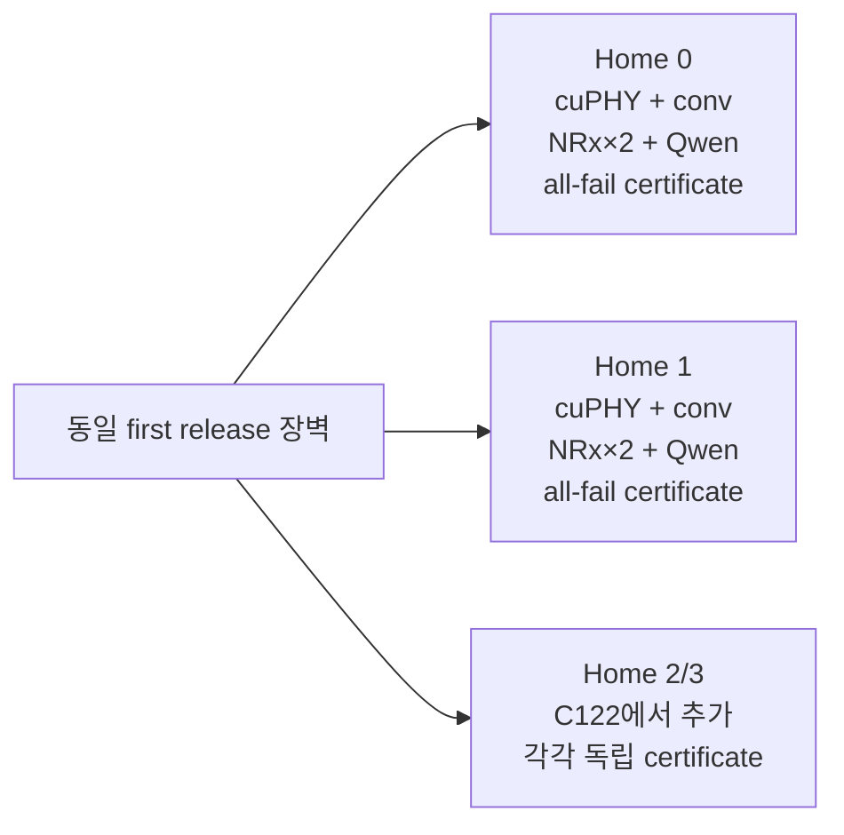

# Confirm121/122: sharded-home 8셀·12셀 물리 검증

**원 실행 상태:** 2026-09-24 사전 고정 protocol의 두 독립 arm씩 PASS  
**후속 자격 판정:** C124가 4-cell/home conv12 bound를 반증해 C121 exact mode는 UQ로
강등했다. C122의 3-cell/home exact mode는 유지한다.  
**원 결과:** 2 A100의 `[4,4]` 8셀과 4 A100의 `[3,3,3,3]` 12셀에서 disjoint
all-fail certificate가 동시 물리 실행 중 합성됐고, 모든 관측 safety gate를 통과했다.

## 1. 왜 이 실험을 했는가

C84는 한 A100에 8개 receiver를 만들다가 timed traffic 전에 OOM이 났다. Remote NRx
endpoint만 추가하는 C114--120은 optional 경로의 처리 위치를 바꾸지만, conventional
recovery와 receiver state가 남는 home GPU의 메모리 병목은 없애지 못한다.

따라서 scale-out 단위는 endpoint 수가 아니라 **RAN home**이어야 한다. 각 home은 다음을
독립적으로 소유한다.

- cuPHY/Aerial receiver와 conventional recovery lane
- 요청별 recovery credit과 all-fail executable calendar
- same-device CUDA IPC NRx endpoint 두 개
- bounded Qwen worker와 AI lease
- endpoint/ring/lease generation과 physical completion fence

여러 home이 endpoint, recovery lane, Qwen queue를 공유하지 않으면 전체 certificate는
home별 certificate의 곱으로 구성된다. C121/122는 이 분리 가능 조건을 실제 동시 실행으로
검사했다.

### 1.1 후속 실험에 따른 정정

C121의 두 arm과 artifact는 실행 당시 결과로 그대로 유효하다. 그러나 같은
2-home×4-cell conv12 구성을 더 길게 반복한 C124의 마지막 arm에서 conventional
host-to-commit 한 건이 `12.535096 ms`로 12 ms 계약을 넘었다. 따라서 C121은 성공 표본이지만
그 exact mode의 qualification은 철회한다.

C122는 GPU당 3셀이라 recovery geometry와 cutoff가 다르고 같은 위반이 관측되지 않았다.
그 exact finite-sample mode는 유지하되 conv12를 다른 cell-per-home topology로 일반화하지
않는다. 4-cell/home은 C125 ordering 반례 뒤 certificate-ordered executor와 conv25를 쓴
C126에서 다시 자격화됐다. 후속 판정은
[C123--126 결과](SOFTWALL_CONFIRM123_126_GLOBAL_AI_RESULT_KO.md)를 따른다.

## 2. 실행 계약

두 실험은 같은 warm, GC-OFF, `CUDA_MODULE_LOADING=LAZY`, MIG-OFF/MPS mode를 썼다.
각 home의 period/deadline은 P180/D155 ms, NRx 전체 path bound는 45 ms,
conventional host-path bound는 12 ms, commit guard는 2 ms다. 각 다섯 번째 release에
mixed correlated NRx failure를 주입했다. BurstGPT 60초 trace를 Qwen2.5-1.5B bounded
prefill로 replay했다.

모든 controller는 receiver/worker warmup을 끝낸 뒤 파일 장벽에 도착한다. Leader가 같은
노드의 `perf_counter_ns`로 하나의 `first_release_ns`를 공개하므로 모든 home은 동일한
release burst를 받는다. 분석기는 실제 timed interval의 교집합도 별도로 검사한다.

## 3. C121 — 2 GPU, 2 home, 8 cells

각 GPU는 4셀 home이다. 두 독립 arm은 각각 340 release, 2,720 TB를 실행했다.

| Arm | release 차이 | 실제 공통 실행 | Home별 atomic exchange | Home별 timely AI token | Safety |
|---|---:|---:|---|---|---|
| s1 | 0 ns | 61,033.541 ms | 95 / 73 | 225,401 / 225,047 | 모두 통과 |
| s2 | 0 ns | 61,032.609 ms | 85 / 86 | 226,348 / 225,487 | 모두 통과 |

두 arm 합계는 5,440 TB다. Deadline, NRx/conventional/AI bound, pre-radio guard,
endpoint/background fault, residual recovery/endpoint/AI credit 위반은 0이다. 네 NRx worker의
완료 건수는 controller admission과 warmup 건수에 정확히 일치했다.

## 4. C122 — 4 GPU, 4 home, 12 cells

각 GPU는 3셀 home이다. 첫 canary는 기존 controller가 `--cells=4`만 허용해 timed traffic
전에 실패했다. 이 실패는 별도 artifact로 보존했다. C121의 동결 controller는 바꾸지 않고
1--4셀을 지원하는 sharded controller를 만들었으며, controller가 시작 전에 실패해도
persistent worker를 먼저 기다리지 않도록 종료 순서를 고쳤다.

수정 canary 통과 뒤 두 독립 arm은 각각 340 release, 4,080 TB를 실행했다.

| Arm | release 차이 | 실제 공통 실행 | Home별 atomic exchange | Home별 timely AI token | Safety |
|---|---:|---:|---|---|---|
| s1 | 0 ns | 61,029.415 ms | 79 / 91 / 96 / 90 | 226,523 / 226,860 / 227,491 / 227,055 | 모두 통과 |
| s2 | 0 ns | 61,029.001 ms | 81 / 85 / 89 / 86 | 228,707 / 226,699 / 227,280 / 227,708 | 모두 통과 |

두 arm 합계는 8,160 TB다. C121과 같은 safety·lifecycle gate가 모두 통과했고, 여덟 NRx
worker의 완료 건수도 controller와 일치했다.

## 5. Envelope 판정

기존 v2 checker는 multi-home을 shared endpoint list로 근사했다. 실제 C121/122는 home별
endpoint pool이므로 기존 checker와 manifest는 그대로 보존하고, v2 checker에서
`home_endpoint_bounds_ms`를 추가했다. 새 v3 snapshot은 정확히 실행한 mode만 qualified로
올린다.

| Cell 수 | 1 home GPU | 2 home GPU | 4 home GPU |
|---:|---|---|---|
| 4 | **QSU** `[4]` | UQ `[2,2]` | UQ `[1,1,1,1]` |
| 8 | **MI** `[8]` | **QSU** `[4,4]` | UQ `[2,2,2,2]` |
| 12 | **MI** `[12]` | **MI** `[6,6]` | **QSU** `[3,3,3,3]` |

작은 home 구성이 더 가벼워 보여도 co-run mode가 달라지므로 직접 측정 없이 자동으로
QSU로 올리지 않았다. C84의 단일 GPU OOM과 C121/122를 합치면, 현재 구현의 scale 경계는
“endpoint를 더 붙이는 것”보다 “receiver와 recovery home을 분할하는 것”에 의해 이동한다.

## 6. 논문에서 말할 수 있는 것

다음 주장은 현재 증거가 직접 지지한다.

> 자격화된 disjoint-home mode에서는 각 home의 all-fail certificate와 물리 credit
> lifecycle을 독립적으로 유지하면 전체 시스템의 certificate가 합성된다. 이 구성은 한
> A100의 receiver residency 경계를 넘어 2 GPU/8셀과 4 GPU/12셀에서 bounded Qwen과
> correlated NRx failure를 동시에 처리했다.

이 결과는 “멀티 GPU 사용” 자체의 novelty가 아니다. SoftWall의 기여 후보는 optional
per-TB NRx의 recovery debt, executable all-fail certificate, atomic recovery/AI lease와
physical CUDA/IPC lifecycle이라는 계약이 home sharding과 endpoint transport 변경에도
같은 형태로 유지된다는 점이다.

## 7. 아직 말할 수 없는 것

- Shared NRx endpoint나 global AI queue가 있는 non-separable multi-home certificate
- GPU 수 대비 처리량 우위나 비용 효율
- 12셀이 단일 GPU 8셀과 완전히 같은 workload라는 주장
- 표본 결과를 WCET 또는 production DU deadline 보장으로 해석하는 주장
- 다른 GPU/node에서의 일반화

다음 설계 단계는 shared resource가 생길 때 local certificate만으로 충분하지 않은 조건을
모델링하고, global broker가 endpoint/ring/AI credit을 발급하기 전 모든 영향받는 home의
certificate generation을 함께 검사하는 것이다.

## 8. 권위 artifact

- [C121 protocol](../../results/softwall_multigpu/confirm121_sharded_two_home_protocol.json)
- [C121 result](../../results/softwall_multigpu/confirm121_sharded_two_home_result.json)
- [C122 protocol](../../results/softwall_multigpu/confirm122_sharded_four_home_protocol.json)
- [C122 result](../../results/softwall_multigpu/confirm122_sharded_four_home_result.json)
- [C122 preflight failure](../../results/softwall_multigpu/c122_sharded_four_home_canary_failure_job58819952.json)
- [Envelope v3 input](../../results/softwall_multigpu/softwall_sharded_home_envelope_grid_v3.json)
- [Envelope v3 output](../../results/softwall_multigpu/softwall_sharded_home_envelope_prediction_v3.json)
- [Envelope v3 manifest](../../results/softwall_multigpu/softwall_sharded_home_envelope_manifest_v3.json)
- [C121 analyzer](../../scripts_for_node/softwall_same_gpu/analyze_confirm121_sharded_two_home.py)
- [C122 analyzer](../../scripts_for_node/softwall_same_gpu/analyze_confirm122_sharded_four_home.py)
