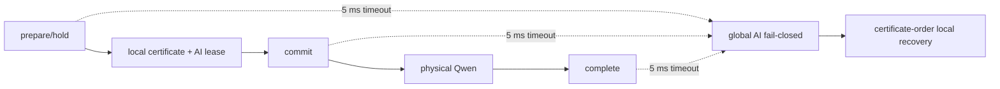

# SoftWall C128–C133 control-path fail-stop 최종 판정

**상태:** 2026-09-24, full-budget `prepare/commit/complete` fault matrix PASS  
**대상:** 2 GPU, GPU당 4 RAN cell·2 local NeuralRx endpoint·1 Qwen worker,
P180/D155, conventional 25 ms, NeuralRx 45 ms, MIG OFF/MPS ON

**후속 재자격:** [C134](SOFTWALL_CONFIRM134_INDEPENDENT_NODE_RESULT_KO.md)는 같은 full-budget
contract를 새 allocation의 다른 A100 node에서 prepare/commit/complete 각 두 arm으로
재실행해 추가 16,320 TB의 safety 위반 0을 확인했다.

## 결론

External-AI broker를 fail-closed로 만드는 것만으로 RAN deadline은 보존되지 않는다.
Recovery 전에 동기적으로 호출되는 `prepare`, `commit`, `complete` 각각에 유한 상한을
두고 전체 비용을 AI admission 전에 recovery horizon에서 차감해야 한다.

```text
B_prepare + B_commit + B_AI(class) + B_complete + G_physical
    <= min(AI deadline, earliest certified recovery start)
```

C129는 Qwen이 물리 완료된 뒤에도 무제한 `complete` RPC가 97.259 ms 더 막혀 fallback이
release+160.844 ms에 거절되는 반례를 만들었다. C132는 각 RPC 5 ms, control 합 15 ms와
physical guard 2 ms를 admission에 반영해 post-commit fail-stop 두 arm을 통과했다. C133은
같은 frozen contract로 post-prepare와 post-complete를 두 arm씩 추가했다.

## 전체 fault-point matrix

| Broker가 state를 적용한 뒤 reply 전에 종료 | 독립 arm | RAN TB | fault 탐지 뒤 TB | Safety 위반 | Ambiguous request 의미 |
|---|---:|---:|---:|---:|---|
| `prepare` | 2 | 5,440 | C133 합계에 포함 | 0 | held만 됐고 physical AI launch 0 |
| `commit` | 2 | 5,440 | C132 4,976 | 0 | inflight지만 ACK가 없어 physical AI launch 0 |
| `complete` | 2 | 5,440 | C133 합계에 포함 | 0 | physical AI는 이미 끝났고 실행 횟수 정확히 1 |
| **합계** | **6** | **16,320** | **14,938** | **0** | actual request ID 중복 0 |

C133의 prepare+complete 네 arm만 보면 RAN TB 10,880, fault 탐지 뒤 9,962, containment 전
AI unit 234개다. Deadline, NRx bound, conventional bound, AI bound와 recovery-horizon
위반은 모두 0이었다. 모든 client가 global AI를 닫은 뒤에도 양 home은 모든 local RAN
release를 완료했고 recovery·endpoint·AI credit이 0으로 drain됐다.

전체 repository 단위시험은 Aerial runtime 77개, Qwen runtime 3개, DART runtime 21개로
총 101개가 통과했다. Runtime fault regression 10,000회도 통과했다. C133 formal artifact
51개와 source 11개의 SHA-256, envelope v7 manifest 8개 항목을 다시 계산했으며 mismatch는
0개였다.

## 왜 이 결과가 필요한가

C130은 RPC timeout만 추가해 물리적으로 통과했지만 control 비용을 admission에 넣지 않았다.
C131은 commit+complete 10 ms만 넣고 request 선택 안의 synchronous prepare 5 ms를 놓쳤다.
두 결과를 QSU로 올리지 않고 proof-incomplete UQ로 남겼다. C132가 예산 완전성을, C133이
세 state-transition point의 물리 coverage를 담당한다.



## Claim boundary

입증한 것은 exact mode의 **bounded volatile broker fail-stop containment**다. Broker restart,
durable token reconciliation, network partition, exactly-once completion, GPU/driver hang,
production WCET와 routing/throughput 우위는 입증하지 않았다. Prepare/commit ambiguity에서는
안전 때문에 request를 버릴 수 있으므로 availability나 exactly-once가 아니라 at-most-once
physical execution을 택한다.

권위 artifact:

- [C133 protocol](../../results/softwall_multigpu/confirm133_control_point_fault_matrix_protocol.json)
- [C133 aggregate](../../results/softwall_multigpu/confirm133_control_point_fault_matrix_result.json)
- [C133 manifest](../../results/softwall_multigpu/confirm133_artifact_manifest.json)
- [C133 validation summary](../../results/softwall_multigpu/confirm133_validation_summary.json)
- [C132 aggregate](../../results/softwall_multigpu/confirm132_fully_budgeted_broker_crash_result.json)
- [Envelope v7](../../results/softwall_multigpu/softwall_sharded_home_envelope_prediction_v7.json)
