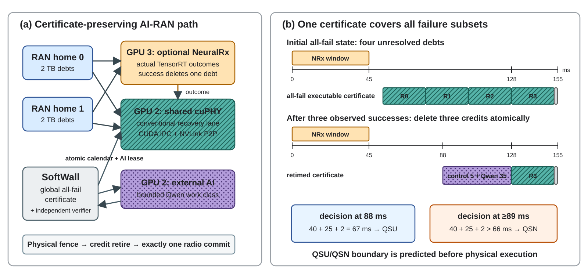
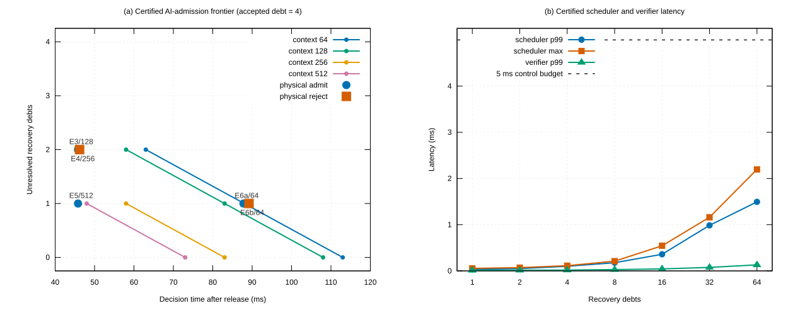

# SoftWall: Certifying Conditional Recovery for Shared-GPU AI-RAN

**Working manuscript — September 25, 2026**  
**Target scope:** measurement/modeling/systems venue  
**Claim boundary:** finite-sample qualification of specified A100 modes; no WCET or production-HARQ claim

## Abstract

AI-and-RAN platforms seek to run radio processing and external AI services on shared accelerators.
GPU concurrency mechanisms such as NVIDIA Multi-Process Service (MPS), however, do not by themselves
provide a temporal contract for the radio path. The problem becomes sharper when a neural receiver is
optional: until its result is known, the same transport block retains a conventional-receiver recovery
obligation. Across cells and RAN homes, these contingent obligations can collide on shared recovery
resources even though they have not entered a runtime queue.

We present **SoftWall**, a runtime substrate that represents unresolved conventional work as recovery
debt. SoftWall continuously maintains an executable all-fail schedule for every unresolved neural
receiver. It may retime recovery intervals and admit a bounded external-AI unit only through one
generation-safe transaction that preserves this certificate. The transaction covers endpoint and
transport credits, external-AI ownership, physical latest-start checks, CUDA completion fences, and
single radio commit. We also derive a provenance-qualified feasibility envelope that distinguishes
safe-and-useful, safe-without-slack, mandatory-infeasible, and unqualified modes.

Two prespecified boundary states show why current GPU idleness is insufficient: debt-blind AI
admission can cross the radio guard by 12 ms and 1 ms under the qualified contract, while SoftWall
rejected all 60 corresponding requests before physical launch. On two independent 4×A100 nodes with MIG disabled
and MPS enabled, a warm `P180/D155` path executed 4,800 actual TensorRT neural-receiver requests,
1,312 shared-cuPHY recoveries, 1,077 Qwen units, and 4,800 radio commits without an observed deadline,
bound, transport, credit, or commit violation. A seven-class fault campaign executed another 2,800
neural-receiver requests and 942 recoveries with no observed deadline miss. The model agreed with an
exact checker on 16,023 qualified states and with 180 prespecified physical boundary rounds; a
certified 64-debt scheduler had a 1.494 ms p99 decision latency. A strong certificate-preserving
recovery-first baseline and an offline oracle found no material throughput advantage, so we make no
optimizer claim. SoftWall instead identifies when conditional sharing is certifiably safe, when it
has no useful slack, and when the mode must be rejected or requalified. These timing claims are
finite-sample qualifications of synthetic `P180/D155` modes. Applying the same qualification discipline
to Aerial testMAC's 4.5 ms UL-indication threshold rejected every tested implementation; the best
same-stream raw-IQ two-GPU prototype completed 885/1,000 clean requests in time, with the remaining
tail localized to remote cuPHY channel estimation. External Aerial TDL-A remains unqualified, but a
prespecified disjoint-seed Sionna CDL-D/E holdout passed: over 500 paired trials, low-SNR outcomes
contained 31 NeuralRx-only versus 12 conventional-only correct blocks. These gates bound the present
claim and identify the required production fast path and supported channel domain.

## 1. Introduction

Modern base stations increasingly use GPUs for both the physical layer and AI services. This creates
an appealing utilization opportunity: serve inference requests while radio demand leaves compute
idle. Existing AI-and-RAN systems allocate GPU fractions, place work across accelerator pools, reclaim
slack, or split background work into bounded units. Those mechanisms are valuable, but they do not
resolve a semantic dependency introduced by an optional neural receiver.

Consider an uplink transport block for which a conventional receiver is mandatory and a NeuralRx path
is optional. A timely successful NeuralRx result can improve radio utility. A failed, late, or lost
result must still leave enough time to execute conventional decoding and publish one radio result.
Before the NeuralRx outcome is known, conventional work is therefore a *future mandatory job*. It may
not appear in any GPU queue, yet scheduling an external-AI kernel into its eventual recovery interval
can make the radio deadline infeasible.

This is a multi-request problem. Several cells may select NeuralRx at once and fail together. Several
RAN homes may send their conventional recoveries to one shared cuPHY worker. Local schedules can each
look feasible while their union overloads the shared lane. For example, with 25 ms recoveries and a
100 ms deadline, homes with three and two obligations are locally feasible but require 125 ms together.
GPU allocation percentages and queue-aware placement cannot detect this state unless the runtime
represents obligations that have not yet materialized as queued work.

SoftWall treats each unresolved optional path as *recovery debt*. At every state transition, it retains
an executable schedule for the branch in which all unresolved NeuralRx requests fail. This single
all-fail certificate covers every failure subset when successful outcomes only delete mandatory work.
An external-AI unit is admitted only if its complete transaction—control, physical execution, and
guard—can be inserted while leaving the recovery certificate valid.

The certificate must survive implementation details. We found counterexamples in which a safe plan
became stale before dispatch, simultaneous outcomes were replayed through a state that never existed,
launch control was omitted from an AI lease, and a second prepare created an untracked broker-held
token. SoftWall closes these gaps with bounded revalidation, atomic common-cutoff outcome batches,
physical latest-start enforcement, single-token ownership, and fence-confirmed retirement. These
mechanisms are conventional in isolation. Their role here is to refine one radio recovery certificate
through CUDA, IPC/P2P, and distributed control state.



*Figure 1: SoftWall keeps one global all-fail certificate across two RAN homes, optional NeuralRx,
shared cuPHY recovery, and bounded external AI. Three observed successes delete three recovery credits
atomically. Under the illustrated qualified bounds, a decision at 88 ms admits the transaction while
the adjacent 89 ms state rejects it before GPU launch.*

We make four contributions:

1. **Certificate-to-execution refinement.** We derive seven requirements from measured counterexamples
   and implement atomic recovery retiming and external-AI leasing across RAN homes, shared cuPHY
   recovery, local/remote NeuralRx endpoints, and physical completion lifecycles.
2. **Predictive feasibility envelope.** We classify qualified-safe-useful (QSU), qualified-safe-no-slack
   (QSN), mandatory-infeasible (MI), and unqualified (UQ) states using debt, decision time, AI class,
   capacity, and provenance. An independent verifier prevents heuristic schedules from causing unsafe
   admission.
3. **Conditional-recovery model.** We specialize established primary/backup reasoning to same-TB
   optional reception, shared recovery, and a third external-AI class. All admissible NeuralRx failure
   subsets reduce to one executable all-fail certificate under explicit assumptions.
4. **Physical evaluation and negative policy result.** We evaluate actual TensorRT NeuralRx, NVIDIA
   Aerial/cuPHY recovery, Qwen inference, MPS, CUDA IPC, and NVLink P2P on independent A100 nodes.
   Strong baselines and an offline oracle show no material throughput headroom in the evaluated trace;
   we therefore separate the substrate contribution from optimizer claims.

SoftWall does not claim that MPS provides hard isolation, that the measured maxima are WCETs, or that
the synthetic deadline is a production HARQ contract. Its guarantees are conditional on a qualified
mode and explicit service bounds.

## 2. Background and Problem

### 2.1 AI-and-RAN on shared GPUs

MPS allows CUDA processes to execute concurrently and can limit a client's active-thread percentage.
It does not bound host scheduling, queueing, context lifecycle, memory allocation, or arbitrary kernel
blocking. In our early experiments, separate-client overrun produced deadline misses under both 100%
and 20% active-thread caps. A CPU socket sham produced 0 misses in 10,000 requests, while a GPU/MPS
client-lifecycle arm produced 12. We use MPS as a concurrency mechanism and construct the timing
contract above it.

MIG could provide stronger spatial isolation, but it fixes resource partitions and is not the object of
this work. We intentionally study MIG-off modes in which conditional capacity may be reclaimed. A mode
that cannot obtain qualified bounds remains UQ instead of inheriting a bound from another lifecycle or
placement.

### 2.2 Optional NeuralRx is speculative radio execution

For one radio request, NeuralRx is not interchangeable with a background AI job. It may improve the
radio result, but a failed or late NeuralRx leaves conventional decoding mandatory. A correct runtime
must decide three linked questions:

1. Which optional NeuralRx endpoints can return before the fallback cutoff?
2. Can every unresolved request still recover if all accepted NeuralRx paths fail together?
3. Which bounded external-AI units can execute without invalidating that recovery plan?

Current queue contents answer none of these questions completely because the recovery jobs are
contingent. Static worst-case reservation is safe but can retain recovery capacity after successful
NeuralRx outcomes. SoftWall reclaims that capacity only after observing the corresponding physical
outcome.

### 2.3 Threat model and qualification

Each mode specifies the GPU topology, MPS settings, process lifecycle, worker epochs, memory residency,
co-run class, and finite-sample whole-path bounds. SoftWall handles NeuralRx failure and lateness,
stale and duplicate messages, reply loss at bounded control points, and loss of an AI reply after
physical completion. It fails closed when completion evidence is missing.

We exclude arbitrary GPU hangs, driver reset, unbounded host suspension, production-clock uncertainty,
and workloads outside the qualified classes. Mandatory offered load that has no all-fail schedule is
reported as MI, rather than rescued by dropping a safety check.

## 3. Failure-Derived Design Requirements

SoftWall uses known primitives: MPS, bounded admission, list scheduling, CAS-like generations, CUDA
fences, IPC/P2P rings, and at-most-once ownership. Novelty does not follow from listing them. It follows
from the cross-layer invariant they refine and the counterexamples that break naive composition.

| Counterexample | Broken assumption | Required refinement |
|---|---|---|
| Local-safe/global-unsafe recovery | Local certificates compose on a shared lane | Global obligation set and certificate |
| 23.530 ms dispatch tail | A certificate remains fresh until kernel launch | Bounded revalidation and physical latest-start |
| Sequential common-cutoff replay | Simultaneous outcomes may be applied in any order | Atomic outcome batch |
| Fixed AI lease | AI execution time covers launch control | Launch-time control+AI blackout |
| Reply loss after effect | Retrying an ambiguous operation is harmless | Generation quarantine and fail-closed admission |
| Two outstanding prepares | Generic at-most-once RPC implies visible ownership | Single unlaunched-token invariant |
| Warm-bound reuse | Placement/lifecycle does not change service tails | Provenance-scoped qualification |

This refinement chain is the system contribution: a mathematically valid radio certificate must remain
valid through physical GPU execution and distributed control state.

## 4. Model

### 4.1 Radio and AI jobs

A radio request is

```text
J_i = (r_i, d_i, h_i, c_i, K_i, q_i),
```

where `r_i` is its release, `d_i` its result expiry, `h_i` its recovery home, `c_i` a qualified
conventional host-to-commit bound, `K_i` its eligible NeuralRx endpoints, and `q_i` the optional radio
value. Endpoint eligibility includes queue, ring, transport, NeuralRx, observation, and commit costs
under the current co-run mode.

An external-AI request is

```text
A_a = (u_a, v_a, ell_a, b_a, g_a),
```

where `u_a` is the visible arrival, `v_a` its timely value, `ell_a` its deadline, `b_a` a qualified
physical-completion bound for its work class, and `g_a` the guard before recovery.

### 4.2 Recovery debt and all-fail certificates

While NeuralRx outcome `i` is unresolved, it induces recovery job

```text
R_i = (a_i(t), d_i - g_i, c_i, h_i).
```

For unresolved set `U(t)`, an all-fail certificate assigns each job an interval
`[s_i, s_i+c_i]` satisfying release, deadline, resource-capacity, and non-overlap constraints. Shared
AI blackouts and transport credits are included where they contend with recovery.

**Lemma 1 (all-fail dominance).** If a successful NeuralRx only deletes its conventional recovery and
does not increase any remaining job's demand, a feasible certificate for `U(t)` is feasible for every
failure subset `F ⊆ U(t)`.

*Proof sketch.* Delete from the all-fail schedule the intervals for successful requests. Releases,
deadlines, and non-overlap of the remaining intervals are unchanged.

This reduction avoids enumerating `2^|U|` failure outcomes. It does not apply when success creates new
mandatory work or changes another recovery's bound; those modes require a different proof.

### 4.3 Shared recovery

Certificates from disjoint recovery homes compose by union. They do not compose when homes share a
recovery GPU. SoftWall therefore constructs a global certificate over the union of obligations and
commits all obligation, calendar, and AI-lease changes in one generation. The local-safe/global-unsafe
example above is the minimal counterexample motivating this step.

### 4.4 Atomic state transition

The runtime state is

```text
X_t = (S_t, Q_t, T_t, L_t, E_t, C_t, G_t),
```

where `S` is the recovery schedule, `Q` endpoint credits, `T` IPC/P2P transport generations, `L` AI
leases, `E` physical fences and worker epochs, `C` radio commit state, and `G` multi-home AI ownership.
SoftWall builds a private candidate `X'` and commits it only if:

```text
VALID(X') = recovery schedule is executable
          ∧ endpoint and transport credits are unique
          ∧ AI completion precedes its deadline and recovery guard
          ∧ all generations and worker epochs match.
```

Otherwise `X_t` is unchanged. A lease is retired only by the matching physical completion fence or by
a qualified non-launch record. A timeout without such evidence quarantines the credit.

### 4.5 Decision-window condition

Suppose `m_h` equal-length recoveries remain compacted at the tail of deadline `d_h`, with commit guard
`g_h`. At decision time `T_dec,h`, let `b_eff` include synchronous control, the AI work-class bound,
and AI completion guard. A sufficient condition for executing the AI transaction first is

```text
T_dec,h + b_eff <= d_h - g_h - m_h c_h.
```

The right side is the first recovery start in the retained certificate. This condition explains why
the same debt count and AI class can be safe at 88 ms and unsafe at 89 ms. It is a mode-specific
sufficient condition, not a general online scheduling optimum.

**Proposition 2 (current idleness is insufficient).** Consider one non-preemptive recovery lane, a
common radio guard boundary `D`, unresolved recovery bounds `c_1,...,c_m`, and an external-AI
transaction bound `b_eff`. If mandatory-only execution is feasible but

```text
t + b_eff + sum_i c_i > D,
```

then a policy that admits AI at time `t` from current GPU idleness while ignoring unresolved recovery
cannot guarantee the radio contract.

*Proof sketch.* Choose the allowed realization in which the AI transaction and every recovery take
their declared bounds. The last recovery completes after `D`. The lane may be physically idle at `t`;
the contradiction comes from future mandatory work rather than queued work.

This proposition does not say every sampled debt-blind run must miss. It says that the policy cannot
provide the qualified guarantee. A conservative controller can remain safe by validating initial
all-fail admission and physically draining unresolved recovery before AI. SoftWall is needed when the
controller wants to place AI first without abandoning that guarantee.

## 5. Design

### 5.1 Mandatory-first admission

On radio release, SoftWall reserves conventional recovery before considering an optional endpoint.
NeuralRx is admitted only when its whole-path bound fits the fallback cutoff and the endpoint has a
generation-matching ring credit. The initial all-fail certificate therefore exists before speculative
radio work begins.

### 5.2 Outcome-driven replanning

All NeuralRx outcomes observed at a common cutoff are applied as one batch. Timely successes delete
their debts; failure, lateness, or missing evidence retains them. SoftWall rebuilds the unresolved
calendar at the current time and tests visible AI requests against the updated certificate.

Applying simultaneous successes one by one is unsafe as a decision procedure: an intermediate debt
set that never existed can be infeasible at the later host time even when the final observed set is
feasible. The batch transition avoids this order dependence.

### 5.3 AI leasing and launch-time enforcement

AI work is non-preemptive and admitted by work class. A certificate older than the bounded launch
control interval is discarded and recomputed. The worker receives an absolute latest-start timestamp
and does not launch a CUDA kernel after it. Empty non-launch leases still produce terminal evidence so
that ownership can be retired without guessing.

The transaction charges the physical work and the control required to start it. This closes a
counterexample in which a fixed `[start,end]` lease was valid when computed but launch control delayed
the kernel into recovery time.

### 5.4 Distributed ownership and fault containment

One global AI queue can be offered to several RAN homes. A prepare creates at most one unlaunched token
per home. Commit grants launch authority only after a current local/global certificate is validated.
Reply loss after a broker-side effect makes the request ambiguous; SoftWall does not retry it as a new
request. The affected home closes new AI admission while its radio path and other homes continue.

Prepare, abort, commit, and complete carry generations and durable terminal markers in the qualified
same-worker reconnect subset. Process replacement and arbitrary crash-window recovery remain outside
the paper's claim.

### 5.5 Certificate-conformant execution

The executor performs only the next non-preemptive action from the returned certificate, observes the
event, and replans. It does not reorder recovery around AI based on an unverified host-side plan.
CUDA events and worker-side synchronization establish physical completion before IPC buffers, ring
credits, leases, or radio output state are reused.

### 5.6 Feasibility classification

SoftWall classifies a state only when every required bound has matching provenance.

| Class | Meaning |
|---|---|
| QSU | The all-fail radio schedule is executable and at least one qualified AI unit can be admitted. |
| QSN | The radio schedule is executable, but the candidate AI unit cannot fit safely. |
| MI | The mandatory all-fail schedule itself is infeasible. |
| UQ | A required bound or lifecycle provenance is absent or has failed qualification. |

UQ is distinct from overload. For example, a fifth recovery debt can be MI under known bounds, whereas
a node that violates the NeuralRx bound is UQ even if the arithmetic schedule would fit.

## 6. Implementation

SoftWall runs on NVIDIA A100 nodes with MIG disabled and legacy MPS enabled. The evaluated topology
uses local and remote TensorRT NeuralRx endpoints, CUDA IPC and NVLink P2P transports, persistent
NVIDIA Aerial/cuPHY conventional workers, and Qwen2.5-1.5B prefill as external AI. Multi-home modes
send radio requests to a shared conventional-recovery GPU.

The controller maintains recovery calendars, endpoint/ring credits, worker epochs, transport
generations, global AI ownership, and single-commit state. A candidate scheduler constructs a schedule;
an independent verifier checks every job key, release, service duration, deadline, lane overlap, and
AI blackout before the runtime can use it. Exact search remains a small-state oracle rather than a
claimed optimization contribution.

Instrumentation records host release and commit timestamps, request and payload identities, CUDA
completion, IPC/P2P generations, MPS lifecycle, and ownership transitions. Nsight traces validate the
GPU ordering for selected modes. Source, protocols, seeds, node exclusions, analyzers, failures, and
result hashes are preserved in immutable manifests.

## 7. Evaluation

We ask:

1. Why is MPS alone insufficient for the radio contract?
2. Does the certificate-preserving transaction execute on the actual NeuralRx–cuPHY–Qwen path?
3. Does the runtime contain the specified control and data-path faults?
4. Does the model predict previously unopened physical feasibility boundaries?
5. Can certificate construction scale beyond the exact small-state solver?
6. Does recovery retiming provide material external-AI value over a strong safe baseline?
7. Which lifecycle modes are qualified, and which remain UQ?

The main safe comparison is **certificate-preserving recovery-first**. It uses the same max-radio
decision, initial all-fail radio admission, observable state, bounds, arrivals, selector, single-commit
rule, and qualified workers, but physically drains unresolved recovery before external AI. This
comparison isolates AI-first atomic retiming; it does not test whether recovery debt exists. MPS-only
and debt-blind current-idle admission are unsafe diagnostic baselines.

Authoritative campaigns freeze source hash, protocol, seeds, node assignment, bounds, exclusion rules,
and analyzer before outcomes are opened. Development and holdout use different nodes and seeds; failed,
negative, and UQ runs remain in the ledger. The anonymous artifact package contains protocols, hashes,
analyzers, exact checker, independent verifier, result summaries, and figure builders. Hardware replay
requires the proprietary Aerial/cuPHY and TensorRT environment.

Generative-AI tools assisted with language editing, document organization, bibliography normalization,
and consistency-checking scripts. The authors designed the system/model and experiments, executed and
inspected the runs, and verified reported claims against hashed artifacts. Generative AI produced no
experimental measurement or ground-truth label.

### 7.1 MPS is a mechanism, not the contract

<!-- provenance: Q1_MPS_DIAGNOSTICS -->
Under separate-client overrun, active-thread caps of 100% and 20% produced 2/1,500 and 1/1,500
deadline misses. A later lifecycle comparison observed 0/10,000 misses for a CPU socket sham and
12/10,000 for the GPU/MPS-client arm. These tests do not prove a universal failure probability. They
show that cap selection alone cannot serve as the certificate used by this paper.

### 7.2 End-to-end variable-class qualification

<!-- provenance: Q2_WARM_PATH -->
The authoritative warm `P180/D155` variable-class campaign used independent development and holdout
nodes with the same frozen source and different seeds. It admitted Qwen contexts from 16 to 512 tokens
with class bounds `{35,35,35,40,65,75}` ms.

| Metric | Development | Holdout | Combined |
|---|---:|---:|---:|
| Epochs | 600 | 600 | 1,200 |
| Actual NeuralRx requests | 2,400 | 2,400 | 4,800 |
| Timely NeuralRx successes | 1,750 | 1,738 | 3,488 |
| Physical shared recoveries | 650 | 662 | 1,312 |
| Qwen completions | 544 | 533 | 1,077 |
| Radio commits | 2,400 | 2,400 | 4,800 |
| Deadline misses | 0 | 0 | 0 |

The maximum observed NeuralRx, recovery, and radio-commit paths were 18.123, 13.465, and 118.022 ms.
Every executed Qwen unit remained within its frozen class bound. The certificate rejected 55 context-256
and 68 context-512 requests before GPU launch when their current debt made them unsafe. Both nodes
exercised bounded certificate revalidation; no Qwen kernel began after its latest-start.

### 7.3 Fault closure

<!-- provenance: C160_FAULT -->
A finite-state audit first checked 51 combinations of epoch, generation, fence, and marker state with
no invariant violation. The physical A0–A6 campaign then covered clean operation, correlated NeuralRx
failure, reply delay before and after physical completion, stale and duplicate responses, terminal
channel fault, and continuation after fault.

Across qualified nodes it executed 700 epochs, 2,800 actual NeuralRx requests, 942 shared recoveries,
and 2,800 radio commits with no observed deadline miss. It included 40 stale/duplicate replay pairs,
four terminal channel faults, and 260 post-fault continuation epochs. One other node violated the
NeuralRx whole-path bound and was correctly retained as UQ rather than pooled into the passing result.

### 7.4 Predicting a boundary before execution

<!-- provenance: C162_ENVELOPE -->
The C162 model was compared with exact feasibility on 16,023 qualified states and retrospectively with
1,200 physical decisions; both comparisons had zero mismatch. We then froze seven physical boundary
cases before execution. Every round ran four actual NeuralRx requests and used controlled suffix faults
to set unresolved debt, followed by real shared-cuPHY recovery and, when permitted, real Qwen.

Across two independent nodes and 180 rounds, the model and runtime decision agreed in all 180 cases.
The run executed 720 NeuralRx requests, 330 recoveries, 90 Qwen units, and 720 commits with no observed
deadline miss. In the adjacent decision-time boundary, context-64 at conservative integer time 88 ms
was admitted in 30/30 rounds, while 89 ms or later was rejected in 30/30.

### 7.5 Certified scheduler scalability

<!-- provenance: C162_SCHEDULER -->
The polynomial candidate scheduler tries five deterministic list orders and returns the first schedule
accepted by an independent verifier. On 600 heterogeneous small states, exact search accepted 504 and
the certified scheduler accepted 494: false-safe was zero and false-conservative was ten. On the
current qualified mode, decisions matched exact search on all 16,023 states.

For a 2,800-state grid with 1–64 debts and capacities 1/2/4/8, every returned certificate passed the
verifier. At 64 debts, candidate decision latency was 1.494 ms p99 and 2.197 ms maximum; verifier p99
was 0.131 ms. These are finite-run CPU measurements, not WCETs.



*Figure 2: The qualified AI-admission frontier moves with unresolved recovery debt, AI class, and
decision time (left). Prespecified physical admits and rejects lie on the predicted sides of the
frontier. Candidate scheduling and independent verification remain below the 5 ms measured control
budget through 64 debts (right); these latency samples are not WCET bounds.*

### 7.6 What the certificate prevents

<!-- provenance: C162_NECESSITY -->
Two prespecified C162 cases isolate necessity from throughput. In E4, two recovery debts remain at
45 ms and a context-256 request is visible. Mandatory-only recovery is feasible, but admitting AI
yields a bound-respecting completion of 165 ms, 12 ms past the 153 ms radio guard. In E6b, one debt
remains and context-64 becomes unsafe at 89 ms: completion is 154 ms, one millisecond past the guard.
An idle-only debt-blind policy accepts both states; SoftWall classified both as QSN and rejected the AI
launch in 30/30 physical rounds per case across two nodes.

These are contract-level counterexamples, not observed debt-blind misses, because the rejected kernels
were not launched. Separate MPS-only diagnostics did observe 2/1,500 and 1/1,500 misses at 100% and
20% caps, and a lifecycle experiment observed 12/10,000 misses in its GPU/MPS arm versus 0/10,000 in
the CPU sham.

The counterexamples are relative to the qualified `B_conv=25 ms` service contract. Holding all other
charges fixed, E6b disappears at or below 24 ms; E4 remains until the bound reaches 19 ms, so only E4
survives for `19 < B_conv <= 24 ms`. The authoritative Q2 recovery-path sample maximum was 13.465 ms
(median 3.404 ms), which makes 25 ms 1.86× that sample maximum rather than 8×. A sample maximum is
not a replacement service bound: any lower `B_conv` defines an unqualified counterfactual until the
complete calendar, workload, placement, and lifecycle mode is requalified. If 13.465 ms were
hypothetically promoted to a bound, both selected points would cease to be witnesses. Proposition 2
would still apply for every positive recovery charge: a tighter bound moves the false-safe interval to
a later decision time rather than making unresolved debt irrelevant, and that new boundary would need
prespecified physical validation.

| Policy | All-fail check | AI before debt clears | Finding |
|---|---|---|---|
| Debt-blind current-idle | No | Yes | Cannot guarantee E4/E6b; unsafe diagnostic |
| Certificate-preserving recovery-first | Yes | No | Safe comparator; 385,262 timely tokens |
| SoftWall | Yes | Only with witness | Same tokens; predicts safe/unsafe boundary |

A failure-correlation sweep is unnecessary for this safety conclusion. The contract admits correlated
all-fail behavior, so one bound-respecting all-fail branch disproves a guarantee from current idleness.
Correlation probabilities matter for expected utility, which we do not claim to improve here.

### 7.7 Strong baseline and no material headroom

We compare SoftWall with the certificate-preserving recovery-first system described above. The only
semantic difference is whether external AI may execute before unresolved recovery is physically
completed.

<!-- provenance: C159_BASELINE -->
On four non-overlapping BurstGPT calibration windows containing 4,290 requests and 1,129,504 offered
tokens, both systems assigned 931 timely requests and 385,262 tokens. Under a sensitivity that charged
every recovery its full 25 ms bound, SoftWall improved timely token value by only 0.066%, far below the
prespecified 5% minimum effect. We therefore did not open a confirmatory throughput holdout.

This negative result narrows the contribution. Conditional capacity exists and changes admission, but
the evaluated 1 s AI SLO lets recovery-first service catch up. SoftWall is not presented as a higher-
throughput optimizer for this trace.

### 7.8 Lifecycle qualification

<!-- provenance: C164_LIFECYCLE -->
The paper's lifecycle matrix intentionally contains five qualified or partial subsets and five UQ
modes. Qualified evidence covers warm persistent operation, a first request after 30 s idle, MPS restart
followed by full requalification, mandatory radio continuity during Qwen reload, and same-worker channel
reconnect reconciliation. The matrix does not claim availability during restart or reload.

Process/model cold, 5 min and 30 min idle, GC-on, and worker process replacement remain UQ for the main
claim. A single-node process-replacement development canary passed eight episodes but has no independent
holdout and is not promoted into the lifecycle claim.

### 7.9 Production exit gates

A source audit found a stronger intermediate timing target than `P180/D155`. Aerial testMAC configures
CRC-bearing UL indications at `T0+4.5 ms`; its validator reconstructs slot `T0` and classifies handler
arrival beyond that threshold as late. NVIDIA describes testMAC as a developer L2 for a controlled
environment, so this is a vendor integration target rather than a field-DU `d_MAC`.

<!-- provenance: P2_FAST_PATH_AND_STAGE -->
We applied the threshold only as a diagnostic under optimistic clean, warm, no-AI conditions. Local
wait-then-recover and same-GPU speculative paths completed 0/1,000 requests within 4.5 ms. Moving
precomputed NeuralRx inputs to GPU1 also completed 0/1,000. Moving the complete NeuralRx pipeline,
including channel estimation and CRC, behind raw-IQ P2P improved completion to 852/1,000 (3.831 ms
median), but retained 148 late samples; disabling Python GC did not remove the tail. Binding cuPHY and
caller-owned TensorRT to one stream and busy-polling improved timely completion to 885/1,000, but did
not close the gate. A diagnostic 300-request stage profile localized the tail to cuPHY LS channel
estimation: its GPU p50/p99/max were 0.866/4.873/9.592 ms and its correlation with pair wall time was
0.9603. TensorRT host enqueue averaged 7.443 us while the TensorRT graph itself had a 0.886 ms GPU p99.
Forward/backward P2P copies averaged 36.261/17.150 us on GPU. Derate-match host-call duration averaged
1,060.105 us with a 1,105.380 us p99, while its GPU p99 was 0.168 ms. Thus transport and TensorRT were
comparatively stable; the diagnostic tail is carried by channel estimation. Because the 4.5 ms target
is the mode's `D` parameter, a single qualified service component cannot have a tail beyond `D`; this
implementation therefore fails before scheduling or external AI is considered. Profiling changes
timing, so these stage values are mechanism evidence rather than qualification or WCET.

External Aerial TDL-A remains unqualified. Across raw and normalized Aerial TDL-A, public-reference
DMRS/MCS/start-symbol settings, one-antenna frequency/time-domain channel execution, and a TensorRT
engine built without FP16 as in the public notebook, conventional decoding succeeded in every ten-TB
arm while NeuralRx succeeded in none. This localizes the gap to an unsupported model/channel interface
or domain rather than a simple power, radio-profile, transmitter, or precision setting.

<!-- provenance: P3_CHANNEL_HOLDOUT -->
#### 7.10 Supported-channel NeuralRx result

We then reconstructed the public notebook's actual Sionna 1.0.2/TensorFlow 2.19 contract. Clean MCS7
direct and wrapper controls and the default Sionna Rayleigh channel passed NeuralRx 20/20. A fixed
development matrix revealed a channel-family boundary: CDL-A degraded from 10/10 at 1 ns delay spread
to 2/10 at 10 ns and 0/10 at 30 and 100 ns; CDL-B/C at 100 ns also failed, while CDL-D/E passed 10/10.
We froze D/E before opening disjoint payload, slot, and channel seeds. The resulting paired holdout used
five Es/No strata and 50 new blocks per stratum per model. At 10 dB, both pipelines passed 50/50 for
both models.

| Frozen holdout | Conventional | NeuralRx | Low-SNR NeuralRx-only | Low-SNR conventional-only |
|---|---:|---:|---:|---:|
| CDL-D, 100 ns | 153/250 | 164/250 | 16 | 5 |
| CDL-E, 100 ns | 155/250 | 163/250 | 15 | 7 |
| Paired aggregate | — | — | **31** | **12** |

The aggregate discordant outcomes give a two-sided exact `p=0.00540`. This is a positive Results
claim: optional NeuralRx has conditional radio value in the frozen Sionna CDL-D/E mode. It closes the
channel-compatibility gate only for the declared Sionna CDL-D/E, 100 ns, MCS7/FP32 finite-sample mode.
It does not qualify TDL-A, field IQ, timing, or production HARQ.

## 8. Related Work

The distinction is the protected object. “Not exposed” below describes the public design; it does not
claim that the system could never be extended.

| System | Primary protected/allocated object | State not exposed to its scheduler |
|---|---|---|
| YinYangRAN | MPS fraction and CPU fallback | Multi-cell unresolved same-TB recovery calendar |
| CloudRIC | Queued request and accelerator deadline | Recovery jobs that have not entered a queue |
| Concordia | Reserved/reclaimed vRAN CPU capacity | Optional-PHY outcome-conditioned debt |
| DARIS, REEF, XSched, nvtaskset | GPU stage, kernel, context, or partition | Radio recovery, transport ownership, and single commit as one certificate |
| ARCHES, OCUDU | AI/conventional PHY selection or timing class | Cross-home all-fail debt plus atomic external-AI lease |
| SMEC | RAN/edge SLO coordination | Same-PHY-GPU optional receiver recovery |
| SoftWall | Same-TB recovery obligation | Explicitly modeled, certified, and carried through physical completion |

**AI-and-RAN resource sharing.** YinYangRAN shares a GPU between PHY and ML by adjusting MPS resource
fractions and can use CPU fallback. CloudRIC places RAN requests across heterogeneous accelerators
using queue and deadline estimates. Interplay/CAORA use learning-based orchestration and MIG allocation;
HAF separates slow placement from fast deadline-aware CPU/GPU allocation. These systems establish that
shared AI/RAN acceleration, dynamic allocation, fallback, and deadline-aware placement are prior art.
SoftWall addresses a narrower state: the conventional recovery of the same transport block remains a
future mandatory obligation until optional NeuralRx resolves.

**Slack reclamation and bounded background work.** Concordia reserves CPU capacity for vRAN and
reclaims the remainder. DARIS combines MPS, streams, and stage boundaries to admit lower-priority DNN
work. Real-time GPU systems such as REEF, XSched, nvtaskset, and GCAPS provide preemption, isolation, or
context-scheduling mechanisms. SoftWall uses rather than claims these principles; its certificate also
contains radio recovery semantics, endpoint/transport ownership, and a physical completion lifecycle.

**AI/conventional PHY paths.** ARCHES selects neural or conventional PHY experts based on channel
conditions. OCUDU exposes in-DU AI-RAN timing classes, retains a conventional path, and validates result
and lifecycle behavior. The OAI Neural Receiver testbed also provides conventional/NeuralRx switching.
These works prevent us from claiming novelty for neural/conventional coexistence or fallback. In the
public designs we reviewed, we did not find the combination of a multi-cell all-fail recovery calendar,
atomic external-AI leasing, and a provenance-qualified predictive envelope. This is a scoped literature
finding, not proof that no unpublished or differently named work exists.

**MEC scheduling.** SMEC coordinates application SLOs through decoupled RAN and edge schedulers and
uses MPS priority at the MEC GPU. Its AI workloads execute on a separate edge server rather than sharing
the PHY GPU with optional same-TB recovery. We therefore do not claim novelty for 5G-aware deadline
scheduling, only for the conditional recovery contract evaluated here.

## 9. Limitations

First, `P180/D155` is a synthetic harness contract: `P` is the harness inter-release period, not an NR
slot duration, and we do not map `D155` to a production HARQ deadline. The C163 production `d_MAC`
trace builder, clock/provenance checks, request-specific exact/certified bridge, and expiry validator
are implemented and pass 24 unit tests, but we do not have a target DU/FAPI trace. Once such a trace
is available, this path can classify request-specific expiries with the same contract semantics;
the resulting timing vector and mode must still be physically requalified. Aerial testMAC exposes a
`T0+4.5 ms` UL-indication threshold, but it is a controlled developer L2 rather than the target MAC.
Every implementation we tested retained violations at that threshold; even the best raw-IQ two-GPU
prototype was timely for only 885/1,000 clean requests. We therefore make no production HARQ guarantee.

Second, qualified bounds are finite-sample whole-path bounds. Zero observed violations do not prove a
WCET or zero failure probability. Modes outside the exact node/GPU/software/placement/lifecycle
fingerprint must be requalified.

Third, all authoritative hardware results use the A100 family. Four-GPU and multi-home paths exercise
NVLink P2P, but cross-family validity is untested.

<!-- provenance: C158_LONG_TAIL -->
Fourth, the fault model excludes arbitrary GPU/driver hang and full process-replacement recovery. Five
lifecycle modes remain UQ. In C158 attempt 4, one NeuralRx completion reached 350.948 ms in a
400-request run whose NeuralRx p99 was 8.111 ms, a 43.3× p99 excursion; the run consequently had
4/400 deadline misses. Targeted 30 s-idle, quiescent MPS-restart/requalification, Qwen-reload, and
same-worker reconnect campaigns did not reproduce that excursion. Its root cause therefore remains
unresolved, and none of those lifecycle results qualifies the C158 tail away.

Fifth, the PHY generalization is limited. External Aerial TDL-A development screens retained
conventional success on every ten-TB arm and NeuralRx success on none after testing normalization,
public-reference radio parameters, exact one-antenna transmission, frequency/time channel execution,
and the public notebook's FP32 engine precision. Separately, a frozen Sionna CDL-D/E holdout passed
its high-SNR pipeline and conditional-value gates over 500 paired blocks, with 31 NeuralRx-only and
12 conventional-only low-SNR outcomes. This result qualifies that exact standardized simulated-channel
mode only. It does not establish Aerial TDL-A, recorded field-IQ, or over-the-air generalization, and
the D/E mode has not yet traversed the production timing and integrated service-vector qualification.

Finally, the strongest throughput comparison found no material advantage. A workload with tighter,
independently justified AI deadlines may expose a benefit, but selecting such a deadline after seeing
the current result would be post hoc. The demonstrated operational value is advance classification of
safe, no-slack, infeasible, and unqualified modes, plus launch-time rejection of certificate-breaking
work. The present paper therefore makes a substrate and envelope claim.

## 10. Conclusion

Optional NeuralRx changes shared-GPU scheduling because its unresolved conventional path is future
mandatory work. SoftWall makes that work explicit as recovery debt, protects it with an executable
all-fail certificate, and admits external AI only through a transaction whose control, transport, and
physical completion preserve the certificate. Its feasibility envelope predicts when a qualified mode
is safe and useful, safe without slack, mandatory-infeasible, or unqualified.

The evaluated A100 modes show that this contract can drive actual NeuralRx, shared cuPHY recovery, and
Qwen execution across multiple GPUs and fault transitions. The same evaluation also shows where the
claim ends: MPS is not isolation, finite samples are not WCET, production timing is absent, and the
strong baseline leaves no material throughput headroom. These boundaries are part of the result.

## References to convert into the venue bibliography

- [YinYangRAN, INFOCOM 2024](https://ieeexplore.ieee.org/document/10621380/)
- [CloudRIC, MobiCom 2024](https://doi.org/10.1145/3636534.3649381)
- [Concordia, SIGCOMM 2021](https://conferences.sigcomm.org/sigcomm/2021/files/papers/3452296.3472894.pdf)
- [Nuberu, MobiCom 2021](https://agsaaved.github.io/files/papers/2021_ggarcia_mobicom_nuberu.pdf)
- [DARIS, DAC 2025](https://doi.org/10.1109/DAC63849.2025.11132423)
- [SMEC, NSDI 2026](https://www.usenix.org/conference/nsdi26/presentation/zhang-xiao)
- [Interplay of AI-and-RAN, INFOCOM 2025 workshop](https://arxiv.org/abs/2503.07420)
- [CAORA](https://arxiv.org/abs/2507.09124)
- [HAF](https://arxiv.org/abs/2605.07547)
- [ARCHES](https://arxiv.org/abs/2604.23397)
- [OCUDU dApp Platform](https://arxiv.org/abs/2609.07843)
- [Distributed AI Platform for the 6G RAN](https://www.microsoft.com/en-us/research/wp-content/uploads/2024/10/distributed_ai_ran.pdf)
- [nvtaskset, ECRTS 2025](https://drops.dagstuhl.de/entities/document/10.4230/LIPIcs.ECRTS.2025.21)
- [GCAPS, ECRTS 2024](https://yidiwang.net/files/2024/ecrts24_gcaps_paper.pdf)
- [REEF, OSDI 2022](https://www.usenix.org/conference/osdi22/presentation/han)
- [XSched, OSDI 2025](https://www.usenix.org/conference/osdi25/presentation/shen-weihang)
