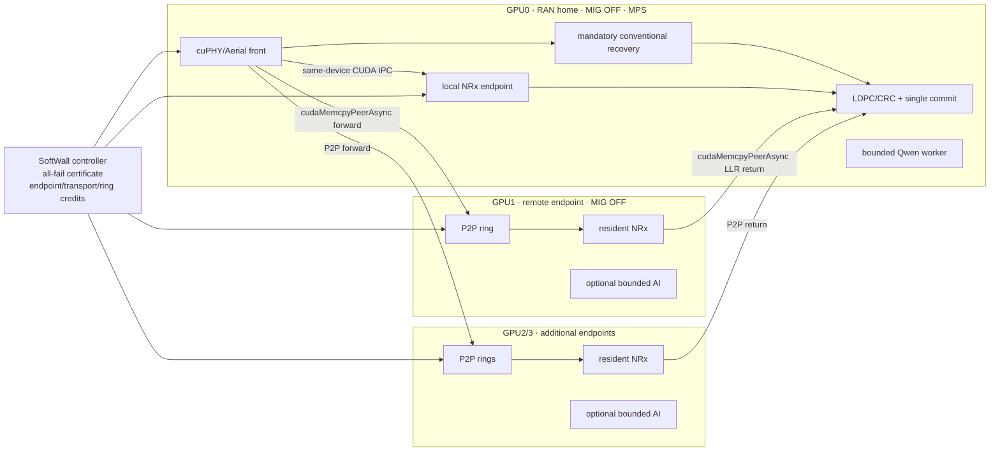

# SoftWall 멀티 GPU·모델링 고도화 로드맵

**상태:** 2026-09-24 C114--148와 envelope v16·four-point physical fault qualification 반영  
**현재 출발점:** C113 단일 GPU baseline + C114 local-IPC/remote-P2P 4셀 vertical slice  
**확장 원칙:** 멀티 GPU/P2P는 새 논문 주제가 아니라 conditional-recovery contract의
transport-independent 확장이다.

안전 정리, no-benefit 조건과 envelope의 정확한 기호·가정은
[형식 모델](SOFTWALL_FORMAL_MODEL_KO.md)을 따른다.

## 1. 결정

SoftWall의 현재 핵심은 유지한다.

> Optional NeuralRx가 만드는 같은 TB의 conventional recovery 의무를 executable
> all-fail certificate로 보존하고, 남는 자원만 bounded AI lease로 발급한다.

멀티 GPU 확장은 이 의무를 없애지 않는다. Conventional recovery와 최종 radio commit은
RAN home GPU에 남고, optional NeuralRx endpoint만 local CUDA IPC 또는 remote CUDA
P2P로 선택할 수 있게 한다. Remote NRx가 늦거나 실패해도 home GPU의 recovery
certificate는 독립적으로 실행 가능해야 한다.

현재 단일 GPU 결과를 폐기하거나 대체하지 않는다.

- **단일 GPU CUDA IPC:** 가장 강한 resource-consolidation 조건과 현재 논문의 기준점
- **멀티 GPU P2P:** endpoint queue·memory·interference 경계를 넓히는 scale-out 조건
- **향후 GDR:** P2P가 닿지 않는 GPU/node를 위한 transport adapter이며 필수 1차 범위는 아님

## 2. 왜 멀티 GPU가 필요한가

단일 GPU만으로도 conditional-recovery contract와 원자 transaction은 검증됐다. 하지만
다음 질문에는 답하지 못한다.

1. 한 GPU의 resident memory가 먼저 찰 때 NRx endpoint를 늘릴 수 있는가
2. 여러 셀의 NRx queue가 길어질 때 remote endpoint로 보내도 recovery guarantee가 유지되는가
3. local IPC와 remote P2P의 transport 차이를 같은 certificate가 흡수할 수 있는가
4. GPU 수가 늘어날 때 safe/useful/infeasible envelope를 모델이 예측하는가
5. Qwen과 NRx가 여러 GPU에서 경쟁할 때 accepted AI service와 radio utility를 함께 설명할 수 있는가

C84에서 8 receiver가 timed traffic 전 OOM이었으므로 memory scale은 이미 관측된 실제
경계다. 멀티 GPU는 단순 성능 향상이 아니라 이 경계를 확장하는 자연스러운 검증이다.

### 2.1 현재 스킴은 관측된 실패에서 도출됐다

각 메커니즘은 임의로 기능을 합친 결과가 아니라 실제로 확인한 실패를 막기 위해 들어갔다.

| 관측한 문제 | 근거 | 도입한 메커니즘 |
|---|---|---|
| MPS cap/priority만으로 deadline tail을 막지 못함 | C26, C46 | mode별 전체 경로 bound와 admission certificate |
| Optional NRx 실패 뒤 같은 TB의 conventional 작업이 필요함 | 자연/주입 failure 실험 | 요청별 mandatory recovery credit |
| 여러 셀이 함께 실패하면 복구가 한 구간에 몰림 | C76, C80 | multi-cell executable all-fail calendar |
| Credit을 먼저 이동하고 AI를 나중에 넣으면 중간 unsafe state가 생김 | runtime state analysis | multi-credit retiming과 AI lease의 atomic commit |
| RPC timeout이 GPU 완료를 뜻하지 않음 | C49/C81 계열 lifecycle 감사 | CUDA/IPC physical fence 전 credit 반환 금지 |
| 결과 관측이 늦으면 안전한 bound 자체를 침범함 | C99 | observe-first event ordering |
| 동일 mode처럼 보여도 GC/calendar/co-run이 tail을 바꿈 | C83, C89, C107c, C111 | `(topology, cap, lifecycle, workload)` 단위 qualification |
| 단일 GPU에서 receiver residency가 먼저 OOM | C84 | remote resident endpoint와 transport-aware memory envelope |
| 복구 credit을 실제로 교환해도 긴 Qwen unit은 못 들어감 | C113 | `W < B_eff <= W+Delta` 용량 필요조건, decision-time 조건과 bounded AI class |
| Global commit 적용 뒤 reply가 사라지면 재시도가 중복 AI를 만들 수 있음 | C127 fault model | ambiguous token quarantine, affected-home 신규 AI 차단, local RAN 지속 |
| Broker가 죽으면 GPU가 끝나도 동기 RPC가 recovery를 막을 수 있음 | C129 D155 실패 | prepare/commit/complete별 timeout과 전체 control budget의 admission 반영 |

따라서 설계 논리는 `문제 발견 -> 필요한 불변식 -> 최소 메커니즘 -> 물리 gate` 순서로
설명할 수 있다. 이 인과관계가 단순한 MPS/P2P/EDF 기능 조합과 구별되는 핵심이다.

## 3. 목표 구조



첫 통합에서는 Qwen을 GPU0에 그대로 둔다. 이 구성은 C113과 직접 비교할 수 있고,
remote NRx가 home-GPU interference와 endpoint capacity에 주는 영향만 분리한다. 그 뒤
remote GPU에 Qwen을 추가해 endpoint-local AI lease를 검증한다.

## 4. 데이터 경로

### 4.1 Local endpoint

현재 경로를 그대로 사용한다.

```text
cuPHY/Aerial process
  -> GPU0 IPC forward buffer
  -> persistent NRx MPS process
  -> GPU0 IPC backward buffer
  -> de-rate-match/LDPC/CRC
```

Payload는 CPU DRAM을 경유하지 않는다. Host shared-memory sequence는 control doorbell이다.

### 4.2 Remote endpoint v1

최소 구현은 persistent remote endpoint process가 GPU0과 GPUe를 모두 보고 다음 순서로
동작하게 한다.

```text
GPU0 IPC-mapped source ring
  -> cudaMemcpyPeerAsync(GPU0 -> GPUe)
  -> GPUe resident TensorRT NRx
  -> cudaMemcpyPeerAsync(GPUe -> GPU0)
  -> GPU0 backward ring
```

Ring depth는 먼저 1로 제한한다. 각 slot은 forward copy, NRx graph, backward copy와
completion generation이 모두 확인되기 전에는 재사용하지 않는다. Cross-process IPC
mapping과 P2P가 이 구성에서 실제로 가능한지는 Gate 1에서 별도로 검증한다. 기존의
single-process MIG P2P 수치를 이 경로의 결과로 재사용하지 않는다.

### 4.3 장기 data-plane 정리

- same device/process boundary: CUDA IPC
- peer-accessible GPU pair: CUDA IPC handle + P2P copy
- P2P 불가능 GPU/node: registered GPUDirect RDMA
- 호환성 대조군: pinned-host staging

P2P/GDR/IPC는 기여 자체가 아니라 같은 endpoint contract의 transport 구현이다.

## 5. 멀티 GPU 서비스 모델

Mode `m`은 최소 다음을 함께 고정한다.

```text
m = {GPU topology, MPS caps/priorities, cell count,
     endpoint placement, transport, ring depth,
     tensor class, AI class, lifecycle state}
```

Endpoint `e`의 한 요청에 대한 전체 상한 후보는 다음처럼 분해한다.

```text
B_e(k) = B_front(k)
       + B_fwd(e,k)
       + B_queue(e,k)
       + B_NRx(e,k)
       + B_bwd(e,k)
       + B_back(k)
       + G_e
```

`G_e`에는 host polling, event visibility, prediction error와 commit guard를 포함한다.
현재 same-GPU 구현에서 `forward_ns/backward_ns=0`으로 둔 profile은 45 ms 전체 NRx
host-path bound 안에 비용을 포함한 축약 표현이다. 멀티 GPU 모델에서는 전송 비용을
반드시 별도 항으로 측정한다.

Endpoint 예상 완료는 다음과 같다.

```text
F_e(i) = max(now, V_e)
       + B_fwd(e,k_i)
       + B_NRx(e,k_i)
       + B_bwd(e,k_i)
       + B_back(k_i)
       + G_e
```

`F_e(i) <= fallback_cutoff_i`인 endpoint만 optional NRx 후보가 된다. 어떤 endpoint를
선택해도 conventional recovery credit은 NRx 결과가 물리적으로 보이고 single commit이
성공할 때까지 home GPU에 남는다.

## 6. 원자 transaction의 확장

멀티 GPU에서는 한 결정이 다음 credit을 함께 다룬다.

1. GPU0 conventional recovery interval
2. endpoint queue credit
3. forward/backward P2P ring slot
4. remote NRx execution generation
5. GPU0 또는 remote GPU의 bounded AI lease

Control-plane commit은 다음 순서를 따른다.

1. 필요한 endpoint와 ring을 tentative hold한다.
2. 모든 live recovery interval로 all-fail certificate를 다시 검사한다.
3. AI unit이 들어갈 경우 해당 GPU의 horizon과 physical credit을 검사한다.
4. 모든 generation이 일치할 때 하나의 transaction generation을 공개한다.
5. launch/copy 실패가 나면 recovery credit은 그대로 유지하고 새 admission을 닫는다.
6. 이미 시작한 copy/kernel의 credit은 각 GPU의 completion fence 전에는 반환하지 않는다.

GPU 하드웨어에 분산 transaction을 요구하는 것이 아니다. Controller의 reservation state를
원자적으로 바꾸고, 실제 GPU 동작은 fence가 확인될 때까지 보수적으로 점유하는 방식이다.

## 7. 모델링 기여로 완성할 정리

### 7.1 Safety theorem

Mode별 실제 front/transport/NRx/back/AI 시간이 선언 bound 안이고, 미완료 credit을 fence
전에 재사용하지 않으면 local/remote endpoint 선택과 무관하게 모든 허용 all-fail 분기에서
수락된 RAN 요청의 commit은 expiry 전에 완료된다.

### 7.2 Conditional-slack theorem

동일 deadline·단일 recovery lane의 `n`개 요청에서 `m`개 복구 의무만 남으면 tail
compaction으로 회수 가능한 최대 prefix는 `(n-m)B_conv`다. AI unit이 이 회수 때문에만
추가 허가의 용량상 필요조건은 기존 slack `W`에 대해
`W < B_eff <= W+Delta`다. 이 식은 실행 가능한 시작시각을 보장하지 않는다.

멀티 home에서는 system 전체 cell 수를 쓰지 않는다. Home `h`에서 요청 수가 `n_h`, 실제
optional NRx 수락 수가 `k_h`일 때 conditional release는 executor phase에 따라
`max(0,k_h-1)B_conv,h` 또는 `min(k_h,n_h-1)B_conv,h`다. 전자는 rejected recovery를
exchange 전에 실행하는 mode, 후자는 rejected recovery가 live인 mode다. V4의
global-admission 식은 `[0,1]` 비대칭 수락에서 QSN을 QSU로 바꾸는 반례가 있어 폐기했다.

Observe-all controller에서는 admitted NRx의 가장 늦은 bound에 exchange 전에 실제 실행한
recovery만 더해 `T_dec,h`를 계산한다. Exchange 때 남은 obligation이 `m_h`개이면
`H_m,h=D_h-guard_h-m_h B_conv,h`이고, `B_eff<=H_m,h-T_dec,h`까지 만족해야 한다.
Synchronous V13에서는 `B_eff=B_AI+N_rpc B_rpc+g_AI`로 broker control과 AI completion
guard를 모두 청구한다. `T_sock`은 fault detection을 위한 socket timeout이고 `B_rpc`는 admission에서
차감하는 controller-return wall bound다. 둘을 같은 값으로 간주하지 않는다. V10은 ring
depth와 phase를 잘못 추상화해 후보 0을 얻었고, V11은 endpoint별 finite ring credit과
executor phase를 반영했다. V12는 completion guard를 반영했지만 `T_sock=B_rpc=5 ms`로
둔 오류가 C138에서 반증됐다. V13 synchronous 계약은 `T_sock=5 ms`, `B_rpc=7 ms`, `N_rpc=3`,
`g_AI=2 ms`다. 따라서 AI40은 `63 ms`로 58 ms window를 넘고, AI35만
`35+21+2=58 ms`로 조건부 경계에 들어간다.

현재 V16-qualified V15 runtime은 `prepare/abort/complete`를 별도 control worker로 옮기고,
launch-time revalidation 뒤의 동기 `commit`만 critical path에 둔다. 이 mode에서는

```text
B_eff = B_AI + B_commit + g_AI
```

이며 `AI45+commit7+guard2=54 ms`가 static slack53 밖, conditional window58 안에
들어간다. Deferred operation의 지연은 certificate를 막지 않지만 ambiguity는 token
quarantine과 신규 global-AI 차단으로 처리한다.

현재 동기 batch의 endpoint admission은 job-independent endpoint bound와 finite ring이 만드는 완료 slot과
job cutoff의 matching으로 쓸 수 있다. Deadline 순서로 가장 이른 미사용 slot을 배정하는
checker는 이 제한된 모델에서 maximum-cardinality이며, 별도 exact oracle이 현재 39개
endpoint pool과 10,920개 bounded 상태에서 차이 0으로 구현을 감사했다.

### 7.3 Transport choice boundary

Remote endpoint는 다음 두 조건을 모두 만족할 때만 유용하다.

```text
B_fwd + B_remote_queue + B_remote_NRx + B_bwd + B_back + guard
    <= fallback budget

local queue/interference cost - remote queue cost
    > remote transport cost
```

첫 식은 안전한 eligibility이고, 둘째 식은 remote path를 선택할 성능상 이유다. 이를
사전 예측하고 실제 경계에서 검증한다.

### 7.4 AI service contract

RAN은 all-fail robust guarantee를 갖고, AI는 다음 두 등급으로 구분한다.

- admitted unit: bound 안에서 자신의 deadline과 recovery horizon을 만족
- offered request: admission 전에는 완료 보장 없음; reject/expire를 모두 보고

Global broker fail-stop을 허용하는 mode의 admitted unit은 physical AI bound만으로 판정하지
않는다. Synchronous reference는 recovery horizon `H`에 대해 다음 전체 경로를 청구한다.

```text
now + B_prepare + B_commit + B_AI + B_complete + G_physical <= H
```

Pipelined V15는 prepared token을 launch 직전에 다시 검사하고 다음 경로만 동기적으로 청구한다.

```text
t_launch + B_commit + B_AI + G_physical <= H
```

Prepare/abort/complete는 RAN executor와 독립이며, complete ACK 전 global token은 재사용하지
않는다.

추후 Qwen request를 KV-cache 기반 bounded prefill chunk로 나눌 경우 chunking 자체를
novelty로 주장하지 않는다. 용량 기하와 decision-time 조건을 모두 만족하는 service
class가 있을 때 조건부 GPU supply를 실제 요청이 소비하게 하는 실행 메커니즘으로 사용한다.

## 8. 실험 gate

| Gate | 질문 | 구현/실험 | 통과 기준 |
|---|---|---|---|
| **G0 topology** | 이 node에서 full-GPU P2P가 가능한가 | GPU inventory, NVLink topology, peer matrix | **완료:** A100 4장, 모든 pair NV4, 양방향 peer access 1 |
| **G1 transport correctness** | 별도 process에서 실제 SoftWall payload가 왕복하는가 | **완료:** P2P와 pinned-host staging 각 10,000회 | 양쪽 오류0; P2P round-trip p50/p99 213.122/248.530us, staging 349.265/377.730us |
| **G2 path qualification** | remote 전체 경로 bound가 있는가 | **완료:** isolated actual NRx 1,000/1,000; C117 2 ms home 후보 실패 뒤 C118 독립 재자격 | exact warm co-run mode에서 front/back3 ms, P2P250/100 us, remote NRx2.5 ms, worker6 ms, end-to-end25 ms 통과 |
| **G3 one-remote integration** | recovery와 remote completion lifecycle이 연결되는가 | **완료:** GPU0 4셀+local NRx+Qwen, GPU1 remote NRx, 두 seed | 각 340 release, atomic exchange 85회, 모든 관측 safety gate 통과 |
| **G4 heterogeneous pool** | local IPC와 remote P2P를 같은 controller가 다루는가 | **완료:** C116 local1+remote2; C119/C120 local1+remote3 | 4 physical GPU·4 endpoint의 네 formal arm에서 사용/count/safety 통과; fine component vector는 실패 |
| **G5 multi-GPU envelope** | 모델이 scale·service 경계를 예측하는가 | **v1--v16 완료:** finite ring, sharded home, executor/control fault, launch-time revalidation, single-token ownership, four-point physical coverage, exact oracle | V14/V15 historical row UQ; V16 QSU6/QSN0/MI3/UQ13; fault16/20+ownership4/8 model 위반0; C145--C148 PASS |
| **G6 remote AI** | NRx와 Qwen이 remote GPU에서도 공존 가능한가 | remote endpoint별 MPS NRx+Qwen, bounded lease | RAN safety 유지; admitted-AI deadline 위반 0 |
| **G7 production timing** | synthetic D155를 실제 DU 계약으로 바꿀 수 있는가 | **validator 준비 완료:** IQ-ready→PHY→FAPI/MAC consumption 동일 clock, provenance·expiry·capacity gate | 실제 `d_MAC` trace가 없어 현재 UQ |
| **G8 generalization** | 한 node의 특수 결과가 아닌가 | **same-family 완료:** V16 fault matrix를 C145--C148의 네 새 node에서 검증 | operation별 fault arm2·15,360 TB·AI45 exchange12·post-fault10,125·max token1; cross-family·production은 미완료 |

C114로 local 1개+remote 1개 vertical slice, C116으로 local 1개+remote 2개 heterogeneous
pool을 구현했고, C119/C120은 네 physical GPU의 local 1개+remote 3개까지 lifecycle을
확장했다. C117--120은 topology별 component-bound 실패와 재자격 경계를 제공한다.
C121/C122는 각각 `[4,4]` 8셀과 `[3,3,3,3]` 12셀의 disjoint recovery home을 동기
실행해 Lemma 1b의 합성과 receiver-memory scale-out을 검증했다. C123은 global AI request
ownership을 local certificate와 합성했다. C124가 4-cell/home conv12를 반증했고, C125가
certificate를 따르지 않는 executor ordering 반례를 만들었으며, C126의 conv25
certificate-ordered executor는 8 arm에서 safety gate를 통과했다. C127은 post-apply
commit reply loss를 home 0의 AI admission 경계에 격리하고 두 RAN home과 home 1 AI를
계속 실행했다. C128--132는 broker process crash에서 synchronous control path도
certificate 자원임을 보였다. C132는 세 RPC의 15 ms와 physical guard 2 ms를 admission에
반영해 두 home의 RAN을 계속했다. C133은 post-prepare와 post-complete까지 두 arm씩
추가해 C132와 함께
prepare/commit/complete 각 두 arm을 완성했다. Shared NRx/recovery는
여전히 non-separable multi-resource certificate가 필요하다. G7 전에는 production
hard-real-time을 주장하지 않는다.
C134는 source와 contract를 바꾸지 않고 새 allocation의 다른 A100 node에서 같은 세
fault point를 각각 두 arm으로 재자격했다. 추가 16,320 TB의 safety 위반은 0이었다.
따라서 G8은 same-family node 수준에서 부분 완료됐고 cross-family와 production mode는 남는다.
C136은 같은 conditional AI40 mechanism을 세 번째 독립 allocation의 `nid002817`에서 6개
새 arm으로 재자격했다. C135와 합친 두-node mechanism 결과는 10,240 TB와 38개 목표
exchange에서 위반 0이다. 다만 node 표본은 2개이므로 G8의 cross-family/general population
gate는 계속 미완료다.
C137은 telemetry가 켜진 정상 mode에서 broker RPC 5,993회가 모두 5 ms 안에 반환됨을
확인했다. C138은 faulting call까지 재어 5 ms wall-bound 가정을 즉시 반증했다. 첫 arm에서
prepare/complete가 5.205092/5.830741 ms였고 safety는 유지됐으나 campaign은 사전 규칙대로
중단했다. C139는 다른 새 node에서 socket timeout 5 ms와 admission bound 7 ms를 분리한
세 fault point×두 arm을 실행했다. 2,020 RPC의 최대는 5.653235 ms, 7 ms 초과와 safety
위반은 0이었다. C140은 같은 node의 두 arm에서 corrected AI35 exchange를 8회 실행했다.
C141은 이전 node를 제외한 `nid001372`에서 같은 corrected contract를 재자격했다. Control
fault 6 arm·16,320 TB·RPC2,010회와 AI35 두 arm·2,560 TB·exchange7이 모두 통과했다.
두 corrected node의 결합 결과는 control 12 arm·32,640 TB·RPC4,030회, AI35 4 arm·5,120 TB·
exchange15이며 7 ms 초과와 선언 safety 위반은 0이다.
C142는 새 `nid001361`에서 V14 AI45를 두 arm·2,560 TB·exchange9로 물리화했다. C143의
세 control point×두 arm은 16,320 TB와 fault 뒤14,184 TB에서 safety·duplicate 위반0이었다.
Commit 340회는 최대5.148988 ms로 7 ms 안이었고 deferred RPC 1,584회 중 50회가 7 ms를
넘어 두 경로의 분리를 실제로 자극했다. C144는 과거 node를 제외한 `nid002049`에서 AI45
한 arm과 prepare/commit/complete 한 arm씩을 재자격했다. 두 V14 node 합계는 AI45
exchange11, fault9 arm·21,120 TB·post-fault17,914 TB이며 선언 위반0이다. 이는 same-family
finite-sample timing/fault 결과다. 후속 two-request 회귀는 retained staged token 뒤 두 번째
prepare가 untracked held token 1개를 만들 수 있음을 재현해 V14 mode를 UQ로 내렸다.
V15는 staged/offered token 뒤 prepare를 금지한다. C145/C146 두 새 node는 정상 AI45와
세 fault point를 각 한 arm씩 실행해 12,160 TB·exchange12·post-fault7,463·prepare 억제537,
maximum unlaunched token1과 선언 위반0을 얻었다. Production `d_MAC`, WCET, cross-family
gate는 남는다. V16은 C147/C148 두 추가 node의 abort post-apply arm을 더해
prepare/abort/commit/complete마다 두 물리 arm을 갖는다. 결합 radio15,360,
post-fault10,125, prepare 억제666회와 위반0이다.

## 9. 비교군

모든 비교군은 같은 GPU 수, radio input, endpoint engine, AI trace와 fault pattern을 쓴다.

| 비교군 | 목적 |
|---|---|
| Single-GPU local IPC SoftWall | 현재 기준점과 consolidation 비용 |
| Multi-GPU static placement | 셀/endpoint를 고정 배치한 단순 scale-out |
| Queue-aware P2P | deadline 가능한 가장 짧은 endpoint를 고르되 conditional recovery/AI exchange 없음 |
| Multi-GPU safe work-conserving | 같은 all-fail 안전장치와 단순 빈 구간 회수 |
| Multi-GPU SoftWall | transport/ring/endpoint/recovery/AI credit의 공동 transaction |
| Offline oracle | 미래 NRx outcome과 AI arrival을 아는 상한 |
| Host-staging transport | P2P 효과를 분리하는 data-plane 대조군 |

GPU를 더 준 시스템이 단일 GPU보다 빠르다는 결과는 기여가 아니다. 핵심 비교는 같은
멀티 GPU 예산에서 static/queue-aware/work-conserving/SoftWall의 safety와 utility다.

## 10. 측정 지표

### Safety

- RAN deadline miss와 commit-return 시간
- front/fwd/NRx/bwd/back 및 AI bound 위반
- correlated all-fail coverage
- stale/duplicate/wrong-generation/single-commit 위반
- fence 전 ring·endpoint·AI lease 재사용
- model false-safe 수

### Radio와 endpoint utility

- timely correct TB와 conventional 대비 추가 correct TB
- NRx admission/reject/late/fallback 비율
- endpoint별 queue, busy time, ring occupancy
- local/remote 선택과 transport 비용

### External AI

- offered/admitted/timely/rejected/expired request
- timely token value와 request SLO
- GPU별 Qwen residency와 memory pressure
- static/work-conserving/SoftWall paired 차이와 CI

### Cost

- GPU 수와 평균/peak GPU memory
- NVLink bytes와 copy-engine/HBM interference
- controller overhead와 transaction abort
- 사용되지 않은 reserved recovery/transport credit

## 11. 정확한 차별점

기존 연구와 겹치지 않는다고 방어할 대상은 P2P, MPS, fallback 또는 deadline-aware
routing 각각이 아니다. 공개된 가장 가까운 연구와 구별되는 좁은 대상은 다음이다.

> A transport-independent runtime for AI-RAN that preserves an executable
> multi-cell all-fail recovery schedule for optional per-TB neural processing,
> and atomically coordinates home-GPU recovery credits, local/remote endpoint
> and transport credits, and bounded external-AI leases until physical
> completion; across sharded homes, it serializes global AI-request ownership
> with local certificates, executes ready recovery work in certificate order,
> and quarantines ambiguous global-AI commits without propagating the fault to
> local RAN recovery; for broker fail-stop modes, it bounds and admission-charges
> the complete prepare/commit/complete control path before granting AI work.

- YinYangRAN류와 달리 자원 비율이 아니라 결과 전까지 남는 same-TB recovery debt를 모델링한다.
- CloudRIC류와 달리 이미 도착한 독립 PHY task의 accelerator 선택이 아니라 optional branch가
  미래 mandatory demand를 조건부로 만든다.
- ARCHES류와 달리 AI/conventional expert 선택 뒤의 동시 실패 복구 실행시간과 외부 AI lease를 다룬다.
- OCUDU와 달리 공개 범위에서 보이지 않는 multi-cell all-fail calendar와 background-AI
  compute lease의 원자 교환을 평가한다.
- DARIS/일반 GPU scheduler와 달리 높은 우선순위 job만 보호하는 것이 아니라 radio outcome이
  미래 작업 집합을 바꾸는 dependency를 endpoint/transport lifecycle까지 연결한다.

이 차이는 현재 선행 연구 감사에서 확인한 공개 본문 범위에 대한 판단이다. 제출 직전 최신
논문을 다시 감사하고, primary-backup·real-time GPU scheduling 문헌도 함께 비교한다.

## 12. 가장 큰 우려와 대응

| 우려 | 잘못된 해석 | 대응 |
|---|---|---|
| C113 추가 처리량 우위 없음 | SoftWall이 항상 더 빠르다 | no-benefit 조건을 모델로 설명하고 사전 예측 경계를 검증 |
| GPU 추가 효과 | P2P를 쓰니 성능이 향상됐다 | 같은 GPU 수의 static/queue-aware/safe baseline과 비교 |
| P2P가 home GPU와 독립 | remote이므로 간섭이 없다 | copy engine, HBM, source context 영향을 mode bound에 포함 |
| Cross-process P2P | 기존 single-process 수치를 그대로 사용 | G1을 새로 실행하고 실패 결과도 보존 |
| 분산 atomicity | 여러 GPU kernel을 실제로 원자 실행 | reservation-state atomic commit + fence-until-retire로 정확히 표현 |
| Certificate만 있으면 충분 | 계산된 calendar가 실제 순서와 무관하게 안전 | C125 반례와 certificate-ordered executor를 함께 제시 |
| Global broker 성능 | 동적 routing이 처리량을 높인다 | C124/C126 outcome 실패를 보존하고 ownership correctness만 주장 |
| Global broker fault | reply 유실 요청을 즉시 재할당하면 복구된다 | C127처럼 ambiguous token을 재시도하지 않고 해당 home AI만 fail-closed; durable reconciliation은 미해결로 표시 |
| Broker fail-stop timeout | client를 fail-closed하면 recovery도 자동으로 안전 | C129 반례처럼 blocking RPC가 deadline을 넘길 수 있으므로 세 RPC bound 전체를 admission에 반영 |
| MPS guarantee | cap 합으로 deadline이 보장된다 | MPS는 concurrency mechanism, safety는 certificate와 qualified bound |
| Qwen 보장 | trace의 모든 request를 완료 | admitted-unit guarantee와 offered-load 결과를 분리 |
| Hard real-time | 표본 최대가 WCET다 | 통계적 mode qualification과 production bound를 구분 |
| AI-RAN 일반성 | synthetic channel/P180-D155가 실제 DU다 | 실제 `d_MAC`, channel/model 일반화 gate 유지 |
| 시스템 복잡도 | atomic exchange가 꼭 필요하다 | work-conserving baseline과 동일하면 조건과 비용을 정직하게 보고 |

## 13. 실행 우선순위와 중단 기준

1. **모델 먼저:** resource graph, safety theorem, conditional-slack/no-benefit/transport
   boundary를 문서와 checker로 고정한다.
2. **C114 완료:** G1a cross-process P2P, G2a actual remote NRx, G3 one-remote vertical slice.
3. **C115 완료:** 같은 2-GPU 예산의 10-arm ABBA는 safety/parity를 통과했지만
   SoftWall 추가 효과 +0.080%/+0.138%, 두 CI 0 포함으로 처리량 outcome은 실패했다.
4. **C117/C118 G2b 완료:** 2 ms home 후보 실패를 보존하고 3 ms 및 remote component vector를 새 seed로 재자격했다.
5. **C116 G4 완료:** 2-endpoint 가정을 제거하고 local 1+remote 2를 두 seed에서 검증했다.
6. **C119/C120 4-GPU 완료/경계:** 네 endpoint lifecycle은 통과했으나 eager loading OOM과 fine component gate 실패를 보존한다.
7. **G5 v15와 C121--146 완료:** C124가 2-home conv12를 UQ로 내렸고 C126 conv25
   certificate executor를 QSU로 올렸다. C127은 broker fault class와 ambiguity policy를
   mode 축에 추가했다. C129는 unbounded control RPC, C131은 2-RPC 부분 예산을 UQ로
   분류했고, C132--134의 3-RPC 완전 예산, 세 control point fault matrix와 독립 node 재자격을 QSU로
   자격화했다. V5는 home-local slack, V6는 observe-all 결정시각, V7은 finite ring과
   executor phase를 반영했다. Exact oracle은 10,920개 bounded 상태에서 cardinality 차이
   0을 확인했다. V12의 57 ms AI40 transaction은 C135/C136에서 물리 실행됐지만 C138이
   control wall-bound 가정을 반증해 timing mode를 UQ로 내렸다. V13은 full control을
   21 ms로 교정하고 AI35 transaction 58 ms를 예측했다. C139의 6개 fault arm과 C140의
   8개 conditional exchange가 이 수정 사슬을 통과했다. 4-home×12의 exact 3-cell/home
   mode는 유지한다. V14는 deferred control을 분리하고 commit7만 청구해 AI45 transaction
   54 ms를 예측했지만 two-request ownership 반례로 UQ가 됐다. V15는 single-token
   ownership을 추가했고 C145/C146 두 node에서 AI45와 fault/retained-token branch를 검증했다.
   V16은 C147/C148 abort fault holdout을 추가하고 V15 three-point row를 UQ로 내렸다.
8. **제한된 shared-AI 단계 완료:** C123 global broker는 request uniqueness와 local
   certificate 합성을 통과했다. C126 routing 처리량 우위와 strict radio parity는 실패했다.
   C127은 두 독립 arm에서 post-apply reply loss를 격리해 5,440 TB와 다른 home의 AI를
   계속 실행했다.
9. **Bounded broker fail-stop 완료:** C132/C133 첫 node와 C134 독립 node의 각 여섯 arm은 합계 32,640 TB에서 모든 safety 위반 0이었다. 보장 범위는 volatile fail-stop이며 restart는
   포함하지 않는다.
10. **V17 shared-recovery model, V17.1 GPU semantics와 repeated actual-NRx integration 완료:** 여러 home의 mandatory recovery와
    shared AI blackout을 한 global executable calendar로 검사한다. Equal grid 25개에서
    local-safe/global-unsafe 반례 10개, capacity 1/2의 variable timing/blackout 3,400개에서 독립 oracle
    불일치0을 얻었다. C151/C152는 두 A100 node에서 GPU0/1 home→GPU2 persistent cuPHY
    worker의 P2P request 1,000건을 decode/order/lifecycle 오류0으로 실행했다. C153은 global
    certificate placement가 Qwen35 fence와 두 recovery를 D155 안에 직접 구동하는 10/10
    development gate를 통과했다. C154/C155는 네 controlled branch를 서로 다른 두 node에서
    반대 순서와 독립 seed로 실행해 여덟 arm, global reject4, Qwen4, recovery20, correct
    home commit20, miss0을 재현했다. C156은 fixed lease가 launch control 시간을 누락한
    반례를 찾고, 실제 decision 시각의 `control5+AI35` blackout으로 교정했다. Nsight
    C156/C156b 두-node arm은 Qwen kernel2,448, recovery kernel212, 미귀속 event0,
    금지 overlap0 ns와 commit4/4·miss0을 통과했다. C157A/C157B는 두 node에서 실제
    TensorRT NRx CRC가 credit을 전이해 actual success4, Qwen2, shared recovery4,
    single commit8과 miss0을 기록했다. C158은 persistent mmap control과 byte-exact
    input/output fence를 포함해 두 node·2,000 actual-NRx request, recovery560, Qwen500,
    commit2,000과 safety/fence violation0을 기록했다. C159-Q1은 pre-staged GPU bank와
    whole-path recovery preflight로 P180 context-64 mode를 두 새 node에서 actual NRx2,000,
    recovery582, Qwen500, commit2,000, 위반0으로 통과했다. C159-Q2는 여섯 context class,
    actual NRx4,800, recovery1,312, Qwen1,077, commit4,800을 두 node에서 위반0으로 통과했다.
    Q3 empirical oracle은 strong Event-driven과 SoftWall이 385,262 token으로 같아 성능 holdout을
    중단했다. 다음 단계는 integrated correlated-failure와 envelope gate다.
11. **G8 same-family 완료:** V16 four-point matrix를 C145--C148의 서로 다른 새 A100
    node 네 곳에서 재현했다. 다음 일반화 gate는 실제 DU timing, deterministic/probabilistic
    control bound, cross-family 또는 production mode 재자격이다.

다음 경우에는 범위를 축소한다.

- Cross-process P2P가 안정적으로 성립하지 않으면 single-process transport agent 또는 GDR
  adapter로 바꾸고 실패를 topology/process envelope로 기록한다.
- Remote 전체 경로가 fallback cutoff 안에 들어오지 않으면 remote NRx를 실시간 endpoint로
  주장하지 않는다.
- 모델이 safe로 판정한 점에서 물리 violation이 한 번이라도 나오면 해당 mode를
  unqualified로 내리고 bound/model을 수정한 새 protocol로 처음부터 검증한다.
- Strong safe baseline과 utility 차이가 없으면 성능 우위 주장은 추가하지 않고 transport-
  independent correctness와 feasibility boundary만 남긴다.

## 14. 현재 C114 증거

2026-09-24 job 58815435, node `nid001016`에서 다음을 확인했다.

- NVIDIA A100-SXM4-40GB 4장
- 모든 GPU pair가 `NV4`
- `cudaDeviceCanAccessPeer` 4×4 matrix의 모든 방향이 1
- Cross-process P2P payload 10,000회 integrity·sequence·lifecycle 오류 0
- 실제 GPU1 TensorRT NeuralRx 1,000/1,000 correct, 8 ms miss 0
- Local IPC 1개+remote P2P 1개, 4셀·Qwen·혼합 failure의 두 arm 모두 safety gate 통과
- 이 결과는 한 node의 유한 표본이며 WCET·production timing·처리량 우월성은 아님

권위 artifact:

- [G0 topology 판정](../../results/softwall_multigpu/GATE0_TOPOLOGY_KO.md)
- [GPU inventory](../../results/softwall_multigpu/gpu_inventory_job58815435.csv)
- [NVIDIA topology](../../results/softwall_multigpu/topology_job58815435.txt)
- [peer-access gate](../../results/softwall_multigpu/topology_peer_gate_job58815435.json)
- [C114 결과 설명](SOFTWALL_CONFIRM114_MULTIGPU_RESULT_KO.md)
- [C114 aggregate gate](../../results/softwall_multigpu/confirm114_multigpu_gates_job58815435.json)
- [C114 artifact manifest](../../results/softwall_multigpu/confirm114_artifact_manifest.json)
- [C115 같은 예산 baseline](SOFTWALL_CONFIRM115_MULTIGPU_BASELINE_RESULT_KO.md)
- [C115 formal 결과](../../results/softwall_multigpu/confirm115_multigpu_strong_baselines_job58815435.json)
- [P2P 대 host-staging transport](../../results/softwall_multigpu/g1_transport_comparison_job58815435.json)
- [C116 three-endpoint 결과](SOFTWALL_CONFIRM116_THREE_ENDPOINT_RESULT_KO.md)
- [C116 aggregate gate](../../results/softwall_multigpu/confirm116_three_endpoint_gates_job58815435.json)
- [C117 component-bound 실패 경계](SOFTWALL_CONFIRM117_COMPONENT_BOUND_RESULT_KO.md)
- [C118 component-bound 재자격](SOFTWALL_CONFIRM118_COMPONENT_REQUALIFICATION_RESULT_KO.md)
- [C119/C120 4-GPU 결과](SOFTWALL_CONFIRM119_120_FOUR_GPU_RESULT_KO.md)
- [Endpoint-only envelope v1](SOFTWALL_ENDPOINT_OFFLOAD_ENVELOPE_RESULT_KO.md)
- [C127 broker fault containment](SOFTWALL_CONFIRM127_BROKER_FAULT_RESULT_KO.md)
- [C128--132 broker fail-stop/control-budget](SOFTWALL_CONFIRM128_132_BROKER_CRASH_RESULT_KO.md)
- [C128--133 full control-point fault matrix](SOFTWALL_CONFIRM128_133_CONTROL_FAULT_RESULT_KO.md)
- [Sharded-home envelope v7](../../results/softwall_multigpu/softwall_sharded_home_envelope_prediction_v7.json)
- [C134 독립 node 결과](SOFTWALL_CONFIRM134_INDEPENDENT_NODE_RESULT_KO.md)
- [Sharded-home envelope v8](../../results/softwall_multigpu/softwall_sharded_home_envelope_prediction_v8.json)
- [Sharded-home envelope v10](../../results/softwall_multigpu/softwall_sharded_home_envelope_prediction_v10.json)
- [V10 validation summary](../../results/softwall_multigpu/softwall_envelope_v10_validation_summary.json)
- [Exact endpoint oracle 감사](../../results/softwall_multigpu/softwall_endpoint_admission_exact_oracle_audit_v1.json)
- [Sharded-home envelope v11](../../results/softwall_multigpu/softwall_sharded_home_envelope_prediction_v11.json)
- [Sharded-home envelope v12](../../results/softwall_multigpu/softwall_sharded_home_envelope_prediction_v12.json)
- [V12 validation summary](../../results/softwall_multigpu/softwall_envelope_v12_validation_summary.json)
- [V12 artifact manifest](../../results/softwall_multigpu/softwall_sharded_home_envelope_manifest_v12.json)
- [V11 validation summary](../../results/softwall_multigpu/softwall_envelope_v11_validation_summary.json)
- [V11 artifact manifest](../../results/softwall_multigpu/softwall_sharded_home_envelope_manifest_v11.json)
- [V10→V11 ring/phase regression](../../results/softwall_multigpu/softwall_envelope_v10_v11_ring_phase_regression_v1.json)
- [V11→V12 guard regression](../../results/softwall_multigpu/softwall_envelope_v11_v12_ai_guard_regression_v1.json)
- [C135 static counterfactual](../../results/softwall_multigpu/confirm135_static_counterfactual_audit_v1.json)
- [Exact finite-ring oracle](../../results/softwall_multigpu/softwall_endpoint_admission_exact_oracle_audit_v3.json)
- [C135 V11 AI40 결과](SOFTWALL_CONFIRM135_V11_AI40_RESULT_KO.md)
- [C136 V12 독립 node 결과](SOFTWALL_CONFIRM136_V12_REQUALIFICATION_RESULT_KO.md)
- [C135/C136 combined audit](../../results/softwall_multigpu/confirm135_136_combined_v12_qualification.json)
- [C137 service-bound telemetry](SOFTWALL_CONFIRM137_SERVICE_BOUND_TELEMETRY_RESULT_KO.md)
- [Service-bound qualification v2](../../results/softwall_multigpu/softwall_service_bound_qualification_v2.json)
- [C137 artifact manifest](../../results/softwall_multigpu/confirm137_artifact_manifest.json)
- [Service-bound v2 manifest](../../results/softwall_multigpu/softwall_service_bound_v2_manifest.json)
- [V12 cross-node validation summary](../../results/softwall_multigpu/softwall_envelope_v12_cross_node_validation_summary.json)
- [V12 cross-node manifest](../../results/softwall_multigpu/softwall_envelope_v12_cross_node_manifest.json)
- [C138--C140 control-bound correction](SOFTWALL_CONFIRM138_140_CONTROL_BOUND_CORRECTION_KO.md)
- [Sharded-home envelope v13](../../results/softwall_multigpu/softwall_sharded_home_envelope_prediction_v13.json)
- [V13 validation summary](../../results/softwall_multigpu/softwall_envelope_v13_validation_summary.json)
- [V12→V13 control-bound regression](../../results/softwall_multigpu/softwall_envelope_v12_v13_control_bound_regression_v1.json)
- [Service-bound qualification v3](../../results/softwall_multigpu/softwall_service_bound_qualification_v3.json)
- [V13 corrected-control manifest](../../results/softwall_multigpu/softwall_v13_corrected_control_manifest.json)
- [C141 corrected V13 독립-node 재자격](SOFTWALL_CONFIRM141_V13_INDEPENDENT_RESULT_KO.md)
- [Service-bound qualification v4](../../results/softwall_multigpu/softwall_service_bound_qualification_v4.json)
- [V13 cross-node manifest](../../results/softwall_multigpu/softwall_v13_cross_node_manifest.json)
- [V14 pipelined-control 설계](SOFTWALL_PIPELINED_CONTROL_DESIGN_KO.md)
- [C142--C144 V14 결과](SOFTWALL_CONFIRM142_144_V14_PIPELINED_RESULT_KO.md)
- [V14 envelope](../../results/softwall_multigpu/softwall_sharded_home_envelope_prediction_v14.json)
- [V14 validation](../../results/softwall_multigpu/softwall_envelope_v14_validation_summary.json)
- [Pipelined-control finite model](../../results/softwall_multigpu/softwall_pipelined_control_model_v1.json)
- [V14 manifest](../../results/softwall_multigpu/softwall_v14_pipelined_control_manifest.json)
- [V14 ownership 반례와 V15 교정](SOFTWALL_V14_OWNERSHIP_CORRECTION_KO.md)
- [C145--C146 V15 결과](SOFTWALL_CONFIRM145_146_V15_SINGLE_TOKEN_RESULT_KO.md)
- [V15 envelope](../../results/softwall_multigpu/softwall_sharded_home_envelope_prediction_v15.json)
- [V15 validation](../../results/softwall_multigpu/softwall_envelope_v15_validation_summary.json)
- [Pipelined-control finite model v2](../../results/softwall_multigpu/softwall_pipelined_control_model_v2.json)
- [V15 manifest](../../results/softwall_multigpu/softwall_v15_single_token_manifest.json)
- [C147--C148 V16 four-point 결과](SOFTWALL_CONFIRM147_148_V16_FOUR_POINT_RESULT_KO.md)
- [V16 envelope](../../results/softwall_multigpu/softwall_sharded_home_envelope_prediction_v16.json)
- [V16 validation](../../results/softwall_multigpu/softwall_envelope_v16_validation_summary.json)
- [V16 manifest](../../results/softwall_multigpu/softwall_v16_four_point_manifest.json)
- [V17 shared-recovery control-plane 후보](SOFTWALL_SHARED_RECOVERY_V17_MODEL_KO.md)
- [Shared-recovery finite-state 결과](../../results/softwall_multigpu/softwall_shared_recovery_model_v1.json)
- [Shared-recovery model manifest](../../results/softwall_multigpu/softwall_shared_recovery_model_v1_manifest.json)
- [C151/C152 shared cuPHY path 결과](SOFTWALL_CONFIRM151_152_SHARED_RECOVERY_PATH_KO.md)
- [C151/C152 combined qualification](../../results/softwall_multigpu/confirm151_152_shared_conventional_qualification.json)
- [C151/C152 transitive manifest](../../results/softwall_multigpu/confirm151_152_shared_conventional_manifest.json)
- [C153 integrated canary](SOFTWALL_CONFIRM153_INTEGRATED_RESULT_KO.md)
- [C153 development manifest](../../results/softwall_multigpu/confirm153_development_manifest.json)
- [C154/C155 controlled integrated holdout](SOFTWALL_CONFIRM154_155_CONTROLLED_HOLDOUT_KO.md)
- [C154/C155 combined result](../../results/softwall_multigpu/confirm154_155_controlled_integrated_holdout.json)
- [C154/C155 manifest](../../results/softwall_multigpu/confirm154_155_integrated_holdout_manifest.json)
- [C156 GPU timeline 결과](SOFTWALL_CONFIRM156_GPU_TIMELINE_RESULT_KO.md)
- [C156 passing result](../../results/softwall_multigpu/confirm156_timeline_attempt3_job58853926_result.json)
- [C156b independent-node result](../../results/softwall_multigpu/confirm156b_timeline_holdout_job58854401_result.json)
- [C156/C156b combined result](../../results/softwall_multigpu/confirm156_156b_two_node_gpu_timeline.json)
- [C156 manifest](../../results/softwall_multigpu/confirm156_gpu_timeline_manifest.json)
- [C157 actual NeuralRx 결과](SOFTWALL_CONFIRM157_ACTUAL_NRX_RESULT_KO.md)
- [C158 반복 actual NeuralRx 자격](SOFTWALL_CONFIRM158_REPEATED_QUALIFICATION_KO.md)
- [C158 two-node combined](../../results/softwall_multigpu/confirm158_repeated_actual_nrx_two_node.json)
- [C158 manifest](../../results/softwall_multigpu/confirm158_repeated_actual_nrx_manifest.json)
- [C159-Q1 P180 결과](SOFTWALL_CONFIRM159_Q1_P180_RESULT_KO.md)
- [C159-Q1 combined](../../results/softwall_multigpu/confirm159_q1_p180_two_node.json)
- [C159-Q1 manifest](../../results/softwall_multigpu/confirm159_q1_p180_manifest.json)
- [C159-Q2 결과](SOFTWALL_CONFIRM159_Q2_VARIABLE_RESULT_KO.md)
- [C159-Q2 combined](../../results/softwall_multigpu/confirm159_q2_variable_two_node.json)
- [C159-Q3 oracle 결과](SOFTWALL_CONFIRM159_Q3_ORACLE_RESULT_KO.md)
- [C159-Q3 machine result](../../results/softwall_multigpu/confirm159_q3_oracle_screen_v1.json)
- [C157 two-node combined](../../results/softwall_multigpu/confirm157_actual_nrx_two_node.json)
