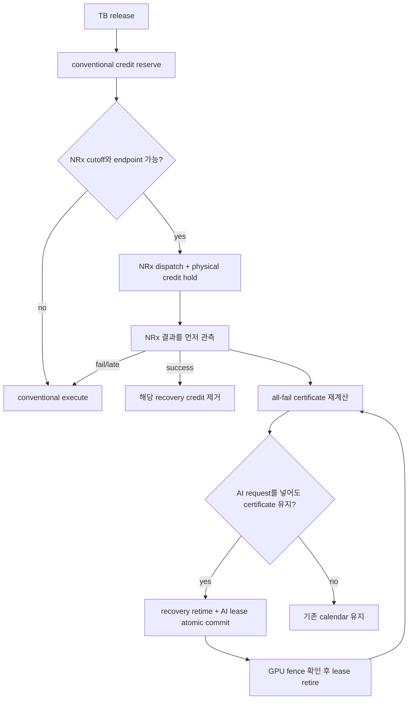

# SoftWall 논문 구조 초안: MIG-off MPS AI-and-RAN의 조건부 복구 substrate

**문서 상태:** 2026-09-25, claim audit를 통과한 영문 원고 초안과 C164 claim-scoped 5/10 lifecycle boundary 반영  
**현재 논문축:** certified conditional-recovery substrate + feasibility envelope  
**중단한 축:** 새로운 joint optimizer의 성능 우월성

---

## Abstract 초안

AI-and-RAN은 기지국의 GPU를 무선 PHY와 AI inference가 함께 사용하게 하지만,
NVIDIA MPS의 동시 실행과 active-thread cap만으로 RAN deadline을 보장할 수는 없다.
문제는 optional NeuralRx가 단순한 저우선순위 GPU 작업이 아니라는 데 있다. NeuralRx가
실패하거나 늦으면 같은 transport block을 conventional receiver로 다시 처리해야 하므로,
AI에 넘길 수 있는 GPU slack은 미래의 실패 결과에 따라 달라진다.

SoftWall은 이 조건부 conventional 작업을 **recovery credit**으로 표현한다. Runtime은
모든 미해결 NeuralRx가 실패하거나 늦는 경우에도 각 RAN 요청의 expiry 전에 끝나는
all-fail recovery schedule을 executable certificate로 유지한다. 여러 셀의 recovery
credit을 다시 배치하고 bounded AI work unit을 허가할 때에는 두 변경을 하나의 원자
transaction으로 처리한다. CUDA completion fence, IPC buffer, endpoint credit,
timeout 뒤 미완료 작업과 radio commit을 같은 lifecycle 규칙으로 관리한다.

4×A100의 두 독립 node에서 같은 noisy TB의 실제 TensorRT NeuralRx CRC가 이 state를
직접 구동했다. C158은 persistent endpoint에서 500 epoch와 actual NRx request 2,000건을
실행해 success1,440, shared cuPHY recovery560, Qwen500과 radio single commit2,000을
관측했다. Deadline·declared bound·credit·input round-trip·response echo 위반은 모두 0이었다.
이 결과는 `P600/D155` warm synthetic qualification이며 실제 trace 성능 비교는 아니다.
C159-Q1/Q2는 pre-staged bank와 whole-path preflight를 사용해 이를 `P180/D155`로
재자격했다. 두 독립 node의 Q2 합계는 1,200 epoch, actual NRx4,800, recovery1,312,
variable-context Qwen1,077과 radio commit4,800이며 deadline·transport·recovery contract
위반은 0이었다. 16--512 token 여섯 class가 모두 frozen bound를 통과했다. Calibration
trace에서 같은 exact offline selector를 사용한 Q3 oracle은 SoftWall과
certificate-preserving recovery-first Event-driven baseline에 모두 385,262 timely token을
배정해 추가 이득 0.000%를 냈다. 이 동률은 certificate가 아니라 AI-first retiming의
추가 처리량 주장을 기각한다.
따라서 confirmatory 처리량 holdout은 사전 중단하고 substrate/fault/envelope 주장에 집중한다.

C160/C161은 epoch·generation·fence state와 A0--A6 physical fault matrix를 검증했다. Qualified
node의 합계는 actual NeuralRx2,800, recovery942, radio commit2,800, deadline miss0이며,
stale/duplicate pair40, terminal channel fault4와 fault 뒤 continuation260을 포함한다. C162는
debt 수, decision time, Qwen class와 provenance를 입력으로 QSU/QSN/MI/UQ를 예측했다.
Qualified state 16,023개에서 analytic/exact mismatch0, 과거 physical decision1,200/1,200
일치, 두 새 A100 node의 사전 고정 boundary180/180 일치를 얻었다. Boundary 실행은 actual
NeuralRx720, physical recovery330, Qwen90, commit720, miss0이었고 context64의 88/89 ms
decision boundary를 각각30회 재현했다.
Exact search의 scale 한계는 candidate scheduler와 independent verifier를 분리해 처리했다.
임의 이질 small state600개에서 false-safe0·false-conservative10, 현재 qualified state
16,023개에서 exact 판정 차이0이었다. Debt1--64의 2,800-state grid에서 반환 certificate
검증 실패0, debt64 decision/verifier p99는1.494/0.131 ms였다.

동일 A100 GPU, MIG OFF, MPS 환경의 4셀 물리 경로에서 SoftWall은 주입된 동시
NeuralRx 실패, 복수 conventional recovery와 복구 전 AI lease를 deadline·bound·credit
위반 없이 실행했다. Nsight 계측은 AI–NeuralRx 8.932 ms와 conventional–NeuralRx
12.309 ms의 실제 GPU kernel overlap을 확인했다. 반면 세 단계의 독립 정책 실험에서
exact/joint 선택은 강한 greedy 또는 max-radio와 같았고, 마지막 사전 고정 C102에서도
39/39 동일했다. C102의 조건부 AI 용량은 37/39 상태에서 변했지만 radio-noninferior한
AI 개선 선택은 0개였다. 결과적으로 본 연구의 기여는 새로운 optimizer가 아니라,
MPS 위에서 조건부 복구 자원을 안전하게 가상화하는 substrate와 그 실행 가능 경계다.

BurstGPT 60초 trace를 Qwen2.5-1.5B prefill로 재생한 사전 고정 C113에서 SoftWall은
두 독립 seed의 각 반복마다 81회와 88회의 multi-credit/AI-lease transaction을
deadline·bound·guard·credit 위반 없이 완료했다. Static-safe의 적시 AI 가치는 약
73.8k token, safe work-conserving과 SoftWall은 약 224.5--225.3k token이었다. 그러나
SoftWall의 strong-baseline 대비 추가 이득은 +0.113%와 +0.099%이고 두 paired bootstrap
95% CI가 0을 포함했다. 현재 결과는 synthetic PHY timing contract의 유한 표본 검증이며,
실제 DU의 MAC expiry, WCET와 GPU hang 보호는 남아 있다.

4×A100 NVLink node의 C114는 같은 계약을 local CUDA-IPC NeuralRx와 remote P2P
NeuralRx에 적용했다. Cross-process payload 10,000회와 실제 remote NeuralRx 1,000회가
무오류로 통과했고, 4셀·MPS Qwen·혼합 실패의 두 독립 arm에서도 관측된
deadline·bound·guard·credit 위반이 없었다. 이는 transport-independent substrate의
유한 표본 증거이며 멀티 GPU 처리량 우위나 production WCET 주장이 아니다.
C115의 같은 2-GPU 예산 ABBA에서도 모든 safety·decision-parity gate는 통과했지만,
SoftWall의 safe work-conserving 대비 추가 token value는 +0.080%/+0.138%이고 두 CI가
0을 포함했다. 멀티 GPU 처리량 우위도 기각한다.
C116은 controller의 두 endpoint 가정을 제거하고 GPU0 local 1개와 GPU1/2 remote 2개를
같은 4셀 recovery contract에 연결했다. 두 arm에서 세 endpoint가 모두 실제 사용됐고
atomic exchange 90/98회와 safety 위반 0을 확인했다.
C117은 이 co-run mode의 component 계약을 사전 고정해 검사했고, 전체 safety는 통과했지만
GPU0 front/back의 2 ms 후보가 각 한 건씩 깨져 자격화에 실패했다. 이 실패를 보존한 뒤
3 ms 후보와 새 seed를 고정한 C118은 두 arm의 모든 system/component gate를 통과했다.
이는 isolated 평균이 아니라 topology·transport·Qwen co-run을 포함한 mode별 service
vector가 필요하다는 경계 증거다.
C119/C120은 GPU0 local 1개와 GPU1/2/3 remote 3개로 네 physical GPU를 모두 사용했다.
네 formal arm은 endpoint use/count와 system safety를 통과했지만, 3-GPU component vector의
backward 100 us와 home back 3 ms 후보가 각각 한 건씩 깨졌다. Eager module loading은
timed traffic 전 OOM이었고 lazy mode만 실행됐다. 따라서 4-GPU integration은 성립하지만
fine component vector의 topology 일반화는 기각한다.
C121/C122는 recovery home 자체를 분할했다. 2 GPU×4셀과 4 GPU×3셀의 두 독립 arm씩에서
모든 home의 첫 release가 0 ns 오차로 일치했고, 총 13,600 TB가 약 61초씩 실제로 겹쳐
실행되는 동안 deadline·bound·credit 위반이 없었다. 이 결과는 C84의 단일-home receiver
OOM 경계를 8셀과 12셀로 이동시킨 disjoint-certificate composition의 유한 표본 증거다.
C123은 하나의 global BurstGPT queue를 두 4셀 home이 generation-tagged hold로 공유하면서
2,268개 request를 중복·미회수 없이 완료했다. 이후 C124는 conv12 mode의 12.535 ms tail을,
C125는 valid calendar를 실행기가 다른 순서로 소비하는 반례를 발견했다. Ready recovery를
live-certificate 순서로 합친 C126의 8개 arm은 21,760 TB와 2,496 atomic exchange에서
deadline·bound·credit 위반 0이었다. 반면 global routing의 추가 token value는
+0.0049%/+0.0236%이고 strict radio-decision parity도 실패했다. 따라서 멀티 home 합성과
executor-conformance를 기여로 두되 global routing 처리량 우위는 주장하지 않는다.
C127은 broker가 home 0의 30번째 commit을 적용한 뒤 응답만 유실하는 fault를 두 독립
arm에 주입했다. Ambiguous request를 재시도하지 않고 home 0의 신규 AI만 닫은 상태에서
총 5,440 TB와 fault 뒤 2,490 TB를 deadline·bound 위반 없이 완료했고, home 1은 fault 뒤
AI 1,668개를 계속 처리했다. Duplicate 실행은 0이고 arm마다 고립된 token 하나만 남았다.
이는 exactly-once 복구가 아니라 at-most-once fail-closed fault containment의 증거다.

C128--132는 broker process fail-stop으로 범위를 넓혔다. 동기식 fault marker를 쓰던 C128은
두 deadline miss, marker를 제거했지만 socket timeout이 없던 C129는 Qwen 물리 완료 뒤
complete RPC가 97.259 ms 더 막혀 D155 recovery가 실패했다. 이 반례에서 control-plane도
certificate의 시간 자원임을 도출했다. 각 `prepare/commit/complete` RPC를 5 ms로 제한하고
세 항 15 ms와 physical guard 2 ms를 admission에 반영한 C132는 두 독립 arm의 5,440 TB와
crash 탐지 뒤 4,976 TB에서 모든 safety 위반 0을 기록했다. 이는 broker restart가 아니라
bounded volatile fail-stop containment의 근거다. C133은 같은 계약에서 post-prepare와
post-complete를 두 arm씩 추가했다. C132 commit arm과 합친 6개 arm·16,320 TB에서 세
control point마다 safety 위반 0, crash 탐지 뒤 RAN 14,938 TB, AI 중복 실행 0이었다.
C134는 runtime과 contract를 그대로 두고 새 allocation 58823497과 다른 A100 node
nid002688에서 세 control point를 각각 두 arm으로 다시 실행했다. 총 16,320 TB와
crash 탐지 뒤 14,926 TB에서 모든 safety·duplicate gate가 통과했다. 두 A100 node의
독립 재자격이며 cross-family 또는 production WCET 일반화는 아니다.
Envelope V9은 cross-home slack 전이를, V10은 용량 기하와 실제 결정시각의 혼동을
교정했다. 이어진 구현 감사에서 V10이 `ring_depth=1` endpoint를 반복 completion slot처럼
계산하고 executor phase를 합친 오류를 찾았다. V11은 finite ring과 rejected-recovery
ordering을 mode 축에 넣었다. 독립 exact oracle은 39개 endpoint pool과 10,920개 bounded
상태에서 checker와 차이 0이었다. V12는 full-control mode에서 AI40, control15와
AI completion guard2를 합친 57 ms transaction이 58 ms window에 들어가는 후보 두 개를
유지했다. C135의 독립 두 physical arm과 C136의 새 node 여섯 arm을 합치면
두 A100 node·8 arm·10,240 TB에서 정확한 후보 분기 1,196회와 AI40 exchange 38회,
안전 위반 0이다. 같은 38개 교환의 반사실 감사에서 완전한 transaction은 static all-fail
slack보다 4 ms 컸지만 conditional decision window에는 1 ms 여유로 들어갔다. 이는
synthetic mechanism workload의 유한 표본 검증이며 처리량 우위나 WCET
증명은 아니다.

C137은 기존 실행 source를 보존하고 별도 instrumentation mode를 만들어 세 번째 A100
node에서 broker RPC wall time을 직접 기록했다. 6개 arm의 5,993개 호출에서 최대는
prepare 2.594 ms, commit 0.388 ms, complete 1.046 ms였고 frozen 5 ms per-RPC bound
초과는 0이었다. 같은 실행의 7,680 TB와 AI40 exchange 28회도 모든 safety gate를
통과했다. 이 결과는 control-budget telemetry 공백을 닫지만 유한 표본 최대를 WCET로
바꾸지는 않는다.

그러나 C137은 정상 호출만 포함했다. C138은 post-apply broker crash를 실제 호출 계측과
결합했고, 첫 사전 고정 prepare arm에서 faulting prepare 5.205 ms와 다른 home의 in-flight
complete 5.831 ms를 관측했다. 기존 safety gate는 모두 통과했지만 5 ms wall-bound gate가
실패해 C132–C137의 `5 ms × 3` 시간 계약을 폐기했다. C139는 socket timeout 5 ms와
admission wall bound 7 ms를 분리하고 control 21 ms를 선납했다. 새 node의 6개 arm,
16,320 TB와 실제 RPC 2,020회에서 최대 5.653 ms, 7 ms 초과와 safety 위반 0이었다.
이 보정으로 AI40 transaction은 63 ms가 되어 58 ms conditional window 밖으로 나갔다.
V13은 대신 `AI35+control21+completion2=58 ms` class를 예측했고, C140 두 arm은 static
margin −5 ms/conditional margin 0 ms인 target exchange 8회를 2,560 TB와 위반 0으로
실행했다. 따라서 이 시점의 synchronous reference는 V12 AI40이 아니라 **V13 AI35
corrected-control mode**가 됐다.
C141은 이전 node를 allocation에서 제외한 `nid001372`에서 corrected mode 전체를 다시
검증했다. Control fault 6 arm·16,320 TB·RPC2,010회에서 최대5.775660 ms, 7 ms 초과0이었고,
AI35 두 arm·2,560 TB에서 target exchange7과 safety 위반0을 얻었다. C139/C140과 합친
corrected exact mode는 두 A100 node, control 12 arm·RPC4,030회와 AI35 4 arm·exchange15다.

V14는 synchronous control 자체가 조건부 slack을 소모하고 recovery dispatch를 지연시키는
문제를 제거한다. `prepare`, `abort`, `complete`를 전용 비동기 connection/worker로 옮기고,
staged token을 실제 launch 직전에 현재 all-fail certificate로 다시 검사한 뒤 `commit`
ACK가 있을 때만 Qwen을 제출한다. 따라서 critical transaction은
`AI45+commit7+guard2=54 ms`이며 static slack 53 ms에는 들어가지 않고 conditional
window 58 ms에만 들어간다. C142/C144의 서로 다른 두 A100 node에서 AI45 exchange는
11회, safety 위반은 0이었다. C143/C144의 prepare/commit/complete fault 9개 arm은
21,120 TB와 fault 뒤17,914 TB를 처리했고 duplicate·safety 위반은 0이었다. Deferred
RPC는 7 ms를 50회 넘었지만 commit은 모두 7 ms 안이었으므로 local RAN 안전이 deferred
control wall time과 분리됐음을 직접 보인다. 16-state/20-transition finite model도 모든
before/after-apply reply-loss 분기에서 invariant 위반 0을 냈다. 후속 two-request 감사는
staged token 뒤 두 번째 prepare가 broker-held token을 추적 밖에 둘 수 있음을 재현해
V14를 UQ로 내렸다. V15는 home별 staged/offered token을 하나로 제한한다. C145/C146의
두 새 A100 node에서 정상 AI45와 prepare/commit/complete fault 8개 arm, 총 12,160 TB,
AI45 exchange12, fault 뒤 radio7,463, retained-token 억제537회, 최대 unlaunched token1,
safety·duplicate 위반0을 확인했다. 이후 C147/C148은 V15에서 물리 주입이 빠졌던
post-apply `abort` reply-loss를 서로 다른 새 A100 node 두 곳에서 검증했다. 두 arm의
3,200 TB, fault 뒤 radio2,662, target AI 실행0, 최대 unlaunched token1과 모든 safety gate가
통과했다. C145--C148을 합치면 `prepare/abort/commit/complete` 각각 두 arm, 서로 다른
노드 4개, radio15,360, fault 뒤10,125, 위반0이다. 현재 권위 mode는 **V16 four-point-qualified
single-token AI45 pipelined-control QSU**다. Runtime 동작은 V15와 같고 V16은 물리 fault
자격 조건을 강화한 envelope/evidence version이다. V14는 역사적 timing/fault 증거,
V13은 synchronous reference다.

V17은 여러 RAN home이 mandatory recovery GPU를 공유할 때 local certificate의 곱이
false-safe가 되는 문제를 추가한다. Exact global model은 3,425개 finite state에서 oracle과
차이 0이었고 C151/C152는 두 node의 shared cuPHY/P2P request 1,000건을 오류 없이 실행했다.
C153은 local 3+2 debt 중 global fifth를 launch 전에 거절하고, 두 injected NRx success 뒤에만
Qwen35 lease를 연 뒤 physical fence와 certificate-ordered recovery 두 건을 D155 안에
완료했다. Qwen host/GPU는 23.059/21.733 ms, 최장 home commit은 97.644 ms이고 위반은
0이었다. C154/C155는 같은 source와 반대 arm 순서·독립 seed를 두 새 node에서 실행해
all-fail/conditional/all-success/overload 8개 arm, global reject4, Qwen fence4, recovery와
home commit20/20, deadline miss0을 재현했다. 이는 controlled-outcome integration의
finite-sample 증거다. C156의 Nsight arm은 기존 고정 lease가 profiler 지연 아래 3.153 ms
초과되는 반례를 발견했다. V17.1은 실제 launch decision 시각에서 control5+AI35 blackout과
남은 recovery를 다시 원자 배치한다. C156/C156b 두 node에서 Qwen kernel2,448,
recovery kernel212, 미귀속 event0, 금지 overlap0 ns, correct commit4/4와 D155 miss0으로
각각 timeline gate11개를 통과했다. 이는 controlled-outcome two-node semantics 증거이며 actual
NeuralRx-driven/fault mode에는 확장하지 않는다.

---

## 1. Introduction

### 1.1 배경

AI-RAN은 한 GPU에서 RAN PHY와 AI inference를 함께 실행해 별도 accelerator의 유휴
자원을 줄이려 한다. NVIDIA Aerial의 공개 구조와 실제 field-trial 사례도 같은 GPU 또는
동일 RAN 인프라에서 dApp, video inference, LLM 계열 서비스를 실행하는 방향을 제시한다.
기존 연구는 GPU 자원 비율 조절, queue-aware accelerator 배치, RAN deadline 보호,
작은 background work unit admission을 각각 다뤘다.

하지만 MPS는 시간적 hard isolation을 제공하지 않는다. 본 실험에서도 별도 MPS client의
물리 overrun이 있는 P60/D25에서 cap100은 2/1,500, cap20은 1/1,500 deadline miss를
만들었다([C26](../../results/softwall_same_gpu/EXPERIMENT_GATE_LEDGER_KO.md)). GPU 작업이
timed RAN 구간 전에 끝난 경우에도 MPS client lifecycle 전환 뒤 tail이 나타났다.
C46의 CPU socket sham은 0/10,000 miss였지만 GPU/MPS client arm은 12/10,000 miss였고,
반복 단위 부호검정은 `p=0.00390625`였다. 따라서 cap이나 priority만 보고 RAN 안전을
주장할 수 없다.

### 1.2 optional NeuralRx가 만드는 문제

한 PUSCH 요청에 conventional receiver와 NeuralRx가 있다고 하자. NeuralRx는 특정 채널에서
추가 decoding 성공을 줄 수 있지만, 실패·timeout·late completion이 가능하다. NeuralRx를
선택한 요청도 결과가 확정되기 전까지 conventional 경로를 실행할 수 있는 시간과 GPU
자원을 보유해야 한다. 여러 셀의 NeuralRx가 동시에 실패하면 모든 복구가 같은 deadline
구간에 몰린다.

따라서 “현재 GPU가 비어 있다”는 사실만으로 AI를 시작할 수 없다. AI unit이 끝날 때까지
향후 모든 conventional recovery를 완료할 수 있는지가 함께 성립해야 한다. NeuralRx 성공
뒤에는 해당 복구 자원이 필요 없어지므로, 이 자원을 안전하게 회수하지 않으면 공유 이득도
사라진다.

### 1.3 핵심 관찰

SoftWall의 핵심 관찰은 GPU slack이 고정 용량이 아니라 **실패 결과에 조건부인 복구
의무의 보수적 여집합**이라는 것이다. 각 optional NeuralRx는 결과가 확정되기 전까지
conventional recovery credit을 빚진다. Runtime은 이 credit의 시각과 순서를 바꿀 수 있지만,
모든 실패 분기의 복구 가능성을 없앨 수는 없다. AI에는 certificate를 유지하고도 남는
시간만 lease한다.

### 1.4 기여

본 논문이 목표로 하는 기여는 네 가지다.

1. **Conditional-recovery contract.** Optional NeuralRx와 같은 요청의 conventional
   recovery를 all-fail executable schedule로 연결한다.
2. **Atomic credit substrate and conformant execution.** 여러 셀의 recovery credit
   retiming과 AI lease 발급을 원자적으로 처리하고, local CUDA IPC 또는 remote P2P
   endpoint의 물리 완료까지 recovery·endpoint·transport·AI credit 수명을 유지한다.
   모든 ready recovery를 live-certificate 순서로 dispatch하고, 하나의 global AI request
   ownership을 선택된 home의 local certificate와 직렬화한다. Ownership maintenance는
   RAN 경로 밖으로 pipeline하고, staged token을 launch 직전에 현재 certificate로
   재검증해 bounded commit ACK 뒤에만 GPU work를 제출한다. 결과가 애매하면 request를
   재시도하지 않고 신규 global AI만 차단해 RAN certificate를 보존한다.
3. **Feasibility envelope.** 셀 수, deadline, mode별 bound, MPS cap, lifecycle,
   fault correlation, resident memory에 따른 safe/useful/infeasible 경계를 모델링하고
   물리 실행으로 검증한다. Multi-home conditional slack을 home-local NRx 수락 수,
   finite IPC ring과 executor phase에 연결하고 endpoint admission을 exact finite-state
   oracle로 교차 검증한다. 용량 기하와 실제 controller decision-time 조건을 분리하고,
   모델이 예측한 exchange-only AI45 class를 물리 검증한다. V14의 two-request ownership
   반례를 V15 single-token contract로 교정하고, reply-loss 16-state/20-edge와 ownership
   4-state/8-edge를 전수 검사한 뒤 C145/C146에서 ownership branch를 직접 계측한다.
   C147/C148은 남은 abort post-apply 분기를 추가해 네 state-changing control operation마다
   두 독립-node fault arm을 확보한다.
4. **Negative policy result.** 조건부 용량이 존재해도 검증한 영역에서 복잡한 joint
   optimizer가 max-radio보다 radio-noninferior한 AI 이득을 만들지 못함을 세 독립 단계로
   보인다. 실제 trace에서도 atomic exchange의 strong work-conserving 대비 추가 이득이
   0.10--0.11%에 그쳤음을 사전 고정 ABBA로 보인다. 이 결과에 따라 max-radio를 공통
   controller로 고정하고 substrate와 envelope를 분리해 평가한다.

### 1.5 주장하지 않는 것

- MPS 자체나 RAN+AI GPU 공유의 최초성
- MPS active-thread cap에 의한 완전한 물리 격리
- 새로운 joint optimizer의 성능 우위
- 표본 최대 또는 p99에 기반한 WCET 증명
- synthetic `P180/D155`를 production HARQ deadline으로 해석하는 주장
- GPU/driver hang, 전원 장애 등 자격화하지 않은 고장까지의 보장

---

## 2. Background and Motivation

### 2.1 RAN 처리 경로

각 transport block `i`는 release `r_i`와 radio 결과가 유효한 expiry `d_i`를 가진다.
현재 harness는 synthetic `r_i,d_i`를 제공하고 single commit을 계측한다. 실제 DU에서는
`t_IQ_ready`, PHY submit, CRC/FAPI 공개, MAC 소비 시각을 같은 clock으로 계측해야 한다.
3GPP의 UE-side K2/N2만으로 gNB의 `d_MAC`를 직접 유도하지 않는다. 이 공백은
[PUSCH timing contract 감사](SOFTWALL_PUSCH_TIMING_CONTRACT_KO.md)에 기록했다.

Conventional receiver는 mandatory 경로다. NeuralRx는 자격화된 local 또는 remote endpoint에서 실행되는
optional 경로이며, 성공하면 radio utility를 높일 수 있다. NeuralRx를 선택하지 않거나
실패·late이면 conventional 결과만 commit한다. 동일 요청에는 한 결과만 commit한다.

### 2.2 MPS가 제공하는 것과 제공하지 않는 것

MPS는 여러 CUDA process의 kernel을 같은 GPU에서 동시에 실행하고 client별 active-thread
percentage와 priority를 설정할 수 있게 한다. 본 구현은 NeuralRx endpoint 두 개에 cap40,
AI worker에 cap20을 사용한 mode를 주로 평가했다. 그러나 cap의 합이 100이라고 해서
kernel blocking, host scheduling, CUDA context lifecycle, memory allocation과 RPC tail의
시간 상한이 생기지는 않는다.

본 연구는 MPS를 실행 기반으로 사용하되, deadline 안전은 별도의 admission certificate와
mode qualification으로 만든다. 측정하지 않은 동시 실행 조합은 허가하지 않는다.

### 2.3 선행 연구와 범위

2026년 9월까지 공개된 SIGCOMM, MobiCom, INFOCOM, NSDI, OSDI, ATC 논문과 직접 관련
preprint를 다시 확인했다. 유사 연구는 분명히 존재하므로 “MPS 기반 AI-RAN”, “RAN과 AI의
동일 GPU 공유”, “deadline-aware admission”, “conventional fallback” 중 어느 하나도
SoftWall의 최초성으로 주장하지 않는다. 검색 범위에서 아래 요소의 **전체 결합**을 같은
문제로 구현·평가한 연구는 확인하지 못했지만, 이는 미공개 연구나 모든 학회의 부재를
증명하는 전수조사 결과는 아니다. 상세 원문 감사는
[선행 연구 감사](SOFTWALL_RELATED_WORK_AUDIT_KO.md)에 있다.

#### 2.3.1 최신 top-tier 및 직접 인접 연구 비교

| 연구 | 발표 상태와 이미 해결한 문제 | SoftWall과의 경계 |
|---|---|---|
| [Concordia, SIGCOMM 2021](https://conferences.sigcomm.org/sigcomm/2021/files/papers/3452296.3472894.pdf) | CPU vRAN의 deadline을 보호하면서 남는 CPU를 일반 작업에 회수 | 예측·예약·slack 회수의 직접 선행 연구다. GPU/MPS의 non-preemptive 실행과 동일 TB의 조건부 NeuralRx recovery는 다루지 않는다. |
| [REEF, OSDI 2022](https://www.usenix.org/conference/osdi22/presentation/han) | latency-critical DNN 도착 시 best-effort GPU kernel을 reset/preempt하고 남는 자원에 병행 실행 | 알려진 RT/BE 작업의 실행 제어다. NeuralRx 결과가 나오기 전에는 존재하지 않는 future conventional recovery를 미리 예약하는 RAN 의존성은 없다. |
| [YinYangRAN, INFOCOM 2024](https://ieeexplore.ieee.org/document/10621380/) | A100에서 RAN PHY와 ML을 함께 실행하고 MPS SM 비율을 조절해 RAN reliability와 ML throughput을 관리 | **가장 직접적인 정식 선행 연구다.** 초 단위 이상의 자원 비율 제어가 중심이며, per-TB NeuralRx 실패가 만드는 multi-cell recovery interval과 background-AI lease의 원자 교환은 다루지 않는다. |
| [CloudRIC, MobiCom 2024](https://doi.org/10.1145/3636534.3649381) | 여러 DU가 이종 accelerator pool을 공유하며 queue·실행시간·1–3 ms FEC deadline에 따라 처리기를 고르고 radio grant를 조정 | 요청 단위 accelerator 선택과 보수적 latency guard도 기존 요소다. 동일 GPU에서 optional NRx, 같은 TB의 conventional recovery, 비-RAN AI lease를 하나의 certificate로 묶는 문제는 아니다. |
| [AoRA, SIGCOMM 2025 short](https://doi.org/10.1145/3718958.3750517) | RAN의 GPU/NPU headroom에서 containerized AI 서비스를 opportunistic하게 실행해 MEC/cloud 대비 transport latency를 줄임 | AI-on-RAN headroom 활용의 넓은 주장은 이미 존재한다. 공개 3쪽 논문의 중심은 서비스 위치와 transport latency이며 all-fail recovery certificate가 아니다. |
| [DARIS, DAC 2025](https://doi.org/10.1109/DAC63849.2025.11132423) | MPS, CUDA stream, stage 경계로 우선순위가 다른 실시간 DNN을 함께 실행 | MPS와 bounded low-priority admission의 직접 선행 연구다. radio correctness, optional receiver의 실패 결과, multi-cell fallback debt는 모델링하지 않는다. |
| [XSched, OSDI 2025](https://www.usenix.org/conference/osdi25/presentation/shen-weihang), [GPreempt, ATC 2025](https://www.usenix.org/system/files/atc25-fan.pdf) | 다양한 accelerator의 선점 또는 NVIDIA GPU의 일반적인 저지연 preemption 제공 | 이미 도착한 작업을 선점하는 일반 GPU substrate다. SoftWall은 driver/compiler 변경 없는 MPS에서 미래 recovery가 가능한 범위만 bounded unit에 lease한다. |
| [SMEC, NSDI 2026](https://www.usenix.org/system/files/nsdi26-zhang-xiao.pdf) | RAN MAC과 별도 MEC server의 CPU/GPU 작업을 application SLO로 제어하고 edge GPU에서 MPS priority 사용 | “5G + MPS + deadline-aware AI 자원 관리”도 단독 novelty가 아니다. PHY와 AI가 동일 GPU에서 optional NRx/conventional recovery를 공유하는 계약은 다르다. |
| [SAGE, SIGCOMM 2026](https://sens.epfl.ch/research/sage/) | 경량 AI로 UE uplink 수요를 예측해 radio resource를 선제 할당하고 예측 불량 시 grant 기반 방식으로 복귀 | AI가 RAN scheduling을 개선하는 AI-for-RAN 연구다. RAN PHY와 background AI의 GPU compute 공유 또는 recovery-credit 관리는 아니다. |
| [ARCHES, 2026 preprint](https://arxiv.org/abs/2604.23397) | 채널 상태에 따라 conventional/AI PHY expert를 선택하고 slot 경계에서 경로를 전환 | channel-aware expert 선택 자체는 기여가 될 수 없다. SoftWall의 대상은 선택 이후에도 남는 동시 실패 복구 의무다. |
| [Ettus/OAI Neural Receiver testbed](https://kb.ettus.com/5G_OAI_Neural_Receiver_Testbed_with_USRP_X410) | GPU neural receiver와 traditional MMSE receiver를 runtime flag로 전환하고 conventional fallback mode를 제공 | Neural/conventional 경로의 공존과 전환도 단독 novelty가 아니다. 공개 설명에는 per-TB multi-cell recovery schedule과 외부 AI lease의 원자 교환이 없다. |
| [OCUDU dApp Platform, 2026 preprint](https://arxiv.org/abs/2609.07843) | inline neural receiver/equalizer, admission profile, timing contract, CUDA completion event, conventional path, breaker와 lifecycle 제공 | **의미적으로 가장 가까운 최신 연구다.** 공개 평가는 한 셀 중심이고 MPS background co-tenant, multi-cell all-fail schedule, recovery-credit/AI-lease 원자 교환은 다루지 않는다. 논문도 multi-cell을 roadmap으로 명시한다. |

SIGCOMM 2026에는 [Rate-Assured GPU Inference for 5G AI Slices](https://doi.org/10.1145/3789240.3830291)도
3쪽 poster로 발표됐다. 공개 서지정보만으로는 SoftWall과 같은 PHY recovery mechanism을
확인할 수 없으므로, 존재를 기록하되 본논문과 동일한 설계라고 단정하지 않는다.

#### 2.3.2 가장 강한 두 비교점

**YinYangRAN과의 차이.** YinYangRAN은 이미 동일 GPU의 RAN과 ML 사이에서 MPS SM 몫을
바꾸고 측정 기반 reliability를 최적화한다. 따라서 SoftWall의 질문은 “GPU를 몇 퍼센트
나눌 것인가”가 아니다. 한 TB의 NeuralRx 결과가 아직 알려지지 않은 동안, 실패 시 새로
필요해질 conventional 실행 시간을 어떻게 부채로 보존할 것인가가 질문이다. 이 부채는
여러 셀이 동시에 실패하면 같은 deadline 구간에 몰리며, 현재 queue에 아직 나타나지 않은
작업이므로 일반적인 현재 부하 기반 allocation만으로는 표현되지 않는다.

**OCUDU와의 차이.** OCUDU는 conventional path를 항상 armed 상태로 두고 inline neural
module의 shape admission, deadline, completion event와 breaker를 제공한다. 따라서
fallback과 timing contract 자체는 SoftWall의 기여가 아니다. SoftWall이 추가로 검증할
대상은 별도 MPS client의 background AI가 같은 GPU를 점유하고 여러 셀의 NeuralRx가
동시에 실패할 수 있을 때, 각 conventional 경로의 **실행 시간**을 all-fail calendar에
예약하고 그 credit의 retiming과 AI compute lease를 원자적으로 commit하는 것이다.

#### 2.3.3 SoftWall이 다루는 정확한 미해결 문제

네 셀의 NeuralRx가 실행 중이면 현재 GPU queue에는 conventional recovery가 없을 수 있다.
그러나 네 결과가 모두 실패하거나 늦으면 네 conventional 작업이 각 expiry 전에 실행되어야
한다. 기존 RT/BE GPU scheduler는 일반적으로 이미 도착했거나 알려진 작업을 배치·선점한다.
SoftWall은 결과를 관측하기 전에 이 조건부 작업을 recovery credit으로 생성해 다음 관계를
항상 유지한다.

```text
qualified GPU time
  - executable all-fail recovery schedule
  - 아직 물리 완료되지 않은 GPU/IPC credit
  - mode별 guard
  = background AI에 lease할 수 있는 조건부 slack
```

따라서 논문의 좁은 차별점은 다음 결합이다.

```text
MIG-off MPS co-location
  + optional per-TB NeuralRx
  + multi-cell all-fail executable certificate
  + recovery-credit retiming / AI-lease atomic transaction
  + local/remote endpoint·transport credit
  + physical CUDA/IPC/P2P fence lifetime
  + multi-home AI ownership의 launch-time revalidation과 fault quarantine
  + shared recovery GPU를 위한 home 횡단 global executable calendar
  + 두 home의 conventional debt를 실행하는 shared cuPHY/P2P recovery path
  + measured safe/useful/infeasible envelope
```

Reviewer-facing 핵심 문장은 다음과 같다.

> Existing AI-RAN systems allocate accelerator capacity between RAN and AI
> workloads or retain a conventional fallback path. SoftWall addresses a
> different dependency: optional neural processing creates contingent recovery
> obligations whose GPU demand becomes known only after neural outcomes are
> observed. SoftWall maintains an executable all-fail schedule across cells and
> atomically exchanges recovery credits with bounded background-AI leases on an
> unpartitioned MPS GPU. Across recovery homes, it pipelines global request
> ownership off the RAN path, revalidates each staged token against the current
> certificate at launch, and submits GPU work only after a bounded commit ACK.
> For shared recovery capacity, a global certificate rejects debt sets that are
> feasible in every home-local calendar but infeasible in their union. A two-node
> prototype executes both homes' conventional recoveries through one cuPHY/P2P
> worker. The integrated path was repeated across two A100 nodes for 2,000
> actual TensorRT NeuralRx requests with no observed deadline, bound, credit,
> input-fence, or response-fence violation; trace-driven performance and the
> integrated fault mode remain unqualified.

#### 2.3.4 주장 경계와 입증 책임

| 단독으로는 새롭지 않은 요소 | SoftWall에서 입증해야 하는 추가 차이 |
|---|---|
| MPS로 RAN과 AI 공유 | MPS 간섭 아래에서도 certificate를 지키는 조건부 lease와 물리 gate |
| GPU headroom에 opportunistic AI 배치 | 보이는 idle이 아니라 all-fail recovery를 제외한 slack만 lease |
| NeuralRx와 conventional fallback | fallback 호출이 아니라 여러 셀 fallback의 실행 시간을 사전 예약 |
| deadline-aware admission | 현재 작업뿐 아니라 미래 실패 분기의 executable schedule 검사 |
| completion event와 lifecycle | timeout 뒤 미완료 credit을 재사용하지 않는 cross-process lease 수명 |
| 작은 background work unit | recovery calendar retiming과 같은 transaction에서만 work unit 허가 |
| 여러 RAN home의 shared GPU pool | 같은 TB에서 생긴 home 횡단 조건부 debt의 global executable calendar와 shared cuPHY recovery path; C159 P180 actual-NRx, C161 A0--A6 fault와 C162 predictive boundary를 qualified node에서 검증 |
| joint optimization | C102의 음성 결과에 따라 max-radio로 고정하고 substrate 효과만 비교 |

이 구분만으로 top-tier 기여가 확정되지는 않는다. 최종 평가는 모든 안전 비교군에 같은
max-radio 정책과 service profile을 주고, SoftWall이 `Static safe calendar` 및
`Safe work-conserving`보다 RAN deadline 위반 없이 유의미하게 많은 적시 AI value를
얻는지 보여야 한다. 차이가 없으면 남는 기여는 recovery correctness substrate와 envelope
특성화로 축소된다.

### 2.4 위협 모델과 보장 범위

보장은 사전에 허용한 PHY 및 AI work class 안에서만 성립한다.

- 각 mode는 `B_NRx`, `B_conv_path`, `B_AI`의 전체 host path 상한 후보를 가진다.
- Runtime은 이미 제출한 CUDA kernel을 논리적으로 취소했다고 가정하지 않는다.
- timeout 뒤 물리 완료 fence가 없으면 해당 credit을 계속 점유한다.
- worker 응답 지연, stale/duplicate reply, correlated NRx failure를 처리한다.
- GPU hang이나 검증하지 않은 cold/restart 상태에는 fail-open하지 않는다.
- mandatory-only offered load 자체가 불가능하면 AI와 NRx를 거절하고 overload로 표시한다.

---

## 3. Design

### 3.1 객체와 상태

SoftWall은 다음 객체를 유지한다.

| 객체 | 주요 상태 |
|---|---|
| RAN request | release, expiry, fallback cutoff, epoch, commit state |
| NeuralRx reservation | endpoint, predicted finish, physical IPC credit, completion fence |
| Recovery credit | owner request, lane, start/end, generation |
| AI request | arrival, deadline, bounded context/work class, value |
| AI lease | interval, unit ID, physical completion state |
| Mode profile | cell/endpoint/cap/lifecycle별 검증된 service bound |

정책은 미래 CRC, 미래 AI 도착, test label, 실제 SNR과 미래 실행시간을 볼 수 없다.

### 3.2 Mandatory-first admission

RAN request가 도착하면 `reserve_mandatory`가 conventional recovery interval을 먼저
확보한다. Optional NRx가 거절되어도 이 credit은 사라지지 않는다. 그 뒤 `admit_nrx`가
endpoint queue와 profile을 이용해 `predicted_NRx_finish <= fallback_cutoff`를 만족하는
경우에만 NeuralRx를 붙인다.

Single conventional lane과 동시 release를 단순화하면 지속 가능성의 필요조건은

```text
n_cells × B_conv_path <= P
```

이고, NRx 결과를 모두 기다린 뒤 복구하는 경로의 release deadline 조건은

```text
B_NRx_pair + n_cells × B_conv_path + guard <= D
```

이다. Runtime은 이 합보다 세밀한 request별 interval schedule을 직접 검사한다.

### 3.3 All-fail certificate

어떤 시각 `t`에도 미해결 NRx가 전부 실패하거나 늦는 분기를 가정한다. 모든 요청의
conventional interval이 같은 lane에서 충돌하지 않고 `d_i - guard` 전에 끝나면 그
schedule이 certificate다. Certificate가 없으면 optional NRx 또는 AI를 새로 허가하지
않는다.

안전 불변식은 다음과 같다.

> 이미 허가된 모든 RAN 요청에 대해, 허용된 모든 NRx 실패·지연 분기에서
> `conventional_commit_i <= d_i`인 충돌 없는 복구 계획이 남아 있어야 한다.
> 물리적으로 끝나지 않은 GPU/IPC 자원은 재사용하지 않는다.

### 3.4 Atomic replan and lease

NRx 성공, 실패, late, AI 도착, AI 완료 때마다 남은 recovery credit을 다시 배치할 수
있다. `replan_and_lease`는 다음을 하나의 transaction으로 검사한다.

1. 이동 후 모든 recovery interval이 lane과 request deadline을 만족하는가
2. 새 AI unit이 AI deadline과 가장 이른 recovery guard 전에 끝나는가
3. endpoint와 AI ring credit이 존재하는가
4. 기존 reservation generation과 transaction generation이 일치하는가

모두 만족하면 새 recovery calendar와 AI lease를 함께 commit한다. 하나라도 실패하면
기존 calendar와 credit이 그대로 남는다. 오래된 reservation으로 새 credit을 해제할 수
없다.

### 3.5 Event-driven execution

Runtime은 매 사건에서 첫 non-preemptive action만 실행하고 다시 계획한다.



C99는 controller가 Qwen과 세 conventional 작업을 먼저 처리한 뒤 NRx 결과를 관측해
45 ms bound를 넘긴 사례를 만들었다. C100부터 NRx 결과를 먼저 관측하는 순서를 사용한다.

C125는 관측 순서 뒤에도 **recovery dispatch 순서**가 별도 입증 의무임을 보였다. NRx를
쓰지 않은 셀과 NRx가 실패한 셀을 다른 루프로 처리하면, 뒤 셀을 당긴 interval이 앞 셀의
live credit과 겹칠 수 있다. 현재 executor는 모든 open recovery를 합쳐
`(reserved_start, deadline, slot_id)` 순서로 실행한다. Certificate가 존재한다는 사실과
실제 executor가 그 schedule의 refinement라는 조건을 함께 만족해야 안전 정리가 성립한다.

### 3.6 Fault and lifecycle handling

- NRx failure/late: 해당 request의 reserved conventional을 실행한다.
- Duplicate/stale response: epoch와 single-commit 검사로 폐기한다.
- AI RPC timeout with completion marker: lease ID와 worker-side CUDA fence가 일치할 때만
  lease를 회수하고 이후 AI admission을 차단한다.
- AI timeout without fence, worker crash, GPU hang: lease를 반환하지 않고 새 admission을
  중단한다.
- Global AI commit 응답 유실: token을 재시도·재할당하지 않고 해당 home의 신규 global AI
  admission을 닫는다. Commit 성공 응답 전에는 Qwen을 launch하지 않으므로 unlaunched local
  execution lease는 회수하고 RAN recovery는 계속한다.
- Global broker fail-stop: `prepare`, `commit`, `complete` 각각의 RPC timeout을 mode bound로
  두고 세 비용의 합을 AI admission에서 먼저 차감한다. 한 RPC라도 timeout이면 모든 영향을
  받은 client가 global AI를 닫고 certificate-ordered local recovery로 복귀한다.
- MPS client teardown/restart: 별도 lifecycle mode로 취급하고 재자격화한다.
- Python GC: GC ON/OFF를 서로 다른 mode로 취급한다. C89에서 GC ON은 NRx 50 ms 상한을
  실제로 깨뜨렸다.

### 3.7 Controller 선택

C102 이후 radio subset은 `max-radio`로 고정한다. 선택된 subset에 대해서는 exact recovery
recourse가 all-fail certificate와 보이는 AI request의 안전한 배치를 계산한다. 이 exact
solver는 작은 상태의 증명서 생성기이며 새 최적화 기여가 아니다.

### 3.8 Feasibility envelope

각 mode를 다음 네 상태로 분류한다.

| 상태 | 의미 |
|---|---|
| Qualified-safe-useful | 모든 safety gate를 통과하고 적시 AI value가 양수 |
| Qualified-safe-no-slack | RAN은 안전하지만 자격화된 AI request를 넣을 여유가 없음 |
| Mandatory-infeasible | all-fail mandatory schedule 자체가 불가능 |
| Unqualified | 시간·메모리·lifecycle bound가 없거나 물리 gate 실패 |

Envelope의 축은 셀/endpoint 수, `P,D`, service bounds, cap/priority, fault correlation,
GC/cold/restart, resident memory다. False-safe, 즉 모델은 안전하다고 했지만 물리 실행이
gate를 깨는 점을 가장 심각한 오류로 센다.

Home `h`의 요청 수가 `n_h`, 수락된 optional NRx가 `k_h`개일 때 추가 slack은 executor
phase에 따라 달라진다. Rejected recovery를 먼저 실행하면
`Delta_h <= max(0,k_h−1)B_conv,h`, 이를 live credit으로 유지하면
`Delta_h <= min(k_h,n_h−1)B_conv,h`다. 다른 home의 NRx 수락을 이 값에 합산하지 않는다.
동시 release와 endpoint별 job-independent path bound를 가정하면, 각 endpoint의 finite
ring slot과 request cutoff의 deadline-order matching이 maximum-cardinality다. 구현과
별개의 exact oracle이 현재 grid의 39개 pool과 10,920개 작은 상태를 전수 검사한다.

`W < B_eff <= W+Delta_h`는 용량상의 필요조건일 뿐이다. Observe-all controller의 보수적
결정시각을 `T_dec,h = latest admitted-NRx finish bound + exchange 전에 실행한 recovery`,
exchange 때 남은 obligation 수를 `m_h`, 그 시작 경계를
`H_m,h=D_h−guard_h−m_h B_conv,h`라 하면 exchange-only AI는
`B_eff <= H_m,h−T_dec,h`도 만족해야 한다. `B_eff=B_AI+B_control+g_AI`에는 synchronous
control budget과 별도의 AI completion guard가 포함된다. V12는 finite ring, executor
phase와 이 완전한 admission charge를 명시해 capacity geometry를 실행 보장으로
과대해석하지 않는다. AI completion guard가 빠진 mode 입력은 0으로 기본 처리하지 않고
자격 입력 오류로 거절한다.

### 3.9 안전성 논증의 범위

다음 가정 아래 runtime invariant를 귀납적으로 보일 수 있다.

1. 자격화된 mode의 실제 NRx, conventional host-to-commit, AI fence 시간이 각각 선언한
   bound를 넘지 않는다.
2. Conventional recovery lane은 calendar 순서대로 직렬 dispatch되고, AI lease는 가장
   이른 live recovery interval과 guard를 침범하지 않는다.
3. `replan_and_lease`의 calendar 교체와 lease 발급은 외부에서 하나의 commit으로 보이며,
   실패 시 이전 calendar가 남는다.
4. GPU/IPC 완료가 확인되지 않은 작업의 endpoint·lease·recovery credit은 재사용하지
   않고, 가정 밖의 hang/restart는 새 admission을 닫는다.

초기 상태에는 live request가 없어 invariant가 자명하다. 새 RAN 요청은 mandatory credit을
먼저 넣을 수 있을 때만 수락하므로 all-fail schedule을 보존한다. NRx admission은 이
credit을 제거하지 않는다. NRx 성공은 한 의무를 제거하므로 schedule을 약화하지 않고,
실패·late는 이미 예약된 conventional을 실행한다. Atomic replan은 모든 live credit의
비중첩과 각 `d_i−guard` 이전 완료를 검사한 뒤에만 새 calendar와 AI lease를 함께 공개한다.
따라서 각 사건 뒤에도 executable all-fail certificate가 남는다. 실제 실행시간이 bound
안이면 각 conventional commit은 `d_i` 전에 끝난다.

이는 MPS 자체에 대한 hard-real-time 증명이 아니다. 가정 1의 bound는 현재 유한 표본
자격이며, C83/C89/C107c/C111/C124처럼 bound를 넘은 mode와 C125처럼 executor가
certificate를 따르지 못한 mode는 즉시 `Unqualified`로 분류한다.
논문의 보장 문장은 **자격화된 mode와 허용 fault class에 조건부인 safety theorem**으로
제한한다.

### 3.10 멀티 GPU transport-independent endpoint

Conventional recovery와 최종 commit은 RAN home GPU에 유지하고, optional NeuralRx
endpoint는 local CUDA IPC 또는 remote CUDA P2P를 사용한다. P2P 자체를 기여로 주장하지
않고, endpoint 위치와 무관하게 같은 all-fail certificate와 physical-credit lifecycle을
유지하는 것이 설계 목표다.

Remote endpoint `e`의 mode별 전체 경로는 다음처럼 분해한다.

```text
B_e = B_front + B_fwd,e + B_queue,e + B_NRx,e
    + B_bwd,e + B_back + guard_e
```

`B_e`가 request의 fallback cutoff 안에 들어오는 endpoint만 optional 후보가 된다. Forward
copy, endpoint queue, NRx graph, backward copy가 모두 완료돼 결과가 물리적으로 보일 때까지
home GPU의 conventional recovery credit은 제거하지 않는다. Recovery interval, endpoint
credit, P2P ring slot과 AI lease의 reservation state를 한 generation에서 commit하고, 이미
제출된 GPU 동작은 각 장치의 fence 전까지 반환하지 않는다.

Confirm114는 4×A100-SXM4 node에서 모든 pair의 `NV4`와 양방향 peer access를 확인하고,
실제 payload의 cross-process P2P 왕복 10,000회, GPU1 TensorRT NeuralRx 1,000회, 그리고
local 1개+remote 1개 endpoint를 쓴 4셀 SoftWall/Qwen/fault arm 두 개를 통과했다. 두 통합
arm은 각각 85회의 recovery-retime/AI-lease transaction을 완료했고 관측된
deadline·bound·guard·fault·credit 위반은 0이었다. Host-staging 대조도 같은 payload에서
통과했고, C116은 local 1개+remote 2개 endpoint를 같은 controller에 연결했다. C117은
home front/back 2 ms 후보를 기각했으며, 새 seed로 사전 고정한 C118은 front/back 3 ms,
P2P 250/100 us, remote NRx 2.5 ms, remote worker 6 ms와 전체 NRx 25 ms 후보를 모두
통과했다. 이는 해당 warm co-run mode의 유한 표본 service vector이며 WCET가 아니다.
C119/C120은 local 1개+remote 3개로 네 GPU를 모두 사용해 recovery/lease lifecycle을
통과했지만, eager-loading OOM과 두 fine-component 후보 실패를 관측했다. Runtime safety는
직접 자격화한 end-to-end path bound를 사용하고 component vector는 원인 진단과 transport
선택에 사용한다.
상세 결과는
[C114 결과](../archive/SOFTWALL_CONFIRM114_MULTIGPU_RESULT_KO.md)와
[멀티 GPU·모델링 로드맵](../archive/SOFTWALL_MULTIGPU_MODELING_ROADMAP_KO.md)에 있다.

### 3.11 Sharded recovery home과 certificate 합성

Endpoint offload만으로는 home GPU의 receiver residency와 conventional recovery lane이
줄지 않는다. SoftWall은 cell 집합을 여러 home GPU로 분할하고, 각 home이 자기 요청의
all-fail calendar, local NRx endpoint, Qwen lease와 physical credit을 소유하게 할 수 있다.
Home 사이에 mandatory recovery resource와 endpoint/AI credit을 공유하지 않는 mode에서는
각 local certificate의 합집합이 global all-fail certificate가 된다.

C121은 `[4,4]` 8셀을 2 GPU에, C122는 `[3,3,3,3]` 12셀을 4 GPU에 배치했다. 각 arm에서
모든 controller는 warmup 뒤 같은 monotonic `first_release_ns`를 받아 동시 burst와
correlated failure를 처리했다. C123의 global broker는 AI request ownership만 공유하므로
mandatory certificate의 분리 가능성은 유지된다. Shared NRx 또는 recovery resource를
도입하면 이 단순 합성 조건이 깨지며, 영향받는 모든 home generation과 shared credit을
하나의 multi-resource certificate로 검사해야 한다.

### 3.12 Global AI request lease와 local certificate의 합성

C123부터 두 recovery home은 한 BurstGPT request queue를 공유한다. Broker는 request를
`ready -> held(home,generation) -> inflight -> completed/late`로 관리한다. Home은 먼저
global hold를 얻고 local `replan_and_lease`를 검사한다. Local admission이 실패하면 hold를
abort하고, 성공하면 global token을 commit한 뒤 Qwen을 실행한다. Physical completion 뒤
local lease와 global token을 각각 retire/complete한다.

이 protocol은 AI request ownership을 직렬화하지만 distributed hardware transaction은
아니다. Commit 뒤 broker 또는 home이 사라진 요청을 다른 home에 재실행하지 않는
fail-closed semantics를 사용한다. Mandatory recovery lane과 NRx endpoint는 여전히 home별로
분리되어 있어 local certificate product lemma가 유지된다. 여러 home이 같은 NRx/recovery
resource를 공유하는 경우에는 별도의 multi-resource certificate가 필요하다.

C127은 이 ambiguity 규칙을 실제 fault로 검증했다. Broker는 home 0의 30번째 commit을
`inflight`로 적용한 뒤 reply 전에 연결을 닫았다. Home 0은 같은 token을 재시도하지 않고
신규 global AI를 중단했으며 local RAN certificate를 계속 실행했다. Home 1은 같은 broker의
독립 연결로 AI를 계속 처리했다. Broker의 outstanding token 하나는 회수 누락으로 숨기지
않고, 중복 실행을 막기 위해 고립한 uncertain state로 보고한다. Durable reconciliation과
broker restart는 별도 미해결 문제다.

C129는 이 규칙만으로 충분하지 않다는 반례다. Home 1의 Qwen은 recovery horizon 전에
물리적으로 반환했지만 무제한 `complete` RPC가 97.259 ms 더 막혀 mandatory fallback을
D155 뒤에 시도했다. V13 synchronous reference는 따라서 다음 전체 transaction을 검사한다.

```text
B_prepare_rpc + B_commit_rpc + B_AI(class) + B_complete_rpc + G_physical
    <= min(AI deadline, earliest certified recovery start)
```

C132에서는 각 RPC의 5 ms socket timeout을 그대로 wall bound로 간주해 control 합 15 ms와
physical guard 2 ms를 적용했다. C132–C134의 safety/fail-closed 의미론은 통과했지만,
C138의 실제 faulting call이 5.205/5.831 ms에 반환돼 이 시간 계약은 사후 기각됐다.
V13 synchronous mode는 socket wait `T_sock=5 ms`와 admission wall bound `B_rpc=7 ms`를
분리하고 `B_control=3×7=21 ms`를 선납한다. C139는 prepare/commit/complete 각 두 arm에서
7 ms 후보를 통과했고, C140은 보정된 `AI35+21+2=58 ms` 조건부 class를 검증했다.
세부 correction chain은 [C138–C140 판정](../archive/SOFTWALL_CONFIRM138_140_CONTROL_BOUND_CORRECTION_KO.md)에 있다.
C141은 이 두 요소를 독립 A100 node에서 함께 재자격했다.

### 3.13 Launch-time revalidated single-token pipelined control

현재 V16-qualified mode의 V15 runtime은 control ownership과 RAN execution을 pipeline으로 분리한다.

```text
async: prepare -> staged token -> launch-time revalidation
sync:  commit ACK -> physical Qwen launch
async: physical fence -> local lease retire -> complete

t_launch + B_commit + B_AI(class) + G_physical
    <= min(AI deadline, earliest certified recovery start)
```

`prepare`, `abort`, `complete`는 별도 connection과 worker가 수행하므로 그 반환을 기다리는
시간이 recovery executor의 critical path에 들어오지 않는다. Prepared token은 GPU 실행
권한이 아니며, 현재 horizon이 짧아도 request deadline이 남아 있으면 staged 상태로
유지한다. 실제 launch 직전에 현재 recovery horizon, AI deadline과 generation을 다시
검사하고, 동기 `commit`이 7 ms bound 안에 ACK된 경우에만 Qwen을 제출한다. CUDA fence가
확인되면 local lease를 회수하지만 global token은 async complete ACK까지 inflight다.
적용 여부가 불명확해지면 token을 quarantine하고 신규 global AI만 닫는다. 이 구조와
상태 기계는 [V14 설계](../archive/SOFTWALL_PIPELINED_CONTROL_DESIGN_KO.md)에 고정했다. V15는 여기에
`staged ∨ offered => no prepare`를 추가해 home별 launch 전 token을 하나로 제한한다.
Runtime은 억제 횟수와 최대 unlaunched token을 기록하며, mode 자격은 문제가 된 retained
token 분기의 실제 관측을 요구한다. V14 반례와 교정은
[ownership correction](../archive/SOFTWALL_V14_OWNERSHIP_CORRECTION_KO.md)에, 두-node 결과는
[C145--C146 결과](../archive/SOFTWALL_CONFIRM145_146_V15_SINGLE_TOKEN_RESULT_KO.md)에 고정했다.

### 3.14 Shared mandatory-recovery calendar (V17 candidate)

V16의 multi-home 합성은 home마다 conventional recovery lane이 분리돼 있을 때 성립한다.
여러 home이 한 recovery GPU를 공유하면 local certificate의 곱은 안전 조건이 아니다.
예를 들어 25 ms recovery와 D100에서 home별 3개와 2개 job은 각각 가능하지만 한 lane의
합계 125 ms는 불가능하다.

V17 control-plane 후보는 모든 home의 unresolved obligation, shared AI blackout과 schedule
generation을 한 global state로 묶는다. 새 mandatory reservation, NRx-success credit release,
recovery retiming+AI lease와 fence-based retire는 새 global executable schedule이 있을 때만
원자 commit한다. Exact small-state reference는 equal-deadline 25개 조합에서 analytic
capacity와 차이 0, capacity 1/2의 variable release/deadline/blackout 3,400개에서 독립 slot oracle와 차이
0을 냈다. Local-safe/global-unsafe 반례는 10개였다.

C151/C152는 GPU0/1의 두 home이 실제 PUSCH input을 CUDA IPC+NVLink P2P로 GPU2의 한
persistent cuPHY conventional worker에 보내고 decoded TB/CRC를 반환받는 path를 서로 다른
A100 node 두 곳에서 실행했다. Frozen source/seed의 1,000 request가 모두 정답이고
global-order·lifecycle 오류는 0이었다. 이후 C153--C158은 global model, actual NeuralRx,
Qwen lease와 shared worker를 deadline 아래 한 transaction으로 통합했다. C158의 warm
`P600/D155` repeated mode는 두 node·2,000 actual NRx request에서 finite-sample PASS지만,
`P180` trace-performance와 integrated fault mode는 UQ다. 구조와 승격 gate는
[V17 shared-recovery 모델](../archive/SOFTWALL_SHARED_RECOVERY_V17_MODEL_KO.md)에 있다.

---

## 4. Implementation

### 4.1 Testbed

- NVIDIA A100-SXM4-40GB 4-GPU NVLink node
- MIG OFF, NVIDIA MPS ON
- NVIDIA Aerial CUDA-accelerated RAN 25.3 기반 conventional/NeuralRx 실행
- TensorRT NeuralRx engine과 CUDA IPC 기반 persistent external endpoints
- 단일/2-endpoint mode: NeuralRx endpoint cap40×2, AI worker cap20
- C116--118 mode: GPU0 local CUDA-IPC NRx + GPU1/2 remote P2P NRx, GPU0 Qwen
- C119--120 mode: GPU0 local NRx/Qwen + GPU1/2/3 remote P2P NRx, lazy module loading
- C158 shared-recovery mode: GPU0/1 RAN home, GPU2 MPS cuPHY/Qwen, GPU3 persistent TensorRT NRx
- Background AI: 초기 bounded synthetic unit, 이후 Qwen2.5-1.5B prefill
- controller와 worker 간 Unix-domain RPC, worker-side CUDA synchronization/fence

### 4.2 Runtime 구현

`FallbackCalendar`와 `DartRuntime`은 mandatory reservation, optional endpoint admission,
early fallback, multi-credit atomic replan, AI lease, generation-safe retire를 구현한다.
현재 runtime 단위시험 21개와 wrong/stale/duplicate reply, over-admission, credit leak을
포함한 fault regression 10,000회가 통과했다.

C158의 repeated shared-recovery path는 deadline 제어를 64-byte persistent mmap page로
전달한다. Owner는 NRx/recovery input shadow와 worker round-trip을 byte-exact 비교하고,
worker는 response P2P copy 뒤 같은 buffer를 read-back한 뒤에만 completion doorbell을
publish한다. 모든 peer 방향과 equality monitor는 readiness 전에 preflight한다.

### 4.3 계측

- host: request release, feature, admission, dispatch, worker publish/observe,
  reserved recovery start와 실제 worker dispatch/start를 서로 다른 필드로 기록하고 GPU return,
  commit return을 계측한다. 과거 `fallback_start_ns`는 예약 시각이므로 실제 실행 시작 근거로
  재사용하지 않는다.
- GPU: CUDA event duration과 Nsight Systems kernel interval
- correctness: conventional/NeuralRx CRC 및 payload, single commit
- resource: endpoint ring, recovery calendar generation, AI lease retire, residual credit,
  input round-trip과 response read-back echo
- lifecycle: GC events, MPS worker ready/stop/exit, cold/warm epoch

### 4.4 재현성과 판정 규칙

주요 실험은 실행 전 JSON protocol과 source SHA-256을 고정하고 ABBA 또는 역순 독립 seed를
사용했다. 실패 결과와 실행 전/분석기 오류도 덮어쓰지 않고 ledger에 보존한다. 사후 분석은
명시적으로 `posthoc`으로 분리한다. 모든 authoritative 결과는
[실험 gate ledger](../../results/softwall_same_gpu/EXPERIMENT_GATE_LEDGER_KO.md)에 연결되어 있다.

---

## 5. Evaluation

### 5.1 연구 질문

- **RQ1:** MPS cap만으로 RAN deadline을 보호할 수 있는가?
- **RQ2:** SoftWall의 reservation, atomic replan, lease, fence가 실제 GPU 경로에서 동작하는가?
- **RQ3:** 논리적 host overlap이 아니라 실제 GPU kernel concurrency가 있는가?
- **RQ4:** 시간·메모리·lifecycle feasibility boundary는 어디인가?
- **RQ5:** Conditional recovery가 실제 AI slack에 영향을 주는가?
- **RQ6:** 복잡한 joint optimizer가 강한 max-radio baseline보다 필요한가?
- **RQ7:** 같은 recovery contract가 local IPC와 remote P2P endpoint에 독립적으로 적용되는가?
- **RQ8:** Global AI request ownership과 여러 local recovery certificate를 중복 없이 합성할 수 있는가?
- **RQ9:** Global control을 pipeline으로 분리해 deferred RPC tail을 RAN critical path 밖으로
  옮기면서 at-most-once 실행과 conditional exchange를 유지할 수 있는가?
- **RQ10:** 여러 RAN home이 mandatory recovery GPU를 공유할 때 local 판정의 false-safe를
  전역 executable certificate로 제거할 수 있는가?
- **RQ11:** Current-idle debt-blind admission과 certificate-preserving recovery-first를
  분리했을 때, certificate가 실제로 어떤 unsafe admission을 막는가?

### 5.2 RQ1 — MPS는 실행 수단이지 안전 계약이 아니다

| 실험 | 결과 | 의미 |
|---|---|---|
| C26 separate-client overrun P60/D25 | cap100 2/1,500 miss, cap20 1/1,500 miss | cap만으로 deadline 격리 불가 |
| C28 conventional only P60/D35 | 0/10,000 miss | C27 tail이 필수 PHY 단독 경로에서는 재현되지 않음 |
| C30 timeout drain 뒤 client 종료 | cap100 6/5,000, cap20 11/5,000 miss | 종료 자체도 안전한 recovery 동작이 아님 |
| C46 CPU sham vs MPS client | 0/10,000 대 12/10,000 miss, `p=0.00390625` | GPU/MPS lifecycle이 별도 envelope 축임 |

이 결과는 MPS가 유용하지 않다는 뜻이 아니다. MPS cap과 priority는 concurrency를 만드는
mechanism이고, SoftWall certificate가 그 위에 시간 안전을 추가한다.

### 5.3 RQ2 — Atomic recovery substrate

| 단계 | 결과 |
|---|---|
| CPU runtime | multi-credit 단위시험 21개, fault regression 10,000회 통과 |
| C73 2셀 atomic lease | joint AI 완료·lease 반환 8회, recovery retime 4회, 위반 0 |
| C76 3셀 | joint AI 170회, retime 78회, 주입 동시 실패→3 conventional 54회, 위반 0 |
| C80 4셀 | joint AI 92회, retime 38회, 주입 all-fail→4 conventional 37회, 위반 0 |
| C81 응답 지연 fault | GPU fence로 lease 1개 회수, 이후 AI 차단, 99 release 지속, 위반 0 |
| C158 actual-NRx 반복 | 두 node·2,000 NRx, shared recovery560, Qwen500, commit2,000, safety/fence 위반0 |

C80은 P180/D155의 300 release·1,200 TB에서 correct 547, background AI 13,001개를
처리했다. 두 NRx 동시 수락은 172 release였으며 deadline, 선언 sample bound, guard,
credit 위반은 0이었다. 이는 4셀 물리 성공 경로이지 WCET나 production deadline 증명은 아니다.

### 5.4 RQ3 — 실제 GPU concurrency

C68은 한 profiled NeuralRx client와 AI client 사이에서 191개 고유 kernel overlap segment,
합계 8.932 ms를 확인했다. C70은 조기 conventional–다른 셀 NeuralRx의 12개 profiled
window 모두에서 kernel overlap을 확인했고 합계는 12.309 ms였다. 따라서 결과는 host
thread가 동시에 살아 있었다는 관측에 머물지 않는다. 다만 profiler가 개입한 작은 표본이며
co-run service bound는 아니다.

### 5.5 RQ4 — Feasibility envelope의 관측 경계

| 축 | 통과/실패 결과 | 얻은 경계 |
|---|---|---|
| Bound 축 | C82에서 기존 50/25 통과, 후보 NRx25/30 실패; C88 GC OFF에서 NRx25 후보 관측 통과 | 관측 후보를 바로 계약으로 채택할 수 없음 |
| 실제 calendar 적용 | C83의 conv8 calendar가 NRx50을 2건 초과; C90의 25/12 calendar가 NRx25를 1건 초과 | calendar 변경이 다른 path tail을 바꿈 |
| 재자격 | C91의 실제 30/12 calendar 두 seed×3,000 통과 | warm, GC OFF, 4셀 mode의 유한 표본 safe point |
| AI bound | C95의 AI8 calendar 두 seed×1,000 통과 | 짧은 AI unit에서는 경합이 사라짐 |
| 실제 Qwen | C100의 NRx45/conv12/AI50 두 seed×1,000 통과 | observe-first Qwen mode의 유한 표본 safe point |
| 실제 trace strong baseline | C113의 10개 full-trace arm 모두 안전 통과; SoftWall exchange 81/88회 | 실제 요청에서도 substrate 동작, 추가 처리량 우위는 없음 |
| Multi-GPU component | C117은 home 2 ms 후보를 두 tail로 기각; C118의 새 seed는 home 3 ms와 원격 component 후보 전부 통과 | co-run class별 service vector가 필요하며 3 ms는 유한 표본 후보 |
| 4-GPU topology | C119/C120 네 formal arm system safety PASS; eager OOM, backward100us/back3ms 후보 FAIL | lifecycle 확장 성립, component vector 일반화 기각 |
| Endpoint-only scale model | GPU1/2/4×cell4/8/12 checker: 4-cell QSU 3점, 8/12-cell memory MI 6점 | endpoint 추가만으로 single-home receiver residency 해결 불가 |
| Sharded conv12 재검사 | C121 두 arm은 통과했지만 C124 마지막 arm에서 conv path 12.535096 ms | 2-home×4-cell conv12 mode를 UQ로 강등 |
| Executor 순서 | C125가 later ready class와 earlier failed-NRx credit의 overlap을 launch 전 거절 | calendar 존재만으로 불충분; execution refinement 필요 |
| Certificate executor | C126 8 arm, 21,760 TB·2,496 exchange, 모든 safety bound 위반0 | 2-home×4-cell conv25 mode의 유한 표본 QSU |
| Broker control path | C129 unbounded complete RPC로 D155 실패; C132–C134의 15 ms charge는 safety 통과; C138 faulting RPC 5.831 ms로 5 ms wall-bound 기각 | socket timeout과 admission wall bound를 분리해야 함 |
| Envelope model audit | V4 cross-home 오류와 V10 unlimited-ring/phase 오류를 교정; finite-ring exact oracle 39 pool+10,920 상태 차이0 | 구현의 physical credit과 executor phase를 model state에 포함 |
| Decision-time 예측 | V13 corrected mode에서 AI35+control21+guard2=58 ms, static53/window58 | `W+Delta` 외에 실제 decision phase와 검증된 wall charge를 검사 |
| 예측 후 물리 검증 | C140 2 arm, 후보 분기309·AI35 target exchange8·2,560 TB 위반0 | 보정 뒤에도 conditional-only class가 물리적으로 존재 |
| Control-bound correction | C138 5 ms gate FAIL; C139 6 arm·RPC2,020회, 최대5.653 ms<7 ms, 16,320 TB 위반0 | 5 ms socket timeout과 7 ms wall-time admission bound 분리; WCET는 아님 |
| Corrected-mode 독립 재자격 | C141 8 arm·18,880 TB, RPC2,010 max5.776 ms<7 ms, AI35 exchange7, 위반0 | C139/C140과 합쳐 같은 A100 family 두 node에서 exact mode 재현 |
| 메모리 | C84는 8 receiver 생성 중 timed traffic 전 OOM | 시간 산술보다 resident memory가 먼저 경계를 만듦 |
| Lifecycle | C89 GC ON에서 NRx 최대 55.323 ms, 50 ms 위반 2건 | GC ON은 별도 unqualified mode |

이 결과가 보여주는 envelope의 핵심은 bound가 독립 상수가 아니라는 점이다. 예를 들어 C82의
복구 8 ms 후보는 관측상 통과했지만 실제 conv8 calendar를 사용한 C83은 NRx path를
50 ms 밖으로 밀었다. 따라서 각 `(calendar, cells, cap, lifecycle, workload)` 조합을
하나의 mode로 자격화해야 한다.

[C113 사후 envelope 감사](../../results/softwall_same_gpu/confirm113_feasibility_envelope_posthoc.json)는
work-unit granularity 축을 수치화한다. 4셀·복구 credit 12 ms에서 tail compaction이
추가로 만드는 최대 구간은 `(4−1)×12=36 ms`다. 최종 trace 1,136개 중 1,134개
(99.824%)가 65/75 ms 계약의 256/512-token unit이고, 36 ms 이하 unit은 1개뿐이다.
따라서 base slack이 0인 극단에서 compaction만으로 새 admission을 만드는 필요조건조차
대부분 만족하지 않는다. 용량상의 필요조건은 기존 구간을 `W`, 회수 구간을 `Δ`라 할 때
`W < B_eff ≤ W+Δ`다. 작은 Qwen의 35 ms 후보는 이 기하에 들어갔지만 218개 중 216개를
두 기준선이 모두 처리해 수요 압력이 없었고, 3× 부하의 30 ms 후보는 실제 43.628 ms로
계약을 깨 자격을 얻지 못했다.

V10 decision-time 감사는 18개 scenario의 42개 기하 후보를 모두 제거했지만, 이후
physical-credit 감사에서 `ring_depth=1`과 executor phase를 잘못 추상화한 사실이 드러났다.
V11은 full-control mode의 두 home에서 55 ms 후보를 찾았고, V12는 누락된 AI completion
guard 2 ms를 더해 AI40 transaction을 57 ms로 교정했다. C135/C136은 이를 물리화했지만,
C138은 그 계산의 5 ms RPC 항이 실제 fault return의 wall bound가 아님을 보였다. V13은
socket timeout 5 ms와 admission wall bound 7 ms를 분리한다. 따라서 AI40은 63 ms로
window 밖이고, AI35가 `35+21+2=58 ms`로 새 exchange-only class가 된다. C140은 이
후보를 실행 전에 동결해 두 arm에서 8회 물리화했다. 실제 빠른 완료로 생긴 43.647 ms
이상의 관측 margin은 새 보장으로 사용하지 않는다. C113의 일반 trace 결과와 C140의
mechanism qualification은 각각 처리량 대표성과 경계 실현이라는 다른 역할을 가진다.

### 5.6 RQ5 — Conditional recovery와 AI slack

C100의 observe-first Qwen mode는 두 독립 seed 각각 1,000 release에서 NRx 최대
12.968/14.562 ms, conventional host 최대 5.251/4.230 ms, AI host 최대
26.083/26.801 ms였고 모든 deadline·bound·guard·credit gate를 통과했다. 복구 전
AI lease 완료·반환은 318/350회였다.

C101은 동일 PHY의 no-fault/fault/fault/no-fault ABBA에서 두 NRx가 수락된 release만
짝지었다. 각 pair 49개에서 강제 동시 실패는 D153 전 Qwen 반환을 7개와 14개 줄였다.
이는 SoftWall의 이득이 아니라 **복구 의무가 AI slack을 실제로 소비한다는 메커니즘
증거**다.

C140은 보정된 credit release를 직접 확인한다. V13의 두-home full-control mode에서
static all-fail slack 53 ms에는 `AI35+control21+guard2=58 ms`가 들어가지 않는다.
두 NRx 성공 뒤에도 두 recovery를 남기는 branch의 decision window는 58 ms다. 사건별
감사에서 8개 실제 교환은 모두 static margin −5 ms, conditional margin 0 ms,
physical guarded-horizon 위반 0이었다. C135/C136의 과거 AI40 실행은 메커니즘 증거로
보존하지만 15 ms control 계약의 현재 자격 근거로 사용하지 않는다.
실행 전 protocol을 고정한 C135/C136의 두 node·8 arm은 정확한 branch를 1,196회 만들고
그 안에서 AI40을 38회 완료했으며 10,240 TB의 safety 위반은 0이었다. 이 결과는
conditional-credit 메커니즘의 역사적 재현성 자료지만, C138 이후 5 ms wall-bound
자격에는 사용하지 않는다. V13 직접 근거는 C139의 control matrix와 C140의 AI35
exchange이고, 현재 V16 직접 근거는 C145--C148의 AI45·pipelined four-point
fault·ownership 결과다. C101은
recovery debt의 비용을, C140/C145는 같은 debt를 안전하게 삭제해 새 service class를
여는 효과를 보여준다.

#### 5.6.1 Qualification의 통계 단위

실패 0회인 `N_u`개의 독립 단위에 대한 exact one-sided 95% 상한은
`1-0.05^(1/N_u)`다. 실험 기록은 TB, home release, arm/process lifecycle, physical
node를 함께 보고한다. C135/C136의 상한은 각 단위를 IID로 가정할 때 0.0293%, 0.1170%,
31.23%, 77.64%다. 같은 process와 node 안의 상관 때문에 이 값들은 대체 가능한 민감도이지
누적되는 보장이 아니다. 논문의 주장은 목표 모집단에 맞는 가장 거친 단위로 제한한다.
현재 node가 두 개뿐이므로 same-family population reliability나 WCET를 수치화하지 않는다.

C137은 RPC telemetry를 추가한 별도 정상 mode에서 과거 논리 계약을 세 번째 A100 node에
재현했다. 6개 arm의 prepare 5,745회, commit 124회, complete 124회가 모두 5 ms 안에
반환됐고 component bound와 28개 조건부 AI40 교환도 통과했다. Instrumentation을 mode
축으로 보기 때문에 C135/C136의 두 uninstrumented node와 C137의 한 instrumented node를
exact-mode reliability 표본으로 합치지 않는다. 세 node·14 arm·17,920 TB·66 exchange는
mechanism의 cross-mode reproduction으로만 보고한다. C138은 이 정상-path 계측이
fault-path wall bound를 대신할 수 없음을 보였고, 현재 자격은 C139/C140에서 다시 시작한다.

과거 성능 비교는 신중히 해석한다.

- C45의 external transaction은 eager보다 AI +2.95%/+2.41%였고 모든 frozen gate를
  통과했지만 현재의 전체 강한 baseline은 아니다.
- C47의 보수적 50 ms 계약에서는 +1.38%/+1.11%였다.
- C50의 gap lease ON/OFF 순증은 +0.468%/+0.535%로 재현됐지만 공학적 크기가 작다.
- C63/64, C69, C71/72, C103/104는 약 1% 수준 효과의 부호 반전을 반복해서 보였다.

따라서 새 성능 주장은 각 독립 ABBA pair에서 적시 token value +2% 이상, paired bootstrap
95% CI 하한 >0, 모든 safety gate 통과를 사전 조건으로 한다.

C113은 이 기준을 실제 trace로 판정했다. 모든 arm에서 deadline·NRx/복구/AI bound,
guard, credit, fault gate가 통과했고 각 seed의 gate/admission/forced-failure/commit-kind
signature도 시스템 사이에 같았다. SoftWall은 각 반복에서 81회 또는 88회의 복수 credit
retiming과 AI lease를 원자 완료했다. 그러나 safe work-conserving 대비 결과는 다음과 같다.

| 비교 | SoftWall 평균 token | Work-conserving 평균 token | 차이 | 효과 | Paired bootstrap 95% CI |
|---|---:|---:|---:|---:|---:|
| seed1 ABBA | 225,146.5 | 224,891.5 | +255 | +0.113% | [−121.5, 710.0] |
| seed2 BAAB | 224,830.0 | 224,608.0 | +222 | +0.099% | [−457.5, 948.5] |

두 효과 모두 +2%에 못 미치고 CI가 0을 포함한다. 처리량 우위 가설은 종료한다. 반면
static-safe는 두 seed에서 73,841/73,770 token에 그쳐, 고정 all-fail block의 비용과
단순 work conservation의 큰 가치는 확인됐다. 상세 판정은
[C113 결과](../archive/SOFTWALL_CONFIRM113_STRONG_BASELINE_RESULT_KO.md)에 있다.

### 5.7 RQ6 — Joint optimizer의 음성 결과

| 단계 | 결과 |
|---|---|
| C78/79 | 3셀 638개와 4셀 365개 실행 가능 상태에서 exact와 AI-aware 1-swap 차이 0 |
| C96 | 물리 자격 AI8을 적용한 70/70 상태에서 모든 정책이 AI 7개 전부 수용 |
| C102 | 독립 PHY의 실행 가능 39개에서 guarded joint와 max-radio 선택·AI·correct 모두 동일 |

C102는 calibration과 structural gate를 통과했지만 outcome gate는 실패했다. Staged-min
대비 실제 AI +19·correct +5, low gate 대비 AI +15·correct +12였지만 가장 강한
`max-radio + exact recourse`와는 39/39 동률이었다. Unguarded joint는 AI +4 대신
correct −4여서 비열등 우위가 아니다.

[C102 사후 구조 분해](../../results/softwall_same_gpu/confirm102_feasibility_posthoc.json)는
해석을 더 정확히 한다.

- 61개 infeasible은 모두 predicted radio floor 자체가 도달 불가능한 경우였다.
- Scheduling-safe subset이 없는 경우는 0개였다.
- 실행 가능 39개 중 conditional AI capacity가 다른 경우는 37개였다.
- 20개에는 radio guard 안의 복수 subset이 있었다.
- 그 guard 안에서 max-radio보다 AI가 나은 경우는 0개였다.
- AI 개선이 가능한 8개는 모두 radio guard 밖이었다.

따라서 “복구 제약이 존재하지 않는다”가 아니라, **제약과 조건부 용량은 존재하지만
radio-noninferior한 최적화 방향이 없다**가 정확한 결과다. Joint optimizer 연구축은
여기서 종료한다.

C103–105도 NRx 개수를 AI slowdown scalar로 사용하는 모델을 지지하지 않았다. 장시간
C104에서 순서별 효과가 `+1.062/−0.164 ms`로 반전됐고, 같은 persistent process의
C105에서도 네 strata가 일치하지 않았으며 적시 AI 차이의 모든 CI가 0을 포함했다.

### 5.8 RQ7 — 멀티 GPU transport independence

Confirm114의 G1a는 실제 SoftWall 크기 payload를 별도 process 사이에서 GPU0→GPU1→GPU0로
10,000회 왕복했고 integrity·sequence·lifecycle 오류가 0이었다. Warm 9,980회의 round-trip
p50/p99는 213.122/248.530 us였다. G2a는 GPU1의 실제 TensorRT NeuralRx를 GPU0 Aerial
front/back에 연결해 1,000/1,000 correct, 8 ms deadline miss 0을 얻었다. 전체 response
p99/max는 3.733/5.349 ms였다.

G3는 GPU0 local endpoint와 GPU1 remote endpoint, GPU0 MPS Qwen, 4셀 all-fail recovery와
혼합 NRx failure를 함께 실행했다. 두 독립 340-release arm에서 atomic retime+lease는
각각 85회였고 deadline·NRx45·conventional12·AI class·guard·fault·residual-credit 위반은
모두 0이었다. Timed remote worker p99/max는 2.320/2.348 ms와 2.119/2.605 ms였다.

동일 payload 10,000회의 pinned-host staging 대조도 오류 0으로 통과했다. Warm round-trip
p50/p99는 P2P 213.122/248.530 us, staging 349.265/377.730 us로, P2P가
136.143/129.200 us를 줄였다. 이는 transport 비용이며 end-to-end 처리량 우위가 아니다.

이 결과는 endpoint transport가 달라도 recovery debt는 home GPU에 남고 결과의 물리 완료
전에는 credit을 회수하지 않는 설계가 실제 경로에서 동작함을 보인다. 같은 2-GPU 예산의
C115도 10개 arm의 safety와 decision parity를 통과했다. SoftWall은 각 seed에서 84/86회의
atomic exchange를 실행했지만 work-conserving 대비 적시 token 효과는 +0.080%/+0.138%,
paired bootstrap 95% CI는 [−478,834.5]/[−124,884.5]로 outcome gate가 실패했다.
Component별 최초 2 ms home 후보는 C117에서 front 2.393 ms와 back 2.741 ms 한 건씩으로
실패했다. Remote component와 전체 system safety는 통과했다. 이를 보존하고 새 seed에서
front/back 3 ms를 사전 고정한 C118은 두 arm 모두 통과했다. C118의 home front/back
최대는 1.831/1.886 ms와 2.732/1.371 ms였고, remote worker와 end-to-end NRx 최대는
4.209 ms와 12.579 ms였다. 상세 수치와 claim boundary는
[C114 결과](../archive/SOFTWALL_CONFIRM114_MULTIGPU_RESULT_KO.md)와
[C115 결과](../archive/SOFTWALL_CONFIRM115_MULTIGPU_BASELINE_RESULT_KO.md),
[C117 실패 경계](../archive/SOFTWALL_CONFIRM117_COMPONENT_BOUND_RESULT_KO.md),
[C118 재자격 결과](../archive/SOFTWALL_CONFIRM118_COMPONENT_REQUALIFICATION_RESULT_KO.md)에 있다.

C116은 `nrx0/nrx1/nrx2`의 timed admission을 331/263/126과 320/265/134회 기록했고,
controller dispatch와 각 worker 완료 수가 정확히 일치했다. 두 arm의 atomic exchange는
90/98회였으며 safety·fault·residual-credit 위반은 0이었다. 이는 local 1개+remote 2개
heterogeneous pool의 lifecycle 증거이며 scale 성능 주장은 아니다.

C119/C120은 GPU3에 세 번째 remote endpoint를 추가했다. Lazy module loading의 네 formal
arm은 모두 네 endpoint 사용·worker count·system safety를 통과하고 atomic exchange
97/85/85/95회를 완료했다. 반면 eager canary는 pretraffic GPU0 OOM이었고, C119의
backward P2P 100 us와 C120의 home back 3 ms 후보가 각각 한 건씩 깨졌다. 네 arm의
end-to-end NRx 최대는 11.717--16.757 ms로 25 ms 후보 안이었다. 정확한 판정은
[C119/C120 결과](../archive/SOFTWALL_CONFIRM119_120_FOUR_GPU_RESULT_KO.md)에 있다.

C121은 두 4셀 recovery home을 GPU0/1에서 동시에 실행했다. 두 독립 arm의 release 차이는
0 ns, 실제 공통 timed interval은 61.034/61.033초였고 총 5,440 TB의 모든 safety gate가
통과했다. C122는 네 GPU에 3셀씩 분산했다. 두 arm의 release 차이는 다시 0 ns, 공통
timed interval은 61.029/61.029초였고 총 8,160 TB에서 위반 0이었다. 모든 home에서
atomic recovery/AI exchange와 적시 Qwen 처리가 발생했다. 이 결과는 disjoint-home
composition과 horizontal memory scaling의 증거다. 다만 C124의 더 긴 재검사에서 4-cell
home의 conv12 bound가 한 번 깨졌으므로 C121 exact mode의 현재 자격은 UQ다. 3-cell/home인
C122 exact mode는 그 반례가 직접 적용되지 않는다. 상세 판정은
[C121/C122 결과](../archive/SOFTWALL_CONFIRM121_122_SHARDED_HOME_RESULT_KO.md)에 있다.

### 5.9 RQ8 — Global AI queue와 certificate-ordered 실행

C123의 두 arm은 하나의 global trace에서 각각 1,134개 request를 두 home에 동적으로
분배했고, 모든 `prepare/commit/complete` 수가 일치했으며 duplicate와 outstanding token은
0이었다. 총 5,440 TB의 local radio safety gate도 통과했다.

C124는 conv12 mode를 반증했고 C125는 산술상 53 ms slack이 있어도 executor가 live-credit
순서를 따르지 않으면 calendar conflict가 생기는 반례를 남겼다. 이를 고친 C126은 8개
formal arm 모두 개별 safety gate를 통과했다. 하지만 strict same-radio comparison은
timing-dependent NRx admission 차이로 실패했고, global 대비 static token 효과도
+0.0049%/+0.0236%로 사전 2% gate와 bootstrap 하한 `>0`을 만족하지 못했다.

따라서 C123--126에서 입증된 것은 **global request uniqueness + local certificate
composition + conformant executor의 물리 동작**이다. Global routing 처리량 우위는
입증되지 않았다. 이후 V17은 shared mandatory resource의 exact global model과 물리 cuPHY
data path를 각각 통과했지만 두 요소의 deadline·Qwen transaction 통합은 아직 UQ다. 상세 판정은
[C123--126 결과](../archive/SOFTWALL_CONFIRM123_126_GLOBAL_AI_RESULT_KO.md)에 있다.

C127은 post-apply commit reply loss를 두 독립 arm에 주입했다. 총 5,440 TB에서 모든
deadline·NRx·conventional·AI bound gate가 통과했고, fault 뒤에도 home 0은 2,490 TB를,
home 1은 AI 1,668개를 처리했다. Home 0은 arm마다 ambiguity 한 건을 기록하고 신규 AI를
닫았으며 duplicate commit/execution은 0이었다. 각 broker에 남은 `inflight` token 하나는
실행되지 않은 ambiguous request의 의도된 quarantine이다. 이 결과는 AI control fault의
제한된 격리 근거이며 broker crash recovery나 exactly-once protocol의 근거는 아니다.
상세 판정은 [C127 결과](../archive/SOFTWALL_CONFIRM127_BROKER_FAULT_RESULT_KO.md)에 있다.

C128--132는 reply loss를 broker process fail-stop으로 강화했다. C128의 synchronous marker
mode는 양 home에서 각각 한 번 D155를 넘었고, marker를 제거한 C129도 무제한 complete RPC
때문에 home 1 recovery가 +160.844 ms에서 거절됐다. C130은 5 ms per-RPC timeout으로 물리
통과했지만 admission에서 제어 비용을 빼지 않았고, C131은 commit+complete 10 ms만 반영해
동기 prepare가 빠졌다. 두 결과는 물리 PASS여도 proof-complete mode가 아님을 명시한다.

C132는 세 RPC의 총 15 ms와 physical guard 2 ms를 모든 global-AI admission에 반영했다.
두 prospective arm에서 총 5,440 TB, fault 탐지 뒤 4,976 TB, containment 전 AI 114개를
처리했고 deadline·NRx·conventional·AI-bound·horizon 위반과 duplicate execution이 모두
0이었다. 양 home은 broker 상실 뒤 global AI를 닫고 local RAN을 끝까지 실행했다. 이는
volatile fail-stop containment이며 restart/durable recovery/exactly-once 주장이 아니다.
상세 판정은 [C128--132 결과](../archive/SOFTWALL_CONFIRM128_132_BROKER_CRASH_RESULT_KO.md)에 있다.

C133은 C132가 직접 주입하지 않은 post-prepare와 post-complete fault를 두 seed씩 검사했다.
새 네 arm은 10,880 TB와 crash 탐지 뒤 9,962 TB에서 모든 safety 위반 0이었다. C132와
합치면 prepare/commit/complete 각 두 arm, 총 16,320 TB다. Prepare ambiguity는 physical
AI를 launch하지 않았고 complete ambiguity는 target AI를 정확히 한 번 실행했다. 상세
matrix는 [C128--133 결과](../archive/SOFTWALL_CONFIRM128_133_CONTROL_FAULT_RESULT_KO.md)에 있다.

C134는 같은 frozen contract를 다른 allocation과 node에서 prepare/commit/complete
각 두 arm으로 재자격했다. 6/6 arm, 16,320 TB와 crash 뒤 14,926 TB에서 위반 0이었다.
상세 판정은 [C134 독립 node 결과](../archive/SOFTWALL_CONFIRM134_INDEPENDENT_NODE_RESULT_KO.md)에 있다.

C138은 이 결과가 측정하지 않았던 faulting RPC wall time을 열었다. 첫 prepare-crash
arm에서 5 ms timeout 호출 두 개가 5.205/5.831 ms에 반환돼 `rpc_wall_bound`만 실패했다.
C139는 timeout 5 ms와 admission wall bound 7 ms를 분리하고 세 RPC 21 ms를 선납했다.
새 A100 node의 prepare/commit/complete 각 두 arm, 16,320 TB와 RPC 2,020회에서 최대
5.653 ms, 7 ms 초과와 safety 위반은 0이었다. C140은 이 보정 계약의 AI35 conditional
class를 두 arm·2,560 TB·target exchange 8회로 검증했다. 상세 판정은
[C138–C140 결과](../archive/SOFTWALL_CONFIRM138_140_CONTROL_BOUND_CORRECTION_KO.md)에 있다.
C141은 독립 node에서 같은 control 6 arm과 AI35 두 arm을 모두 통과했다. 두-node 결합
판정은 [C141 결과](../archive/SOFTWALL_CONFIRM141_V13_INDEPENDENT_RESULT_KO.md)에 있다.

### 5.10 RQ9 — Pipelined global control

V13은 `prepare+commit+complete=21 ms`를 모두 동기적으로 선납해 안전했지만, ownership
maintenance까지 recovery critical path에 넣었다. V14가 prepare/abort/complete를 비동기화했고,
V15는 같은 timing 구조에 single-token ownership을 추가한다. 둘 다
launch 직전 commit 7 ms만 청구한다. 이 변화는 AI execution bound 45 ms와 completion
guard 2 ms를 합친 54 ms transaction을 static 53 ms 밖, conditional 58 ms 안에 둔다.

| 실험 | 결과 | 해석 |
|---|---|---|
| Finite model | 16 states, 20 transitions, 8 terminal, invariant violation 0 | 모든 control point의 before/after-apply ambiguity에서 launch·reuse·certificate 규칙 확인 |
| C142 | 2 arm, 2,560 TB, branch305, AI45 exchange9, 위반0 | 모델이 예측한 exchange-only class 물리화 |
| C143 | fault6 arm, 16,320 TB, post-fault14,184 TB, duplicate/safety 위반0 | prepare/commit/complete 각 2회 fault coverage |
| C143 control split | commit340 max5.148988 ms; deferred1,584 max9.614963 ms, 7 ms 초과50 | 긴 deferred RPC가 있어도 local safety가 그 bound에 의존하지 않음 |
| C144 | 독립 node, AI45 exchange2, fault3 arm, 6,080 TB, post-fault3,730 TB, 위반0 | same-A100-family 재자격 |
| V14→V15 regression | V14 broker-held2/client-tracked1, V15 held1/tracked1 | V14 model이 빠뜨린 two-request ownership 반례 재현·교정 |
| Finite model v2 | fault 16 state/20 edge + ownership 4 state/8 edge, violation0 | reply-loss와 single-token 상태를 함께 감사 |
| Model reproducibility | Python hash seed 16개에서 raw 순서 16종, canonical semantic result 1종 | state/edge multiset·count·violation 판정 재현 |
| C145/C146 | 두 새 node, 정상+fault 8 arm, 12,160 TB, AI45 exchange12, post-fault7,463, 억제537, max token1, 위반0 | V15 ownership branch와 pipelined control의 same-family 재자격 |
| C147/C148 | 두 새 node, abort fault2 arm, 3,200 TB, post-fault2,662, target 실행0, 억제129, max token1, 위반0 | V15에서 빠진 abort post-apply reply-loss의 물리 자격 |
| C145--C148 결합 | 네 node, operation별 fault arm2, 총15,360 TB, post-fault10,125, 억제666, 위반0 | V16 four-point physical fault matrix 통과 |

첫 C142 canary에서는 짧은 pre-radio horizon마다 staged token을 abort해 AI45가 0회였다.
이를 실패 기록으로 보존하고, local horizon이 짧더라도 request SLO가 남아 있으면 token을
staged로 유지하도록 상태 규칙을 교정했다. 사전 protocol 고정 뒤 formal arm을 실행했다.
그러나 이 규칙은 retained token 뒤 추가 prepare를 막지 않았다. 결정적 회귀가 untracked
broker-held token 1개를 재현했으므로 V14 envelope mode는 현재 UQ다. V15는 staged 또는
offered token이 있으면 prepare를 억제하며 C145/C146의 모든 home-arm에서 이 분기를 실제로
관측하고 maximum unlaunched token 1을 유지했다. V16 checker는 네 operation의 물리 fault
coverage를 별도 gate로 요구한다. 이 기준에서 C145/C146만 있는 V15 row는 UQ이고,
C147/C148 abort arm까지 포함한 V16 row만 QSU다.
이 결과는 pipelining 일반론의 최초성을 뜻하지 않는다. 기여 범위는 같은-TB conditional
recovery certificate와 global ownership protocol을 launch-time revalidation, physical fence,
quarantine까지 하나의 실행 계약으로 합성한 데 있다.

### 5.11 RQ10 — Shared-recovery control-plane candidate

한 shared lane, recovery25 ms, D100의 25개 `(home0 jobs, home1 jobs)` 조합에서 local
calendar는 각각 가능하지만 전역 calendar가 불가능한 상태가 10개였다. Global exact
certificate는 전체 조합의 analytic capacity와 모두 일치했다. Release `{0,25}` ms,
deadline `{75,100}` ms와 25 ms AI blackout 위치를 바꾼 capacity 1/2의 3,400개 상태에서도 독립
discrete-slot oracle와 feasibility 차이는 0이었다. Coordinator 단위시험 6개는 reject
rollback, stale generation, success 뒤 조건부 AI lease와 physical-fence retire를 통과했다.

C151/C152는 이어서 두 home의 실제 PUSCH를 한 shared GPU의 persistent cuPHY conventional
worker에서 전역 `(sequence,home)` 순서로 처리했다. 두 node의 합계 1,000 request가 모두
정답이며 P2P·IPC lifecycle 위반은 0이었다. Worker-path p99는 3.146/2.918 ms, 최대는
11.871/10.909 ms였다. 이는 physical data path를 지지하지만 service bound는 아니다.

C153은 그 다음 glue를 한 node에서 실행했다. Local 3+2 debt는 각각 feasible였지만 global
certificate는 fifth debt를 launch 전에 거절했다. 한 success 뒤 AI35는 거절됐고 두 success
뒤 context64 Qwen lease가 generation 7에서 열렸다. 실제 Qwen은 host/GPU
23.059/21.733 ms에 fence를 반환했고 generation 8 retire 뒤 certificate 순서의 shared
cuPHY recovery 두 건이 release+82.250/97.420 ms에 끝났다. 두 home commit은
82.412/97.644 ms로 D155 안이고 payload/CRC 오류, rejected launch와 credit 위반은 0이었다.
다만 injected NRx outcome의 one-node development canary이므로 RQ10의 qualified integrated
safety 판정은 이 결과만으로 UQ였다. C154/C155는 같은 source의 네 controlled branch를
서로 다른 두 A100 node에서 반대 순서와 독립 seed로 실행했다. 두 campaign 합계는
submitted/accepted/rejected debt 36/32/4, success12, Qwen fence4, shared recovery와 correct
home commit20/20, deadline miss0이다. 따라서 controlled-outcome synthetic mode의 통합
경로는 finite-sample PASS다. C156은 이 경로의 GPU timeline을 계측하면서 고정 `[45,80]`
lease의 launch-control 공백을 먼저 반증했다. 실제 decision 시각에서 `control5+AI35`를
선납하는 V17.1로 교정한 C156/C156b 두-node arm은 Qwen kernel2,448, recovery kernel212,
금지 overlap0 ns, phase/order gate와 home commit4/4, D155 miss0을 통과했다. Actual
NeuralRx result와 integrated fault mode는 당시 UQ였다. C157A/C157B는 같은 noisy TB를
GPU3의 persistent TensorRT NeuralRx와 GPU2의 shared cuPHY recovery에 연결했다. 결과를
열기 전에 `+20 dB` success 두 key와 `-15 dB` recovery 두 key를 고정했고, actual CRC가
credit transition을 직접 구동했다. Development와 독립-node holdout 합계 debt10/수락8/
reject2, actual success4, Qwen2, oracle-equivalent recovery4, single radio commit8,
D155 miss0으로 두 campaign의 12개 gate를 모두 통과했다. 최대 NRx completion은
37.660 ms, 최대 radio commit은 107.674 ms였다. 따라서 warm synthetic actual-NRx
transition은 two-node finite-sample PASS이고 integrated fault mode는 계속 UQ다.

C158은 이 전이를 두 node에서 각 250 epoch씩 반복했다. 합계 actual NeuralRx request
2,000건 중 제때 success는 1,440건이었고 나머지 560건은 certificate 순서의 shared cuPHY
recovery로 전환됐다. Qwen lease500, radio single commit2,000에서 deadline·bound·credit·
input round-trip·response echo·recovery contract 위반은 모두 0이었다. NRx/recovery/Qwen의
결합 p99는 각각 8.439/4.468/29.871 ms, 최대는 26.385/17.763/32.948 ms였다. 반복 실험은
per-epoch filesystem metadata, 첫 monitor JIT와 host doorbell만 사용한 response 확인을 실제
실패로 드러냈고, persistent mmap control과 양방향 byte-exact echo/preflight로 교정했다.
C158은 `P600/D155` warm qualification이었다. C159-Q1은 expensive synthetic input/oracle
생성을 readiness 전 GPU bank로 옮기고 D155 뒤 다음 P180까지의 25 ms에는 stable IPC buffer
copy만 수행했다. 두 독립 A100 node 합계 actual NRx2,000, success1,418, shared recovery582,
Qwen500, radio commit2,000에서 miss·bound·credit·input/output fence·recovery contract 위반은
0이었다. Whole-path cold preflight 최대 64.750 ms와 이후 warm recovery 최대 11.555 ms를
분리했으므로 context-64 `P180/D155` warm mode는 finite-sample PASS다.

C159-Q2는 16/32/64/128/256/512 token class를 35/35/35/40/65/75 ms로 고정하고 두 새 node에서
각 600 epoch를 실행했다. 합계 actual NRx4,800, success3,488, recovery1,312, Qwen1,077,
commit4,800이며 deadline/input/echo/recovery contract 위반은 0이었다. 각 node에서 모든
class가 최소 50개의 physical completion을 확보했다. 개발 중 stale lease 한 건과 동시
outcome의 sequential replay 반례를 보존했고, bounded revalidation+physical latest-start와
common-cutoff atomic batch transition으로 교정한 뒤 독립 holdout까지 16/16 gate를 통과했다.

C159-Q3는 calibration 네 창의 request4,290·offered1,129,504 token에 같은 exact offline
selector를 적용했다. Q2 실측 recovery 시간을 사용한 certificate-preserving
recovery-first Event-driven과 SoftWall은
모두 931 request·385,262 token으로 같았다. Recovery마다 선언 25 ms를 모두 쓴 sensitivity도
SoftWall 이득 0.066%로 사전 MDE 5%에 못 미쳤다. 따라서 confirmatory performance holdout은
열지 않는다.

C160은 epoch/generation/idempotency와 physical-fence lifecycle의 51개 state transition에서
invariant violation0과 reject mutation0으로 통과했다. C161 1단계 A0/A1/A4와 2단계
A2/A3/A5/A6를 합치면 700 epoch·actual NeuralRx2,800·physical recovery942·radio single
commit2,800에서 deadline miss는 0이었다. Event replay pair40, terminal channel fault4,
fault 뒤 radio continuation260도 qualified node에서 통과했다. 같은 최종 source의 별도
`nid001044` lifecycle은 sequence-1 NRx47.470 ms로 NRx45 bound를 깨 UQ다. 이 단계에서는
cold/restart와 production expiry도 UQ였고, 아래 C164가 restart 후 재자격 subset만 별도로
닫는다. 상세는
[C159-Q1 결과](../archive/SOFTWALL_CONFIRM159_Q1_P180_RESULT_KO.md),
[C159-Q2 결과](../archive/SOFTWALL_CONFIRM159_Q2_VARIABLE_RESULT_KO.md)와
[Q3 oracle 결과](../../results/softwall_multigpu/confirm159_q3_oracle_screen_v1.json),
[C160 결과](SOFTWALL_C160_FAULT_MODEL_RESULT_KO.md),
[C161 1단계 결과](../archive/SOFTWALL_C161_PHASE1_RESULT_KO.md),
[C161 2단계 결과](SOFTWALL_C161_PHASE2_RESULT_KO.md),
[C162 예측 envelope 결과](SOFTWALL_C162_PREDICTIVE_ENVELOPE_RESULT_KO.md)에 있다.

C164는 bound provenance를 lifecycle-scoped qualification token으로 만들었다. Token은
node/GPU, software, placement, lifecycle, component bound와 sample target의 fingerprint 및
epoch/generation을 포함한다. Incomplete evidence, stale epoch/generation, wrong fingerprint,
idle expiry와 runtime bound violation에는 optional NRx/AI를 허가하지 않는다. Pure state model은
9개 lifecycle과 8개 restart 전이에서 unsafe optional admission0을 확인했다.

첫 physical subset은 모든 persistent client가 ready가 된 뒤 schedule 공개 전에 30초 idle한
첫 요청이다. Development `nid001169`과 holdout `nid001137`의 실제 idle은
30.029131/30.029712초였고, 반대 case order의 180 round 합계 actual NRx720, shared recovery330,
Qwen90, radio commit720에서 deadline miss0이었다. NRx/recovery/Qwen/radio commit 최대는
25.072/6.599/54.215/126.038 ms였다. 88 ms context64 허가와 89 ms 이상 거절도 두 node에서
유지됐다. Schedule을 먼저 공개하고 33초 기다린 development attempt는 기존 5초 request
timeout을 release 전에 발동시켜 실패했으며, 이 반례를 보존했다.

두 번째 physical subset은 quiescent MPS daemon restart 뒤의 첫 RAN 요청이다. 각 node에서
네 GPU의 실제 CUDA client epoch를 먼저 만들고 control/server가 모두 사라진 구간을 확인한
뒤, PID와 control-socket inode가 다른 새 MPS epoch를 만들었다. Fresh client readiness와
full-path preflight 뒤에만 schedule을 공개했다. Development `nid001192`와 holdout
`nid001200`의 반대 case order 180 round 합계는 actual NRx720, shared recovery330, Qwen90,
commit720, miss0이다. 최대 NRx/recovery/Qwen/commit은 22.713/10.720/67.907/126.226 ms였다.
따라서 통과 범위는 `idle_30s_first`와
`mps_restart_first-after-requalification` boundary subset이다. Restart 중 optional service는
닫으며 무중단 availability는 주장하지 않는다. Process/model cold, worker reconnect, 긴 idle과
full six-class vector는 UQ다.

세 번째 subset은 같은 recovery GPU2의 fresh Qwen load와 여섯 context warmup 동안 mandatory
cuPHY가 지속되는지 검사했다. Development `nid001288`과 holdout `nid001381`에서 Qwen을
각30회 reload했고, 실제 load interval과 겹친 mandatory release는 합계2,658개였다. 전체
release3,334·cell decode13,336에서 deadline miss와 cell25 위반은 0이었다. Reload-overlap
response/cell GPU 최대는 34.835/12.469 ms였다. 첫 reload는 최대19.615초였으므로 reload를
steady AI unit bound로 취급하지 않는다. Optional inference는 0으로 닫았고 이 결과는
`qwen_reload_mandatory_continuity` subset이다. 상세는
[C164 결과](SOFTWALL_C164_IDLE30_RESULT_KO.md)에 있다.

### 5.12 RQ11 — Certificate necessity와 AI-first utility의 분리

C159-Q3의 recovery-first는 certificate가 없는 기준선이 아니다. 같은 초기 all-fail radio
admission을 사용하고 unresolved recovery를 먼저 물리적으로 drain한다. 따라서
`385,262 = 385,262`가 기각한 것은 AI-first atomic retiming의 추가 처리량이지 recovery debt
표현과 certificate 자체가 아니다.

C162의 사전 고정 E4는 decision45ms, debt2, context256에서 mandatory-only는 feasible하지만
debt-blind AI admission의 bound-respecting finish165ms가 guard153ms를 12ms 넘는다. E6b는
decision89ms, debt1, context64에서 finish154ms로 1ms 넘는다. SoftWall은 두 상태를 QSN으로
분류해 두 node 합계60/60회 GPU launch 전에 거절했다. 이는 observed debt-blind miss가 아니라
contract-level counterexample다. C26/C46의 실제 MPS miss와 C153의 local-safe/global-unsafe
fifth reject를 함께 보면, MPS 실패 → global obligation → AI-first admission의 세 층이
연결된다.

All-fail 보장은 failure 확률에 의존하지 않으므로 correlation sweep은 safety necessity의
필수 실험이 아니다. 허용된 all-fail 분기 하나면 current idleness만으로 guarantee를 만들 수
없음을 보이기에 충분하다. 상세는 [필요성 반론 감사](../archive/SOFTWALL_NECESSITY_GAP_DECISION_KO.md)에
있다.

### 5.13 Evaluation 결론

현재 결과가 직접 지지하는 문장은 다음이다.

> MPS만으로는 RAN deadline을 보장할 수 없다. Optional NeuralRx의 all-fail recovery
> certificate, 원자적인 multi-credit/AI-lease transaction과 물리 fence lifecycle을
> 결합하면, 자격화된 4셀 synthetic mode에서 동시 실패와 실제 GPU concurrency를
> 처리할 수 있고 같은 계약을 remote P2P NeuralRx endpoint와 disjoint sharded home까지
> 확장할 수 있다. 하나의 global AI queue도 generation-tagged ownership으로 local
> certificate와 합성할 수 있으며, actual executor는 live-credit 순서를 따라야 한다.
> Global commit 결과가 애매하면 해당 request와 home의 신규 AI admission을 fail-closed로
> 격리해 local RAN과 다른 home을 계속 실행할 수 있다. Broker process fail-stop까지
> 허용하는 synchronous reference mode에서는 동기 `prepare/commit/complete`의 전체 상한을
> AI admission에 포함하면 모든 affected home의 AI를 닫으면서 local RAN certificate를
> 계속 실행할 수 있다. 이 동작은 prepare·commit·complete 각각의 post-apply fault에서
> 검증됐다.
> 과거 5 ms socket timeout을 그대로 wall bound로 쓴 mode는 C138 반례로 UQ가 됐다.
> 보정 mode는 5 ms timeout과 7 ms admission wall bound를 분리하고 세 호출 21 ms를
> certificate에 선납한다. Finite IPC ring, executor phase와 완전한 AI admission guard를
> 포함한 V13 envelope는 static all-fail slack에는 들어가지 않는
> AI35+control21+guard2 class를 예측했고, C140은 이 conditional exchange를 물리적으로
> 실행했다.
> 현재 V16-qualified mode는 V15 runtime의 prepare/abort/complete를 RAN 경로 밖으로
> pipeline하고 launch 직전
> certificate revalidation과 commit7만 동기화한다. 이로써 AI45+commit7+guard2=54 ms
> class가 conditional window에서만 열린다. V14의 retained-token ownership 반례를
> single-token contract로 교정하고, 두 새 A100 node에서 AI45 exchange12와 control fault6
> arm, ownership 억제 분기537회를 통과했다. 최대 unlaunched token은 1이고 local RAN
> safety와 at-most-once execution 위반은 0이었다. C147/C148의 abort reply-loss arm을
> 추가해 네 state-changing operation마다 두 물리 fault arm을 확보했고, 전체
> radio15,360개와 fault 뒤10,125개에서 선언 위반은 0이었다.
> 실제
> BurstGPT→Qwen replay에서 이 transaction은 반복적으로 실행됐지만,
> 강한 safe work-conserving보다 유의한 추가 처리량을 만들지는 않았다. 따라서 max-radio
> controller, 안전 substrate, feasibility envelope를 분리해 주장해야 한다.

---

## 6. Strong Baseline Evaluation

최종 비교는 radio 정책을 다르게 만들어 성능 차이를 인위적으로 만들지 않는다. 모든 안전
시스템에 같은 observable feature, max-radio 선택, endpoint queue, service profile,
single-commit과 fault rule을 준다.

| 이름 | 구성 | 역할 |
|---|---|---|
| Uncontrolled MPS | 동일 cap/workload, certificate 없음 | MPS-only 진단 |
| Static safe calendar | max-radio, worst-case recovery 고정 예약, bounded AI | 안전한 고정 예약 비용 |
| Safe work-conserving | 같은 all-fail 검사, 조기 복구, 빈 구간 AI, 복수 atomic exchange 없음 | 단순 slack 회수 기준선 |
| SoftWall | multi-credit retiming + atomic AI lease + fence lifecycle | 제안 substrate |
| Offline oracle | 미래 CRC/arrival을 아는 상한 | 개선 여지 참고값 |

Uncontrolled MPS는 안전 비교군이 아니라 실패를 보여 주는 진단군이다. 주 비교는 static safe,
safe work-conserving, SoftWall이다.

C113은 static 각 seed 1회와 work-conserving/SoftWall의 두 독립 ABBA를 실행했다. Static은
약 73.8k token, 나머지 두 시스템은 약 224.5--225.3k token을 deadline 안에 처리했다.
SoftWall의 원자 exchange는 물리 경로에서 81/88회 실행됐지만 strong baseline 대비 outcome
gate는 실패했다. 이는 static reservation 대비 효율을 주장할 근거는 되지만, atomic
exchange의 추가 처리량 우위를 주장할 근거는 아니다.

C115는 같은 비교를 local GPU0 endpoint+remote GPU1 endpoint의 동일 2-GPU 예산에서
반복했다. 모든 arm의 safety와 radio decision signature는 통과했지만 SoftWall 추가 효과는
+0.080%/+0.138%이고 두 CI가 0을 포함했다. 멀티 GPU에서도 처리량 우위 주장을 종료한다.

---

## 7. Trace-driven AI-and-RAN Workload

최종 AI workload는 실제 도착과 request size를 갖도록 바꾼다. KDD'25 BurstGPT의
`BurstGPT_1.csv` 원본 1,429,737행과 CC-BY-4.0 license를
`data/public/burstgpt`에 보존했다. 원본 SHA-256은
`46fc9480ef0b748ecb2b51d512ff08c196b031782cbe6f78e28044d768e86d5a`다.

결정적 trace builder는 positive request/response token을 가진 요청 중 가장 이른 densest
60초 window를 선택했다. 결과는 1,136 request, offered input-token value 288,591,
source time 59초다. Token을 `{16,32,64,128,256,512}` context bucket으로 올림하고
512 초과 56개 요청(4.93%)만 cap한다. SLO는 원 trace에 없으므로 synthetic sensitivity로
표시한다.

새 variable-length Qwen worker는 전체 prompt에 transformer를 실행하되 autoregressive
prefill에 필요한 마지막 token에만 LM head를 적용한다. 허용 bucket 밖 요청을 거절하고
request ID, context length, CUDA 완료시각과 GPU duration을 기록한다. 초기 구현이 모든
token의 logits를 보유해 4셀 적재 중 OOM을 만든 C107 실패는 보존했다. 수정 뒤 최종
Qwen2.5-1.5B mode는 16/32/64=35 ms, 128=40 ms, 256=65 ms, 512=75 ms의 host bound를
사용했다.

C113 replay는 원본 integer-second arrival를 보존하고, 원 trace에 없는 deadline은
1,000 ms synthetic SLO로 명시했다. EDF는 현재 도착한 가장 이른 deadline cohort만 보고,
그 안에서 현재 certified window에 맞는 unit을 골랐다. 이 earlier same-GPU 결과에서
strong-baseline 추가 이득은 약 0.1%로 기각됐다.

C159는 source-time을 development/calibration/confirmatory holdout으로 먼저 분리했다.
Q2에서 여섯 variable-context class를 실제 cuPHY/NeuralRx co-run P180 mode로 자격화한 뒤,
Q3는 calibration 네 window에 exact offline weighted matching을 적용했다. SoftWall AI-first와
실측 recovery-first Event-driven의 optimum은 385,262 token으로 같았다. 이 사전 upper-bound
screen이 5% MDE에 실패했으므로 confirmatory holdout을 materialize하거나 online superiority
CI를 계산하지 않았다. Trace는 Q3 결과를 얻기 위한 성능 표본이 아니라 no-headroom 판정을
위한 calibration 입력으로 남는다.

---

## 8. Limitations and Threats to Validity

1. **Synthetic deadline.** 현재 `P,D`는 test harness 계약이며 실제 DU의 MAC expiry가 아니다.
   Aerial testMAC의 `T0+4.5 ms` UL indication threshold를 중간 target으로 검사했지만 모든
   경로가 tail을 남겼고, persistent-input/stream-ordered raw-IQ two-GPU 개발 path도
   995/1,000만 적시 완료해 frozen gate에서 탈락했다. 따라서 holdout은 열지 않았다.
2. **Finite-sample bound.** 통과한 service bound는 해당 mode의 표본 자격이며 WCET가 아니다.
3. **PHY generalization.** Aerial TDL-A의 normalization, public-reference radio profile,
   exact 1×4 송신, frequency/time channel mode와 FP32 engine까지 검사했지만 모든 10-TB
   arm에서 conventional만 성공하고 NeuralRx는 0이었다. 별도의 Sionna CDL-D/E/100 ns
   독립 holdout은 500 paired TB에서 통과했으며 저 SNR NeuralRx-only 31 대 conventional-only
   12였다. 따라서 D/E finite-sample mode만 자격화되고 TDL-A·field IQ 일반화는 입증되지 않았다.
4. **Restricted fault model.** GPU 완료 뒤 RPC 지연, global commit의 post-apply reply loss와
   한 broker process의 volatile fail-stop은 처리했다. Broker restart·durable reconciliation,
   network partition, GPU hang·driver reset은 처리하지 않았다.
5. **Memory scale.** 한 home의 8 independent receiver는 timed traffic 전에 OOM이었다.
   C121/C122의 home sharding은 8/12셀을 실행했지만 GPU당 비용 효율은 평가하지 않았다.
6. **Single hardware family.** 두 독립 allocation의 서로 다른 A100 node에서 핵심
   fail-stop mode를 재자격했지만 다른 GPU family에는 일반화되지 않는다.
7. **AI workload mapping.** BurstGPT arrival/token은 실제지만 Qwen2.5-1.5B, token cap과 SLO는
   실험 mapping이다.
8. **Novelty scope.** 개별 구성 요소는 선행 연구에 존재한다. 원자 conditional-recovery
   substrate와 실측 envelope의 조합 및 증거가 평가 대상이다.
9. **Multi-GPU scope.** 한 4×A100 NVLink node에서 local 1개+remote 3개 endpoint까지
   system lifecycle과 2-home/8셀·4-home/12셀 disjoint composition을 검증했다. Fine
   component vector는 4-GPU에서 자격 실패했다. Global AI request ownership은 두 home에서
   검증했고 C127은 한 commit-response ambiguity, C132/C133은 bounded broker fail-stop의
   `prepare/commit/complete` 세 지점을 local RAN 경계에 격리했다. Broker restart와
   durable reconciliation은 미검증이다. Shared recovery의 global control-plane model은
   3,425개 finite schedule state와 원자 전이 시험을 통과했고 C151/C152는 두 node에서
   shared cuPHY/P2P request 1,000건을 오류 없이 실행했다. C154--C156b는 controlled
   transaction과 GPU timeline을, C157A/C157B는 actual TensorRT NRx CRC가 구동한 Qwen/
   recovery transition을 통과했다. C158은 두 node·2,000 actual-NRx request로 이를 반복했고,
   C159-Q1/Q2는 P180 mode의 context64 및 여섯 variable-context class를 두 node에서
   자격화했다. Q2 actual NRx4,800·recovery1,312·Qwen1,077에서 위반0이었다. Q3는
   calibration oracle만 수행했고 confirmatory online performance holdout은 사전 중단했다.
   Cold/long-idle lifecycle과 integrated shared-resource fault matrix는 미검증이다. C145/C146은
   single-token pipelined control의 AI45 class와 세 control fault point를 두 추가 A100
   node에서 통과했다. C147/C148은 abort 분기를 두 새 node에서 추가해 operation별 두
   fault arm을 완성했지만 cross-family hardware는 미검증이다.
10. **Comparison stability.** C126의 모든 arm은 안전했지만 timing-dependent NRx admission으로
    strict radio-decision parity가 실패했다. 이 campaign은 global routing 성능 인과 근거로
    쓰지 않는다.

---

## 9. 현재 완료도와 남은 작업

| 논문 구성 | 현재 상태 | 근거/남은 것 |
|---|---|---|
| Introduction/problem | 완료 | MPS-only failure와 conditional recovery 문제 정의 |
| Background/related work | 2026-09-23 갱신 | 최신 top-tier·직접 preprint 비교와 reviewer-facing claim boundary 반영; 제출 직전 재검색 필요 |
| Design | 구현 완료 | all-fail certificate, multi-credit, atomic lease, certificate-ordered executor, global request hold, launch-time revalidation, pipelined control과 ambiguity quarantine |
| Unit/fault validation | 완료 | 새 A100 allocation에서 Aerial155+Qwen3+DART30, 총188개와 fault regression 10,000 통과 |
| Physical integration | 완료 | 2→3→4셀, correlated failure, actual kernel overlap |
| Bound/envelope 사례 | qualified warm·finite CPU scalability 완료 | C162 exact16,023, retrospective1,200, physical180 mismatch0; 64-debt decision p991.494ms; production bound 남음 |
| Optimizer 판정 | 완료/종료 | C102 outcome FAIL, max-radio와 39/39 동일 |
| Actual request workload | 완료 | BurstGPT 60초 1,136-request→Qwen2.5-1.5B full replay |
| Strong system baseline | 완료/우위 실패 | C113 online 약0.1%; C159-Q3 exact empirical oracle 0.000%, 5% gate 실패로 새 holdout 중단 |
| Production timing | **exit gate FAIL** | C163 validator24 통과, testMAC `T0+4.5ms` 확인. C165 persistent-input path 995/1,000, late5로 frozen gate 실패·holdout 미개방. Late 4건은 conventional, 1건은 remote NRx였고 실제 DU `d_MAC`도 없음 |
| External channel | **P3 제한 통과** | Sionna CDL-D/E/100 ns holdout 500건 통과, 저 SNR NeuralRx-only31 vs conventional-only12 (`p=0.00540`). Aerial TDL-A와 field IQ는 미자격 |
| Multi-GPU extension | C159-Q1/Q2, C161 fault, C162 boundary PASS | C162 actual NRx720·recovery330·Qwen90·commit720·miss0; nid001044 lifecycle UQ |
| Lifecycle qualification | claim-scoped 종료 | Qualified/partial 5, UQ 5를 의도적 경계로 고정; process replacement canary는 single-node exploratory이고 holdout/claim 승격 없음 |
| Manuscript | 영문 1차 초고+claim audit 완료 | 핵심 수치·범위·figure 12개 gate PASS; venue 분량 압축, 도표 번호와 bibliography 변환 남음 |
| Top-conference claim | synthetic substrate/envelope로만 방어 가능 | Production AI-RAN claim에는 live DU clock, fast path, external-channel NeuralRx, integrated requalification의 P1–P4가 필수 |

---

## 10. 확정한 실험 방향과 남은 제출 결정

논문 핵심 문장은 `certified conditional-recovery substrate`로 고정한다. 최종 external-AI
workload는 BurstGPT arrival/context를 Qwen2.5-1.5B prefill로 실행하고, 합성 SLO는 운영
trace의 고유 속성처럼 표현하지 않는다. 새 optimizer나 사후 유리한 처리량 mode 탐색은
추가하지 않는다.

다음 단계는 추가 lifecycle mode를 채우는 것이 아니라 submission claim/evidence를 봉인하고
원고를 작성하는 것이다. 새로운 physical experiment는 원고 내부 검토에서 특정 핵심 주장에
직결되는 evidence gap이 확인될 때만 연다.
Shared global certificate의 controlled integration, GPU timeline, actual-NRx transition, P600 반복,
P180 context-64와 variable-context qualification은 C154--C159-Q2에서 통과했다. Q3 oracle이
performance holdout을 중단했고 C160/C161 A0--A6 및 C162 small-state predictive envelope를
qualified node에서 통과했다. C163의 production timing ingestion/validator는 준비됐지만 실제
DU trace가 없어 UQ다. Vendor testMAC 4.5 ms target에서도 현재 경로가 FAIL했고, raw-IQ
GPU1 full-NeuralRx 구조는 995/1,000까지 개선됐지만, GPU0 conventional과 GPU1 NeuralRx의
cuPHY service tail을 모두 제거하지 못했다.
P3는 Sionna CDL-D/E mode에 한해 닫혔으나 Aerial TDL-A는 계속 UQ다. C164는 lifecycle token,
idle30 및 restart 후 재자격한 첫 요청
boundary와 Qwen reload 중 mandatory-continuity subset을 통과했다.

실제 DU/FAPI `d_MAC`과 그 deadline을 만족하는 fast path는 production AI-RAN 주장의 완료
조건이다. 이를 확보하지 못한 제출은 synthetic `P180/D155` A100 mode와 제한된 Sionna
CDL-D/E channel compatibility의 finite-sample envelope로
제한한다. 구체적인 P1–P4 조건은
[production exit plan](SOFTWALL_PRODUCTION_EXIT_PLAN_KO.md)에 고정했다. Cross-family와 남은
lifecycle mode도 limitation/future work로 명시한다.

---

## Appendix A. 핵심 결과 한눈에 보기

| 범주 | 가장 강한 현재 결과 | 판정 |
|---|---|---|
| MPS-only 격리 | C26 deadline miss, C46 lifecycle miss | 불충분 |
| 원자 transaction | C73/C76/C80, 4셀 all-fail+lease | 통과 |
| 물리 concurrency | C68 8.932 ms, C70 12.309 ms | 확인 |
| Fault continuation | C81 post-GPU response delay 후 99 release 지속 | 제한적 통과 |
| Lifecycle provenance | C164 token model; idle30/MPS-restart 각각 two-node boundary180·miss0; Qwen reload60 중 mandatory release3,334·miss0 | 세 subset 통과, optional reload/restart availability는 UQ |
| Warm GC-OFF bound | C91 30/12, C95 AI8, C100 Qwen 45/12/50 | 유한 표본 통과 |
| Memory scale | C84 8 receiver pretraffic OOM | 실패 경계 |
| Lifecycle | C89 GC ON NRx50 위반 | 실패 경계 |
| Conditional cost | C101 적시 Qwen −7/−14 | 메커니즘 확인 |
| Joint optimizer | C102 max-radio와 39/39 동일 | 종료 |
| Scalar interference | C104/C105 비일관 | 기각 |
| Final system comparison | C113: safety/parity PASS, +0.113%/+0.099%, CI 0 포함 | 처리량 우위 기각 |
| Multi-GPU transport | C114: 10,000 P2P 왕복, actual NRx 1,000, 두 4셀 arm | transport-independent 유한 표본 통과 |
| Multi-GPU strong baseline | C115: safety/parity PASS, +0.080%/+0.138%, CI 0 포함 | 처리량 우위 기각 |
| Heterogeneous endpoint pool | C116: local1+remote2, 세 endpoint 사용, exchange90/98 | 유한 표본 통과 |
| Multi-GPU component bounds | C117 home 2 ms FAIL; C118 home 3 ms·remote vector PASS | mode별 경계 확보, WCET 아님 |
| Four-GPU endpoint pool | C119/C120 네 arm safety/count PASS; eager OOM·fine component FAIL | integration 통과, topology별 재자격 필요 |
| Sharded recovery homes | C121/C122 총13,600 TB 위반0; C124가 C121 conv12 tail 반증 | 4GPU/12셀 exact mode 유지, 2GPU/8셀 conv12 UQ |
| Global AI ownership | C123 request 2,268회, duplicate/outstanding 0 | local certificate와 제한된 합성 통과 |
| Executor conformance | C125 ordering FAIL, C126 conv25 21,760 TB·2,496 exchange 위반0 | 반례와 수정 mode 경계 확보 |
| Global routing 성능 | C126 +0.0049%/+0.0236%, CI 하한0, radio parity FAIL | 우위 기각 |
| Global commit fault | C127 두 arm 5,440 TB, fault 뒤 home0 2,490 TB·home1 AI 1,668, duplicate 0 | 제한된 fail-closed 격리 통과 |
| Broker process fail-stop | C129 unbounded RPC D155 FAIL; C138 5 ms wall-bound FAIL; C139 6 arm·16,320 TB·RPC2,020, 7 ms 초과0 | timeout과 charged wall bound를 분리한 volatile containment 통과 |
| Envelope model audit | cross-home·unlimited-ring·executor-phase·AI guard·timeout/wall-bound·two-request ownership·four-point physical coverage 교정; exact oracle 차이0 | V14/V15 historical row UQ, V16 QSU6/QSN0/MI3/UQ13 |
| Model-predicted conditional class | C145+C146 두 node, AI45 exchange12·정상 arm2,560 TB 위반0 | static53 밖의 54 ms launch transaction을 conditional window58에서 재현 |
| Pipelined control fault | C145+C146 fault6 arm·9,600 TB·post-fault7,463 TB, 위반0 | single-token ownership과 deferred control의 local RAN 분리 |
| Token ownership | V14 untracked held1 반례; V15 억제537회·maximum unlaunched1 | 반례→모델 교정→두-node 물리 branch coverage 완료 |
| Four-point control fault | C145--C148 네 node·fault8 arm·15,360 TB·post-fault10,125·억제666·위반0 | prepare/abort/commit/complete마다 독립-node arm2; V16 QSU |
| Shared mandatory recovery | local-safe/global-unsafe10/25, state3,400 oracle 차이0; C159-Q2 actual NRx4,800; C161 full NRx2,800·recovery942·miss0 | P180 variable class와 A0--A6 qualified-node PASS; one lifecycle UQ |
| Repeated actual-NRx integration | C158 P600, C159-Q1/Q2 P180, C161 full qualification | P180/D155 variable-context와 qualified-node fault matrix PASS |
| Predictive feasibility envelope | C162 exact16,023·retrospective1,200·physical boundary180, mismatch0 | qualified warm QSU/QSN/MI/UQ와 88/89 ms 경계 PASS |
| Certified scheduler scalability | small exact600 false-safe0·false-conservative10; large2,800; debt64 p991.494ms | 반환 certificate 검증 실패0, finite CPU 5ms budget PASS |
| Trace optimization headroom | Q3 exact offline: empirical Event-driven=SoftWall=385,262 token; contract sensitivity +0.066% | 5% MDE 실패, confirmatory performance holdout 중단 |

## Appendix B. 권위 문서

- [현재 스킴과 노벨티 판정](../archive/SOFTWALL_CURRENT_SCHEME_AND_EVIDENCE_KO.md)
- [Substrate/envelope 전환안](../archive/SOFTWALL_SUBSTRATE_ENVELOPE_PAPER_PLAN_KO.md)
- [실험 gate ledger](../../results/softwall_same_gpu/EXPERIMENT_GATE_LEDGER_KO.md)
- [Bound-first 판정](../archive/SOFTWALL_BOUND_FIRST_DECISION_KO.md)
- [C102 다중 사건 판정](../archive/SOFTWALL_MULTI_EVENT_POLICY_GATE_KO.md)
- [AI-RAN workload gate](../archive/SOFTWALL_AI_RAN_WORKLOAD_GATE_KO.md)
- [PUSCH timing contract](SOFTWALL_PUSCH_TIMING_CONTRACT_KO.md)
- [선행 연구 감사](SOFTWALL_RELATED_WORK_AUDIT_KO.md)
- [C113 강한 baseline 최종 판정](../archive/SOFTWALL_CONFIRM113_STRONG_BASELINE_RESULT_KO.md)
- [C113 feasibility-envelope 사후 감사](../../results/softwall_same_gpu/confirm113_feasibility_envelope_posthoc.json)
- [멀티 GPU·모델링 고도화 로드맵](../archive/SOFTWALL_MULTIGPU_MODELING_ROADMAP_KO.md)
- [4×A100 peer-access topology gate](../../results/softwall_multigpu/topology_peer_gate_job58815435.json)
- [C114 멀티 GPU 결과](../archive/SOFTWALL_CONFIRM114_MULTIGPU_RESULT_KO.md)
- [C114 aggregate gate](../../results/softwall_multigpu/confirm114_multigpu_gates_job58815435.json)
- [C114 artifact manifest](../../results/softwall_multigpu/confirm114_artifact_manifest.json)
- [C157 actual NeuralRx 통합 결과](../archive/SOFTWALL_CONFIRM157_ACTUAL_NRX_RESULT_KO.md)
- [C157 두 노드 결합 판정](../../results/softwall_multigpu/confirm157_actual_nrx_two_node.json)
- [C158 반복 actual NeuralRx 자격](../archive/SOFTWALL_CONFIRM158_REPEATED_QUALIFICATION_KO.md)
- [C158 두 노드 결합 판정](../../results/softwall_multigpu/confirm158_repeated_actual_nrx_two_node.json)
- [C158 manifest](../../results/softwall_multigpu/confirm158_repeated_actual_nrx_manifest.json)
- [C159 actual-NRx trace 사전 명세](../archive/SOFTWALL_CONFIRM159_TRACE_PROTOCOL_KO.md)
- [C159-Q1 P180 두 노드 결과](../archive/SOFTWALL_CONFIRM159_Q1_P180_RESULT_KO.md)
- [C159-Q1 결합 판정](../../results/softwall_multigpu/confirm159_q1_p180_two_node.json)
- [C159-Q1 manifest](../../results/softwall_multigpu/confirm159_q1_p180_manifest.json)
- [C159-Q2 variable-context 두 노드 결과](../archive/SOFTWALL_CONFIRM159_Q2_VARIABLE_RESULT_KO.md)
- [C159-Q2 결합 판정](../../results/softwall_multigpu/confirm159_q2_variable_two_node.json)
- [C159-Q3 oracle 결과](../archive/SOFTWALL_CONFIRM159_Q3_ORACLE_RESULT_KO.md)
- [C159-Q3 machine result](../../results/softwall_multigpu/confirm159_q3_oracle_screen_v1.json)
- [C115 같은 예산 멀티 GPU baseline](../archive/SOFTWALL_CONFIRM115_MULTIGPU_BASELINE_RESULT_KO.md)
- [C116 three-endpoint 결과](../archive/SOFTWALL_CONFIRM116_THREE_ENDPOINT_RESULT_KO.md)
- [C117 component-bound 실패 경계](../archive/SOFTWALL_CONFIRM117_COMPONENT_BOUND_RESULT_KO.md)
- [C118 component-bound 재자격](../archive/SOFTWALL_CONFIRM118_COMPONENT_REQUALIFICATION_RESULT_KO.md)
- [C119/C120 4-GPU 결과](../archive/SOFTWALL_CONFIRM119_120_FOUR_GPU_RESULT_KO.md)
- [C119/C120 artifact manifest](../../results/softwall_multigpu/confirm119_120_artifact_manifest.json)
- [C121/C122 sharded-home 결과](../archive/SOFTWALL_CONFIRM121_122_SHARDED_HOME_RESULT_KO.md)
- [C123--126 global AI 결과](../archive/SOFTWALL_CONFIRM123_126_GLOBAL_AI_RESULT_KO.md)
- [C127 broker fault containment 결과](../archive/SOFTWALL_CONFIRM127_BROKER_FAULT_RESULT_KO.md)
- [C128--132 broker fail-stop/control-budget 결과](../archive/SOFTWALL_CONFIRM128_132_BROKER_CRASH_RESULT_KO.md)
- [C128--133 full control-point fault matrix](../archive/SOFTWALL_CONFIRM128_133_CONTROL_FAULT_RESULT_KO.md)
- [C128--132 artifact manifest](../../results/softwall_multigpu/confirm128_132_artifact_manifest.json)
- [Sharded-home envelope v7](../../results/softwall_multigpu/softwall_sharded_home_envelope_prediction_v7.json)
- [Endpoint-only multi-GPU envelope v1](../archive/SOFTWALL_ENDPOINT_OFFLOAD_ENVELOPE_RESULT_KO.md)
- [형식 모델과 입증 의무](SOFTWALL_FORMAL_MODEL_KO.md)
- [C134 독립 allocation/node 재자격](../archive/SOFTWALL_CONFIRM134_INDEPENDENT_NODE_RESULT_KO.md)
- [Sharded-home envelope v8](../../results/softwall_multigpu/softwall_sharded_home_envelope_prediction_v8.json)
- [Sharded-home envelope v10](../../results/softwall_multigpu/softwall_sharded_home_envelope_prediction_v10.json)
- [V10 validation summary](../../results/softwall_multigpu/softwall_envelope_v10_validation_summary.json)
- [Exact endpoint oracle 감사](../../results/softwall_multigpu/softwall_endpoint_admission_exact_oracle_audit_v1.json)
- [V4→V5 home-local regression](../../results/softwall_multigpu/softwall_envelope_v4_v5_home_local_regression_v1.json)
- [Sharded-home envelope v11](../../results/softwall_multigpu/softwall_sharded_home_envelope_prediction_v11.json)
- [Sharded-home envelope v12](../../results/softwall_multigpu/softwall_sharded_home_envelope_prediction_v12.json)
- [V12 validation summary](../../results/softwall_multigpu/softwall_envelope_v12_validation_summary.json)
- [V12 artifact manifest](../../results/softwall_multigpu/softwall_sharded_home_envelope_manifest_v12.json)
- [V11 validation summary](../../results/softwall_multigpu/softwall_envelope_v11_validation_summary.json)
- [V11 artifact manifest](../../results/softwall_multigpu/softwall_sharded_home_envelope_manifest_v11.json)
- [Exact finite-ring oracle](../../results/softwall_multigpu/softwall_endpoint_admission_exact_oracle_audit_v3.json)
- [V10→V11 regression](../../results/softwall_multigpu/softwall_envelope_v10_v11_ring_phase_regression_v1.json)
- [V11→V12 guard regression](../../results/softwall_multigpu/softwall_envelope_v11_v12_ai_guard_regression_v1.json)
- [C135 static counterfactual](../../results/softwall_multigpu/confirm135_static_counterfactual_audit_v1.json)
- [C135 V11 AI40 결과](../archive/SOFTWALL_CONFIRM135_V11_AI40_RESULT_KO.md)
- [C136 V12 독립 node 결과](../archive/SOFTWALL_CONFIRM136_V12_REQUALIFICATION_RESULT_KO.md)
- [C135/C136 combined audit](../../results/softwall_multigpu/confirm135_136_combined_v12_qualification.json)
- [V12 cross-node validation summary](../../results/softwall_multigpu/softwall_envelope_v12_cross_node_validation_summary.json)
- [V12 cross-node manifest](../../results/softwall_multigpu/softwall_envelope_v12_cross_node_manifest.json)
- [C137 service-bound telemetry](../archive/SOFTWALL_CONFIRM137_SERVICE_BOUND_TELEMETRY_RESULT_KO.md)
- [Service-bound qualification 방법론](SOFTWALL_SERVICE_BOUND_QUALIFICATION_KO.md)
- [Service-bound qualification v2](../../results/softwall_multigpu/softwall_service_bound_qualification_v2.json)
- [C137 artifact manifest](../../results/softwall_multigpu/confirm137_artifact_manifest.json)
- [Service-bound v2 manifest](../../results/softwall_multigpu/softwall_service_bound_v2_manifest.json)
- [C138–C140 control-bound correction](../archive/SOFTWALL_CONFIRM138_140_CONTROL_BOUND_CORRECTION_KO.md)
- [Envelope V13 prediction](../../results/softwall_multigpu/softwall_sharded_home_envelope_prediction_v13.json)
- [V12→V13 regression](../../results/softwall_multigpu/softwall_envelope_v12_v13_control_bound_regression_v1.json)
- [V13 validation summary](../../results/softwall_multigpu/softwall_envelope_v13_validation_summary.json)
- [Service-bound qualification v3](../../results/softwall_multigpu/softwall_service_bound_qualification_v3.json)
- [V13 corrected-control manifest](../../results/softwall_multigpu/softwall_v13_corrected_control_manifest.json)
- [C141 corrected V13 독립-node 재자격](../archive/SOFTWALL_CONFIRM141_V13_INDEPENDENT_RESULT_KO.md)
- [Service-bound qualification v4](../../results/softwall_multigpu/softwall_service_bound_qualification_v4.json)
- [V13 cross-node manifest](../../results/softwall_multigpu/softwall_v13_cross_node_manifest.json)
- [V14 pipelined-control 설계](../archive/SOFTWALL_PIPELINED_CONTROL_DESIGN_KO.md)
- [C142--C144 V14 결과](../archive/SOFTWALL_CONFIRM142_144_V14_PIPELINED_RESULT_KO.md)
- [Pipelined-control finite model](../../results/softwall_multigpu/softwall_pipelined_control_model_v1.json)
- [Envelope V14 prediction](../../results/softwall_multigpu/softwall_sharded_home_envelope_prediction_v14.json)
- [V14 validation summary](../../results/softwall_multigpu/softwall_envelope_v14_validation_summary.json)
- [C142 AI45 result](../../results/softwall_multigpu/confirm142_v14_pipelined_result.json)
- [C143 control-fault result](../../results/softwall_multigpu/confirm143_v14_control_faults_result.json)
- [C144 independent-node result](../../results/softwall_multigpu/confirm144_v14_independent_node_result.json)
- [V14 immutable manifest](../../results/softwall_multigpu/softwall_v14_pipelined_control_manifest.json)
- [V14 ownership 반례와 V15 교정](../archive/SOFTWALL_V14_OWNERSHIP_CORRECTION_KO.md)
- [C145--C146 V15 결과](../archive/SOFTWALL_CONFIRM145_146_V15_SINGLE_TOKEN_RESULT_KO.md)
- [V14→V15 ownership regression](../../results/softwall_multigpu/softwall_v14_v15_staged_ownership_regression_v1.json)
- [Pipelined-control finite model v2](../../results/softwall_multigpu/softwall_pipelined_control_model_v2.json)
- [Finite-model semantic reproducibility](../../results/softwall_multigpu/softwall_pipelined_control_model_v2_reproducibility_v1.json)
- [Envelope V15 prediction](../../results/softwall_multigpu/softwall_sharded_home_envelope_prediction_v15.json)
- [V15 validation summary](../../results/softwall_multigpu/softwall_envelope_v15_validation_summary.json)
- [V15 immutable manifest](../../results/softwall_multigpu/softwall_v15_single_token_manifest.json)
- [C147--C148 V16 four-point 결과](../archive/SOFTWALL_CONFIRM147_148_V16_FOUR_POINT_RESULT_KO.md)
- [Envelope V16 prediction](../../results/softwall_multigpu/softwall_sharded_home_envelope_prediction_v16.json)
- [V16 validation summary](../../results/softwall_multigpu/softwall_envelope_v16_validation_summary.json)
- [V16 immutable manifest](../../results/softwall_multigpu/softwall_v16_four_point_manifest.json)
- [V17 shared-recovery control-plane 모델](../archive/SOFTWALL_SHARED_RECOVERY_V17_MODEL_KO.md)
- [V17 finite-state 결과](../../results/softwall_multigpu/softwall_shared_recovery_model_v1.json)
- [V17 model manifest](../../results/softwall_multigpu/softwall_shared_recovery_model_v1_manifest.json)
- [C151/C152 shared cuPHY path](../archive/SOFTWALL_CONFIRM151_152_SHARED_RECOVERY_PATH_KO.md)
- [C151/C152 combined qualification](../../results/softwall_multigpu/confirm151_152_shared_conventional_qualification.json)
- [C151/C152 transitive manifest](../../results/softwall_multigpu/confirm151_152_shared_conventional_manifest.json)
- [C153 integrated canary 결과](../archive/SOFTWALL_CONFIRM153_INTEGRATED_RESULT_KO.md)
- [C153 development manifest](../../results/softwall_multigpu/confirm153_development_manifest.json)
- [C154/C155 controlled integrated holdout](../archive/SOFTWALL_CONFIRM154_155_CONTROLLED_HOLDOUT_KO.md)
- [C154/C155 combined result](../../results/softwall_multigpu/confirm154_155_controlled_integrated_holdout.json)
- [C154/C155 manifest](../../results/softwall_multigpu/confirm154_155_integrated_holdout_manifest.json)
- [C156 GPU timeline과 V17.1 교정](../archive/SOFTWALL_CONFIRM156_GPU_TIMELINE_RESULT_KO.md)
- [C156 passing result](../../results/softwall_multigpu/confirm156_timeline_attempt3_job58853926_result.json)
- [C156b independent-node result](../../results/softwall_multigpu/confirm156b_timeline_holdout_job58854401_result.json)
- [C156/C156b combined result](../../results/softwall_multigpu/confirm156_156b_two_node_gpu_timeline.json)
- [C156 manifest](../../results/softwall_multigpu/confirm156_gpu_timeline_manifest.json)
- [C160--C162 fault/envelope 실행 계획](../archive/SOFTWALL_C160_C162_EXPERIMENT_PLAN_KO.md)
- [C160 fault state-model 결과](SOFTWALL_C160_FAULT_MODEL_RESULT_KO.md)
- [C161 1단계 physical fault 결과](../archive/SOFTWALL_C161_PHASE1_RESULT_KO.md)
- [C161 1단계 결합 판정](../../results/softwall_multigpu/c161_phase1_two_node.json)
- [C161 1단계 artifact manifest](../../results/softwall_multigpu/c161_phase1_manifest.json)
- [C161 2단계 physical fault 결과](SOFTWALL_C161_PHASE2_RESULT_KO.md)
- [C161 full fault qualification](../../results/softwall_multigpu/c161_full_fault_qualification.json)
- [C161 full fault manifest](../../results/softwall_multigpu/c161_full_fault_manifest.json)
- [C162 predictive feasibility envelope 결과](SOFTWALL_C162_PREDICTIVE_ENVELOPE_RESULT_KO.md)
- [C162 two-node combined 판정](../../results/softwall_multigpu/c162_boundary_two_node.json)
- [C162 scheduler scalability](../../results/softwall_multigpu/c162_scheduler_scalability_v1.json)
- [C162 envelope/scalability figure](figures/softwall_c162_envelope_scalability.pdf)
- [C162 artifact manifest](../../results/softwall_multigpu/c162_artifact_manifest.json)
- [C162 이후 production/cross-family 실험 계획](../archive/SOFTWALL_POST_C162_EXPERIMENT_PLAN_KO.md)
- [C163 production timing readiness](../../results/softwall_multigpu/c163_du_timing_readiness_v2.json)
- [Production exit gate와 고도화 계획](SOFTWALL_PRODUCTION_EXIT_PLAN_KO.md)
- [Machine-readable production exit gate v3](../../results/softwall_multigpu/softwall_production_exit_gate_v3.json)
- [Sionna CDL-D/E holdout gate](../../results/softwall_same_gpu/sionna_cdl_de_holdout_gate_job58868184.json)
- [C164 lifecycle-token, idle30, MPS-restart와 Qwen-reload 결과](SOFTWALL_C164_IDLE30_RESULT_KO.md)
- [C164 idle30 two-node 결합 판정](../../results/softwall_multigpu/c164_idle30_two_node.json)
- [C164 idle30 artifact manifest](../../results/softwall_multigpu/c164_idle30_manifest.json)
- [C164 MPS-restart two-node 결합 판정](../../results/softwall_multigpu/c164_mps_restart_two_node.json)
- [C164 MPS-restart artifact manifest](../../results/softwall_multigpu/c164_mps_restart_manifest.json)
- [C164 Qwen-reload two-node 결합 판정](../../results/softwall_multigpu/c164_qwen_reload_two_node.json)
- [C164 Qwen-reload artifact manifest](../../results/softwall_multigpu/c164_qwen_reload_manifest.json)
- [C164 claim-scoped lifecycle qualification matrix](../../results/softwall_multigpu/c164_lifecycle_qualification_summary_v1.json)
- [C164 durable reconnect state-model audit](../../results/softwall_multigpu/c164_reconnect_model_v1.json)
- [C164 same-worker reconnect two-node 판정](../../results/softwall_multigpu/c164_reconnect_two_node.json)
- [C164 reconnect artifact manifest](../../results/softwall_multigpu/c164_reconnect_manifest.json)
- [실험 중단선과 원고 전환 결정](../archive/SOFTWALL_EXPERIMENT_STOP_AND_MANUSCRIPT_PLAN_KO.md)
- [Machine-readable experiment stop decision](../../results/softwall_multigpu/softwall_experiment_stop_decision_v1.json)
- [영문 원고 초안](SOFTWALL_MANUSCRIPT_DRAFT_EN.md)
- [Novelty defense matrix](SOFTWALL_NOVELTY_DEFENSE_MATRIX_KO.md)
- [Machine-readable manuscript claim audit](../../results/softwall_multigpu/softwall_manuscript_claim_audit_v1.json)
- [System contract figure](figures/softwall_system_contract.pdf)
- [SIGMETRICS 2027 submission plan](SOFTWALL_SIGMETRICS27_SUBMISSION_PLAN_KO.md)
- [V17 최종 실험 계획](../archive/SOFTWALL_FINAL_EXPERIMENT_PLAN_KO.md)
