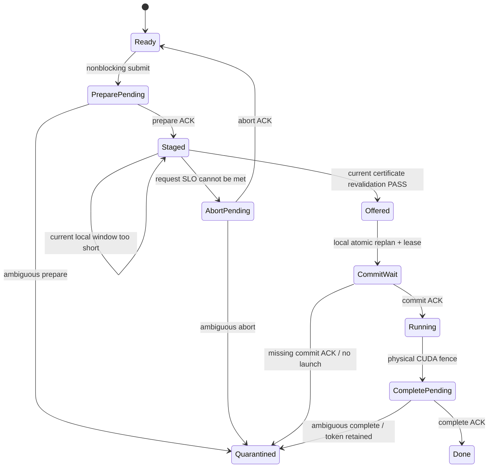

# SoftWall V14→V16 single-token pipelined control-plane 설계와 자격

**상태:** 2026-09-24, V14 ownership 반례, V15 runtime 교정과 C145--C148 V16 four-point 자격 반영  
**목적:** global AI ownership을 유지하면서 broker의 `prepare/complete` 지연을 RAN
recovery critical path에서 제거한다.

## 왜 V14가 필요했는가

V13은 broker fail-stop을 안전하게 처리했지만, 동기 `prepare`, `commit`, `complete` 세 RPC를
모두 local recovery horizon에 청구했다.

```text
B_eff,V13 = B_AI + B_prepare + B_commit + B_complete + g_AI
          = 35 + 7 + 7 + 7 + 2 = 58 ms
```

이 계약은 안전하지만 세 RPC의 controller-return wall bound가 모두 필요하다. C138은
5 ms socket timeout이 5 ms wall bound가 아님을 반증했고, V13은 별도 7 ms bound로 이를
교정했다. 그래도 OS/socket tail 세 개가 PHY admission의 전제로 남았다.

V14는 물리 AI launch를 허가하는 `commit`만 동기로 유지한다. `prepare`, `abort`,
`complete`는 별도 connection을 사용하는 control worker가 처리한다.

```text
B_eff,V14 = B_AI + B_commit + g_AI
          = 45 + 7 + 2 = 54 ms
```

현재 mode의 static all-fail slack은 53 ms이고 conditional decision window는 58 ms다.
따라서 AI45는 static 예약에는 들어가지 않고 recovery credit이 해소된 경우에만 들어간다.

## 상태와 전이



짧은 pre-radio window가 왔다고 staged token을 바로 abort하지 않는다. 같은 request의 SLO가
남아 있으면 이후 conditional 또는 post-radio window에서 다시 검사한다. 최초 C142 canary는
매 짧은 window에서 token을 abort해 commit이 0회였고, 이 오류를 보존한 뒤 위 규칙으로
교정했다.

## RAN 안전 규칙

1. `prepare` ACK는 실행 허가가 아니라 특정 home의 tentative ownership이다.
2. Controller는 staged request를 반환하기 직전에 현재 monotonic time, AI bound, request
   deadline과 local recovery horizon을 다시 검사한다.
3. Home별 launch 전 token은 staged 또는 offered 중 최대 하나다. 둘 중 하나가 존재하거나
   prepare가 pending이면 새 prepare를 발행하지 않는다.
4. Local recovery retime과 AI lease가 원자적으로 성공한 뒤에도 broker `commit` ACK가 없으면
   Qwen kernel을 제출하지 않는다.
5. Admission은 `B_commit` 전체를 AI bound와 fence guard에 더한다.
6. Qwen이 끝나면 local CUDA fence로 local AI lease를 회수할 수 있다. Global token은
   asynchronous `complete` ACK 전까지 inflight로 남아 다른 home에 재할당되지 않는다.
7. Deferred RPC가 timeout 또는 reply loss를 만나면 새 global AI admission을 닫고 애매한
   token을 격리한다. Local all-fail certificate와 certificate-ordered recovery는 기다리지 않는다.

Prepare post-apply reply loss에서는 client가 broker token ID를 알 수 없다. 이 경우
`staged+offered` 계수로 추적된 것처럼 보고하지 않고 home-level quarantine을 ownership
state로 사용한다. Prepare는 한 control worker에서 직렬 실행되고 fault 감지 즉시 admission을
닫으므로 anonymous ambiguous hold 뒤에 추가 prepare가 발행되지 않는다.

따라서 launch 시각 `t`와 가장 이른 recovery start `H`에 대해 필요한 시간 조건은 다음이다.

```text
t + B_commit + B_AI + g_AI <= min(H, d_AI)
```

`prepare`와 `complete`의 지연은 이 부등식에 들어가지 않는다. 그 대신 ownership/lifecycle
불변식으로 관리한다. 일반 OS scheduling 지연이나 local Python handoff가 사라진다는 뜻은
아니며, 현재 결과는 mode별 유한 표본 qualification이다.

## 검증 결과

| Gate | 결과 |
|---|---:|
| 유한 protocol model | 16 states, 20 transitions, invariant violation 0 |
| C142 AI45 | 2 arms, 2,560 TB, target branch 305, exchange 9, 위반 0 |
| C143 fault matrix | 6 arms, 16,320 TB, fault 뒤 14,184 TB, 위반 0 |
| C143 synchronous commit | 340 calls, 최대 5.148988 ms, 7 ms 초과 0 |
| C143 deferred control | 1,584 calls, 최대 9.614963 ms, 7 ms 초과 50 |
| C144 independent node | 6,080 TB, AI45 exchange 2, 세 fault point PASS |
| V14 node | `nid001361`, `nid002049` |
| V14 ownership regression | broker-held2/client-tracked1, untracked1; V14 mode UQ |
| V15 finite model | fault16-state/20-edge + ownership4-state/8-edge, violation0 |
| C145/C146 V15 | 새 node `nid001244`/`nid003417`, 12,160 TB, AI45 exchange12, fault6 arm, prepare 억제537, max unlaunched1, 위반0 |
| C147/C148 V16 | 새 node `nid003197`/`nid001005`, abort fault2 arm, 3,200 TB, post-fault2,662, target 실행0, 억제129, max unlaunched1, 위반0 |
| C145--C148 결합 | 네 operation별 fault arm2, 노드4개, radio15,360, post-fault10,125, 억제666, 위반0 |

Deferred path의 7 ms 초과 50회와 RAN 위반 0이 함께 나온 것이 핵심이다. V13처럼 모든 RPC가
7 ms 안이었다는 우연에 의존하지 않고, 긴 prepare/complete를 안전식 밖으로 옮긴 결과다.

V14 arm은 모두 drain됐지만 retained staged token 뒤 두 번째 prepare를 금지하는 gate가
없었다. 결정적 two-request 반례 때문에 V14는 현재 UQ다. V15 runtime은 C145/C146에서
문제가 된 억제 branch를 실제로 537회 관측하고 maximum unlaunched token을 1로 유지했다.
V16은 여기에 C147/C148의 abort post-apply reply-loss를 추가한다. 강화된 four-point gate에서
V15 three-point row는 UQ이고 V16-qualified row가 현재 QSU다.

## 노벨티에서의 역할

비동기 RPC, prefetch, at-most-once token은 일반 분산시스템 구성 요소다. 단독 novelty로
주장하지 않는다. SoftWall의 차이는 이 ownership pipeline을 다음 항목과 하나의 계약으로
연결한 데 있다.

- 같은 TB의 optional NeuralRx가 만든 conventional recovery debt
- multi-cell executable all-fail certificate
- recovery retime과 bounded Qwen lease의 원자 commit
- CUDA IPC/P2P/ring/fence의 physical-credit lifecycle
- multi-home global AI ownership과 fault quarantine
- launch 시 현재 local certificate를 다시 검사하는 admission inequality

현재 공개 선행 연구 조사에서는 이 전체 계약을 AI-RAN/cuPHY NeuralRx와 외부 LLM workload에
적용하고, static 불가·conditional 가능 service class와 control fault를 함께 검증한 연구를
확인하지 못했다. “비동기 control plane 최초” 또는 “유사 연구 없음”으로 표현하지 않는다.

## 남은 한계

- 실제 DU `d_MAC`가 없으므로 P180/D155는 synthetic timing contract다.
- 두 A100 node 결과이며 다른 GPU family의 자격은 없다.
- Broker restart, durable reconciliation과 stuck token 회수는 없다.
- Local controller/OS의 deterministic WCET를 증명하지 않았다.
- AI45 결과는 mechanism feasibility이며 end-to-end throughput 우위가 아니다.

## 권위 artifact

- [C142 result](../../results/softwall_multigpu/confirm142_v14_pipelined_result.json)
- [C143 result](../../results/softwall_multigpu/confirm143_v14_control_faults_result.json)
- [C144 result](../../results/softwall_multigpu/confirm144_v14_independent_node_result.json)
- [Finite model](../../results/softwall_multigpu/softwall_pipelined_control_model_v1.json)
- [Envelope V14 prediction](../../results/softwall_multigpu/softwall_sharded_home_envelope_prediction_v14.json)
- [Envelope V14 validation](../../results/softwall_multigpu/softwall_envelope_v14_validation_summary.json)
- [V14 immutable manifest](../../results/softwall_multigpu/softwall_v14_pipelined_control_manifest.json)
- [V14 ownership 반례와 V15 교정](SOFTWALL_V14_OWNERSHIP_CORRECTION_KO.md)
- [C145--C146 V15 결과](SOFTWALL_CONFIRM145_146_V15_SINGLE_TOKEN_RESULT_KO.md)
- [Finite model v2](../../results/softwall_multigpu/softwall_pipelined_control_model_v2.json)
- [Envelope V15 prediction](../../results/softwall_multigpu/softwall_sharded_home_envelope_prediction_v15.json)
- [Envelope V15 validation](../../results/softwall_multigpu/softwall_envelope_v15_validation_summary.json)
- [V15 immutable manifest](../../results/softwall_multigpu/softwall_v15_single_token_manifest.json)
- [C147--C148 V16 four-point 결과](SOFTWALL_CONFIRM147_148_V16_FOUR_POINT_RESULT_KO.md)
- [Envelope V16 prediction](../../results/softwall_multigpu/softwall_sharded_home_envelope_prediction_v16.json)
- [Envelope V16 validation](../../results/softwall_multigpu/softwall_envelope_v16_validation_summary.json)
- [V16 immutable manifest](../../results/softwall_multigpu/softwall_v16_four_point_manifest.json)
