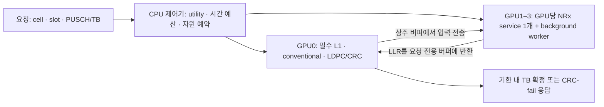

**SoftWall 구체 스킴과 진행 순서 — 2026-09-21**

상태: 동일 GPU S2 vertical slice 완료, 별도 NRx process와 다중 GPU 확장 진행안. P0–P5의 실제 결과는 [초기 실험 보고서](../../results/softwall_same_gpu/INITIAL_FEASIBILITY_REPORT_KO.md)와 [S2 자연 채널 보고서](../../results/softwall_same_gpu/S2_NATURAL_CHANNEL_REPORT_KO.md)를 따르며, 아래에서는 완료한 동일 GPU 구현과 아직 검증하지 않은 확장 가정을 구분한다. 관련 자료: [원 계획서](RESEARCH_PLAN_SOFTWALL_KO.md), [타당성 검토](RESEARCH_PLAN_SOFTWALL_REVIEW_KO.md).

**사용자 목표 확정에 따른 우선순위 변경:** 허용한 AI 작업 안에서 RAN deadline을 보장하고 남는 자원을 회수하는 것이 목표다. **같은 GPU / MIG OFF / MPS**에서 전체 PHY → 시간 분리 → 제한된 overlap을 먼저 검증한다. 구체적인 현재 스킴·실험·보장 조건은 [MPS 공유 타당성 문서](SOFTWALL_MPS_ISOLATION_FEASIBILITY_KO.md)를 따른다. 아래 L1 전용 GPU/pool 구조는 그 검증 이후의 비교·확장안이며, 동일 GPU 보호의 증거로 사용하지 않는다.

**선행 연구 점검 반영:** [AI-RAN related-work 검토](SOFTWALL_RELATED_WORK_AUDIT_KO.md)에서 GPU 공유·queue-aware pool 선택·AI/conventional 전환·작은 background 실행 단위의 선행 연구를 확인했다. 초기 Confirm38/41의 외부 경로에는 DART 원자 예약이 없었지만, Confirm42에서 연결했고 Confirm45/47의 실제 transaction 대 eager-dual 독립 seed·역순 비교는 모두 frozen gate를 통과했다. 조건부 시스템 결합의 실측 근거는 확보했다. 다만 강한 기존 기법 결합 baseline과 다중 셀 범위, 방어 가능한 worst-case timing bound가 없어 top-conference 수준의 최초성·운영 보증은 확정하지 않는다.

기여 구조와 일반 실시간 scheduling 대비 경계는 [novelty thesis](SOFTWALL_NOVELTY_THESIS_KO.md)를 따른다. 내부 DART/v0의 구성 요소도 외부와 구별되는 미발표 기여라면 논문에 포함할 수 있으며, 새 predictor를 반드시 추가해야 하는 것은 아니다.

**아래는 다중 GPU 확장에 진입했을 때의 순서다:** 실제 timing 확인 → 2-GPU pool-v0 → 강한 결합 baseline → 고정 모델의 공동 제어 → 필요할 때 적응 모델. 2-GPU에서는 admission·recovery·lease를 검증하고, endpoint 선택의 이득은 최소 3-GPU에서 검증한 뒤 4-GPU로 확장한다. 단일 GPU 검증은 더 이상 선택적 후속 항목이 아니다.

모든 프로젝트 파일·새 결과·실행 상태 파일의 기준 루트는 `/pscratch/sd/s/sgkim/kcj/airan_cloudlab`이다. 기존 스크립트를 실행하기 전 출력·모델·IPC 경로가 이 작업 제약을 만족하는지 확인한다.

**0. 현재 완료한 동일 GPU S2**

현재 구현은 한 A100/MIG OFF/MPS GPU에서 다음 transaction을 실행한다.

Confirm47/50의 외부 transaction P90/D80 시험 계약은 conventional GPU 25 ms와 commit guard 2 ms를 역산해 release 뒤 53 ms에 fallback을 시작하도록 예약한다. Optional NRx end-to-end admission bound는 50 ms이며, 50+25+2=77 ms로 D80 안에 3 ms 여유가 있다. Background NeuralRx는 RPC 40 ms 예산과 2 ms guard가 다음 release 또는 fallback 시작 전에 들어갈 때만 허가하고, socket timeout을 실행 전에 35 ms로 설정했다. Confirm47은 독립 seed·역순 eager 비교의 모든 frozen gate를 통과했고, Confirm50은 같은 계약의 gap ON/OFF 두 seed·역순에서 +0.468%/+0.535%와 모든 frozen gate 통과를 얻었다. 이는 측정 자격 검증이다. 이전 Confirm43/44의 30 ms NRx bound는 각각 3/40,000회 위반해 두 protocol이 실패했고, 당시 45 ms socket timeout은 40 ms AI 예산보다 길었다. 이 이전 실패를 새 50 ms 계약으로 소급해 지우지 않는다. 일반 controller 결과는 예약한 fallback 시각만 저장하고 실제 시작 시각을 저장하지 않는다. 새 계약도 hard deadline 증명이나 AI timeout 고장 시 fallback 시작 보장은 아니다.

```text
valid PUSCH release
  → NRx endpoint credit + conventional fallback interval 원자 예약
  → direct persistent NeuralRx full path
  → cutoff 전 valid CRC/payload이면 NRx single commit
  → 실패·지연이면 예약 시각에 conventional full path
  → late duplicate completion 거부
  → 다음 release 전 bounded background NeuralRx unit lease
```

10,000 one-cell paired releases에서 eager 대비 utility 비열등성과 background +3.17%, 보수적 host-tail budget의 3,000 two-cell releases에서 deadline/AI 위반 없이 background +5.53%를 확인했다. 100건의 30 ms start-delay injection은 모두 NRx admission을 거부하고 conventional로 안전하게 전환됐다. 두 셀은 단일 fallback lane의 서로 겹치지 않는 recovery interval을 예약했다.

초기 same-request S2는 NRx와 conventional을 같은 controller process에서 순서대로 호출했다. Confirm32에서는 request-specific PUSCH/channel estimate와 output LLR을 CUDA IPC로 전달하는 별도 persistent cap80 MPS endpoint를 연결해 clean 10,000 releases를 miss/timeout 0으로 통과했다. Confirm33은 같은 외부 endpoint의 −8.5 dB 10,000 releases에서 자연 fallback 221건 중 47건을 conventional로 복구하고 miss/timeout 0을 유지했다. Confirm36의 동일 node·trace 세 방식 비교에서도 외부 S2는 eager 대비 무선 효용 비열등성 및 deadline miss 0을 확인했다. Confirm37의 6 ms AI RPC 계약은 실패했고, 새 seed·40 ms 계약의 Confirm37b는 통과했다. Confirm38은 외부 S2 + cap20 bounded AI를 local S2/eager와 같은 node·trace에서 각각 10,000회 실행해 세 방식 모두 RAN miss·AI 계약 위반 0, 외부 방식의 eager 대비 완료 AI +2.93%를 관측했다. 다만 Confirm38의 외부 경로는 조건부 복구만 구현했고 원자 예약·single commit·gap lease를 연결하지 않았으므로 이 2.93%를 완성된 SoftWall 효과로 해석하지 않는다. Confirm42에서 실제 transaction 경로를 500회 smoke로 연결했다. Confirm43의 4×10,000회 gap ON/OFF에서는 RAN miss 0과 AI 순증 +1,069 units를 얻었으나 NRx 30 ms 상한 위반 3건으로 frozen gate가 실패했다. Confirm44 역순 반복도 4×10,000회 RAN miss 0과 AI 순증 +3,317(+1.304%)을 얻었으나 NRx 상한 위반 3건으로 실패했다. Confirm45의 실제 transaction 대 eager 비교는 두 독립 seed·역순 짝에서 AI +2.95%/+2.41%, 모든 frozen gate를 통과했다. 별도 overrun harness의 P60/D25는 cap100과 cap20 모두 실패했고, D35에서 admission quarantine만 한 confirm29는 cap20 1/5,000 miss, 즉시 종료한 confirm30은 cap100 6/5,000·cap20 11/5,000 miss였다. Confirm31 maintenance 자료는 다른 campaign과 release 구간이 겹쳐 PASS 근거에서 제외했다. Confirm39의 깨끗한 maintenance subgroup은 통과했으나 sham retirement는 실패했다. Confirm46 CPU-only 대조에서 CPU 0/10,000 대 GPU/MPS retirement 12/10,000 miss, 짝 단위 p=0.00390625로 lifecycle 경로의 위험을 재현했다. 남은 게이트는 NRx tail의 보수적 bound/GC 원인 진단과 AI timeout fault injection이다. 아래 다중 GPU 설계는 그 다음 확장이다.

**1. 연구 목표와 구현 버전**

목표는 고정 GPU 예산에서 다음 제약을 함께 충족하면서 background의 유효 처리량을 높이는 것이다.

- L1의 deadline miss가 정해진 허용치 이하일 것.
- delivered radio utility가 정해진 하한 이상일 것. NRx를 모두 거부하는 정책과 구분한다.
- 만료·중복·이전 epoch의 결과가 현재 요청 상태를 바꾸지 않을 것.

여기서 radio utility는 deadline 안에 얻은 correct-TB 또는 유효 비트량으로 정의한다. 실제 허용 miss와 utility 하한은 배포 요구 또는 명시적 실험 조건으로 고정한다. 현재 수치만으로 hard real-time 보장을 선언하지 않는다.

| 버전 | 구체 동작 | 역할 |
|---|---|---|
| v0 | L1 전용 GPU, 상주 NRx endpoint, conventional·NRx 후처리 예약, NRx/AI를 work-unit 경계에서 교대 | 정확성과 실행 가능성을 검증하는 최소 구현 및 강한 baseline |
| v1 | 고정된 utility·비용 모델로 NRx admission/placement·후처리/recovery·새 background 허가를 함께 선택 | 예측 모델 개선과 분리해 공동 의사결정의 추가 이득을 검증 |
| v1의 선택 확장 | endpoint별 간섭·잔여 lease·예측 오차의 온라인 보정; 검증된 조합의 NRx/AI 동시 실행 | 고정 모델의 한계가 확인된 뒤 추가하고 별도로 ablation |
| 확장 | pool 배치의 GPU0 background 회수, batch, 노드 간 pool | 같은 GPU 필수 검증 및 기본 pool 실험 통과 후 선택 |

v0 자체를 새 알고리즘이라고 주장하지 않는다. 기존 DART에도 admission, background profile, recovery calendar, lease가 있다. 외부 선행 연구에도 유사한 구성 요소가 있으므로 실제 GPU 경로의 구현과 v1의 성능 개선만으로 새로움이 자동 성립하지 않는다. joint 제어가 기존 기법의 결합으로 해결되지 않는 어떤 한계를 해소하는지와, 같은 제약에서의 유효 작업 증가를 함께 입증해야 한다.

**2. 배치와 데이터 경로**



GPU0에는 기본 버전에서 background를 배치하지 않는다. NRx의 LDPC/CRC도 GPU0에서 수행한다는 가정을 명시하고 그 시간까지 예약한다. GPU1–3에는 상주 TensorRT/CUDA Graph NRx service와 협조적인 background worker를 둔다. 초기에는 endpoint마다 background worker 한 개, 한 번에 미완료 work unit 한 개로 제한한다.

CPU 제어기는 node 전체의 local calendar, endpoint queue, transport credit, ring slot을 관리한다. v0에서는 단일 제어기가 예약을 직렬화해 동시 admission의 충돌을 피한다. GPU별 독립 worker가 실제 실행하고 completion을 보고한다.

데이터 평면 후보는 CUDA IPC로 공유한 상주 버퍼와 물리 GPU 간 P2P다. push/pull은 측정 후 결정한다. 전송을 NRx 측에서 발급한다는 이유만으로 GPU0 간섭이 사라진다고 가정하지 않는다. source GPU의 동시 전송 수를 credit으로 제한하고, 허용 전송 부하에서의 GPU0 지연을 profile에 포함한다. 처음에는 source transfer credit 1로 경로를 검증한 뒤 늘린다.

**3. 요청 하나의 처리 절차**

요청의 유일한 ID는 `(cell, slot, PUSCH/TB, request_epoch)`다. 별도로 endpoint health epoch와 buffer generation을 둔다. 시간 예산은 source의 단일 monotonic clock을 기준으로 관리한다.

| 기호 | 의미 |
|---|---|
| `r` | 실제 input 준비/release 시각 |
| `d` | PHY 결과를 공개해야 하는 absolute expiry |
| `Cconv` | conventional receiver + LDPC/CRC의 예약 비용 |
| `g` | host 제어·commit·타이밍 오차를 위한 guard |
| `f` | 예약한 conventional 시작 시각. `f + Cconv + g <= d`여야 함 |
| `[a, b]` | NRx LLR를 LDPC/CRC 처리하기 위해 확보한 GPU0 시간 구간 |

`f`는 단순히 모든 요청에 `d - Cconv - g`를 넣은 값이 아니다. 다른 셀의 필수 작업과 충돌하지 않는 실제 calendar slot이어야 한다. 여러 요청에 같은 recovery 시간을 중복 판매해서는 안 된다.

**단계 A — 필수 경로를 확보한다.**

기본 부하의 모든 요청에 필수 L1 및 conventional 경로의 실행 여력을 확보한다. NRx가 거부된 요청도 이 calendar에 포함한다. 필수 경로조차 들어가지 않으면 baseline 용량 초과로 기록한다. 이를 단순한 NRx 거부로 숨기지 않는다.

**단계 B — NRx가 도움이 되는 요청인지 판단한다.**

현재 관측 가능한 채널 추정·MCS·텐서 형태 등으로 NRx의 추가 성공 가능성을 추정한다. 초기에는 별도 paired radio 데이터로 만든 고정 utility table을 사용한다. 평가 요청의 미래 CRC/정답을 admission에 넣지 않는다. 기대 이득이 낮으면 conventional만 실행한다.

**단계 C — NRx 처리와 로컬 후처리를 함께 예약한다.**

GPU0에서 다른 필수 작업과 충돌하지 않는 `[a,b]`를 찾는다. v0는 이 구간의 완료와 제어 guard가 `f` 이전에 들어오는 경우만 NRx를 허용한다. 즉, NRx가 실제로 성공했는지 확인한 뒤 fallback 실행 여부를 결정할 수 있게 한다.

endpoint `e`의 보수적 반환 예상 시각은 다음 형태로 계산한다.

```text
start_e = max(now, existing_NRx_queue_end_e, outstanding_lease_end_e)
return_e = start_e + input_transfer + NRx_service + output_transfer + error_margin

수락 조건:
    return_e <= a
    NRx 후처리와 guard가 f 이전에 끝남
    conventional 예약이 d 안에 끝남
    source 전송 credit 및 input/output ring slot 확보
```

전송 대기까지 각 비용 또는 calendar에 포함해야 한다. 서로 겹쳐 실행할 수 있는 작업의 비용은 측정 모델로 개선할 수 있지만, v0에서는 직렬 비용으로 보수적으로 시작한다. 프로파일의 추정 상한은 검증 대상이며 수학적 WCET가 확보됐다고 간주하지 않는다.

조건을 만족하는 endpoint 중 반환 예상이 가장 빠른 곳을 고른다. 동률이면 추가 background 중단 비용이 작은 곳을 고른다. endpoint와 local optional slot 예약에 실패하면 partial reservation을 되돌리고 conventional 예약을 유지한다.

**단계 D — 후보 결과를 처리한다.**

LLR가 `a`까지 올바른 ID/epoch/buffer에 도착하고 전송 완료가 확인됐을 때만 예약한 NRx LDPC/CRC를 실행한다. CRC가 통과하면 TB를 한 번 공개하고, 아직 실행하지 않은 conventional 예약을 해제한다.

NRx가 늦거나 CRC가 실패하면 `f`에 conventional을 실행한다. v0에서는 fallback이 시작된 뒤 늦게 오는 NRx 결과를 새로 채택하지 않는다. 이는 추가 decoder 경합을 피하는 보수적인 설계 선택이다. 원 계획의 두 경로 동시 경쟁 방식은 두 후처리 자원까지 예약할 수 있을 때 확장한다.

conventional도 CRC에 실패하면 정해진 시한 안에 실패 응답을 확정한다. `timely CRC-fail`은 무선 품질 실패이고, 계산 결과 자체를 제때 내지 못한 `deadline miss`와 별도 집계한다.

**단계 E — 논리적 종료와 물리적 자원 회수를 분리한다.**

결과를 포기했어도 실행 중인 kernel/DMA가 즉시 사라진 것은 아니다. input/output slot과 실행 credit은 실제 읽기·쓰기 완료를 확인한 뒤 반환한다. endpoint가 재시작하면 이전 generation의 buffer는 격리하고, 오래된 writer가 더 이상 접근하지 않음을 확인하기 전 재사용하지 않는다.

Bound 위반 endpoint는 late completion을 drain한 뒤 `QUARANTINED_IDLE`로 전환한다. 이 상태에서는 새 NRx/background admission을 모두 거부하지만 process와 CUDA context를 실시간 구간에서 파괴하지 않는다. RAN release가 없는 maintenance window를 확보한 뒤 worker stop, client disconnect, MPS cleanup 완료를 확인하고 새 health epoch로 재시작·재qualification한다. Confirm30에서 즉시 teardown 뒤 conventional GPU tail이 42–100 ms까지 늘어났으므로 kill을 deadline recovery primitive로 사용하지 않는다.

**단계 F — v1에서는 가능한 실행 계획의 비용까지 비교한다.**

v0의 earliest-return 선택은 비교 기준으로 유지한다. v1은 새 요청 도착, NRx/복호 완료, background unit 완료 때 현재 상태를 갱신하고 유한한 후보를 평가한다.

```text
후보 p = (conventional-only 또는 NRx endpoint,
          local 후처리 구간, conventional 실행 구간,
          다음에 허가할 background unit 크기 또는 0)

1. 기존 요청의 필수·복구 예약을 보존할 수 없는 후보 제외
2. 전송·ring·미완료 작업 점유까지 포함해 시간 조건 검사
3. 가능한 후보의 예상 radio 이득과 background/로컬 비용 비교
4. 예약을 한 번에 확정하고 실행; 부분 실패 시 provisional 예약 회수
```

기존 실행 중인 background unit은 후보 선택으로 중단하거나 크기를 바꾸지 못한다. 다음 허가부터 변경하며, 기존에 수락한 NRx의 예약도 보존한다. 첫 구현은 단일 CPU 제어기가 결정·예약을 직렬화한다.

첫 비교 정책의 예시는 정규화된 `score(p) = ΔU(p) − λ·ΔB(p) − μ·ΔL(p)`다. `ΔU`는 conventional-only 대비 예상 deadline-valid radio 이득, `ΔB`는 background 유효 작업의 기회비용, `ΔL`은 순 로컬 실행/예약 부담이다. GPU0의 절약을 GPU1–3의 background 절약으로 중복 계산하지 않는다. 비용은 총 소비량과 해당 자원의 예약 압력을 분리해 기록한다.

이 식은 공동 제어 가설을 검사할 시작 정책이며 새 최적 알고리즘이라는 주장이 아니다. `λ, μ`는 별도 calibration 자료에서 선택해 평가 중 고정하고, 같은 가중치/모델 정보를 baseline에도 제공한다. 최종 평가는 여러 정책 설정의 trade-off 중 같은 miss·radio utility 요구를 충족한 구성을 비교한다. 이 점수만으로 전역 최적성이나 radio utility 하한을 보장하지 않는다. 작은 trace의 완전탐색 결과와 비교하고, 미래 정보를 쓰는 oracle은 달성 가능한 online baseline과 구분한다.

**4. background lease의 의미**

lease는 GPU의 percentage를 실시간으로 변경하는 명령이 아니라, **정해진 크기의 GPU work unit을 한 번 발급할 수 있는 허가**다. background worker는 unit 실행을 끝내고 GPU 완료를 확인한 다음 다음 허가를 받는다.

v0에서는 NRx 예약 사이의 빈 구간에만 unit을 발급한다.

```text
now + unit_cost_bound + drain_and_control_guard <= next_reserved_NRx_start
```

예약된 NRx가 없다면 배포 시 정한 최대 quantum까지 허용한다. 그 사이 새 요청이 도착하면 남은 unit 시간도 `return_e`에 포함한다. 늦을 것으로 보이면 다른 endpoint를 선택하거나 conventional로 보낸다. 이미 실행 중인 unit을 즉시 중단한다고 가정하지 않는다.

미리 수락한 NRx의 예약은 새 lease 때문에 뒤로 밀리지 않아야 한다. v1에서 동시 실행을 허용할 때도 영향받는 모든 수락 요청의 시간 조건을 다시 확인해야 한다. queue의 첫 요청만 검사하면 충분하지 않다.

고정 모델 v1도 endpoint별 현재 background 종류/phase, outstanding work, 전송 상태를 사용한다. 온라인 보정 확장에서 최근 서비스 오차를 추가 반영한다. 미지 workload나 급격한 상태 변화에서는 새 background 발급을 멈추고 완료를 확인한 뒤 검증된 profile로 돌아간다. 단순히 `isolated` 수치로 추정값만 바꾸면 안 된다.

예측 시간을 초과한 unit은 deadline 실패 여부와 별도로 `bound_violation`으로 기록하고 해당 endpoint의 새 admission/lease를 제한한다. 실제 drain 확인 전에는 실행 credit을 반환하지 않는다. v1의 효과는 fixed profile와 v0를 모두 baseline으로 비교한다.

**5. 숫자로 보는 예시 — 아래 값은 동작 설명용이며 실측이 아니다**

가상의 요청에서 `r=0ms`, `d=5ms`, conventional 예약을 `3.8–4.6ms`, 마지막 guard를 `0.4ms`로 잡았다고 하자. GPU0에 NRx 후처리 구간 `2.8–3.2ms`도 확보되어 있다.

| 후보 | lease·queue·전송을 포함한 예상 LLR 반환 | 판단 |
|---|---:|---|
| GPU1 | 3.1ms | 2.8ms 후처리 시작을 놓치므로 선택하지 않음 |
| GPU2 | 2.4ms | 수락 가능 |
| GPU3 | 2.6ms | 수락 가능하나 GPU2를 먼저 선택 |

GPU2 결과가 제시간에 도착하면 2.8–3.2ms에 LDPC/CRC를 실행한다. 성공하면 결과를 공개하고 3.8ms conventional 예약을 해제한다. 결과가 늦거나 복호 실패하면 3.8ms에 conventional을 실행한다. 4.0ms에 뒤늦게 도착한 NRx는 v0에서 채택하지 않는다.

이 예시의 5ms를 production deadline으로 사용하자는 뜻은 아니다. 실제 `d-r`와 두 경로 비용은 첫 측정에서 결정한다. NRx와 recovery를 모두 확보할 시간이 없다면 해당 요청은 이 보수적 정책의 admission 대상이 아니다. 이 조건에서 유효 NRx가 거의 사라지면 v0의 한계 자체가 초기 판단 결과가 된다.

**함께 고려할 실행 방식은 다음 세 가지다.**

| 방식 | 시간·자원 측면의 특성 | 현재 역할 |
|---|---|---|
| conventional을 일찍 실행하며 별도 GPU의 NRx도 시도 | conventional 결과를 먼저 확보. 두 경로가 겹칠 수 있어 NRx의 시간 창이 길어지지만 conventional 계산을 항상 지불 | 반드시 비교할 강한 baseline |
| NRx 성공 여부를 확인한 뒤 예약한 conventional 실행 | 성공한 요청의 conventional 계산을 생략할 수 있지만 NRx·후처리·복구가 순서대로 들어갈 시간이 필요 | v0 기본 스킴; v1의 첫 공동 제어 대상 |
| conventional이 시작된 뒤에도 NRx 결과 채택 허용 | 늦은 NRx 기회를 늘릴 수 있지만 두 복호 경로의 자원·버퍼와 단일 commit을 함께 관리해야 함 | 앞선 두 방식의 측정 후 선택 확장 |

conventional을 먼저 실행하는 baseline도 NRx 후처리 자원을 제한해야 한다. Conventional CRC가 통과하면 그 결과로 성공을 확정할 수 있고, 실패했으면 expiry 안에 NRx가 추가 성공 기회를 제공할 수 있다. 어느 결과든 확정한 뒤에는 한 번만 공개하며, 포기한 경로의 자원은 물리 완료 후 반환한다.

지연 fallback의 이득은 자동으로 생기지 않는다. GPU0를 비워 둔 것만으로 pool의 AI가 빨라지지 않으며, 절약이 더 많은 셀/후처리 수용이나 에너지·노드 자원 효율로 이어지는지 측정한다. Conventional을 먼저 실행하는 방식이 같은 조건에서 충분하면 더 복잡한 복구 정책을 핵심 기여로 고집하지 않는다.

**6. 다중 GPU 확장에 진입한 뒤의 작업 순서**

| 순서 | 작업 | 산출물 | 다음 단계로 넘어갈 기준 |
|---|---|---|---|
| 1 | timing contract와 workload를 고정 | release/branch-ready/LLR-ready/CRC/commit, 실제 expiry, PRB/MCS·셀·arrival, miss·utility 요구 | slot 주기와 expiry를 분리하고 기존 측정값의 범위를 설명할 수 있음 |
| 2 | single-request full path 및 paired radio 측정 | conventional/NRx 지연 분해와 동일 입력의 성공 여부; background unit별 실제 완료 비용 | 기본 conventional이 실행 가능하고 NRx에 시간 창과 무선 이득이 모두 존재 |
| 3 | GPU 2장으로 v0 구현 | admission → P2P → NRx → CRC 또는 fallback → commit → 물리 자원 반환 | 정상/지연/CRC-fail/중복/expiry에서 올바른 종료와 buffer 수명 확인 |
| 4 | 단일 harness에 강한 baseline 연결 | conventional-only, conventional 선실행, 분리된 utility/배치/lease 제어, 기존 DART/v0 | 같은 도착 trace·GPU 예산·관측 정보·안전장치로 비교 가능 |
| 5 | 최소한의 실패 원인·손실 실험 | 동시 fallback, phase 변화, 만료 후 미완료 작업의 비용 | 기존 결합의 한계가 관측되거나, 강한 baseline이 충분하다는 결과를 얻음 |
| 6 | 고정 모델 v1 공동 제어 | 같은 비용/utility 모델에서 independent vs joint 비교; 작은 trace의 상한 | 개선이 제어 결합에서 비롯됨을 설명하고 오버헤드 포함 유효 이득 확인 |
| 7 | 최소 3-GPU endpoint 선택, 이후 4-GPU·multi-cell 확장 | 같은 노드 예산의 utility–background trade-off와 tail/fallback burst | 특정 설정 하나에만 의존하지 않는 이득과 한계 제시 |
| 8 | 필요한 경우 온라인 보정·동시 실행 | fixed/adaptive × independent/joint ablation | 측정으로 확인된 병목에 대해 추가 복잡도의 이득이 존재 |

다중 GPU 확장의 첫 작업 단위는 1번의 timing/workload 명세, 2번의 full-path 측정표, 3–4번을 위한 공통 harness와 정책 인터페이스다. 앞선 동일 GPU 단계의 측정과 계약은 재사용한다. 날짜보다 게이트를 우선한다. 2-GPU에서는 NRx endpoint가 하나라서 placement 개선을 입증할 수 없으며, 그 단계의 주장은 admission·복구·lease로 한정한다. 선행 연구의 미확인 항목은 이 과정과 병행해 claim별로 보완한다.

즉시 확인할 코드 사실이 하나 더 있다. 현재 [real_l1.py](../../scripts_for_node/task1/real_l1.py)의 `run_one_cell()`은 CE/NI/EQ 뒤 LLR를 반환하며, LDPC/CRC 실행은 미뤄 두었다. 입력도 합성 tensor다. 이 파일의 실행 시간을 전체 PHY 완료 시간으로 사용해서는 안 된다. full-path harness에는 LDPC/CRC와 실제 paired radio 입력을 연결하고, timing-only synthetic 측정과 구분한다.

또한 [cuda_ipc_l1_producer.py](../../scripts_for_node/task1/isca_v2/cuda_ipc_l1_producer.py)는 arrival-rate 인자가 있지만 각 요청의 반환을 기다린 뒤 다음 loop로 진행한다. 새 harness는 offered arrival을 이전 완료와 독립적으로 기록하고, 실제 enqueue 지연·queue/drop·absolute expiry를 모두 남겨야 한다.

**최소 실험 세 개와 해석 기준:**

| 실험 | 구성 | 측정 / 해석 |
|---|---|---|
| E1 동시 fallback | 두 셀부터 시작해 정상 NRx 지연과 동시 지연을 비교 | fallback 수요·예약 충돌·L1 miss·예약 유휴 시간. 인위적 지연 주입과 자연 발생 trace는 별도 표시 |
| E2 공유의 효율 | 같은 radio/arrival trace에 background 종류·phase·unit 크기를 변경 | 같은 miss/utility 요구에서 background 유효 처리량. 분리 제어와 공동 제어의 정보·profile을 동일하게 유지 |
| E3 만료 후 점유 | 일부 NRx를 논리적으로 종료하되 kernel/DMA는 계속되는 경우 | 잘못된 commit, buffer 재사용, outstanding credit, 후속 요청 지연. 안전한 baseline도 동일한 수명 규칙 적용 |

GPU timestamp를 서로 다른 장치에서 직접 빼지 않는다. Source monotonic clock의 요청 기준 시간과, 장치 내부에서 측정한 stage duration을 구분해 기록한다. 주요 event에는 `cell/slot/TB/epoch`, 계획한 예약, 실제 완료, 미수락 이유, CRC 결과, 실제 자원 반환을 함께 남긴다. 로그·계측 오버헤드도 측정한다.

**7. 기존 코드와 추가 작업의 대응**

| 기존 파일 | 재사용할 부분 | 추가 또는 검증할 부분 |
|---|---|---|
| [dart_runtime.py](../../scripts_for_node/task1/isca_v2/dart_runtime.py) | endpoint 예약, profile, fallback, lease, epoch | 필수 요청 전체 calendar, optional LDPC slot, endpoint별 동적 상태, 물리 완료와 종료 분리 |
| [test_dart_runtime.py](../../scripts_for_node/task1/isca_v2/test_dart_runtime.py) | 순수 정책 테스트 | 여러 셀의 recovery 충돌, 만료 후 DMA/credit, late NRx, CRC-fail 종료의 계약 테스트 |
| [nrx_trt_direct.py](../../scripts_for_node/task1/nrx_trt_direct.py) | 상주 binding·CUDA Graph | 텐서 형태별 실제 비용, graph/buffer 수명, batch 변경 시 별도 engine 필요 여부 |
| [real_l1.py](../../scripts_for_node/task1/real_l1.py) | 기존 측정과의 대응, CE/NI/EQ 구성 | full-path harness와 legacy timing 분리; 실제 expiry와 slot pacing 추가 |
| [cuda_ipc_l1_producer.py](../../scripts_for_node/task1/isca_v2/cuda_ipc_l1_producer.py) | IPC handoff·단계별 측정 | source timing·비동기 arrival·요청별 ring 관리 |
| [p2p_copy_gate.py](../../scripts_for_node/task1/p2p_copy_gate.py) | 전송 무결성·시간 검증 패턴 | same-GPU MIG 전제 제거, 물리 GPU topology·push/pull·동시 전송 검증 |
| [background_gated.py](../../scripts_for_node/task1/isca_v2/background_gated.py) | 협조적 unit 경계·GPU 완료 확인 | 파일 gate 지연 계측, 필요 시 저비용 local IPC, unit ID·grant/ack·bound violation |

새 결과는 `results/softwall_v0/` 아래에 stage별로 두고, 실행 상태는 `run_state/softwall_v0/` 아래에 둔다. metadata에 driver/CUDA/MPS/cuPHY/TRT 버전, GPU topology, 모델·tensor 설정, PRB/MCS/셀/UL 비율, deadline, workload seed를 기록한다. 기존 결과의 수치 정정은 원본 데이터와 생성 코드를 함께 대응시켜 처리한다.

**8. 최종적으로 비교할 최소 일곱 구성**

| 구성 | 역할 |
|---|---|
| 같은 노드의 conventional-only L1 | mandatory 용량과 radio utility의 기준 |
| conventional 선실행 + 별도 GPU의 선택적 NRx | 단순한 결과 확보 방식 대비 지연 fallback의 비용·이득 확인 |
| 전용 L1 + 단순 NRx pool + 고정 background 정책 | 배치·GPU 수의 효과를 통제 |
| 전용 L1 + 기존 DART profile/admission/lease | 기존 자산 대비 개선인지 확인 |
| 채널 기반 NRx gate + queue-aware pool + 고정 recovery 여유 + 고정 background unit | 선행 기법을 결합한 강한 baseline. 같은 정보·안전장치·GPU 예산으로 충분히 튜닝 |
| SoftWall v0 | 실제 recovery·후처리·buffer 계약과 unit 교대의 효과 |
| SoftWall v1 | 우선 고정 모델에서 공동 제어의 효과; 온라인 보정·동시 실행은 추가 ablation |

공통으로 offered 요청 수, L1 miss, timely CRC-fail, correct-TB/bit, NRx 수락·유효 완료·late 비율, background 처리량, GPU/CPU 자원 수를 보고한다. sample 수와 반복 run도 함께 기록한다. 논문의 주 그림은 **동일 L1/utility 요구에서의 background 처리량**, 또는 **동일 background 처리량에서의 delivered utility**가 된다.

핵심 반증 기준은 분명하다. full-path가 시간 안에 들어오지 않으면 timing/model 문제가 먼저다. lease 단위가 너무 길면 background를 쪼개거나 해당 workload를 제외해야 한다. 고정 모델 v1이 강한 결합 baseline이나 기존 DART/v0보다 낫지 않으면 공동 제어의 추가 기여를 재검토한다. 온라인 보정은 별도로 fixed model 대비 이득을 보여야 한다. 기존 기법의 결합 baseline 대비 joint 제어의 원인과 이득까지 확인해야 “안전한 예약과 간섭 제어가 실제 유효 작업을 늘린다”는 연구 주장을 뒷받침할 수 있다.
