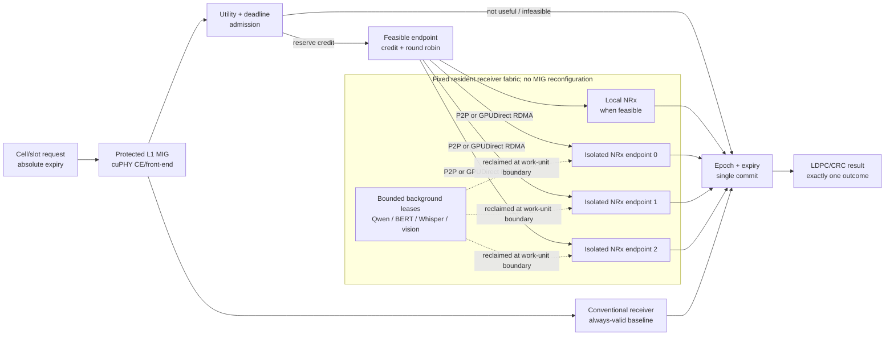
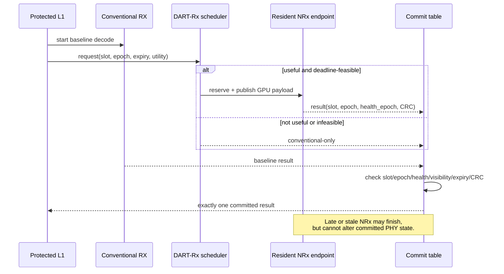

# Chapter 2 · Architecture

**MIG–NRx AI-RAN research walkthrough (KO) · docs/current/walkthrough_ko/02_architecture.md 페이지**

네비게이션: [Index](README.md) · Prev: [01 Problem](01_problem_and_context.md) · Next: [03 Evaluation](03_evaluation.md)

---

## 5. 전체 문제를 한 번에 보면: 각 방식은 한 축만 해결한다

> **NRx 요청이 갑자기 몰려 현재 MIG의 처리량을 넘었을 때, L1과 MIG 구성을 건드리지 않고
> 다른 GPU 공간의 NRx를 빌려 쓰되, 늦거나 이전 slot의 AI 결과가 최종 무선 결과에 섞이지
> 않게 하는 문제.**

조금 더 형식적으로는, 선택적으로 유용한 NRx request의 burst가 static placement capacity를
초과할 때 protected L1을 중단하거나 MIG topology를 재구성하지 않고 다른 isolated resident
accelerator의 capacity를 사용하면서 late/stale result의 PHY-state commit을 막는 문제다.

어려운 이유는 단순 load balancing이 아니기 때문이다.

| 제약 | 왜 필요한가 |
|---|---|
| Static spatial isolation | L1 p99를 co-tenant로부터 보호해야 한다. |
| Dynamic service demand | NRx request는 cell 수와 channel condition에 따라 burst한다. |
| Dependency transport | 원격 NRx는 L1 tensor를 받고 LLR을 다시 돌려줘야 한다. |
| Absolute expiry | deadline 뒤 도착한 정확한 결과도 해당 slot에는 쓸 수 없다. |
| Conventional baseline | optional NRx가 실패해도 PHY recovery path가 남아 있어야 한다. |
| Background utility | peak만 보고 spare accelerator를 항상 비워둘 수 없다. |

### 5.1 기존 방식별로 어디까지 해결하고 어디서 멈추는가

| 방식 | 실제로 해결하는 것 | 실측으로 드러난 한계 | 그래서 필요한 다음 기능 |
|---|---|---|---|
| **Full MPS** | 한 full GPU의 SM을 여러 process가 work-conserving하게 사용 | NRx process `1→8`에서 L1 p99 `42.3→189.3 ms`; 물리적 L1 보호벽이 없음 | mandatory L1과 optional NRx의 compute domain 분리 |
| **MIG local** | sibling 3g의 Qwen 간섭으로부터 4g를 강하게 보호 | 같은 4g의 L1+NRx는 격리되지 않고 L1 active `1.621×`; 한 endpoint capacity는 고정 | L1 전용 MIG와 NRx 전용 MIG 분리, 외부 capacity 접근 |
| **MIG+MPS local** | sibling MIG 격리를 유지하며 한 4g 안의 평균 share 조절 | quota를 바꿔도 새 하드웨어 벽이나 4g 밖 capacity가 생기지 않음 | share tuning이 아니라 다른 resident endpoint로 scale-out |
| **Cross P2P** | peer 가능한 MIG pair에서 compute queue를 분리하고 L1 slowdown을 `1.043×`로 회복 | 지원 topology와 process 범위가 제한되고 한 remote NRx가 차면 끝 | P2P 범위 밖 endpoint까지 가는 공통 data path |
| **Cross NIC GDR** | CPU DRAM bounce 없이 다른 MIG/process/GPU memory까지 도달 | P2P보다 평균 `0.438 ms` 비싸며, 어느 endpoint를 고를지와 late result 처리는 해결하지 않음 | deadline-aware routing, bounded credit, expiry-safe commit |
| **여러 NRx + static binding** | endpoint 수만 미리 늘려 둠 | 한 queue는 수 초로 무너지는데 다른 endpoint-time `66.7%`가 idle | request-level endpoint pool과 deadline admission |

이 표의 결론은 특정 mechanism 하나가 나쁘다는 것이 아니다. **MPS는 utilization, MIG는
isolation, P2P/GDR는 reachability를 각각 제공하지만, isolation을 유지한 상태의 동적 NRx
service와 deadline correctness를 하나도 완성하지 못한다.**

### 5.2 실험에서 도출되는 설계 요구조건

| 관측된 문제 | 시스템에 필요한 성질 | DART-Rx에서 맡는 블록 |
|---|---|---|
| MPS의 co-tenant pressure가 L1 tail로 전파 | mandatory PHY의 고정된 물리 보호 경계 | **Protected L1 MIG** |
| MIG 재구성은 fast path에서 불가능하고 endpoint 시작도 비쌈 | model/context/graph/buffer가 미리 준비된 고정 endpoint | **Resident NRx fabric** |
| P2P가 닿지 않는 MIG/GPU가 존재 | CPU DRAM staging 없는 remote GPU data path | **P2P/GDR tensor plane** |
| busy queue와 idle NRx가 동시에 존재 | 요청마다 endpoint를 고르고 자리를 예약 | **Request-level dispatch + bounded credit** |
| 평균 load가 낮아도 burst는 deadline을 넘김 | 늦을 요청을 queue에 넣지 않는 absolute-deadline admission | **Utility/deadline admission** |
| remote NRx는 늦거나 실패하거나 이전 slot 결과를 반환할 수 있음 | 기존 수신 결과를 보존하고 하나만 확정 | **Conventional fallback + versioned exactly-one commit** |
| spare endpoint를 항상 비우면 비용 낭비 | NRx burst 때 유한 시간 안에 회수 가능한 background 실행 | **Bounded background lease** |

### 5.3 따라서 설계는 다음 인과관계로 이어진다

```text
MPS의 work conservation만 사용
    → L1을 co-tenant tail에서 보호할 수 없음

MIG로 고정 격리
    → L1은 보호되지만 NRx capacity가 방별로 고정

P2P/GDR로 방 사이의 GPU-memory 경로 개방
    → remote NRx에 도달하지만 queue 선택과 결과 유효성은 모름

resident endpoint + shadow reservation으로 하나를 선택
    → idle capacity를 사용하지만 overload/late result는 여전히 가능

deadline admission + conventional fallback + versioned commit
    → 제시간에 끝날 NRx만 사용하고 늦은 결과는 PHY state에서 차단

bounded background lease
    → peak를 위해 항상 비워 두지 않으면서 burst 때 capacity 회수
```

따라서 DART-Rx는 “MIG를 빠르게 재구성하는 방법”도, “GDR가 P2P보다 빠르다는 방법”도
아니다. **고정 MIG가 제공하는 L1 isolation을 유지한 채, 미리 상주한 여러 NRx의 service
capacity를 요청 단위로 빌리고, 그 결과를 deadline-safe하게 PHY에 commit하는 architecture**다.
다음 Part II의 네 설계 블록은 위 표의 요구조건을 그대로 구현한다.

---

# Part II. DART-Rx design

## 6. Overall architecture

DART-Rx는 여러 이름의 독립된 기법 모음이 아니다. **L1 전용 공간은 그대로 두고, 여러 NRx
endpoint를 하나의 선택 가능한 pool로 보이게 만드는 slot 처리 pipeline**이다.


*그림의 `REQ`/`RES` 포트와 녹색선은 논리적 GDR request/result channel을 요약한
표현이다. 예시는 NRx 1 하나를 선택하며, NRx 2가 실행되거나 CQ가 tensor payload를
전달한다는 뜻이 아니다. 실제 control, payload, completion 경로는 아래 절에서 각각
분리해 설명한다.*

### 6.1 “현재 줄이 짧은 NRx”를 어떻게 아는가

여기서 queue는 GPU hardware queue를 원격으로 들여다본 값이 아니다. **L1 측 dispatcher가
endpoint별로 유지하는 outstanding-request 장부(shadow queue state)**다. `pending=3`은 그
endpoint가 받아들였지만 아직 completion을 돌려주지 않은 요청이 3개라는 뜻이며, 현재 실행
중인 요청도 포함한다. 따라서 매 요청마다 NIC를 통해 상대 GPU에 “몇 개 남았나”를 묻지 않는다.

현재 prototype은 endpoint마다 다음 상태를 가진다.

| Scheduler가 가진 값 | 뜻 | 언제 바뀌는가 |
|---|---|---|
| `pending` | 제출됐지만 완료되지 않은 요청 수 | submit에서 `+1`, result completion에서 `-1` |
| `predicted_tail` | 이미 예약된 요청들이 끝날 것으로 보는 시각 | submit 때 service bound만큼 뒤로 예약, queue가 비면 `now`로 복원 |
| `service_bound` | 요청 하나의 보수적 service/exchange 시간 | 시작 calibration 후 최근 completion 표본으로 갱신 |
| `available` | endpoint가 선택 가능한지 여부 | error 또는 장시간 멈춘 in-flight 요청을 감지하면 false |
| queue credit | endpoint control queue에 요청을 더 넣을 수 있는지 | bounded `put_nowait` 성공/실패로 확인 |

요청 하나가 들어오면 다음 순서로 판단한다.

1. 모든 endpoint의 `started/result/error` event를 먼저 회수해 위 장부를 최신화한다.
2. 각 endpoint에 대해 `max(now, predicted_tail) + service_bound`로 다음 요청이 expiry 전에
   끝날 수 있는지 검사한다.
3. healthy하고 credit이 남으며 제시간 완료가 가능한 endpoint만 후보로 남긴 뒤, 이들 사이에
   round-robin으로 요청을 분산한다.
4. 후보가 하나도 없으면 NRx queue를 늘리지 않고 conventional 결과를 사용한다.
5. 받아들이면 local control queue credit을 하나 소비하고 `pending++`와 tail 예약을 함께 한다.
   실제 GDR result completion이 돌아오면 `pending--`하고 service bound를 보정한다.

즉 “짧은 줄”은 추측이나 중앙 GPU scan이 아니라, **한 dispatcher가 자신이 보낸 요청과 실제
completion을 대조해 계속 보정하는 예약 장부**다. data payload는 GPU registered memory 사이를
P2P/GDR로 이동하지만, 이 작은 counter와 event는 현재 구현에서 host control plane에 있다.
따라서 현재 결과를 “CPU가 전혀 관여하지 않는다”고 표현하면 부정확하다. 정확한 주장은
**큰 tensor는 CPU DRAM staging을 하지 않고, CPU는 scheduling과 completion bookkeeping만
담당한다**는 것이다. 최종 architecture에서 이 장부를 NIC/DPU doorbell이나 accelerator
runtime으로 내리는 것은 control-plane overhead를 줄이는 후속 설계점이지, endpoint 상태를
식별하기 위한 필수 조건은 아니다.

구현 근거는 [`EndpointProcessProxy`](../../../cloudlab_aerial/task1/dart_rx_gdr_pool.py)의
`poll_completions`, `snapshot`, `submit`, `choose_endpoint`에 보존돼 있다.

한 요청의 흐름은 간단하다.

1. L1이 입력을 준비하는 동안 기존 수신기도 항상 실행 가능한 후보로 남긴다.
2. NRx가 도움이 될 channel인지, 지금 보내면 deadline 전에 끝나는지를 확인한다.
3. 가능하면 deadline-feasible endpoint 중 round-robin으로 선택한 곳의 buffer와 queue credit을
   예약한다.
4. local/P2P/GDR 중 해당 endpoint에 맞는 경로로 tensor를 보내고 결과를 받는다.
5. slot 번호, deadline, endpoint 상태, CRC를 모두 통과한 결과 하나만 사용한다.
6. NRx가 늦거나 실패하면 기존 수신 결과를 사용한다.



MIG는 설계에서 사라진 것이 아니다. `protected L1`과 `isolated resident NRx endpoint`라는
서로 간섭하지 않는 방을 만드는 물리적 기반이다. DART-Rx는 그 벽을 허무는 대신, 고정된
방들 사이에서 일을 안전하게 빌려 쓰는 규칙을 추가한다.

## 7. 설계 블록 1: utility와 deadline을 함께 보는 admission

모든 slot에 NRx를 보내지 않는다. request는 다음 정보를 가진다.

```text
(cell_id, slot_id, epoch, channel_features, release_time, absolute_expiry)
```

Admission은 두 질문에 모두 `yes`일 때만 NRx credit을 예약한다.

1. **Radio utility:** 이 channel condition에서 NRx가 conventional보다 성공 확률을 높일
   가능성이 있는가?
2. **Timing feasibility:** healthy endpoint의 conservative predicted finish가
   `expiry - commit_guard` 이전인가?

유용하지 않거나 제시간에 끝날 가능성이 없는 request는 remote queue를 오염시키지 않고
conventional path를 사용한다. 현재 prototype의 utility 조건은 measured SNR bin이며, 최종
시스템에서는 gNB가 이미 가진 CQI, DMRS quality, decoder/HARQ history로 바꾸는 것이 맞다.

## 8. 설계 블록 2: fixed resident receiver fabric

Fast path에서 MIG geometry를 바꾸지 않는다. NRx model, TensorRT context, CUDA Graph,
registered buffers는 endpoint마다 resident로 유지한다.

Admission은 queue가 비는 시각, 해당 endpoint의 보수적인 service time, 전송과 commit에
필요한 여유시간을 합쳐 완료 가능성을 검사한다.

```text
predicted_finish[e]
  = max(now, endpoint_available[e])
  + conservative_service_tail[e]
  + transport_and_commit_guard[e]
```

이 계산은 **보낼 수 없는 endpoint를 제외하는 admission**에 사용한다. 남은 feasible endpoint
사이에서는 round-robin으로 하나를 선택하고 tensor/ring credit을 원자적으로 예약한다. 여기서
credit은 “이 endpoint가 동시에 받을 수 있는 제한된 요청 자리”다. 같은 GPU에서
허용되는 경로에는 direct/local 또는 P2P를, isolation boundary나 다른 GPU에는 registered
GPUDirect RDMA를 사용한다. GDR의 목적은 NRx compute를 빠르게 만드는 것이 아니라 CPU
bounce 없이 **다른 isolated endpoint를 하나의 service pool에 포함**시키는 것이다.

GPUDirect request/result publish 순서는 같은 RC QP에서 다음처럼 고정한다.

```text
request:   GPU payload WRITE → descriptor WRITE → doorbell WRITE
response:  GPU result WRITE  → completion WRITE → doorbell WRITE
```

NIC completion은 곧바로 PHY commit을 뜻하지 않는다.

## 9. 설계 블록 3: baseline-preserving, expiry-safe commit

NRx는 conventional 결과를 대체할 수 있는 **expiring alternative result**다. Conventional
receiver는 항상 실행 가능한 baseline으로 남는다.



NRx 결과가 commit되려면 `slot/epoch`, endpoint health epoch, payload visibility, completion
status, expiry, LDPC/CRC, transaction-open 조건이 모두 참이어야 한다. 이 규칙 때문에 remote
pool을 공격적으로 사용해도 late result가 다음 slot의 buffer나 architectural state를
오염시키지 않는다.

## 10. 설계 블록 4: bounded background lease

Spare NRx endpoint를 항상 비워두면 비용 효율이 낮다. 반대로 background kernel을 무제한으로
실행하면 burst 시 NRx가 즉시 capacity를 회수하지 못한다. DART-Rx는 model을 unload하지 않고
**cooperative work-unit boundary**에서 새 background submission을 중단한다.

```text
low NRx load  : resident background model에 bounded lease 발급
burst detected: 새 work unit 발급 중지
boundary drain: spare endpoint를 NRx pool에 activate
load recovers : NRx credit 축소 후 background lease 재개
```

이것은 arbitrary CUDA kernel preemption을 주장하는 것이 아니다. reclaim delay의 상한은
background work-unit quantum에 의해 결정되므로, prefill chunk, decode step, batch 크기 등을
제어 가능한 단위로 만들어야 한다.

## 11. 측정된 pain point와 mechanism의 대응

| 측정된 문제 | DART-Rx mechanism |
|---|---|
| MIG는 격리하지만 endpoint capacity는 고정 | fixed topology 위의 multi-endpoint service pool |
| static queue collapse + 다른 endpoint idle | deadline feasibility, round-robin dispatch, atomic credit |
| NRx utility가 channel별로 다름 | radio-utility admission |
| same-GI NRx work가 L1 CUDA API를 막음 | L1/NRx compute queue 분리 + persistent registered buffer |
| wrapper conversion/sync가 neural compute를 가림 | caller-owned TensorRT binding + CUDA Graph |
| remote result가 deadline 뒤 도착 가능 | absolute expiry와 commit guard |
| stale result가 재사용된 buffer에 도착 가능 | slot epoch + endpoint health epoch |
| remote NRx failure/overload | always-valid conventional baseline |
| spare를 비우면 GPU utility 손실 | bounded, cooperatively reclaimable background lease |

---

# Part III. 실험 환경과 조건

## 12. 하드웨어와 소프트웨어

| 항목 | 실험 환경 |
|---|---|
| CloudLab | Wisconsin d8545 bare-metal, project AIRANSLICING |
| GPU | NVIDIA A100-SXM4-40GB ×4 |
| MIG | 실험별 4g.20gb + 3g.20gb 또는 3g/2g 조합; 나머지 A100은 full GPU endpoint |
| NIC | Mellanox ConnectX-6 Dx 200 Gb/s; physical internal loopback, Ethernet 100 Gb/s active |
| Host OS | Ubuntu 22.04.2 |
| NVIDIA stack | Driver 580.173.02, CUDA 13.0, `nvidia_peermem` |
| RDMA stack | MOFED 24.10-3.2.5.0, rdma-core/Pyverbs 57, RoCE v2 GID index 3 |
| AI-RAN | NVIDIA Aerial 25.3.2, real cuPHY CE and LDPC/CRC |
| NRx | NVIDIA pretrained `neural_rx.onnx`, TensorRT FP16, caller-owned binding/CUDA Graph |
| Background | Qwen2.5-7B decode; ResNet-50, BERT-base, Whisper-base execution workloads |

NIC GDR 컨테이너에는 RDMA device뿐 아니라 RoCE backing netdev가 보여야 하므로
`--network=host --device=/dev/infiniband --cap-add=IPC_LOCK`를 사용했다. GPU MR에는
Pyverbs `MR.read/write`를 사용하지 않고 CuPy allocation address를 직접 등록했다.

