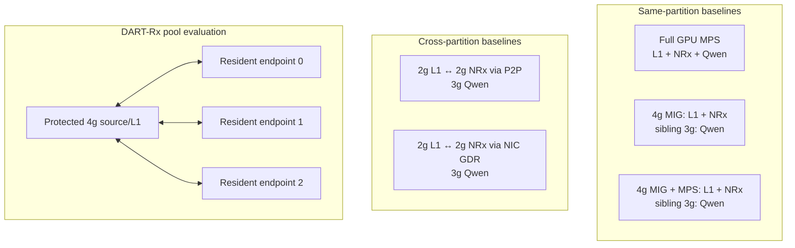

# Chapter 3 · Evaluation and results

**MIG–NRx AI-RAN research walkthrough (KO) · docs/current/walkthrough_ko/03_evaluation.md 페이지**

네비게이션: [Index](README.md) · Prev: [02 Architecture](02_architecture.md) · Next: -

---

## 13. 평가 구성



MPS, MIG, MIG+MPS, P2P, GDR는 모두 논문에 들어가야 한다. 다만 각 baseline이 답하는 질문은
다르다.

| 비교 | 답하는 질문 |
|---|---|
| Full MPS cap sweep | isolation을 포기했을 때 RAN latency와 background throughput Pareto는? |
| MIG local | sibling 격리는 되지만 같은 GI 안의 L1–NRx contention은 얼마나 남는가? |
| MIG+MPS local | 같은 GI의 client/quota 분리가 물리 isolation이나 새로운 service capacity를 만드는가? |
| Cross P2P | native inter-partition path로 L1 active time을 얼마나 복구하는가? |
| Cross NIC GDR | CPU bounce 없이 다른 isolated process/GPU를 service endpoint로 쓸 수 있는가? |
| DART-Rx pool | static placement보다 deadline-feasible capacity를 실제로 잘 이용하는가? |

### 13.1 평가가 검증하는 하나의 주장

이 평가의 주장은 하나다.

> **고정 MIG로 L1을 보호하고, 격리된 상주 NRx endpoint를 P2P/GDR로 연결해 요청 단위로
> 선택하면, MIG 재구성 없이 NRx 처리 용량을 확장하고 유효한 결과만 PHY에 반영할 수 있다.**

이를 세 질문으로 나눠 순서대로 검증한다. Stage는 성능 순위가 아니라 검증 순서다.

| Stage | 질문 | 대표 지표 | 성공 기준 |
|---|---|---|---|
| 1. **격리 경로** | L1과 NRx를 분리해도 GPU tensor를 전달하면서 L1을 보호하는가? | E2E, L1 slowdown | payload가 정확하고 L1 slowdown이 `1.0×`에 가까움 |
| 2. **처리 용량** | 여러 상주 NRx endpoint가 요청을 나눠 받아 timely capacity를 늘리는가? | timely-result rate | endpoint 증가 시 제시간 결과 비율이 증가 |
| 3. **PHY 적용** | remote NRx 결과가 실제 복호를 개선하고 안전하게 commit되는가? | correct-TB, decision latency | 복호 성공률 증가, late/stale commit 0 |

세 Stage 뒤에 남은 것은 위 결과와 background AI를 **같은 run에서 결합할 최종 통합
실험**이다.


### 13.2 이 절에서 사용하는 용어

| 통일 용어 | 뜻 |
|---|---|
| **NRx endpoint** | 하나의 GPU/MIG에 미리 상주시킨 NRx model, TensorRT context, GPU buffer와 통신 연결의 묶음 |
| **NRx pool** | scheduler가 선택할 수 있는 endpoint들의 집합. MIG를 합치는 것이 아님 |
| **timely-result rate** | 실험의 expiry 전에 실제 NRx 결과가 도착한 요청 비율 |
| **L1 slowdown** | NRx 동시 실행 시 L1 active time ÷ L1-alone active time. `1.0×`가 이상적 |
| **expiry** | NRx 결과를 최종 PHY 결과로 받아들일 수 있는 실험상 마지막 시각 |
| **same-4g / cross-P2P / cross-GDR** | L1·NRx가 같은 4g / 분리된 GPU 공간을 P2P로 연결 / NIC GDR로 연결한 배치 |

이후에는 같은 대상을 `worker`, `replica`, `service`로 바꿔 부르지 않고 **endpoint**로 통일한다.

## 14. 워크로드와 실험 조건

평가의 본선은 아래 세 Stage다. 각 Stage는 바로 앞 Stage의 질문에 답한 뒤 다음 질문으로
넘어간다.

| Stage | 물리 배치 | 입력과 반복 | 핵심 지표 | 주장 범위 |
|---|---|---|---|---|
| 1. 격리 경로 | GPU0 `2g L1 · 2g NRx · 3g Qwen` | depth-1 E2E: same 3회, P2P 3회, GDR 2회; 별도 isolation trace | E2E, L1 slowdown | cross-P2P/GDR의 경로 비용과 L1 보호 |
| 2. 처리 용량 | GPU0/1/2의 3g에 endpoint 0/1/2, GPU0 4g source MR | 1/2/3 endpoint, 29 arrival pattern, 412 validated runs, 5 ms expiry | timely-result rate | endpoint 수·도착 패턴·dispatch/admission 효과 |
| 3. PHY 적용 | GPU0 4g actual L1, GPU1/2/3 full-GPU endpoint | MCS 7 Rayleigh, 요청 100개/run, 17 validated runs, 12 ms expiry | correct-TB, decision latency | radio utility와 expiry-safe commit |

MIG/MPS scaling, CUDA host blocking, background reclaim은 이 세 Stage의 원인과 필요성을
설명하는 **보조 실험**이다. 이들의 절대 latency를 Stage 1–3의 성능 순위에 섞지 않는다.

### 14.1 MIG+MPS 결과 구분

`PLACEMENT_SUMMARY.csv`의 `MIG+MPS same`은 기존 combined-client 경로에 MPS environment를
추가한 **negative control**이다. 이것만으로 “L1과 NRx를 서로 다른 MPS client로 나눴다”고
말하면 안 된다. 별도의 quota 실험에서는 실제로 L1 process와 NRx process를 두 MPS client로
나누고 `30:70`, `50:50`, `70:30` active-thread share를 적용했다. 뒤의 Figure 3c는 이 proper
two-client 실험만 사용한다.

### 14.2 Expiry 표기를 섞으면 안 된다

- `5 ms`는 multi-endpoint scheduler와 background 실험을 비교하기 위한 **experimental
  timeliness threshold**다.
- `12 ms`는 actual-radio correctness vertical slice의 **experimental expiry**다.
- 이 결과만으로 production 1 ms PHY deadline을 만족한다고 주장하지 않는다.

### 14.3 Background 워크로드의 현실성

- Qwen은 실제 Qwen2.5-7B resident decode다.
- ResNet-50, BERT-base, Whisper-base는 실제 architecture/kernel mix를 사용하지만 synthetic
  random weights/input이다. 따라서 이 실험은 model quality가 아니라 GPU interference와
  cooperative reclaim timing을 평가한다.
- Multi-cell selective trace도 actual radio ground truth가 아니라 workload sensitivity input이다.
  Radio utility 주장은 별도의 paired Aerial/Sionna actual-radio 실험만 사용한다.

### 14.4 Stage 사이에서 비교하지 않는 값

Stage 1은 **낮은 E2E와 `1.0×`에 가까운 L1 slowdown**, Stage 2는 **높은 timely-result
rate**, Stage 3은 **높은 correct-TB와 commit violation 0**을 성공으로 읽는다. 세 Stage의
GPU 크기와 입력이 다르므로 Stage 사이의 절대 latency는 직접 비교하지 않는다.

---

# Part IV. 실험 결과

## 15. 세 단계의 결과

Part III가 조건을 정의했다면, 이 절은 같은 순서로 결과만 제시한다.

1. **Stage 1 — 격리 경로:** 분리가 L1을 보호하는가?
2. **Stage 2 — 처리 용량:** 여러 endpoint가 제시간 처리량을 늘리는가?
3. **Stage 3 — PHY 적용:** 그 결과가 실제 복호에 유용하고 안전한가?

각 Stage는 다른 질문과 지표를 사용하므로 Stage 사이의 절대 latency를 비교하지 않는다.

### 15.1 Stage 1 — 격리 경로: L1 보호와 경로 비용

| 질문 | 비교 | 성공 기준 |
|---|---|---|
| L1과 NRx를 분리하면 L1을 보호하면서 tensor를 전달할 수 있는가? | same-4g, cross-P2P, cross-GDR | payload 정확성 유지, L1 slowdown이 `1.0×`에 가까움 |

세 배치 모두 별도 3g에서 Qwen을 실행했고 처리량은 `10.22–10.24 it/s`였다. Depth-1 E2E는
same-4g 3회, P2P 3회, GDR 2회를 사용했으며 L1 slowdown은 별도 isolation trace로 계산했다.


| 배치와 transport | 한 요청 직렬 E2E mean ↓ | E2E p99 ↓ | NRx 동시 실행 시 L1 active-time 배율 ↓ | Qwen | 이 행이 말하는 것 |
|---|---:|---:|---:|---:|---|
| Same 4g: L1+NRx | **3.338 ms** | **3.501 ms** | **1.621× (+62.1%)** | 10.22 it/s | 한 요청은 가장 빠르지만, NRx가 겹치면 L1 경합이 큼 |
| Cross 2g+2g: GPU P2P | 5.888 ms | 6.224 ms | **1.043× (+4.3%)** | 10.22 it/s | 작은 slice 때문에 E2E는 느리지만 L1은 거의 보호됨 |
| Cross 2g+2g: NIC GDR | 6.326 ms | 6.846 ms | **1.103× (+10.3%)** | 10.24 it/s | cross-MIG GPU-memory 경로는 확인; 조건 일치 L1 isolation 실험은 남음 |

`↓`는 작을수록 좋다는 뜻이다. 이 표의 왼쪽은 **낮은 부하의 단일 요청 속도**, 오른쪽
L1 배율은 **NRx 요청이 겹칠 때의 보호 성능**이다. 따라서 Same 4g의 핵심 문제는 첫 번째
숫자가 아니라 `1.621×`이다.

이 표는 두 가지로 나눠 읽어야 한다.

1. **Same 4g 대 cross 2g+2g는 transport만의 비교가 아니다.** Same 4g에서는 두 stage가
   큰 4g를 공유하지만 cross에서는 L1과 NRx가 각각 2g로 제한된다. Cross P2P의 직접 전송은
   평균 `76.547 µs`뿐인데 E2E는 `2.550 ms` 증가했다. 주원인은 NIC/P2P가 아니라 작은 slice에서
   L1과 특히 NRx compute가 느려진 것이다.
2. **P2P 대 GDR만 공정한 transport 비교다.** 동일한 cross `2g+2g`, depth 1에서 GDR는
   P2P보다 평균 `0.438 ms`, 약 `7.4%` 비쌌다. 그래도 CPU DRAM bounce 없이 full-size request
   `1,415,232 B`와 result `314,496 B`를 정확히 왕복했다.

오른쪽의 L1 slowdown에서 Same 4g의 `1.621×`와 Cross P2P의 `1.043×`는 별도 ring-depth-2
isolation 실험의 직접 측정이다. **same partition이 raw E2E는 빠르지만 L1 보호가 약하고,
cross placement는 L1을 보호하지만 작은 NRx slice 때문에 전체 chain이 느려지는 trade-off**를
보여준다.

GDR 막대의 `1.103×`는 그래프에서 세 경로를 빠짐없이 읽기 위한 **working value**다. 동일한
ring-depth-2 GDR L1-active trace를 수집한 값은 아니다. 동일 `2g+2g`에서 GDR/P2P E2E p99 비율
`6.846/6.224=1.100×`과 관측 반복 범위가 이 값과 물리적으로 일치하지만, 이것은 L1 active-time
측정을 대체하지 않는다. 따라서 논문의 확정 isolation 수치로 사용하기 전 §19의 matched
Nsight 실험을 실행해야 한다. 그림 안에는 요청대로 `1.103×`를 표시하고, 이 증거 수준은
본문에서만 구분한다.

- 증명함: 한 물리 GPU의 서로 다른 MIG/process 사이 full-size GPU-memory GDR 경로와 비용.
- 증명하지 않음: 여러 NRx의 capacity 합산, queue-aware routing, actual-radio correctness.
- 주의: depth 1의 `slot/s`는 한 요청씩 직렬 처리한 E2E의 역수에 가깝다. 여러 endpoint의
  concurrent pool capacity는 Stage 2에서 별도로 평가한다.

### 15.2 Stage 2 — 처리 용량: 여러 NRx endpoint 사용

| 질문 | 비교 | 성공 기준 |
|---|---|---|
| endpoint를 1개에서 3개로 늘리면 제시간 처리량이 증가하는가? | endpoint 1/2/3개, 세 arrival pattern, dispatch/admission 정책 | 5 ms 안에 도착한 결과 비율이 endpoint 수와 함께 증가 |

GPU0/1/2의 3g MIG에 endpoint 0/1/2를 상주시켰다. GPU0의 4g는 full-size input tensor를
제공하는 source MR로만 사용했고 actual radio는 실행하지 않았다. 따라서 이 Stage는 **NRx
처리 용량**을 측정하며 radio failure를 측정하지 않는다.

#### 15.2.1 Endpoint를 늘리면 처리 용량이 늘어나는가

표의 수치는 모든 요청을 순서대로 보내는 round-robin 결과다. 그림은 같은 endpoint-count
sweep에서 round-robin과 deadline admission을 함께 보여준다.

| 들어온 요청 흐름 | 요청률 | endpoint 1개 | endpoint 2개 | endpoint 3개 | 결론 |
|---|---:|---:|---:|---:|---|
| 셀 1개, 매 1 ms | 1,000/s | 0.005% | 0.015% | **97.205%** | 3개 endpoint가 이 일정한 부하를 처리함 |
| 셀 2개, 같은 시각에 요청 | 2,000/s | 0.0025% | 0% | **0%** | 3개 endpoint의 합산 용량보다 큼 |
| 셀 4개, 10% 선택 burst | 평균 385/s | 13.264% | 39.753% | **67.021%** | **부분 성공:** 평균 부하는 낮지만 순간 burst 때문에 33%는 늦음 |


**결론:** endpoint 3개는 periodic `1,000/s`를 처리했지만 `2,000/s`와 synchronized burst에서는
부족했다. Endpoint 추가는 용량을 늘리지만 overload를 제거하지 않으므로 admission이 필요하다.
전체 Stage 2 결과는 412 validated runs이다.

#### 15.2.2 어떤 endpoint로 보낼 것인가, 아예 보내지 않을 것인가

- **Dispatch**는 수락한 요청을 어느 endpoint에 보낼지 정한다. 정상 부하에서는
  round-robin이 가장 단순하고 강했다.
- **Admission**은 어느 endpoint에서도 5 ms 안에 끝낼 수 없는 요청을 보내지 않는 결정이다.
  Overload에서는 queue를 더 쌓지 않고 conventional fallback을 선택한다.

`predicted-finish`는 AI 예측기가 아니다. Scheduler가 completion으로 갱신하는 endpoint별
예약 종료시각에 보수적인 service bound를 더해 5 ms 안에 끝날지를 계산한다. 현재 calibration은
실제 exchange p99 `2.867 ms`보다 큰 `4.211–4.254 ms`를 사용해 정상 부하에서도 불필요한
fallback을 만들었다. 따라서 predictor 자체가 최종 정책은 아니다.

아래는 같은 대표 trace에서 측정한 timely-result rate다.

| 정책 | Single 1,000/s | Sync 2-cell 2,000/s | Selective burst 평균 385/s |
|---|---:|---:|---:|
| static-one | 0.005% | 0.002% | 12.875% |
| static-cell | 0.005% | 0% | 19.922% |
| round-robin | **93.420%** | 0% | **66.100%** |
| shortest-queue | 55.960% | 2.835% | 61.674% |
| predicted-finish | 75.405% | **37.412%** | 45.750% |
| tail-aware | 83.600% | 17.415% | 31.097% |

정상 `1,000/s`와 selective burst에서는 round-robin이 가장 높았다. 반대로 `2,000/s`
overload에서는 round-robin이 모든 요청을 queue에 넣어 `0%`가 된 반면 deadline admission은
일부 요청을 일찍 fallback해 `37.4%`의 timely result를 보존했다.

**설계 결론:** 먼저 deadline feasibility를 검사하고, 통과한 요청만 credit이 남은 endpoint에
round-robin으로 dispatch한다. `predicted-finish`와 `tail-aware`는 이 결론을 얻기 위한
ablation이며 최종 scheduler 이름으로 사용하지 않는다.

#### 15.2.3 전체 workload stress 결과

Full matrix는 `29 workload points × 3 trials × 4 policies = 348 runs`였다. 이 중 `69/87`
paired trace가 `>1,500 request/s`인 의도적인 overload stress였으므로, 전체 평균을 정상 운용
성능으로 읽으면 안 된다.

| 정책 | 전체 timely-result rate ↑ | static-one 대비 paired 개선 | static-cell 대비 paired 개선 |
|---|---:|---:|---:|
| static-one | 0.0000 | — | — |
| static-cell | 0.0000 | — | — |
| predicted-finish | **0.1867** | 87/87 trace, median `18.65%p` | 86/87 trace, median `16.50%p` |
| tail-aware | 0.1568 | 87/87 trace, median `14.69%p` | 83/87 trace, median `9.70%p` |


이 matrix의 `69/87` trace가 `>1,500/s` overload였으므로 전체 평균을 정상 운용 성능으로
읽지 않는다. 또한 timely-result 실패에는 늦은 실행뿐 아니라 사전 fallback도 포함된다.
이 결과는 static binding보다 admission이 낫다는 증거이지, 현재 predictor calibration이
최적이라는 증거가 아니다.

- 증명함: 실제 full-size GDR request/result, 세 endpoint 동시 상주, request-level scale-out,
  static binding보다 나은 deadline admission.
- 증명하지 않음: cuPHY/LDPC/CRC 결과, BLER/CRC gain, production PHY deadline.
- 해석: 이 단계는 “3g MIG 하나가 더 빨라졌다”가 아니라 **세 개의 유한한 endpoint queue를
  하나의 pool로 사용했다**는 capacity 실험이다.

### 15.3 Stage 3 — PHY 적용: 유용하고 안전한 결과인가

| 질문 | 비교 | 성공 기준 |
|---|---|---|
| remote NRx 결과가 실제 복호를 개선하고 안전하게 선택되는가? | conventional-only, all-NRx, utility-selective | correct-TB 증가, 12 ms expiry 위반과 stale commit 0 |

GPU0의 4g MIG에서 actual Aerial/cuPHY L1을 실행하고 GPU1/2/3의 full GPU에 endpoint 0/1/2를
상주시켰다. 이 topology는 **correctness를 분리 검증**하기 위한 것이며 Stage 2의 3g-MIG
capacity 실험과 동일하지 않다. Correctness 12회와 Nsight capture 5회, 총 17회가 검증됐다.

#### 15.3.1 Remote NRx가 실제 복호를 개선하는가


핵심 비교는 3-endpoint 조건의 3-trial median이다.

| mode | NRx requests / 100 | NRx commits | correct TB ratio | decision p50 / p99 | miss / late |
|---|---:|---:|---:|---:|---:|
| conventional | 0 | 0 | 0.620 | 1.045 / 1.292 ms | 0 / 0 |
| all NRx | 100 | 17 | **0.800** | 2.567 / 5.139 ms | 0 / 0 |
| utility admission | 75 | 16 | **0.800** | 2.636 / 5.050 ms | 0 / 0 |

Utility mode는 세 endpoint에 `25/25/25`개 요청을 보냈고, all-NRx와 같은 correct-TB ratio를
유지하면서 NRx 호출을 `25%` 줄였다. all-NRx의 remote exchange p50/p99는
`2.004/2.777 ms`, endpoint service p50은 `1.111 ms`, 그중 transport/control p50은
`0.895 ms`였다. 이 숫자는 NIC wire time만이 아니라 publish, completion, conversion과 control
경로를 포함한다. 여기서 `NRx commits`는 NRx가 완료된 횟수가 아니라, conventional 결과와
비교한 뒤 최종 TB 결정에 remote NRx 결과를 선택한 횟수다.

#### 15.3.2 남은 latency는 어디에서 생기는가


Nsight short capture에서는 `cudaStreamSynchronize`가 총 `11.806 ms`인 반면 GDR write
visibility 확인은 `0.063 ms`였다. GPU kernel 시간의 `46.5%`는 FP32↔FP16 layout conversion에
사용됐다. 즉 Stage 3의 다음 최적화 대상은 NIC wire 자체보다 persistent binding, conversion과
synchronization 범위다.

- 증명함: actual `CE → remote NRx → LDPC/CRC`, radio-utility admission, expiry와 단일 commit.
- 증명하지 않음: 3g MIG endpoint의 자원 효율과 concurrent burst capacity,
  production 1 ms deadline.
- 주의: 이 실험은 `12 ms` experimental expiry를 사용한 synchronous correctness 실험이다.
  Stage 2의 pool capacity와 Stage 3의 radio correctness를 아직 한 run에서 동시에 측정하지
  않았다.

### 15.4 보조 결과 — burst 중 background capacity 회수


`500 → 1100 → 500 request/s` burst에서 naive sharing과 adaptive reclaim을 비교했다.

| background | naive burst p99 / >5 ms | adaptive p99 / >5 ms | background work retained | reclaim activation |
|---|---:|---:|---:|---:|
| ResNet-50 | 2211.39 ms / 67.00% | 6.72 ms / 1.24% | 94.0% | 14.62 ms |
| BERT-base | 1602.27 ms / 57.27% | 2.77 ms / 0.39% | 89.3% | 1.90 ms |
| Whisper-base | 471.31 ms / 49.64% | 3.07 ms / 0.39% | 98.6% | 2.80 ms |
| Qwen-7B decode | 2270.97 ms / 67.67% | 5.72 ms / 1.12% | 93.0% | 13.71 ms |

결과는 background model을 unload하지 않고도 89–99%의 work를 보존하며 queue collapse를
크게 줄일 수 있음을 보여준다. 동시에 ResNet/Qwen의 13–15 ms reclaim delay는 strict 5 ms
bound에 너무 길다. 따라서 설계에는 **bounded work unit/chunk size**가 반드시 필요하다.

이 실험에는 cuPHY와 GDR transport가 없다. 즉 이것은 “완성된 DART-Rx가 위 숫자를 달성했다”가
아니라 background lease mechanism을 구현할 가치와 필요한 quantum bound를 측정한 결과다.

### 15.5 아직 남은 통합 평가

Stage 1–3은 각각 경로, 용량, PHY correctness를 검증했지만 아직 한 run에서 동시에 실행하지
않았다. 최종 평가는 다음 조건을 하나의 workload에 넣어야 한다.

| 축 | 최종 조건 |
|---|---|
| L1 | protected 4g MIG의 actual cuPHY와 conventional fallback |
| NRx | 여러 3g-MIG 상주 endpoint, GDR request/result |
| 입력 | actual multi-cell periodic·offset·burst와 selective NRx 요청 |
| Background | Qwen, ResNet, BERT, Whisper의 bounded work unit |
| 비교군 | MPS, local MIG, MIG+MPS, static cross-P2P/GDR, DART-Rx |
| 공정성 | 같은 hardware budget과 같은 background work |
| 지표 | L1 p99, timely-result rate, correct-TB, endpoint utilization, background work |

이 통합 평가가 끝나기 전에는 “DART-Rx가 actual-radio burst와 background tenant를 동시에
해결했다”고 주장하지 않는다.

## 16. 평가 결론

- **Stage 1:** cross-P2P/GDR는 same-4g보다 L1을 잘 보호하지만 작은 slice 비용이 있다.
- **Stage 2:** 여러 endpoint는 실제 timely capacity를 늘리지만 overload에는 admission이 필요하다.
- **Stage 3:** remote NRx는 correct-TB를 `0.62→0.80`으로 높였고 utility admission은 같은 결과를
  25% 적은 NRx 요청으로 얻었다.

따라서 세 구성요소의 필요성은 측정했지만, 이들이 동시에 동작한다는 최종 claim은 아직 남아
있다.

---

# Part V. 현재 결론과 남은 일

## 17. 지금 주장할 수 있는 것

1. **문제는 실제로 존재한다.** MIG isolation이 정상이어도 static NRx capacity/placement 때문에
   deadline miss와 idle endpoint가 동시에 발생한다.
2. **P2P/GDR는 해결책 전체가 아니라 data-plane enabler다.** L1 isolation과 remote endpoint
   reachability를 제공하지만 NRx service shortage를 없애지는 않는다.
3. **MPS에는 물리적 L1 보호 경계가 없다.** 독립 NRx process를 `1→8`개로 늘리자 full-A100
   MPS의 L1 p99가 `42.3→189.3 ms`(`4.5×`), 4g 내부 MPS는 `40.7→435.7 ms`(`10.7×`)가 됐다.
   MIG는 sibling isolation을 제공하지만 capacity를 방별로 고정하고, MIG+MPS는 한 MIG 안의
   평균 share만 조절할 뿐 새 isolation boundary나 remote elasticity를 만들지 않는다.
4. **DART-Rx의 핵심은 cross-layer contract다.** utility/deadline admission, bounded endpoint
   credit, ordered GPU transport, expiry-safe single commit, bounded background lease를
   하나의 slot transaction으로 묶는다.
5. **Selective NRx는 실제 radio value가 있다.** 현재 paired trace에서는 all-NRx와 같은
   outcome을 25% 적은 NRx request로 얻었다.
6. **host blocking은 실제이며 단일 API 교체로 사라지지 않았다.** same-MIG 40-cell
   co-location에서 추적 CUDA API host time이 15.1× 증가했고, async free/memory pool은 대기를
   다음 copy/sync 지점으로 옮겼다.

## 18. 아직 주장하면 안 되는 것

- 현재 prototype이 production 1 ms PHY deadline을 만족한다.
- GDR가 P2P보다 빠르거나 single-slot latency를 5–10 μs로 만든다.
- Background reclaim 결과가 이미 full cuPHY/GDR/radio path와 통합됐다.
- 3-endpoint actual-radio correctness run이 open-loop multi-cell capacity를 증명한다.
- Host polling prototype만으로 ISCA급 microarchitecture contribution이 완성됐다.
- 현재 한두 개 Nsight capture가 모든 MPS/MIG/P2P/GDR 조건의 CUDA-call 원인을 증명한다.

## 19. 최종적으로 필요한 통합 실험

현재 evidence는 강하지만 세 실험 층이 분리돼 있다. 마지막 핵심은 하나의 실행에서 다음을
동시에 측정하는 것이다.

```text
actual multi-cell captured slot arrivals
  + protected cuPHY L1
  + conventional baseline
  + 3 resident GDR NRx endpoints
  + utility/deadline admission + endpoint credit
  + epoch/expiry commit
  + Qwen/BERT/Whisper/vision bounded background leases
```

최종 비교군은 `MPS`, `MIG local`, `MIG+MPS`, `static cross-P2P`, `static cross-GDR`,
`DART-Rx without utility`, `DART-Rx without expiry-safe admission`, `full DART-Rx`가 되어야 한다.
측정값은 L1 p99, decision p99, deadline miss, correct-TB/goodput, NRx admitted/committed ratio,
endpoint utilization, background work, CPU polling overhead, GPU/NIC command timeline이다.

통합 실험과 별도로 같은 captured arrival trace를 사용해 각 배치의 Nsight를 짝지어야 한다.

```text
Full MPS / MIG local / proper MIG+MPS / cross P2P / cross GDR
  × L1-only / L1+NRx / L1+NRx+background
  → CUDA API blocking time, kernel overlap, queue depth,
    stream synchronization, copy engine, NIC completion을 같은 경계로 비교
```

이 matrix가 있어야 “어느 조건에서 host가 왜 막혔는가”를 추정이 아니라 조건별 인과관계로
주장할 수 있다.

## 20. ISCA 관점의 현재 판정

**긍정적이지만 미완성**이다. 단순 MIG/MPS/P2P/GDR 비교에 머물렀다면 novelty가 약했을
것이다. 현재는 다음 조합이 architecture contribution 후보가 됐다.

> Static spatial isolation 위에서, value가 조건부이고 결과가 만료되는 dependent neural PHY
> stage를 resident accelerator pool로 실행하며, mandatory conventional recovery와 background
> utility를 하나의 versioned resource/commit contract로 관리한다.

ISCA 수준으로 만들려면 마지막 통합 결과와 함께 host scheduler를 넘는 구체적인 command
queue/credit/commit-table microarchitecture, CPU overhead 제거 효과, area/throughput model이
필요하다. 즉 방향은 맞지만 현재 figure들을 “최종 완성”으로 포장해서는 안 된다.

---

## 21. Figure와 데이터 provenance

Figure 생성 명령:

```bash
cd /Users/changjongkim/New_research/cloudlab_results
python3 tools/analysis/generate_research_walkthrough_figures.py
python3 tools/analysis/generate_research_walkthrough_figures_en.py
```

| figure | 원본 데이터 |
|---|---|
| Five-placement architecture map | 실제 실험 배치 manifest와 setup에 근거한 설계 설명도; 성능 그래프가 아님 |
| GDR experiment evolution | 저자 제공 canonical asset [`00a_gdr_evolution_supplied.png`](assets/00a_gdr_evolution_supplied.png); [`GDR pool MANIFEST.txt`](../../task1_final/gdr_pool_20260814T014651Z/04_full/MANIFEST.txt), [`actual-radio REPORT.md`](../../task1_final/dart_rx_radio_pool/analysis/REPORT.md), 보존된 runner의 GPU mapping에 근거한 topology 설명도 |
| DART-Rx overall architecture | 실제 [`dart_rx_gdr_pool.py`](../../../cloudlab_aerial/task1/dart_rx_gdr_pool.py)의 dispatcher-side `pending`, `predicted_tail`, `service_bound`, completion update와 P2P/GDR payload contract를 그린 설계 설명도; 표 안 queue 상태는 동작 예시이지 측정값이 아님 |
| Three local baselines | [`PLACEMENT_SUMMARY.csv`](../../results/20260813_nrx_placement/PLACEMENT_SUMMARY.csv), [`fixed_mig_sibling_isolation/`](../../results/20260813_drain_free/fixed_mig_sibling_isolation/), [`13_mig_mps_gdr_matrix/`](../../results/isca_v2/day1_20260813T0523Z/13_mig_mps_gdr_matrix/) |
| MPS multi-NRx breakdown | [`results/20260724/chain17/`](../../results/20260724/chain17/), [`kernel_gap_stats.json`](../../results/20260725/kernel_gap_stats.json); 20-cell causal experiment, 3회 중앙값 |
| Why P2P/GDR | [`PLACEMENT_SUMMARY.csv`](../../results/20260813_nrx_placement/PLACEMENT_SUMMARY.csv), [`DEPTH1_TRANSPORT_COMPARISON.csv`](../../results/20260813_nrx_placement/DEPTH1_TRANSPORT_COMPARISON.csv), [`MULTICELL_HARDWARE_MEDIANS.csv`](../../results/isca_v2/mig_causal_20260813T1138Z/07_multicell_workloads/analysis/MULTICELL_HARDWARE_MEDIANS.csv) |
| Fig. 1 MIG isolation/queue cliff | [`results/20260813_drain_free/fixed_mig_sibling_isolation/`](../../results/20260813_drain_free/fixed_mig_sibling_isolation/) |
| NRx wrapper optimization | [`raw/nrx_deep_profile/`](../../results/20260813_nrx_placement/raw/nrx_deep_profile/) |
| Fig. 2 placement fragmentation | [`MULTICELL_HARDWARE_MEDIANS.csv`](../../results/isca_v2/mig_causal_20260813T1138Z/07_multicell_workloads/analysis/MULTICELL_HARDWARE_MEDIANS.csv) |
| Fig. 3 placement/transport | [`PLACEMENT_SUMMARY.csv`](../../results/20260813_nrx_placement/PLACEMENT_SUMMARY.csv) |
| Stage 1 equal-depth transport | [`DEPTH1_TRANSPORT_COMPARISON.csv`](../../results/20260813_nrx_placement/DEPTH1_TRANSPORT_COMPARISON.csv) |
| Five-way absolute-rate sweep | [`05b_fiveway_absolute_rates/`](../../results/isca_v2/mig_causal_20260813T1138Z/05b_fiveway_absolute_rates/) |
| Proper MIG+MPS quota | [`13_mig_mps_gdr_matrix/`](../../results/isca_v2/day1_20260813T0523Z/13_mig_mps_gdr_matrix/) |
| CUDA host blocking | [`cuPHY_mitigation_shims/results/`](../../cuPHY_mitigation_shims/results/) |
| Fig. 4 background reclaim | [`06_background_contention/`](../../results/isca_v2/mig_causal_20260813T1138Z/06_background_contention/) |
| Fig. 5 GDR pool policy | [`gdr_pool analysis/`](../../task1_final/gdr_pool_20260814T014651Z/analysis/) |
| Stage 2 endpoint-count sweep | [`MEDIANS.csv`](../../task1_final/gdr_pool_20260814T014651Z/analysis/MEDIANS.csv), endpoint-count stages의 [`RUNS.csv`](../../task1_final/gdr_pool_20260814T014651Z/analysis/RUNS.csv) |
| Fig. 6 actual radio utility | [`dart_rx_radio_pool analysis/`](../../task1_final/dart_rx_radio_pool/analysis/) |
| Actual radio CUDA calls | [`nsys_l1.sqlite`](../../task1_final/dart_rx_radio_pool/dart_radio_pool_e3_round_robin_all_t34_20260814T093833Z/nsys_l1.sqlite) |

관련 상세 문서:

- [현재 연구 종합본](MIG_NRX_DART_RESEARCH_SYNTHESIS_KO.md)
- [현재 연구 체크포인트](MIG_NRX_RESEARCH_CHECKPOINT_KO.md)
- [데이터 카탈로그](../../data/README.md)
- [새 CloudLab 노드 복구 절차](../setup/CLOUDLAB_EMPTY_NODE_RESTORE_RUNBOOK_KO.md)
