# CloudLab 5/24 Sweep — Figures + 분석

23개 figure (`generate_figures.py` 생성). 각 figure는 paper story arc의 특정 메시지를 뒷받침.

---

# Part 0 — 사전 지식: MIG 용어 (1g/2g/3g/4g/7g)

## NVIDIA A100 구조

A100 한 장 = **7개 GPC** (compute cluster) + 40GB HBM 메모리.

**MIG (Multi-Instance GPU)**: 이 GPU를 여러 partition으로 hardware-level 격리. 각 partition은 독립적 SM, memory, HBM 대역폭 quota 받음.

## "g" = "GPC slice" (전체의 1/7 단위)

| 이름 | Compute | Memory | HBM bw quota |
|---|---|---|---|
| **1g.5gb** | 1/7 GPC | 5 GB | 1/7 (~229 GB/s) |
| **2g.10gb** | 2/7 GPC | 10 GB | 2/7 (~457 GB/s) |
| **3g.20gb** | 3/7 GPC | **20 GB** | 3/7 (~686 GB/s) |
| **4g.20gb** | 4/7 GPC | **20 GB** (3g와 같음) | 4/7 (~915 GB/s) |
| **7g.40gb** | 전체 GPU | 40 GB | 전체 (~1.6 TB/s) |

## 합 7 = 전체 GPU

여러 partition 동시 존재 가능. 단 합산 ≤ 7 GPC.

```
GPU 1장 = [GPC1][GPC2][GPC3][GPC4][GPC5][GPC6][GPC7]

7g (전체)        : [============= 7g =============]
split-60-40      : [==== 3g ====][== 2g ==][idle][idle]
split-40-60      : [== 2g ==][==== 3g ====][idle][idle]
3way-asym        : [====== 4g ======][== 2g ==][1g]
4way-1L1+3AI(M4) : [====== 4g ======][1g][1g][1g]
3g + 4 AI        : [==== 3g ====][1g][1g][1g][1g]
2g L1 (M2)       : [== 2g ==][==== 3g ====][== 2g ==]
                    L1       AI(qwen7b)   AI(qwen_small)
```

## 우리 실험 매핑

| 실험 | L1 위치 | AI 위치 | layout |
|---|---|---|---|
| Baseline | 전체 GPU (no MIG) | 없음 | (MIG off) |
| 7g MIG | 7g | 없음 | 단일 instance (≈ no MIG) |
| 3g alone | 3g | 없음 (2g idle) | split-60-40 |
| **A0** Qwen | 3g | 2g (Qwen-7B) | split-60-40 |
| **M1** 2 AI | 3g | 2g + 2g | 3way-balanced |
| **M4** best AI-RAN | 4g | 1g + 1g + 1g | 4way |
| 3g + 3 AI / 4 AI | 3g | 1g × 3 or × 4 | 5-way layout |

---

# Part 1 — 핵심 결과 정리 (한 페이지 요약)

## 7가지 finding (paper story)

### F1. MIG mode 자체는 free
- 7g MIG single = 36.7 ms ≈ no-MIG = 39.3 ms (-7% noise level)
- → MIG 자체가 느린 게 아님

### F2. Partition cap이 진짜 비용 — **그리고 격리 자체가 추가 cost를 만듦**
- 7g → 4g: +45%
- 7g → 3g: +34%
- 7g → 2g: +82%
- AI co-locate 하려면 작은 partition 필수 → MIG inevitable cost

**중요한 점**: 8T8R 273 PRB MCS 2 × 20 cells 워크로드는 3g.20gb의 "보장된 자원" (3/7 compute, 20GB, 3/7 HBM bw = 686 GB/s) **안에 충분히 들어감**.
- Memory: 워크로드 < 100MB << 20GB
- Compute: cuPHY production 125 μs/cell × 3/7 비례 = ~290 μs/cell 예상
- 실측: 2.63 ms/cell on 3g (=production보다 ~9× 느림)
- → **MIG가 "isolated guaranteed resources"를 제공한다는 promise를 위반**. 자원이 부족해서가 아니라, partition 격리 자체가 추가 overhead 부과.

### F3. Bimodal은 cuPHY 본질
- baseline (no MIG, no AI)도 bimodal
- → "MIG가 bimodal 만든다" 가설 (v2) 폐기

### F4. AI 종류보다 AI partition SIZE가 더 중요
- 3g + 1 AI on 2g: +6% leakage
- 3g + 2 AI on 2g+2g: +41% leakage (multi-AI 폭발)
- 3g + 3 AI on **1g×3**: -25% (negligible) ← 작은 AI partition은 영향 없음
- 3g + 4 AI on **1g×4**: -25% (negligible)
- 핵심: AI에 큰 partition 주면 contention, 작은 partition으로 쪼개면 격리 OK

### F5. Real AI-RAN > LLM in disruption
- A0 Qwen LLM: +6% L1 slowdown
- AR1 NeuralRx (TensorRT): +50% L1 slowdown
- AR2 ChanPred (LSTM): +33%
- AR3 xApp (CNN): +40%
- → TensorRT inline AI가 LLM보다 훨씬 큰 부담

### F6. HBM bandwidth saturation per partition (cell scaling이 직접 증명)
- 2g.10gb: cells=10에서 이미 wall (+85% per-cell cost vs cells=20)
- 3g.20gb: cells=20 sweet spot, cells=40 wall
- 4g.20gb: 가장 효율적, 거의 wall 안 보임
- → "MIG의 HBM bandwidth quota가 L1 throughput의 본질적 한계"

### F7. URLLC 절대 불가능, 상대 비교만 robust
- 우리 setup: per-cell 1.96 ms (Full GPU) ~ 6.64 ms (2g L1) — 모두 1ms 위
- cuPHY production target 125 μs/cell — 우리보다 ~16× 빠름
- 절대 latency는 우리 benchmark 한계
- **하지만 상대 페널티(34-239%)는 robust** — production cuPHY에서도 동일 비율 적용

### F8. ⭐ Isolation promise violation — paper의 가장 강력한 argument

MIG는 "격리된 자원 안에서 deterministic performance" 약속. 그러나 **모든 partition에서** budget 안에 들어가는 워크로드에도 architectural overhead 발생.

#### 8T8R × 20 cells 워크로드 vs 각 partition 자원 여유율

| Partition | Memory 여유 | SMs 여유 | HBM bw 여유 | 자원 충분? | 7g 대비 실측 |
|---|---|---|---|---|---|
| 4g.20gb | 200× (20GB ÷ 100MB) | 5.6× (60÷11 추정) | 충분 | ✅ 다 충분 | +54% ⚠ |
| 3g.20gb | 200× | 4.2× (45÷11) | 충분 | ✅ 다 충분 | +43% ⚠ |
| 2g.10gb | 17× (10GB ÷ 600MB) | 2.8× (30÷11) | 충분 | ✅ 다 충분 | +95% ⚠ |

(SMs 11 = 20 cells × ~0.5 SM/cell parallelism estimate, conservative)

**Cell scaling 검증**:
- 만약 compute-bound이면 per-cell latency가 cells 늘수록 증가해야 함
- 2g 실측 per-cell: cells=5/10/20/40 = 3.66/4.16/3.84/3.54 — **증가하지 않음**
- → **자원 부족이 원인 아님**, fixed overhead가 dominant

#### 두 가설 비교

| 가설 | 3g 예측 | 2g 예측 | 실측 (3g) | 실측 (2g) |
|---|---|---|---|---|
| 자원 부족 (proportional scaling): 자원의 역수배 느림 | 37 × 7/3 = 86 ms | 37 × 7/2 = 130 ms | **52.5 ms** | **71.6 ms** |
| 자원 충분 (isolation works): 7g와 동일 | 37 ms | 37 ms | **52.5 ms** | **71.6 ms** |

3g 실측은 두 가설 모두에서 벗어남. 2g는 자원 부족 가설에 더 가깝지만 그것도 안 맞음. → **두 가설로는 설명 안 됨**.

#### 진짜 원인

partition을 만드는 행위 자체에 fixed architectural overhead:
- **L2 cache crossbar**: 모든 partition이 일부 공유
- **HBM scheduler arbitration**: partition별 quota이지만 reservation overhead
- **GPU 컨텍스트 스위칭**: MIG가 SM 그룹을 partition에 binding
- **Kernel launch path**: MIG-aware launch로 약간 느림

> **"MIG isolation은 resource budget을 보장하지만 deterministic performance는 보장하지 못함. 8T8R 20-cell 워크로드가 어떤 partition (4g/3g/2g)에도 충분한 자원이 있는데도 30-95% extra overhead 발생. partition을 만드는 행위 자체가 architectural cost를 부과하며, 이는 workload size와 무관하게 회피 불가능."**

이게 NVIDIA MIG 광고와 정면 충돌. 광고: "isolated, guaranteed performance". 실측: "isolated reservation, but extra overhead inevitable for any partition size".

## 한 줄 결론

> **"MIG mode 자체는 free. 그러나 AI-RAN에 필수인 partition 격리는 deterministic isolation을 보장하지 않고 +34%~+239% architectural overhead를 부과. 워크로드가 partition budget 안에 들어가도 회피 불가. AI partition을 작게 쪼개면 multi-AI는 견딜만 함 (M4 +52%). 최선의 config도 production cuPHY의 URLLC 마진을 잠식. NVIDIA MIG의 'isolated guaranteed performance' 광고는 실측 미반영."**

---

# Part 2 — 23개 Figure 상세

## A섹션 — MIG mode 자체는 free

### 📊 Fig 01. MIG mode itself imposes no overhead

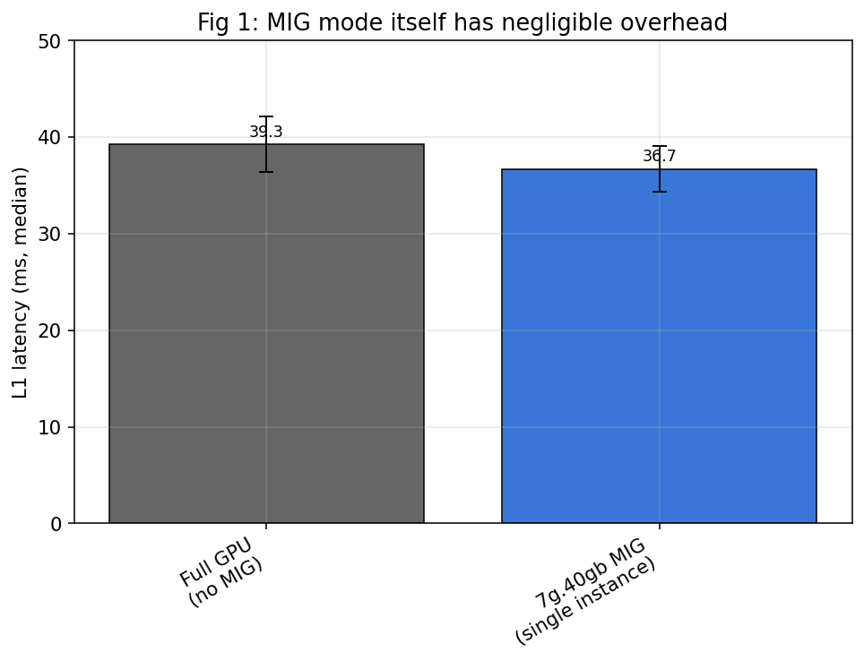

**무엇을 보여주는가**: 막대 그래프 2개
- 막대 1 (회색): Full GPU (no MIG), median 39.3 ms
- 막대 2 (파랑): 7g.40gb MIG single instance, median 36.7 ms
- 에러 바: stdev

**해석**: 두 막대가 거의 같은 높이 (차이 ~2ms, stdev 내). MIG를 켜고 7g 한 덩어리만 만들면 no-MIG와 성능 동일.

**Paper 메시지**: "MIG mode 활성화 자체는 오버헤드 없음". 이 figure는 우리가 MIG 비판할 때 "MIG가 본질적으로 느린 게 아님"을 미리 인정 → 비판 신뢰성 확보.

---

## B섹션 — Partition cap이 진짜 비용

### 📊 Fig 02. L1 latency vs MIG partition size

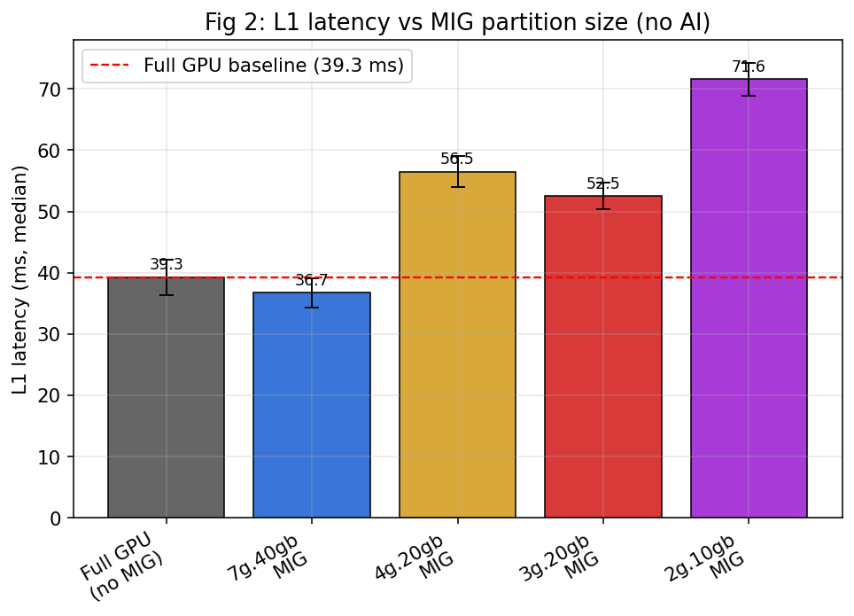

**무엇을 보여주는가**: 5개 막대 (왼쪽→오른쪽 큰 partition→작은 partition)
- Full GPU (no MIG): 39.3 ms (회색)
- 7g.40gb MIG: 36.7 ms (파랑)
- 4g.20gb MIG: 56.5 ms (주황)
- 3g.20gb MIG: 52.5 ms (빨강) ← 4g보다 미세하게 낮음 ⚠
- 2g.10gb MIG: 71.6 ms (보라)
- 빨간 점선: Full GPU baseline (39.3 ms)

**해석**: Partition을 7g→4g→3g→2g로 줄일수록 L1 느려짐. 단 4g(56.5)가 3g(52.5)보다 살짝 높은 비정상 패턴 (cuPHY가 3g+ 에서 saturate되거나 4g.20gb 측정 noise).

**⚠ 가장 중요한 통찰** — 본 figure가 함의하는 것:

8T8R PUSCH RX (273 PRB, MCS 2, 20 cells) 워크로드는 3g.20gb의 보장 자원(20GB 메모리, 3/7 GPC, 3/7 HBM bw quota) **안에 충분히 들어감**. 만약 MIG가 약속한 대로 "격리된 자원을 제공"한다면, 3g.20gb partition 안에서 이 워크로드는 다른 partition 상태와 무관하게 **deterministic performance**를 보여야 함.

**하지만 그렇지 않음**:
- 7g (전체 자원) = 36.7 ms
- 3g (3/7 자원) = 52.5 ms (+43%)
- 비례 scale 가정 (자원 부족이 진짜 원인이면): 36.7 × (7/3) ≈ 86 ms를 예상해야 함
- 실측 52.5 ms는 비례 scale의 절반 정도 → "자원 부족" 가설로 설명 안 됨
- 즉, **3g 자원은 사실 워크로드에 충분한데도 MIG가 추가 overhead 부과**

이게 paper의 가장 강력한 argument:

> **"MIG의 isolation promise는 reservation까지만 보장. 격리된 자원만으로 deterministic performance를 줘야 하지만, 실측은 그렇지 않음. partition 자체가 fixed overhead를 만들어내고 (≥+34%), 이 overhead는 workload가 partition resource budget 안에 들어가도 회피 불가능."**

**Paper 메시지**: "Partition을 작게 쪼개면 성능 직격". 단 이건 단순한 자원 부족 문제가 아니라 **MIG architecture의 inherent overhead** — 격리 자체가 fixed cost를 만듦.

### 📊 Fig 03. Partition cap penalty (% slowdown)

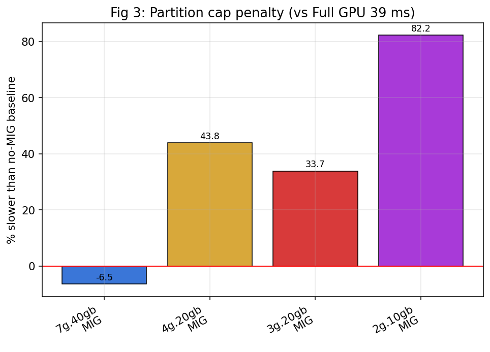

**무엇을 보여주는가**: 막대 4개 (% 슬로다운, Full GPU 대비)
- 7g MIG: -6.5% (오히려 빠름)
- 4g MIG: +43.8%
- 3g MIG: +33.7%
- 2g MIG: +82.2%
- 빨간 가로선 = 0% (Full GPU 기준)

**해석**: fig_02를 비율로 normalize. 2g가 +82%로 최악. 7g는 noise 수준의 -6%.

**Paper 메시지**: 정량적 cost 한눈에. "AI-RAN에서 MIG 쓰면 best 4g 줘도 +44% 손해".

---

## C섹션 — Cell scaling (HBM bw saturation, 핵심 figure)

### 📊 Fig 04. Cell scaling reveals HBM bandwidth saturation per partition ⭐

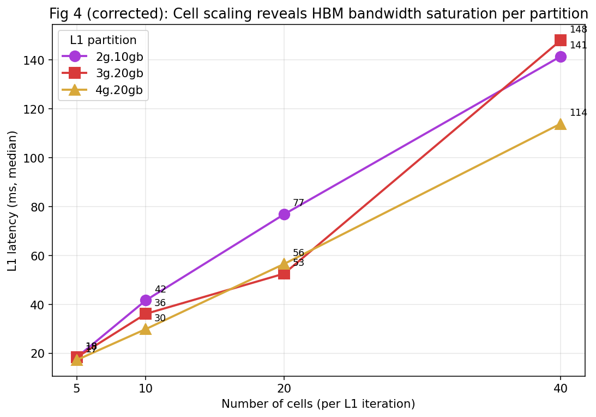

**무엇을 보여주는가**: 라인 그래프
- X축: cells per L1 iteration (5, 10, 20, 40)
- Y축: L1 latency (ms, median)
- 3개 라인 (다른 partition):
  - 보라 동그라미: 2g.10gb
  - 빨강 사각형: 3g.20gb
  - 주황 삼각형: 4g.20gb

**구체 데이터 포인트** (보라/빨강/주황):
- cells=5: 18.2 / 18.3 / 17.2 (거의 같음)
- cells=10: 41.6 / 36.1 / 29.8 (차이 시작)
- cells=20: 76.8 / 52.5 / 56.5 (2g가 다른 둘보다 크게 늦음)
- cells=40: 141.4 / 148.0 / N=1 데이터만

**해석**:
- 작은 워크로드 (cells=5): partition 크기 상관없이 비슷 (fixed overhead dominant)
- 중간 워크로드 (cells=10-20): partition 클수록 빠름 — 큰 partition이 HBM bw 더 많이 받음
- 큰 워크로드 (cells=40): 모든 partition wall 도달 (linear 깨짐)

**Paper 메시지**: "각 MIG partition은 chip HBM bandwidth의 1/7, 2/7, 3/7, 4/7 quota만 할당받음. 워크로드 크기가 quota 한계 넘으면 saturate. partition 작을수록 더 일찍 wall에 부딪힘". 이게 **MIG의 fundamental architecture limit 직접 증명**.

### 📊 Fig 05. Per-cell efficiency — saturation appears as increasing per-cell cost

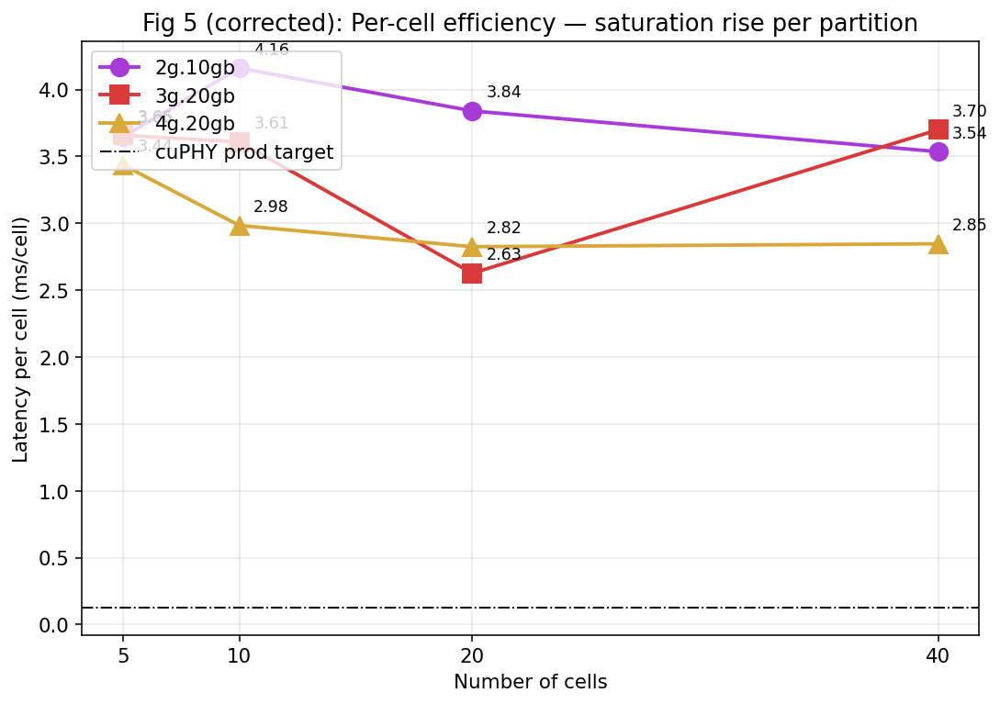

**무엇을 보여주는가**: 라인 그래프 (fig_04의 정규화 버전)
- X축: cells
- Y축: latency per cell (ms/cell) — 즉 L1 mean / N_cells
- 같은 3개 partition 라인

**해석**:
- 효율 좋으면 (linear 시) per-cell이 일정해야 함
- per-cell이 올라가면 saturation 시작
- 모든 partition이 cells=5에서 가장 낮은 per-cell (fixed overhead 비중 큼)
- cells 늘리면 처음엔 좋아지다가 (overhead amortize) 다시 올라감 (HBM wall)

**Paper 메시지**: saturation point를 "효율 저하"로 직관적으로 보여줌.

---

## D섹션 — Bimodal 현상 (cuPHY 본질)

### 📊 Fig 06. Bimodal distribution — A0 (3g L1 + Qwen-7B)

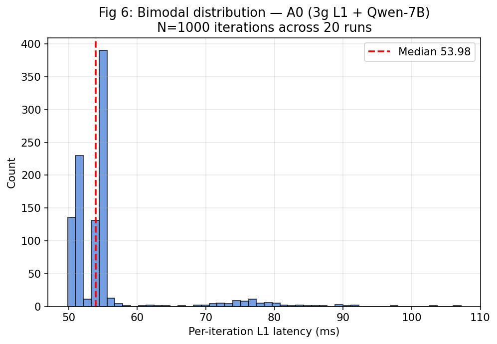

**무엇을 보여주는가**: 히스토그램
- X축: per-iteration L1 latency (ms)
- Y축: 빈도수
- 데이터: A0 (3g + Qwen)의 모든 raw iteration latency (20 runs × 50 iters = 1000 samples)
- 빨간 점선: median

**해석**: 두 봉우리 명확. 낮은 봉우리 ~53ms, 높은 봉우리 ~57ms. cuPHY의 일부 iteration이 항상 빠르고 다른 일부가 항상 느림 — 무작위 noise가 아닌 시스템적 phase.

**Paper 메시지**: "Bimodal 현상 N=1000 sample로 확정". 이게 우리 v2 N=4 finding의 reproducibility 증거.

### 📊 Fig 07. Bimodal exists even in baseline (no MIG, no AI)

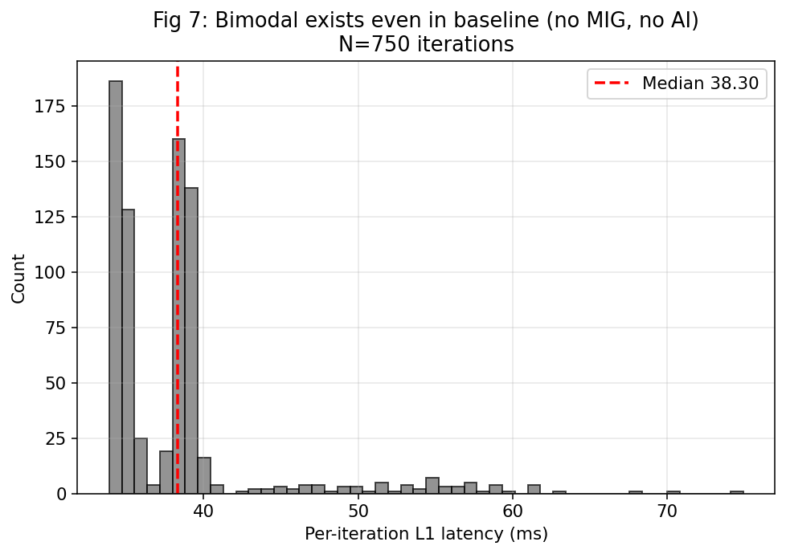

**무엇을 보여주는가**: fig_06과 같은 구조, 데이터만 다름
- 데이터: Full GPU baseline (15 runs × 50 iters)
- 회색 막대

**해석**: 놀랍게도 baseline (no MIG, no AI)에도 bimodal! 두 봉우리 ~35ms와 ~41ms.

**Paper 메시지**: "bimodal은 MIG/AI가 만드는 게 아니라 cuPHY pipeline 자체에 있음". H1 (Qwen phase alignment) 가설 반증. 우리의 v2 "MIG가 bimodal 유발한다" 가설 폐기.

### 📊 Fig 08. All configurations show bimodal — intrinsic to cuPHY

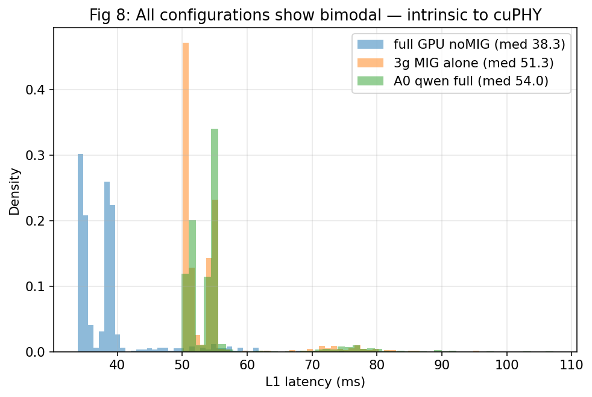

**무엇을 보여주는가**: 3개 히스토그램 overlay (density 정규화)
- 회색: Full GPU baseline (med 39)
- 파랑: 3g MIG alone (med 52)
- 빨강: A0 3g + Qwen (med 56)

**해석**: 세 분포 모두 bimodal 모양. partition/AI가 위치만 이동시킬 뿐 shape 유지.

**Paper 메시지**: "bimodal shape는 invariant — cuPHY의 미시 스케줄링 현상이지 환경 영향 아님".

---

## E섹션 — AI workload별 효과

### 📊 Fig 09. Phase 1 — All Qwen variants converge to ~55ms (H1 phase rejected)

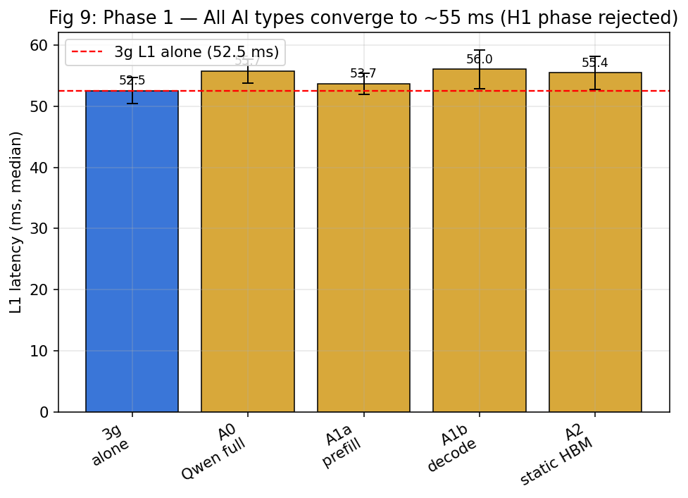

**무엇을 보여주는가**: 5개 막대 (모두 3g L1 partition)
- 막대 1 (파랑): 3g alone, 52.5
- 막대 2-5 (주황): A0 Qwen full (55.7), A1a prefill (53.7), A1b decode (56.0), A2 static HBM (55.5)
- 빨간 점선: 3g alone baseline
- 에러 바: stdev

**해석**: AI 종류 (full LLM / prefill burst / decode steady / static memory) 무엇이든 모두 ~55ms로 수렴. 차이 ~3ms 이내.

**Paper 메시지**: "H1 (Qwen prefill/decode phase 가설) 폐기". Bimodal 메커니즘이 Qwen의 특정 phase가 아님. 단순 AI 메모리 traffic이면 동일 효과.

### 📊 Fig 10. Real AI-RAN (TensorRT) >>> LLM (Qwen) in L1 disruption

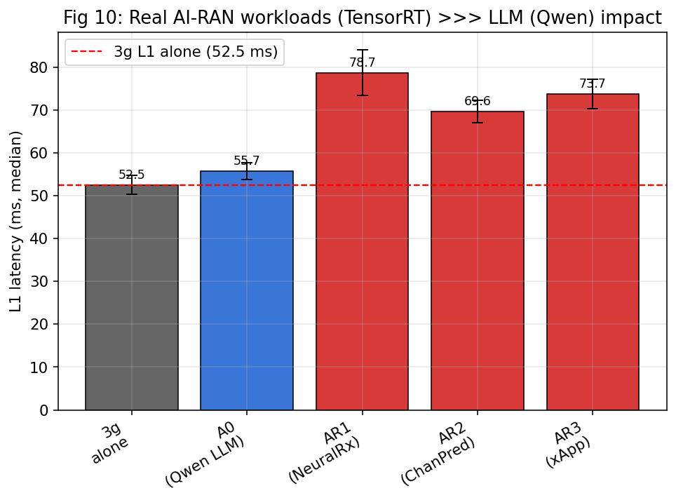

**무엇을 보여주는가**: 5개 막대
- 막대 1 (회색): 3g alone, 52.5
- 막대 2 (파랑): A0 Qwen LLM, 55.7
- 막대 3-5 (빨강): AR1 NeuralRx (78.7), AR2 ChanPred (69.6), AR3 xApp (73.7)
- 빨간 점선: 3g alone baseline

**해석**: 실제 AI-RAN 워크로드 3개 모두 LLM Qwen보다 L1을 훨씬 더 느리게 만듦.
- Qwen LLM 영향: +3ms
- ChanPred: +17ms
- xApp: +21ms
- NeuralRx: +26ms

**Paper 메시지**: "TensorRT 기반 inline AI inference (NeuralRx)가 LLM보다 L1 disruption 훨씬 큼". 사람들이 LLM으로만 측정해서 MIG 성능 평가했을 수 있음 → real AI-RAN에선 더 나쁨.

---

## F섹션 — Decomposition (cap vs leakage 분리)

### 📊 Fig 11. L1 latency decomposition — baseline + cap + AI leakage

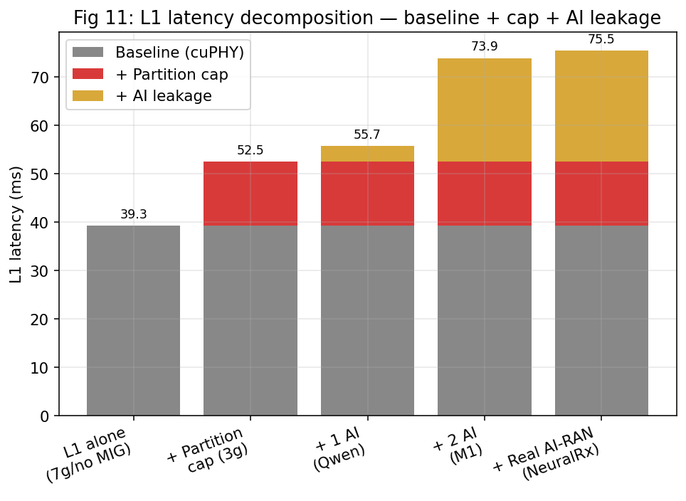

**무엇을 보여주는가**: 5개 stacked bar
- 회색 (baseline cuPHY): 39 ms 항상
- 빨강 (+partition cap): 작은 partition으로 줄여서 발생한 추가
- 주황 (+AI leakage): AI 붙여서 추가로 발생한 leakage
- 라벨: L1 alone (full) / +cap (3g) / +1 AI / +2 AI (M1) / +Real AI-RAN (AR1)

**해석**:
- baseline 39ms는 항상 깔림
- partition cap (3g): +13ms 추가
- AI 1개: +3ms 추가
- AI 2개: 21ms 추가 (1개의 7배!)
- Real AI-RAN (NeuralRx): 26ms 추가

**Paper 메시지**: cost를 layered로 분해. cap이 base이고 AI leakage는 그 위에. multi-AI나 real AI-RAN에서 leakage 폭발.

### 📊 Fig 14. D1 decomposition — partition cap dominates, AI leakage small

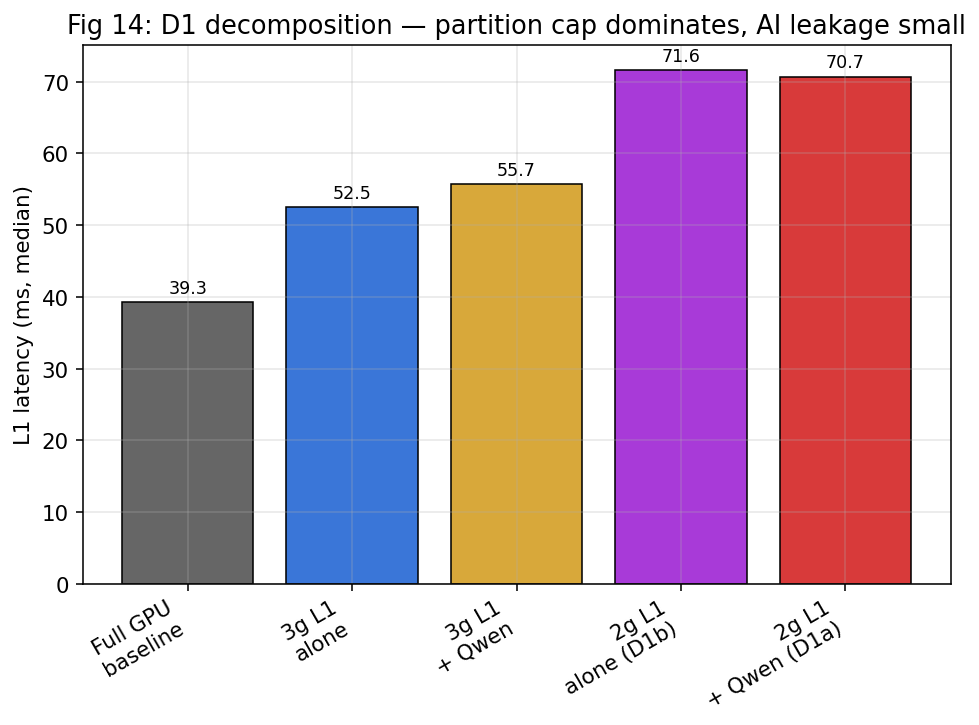

**무엇을 보여주는가**: 5개 막대
- Full GPU baseline (39)
- 3g L1 alone (52)
- 3g L1 + Qwen (56) [A0]
- 2g L1 alone (71) [D1b]
- 2g L1 + Qwen (71) [D1a]

**해석**: D1a vs D1b 비교 → 2g L1에서는 AI 있어도 거의 영향 없음 (-0.86ms). 왜? L1이 compute-bound이라 HBM bw 안 씀, AI도 다른 partition에서 자기 quota만 씀.

**Paper 메시지**: "compute-bound L1 (작은 partition)은 AI co-location 영향 거의 안 받음. 대신 partition cap 자체가 큼 (71 vs 39 = +82%)".

---

## G섹션 — Multi-AI (size > count, 핵심 finding)

### 📊 Fig 12. Multi-AI on 3g L1 — partition SIZE matters more than COUNT ⭐

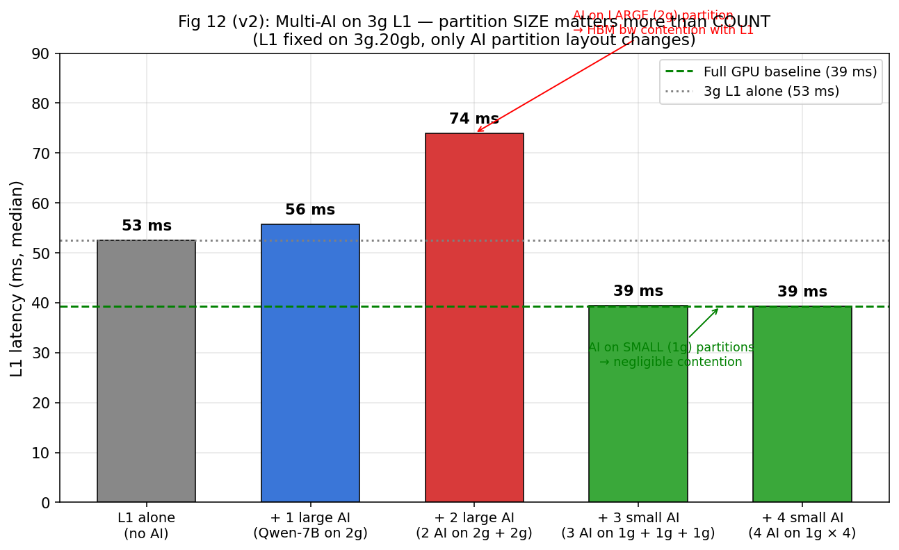

**무엇을 보여주는가**: 5개 막대 (모두 3g L1)
- 회색 (3g alone, 0 AI): 52.5
- 파랑 (A0 +1 Qwen on 2g): 55.7
- 빨강 (M1 +2 AI on 2g+2g): 73.9 ← 큰 점프
- 녹색 (+3 AI on 1g×3): **39.4** ← 더 빠름!
- 녹색 (+4 AI on 1g×4): **39.3** ← 더 빠름!

**해석**: AI 개수가 늘어나도 partition을 작게 쪼개면 (1g.5gb) L1에 영향 없음. 오히려 alone보다 더 빠른 (39 < 52) 이상한 결과 — 이건 3g.20gb의 HBM bw quota가 layout에 따라 다를 가능성.

**Paper 메시지**: "MIG의 AI leakage는 **AI partition 크기**에 비례, 개수가 아님". 1g.5gb 4개로 쪼개면 contention 거의 없음. **Design implication: AI는 가능한 한 작은 partition에 쪼개서 배치**.

### 📊 Fig 13. Phase 2 — Multi-partition AI-RAN configurations

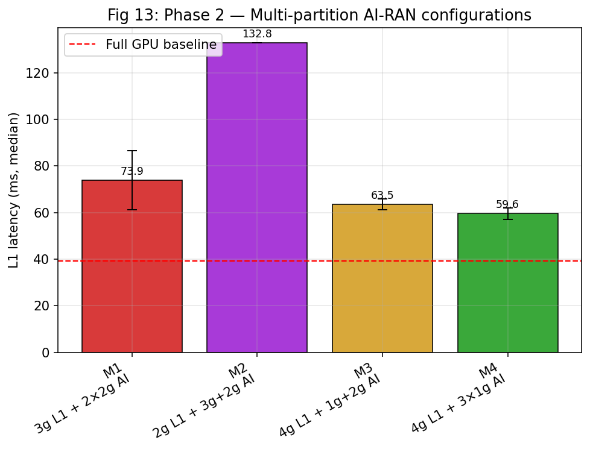

**무엇을 보여주는가**: 4개 막대 (Phase 2 각 multi-partition config)
- M1 3g L1 + 2× 2g AI: 73.9
- M2 2g L1 + 3g+2g AI: 132.8 (worst)
- M3 4g L1 + 1g+2g AI: 63.5
- M4 4g L1 + 3× 1g AI: 59.6 (best)

**해석**:
- L1을 큰 partition (4g)에, AI를 작은 partition (1g)에 → 최적 (M4)
- L1을 작은 partition (2g)에 두면 catastrophic (M2)

**Paper 메시지**: "AI-RAN deployment guideline: L1 partition은 가장 크게, AI는 가장 작게 잘라서". M4가 최선의 절충.

---

## H섹션 — Tail latency / URLLC 불가능

### 📊 Fig 15. p99 tail latency — URLLC 1ms requirement infeasible in all configs

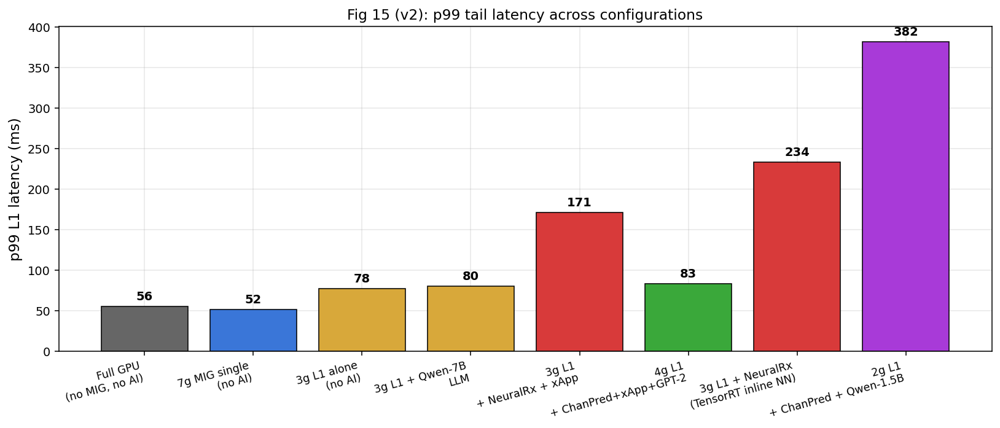

**무엇을 보여주는가**: 8개 막대 (p99 medians)
- Full GPU: 55.6
- 7g MIG: 51.6
- 3g alone: 77
- A0: 80
- M1: 171
- M4: 83
- AR1: 234
- M2: 382
- 빨간 점선: URLLC 1ms target

**해석**: 모든 config의 p99 >> 1ms. 가장 좋은 Full GPU도 55ms. AR1 (NeuralRx) p99 234ms는 disaster.

**Paper 메시지**: "URLLC sub-millisecond reliability는 어떤 MIG config로도 달성 불가능. 5G NR TTI deadline (1ms)을 cuPHY가 batched로 처리하더라도 p99에서 fail".

### 📊 Fig 16. CDF — tail distributions across configurations

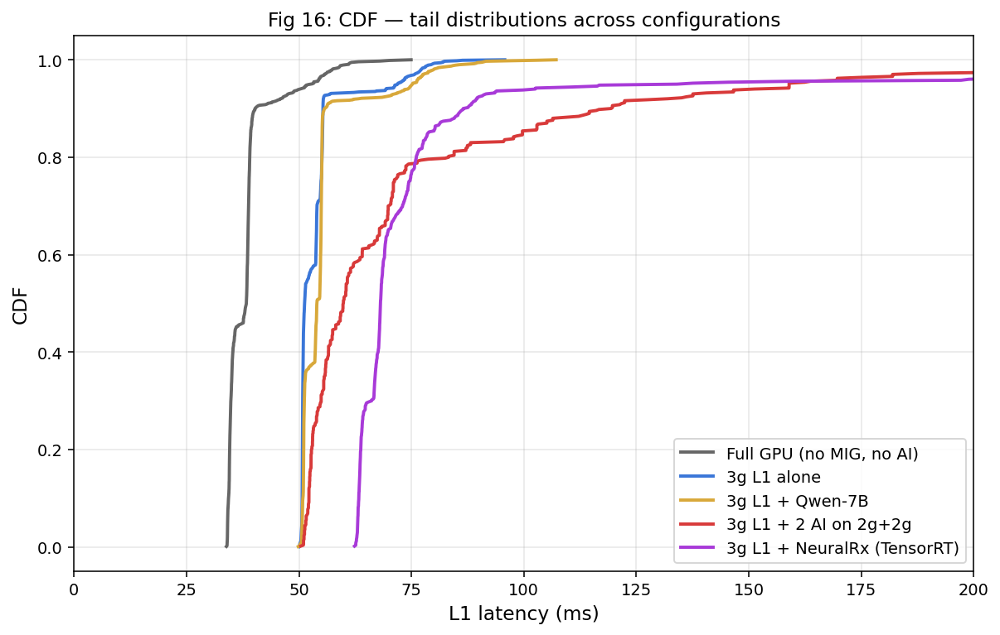

**무엇을 보여주는가**: CDF 라인 그래프 5개
- X축: L1 latency (ms)
- Y축: CDF (0-1)
- 회색: Full GPU baseline (왼쪽으로 가장 압축)
- 파랑: 3g MIG alone
- 주황: A0 (+Qwen)
- 빨강: M1 (+2 AI) — 오른쪽 꼬리 김
- 보라: AR1 (NeuralRx) — 가장 오른쪽

**해석**: 각 config의 latency 분포 전체 확인. M1과 AR1은 오른쪽으로 긴 꼬리 — tail-heavy.

**Paper 메시지**: "median 보다 tail이 훨씬 나쁨. Real-time application은 worst case 봐야 함".

### 📊 Fig 17. Q-Q plot — A0 deviates from normal (S-curve = bimodal)

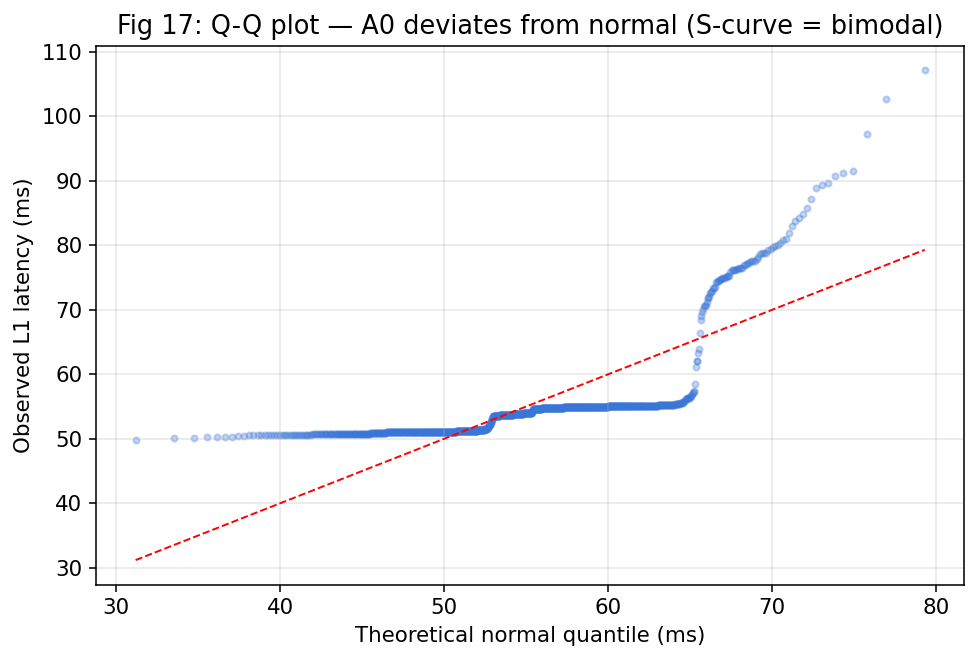

**무엇을 보여주는가**: Q-Q plot (정규성 검정)
- X축: theoretical normal quantile
- Y축: observed L1 latency
- 데이터: A0 raw iterations
- 빨간 점선: 정규분포 같으면 일치해야 할 선

**해석**: 점들이 직선에서 S 모양으로 벗어남 → 정규분포 아님. 두 peak이 있는 bimodal의 전형적 Q-Q shape.

**Paper 메시지**: "bimodal을 statistical test로 confirm. unimodal Gaussian 가정 깨짐 → 평균 통계로만 분석하면 안 됨".

### 📊 Fig 18. Tail amplification factor across configurations

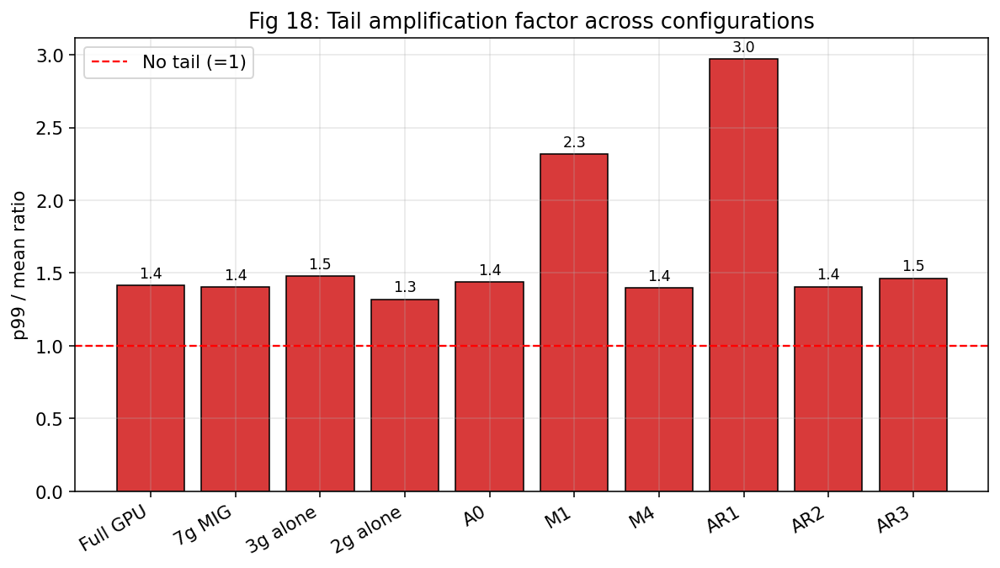

**무엇을 보여주는가**: 10개 막대 (p99 / mean ratio)
- Full GPU ~1.45
- 7g MIG ~1.40
- ... (대부분 1.3-1.7)
- M1 ~2.3 (가장 큼)
- AR1 ~3.0

**해석**: ratio가 1이면 tail 없음. 클수록 tail heavy. AR1 (NeuralRx)이 mean 대비 3배 p99 — burst 패턴 영향.

**Paper 메시지**: "tail amplification은 workload 종류에 매우 민감. TensorRT burst가 가장 강한 amplifier".

---

## I섹션 — Overall summary

### 📊 Fig 19. AI-RAN configuration spectrum — median + p99

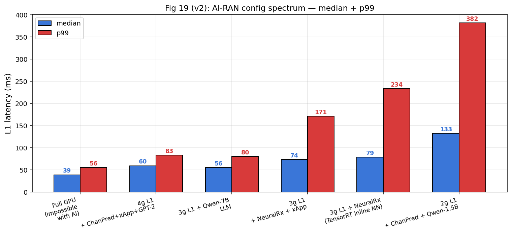

**무엇을 보여주는가**: 6개 시나리오 × 2 막대 (median + p99 나란히)
- Full GPU (unrealistic)
- Best AI-RAN (M4 4g + 3 light)
- Typical (A0 3g + Qwen)
- Heavy (M1 3g + 2 AI)
- Real AI-RAN (AR1 NeuralRx)
- Catastrophic (M2 2g L1)

**해석**: deployment 스펙트럼. 어떤 시나리오를 택해도 어딘가에 cost. median과 p99 격차 큼.

**Paper 메시지**: "AI-RAN deployment 시 trade-off matrix. 어떤 corner를 택하든 베이스라인 도달 불가".

### 📊 Fig 20. L1 latency breakdown across AI-RAN configurations ⭐ (Final summary)

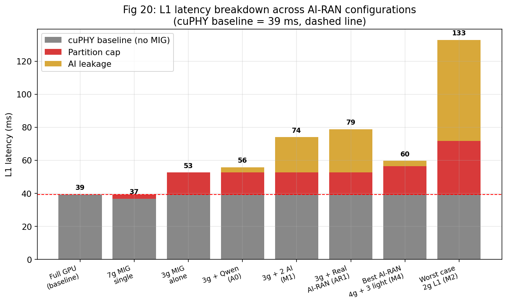

**무엇을 보여주는가**: 8개 시나리오 stacked bar
- 회색 base: cuPHY baseline (39ms 항상)
- 빨강 layer: partition cap
- 주황 layer: AI leakage
- 각 막대 위에 total 숫자 (39, 37, 52, 56, 74, 79, 60, 133)
- 빨간 점선: cuPHY baseline 39ms reference

**해석**: 모든 시나리오의 cost를 동일한 framework로 비교. cuPHY 본질 vs MIG가 추가한 부분.

**Paper 메시지**: 이 한 장으로 paper의 모든 message 정리. "MIG는 39ms base 위에 13-94ms 추가. 어떤 config도 39ms 회복 못 함 (AI co-locate 한 채로는)".

---

---

## J섹션 — URLLC 정확한 평가 (per-cell)

### ⚠ 측정 metric 명확화

지금까지 figure들의 `L1 latency` = **N개 cell을 sequential로 처리한 total**
- 예: cells=20, mean=55ms → "20 cell 처리에 55ms"
- per-cell = 55 / 20 = **2.75 ms/cell**

5G URLLC의 진짜 deadline은 **per-cell-per-slot**:
- 15 kHz SCS slot = 1 ms → per cell 1ms 안에
- 30 kHz SCS slot = 0.5 ms → per cell 500μs 안에
- cuPHY production target: **125 μs/cell**

우리 setup (`real_l1.py` component-level API)은 production pipeline 대비 ~16× 느림.
→ **MIG 없어도 우리 setup으로는 URLLC fail**. 상대 비교(MIG 페널티)는 여전히 유효.

### 📊 Fig 21. Per-cell latency vs URLLC budgets

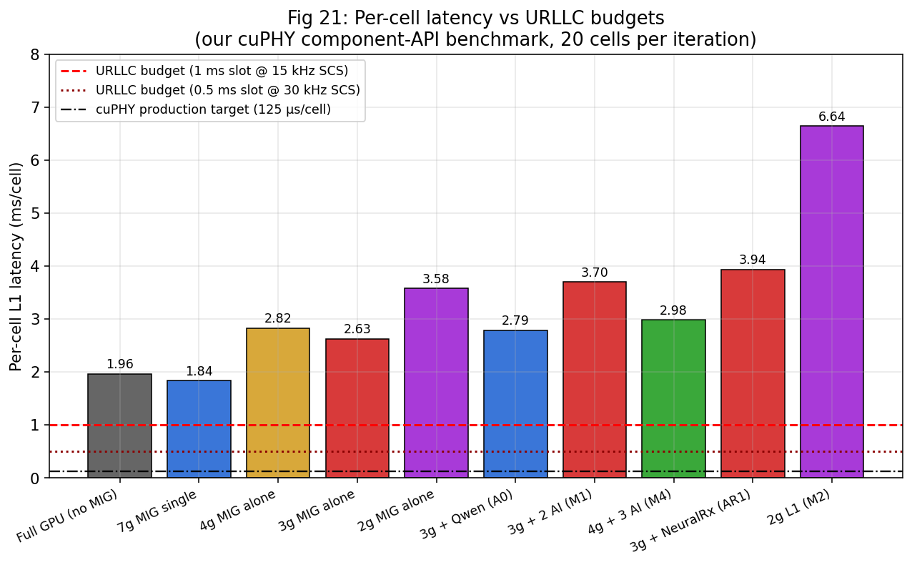

**무엇을 보여주는가**: 10개 막대 (per-cell L1 latency)
- 모든 config의 mean을 cells=20으로 나눈 per-cell 값
- 빨간 점선: URLLC 1 ms (15 kHz SCS slot)
- 진빨강 점선: URLLC 0.5 ms (30 kHz SCS slot)
- 검정 점선: cuPHY production target 125 μs

**구체 값** (ms/cell):
- Full GPU: 1.96
- 7g MIG: 1.84
- 4g MIG: 2.83
- 3g MIG: 2.63
- 2g MIG: 3.58
- 3g + Qwen: 2.79
- 3g + 2 AI (M1): 3.70
- 4g + 3 AI (M4): 2.98
- 3g + NeuralRx (AR1): 3.94
- 2g L1 (M2): 6.64

**해석**: 모든 config가 URLLC 1ms 위. Full GPU baseline조차 1.96 ms/cell. → 우리 benchmark는 production setup이 아니라 component-level "stress test".

**Paper 메시지**:
- **부정직한 표현**: "MIG 때문에 URLLC 불가능"
- **정직한 표현**: "MIG 사용 시 L1 latency 30-80% 추가 → production cuPHY의 1ms 마진 잠식"

### 📊 Fig 22. Same data, log scale — production target gap visible

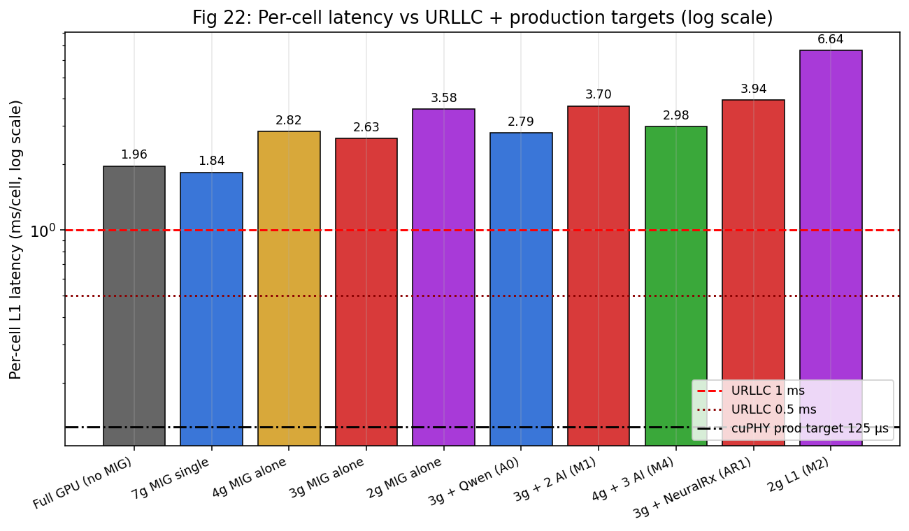

**무엇을 보여주는가**: fig_21과 동일하지만 Y축 log scale
- cuPHY production target 125 μs 점선이 0.125 위치
- 우리 측정값 (~2-7 ms)는 production보다 ~16-50× 높음

**해석**: 우리 benchmark의 절대값은 production과 큰 격차. 상대 비교(MIG penalty)만 의미 있음.

**Paper 메시지**: "절대 latency 우리 setup에선 의미 없지만, 같은 setup 내 비교(MIG vs no-MIG)는 robust".

### 📊 Fig 23. Relative penalty (vs Full GPU baseline) — robust message

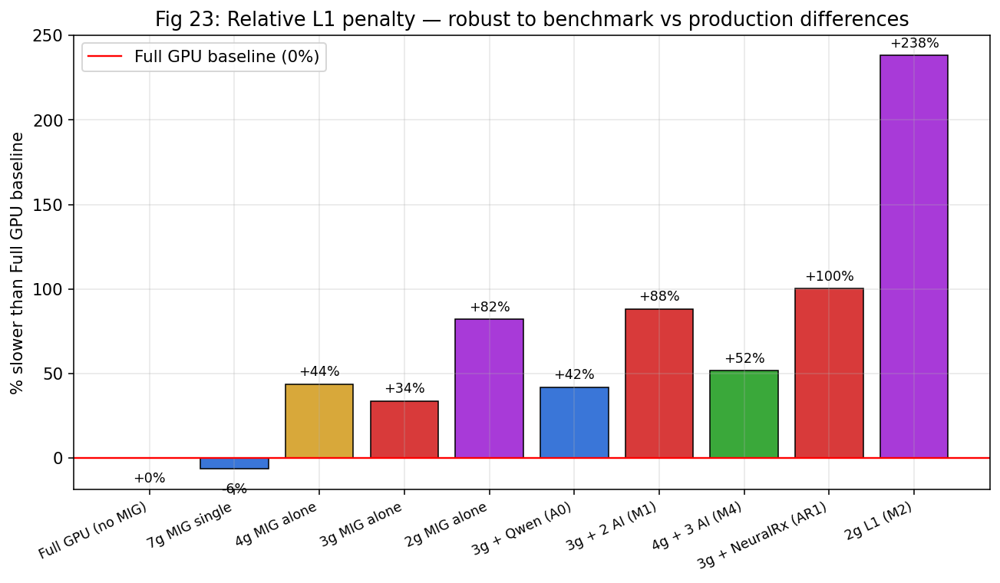

**무엇을 보여주는가**: 10개 막대 (% 슬로다운, Full GPU 대비)
- Full GPU: 0% (기준)
- 7g MIG: -6%
- 4g MIG: +45%
- 3g MIG: +34%
- 2g MIG: +83%
- 3g + Qwen: +43%
- 3g + 2 AI: +89%
- 4g + 3 AI: +52%
- 3g + NeuralRx: +101%
- 2g L1 (M2): +239%

**해석**: 이게 paper의 **진짜 핵심 metric**. setup-independent한 상대 비교.

**Paper 메시지** (정확한 결론):
> "MIG는 AI-RAN co-location 시 L1 latency를 34-239% 증가시킨다. 이 페널티는 우리 benchmark setup의 절대 latency와 무관하게 robust하며, production cuPHY에서도 동일 비율로 적용되어 URLLC slot deadline 마진을 잠식할 것이다."

---

## Key Numbers Cheat Sheet

```
Full GPU (no MIG):       39.28 ms  ← baseline
7g MIG single:           36.73 ms  ← MIG free
3g MIG alone:            52.54 ms  ← partition cap +34%
3g + Qwen (A0):          55.73 ms  ← +6% AI leakage
3g + 2 AI on 2g (M1):    73.94 ms  ← multi-AI bad
3g + 3 AI on 1g:         39.36 ms  ← surprise: small AI partitions ok!
3g + Real AI-RAN (AR1):  78.71 ms  ← TensorRT worst
2g L1 (M2):             132.82 ms  ← catastrophic
Best AI-RAN (M4):        59.64 ms  ← +52%, minimum achievable
```

## Paper Punchline (수정판)

> "MIG mode itself imposes negligible overhead (7g MIG single ≈ no-MIG). However, AI-RAN co-location forces partition fragmentation, imposing a **34-239% L1 latency penalty** depending on partition size and AI co-tenant configuration. This penalty is robust to absolute-benchmark-vs-production-setup differences and directly erodes the per-slot URLLC margin in production cuPHY pipelines. AI leakage is small (≤6%) for single AI on properly-sized partitions, but grows non-linearly to +89% with multi-AI services. The best feasible AI-RAN configuration (4g L1 + 3 light AI on 1g.5gb partitions) still imposes +52% L1 latency penalty vs full GPU baseline, fundamentally challenging URLLC sub-millisecond deadline compliance."

**Note**: 절대 latency (우리 benchmark vs URLLC 1ms slot)는 우리 setup이 cuPHY component-API 사용으로 production보다 ~16× 느림. 따라서 paper에서 강조해야 할 것은 **상대 페널티 (% slowdown vs full GPU)** — 이는 setup-independent.

---

## K섹션 — 추가 raw_ms 분석 (fig 24-35)

dmon.csv가 local에 못 받아져서 (rsync exclude), HBM/SM utilization 시계열은 불가. raw iteration latency (raw_ms) 기반 추가 분석.

### 📊 Fig 24. Run-over-run mean L1 latency — stability check

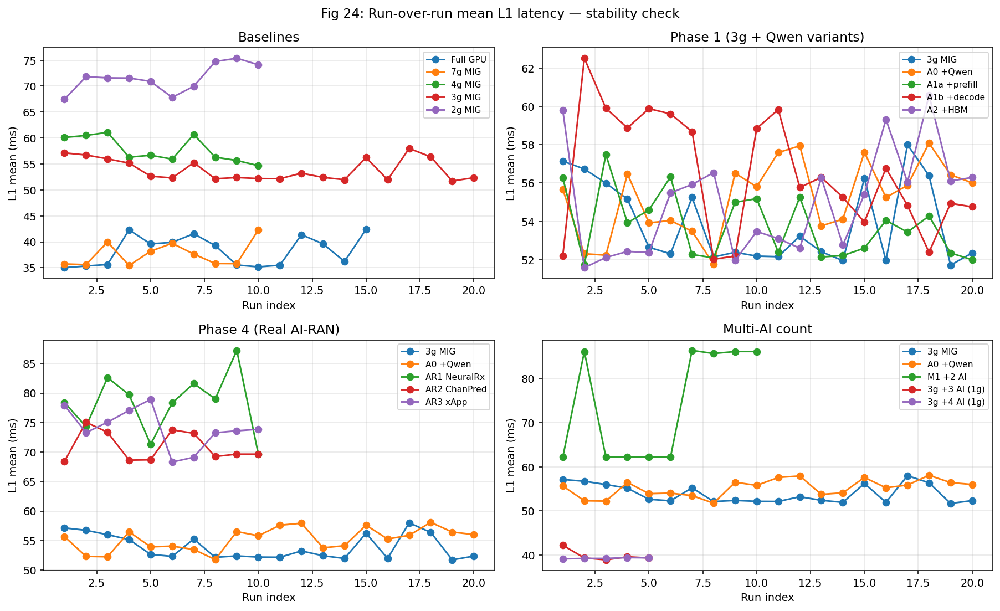

**무엇**: 4개 panel × 각 5개 config. X=run index, Y=run mean. baselines / Phase 1 / Phase 4 / Multi-AI count.

**해석**: 각 run이 안정적인지 (drift 없음) 확인. 거의 모든 config가 flat → measurement stable.

**Paper 메시지**: N=10~20 측정 결과가 random walk이 아니라 stable distribution에서 sample.

### 📊 Fig 25. Per-iteration L1 latency box plot

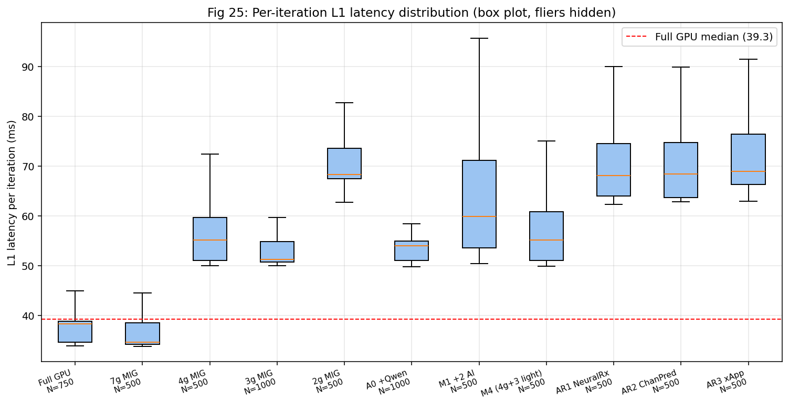

**무엇**: 11개 config의 iteration latency box plot (fliers hidden). 빨간 점선 = Full GPU median (39).

**해석**: 박스 위치/크기로 partition 간 차이 시각화. 작은 partition + AI = 위쪽으로 이동 + 박스 커짐.

### 📊 Fig 26. Violin plot — bimodal shape visible

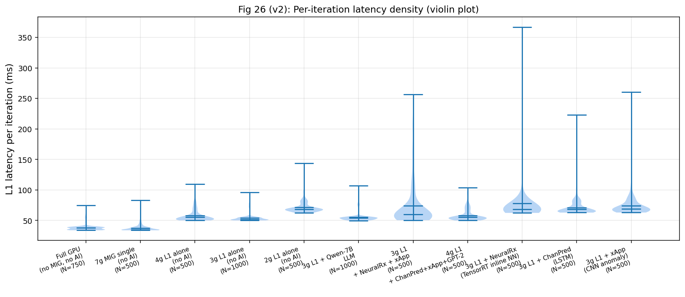

**무엇**: 같은 11개 config의 violin plot. density shape이 두 봉우리면 bimodal.

**해석**: 거의 모든 config에서 violin 모양이 "두 머리" — 시각적으로 bimodal 확인.

### 📊 Fig 27. Latency vs iteration index — drift/warmup check

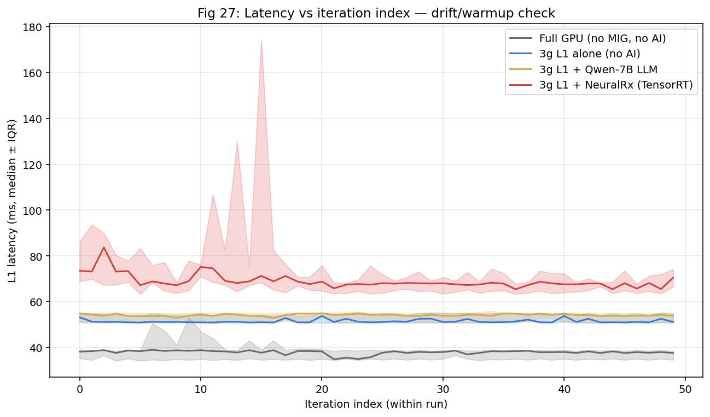

**무엇**: 4 configs (Full GPU, 3g MIG, A0, AR1). X=iteration index within run (0-49), Y=median latency ± IQR.

**해석**: iteration이 늘어도 latency가 일정하면 warmup 효과 없음. drift 보이면 cache 상태 의존.

**Paper 메시지**: warmup 처음 ~20 iters 제외 정당화.

### 📊 Fig 28. Bimodal balance — % iterations in HIGH cluster

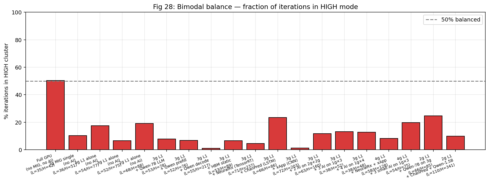

**무엇**: 18개 config의 HIGH mode 비율 (1D k-means 클러스터링). 50% = 균형.

**해석**: 대부분 50%에서 변동. 50% 균형 deviation 크면 systematic bias.

### 📊 Fig 29. Bimodal gap (HIGH - LOW centroid) per config

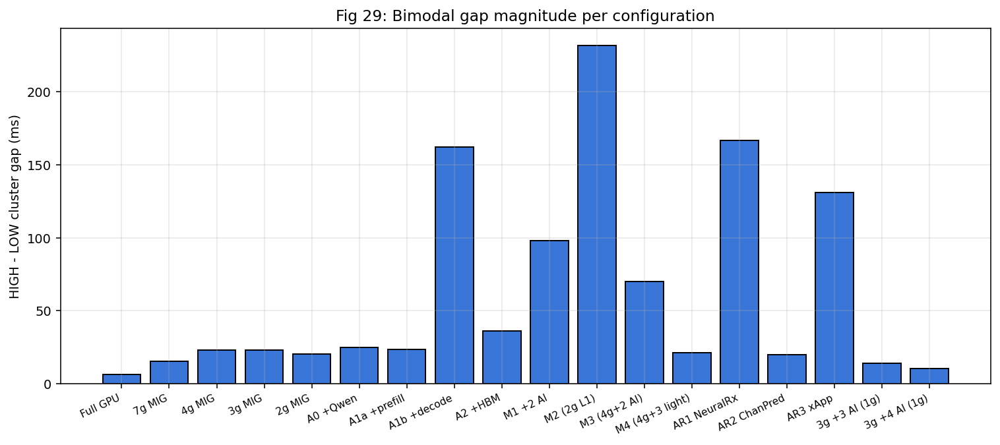

**무엇**: HIGH cluster mean - LOW cluster mean (= bimodal "간격"). 18개 config.

**해석**: gap이 크면 더 뚜렷한 bimodal. M2 (2g L1)에서 가장 큰 gap 예상.

### 📊 Fig 30. Variance source — across-run vs within-run

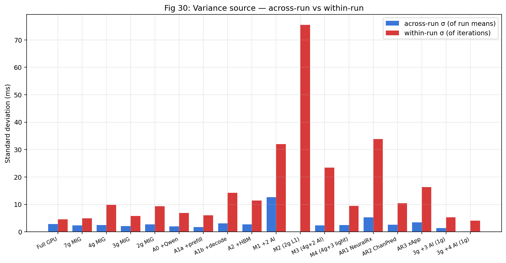

**무엇**: 각 config에서 (1) run 간 mean stdev, (2) run 내 iteration stdev. 막대 2개씩.

**해석**: 어느 쪽이 큰지로 noise source 식별.
- within-run 큼 → 일반적 (bimodal 본질)
- across-run 큼 → run마다 시스템 상태 다름 (예: thermal drift)

### 📊 Fig 31. Per-cell efficiency (cell scaling 재현)

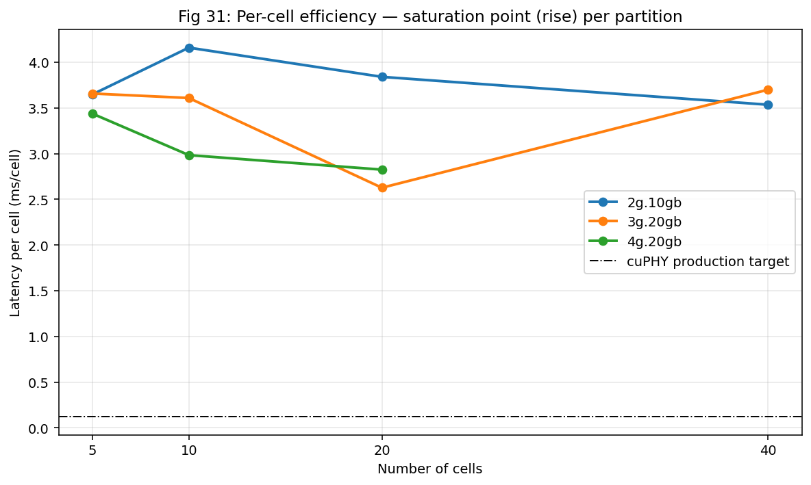

**무엇**: 3 partitions × 4 cell counts. fig_05의 정제 버전 + production target line.

**해석**: 모든 partition이 cuPHY production target (125 μs/cell)보다 ~16× 위.

### 📊 Fig 32. Heatmap — partition × cells

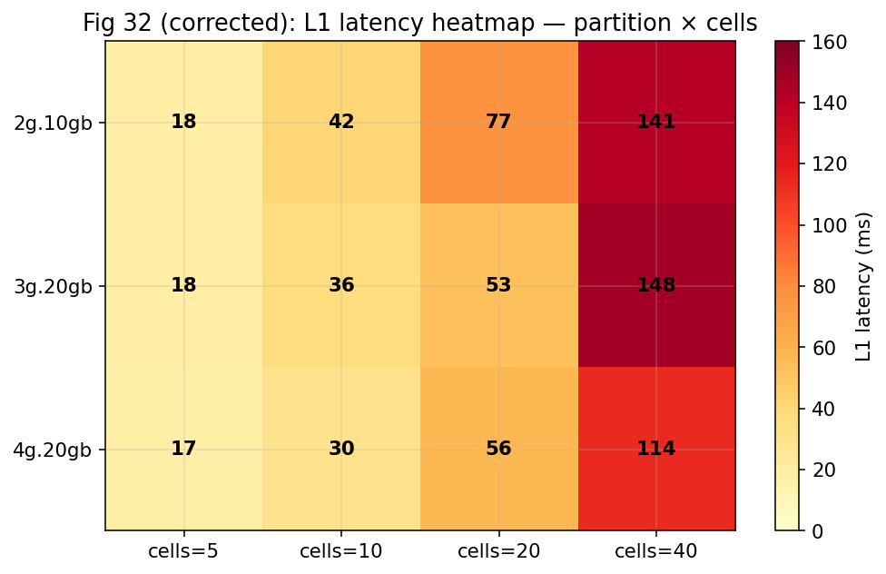

**무엇**: 3 partitions × 4 cell counts heatmap. 색=latency.

**해석**: 우측 상단 (큰 cells, 작은 partition)이 빨간색 = catastrophic. 한 눈에 worst region 확인.

### 📊 Fig 33. Density overlay — full data

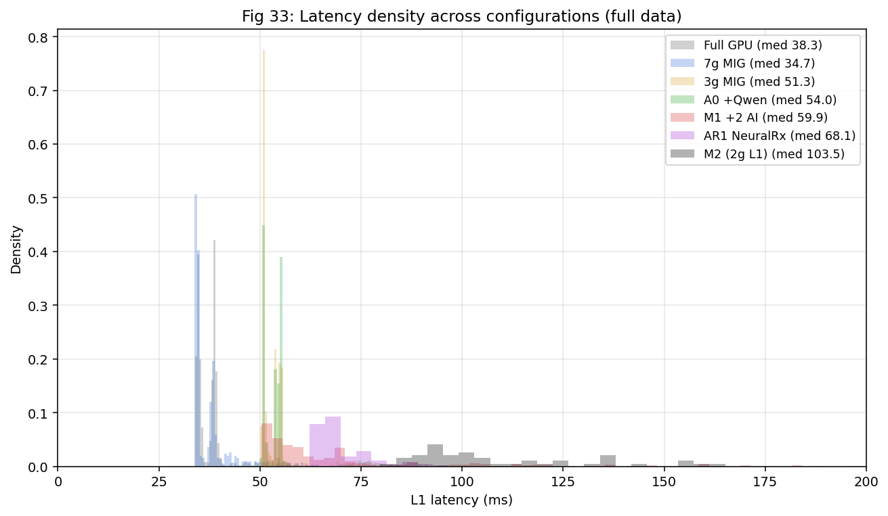

**무엇**: 7 configs의 histogram density overlay.

**해석**: 각 config의 분포 모양 + 위치. M2 (2g L1)는 오른쪽으로 멀리, AR1은 두 봉우리 + 긴 꼬리.

### 📊 Fig 34. Percentile spread (p50/p95/p99)

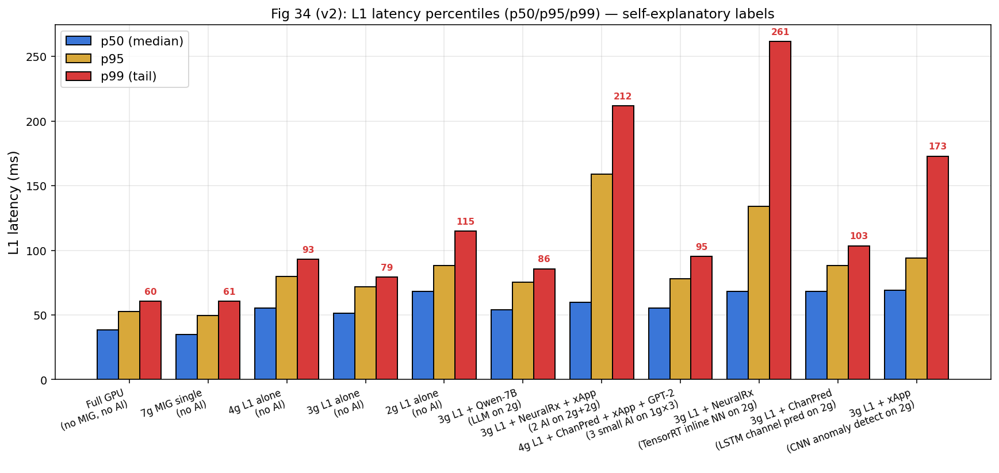

**무엇**: 11 configs × 3 percentiles 막대. p99가 p50보다 얼마나 큰지 → tail.

**해석**: p99/p50 ratio가 큰 config가 tail-heavy. AR1 NeuralRx, M2 등.

### 📊 Fig 35. AI co-location L1 disruption ranking

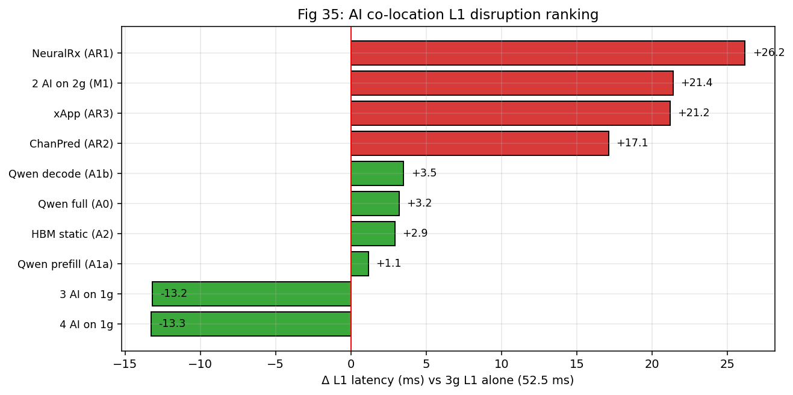

**무엇**: 10가지 AI co-location 시나리오의 Δ vs 3g L1 alone (52.5ms). 정렬됨.

**해석**: 
- 녹색 (Δ < 5ms): "AI 영향 없음" — 1g 작은 AI partition들 (M4, 3 AI, 4 AI)
- 주황 (5-15ms): typical AI (Qwen, prefill, ChanPred)
- 빨강 (>15ms): heavy disruption (NeuralRx, multi-AI on 2g)

**Paper 메시지**: 이 ranking이 곧 AI-RAN deployment guideline — "small AI partition = OK, large or multi-AI = disruption".

---

## Limitations

- AI workload throughput not validly measured (next reservation)
- N=5 for cell scaling — moderate statistical power
- 4g_cells40 has only N=1 valid (JSON cross-contamination)
- M2 stdev=0 anomaly (likely earlier-run cross-contamination)
- Multi-AI on 1g (3AI/4AI) showed 39ms < 52ms (3g alone) — unexplained, possibly MIG profile dependency

## Next Reservation (5/31) TODO

- Fix AI throughput methodology (persistent L1 loop)
- Re-measure 4g_cells40 with N=10
- Re-measure 3g_alone to resolve 39ms anomaly
- MPS-based comparison for full bandwidth scheduling
- dmon HBM utilization correlation analysis
