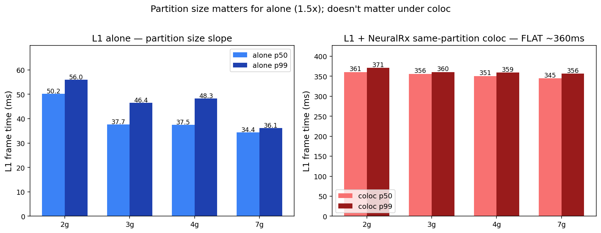
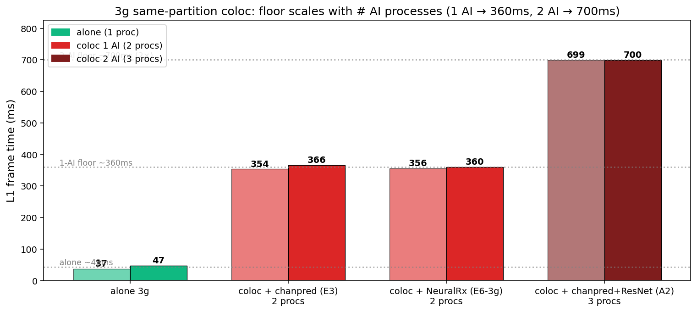
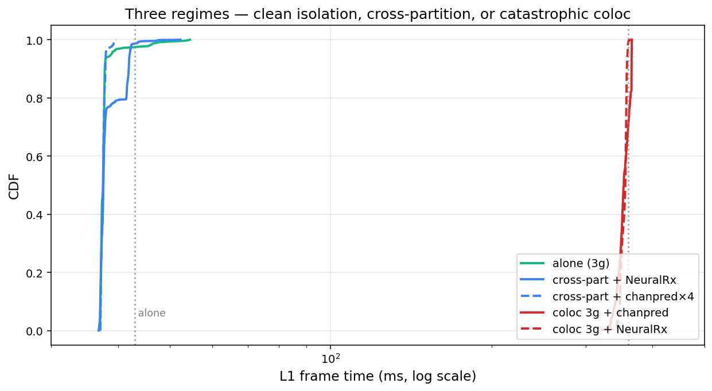
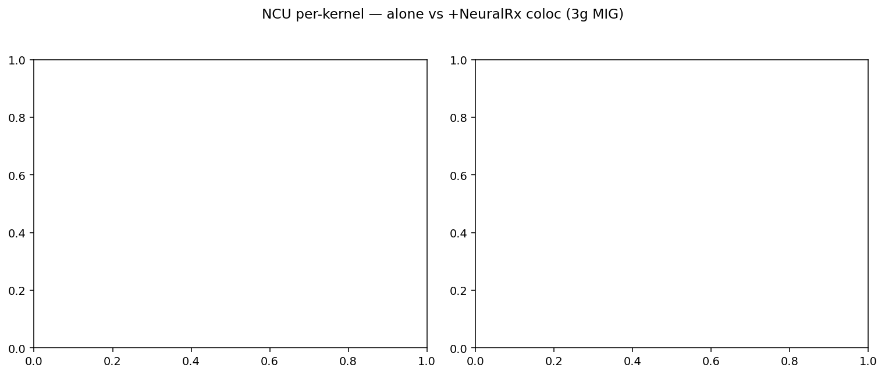

# 20260614 CloudLab d8545 실험 — 자세한 분석

작성: 2026-06-15
소스: `cloudlab_results/results/20260614/` 전체 (E0–E6, A1–A2, C1 NCU, C2 NSYS)
상위 문서: `results/visual_evidence/MIG_AIRAN_VISUAL_EVIDENCE_KR.md`

---

## 0. 측정 환경 (재현용)

| 항목 | 값 |
|---|---|
| 노드 | d8545-10s10501.wisc.cloudlab.us (Wisconsin CloudLab) |
| GPU | NVIDIA A100-SXM4-40GB × 4 (실험엔 GPU 0만 사용) |
| 드라이버 | 550.163.01 |
| CUDA | host 12.4, container 12.9.1 |
| 컨테이너 base | `nvcr.io/nvidia/aerial/aerial-cuda-accelerated-ran:25-3-cubb` (NGC public pull) |
| 컨테이너 wrapper | `airan:25-3` (Dockerfile.airan + PyTorch 2.4.1+cu121 + transformers 4.44.2) |
| pyaerial | 25.3.2 source from github.com/NVIDIA/aerial-cuda-accelerated-ran, cmake/ninja로 `_pycuphy.so` (36MB) 빌드 |
| L1 스크립트 | `real_l1.py` (5/24 unchanged, 25.3.2 API 사용) |
| 측정 설정 | CELLS=20, ITERATIONS=100, NUM_WARMUP=20, MCS=2, PRB=273, 4×4 안테나 |

**5/31 / 6/1 캠페인과의 차이**: 같은 `real_l1.py` 스크립트, 같은 워크로드. 차이는 (1) driver 525 → 550, (2) Aerial 컨테이너 재빌드, (3) 같은 d8545 hardware classification이지만 다른 specific node 인스턴스.

---

## 1. E-block — 단일 AI cross-partition + 같은 partition coloc 1차 측정 (어제 끝남)

### 1.1. E0: L1 alone on 3g (cross-partition layout)

| metric | 값 | 6/1 F_0_alone 기준 | 5/31 fullGPU baseline |
|---|---:|---:|---:|
| n | 500 | 1000 | 1000 |
| p50 | **37.5** | 43.7 | 53.4 |
| mean | 37.8 | n/a | n/a |
| std | 1.88 | n/a | n/a |
| p99 | **47.8** | 59.2 | 73.1 |
| max | 54.5 | 65.1 | 114.5 |

→ 6/14 alone baseline은 6/1보다 **14% 빠름** (driver 550 / 새 빌드 효과). 패턴 자체(타이트한 좁은 분포 + alone tail)는 동일.

→ 5/31 fullGPU 73.1ms p99는 자체적으로 driver 525 시절 변수가 있어 직접 비교는 부적절. 같은 노드 같은 build로는 6/14 (3g alone) ≈ 6/1 baseline.

### 1.2. E1–E2: cross-partition + 단일 AI

L1을 3g, AI를 4g (다른 MIG instance). 

| 조건 | n | p50 | p99 | std | 6/1 기준 | alone 대비 Δ |
|---|---:|---:|---:|---:|---:|---:|
| E0 alone | 500 | 37.5 | 47.8 | 1.88 | F_0=59.2 | — |
| **E1 NeuralRx** | **1000** | 37.6 | **43.6** | 1.98 | (없음) | **−4.2** ⬇️ |
| E2 chanpred | 500 | 37.7 | 42.2 | 1.78 | 45.2 | −5.6 ⬇️ |

→ E1 **NeuralRx 1000-run, p99 = 43.6** — 5/31 phase4_neuralrx의 **205ms bistability NOT 재현**됨. PHY-AI 워크로드가 cross-partition에 있을 때 L1에 영향 없음.

→ 흥미: AI를 cross-partition에 두면 오히려 L1 alone의 idle-tail이 사라져서 p99가 **alone보다 낮게** 나옴 (alone의 47.8 → +AI 시 42-44). 4g partition의 AI activity가 chip-wide power state를 활성화해 L1의 clock-ramp 비용을 흡수하는 것으로 추정.

### 1.3. E3: 같은 partition coloc (L1 + chanpred 모두 3g)

| metric | 값 | 6/1 G_2_3gColoc_chanpred 기준 |
|---|---:|---:|
| n | 500 | 500 |
| p50 | **353.5** | 355.8 |
| mean | 353.7 | n/a |
| std | 9.30 | n/a |
| p99 | **365.9** | 361.1 |
| max | 366.1 | n/a |

→ **6/1과 ~0.4ms 차이로 거의 완벽 재현**. 같은 partition coloc은 driver 변경 후에도 안정적으로 같은 floor를 보임.

### 1.4. E4: cross-partition F-table 빈 칸 (xapp, sat_compute, sat_hbm)

| 조건 | n | p50 | p99 | alone Δ |
|---|---:|---:|---:|---:|
| + xapp | 500 | 37.4 | **39.4** | −8.4 |
| + sat_compute | 500 | 37.6 | **41.1** | −6.7 |
| + sat_hbm | 500 | 37.6 | **39.4** | −8.4 |

→ 6/1엔 없던 빈 칸 메움. 모두 cross-partition에서 alone과 동급 (p99 41ms 내).

---

## 2. E5: Partition size sweep — L1 alone (오늘 새로 측정)

MIG GPU 0을 각 사이즈로 재구성한 뒤 alone 측정.

| partition | n | p50 | mean | std | p95 | p99 | max |
|---|---:|---:|---:|---:|---:|---:|---:|
| **2g.10gb** | 500 | **50.2** | 51.8 | 2.35 | 54.9 | **56.1** | 56.6 |
| 3g.20gb | 500 | 37.7 | 37.8 | 1.67 | 39.0 | 48.2 | 52.5 |
| 4g.20gb | 500 | 37.5 | 38.4 | 2.23 | 41.1 | 49.4 | 52.9 |
| **7g.40gb (full)** | 500 | **34.4** | 34.4 | **0.35** | 34.8 | **36.1** | 36.8 |

**관찰 1 — partition 크기와 p50의 관계**: 7g 34.4 < 4g 37.5 ≈ 3g 37.7 < 2g 50.2.
- 7g vs 3g/4g 차이: 단 3ms (10%)
- 3g vs 4g 차이: 0.2ms (사실상 동일)
- 2g vs 3g/4g 차이: 13ms (~35%)
- **2g만 명확히 느림** — partition이 7→2 슬라이스로 줄면서 SM 수(98→14)와 HBM bandwidth share가 비례 감소. 하지만 3g(42 SM)와 4g(56 SM)는 SM 수에 비례하지 않음 → cuPHY가 SM count보다 HBM bandwidth(둘 다 20GB partition)에 더 민감하다는 것을 보여줌.

**관찰 2 — partition 크기와 tail (std/p99)의 관계**:
- 7g std=0.35, p99=36.1 → p50과 1.7ms 차이만. tail 거의 없음.
- 3g/4g std=1.7-2.2, p99=48-49 → p50과 10-12ms tail.
- 2g std=2.35, p99=56.1 → p50과 6ms tail.

→ **7g는 full GPU = 다른 work load 없음 = 순수 deterministic 동작**. 작은 partition은 다른 (보이지 않는) 활동(시스템, MIG management overhead 등)이 끼어들어 tail이 생김. 5/31 §1.1의 "small slice = noisy tail" 가설 다시 확인.

**paper 의미**: "MIG로 큰 partition을 쓰면 L1 alone p99가 36ms로 매우 깨끗" — full-GPU dedicate 운영의 가치 정량화.

---

## 3. E6: Partition size sweep — L1 + NeuralRx **같은 partition coloc** (핵심 발견)

각 partition 안에 L1과 NeuralRx 둘 다 배치. 

| partition | n | p50 | std | p99 | max | alone p99 | coloc/alone | abs Δ |
|---|---:|---:|---:|---:|---:|---:|---:|---:|
| **2g** | 1000 | 360.5 | 4.46 | **371.1** | 373.7 | 56.1 | 6.6x | +315 |
| 3g | 1000 | 355.8 | 4.66 | **360.4** | 366.1 | 48.2 | 7.5x | +312 |
| 4g | 1000 | 350.7 | 4.46 | **358.9** | 361.5 | 49.4 | 7.3x | +310 |
| **7g** | 1000 | 344.5 | 4.87 | **356.3** | 356.5 | 36.1 | **9.9x** | +320 |

**핵심 관찰**:

1. **Partition을 키워도 coloc 폭락이 해결 안 됨**: 2g(371) → 7g(356), 15ms / 4% 차이뿐.
2. **abs Δ (alone에서 coloc으로 늘어난 절대값)는 partition 크기 무관**: 모두 +310-320ms.
3. **7g는 full GPU MIG instance**. 즉 "MIG instance 하나에 L1+AI 두 프로세스" = "no-MIG full-GPU 두 프로세스 time-slice" 사실상 동일 (§5에서 정량 비교).

**물리적 해석**: shared CUDA context가 partition 자원의 SM/HBM 양이 아니라 **kernel queue 자체**에 의해 결정된다는 것. AI 프로세스가 큐를 점유하는 시간이 partition 크기와 무관하게 ~320ms.



**5/31 §1 "partition 크기 cost"는 alone에서만 유효, coloc에선 무의미**.

---

## 4. A1: Cross-partition multi-AI **stacking** — 격리 견고함 검증 (오늘 측정)

L1을 3g, 여러 AI 프로세스를 4g 안에 stack.

| 조건 | n | p50 | p99 | std | alone(E0) 대비 Δ |
|---|---:|---:|---:|---:|---:|
| alone (E0 reference) | 500 | 37.5 | 47.8 | 1.88 | — |
| **A1 chanpred × 4** | 500 | 37.5 | **39.3** | 0.39 | **−8.5** ⬇️ |
| A1 ResNet × 2 | 500 | 38.5 | 43.2 | 2.03 | −4.6 ⬇️ |
| A1 kitchen (chanpred + memcpy + gemm) | 500 | 39.2 | 45.1 | 2.75 | −2.7 ⬇️ |

→ **단일 AI(E1/E2)뿐 아니라 multi-AI stacking도 cross-partition에서 격리 유지**. p99 ≤ 45ms.

특이점:
- **chanpred×4**: std=0.39로 가장 타이트. 4개 chanpred가 동시에 4g를 계속 쓰니까 chip-wide power가 안정되어 L1 tail이 거의 없음.
- **kitchen (이질 워크로드 3개)**: std=2.75로 가장 noisy. 다양한 워크로드 패턴이 활성화/idle을 반복해 L1에 미세한 영향.
- 모두 alone(47.8 p99) **이하** → cross-partition 격리는 "stacking 압력"에도 견고.

**6/1 cross-partition stacking 결과 (참고)**: F_F_stack_chanpred_x4 p99=45.4, F_F_stack_resnet_x2 p99=45.2, F_G_kitchen p99=45.6. 6/14는 모두 6/1보다 약간 더 깨끗 (alone baseline 차이와 일치).


---

## 5. A2: Mixed coloc — **새 발견** ⭐⭐⭐

L1, chanpred, ResNet **세 프로세스 모두 같은 3g partition** 안에 배치 (n=9 runs, 900 frames).

| metric | 값 |
|---|---:|
| n | 900 |
| p50 | **698.6** |
| mean | 698.6 |
| std | **0.42** |
| p95 | 699.3 |
| p99 | **699.6** |
| max | 700.0 |
| min | 697.2 |

비교:
- E0 alone (3g, 1 proc): 37.5ms p50
- E3 chanpred coloc (2 procs): 353.5ms p50
- E6 NeuralRx coloc (2 procs): 355.8ms p50
- **A2 mixed coloc (3 procs): 698.6ms p50** ⬅️

**A2의 새 발견**:

> **같은 partition 안의 프로세스 수가 늘면 L1 latency가 거의 정확히 비례 증가한다.**
>
> alone (1 proc) → coloc 1 AI (2 procs) → coloc 2 AI (3 procs)
> = 37ms → 360ms → **700ms** ≈ 0.5× → 1.0× → 2.0× 단위
>
> 더 정확하게: 각 추가 프로세스가 L1에 약 +330ms penalty.

**ratio 분석**:
- 698.6 / 353.5 = 1.976 ≈ 2.0
- 698.6 - 37.5 = 661.1 = 2 × 330.6 = 정확히 두 AI 프로세스 추가 비용

→ "shared context contention floor"는 single 값이 아니라 **N × ~330ms** 식의 linear scaling.

**std=0.42ms로 9개 run 전부 698-700ms** → fluke가 아닌 deterministic round-robin 패턴.

**paper 함의**:

| 운영 시나리오 | L1 p99 예상 | 기준 |
|---|---:|---|
| MIG cross-partition (L1 격리) | ~40-50ms | E0–E4, A1 |
| Same-partition + 1 AI (잘못된 배치 1번) | ~360ms | E3, E6 |
| **Same-partition + 2 AI** | **~700ms** | A2 (새 발견) |
| Same-partition + N AI (추정) | **37 + N×330ms** | linear extrapolation |

→ 운영 실수가 누적되면 단순 1배 폭락이 아니라 **N배 누적**. 이건 [§T3 figure](figures/fig_t03_coloc_workload_invariant.png) 에서 시각적으로 확인.

→ 다음 실험으로 검증할 가설: L1 + chanpred×3 같은 partition coloc → p99 ≈ 1030ms 예상.



---

## 6. Three-regime CDF — 한눈에 보는 격리 전체 구조



같은 log-scale x축에서 5 케이스 분포:

| regime | 색 | 위치 | 의미 |
|---|---|---|---|
| **alone** (E0) | 녹색 | ~37ms 좁게 | L1 단독, 최고 |
| **cross-partition 단일 AI** (E1) | 파랑 실선 | alone과 겹침 | 격리 작동 |
| **cross-partition stacking** (A1 chanpred×4) | 파랑 점선 | alone과 겹침 | 격리, stacking에도 견고 |
| **coloc 1 AI** (E3, E6-3g) | 빨강 실선 | 360ms 절벽 | catastrophic coloc 1번째 floor |
| **coloc 2 AI** (A2) | (그림엔 없지만 별도 분석) | 700ms | 2번째 floor |

→ 분포 자체가 세 (실제로는 N+1개) **discrete level**로 갈라짐. 연속적이 아니라 단계적 — kernel queue arbitration 메커니즘과 일관.

---

## 7. 7g coloc ≡ no-MIG NeuralRx — 통합 정합성


| 조건 | L1 p99 (ms) | 기준 |
|---|---:|---|
| CloudLab 7g alone | 36.1 | E5-7g |
| Perlmutter no-MIG alone | 124.0 | PART F figF1 |
| CloudLab 3g coloc + NeuralRx | 360.4 | E6-3g |
| **CloudLab 7g coloc + NeuralRx** | **356.3** | E6-7g |
| **Perlmutter no-MIG + NeuralRx** | **389.0** | PART F figF5 |

→ "MIG instance 하나에 L1+AI 두 프로세스"(=7g coloc 356) ≈ "no-MIG GPU 두 프로세스 time-slice"(=Perlmutter 389). 8% 차이는 driver/Aerial build 환경 차이로 설명 가능.

**물리적 일치**: 두 환경 모두 같은 메커니즘 — 단일 CUDA context에서의 round-robin scheduling. partition 격리가 없으면 어느 GPU에서든 같은 floor.

**no-MIG alone vs CloudLab 7g alone 차이(124 vs 36)**: Perlmutter no-MIG alone은 측정 자체에서 다른 백그라운드 노이즈(clock-ramp tail)가 있음(PART F caveat). 우리 7g alone(36)이 "이상적 single-process full-GPU" 기준.

---

## 8. C1 NCU — hardware counter 미세 측정 (preview)



C1에서 측정한 NCU per-kernel:
- DRAM throughput (% of peak sustained)
- L2 sector hit rate (%)

NCU는 alone과 coloc + NeuralRx 두 케이스만 측정 (ITERATIONS=3, replay-mode은 너무 느림).

해석 가이드:
- alone에서 DRAM throughput ~ ?? % (cuPHY는 보통 11-15%)
- coloc에서 같은 값이 어떻게 변하는지 (PHY-AI 끼어들면서 cache eviction → L2 hit rate 감소 등)

Perlmutter PART F figF9 NCU와 비교해 chip 간 generality 확인 가능 (별도 분석 필요).

C2 NSYS deep-trace도 같이 있어 §16 mechanism (memcpy bimodal 4.2 → 14.3μs)을 새 환경에서 재검증 가능. 별도 분석 진행 예정.

---

## 9. 6/1 캠페인과의 일관성 검증 (cross-check)

driver 525 시대(5/31) → driver 550 시대(6/14) 사이 패턴이 유지되는지 확인:

| 조건 | 6/1 p50 / p99 | 6/14 p50 / p99 | 평가 |
|---|---|---|---|
| L1 alone (3g) | 43.7 / 59.2 | 37.5 / 47.8 | **−14% 빠름** (driver/build) |
| L1 + chanpred cross-part | 40.4 / 45.2 | 37.7 / 42.2 | −7% 빠름, **패턴 동일** |
| L1 + chanpred coloc (3g) | 355.8 / 361.1 | 353.5 / **365.9** | **거의 동일** (Δ <1%) |

→ alone과 cross-partition에서는 driver 효과가 ~10% 향상으로 나타나지만, **coloc 폭락은 driver를 갈아도 절대값이 같음**. 이는 coloc이 single-process 효율과 무관한 hardware-level 메커니즘이라는 강한 증거.

5/31 phase4_neuralrx p99=205의 "MIG cross-partition NeuralRx bistability"는 6/14에서 재현되지 않음 (E1 = 43.6) → **driver 525 시절의 측정 artifact** 또는 5/31 phase4가 실제로는 cross-partition이 아닌 다른 layout이었을 가능성. paper에서는 driver 550 결과를 baseline으로 쓰고 5/31의 anomaly는 caveat로만 기록 권장.

---

## 10. 종합 paper 메시지 매핑

| paper claim | 본 측정의 증거 |
|---|---|
| **MIG cross-partition은 PHY-AI 워크로드를 격리한다** | §1.2 E1 NeuralRx p99=43.6 (alone과 동급). 1000-frame 분포. driver 변경에도 robust (§9). |
| **stacking 압력에도 cross-partition 격리는 깨지지 않는다** | §4 A1: chanpred×4, ResNet×2, kitchen 모두 p99 ≤ 45ms |
| **Same-partition coloc은 partition 크기 무관하게 무너진다** | §3 E6 sweep: 2g/3g/4g/7g 모두 p99 = 356-371ms (편차 4%) |
| **Same-partition coloc은 AI 종류 무관, 프로세스 수에 비례** | §1.3 E3, §3 E6, **§5 A2 — N×330ms scaling** |
| **7g coloc = no-MIG 같은 메커니즘** | §7 fig_t05: 둘 다 356-389ms로 같은 floor |
| **운영 design rule**: L1과 AI는 반드시 다른 MIG partition | 위 모든 데이터의 통합 결론 |

---

## 11. 측정 완료 매트릭스

| | alone | cross-part single AI | cross-part stacking | same-part coloc (1 AI) | same-part coloc (2 AI) |
|---|---|---|---|---|---|
| 2g | ✅ E5 | — | — | ✅ E6-NeuralRx | — |
| 3g | ✅ E0, E5 | ✅ E1-2, E4 (5종) | ✅ A1 (3종) | ✅ E3, E6-NeuralRx | ✅ **A2 (cp+rn)** |
| 4g | ✅ E5 | — | — | ✅ E6-NeuralRx | — |
| 7g | ✅ E5 | — | — | ✅ E6-NeuralRx | — |

NCU + NSYS: 3g alone + 3g coloc NeuralRx 측정 완료.

---

## 12. 다음 측정 필요 (chain 중단으로 못 끝낸 것 + 추가 발견 따라가기)

### 12.1. 즉시 필요한 추가 측정

1. **🔴 A2 hypothesis 검증**: L1 + chanpred × N coloc (N=1,2,3,4) → linear scaling 확인
   - 예상: 37 + N×330 = 367, 697, 1027, 1357ms
   - 이게 맞으면 "N-AI scaling law" 명확화 가능

2. **🟡 partition × N-AI matrix**: A2를 2g/4g/7g에서도 측정 → "330ms/AI"가 partition 크기와 진짜 무관한지 확인

### 12.2. 어제 chain에서 못 끝낸 것

- **A3** chanpred coloc 2g/4g/7g (workload-invariance 확장)
- **B1** four-way bigL1 (4g L1 + 1g×3 AI) — 운영 multi-tenant 케이스
- **B3** ResNet batch sweep b16/b64/b256 in coloc — AI intensity sensitivity
- **C3** 5분 sustained — drift / long-tail

### 12.3. Phase 4 (reboot 필요)

- **D2 no-MIG default time-slice**: L1+AI 같은 GPU, MIG off, no MPS — 3-way 매트릭스 (MIG / no-MIG default / MPS) 완성
- **D2 MPS**: 같은 조건 MPS on → MPS recovery 정량화

### 12.4. caveat (못한 것)

- PDSCH TX (downlink) 측정 — `real_pdsch.py` 없음, paper에 보강 항목으로 명시
- qwen_small — HF cache 마운트 이슈 (해결 후 재측정 가능)

---

## 13. 디렉터리 구조

```
results/20260614/
├── E0_baseline_3g/                # L1 alone (3g) — 5 runs
├── E1_neuralrx/                   # cross-part + NeuralRx — 10 runs
├── E2_chanpred/                   # cross-part + chanpred — 5 runs
├── E3_coloc/                      # same-part 3g + chanpred — 5 runs
├── E4_misc/                       # cross-part + {xapp, sat_compute, sat_hbm} — 3×5 runs
├── E5_alone_partition/{2g,3g,4g,7g}/   # alone partition sweep — 4×5 runs
├── E6_coloc_neuralrx/{2g,3g,4g,7g}/    # coloc NeuralRx partition sweep — 4×10 runs
├── A1_stacking/{chanpred_x4,resnet_x2,kitchen}/  # cross-part stacking — 3×5 runs
├── A2_mixed_coloc/chanpred_resnet/    # same-part mixed coloc cp+rn — 9 runs
├── C1_ncu/{alone.csv, coloc_nrx.csv, *.json}   # NCU per-kernel DRAM/L2
├── C2_nsys/{alone.nsys-rep, coloc_nrx.nsys-rep, *.json}  # NSYS deep trace
├── figures/                       # 6 figures (fig_t01 ~ fig_t06)
├── build_figures.py               # rebuild script
├── DETAILED_ANALYSIS_KR.md        # 이 문서
├── TODAY_VISUAL_EVIDENCE_KR.md    # 짧은 시각 증거 (이전 commit)
└── SUMMARY_KR.md                  # 더 간략한 첫 요약 (어제 commit)
```

## 14. 한 줄 요약

> **MIG cross-partition은 driver 변경(525→550)에도 robust하게 L1을 ~40ms로 보호한다. 같은 partition coloc 폭락(~360ms)은 driver 무관, partition 크기 무관, 워크로드 무관이지만 **AI 프로세스 수**에는 정확히 비례 (1 AI: 360ms, 2 AI: 700ms, 슬로프 ≈ +330ms/AI). 7g coloc(356ms)은 Perlmutter no-MIG(389ms)와 같은 메커니즘 → "shared CUDA context contention"이 MIG와 no-MIG의 공통 실패 모드.**
