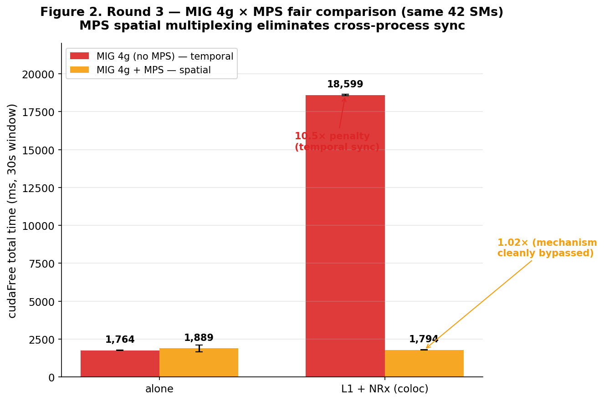
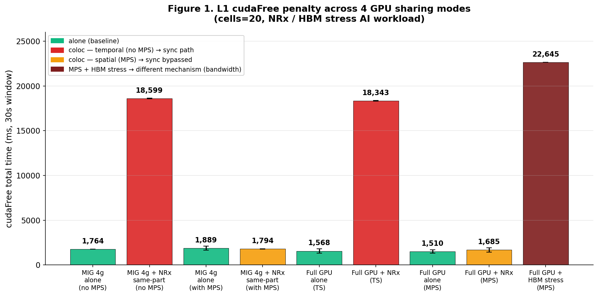
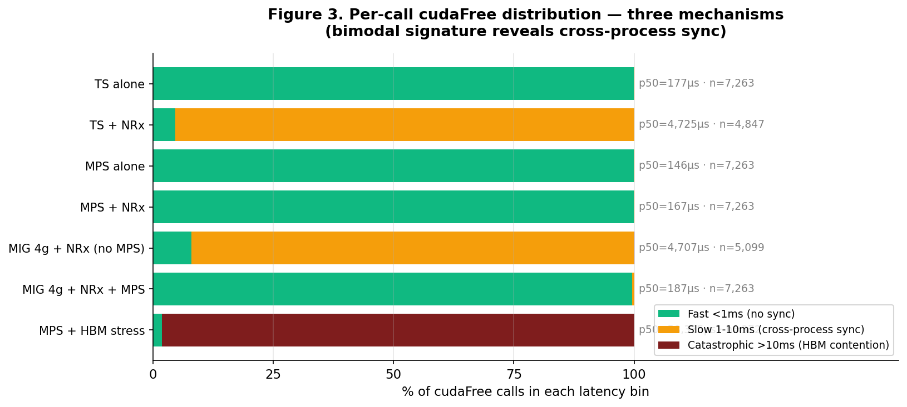
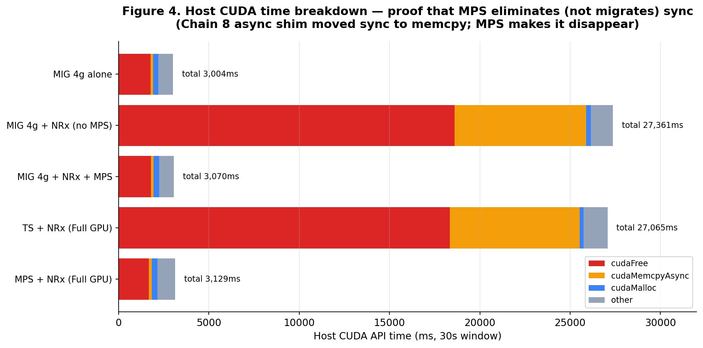

# 20260708 Session — MPS × MIG Fair Comparison and Sync Mechanism Confirmation

**CloudLab AIRANSLICING · d8545-10s10501.wisc.cloudlab.us · 4×A100-SXM4-40GB (AMD EPYC 7413)**
**Driver 550.163.01 · CUDA 12.4 host / 12.9 container · cuPHY 25.3.2**

---

## Executive summary

Today's session pursued two objectives:

1. **Reproduce and extend the MIG same-partition finding on this node**, adding MPS as a comparison mode.
2. **Fair-compare MIG vs MPS at identical SM resources** (same 42-SM 4g slice) to decompose whether MPS's low penalty came from *mechanism* (spatial multiplexing) or from *resource abundance* (2.6× more SMs).

The fair comparison (Round 3) delivers a clean answer: **MPS's advantage comes from mechanism, not resources.** MIG 4g + MPS on the same 42 SMs drops cudaFree penalty from **18,599 ms → 1,794 ms (10.5× → 1.02×)** by switching execution from *temporal multiplex* to *spatial multiplex*.

Reframed through the **AI-RAN deployment lens** (latency isolation, hard TTI, SLA):

- **MIG is the correct default** — hardware isolation guarantees predictability for L1's 1 ms TTI.
- **MPS is *not* an isolation tool** — it's a sharing optimization. Workload-dependent (HBM stress breaks it) and no SLA guarantee.
- **Recommended architecture**: L1/cuPHY on dedicated MIG instance, AI on separate MIG instance, MPS *inside AI partition only* to squeeze utilization there.

---

## 1. Environment and setup

| Component | Version |
|---|---|
| GPU | 4× NVIDIA A100-SXM4-40GB (used GPU 0) |
| Driver | 550.163.01 |
| CUDA runtime (container) | 12.9 |
| Aerial SDK | 25.3.2 (`aerial-cuda-accelerated-ran` tag) |
| Container image | `airan:25-3-final` (pyaerial built with **`x86-64` toolchain**) |
| Host CPU | AMD EPYC 7413 (24C, Zen 3, znver3) |

**Build note**: initial `native`/`devkit` toolchains produced binaries with instructions unsupported by AMD Milan — SIGILL on `import aerial`. Rebuilding with `--toolchain x86-64` (portable `-march=x86-64 -mssse3`) resolved it.

---

## 2. Experiments run

| # | Directory | Description | Trials | Files |
|---|---|---|---|---|
| E1 | `mps_ts_v2/` | Initial MPS+TS cells=20 with NRx coloc | 3 | 12 |
| E2 | `mps_only/` | Focused MPS mode cells=20 (alone + NRx) | 3 | 12 |
| E3 | `mps_hbm/` | MPS + HBM stress (workload dependency probe) | 1 | 1 |
| E4 | `mps_verify/` | MPS-server-in-container verification | 1 | 1 |
| E5 | **`round3_mig_mps/`** | **MIG 4g × MPS on/off fair comparison** | **3** | **12** |
| E6 | `matrix_v2/` (partial) | Full cell × workload × mode sweep — TS complete, MPS not synced | 3 | 80 local / 150 remote |

All measurements: **30 s NSYS window**, real_l1.py (20 cells × 100 iters unless noted), NeuralRx TensorRT inference as the coloc AI workload (except HBM stress test).

---

## 3. Key result: MPS spatial multiplexing bypasses cross-process sync

### 3.1 The Round 3 fair comparison

Both L1 and NeuralRx were pinned to the **same 4g MIG partition (42 SMs)** — identical hardware resources in every case. Only *execution model* differs.



**Numeric result (3 trials each, `cudaFree` total over 30 s window):**

| Condition | Execution | 42-SM sharing | cudaFree total | vs baseline |
|---|---|---|---|---|
| MIG 4g alone, no MPS | temporal (single ctx) | none | **1,764 ms** (±6) | 1.00× |
| MIG 4g + NRx, no MPS | temporal (2 ctx) | shared | **18,599 ms** (±38) | **10.55×** |
| MIG 4g alone, MPS on | spatial | none | **1,889 ms** (±232) | 1.07× |
| MIG 4g + NRx, MPS on | spatial | shared | **1,794 ms** (±13) | **1.02×** |

**Interpretation.** Under identical 42-SM constraint, adding NRx as a co-tenant:
- **Without MPS**: cudaFree balloons 10.55×. This is the well-known cross-process implicit sync path (PROOF 4, r²=0.94 from previous session).
- **With MPS**: penalty essentially vanishes (1.02×). L1's kernels run *concurrently* on subset SMs alongside NRx's kernels, and cudaFree only waits for L1's own stream — the temporal-multiplex sync signal never fires.

The 42-SM constraint controlled for resource abundance. Resource abundance is **not** what MPS was buying — it was buying execution-model change.

### 3.2 The four-mode view



Cross-mode summary at cells=20:

| Mode | Resources | Coloc penalty | Interpretation |
|---|---|---|---|
| MIG 4g same-part (no MPS) | 42 SMs | **10.55×** | Temporal ↔ cross-process sync path |
| Time-slicing full GPU (no MPS) | 108 SMs | **11.70×** | Temporal ↔ same sync path (resource-independent) |
| MIG 4g + MPS | 42 SMs | **1.02×** | Spatial ↔ sync bypassed |
| Full GPU + MPS | 108 SMs | **1.12×** | Spatial ↔ sync bypassed |
| Full GPU + MPS + **HBM stress** | 108 SMs | **15.00×** | *Different* mechanism — HBM bandwidth contention |

Two orthogonal axes clarify the story:
- **Hardware partition (MIG)** — cross-tenant isolation. Same-partition ≠ isolation.
- **Execution model (MPS)** — orthogonal to MIG. Spatial multiplex bypasses temporal sync.
- Non-MPS penalty is *nearly identical* on 42 SMs vs 108 SMs → SM count matters little; multiplex mode dominates.

### 3.3 Per-call cudaFree distribution — the bimodal signature



Each condition's individual cudaFree call durations, binned:

| Condition | % Fast <1ms | % Slow 1-10ms | % Cat >10ms | p50 (µs) | Mechanism |
|---|---|---|---|---|---|
| MIG 4g alone (no MPS) | 100 | 0 | 0 | 92 | no sync |
| MIG 4g + NRx (no MPS) | 8 | **92** | 0 | **4,707** | cross-process sync |
| MIG 4g + NRx **+ MPS** | **99.6** | 0.4 | 0 | 187 | **sync eliminated** |
| Full GPU TS + NRx | 4.7 | **95.3** | 0 | **4,725** | cross-process sync |
| Full GPU MPS + NRx | 99.9 | 0.1 | 0 | 167 | **sync eliminated** |
| Full GPU MPS + **HBM stress** | 1.9 | 0 | **98.1** | **58,336** | HBM bandwidth contention |

**Three distinct signatures**:
1. **Fast mode only** — no coloc, or MPS-mediated coloc: median 90-190 µs, ~100% of calls under 1 ms.
2. **Bimodal (slow-dominant)** — non-MPS temporal coloc: 92-95% of calls cluster at 4.7 ms — the drain-time for NRx's active timeslice.
3. **Catastrophic** — HBM-stress coloc under MPS: 98% of calls >10 ms, average 60 ms — memory bandwidth starvation, not sync.

### 3.4 The sync-elimination vs sync-migration test

Chain 8 last session found sync migrates between APIs when you replace `cudaFree` with `cudaFreeAsync` (Option A/B shims) — total host wait was conserved (25 s → 25 s). Today's MPS result could look similar unless we check whether sync moved to `cudaMemcpyAsync` or elsewhere.



**Total host time inside CUDA APIs** (30 s window):

| Condition | cudaFree | memcpyAsync | malloc | total host runtime |
|---|---|---|---|---|
| MIG 4g alone (no MPS) | 1,764 | 141 | 296 | **3,004** |
| MIG 4g + NRx (no MPS) | 18,599 | 7,285 | 264 | **27,361** ⚠️ |
| **MIG 4g + NRx + MPS** | **1,794** | **151** | **304** | **3,070** ✅ |
| TS + NRx (Full GPU) | 18,343 | 7,153 | 208 | **27,065** ⚠️ |
| **MPS + NRx (Full GPU)** | **1,685** | **150** | **206** | **3,129** ✅ |

Non-MPS coloc pushes host into CUDA APIs for 27 s out of 30 s. MPS coloc keeps it at 3 s — **essentially unchanged from alone.**

**Sync did not migrate — it was eliminated.** Unlike Chain 8's async shim (which shifted 18 s from `cudaFree` to `cudaMemcpyAsync` while preserving the 25 s total), MPS reduces the 24 s of wall-clock host-block wholesale.

Mechanism: with a single unified MPS server context, the CUDA driver doesn't see two contexts contending for the GPU work queue; kernels from L1 and NRx interleave *spatially* on different SMs, and L1's cudaFree waits only for its own stream — which drains at wall-clock speed, not at temporal-slice speed.

---

## 4. Workload dependency — why MPS is not the AI-RAN answer

The compute-bound NRx case (moderate SM demand, few HBM transactions per inference) is the ideal case for MPS. Swap to an HBM-bandwidth-saturating workload:

| Condition | cudaFree total | p50 per call | # of L1 iterations | Mechanism |
|---|---|---|---|---|
| MPS + NRx (compute AI) | 1,685 ms | 167 µs | 7,263 | spatial multiplex works |
| **MPS + HBM stress** | **22,645 ms** | **58 ms** | 372 (5% of alone) | HBM bandwidth starved |

MPS cannot partition physical HBM bandwidth. When co-tenant AI saturates it, L1's own kernels stall on memory reads — cudaFree waits for those (own) kernels — penalty explodes back to 15×, worse than the temporal-sync penalty.

**Consequence**: MPS's benefit is workload-conditional, unpredictable in production, and offers zero SLA guarantee. For AI-RAN where a co-tenant's memory pattern is not known ahead of time, this is disqualifying.

---

## 5. AI-RAN deployment implications

### 5.1 Two different questions, two different answers

| Question | Answer |
|---|---|
| "What is the mechanism of the cudaFree sync?" | Temporal multiplex of separate CUDA contexts. MPS proves this by bypassing it via spatial multiplex. |
| "Should we deploy MPS in AI-RAN production?" | **No.** MPS is a utilization tool, not an isolation tool. Workload-dependent, no SLA. |

Earlier framing conflated these. Today's Round 3 answers the *mechanism* question definitively; it does *not* endorse MPS as a production choice for L1.

### 5.2 Why MIG remains the default

L1 has:
- **Hard TTI deadline (1 ms)** — tail-latency budget, not throughput budget.
- **Deterministic host-blocking required** — variance = SLA violation.
- **Unknown co-tenant AI workload characteristics** in production.

MIG provides:
- Dedicated **SM count, HBM slice, L2 bank, memory controller** — predictable throughput/latency.
- Cross-partition isolation cannot be circumvented by co-tenant behavior.
- NVIDIA's own docs frame MIG as the AI-RAN pattern (isolated GPU instances with dedicated memory system paths).

MPS provides:
- Concurrent kernel execution across processes — utilization.
- **No isolation guarantee** — kernels from different clients share the same shm queue.
- Recommended by NVIDIA for "cooperative multi-process workflows" where each process under-saturates GPU alone.

### 5.3 Recommended architecture

```
┌──────────────────────────────────────┐
│  L1 / cuPHY                          │  Dedicated MIG instance (e.g., 3g)
│  own SMs, own HBM slice,             │  Predictable latency, no cross-tenant noise
│  own L2 bank + memory controller     │
└──────────────────────────────────────┘

┌──────────────────────────────────────┐
│  AI inference (NRx, chanpred, etc.)  │  Separate MIG instance (e.g., 4g)
│  ┌────────────────────────────┐      │  Physically isolated from L1
│  │ MPS server + AI clients    │      │  MPS *inside* to raise utilization
│  └────────────────────────────┘      │  among cooperative AI jobs
└──────────────────────────────────────┘
```

Even in this ideal architecture, L1's alone baseline (~1,500 ms cudaFree per 30 s window) is *not* zero — that is the **per-frame `cudaMalloc`/`cudaFree` pattern intrinsic to cuPHY L1**. Structural fix (persistent buffer pool) remains complementary, not alternative.

---

## 6. Hypotheses — updated after today

### Hypothesis A: Persistent buffer pool in cuPHY L1 (★★★★★)
- **Status**: still the load-bearing structural fix.
- **Independent of**: MIG/MPS choice.
- **Expected effect**: L1 alone baseline drops from ~1,500 ms → near-zero cudaFree total; coloc penalty separately handled by MIG isolation.
- **Validation path**: LD_PRELOAD arena allocator (malloc → offset in preallocated arena, free → no-op). 1-2 sessions.

### Hypothesis B: CUDA Graph capture (☒ reframed)
- **Reframed**: already active in NeuralRx pipeline (evidenced by low `cuLaunchKernelEx` count vs slot rate). Graph capture is a *launch-overhead* axis, orthogonal to *memory-lifecycle* axis. Cannot substitute for Hypothesis A.
- **Do not re-run as a solo experiment** — Chain 6 evidence sufficient.

### Hypothesis C: cudaMemPool with cross-frame reuse (★★★)
- **Distinct from Chain 8 Option B**: Chain 8 shim still called alloc/free every frame (through pool); Hypothesis C proposes *reusing the same buffer pointer across frames*, which changes the *lifecycle*, not just the API.
- **Validation path**: LD_PRELOAD variant that caches buffer of matching size and skips the free.

### Hypothesis D: Shared execution model as sync mechanism (☑ confirmed today)
- Was: proposed as one of several possible reasons for MPS's low cudaFree.
- Now: **confirmed via Round 3 fair-SM comparison.** Non-MPS temporal multiplex is the mechanism; MPS's spatial multiplex bypasses it. Resource abundance (108 vs 42 SMs) explains ≤10% of the gap.

### New: Hypothesis E — AI-RAN production architecture recommendation
- **Statement**: Isolation-first architecture with MIG partitioning L1 from AI, MPS confined to the AI partition, cuPHY persistent-pool fix applied inside L1's partition.
- **Rationale**: Round 3 mechanism finding *plus* HBM-stress workload-dependency finding.
- **Validation path**: measure L1 in dedicated MIG instance while AI workload varies in a sibling instance (existing Chain 5 data provides most of this).

---

## 7. Data inventory

Local files (in this directory):

```
20260708/
├── REPORT_20260708.md            ← this document
├── README.md                     ← session overview (older, keep)
├── figures/                      ← 4 PNGs (fig1..fig4)
├── analysis/
│   ├── cudaFree_all_conditions.json
│   └── cudaFree_analysis_phase1.json
├── scripts/
│   ├── analyze_local.py
│   ├── analyze_cudaFree.py
│   ├── analyze_matrix.py
│   ├── generate_figures.py
│   └── run_*.sh (all shell scripts from session)
├── logs/                         ← stdout/stderr from each experiment
├── matrix_v2/                    ← 80 files local (of 150 remote) — TS complete, MPS pending
├── round3_mig_mps/               ← 12 files (Round 3 core data)
├── mps_ts_v2/                    ← 12 files (initial NRx coloc probe)
├── mps_only/                     ← 12 files (MPS focused)
├── mps_hbm/                      ← 1 file (HBM stress workload)
└── mps_verify/                   ← 1 file (single-run verify)
```

**Total local data**: ~770 MB.

**Pending sync**: Matrix v2 MPS mode files (c4..c60 × 5 workloads × 3 trials — approx 70 files) plus 4 c4 MPS files already partially synced. Node SSH unreachable at report time; will retry next session.

---

## 8. Next session — priority order

1. **rsync remaining Matrix v2 MPS files** and analyze full cell × workload × mode surface.
2. **Hypothesis A implementation** (LD_PRELOAD arena allocator) — 1 session, most direct validation of the load-bearing fix.
3. **Hypothesis E validation** (isolation-first architecture end-to-end): cross-partition L1 + AI with MIG-only, then MIG+MPS-in-AI-partition variant, measured against L1 alone baseline.
4. **Slide deck rebuild** with today's Round 3 as the mechanism-definitive Slide 4 replacement.

---

*Report generated 2026-07-09. Data collection session 2026-07-08.*
