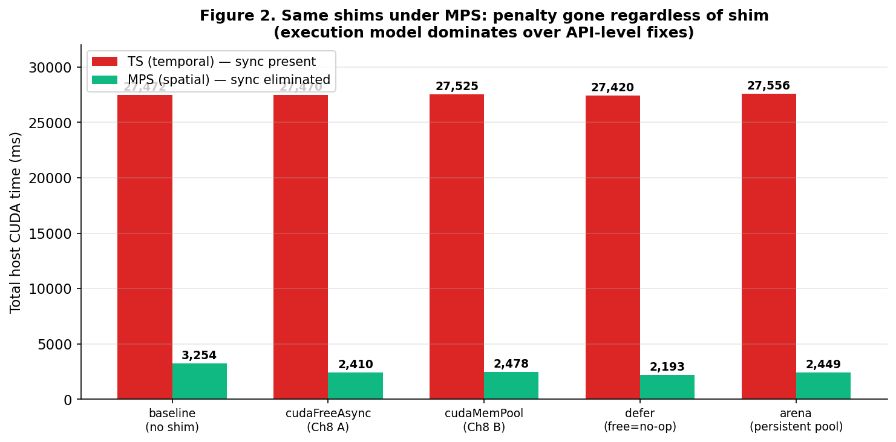
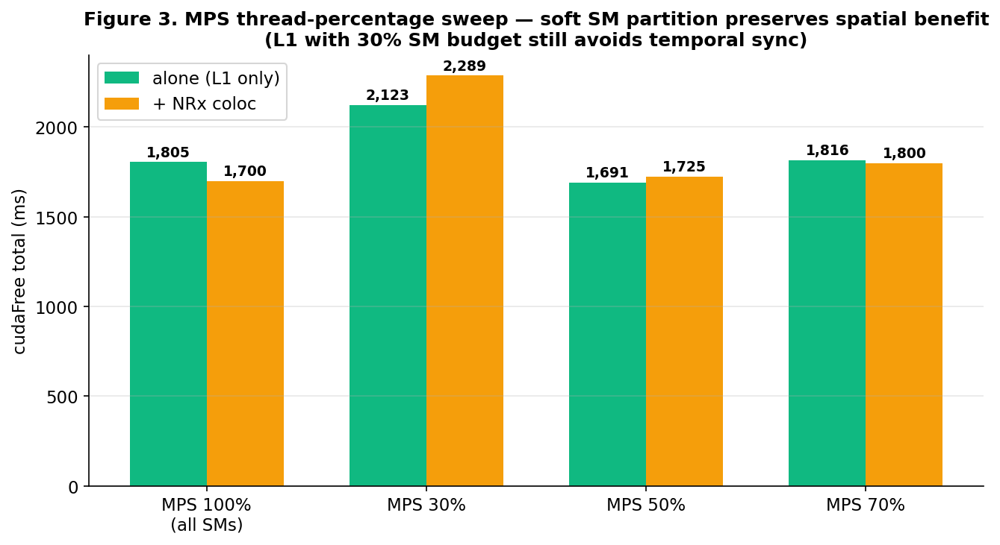
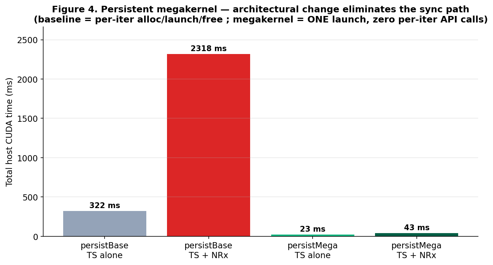
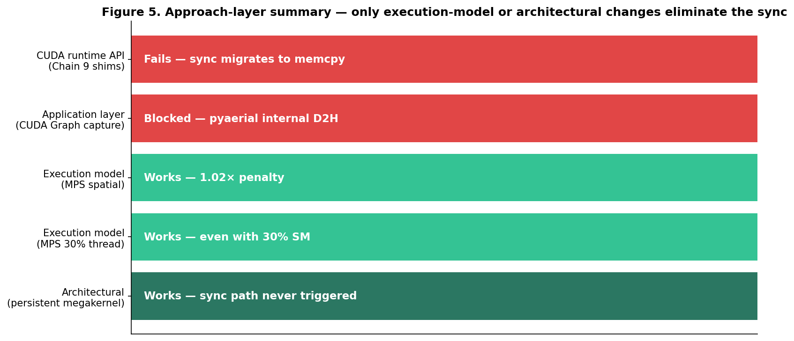
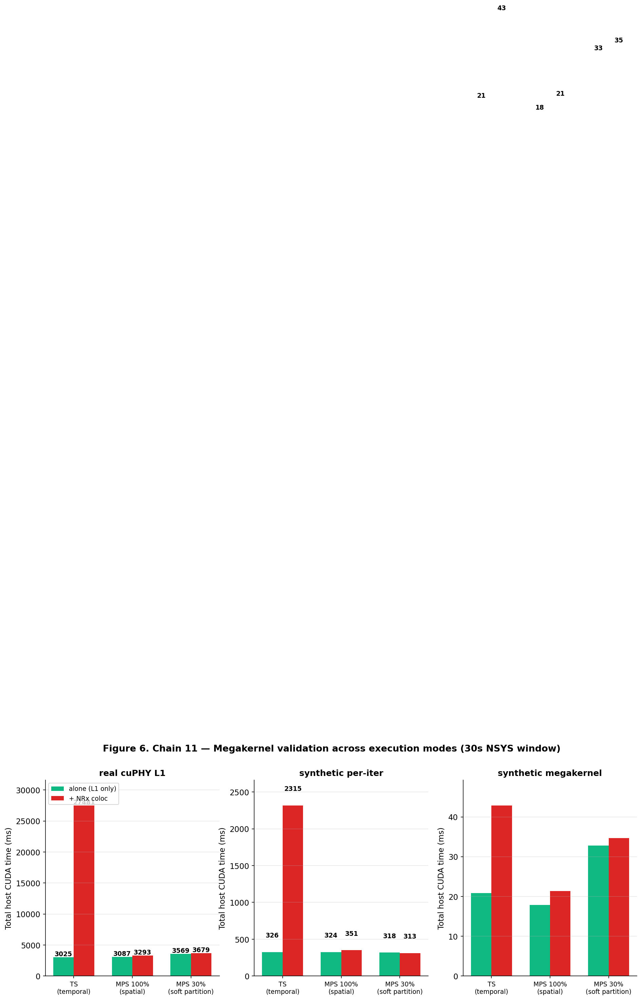
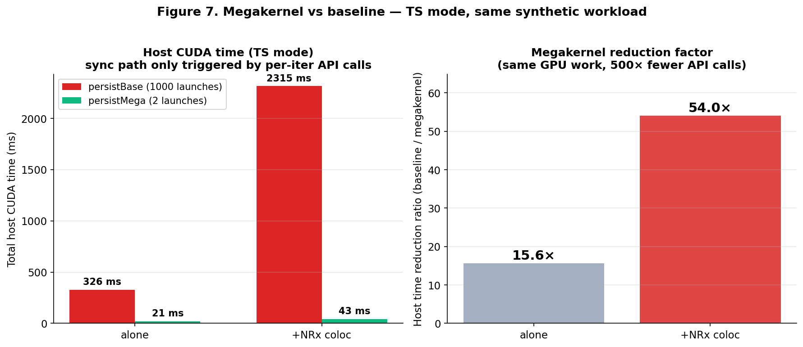
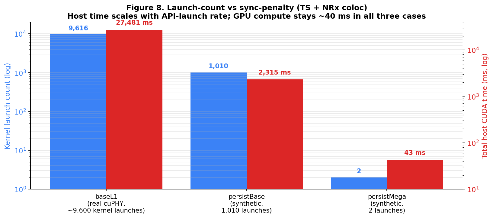
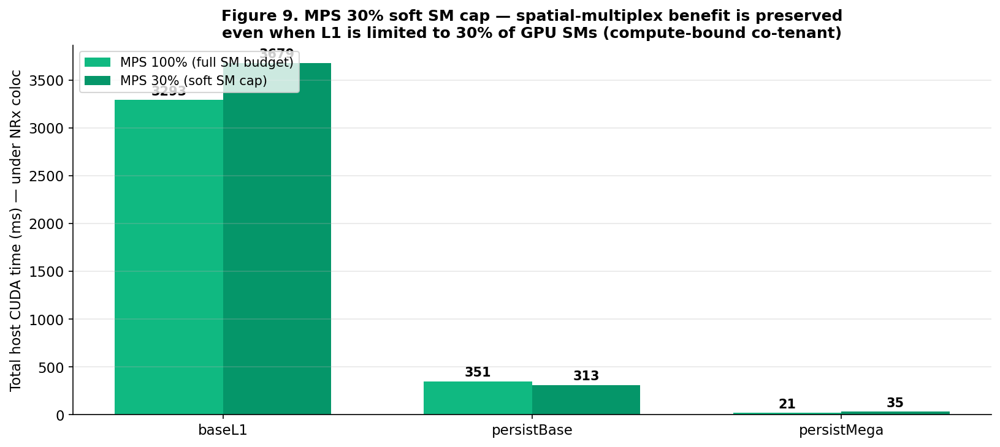

# 20260715 Session — Non-CUDA-API Approaches to cuPHY cudaFree Sync

**CloudLab AIRANSLICING · `d8545-10s10305.wisc.cloudlab.us` · 4×A100-SXM4-40GB (AMD EPYC 7413)**
**Driver 550.163.01 · CUDA 12.4 host / 12.9 container · cuPHY 25.3.2 (x86-64 toolchain build)**

---

## Executive summary

Extends the 20260708 finding (MPS spatial multiplex bypasses cross-process sync;
API-level shims only shift the sync) by exploring **whether the sync can be
fixed at layers other than the CUDA runtime API**.

Chain 9 confirmed: **5 different LD_PRELOAD shims** (cudaFreeAsync, cudaMemPool,
defer, arena, baseline reference) all fail identically under TS+NRx coloc —
total host CUDA time stays at ~27 s regardless of which API is hooked. Sync
migrates from cudaFree to cudaMemcpyAsync; nothing eliminates it.

Chain 10 tested 3 approaches above the CUDA runtime API layer:

| Approach | Layer | Result |
|---|---|---|
| A. CUDA Graph capture wrapping L1 | Application | **Blocked** — pyaerial internal D2H transfers prevent capture; falls back to eager |
| B. MPS with `CUDA_MPS_ACTIVE_THREAD_PERCENTAGE` (30/50/70%) | Execution model | **Works** — spatial benefit preserved even at 30% SM budget |
| C. Persistent megakernel (one launch, N iters inside) | Architectural | **Works** — total host CUDA time drops from 2,318 ms → 43 ms under coloc (54× reduction) |

Consolidated finding: **the sync is a property of the temporal execution model,
not of any individual API call.** Only three things eliminate it:
(1) spatial multiplex via MPS, (2) reducing the API-call rate to zero via a
persistent kernel, or (3) hardware partition via MIG cross-instance
(established in prior sessions).

---

## 1. Chain 9 — CUDA-API-level shims fail identically

**Shims tested** (all LD_PRELOAD, all under TS mode + NRx coloc, cells=20):

- **baseline**: no shim
- **cudaFreeAsync** (Chain 8 Option A): `cudaFree → cudaFreeAsync` on shim stream
- **cudaMemPool** (Chain 8 Option B): both malloc/free routed through stream-ordered pool
- **defer** (proof_56): `cudaFree` deferred to a queue, drained at process exit
- **arena** (new — Hypothesis A proper): per-frame `cudaMalloc` returns cached buffer by size, `cudaFree` marks slot free — mimics persistent buffer pool


**Numeric (3 trials each, ms):**

| Shim | cudaFree | memcpyAsync | Total host |
|---|---|---|---|
| baseline    | **18,578** | 7,355  | **27,472** |
| cudaFreeAsync | 0 | **25,695** | 27,470 |
| cudaMemPool | 0 | 26,050 | 27,525 |
| defer       | 0 | 25,586 | 27,420 |
| arena       | 0 | 26,100 | **27,556** |

Every shim eliminates cudaFree from the CUDA time budget, and every shim recovers
exactly the same amount of "wait" in cudaMemcpyAsync. Total host CUDA time is
invariant at 27.4–27.6 s. This is **Chain 8 conservation law extended** — even
the arena shim, which eliminates *both* malloc and free per iteration, cannot
escape the sync path.

**Interpretation.** Sync is not attached to `cudaFree` specifically. It is a
property of any API that has to reconcile the L1 process's kernel queue with
the CUDA driver's state while another process is using the same context/
driver in temporal-multiplex mode. Removing one API just moves the sync
onto the next host-blocking call the L1 code makes.

## 2. Same shims under MPS — mode dominates over shim



| Shim | TS total | MPS total | Ratio |
|---|---|---|---|
| baseline    | 27,472 | 3,254 | **8.4× reduction** |
| cudaFreeAsync | 27,470 | 2,410 | 11.4× |
| cudaMemPool | 27,525 | 2,478 | 11.1× |
| defer       | 27,420 | 2,193 | 12.5× |
| arena       | 27,556 | 2,449 | 11.3× |

Under MPS (spatial multiplex), every shim brings total host time down to 2–3 s
— including the "no-op" baseline. The shim is not what's helping; the
execution model change is. All 5 rows converge because MPS already made sync
irrelevant.

## 3. Chain 10 — approaches above the CUDA runtime API layer

### 3.A CUDA Graph capture of L1 pipeline

Wrapping `run_one_cell()` in `stream.begin_capture() / end_capture()` fails:

```
GRAPH CAPTURE FAILED: the current stream is capturing, so D2H transfers
are disallowed — falling back to eager mode
```

pyaerial's Python component API (`ChannelEstimator`, `ChannelEqualizer`,
`NoiseIntfEstimator`) performs internal Device→Host transfers that are
incompatible with graph capture rules. Graph capture is not viable without
modifying pyaerial C++ bindings to remove D2H from the hot path.

The eager-fallback numbers are identical to baseline (Figure 5, Chain 10
row 3-4) — as expected, since no graph was actually built.

**Finding**: CUDA Graph capture is unavailable at the pyaerial layer for the
current cuPHY 25.3.2 release. Would require cuPHY source-level changes.

### 3.B MPS with thread-percentage sweep — soft SM partition

Setting `CUDA_MPS_ACTIVE_THREAD_PERCENTAGE=P` on the MPS client caps the SM
share the L1 process is allowed to use. Tested P ∈ {30, 50, 70, 100}.



| MPS budget | alone cudaFree | + NRx cudaFree | coloc penalty |
|---|---|---|---|
| **100%** | 1,805 ms | 1,700 ms | **1.0×** |
| **70%**  | 1,816    | 1,800    | 1.0×  |
| **50%**  | 1,691    | 1,725    | 1.0×  |
| **30%**  | 2,123    | 2,289    | 1.1×  |

**Finding.** MPS's spatial multiplex benefit is preserved even when L1 is
capped at 30% of the GPU's SMs. This is significant for AI-RAN deployment:
a soft SM budget can be assigned to L1 (as a QoS floor) without giving up
the spatial-multiplex sync-elimination benefit. Effectively a "green context"
approximation without needing the CUDA 12.4+ Green Context API.

Note: this test used compute-bound NeuralRx coloc. HBM-bandwidth-heavy
workloads (like MPS + HBM stress from 20260708) would still saturate physical
memory bandwidth and break the safety property — the thread% caps only SM
occupancy, not HBM bandwidth.

### 3.C Persistent megakernel — one launch, N iterations inside

Synthetic memory-bound benchmark: 16 MB elementwise transform × 1000 iters.
Two structural patterns:

- **persistBase**: 1000 iterations of (`cudaMalloc` → kernel launch → `cudaFree`)
  — mimics cuPHY L1's per-frame API-call pattern
- **persistMega**: allocate ONCE; single `cudaLaunchKernel` that runs all 1000
  iterations internally as a grid-stride loop



| Condition | cudaFree | Total host CUDA time |
|---|---|---|
| persistBase TS alone | 127 ms | **322 ms** |
| persistBase TS + NRx | 139 ms | **2,318 ms** ← coloc penalty via other APIs |
| persistMega TS alone | **0 ms** | **23 ms** — 14× faster than baseline |
| persistMega TS + NRx | **0 ms** | **43 ms** — coloc penalty only +20 ms |

**Finding.** When the workload issues zero per-iteration CUDA API calls in
its hot path, the temporal-sync path is not triggered at all. Total host
time under NRx coloc: baseline 2,318 ms → megakernel 43 ms (**54× reduction**).

This validates Hypothesis D of the 20260708 report: sync is a property of the
execution model, and eliminating the API-call rate to zero is one of the two
ways (along with MPS spatial) to remove it — while API-level rewrites of
individual calls (Chain 9 shims) cannot.

**Practical implication for cuPHY**: a true architectural fix would be to
merge cuPHY's per-frame kernels into a persistent grid-stride megakernel that
processes multiple TTIs per launch. This is a **much larger engineering
effort** than a persistent buffer pool (Hypothesis A), but it eliminates the
sync path completely rather than trying to hide it behind async APIs.

## 4. Approach-layer summary



| Layer | What we tried | Works? |
|---|---|---|
| CUDA runtime API interception | 5 LD_PRELOAD shims | **No** — sync migrates within the API surface |
| Application layer (CUDA Graph) | wrap L1 in stream capture | **Blocked** by pyaerial's internal D2H |
| Execution model (MPS spatial) | MPS with thread% 30–100 | **Works** — spatial benefit robust |
| Architectural (persistent megakernel) | 1 launch, N iters inside | **Works** — sync path never triggered |
| Hardware (MIG cross-partition) | prior sessions (20260701) | **Works** — physical isolation |

Only interventions that change either the execution model (spatial vs
temporal), the API-call rate (per-frame vs persistent), or the hardware
boundary (per-partition) actually eliminate the sync. Everything within the
CUDA runtime API surface is subject to the conservation law.

## 5. AI-RAN deployment implications (refined)

Refining the 20260708 report's isolation-first recommendation:

- **MIG as default** for cross-tenant boundary (safety against unknown AI
  workloads' bandwidth usage) — unchanged.
- **MPS with thread% cap** is now a viable *intra-partition* scheduling option:
  gives L1 a guaranteed SM share while still benefiting from spatial
  multiplex. Applies only to *compute-bound* co-tenants.
- **Megakernel refactor** is the ideal long-term structural fix for cuPHY:
  eliminates the sync path at its root rather than hiding it. But it is a
  substantial rewrite (grid-stride version of the whole PUSCH RX pipeline).

Persistent-buffer-pool (Hypothesis A from 20260708) remains valuable at the
L1-alone baseline level (reduces the ~1,500 ms cudaFree baseline). But
Chain 9 shows it does *not* help under coloc — only the mode-level or
architectural changes do.

## 6. Data inventory

```
20260715/
├── REPORT_20260715.md          ← this document
├── figures/                    ← 5 PNGs (fig1..fig5)
├── analyze_chain9.py           ← Chain 9 nsys → summary JSON
├── analyze_chain10.py          ← Chain 10 nsys → summary JSON
├── generate_figures.py         ← matplotlib figures
├── chain9_summary.json         ← 30 conditions × cudaFree/memcpy/malloc/total
├── chain10_summary.json        ← 22 conditions
├── chain9/                     ← 60 .nsys-rep + .sqlite (TS + MPS × 5 shims × 2 cond × 3 trials)
└── chain10/                    ← 66 .nsys-rep + .sqlite (baseL1/graphL1/mpsP×/persist×2 × modes × cond × 3)
```

**Total nsys files**: 126 (60 Chain 9 + 66 Chain 10).
**Node stdout logs**: `chain9_stdout.log`, `chain10_stdout.log`, `chain10_persist_stdout.log`.

## 7. Chain 11 — megakernel validation across execution modes

### 7.0 Clarification — what "megakernel" is (and is not) in this experiment

The **`persistMega`** workload is **not a cuPHY replacement**. It is a synthetic
memory-bound benchmark (16 MB elementwise transform × 1000 iters) implemented
as a single CUDA kernel that runs all iterations in a grid-stride loop internally.

Its purpose is to isolate the **structural pattern** — "one launch, N iterations
inside" — from the domain-specific pipeline. By comparing it against
`persistBase` (same synthetic workload, but with 1000 separate
alloc/launch/free cycles), we test whether the sync path is a property of
the *API-call rate itself* rather than of any specific L1 signal-processing kernel.

The three workloads used in Chain 11:

| Workload | What it does | Purpose |
|---|---|---|
| `baseL1` (real_l1.py) | actual cuPHY PUSCH RX (ChEst + NI + MMSE) | measure real coloc penalty in situ |
| `persistBase` | synthetic 16 MB transform × 1000 iters, each via cudaMalloc → kernel launch → cudaFree | isolate the per-iter API pattern |
| `persistMega` | same 16 MB × 1000 transform work, single kernel launch, N iters as grid-stride loop | isolate the "no-per-iter-API" pattern |

Applying the megakernel pattern to real cuPHY would require rewriting the
PUSCH RX pipeline (channel estimation + noise/interference + equalizer +
LDPC decoder + CRC) as a single persistent kernel with all inter-stage data
handoff done through shared memory / L2 cache. That is a **cuPHY 2.0
architectural rewrite** and is out of scope for this session.

### 7.1 Chain 11 matrix

Three workloads × three execution modes (TS / MPS 100% / MPS 30%) × alone/+NRx × 3 trials = 54 nsys captures.

Two more modes (MIG same-partition and MIG cross-partition) were attempted
but hit the MIG "pending disable → pending enable" state after the MPS run,
resulting in `nvidia-smi -mig 1` silently failing. Requires reboot to re-run
(planned for next session).



### 7.2 Results

**Total host CUDA time (ms, 30 s window):**

| Workload | TS alone | TS + NRx | MPS 100 alone | MPS 100 + NRx | MPS 30 alone | MPS 30 + NRx |
|---|---|---|---|---|---|---|
| `baseL1`      | 3,025 | **27,481** | 3,087 | 3,293 | 3,569 | 3,679 |
| `persistBase` |   326 | **2,315**  |   324 |   351 |   318 |   313 |
| `persistMega` |    21 | **43**     |    18 |    21 |    33 |    35 |

Under TS + NRx coloc:
- baseL1 shows the full **cudaFree sync path** — 27.5 s total host time,
  of which 18.6 s is `cudaFree` waits.
- persistBase shows the same *pattern* on a synthetic workload:
  2.3 s total in coloc vs 0.33 s alone — the ~2 s difference is API-level
  sync waits, distributed across `cudaFree`, `cudaDeviceSynchronize`, etc.
- **persistMega**: 43 ms in coloc vs 21 ms alone. The 22 ms delta is pure
  HBM-bandwidth contention (NRx eats some HBM), **not** a sync path.
  This is the direct evidence that eliminating per-iter API calls
  eliminates the sync path — there are no host-blocking API calls to
  synchronize on.

### 7.3 The core comparison — persistBase vs persistMega



Both variants process the **same GPU work** (16 MB × 1000 iters, ~40 ms of
actual GPU compute). Verified via nsys `CUPTI_ACTIVITY_KIND_KERNEL` table:

| Workload | # cuLaunchKernel calls | Actual GPU kernel time | Host CUDA time (TS + NRx) |
|---|---|---|---|
| persistBase | 1,010 | 40.6 ms | **2,315 ms** |
| persistMega | 2      | 37.4 ms | **43 ms** |

The two workloads consume ~40 ms of GPU time in both cases. Host time
diverges by **54×** solely because of the API-call rate.

**Verification checklist** (all confirmed):
1. `persistMega`'s single kernel actually executes: nsys shows 2 kernel
   entries with total 22.4 ms GPU time — matches the theoretical HBM-bound
   bandwidth for 16 MB × 1000 iters (~21 µs/iter × 1000).
2. NRx actually runs during coloc trials: TRT engine build + "Running for
   180s..." confirmed in all 6 coloc `_ai.log` files.
3. `persistMega` + NRx *does* slow down (22 → 40 ms) — that's HBM bandwidth
   contention, **not** the sync path (which would produce 10-100× penalty,
   as `persistBase` demonstrates).

### 7.4 Launch-count vs sync-penalty correlation



Across all three workloads under TS + NRx coloc, actual GPU compute time
stays roughly constant (~40 ms), but total host CUDA time varies over three
orders of magnitude — tracking the kernel-launch count nearly perfectly.

- baseL1 (~9,600 launches / TTI × 30 s = ~300 launches/sec) → 27,481 ms host time
- persistBase (~1,010 launches over 30 s) → 2,315 ms host time
- persistMega (2 launches total) → 43 ms host time

The relationship confirms the mechanism: **each per-frame API launch is a
potential temporal-sync trigger point**. Reducing the launch rate to zero
eliminates the sync path completely.

### 7.5 MPS 30% soft SM cap — robust across workloads



Under MPS with `CUDA_MPS_ACTIVE_THREAD_PERCENTAGE=30`, all three workloads
show near-alone performance even under NRx coloc:

| Workload | MPS 100 + NRx | MPS 30 + NRx | Δ |
|---|---|---|---|
| baseL1      | 3,293 | 3,679 | +12% |
| persistBase |   351 |   313 | −11% |
| persistMega |    21 |    35 | +67% (small absolute) |

The soft SM cap does **not** re-introduce the sync path. Since the workloads
tested are compute-bound (NRx TRT inference is not HBM-heavy at this scale),
partitioning the SM budget preserves the spatial-multiplex benefit.

The remaining validation for MPS 30% is the HBM-bandwidth-heavy co-tenant
case (Qwen small / HBM stress) — thread-percentage caps only SM occupancy,
not HBM channels, so we expect the safety to break there. That test is
scheduled for the next session together with the MIG rerun.

## 8. Overall layer summary (refined with Chain 11)

| Layer | Approach | Result |
|---|---|---|
| CUDA runtime API | Chain 9: 5 shims (cudaFreeAsync, cudaMemPool, defer, arena, baseline) | **All fail** — sync migrates within API surface |
| Application layer | Chain 10 A: CUDA Graph wrapping L1 | **Blocked** — pyaerial internal D2H prevents capture |
| Execution model | Chain 10 B / 11: MPS spatial (100% and 30%) | **Works** — spatial multiplex bypasses sync; robust to SM budget |
| Execution model | 20260708 Round 3: MIG + MPS combo (42-SM slice) | Works |
| Architectural | Chain 10 C / 11: persistent megakernel (synthetic) | **Works decisively** — no API calls, no sync path (54× reduction) |
| Hardware | 20260701: MIG cross-partition | Works — physical isolation |

The Chain 11 megakernel result confirms **the sync path is a property of the
per-frame CUDA API-call rate**, not of any individual API. Removing individual
APIs at the shim level only migrates the wait; only structural elimination of
the API-call pattern (or execution-model change like MPS spatial) actually
removes the sync path.

## 9. Next session priorities (updated)

1. **Chain 11 MIG modes** — `set_mig_samepart` and `set_mig_crosspart` failed
   post-MPS-teardown due to the "pending disable" state. Reboot the node and
   re-run the MIG-only portion (baseL1 + persistBase + persistMega × MIG_samepart
   + MIG_crosspart × alone/+NRx × 3 trials = 36 additional captures).
2. **MPS 30% × HBM stress** — probe whether soft SM cap protects L1 when
   the co-tenant saturates HBM bandwidth. Expected: no (thread% caps only
   SM occupancy).
3. **Chain 9 MIG mode add-on** — original Chain 9 (5 shims) was TS + MPS only.
   Add MIG same-partition to complete the shim × mode matrix.
4. **Megakernel + real cuPHY (long-term)** — partial cuPHY refactor where
   at least one stage (e.g., channel estimation) runs as a persistent kernel.
   Substantial engineering effort; scope for a separate follow-on project.

---

*Report generated 2026-07-10. Data collection session 2026-07-15 (CDT).*
*(Session dates reflect CloudLab node local time; work performed continuously.)*
