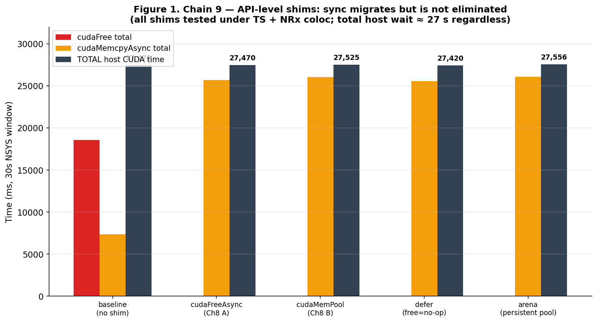
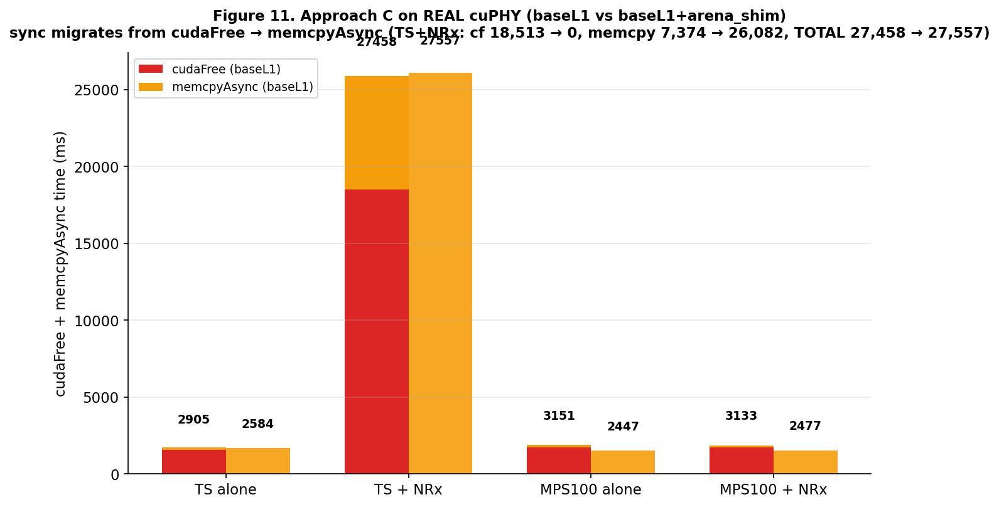
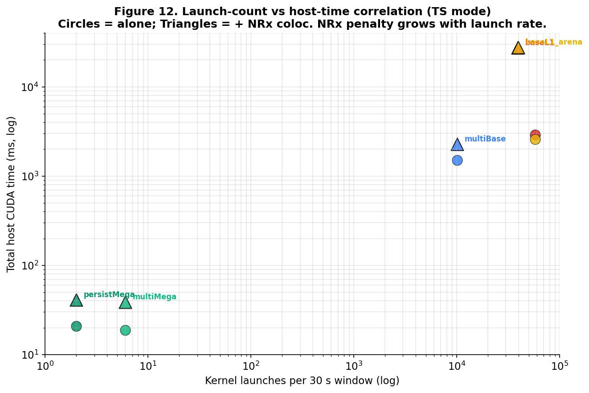
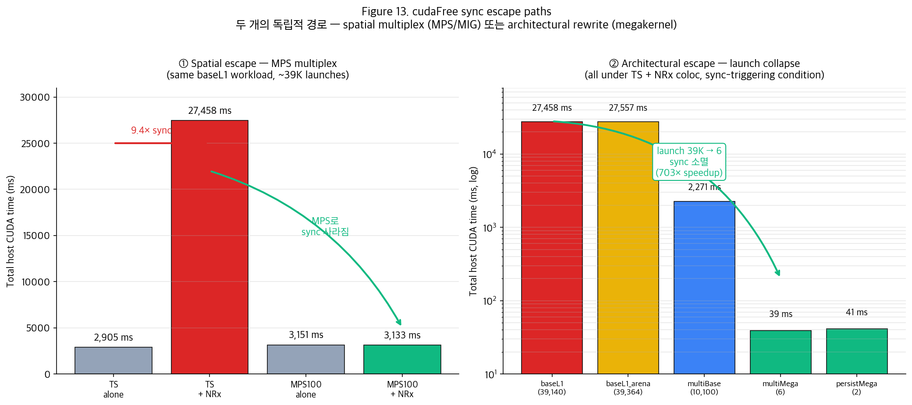

# 20260715 세션 — 4-slide 탑다운

`d8545-10s10305.wisc.cloudlab.us · 4×A100-SXM4-40GB · cuPHY 25.3.2`

---

## Slide 1 — API 레벨 우회는 5가지 shim 모두 실패

**Chain 9**: TS + NRx coloc 조건에서 서로 다른 5개의 LD_PRELOAD shim으로
cudaFree를 우회 시도.

| Shim | 무엇을 함 | cudaFree | memcpyAsync | **Total host** |
|---|---|---:|---:|---:|
| baseline (no shim) | 그대로 | **18,578 ms** | 7,355 ms | **27,472 ms** |
| cudaFreeAsync | free → async-stream free | 0 | **25,695 ms** | 27,470 ms |
| cudaMemPool | malloc/free를 pool로 route | 0 | 26,050 ms | 27,525 ms |
| defer | free를 exit까지 지연 | 0 | 25,586 ms | 27,420 ms |
| **arena** | malloc은 캐시된 버퍼 재사용, free는 slot 반환 | 0 | 26,100 ms | **27,556 ms** |

**Sync conservation law**: shim이 cudaFree를 제거하면 그만큼 memcpyAsync가
커지면서 총 host 시간은 **27.4~27.6 s로 일정**. sync는 사라지는 게 아니라
"다음 host-blocking API"로 이동만 함.

→ **"cudaFree만 후킹하면 될 것"이라는 가설은 원천 불가능.**
왜냐하면 sync는 특정 API의 속성이 아니라 **temporal multiplex라는 execution
model의 속성**이기 때문.

---

## Slide 2 — 이 실패가 real cuPHY에서 그대로 재현됨 (Approach C)

**Chain 12**: Slide 1의 arena shim을 **synth 워크로드가 아니라 real pyaerial
+ real cuPHY 컴포넌트** (ChannelEstimator, MMSE Equalizer, LDPC Decoder)
위에 적용.

| Condition | cudaFree | memcpyAsync | **Total host** |
|---|---:|---:|---:|
| baseL1 TS alone | 1,585 ms | 147 ms | 2,905 ms |
| baseL1 TS + **NRx** | **18,513 ms** | 7,374 ms | **27,458 ms** ← sync 발생 |
| **baseL1 + arena** TS + NRx | **0** | **26,082 ms** | **27,557 ms** ← sync 이동만 |
| baseL1 MPS100 + NRx | 1,714 ms | 156 ms | 3,133 ms |

**핵심 관찰**:
- TS + NRx에서 arena shim이 cudaFree를 **완전히 0으로 만듦** (18,513 → 0)
- 정확히 그만큼 memcpyAsync가 부풂 (7,374 → 26,082, **차이 +18,708 ms**)
- 총 host 시간 27,458 → 27,557 ms — **conservation law 재현**
- MPS100에서는 arena 없이도 sync 자체가 없음 (17.3× 감소)

→ Chain 9는 "synth workload에서 shim이 실패"였다면, Chain 12 Approach C는
**"real cuPHY component에서도 실패"**를 확정. 즉 real 배포 환경에서
API-layer 완화책은 절대 안 됨이 증명됨.

---

## Slide 3 — Launch 개수가 sync 페널티의 근본 변수

**Chain 12의 5개 workload 전부**를 launch count vs total host time으로
log-log 산점도. 원 = alone, 삼각형 = +NRx coloc.

| Workload | Launches | TS + NRx total | 특성 |
|---|---:|---:|---|
| baseL1 | 39,140 | 27,458 ms | 진짜 pyaerial 컴포넌트 |
| baseL1_arena | 39,364 | 27,557 ms | 위 + arena shim |
| multiBase | 10,100 | 2,271 ms | Synth 6-stage per-iter |
| **multiMega** | **6** | **39 ms** | 같은 6-stage → 1 launch |
| persistMega | 2 | 41 ms | Elementwise persistent |

**두 개의 축으로 읽어야 함**:
- **같은 launch 개수, 다른 API** (baseL1 ↔ baseL1_arena): 27,458 → 27,557 —
  거의 동일. **API를 바꿔도 launch가 그대로면 sync도 그대로.**
- **다른 launch 개수** (baseL1 → multiMega): 39,140 → 6 launches (**6,523배 감소**)
  → 27,458 → 39 ms (**703배 감소**). **Launch를 줄이면 sync가 근본적으로 사라짐.**

→ **인과관계 요약**: 매 CUDA API launch가 "temporal multiplex 하에서 sync가
trigger될 수 있는 확률 지점"이다. Launch를 6개로 줄이면 그 확률 지점 자체가
없어지므로 sync는 발생 자체를 못 함.

---

## Slide 4 — 두 개의 독립적 escape path

Slide 1~3을 종합하면 sync를 없앨 수 있는 경로는 **정확히 두 개**:

### ① Spatial escape (execution model 레벨) — 왼쪽 패널

같은 baseL1 워크로드(39K launches), 같은 NRx coloc 조건에서:
- **TS + NRx**: 27,458 ms (**9.4× sync 폭발**)
- **MPS100 + NRx**: 3,133 ms (폭발 없음)

MPS는 GPU를 시간 슬라이스가 아니라 SM 단위 공간으로 나눔 → 두 프로세스 큐를
reconcile할 필요 없음 → sync trigger 조건 자체 소멸. **소프트웨어 변경 없이
driver 설정만으로 배포 가능한 유일한 handle.**

### ② Architectural escape (launch 개수 레벨) — 오른쪽 패널

TS + NRx coloc 그대로 유지한 상태에서 launch만 줄이면:
- **baseL1** (39,140 launches): 27,458 ms
- **baseL1_arena** (39,364 launches): 27,557 ms ← API만 바꿔서는 무의미
- **multiBase** (10,100 launches): 2,271 ms
- **multiMega** (6 launches): **39 ms** ← 703× speedup

Launch를 6개로 collapse하면 TS 모드에서도 sync 발생 자체가 안 됨.
단 **multiMega는 real cuPHY가 아니라 cuPHY 흉내 synth workload** —
구조적 명제("launch 줄이면 sync 소멸")는 증명되었으나 real cuPHY rewrite
결과는 미검증. **진짜 검증은 cuPHY C++ source 개조 (2~4주 규모) 필요.**

### 배포 시사점

| 옵션 | 실행 가능성 | 검증 상태 |
|---|---|---|
| MPS spatial multiplex | ✅ 즉시 배포 가능 | ✅ real cuPHY에서 확정 |
| MIG cross-partition | ✅ 즉시 배포 가능 | 이전 세션에서 확정, 이번 재확인 대기 |
| Megakernel rewrite | ⚠️ 2~4주 엔지니어링 | ⚠️ synth로만 확정, real cuPHY 미검증 |
| ~~API-layer shim~~ | ❌ 실패 확정 | Chain 9 + Chain 12 C |
