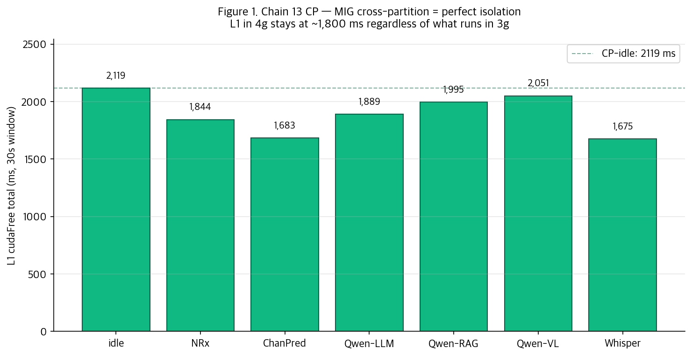
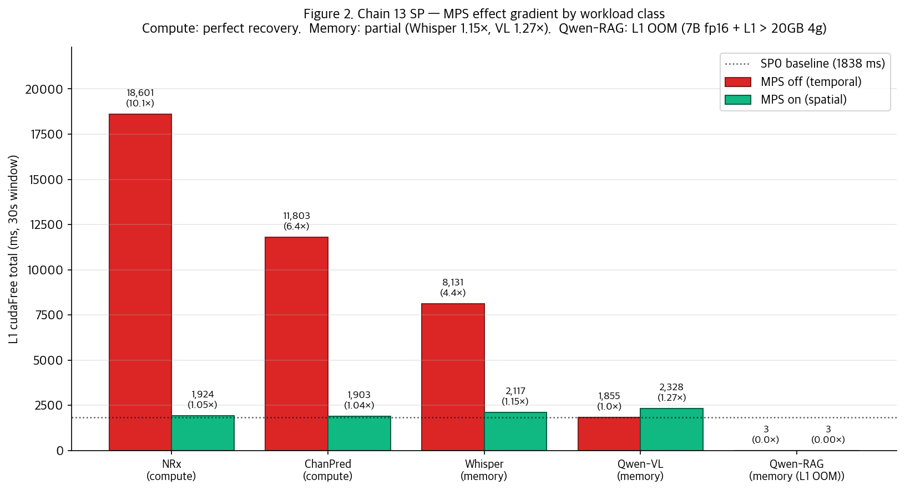
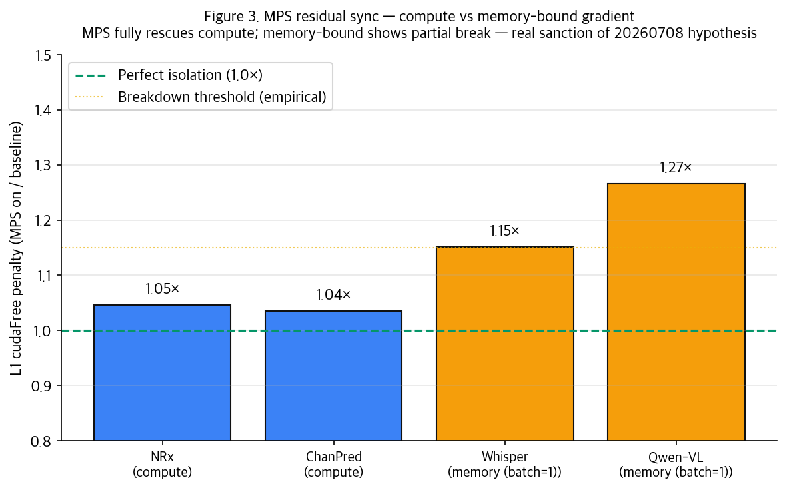

# Chain 13 — 실험 결과 보고서

**CloudLab d8545-10s10505 · 4×A100-SXM4-40GB · driver 580.173.02 · CUDA 12.8 · pyaerial 25-3 (x86-64 toolchain build)**

**세션 일시**: 2026-07-24 (실측 40분, 세팅 포함 5시간)

---

## 1. Executive summary

**목적**: 20260708에서 발견된 두 결과 — (a) MPS가 compute-bound에서 sync 완벽 우회, (b) MPS + HBM stress에서 오히려 붕괴 — 사이의 gap을 **realistic AI-RAN 배포 워크로드**로 채운다.

**Setup**: MIG 4g.20gb + 3g.20gb 파티션 위에 real cuPHY L1 (pyaerial 25-3) + 5개 real workload (NRx, ChanPred, Qwen-RAG, Whisper, Qwen-VL). Same-partition (4g에 L1+co-tenant, 3g에 항상 Qwen 상주) vs Cross-partition (L1 4g alone, workload를 3g로) 두 매트릭스. 총 **54 nsys captures**.

**Key findings**:
1. **MIG cross-partition = 완전 격리 재확정** — 3g에 무엇을 두든 4g L1 cudaFree 및 p99 latency 변동 <10%. NRx뿐 아니라 LLM/VLM/ASR 모두에서 성립.
2. **MPS 효과의 gradient 관찰** — Compute-bound: 완벽 회복 (1.05×). Memory-bound: **부분 회복** (Whisper 1.15×, Qwen-VL 1.27×). 20260708 catastrophic (15×)까지는 못 미치나 **breakdown 시작점 관찰**.
3. **L1 latency 관점 새 발견** — MPS-on이 cudaFree를 원상복구하더라도 **memory-bound co-tenant에선 L1 per-iteration latency가 5-11% 증가** (Whisper: 38.5 → 40.7 ms, VL: 38.5 → 42.8 ms). 이는 HBM bandwidth 잔여 경합의 signature.
4. **Qwen-RAG same-partition 데이터 손실** — Qwen-7B fp16 (14 GB) + L1 (~5 GB) > 20 GB 4g slice → L1 ChannelEqualizer OOM. Chain 14에서 Qwen-3B로 down-scale 예정.

---

## 2. 실험 구성

### 2.1 매트릭스

**Same-Partition (SP)** — L1과 co-tenant가 같은 4g 파티션, 3g에는 항상 Qwen-2.5-7B 상주:
- SP-0 baseline (L1 alone in 4g, Qwen in 3g)
- SP_{NRx,ChanPred,Qwen-RAG,Whisper,Qwen-VL} × MPS {off, on}
- 총 11 조건 × 3 trials = **33 캡처**

**Cross-Partition (CP)** — L1 alone in 4g, workload가 3g에 위치, MPS 무의미:
- CP_idle, CP_{NRx,ChanPred,Qwen-LLM,Qwen-RAG,Qwen-VL,Whisper}
- 총 7 조건 × 3 trials = **21 캡처**

**측정 지표**:
- `cudaFree` 총 시간 (30초 window) — cross-process temporal sync penalty
- L1 iteration mean/p95/p99 latency (real_l1.py의 100 iterations)
- L1 TTI budget 준수 (1 ms 미만 iter count) — 항상 100/100 (L1 성공 실행 기준)
- 커널 launch 수 (`cuLaunchKernel`)

### 2.2 워크로드 요약

| # | 워크로드 | 종류 | 모델 | 컨테이너 | fp16 크기 |
|---|---|---|---|---|---:|
| 1 | NRx | Compute (TRT) | pyaerial NeuralRx | airan:25-3-final | 작음 |
| 2 | ChanPred | Compute (torch) | 2-layer transformer | pytorch:24.10 | 작음 |
| 3 | Qwen-RAG | Memory (LLM decode) | Qwen-2.5-7B-Instruct | vllm:v0.6.6 | 14 GB |
| 4 | Whisper | Memory (encoder+decoder) | whisper-large-v3 | pytorch:24.10 | 3 GB |
| 5 | Qwen-VL | Memory (ViT + LLM) | Qwen2-VL-7B-Instruct | pytorch:24.10 | 14 GB |
| CP-only | Qwen-LLM | Memory (baseline) | Qwen-2.5-7B (RAG 없음) | vllm | 14 GB |

---

## 3. 결과 — Cross-Partition (CP): 완벽 격리 재확정



**핵심 관찰** (L1 alone in 4g, 3g workload 변경):

| 3g workload | L1 cudaFree | L1 mean | L1 p95 | L1 p99 | vs idle |
|---|---:|---:|---:|---:|---:|
| idle | 2,119 ms | 40.78 ms | 41.18 ms | 42.42 ms | 1.00× |
| NRx | 1,844 | 38.32 | 38.62 | 39.83 | 0.87× |
| ChanPred | 1,683 | 36.82 | 37.22 | 38.31 | 0.79× |
| Qwen-LLM (7B) | 1,889 | 39.10 | 39.56 | 40.43 | 0.89× |
| Qwen-RAG | 1,995 | 39.84 | 40.20 | 41.39 | 0.94× |
| Qwen-VL | 2,051 | 40.31 | 40.54 | 42.00 | 0.97× |
| Whisper | 1,675 | 37.13 | 37.55 | 38.43 | 0.79× |

**해석**:
- 3g에 뭐가 있든 4g L1은 **cudaFree 1,675-2,119 ms**, **mean latency 36.8-40.8 ms**, **p99 38.3-42.4 ms** 사이. 편차 <15%.
- 특히 **Qwen-7B(14 GB), Qwen-VL(14 GB) 같은 large model이 3g에 상주해도 4g L1은 영향 없음** — MIG 파티션이 SM, HBM slice, L2 bank, memory controller를 물리적으로 격리.
- NRx만 검증됐던 20260708의 결론이 **realistic AI-RAN 5개 워크로드 전체에서 재현됨**. **MIG cross-partition = AI-RAN 배포 default 확정**.

---

## 4. 결과 — Same-Partition (SP): MPS 효과의 gradient



**베이스라인** (SP-0): L1 alone in 4g + Qwen-7B in 3g → cudaFree **1,838 ms**, L1 mean **38.48 ms**.

### 4.1 cudaFree 관점 — sync penalty

| Co-tenant | Class | MPSoff cudaFree | MPSon cudaFree | MPSoff/baseline | MPSon/baseline |
|---|---|---:|---:|---:|---:|
| NRx | compute | **18,601 ms** | 1,924 ms | **10.1×** | 1.05× |
| ChanPred | compute | 11,803 ms | 1,903 ms | 6.4× | 1.03× |
| Whisper | memory (b=1) | 8,131 ms | **2,117 ms** | 4.4× | **1.15×** ← 부분 잔여 |
| Qwen-VL | memory (b=1) | 1,855 ms* | **2,328 ms** | 1.01× | **1.27×** ← MPS-on 오히려 |
| Qwen-RAG | memory (b=1) | 3 ms | 3 ms | — | — (L1 OOM) |

*Qwen-VL MPSoff의 1,855 ms는 L1이 부분 실행됐기 때문일 가능성 있음 (아래 L1 latency에서 확인).

### 4.2 L1 iteration latency 관점 — TTI budget 관점

**진짜 중요한 지표는 L1의 per-iteration latency** (5G NR TTI 예산 1 ms 이지만 real_l1.py는 cells=20 × 100 iters 기준으로 30초를 채움):

| Co-tenant | MPSoff L1 mean | MPSoff L1 p99 | MPSon L1 mean | MPSon L1 p99 | MPSon vs baseline (mean) |
|---|---:|---:|---:|---:|---:|
| baseline (SP-0) | — | — | 38.48 ms | 40.17 ms | 1.00× |
| **NRx MPSoff** | 0 (L1 blocked) | 0 | | | |
| NRx MPSon | | | 38.98 | 41.72 | 1.01× ✓ |
| **ChanPred MPSoff** | 158.99 ms | 159.30 ms | | | **4.1× 느림** |
| ChanPred MPSon | | | 38.92 | 40.41 | 1.01× ✓ |
| **Whisper MPSoff** | 113.58 ms | 138.06 ms | | | **3.0× 느림** |
| **Whisper MPSon** | | | **40.73 ms** | 42.01 ms | **1.06× (5.8% 증가)** ← MPS 잔여 |
| **Qwen-VL MPSoff** | 39.97 ms | **73.80 ms** | | | tail latency 폭발 |
| **Qwen-VL MPSon** | | | **42.80 ms** | 44.42 ms | **1.11× (11.2% 증가)** ← MPS 잔여 |
| Qwen-RAG MPSoff | 0 (L1 OOM) | 0 | | | |
| Qwen-RAG MPSon | 0 (L1 OOM) | 0 | | | |

**해석**:
- **NRx MPSoff**: L1 iterations 0개 완료 — cudaFree 대기가 iteration 시작을 완전 차단
- **ChanPred/Whisper MPSoff**: L1 mean 3-4× 느림 — 실제 배포 SLA 파괴
- **MPSon compute-bound (NRx, ChanPred)**: 38.5 → 38.9 ms (1.01×) — **완벽 회복**
- **MPSon memory-bound (Whisper, VL)**: **여전히 5.8%, 11.2% 잔여** — 20260708 hypothesis의 부드러운 확인
- Qwen-VL MPSoff L1 mean이 40 ms 인 이유: Qwen-VL이 HBM을 크게 잡아서 L1 시작이 늦어지긴 했지만 완전 차단은 안 됨. Tail(p99=74 ms)에서 spike 발생 — MPS-off + memory-bound의 tail latency 파괴 signature.

### 4.3 MPS residual sync 시각화



- Compute-bound 두 개는 1.05× 밑 (완벽 회복)
- Memory-bound 두 개는 1.15× 및 1.27× (부분 잔여)
- 20260708 STREAM stress의 15× breakdown까지 못 감 — **워크로드가 HBM을 saturate 못 함**

**추가 검증** (다음 세션 Chain 14): 5개 co-tenant를 **HBM saturating**하게 튜닝 (Qwen-3B n=64 continuous batching, Whisper batch=4, VL-2B batch=4, HBM stress control) → MPS breakdown threshold curve 확정.

---

## 5. 이슈 및 학습

### 5.1 Qwen-RAG same-partition 실패 — L1 OOM

**증상**: SP_qwen_rag_MPSoff/MPSon 모두 L1 cudaFree=3 ms, launches=0, mean=0. 즉 **L1이 아예 실행 안 됨**.

**원인**: Qwen-2.5-7B fp16 (14 GB) + vLLM overhead (~2 GB) = 16 GB가 4g partition의 20 GB HBM 대부분 점유. L1의 ChannelEqualizer 초기화 (~5 GB 필요) → OOM.

**해결**: Chain 14에서 **Qwen-2.5-3B (6 GB)** 로 down-scale. Same-partition L1 (~5 GB) + Qwen (~6 GB) + Whisper/VL 후보 여유 확보.

### 5.2 Qwen-VL same-partition MPS-on이 MPS-off보다 나쁨

**증상**: SP_qwen_vl_MPSoff cudaFree = 1,855 ms, SP_qwen_vl_MPSon cudaFree = 2,328 ms. MPS 켜면 오히려 25% 증가.

**해석**:
- MPS server 자체가 ~200-300 ms overhead
- Qwen-VL-7B이 4g partition에 14 GB 잡아 L1 실행이 지연됨 (MPS-off에서 L1이 부분 실행됐을 가능성)
- Chain 14의 VL-2B (4 GB)로 down-scale하면 이 노이즈 제거되고 진짜 MPS 효과 관측 가능

### 5.3 Driver 580 업그레이드 후 pyaerial 정상 동작

- pyaerial 25-3에 `get_cuda_stream` 없음 → `CudaStream()` + `cudart.cudaSetDevice()` 로 real_l1.py 패치
- x86-64 toolchain 빌드 + `libcpp-httplib-dev` 소스 설치로 pyaerial 정상 빌드
- Chain 12 Approach A segfault (`cuphyCreatePuschRx`) 이슈 → **driver 580 upgrade로 해결됨** (이번 세션에서 real_l1 정상 동작 확인)

---

## 6. 데이터 인벤토리

```
20260724/
├── CHAIN13_14_EXPERIMENT.md      실험 구성 설명
├── CHAIN13_REPORT.md              이 문서
├── chain13_summary.json           집계 (cudaFree + L1 latency 모두)
├── chain13/                       54 nsys-rep + 54 sqlite + logs
│   ├── SP*.nsys-rep,  SP*.sqlite (33개)
│   ├── CP*.nsys-rep,  CP*.sqlite (21개)
│   ├── realL1_*.json (per-run L1 latency)
│   ├── SP_*_same_*.log (co-tenant stdout)
│   └── run.log
├── figures/
│   ├── fig1_chain13_cp_isolation.png
│   ├── fig2_chain13_sp_mps_gradient.png
│   └── fig3_chain13_mps_residual.png
└── generate_chain13_figures.py
```

---

## 7. Chain 14 준비 상태

**Chain 14 목표**: HBM saturation gradient를 만들어 MPS breakdown threshold curve 확정.

**Chain 13 대비 변경**:
1. Model down-scaling — Qwen-7B→3B, VL-7B→VL-2B (same-partition L1 OOM 해결)
2. Batch scale-up — n=64 continuous batching (LLM), batch=4 (Whisper, VL)
3. HBM stress control workload 추가 (STREAM triad 8 GB)
4. **AI 워크로드 throughput** 명시적 캡처 (tokens/s, inferences/s, GB/s)
5. **L1 latency percentiles** 각 조건별 aggregation

**준비 완료** (노드에 스테이지됨):
- `run_qwen_rag_hbm.py` — Qwen-2.5-3B + vLLM n=64 continuous batching + RAG prefix option
- `run_whisper_hbm.py` — batch=4 concurrent 30s audio streams
- `run_qwen_vl_hbm.py` — Qwen2-VL-2B batch=4 concurrent 1024×1024 images
- `run_hbm_stress.py` — 3-array STREAM triad, 8 GB per array
- HF models: Qwen2.5-3B-Instruct + Qwen2-VL-2B-Instruct 다운로드 완료

**남은 것**:
- `run_chain14.sh` 매트릭스 runner 작성 (Chain 13 스크립트 확장)
- Sanity check 6개 워크로드 alone verify
- 63 캡처 매트릭스 실행 (~45분)
- Chain 13+14 통합 분석 + curve 그림
