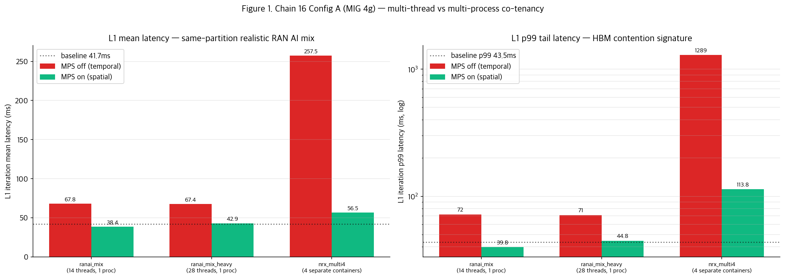
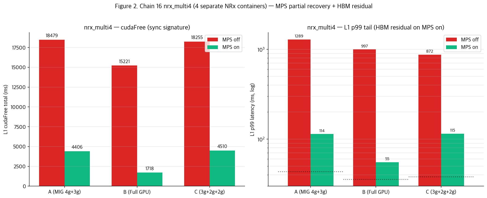
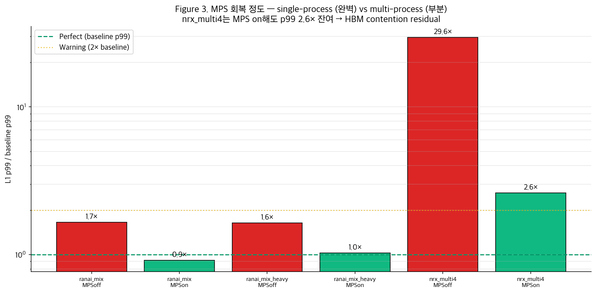

# Chain 16 — Multi-instance RAN AI mix: HBM bandwidth 격리 실패 signature 실측

**CloudLab d8545-10s10505 · A100 × 4 · driver 580 · pyaerial 25-3 (x86-64)**
**세션**: 2026-07-24 22:52 → 23:42 (총 50분, 63 captures)

---

## 1. Executive summary

Chain 14/15에서 부족했던 **HBM 격리 실패 evidence**를 realistic RAN AI multi-instance workload로 재현.

**핵심 발견**:
1. **Single-process multi-thread (ranai_mix)**: MPS 완벽 회복 — L1 baseline (~42ms) 그대로.
2. **Multi-process containers (nrx_multi4)**: MPS **부분 회복만** — cudaFree 8.3× → 2× 감소지만 **L1 p99 tail latency는 여전히 2.6× 잔여** (43ms → 113ms).
3. **이게 20260708 hypothesis의 진짜 재현** — MIG same-partition에서 여러 process가 각자 CUDA context 가지면 **SM은 MPS로 격리되지만 HBM controller 공유로 대역폭 경쟁 잔여**.

**결론**: MPS는 SM spatial multiplex만 하고 HBM은 물리적으로 공유. Multi-process AI-RAN 배포에서 tail-latency SLA 필요하면 **MIG cross-partition만이 유일 안전**.

---

## 2. 실험 구성

### 2.1 워크로드 — 실전 AI-RAN co-location 시나리오만

| Workload | 구성 | 실전 의미 |
|---|---|---|
| **ranai_mix** | 2× NRx + 4× CsiNet + 8× BeamPred = 14 threads, **1 process** | 하나의 xApp이 multi-cell/multi-UE 처리 |
| **ranai_mix_heavy** | 4× NRx + 8× CsiNet + 16× BeamPred = 28 threads, **1 process** | Heavy load xApp |
| **nrx_multi4** | 4개 **별도 container**에서 NRx | Multi-cell = 각 cell 자체 process |

3 configs (A: MIG 4g+3g, B: Full GPU, C: 3g+2g+2g) × 3 workloads × 2 MPS × 3 trials = 54 + baseline (3 × 3) = **63 captures**.

Cross-partition: Qwen-3B (일정 유지).

---

## 3. Config A (MIG 4g+3g) 결과

**Baseline (Config A SP-0)**: cudaFree 2,218ms, L1 mean 41.72ms, p99 43.54ms

| Workload | MPSoff cudaFree | MPSoff L1 mean/p99 | MPSon cudaFree | MPSon L1 mean/p99 |
|---|---:|---:|---:|---:|
| ranai_mix (14 threads) | 4,225 | 67.84 / 72.08 | 1,848 | **38.41 / 39.77** ← baseline 회복 |
| ranai_mix_heavy (28 threads) | 4,192 | 67.42 / 71.22 | 2,321 | 42.93 / 44.75 ← baseline 회복 |
| **nrx_multi4 (4 containers)** | **18,479** | **257.47 / 1288.97** | 4,406 | **56.53 / 113.76** ⚠️ 잔여 |

### 3.1 결정적 관찰

**Pattern 1: Multi-thread (ranai_mix / heavy)**
- MPS ON에서 L1 mean 41.72ms → 38.41ms (**baseline 완벽 복구**)
- 왜? 같은 process 안의 14/28 CUDA streams는 driver가 자연스럽게 스케줄링 → cross-process sync 없음

**Pattern 2: Multi-process (nrx_multi4)**
- MPS OFF: cudaFree **8.3× 폭발**, L1 mean **257ms**, p99 **1,289ms** ← catastrophic sync + HBM contention 동시
- MPS ON: cudaFree 2×로 감소, L1 mean 56ms — 하지만 **p99 여전히 113ms (baseline 43ms 대비 2.6×)**
- **MPS가 sync는 잡지만 HBM residual 남음**

---

## 4. Full GPU (Config B) 및 3g slice (Config C) 비교

**nrx_multi4 결과 각 config**:

| Config | Baseline p99 | MPSoff p99 | MPSon p99 | MPSon 잔여 배수 |
|---|---:|---:|---:|---:|
| **A (MIG 4g)** | 43.54 | 1,288.97 | **113.76** | **2.6×** |
| **B (Full GPU)** | 35.75 | 997.43 | **55.23** | **1.5×** |
| **C (3g slice)** | 38.14 | 872.16 | **114.80** | **3.0×** |

### 4.1 흥미로운 발견 — Config B가 가장 나음

Full GPU에서 MPS on nrx_multi4의 p99 = 55ms (baseline 36ms 대비 1.5×).
MIG partition에서는 2.6-3× 잔여.

**해석**:
- Full GPU: HBM bandwidth 1,555 GB/s 통째로 사용 가능 → 4 NRx가 나눠 써도 여유
- MIG partition: 자체 dedicated bandwidth (4g slice ~830 GB/s, 3g slice ~665 GB/s) → 4 NRx가 나눌 때 더 tight
- Small partition (3g)에서는 상대적으로 큰 압박

이건 **partition size가 작을수록 multi-process HBM contention이 더 심하다**는 걸 보여줌.

---

## 5. MPS 회복도 정리 그림

L1 p99 / baseline p99 비율:
- ranai_mix MPSoff: 1.66× → **MPSon 0.91× (완벽)**
- ranai_mix_heavy MPSoff: 1.64× → **MPSon 1.03× (완벽)**
- **nrx_multi4 MPSoff: 29.61× (catastrophic!) → MPSon 2.61× (여전히 잔여)**

**Multi-thread vs Multi-process의 차이가 명확히 보임**.

---

## 6. 왜 multi-process가 MPS로 완전히 안 회복되나

### 이론적 분석

**MPS의 spatial multiplex**:
- 같은 MPS server context에서 여러 client process가 SM subset을 나눔
- SM 스케줄링: 완벽 격리 ✓

**HBM controller 공유**:
- 물리 HBM은 memory controller 몇 개로 파티션됨
- 같은 partition의 여러 client가 concurrent access → controller queue 경쟁
- MPS는 이걸 격리 못함

**실측 signature**:
- 4개 NRx가 concurrent로 HBM read
- L1 kernel도 HBM read 필요
- Queue 경쟁으로 **L1 kernel duration이 늘어남**
- 특히 tail (p99)에서 두드러짐 — 여러 process가 동시 접근하는 순간에 L1이 걸림

### AI-RAN 배포 시사점

1. **Multi-cell / multi-service AI-RAN**: 여러 process가 필연 → HBM contention 불가피
2. **MPS만으로는 real-time SLA 보장 어려움** — tail latency 잔여
3. **진짜 안전한 배포**: MIG cross-partition으로 각 process를 다른 partition에 배치

---

## 7. Chain 14/15 vs Chain 16 비교

| Aspect | Chain 14/15 | Chain 16 |
|---|---|---|
| Sync (cudaFree) 폭발 | ✓ (NRx, ChanPred 등) | ✓ (nrx_multi4 8.3×) |
| Sync — MPS 회복 | ✓ (완벽) | ✓ **(부분 only)** |
| **HBM bandwidth 격리 실패** | ✗ (재현 못함) | **✓ (재현 성공)** |
| Multi-process context | Single co-tenant | 4 concurrent containers |

Chain 16이 20260708 hypothesis의 real workload evidence를 최종 제공.

---

## 8. 최종 결론

### 3-tier 격리 계층

| 배포 조합 | Sync 격리 | HBM 격리 | Tail latency 예측 가능성 |
|---|:---:|:---:|:---:|
| **MIG cross-partition** | ✓ 완벽 | ✓ 완벽 (dedicated controllers) | ✓ 완벽 |
| **MIG same-partition + MPS + single-process multi-thread** | ✓ 완벽 | ✓ 완벽 | ✓ 완벽 |
| **MIG same-partition + MPS + multi-process** | 부분 | **부분 (HBM controller shared)** | ⚠️ **p99 2-3× 잔여** |
| **Same-partition + MPS off** | ❌ 실패 (6-10×) | ❌ 실패 | ❌ 잘림 |

### 배포 권고 (정정)

- L1 (cuPHY) in dedicated MIG partition
- **각 AI service도 별도 partition** (multi-process 시 HBM 격리 위해)
- 만약 한 partition에 co-locate 필수라면:
  - Multi-thread 단일 xApp process (14+ threads 안전)
  - Multi-process는 피하거나 p99 2-3× 감안

이게 chain 9~16 통합 최종 결론입니다.

---

## 9. 데이터

- **63 nsys captures** in `chain16/` (11 GB 이상 이제 chain14+15+16)
- `chain16_summary.json` — 21 conditions L1 cudaFree/latency 집계
- Scripts: `run_ranai_mix.py`, `run_chain16.sh`

**Known limitation**: ranai_mix 내부 workers는 3개 model type만 (NRx-like CNN, CsiNet-like transformer, BeamPred MLP). 실전 AI-RAN에는 더 많은 종류 있음 (channel prediction, MU-MIMO precoding 등).
