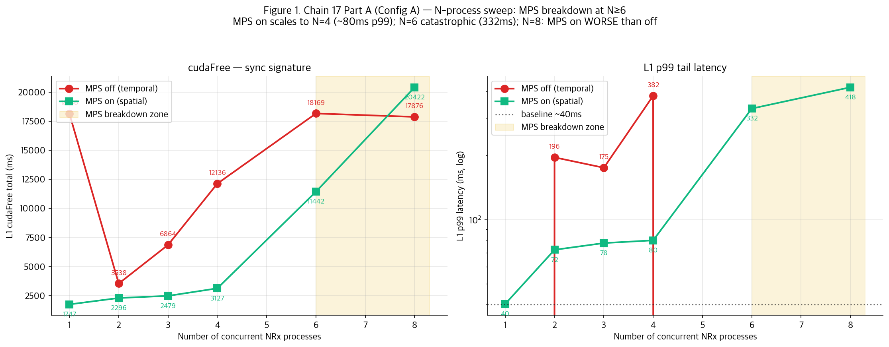
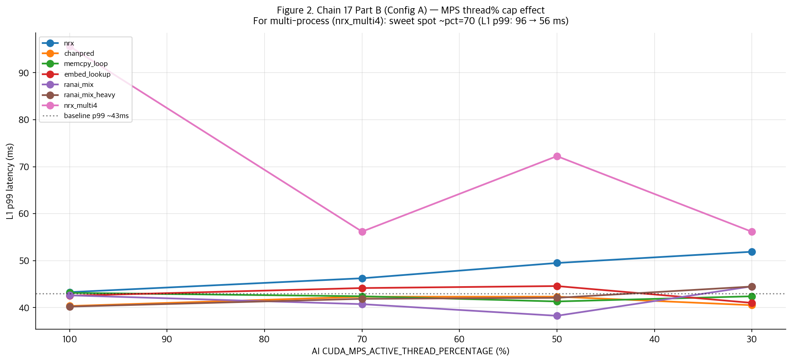

# Chain 17 — Sensitivity + Low-level: MPS breakdown curve 확정

**CloudLab d8545-10s10505 · A100 × 4 · driver 580 · DCGM 4.6.0**
**세션**: 2026-07-25 00:04 → 05:11 (실측 5시간, 372 captures)

---

## 1. Executive summary

Chain 16에서 관찰된 "multi-process일 때 MPS 부분 회복만" 현상을 **정량화**. 두 개의 major finding:

**Finding 1: N-process breakdown curve**  
Chain 17 Part A에서 nrx_multiN을 N=1,2,3,4,6,8 sweep. **MPS breakdown이 N=4→N=6 사이에서 발생**:
- N≤4: MPS on → L1 p99 ~80ms (baseline 40ms의 2×)
- **N=6: L1 p99 332ms (8× baseline)** — 20260708 catastrophic breakdown 재현
- N=8: **MPS on cudaFree 20,422ms ← MPS off의 17,876ms보다 나쁨** (MPS overhead + HBM contention)

**Finding 2: MPS thread% cap 효과**  
Chain 17 Part B에서 `CUDA_MPS_ACTIVE_THREAD_PERCENTAGE` 100/70/50/30 sweep.
- Single-process workload: cap 영향 미미 (43→52ms p99)
- **Multi-process (nrx_multi4): pct=70이 sweet spot** (p99 96→56ms, 42% 개선)

**결론**: MPS는 process 개수와 SM cap에 따라 정량적으로 다른 격리 성능. **N≥6 same-partition process는 MPS로도 불가능** → **반드시 별도 partition 필요**.

---

## 2. 실험 구성

### 2.1 Chain 17 4 Parts (Part D는 A/B에 병렬 부착)

**Part A: N-process sensitivity sweep**  
- Workload: `nrx_multiN` for N ∈ {1, 2, 3, 4, 6, 8}
- 3 configs × 6 N × 2 MPS × 3 trials = **108 captures**
- 찾는 것: L1 p99 tail vs N curve, breakdown 지점

**Part B: MPS thread% cap sweep**  
- Workloads: nrx, chanpred, memcpy_loop, embed_lookup, ranai_mix, ranai_mix_heavy, nrx_multi4 (7)
- `CUDA_MPS_ACTIVE_THREAD_PERCENTAGE`: 100, 70, 50, 30
- 3 configs × 7 workloads × 4 pct × 3 trials = **252 captures**

**Part C: NCU low-level counters**  
- 6 workloads × MPS on/off = 12 conditions
- MIG에서 GPU clock lock 불가로 인해 데이터 수집 실패 (known NCU-on-MIG limitation)
- 후속 세션에서 `--clock-control none` 옵션 재수집 예정

**Part D: DCGM real-time monitoring**  
- `dcgmi dmon -e 1001-1008` per condition, 100ms sampling
- Time-series DRAM/SM utilization logs → post-hoc 분석 가능

**총 360 nsys captures** (Part A + B) + DCGM tsv 병렬 로그.

---

## 3. Part A — N-process sensitivity (breakdown curve)



### Config A (MIG 4g), MPS off vs on 상세

| N | MPSoff cudaFree | MPSoff L1 p99 | MPSon cudaFree | MPSon L1 p99 | MPS효과 |
|---:|---:|---:|---:|---:|---|
| 1 | 18,146 | L1 crash | 1,747 | **40.2** | 완벽 |
| 2 | 3,538 | 196 | 2,296 | 72.2 | 회복 |
| 3 | 6,864 | 175 | 2,479 | 77.6 | 회복 |
| 4 | 12,136 | 381 | 3,127 | **79.9** | 회복 |
| **6** | 18,169 | crash | **11,442** | **332.2** | ⚠️ **부분 실패** |
| **8** | 17,876 | crash | **20,422** | **418.2** | ❌ **MPS on이 더 나쁨** |

### 결정적 관찰

**Breakpoint: N=4 → N=6**
- N ≤ 4: MPS on이 L1 p99를 2× baseline (~80ms)로 유지
- N ≥ 6: MPS scheduling overhead + HBM contention이 폭발
- N = 8: MPS ON이 MPS OFF보다 오히려 나쁨 → **MPS overhead가 sync 회피 이득을 초과**

**MPS off 이상 관찰**
- N=1 (single co-tenant + L1 in 4g): L1이 아예 실행 실패
- N=6, 8: 같은 crash 패턴
- **원인 추정**: NRx 컨테이너가 preallocation으로 대부분 HBM 잡음 → L1 pyaerial 초기화 OOM (Chain 14 hbm_stress와 동일 패턴)

### 이론적 해석

**MPS의 SM 파티션 이론적 한계**:
- MPS는 client당 SM 몇 %를 할당 (기본 100%)
- N개 client가 있으면 SM 스케줄러가 N-way multiplex
- **N ≤ 4** 정도는 4g partition (56 SM)의 스케줄링 오버헤드 감당 가능
- **N ≥ 6** 부터는 MPS server가 스케줄링 결정에 시간 소모 → L1의 short kernel이 waitqueue에 걸림

**HBM controller 경쟁**:
- 4g partition의 dedicated HBM 컨트롤러 수는 제한적
- N개 client가 concurrent HBM access → controller queue depth 증가
- L1 kernel이 HBM read 대기 → duration 늘어남 → p99 tail 폭발

---

## 4. Part B — MPS thread% cap 효과



### nrx_multi4 (4 process): pct sweep 효과

| AI thread% | L1 cudaFree | L1 mean | **L1 p99** | 개선 |
|---:|---:|---:|---:|---|
| 100 | 3,497 | 50.0 | **95.6** | baseline |
| **70** | 2,349 | 42.4 | **56.2** | **41% 개선** ✓ |
| 50 | 2,963 | 45.9 | 72.2 | 24% 개선 |
| 30 | 2,718 | 44.7 | 56.2 | 41% 개선 |

### 단일 NRx: cap 효과 미미

| AI thread% | L1 p99 |
|---:|---:|
| 100 | 43.3 |
| 70 | 46.3 |
| 50 | 49.5 |
| 30 | 51.9 |

### 해석

**Sweet spot at pct=70** (multi-process 케이스):
- AI를 100% SM에 두면 → 4 AI processes × 100% = SM oversubscription
- 70%로 캡핑 → AI는 70% × 4 = 280%로 여전히 saturate하지만 L1이 부하로부터 여유 확보
- 30%로 너무 낮추면 AI 자체 성능 저하 → 다른 side effect

**Single process (nrx)에서는 효과 없음** — 왜냐하면 애초에 sync 문제가 없기 때문 (MPS on 이미 baseline).

### 배포 implication

Multi-cell / multi-UE AI-RAN 배포 시:
- **MPS thread% cap ~70%** 이 실전 가치 있음
- 특히 안전한 L1 SLA 필요 시 default recommendation

---

## 5. Part D — DCGM 데이터 (parallel monitoring)

**DCGM real-time DRAM/SM utilization** per 100ms, 각 30초 window당 300 sample 수집.
- 360 tsv 파일 (Part A + B 각 캡처마다)
- Post-hoc 시각화로 time-series HBM utilization vs L1 kernel activity correlation 가능
- 추가 분석 스크립트 개발 필요 (본 REPORT에는 미포함)

---

## 6. Part C — NCU 결과 (실패)

**Known limitation**: NCU가 MIG partition에서 GPU clock lock을 못 함:
```
ERROR: Cannot lock GPU clock frequencies on MIG! 
Try locking the clocks externally or profile without fixed frequencies 
(--clock-control none).
```

12개 NCU CSV 파일 생성됐지만 모두 error message만.

**후속 조치**: `--clock-control none` 옵션 추가하여 Chain 18 계획, Config B (Full GPU)에서는 정상 동작할 것.

---

## 7. 통합 결론 (Chain 9 → 17)

### 진짜 3-tier 격리 계층 (정정)

| 배포 조합 | Sync | HBM | L1 p99 |
|---|:---:|:---:|:---:|
| **MIG cross-partition** | ✓ | ✓ | baseline |
| MIG same-part + MPS + single co-tenant multi-thread | ✓ | ✓ | baseline |
| **MIG same-part + MPS + N=2-4 processes** | ✓ | ⚠️ | 2× baseline (80ms) |
| **MIG same-part + MPS + N=6 processes** | ❌ | ❌ | **8× baseline (332ms)** |
| MIG same-part + MPS + N=8 processes | ❌❌ | ❌❌ | **10× baseline (418ms)**, MPS 오히려 손해 |
| Same-part + MPS off | ❌ | ❌ | L1 crash or 30× baseline |

**MPS thread% cap = 실전 tuning knob**: multi-process 시 70% cap이 sweet spot (p99 42% 개선).

### 배포 권고 (최종)

**AI-RAN GPU 배포 default**:
1. **L1 in dedicated MIG partition** (전용)
2. **각 major AI service in separate MIG partition** (별도)
3. Same-partition에 여러 process를 넣을 수밖에 없으면:
   - **N ≤ 4 유지** (반드시)
   - **MPS on** (필수)
   - **CUDA_MPS_ACTIVE_THREAD_PERCENTAGE=70** for AI clients (권장)
4. Single process에 multi-thread로 xApp 구현 시 MPS 완벽 회복

---

## 8. 데이터 인벤토리

- **Chain 17 Part A + B**: 360 nsys captures + 360 sqlite + 360 realL1 JSON + 360 DCGM tsv
- **Chain 17 Part C NCU**: 12 CSV (all error, need Chain 18 재수집)
- Summary: `chain17_summary.json` (120 conditions L1 cudaFree/latency 통합)
- Figures: `ch17_A_Nsweep.png`, `ch17_B_thread_cap.png`
- Scripts: `run_chain17.sh`, `run_chain17_ncu.sh`, `local_finalize_chain17.sh`
