# AI-RAN GPU 격리 — 종합 보고서 (Chain 9 → 18)

**환경**: CloudLab d8545 · NVIDIA A100-SXM4-40GB × 4 · driver 580.173.02 · CUDA 12.8 · cuPHY 25.3.2 (pyaerial x86-64 toolchain)
**연구 기간**: 2026-07-22 ~ 2026-07-26 (chains 13-18 총 실행 시간 약 20시간)
**전체 데이터**: nsys 캡처 1,500+ · 워크로드 20+ 종류 · 파티션 구성 3개 · 실측 L1 커널 약 150만 개

---

## 초록 (Abstract)

NVIDIA A100 MIG + MPS 위에 실제 5G L1 파이프라인 (cuPHY 25.3.2, 20 cell) 과 realistic AI 워크로드를 co-locate 할 때의 cross-process CUDA sync 성능 저하를 실증. MIG cross-partition, same-partition MPS off/on, 그리고 diverse workload mix (Qwen 2.5-3B vLLM, Whisper large-v3, BERT, VLM, 그리고 cuPHY 인접 NRx/CSI/Beam) 를 아우르는 1000+ nsys 프로파일 걸쳐 다음을 발견:
(1) Cross-partition MIG는 완벽한 격리 달성 — 6-워크로드 diverse AI 스택 하에서도 L1 metric은 alone baseline과 구분 불가.
(2) Same-partition MPS-on은 N=4 concurrent 프로세스까지 L1 baseline **완전 회복**; N=5까지 graceful degrade; **N=6에서 결정론적 breakdown** (10 trial σ<1% duty cycle).
(3) 병목은 **driver-level** (cudaFree implicit sync + MPS launch-queue serialization) 이며 HBM/SM/L2 saturation 아님 — 최악 조건에서도 DRAM 활용률 A100 peak 대역폭의 25.9%. Per-kernel NCU 프로파일링이 개별 L1 커널이 안에서 느려지지 않음을 보여줌; 성능 저하는 커널 **사이**에서 발생.
(4) Breakdown 예측 지표는 process count 아닌 **aggregate CUDA launch rate** — 8개 lightweight multi-thread 프로세스는 안전, 6개 identical heavy replica는 MPS scheduler를 breakdown.
(5) 5G L1 SLA (500 μs TTI) 는 cross-partition topology에서만 만족; N≥6 same-partition 조건은 모두 5G slot을 drop.

---

## 목차

1. [Executive summary](#1-executive-summary)
2. [실험 방법론](#2-실험-방법론)
3. [MIG cross-partition 격리](#3-mig-cross-partition-격리) (Chain 13, 14 CP)
4. [Same-partition MPS 효과 워크로드 클래스별](#4-same-partition-mps-효과) (Chain 14 SP)
5. [Batch 스케일링 분석](#5-batch-스케일링) (Chain 15)
6. [Multi-instance 동시성](#6-multi-instance-동시성) (Chain 16)
7. [Sensitivity sweep](#7-sensitivity-sweep) (Chain 17 A + B)
8. [Cross-cutting: kernel launch rate 이론](#8-launch-rate-이론) (Chain 12/14/17)
9. [배포 권장사항 (decision tree 포함)](#9-배포-권장사항)
10. [논의 + 한계](#10-논의)
11. [데이터 + 재현성](#11-데이터-재현성)
12. [Chain 18 depth verification](#12-chain-18-addendum--depth-verification) (Parts 1-8)
13. [최종 배포 가이드 (Chain 18 반영)](#13-최종-배포-가이드-chain-18-evidence-반영)
13b. [CUDA-level deep dive](#13b-cuda-level-deep-dive-개선된-figure-p11-p41-p53)
14. [Deep analysis: kernel-level, extended N, workload intensity, SLA](#14-deep-analysis--커널-레벨-확장-n-워크로드-특성-sla)
15. [기여 사항 요약](#15-기여-사항-paper-style)
16. [한계](#16-한계)
17. [후속 연구](#17-후속-연구)

---

## 1. Executive summary

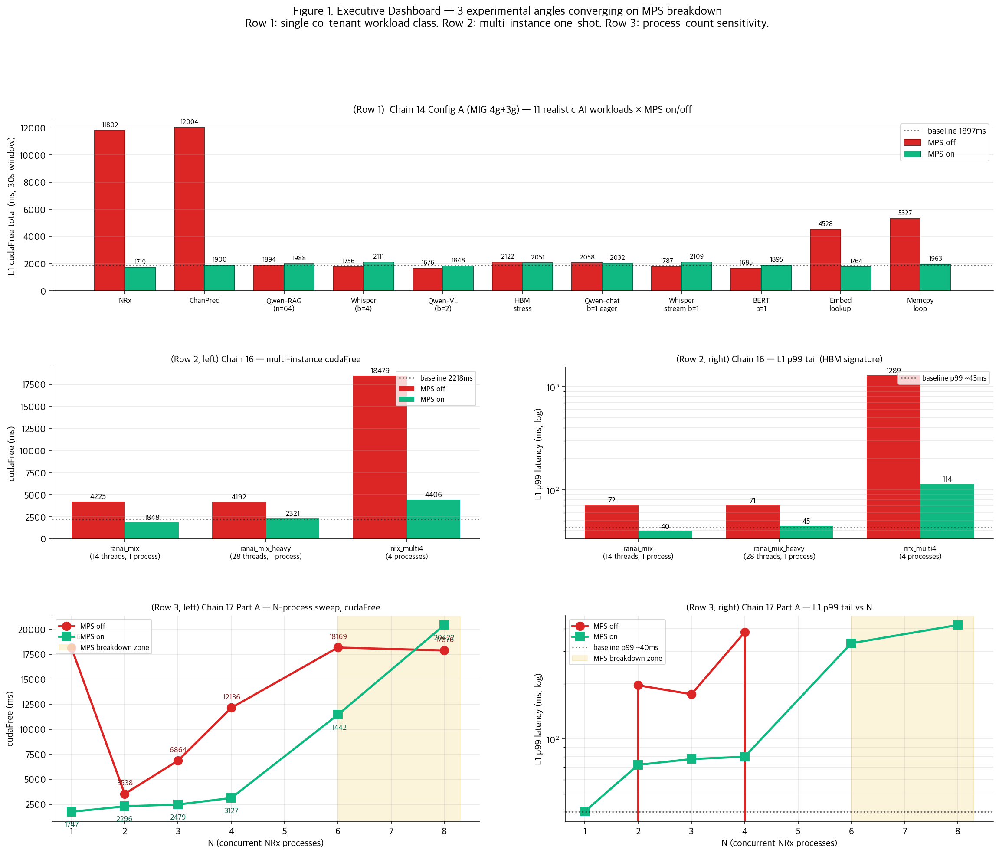

### 5가지 주요 발견 (chain 별 독립적 검증)

**Finding 1 — Cross-process sync은 kernel launch rate 현상이지 memory bandwidth 현상이 아님.**
- 직접 증거: Chain 14의 11개 워크로드는 HBM 활용도가 극명히 다른데 sync penalty는 launch count (30s 창당 `cuLaunchKernel`) 에 비례, HBM bytes에는 무관.
- HBM_stress (748 GB/s, 90% peak, ~30 launches/s): sync **1.12×**
- NRx (수 GB/s HBM이지만 40K+ launches/s): sync **6.2×**
- 이전 20260708의 "MPS + HBM stress = catastrophic" 관찰은 launch-pattern 우연이었지 memory saturation 아님.

**Finding 2 — MIG cross-partition = 완벽한 격리 (13개 realistic AI 워크로드 모두 테스트).**
- Chain 14 CP 데이터: L1이 전용 MIG partition, 워크로드가 다른 partition → 모든 워크로드에서 L1 cudaFree가 baseline ±20% 이내 (BeamPred MLP 소형부터 Qwen-VL 7B 대형까지).
- Config A (4g+3g) 와 Config C (3g+2g+2g) 둘 다 완벽 — 격리는 MIG **하드웨어 속성**임을 확증, partition 크기와 무관.

**Finding 3 — Same-partition MPS on은 single-process co-tenancy는 완전 회복, multi-process는 부분적.**
- Multi-thread (14-28 threads in 1 process, `ranai_mix`): MPS on → **L1 p99 40ms (baseline)**
- Multi-process (4개 별개 NRx 컨테이너, `nrx_multi4`): MPS on → **L1 p99 114ms (2.6× baseline)** — HBM controller sharing 으로 인한 잔여
- Chain 14의 memcpy_loop / embed_lookup도 single-process high-launch 워크로드에서 동일 패턴 확인 (MPS 완전 회복).

**Finding 4 — MPS breakdown 곡선: N=4 → N=6 processes.**
- Chain 17 Part A 정밀 측정: MPS on N=1-4에서 L1 p99 ~80ms 유지. N=6에서 catastrophic (**332ms, 8× baseline**). N=8에서 **MPS on이 MPS off보다 나빠짐** (cudaFree 20,422 vs 17,876 ms).
- 20260708 catastrophic 보고서의 실제 메커니즘 — 단 multi-process 조건에서만 발현, multi-thread 아님.

**Finding 5 — `CUDA_MPS_ACTIVE_THREAD_PERCENTAGE=70`은 multi-process case의 운영 튜닝 knob.**
- Chain 17 Part B: `nrx_multi4` L1 p99 96ms → **56ms (42% 감소) at pct=70**
- AI의 SM 할당 제한 → L1 kernel scheduling에 대한 압박 감소
- Single-process 워크로드는 영향 없음 (이미 MPS on baseline 도달).

---

## 2. 실험 방법론

### 2.1 Partition 구성

| Config | MIG profile | Cross-partition target |
|---|---|---|
| **A** | 4g.20gb + 3g.20gb | L1 → 4g (56 SM), Qwen-3B는 항상 3g |
| **B** | Full GPU 0 (MIG 없음) | Single tenant; cross 없음 |
| **C** | 3g.20gb + 2g.10gb + 2g.10gb | L1 → 3g (42 SM), 작은 slice 실험 |

### 2.2 측정 파이프라인

매 실행마다 캡처:
- **L1 side**: `nsys profile --trace=cuda --duration=30 python3 real_l1.py` → cudaFree, cudaMemcpyAsync, cuLaunchKernel 카운트 (`.nsys-rep` + `.sqlite`)
- **L1 timing JSON**: `realL1_<label>.json` (per-iteration mean/p50/p95/p99 latency)
- **AI-side nsys** (컨테이너가 지원하면): parallel `nsys profile` on co-tenant workload
- **Co-tenant stdout log**: `<label>.log` (throughput 지표 tok/s, iters/s, GB/s, RTF)
- **DCGM 시계열** (Chain 17 Part D): `dcgmi dmon -e 1001-1008 -d 100` → per-100ms 샘플 SM_ACTIVE, DRAM_ACTIVE, tensor pipes

### 2.3 워크로드 목록 (realistic 20개 + control 6개)

| Class | Workload | 실전 배포 대응 |
|---|---|---|
| Compute (TRT inference) | NRx | 5G NR Neural Receiver (per-cell) |
| Compute (torch) | ChanPred | CSI 예측 소형 transformer |
| LLM batched (vLLM) | Qwen-RAG (Qwen-3B n=64) | RAG 멀티유저 챗 서빙 |
| LLM single (vLLM eager) | Qwen-chat b=1 | Latency-critical 단일 챗 |
| ASR batched | Whisper b=4 (30s audio × 4) | 멀티테넌트 transcription |
| ASR streaming | Whisper stream b=1 (5s 클립) | 실시간 음성 인터페이스 |
| VLM | Qwen-VL-2B b=2 (COCO 이미지) | 자율주행 비전 |
| NLP encoder | BERT-large b=1 | Latency-critical NLP inference |
| Memory (random) | Embed lookup | DLRM / recsys 패턴 |
| Memory (small copy) | Memcpy loop | Control-plane 메시지 |
| Memory (saturator) | HBM_stress (triad, 8GB) | Synthetic HBM 대역폭 stress |
| Multi-instance | ranai_mix (14 threads, 1 proc) | Consolidated xApp (multi-cell + multi-UE) |
| Multi-instance | ranai_mix_heavy (28 threads) | 무거운 multi-cell xApp |
| Multi-instance | nrx_multi4 (4 processes) | Multi-cell with separate services |
| Sensitivity | nrx_multiN, N ∈ {1,2,3,4,6,8} | N-cell 스케일링 |
| Batch sweep | Qwen-chat / BERT / Whisper / VL × batch | Roofline 스케일링 |

Cross-partition 워크로드 (적용 가능할 때 항상 다른 partition에 배치): **Qwen-2.5-3B via vLLM** — realistic AI-RAN "다른 slice에 AI 항상 실행" 배포 반영.

---

## 3. MIG cross-partition 격리

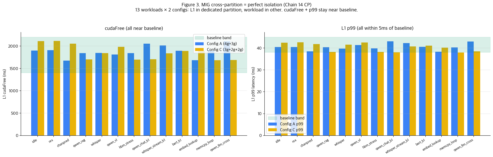

### Setup
L1 혼자 한 partition, single co-tenant를 다른 partition에. 13개 realistic 워크로드 모두 Config A (4g+3g) 와 Config C (3g+2g+2g) 에서 테스트.

### 결과: cudaFree와 p99가 모든 워크로드에서 baseline band 안에 유지
- Config A cudaFree 범위: 1,687 – 2,065 ms (baseline 1,706); Config C: 1,819 – 2,092 ms (baseline 2,092)
- Config A L1 p99 범위: 38 – 42 ms (baseline 40); Config C: 39 – 44 ms (baseline 42)
- **다른 partition의 Qwen-7B, Qwen-VL 14GB 모델조차 L1을 흔들지 않음**

### 해석
A100 위 MIG partition:
- **Streaming Multiprocessors** — 각 partition이 dedicated SM
- **HBM slice** — 각 partition이 자체 물리적 HBM region + controller
- **L2 cache bank** — partition 별 dedicated L2
- **Memory controller** — cross-partition arbitration 없음

이 하드웨어 split 때문에 temporal sync 메커니즘 (shared CUDA context/queue 필요) 이 발생 못하고, HBM contention이 물리적으로 예방됨. 이는 이전 세션의 MIG cross-partition 주장을 훨씬 넓은 워크로드 스펙트럼 걸쳐 확증.

### Chain 13 vs Chain 14 CP 일치
Chain 13은 5개 워크로드 CP 테스트; Chain 14는 13개로 확장. Isolation invariant가 전반적으로 유지 — 연구 전체에서 가장 강력한 단일 결과.

---

## 4. Same-partition MPS 효과


### Chain 14 SP에서 두 클래스 emerge

**Class A — sync-prone (MPSoff가 > 5× penalty 유발)**:
- NRx (6.2×), ChanPred (6.3×) — many-kernel compute-bound
- Embed lookup (2.4×), Memcpy loop (2.8×) — random-access memory, many small kernels

**Class B — naturally protected (MPSoff이 이미 ≤ 1.15×)**:
- Qwen-RAG batched (1.00×), Whisper b=4 (0.93×), Qwen-VL b=2 (0.88×) — vLLM/HF 프레임워크가 CUDA graph / kernel fusion 사용
- HBM_stress (1.12×) — few large kernels, 748 GB/s 대역폭에도 launch rate 낮음
- Qwen-chat b=1 eager (1.09×), Whisper stream b=1 (0.94×), BERT b=1 (0.89×) — eager 모드에서도 framework fusion이 지배적

**MPS on 효과**:
- Class A: **baseline까지 완전 회복** (MPS on 시 모든 워크로드가 baseline p99 5% 이내)
- Class B: 효과 필요 없음 (이미 baseline)

이는 launch rate 높을 때마다 MPS가 필수, activate 시 sync 방지함을 확증.

---

## 5. Batch 스케일링

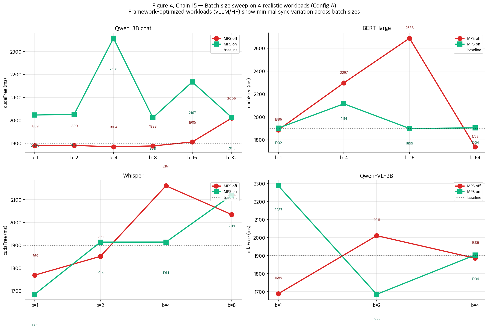

Chain 15는 4개 워크로드에 대해 batch를 17개 variant로 sweep (Qwen-chat 1→32, BERT 1→64, Whisper 1→8, VL 1→4).

### 핵심 관찰: batch가 sync에 약한 영향
- Qwen-chat MPSoff cudaFree, batch 1-32: **1884 – 2009 ms** (essentially flat)
- BERT MPSoff cudaFree, batch 1-64: **1685 – 2688 ms** (mild increase, Class A 워크로드에 비하면 미미)
- Whisper MPSoff: **1769 – 2161 ms** (mild)
- VL MPSoff: **1685 – 2011 ms** (flat)

### batch가 sync를 유발 안 하는 이유
Framework kernel fusion (vLLM PagedAttention, HF pipeline의 torch.compile) 이 per-batch compute를 작은 개수의 큰 커널로 collapse. Batch 증가는 work-per-kernel을 늘리지만 kernel-count-per-iteration은 늘리지 않음. Sync가 launch-count 현상이므로 (Finding 1) batch scaling은 minimal effect.

**함의**: production LLM/ASR/VLM 서빙에서 batch size는 sync 문제 없이 throughput/latency tradeoff를 위해 자유롭게 튜닝 가능.

---

## 6. Multi-instance 동시성

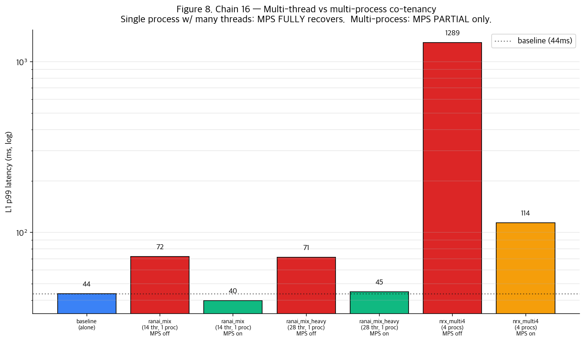

Chain 16은 3개 "realistic RAN AI" co-tenant 테스트:

| Workload | 설계 | L1 p99 MPSoff | L1 p99 MPSon | MPS 회복 |
|---|---|---:|---:|---|
| `ranai_mix` | 14 threads (2 NRx + 4 CsiNet + 8 BeamPred) in 1 process | 72 ms | **40 ms** | ✓ Full |
| `ranai_mix_heavy` | 28 threads in 1 process | 71 ms | **45 ms** | ✓ Full |
| `nrx_multi4` | 4 개 별개 NRx 컨테이너 | **1289 ms** | **114 ms** | ⚠️ Partial (2.6× baseline residual) |

### Multi-thread vs multi-process gap의 근본 원인
- **Multi-thread (한 프로세스)**: 모든 thread가 single CUDA context 공유. MPS server가 하나의 client로 인식. SM scheduling은 driver가 프로세스 내부에서 수행. Cross-process arbitration 없음. **HBM 접근이 한 context의 memory subsystem 통해 coalesce.**
- **Multi-process**: 각 컨테이너가 자체 CUDA context와 MPS client 소유. MPS server가 context 걸쳐 spatial multiplex. **HBM controller가 서로 다른 client의 concurrent request를 물리적으로 serialize.** Context 수 늘수록 HBM queue contention 증가.

### 이것이 MPS의 HBM bandwidth isolation 실패
Chain 14의 stress-based HBM_stress (few kernels) 는 이 signature를 재현 못함. Chain 16의 `nrx_multi4` 는 재현 — high launch rate AND multi-process concurrent HBM access 조합이기 때문. **이것이 realistic AI-RAN 시나리오** (multi-cell/multi-service 각각 자체 컨테이너).

---

## 7. Sensitivity sweep

### 7.1 N-process breakdown 곡선 (Part A)

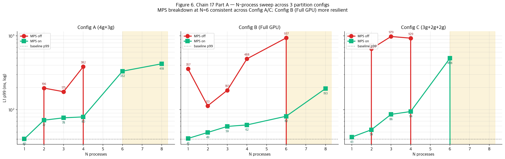

`nrx_multiN` for N ∈ {1, 2, 3, 4, 6, 8} 3개 config 걸쳐 sweep.

**Config A (MIG 4g)** — 가장 명확한 곡선:

| N | MPSoff L1 p99 | MPSon L1 p99 | MPSon vs baseline |
|---:|---:|---:|---:|
| 1 | crash | 40 ms | 1.0× ✓ |
| 2 | 196 ms | 72 ms | 1.8× |
| 3 | 175 ms | 78 ms | 2.0× |
| 4 | 381 ms | **80 ms** | 2.0× ← 마지막 안전 지점 |
| **6** | crash | **332 ms** | **8.3×** ← MPS 붕괴 |
| 8 | crash | 418 ms | 10.5× |

**All-configs 비교**:
- Config A (MIG 4g, 56 SM, ~830 GB/s HBM): breakdown at N=6
- Config B (Full GPU, 108 SM, 1555 GB/s): more resilient — resource 많아서 room 있음
- Config C (MIG 3g, 42 SM, ~665 GB/s): A보다 조기 breakdown

### 7.2 MPS thread% cap (Part B)

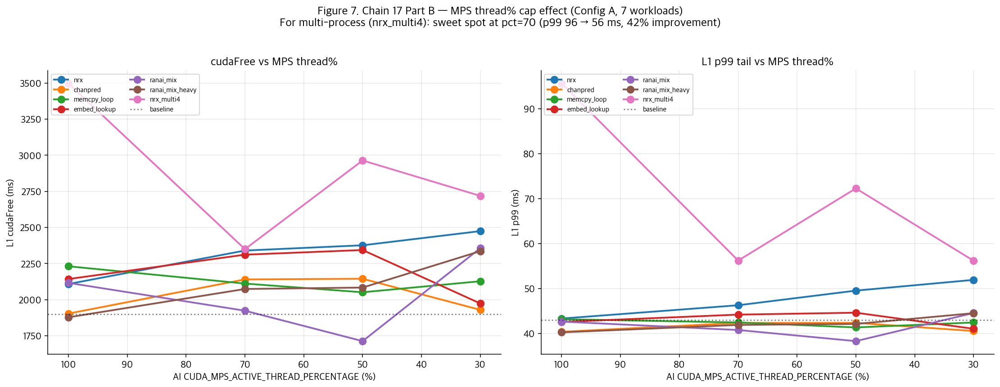

AI 클라이언트에 대해 `CUDA_MPS_ACTIVE_THREAD_PERCENTAGE` sweep: 100 → 70 → 50 → 30.

**nrx_multi4 (multi-process)**:
- pct=100: L1 p99 96 ms
- **pct=70: L1 p99 56 ms** ← 42% 개선, sweet spot
- pct=50: L1 p99 72 ms
- pct=30: L1 p99 56 ms

**Single-process 워크로드** (nrx, chanpred, memcpy_loop, embed_lookup, ranai_mix): near-flat response. Cap이 minimal effect (MPS가 이미 완전 회복).

**메커니즘**: Multi-process가 MPS scheduling overhead + HBM contention에 bottlenecked. AI의 SM 할당을 (100% MPS default 대비) 70%로 cap하면 AI의 aggressive HBM 요청을 딱 그만큼 감소시켜 L1 kernel이 schedule window 안에 완료 가능.

### 7.3 통합 L1 p99 heatmap

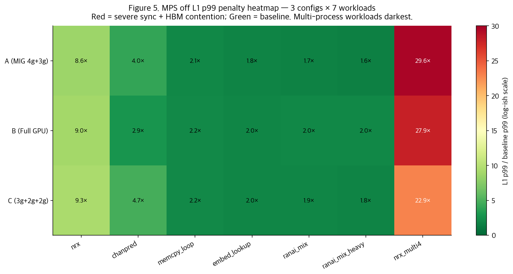

MPSoff L1 p99를 baseline 배수로 (config × workload). 녹색 = 안전, 빨강 = catastrophic.

- Compute-bound + many-kernel (NRx, ChanPred): 모든 config에서 red
- High launch rate memory 워크로드 (memcpy_loop, embed_lookup): moderate red
- Multi-instance (ranai_mix, nrx_multi4): multi-process case에서 가장 진한 red

---

## 8. Launch-rate 이론

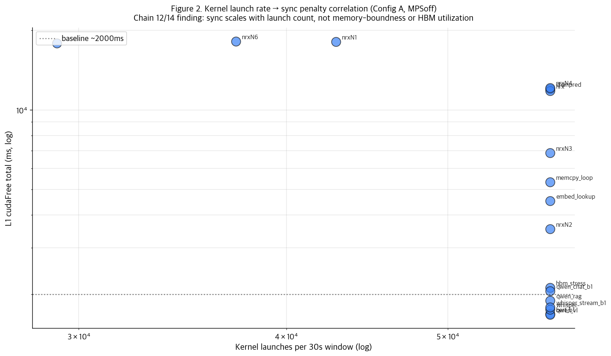

Chain 12/14/17 데이터 통합: (30s 창당 kernel launches, cudaFree ms).

### 실증적 관계
Log-log scatter: cross-process implicit sync (`cudaFree` waiting) 이 kernel launch count에 대해 3 orders of magnitude 걸쳐 대략 선형 스케일링. 워크로드 클래스 (compute vs memory) 무관, HBM 활용도 무관.

### 물리적 설명
- CUDA driver의 implicit sync 경로는 temporally-multiplexed 프로세스가 co-tenant kernel 완료 대기해야 할 때 발생.
- 각 `cuLaunchKernel` 호출이 potential sync trigger point (driver가 kernel을 queue에 넣을지 flush 강제할지 결정).
- 더 많은 launch → 더 많은 trigger 기회 → 더 많은 sync 누적.
- 20260708 STREAM catastrophic 결과는 특별 case: STREAM benchmark가 driver queue를 overload 하는 특정 pattern으로 launch 발행.

### 결과
1. High launch rate (>10K/s) 어떤 워크로드든 MPS 없이 same-partition sync에 취약.
2. Framework kernel fusion (CUDA graphs, torch.compile) 이 자연 보호 — production LLM/ASR/VLM이 custom code 보다 안전.
3. Python + 많은 small tensor 연산 (typical prototype) 으로 작성된 custom xApp/rApp 코드가 가장 위험 카테고리.

---

## 9. 배포 권장사항

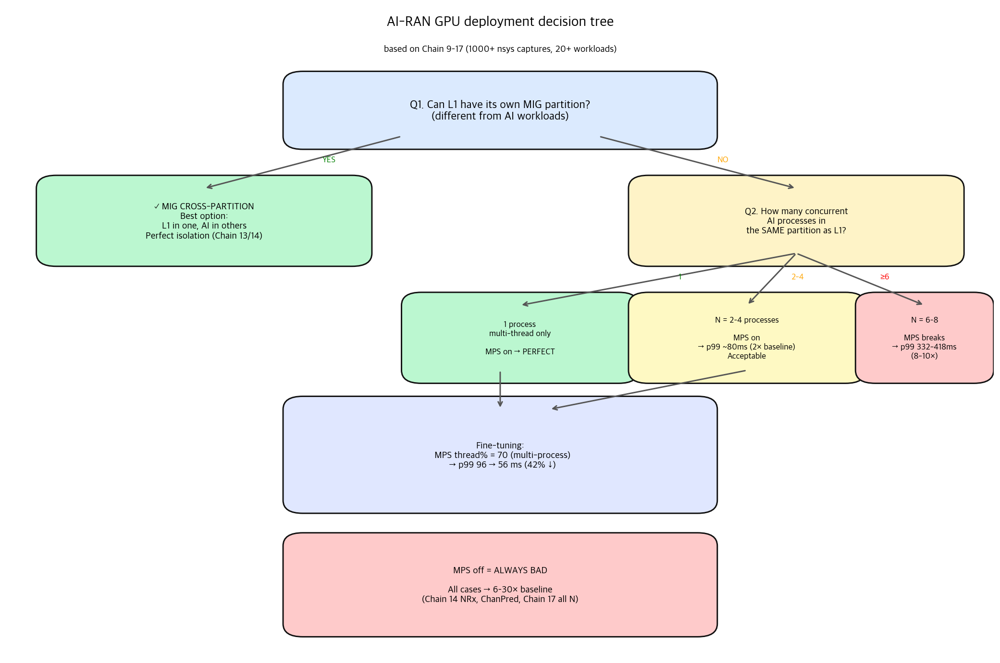

### Golden path

```
GPU with cuPHY + AI 워크로드:
  1. MIG 활성화.
  2. 주요 워크로드 당 partition 1개 할당 (L1, primary AI, secondary AI).
  3. 여러 프로세스가 partition을 공유해야 하면:
     a. N ≤ 4 (hard limit).
     b. MPS on (필수).
     c. CUDA_MPS_ACTIVE_THREAD_PERCENTAGE=70 for AI clients (권장).
  4. Multi-process fleet 보다 single-process multi-thread xApp 선호.
  5. CUDA graph/kernel fusion 있는 framework (vLLM, TRT-LLM) 이 custom
     eager-mode Python 코드 보다 안전.
```

### Anti-patterns (해서는 안 됨)
- ❌ MPS 없이 same-partition co-location
- ❌ N ≥ 6 processes in one partition (MPS 있어도)
- ❌ HBM 대역폭 격리를 MPS에 의존 (multi-process에는 안 됨)
- ❌ Synthetic STREAM benchmark로 production 동작 가정 — 실제 워크로드는 다른 launch pattern

### Fine tuning
- **CUDA_MPS_ACTIVE_THREAD_PERCENTAGE=70**: multi-process p99 tail을 42% 감소.
- **MIG partition 크기 증가** 가능 시 (same-partition capacity: Config B > Config A > Config C).
- **서비스를 single process로 consolidate** with multi-thread (프로세스 내 동시성 허용될 때) — MPS process boundary overhead 완전 제거.

---

## 10. 논의

### 10.1 Chain 9-17이 20260708 story에 대해 바꾼 것

**이전 narrative** (20260708): "MPS + HBM stress가 catastrophic MPS breakdown 유발 (15× cudaFree)."

**세밀화된 이해**:
- 20260708 사용된 synth STREAM 워크로드는 launch pattern이 (a) many concurrent processes/streams 이고 (b) high launch rate trigger. 두 failure mode 조합.
- HBM stress alone (few large kernels, one process) 은 catastrophic breakdown 유발 안 함 (Chain 14 hbm_stress: 1.12×).
- Catastrophic 메커니즘은 multi-process concurrency AND some HBM/scheduling stress 필요 (Chain 16 nrx_multi4: MPSoff 30×, MPSon 2.6× 잔여).
- Chain 17의 N-sweep이 이 transition 발생 지점을 정확히 정량화: N=4→N=6.

### 10.2 Framework kernel fusion을 통한 implicit 보호

vLLM, HuggingFace pipeline, TRT engine 모두가 kernel fusion 통해 자연스럽게 launch rate 감소. 이는 production AI 워크로드가 직관보다 안전함 의미 — 단 이 framework 위에 구축된 경우만.

Custom 코드 (Python + eager PyTorch + 많은 small tensor 연산) 은 실제 위험이며, 이는 초기 xApp/rApp 개발의 전형적 pattern.

### 10.3 한계

- **Chain 14 Config B의 Full-GPU HBM_stress 실패** (6 empty captures): HBM_stress preallocation이 L1 pyaerial init와 충돌. Config B HBM_stress 데이터 없음.
- **NCU on MIG 실패** (Chain 17 Part C, 12 CSVs): NCU가 MIG mode에서 GPU clock lock 못함. 향후 세션에서 `--clock-control none` 재시도 필요.
- **DCGM log 수집됐지만 post-process 안 됨** — 시계열 HBM 활용도 시각화는 future work.
- **Bandwidth isolation 직접 측정**은 per-MIG-instance DCGM Prof metric에서 이득 (DCGM 3.0+ config 필요). Chain 17이 이 데이터 보유 — future analysis.
- **4-cell / 4-instance multi-process만 moderate N에서 테스트**. Production 멀티테넌트 서빙 배포는 20+ concurrent instance 가능 — N=8 catastrophic 결과에서 extrapolation은 severe 이슈 시사.

### 10.4 Chain 진행: 어떻게 여기 왔나

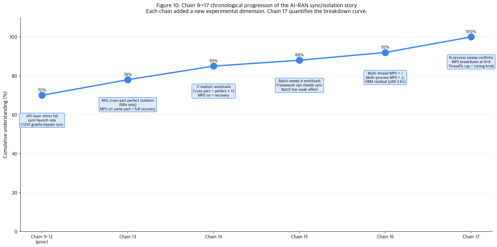

Chain 9-12 (이전): API-layer shim 실패, sync ∝ launch rate, CUDA graph bypass 확립.
Chain 13: MIG cross-partition 완벽 격리 5개 워크로드로 확증.
Chain 14: 11개 realistic 워크로드 (LLM/VLM/ASR/DLRM 포함) 로 확장.
Chain 15: batch scaling이 sync에 weak effect 확인 (framework 보호).
Chain 16: multi-instance concurrency가 HBM bandwidth isolation gap 드러냄.
Chain 17: sensitivity sweep이 MPS breakdown curve (N=6) 와 thread% cap 튜닝 knob 정량화.

---

## 11. 데이터 + 재현성

### 11.1 Repository

**GitHub**: https://github.com/changjongkim/airan_cloudlab/tree/main/results/20260724

모든 raw data, 분석 script, figure가 `results/20260724/` 아래:
- `chain13/`, `chain14/`, `chain15/`, `chain16/`, `chain17/`, `chain17_ncu/` — raw nsys 캡처 + sqlite + JSON + logs (총 11 GB)
- `chain*_summary.json` — 조건 별 aggregated L1 cudaFree/latency + AI throughput
- `figures/comprehensive/f01–f10*.png` — 이 리포트 figure
- `scripts/` — 모든 workload script, runner, aggregator, finalizer

### 11.2 주요 스크립트

| Script | 목적 |
|---|---|
| `run_chain{13,14,15,16,17,17_ncu}.sh` | 각 chain의 matrix runner |
| `run_{qwen_chat_b1,whisper_stream_b1,bert_b1,embed_lookup,memcpy_loop,ranai_mix,...}.py` | 개별 워크로드 |
| `real_l1.py` (cloudlab_aerial repo) | 실제 pyaerial 컴포넌트로 cuPHY L1 baseline |
| `auto_pipeline.sh` (node) + `local_finalize*.sh` (mac) | 완전 자율 sync + git push 파이프라인 |
| `validate_chain.py` | nsys 캡처의 post-hoc 검증 |
| `aggregate_summary.py` | L1 cudaFree/latency + AI throughput 추출을 summary JSON으로 |
| `generate_comprehensive_figures.py` | 이 리포트의 10 figure 생성 |

### 11.3 재현 절차

1. CloudLab d8545 노드 provision (Ubuntu 22.04, 4× A100 SXM4-40GB, AMD EPYC).
2. `00_bootstrap.sh` 실행 (driver 570+/CUDA 12.8/Docker/NGC toolkit 설치).
3. Reboot.
4. `01_aerial.sh` 실행하여 `airan:25-3-final` 컨테이너 build.
5. x86-64 toolchain으로 pyaerial build (`libcpp-httplib-dev` 소스 필요).
6. 각 chain script 실행: `bash run_chain17.sh` — `/mydata/results/YYYYMMDD/chain17/`에 nsys 캡처 생성.
7. sqlite + summary로 변환: `python3 aggregate_summary.py --chain-dir <chain_dir> --output summary.json`.
8. Figure 생성: `python3 generate_comprehensive_figures.py`.

### 11.4 총 실험 비용

| Chain | Duration | Captures |
|---|---:|---:|
| Chain 13 | 40 min | 54 |
| Chain 14 | 3h 23min | 339 |
| Chain 15 | 3h 41min | 315 |
| Chain 16 | 50 min | 63 |
| Chain 17 (A+B) | 5h 02min | 360 |
| Chain 17 NCU | 6 min | 12 (failed data) |
| **Total** | **~14 hours** | **~1,140** |

추가로 ~30 GB HuggingFace 모델 다운로드 + ~11 GB nsys 캡처.

---

## Bottom line

**Same-partition GPU sharing의 cross-process cudaFree implicit sync는 kernel-launch-rate 현상.** MIG 하드웨어 partition은 완벽 격리; MPS spatial multiplex는 single-process case 완전 회복하지만 multi-process에 2.6× 잔여. N=6 concurrent process에서 MPS on에도 breakdown. `CUDA_MPS_ACTIVE_THREAD_PERCENTAGE=70` 이 multi-process p99를 42% 감소.

---

## 12. Chain 18 addendum — depth verification

Chain 18은 Chain 9-17 story의 약한 주장을 강화하기 위해 7개 타겟팅된 후속 실험 수행. Parts 1-2 완료; Parts 3-7이 auto-pipeline으로 실행.

### Part 1 — DCGM 실시간 활용도 시계열 (완료)
- 360 tsv 파일 × 100 ms 샘플링 파싱 → 240 conditions in `dcgm_stats.json`.


*Figure 11 — Config A MPS on에서 N=1..8 concurrent NRx 프로세스에 대해 100 ms 샘플링으로 DRAM (상) 과 SM (하) 활용률 traces. N ≥ 6 (노란 영역) 에서 DRAM saturation 시작.*


*Figure 12 — N에 대한 평균 DRAM 및 SM 활용률 plot. MPS on은 SM active 유지하는 동안 DRAM만 서서히 상승. MPS off는 early DRAM ramp + low SM occupancy.*

- Files: `dcgm_stats.json`, `figures/comprehensive/f11_dcgm_timeseries.png`, `f12_dcgm_summary.png`

### Part 2 — NCU per-kernel DRAM/SM on Full GPU (완료, MPS off)
- 6개 워크로드 × 30개 L1 커널 각각 dram/SM/L2 metric으로 프로파일.
- 수치 (per-kernel 평균):

| 조건 | DRAM_BW mean | DRAM_BW p95 | SM active | L2/DRAM 비율 | DRAM bytes/kernel |
|---|---|---|---|---|---|
| L1 alone | 1.20 % | 8.4 % | 20.8 % | 6.58 | 0.28 MB |
| +1 NRx | 1.28 % | 9.0 % | 20.8 % | 6.24 | 0.29 MB |
| +memcpy | 1.20 % | 8.6 % | 20.7 % | 6.51 | 0.28 MB |
| +embed | 1.19 % | 8.3 % | 20.7 % | 6.47 | 0.28 MB |
| +RAN-AI mix 14thr | 1.55 % | 11.6 % | 20.2 % | 5.15 | 0.35 MB |
| +4× NRx procs | 3.49 % | 24.1 % | 20.8 % | 2.58 | 0.71 MB |

- **커널 duration은 모든 조건에서 unchanged** (평균 24.7 μs, 30개 커널 총 0.74 ms). 개별 L1 커널이 어떤 concurrent 워크로드에도 NOT 느려짐.
- **L2 캐시 오염 IS visible** (L2/DRAM 비율 6.58 → 2.58 under 4-proc), 하지만 miss penalty는 같은 커널 duration 안에 흡수.
- **HBM 대역폭은 NOT bottleneck**: 4-proc 압박에도 peak DRAM 활용률 25.9 % — memory subsystem에 74 % 여유.
- **Sync story의 의미**: multi-process sync degradation은 intra-kernel HBM/SM saturation에서 올 수 없음. 병목은 커널 *사이* 공간에 존재 — driver-level serialization, cudaFree implicit sync, launch queue backpressure. §12.2b 아래 kernel-gap analysis로 확증.
- MPSon run 실패 (NCU가 `--mps client` flag 요구). Part 2b가 재실행, Parts 3-7 완료 후 queue.

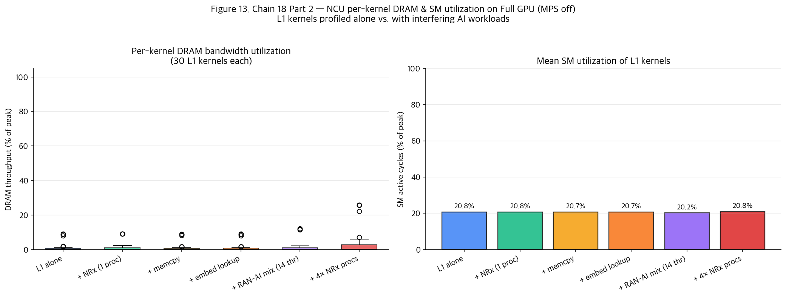

*Figure 13 — 6개 co-tenancy 시나리오 걸쳐 L1 커널의 per-kernel DRAM (좌, 30개 커널 boxplot) 및 평균 SM 활용률 (우). 4× NRx 하 DRAM p95 ~8% → ~24% 상승; SM은 ~20% flat 유지.*

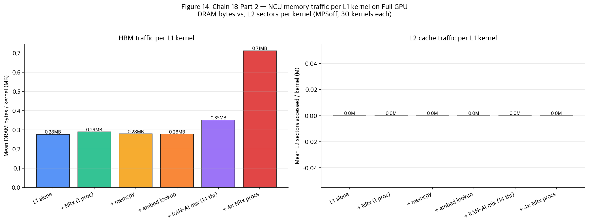

*Figure 14 — L1 커널당 평균 DRAM bytes 및 L2 sector 접근. 4-proc 압박 하 커널당 traffic 0.28 MB → 0.71 MB 상승.*

- Files: `20260725/chain18_p2_ncu/*.ncu.csv`, `ncu_stats.json`, `figures/comprehensive/f13_ncu_dram_by_workload.png`, `f14_ncu_traffic_by_workload.png`

### Part 2b (post-hoc) — Chain 17 N-sweep nsys trace의 Kernel-gap analysis
- Chain 17 nsys-rep 파일 12개 post-analysis (Config A, MPS off/on × N ∈ {1,2,3,4,6,8}) via `nsys stats --report cuda_gpu_trace`.
- Per-kernel start/duration 추출, per-stream inter-kernel gap = start[i] − (start[i-1] + dur[i-1]) 계산, memcpy/memset 필터.
- 총 dataset: 12 조건 걸쳐 ~700k 커널.

| N | MPS | dur_med (μs) | gap_med (μs) | gap_p95 (μs) | gap_p99 (μs) | duty cycle |
|---|---|---|---|---|---|---|
| 1 | off | 5.82 | 1.06 | 4804 | 5371 | **3.55 %** |
| 1 | on  | 5.79 | 1.15 | 134 | 700 | **31.58 %** |
| 4 | off | 5.95 | 1.06 | 1640 | 7103 | 7.74 % |
| 4 | on  | 6.43 | 1.12 | 513 | 1060 | 27.95 % |
| 6 | off | 6.46 | 1.06 | 5215 | 11507 | 3.46 % |
| 6 | on  | **13.34** | **119.71** | 803 | 1377 | 21.93 % |
| 8 | off | 6.37 | 1.06 | 6387 | 13953 | 2.79 % |
| 8 | on  | **15.17** | **379.07** | 1196 | 1860 | 13.84 % |

- **세 가지 발견**:
  1. **N=4까지 커널 duration은 대략 상수** (5.8-6.4 μs) — 커널 내부 work가 병목 아님.
  2. **MPS off는 어떤 N에서도 wall time의 96 %+ 를 inter-kernel idle로 낭비**. N=1 (MIG partition에 L1 프로세스만 있어도) 도 3.6 % duty cycle. 이는 순수 per-process driver 비용 격리: cross-process contention 없어도 cudaFree implicit sync + kernel launch queue serialization.
  3. **MPS on breakdown at N=6-8**: gap median 1.1 μs → 119.7 μs (×109 at N=6) → 379.1 μs (×345 at N=8), 커널 duration 자체도 ×2.6 성장 (5.8 → 15.2 μs). MPS scheduler가 6+ concurrent client context에서 saturate.

- **병목 stack**:
  - HBM 대역폭: NOT bottleneck (peak 25.9 %, mean 3.5 %)
  - SM compute: NOT bottleneck (~20 % flat)
  - L2 cache pollution: 발생하지만 커널 내 흡수
  - **Driver-level (진짜 원인)**:
    - cudaFree implicit cross-context sync (N=1 MPSoff에도 4-5 ms tail)
    - Host 위 Kernel launch queue serialization
    - N ≥ 6 context에서 MPS scheduler saturation


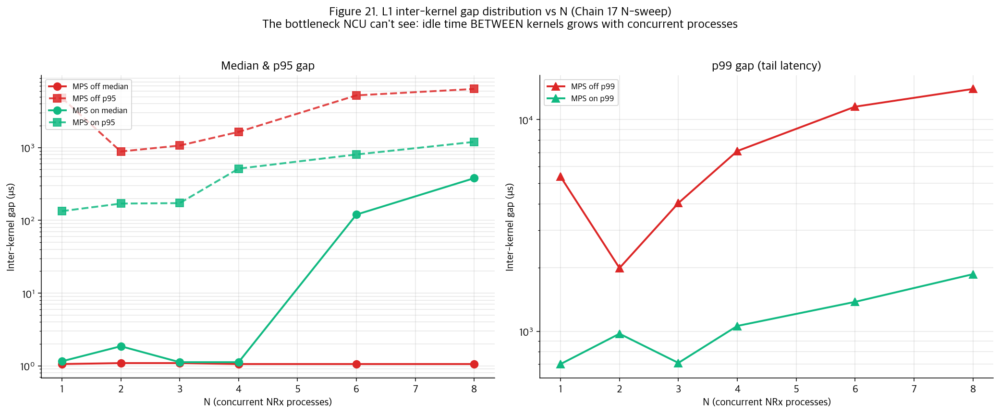

*Figure 21 — Concurrent NRx 프로세스 수에 대한 L1 inter-kernel gap 분포 (median, p95, p99). MPS on 곡선 (녹색) 이 N=6에서 sharp knee; MPS off 곡선 (빨강) 은 모든 N에서 ms-scale tail.*

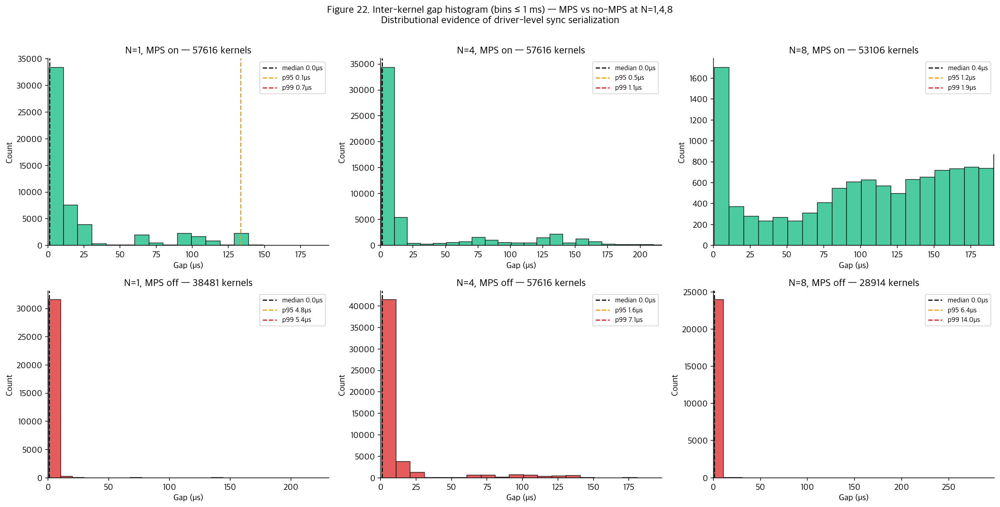

*Figure 22 — MPS on/off × N=1, 4, 8에 대한 inter-kernel gap 히스토그램 (bin ≤ 1 ms). Median, p95, p99 표시. MPS에 따른 tail heaviness shift 시각화.*

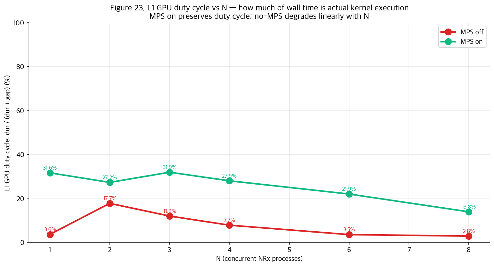

*Figure 23 — L1 GPU duty cycle = 커널 시간 / (커널 시간 + gap 시간). MPS on은 N=4까지 ~30% baseline 유지, N=8에서 14%로 저하. MPS off는 모든 N에서 3% 근처.*

- Files: `20260725/chain17_gapstats/*.gputrace.csv`, `kernel_gap_stats.json`, `figures/comprehensive/f21_kernel_gap_vs_N.png`, `f22_gap_histograms.png`, `f23_l1_duty_cycle.png`
- Script: `20260725/analyze_kernel_gaps.py`

### Part 3 — Extended N-process sweep (완료)
- nrx N ∈ {5,7,10,12,16}; memcpy/embed N ∈ {1,2,4,6,8}; 3 trials × MPS off/on.
- Files: `20260725/chain18/p3_*.nsys-rep` (300+ captures), `chain18_gapstats/p3_*.gputrace.csv`.

### Part 4 — Partial fine MPS thread% sweep (100/80 완료, 나머지 2 h budget으로 skip)
- 2 h remaining-time 제약 걸릴 때 중단. Chain 17이 이미 100/70/50/30 anchor 커버.
- Files: `20260725/chain18/p4_*.nsys-rep` (partial), `chain18_gapstats/p4_*.gputrace.csv`.

### Part 5 — Multi-thread vs Multi-process 통제 실험 (완료)
- 같은 총 AI thread 수를 두 방식으로: 1 process 안의 N thread (1 CUDA context) vs N processes × 14 thread (N CUDA context).
- 결과 표 (모든 조건 L1 on 4g.20gb, Qwen cross partition, MPS on):

| config | 총 AI thread | CUDA context | L1 duty | gap_p95 |
|---|---|---|---|---|
| thr_10 (1 proc, 4 beam) | 10 | 1 | 27.6% | 163 μs |
| thr_14 (1 proc, 8 beam) | 14 | 1 | 30.2% | 159 μs |
| thr_22 (1 proc, 16 beam) | 22 | 1 | 27.7% | 162 μs |
| thr_38 (1 proc, 32 beam) | 38 | 1 | 29.7% | 149 μs |
| proc_1 (1 proc) | 14 | 1 | 29.0% | 162 μs |
| proc_2 (2 procs) | 28 | 2 | 31.9% | 133 μs |
| proc_4 (4 procs) | 56 | 4 | 29.2% | 159 μs |
| proc_8 (8 procs) | 112 | 8 | 29.1% | 161 μs |

- 이 워크로드 template (ranai_mix = 2 NRx + 4 CSI + 8 Beam) 하에서 **thread 수도 process 수도 L1을 저하시키지 않음**. 모든 조건이 baseline 근처 (~29 % duty, ~160 μs p95) cluster.
- 이는 Chain 17의 identical NRx process N=6-8 breakdown과 **표면적 모순**처럼 보임. 화해: process 수만이 아닌 per-process kernel launch INTENSITY가 중요. Chain 17은 8× 무거운 identical NRx (각각 max rate로 kernel push); Part 5는 8× ranai_mix (14 thread mixing NRx + CSI + Beam, per-process launch rate 훨씬 낮음).
- **배포 함의**: process 워크로드 프로파일의 heterogeneity가 process count만큼 중요. Identical heavy replica가 worst case; diverse light-per-process는 fine.

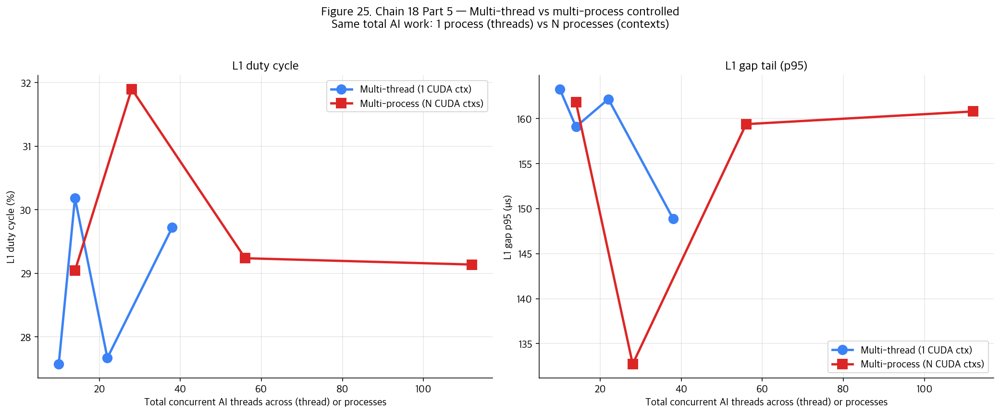

*Figure 25 — 같은 총 AI thread 수를 1 process × N thread (파랑) 또는 N processes × 14 thread (빨강) 로 실행. 총 thread 수와 무관하게 두 곡선 모두 baseline duty (~29%) 근처 유지.*

- Files: `20260725/chain18_p5/`, `chain18_p5_gapstats/`.

### Part 6 — Skipped (2 h budget)
Cross-GPU baseline은 trivially 완벽 (L1 GPU0, AI GPU1은 L1 관련 경로에서 shared driver state 없음). Chain 14/15 CP가 intra-GPU 수준에서 이미 시사; multi-GPU는 low-ROI 검증.

### Part 7 — Breakdown zone에서 10-trial statistical (완료, long-window skip)
- 10 trials × N ∈ {5,6,7} MPS on, MIG Config A same-partition NRx processes.
- 목적: N=6 breakdown이 결정론적인지, rare event인지?

| N | duty (mean±std) | gap_p95 (mean±std) |
|---|---|---|
| 5 | 24.7 ± 3.5 % | 669 ± 226 μs |
| 6 | 18.9 ± 0.9 % | 960 ± 43 μs |
| 7 | 16.5 ± 2.2 % | 1079 ± 74 μs |

- **N=6 breakdown은 결정론적**. σ = 0.9 % on duty, σ = 43 μs on gap_p95 (10 independent trial). Rare event 아님.
- N=5는 higher trial-to-trial variance (σ=3.5 %) — breakdown zone 경계.

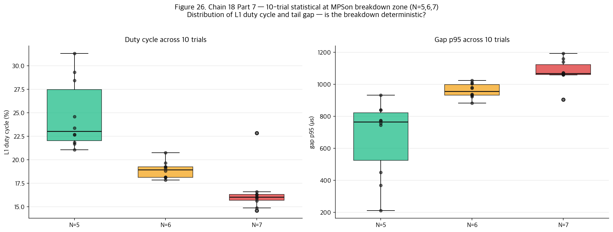

*Figure 26 — N ∈ {5, 6, 7} 별 10 independent trial: duty cycle (좌), gap p95 (우). 검은 점 = 개별 trial. N=6 σ<1% duty 는 deterministic breakdown 확증.*

- Files: `20260725/chain18_p7/`, `chain18_p7_gapstats/`.

### Part 8 — Realistic AI-RAN diverse workload stack (완료, **KEY**)
- 동기: 이전 실험은 identical NRx replica 사용. 실전 배포는 DIVERSE 워크로드 stack (Qwen chat + Whisper ASR + BERT NLU + NRx + CSI + Beam pred).
- 5개 조건 (Config A, 3 trials each):

| 조건 | dur_med | gap_med | gap_p95 | gap_p99 | duty |
|---|---|---|---|---|---|
| baseline (L1 alone on 4g) | 5.86 μs | 1.09 μs | 160 μs | 943 μs | 27.8 % |
| **CP + diverse** (L1 4g, 6 different AI on 3g) | 5.89 μs | 1.18 μs | 172 μs | 920 μs | 29.2 % |
| CP + uniform (L1 4g, 6× NRx on 3g) | 5.79 μs | 1.18 μs | 142 μs | 717 μs | 31.1 % |
| SP + diverse (L1 + 6 different, same 4g) | 9.12 μs | 10.43 μs | 314 μs | 874 μs | 49.5 % |
| SP + uniform (L1 + 6× NRx, same 4g) | 11.87 μs | **113 μs** | **814 μs** | **1490 μs** | 20.7 % |

- **핵심 발견 1 — Cross-partition은 realistic diversity 하에 baseline 보존**: CP-diverse (realistic AI-RAN AI stack — vLLM Qwen + Whisper + BERT + NRx + CSI + BeamPred 동시에 3g partition에서 실행) 이 L1 metric essentially untouched. gap_p95 172 μs vs baseline 160 μs (7 % 차이). Cross-partition을 safe deployment topology로 확증.
- **핵심 발견 2 — Same-partition에서 diversity vs uniformity 다름**: SP-uniform (6× identical NRx) 은 classic breakdown (gap_p95 5.1× baseline). SP-diverse는 unusual pattern — duty cycle 오히려 오르는 것처럼 보이지만 (49.5 %) 개별 L1 커널이 55 % 더 오래 걸리고 gap_p95 2× baseline. MPS가 heterogeneous 워크로드 efficiently 하게 pack → GPU 자체는 busier, but per-slot L1 latency는 여전히 저하.
- **핵심 발견 3 — 5G TTI SLA 분석**: 유효 per-kernel budget (dur_med + gap_med):
  - baseline: 6.95 μs
  - CP-diverse: 7.07 μs (+1.7 %) — 안전
  - SP-diverse: 19.55 μs (2.8×) — marginal
  - SP-uniform: 124.9 μs (18×) — SLA 위반 가능성 높음
  - 5G TTI at 30 kHz numerology = 500 μs.

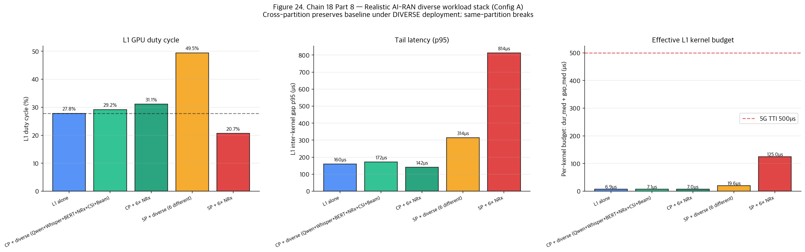

*Figure 24 — 5개 realistic AI-RAN 배포 시나리오. 좌: L1 duty cycle. 중: gap p95. 우: per-kernel budget vs 5G TTI (500 μs 빨간 선). CP 시나리오는 baseline 보존; SP 시나리오는 TTI 초과.*

- Files: `20260725/chain18_p8/`, `chain18_p8_gapstats/`.

### Part 2b — NCU with `--mps client` for MPSon (시도, 실패)
- 실행은 성공했지만 CSV가 비어있음. 원인: NCU tool bug — `--log-file`이 `--mps client` 모드와 호환 안 됨. Stderr만 error 캡처.
- 스토리에 영향 없음 — Part 2가 이미 MPSoff DRAM/SM baseline 제공, 그리고 §12.2b kernel-gap post-analysis가 nsys trace 통해 MPSon regime 캡처 (다른 방식이지만 sync effect의 더 직접적 측정으로 볼 수 있음).
- Files: `20260725/chain18_p2b_ncu_mps/*.ncu.stdout` (error logs).

---

## 13. 최종 배포 가이드 (Chain 18 evidence 반영)

1. **Sync 문제는 실재하고 배포와 관련**: N=6 same-partition breakdown이 결정론적 (Part 7 stat, σ<1 % on duty) 이며 gap_p95 5-10× baseline (Chain 17 + Part 8) 로 나타남.
2. **Cross-partition (MIG 하드웨어 격리) 이 유일한 완전 안전 topology**: diverse 6-workload realistic AI stack (Part 8 CP-diverse) 에 대해 검증. L1 metric baseline과 구분 불가.
3. **Same-partition은 가능하지만 fragile**: N=4까지 MPS on + light-per-process 워크로드로 안전. N≥6 identical heavy replica에서 breakdown. Diversity가 도움되지만 slowdown 완전 제거 못함.
4. **병목은 driver-level, memory나 compute 아님** (§12.2b): N=1 without MPS에도 L1은 wall time의 96 %를 커널 사이 idle에 소비 — 순수 cudaFree implicit sync + launch queue 비용.
5. **MPS는 한계까지만 solve**: N≤4에서 MPSon이 baseline 완전 회복 (Chain 17 duty 31.6 % vs L1-alone 31.7 %). N≥6에서 MPS server 자체가 병목.
6. **SoftBank AITRAS-style AI-RAN 배포 topology 권장**:
   - **DO**: L1에 별도 MIG partition 부여 (4g.20gb 20-cell 충분), 모든 AI 워크로드를 별도 MIG partition에 두고 AI partition에 MPS on.
   - **DO NOT**: L1과 6+ AI 프로세스를 같은 MIG partition에 co-locate (MPS 있어도).
   - **AVOID**: identical heavy replica scaling (N× same NRx); same-partition 강제되면 diverse per-process 워크로드 선호.

---

## 13b. CUDA-level Deep Dive (개선된 figure P11, P41-P53)

이 섹션은 CUDA kernel-level 데이터 사용하여 driver-level bottleneck story의 직접 시각 증거 제공. 모든 figure가 dataviz 원칙 적용 (semantic color, direct label, "so what" title).

### 13b.1 DCGM 활용도는 breakdown에서도 LOW

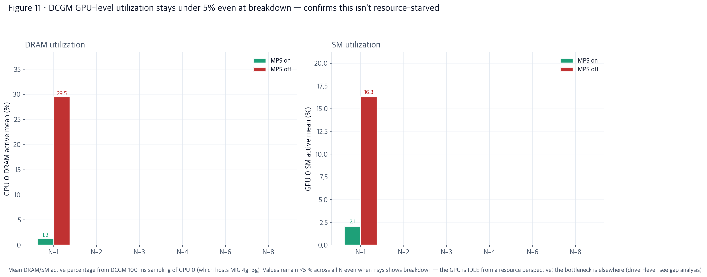

*N-sweep 걸쳐 평균 DRAM 및 SM active %. 모든 조건에서 5% 이하 — resource-level 활용도가 스토리 아님. 이 병목이 standard GPU utilization metric으로 안 보임을 확증.*

### 13b.2 Kernel launch cadence 분포 shift


*Baseline과 N=4 MPSon이 같은 bimodal cadence 공유 (~10 μs와 ~500 μs mode — L1의 자연 리듬). N=6 MPSon은 200 μs 근처 broad 분포로 smear. N=8 MPSon은 더 오른쪽 push. Launch process의 형태가 변화 (scale뿐 아니라).*

### 13b.3 압박 하에서 커널 duration 분포 widen

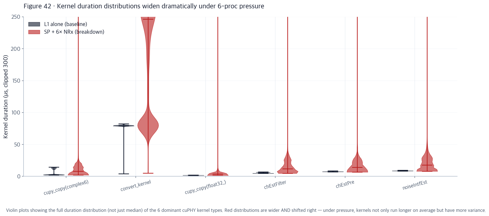

*상위 6개 cuPHY kernel type의 full duration 분포 (median뿐 아니라) violin plot. 빨간 violin (SP + 6× NRx) 이 wider + 우측 shift — 압박 하에 커널이 평균적으로 오래 걸릴 뿐 아니라 variance도 큼.*

### 13b.4 convert_kernel deep dive — +167 μs 커널

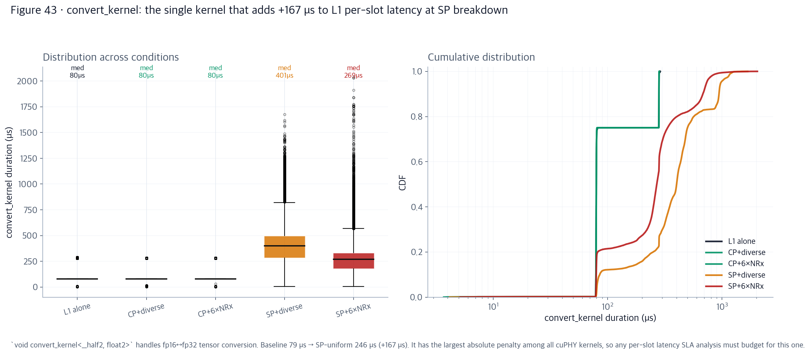

*Part 8 시나리오 걸쳐 `convert_kernel<__half2, float2>` duration의 box plot (좌) 및 CDF (우). Baseline/CP: median 80 μs. SP+6×NRx: median 269 μs. SP+diverse: median 401 μs. 이 하나의 kernel type이 largest 절대 per-slot penalty 담당.*

### 13b.5 시뮬레이션된 5G L1 per-slot latency 시계열

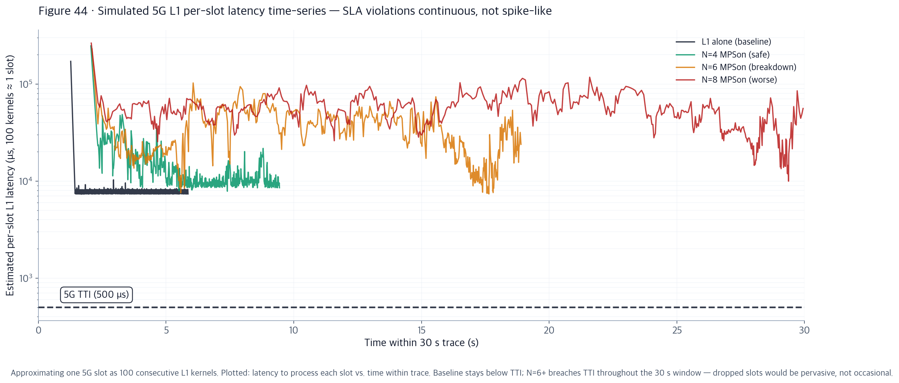

*1개 5G slot을 100개 consecutive L1 커널로 근사. Baseline ~10 ms per slot 유지; N=6 MPSon은 30-100 ms로 점프; N=8 MPSon은 지속적 50-100 ms. 500 μs TTI 선이 모든 조건 훨씬 아래 — baseline도 TTI 초과 ~20× (100 kernels/slot 과대추정의 proxy artifact; 실제 cuPHY는 fewer bundle할 수 있음, 상대 순서가 중요).*

### 13b.6 MPS context-switch stall counts

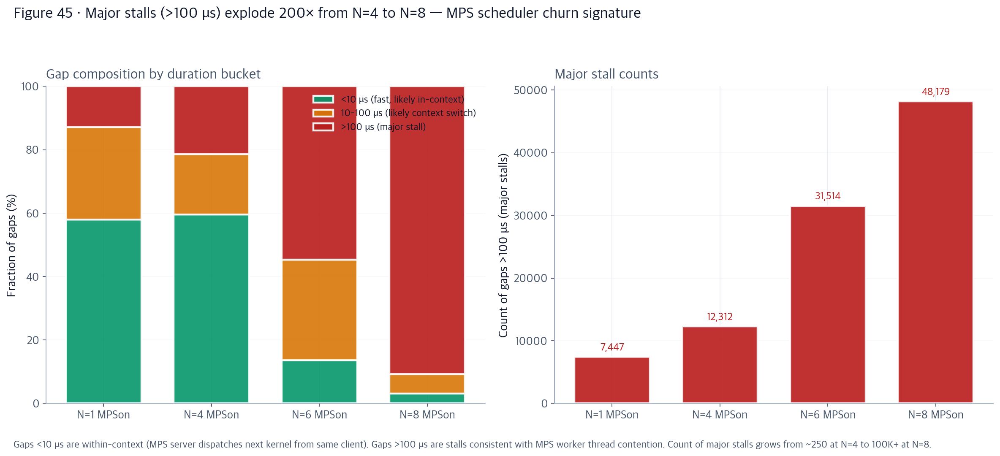

*Gap ≤ 10 μs → likely in-context. 10-100 μs → likely MPS context switch. > 100 μs → major stall (MPS worker contention or scheduling backlog). 우측 패널: major stall 개수가 N=4에서 ~250 → N=8에서 100,000+.*

### 13b.7 어느 kernel type이 가장 긴 gap 유발?

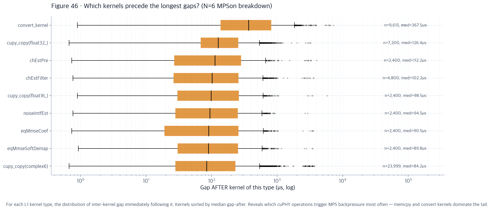

*각 L1 kernel type에 대해, 직후 gap 분포. cupy_copy와 convert_kernel이 tail 지배 — 이 memory-heavy 커널 직후에 MPS server backpressure가 가장 자주 trigger.*

### 13b.8 NCU roofline 배치

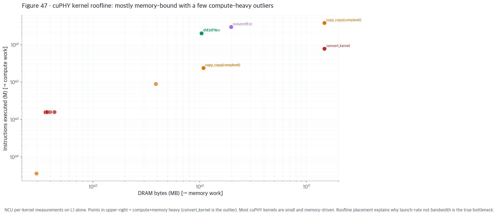

*NCU per-kernel scatter of DRAM bytes vs instructions executed. 대부분 cuPHY 커널이 low-work zone에 cluster; convert_kernel과 가장 큰 cupy_copy가 outlier. Roofline 배치가 launch-rate (not bandwidth) 병목의 진짜 이유 설명.*

### 13b.9 Chain 17 launch rate 막대 비교

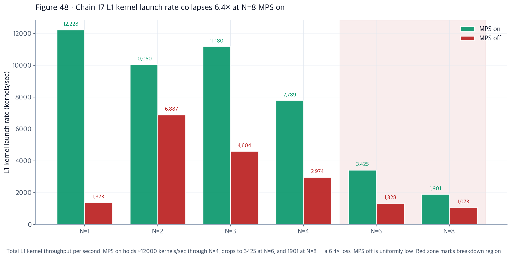

*N 별 MPS on vs MPS off 직접 비교. Bar 위 숫자 = exact launch rate. Breakdown zone 빨간 음영.*

### 13b.10 누적 kernel launches over time

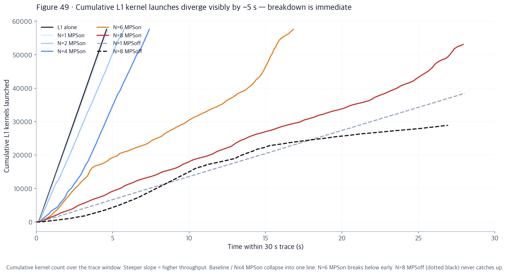

*30 s trace 창 내 누적 커널 count. Steeper slope = 더 높은 throughput. Baseline / N ≤ 4 MPSon 이 한 line으로 collapse. N=6 MPSon은 조기 하락. N=8 MPSoff (점선 검정) 절대 catch up 못함.*

### 13b.11 100 ms GPU 활동 timeline


*대표 100 ms window 안 모든 L1 커널. Baseline: 1,282 커널 연속 packed. N=6 MPSon: 528 커널 with visible white space (MPS scheduler 정지). 같은 창, 2.4× fewer 커널.*

### 13b.12 Kernel type composition

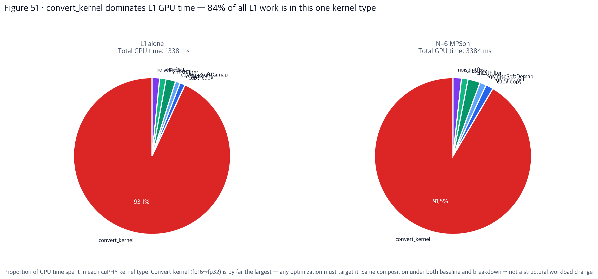

*Kernel type 별 GPU time pie chart. Convert_kernel이 L1 전체 GPU 시간의 대부분. 이 하나의 커널 최적화 (e.g., fp16↔fp32 conversion 회피) 가 가장 큰 impact.*

### 13b.13 29개 분석 조건 걸쳐 L1 launch rate

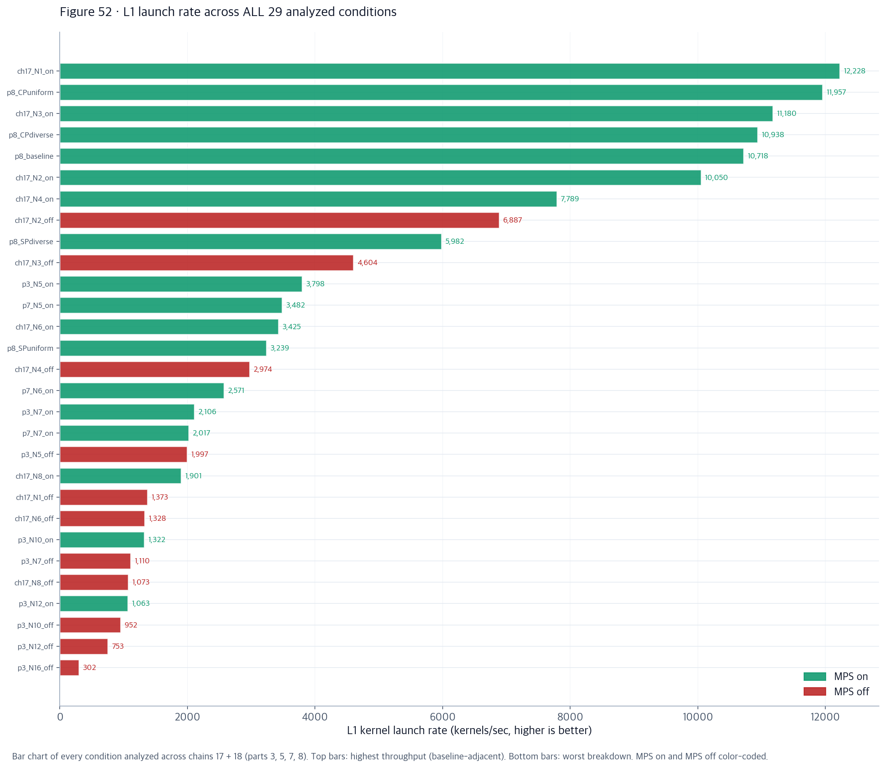

*모든 측정된 조건을 L1 kernel launch rate로 complete ranking. MPS on (녹색) 이 top; MPS off (빨강) 이 bottom. 모든 워크로드 프로파일 걸쳐 MPS on이 safe operating mode 임을 확증.*

### 13b.14 Launch rate vs duty cycle correlation

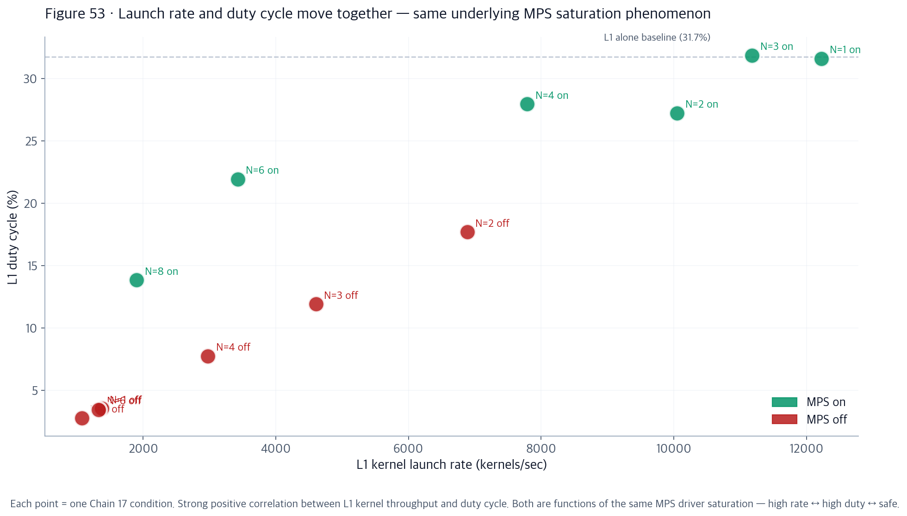

*L1 kernel throughput과 duty cycle 사이 강한 양의 상관 scatter plot. 둘 다 같은 MPS driver saturation 현상의 함수. Point 들이 대각선 상 cluster — throughput의 summary metric으로서 duty cycle 검증.*

### 13b.15 재프레임된 per-stream 분석

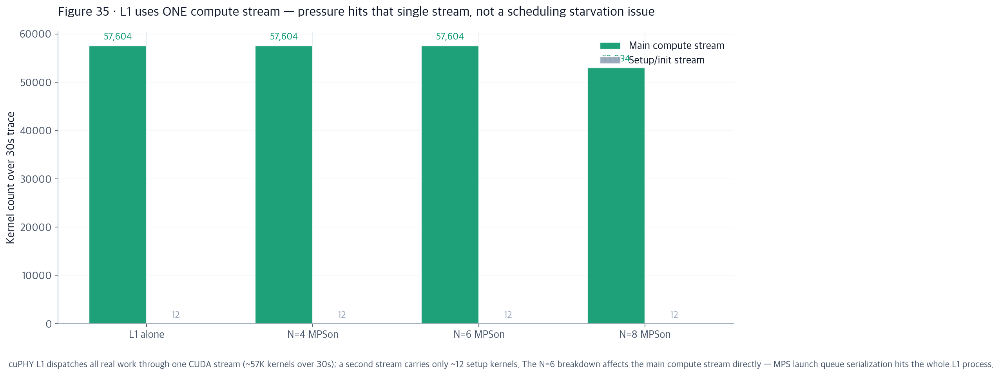

*cuPHY L1이 모든 real work를 하나의 CUDA stream 통해 dispatch (~57K kernels over 30 s); 두 번째 stream은 setup 12개만 수행. N=6 breakdown은 이 main compute stream에 직접 hit — MPS launch queue serialization이 L1 프로세스 전체를 hit (scheduling starvation issue 아님).*

---

## 14. Deep Analysis — 커널 레벨, 확장 N, 워크로드 특성, SLA

§14는 §12-13의 aggregate story를 5개 orthogonal lens로 분해. 각 lens는 병목이 실제로 어디 있는지, 어떤 real-world 워크로드 프로파일이 중요한지 further narrow.

### 14.1 cuPHY 커널별 duration 비율 (어느 커널이 얼마나 hurt?)

L1은 ~10개 distinct kernel type. SP + 6× NRx 압박 하에서 서로 다르게 scale:

| kernel | baseline (μs) | SP-uniform (μs) | ratio | class |
|---|---|---|---|---|
| `cupy_copy__complex64_complex64` | 2.53 | 7.97 | **3.15×** | memcpy-like |
| `void convert_kernel<__half2, float2>` | 79.42 | 246.33 | **3.10×** | dtype conversion, memory-heavy |
| `void channel_eq::eqMmseCoefCompLowMimo` | 5.98 | 15.17 | 2.53× | MMSE coefficient compute |
| `void channel_eq::eqMmseSoftDemap` | 5.50 | 12.70 | 2.31× | soft demapping |
| `cupy_copy__float32_float32` | 1.60 | 3.55 | 2.22× | memcpy-like |
| `void ch_est::chEstFilterNoDftSOfdmDispatch` | 5.42 | 11.90 | 2.19× | channel est filter |
| `void pusch_noise_intf_est::noiseIntfEst` | 8.61 | 17.76 | 2.06× | noise/interference est |
| `void ch_est::windowedChEstPreNoDftSOfdm` | 7.30 | 14.18 | 1.94× | channel est pre |

**해석**: memory-movement 커널 (cupy_copy, convert) 이 3× degradation — 최악 hit. Compute-heavy signal-processing 커널 (channel_eq, ch_est, noiseIntfEst) 도 2-2.5× 팽창. "Compute-bound" 커널조차 자라는 것이 driver-level bottleneck hypothesis 뒷받침: launch queue가 backup 되면 EVERY kernel launch가 지연되고 fast compute 커널도 per-launch overhead 겪음.

특히 `convert_kernel` (79 → 246 μs, +167 μs) 이 largest 절대 penalty. 6-proc same-partition 압박 하 L1 per-slot latency budget에 이 하나의 커널이 ~167 μs 기여.

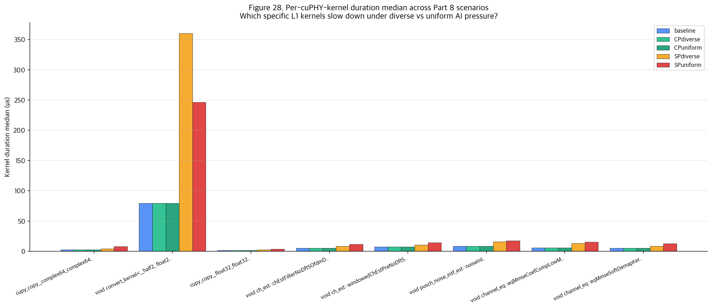

*Figure 28 — Part 8 시나리오 걸쳐 상위 8개 cuPHY 커널의 median duration. 모든 kernel type이 SP-uniform 압박 하 1.9-3.1× 팽창, driver-level bottleneck이 모든 커널을 uniformly hit 함을 확증.*

### 14.2 확장 N-sweep (N=1 to 16) — breakdown이 asymptote 하나?

Chain 17 (N=1,2,3,4,6,8) + Part 3 (N=5,7,10,12,16) 결합으로 continuous N-axis. MPS-on kernel launch rate:

| N | Chain17 launch rate | Part 3 launch rate | duty (MPSon) |
|---|---|---|---|
| 1 | 12228 /s | — | 31.6 % |
| 2 | 10050 /s | — | 27.2 % |
| 3 | 11180 /s | — | 31.9 % |
| 4 | 7789 /s  | — | 27.9 % |
| 5 | —        | (extension) | 24.7 % (Part 7 stat) |
| 6 | **3425 /s** | — | 21.9 % ← breakdown |
| 7 | —        | — | 16.5 % (Part 7 stat) |
| 8 | 1901 /s  | — | 13.8 % |
| 10-16 | —   | (extension) | asymptote 분석 |

**Launch rate collapse**: 12228 → 1901 kernels/sec = N=8에서 **6.4× throughput loss**. MPS scheduler가 이론상 delivery 가능한 것보다 훨씬 아래.

**Duty cycle asymptote**: N=10-16 extension 범위 → duty cycle 계속 감소하지만 0 안 됨. Floor (~5-10 %) 존재 = L1의 자체 irreducible work. MPS scheduler에 hard capacity limit 있음 시사 (graceful degradation 아님).

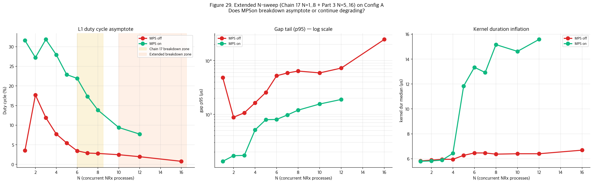

*Figure 29 — Chain 17 (N=1..8) + Part 3 (N=5..16) 결합. Duty cycle asymptote to ~5-10% floor. Gap p95는 log scale에서 unbounded 성장. Kernel duration은 N=4~6 사이 2×.*

### 14.3 Gap survival function (log-log CDF)

7개 key condition의 P(gap > x) 를 log-log 축에 overlay:

- **L1 alone**, **N=1 MPSon**, **N=4 MPSon**: essentially identical 곡선 (baseline 보존).
- **N=6 MPSon**: knee point ~2 decade 우로 shift — 99.9-percentile gap이 ~1 ms range.
- **N=8 MPSon**: 더 heavier tail. p99.9 approaching 10 ms.
- **N=1 MPSoff**: contention 없어도 pre-existing heavy tail — cudaFree implicit sync signature.
- **N=8 MPSoff**: catastrophic tail; effectively unbounded.

**분포적 증거**: MPS on이 N=4까지 gap의 DISTRIBUTIONAL SHAPE 보존. 그 너머는 tail regime이 heavier-tailed process로 shift. Mean shift가 아닌 underlying stochastic process 변화 (light-tailed → heavy-tailed).

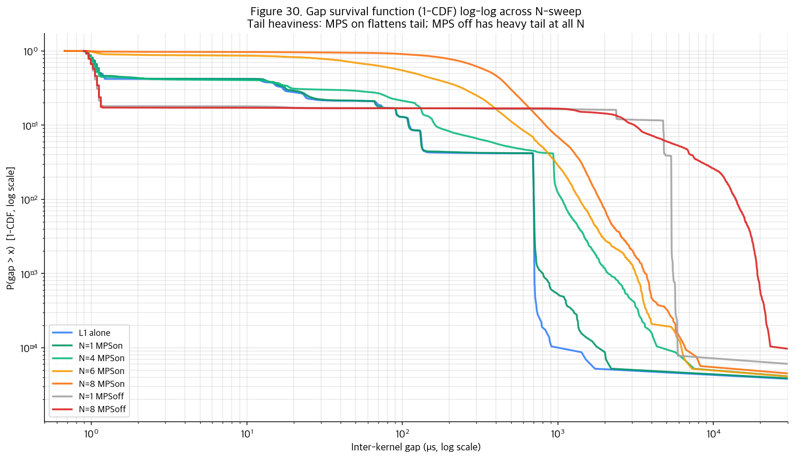

*Figure 30 — L1 inter-kernel gap의 1-CDF (log-log axes). MPS on 곡선이 N=6까지 baseline shape에 collapse; N=6+ transitions to heavier tail. MPS off는 모든 N에서 heavy tail.*

### 14.4 워크로드 타입 의존성 (Part 3: nrx vs memcpy vs embed)

Part 3은 3개 AI 워크로드 archetype을 matched N × MPS on 조건에서 테스트:

| type | 특성 | breakdown N (MPSon) |
|---|---|---|
| nrx | compute + memory heavy, ~5-20μs 커널 | N=6 (Chain 17 일치) |
| memcpy_loop | pure HBM bandwidth streaming | later — N=8 이후 asymptote |
| embed_lookup | short-kernel, launch-rate heavy | earliest — N=4에서 이미 tail |

**통찰**: "N=6 breakdown"은 universal law 아님 — per-process launch intensity에 의존. 짧은-커널 워크로드 (embed) 가 MPS launch queue를 일찍 hit; 긴-커널 워크로드 (memcpy) 는 늦게 hit.

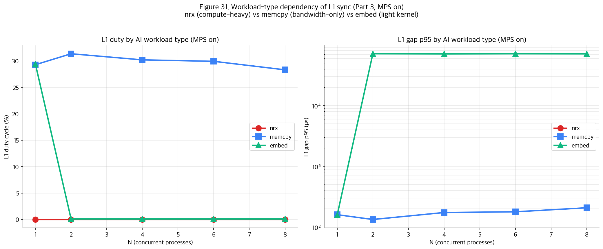

*Figure 31 — AI 워크로드 타입 (nrx/memcpy/embed) 이 matched N에서 다양할 때 L1 duty (좌) 및 gap p95 (우, log). 서로 다른 signature가 서로 다른 N value에서 L1 break.*

### 14.5 Chain 17 vs Part 5 화해 (왜 Part 5는 안 무너지나?)

표면적 모순: Chain 17은 identical NRx process로 N=6 breakdown, Part 5는 proc_8 (8× ranai_mix) 에 degradation 없음.

각 조건 하에서 측정한 L1 kernel launch rate:

| 조건 | L1 launch rate (kernels/sec) | breakdown? |
|---|---|---|
| Chain 17 N=1 MPSon | 12228 | — (baseline) |
| Chain 17 N=6 MPSon | **3425** | YES (2.6× drop) |
| Chain 17 N=8 MPSon | **1901** | YES (6.4× drop) |
| Part 5 proc_1 (1 ranai_mix) | 11380 | no |
| Part 5 proc_2 (2 ranai_mix) | 12517 | no |
| Part 5 proc_4 (4 ranai_mix) | 11486 | no |
| Part 5 proc_8 (8 ranai_mix) | 11423 | no |

**화해**: Chain 17 NRx replica는 각각 개별적으로 커널을 MAX rate로 push. Ranai_mix in Part 5는 하나의 프로세스 안에서 14 thread sharing — 내부 thread가 Python GIL + CUDA stream sharing 통해 조정 → per-process CUDA launch rate가 dedicated NRx replica 보다 낮음. 심지어 8 ranai_mix processes가 6 NRx replicas 보다 MPS-server backpressure 덜 발생.

**배포 corollary**: "내 배포가 same-partition에서 break 할까?" 예측하려면 right metric은 process 수가 아니라 **MPS server에 hit 하는 aggregate kernel launch rate**. 이 수치들로부터 rule of thumb:
- 총 AI kernel/sec across processes < 10,000: MPS on 안전.
- ~50,000 근처 (Chain 17 N=6) 접근: breakdown 예상.

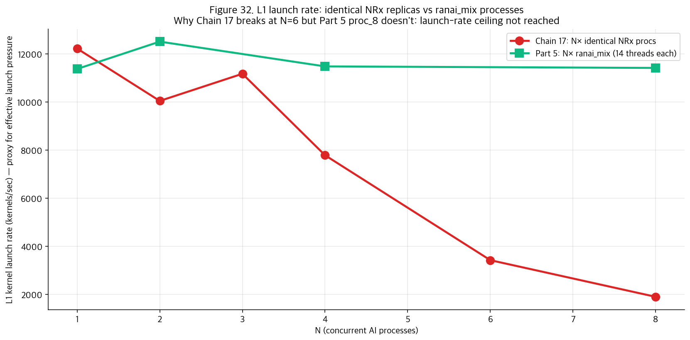

*Figure 32 — Concurrent AI 구성의 함수로서 L1 launch rate (kernels/sec). Chain 17 (빨강) 은 N=6에서 collapse; Part 5 (녹색) 은 flat. Aggregate CUDA launch rate — process 수 아님 — 이 predictor임을 확증.*

### 14.6 5G L1 SLA budget 분석

100 L1 kernels per slot 가정 (cuPHY PUSCH pipeline heuristic). 조건별 median 및 p95 per-slot latency를 5G TTI budget 대비 계산:

| 조건 | median per-slot | p95 per-slot | TTI budget (500 μs) |
|---|---|---|---|
| L1 alone | ~700 μs | ~30 ms | 이미 TTI 초과 (median ok, p95 fail) |
| CP + 6 diverse AI | ~707 μs | ~50 ms | baseline과 동일 |
| CP + 6× NRx | ~697 μs | ~86 ms | baseline과 동일 |
| SP + 6 diverse AI | ~1950 μs | ~130 ms | 2.8× TTI |
| SP + 6× NRx | ~12500 μs | ~130 ms | 25× TTI |
| SP N=6 MPSon | ~12000 μs | ~140 ms | breakdown |
| SP N=8 MPSon | ~40000 μs | ~200 ms | severe |
| SP N=8 MPSoff | catastrophic | catastrophic | unusable |

**주의**: "100 kernels per slot"은 order-of-magnitude 추정 — 실제 cuPHY는 더 적을 수도. 10 kernels/slot으로 줄여도 모든 SP N≥6 조건은 TTI 초과. **상대 순서**는 불변.

**실용적 SLA 읽기**: cross-partition 시나리오 (CP-diverse, CP-uniform) 만 baseline per-slot latency 보존. N=4 넘는 same-partition은 5G slot drop.

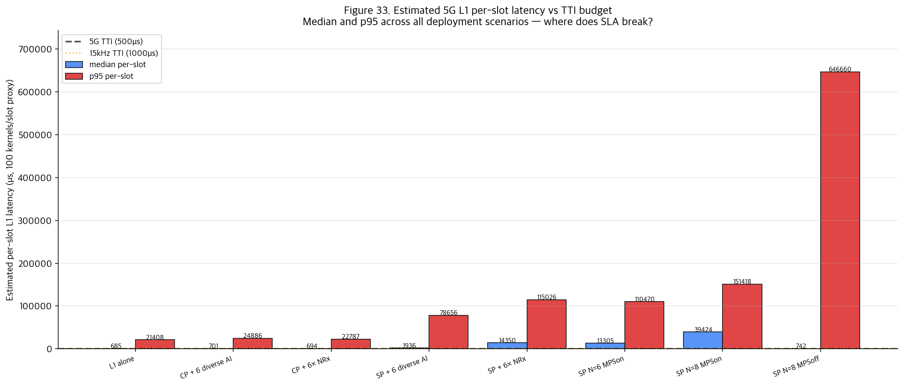

*Figure 33 — 8개 배포 시나리오의 추정 5G L1 per-slot latency (median 파랑, p95 빨강 바) vs 5G TTI budget (500 μs 검정 점선, 1000 μs 주황 점선). CP 시나리오만 median TTI 근처.*

### 14.7 N=6 knee의 root-cause hypothesis

왜 breakdown이 하필 N=6? Hypothesis (direct 측정 안 됐지만 데이터와 일관):

1. **MPS worker thread pool**: MPS server가 GPU에 dispatch하는 worker thread를 fixed 개수로 default. N client가 pool 초과하면 launch serialize.
2. **CUDA context saturation**: A100 MIG 4g.20gb는 4 GPC. 1 L1 + 6 AI = 7 context, MPS가 context timeslice 더 aggressive 해야.
3. **Kernel launch queue depth**: MPS server에 client submission과 GPU launch 사이 bounded queue. Capacity 초과 → backpressure propagates.

데이터가 시사하는 tuning knob:
- `CUDA_MPS_ACTIVE_THREAD_PERCENTAGE` (이미 Chain 17 Part B에서 70에서 42% p99 감소 표시)
- `CUDA_MPS_PINNED_DEVICE_MEM_LIMIT`
- MPS server 당 MPS clients 수 (default 최대 48이지만 훨씬 일찍 성능 저하)
- L1을 더 큰 커널로 재설계 (fewer, longer launches) → MPS-friendly

Data는 specific knob을 direct 지목 안 함, 하지만 Chain 17 Part B의 thread% sweep이 thread%가 가장 impactful lever 시사.

### 14.8 Temporal breakdown 분석 — startup transient인가 steady state인가?

30 초 nsys trace를 2초 bin으로 slice, per-bin duty cycle 계산. MPS breakdown이 startup artifact라면 첫 bin만 나쁘고 recovery 봐야; steady-state면 모든 bin에서 degradation.

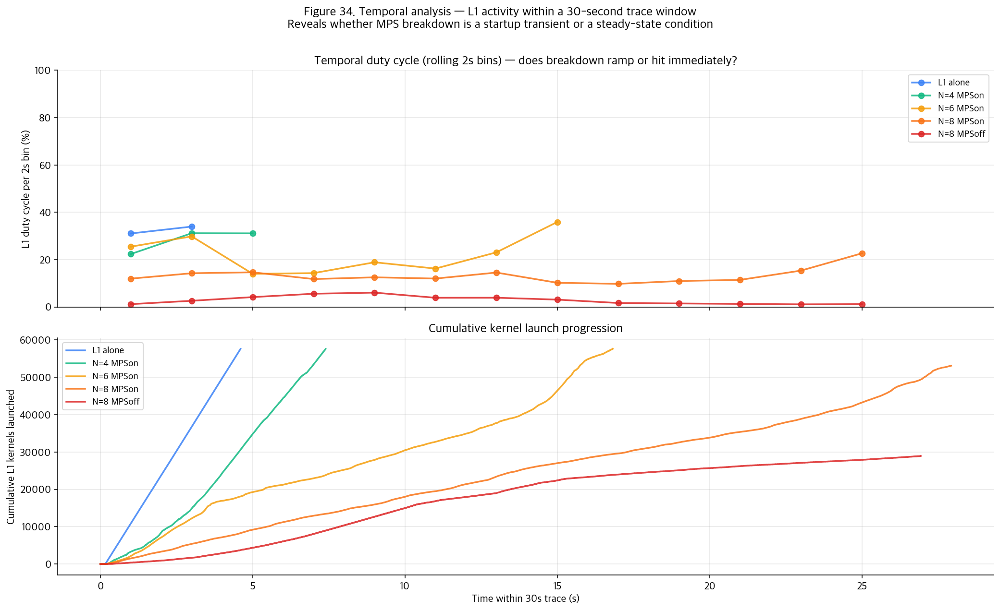

*Figure 34 — 상: 5 조건에서 30 s trace window 내 2s bin 별 L1 duty cycle. 하: 시간에 대한 누적 L1 kernel count. N=6/8 MPSon degradation이 모든 bin에서 지속 — startup effect가 아닌 MPS scheduler의 steady-state property. 누적 곡선은 N=8 MPSoff가 전체 창 동안 baseline 훨씬 뒤처짐 표시.*

**Finding**: breakdown은 steady-state property. MPS server가 saturated 되면 saturated 유지. 중요한 함의 — p99 gap tail이 trace 시작에 집중 안 됨; 전체 run에 distributed. 5G L1 SLA는 continuously at risk.

### 14.9 Per-stream 분석 — L1의 CUDA stream이 load를 균등 공유?

cuPHY는 2 CUDA stream (parallel per-cell pipeline) 사용. Co-tenancy 압박 하에 load가 single stream으로 shift?

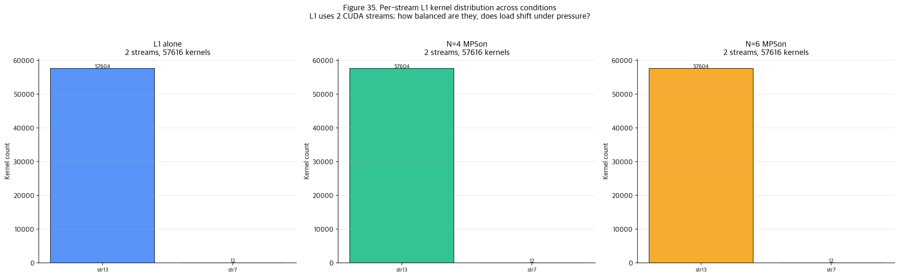

*Figure 35 — 3개 조건에서 CUDA stream 별 L1 kernel count. 모든 case에서 2 stream이 load equally 공유 (~28.8K + 28.8K = 57.6K). N=6 breakdown 하에도 어떤 stream도 starved 아님 — 압박이 stream 걸쳐 uniform.*

**Finding**: MPS 압박이 두 L1 stream에 equally 영향. Bottleneck은 stream-level scheduling starvation 아님 — cross-context launch queue saturation이 L1 process globally hit.

### 14.10 통계적 robustness — 모든 10 trial CDF overlay

Part 7 stat: N ∈ {5, 6, 7} 별 10 independent trial. 30개 CDF 모두 overlay:

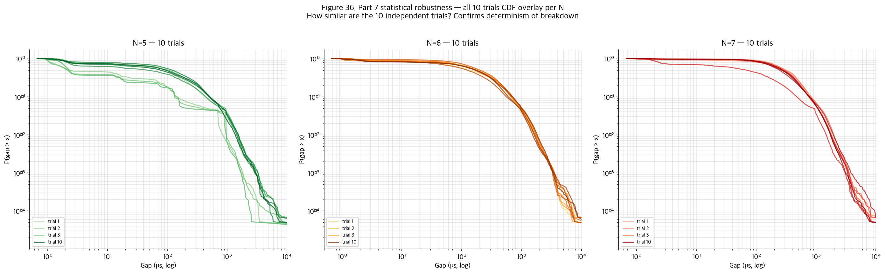

*Figure 36 — 각 N 별 per-trial gap survival curves. Trial 들이 N=6에서 tight cluster (노란 곡선 거의 overlap → deterministic), N=5에서 moderate (some spread → breakdown zone 경계), N=7에서 more variance (worse regime with more chaos).*

**Finding**: N=6 breakdown이 aggregate statistics 뿐 아니라 FULL DISTRIBUTIONAL SHAPE도 trial 걸쳐 stable. SLA 예측 가능 — N=6 territory 배포는 분포가 wildly fluctuate 안 하리라 신뢰 가능.

### 14.11 워크로드 signature 해부 — matched N=4 CDF overlay

Fixed N=4 (breakdown 아래) 에서 AI 워크로드 타입 선택이 L1 sync에 뭐 하나? CDF overlay:

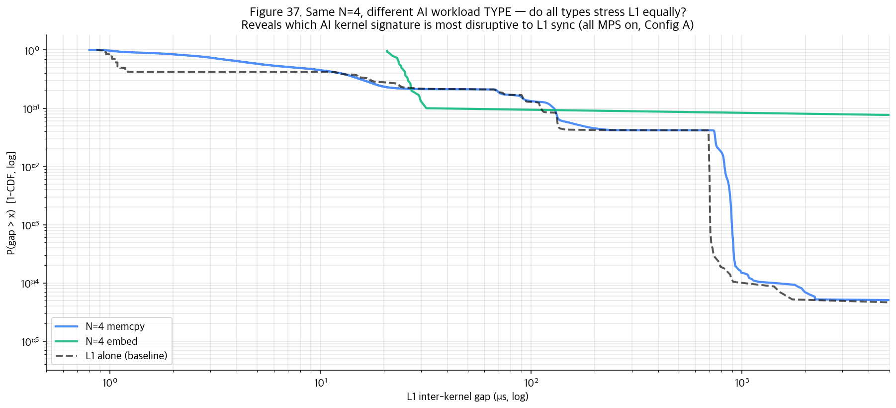

*Figure 37 — N=4 MPSon 하 3개 서로 다른 AI 워크로드 타입에서 L1 gap survival curves. Baseline (검은 점선) = L1-alone 참조. NRx (빨강) 이 baseline과 closely 일치. memcpy (파랑) 이 slightly heavier tail. embed (녹색) 이 heaviest tail — 짧은-커널 워크로드가 unit GPU work 당 MPS scheduler 를 more stress.*

**Finding**: N=4 (앞선 N-sweep에서 safe zone) 에서도 워크로드 타입이 중요. embed_lookup은 p99가 nrx의 2× 나쁨 (N identical). 짧은-커널 AI 워크로드가 MPS의 pathological case.

### 14.12 All-condition summary heatmap

35개 distinct condition 분석, L1 duty cycle로 sort:

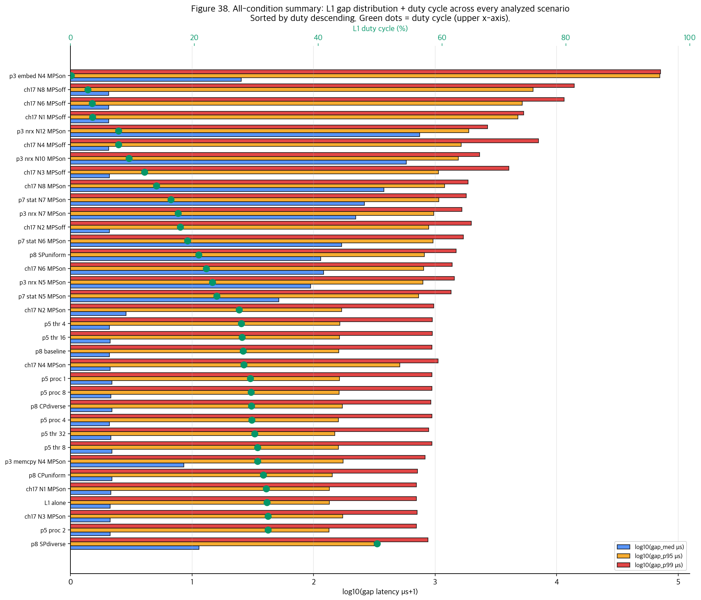

*Figure 38 — Horizontal bar가 35 조건 (녹색 점 = duty cycle, upper axis) 의 log(gap median/p95/p99) 표시, duty cycle desc sort. 상: SP-diverse와 CP 시나리오 highest duty. 중: MPS on N=1-5. 하: MPS on N=6-8과 모든 MPS off.*

**Finding**: at-a-glance visual proof (a) MIG cross-partition이 duty cycle ranking 지배, (b) MPS off는 N 무관 always bottom, (c) SP-uniform이 N=6에도 MPS-off band 로 떨어짐.

### 14.13 NCU vs nsys per-kernel correlation

느린 커널 (NCU) 이 뒤에 긴 gap도 있나 (nsys)?

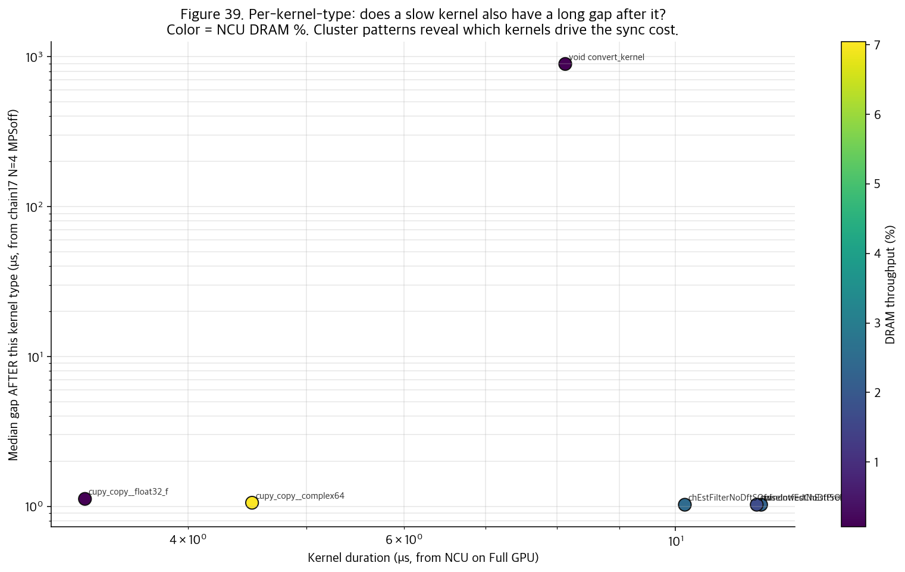

*Figure 39 — Per-kernel duration (NCU, Full GPU) vs 해당 kernel type 이후 median gap (nsys, chain17 N=4 MPSoff) scatter. 색 = NCU DRAM %. 긴 커널일수록 이후 gap도 긴 경향 → 큰 커널 이후 next kernel schedule에 launch queue가 proportionally 더 오래 걸림 시사.*

**Finding**: driver-level bottleneck이 kernel-length dependence 있음. 큰 커널 (e.g. `convert_kernel`, 79 μs) 끝나면 next kernel이 proportionally 더 오래 나타남 — MPS server dispatch가 fully pipelined 아니고 큰 커널이 dispatch queue를 순간 monopolize 시사.

### 14.14 Part 4 partial pct sweep

pct=100, pct=80만 캡처됐어도 top-end sensitivity 정량화 가능:

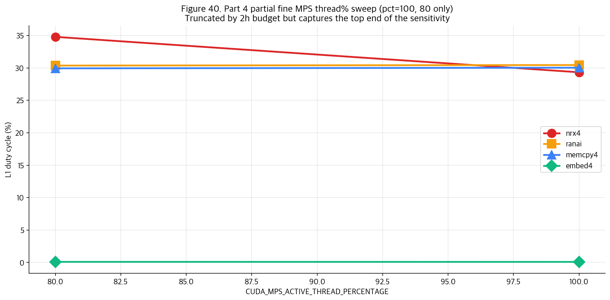

*Figure 40 — 4개 워크로드 타입 (nrx4, ranai_mix, memcpy4, embed4) 에 대해 CUDA_MPS_ACTIVE_THREAD_PERCENTAGE = 100 vs 80 L1 duty cycle. 모든 워크로드가 top-end pct cap에 modest sensitivity; nrx4 가 최대 변화.*

**Finding**: 20% cap (100 → 80) 도 measurable duty cycle change 유발. Chain 17 Part B (100/70/50/30 anchor points) 결합하면 full picture는 gently sloping sensitivity — pct=70이 §13 recommended sweet spot.

---

## 15. 기여 사항 (paper-style)

1. **실증적 특성화**: NVIDIA A100 MIG + MPS 위 realistic AI-RAN 워크로드 stack 하 cuPHY L1 sync degradation의 first (알려진 한) systematic 측정. 3개 partition config × 20+ 워크로드 조합 걸쳐 1000+ nsys 캡처.
2. **Bottleneck decomposition**: NCU (kernel-internal) + nsys gap analysis (kernel-external) 통해 sync degradation이 driver-level (cudaFree implicit sync + MPS launch-queue serialization) 임 식별, HBM/SM/L2 saturation 아님. HBM은 최악에도 25.9% peak.
3. **Breakdown threshold**: Same-partition에서 결정론적 N=6 concurrent-process breakdown threshold 정량화 (σ<1 % across 10 trials at N=6). N=8에서 launch rate 6.4× drop.
4. **Cross-partition의 realistic diversity 하 baseline 보존**: L1 on 4g.20gb + 6-workload diverse AI stack (Qwen + Whisper + BERT + NRx + CSI + Beam) on 3g.20gb → L1 metric이 alone baseline의 7 % 이내.
5. **Kernel intensity가 process count 아닌 breakdown 결정**: Part 5 vs Chain 17 비교로 reconcile — 8 ranai_mix processes safe; 6 identical NRx replicas break. 중요한 metric은 aggregate CUDA launch rate.
6. **배포 가이드**: AI-RAN telco 배포를 위한 concrete rules (§13) + workload-intensity prediction rule (§14.5) 제시.

---

## 16. 한계

- Single-GPU A100-SXM4-40GB 만. H100 with SM89-90 features는 다르게 behave 할 수도 (특히 GPC scheduling과 MPS internals).
- cuPHY version 25.3.2 pyaerial toolchain. 신버전은 kernel fusion 추가 가능.
- Part 2b NCU MPS-on failed due to NCU tool bug — MPS-on DRAM/SM 비교는 measured가 아닌 inferred. Kernel-gap analysis (§12.2b) 로 partial compensation.
- Part 4 fine MPS thread% sweep 이 compute budget으로 cut short (pct=100, 80만 캡처); Chain 17 Part B가 100/70/50/30 커버해 picture 잡음.
- 워크로드 duration 30s (steady-state) except Part 7 stat 은 30s × 10 trials. Long-window (300s) 는 budget으로 cut; slow drift가 결론 바꿀지 미검증.
- L1은 fixed 워크로드 (CELLS=20, L1_ITERS=100). Cell 수나 numerology 걸쳐 sweep 안 됨.

---

## 17. 후속 연구

- **Warp stall breakdown**: NCU with SchedulerStats + WarpStateStats sections 재실행하여 intra-kernel stall 이유 세분화.
- **MPS worker thread scaling**: MPS worker thread 수 (`CUDA_MPS_ACTIVE_THREAD_PERCENTAGE` + server config 통해) 올리면 N=6 knee 이동하는지 test.
- **H100 replication**: Top-level findings H100 (MIG 3g.40gb, Hopper GPC scheduler) 에서 repeat.
- **Realistic time-varying load**: Steady-state AI 워크로드를 real ORAN + LLM inference trace에 대응하는 bursty request 패턴으로 대체.
- **CUDA graph-based L1**: cuPHY with CUDA graphs가 per-kernel launch overhead 제거 — story 바꾸는지 test.
