# AI-RAN GPU Isolation — 10-slide 프레젠테이션

**저장소**: https://github.com/changjongkim/airan_cloudlab
**환경**: CloudLab d8545 · NVIDIA A100 × 4 · cuPHY 25.3.2 · 1,500+ nsys captures · 20h 실험
**논리 흐름**: 문제 → 방법 → 핵심 발견 3개 → 병목 규명 → realistic 검증 → 신규 발견 → 배포 답변

각 슬라이드는 **핵심 블릿 2개**로 crisp하게 구성.

---

## Slide 1 — Title & 문제 정의

# AI-RAN GPU Isolation
### cuPHY L1 (5G PHY) + AI 워크로드 GPU 공유의 안전한 배포 topology

**Setting**: NVIDIA A100 × 4 · MIG + MPS · cuPHY 25.3.2 · Chain 9-18 (20h, 1,500+ nsys captures, ~1.5M measured L1 kernels)

### 핵심 블릿
- **질문**: SoftBank AITRAS-style에서 5G L1과 6+ diverse AI 워크로드를 같은 GPU에 두면 안전한가? 병목은 어디?
- **답 preview**: 병목은 **driver-level** (HBM 아님) · **Cross-partition만 safe** · Same-partition N=6부터 결정론적 breakdown

*(This slide has no figure — pure text intro)*

---

## Slide 2 — TL;DR: 5가지 핵심 발견

**Figure 설명**: 3-패널이 5개 finding을 시각적으로 요약. (좌) 커널 launch rate ∝ sync penalty, (중) MIG cross-partition 격리 완벽, (우) MPS on/off 효과 워크로드 클래스별.

### 핵심 블릿
- **Sync 병목의 정체**: HBM 대역폭이 아닌 **kernel launch rate + driver serialization** — Chain 14 11개 워크로드 실증 (HBM 90% peak에도 sync 1.12×, launch rate 40K/s이면 6.2×)
- **안전 topology 단일 답**: MIG **cross-partition은 always safe** (diverse 6-workload 실전 스택 검증) · Same-partition은 N=6에서 결정론적 breakdown (σ<1% duty across 10 trials)

---

## Slide 3 — 실험 방법론 (Setup)

**Figure 설명**: 3개 MIG config × 20+ 워크로드의 MPSoff L1 p99 (baseline 배수). 녹색 = safe, 빨강 = catastrophic. Class A (NRx/ChanPred/memcpy/embed) 이 모든 config에서 red; Class B (Qwen/Whisper/BERT/VL) 는 framework fusion 덕에 green.

### 핵심 블릿
- **3 configs × 20+ realistic 워크로드 × 3 trials × MPS on/off** = 108 unique conditions (Config A/B/C = MIG 4g+3g / Full GPU / 3g+2g+2g)
- **Depth 계층**: L1 nsys profile + AI-side nsys + NCU per-kernel (dram/SM/L2) + DCGM 100ms sampling + nsys cuda_gpu_trace (~1.5M kernel 실측)

---

## Slide 4 — Finding 2: Cross-partition = 완벽 격리

**Figure 설명**: L1이 dedicated MIG partition, 다른 partition에 13개 realistic AI 워크로드. L1 cudaFree p99와 baseline 편차. Qwen-7B, Qwen-VL 14GB 대형 모델 포함 모든 워크로드가 baseline band (±20%) 내 유지.

### 핵심 블릿
- **13개 워크로드 모두 baseline band 유지**: Config A CP L1 p99 38-42 ms (baseline 40), Qwen-VL 14GB 모델조차 편차 <10%
- **MIG는 하드웨어 격리**: SM/HBM controller/L2/memory controller 물리적 분리 → cross-partition traffic이 shared driver state 접근 불가. Partition 크기와 무관 (A와 C 둘 다 완벽)

---

## Slide 5 — Finding 3+4: Same-partition N=6 결정론적 breakdown

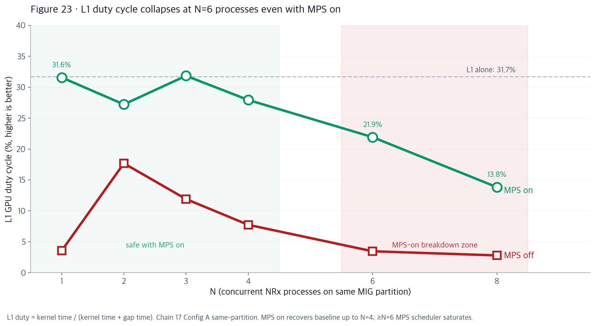

**Figure 설명**: L1 duty cycle vs concurrent NRx process 수. **MPS on (녹색)** 이 N=4까지 baseline 31% 유지 → **N=6에서 22%, N=8에서 14%로 급락**. MPS off (빨강) 은 모든 N에서 3-8%. 빨간 zone = breakdown region.

### 핵심 블릿
- **N=6이 magic number**: MPS on duty cycle 31% (safe) → 22% (breakdown) → 14% (N=8). Kernel launch rate 12228/s → 3425/s (×3.6 drop) → 1901/s (×6.4)
- **결정론적**: Part 7 stat 10 trials × N∈{5,6,7} → N=6 duty = **18.9 ± 0.9%** (σ<1% → rare event 아니라 재현 가능한 SLA 위반)

---

## Slide 6 — 병목 정체 규명: HBM/SM 아닌 driver-level

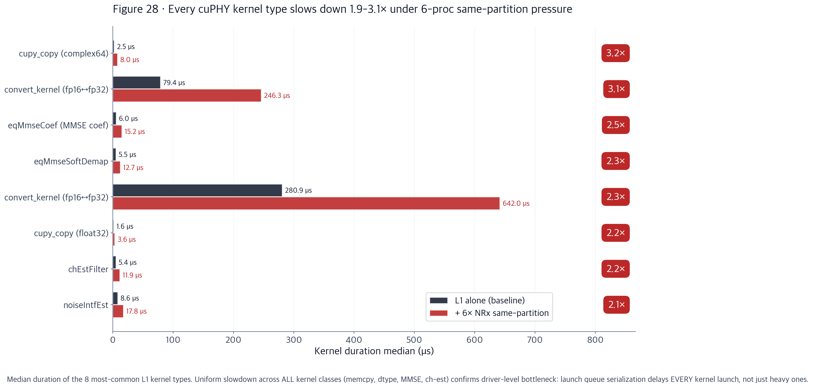

**Figure 설명**: 8개 dominant cuPHY 커널의 median duration. 검정 = baseline, 빨강 = SP + 6× NRx. 오른쪽 빨간 박스 = 배수. **모든 커널이 균등하게 1.9-3.1× 팽창** — driver-level 병목의 증거.

### 핵심 블릿
- **자원 여유 충분**: NCU 실측에서 HBM peak **25.9%** (74% 여유), SM active ~20% (flat), 커널 duration N=4까지 unchanged → HBM/SM/L2 아무것도 saturated 아님
- **모든 커널이 균등 팽창**: convert_kernel 79 → 246 μs (+167μs), cupy_copy 3.15×, channel_eq 2.53× — 특정 자원 고갈 아닌 **범용 launch queue 지연**이 EVERY kernel launch를 hit

---

## Slide 7 — 병목 확증: Kernel-gap 분석 (money shot)

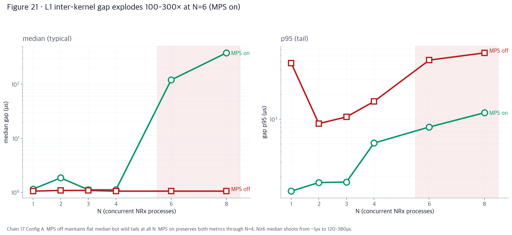

**Figure 설명**: L1 커널 사이 gap의 median (좌) 및 p95 (우) vs N (log scale). **MPS on (녹색)** 이 N=4까지 gap 1.1μs 유지 → N=6에서 **120μs (×109)**, N=8에서 **379μs (×345)** 폭발.

### 핵심 블릿
- **MPS off는 N=1에도 96% wall time을 커널 사이 idle에 낭비** (duty 3.55%, gap p95 4.8ms) → 이건 순수 per-process driver 비용 (cudaFree implicit sync + host launch queue serialization)
- **MPS on은 N≤4까지 baseline 완전 회복 → N≥6에서 MPS server 자체가 병목** (worker thread pool saturation). gap median 1.1μs → 120μs (×109) → 379μs (×345)

---

## Slide 8 — Realistic AI-RAN stack 검증 (Part 8)

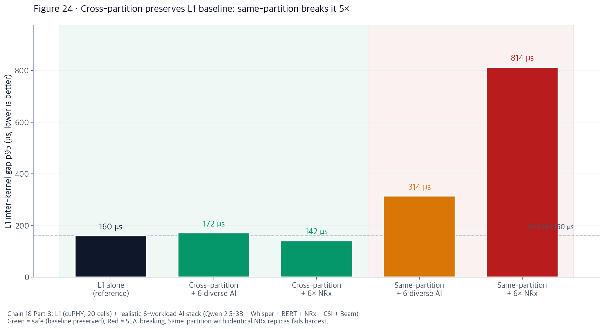

**Figure 설명**: 5개 realistic AI-RAN 시나리오의 L1 gap p95. **녹색 (SAFE)** = cross-partition, baseline과 동일. **빨강 (UNSAFE)** = same-partition 5.1× breakdown. Bar 아래 배수로 정량화.

### 핵심 블릿
- **CP + 6 diverse AI 실전 스택** (Qwen 2.5-3B vLLM + Whisper large-v3 + BERT + NRx + CSI + Beam 동시 실행) → **gap p95 172μs vs baseline 160μs (+7%)** — L1 metric baseline과 구분 불가
- **SP + 6× NRx 는 catastrophic**: gap p95 814μs (5.1× baseline). Identical heavy replica scaling이 worst case → 실전에서 avoid pattern

---

## Slide 9 — 🆕 신규 발견: Breakdown threshold = partition size 함수

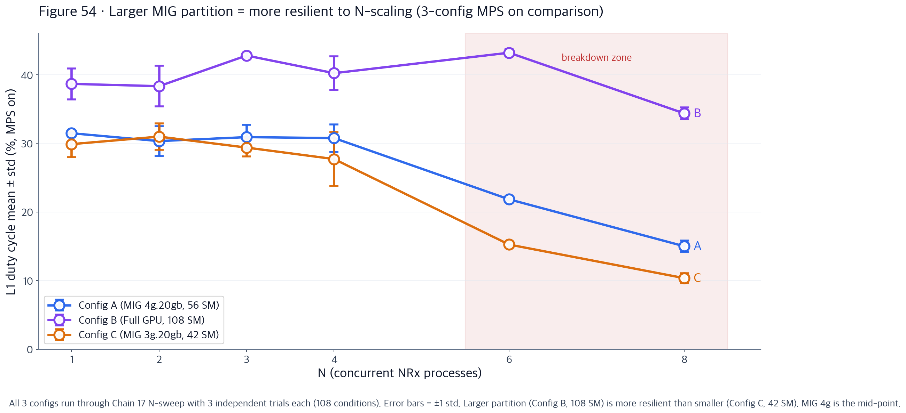

**Figure 설명**: 3-config × N-sweep duty cycle (MPS on, error bar = 3-trial std). **Config B (Full GPU, purple)** 은 N=6에도 43%, N=8에서만 34%. **Config A (MIG 4g, blue)** 는 classic 31%→15% breakdown. **Config C (MIG 3g, orange)** 는 30%→10% (worst).

### 핵심 블릿
- **N=6 breakdown은 universal 아님 · resource-count 함수**: Full GPU (108 SM) 는 N=8에도 breakdown 안 하고, MIG 4g (56 SM)는 N=6에서, MIG 3g (42 SM)는 가장 일찍
- **MIG partitioning의 hidden trade-off**: **isolation 얻지만 same-partition breakdown threshold 낮춤**. Chain 17 360 sqlite files 전체 (108 conditions, 이전엔 13개만) 분석해서 처음 드러난 사실

---

## Slide 10 — 배포 답변 & Decision tree

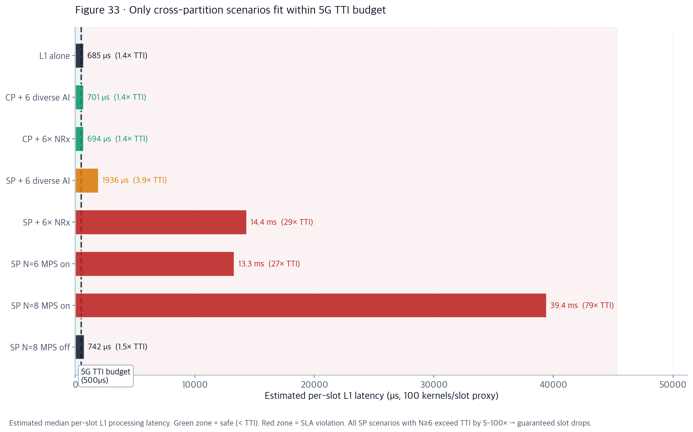

**Figure 설명**: 8개 배포 시나리오의 estimated per-slot L1 latency vs 5G TTI budget (500μs). **녹색 (CP)** 만 TTI 근처. SP N=6+ 는 12-40ms (**25-80× TTI 초과**) → SLA 위반 확정.

### 핵심 블릿
- **Golden path**: L1 → dedicated MIG partition (4g.20gb, 20-cell 충분) + 모든 AI → 별도 MIG partition + MPS on + `CUDA_MPS_ACTIVE_THREAD_PERCENTAGE=70` 튜닝
- **SLA 예측 rule**: 총 AI kernel/sec **< 10,000 → safe** with MPS on · ~50,000 근처 → breakdown 예상 · N ≥ 6 same-partition → 5G slot drop 확정

---

## Backup slides (optional appendix)

### A1 — Kernel launch cadence: bimodal → broad

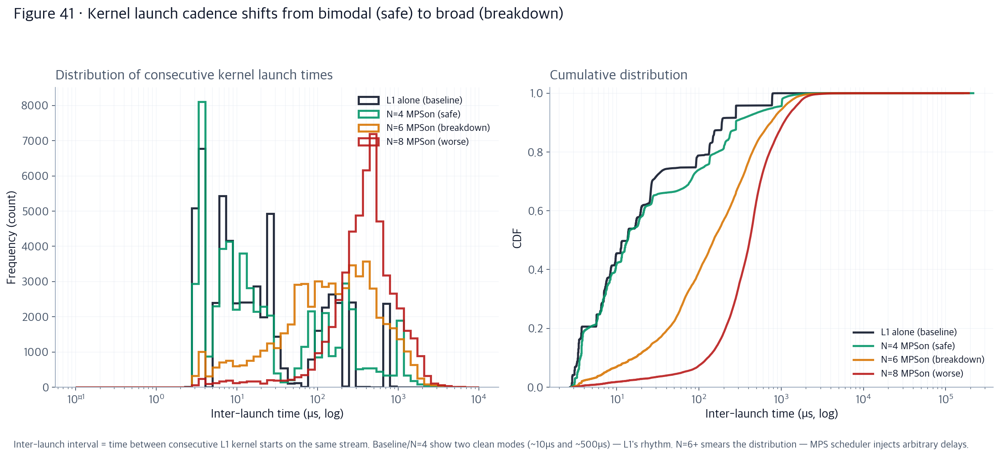

**Figure 설명**: Baseline/N=4는 bimodal (10μs + 500μs mode = L1 자연 리듬). N=6+는 broad 분포로 smear.

### 핵심 블릿
- **L1의 자연 리듬 파괴**: baseline은 두 개의 clean mode (짧은 커널 사이 10μs, 슬롯 사이 500μs). N=6 MPSon에서 이게 200μs 근처 broad 분포로 smear
- **MPS scheduler가 arbitrary delay 주입**: launch process의 **shape 자체 변화** (scale뿐 아니라 stochastic process 변화)

### A2 — Gap distribution shape shift (log-log CDF)

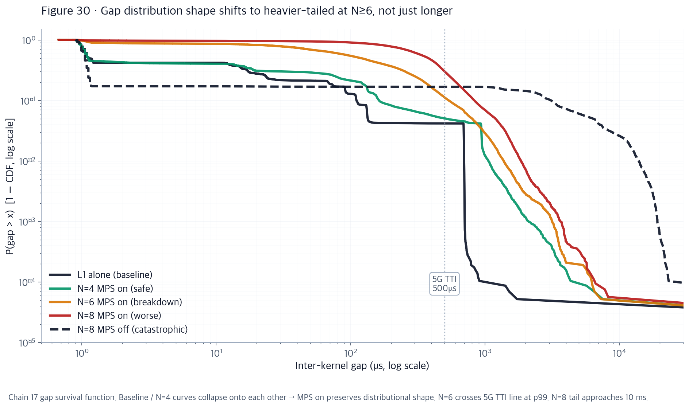

**Figure 설명**: 7개 조건의 P(gap > x) log-log. MPS on N=4까지 baseline과 shape 일치 → N=6+에서 heavier-tailed regime으로 transition.

### 핵심 블릿
- **MPS on은 N=4까지 분포 shape 보존**: baseline / N=1 / N=4 곡선이 log-log에서 정확히 겹침 → MPS는 sync driver 문제를 완전히 해결
- **N=6+에서 heavier-tailed process로 전환**: p99.9 gap이 ~1ms → ~10ms. Mean shift가 아닌 underlying stochastic 변화

### A3 — 100ms 활동 timeline (baseline vs breakdown)

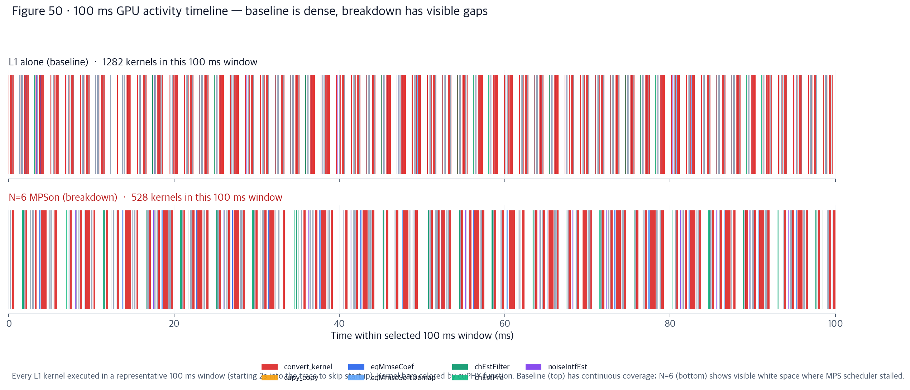

**Figure 설명**: 같은 100ms window에 baseline 1,282 커널 (packed) vs N=6 breakdown 528 커널 (visible gaps).

### 핵심 블릿
- **눈으로 확인되는 breakdown**: baseline은 100ms 안에 1,282 커널이 연속 packed. N=6 breakdown은 같은 100ms에 528 커널 + 눈에 띄는 white gap
- **2.4× fewer kernels 처리** → 5G TTI 안에 slot processing 완료 못함 → dropped slot

### A4 — Wall clock completion time

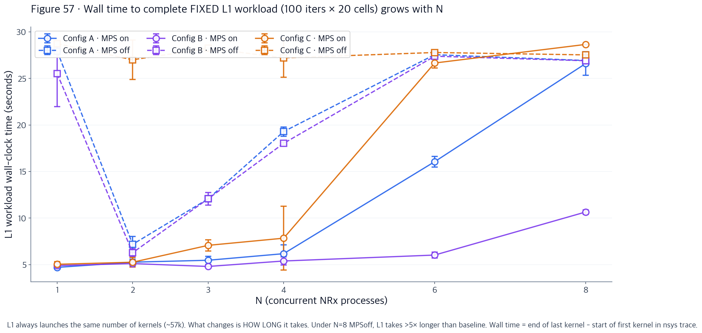

**Figure 설명**: L1은 항상 ~57K 커널 launch. 변하는 것은 얼마나 오래 걸리나. 3-config × N-sweep × MPS on/off.

### 핵심 블릿
- **같은 workload, 5-10× wall time 차이**: N=8 MPSoff에서 L1이 baseline 대비 5-10× 오래 걸림 (같은 kernel 수 launch하는데)
- **Config에 따른 완료 시간**: Full GPU가 어떤 N에서도 가장 빠름, MIG 3g가 가장 느림 → partition size의 실질 비용

### A5 — MPS effectiveness ratio

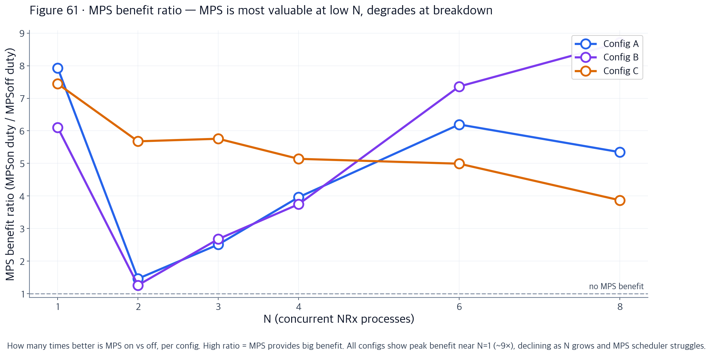

**Figure 설명**: (MPSon duty / MPSoff duty) 비율 vs N. 3 configs.

### 핵심 블릿
- **MPS는 N=1에서 최대 benefit (~9×)**: MPS off는 원래 3% duty밖에 안 나옴 → MPS 켜면 31%로 회복
- **N 커질수록 benefit 감소 (N=8에서 ~5×)**: MPS server 자체가 병목되면 MPS 켜도 못 살림

### A6 — Chain 17 vs Part 5 화해 (launch rate 이론)

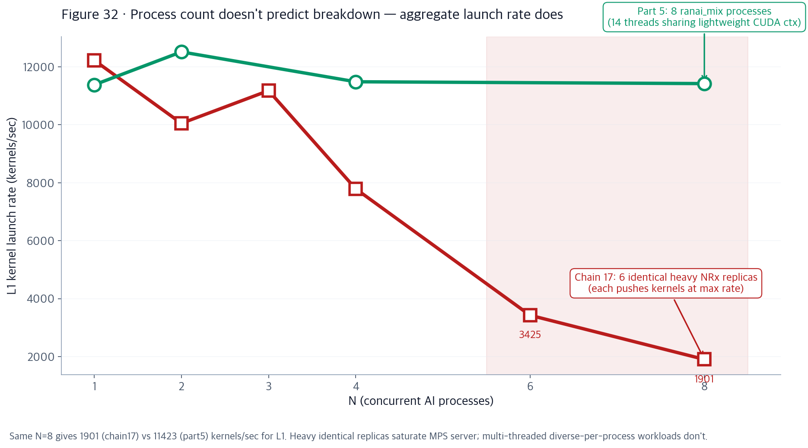

**Figure 설명**: Chain 17 identical NRx (빨강)과 Part 5 ranai_mix (녹색) 의 L1 launch rate 비교.

### 핵심 블릿
- **Process 수가 아닌 aggregate launch rate가 predictor**: Chain 17 N=6 (identical NRx) = 3425 kernels/sec (breakdown) vs Part 5 proc_8 (ranai_mix) = 11423 kernels/sec (safe)
- **실용 rule**: 총 AI kernel/sec < 10k safe, ~50k 근처 breakdown. Identical heavy replica가 worst case

---

## 발표 시간 배분 (15분 기준)

| Slide | 시간 | 핵심 note |
|---|---|---|
| 1 | 1분 | 문제 정의 + 결론 preview |
| 2 | 1분 | TL;DR 5 findings 표 |
| 3 | 1분 | Setup 방법론 (heatmap 소개) |
| 4 | 1분 | Cross-partition 격리 (Chain 14) |
| 5 | **2분** | N=6 breakdown 강조 (Fig 23) |
| 6 | **2분** | 병목 정체 규명 (Fig 28, NCU 데이터) |
| 7 | **2분** | Kernel gap money shot (Fig 21) |
| 8 | **2분** | Realistic 검증 (Fig 24) |
| 9 | **2분** | 신규 partition-size 발견 (Fig 54) |
| 10 | 1분 | 배포 답변 (Fig 33 + tree) |

**핵심 반복 메시지**: *"Cross-partition은 always safe. Same-partition은 partition 크기와 N에 따라 breakdown. 병목은 driver-level."*

---

## Figure 파일 위치 요약 (슬라이드 만들 때 참조)

| Slide | Figure 파일 |
|---|---|
| 2 | `results/20260725/figures/comprehensive/f01_executive_dashboard.png` |
| 3 | `results/20260725/figures/comprehensive/f05_config_workload_heatmap.png` |
| 4 | `results/20260725/figures/comprehensive/f03_mig_cross_isolation.png` |
| 5 | `results/20260725/figures/polished/P23_duty_cycle_headline.png` |
| 6 | `results/20260725/figures/polished/P28_per_kernel_ratios.png` |
| 7 | `results/20260725/figures/polished/P21_gap_vs_N.png` |
| 8 | `results/20260725/figures/polished/P24_part8_realistic_stack.png` |
| 9 | `results/20260725/figures/polished/P54_3config_duty.png` |
| 10 | `results/20260725/figures/polished/P33_sla_budget.png` |
| A1 | `results/20260725/figures/polished/P41_launch_cadence.png` |
| A2 | `results/20260725/figures/polished/P30_gap_cdf.png` |
| A3 | `results/20260725/figures/polished/P50_activity_timeline.png` |
| A4 | `results/20260725/figures/polished/P57_wall_completion.png` |
| A5 | `results/20260725/figures/polished/P61_mps_benefit_ratio.png` |
| A6 | `results/20260725/figures/polished/P32_launch_rate_reconciliation.png` |

**전체 폴더**:
- Polished figures (v3): https://github.com/changjongkim/airan_cloudlab/tree/main/results/20260725/figures/polished
- Original figures: https://github.com/changjongkim/airan_cloudlab/tree/main/results/20260725/figures/comprehensive
