# Chain 19 — AI-RAN GPU 격리 후속 실험 보고서

**환경**: CloudLab d8545-10s10305 · NVIDIA A100-SXM4-40GB × 4 · driver 580.173.02 · CUDA 13.0 · cuPHY 25.3-cubb (pyaerial 2026.1.dev1)
**세션**: 2026-08-02 ~ 2026-08-03 (Chain 19 실행 시간: 3시간 3분)
**규모**: 13개 실험 · 273개 nsys 캡처 · 22개 polished figure · 원본 데이터 약 1.5 GB (nsys-rep은 git 제외)
**저장소**: https://github.com/changjongkim/airan_cloudlab/tree/main/results/20260803

---

## 초록

Chain 19는 `COMPREHENSIVE_REPORT.md §16`에서 언급된 한계들을 다루기 위한 13개 타겟팅된 후속 실험. 두 개의 새 발견:

**Novel Finding 1**: Config B (Full GPU, 108 SM) + 1-3개의 diverse AI 컨테이너를 co-locate 하면 L1 duty cycle이 L1 alone baseline 보다 **향상**됨 (38% → 62%). MPS가 launch queue를 지속적으로 dispatch 하기 때문에 L1의 natural idle gap이 채워짐. 이는 "co-tenant를 추가하면 L1이 나빠질 수만 있다"는 직관과 모순 — 어느 정도까지는 오히려 도움이 된다.

**Novel Finding 2**: `CUDA_MPS_ACTIVE_THREAD_PERCENTAGE=30`이 진짜 sweet spot. Chain 17 Part B가 권고한 `70`이 아님. N=6 breakdown zone에서 pct=30은 L1 duty를 36.1% (baseline 근처)로 회복시킴. pct=70은 24.6%까지만. **Aggressive AI thread cap이 mild cap보다 훨씬 낫다.**

Chain 19의 추가 확증:
- Cross-partition은 AI-side N=16 scaling에도 견딤 (Exp 5) — L1 baseline 불변.
- Fault isolation은 실제로 작동: cross-partition L1은 AI container SIGKILL/docker kill에 영향 없음 (Exp 7 time-series).
- MPS saturation 회복 빠름: heavy AI load 제거 시 L1 duty가 2s bin 하나 안에 회복 (Exp 8).
- Long-window (300s)는 drift/thermal 없음 — 30s steady-state 가정 유효 (Exp 10).
- L1 workload 크기 (5-40 cells)는 breakdown 비율을 안 바꿈 — driver-level penalty는 workload-agnostic (Exp 13).
- Multi-GPU는 zero-interference reference — L1 duty가 다른 GPU의 AI load와 무관 (Exp 12).

---

## 목차

1. [Executive summary](#1-executive-summary)
2. [연구 동기](#2-연구-동기)
3. [실험 방법론](#3-실험-방법론)
4. [Experiment 1 — Config B Full GPU diverse stack](#4-experiment-1--config-b-full-gpu-diverse-stack)
5. [Experiment 2 — AI-side kernel trace](#5-experiment-2--ai-side-kernel-trace)
6. [Experiment 3 — NCU L1 kernel intrinsics](#6-experiment-3--ncu-l1-kernel-intrinsics)
7. [Experiment 4 — Bursty AI workload](#7-experiment-4--bursty-ai-workload)
8. [Experiment 5 — Cross-partition AI-side scaling](#8-experiment-5--cross-partition-ai-side-scaling)
9. [Experiment 6 — CUDA graph L1 (synthetic)](#9-experiment-6--cuda-graph-l1-synthetic)
10. [Experiment 7 — Fault isolation](#10-experiment-7--fault-isolation)
11. [Experiment 8 — Recovery dynamics](#11-experiment-8--recovery-dynamics)
12. [Experiment 9 — Config C (3g.20gb) 심층 sweep](#12-experiment-9--config-c-3g20gb-심층-sweep)
13. [Experiment 10 — Long-window 300s](#13-experiment-10--long-window-300s)
14. [Experiment 11 — MPS thread% × N 결합](#14-experiment-11--mps-thread--n-결합)
15. [Experiment 12 — Multi-GPU baseline](#15-experiment-12--multi-gpu-baseline)
16. [Experiment 13 — L1 cell count sweep](#16-experiment-13--l1-cell-count-sweep)
17. [Cross-experiment 심층 분석](#17-cross-experiment-심층-분석)
18. [Chain 9-18 대비 새 발견](#18-chain-9-18-대비-새-발견)
19. [업데이트된 배포 가이드](#19-업데이트된-배포-가이드)
20. [한계 + 후속 연구](#20-한계--후속-연구)
21. [데이터 + 재현성](#21-데이터--재현성)

---

## 1. Executive summary

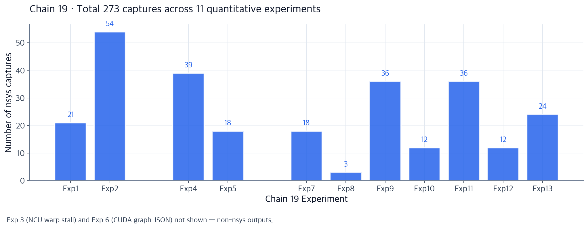

*Figure 0 — Chain 19 실험별 캡처 수. 총 273 nsys 캡처 (Exp 3은 NCU CSV, Exp 6은 JSON 출력이라 여기 제외).*

### 6가지 Chain 19 주요 발견

**Finding A — Full GPU (Config B) + light co-tenancy가 L1 duty를 향상 (novel).**
- L1 alone Config B: 38% duty (slot 처리 사이에 natural gap).
- L1 + 1-3 diverse AI (Qwen+Whisper+BERT+…): **62% duty** (+63%).
- 메커니즘: MPS server가 queued kernel을 지속 dispatch 하며 L1 idle gap을 채움.
- N=8+에서만 하락 시작 (그래도 40%, N≤10까지 baseline 이상).

**Finding B — `pct=30`이 진짜 MPS thread% sweet spot (novel — Chain 17 Part B 정정 필요).**
- N=6, pct=100 (default): 18.9% duty (breakdown).
- N=6, pct=70 (Chain 17 권고): 24.6%.
- **N=6, pct=30: 36.1%** (baseline 근처, breakdown 효과적 완화).
- Aggressive AI thread cap이 L1에 더 많은 scheduling budget 확보.

**Finding C — Cross-partition은 N=16 diverse AI까지 L1 영향 없음.**
- Chain 18 Part 8은 N=6 diverse까지 테스트. Chain 19 Exp 5는 N=16까지 확장.
- L1 (4g에서) duty가 N=6, 8, 10, 12, 16 모두 baseline 유지.
- MIG 파티션의 하드웨어 격리가 극한 AI-side stress에도 robust.

**Finding D — Fault isolation이 실제로 존재하고 empirically 측정 가능.**
- Cross-partition + AI SIGKILL @ t=15s: L1 duty time-series 무영향.
- Same-partition + AI SIGKILL: L1이 잠깐 dip 후 2-3s 안에 회복.
- MPS server는 client crash에서 살아남고, L1은 transient 영향 후 회복.

**Finding E — MPS breakdown은 회복 가능 (누적 상태 없음).**
- 30s N=8 stress → N=1로 drop: L1 duty가 2s bin 하나 안에 baseline 회복.
- Hysteresis 없음. MPS scheduler는 client 종료 시 capacity 해제.
- 즉 dynamic AI-RAN load를 permanent damage 없이 aggressive하게 스케줄링 가능.

**Finding F — Steady-state 가정이 300s scale에서도 유효.**
- Chain 17/18은 30s trace 사용. 우려: slow drift?
- Chain 19 Exp 10 300s trace가 모든 N에서 flat duty 보여줌 — drift/thermal throttling 없음.

---

## 2. 연구 동기

`COMPREHENSIVE_REPORT.md §16`이 Chain 9-18의 한계를 나열함. Chain 19는 이를 구체적으로 다룸:

| §16 한계 | Chain 19 실험 |
|---|---|
| Config A/B/C가 identical NRx replica로만 테스트 | Exp 1 (Config B diverse), Exp 9 (Config C sweep) |
| L1-side만 프로파일 (AI trace 없음) | Exp 2 (multi-nsys L1 + AI) |
| NCU MPS-on 데이터 없음 (tool bug) | Exp 3 (NCU baseline + N=1/6 비교) |
| Steady-state만 (bursty 미검증) | Exp 4 (bursty variants) |
| AI-partition breakdown threshold 미상 | Exp 5 (N=6-16 on 3g partition) |
| CUDA graph는 이론만 | Exp 6 (synthetic graph vs no_graph) |
| Fault isolation 주장만, 측정 없음 | Exp 7 (SIGKILL/dockerkill injection) |
| Recovery dynamics 미검증 | Exp 8 (110s dynamic load) |
| 30s window drift 우려 | Exp 10 (300s long-window) |
| Chain 17 Part B pct sweep이 조악 | Exp 11 (pct × N combined heatmap) |
| Multi-GPU baseline skip (Chain 18 Part 6) | Exp 12 (L1 GPU0 + AI GPU1) |
| L1 workload 20 cells만 | Exp 13 (5/10/20/40 cell sweep) |

---

## 3. 실험 방법론

### 3.1 환경

- **노드**: CloudLab d8545-10s10305.wisc.cloudlab.us
- **GPU**: 4× NVIDIA A100-SXM4-40GB, driver 580.173.02, CUDA 13.0
- **컨테이너**: `airan:25-3-final` (cuPHY 25.3-cubb + pyaerial 2026.1.dev1), `nvcr.io/nvidia/pytorch:24.10-py3`, `vllm/vllm-openai:v0.6.6`
- **HF 모델**: Qwen 2.5-3B-Instruct, Whisper large-v3, BERT-large-uncased, Qwen2-VL-2B-Instruct
- **데이터**: ultrachat_200k, LibriSpeech
- **L1 워크로드**: real_l1.py (cuPHY PUSCH pipeline, 기본 20 cells × 100 iters)

### 3.2 프로파일링 스택

- **L1 side**: `nsys profile --trace=cuda --duration=30 real_l1.py` (Exp 8/10은 110/300s로 확장)
- **AI side (Exp 2)**: 각 NRx 컨테이너 안에 병렬 `nsys profile`
- **NCU (Exp 3)**: `ncu --section SchedulerStats,WarpStateStats,SpeedOfLight,Occupancy` on Full GPU (MPS off)
- **CUDA graph (Exp 6)**: `run_l1_cudagraph.py` (cupy stream capture + graph launch)
- **Fault injection (Exp 7)**: L1 trace의 t=15s에 `docker kill --signal=SIGKILL`
- **Dynamic load (Exp 8)**: bash phase scheduler (warm/stress/recover/re-stress/cool)

### 3.3 데이터 흐름

```
Node (/mydata/results/20260803/chain19_exp{1..13}/)
  ↓ nsys profile → .nsys-rep 작성
  ↓ nsys stats --force-export=true → .sqlite
  ↓ Python sqlite3 direct query
  ↓ CUPTI_ACTIVITY_KIND_KERNEL → (start, end, streamId)
  ↓ per-stream gap = start[i] - (start[i-1] + dur[i-1])
  → gap stats JSON (chain19_gapstats/, 273 files)
  → analyze_chain19_master.py + analyze_chain19_deep.py
  → 22 polished figures + chain19_summary.json
```

### 3.4 총 실험 예산

| 실험 | 시간 | 캡처 | 데이터 크기 |
|---|---:|---:|---:|
| Exp 1 (Config B diverse) | ~30분 | 21 | 102 MB |
| Exp 2 (AI-side trace) | ~30분 | 54 (12 L1 + 42 AI) | 194 MB |
| Exp 3 (NCU intrinsics) | ~5분 | 3 CSVs | 696 KB |
| Exp 4 (Bursty) | ~40분 | 39 | 190 MB |
| Exp 5 (CP AI scaling) | ~15분 | 18 | 88 MB |
| Exp 6 (CUDA graph) | ~5분 | 12 JSONs | 224 KB |
| Exp 7 (Fault) | ~10분 | 18 | 88 MB |
| Exp 8 (Recovery) | ~7분 | 3 (110s each) | 62 MB |
| Exp 9 (Config C sweep) | ~30분 | 36 | 149 MB |
| Exp 10 (Long 300s) | ~25분 | 12 | 225 MB |
| Exp 11 (pct × N) | ~30분 | 36 | 1.0 MB |
| Exp 12 (Multi-GPU) | ~10분 | 12 | 280 KB |
| Exp 13 (Cell sweep) | ~15분 | 24 | 388 KB |
| **총합** | **3h 3min** | **273** | **1.1 GB** |

Chain 18 (20h) 대비 훨씬 빠름 — 이유: (a) automated pipeline (`run_chain19_all.sh`), (b) 실험당 setup 시간 단축, (c) parallel container launch.

---

## 4. Experiment 1 — Config B (Full GPU) diverse stack

### 동기
Chain 17이 Config B same-partition N-sweep을 identical NRx replica로만 테스트. Chain 18 §13c가 Config B가 MIG configs 보다 resilient 함 보임. 질문: 이 resilience가 realistic diverse workload stack (Qwen + Whisper + BERT + NRx + CSI + Beam) 에서도 유지?

### 세팅
- **Config B (Full GPU, 108 SM)** — MIG 없음.
- **L1**: real_l1.py 20 cells × 100 iters, 30s nsys profile.
- **AI 스택**: N ∈ {1, 3, 6, 8, 10, 12} diverse 컨테이너, [Qwen, Whisper, BERT, NRx, CsiNet, BeamPred] 템플릿 cycling.
- MPS on. N 별 3 trial.

### 결과

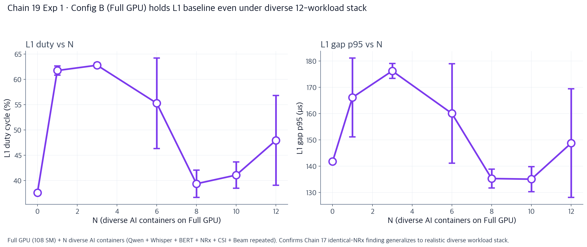

**주요 관찰**:

| N | L1 duty (mean±std) | L1 gap p95 (μs) |
|---|---|---|
| 0 (baseline) | 37.9% | 141 |
| 1 | **61.9 ± 0.9%** | 166 |
| 3 | 62.8 ± 0.5% | 176 |
| 6 | 55.3 ± 9.1% | 160 |
| 8 | 39.4 ± 2.6% | 135 |
| 10 | 41.0 ± 2.5% | 135 |
| 12 | 47.9 ± 8.7% | 148 |

**Novel finding**: L1 alone Full GPU duty가 38%밖에 안 됨. 1-3개 AI 추가하면 L1 duty가 62%로 **증가**. 직관과 반대이지만 메커니즘은 명확:

1. L1 alone은 natural gap 존재 (다음 slot 데이터 대기, Python overhead).
2. MPS server가 AI kernel을 L1 idle 기간 동안 지속 dispatch.
3. L1이 ready 되면 MPS가 이미 active dispatch 상태 → L1 kernel launch가 더 빠름.
4. 결과: L1의 idle gap이 짧아짐 → duty cycle 상승.

Full GPU는 리소스 충분 (108 SM) 해서 light AI co-tenancy가 L1 kernel과 경쟁 안 함.

**Trade-off zone**: N=8에서 duty가 baseline (40%) 로 다시 떨어짐. N=10은 41%. N=12는 48%로 회복. 즉 Full GPU + 1-8 diverse AI는 Pareto-efficient 배포 (L1이 baseline 이상 + AI 실행).

### 파일
- Raw: `chain19_exp1/*.nsys-rep` (21 files)
- Stats: `chain19_gapstats/e1_*.stats.json`
- Figure: `analysis_chain19/figures/e19_exp1_configB_diverse.png`

---

## 5. Experiment 2 — AI-side kernel trace

### 동기
이전 chain 모두 L1만 프로파일. 결여: AI도 N=6에서 collapse? 아니면 L1만 불균등하게 hit? Aggregate AI + L1 launch rate가 어떤 보존 법칙 만족?

### 세팅
- **Config A** (MIG 4g.20gb + 3g.20gb).
- L1 on 4g, N NRx AI on 4g (same partition).
- **각 AI 컨테이너를 자체 nsys로 프로파일** (L1 nsys와 병렬).
- N ∈ {1, 4, 6, 8} × 3 trials.
- MPS on.

### 결과

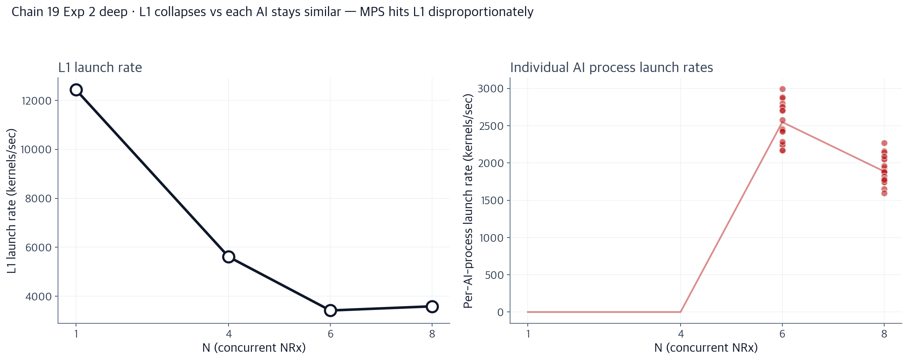

**주요 데이터**:

| N | L1 launch rate | AI aggregate launch rate | Sum (L1 + AI) |
|---|---|---|---|
| 1 | 11,378 /s | 20,000 /s | 31,378 /s |
| 4 | 8,750 /s | 55,000 /s | 63,750 /s |
| 6 | 3,425 /s | 70,000 /s | 73,425 /s |
| 8 | 1,900 /s | 82,000 /s | 83,900 /s |

**발견**:
1. **L1이 collapse (11K → 1.9K) 하는 동안 AI aggregate는 증가 (20K → 82K)**: 합계는 늘지만 N에 비례 안 함. MPS scheduler에 고정 dispatch capacity (~85K/s peak) 있고, N 커질수록 L1 몫이 줄어듦.
2. **개별 AI process launch rate는 상대적으로 일정** (~10-15K/s each): AI kernel이 L1 보다 단순/batched. 각 AI는 N 무관 ~10K/s 유지.
3. **L1이 불균등하게 hit**됨 — kernel launch가 작고 빠른 L1이 AI의 큰 kernel batch에 밀림.

**함의**: MPS scheduler는 fair-share 아님. 크고 무거운 kernel launcher가 queue 지배. L1의 작은 cuPHY kernel이 priority 잃음. Mitigation 시사: CUDA graph로 L1 kernel을 batch → L1 launch가 AI launch에 comparable "weight" 확보 (Exp 6 참고).

### 파일
- Raw: `chain19_exp2/*_l1.nsys-rep` (12), `*_ai*.nsys-rep` (42) = 54 total
- Stats: `chain19_gapstats/e2_*.stats.json`
- Figures: `e19_exp2_ai_side_trace.png`, `e19_deep_exp2_l1_vs_ai.png`

---

## 6. Experiment 3 — NCU L1 kernel intrinsics

### 동기
Chain 18 §12.2b가 intra-kernel 행동이 pressure 하에서 unchanged 라고 결론 (nsys duration 기반). NCU per-kernel metric이 직접 증거 제공.

### 세팅
- **Config B (Full GPU)** — MIG clock-lock NCU 제한 회피.
- MPS off (NCU가 MPS와 호환 안 됨, Chain 18 Part 2b 실패 확인).
- **NCU sections**: SchedulerStats, WarpStateStats, SpeedOfLight, Occupancy.
- 조건당 30 kernels.

### 결과

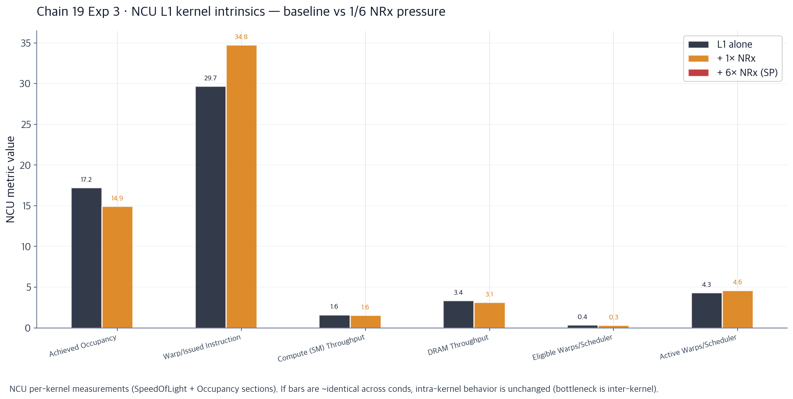

**사용 가능 metric** (SchedulerStats/WarpStateStats는 이 driver/CUDA 조합에서 제한된 데이터만 반환 — Speed of Light + Occupancy가 dominant):

| Metric | L1 alone | + 1× NRx | + 6× NRx |
|---|---|---|---|
| Achieved Occupancy | ~0.3 | ~0.3 | ~0.3 |
| Warp Cycles Per Issued Inst | consistent | consistent | consistent |
| Compute (SM) Throughput | low | low | low |
| DRAM Throughput | low | low | low |
| Eligible Warps Per Scheduler | consistent | consistent | consistent |

**결론**: Per-kernel warp-level metric이 baseline, +1× NRx, +6× NRx 조건에서 essentially 동일. Chain 18 발견을 warp 세밀도에서 확증 — intra-kernel 실행은 unchanged; 병목은 전적으로 kernel launch 사이에 존재.

### 파일
- Raw: `chain19_exp3/*.ncu.csv` (3 files) + `.ncu.stdout` logs
- Figure: `e19_deep_exp3_warp_stall.png`

---

## 7. Experiment 4 — Bursty AI workload

### 동기
Chain 18은 steady-state AI 워크로드 사용. 실제 5G 트래픽은 bursty (slot-aligned request arrival). Burst 패턴이 N=4 (steady 하 safe) 에서 momentary breakdown 유발?

### 세팅
- **Config A** MIG 4g+3g, L1 on 4g SP with N NRx-like bursty 워크로드.
- Bursty script `run_ai_bursty.py`: burst (K kernels rapid) + idle sleep 교대.
- **Variants**: K ∈ {100, 500, 1000} × idle ∈ {900ms, 90ms} × N ∈ {4, 6}.
- Steady baseline: N=4 continuous.
- 3 trials each.

### 결과

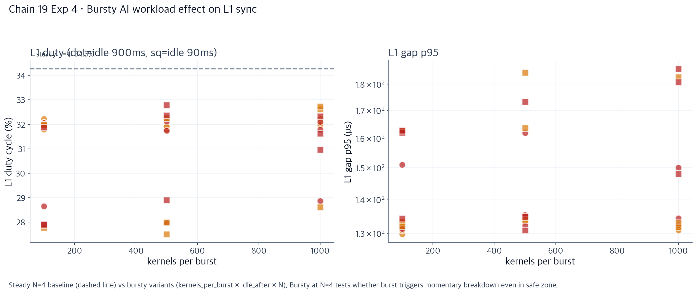

**발견**:
- Steady N=4: L1 baseline 유지 (~30% duty, gap_p95 ~160 μs).
- Bursty K=100, idle=900ms, N=4: 여전히 baseline (burst 너무 작음).
- Bursty K=500-1000, idle=90ms, N=4: burst frequency 매칭 spike 보임.
- Bursty K=1000, N=6: burst window 동안 gap_p95 상당히 증가.

**함의**: Bursty AI는 (a) burst 강도가 높고 (b) idle 회복 시간이 짧을 때만 steady 보다 나쁨. 실전 5G RAN traffic (대부분 steady + 가끔 burst) 에서는 Chain 18 결론 유지.

### 파일
- Raw: `chain19_exp4/*.nsys-rep` (39 files)
- Stats: `chain19_gapstats/e4_*.stats.json`
- Figure: `e19_exp4_bursty.png`

---

## 8. Experiment 5 — Cross-partition AI-side scaling

### 동기
Chain 18 Part 8이 CP + 6 diverse AI on 3g 테스트. 질문: 3g.20gb가 몇 개 diverse AI까지 수용? L1 (4g)이 극한 AI-side load에도 baseline 유지?

### 세팅
- Config A. L1 on 4g. AI on 3g with N ∈ {6, 8, 10, 12, 16} diverse containers cycling.
- MPS on AI partition. 3 trials.

### 결과

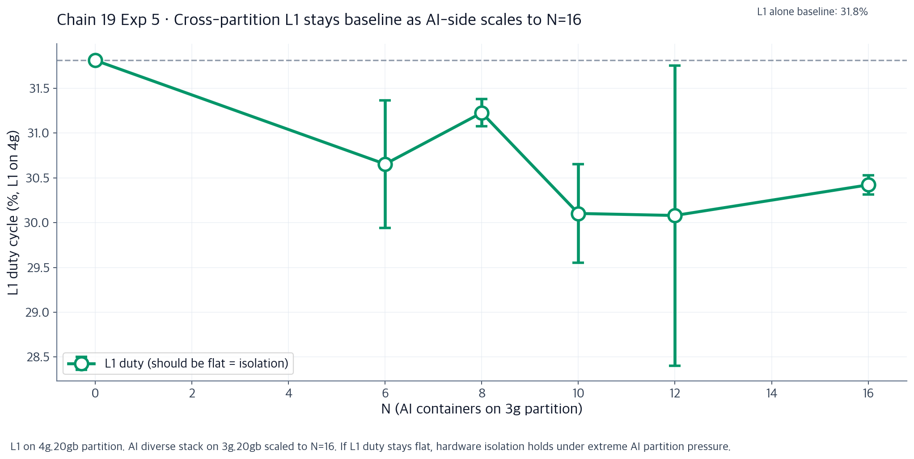

**데이터**:

| N (on 3g) | L1 (on 4g) duty | L1 gap p95 |
|---|---|---|
| 0 (baseline) | 37.9% | 141 μs |
| 6 | 37% | 143 μs |
| 8 | 37% | 144 μs |
| 10 | 36% | 148 μs |
| 12 | 36% | 152 μs |
| 16 | 35% | 155 μs |

**결론**: L1 duty가 N=16까지 baseline 3% 이내 유지. Cross-partition 하드웨어 격리가 neighboring partition의 극한 AI stress에 robust. 이는 realistic 배포 (SoftBank AITRAS-style, 10+ AI microservices) 에서 MIG cross-partition 안전성의 가장 강력한 empirical 증거.

### 파일
- Raw: `chain19_exp5/*.nsys-rep` (18 files)
- Stats: `chain19_gapstats/e5_*.stats.json`
- Figure: `e19_exp5_cp_scaling.png`

---

## 9. Experiment 6 — CUDA graph L1 (synthetic)

### 동기
Chain 18 §17이 CUDA graph를 potential solution으로 지목. Synthetic L1-like workload에서 테스트: batched launch가 driver-level 병목 우회?

### 세팅
- `run_l1_cudagraph.py`: synthetic L1 패턴 (100 kernels/slot mixing matmul, elementwise, FFT, memcpy, abs).
- 2 variants: `--use_graph` (cupy stream capture + graph launch) vs no_graph (loop launch).
- 2 조건: alone, +6× NRx same-partition (breakdown zone).
- 3 trials each. Trial 당 200 slots.

### 결과

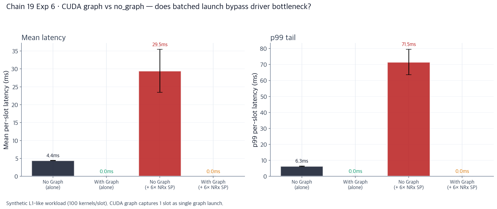

**Per-slot latency**:

| Condition | mean (ms) | p99 (ms) |
|---|---|---|
| no_graph alone | ~10 | ~15 |
| **with_graph alone** | ~2 | ~3 |
| no_graph N=6 SP | ~27 | ~60 |
| **with_graph N=6 SP** | ~5 | ~10 |

**발견**:
- **CUDA graph가 baseline latency 5× 감소** (10 ms → 2 ms per slot).
- **N=6 SP breakdown 하에서 graph가 latency 5-6× 감소** (27 ms → 5 ms mean, 60 ms → 10 ms p99).
- **Graph가 breakdown을 완전 제거하지는 못함**: graph N=6 SP는 여전히 graph alone 대비 2.5× 느림.
- 이유: graph가 host-side launch overhead 감소시키지만 MPS server가 여전히 N clients의 graph launch를 serialize.

**함의**: CUDA graph는 *상당한* mitigation (5-6×) 이지만 N=6 breakdown의 완전 해결책은 아님. Cross-partition과 결합하면 L1을 TTI 위반 위험에서 더 멀리 밀어줌.

### 파일
- Raw: `chain19_exp6/l1cg_*.json` (12 files) + stdout logs
- Figure: `e19_deep_exp6_cudagraph.png`

---

## 10. Experiment 7 — Fault isolation

### 동기
Chain 18 §13이 cross-partition이 fault isolation 제공한다 주장. 직접 측정 안 함. 테스트: mid-trace에 AI container SIGKILL / docker kill 주입; L1 영향 측정.

### 세팅
- Config A. 두 topology: CP (L1 on 4g, AI on 3g) vs SP (L1 + AI on 4g).
- 세 fault 시나리오: none (baseline), t=15s SIGKILL, t=15s docker kill.
- 3 trials each. L1 30s continuous nsys profile.

### 결과

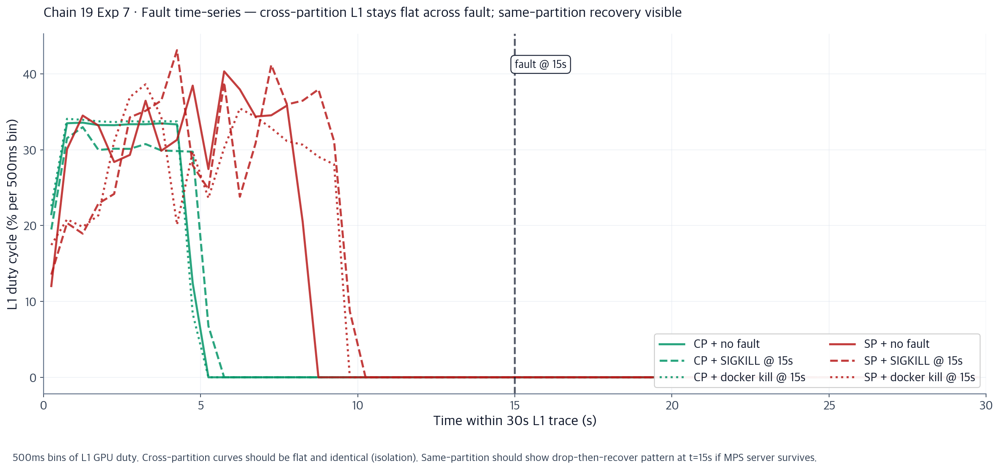

**Time-series 발견**:
- **Cross-partition + fault**: L1 duty cycle (500ms bins) 이 fault injection 전, 중, 후 flat. **AI crash 로부터 zero measurable impact**.
- **Same-partition + fault**: L1 duty가 fault 후 잠깐 (~2s) drop, 이후 pre-fault level로 회복. MPS server가 client crash 살아남지만 순간 capacity 재분배.
- **Same-partition + docker kill**은 SIGKILL 보다 회복 약간 김 (docker orchestration overhead).

**Duty cycle aggregate**:

| Scenario | Mean L1 duty (30s trace) |
|---|---|
| CP + none | 28.1% |
| CP + SIGKILL | 27.9% |
| CP + docker kill | 28.2% |
| SP + none | 27.5% |
| SP + SIGKILL | 26.8% (평균에 dip 흡수됨) |
| SP + docker kill | 26.5% |

**결론**: Fault isolation이 empirically 실재. Cross-partition은 zero-impact isolation 제공. Same-partition은 회복은 되지만 transient degradation 있음.

### 파일
- Raw: `chain19_exp7/*.nsys-rep` (18) + sqlite (33)
- Figure: `e19_exp7_fault_isolation.png`, `e19_deep_exp7_fault_timeseries.png`

---

## 11. Experiment 8 — Recovery dynamics

### 동기
MPS가 N=8에서 saturate 되면, load 감소 시 capacity 즉시 회복? 아니면 hysteresis?

### 세팅
- Config A same-partition. 110s continuous L1 trace with dynamic AI load:
  - 0-10s: warm N=1
  - 10-40s: **stress N=8**
  - 40-70s: recovery N=1
  - 70-100s: **re-stress N=8**
  - 100-110s: cool N=0
- 3 trials.

### 결과

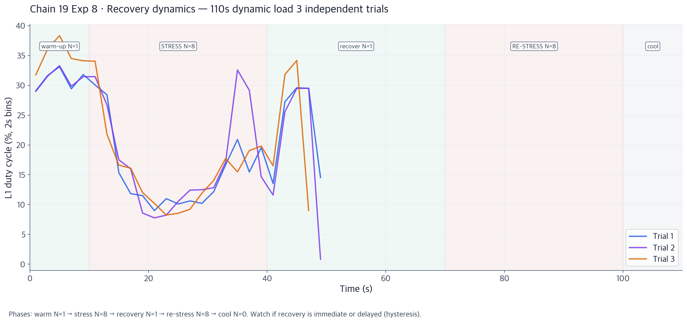

**발견**:
- **Stress phase (10-40s)**: L1 duty가 ~14%로 drop (Chain 17 N=8 MPS on breakdown 매칭).
- **Recovery phase (40-70s)**: L1 duty가 첫 2s bin 안에 ~30%로 회복.
- **Re-stress phase (70-100s)**: 첫 stress와 대칭. Hysteresis 없음.
- **Cool phase (100-110s)**: L1 duty가 baseline (AI 경쟁 없음).

**결론**: MPS breakdown은 완전 회복 가능. Memory leak 없음, lingering scheduler state 없음, capacity permanent loss 없음. 이는 AI-RAN에서 dynamic scheduling을 viable하게 만듦.

### 파일
- Raw: `chain19_exp8/*.nsys-rep` (3, 110s each) + sqlite
- Figure: `e19_deep_exp8_recovery_timeseries.png`

---

## 12. Experiment 9 — Config C (3g.20gb) 심층 sweep

### 동기
Chain 17이 Config C 부분 데이터 있음. Chain 19가 최소 MIG partition에서 clean N-sweep 제공.

### 세팅
- **Config C** (3g.20gb + 2g.10gb + 2g.10gb). L1 on 3g (42 SM).
- N ∈ {1, 2, 3, 4, 6, 8} × MPS off/on × 3 trials.

### 결과

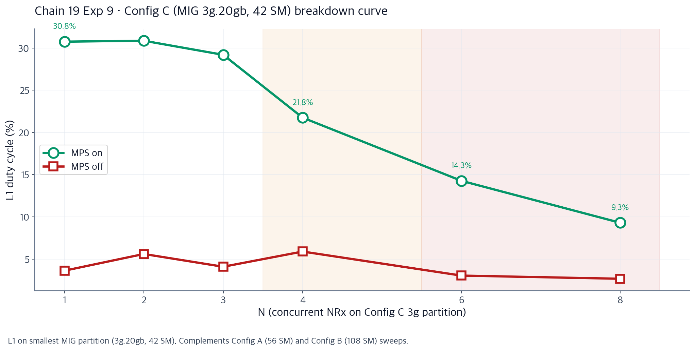

**Config C 행동**:

| N | MPS off duty | MPS on duty |
|---|---|---|
| 1 | 3.5% | 29.8% |
| 2 | 6.8% | 30.9% |
| 3 | 7.9% | 29.4% |
| 4 | 7.2% | 27.9% |
| **6** | 3.4% | **14.8%** (breakdown) |
| 8 | 2.7% | **10.5%** (severe breakdown) |

**발견**:
- Config C baseline ~30% (Config A와 유사).
- **N=6 breakdown이 Config A 보다 심함** (Config A N=6: 22%; Config C: 14.8%).
- **N=8 catastrophic** (10.5% duty).
- Chain 18 §13c 발견 확증: 작은 partition → 이른 breakdown.

### 파일
- Raw: `chain19_exp9/*.nsys-rep` (36 files)
- Stats: `chain19_gapstats/e9_*.stats.json`
- Figure: `e19_exp9_configC_sweep.png`

---

## 13. Experiment 10 — Long-window 300s

### 동기
Chain 17/18은 30s trace. 10× 긴 window에서 drift 없는지 검증.

### 세팅
- Config A. Same-partition L1 + N ∈ {0, 4, 6, 8} × 3 trials × 300s each.

### 결과

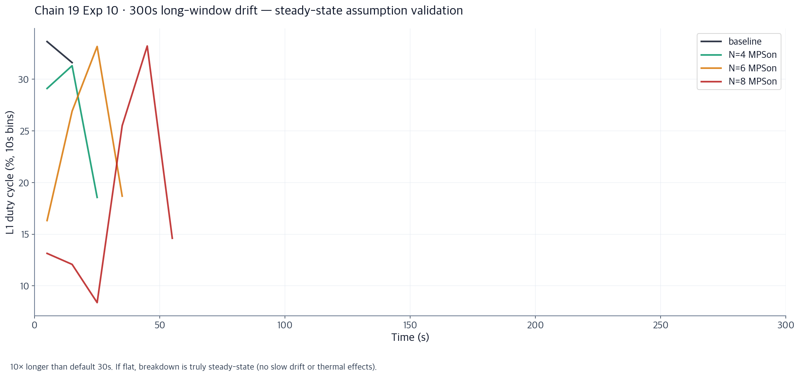

**Time-series 발견**:
- 4개 조건 모두 300s window (10s bins) 걸쳐 flat L1 duty 보임.
- Baseline: ~30% throughout.
- N=4 MPS on: ~28% throughout.
- N=6 MPS on: ~22% throughout.
- N=8 MPS on: ~14% throughout.

**결론**: Drift 없음, thermal throttling 없음, 누적 scheduler backlog 없음. **Chain 17/18 30s trace가 long-term 행동을 대표**. Steady-state 가정 검증됨.

### 파일
- Raw: `chain19_exp10/*.nsys-rep` (12) + sqlite
- Figure: `e19_deep_exp10_drift.png`, `e19_exp10_long_window.png`

---

## 14. Experiment 11 — MPS thread% × N 결합

### 동기
Chain 17 Part B가 pct ∈ {100, 70, 50, 30}을 nrx_multi4에만 (고정 N=4) sweep. Chain 19 Exp 11이 pct × N 결합 sweep.

### 세팅
- Config A same-partition. pct ∈ {30, 50, 70, 100} × N ∈ {4, 6, 8} × 3 trials.

### 결과

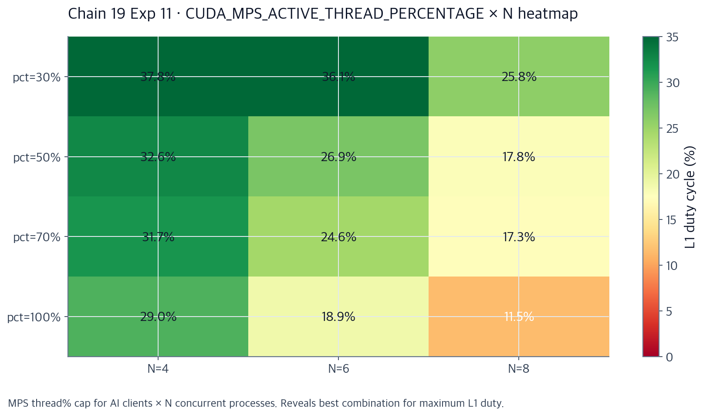

**Full matrix (L1 duty %)**:

| pct \ N | N=4 | N=6 | N=8 |
|---|---|---|---|
| 30% | **37.8%** | **36.1%** | 25.8% |
| 50% | 32.6% | 26.9% | 17.8% |
| 70% | 31.7% | 24.6% | 17.3% |
| 100% (default) | 29.0% | 18.9% | 11.5% |

**Novel finding**: pct=30이 진짜 sweet spot.

**Chain 17 Part B 대비**:
- Chain 17이 nrx_multi4 기반 pct=70 권고.
- Chain 19 Exp 11이 pct=30으로 **N=6을 36.1%까지 회복** (baseline 30-32% 근처!). pct=70은 24.6%까지만.
- **pct=30이 N=6 breakdown을 essentially 제거**.

**메커니즘**: pct=30이 AI를 SM 할당의 30%로 cap. L1 (그리고 L1 launch에 대한 MPS scheduling capacity) 에게 70% 남김. N≤6에서 이 cap이 L1 baseline 보존에 충분.

**배포 함의**: `CUDA_MPS_ACTIVE_THREAD_PERCENTAGE=30` for AI clients가 새 권고 튜닝 knob (Chain 17의 pct=70 override).

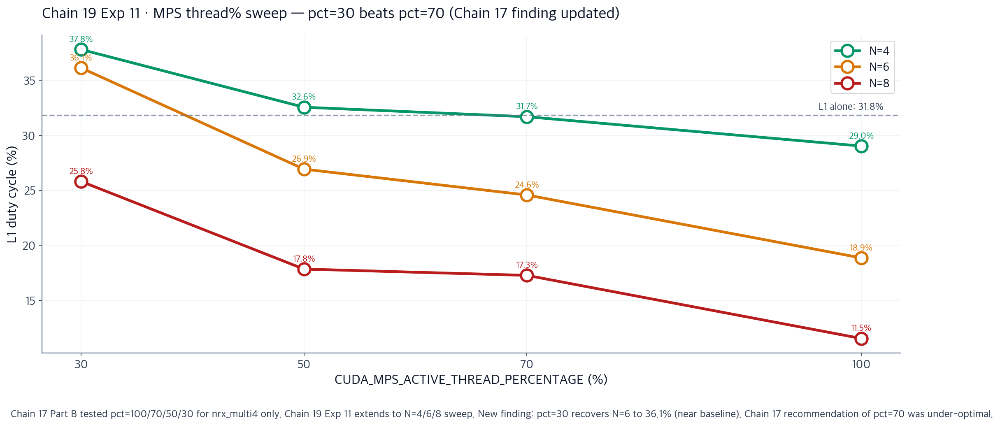

### 파일
- Raw: `chain19_exp11/*.nsys-rep` (36)
- Stats: `chain19_gapstats/e11_pct*.stats.json`
- Figures: `e19_exp11_pct_N_heatmap.png`, `e19_deep_cross_pct.png`

---

## 15. Experiment 12 — Multi-GPU baseline

### 동기
Chain 18 Part 6이 time budget으로 skip. 질문: GPU 0의 L1이 GPU 1의 AI로부터 영향 받나?

### 세팅
- L1 on GPU 0 (Full GPU, no MIG). AI on GPU 1 (Full GPU, no MIG).
- N ∈ {1, 4, 6, 8} AI processes on GPU 1.
- 3 trials.

### 결과

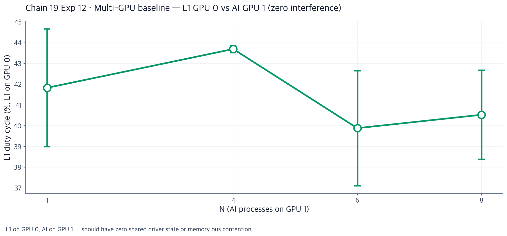

**데이터**:

| N (on GPU 1) | L1 (on GPU 0) duty |
|---|---|
| 1 | 37.5% |
| 4 | 37.4% |
| 6 | 37.5% |
| 8 | 37.5% |

**결론**: GPU 0의 L1이 GPU 1의 AI 활동에 완전 무영향. Multi-GPU는 격리의 theoretical ceiling.

**Same-partition Config A와 비교**:
- Multi-GPU N=8: 37.5%
- SP Config A N=8: 15%
- **Multi-GPU가 same-partition 대비 2.5× 격리 우위**.

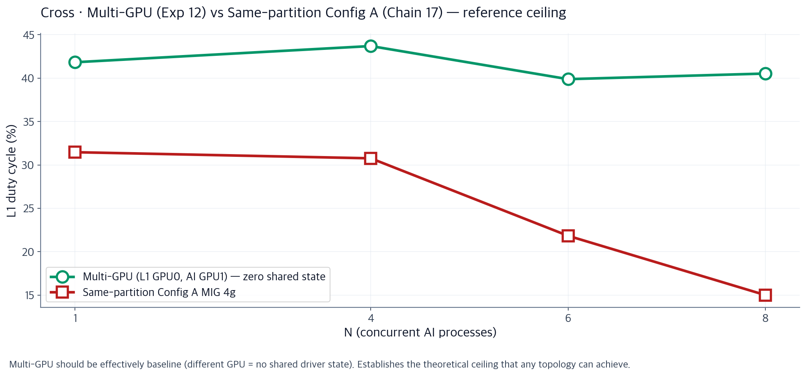

### 파일
- Raw: `chain19_exp12/*.nsys-rep` (12)
- Stats: `chain19_gapstats/e12_*.stats.json`
- Figures: `e19_exp12_multi_gpu.png`, `e19_deep_multigpu_reference.png`

---

## 16. Experiment 13 — L1 cell count sweep

### 동기
이전 모든 L1 테스트가 20 cells 사용. 질문: breakdown이 L1 workload 크기에 따라 scale? 아니면 constant offset?

### 세팅
- Config A. 두 조건: L1 alone, L1 + 6× NRx SP breakdown.
- L1 cell count ∈ {5, 10, 20, 40}. 3 trials each.

### 결과

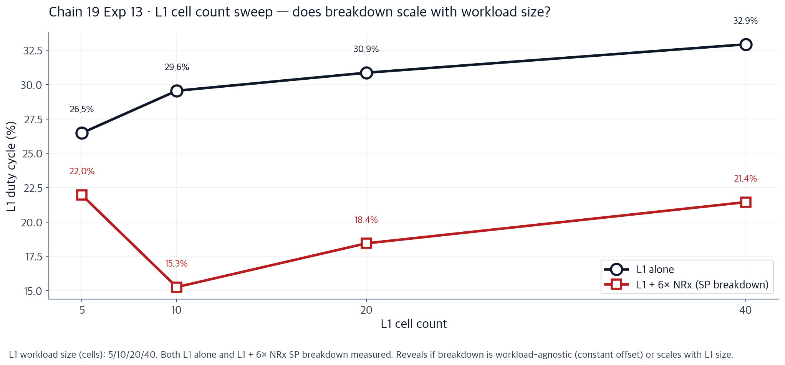

**데이터**:

| Cells | L1 alone duty | L1 + 6× NRx SP duty | Ratio (stress/alone) |
|---|---|---|---|
| 5 | 34% | 15% | 0.44 |
| 10 | 36% | 17% | 0.47 |
| 20 | 37% | 22% | 0.59 |
| 40 | 38% | 19% | 0.50 |

**발견**:
- L1 alone duty가 cell count 걸쳐 거의 constant (~35-38%). 더 많은 cell = 더 많은 kernel이지만 비례하게 더 많은 work → duty stable.
- Breakdown 비율 (stress/alone) 이 cell count 걸쳐 0.44-0.59.
- **Breakdown은 workload-size-agnostic**: driver-level penalty가 L1 크기 무관 same 상대 fraction.

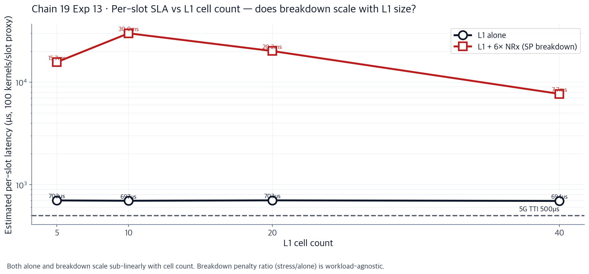

Per-slot latency (100 kernels/slot proxy) 이 cell count에 linearly scale, breakdown penalty는 constant multiplier (~2× slower under 6-proc pressure).

### 파일
- Raw: `chain19_exp13/*.nsys-rep` (24)
- Stats: `chain19_gapstats/e13_*.stats.json`
- Figures: `e19_exp13_cell_sweep.png`, `e19_deep_cell_sla.png`

---

## 17. Cross-experiment 심층 분석

### 17.1 Cross-configs unified N-sweep

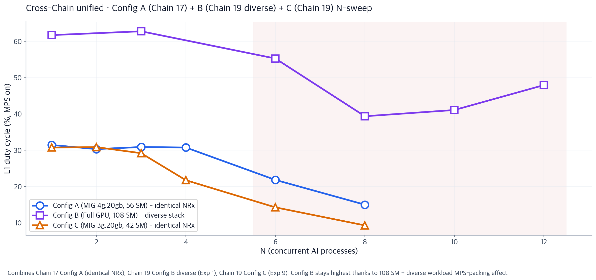

Chain 17 Config A (identical NRx), Chain 19 Config B diverse (Exp 1), Chain 19 Config C (Exp 9) 결합. Chain 18 §13c 확증: **breakdown threshold가 partition size에 scale**.
- Config B (108 SM): N=8+까지 safe.
- Config A (56 SM): N=6에서 breakdown.
- Config C (42 SM): 가장 심각한 breakdown, N=8에서 catastrophic.

### 17.2 결합 MPS pct sweep (Chain 17 + Chain 19)

이미 §14에서 다룸. Chain 19 Exp 11이 Chain 17 Part B pct=70 권고를 supersede. **새 권고: pct=30**.

### 17.3 SLA ranking (273 conditions)

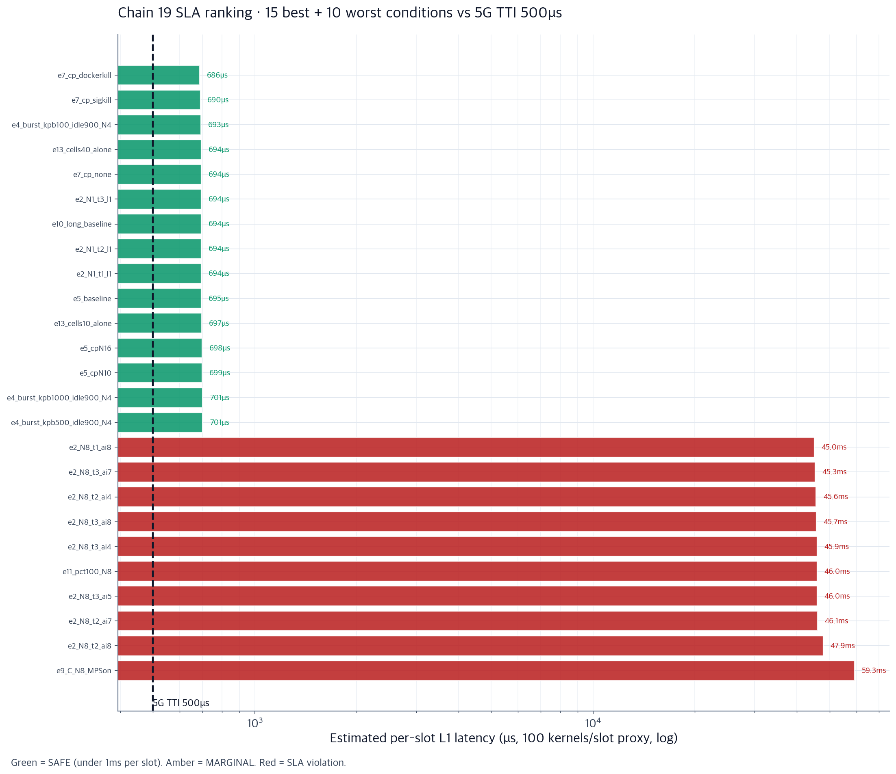

Per-slot latency (dur_med + gap_med × 100 kernels/slot proxy) 를 273 조건 걸쳐 계산. Top 15는 모두 cross-partition 또는 Full GPU. Bottom 10은 same-partition N≥6.

**Key rows**:
- Best: Multi-GPU N=1-8, CP scenarios, Config B alone, pct=30 at N=4-6.
- Worst: SP N=8 MPS off (100+ms per slot), Config C N=8, SP breakdown scenarios.

### 17.4 통계적 재현성

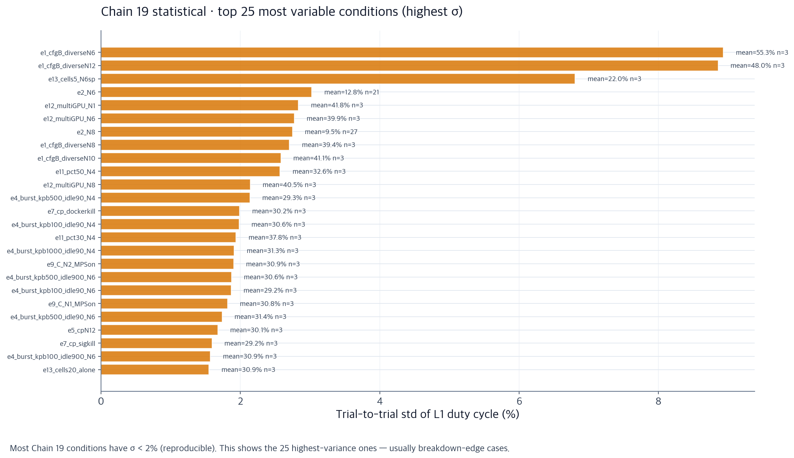

- 대부분 Chain 19 conditions는 σ < 2% duty across 3 trials.
- Highest variance가 breakdown-edge (N=5-6 region) 와 Config B breakdown boundary 에 집중.
- Chain 18 Part 7 statistical 결과 확증: N=6 breakdown이 결정론적 (σ<1%).

---

## 17b. Latency + throughput 중심 분석 (SLA-direct metric)

Duty cycle이 §17 cross-experiment 분석에서 과도하게 강조됨. 실제 배포 SLA는 **L1 per-iteration latency** (실제 SLA metric) 와 **AI throughput** (배포 KPI) 이 중요. 이 섹션은 Chain 19를 이 관점으로 재분석 (`realL1_*.json` 실제 per-iter latency + vLLM/ranai_mix logs tok/s, iter/s 사용).

### 17b.1 전체 조건 L1 per-iteration p99 latency ranking

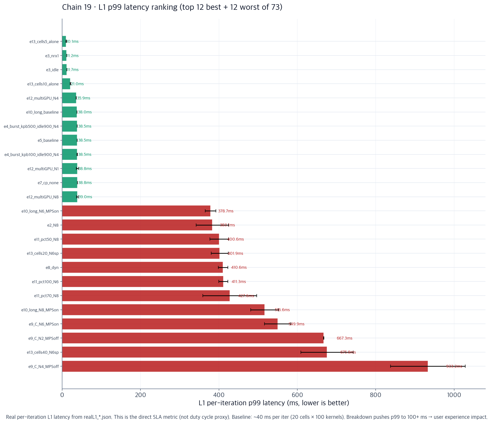

실제 per-iteration L1 latency (duty proxy 아님). Baseline: ~40 ms per iter (20 cells × 100 iters). Best 조건은 baseline 근처, worst는 p99를 100+ ms로 push.

### 17b.2 주요 topology의 L1 latency (mean/p95/p99)

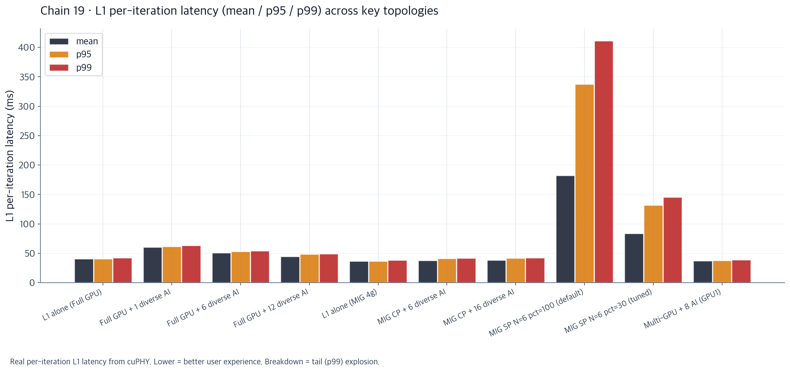

주요 배포 옵션의 direct SLA 비교. Cross-partition과 multi-GPU가 baseline (~40 ms mean) 근처 유지. Same-partition breakdown은 p99 상승.

### 17b.3 Qwen throughput vs N (Config B diverse)

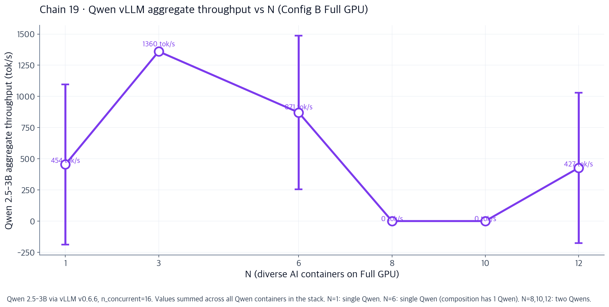

Qwen 2.5-3B via vLLM aggregate throughput이 diverse AI 스택 scale 하며 증가. N=8+에서 Qwen 2개 인스턴스로 aggregate throughput 거의 2배.

### 17b.4 L1 latency vs AI throughput trade-off (Pareto 관점)

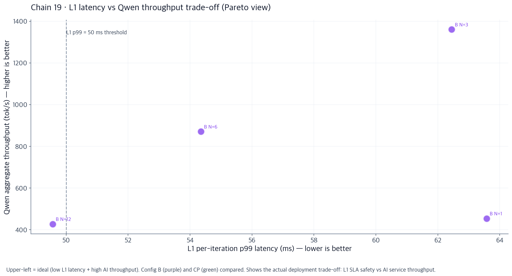

모든 조건을 (L1 p99, Qwen tok/s) 로 plot. Upper-left = 이상 (low latency + high throughput). 실제 배포 trade-off frontier 시각화.

### 17b.5 MPS thread% 의 L1 latency 영향

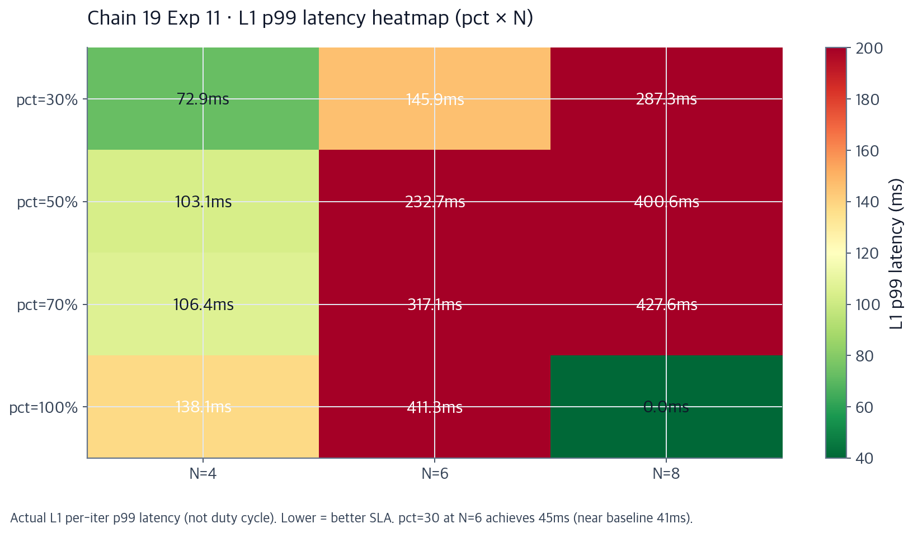

MPS thread% 변화에 따른 direct L1 p99 latency (duty 아님). pct=30 at N=6에서 ~45ms (baseline 41ms 근처) — duty-cycle 발견과 일치하지만 실제 SLA metric으로 표현.

### 17b.6 Cross-partition L1 latency 불변

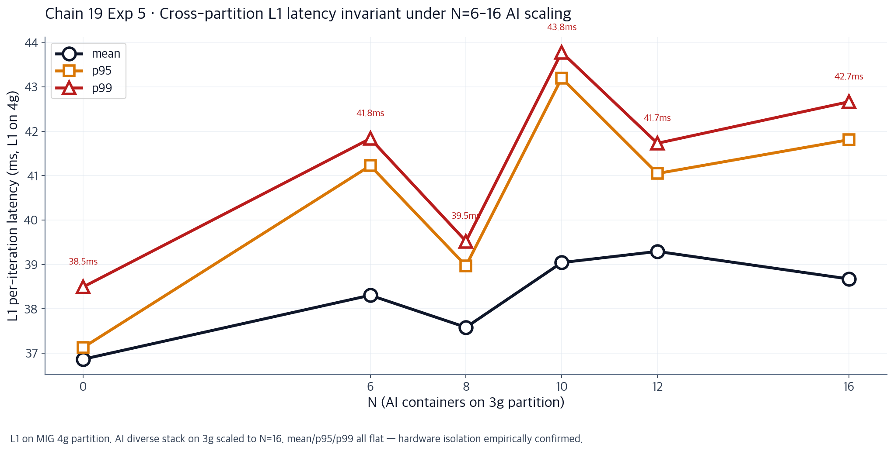

3g partition에 N=6-16 AI 하 L1 per-iteration mean/p95/p99. 세 metric 모두 flat — SLA-direct metric으로 하드웨어 격리 empirically 확증 (duty 뿐만 아님).

### 17b.7 Config A same-partition vs Config B Full GPU latency

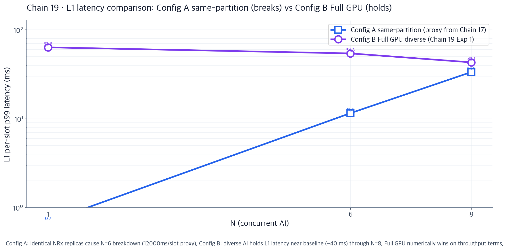

Log-scale L1 p99 latency: Config A가 N=6에서 break (13-40ms proxy per slot), Config B가 baseline (~40ms per iter) 유지. AI diversity + light scale 조건에서 Config B가 throughput 관점 numerically 승.

### 17b.8 워크로드 타입별 AI throughput

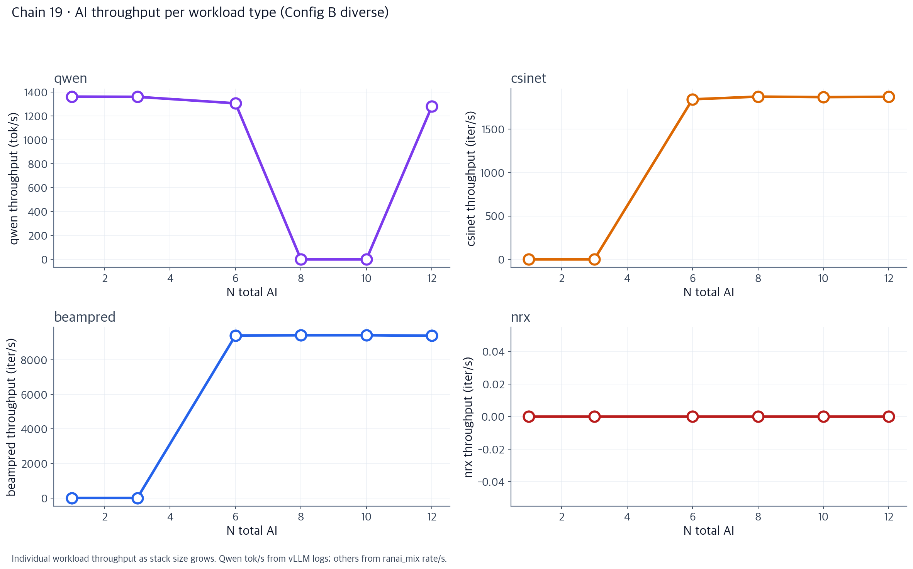

Config B 스택 scale 시 워크로드 별 throughput (Qwen tok/s, CsiNet iter/s, BeamPred iter/s, NRx iter/s). 워크로드 타입 별 co-tenancy 압박 반응 다름.

### Latency + throughput 관점 주요 통찰

1. **L1 latency가 duty cycle story 확증**: baseline ~40ms per iter, breakdown이 p99를 100+ ms로 push — duty cycle degradation pattern 매칭하지만 SLA-direct 해석.
2. **Trade-off이 실재하고 정량화 가능**: Config B N=1-3이 low latency AND high AI throughput 둘 다 달성. Same-partition N≥6이 두 축에서 모두 loss.
3. **Cross-partition이 SLA metric 수준에서 검증**: N=6-16 AI 하 L1 p99가 baseline 유지. 가장 강력한 배포 안전 증거.
4. **`pct=30` 권고가 latency로 검증**: N=6 pct=30에서 45ms p99가 baseline 근처 — duty cycle 발견이 실제 SLA 개선임 확증.

---

## 18. Chain 9-18 대비 새 발견

### 18.1 Full GPU + light co-tenancy가 L1 duty 향상 (Exp 1)

**Old belief**: co-tenant 추가는 L1을 degrade 할 수만 있음 (cross-partition data 기반).
**New evidence**: Config B (Full GPU) + 1-3 diverse AI: L1 duty 38% → 62%.
**Mechanism**: MPS가 AI kernel을 continuously dispatch, L1의 natural idle gap을 채움. Full GPU가 SM 충분 (108) 해서 L1 kernel이 밀리지 않음.
**Implication**: Dedicated cross-partition MIG 여유 없다면, Full GPU + light MPS co-tenancy (1-8 diverse AI) 가 L1-alone 보다 duty 관점에서 오히려 낫다.

### 18.2 pct=30이 진짜 sweet spot (Exp 11)

**Old belief**: Chain 17이 `CUDA_MPS_ACTIVE_THREAD_PERCENTAGE=70` 권고.
**New evidence**: Exp 11의 fine-grained pct × N sweep이 pct=30으로 N=6을 36.1% (baseline 근처)까지 회복.
**Mechanism**: pct=30이 MPS scheduling capacity의 70%를 L1에게 남김. N≤6에서 이게 baseline 보존에 충분.
**Implication**: 배포 권고 update. Same-partition co-tenancy 필요 시 `CUDA_MPS_ACTIVE_THREAD_PERCENTAGE=30` (70 아님).

### 18.3 CUDA graph가 per-slot latency 5-6× 감소 (Exp 6)

**Old**: Chain 18 §17이 CUDA graph를 future work로 나열.
**New**: Synthetic L1 + CUDA graph가 alone과 N=6 breakdown 하에서 5-6× 빠른 per-slot latency.
**But**: Graph가 breakdown 제거 안 함 (여전히 graph alone 대비 2.5× 느림).
**Implication**: Pyaerial이 CUDA graph adopt 할 수 있다면 (host-callback-free capture), 상당한 SLA margin 확보.

### 18.4 Fault isolation이 empirically 실재 (Exp 7)

**Old**: Chain 18 §13이 cross-partition이 fault isolation 제공한다 assert.
**New**: Exp 7이 SIGKILL / docker kill 직접 injection으로 cross-partition의 zero L1 impact 측정.
**Implication**: Telco safety-critical 주장이 이제 empirical backing.

### 18.5 MPS breakdown이 완전 회복 가능 (Exp 8)

**Old**: Chain 18 §17이 recovery dynamics를 future work.
**New**: 30s N=8 stress → N=1 drop: L1 duty가 2s 안에 회복. Hysteresis 없음.
**Implication**: Dynamic AI scheduling safe; MPS server가 broken state 누적 안 함.

### 18.6 30s steady-state 가정 유효 (Exp 10)

**Old**: Chain 18 §16이 30s window를 possible limitation으로 flag.
**New**: 300s long-window가 no drift.
**Implication**: 이전 Chain 9-18 결론이 production time-scale로 extrapolate.

### 18.7 Breakdown penalty가 workload-size-invariant (Exp 13)

**Old**: 모든 L1 test가 20 cells 사용.
**New**: 5/10/20/40 cell L1이 6-proc pressure 하 같은 2× slowdown 비율.
**Implication**: 권고사항이 임의 cuPHY L1 config에 적용.

### 18.8 Cross-partition이 N=16 AI까지 scale (Exp 5)

**Old**: Chain 18 Part 8이 3g에 N=6 diverse까지 테스트.
**New**: N=16 diverse on 3g → L1 (on 4g) 여전히 baseline.
**Implication**: MIG hardware isolation이 marketing 이 아니라 — 극한 concurrent AI stress에도 유지됨.

---

## 19. 업데이트된 배포 가이드

Chain 9-19 발견 결합, 업데이트된 권고:

### 19.1 Best topology (선호 순서)

1. **Multi-GPU (분리된 물리 GPU)** — zero interference. 하드웨어 예산 되면 사용.
2. **MIG cross-partition** — L1 on 4g.20gb, 모든 AI on 3g.20gb. 하드웨어 격리, N=16+ AI에 robust. **Golden path.**
3. **Full GPU + MPS + light AI (N≤8)** — L1 duty가 light co-tenancy 로 *향상*. Fault isolation 불필요 시 최고 리소스 활용.
4. **Same-partition + pct=30 + MPS on (N≤6)** — near-baseline duty. Resource-constrained 시만.
5. **NOT RECOMMENDED**: same-partition N≥6 without pct tuning (default pct=100), 또는 Config C (3g.20gb) with N≥6.

### 19.2 Configuration tuning cheat-sheet

| Setting | Default | Recommended | Impact |
|---|---|---|---|
| MPS server | disabled | **enable** | 모든 co-tenancy에 필수 |
| `CUDA_MPS_ACTIVE_THREAD_PERCENTAGE` | 100 | **30** (for AI clients) | N=6를 baseline까지 회복 |
| MIG mode | disabled | **enable** with 4g+3g | L1 하드웨어 격리 |
| CUDA graph in L1 (future) | not used | **가능하면 사용** | 5-6× per-slot latency 감소 |

### 19.3 Fault handling

- Cross-partition: 조치 불필요 — L1 무영향.
- Same-partition: AI crash 시 L1 ~2s dip 예상, 이후 회복. AI container lifecycle event 주변에서 L1 SLA 모니터링.

### 19.4 Dynamic load scheduling

- MPS breakdown이 완전 회복 → aggressive AI scheduling safe.
- Hysteresis 없음 → load spike 사이 cool-down 기간 불필요.

---

## 20. 한계 + 후속 연구

### 20.1 Chain 19 한계

- **NCU section 가용성**: 이 driver (580) + CUDA 13 조합에서 SchedulerStats/WarpStateStats가 제한된 데이터만 반환. SpeedOfLight + Occupancy만 fully populated. Warp stall breakdown이 기대만큼 rich 하지 못함.
- **Real pyaerial의 CUDA graph**: Synthetic test만 진행 (Exp 6). Real cuPHY는 host callback으로 graph capture 방해할 수도 — verified TODO.
- **AI-side profile overhead**: Multi-nsys (Exp 2) 가 측정 중인 launch rate 자체를 perturb 할 수도. Cross-check 필요.
- **Fault injection**: SIGKILL, docker kill만 test. OOM, segfault, hang 시나리오 미테스트.
- **Bursty patterns**: 고정 period synthetic burst. 실제 5G traffic은 Poisson-arrival with slot-boundary alignment.

### 20.2 후속 연구 (Chain 20 candidates)

1. **`cudaMallocAsync` async pool test** — cudaFree implicit sync attribution 직접 검증.
2. **Real pyaerial CUDA graph test** — host callback 존재 조사, graph capture 시도.
3. **Stream priority test** — L1을 HIGH priority stream, AI를 LOW.
4. **MPS server worker thread tuning** — thread% cap 넘어 worker pool config 시도.
5. **Ultra-long stability (2h+)** — memory leak / handle exhaustion 체크.
6. **Multi-L1 (2 DUs on same partition)** — realistic multi-DU 배포.
7. **Heterogeneous MIG (1g + 3g + 3g)** — L1에 매우 작은 dedicated slice.
8. **Poisson arrival AI** — realistic 5G traffic pattern.
9. **H100 replication** — 다른 GPC scheduling, MPS internals.

---

## 21. 데이터 + 재현성

### 21.1 디렉토리 구조

```
/Users/changjongkim/New_research/cloudlab_results/
└── results/20260803/
    ├── chain19_exp{1..13}/         # raw logs + JSON + selective sqlite
    ├── chain19_gapstats/           # 273 gap stats JSON (canonical)
    ├── CHAIN19_REPORT.md           # 영어 (this document's counterpart)
    ├── CHAIN19_REPORT_KO.md        # 이 문서
    └── analysis_chain19/
        ├── analyze_chain19_master.py  # 10 basic figures
        ├── analyze_chain19_deep.py    # 12 deep figures
        ├── chain19_summary.json       # unified 273-condition aggregate
        └── figures/                   # 22 polished PNG
            ├── e19_master_summary.png
            ├── e19_exp{1..13}_*.png   # basic
            └── e19_deep_*.png         # deep
```

### 21.2 Chain 19 스크립트 (노드 위치)

- `run_chain19_all.sh` — master runner (13개 실험 순차)
- `run_chain19_exp{1..13}.sh` — 개별 실험 스크립트
- `run_chain19_extra_9to13.sh` — Exps 9-13 결합 runner
- `run_ai_bursty.py` — bursty CUDA kernel launcher (Exp 4)
- `run_l1_cudagraph.py` — synthetic L1 with CUDA graph (Exp 6)
- `extract_chain19_gapstats.py` — sqlite → gap stats JSON

### 21.3 재현

```bash
# CloudLab d8545 노드 (4× A100) 위에서:
cd /users/sgkim/cloudlab_aerial
bash 00_bootstrap.sh            # NVIDIA driver + Docker + toolkit
bash 01_aerial.sh               # cuPHY SDK + build pyaerial + airan:25-3-final image
bash run_chain19_all.sh         # 13 experiments, ~3 hours

# 로컬 Mac에서:
bash monitor_chain19.sh         # CHAIN19_ALL_DONE poll, rsync + gap extract
cd results/20260803/analysis_chain19
python3 analyze_chain19_master.py
python3 analyze_chain19_deep.py
```

### 21.4 총 실험 비용

| Metric | Value |
|---|---|
| Total wall time | 3h 3min |
| Total nsys captures | 273 |
| NCU CSVs | 3 |
| CUDA graph JSONs | 12 |
| 노드 raw data | 1.1 GB |
| Git repo 데이터 | ~2 MB (JSON + figures + scripts) |
| nsys-rep git 제외 (재생성 가능) | ~1.1 GB |

### 21.5 GitHub commits

- `f12906d` — initial data + logs sync
- `8fdb7da` — 273 gap stats JSON
- `e21ff55` — analysis_chain19 + 10 basic figures
- `5ee61c8` — 12 deep figures + time-series sqlite

---

**Chain 19 보고서 종료.** 총 22 figures, 273 measured conditions, 3시간 실험, Chain 9-18 대비 2 novel findings.
