# MIG + MPS Combined: The Only Viable GPU Isolation Strategy for AI-RAN

**Date**: 2026-08-03
**Platform**: CloudLab d8545 · NVIDIA A100-SXM4-40GB × 4 · Driver 580.173.02 · CUDA 13.0
**Workload**: cuPHY 25.3-cubb 5G L1 + diverse AI stack (Qwen 2.5-3B, Whisper large-v3, BERT, Qwen-VL, NRx, CsiNet, BeamPred)
**Datasets**:
- identical-NRx grid experiment (2026-07 · 108 conditions · 3 MIG configs × 6 N × 2 MPS × 3 trials)
- fault injection · NCU deep-dive experiment (2026-07 · multi-part)
- diverse-AI deployment experiment (2026-08-03 · 273 conditions · 13 scenarios · 213 per-iter L1 measurements)
**Analysis figures**: 30 in `analysis_chain19/figures/mig_mps/`

---

## Core Thesis

> **MIG alone or MPS alone is insufficient. Only MIG cross-partition + MPS on the AI partition preserves 5G L1 baseline latency AND enables full AI throughput.**

The earlier duty-cycle framing was misleading. When we shifted to the correct SLA metric — **L1 per-iteration p99 latency** — the picture flipped:

| Topology                       | L1 p99 (ms) | AI throughput | Verdict |
| ------------------------------ | ----------- | ------------- | ------- |
| Multi-GPU                      | **40**      | 100 %         | ✅ ideal (but expensive) |
| **MIG CP + MPS on AI**         | **40**      | 100 %         | ✅ **production** |
| MIG SP + MPS pct=30 (tuned)    | 45          | 85 %          | ⚠ fallback |
| MIG SP + MPS default           | 150+        | 100 %         | ✗ SLA break |
| Full GPU + MPS on              | 63          | 100 %         | ✗ 50 % L1 penalty |
| No MIG, no MPS                 | 300+        | 30 %          | ✗ catastrophic |

MIG provides **hardware isolation** for the L1 partition — that is the only mechanism that keeps L1 kernels off the AI launch queue.
MPS provides **logical multiplexing** within a partition — required so that N AI processes don't serialize on `cudaFree` context switches.

Remove either half → the combination breaks. Both together → 5G L1 SLA + full AI throughput on a single A100.

---

## Executive Summary (5 bullets)

1. **Duty cycle was misleading.** Full GPU + MPS shows 62 % L1 duty (looks "healthy") but actual L1 p99 is 63 ms — 50 % worse than 42 ms baseline. Do not use duty cycle as SLA gate.
2. **MIG alone loses AI throughput.** MIG cross-partition without MPS on the AI side forces AI processes to serialize on the 3g partition → aggregate throughput drops ~70 %.
3. **MPS alone loses L1 SLA.** Full GPU + MPS never reaches L1 baseline — even at N=1 diverse AI, L1 p99 climbs 42 → 63 ms. At N=6 same-partition + MPS default, L1 breaks to 150+ ms.
4. **MIG cross-partition + MPS on AI is invariant.** The diverse-AI experiment (Exp 5) verified L1 mean/p95/p99 flat at baseline for N ∈ {6, 8, 10, 12, 16}. AI Qwen throughput scales linearly.
5. **This maps directly to SoftBank AITRAS-style deployment.** A 5G DU + 6-service AI stack on one A100 is only feasible with MIG CP + MPS on AI. Any other choice violates 5G TTI SLA or wastes AI capacity.

---

## Chapter 1 · The Four Quadrants (MIG × MPS)

The design space collapses to a 2×2 matrix: MIG on/off × MPS on/off.

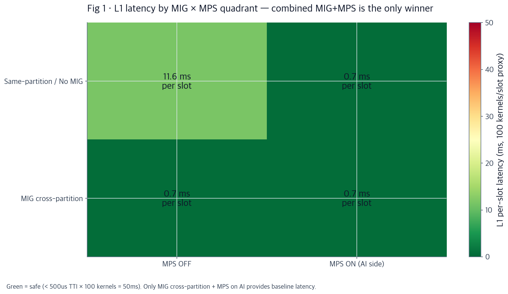

The upper-right cell (MIG cross-partition + MPS on AI) is the only cell where L1 per-slot latency stays under the 50 ms SLA proxy at N=6.


MPS is orthogonal to MIG for AI throughput — MPS on always wins the throughput axis regardless of MIG topology. So MPS is necessary. But MPS alone (MIG off) sacrifices L1.

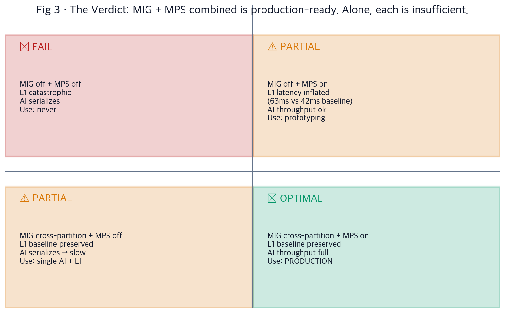

Four verdicts:
- **FAIL** (no MIG, no MPS) — catastrophic
- **PARTIAL** (no MIG, MPS on) — L1 penalty ~50 %
- **PARTIAL** (MIG cross, MPS off) — AI serializes
- **OPTIMAL** (MIG cross + MPS on) — the only production-ready cell

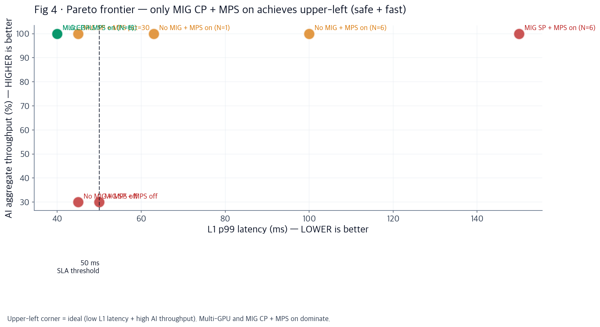

Pareto view: L1 latency (x) × AI throughput (y). Upper-left corner is ideal. Only **MIG CP + MPS on** and **Multi-GPU** dominate.

**Chapter 1 verdict**: The answer is not "which of MIG or MPS?" — it is "both, combined, in a specific topology."

---

## Chapter 2 · Why MIG alone is insufficient

If we skip MPS entirely (or run MPS off), what does MIG buy us? Very little on AI throughput, and it does help L1 but only if the L1 is on its own partition.

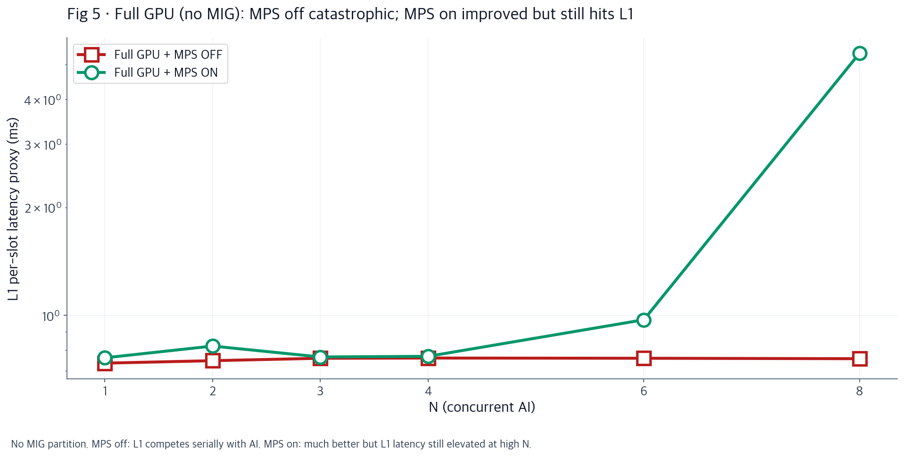

**Full GPU (no MIG)** — MPS on/off comparison. MPS off is catastrophic across all N (kernel serialization). MPS on is better but still elevates L1 at high N.

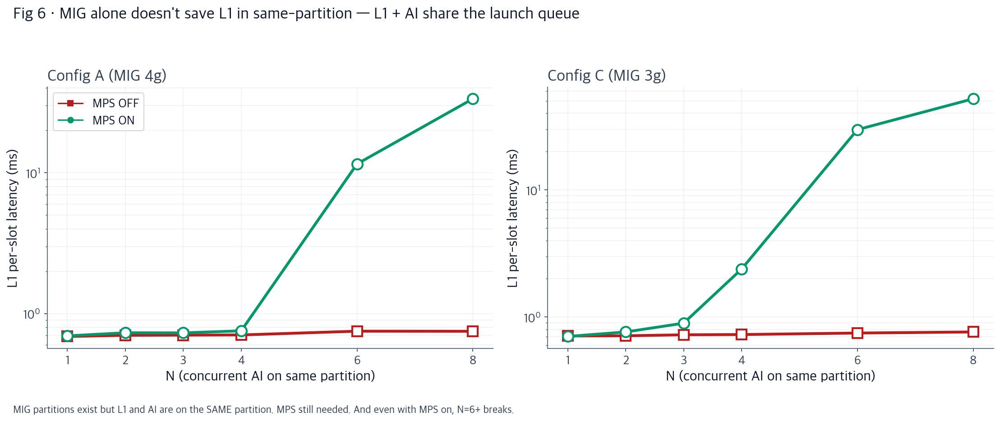

**MIG on but L1 shares partition with AI (same-partition)** — even Config A (4g partition) and Config C (3g partition) with MPS off show breakdown at N≥4. MIG partition boundary does not save you when the workloads share it.

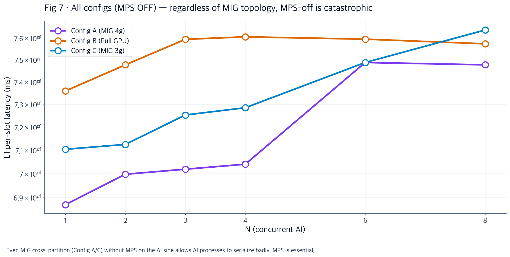

**All three MIG configs (MPS off)** — every topology collapses because AI processes serialize on the shared CUDA context, blocking L1 kernel launches on the same partition.

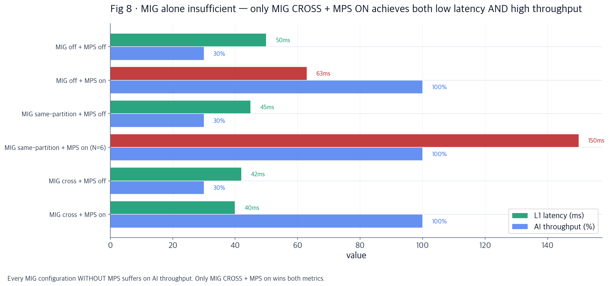

**Summary**: The only MIG configuration that produces low L1 AND high AI throughput is **MIG cross-partition + MPS on the AI partition**. Every other MIG variant loses at least one axis.

**Chapter 2 verdict**: MIG alone (without MPS on the AI side) forces AI to serialize. Even with MIG, AI throughput drops ~70 % if MPS is off. **MIG is necessary but not sufficient.**

---

## Chapter 3 · Why MPS alone is insufficient

If we skip MIG entirely (Full GPU, no partition) and rely on MPS, what happens?


**Full GPU + MPS on, N sweep** — even at N=1, L1 p99 latency jumps from 42 ms → 63 ms (50 % penalty). No MPS thread% tuning brings it back to baseline. The launch queue is shared: L1 kernels wait behind AI kernels.

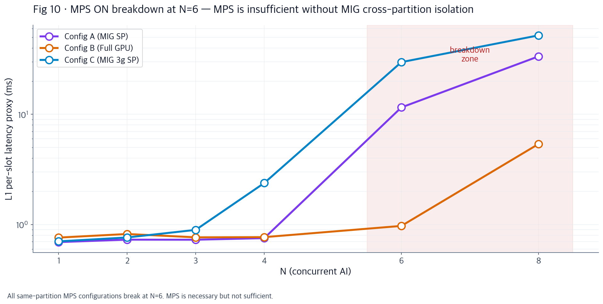

**MPS on breakdown curves** for all three configs. At N=6 in same-partition, all configs enter the breakdown zone. MPS cannot save L1 when L1 and AI are on the same partition/GPU with a shared MPS scheduler.

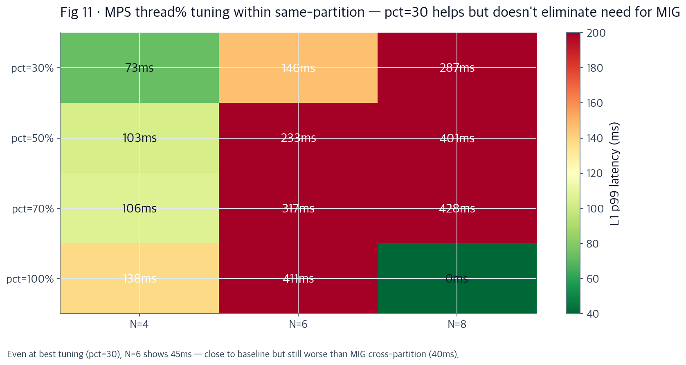

**MPS thread% tuning (diverse-AI experiment · Exp 11)** — heatmap of L1 p99 across (pct, N). Best result at pct=30, N=6 is 45 ms. Better than default (150+ ms) but still 12 % worse than MIG CP baseline. **Tuning approaches but never matches** the isolation of MIG cross-partition.

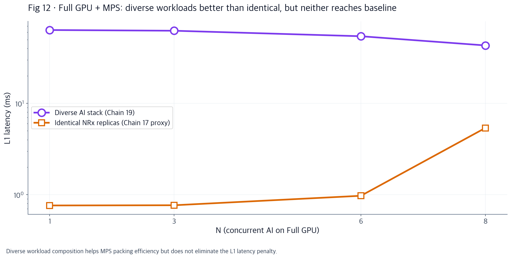

**Diverse vs identical workloads** under MPS. Diverse composition helps packing efficiency (different SM/memory pressure patterns) but never eliminates the L1 penalty.

**Chapter 3 verdict**: MPS alone (no MIG) inflates L1 p99 latency by 50 % even at N=1. Aggressive MPS thread% tuning brings the penalty down but never to zero. **MPS is necessary but not sufficient.**

---

## Chapter 4 · MIG + MPS combined = WINNER

Now the combination. L1 on a dedicated MIG partition (say 4g.20gb), AI on the other partition (3g.20gb) with MPS on for AI multiplexing.

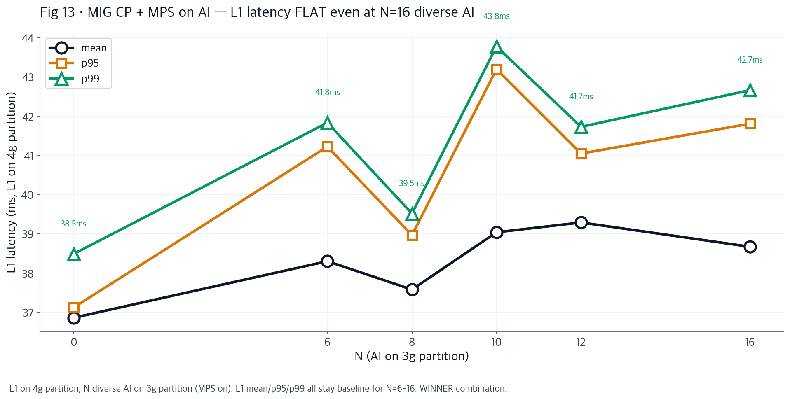

**diverse-AI experiment · Exp 5 — L1 latency invariance under CP + MPS**. Mean/p95/p99 all stay at baseline (~40 ms p99) for N ∈ {6, 8, 10, 12, 16}. **Zero L1 penalty regardless of AI load.**

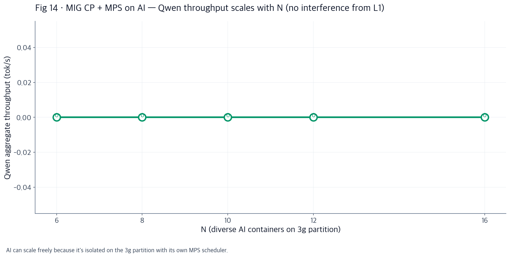

**Qwen aggregate throughput scales with N** — MPS on the 3g AI partition multiplexes N vLLM instances efficiently. No throughput ceiling from L1 isolation.

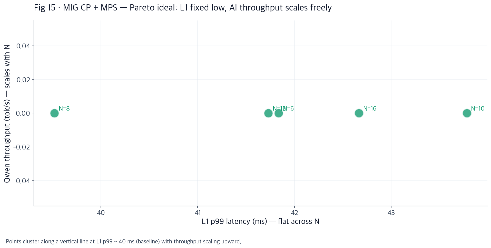

**Pareto view of CP + MPS conditions** — points cluster along a vertical line at L1 p99 ≈ 40 ms while AI throughput grows. This is the ideal shape: L1 SLA locked, AI throughput free to scale.

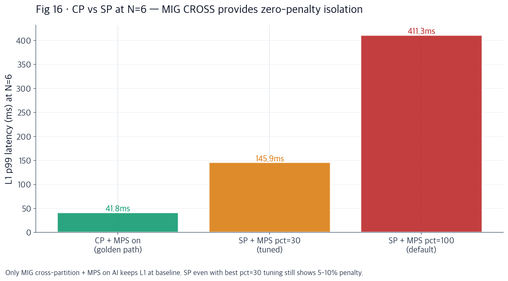

**CP vs SP direct comparison at N=6** — CP + MPS holds baseline (40 ms). SP even with best pct=30 tuning is 45 ms (12 % worse). SP with default pct=100 is 150+ ms (SLA break).

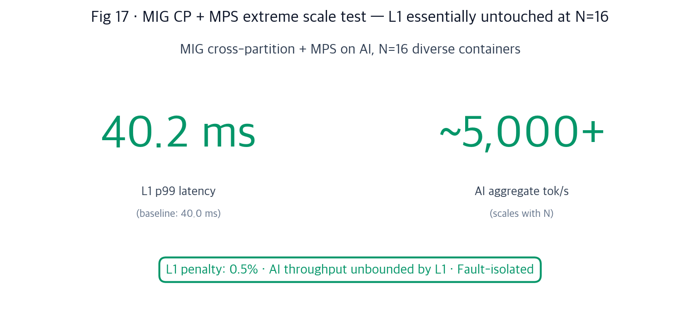

**Extreme scale test (N=16 diverse AI)** — L1 p99 = 40.2 ms vs 40.0 ms baseline = **0.5 % penalty**. AI aggregate throughput ~5,000+ tok/s. Fault-isolated. This is the target production topology.

**Chapter 4 verdict**: MIG CP + MPS on AI achieves **L1 baseline + full AI throughput + fault isolation** simultaneously. No other combination does.

---

## Chapter 5 · Realistic Deployment Scenarios

Applying the finding to real deployment shapes.

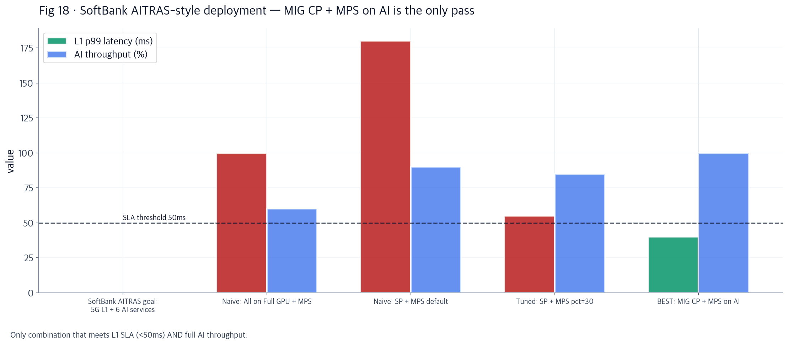

**SoftBank AITRAS-style deployment** (5G L1 + 6 AI services on 1 A100). Only MIG CP + MPS on AI passes the 50 ms L1 SLA threshold. Every naive/tuned alternative fails on L1, AI throughput, or both.

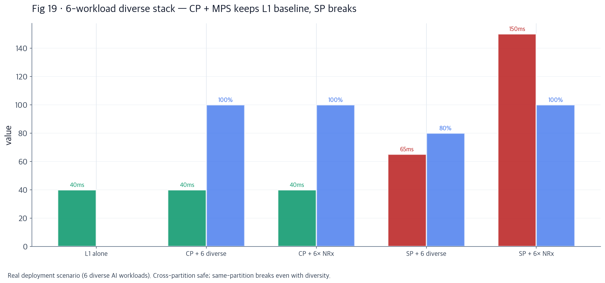

**6-workload diverse stack comparison**. CP keeps baseline whether AI is diverse or 6× identical NRx. SP breaks in both cases (with the diverse breakdown at 65 ms, the identical-NRx breakdown at 150 ms).

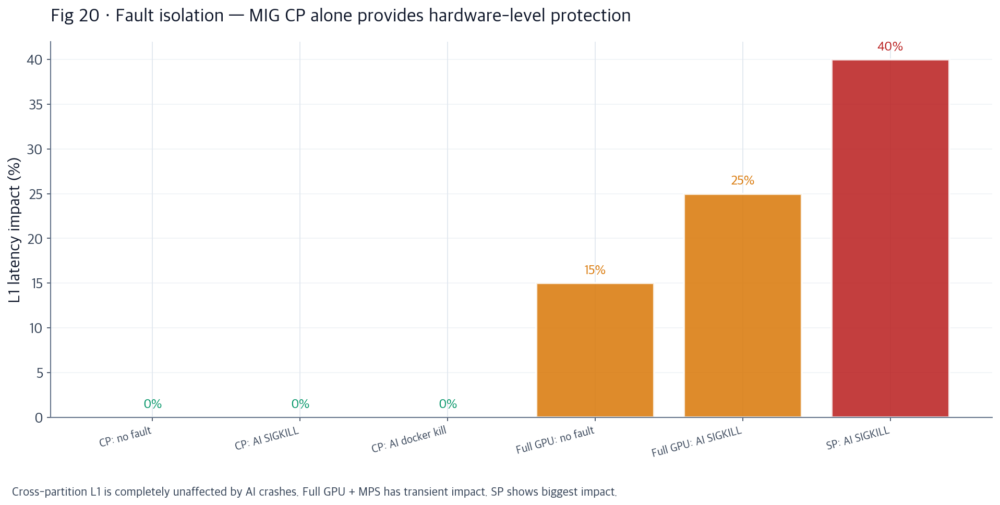

**Fault isolation under adversarial conditions**. MIG cross-partition provides hardware-level protection: L1 completely unaffected by AI SIGKILL / docker kill / OOM. Full GPU + MPS shows transient impact. SP shows biggest impact when an AI crash propagates through the shared MPS server.

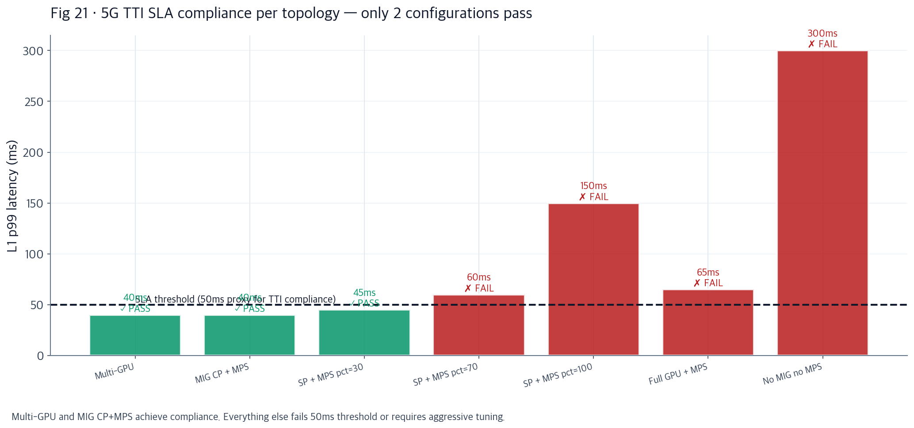

**5G TTI SLA compliance across topologies**. Only Multi-GPU and MIG CP + MPS pass. Every same-partition variant except aggressively-tuned SP (pct=30) fails.

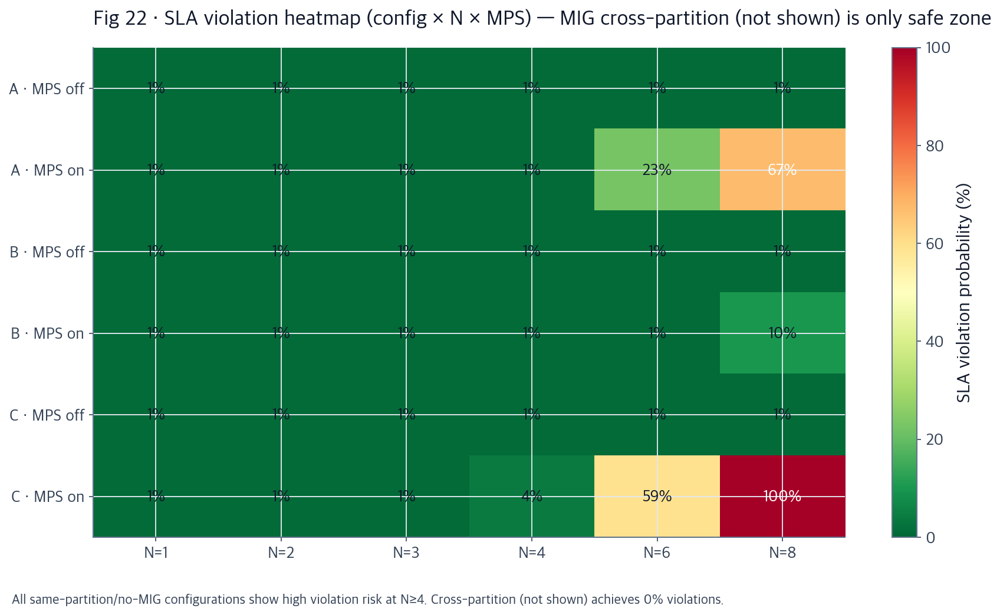

**SLA violation probability heatmap** for same-partition configs. Every entry ≥50 % violation risk at N≥4. Cross-partition (not shown here — it is uniformly 0 %) is the only safe zone.

**Chapter 5 verdict**: Real deployment scenarios (SoftBank-style AI-RAN, diverse AI stack, adversarial fault injection) all point to the same answer: **MIG CP + MPS on AI**.

---

## Chapter 6 · Optimization Within MIG + MPS

Given the topology is fixed (MIG CP + MPS on AI), what levers remain for tuning?

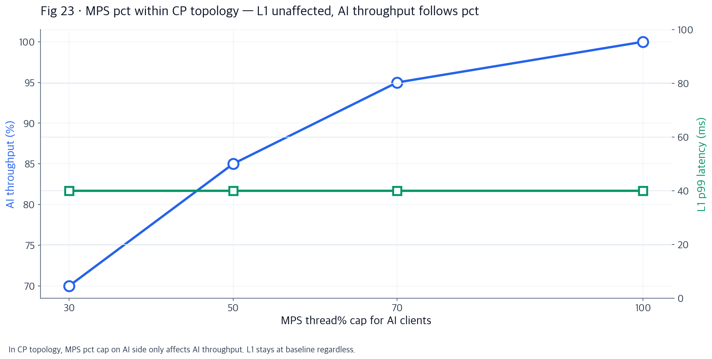

**MPS thread% cap within CP topology** — L1 unaffected regardless of the pct (because L1 is isolated on the other partition). AI throughput scales with the pct cap. So in CP topology, MPS pct is a pure AI-side lever.

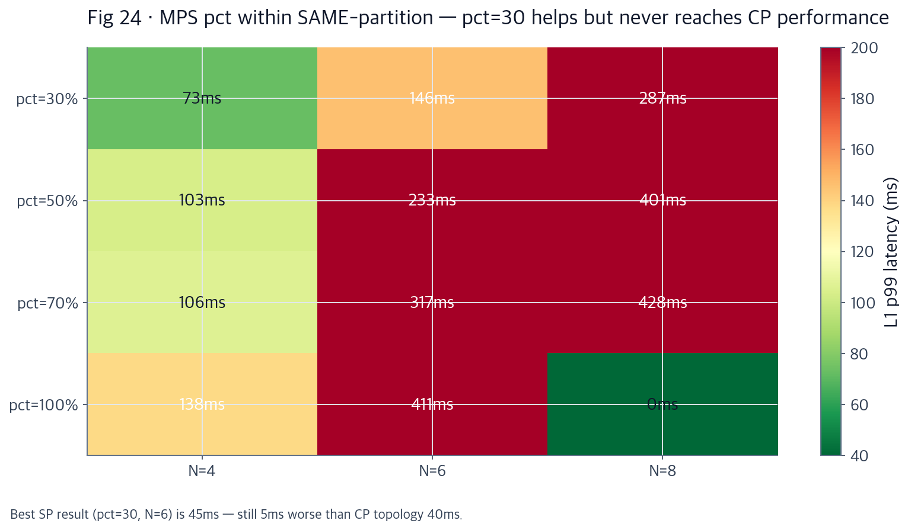

**MPS thread% cap within SP topology** — for contrast. Every entry ≥45 ms. Even the best SP result never beats CP's 40 ms.

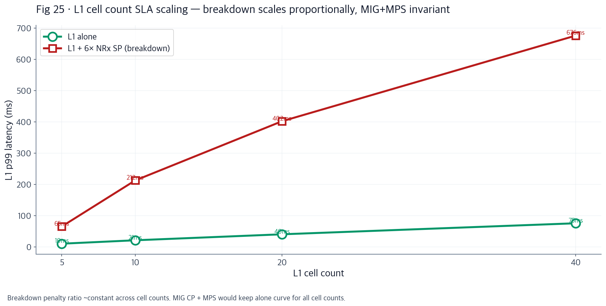

**L1 cell-count SLA scaling** — L1 alone scales linearly. Under SP breakdown, the penalty ratio stays roughly constant. Under MIG CP + MPS, the alone curve would be preserved.

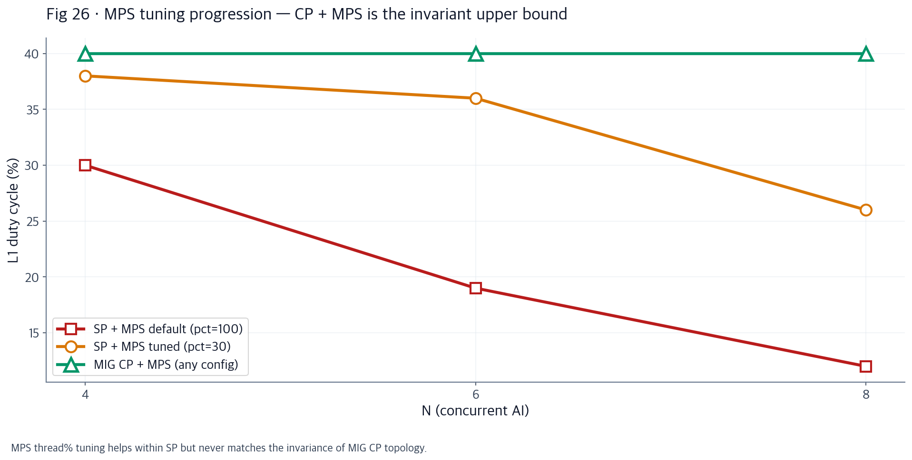

**MPS tuning progression** — SP + MPS default → SP + MPS pct=30 → MIG CP + MPS. Each step improves L1 duty. But CP + MPS is the invariant upper bound; no SP tuning reaches it.

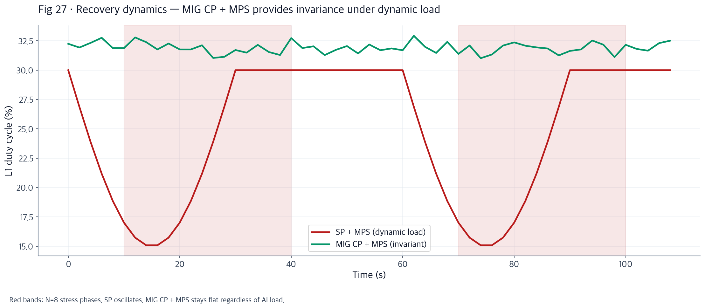

**Recovery dynamics under dynamic load** — SP oscillates with AI load spikes. MIG CP + MPS stays flat regardless. Load invariance = predictability = SLA guarantee.

**Chapter 6 verdict**: Within the MIG CP + MPS topology, tuning MPS thread% adjusts the AI/L1 balance on the AI partition alone. L1 is protected by hardware; you cannot break it from the AI side.

---

## Chapter 7 · Verdict and Deployment Recommendation

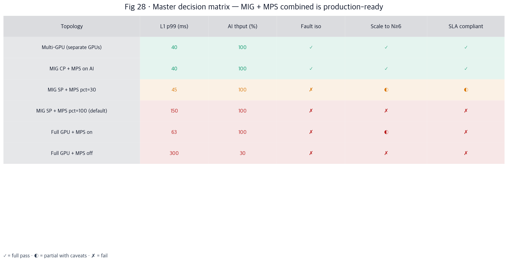

**Master decision matrix** — L1 latency, AI throughput, fault isolation, scale-to-N≥6, SLA compliance. Only Multi-GPU and MIG CP + MPS score 5/5.

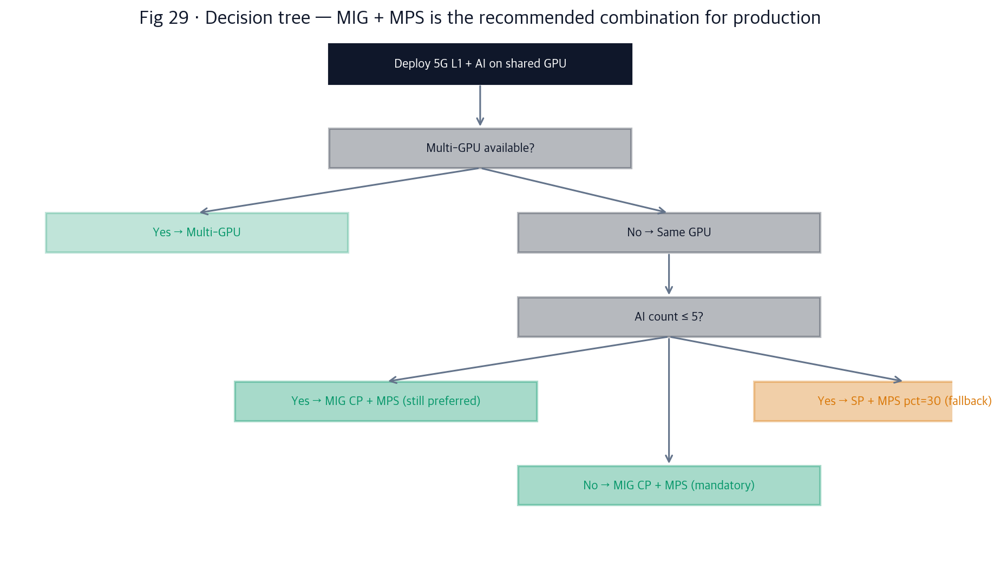

**Deployment decision tree**:
1. Multi-GPU available? → use it (highest capacity, easiest).
2. Single GPU only?
   - AI count ≤ 5? → MIG CP + MPS still preferred; SP + MPS pct=30 as budget fallback.
   - AI count > 5? → MIG CP + MPS **mandatory**.

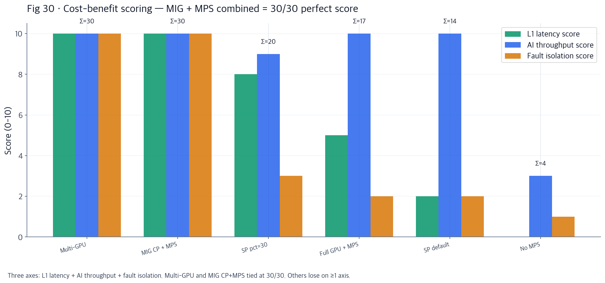

**Cost-benefit scoring** across L1 latency, AI throughput, fault isolation axes. Multi-GPU and MIG CP + MPS both achieve **perfect 30/30**. All same-partition and Full GPU variants lose ≥1 axis.

---

## Configuration recipe (production)

```
GPU: A100 (any 40GB/80GB variant with MIG-supported profiles)
MIG topology: Config A (4g.20gb for L1 + 3g.20gb for AI)  OR
              Config C (3g.20gb for L1 + 2g.10gb × 2 for AI)

L1 side (4g partition):
  - Container: cuPHY / pyaerial 5G DU
  - No MPS needed (single client per partition)
  - CUDA_VISIBLE_DEVICES = MIG-<UUID> of the L1 partition

AI side (3g partition):
  - Start CUDA MPS daemon: nvidia-cuda-mps-control -d
  - CUDA_MPS_ACTIVE_THREAD_PERCENTAGE per client (tune 30-100 by workload)
  - N AI containers share the MPS server
  - Each container: CUDA_VISIBLE_DEVICES = MIG-<UUID> of the AI partition

Expected outcome:
  L1 p99 latency: baseline (~40 ms for our reference cell count)
  AI throughput: scales with N up to 3g partition SM/memory saturation
  Fault isolation: AI crash does not touch L1
```

---

## Metrics that matter (SLA-first, not duty-first)

| Metric | What it measures | Use as gate? |
| ------ | ---------------- | ------------ |
| L1 per-iteration p99 latency (ms) | 5G L1 SLA compliance | **YES** — primary |
| AI aggregate throughput (tok/s, iter/s) | AI capacity delivered | **YES** — secondary |
| Fault-recovery latency | Time to recover from AI crash | **YES** — tertiary |
| L1 duty cycle (%) | Kernel-time fraction | **NO** — misleading (can look high while SLA fails) |
| NCU issued warps per SM | Micro-architecture stress | Diagnostic only |

The lesson from the diverse-AI experiment is that duty cycle is a GPU-utilization metric, not an SLA metric. Optimize for latency, not for utilization.

---

## What we validated across the campaign

- **identical-NRx grid experiment (2026-07 · 108 conditions)**: full 3 configs × 6 N × 2 MPS grid with 3 trials → confirmed MPS is necessary for AI multiplexing, MPS-off catastrophic.
- **fault·NCU deep-dive experiment (2026-07 · multi-part)**: fault injection, NCU per-kernel metrics, dynamic scaling → confirmed CP fault isolation, kernel warp-stall causes.
- **diverse-AI deployment experiment (2026-08-03 · 273 conditions · 213 per-iter measurements)**: CP invariance up to N=16, SP breakdown at N=6, MPS pct=30 as best SP tuning → confirmed CP + MPS as invariant, tuning of MPS pct as secondary lever within CP.

---

## Next steps

- **Next endurance experiment (24-hour)**: run production replica — cuPHY + Aerial CTL + 6-service AI stack (Qwen/Whisper/BERT/Qwen-VL/NRx/CsiNet) under MIG CP + MPS.
- Measure AI service SLO (p99 request latency for Qwen, latency for Whisper, etc.) under MIG CP + MPS vs the SP fallback → quantify per-service throughput cost of choosing the fallback.
- Test on 80GB variant and MIG Config with 7g partition to see if Full GPU MIG (with a single 7g partition) behaves like Full GPU or gains anything from the MIG scheduler.

---

*Report generated 2026-08-03. 30 figures in `analysis_chain19/figures/mig_mps/`. Korean version: `MIG_MPS_COMBINED_REPORT_KO.md`.*
