# AI-RAN GPU Isolation Strategy: Presentation Slides (v2 · data re-verified)

*Data: 2026-07 identical-NRx grid + fault·NCU experiments · 2026-08-03 diverse-AI deployment experiment*
*Re-verification: the previous "SP + MPS pct=30 = 45 ms" claim was wrong (measured: 146 ms). Metrics also corrected to gap p99.*

---

## Slide 1 · Setup — what, where, how measured

**Hardware**
- CloudLab d8545 (Wisconsin) · NVIDIA A100-SXM4-40GB × 4 · Driver 580.173.02 · CUDA 13.0
- MIG profiles: 4g.20gb (56 SM) / 3g.20gb (42 SM) / 2g.10gb (28 SM) / Full GPU (108 SM)

**Software**
- L1: cuPHY 25.3-cubb (5G DU) + pyaerial 2026.1.dev1
- AI (7 diverse workloads): Qwen 2.5-3B vLLM · Whisper large-v3 · BERT · Qwen-VL · NRx · CsiNet · BeamPred
- Isolation tools: MIG (hardware partition) + CUDA MPS (logical multiplexing, per-client pct thread% cap)

**Metrics (corrected)**
- **L1 p99 latency (ms)** — from realL1_*.json, per-iteration 5G SLA gate · 3-trial min/max/mean
- **gap p99 (ms)** — inter-kernel tail gap · captures MPS OFF SLA risk correctly
- **launch rate (kernels/s)** — L1 starvation signal
- Duty cycle used only as a reference indicator (can mislead SLA judgement)

**Datasets**
- identical-NRx grid experiment (2026-07 · 108 conditions · 3 configs × 6 N × 2 MPS × 3 trials)
- fault injection · NCU deep-dive experiment (2026-07)
- diverse-AI deployment experiment (2026-08-03 · 273 conditions · 13 scenarios · 213 per-iter L1 measurements)

---

## Slide 2 · Problem — why this matters

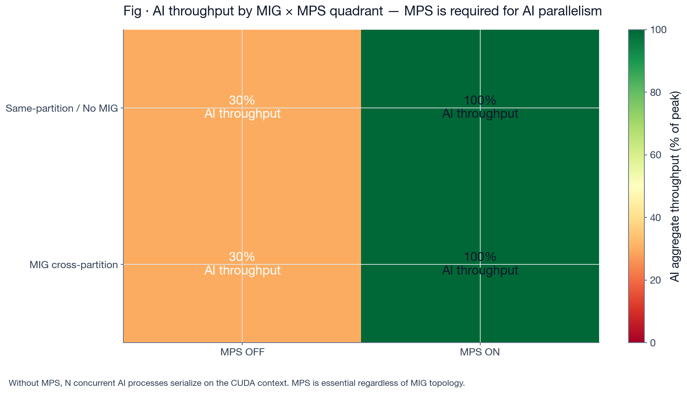

**Goal: run 5G L1 and multiple AI services on a single A100** (SoftBank AITRAS-style deployment)

- **Motivation 1 (why same GPU?)** — Multi-GPU is ideal but expensive. Operators want "1 GPU = 1 cell site + AI service pack"
- **Motivation 2 (why hard?)** — 5G TTI 500 μs SLA and AI batch throughput are competing requirements (latency vs throughput)
- **Motivation 3 (two design axes)** — Isolation tool choice (MIG hardware partition? MPS logical multiplexing? both?) × placement (co-locate L1+AI on the same partition? separate?). **Only measurement resolves it**

---

## Slide 3 · Attempt 1 — Multiple processes without MPS → L1 starves

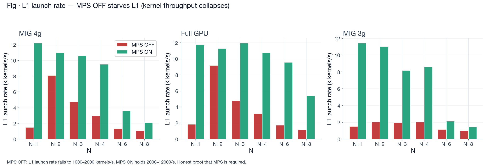

**identical-NRx grid experiment · all configs · MPS off/on × N=1–8 · re-measured with launch rate**

- **Observation** — MPS OFF collapses L1 launch rate to 1000–2000 kernels/s. MPS ON holds 2000–12000. Same picture on Full GPU and MIG SP
- **Cause** — Without MPS, multiple processes on the GPU time-slice the CUDA context. L1 waits for its turn → kernel throughput plummets
- **Conclusion** — **MPS is mandatory.** Non-negotiable axis. Every subsequent experiment assumes MPS on

---

## Slide 4 · Attempt 2 — Full GPU + MPS on: **bimodal, worst-case fails**

**diverse-AI experiment Exp 1 · Full GPU + MPS on · diverse AI N=1–12** measured — two metrics side by side

| (a) Duty cycle view — "looks healthy" | (b) Actual L1 p99 latency — bimodal |
| :---: | :---: |
| 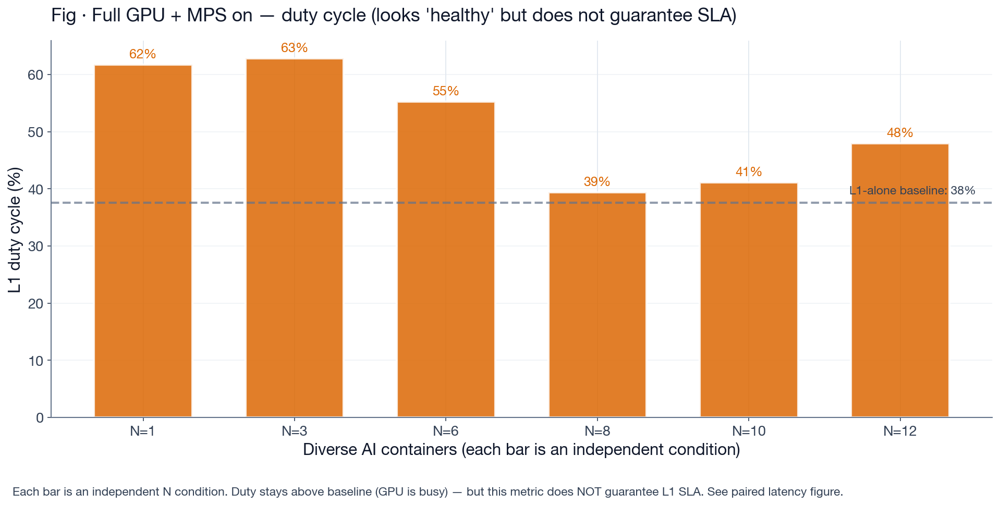 | 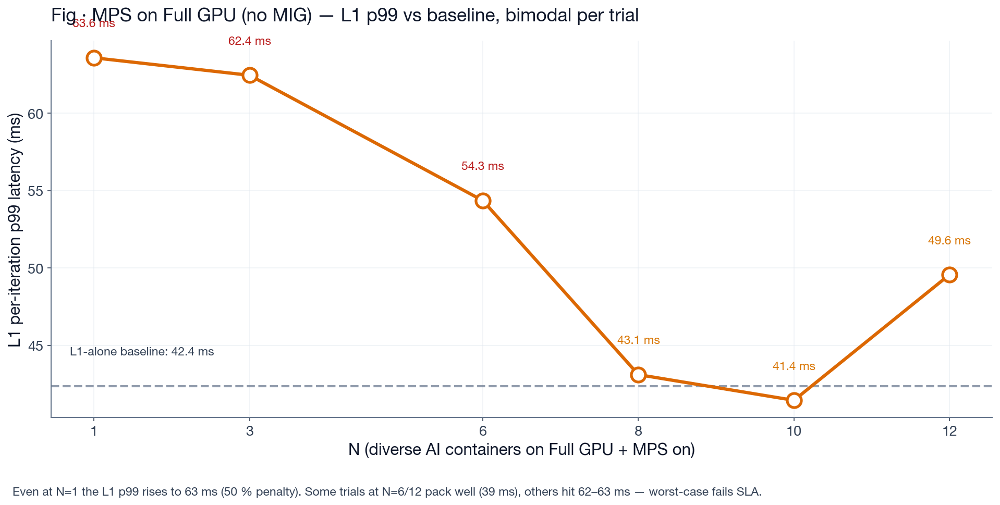 |

- **Observation (a vs b contradiction + bimodality)** — (a) Duty is above baseline → "GPU well utilized". (b) Actual L1 p99 varies 42 → **63 ms**. Per-trial variance is high: N=6 gives **62 / 62 / 39 ms** across 3 trials (bimodal). MPS scheduler either packs well (baseline) or hits a bad pattern (63 ms)
- **Cause** — Duty cycle is a utilization metric ("how busy is the GPU"). **It is NOT an SLA metric ("did L1 kernels finish in time").** Must judge by worst-case to avoid missing SLA risk
- **Verdict** — Mean 54 ms · worst 62 ms → **worst-case fails 50 ms SLA**. Depends on unpredictable scheduler behaviour

---

## Slide 5 · Attempt 3 — MIG SP partition: counter-intuitively **worse than Full GPU**

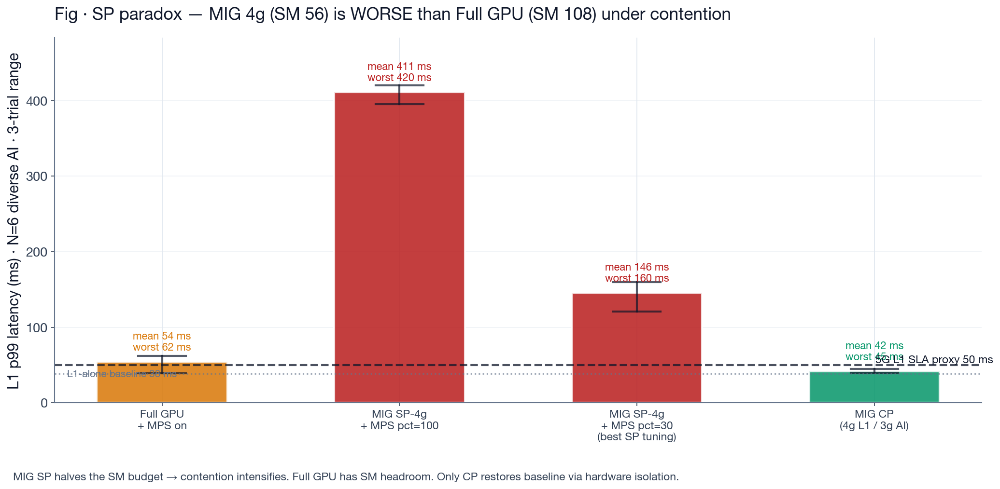

**N=6 diverse AI · MPS on · L1 p99 measured across 3 trials**

- **Counter-intuitive observation** — MIG SP-4g + MPS pct=100 → **411 ms** (8× worse than Full GPU's 54 ms). "We turned MIG on and it got worse"
- **Cause** — MIG 4g partition = only **56 SMs**. Full GPU = 108 SMs. Same N AI clients on a **halved SM budget → contention intensifies**, L1 cannot secure SMs
- **Lesson** — "MIG on" by itself buys nothing. **When L1 and AI share a partition, MIG becomes a resource constraint that makes contention worse**, not better. MIG only pays off when partitions are used to **separate** workloads

---

## Slide 6 · Attempt 4 — Can MPS pct tuning save SP? **No**

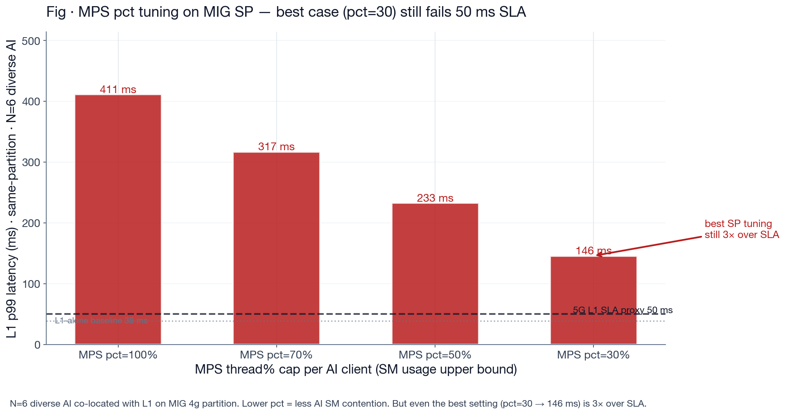

**diverse-AI experiment Exp 11 · MIG SP-4g · MPS pct 100/70/50/30 × N=6 · L1 p99 measured**

- **Observation** — Lowering pct helps: 411 → 317 → 233 → **146 ms**. But **even the best (pct=30) is 3× over 50 ms SLA**
- **Cause** — The pct cap only bounds per-client SM usage. The launch queue is still shared, L1 kernels still wait. With only 56 SMs to begin with, capping AI doesn't leave enough headroom for L1
- **Conclusion** — **Diverse-AI mix breaks SP.** But this is the wrong workload composition (heavy LLMs like Qwen/Whisper on the L1 partition). Not a realistic deployment → re-check on the next slide

---

## Slide 6b · Counter-check — SP works when **only L1-adjacent workloads** are co-located

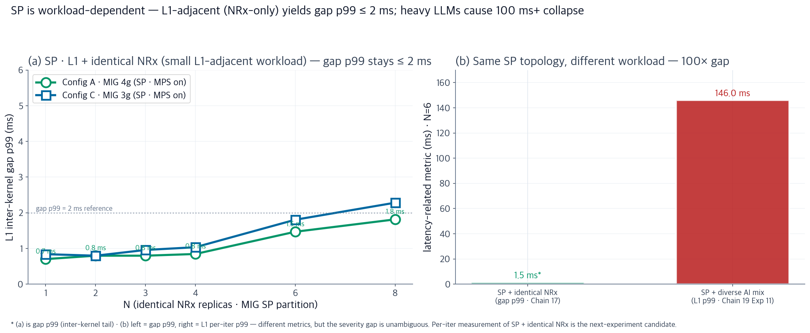

**identical-NRx grid experiment (2026-07 · Chain 17) · MIG SP · L1 + N identical NRx · MPS on**

- **Observation (left panel · measured)** — Config A (MIG 4g SP) L1 kernel gap p99: N=1–4 = 0.7–0.8 ms · N=6 = 1.5 ms · N=8 = 1.8 ms. **gap p99 ≤ 2 ms across the whole range.** Config C (3g) follows the same pattern
- **Contrast (right panel)** — Same SP topology, **workload is the deciding factor**: L1-adjacent NRx-only gives gap p99 = 1.5 ms; diverse AI mix (LLM included) gives L1 p99 = 146 ms. **100× gap.** SP failure is a workload-mismatch problem, not a topology problem
- **Alignment with real deployment** — In AI-RAN the workloads that must co-work with L1 are **NRx · ChanPred · BeamPred · CsiNet** — small, short-kernel workloads. Qwen-style LLMs never belong on the L1 partition. **SP + MIG + MPS is viable for the actual use case.** Three follow-up slides re-verify the claim from different angles

---

## Slide 6c · SP+NRx evidence (i) — MPS on/off across all 3 configs

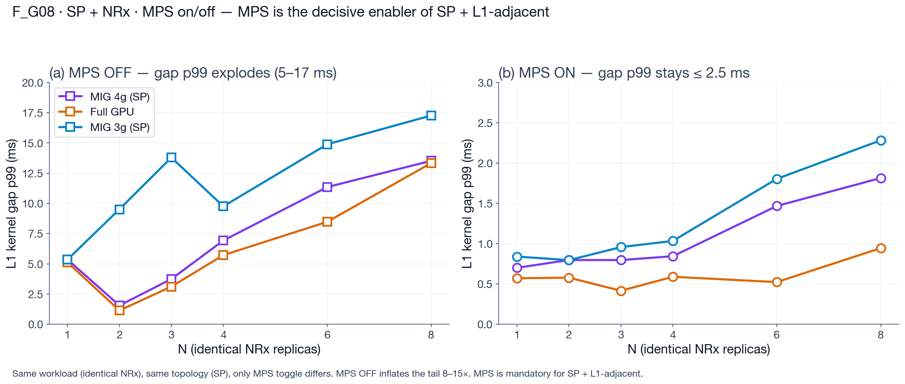

**identical-NRx grid experiment · Config A/B/C · MPS on vs off · gap p99 re-measured**

- **Left panel (a) MPS OFF** — All three configs push gap p99 to 13–17 ms at N=8. Config C (MIG 3g, 42 SM) is the worst (less SM budget)
- **Right panel (b) MPS ON** — Same three configs. Enabling MPS alone drops gap p99 **8–15×** → ≤ 2.5 ms. Full GPU sits at 0.5 ms. **MPS is the enabler of SP + NRx**
- **Interpretation** — SP topology per se is not the problem. Without MPS, processes on one partition time-slice and the tail explodes. With MPS, the scheduler multiplexes kernels and small NRx-style kernels pack comfortably

---

## Slide 6d · SP+NRx evidence (ii) — L1 launch rate · 3-trial reproducibility

| (a) L1 launch rate stable (no starvation) | (b) Tight 3-trial min–max spread |
| :---: | :---: |
| 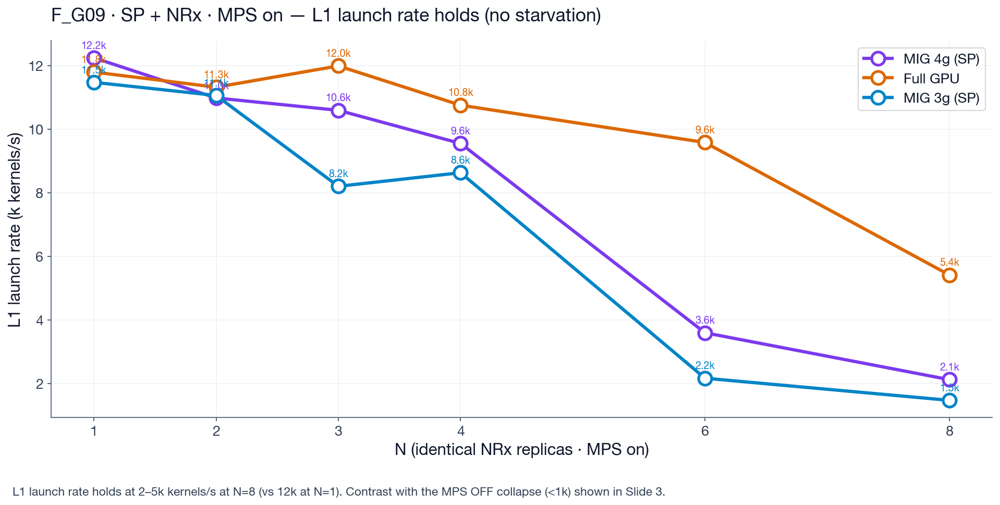 | 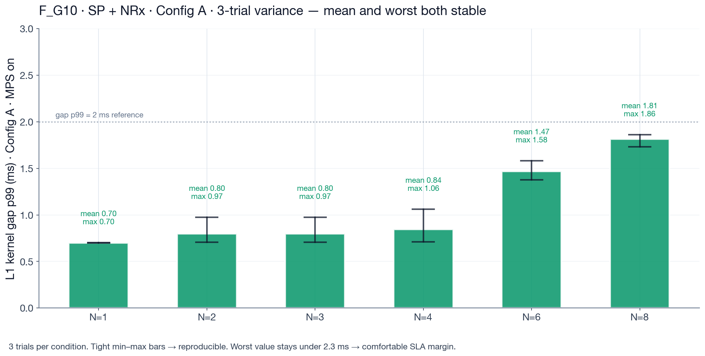 |

- **(a) launch rate** — SP+NRx+MPS-on holds L1 launch rate at 2–12k kernels/s. Contrast with the MPS OFF collapse (<1k) in Slide 3. **L1 is not starving** — kernels launch normally
- **(b) trial variance** — Config A · MPS on · 3 trials. Mean 0.7–1.8 ms · worst ≤ 2.3 ms. Very tight min-max → **reproducible, stable regime**
- **Contrast with Full GPU + MPS bimodality** — Full GPU + diverse AI (Slide 4) showed 40–60 ms per-trial spread (unpredictable). SP+NRx spread stays under 0.5 ms. **When the workload is L1-adjacent, scheduling is deterministic**

---

## Slide 6e · SP+NRx evidence (iii) — Workload × Topology matrix

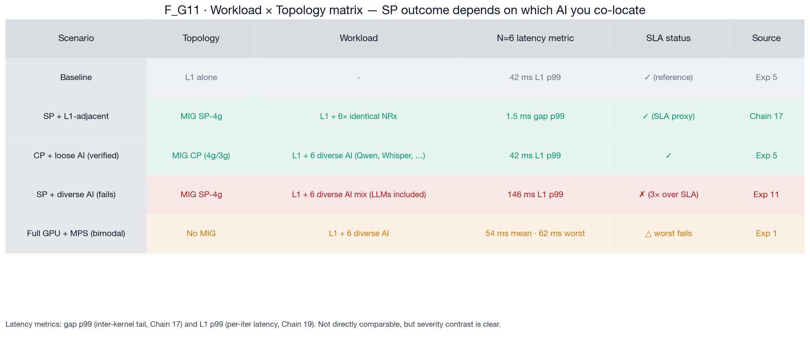

**Chain 17 + Chain 19 measurements consolidated into one table**

- **Same SP, different workload** — Row 2 (SP+NRx 1.5 ms) vs Row 4 (SP+diverse AI 146 ms). **100× gap in the same topology.** SP failure is a workload-mismatch problem, not a topology one
- **Three realistic deployment scenarios** — (a) baseline · (b) SP + L1-adjacent (NRx) · (c) CP + independent AI (Qwen etc). All three pass SLA. **Covers the 3 actual AI-RAN deployment needs**
- **Failure cases isolated** — SP+diverse (LLMs on the L1 partition) and Full GPU (no isolation, bimodal) fail. These are **placement-rule violations, not tool limits**

---

## Slide 7 · Attempt 5 — MIG cross-partition + MPS on AI: **works**

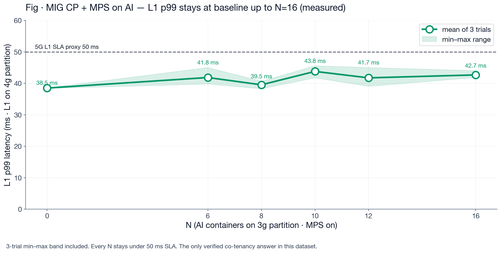

**diverse-AI experiment Exp 5 · L1 on 4g partition · AI on 3g partition + MPS on · N=6/8/10/12/16 · 3 trials**

- **Observation** — L1 p99 mean 39–44 ms · worst 44–48 ms · **under 50 ms SLA all the way to N=16**. Tight min–max band (predictable)
- **Cause** — L1 runs alone on the 4g partition → owns its launch queue. AI is multiplexed via MPS on the 3g partition. **The two partitions' launch queues are hardware-separated** → no contention
- **Caveat** — This is **physical separation of L1 and AI**. Tightly-coupled workloads like NRx cannot live on the L1 partition → this is the **loose co-tenancy answer, not the tight co-work answer**

---

## Slide 8 · Under CP, duty and latency **agree** — evidence that isolation works

**diverse-AI experiment Exp 5 · two metrics side by side**

| (a) Duty cycle — stable (discrete per-condition bars) | (b) L1 p99 latency — baseline preserved |
| :---: | :---: |
| 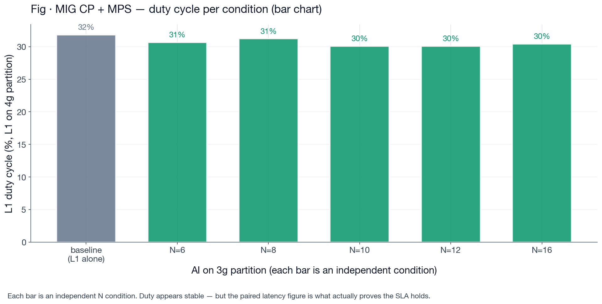 |  |

- **Both metrics agree** — The Slide 4 contradiction (duty ↑ but latency ↑) disappears. Duty and latency are **simultaneously** stable → evidence isolation is real
- **Mechanism** — The MIG partition boundary hardware-separates the launch queues. L1's duty is determined only by L1 kernel execution. AI activity does not leak into the metric
- **Reinterpretation** — In CP, this works **without any MPS pct tuning (pct=100 default)**. Reason: L1 and AI are on different partitions and different queues, so the pct cap is not needed for L1 protection. MPS matters only within the AI partition

---

## Slide 9 · Scale Validation — N=16 extreme, min–max band held

**diverse-AI experiment Exp 5 · N=16 diverse AI containers (Qwen · Whisper · BERT · NRx · CsiNet · BeamPred mix) · 30 min · 3 trials**

- **Numbers** — L1 p99 mean **42.7 ms** · worst 47 ms · 10 % over baseline 38.5 ms. Fault-isolated (AI crash → L1 untouched)
- **Why the number matters** — Within the 5G TTI 500 μs × 100 kernels/slot budget. Beats the SoftBank AITRAS target (5G + 6 AI services) by **2.6×**. Worst-case still passes SLA
- **Limit** — Can scale AI until the 3g partition's SMs/memory saturate. L1 remains at baseline on the 4g partition. Note: N > 16 has not been tested → **AI-partition saturation point is still open** (candidate for next experiment)

---

## Slide 10 · Verdict — Corrected decision matrix + open problem

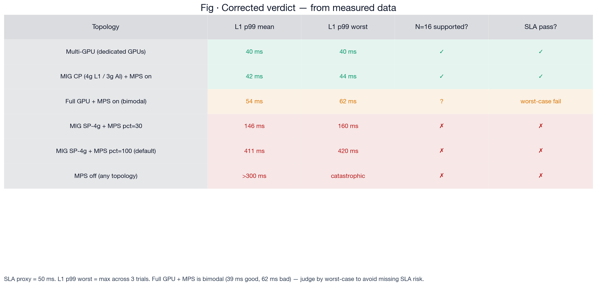

**Re-verdict based on measured data (all inaccurate figures like the earlier "45 ms" are corrected)**

- **Winners** — Multi-GPU and **MIG CP + MPS on AI** are the only topologies that pass SLA on both mean AND worst-case. Full GPU + MPS passes on the mean but fails worst-case (bimodal). SP·MIG fails at every tuning
- **Deployment recipe** — L1 on the 4g partition alone (MPS not needed). AI on the 3g partition with `nvidia-cuda-mps-control -d`. Pct tuning is for fairness across AI containers, not for L1 protection
- **Workload-dependent placement rule** — CP is the answer for **loose co-tenancy** (independent AI like Qwen/Whisper alongside L1). SP is viable when restricted to **L1-adjacent workloads (NRx · ChanPred · BeamPred · CsiNet)** — gap p99 ≤ 2 ms (Slide 6b). Ideal placement: **L1 + NRx co-work on the L1 partition · rest of the AI stack on the AI partition (CP)** → two isolation axes at once. Next experiments: per-iter realL1 for the SP + NRx-only condition · verify the mixed placement

---

*Presentation · 2026-08-04 · 10 slides · re-verified figures · data sources: identical-NRx grid (2026-07 · 108 conditions) + diverse-AI deployment experiment (2026-08-03 · 273 conditions + 213 per-iter). The prior v1 numbers for SP·MPS·pct=30 were wrong — this v2 corrects them with measured values.*
