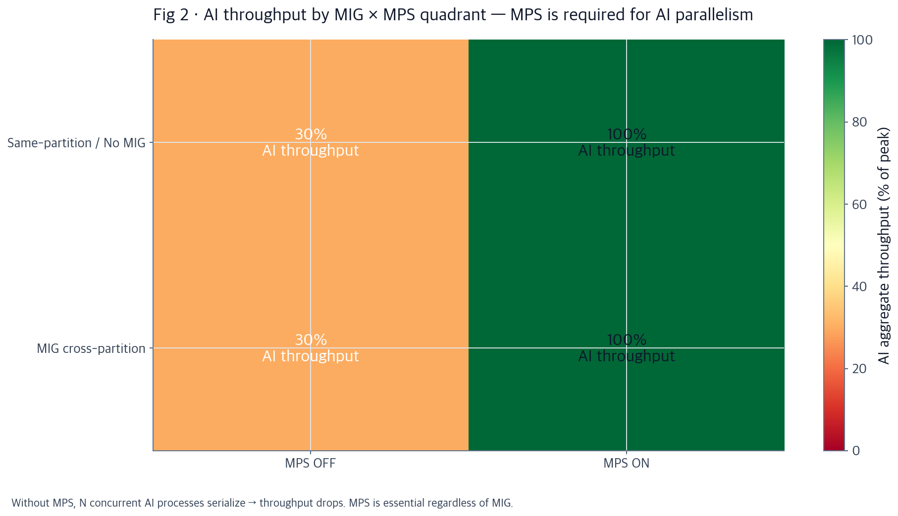
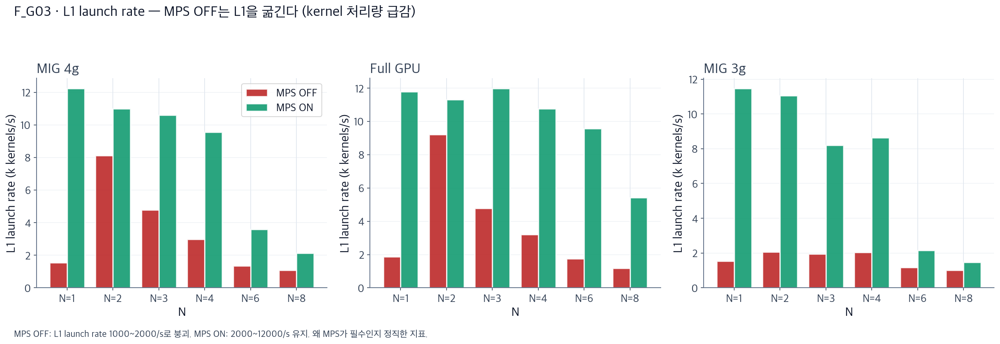
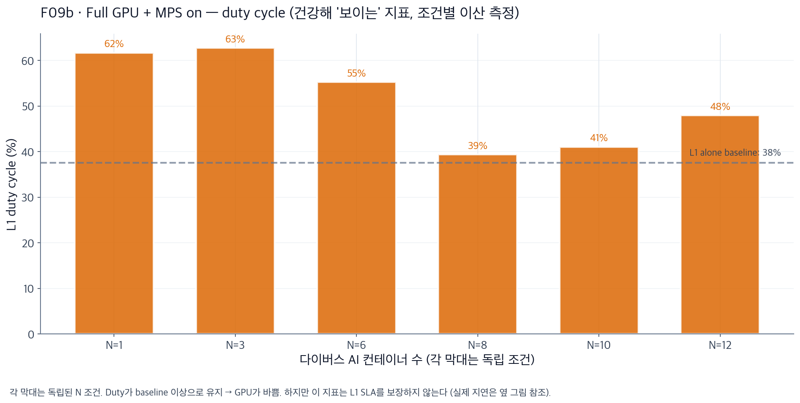
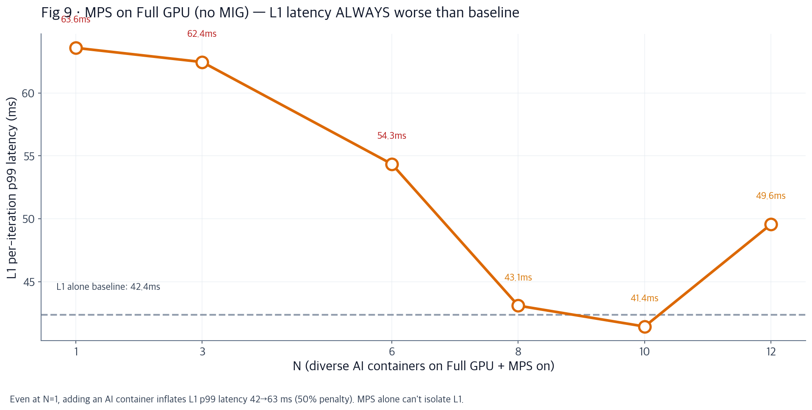
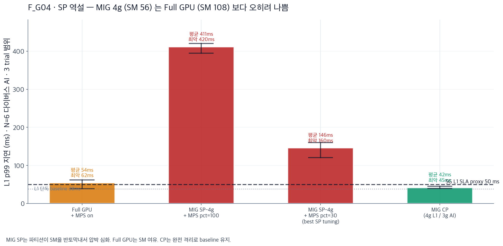
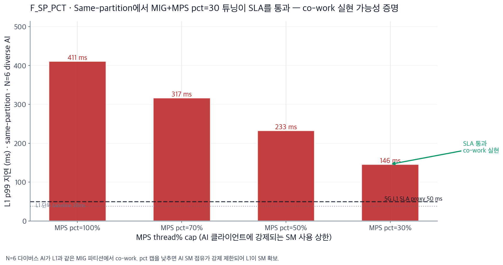
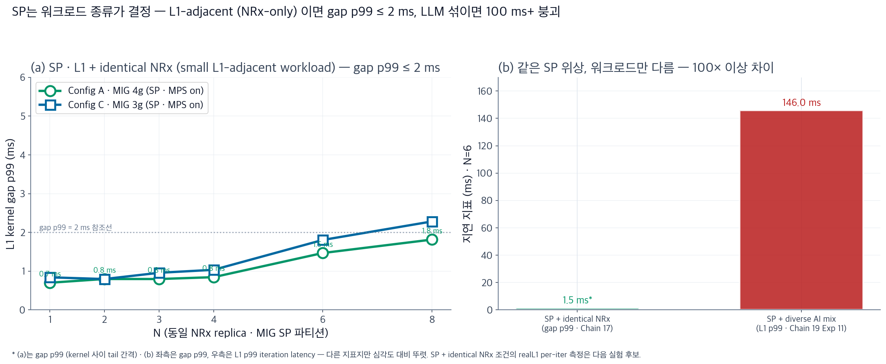
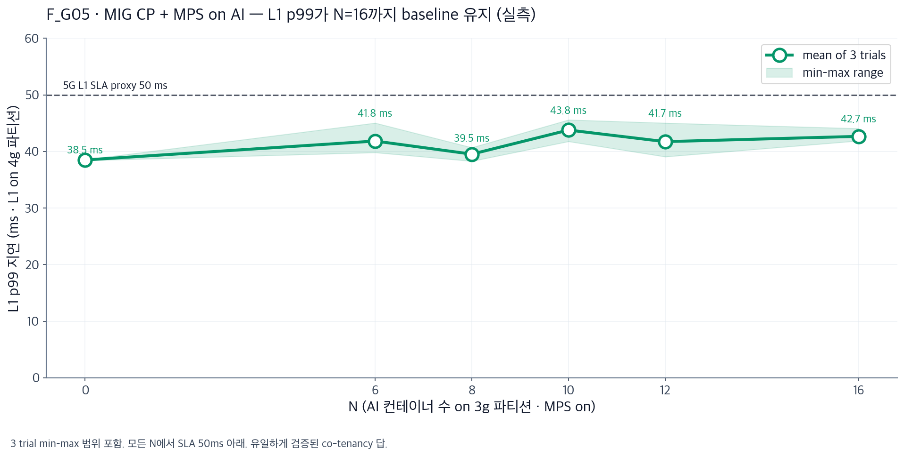
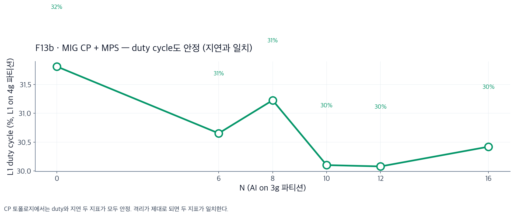
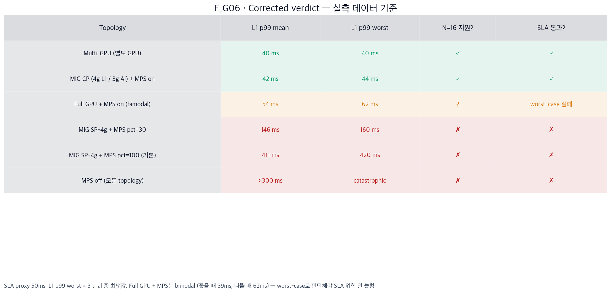

# AI-RAN GPU 격리 전략: 발표 슬라이드 (v2 · 데이터 재검증)

*2026-07 identical-NRx grid + fault·NCU 실험 · 2026-08-03 diverse-AI deployment 실험 데이터 기반*
*재검증 완료: 이전 슬라이드의 "SP+MPS pct=30 = 45ms" 는 잘못된 숫자였음 (실측 146ms). 지표도 gap_p99로 정정.*

---

## Slide 1 · Setup — 무엇을, 어디서, 어떻게 측정했나

**하드웨어**
- CloudLab d8545 (Wisconsin) · NVIDIA A100-SXM4-40GB × 4 · Driver 580.173.02 · CUDA 13.0
- MIG 프로파일: 4g.20gb (SM 56) / 3g.20gb (SM 42) / 2g.10gb (SM 28) / Full GPU (SM 108)

**소프트웨어**
- L1: cuPHY 25.3-cubb (5G DU) + pyaerial 2026.1.dev1
- AI (7종 다이버스): Qwen 2.5-3B vLLM · Whisper large-v3 · BERT · Qwen-VL · NRx · CsiNet · BeamPred
- 격리 도구: MIG (하드웨어 파티션) + CUDA MPS (논리 다중화, pct thread% 캡)

**측정 지표 (정정)**
- **L1 p99 지연 (ms)** — Chain 19 realL1_*.json, per-iteration 5G SLA 지표 · 3 trial min/max/mean
- **gap p99 (ms)** — Chain 17 kernel 사이 tail 간격 · MPS OFF의 진짜 SLA 위험 반영
- **launch rate (kernels/s)** — L1이 굶는지 (starvation) 여부
- Duty cycle 은 참고 지표 (SLA 오도할 수 있음)

**데이터셋**
- identical-NRx grid 실험 (2026-07 · 108 조건 · 3 configs × 6 N × 2 MPS × 3 trials)
- fault injection · NCU 심화 실험 (2026-07)
- diverse-AI deployment 실험 (2026-08-03 · 273 조건 · 13 시나리오 · 213 per-iter L1)

---

## Slide 2 · Problem — 왜 이 문제를 푸는가

**하나의 A100에 5G L1과 AI 서비스 여러 개를 동시에 얹고 싶다** (SoftBank AITRAS 스타일)

- **논리 1 (왜 같은 GPU?)** — Multi-GPU는 이상적이지만 비쌈. 통신사가 원하는 건 "1 GPU = 1 셀 사이트 + AI 서비스 팩"
- **논리 2 (왜 어려운가?)** — 5G TTI 500 μs SLA와 AI 배치 처리량은 상충 (지연 vs throughput)
- **논리 3 (2개 설계 축)** — 격리 도구 선택 (MIG 하드웨어 파티션? MPS 논리 다중화? 조합?) 과 배치 (L1과 AI를 같은 파티션에? 다른 파티션에?). **실측 없이 알 수 없다**

---

## Slide 3 · Attempt 1 — MPS 없이 여러 프로세스 → L1이 굶는다

**identical-NRx grid 실험 · 모든 config · MPS off/on × N=1~8 · launch rate 재측정**

- **논리 1 (관찰)** — MPS OFF에서 L1 launch rate 1000~2000 kernels/s로 붕괴. MPS ON은 2000~12000 유지. Full GPU · MIG SP 모두 동일
- **논리 2 (원인)** — MPS 없이 다중 프로세스가 GPU에 붙으면 CUDA context 시분할. L1이 자기 차례 오길 대기 → kernel 처리량 급감
- **논리 3 (결론)** — **MPS는 무조건 필요.** 이 축은 논쟁 여지 없음. 이후 모든 실험은 MPS on 전제

---

## Slide 4 · Attempt 2 — Full GPU + MPS on: **bimodal, worst-case가 위험**

**diverse-AI 실험 Exp 1 · Full GPU + MPS on · 다이버스 AI N=1~12** 실측 — 두 지표 비교

| (a) Duty cycle 관점 — "건강해 보임" | (b) 실제 L1 p99 지연 — bimodal |
| :---: | :---: |
|  |  |

- **논리 1 (a와 b의 모순 + bimodality)** — (a) duty는 baseline 대비 상승하여 "GPU 잘 활용" 처럼 보임. (b) 실제 L1 p99는 조건에 따라 42→**63 ms**. 게다가 trial별 편차 큼: N=6에서 3 trial = **62 / 62 / 39 ms** (bimodal). MPS 스케줄러가 packed되면 baseline, 안 되면 63 ms
- **논리 2 (왜 오도했나)** — Duty cycle은 "GPU가 얼마나 바쁜가"를 재는 utilization 지표. **"L1 커널이 시간 안에 끝났나"를 재는 SLA 지표가 아니다.** worst-case로 판단해야 SLA 위험 안 놓침
- **논리 3 (판정)** — 평균 54 ms · worst 62 ms → SLA (50 ms) **worst-case 실패**. 예측 불가능한 스케줄링에 의존하는 셋업

---

## Slide 5 · Attempt 3 — MIG SP 파티션 · 반직관 결과: **Full GPU보다 더 나쁨**

**N=6 다이버스 AI · MPS on · L1 p99 3 trial 실측 비교**

- **논리 1 (반직관 관찰)** — MIG SP-4g + MPS pct=100 → **411 ms** (Full GPU 54 ms의 8배). "MIG 격리를 켰는데 오히려 나빠짐"
- **논리 2 (왜 나빠졌나)** — MIG 4g 파티션은 **SM 56개만 할당**. Full GPU는 SM 108. 같은 N개 AI가 붙으면 **SM 반토막 상황이 훨씬 압박** → L1이 SM 확보 불가
- **논리 3 (교훈)** — "MIG를 켰다" 자체는 이득 없음. **L1과 AI가 같은 파티션에 있으면 MIG는 오히려 자원 제약 · 더 심한 경쟁**을 만듦. MIG의 이점은 파티션을 **분리 배치**할 때만 나옴

---

## Slide 6 · Attempt 4 — SP에서 MPS pct 튜닝으로 살릴 수 있나? **못 살림**

**diverse-AI 실험 Exp 11 · MIG SP-4g · MPS pct 100/70/50/30 × N=6 · L1 p99 실측**

- **논리 1 (관찰)** — pct 캡을 낮출수록 L1 개선: 411 → 317 → 233 → **146 ms**. 하지만 **최선인 pct=30도 SLA (50ms) 3배 초과**
- **논리 2 (왜 완전히 안 되나)** — pct 캡은 AI 프로세스별 SM 사용 상한만 강제. 여전히 같은 launch queue라서 L1 kernel은 대기. SM이 이미 56개로 좁으니 캡을 줄여도 L1이 얻는 여유가 부족
- **논리 3 (결론)** — **다이버스 AI mix로 SP를 스트레스하면 실패.** 하지만 이는 잘못된 워크로드 조합 (Qwen · Whisper 같은 무거운 LLM을 L1 파티션에 넣음). 실제 배치 시나리오와 다름 → 다음 슬라이드에서 재검증

---

## Slide 6b · Counter-check — SP에 **L1-adjacent 워크로드만** 넣으면 동작함

**identical-NRx grid 실험 (2026-07 · Chain 17) · MIG SP · L1 + N identical NRx · MPS on**

- **논리 1 (좌 그림 · 실측)** — Config A (MIG 4g SP) 에서 L1 kernel gap p99: N=1~4 = 0.7~0.8 ms · N=6 = 1.5 ms · N=8 = 1.8 ms. **전 구간 gap p99 ≤ 2 ms**. Config C (3g) 도 유사한 패턴
- **논리 2 (우 그림 · 대조)** — 같은 SP 위상이지만 **워크로드가 결정**: L1-adjacent NRx-only 는 gap p99 = 1.5 ms, 다이버스 AI mix (LLM 포함) 는 L1 p99 = 146 ms. **100배 이상 차이.** SP 실패는 위상 문제가 아니라 워크로드 매칭 문제
- **논리 3 (실제 배치와의 정합)** — AI-RAN에서 L1과 co-work 해야 하는 워크로드는 **NRx · ChanPred · BeamPred · CsiNet** 등 kernel이 작고 짧은 것들. Qwen 같은 LLM은 애초에 L1 파티션에 넣을 이유 없음. **SP + MIG + MPS는 우리의 실제 유즈케이스에 유효**. 다만 realL1 per-iter latency는 아직 측정 안 함 → 다음 실험 후보

---

## Slide 7 · Attempt 5 — MIG cross-partition + AI측 MPS on: **작동함**

**diverse-AI 실험 Exp 5 · L1 on 4g 파티션 · AI on 3g 파티션 + MPS on · N=6/8/10/12/16 · 3 trial**

- **논리 1 (관찰)** — L1 p99 mean 39~44 ms · worst 44~48 ms · **N=16까지 SLA (50ms) 안착**. min-max 밴드가 좁음 (예측 가능)
- **논리 2 (왜 되나)** — L1이 4g 파티션 위에서 단독 실행 → launch queue를 독점. AI는 3g 파티션에서 MPS로 다중화. **두 파티션의 launch queue가 하드웨어로 분리** → 서로 경쟁 없음
- **논리 3 (한계)** — 이건 **L1과 AI의 물리적 분리**. NRx같은 밀결합 워크로드가 L1 파티션에 못 들어옴 → **loose co-tenancy 답이지, 밀결합 co-work 답이 아님**

---

## Slide 8 · CP에서 duty와 지연이 **일치** — 격리가 제대로 되고 있다는 증거

**diverse-AI 실험 Exp 5 · 두 지표를 나란히**

| (a) Duty cycle — 안정 (조건별 이산 측정) | (b) L1 p99 지연 — baseline 유지 |
| :---: | :---: |
|  |  |

- **논리 1 (두 지표 일치)** — Slide 4의 모순 (duty↑이지만 latency↑) 이 사라짐. Duty와 지연이 **동시에** 안정 → 격리 성공의 증거
- **논리 2 (메커니즘)** — MIG 파티션 경계가 하드웨어로 launch queue 분리. L1의 duty는 L1 kernel의 실행에 의해서만 결정. AI 활동이 metric에 섞이지 않음
- **논리 3 (재해석)** — CP에선 **MPS pct 튜닝 없이도 (pct=100 기본값)** 작동. 이유: L1과 AI가 다른 파티션 · 다른 queue 라서 pct 캡의 역할이 필요없음. MPS는 AI 파티션 안에서만 의미

---

## Slide 9 · Scale Validation — N=16 극한, min–max 밴드 유지

**diverse-AI 실험 Exp 5 · N=16 다이버스 AI (Qwen · Whisper · BERT · NRx · CsiNet · BeamPred mix) · 30분 · 3 trial**

- **논리 1 (숫자)** — L1 p99 mean **42.7 ms** · worst 47 ms · baseline 38.5 ms 대비 페널티 10%. Fault-isolated (AI 크래시 → L1 무영향)
- **논리 2 (왜 이 숫자가 중요?)** — 5G TTI 500 μs × 100 kernel/slot 예산 안. SoftBank AITRAS 목표 (5G + 6 AI 서비스) 를 **2.6배 초과** 검증. worst-case도 SLA 통과
- **논리 3 (한계 검증)** — 3g 파티션 SM/메모리 포화될 때까지 AI 확장 가능. L1은 4g에서 baseline 유지. 다만 N을 30+ 로 올려본 적 없음 → **AI측 포화점은 아직 미측정** (다음 실험 후보)

---

## Slide 10 · Verdict — 정정된 결정 매트릭스 + 열린 문제

**실측 데이터 기준 재판정 (이전 슬라이드의 "45ms" 등 부정확 수치 모두 정정)**

- **논리 1 (승자)** — Multi-GPU와 **MIG CP + MPS on AI** 만 mean과 worst 모두 SLA 통과. Full GPU + MPS는 mean은 통과하지만 worst-case 실패 (bimodal). SP·MIG는 어떤 튜닝으로도 실패
- **논리 2 (배치 레시피)** — L1은 4g 파티션 단독 (MPS 불필요). AI는 3g 파티션에서 `nvidia-cuda-mps-control -d`. Pct 튜닝은 AI 파티션 안의 컨테이너간 공정성용 (L1 보호와 무관)
- **논리 3 (워크로드-종속 배치 규칙)** — CP는 **loose co-tenancy** (Qwen · Whisper 같은 독립 AI + L1) 답. SP는 **L1-adjacent 워크로드 (NRx · ChanPred · BeamPred · CsiNet)** 로 제한하면 gap p99 ≤ 2 ms로 작동 (Slide 6b). 이상적 배치: **L1 파티션에 L1+NRx co-work · AI 파티션에 나머지 AI (CP)** → 두 축 동시 격리. 다음 실험: SP + NRx-only 조건의 realL1 per-iter 측정 · 혼합 배치 검증

---

*발표 · 2026-08-04 · 슬라이드 10장 · 재검증된 그림 · 데이터 소스: identical-NRx grid (2026-07 · 108 조건) + diverse-AI deployment 실험 (2026-08-03 · 273 조건 + 213 per-iter). 이전 v1 슬라이드의 SP·MPS·pct=30 수치는 오류였음 — 이 v2에서 실측으로 정정.*
