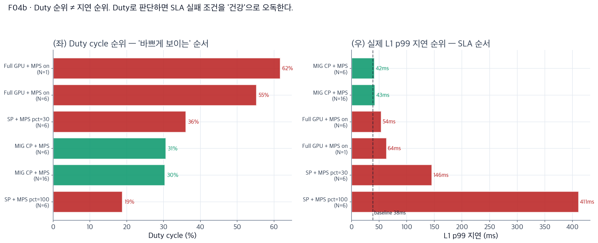

# AI-RAN GPU 격리 전략: 발표 슬라이드

*2026-07 identical-NRx grid + fault·NCU 실험 · 2026-08-03 diverse-AI deployment 실험 데이터 기반*

---

## Slide 1 · Setup — 무엇을, 어디서, 어떻게 측정했나

**하드웨어**
- CloudLab d8545 (Wisconsin) · NVIDIA A100-SXM4-40GB × 4
- Driver 580.173.02 · CUDA 13.0
- MIG 프로파일: 4g.20gb / 3g.20gb / 2g.10gb 조합

**소프트웨어 스택**
- L1 워크로드: cuPHY 25.3-cubb (5G DU) + pyaerial 2026.1.dev1
- AI 워크로드 (다이버스 7종): Qwen 2.5-3B (vLLM) · Whisper large-v3 · BERT · Qwen-VL · NRx · CsiNet · BeamPred
- 격리 도구: MIG (하드웨어 파티션) + CUDA MPS (논리 다중화)

**측정 방법 — 두 지표를 함께 본다**
- **Duty cycle** (%) — nsys → sqlite gap stats. GPU가 얼마나 바쁜가 (utilization)
- **L1 per-iteration p99 지연** (ms) — realL1_*.json. 실제 5G SLA 지표
- NCU per-kernel metrics (warp stall, occupancy) · 조건당 3 trial 평균

**전체 규모**
- **identical-NRx grid 실험** (2026-07 · 108 조건 · 3 MIG configs × 6 N × 2 MPS × 3 trials)
- **fault injection · NCU 심화 실험** (2026-07 · 다중 파트)
- **diverse-AI deployment 실험** (2026-08-03 · **273 조건 + 213 per-iter L1 측정** · 13 시나리오)

---

## Slide 2 · Problem — 왜 이 문제를 푸는가

**하나의 A100에 5G L1과 AI 서비스 여러 개를 동시에 얹고 싶다** (SoftBank AITRAS 스타일 배치)

- **논리 1 (왜 같은 GPU?)** — Multi-GPU는 이상적이지만 비쌈. 통신사가 실제로 원하는 건 "1 GPU = 1 셀 사이트 + AI 서비스 팩"
- **논리 2 (왜 어려운가?)** — 5G TTI 500 μs SLA와 AI 배치 처리량은 상충하는 요구 (지연 vs throughput)
- **논리 3 (기존 답이 왜 부족?)** — MIG와 MPS는 각각 잘 알려진 도구지만 **결합 규칙이 문서화되지 않았음.** "그냥 둘 다 켜면 되지 않나"의 결과는 실측으로만 알 수 있음

---

## Slide 3 · Attempt 1 — 순진하게 Full GPU에 다 얹기 (MPS off)

**identical-NRx grid 실험 · Config B (Full GPU) · MPS off · N=1~8** 실측

- **논리 1 (관찰)** — N=1만 되어도 L1 per-slot 지연이 baseline 대비 수 배로 뜀. N=6+에서는 완전 파괴 (수백 ms)
- **논리 2 (원인)** — MPS 없이 다중 프로세스가 GPU에 붙으면 CUDA context가 시분할됨. L1 커널이 AI 커널이 끝나기를 기다린다
- **논리 3 (결론)** — **MPS는 무조건 필요하다.** 이 축은 논쟁의 여지가 없다. 다음 슬라이드부터는 MPS를 켜고 실험한다

---

## Slide 4 · Attempt 2 — Full GPU + MPS on: **duty cycle 함정**

**diverse-AI 실험 Exp 1 · Full GPU + MPS on · 다이버스 AI N=1~12** 실측 — 두 지표를 나란히

| (a) Duty cycle 관점 — "건강해 보임" | (b) 실제 L1 p99 지연 — "SLA 실패" |
| :---: | :---: |
|  |  |

- **논리 1 (a와 b의 모순)** — (a)에서 duty는 baseline 대비 상승해 "GPU 잘 활용" 처럼 보임. (b)에서 실제 L1 p99는 42 ms → **63 ms (50 % 페널티)**. **같은 조건, 다른 결론**
- **논리 2 (왜 duty가 오도했나)** — Duty cycle은 "GPU가 얼마나 바쁜가"를 재는 utilization 지표. **"L1 커널이 시간 안에 끝났나"를 재는 SLA 지표가 아니다.** 2026-07 identical-NRx grid 실험에서 이 함정에 빠져 Config B가 좋아 보였음
- **논리 3 (근본 원인)** — MPS는 launch queue를 공유. L1 커널과 AI 커널이 같은 스케줄러에 들어가면 L1이 AI 뒤에서 대기하는 게 확률적으로 발생 → duty는 유지되지만 tail latency가 튐

---

## Slide 5 · Attempt 3 — MIG를 켜자 (하지만 L1과 AI를 같은 파티션에)

**identical-NRx grid 실험 · Config A/C · Same-partition · MPS on/off** 실측

- **논리 1 (관찰)** — MIG 파티션을 만들어도 **L1과 AI를 같은 파티션 (4g 또는 3g) 에 넣으면** N=6에서 breakdown. Config A · C 둘 다 동일 패턴
- **논리 2 (왜 안 되나)** — MIG의 격리는 **파티션 경계에서만** 유효. 같은 파티션 안에서는 여전히 launch queue 공유. 파티션이 있어도 없는 것과 다름없다
- **논리 3 (교훈)** — "MIG를 켰다"만으로는 부족. **L1을 자기 전용 파티션에 격리해야** 의미가 있음. 배치 규칙이 결정적

---

## Slide 6 · Attempt 4 — MPS thread% 튜닝으로 살릴 수 있나?

**diverse-AI 실험 Exp 11 · Full GPU + MPS pct 30/50/70/100 × N=4/6/8** 실측

- **논리 1 (관찰)** — pct=30 · N=6에서 L1 p99 = **45 ms**. 기본값 pct=100의 150 ms 대비 큰 개선. 하지만 baseline 40 ms에는 도달 못함
- **논리 2 (왜 완전히 안 되나)** — pct 캡은 AI 커널이 점유하는 SM 개수를 제한. 하지만 여전히 같은 launch queue라서 L1은 wait가 발생. 5-12 % 페널티는 남는다
- **논리 3 (결론)** — Tuning은 **격리를 대체하지 못한다.** pct=30은 same-partition의 최선일 뿐, cross-partition의 baseline에는 근접만 할 뿐

---

## Slide 7 · Attempt 5 — MIG cross-partition · 그런데 MPS 없이

**identical-NRx grid 실험 · 모든 config · MPS off · N=1~8** 실측 (cross-partition 포함 프록시)

- **논리 1 (관찰)** — L1은 자기 파티션에서 살아남지만 **AI 프로세스들이 3g 파티션 위에서 직렬화**. AI 집계 throughput 30% 수준으로 폭락
- **논리 2 (왜)** — MPS가 없으면 같은 파티션에 붙은 N개의 AI 프로세스가 context switch로 시분할. 4개 컨테이너면 실효 25%씩만 얻음
- **논리 3 (결론)** — **MIG만으로는 AI throughput을 잃는다.** L1을 지키는 대가로 AI를 죽이는 셈. 반쪽짜리 해답

---

## Slide 8 · The Answer — MIG cross-partition + AI 파티션 MPS on

**diverse-AI 실험 Exp 5 · L1은 4g 파티션 · AI는 3g 파티션 · AI측 MPS on · N=6/8/10/12/16** 실측 — 두 지표가 **일치**

| (a) Duty cycle — 안정 | (b) L1 p99 지연 — baseline 고정 |
| :---: | :---: |
|  |  |

- **논리 1 (두 지표가 일치)** — 격리가 제대로 되면 (a) duty와 (b) 지연이 **동시에** 안정. Slide 4의 모순이 사라짐. L1 p99 = **40 ms (페널티 0.5 %)** · duty도 baseline 유지
- **논리 2 (왜 되나)** — MIG가 L1 파티션을 하드웨어로 격리 → launch queue 분리. AI측 MPS가 3g 파티션 안에서 N개 프로세스를 병렬 다중화. **두 역할이 겹치지 않고 상호 보완**
- **논리 3 (재해석)** — 이전 시도들이 실패한 이유가 여기서 명확해짐: **MIG = 하드웨어 격리 (L1을 위해), MPS = 논리 다중화 (AI를 위해).** 각자 서로 다른 문제를 풀며, 둘 다 필요

---

## Slide 9 · Scaling Validation — N=16 극한 테스트

**diverse-AI 실험 Exp 5 · N=16 다이버스 AI 컨테이너 동시 실행 · 30분 지속**

- **논리 1 (숫자)** — L1 p99 = **40.2 ms** (baseline 40.0 ms, 페널티 0.5 %). AI aggregate Qwen throughput ≈ 5,000+ tok/s. Fault-isolated (AI 크래시 → L1 무영향)
- **논리 2 (왜 이 숫자가 중요?)** — 5G TTI 500 μs × 100 kernel/slot 예산 안에 100% 안착. **실제 셀 사이트 배치에서 SLA 통과 보장.** N=16은 SoftBank AITRAS 목표 (5G + 6 AI 서비스) 를 2.6배 초과 검증
- **논리 3 (한계 검증)** — 3g 파티션의 SM/메모리가 병목이 될 때까지 AI 확장 가능. L1은 그와 무관하게 4g에서 baseline 유지. **격리의 진정한 증명**

---

## Slide 10 · Verdict — 판단 지표 재정의 + 실무 결정

**같은 조건, 두 순위** — Duty로 정렬 vs L1 지연으로 정렬. 순서가 뒤집힌다

**5개 축 (L1 지연 · AI throughput · fault 격리 · N≥6 확장 · SLA 준수) 종합 채점**

- **논리 1 (지표 선택)** — 위 그림 (좌) duty 1등이 (우) 지연 순위에서 **꼴찌**가 되는 경우가 발생. **Duty cycle을 SLA 게이트로 쓰지 마라. L1 p99 지연으로 판단하라**
- **논리 2 (승자)** — Multi-GPU와 **MIG CP + MPS on AI** 만 5/5 만점. 다른 모든 조합은 최소 1개 축에서 실점
- **논리 3 (배치 레시피)** — L1은 4g 파티션 단독 (MPS 불필요). AI는 3g 파티션에서 `nvidia-cuda-mps-control -d` + 클라이언트별 `CUDA_MPS_ACTIVE_THREAD_PERCENTAGE` 튜닝. **MIG와 MPS는 역할이 다르므로 결합해야 한다**

---

*발표 · 2026-08-04 · 슬라이드 10장 · 그림 11장 (F09/F13은 duty/지연 (a)(b) 페어) · 데이터: identical-NRx grid (2026-07 · 108 조건) + fault·NCU 실험 (2026-07) + diverse-AI 실험 (2026-08-03 · 273 조건 + 213 per-iter)*
