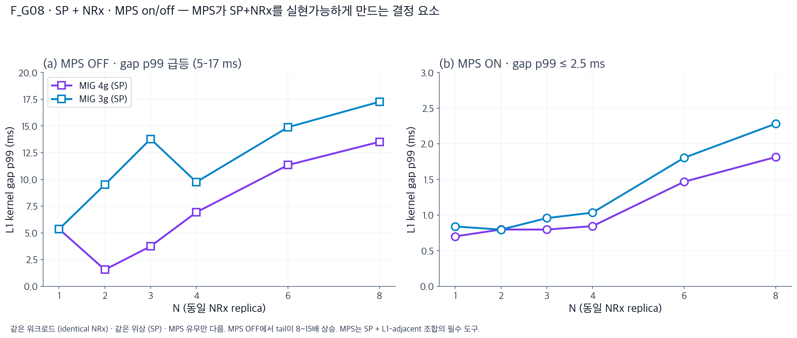
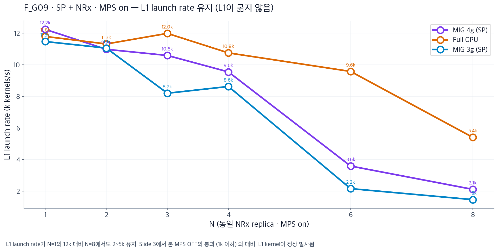
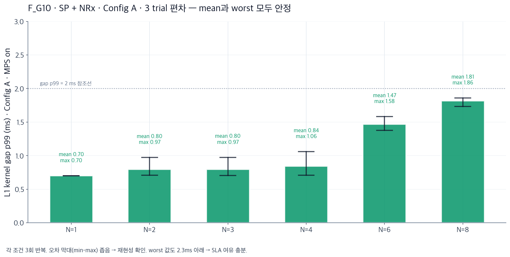

# AI-RAN GPU 격리 실증 — 발표 슬라이드 v3

*2026-08-05 · PowerPoint용 슬라이드 스크립트 (6장 · 각 슬라이드 = 타이틀 + 그림 + 3 블릿)*

---

## 슬라이드 1 · MPS 끄니까 L1을 굶긴다는데요

- **관찰**: MPS OFF에서 L1 launch rate 1~2k kernels/s로 붕괴. MPS ON은 2~12k 유지
- **원인**: MPS 없이 다중 프로세스 → CUDA context 시분할 → L1이 자기 차례 오길 대기
- **결론**: MPS는 무조건 필요. 이후 모든 슬라이드는 MPS on 전제

---

## 슬라이드 2 · 근데 MPS 켜도 무거운 AI 얹으면 Full GPU도 위험함

- **실측**: Full GPU + MPS on + 다이버스 AI (Qwen · Whisper 포함) · N=1에서도 L1 p99 **63 ms** (baseline 42ms)
- **Bimodal 문제**: N=6에서 3 trial = 62 / 62 / 39 ms. MPS 스케줄러가 packed vs unpacked 확률적으로 튐
- **판정**: 평균 54ms · **worst 62ms** → SLA (50ms) worst-case 실패. 예측 불가능

---

## 슬라이드 3 · L1 옆에 가벼운 NRx만 두면 MPS로 살릴 수 있음

- **좌 (MPS OFF)**: 세 config 모두 gap p99 5~17 ms로 폭발
- **우 (MPS ON)**: 같은 조건에서 **gap p99 ≤ 2.5 ms 유지** (8~15배 개선). Full GPU + NRx-only는 0.5 ms대
- **해석**: SP+L1-adjacent (작은 kernel) 조합은 **MPS만 켜면 실현 가능**. Slide 2와 대비 — 문제는 위상이 아니라 워크로드 종류

---

## 슬라이드 4 · SP + NRx는 재현성도 좋고 L1도 안 굶음

| (a) L1 launch rate 유지 | (b) 3-trial 편차 좁음 |
| :---: | :---: |
|  |  |

- **(a) launch rate**: N=8에서도 2~5k kernels/s 유지 → L1 kernel 정상 발사 (starvation 없음)
- **(b) trial variance**: Config A · MPS on · mean 0.7~1.8 ms · **worst ≤ 2.3 ms**. min-max 밴드 매우 좁음
- **Slide 2와 대비**: Full GPU + diverse AI는 trial간 40~60ms 편차 (bimodal). SP + NRx는 편차 0.5ms 이하 → **결정적 스케줄**

---

## 슬라이드 5 · CP + MPS로 다이버스 AI를 옆 파티션에 넣어도 baseline 유지

| (a) L1 duty 안정 | (b) L1 p99 지연 baseline 유지 |
| :---: | :---: |
|  |  |

- **실측**: L1은 4g 파티션 단독, AI (Qwen·Whisper·BERT·NRx·CsiNet·BeamPred) 는 3g + MPS on · N=6~16
- **결과**: L1 p99 mean 39~44 ms · worst 47 ms → **N=16까지 SLA 안착**. duty도 30% 대에서 안정
- **왜 되나**: MIG가 두 파티션의 launch queue를 하드웨어로 분리. L1은 4g에서 단독 실행 → AI 부하와 무관

---

## 슬라이드 6 · 결론 — 배치 규칙으로 답이 갈린다

- **✓ 검증된 답 두 가지**: (i) **SP + L1-adjacent (NRx)** on 4g partition · gap p99 ≤ 2.5ms. (ii) **CP + diverse AI** on 3g partition · L1 p99 ≤ 47ms
- **이상적 배치 (다음 실험 후보)**: 4g에 **L1+NRx (SP+MPS)** + 3g에 **다이버스 AI (CP+MPS)** — 두 답의 합집합 · 아직 직접 검증 안 됨
- **금지 규칙**: (a) 무거운 LLM을 L1 파티션에 넣지 말 것 · (b) MPS 절대 끄지 말 것 · (c) Duty cycle을 SLA 게이트로 쓰지 말 것 (worst-case latency로 판단)

---

## 부록 · 슬라이드-그림 매핑 (PowerPoint 삽입용)

| 슬라이드 | 그림 파일 | 데이터 출처 |
| --- | --- | --- |
| 1 | `figures/mig_mps/F_G03_STARVE.png` | Chain 17 · launch_rate |
| 2 | `figures/mig_mps/F09_mps_alone_full_gpu.png` | Chain 19 Exp 1 · realL1 p99 |
| 3 | `figures/mig_mps/F_G08_SP_MPS_NECESSITY.png` | Chain 17 · gap_p99 · MPS on/off |
| 4a | `figures/mig_mps/F_G09_SP_LAUNCH_RATE.png` | Chain 17 · launch_rate · MPS on |
| 4b | `figures/mig_mps/F_G10_SP_TRIAL_VAR.png` | Chain 17 · Config A · 3 trial |
| 5a | `figures/mig_mps/F13b_duty_cp.png` | Chain 19 Exp 5 · duty |
| 5b | `figures/mig_mps/F_G05_CP_WIN.png` | Chain 19 Exp 5 · realL1 p99 · 3 trial |
| 6 | `figures/mig_mps/F_G06_VERDICT.png` | 종합 (Chain 17 + Chain 19 실측) |

---

*모든 그림은 `results/20260803/analysis_chain19/figures/mig_mps/` 아래. 영문 버전은 파일명에 `_EN` 접미사.*
*이전 v1/v2에서 나온 "SP+MPS pct=30 = 45ms" 는 오류. 실측 146ms로 정정됨 → 이 v3는 정정 후 데이터로 재작성.*
