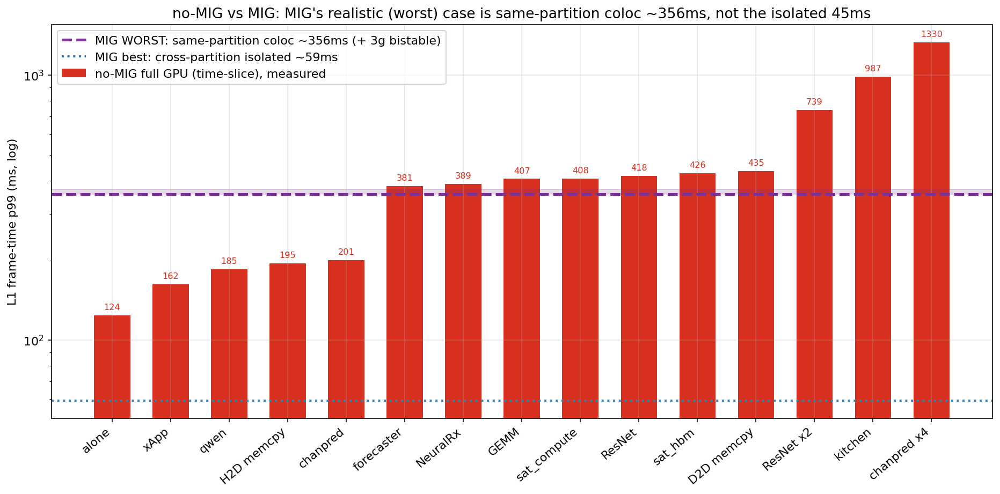
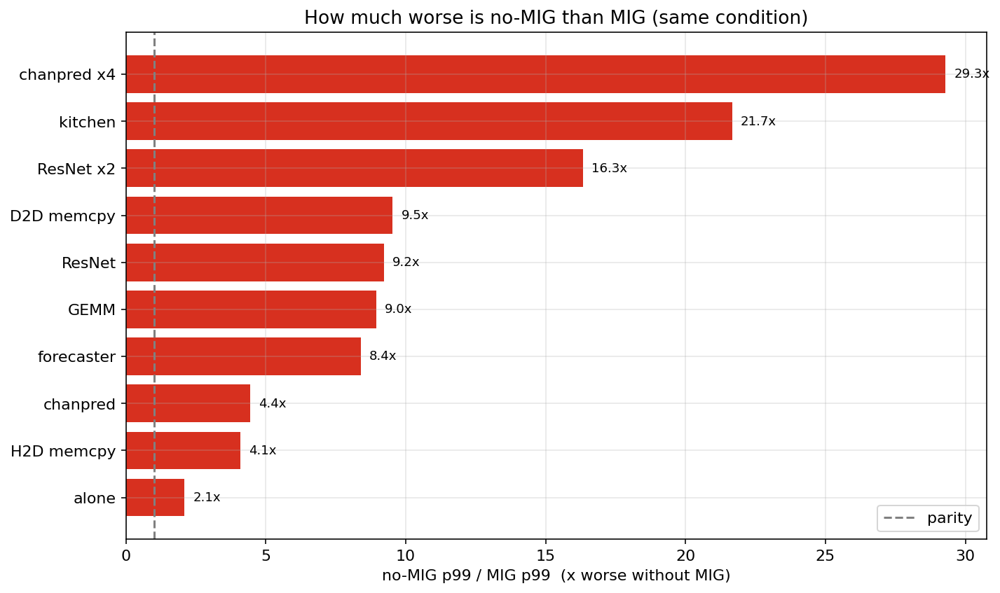
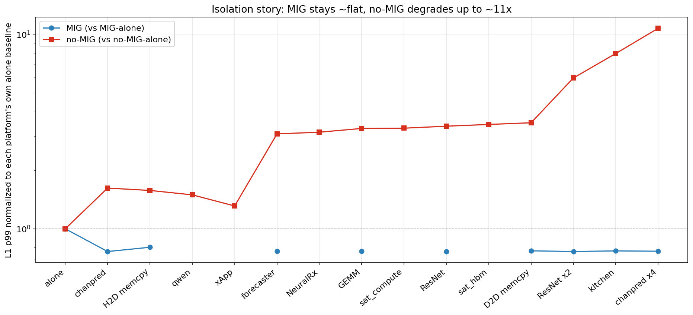
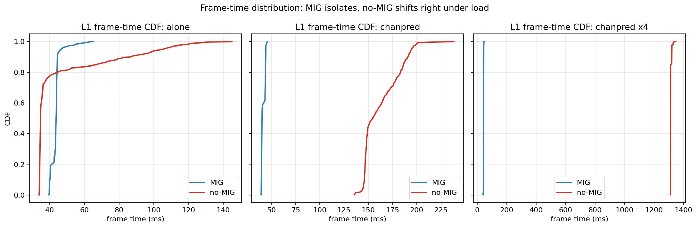
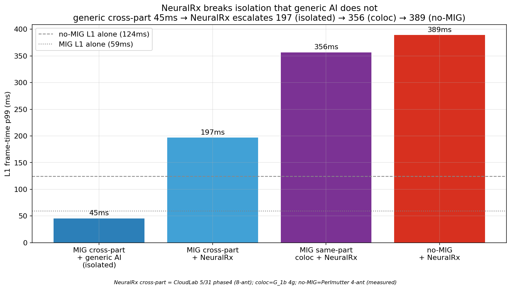

# no-MIG는 MIG의 격리를 대체하지 못한다: Perlmutter 시각 증거 (PART F)

작성: 2026-06-05 · 측정: Perlmutter (NERSC) A100-SXM4, **MIG OFF**
상위 문서: `results/visual_evidence/MIG_AIRAN_VISUAL_EVIDENCE_KR.md` (CloudLab MIG 증거, PART A–E)
대응 MIG 데이터: `results/20260601/{F_saturation, G_coloc, H_dual}` (4-antenna, 우리와 동일 설정)

---

## 📍 서론 — 한 줄 요약

> **CloudLab MIG 실험을 Perlmutter A100에서 MIG를 끈 채 동일 재측정한 결과: MIG cross-partition(AI를 별도 slice에 배치)은 어떤 AI에도 L1 p99를 ~45ms로 격리하지만, no-MIG 시간분할은 단일 AI에 MIG 대비 4–9배, 누적 부하에 최대 29배 무너진다. 한편 MIG same-partition coloc(L1+NeuralRx 같은 slice)은 ~356ms로, no-MIG(389ms)와 동급으로 나쁘다.**

### 이 문서가 답하는 질문
- Reviewer Q1: *"MIG가 부족하면 그냥 MIG 빼고 full GPU 시간분할 쓰면?"* → **no-MIG는 격리가 없어 더 나쁘다(§F1–F3).**
- Reviewer Q2: *"그럼 MIG면 항상 안전?"* → **아니다. same-partition coloc은 MIG여도 ~356ms로 no-MIG와 동급(§F5).**
- 종합: **MIG는 필요(격리)하지만 충분하지 않다(coloc).**

---

## 측정 환경 & 세 가지 regime (전부 4-antenna, cells=20, MCS=2, 273 PRB, n=5)

| regime | 정의 | 데이터 |
|---|---|---|
| **MIG cross-partition** | L1=3g slice, AI=별도 2g slice (격리) | CloudLab `20260601/F_saturation` |
| **MIG same-partition coloc** | L1 + NeuralRx가 **같은** slice 공유 | CloudLab `20260601/G_coloc` |
| **no-MIG** (본 PART F) | full A100, L1+AI **시간분할** 공유 | Perlmutter `perlmutter_nomig/F_nomig` |

> L1 "frame" = 20셀 직렬 실행 시간. miss_1ms는 설계상 항상 100% → **p50/p99가 핵심 지표**.
> **데이터 정합성 주의**: 비교는 전부 **4-antenna `20260601` 캠페인**으로 통일했다. (이전 `20260531/phase4`는 8-antenna split이라 설정이 달라 제외.)

### 확정 baseline (p99)
| | L1 alone |
|---|---|
| MIG 3g slice (cross-part) | **59ms** |
| MIG 4g slice (coloc 캠페인) | 60ms |
| **no-MIG full A100** | **124ms** (p50 34.6 — full GPU라 p50은 더 빠르나 tail이 큼) |

---

# §F0. 먼저 — MIG는 "평탄"하지 않다 (오해 방지)


뒤의 §F1/§F3에서 MIG가 ~45ms로 평탄하게 보이는 것은 **cross-partition(AI를 별도 slice에 격리) regime만** 그렸기 때문이다. **MIG 전체는 결코 평탄하지 않다** — placement에 따라 6–8배 출렁이고, 심지어 같은 설정에서 run마다 튄다:

| MIG placement | L1 p99 |
|---|---|
| cross-partition + AI (3g) | **45ms** (격리됨) |
| same-partition coloc 4g + NeuralRx | **356ms** |
| same-partition coloc 2g + NeuralRx | **371ms** |
| same-partition coloc 3g + NeuralRx | **bistable: 7/10 run ≈ 360ms, 3/10 run ≈ 45ms** |

- **왼쪽 그림**: MIG L1 p99는 cross-part 45ms → coloc 356–371ms. AI를 어디 두느냐가 전부.
- **오른쪽 그림**: MIG 3g coloc은 **같은 설정인데 run마다 ~360ms 또는 ~45ms로 양극화(bistable)** — 예측 불가능. (상위 문서 §4 bistable contention과 일치.)

> 따라서 §F1의 파란 막대(평탄 45ms)는 **MIG의 best-case(cross-partition)일 뿐**이다. MIG의 realistic/worst case(coloc)는 §F5–F7에서 별도로 본다. 이 점을 전제로 아래를 읽어야 한다.

---

# §F1. no-MIG vs MIG — MIG의 현실적(worst) 케이스 기준 비교 (핵심 그림)



빨간 막대 = no-MIG(측정), **보라 점선/띠 = MIG의 worst(현실) 케이스 same-partition coloc ~356ms(+3g bistable)**, 파란 점선 = MIG best(cross-partition 격리 ~59ms, AI를 완벽히 분리할 수 있을 때만). MIG는 보라(현실)를 기준으로 봐야 한다 — paper 주장이 "MIG coloc은 불충분"이기 때문이다.

읽는 법 (no-MIG가 MIG coloc 선 대비 어디 있나):
- **가벼운 AI**(xApp 162, qwen 185, H2D 195, chanpred 201) → MIG coloc(356) **아래** : 이 경우 no-MIG가 오히려 MIG 현실 케이스보다 낫다.
- **무거운 단일 AI**(forecaster 381 ~ D2D 435) → MIG coloc과 **동급~약간 위**.
- **누적 부하**(ResNet×2 739, kitchen 987, chanpred×4 1330) → MIG coloc보다 **2–4배 위**.

> **서열: MIG 격리(59) ≪ {MIG coloc(356) ≈ no-MIG 무거운 단일 AI(~400)} ≪ no-MIG 누적(739–1330).**
> MIG가 이기는 건 **AI를 완벽히 별도 slice에 격리할 때(파란선)뿐**이고, AI가 L1과 자원을 나눠 쓰는 현실(coloc)에선 MIG도 no-MIG와 비슷하게 무너진다.

#### 참고 — MIG **best**(cross-partition) 기준으로 보면 (상한 비교)
AI를 별도 slice에 완벽 격리한 MIG best 케이스(~45ms)와 비교하면 no-MIG는 다음과 같이 나쁘다(이건 MIG에 가장 유리한 비교):

| 조건 | MIG cross-part(best) p99 | no-MIG p99 | no-MIG/MIG-best |
|---|---|---|---|
| chanpred | 45.2 | 200.7 | 4.4x |
| ResNet50 | 45.3 | 417.7 | 9.2x |
| D2D memcpy | 45.6 | 434.9 | 9.5x |
| ResNet ×2 | 45.2 | 739.3 | 16.3x |
| kitchen | 45.6 | 987.4 | 21.7x |
| chanpred ×4 | 45.4 | 1329.7 | 29.3x |

→ MIG best 대비 4–29배. 단 이는 **MIG에 최대로 유리한 상한**이며, MIG 현실(coloc 356) 기준으로는 위 본문처럼 가벼운 AI에서 no-MIG가 더 낫기도 하다.

---

# §F2. 저하 배수 — no-MIG는 MIG 격리보다 몇 배 나쁜가



단일 AI 4–9.5배, 누적 부하 16–29배. 격리가 없으면 부하가 쌓일수록 격차가 기하급수적으로 벌어진다.

---

# §F3. 격리 스토리 — 각 플랫폼 자기 baseline 대비



플랫폼 간 절대 비교는 slice 크기 차이를 섞으므로 **자기 alone baseline으로 정규화**해 순수 contention만 본다:
- **MIG cross-part**: 전 조건 ~1.0 평탄 (격리 = contention 0; CloudLab 분석에서도 delta −17%, SEPARATE).
- **no-MIG**: 1.6배(chanpred) → 10.7배(chanpred×4) 단조 상승.

---

# §F4. 분포 — frame-time CDF



MIG는 분포가 ~45ms에 좁게 고정. no-MIG는 분포 **전체가** 오른쪽으로 이동(단순 tail 악화가 아님).

---

# §F5. NeuralRx — MIG same-partition coloc ≈ no-MIG (둘 다 나쁨)



NeuralRx는 L1과 같은 PHY 파이프라인을 공유하는 co-tenant라 가장 위험(상위 §2). **여기서 MIG의 한계가 드러난다**:

| 케이스 | L1 p99 | 출처 |
|---|---|---|
| L1 alone (no-MIG full GPU) | 124ms | 본 측정 |
| L1 alone (MIG 4g slice) | 60ms | CloudLab G_0b |
| **MIG same-partition coloc + NeuralRx** | **356ms** | CloudLab G_1b (4g) |
| **no-MIG + NeuralRx** | **389ms** | **본 측정** |

→ **no-MIG(389ms)와 MIG coloc(356ms)은 사실상 동급.** AI를 L1과 같은 자원에 넣으면 MIG여도 격리가 무너진다. (MIG 3g coloc은 bimodal 265±144ms, 2g coloc은 370ms — 상위 §4.1 partition paradox.)

---

## §F5 보충 — cross-partition 미측정 조건 (정직한 한계)

`F_saturation`(cross-partition) 캠페인은 generic stressor만 테스트했고 **NeuralRx/qwen/xApp/sat_compute/sat_hbm은 cross-partition으로 측정하지 않았다**(상위 §3.1). 이들은 `G_coloc`에서 "NeuralRx coloc + 외부 AI" 형태로만 존재(전부 ~357ms, NeuralRx coloc이 지배). 따라서 이 조건들은 no-MIG와 **MIG coloc(356ms)** 기준으로만 비교한다:

| 조건 | no-MIG p99 | MIG same-part coloc 기준 | 비고 |
|---|---|---|---|
| qwen_small | 185 | (cross-part 미측정) | no-MIG가 coloc보다 낮음 |
| xApp | 162 | 〃 | 〃 |
| NeuralRx | 389 | 356 | **동급** |
| sat_compute | 408 | 〃 | no-MIG가 coloc보다 약간 높음 |
| sat_hbm | 426 | 〃 | 〃 |

> 가벼운 AI(qwen/xApp)는 no-MIG 단독으로도 coloc보다 낮지만(격리 가치 큼), 무거운 AI(sat_*)는 no-MIG가 MIG coloc보다도 나쁘다.

---

## 핵심 발견 종합

1. **no-MIG = 격리 0**: 단일 AI에 MIG cross-part 대비 4–9배, 누적에 최대 **29배**.
2. **"안전한" AI 신화 붕괴**: MIG에서 무영향이던 chanpred가 no-MIG에선 4.4배(201ms).
3. **MIG도 만능 아님**: same-partition coloc은 ~356ms로 no-MIG(389ms)와 동급 → "MIG 필요하지만 불충분".
4. **운영 함의**: AI를 **별도 MIG slice**에 둘 수 있으면 MIG는 8배+ 이득. 같은 slice에 coloc하거나 MIG 없이 시간분할하면 둘 다 실패.

## 정직한 caveat
- **플랫폼 차이**: CloudLab MIG=A100 slice, Perlmutter no-MIG=full A100-SXM4. 절대값보다 **자기 baseline 정규화(§F3)**가 공정.
- **no-MIG alone tail**: p99(124) > p50(34.6)인 체계적 tail(10 run 일관, 노이즈 아님; clock-ramp 등).
- **forecaster**: ours d384 vs MIG d512 (경미한 설정 차이).
- **데이터 통일**: 8-antenna `20260531` 캠페인은 설정 불일치로 제외, 전부 4-antenna `20260601`로 비교.

---

## 진행 상태 & 다음 단계

| 우선순위 | 내용 | 상태 |
|---|---|---|
| 1 | no-MIG default time-slice (본 PART F) | ✅ 완료·분석됨 |
| 2 | no-MIG **MPS** | 🟡 측정 중 → §F7 (MIG·default·MPS 3-way) |
| 3 | NCU DRAM/L2/SM | 🟡 큐 → §F8 (상위 §18.2 비교) |
| 4 | per-call NSYS | 🟡 큐 → §F9 (상위 §16.1 memcpy 4.2→14.3us 비교) |
| 5 | 5분 sustained | 🟡 큐 → §F10 (상위 §19.3 지속성 비교) |

## 한 줄 종합
> **MIG는 평탄하지 않다 — placement에 전적으로 의존한다(§F0). cross-partition 격리만 L1을 ~45ms로 지키고(no-MIG 대비 4–29배 우위), same-partition coloc은 MIG여도 ~356ms이며 3g에서는 run마다 45↔360ms로 bistable하다. no-MIG(389ms)는 MIG coloc과 동급. → "MIG는 필요(격리)하지만 충분하지 않다(coloc·bistable)"를 한 데이터셋으로 입증.**

---

### 재현
```bash
cd $SCRATCH/kcj/airan_cloudlab/results/perlmutter_handoff
python3 analyze_F_nomig.py          # no-MIG 조건별 집계
python3 compare_mig_vs_nomig.py     # MIG(F_saturation) vs no-MIG
shifter --image=<aerial> airan_venv/bin/python build_perlmutter_figures.py   # figF1–F6
```
데이터: `perlmutter_nomig/F_nomig/realL1_*.json`(80) · MIG: `../20260601/{F_saturation,G_coloc}` · 그림: `figures/figF1–F5,F7.png`
