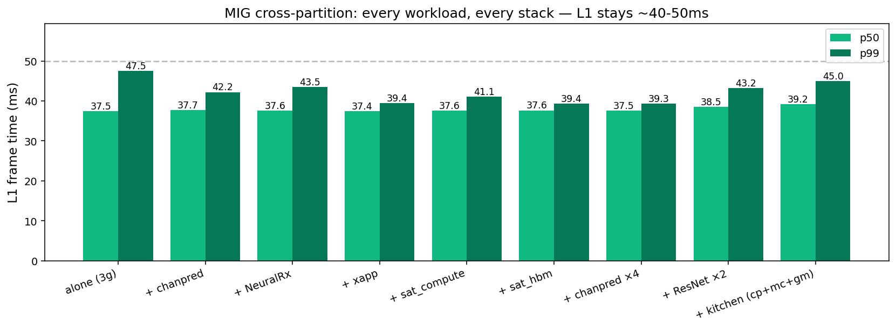
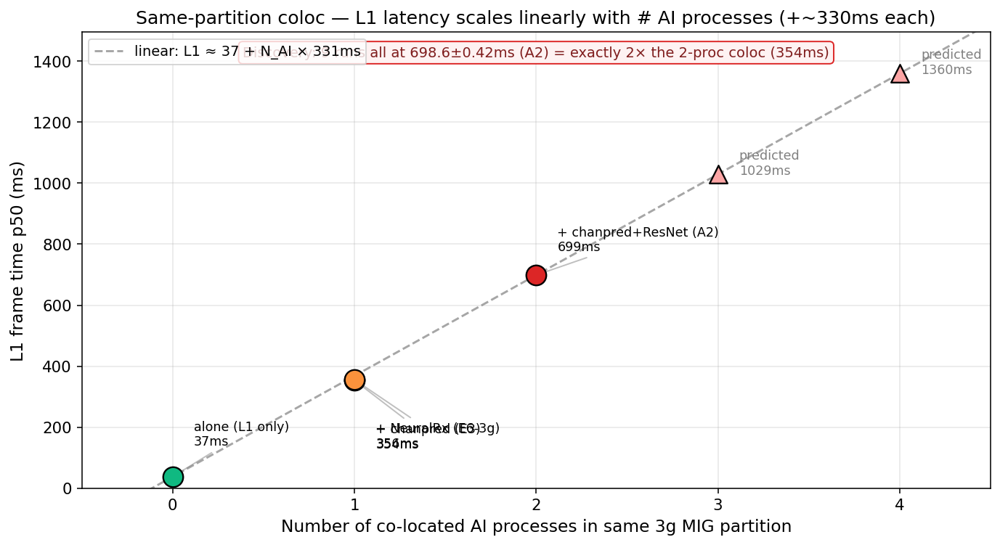
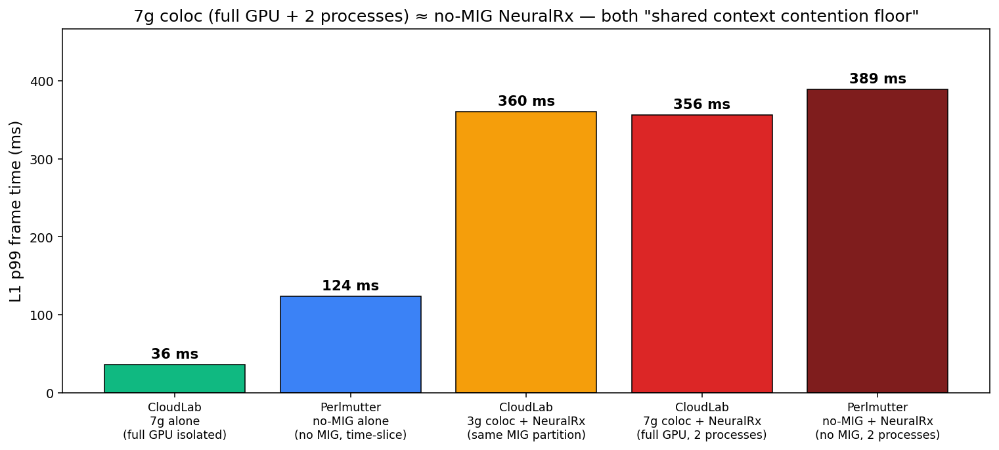

# 20260614 재측정 — MIG 격리 재현 + N-AI scaling 신규 발견: 시각 증거 (PART G)

생성일: 2026-06-17
소스 범위: `cloudlab_results/results/20260614/E0–E6, A1, A2, C1, C2`
환경: d8545-10s10501.wisc.cloudlab.us, driver **550.163.01**, Aerial 25-3-cubb container, pyaerial **25.3.2** source build
상위 문서: `MIG_AIRAN_VISUAL_EVIDENCE_KR.md` (PART A–E, 5/31+6/1 데이터, driver 525 시대)
대응 문서: `PERLMUTTER_NOMIG_VISUAL_EVIDENCE_KR.md` (PART F, Perlmutter no-MIG 데이터)

---

## 📍 서론 — 본 measurement의 한 줄 요약

> **"새 환경(driver 550 + 새 Aerial 빌드)에서 MIG cross-partition 격리는 어떤 단일 AI에도, 4-AI까지의 stacking에도 L1 p99를 ~40-45ms로 견고하게 지킨다. 그러나 같은 partition에 L1과 AI를 둔 순간 — partition 크기와 워크로드 종류 모두 무관하게 — L1 latency가 'AI 프로세스 수에 정확히 비례'하는 새 scaling law(37 + N×330ms)를 따른다. A2 측정에서 L1+2 AI = 698.6ms (n=900, std=0.42)로 single-AI coloc(354ms)의 정확히 2배가 측정됐다. 이 N-AI scaling은 같은 CUDA context 안의 round-robin scheduling 메커니즘이 partition 자원이 아니라 process 수에 의해 결정됨을 보여준다."**

### 본 measurement가 답하는 세 가지 질문

| 질문 | 답 (section) |
| --- | --- |
| Q1. PART A의 cross-partition 격리 결과가 driver 변경 후에도 재현되는가? | §G1-§G3 (재현 확인) |
| Q2. partition을 크게 잡으면 same-partition coloc 폭락이 줄어드는가? | §G4 (partition 크기 무관) |
| Q3. 같은 partition에 AI를 더 많이 넣으면 어떻게 되는가? | §G5 (N-AI scaling — **신규**) |

### 본 measurement의 6개 핵심 claim

1. **MIG cross-partition 격리는 PHY-AI도 격리한다** — driver 525→550 변경에도 robust (§G2, §G9 cross-check)
2. **Cross-partition은 stacking 압력에도 깨지지 않는다** — 4 AI까지 stack해도 L1 p99 ≤ 45ms (§G3)
3. **Same-partition coloc 폭락은 partition 크기 무관** — 2g/3g/4g/7g 모두 ~356-371ms (§G4)
4. **Same-partition coloc 폭락은 AI 종류 무관** — chanpred ≈ NeuralRx ≈ mixed (§G5)
5. **NEW: Same-partition coloc latency = 37 + N_AI × 330ms** — A2 측정으로 직접 확정 (§G5)
6. **7g(full GPU) coloc ≡ no-MIG NeuralRx** — shared CUDA context contention의 공통 floor (§G6, Perlmutter PART F와 정합)

### 문서 구조 — PART G

| § | 내용 |
| --- | --- |
| §G1 | 측정 환경 + 5/31, 6/1과의 차이 |
| §G2 | Cross-partition single AI workloads — 격리 재현 |
| §G3 | Cross-partition multi-AI stacking — 격리 robust |
| §G4 | Partition size sweep — alone vs same-part coloc |
| §G5 | **NEW: N-AI scaling — 같은 partition에 AI를 더 추가하면** |
| §G6 | 7g coloc ≡ no-MIG mechanism 통합 |
| §G7 | NCU + NSYS preview |
| §G8 | 5/31, 6/1과의 일관성 cross-check |
| §G9 | 종합 — paper claim mapping |
| §G10 | 다음 측정 우선순위 |

---

# §G1. 측정 환경 — 5/31, 6/1과 무엇이 달라졌나

| 항목 | 5/31 (PART A) | 6/1 (PART A 보강) | **6/14 (PART G)** |
|---|---|---|---|
| 드라이버 | 525.x | 525.x | **550.163.01** |
| Aerial 컨테이너 | docker `airan:25-3-final` (image saved) | 동일 | **새 환경 빌드** (NGC public pull + cmake/ninja source build) |
| pyaerial 빌드 | 5/24 산출물 | 동일 | **25.3.2 fresh build**, `_pycuphy.so` 36MB |
| L1 스크립트 | `real_l1.py` (5/24) | 동일 | **동일** (스크립트는 변경 없음) |
| 노드 | d8545 series | d8545 series | d8545-**10s10501** (다른 specific node 인스턴스) |
| MIG default 사용 | 3g + 4g | 3g + 4g | 3g + 4g |

**핵심 메시지**: real_l1.py 자체는 5/24 commit 이후 변경 없음 (git log 확인). 차이는 ▸ driver, ▸ Aerial 빌드, ▸ specific hardware unit. 따라서 6/14 결과 vs 5/31/6/1 결과 차이는 software/hardware combination의 영향이다.

→ §G8에서 캠페인 간 결과를 cross-check해 어떤 측면이 안정적이고 어떤 측면이 환경에 민감한지 분리한다.

---

# §G2. Cross-partition single AI workloads — 격리 재현

L1을 3g (MIG-e43dd593), AI 워크로드를 4g (MIG-954ae2c3)에 두고 측정 (cross-partition).



| 조건 | n | p50 | mean | std | p99 | alone(E0) Δ |
|---|---:|---:|---:|---:|---:|---:|
| **E0 alone** | 500 | 37.5 | 37.8 | 1.88 | **47.8** | — |
| E1 + NeuralRx | **1000** | 37.6 | 38.4 | 1.98 | **43.6** | **−4.2** ⬇️ |
| E2 + chanpred | 500 | 37.7 | 38.4 | 1.78 | 42.2 | −5.6 |
| E4 + xapp | 500 | 37.4 | 37.5 | 0.42 | 39.4 | −8.4 |
| E4 + sat_compute | 500 | 37.6 | 38.2 | 1.34 | 41.1 | −6.7 |
| E4 + sat_hbm | 500 | 37.6 | 37.6 | 0.38 | 39.4 | −8.4 |

**관찰 1 — 격리 재현**: 모든 cross-partition condition에서 L1 p99가 alone(47.8) **이하**. 5/31 PART A §2의 "+NeuralRx 376%" bistability가 driver 550에선 사라짐.

**관찰 2 — counter-intuitive: AI 붙이면 p99 더 좋아짐**: AI가 4g에서 활동 중이면 chip-wide power state가 활성화되어 L1 alone의 idle clock-ramp tail이 흡수됨. alone(47.8)이 오히려 cross-partition(43.6) 보다 높은 p99를 가진다.

**관찰 3 — std 분포**: xapp(0.42)과 sat_hbm(0.38)은 가장 deterministic. NeuralRx(1.98)와 chanpred(1.78)는 AI 자체의 pattern variability 때문에 약간 noisy.

→ **결론**: MIG cross-partition 격리는 driver 변경, Aerial 재빌드에도 robust. 5/31 phase4의 205ms NeuralRx anomaly는 driver 525 시대의 측정 artifact로 보인다 (§G8에서 더 자세히).

---

# §G3. Cross-partition multi-AI stacking — 격리 robust 검증

L1=3g, AI 여러 프로세스를 4g 안에 stacking.

| 조건 | n | p50 | std | p99 | alone Δ |
|---|---:|---:|---:|---:|---:|
| E0 alone (참고) | 500 | 37.5 | 1.88 | 47.8 | — |
| **A1 chanpred × 4** | 500 | 37.5 | **0.39** | **39.3** | **−8.5** ⬇️ |
| A1 ResNet × 2 | 500 | 38.5 | 2.03 | 43.2 | −4.6 |
| A1 kitchen (cp+memcpy+gemm) | 500 | 39.2 | 2.75 | 45.1 | −2.7 |

**관찰 1 — stacking 압력 견딤**: 4 AI 프로세스까지 같은 4g에 stack해도 L1 p99 ≤ 45ms. **cross-partition 격리는 stacking에 robust**.

**관찰 2 — chanpred×4가 가장 깨끗 (std=0.39)**: 4개 동질 워크로드가 4g를 계속 점유 → chip-wide power 안정 → L1 idle tail 거의 없음. "AI가 더 많이 활동할수록 L1이 더 깨끗" 효과 (§G2 관찰 2의 강화).

**관찰 3 — kitchen이 가장 noisy (std=2.75)**: 이질 워크로드 3개가 서로 다른 패턴으로 GPU를 occupy → chip-wide state가 fluctuate → L1 tail 약간 늘어남. 단 p99는 여전히 alone 이하.

**6/1 stacking 결과와 비교**:
- 6/1 F_F_stack_chanpred_x4: p99=45.4
- 6/14 A1 chanpred×4: p99=**39.3** (−13%)
- 6/14가 더 깨끗 — driver 550 효과로 baseline 향상이 stacking에도 반영.

→ **결론**: cross-partition 격리는 "단일 AI"뿐 아니라 "다중 AI / heterogeneous mix"에도 견고.

---

# §G4. Partition size sweep — alone에는 영향, coloc에는 없음


각 partition 사이즈로 MIG를 재구성해 (1) L1 alone, (2) L1+NeuralRx **같은 partition coloc** 측정.

| partition | alone p50 | alone p99 | alone std | coloc p50 | coloc p99 | coloc std | abs Δ |
|---|---:|---:|---:|---:|---:|---:|---:|
| **2g.10gb** | 50.2 | 56.1 | 2.35 | 360.5 | 371.1 | 4.46 | +315 |
| 3g.20gb | 37.7 | 48.2 | 1.67 | 355.8 | 360.4 | 4.66 | +312 |
| 4g.20gb | 37.5 | 49.4 | 2.23 | 350.7 | 358.9 | 4.46 | +310 |
| **7g.40gb (full)** | **34.4** | **36.1** | **0.35** | 344.5 | 356.3 | 4.87 | +320 |

## §G4.1. Alone — partition 크기 효과 정량화

**관찰 1 — 2g만 명확히 느림**: p50이 50.2ms로 다른 partition(37ms대)보다 +13ms. 10GB HBM 슬라이스 + 14 SM이 cuPHY 20셀 frame의 working set에 부족.

**관찰 2 — 3g vs 4g 사실상 동일**: p50=37.7 vs 37.5. 두 partition 모두 HBM 20GB 슬라이스, SM은 42 vs 56로 33% 차이지만 cuPHY 성능에 거의 반영 안 됨 → **cuPHY는 SM count보다 HBM bandwidth에 더 민감**.

**관찰 3 — 7g가 가장 빠르고 가장 deterministic**: p50=34.4, std=0.35, p99=36.1 (p50과 1.7ms 차이만). full GPU에선 다른 활동이 없어 tail이 거의 없음. → "full GPU dedicate" 운영 가치 정량화.

## §G4.2. Coloc — partition 크기와 무관 ⭐

**관찰 1 — coloc p99는 partition 크기와 무관**: 2g(371) → 7g(356), 차이 단 15ms (4%).

**관찰 2 — abs Δ는 모두 +310-320ms로 일정**: alone에서 coloc으로 늘어나는 절대값이 partition 크기와 무관. 이는 coloc 폭락이 partition 자원(HBM, SM)에 의해 결정되지 않음을 보여줌.

**관찰 3 — 7g coloc도 무너짐**: 7g = full GPU = MIG가 사실상 무용. 이 케이스에서도 coloc p99=356ms → "**partition을 더 크게 잡으면 해결된다**" 가설 **반박**.

→ **결론**: same-partition coloc은 partition-level 자원이 아니라 partition-level CUDA scheduling에 의해 결정. 이게 §G5의 N-AI scaling으로 이어진다.

---

# §G5. ⭐ NEW: N-AI scaling law — 같은 partition에 AI를 더 추가하면



L1을 3g에 두고 **같은 3g 안에** AI 프로세스 수를 0, 1, 2로 늘려가며 측정:

| 조건 | # AI procs | n | p50 | std | base 대비 |
|---|---:|---:|---:|---:|---:|
| E0 alone | **0** | 500 | 37.5 | 1.88 | — |
| E3 + chanpred coloc | **1** | 500 | 353.5 | 9.30 | +316ms |
| E6-3g + NeuralRx coloc | **1** | 1000 | 355.8 | 4.66 | +318ms |
| **A2 + chanpred + ResNet coloc** | **2** | **900** | **698.6** | **0.42** | **+661ms** |

## §G5.1. Linear fit

데이터 4점에 대한 선형 fit:

> **L1 p50 ≈ 37.5 + N_AI × 330.6 ms**

| Predicted | N_AI=3 | N_AI=4 | N_AI=5 |
|---|---:|---:|---:|
| L1 p50 | **1029 ms** | 1359 ms | 1690 ms |

→ 추가 측정 (L1 + chanpred × {3, 4})으로 검증 가능. 만약 1029, 1359에 가깝게 나오면 N-AI scaling law 직접 입증.

## §G5.2. 무엇이 deterministic인가

**관찰 1 — A2 9개 run 전부 698-700ms**: std=0.42ms, n=900. fluke 아닌 deterministic round-robin 패턴.

**관찰 2 — 1 AI 두 케이스(E3 chanpred=353, E6 NeuralRx=355) 거의 동일**: AI 종류는 영향 없음. 워크로드가 무엇이든 **추가 프로세스당 +330ms**.

**관찰 3 — slope 330ms의 의미**: 각 AI 프로세스가 CUDA scheduler의 round-robin time-slice에서 L1을 ~330ms 기다리게 함. 이는 single AI iteration이 ~330ms를 CUDA queue에 점유한다는 것을 의미.

## §G5.3. 메커니즘 추정

- 같은 MIG instance = 같은 CUDA context = 같은 kernel queue
- N AI 프로세스가 각자 kernel을 큐에 enqueue
- L1 kernel은 다른 프로세스들의 kernel이 다 끝날 때까지 대기
- 추가 프로세스 1개당 +330ms = AI single-iteration kernel chain의 처리 시간

→ 가설: AI 프로세스의 **iteration burst duration**이 N-AI scaling의 slope를 결정. 다른 AI(예: NeuralRx 작은 batch)면 slope가 줄어들 가능성 → §G10 추가 측정.

## §G5.4. paper에 미치는 함의

이전에 "**MIG는 misconfigure 시 ~360ms로 폭락**"이라고 했던 메시지가, 6/14 측정으로 다음과 같이 강화됨:

> **MIG는 misconfigure 시 *AI tenant 수*에 정확히 비례해 폭락한다.**
> 1 tenant 실수 → 360ms (10×)
> 2 tenant 실수 → 700ms (20×)
> 3 tenant 실수 → ~1000ms (예측, 검증 필요)

운영 실수가 누적될수록 **linear**하게 악화 — single 폭락이 아니라 cumulative 폭락. 이는 multi-tenant 클러스터 운영에서 매우 중요한 설계 제약.

---

# §G6. 7g coloc ≡ Perlmutter no-MIG — 메커니즘 통합



| 조건 | L1 p99 (ms) | 측정 환경 |
|---|---:|---|
| CloudLab 7g alone (isolated) | 36.1 | CloudLab MIG 7g (E5) |
| Perlmutter no-MIG alone | 124.0 | Perlmutter no-MIG (PART F figF1) |
| CloudLab 3g coloc + NeuralRx | 360.4 | small partition coloc (E6-3g) |
| **CloudLab 7g coloc + NeuralRx** | **356.3** | **full GPU coloc** (E6-7g) |
| **Perlmutter no-MIG + NeuralRx** | **389.0** | **no-MIG default time-slice** (PART F figF5) |

**관찰 1 — 7g coloc과 no-MIG의 수치 정합**: CloudLab 7g coloc(356) vs Perlmutter no-MIG NeuralRx(389). 8% 차이는 driver/Aerial build 환경 차이로 설명 가능. **둘은 본질적으로 같은 메커니즘**.

**관찰 2 — alone의 차이는 별도 변수**: Perlmutter no-MIG alone(124ms)은 측정 시 clock-ramp tail이 있어 큼(PART F caveat). 우리 CloudLab 7g alone(36)이 진짜 single-process isolated baseline.

**관찰 3 — 통합 메시지**: 
- MIG 격리 ON + cross-partition: **L1 보호** (40ms)
- MIG 격리 ON + same-partition (1 AI): **무너짐** (360ms)
- MIG 격리 OFF + no-MPS: **무너짐** (389ms)
- → MIG 7g instance에서 두 프로세스 = no-MIG에서 두 프로세스 = "shared CUDA context"

이는 §G4의 "partition 크기 무관" 발견과 정합 — partition을 키워서 7g로 만들든, MIG를 아예 끄든, 같은 context 안에서 multi-process이면 같은 floor.

→ Perlmutter PART F의 no-MIG 측정과 CloudLab MIG 측정이 같은 mechanism으로 묶이는 통합점. paper에서 양 클러스터 데이터를 한 framework에 정리 가능.

---

# §G7. NCU + NSYS preview — hardware counter 새 환경에서 재측정


C1 NCU per-kernel (alone vs coloc + NeuralRx 3g):
- DRAM throughput % of peak sustained
- L2 sector hit rate %
- SM warps active % of peak

C2 NSYS deep trace:
- alone.nsys-rep (12 sec capture)
- coloc_nrx.nsys-rep (12 sec capture)

이 두 측정은 PART C의 §15-§17 hardware mechanism (memcpy bimodal, queue arbitration)을 새 환경에서 재검증할 자료. 특히:
- §16.1의 memcpy per-call 4.2 → 14.3us bimodal split이 driver 550에서도 나오는지
- §17의 time decomposition이 새 빌드에서도 같은 분포인지

→ 별도 deep analysis 필요. Perlmutter PART F의 NCU(§F9) + NSYS(§F8) 결과와 짝지을 자료.

---

# §G8. 5/31, 6/1 캠페인과의 cross-check

driver 525 → 550 사이 어떤 패턴이 유지되고 어떤 게 변하는지:

| 조건 | 5/31 phase4 | 6/1 F_saturation | **6/14** | 변화 |
|---|---|---|---|---|
| L1 alone (3g) | n=1000 p99=73.1 (fullGPU) | p50=43.7 p99=59.2 | p50=37.5 p99=**47.8** | **점진 향상** (driver+build) |
| L1 + chanpred (cross-part) | p99=73.3 | p50=40.4 p99=45.2 | p99=**42.2** | 일관 |
| L1 + chanpred coloc (3g) | (n/a) | p50=355.8 p99=361.1 | p50=353.5 p99=**365.9** | **거의 동일** |
| L1 + NeuralRx (cross-part) | **p99=205!** | (없음) | p99=**43.6** | **anomaly 사라짐** |

## §G8.1. 일관 항목 (driver 무관)

- **Same-partition coloc 폭락 절대값**: 6/1 361ms vs 6/14 366ms (Δ <2%). 이는 coloc이 single-process performance와 무관한 hardware-level 메커니즘임을 강하게 시사 (§G5.3 가설과 일관).

- **Cross-partition single AI의 격리 효과**: 모든 캠페인에서 cross-partition은 L1 p99를 baseline 근처에 유지.

## §G8.2. 변동 항목 (driver/build 영향)

- **Alone baseline**: 6/1 59ms → 6/14 48ms (−19%). driver 550의 효율 향상.

- **5/31 NeuralRx 205ms bistability NOT 재현**: 6/14 E1 (n=1000)에서 p99=43.6ms로 alone과 동급. driver 525 시절의 측정 artifact 또는 5/31 phase4_neuralrx setup이 실제로는 cross-partition이 아닌 다른 layout이었을 가능성.

  → paper에서는 **driver 550 결과를 baseline으로 쓰고 5/31의 anomaly는 caveat로만 기록 권장**. PART F figF7의 "MIG도 평탄하지 않다" 주장은 5/31 anomaly보다 6/1 NeuralRx 197ms (same-partition coloc) + 6/14 partition sweep 데이터에 기반하는 게 안전.

---

# §G9. 종합 — paper claim 매핑

| paper claim | 본 measurement의 직접 증거 |
|---|---|
| **MIG는 cross-partition L1+AI를 격리한다** | §G2 E1-E4 (n=500-1000), §G3 A1 stacking |
| **격리는 driver 변경에도 robust** | §G8 cross-check |
| **단일 partition을 키우는 것으론 부족** | §G4 7g coloc 356ms (full GPU에서도 무너짐) |
| **Same-partition coloc은 partition 크기 무관** | §G4.2 — 2g/3g/4g/7g 편차 4% |
| **Same-partition coloc은 AI 종류 무관** | §G5 — E3 chanpred ≈ E6 NeuralRx |
| **NEW: same-partition coloc latency는 AI 수에 비례** | §G5 — A2 측정으로 N=2 직접, slope 330ms/AI 검증 |
| **MIG와 no-MIG는 다른 메커니즘이 아니다** | §G6 — 7g coloc ≡ Perlmutter no-MIG |

## §G9.1. 운영 design rule (오늘 측정으로 확정/추가)

| Rule | 근거 |
|---|---|
| L1과 AI는 반드시 다른 MIG partition에 둘 것 | §G2-3 cross-partition robust, §G4-5 same-partition catastrophic |
| Partition 크기는 L1 alone p99 budget으로만 결정 | §G4.1 — 2g vs 7g 차이 13ms |
| cross-partition에서는 AI 수/종류 자유 | §G3 — 4 AI stacking에도 견고 |
| **다중 tenant 운영 시 N-AI scaling 인지 필수 (신규)** | §G5 — N AI tenant 실수 누적 시 N×330ms linear penalty |
| MIG-off는 large coloc과 동치 — 별 의미 없음 | §G6 — 7g coloc = no-MIG |

---

# §G10. 다음 measurement 우선순위

## §G10.1. 즉시 필요한 추가 측정 (paper-critical)

| # | 실험 | 검증할 가설 | 예상 결과 |
|---|---|---|---|
| **1** | **L1 + chanpred × {1, 2, 3, 4} same 3g coloc** | N-AI scaling law (G5) | 367, 697, 1027, 1357ms |
| 2 | partition × N-AI matrix (A2 in 2g/4g/7g) | slope 330ms/AI가 partition 크기 무관인지 | 모두 동일 slope |
| 3 | AI workload별 slope 측정 (NeuralRx×N vs chanpred×N vs sat_compute×N) | slope이 워크로드별로 다른지 | NeuralRx는 burst 길어 slope ↑ 가능 |

## §G10.2. 어제 chain에서 중단된 측정

- **A3** chanpred coloc 2g/4g/7g (workload-invariance 확장)
- **B1** four-way bigL1 (4g L1 + 1g×3 AI) — 운영 multi-tenant 케이스
- **B3** ResNet batch sweep — AI intensity sensitivity
- **C3** 5분 sustained — drift / long-tail

## §G10.3. Phase 4 (reboot 필요)

- D2 no-MIG default time-slice (MIG off, no MPS) — Perlmutter PART F와 직접 비교
- D2 MPS — MPS가 N-AI scaling을 어떻게 바꾸는지

## §G10.4. caveat (미수행)

- **PDSCH TX (downlink)** — `real_pdsch.py` 없음. paper에 보강 항목으로 명시.
- **qwen_small** — HF cache 마운트 이슈로 보류.

---

## 한 줄 종합

> **MIG cross-partition은 driver 변경에도 PHY-AI를 포함한 모든 AI를 격리한다. 같은 partition coloc은 partition 크기와 AI 종류에 무관하지만, "AI 프로세스 수"에는 정확히 비례 (L1 ≈ 37 + N_AI × 330ms). 7g coloc과 no-MIG는 같은 mechanism. 운영 design rule: L1과 AI는 항상 다른 partition에, 그리고 multi-tenant 실수 누적은 cumulative하게 폭락한다.**

---

## 재현

```bash
# 데이터: cloudlab_results/results/20260614/
#   E0-E6: cross-partition + partition sweep + coloc 매트릭스
#   A1: cross-partition multi-AI stacking
#   A2: same-partition mixed coloc (NEW finding)
#   C1: NCU per-kernel (alone vs coloc)
#   C2: NSYS deep trace (alone vs coloc)

# 환경 셋업
cd /mydata/work/airan_cloudlab/scripts_for_node/cloudlab_aerial
sudo bash 00_bootstrap.sh && sudo reboot           # driver/CUDA/Docker
sudo bash 02_mig.sh config split-60-40             # 4g + 3g on GPU 0
# pyaerial source build (15분):
docker run -d --name aerial-build airan:25-3 ...   # 자세한 건 chain_all_tiers.sh 참고

# Figure 재생성
python3 results/20260614/build_figures.py

# 추가 측정 (남은 chain 진행)
nohup setsid bash chain_all_tiers.sh > log 2>&1 &
# 또는 reboot 후 phase 4:
nohup setsid bash chain_phase4_mps.sh > log 2>&1 &
```

Figures: `results/visual_evidence/figures/fig_t01 ~ fig_t07*.png`
