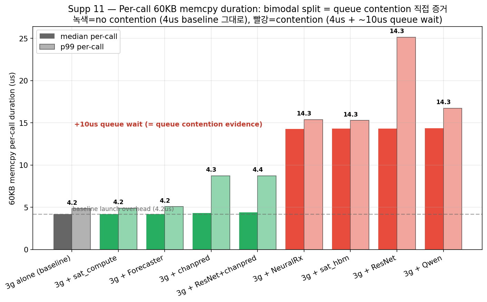
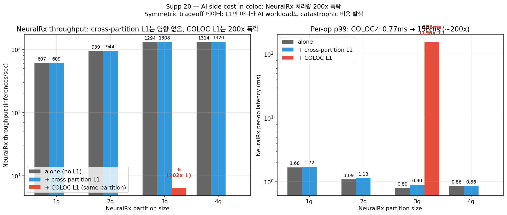

# AI-RAN의 실시간 cuPHY L1과 In-line PHY-AI 통합을 위한 NVIDIA MIG 격리 한계의 Hardware-level 분석*

김창종O, 손이한, Zainab Rizvi, 김성곤

서울과학기술대학교 컴퓨터공학

changjong5238@seoultech.ac.kr, ehanjsohn@seoultech.ac.kr, szainabr@gmail.com, sunggonkim@seoultech.ac.kr

## Hardware-level Analysis of NVIDIA MIG Isolation Limits for Consolidating Real-time cuPHY L1 and In-line PHY-AI in AI-RAN

Changjong KimO, Ehan Sohn, Zainab Rizvi, Sunggon Kim

School of Computer Science and Engineering in Seoul National University of Science and Technology

---

### 요  약

 AI-RAN은 기지국의 실시간 물리계층 처리(cuPHY L1)와 PHY-AI 추론(NeuralRx 등)을 동일한 GPU 위에서 통합 운영하는 차세대 무선접속망 구조로 주목받고 있다. 이러한 통합에는 하나의 GPU를 여러 워크로드가 안전하게 공유하도록 하는 격리(isolation) 기술이 필수적이며, NVIDIA의 다중 인스턴스 GPU(MIG: Multi-Instance GPU)가 사실상의 표준으로 사용된다. 그러나 MIG가 엄격한 deadline을 갖는 실시간 L1과 in-line PHY-AI를 함께 운영하기에 충분한 격리를 제공하는지는 검증되지 않았다. 본 논문에서는 NVIDIA A100 환경에서 cuPHY L1과 다양한 PHY-AI/AI 워크로드를 MIG partition에 배치하며 L1의 p99 tail latency와 hardware counter를 측정·분석하였다. 그 결과 MIG는 SM, HBM 대역폭 share, kernel launch queue 등 capacity 자원은 partition별로 격리하지만, chip 전체에서 공유되는 PCIe/DMA copy engine arbitration queue는 격리하지 못함을 확인하였다. 이로 인해 (1) 작은 partition이 HBM 대역폭 share 감소로 L1의 memory boundary를 지연시키는 구조적(structural) 비용, (2) 패턴이 유사한 cross-partition AI가 L1의 memcpy를 queue에서 대기시키는 경합(contention) 비용, (3) 동일 partition coloc 시 L1 p99 +537%, PHY-AI throughput 200배 폭락이라는 양방향 붕괴가 발생한다. 특히 hardware counter로 이 경합이 throughput 경쟁이 아니라 shared queue arbitration 대기임을 입증하였다. 본 연구는 MIG 단독으로 AI-RAN 통합을 보장할 수 없으며, 워크로드 패턴 기반 admission control이 추가로 필요함을 실증한다.

## 1. 서론

 무선접속망(RAN: Radio Access Network)은 가상화·소프트웨어화를 거치며 범용 GPU 기반 가속 구조로 이동하고 있다. 그 대표적 흐름이 AI-RAN으로, 실시간 물리계층 처리를 담당하는 cuPHY L1과 채널 추정·복조를 학습 기반으로 대체하는 PHY-AI(Physical-layer AI) 추론을 동일한 GPU에서 통합 운영하는 것을 목표로 한다. 이때 cuPHY L1은 frame cadence(약 1ms)를 맞춰야 하는 엄격한 deadline 워크로드이며, NeuralRx와 같은 in-line PHY-AI 또한 평균 처리량이 아니라 per-operation tail latency를 동시에 만족시켜야 한다 [1, 2, 3].

 하나의 GPU를 실시간 L1과 AI 추론이 함께 점유하려면 워크로드 간 간섭을 차단하는 격리가 전제되어야 하며, 현재 이 목적에는 NVIDIA MIG가 사실상의 표준으로 활용된다. MIG는 단일 GPU를 1g~7g 크기의 partition(slice)으로 분할하고 각 partition이 독립된 GPU처럼 격리된 SM·메모리를 갖는 것처럼 동작한다고 약속한다 [4, 5]. 그러나 기존 GPU 공유 연구는 다중 테넌트 환경의 capacity 분배와 평균 throughput에 집중되어, deadline을 갖는 실시간 L1과 in-line PHY-AI 조합을 전제로 격리를 평가한 사례는 부족하다. 핵심은 AI-RAN의 L1이 throughput이 아니라 deadline 워크로드라는 점이다. 평균 GPU busy time이 낮아도 특정 stage boundary에서 수백 us~ms 지연이 나면 p99/p999 deadline이 즉시 위반되므로, "MIG가 capacity를 나눠준다"는 사실만으로 통합 운영의 안전을 결론지을 수 없다.

 이에 본 논문에서는 NVIDIA A100 환경에서 cuPHY L1과 NeuralRx를 포함한 PHY-AI/AI 워크로드를 MIG partition에 배치하며 L1의 tail latency와 GPU·CPU hardware counter를 측정하였다. 기여는 다음과 같다. 첫째, MIG의 격리 한계를 구조적(structural) 비용과 경합(contention) 비용이라는 두 메커니즘으로 분리해 측정하였다. 둘째, 이 경합이 throughput 경쟁이 아니라 chip 전체에서 공유되는 PCIe/DMA copy engine arbitration queue에서의 대기임을 hardware counter로 직접 증명하였다. 셋째, 동일 partition coloc이 L1과 PHY-AI 양쪽을 동시에 붕괴시키는 catastrophic failure임을 양측 측정으로 입증하였다.

## 2. 배경

### 2.1 cuPHY L1의 실시간 처리 요구

 cuPHY는 NVIDIA Aerial SDK의 GPU 가속 5G NR 물리계층 라이브러리로, PUSCH 수신 파이프라인은 채널 추정, 등화, 노이즈·간섭 추정, LDPC 디코딩, CRC 검사 stage로 구성된다 [1]. cuPHY는 초기화 시 working buffer를 한 번 할당하고 매 frame 재사용하는데, LDPC 디코더가 매 frame 깨끗한 working memory를 요구하므로 buffer 초기화(memset)와 stage 간 텐서 이동(memcpy)이 고정된 횟수로 발생한다. L1은 이 파이프라인을 frame cadence에 맞춰 반복해야 하는 deadline 워크로드이므로, 평가 지표는 평균 처리량이 아니라 p99/p999 tail latency다.

### 2.2 In-line PHY-AI 통합과 GPU 공유

 최근 무선접속망 응용은 NeuralRx, 채널 예측(ChanPred), 트래픽 예측(Forecaster), xApp 같은 AI 추론을 L1 실행 루프 안에 통합하는 in-line 구조로 발전하고 있다. 이를 클라우드나 별도 가속기로 분리하면 데이터 전송 지연으로 frame deadline을 보장할 수 없으므로, 데이터가 생성되는 기지국의 동일 GPU 내부에서 L1과 PHY-AI를 함께 실행하는 것이 유리하다. 그러나 이 통합은 두 워크로드가 동일 hardware 자원을 시간적으로 공유함을 전제하므로, 격리가 보장되지 않으면 실시간성이 직접 훼손된다.

### 2.3 MIG의 격리 모델과 chip-wide 공유 구조

 MIG는 단일 A100을 partition으로 분할하고 partition별로 SM과 HBM 용량·대역폭을 capacity에 비례해 정적으로 할당한다. 그러나 이것이 GPU의 모든 hardware 구조가 partition 경계로 나뉜다는 의미는 아니다. 특히 `cudaMemcpyAsync` 요청을 스케줄링하는 PCIe/DMA copy engine arbitration queue와 memory controller의 request arbitration queue는 partition별로 복제되지 않고 chip 전체에서 단일하게 공유된다. 따라서 서로 다른 partition의 워크로드가 동시에 copy 요청을 발행하면 이 공유 queue에서 줄을 서게 된다. 본 연구는 이 chip-wide 공유 구조가 MIG 격리의 사각지대이며, AI-RAN의 L1+PHY-AI 통합이 정확히 이 사각지대에 의존함을 보인다.

## 3. 실험결과

### 3.1 실험 환경 및 벤치마크 구성

 실험은 CloudLab의 NVIDIA A100 노드에서 수행하였다. MIG는 7g(full)·4g·3g·2g(및 1g) partition으로 구성하고, 실시간 워크로드로 cuPHY 5G NR PUSCH RX 파이프라인을 사용하였다. AI 비교군으로 in-line PHY-AI인 NeuralRx와 ChanPred·ResNet·Qwen(LLM)·Forecaster·xApp을, 메커니즘 분리를 위한 합성 stressor로 sat_compute(연산 집약 GEMM)·sat_hbm(HBM 대역폭 포화)·대용량 D2D/H2D memcpy를 사용하였다. 배치는 (a) L1 partition별 단독, (b) cross-partition AI, (c) 동일 partition coloc의 세 가지로 구분하였다. 지표로는 L1 mean/p99 latency와 AI throughput을 측정하고, 메커니즘 분석을 위해 NSYS SQLite의 CUPTI activity와 NCU hardware counter(DRAM throughput)를 수집하였다. 모든 조건은 cherry-picking을 배제하기 위해 n=10~20으로 반복 측정하였다.

### 3.2 현상 관측 — 어떤 조건에서 L1 deadline이 깨지는가

 

 **그림 1** MIG partition 크기별 cuPHY L1 baseline latency

 첫째, 작은 partition은 그 자체로 L1 headroom을 줄인다. 그림 1에서 2g L1은 full GPU 대비 평균 latency가 약 +40.2% 증가하며, 작은 slice일수록 mean뿐 아니라 p99 tail의 run-to-run variance까지 커진다. 둘째, in-line PHY-AI는 별도 partition에 두어도 위험하다. 그림 2에서 3g L1 기준 NeuralRx를 cross-partition에 두면 L1 p99가 약 +376%까지 증가하고, n=20 반복에서 baseline(37~44ms)과 +NeuralRx(175~243ms) 분포가 완전히 분리되어 재현 가능한 shift임을 확인하였다(ChanPred·xApp은 +66~72%에 그침).

 

 **그림 2** Cross-partition PHY-AI의 L1 p99 영향 (3g L1)

 셋째, 그러나 generic cross-partition saturation은 주범이 아니다. D2D/H2D/GEMM/ResNet 등 39개 stress 조건에서 L1 p99의 positive inflation은 0건이었고, 반복 실험(n=10)에서도 모든 stress가 baseline 근처(p99 약 950us)에 머물렀다. 즉 일반적 stress는 잘 막히므로 PHY-AI에 국한된 failure가 더 선명해진다. 넷째, L1과 NeuralRx를 동일 partition에 두면 tail이 폭발한다. 그림 3에서 coloc 시 L1 p99는 3g +372.6%, 4g +536.7%, 2g +504.5%까지 치솟는다. 직관과 반대로 4g coloc(357ms)이 3g coloc(265ms)보다 나쁜데, partition을 키우면 NeuralRx가 점유하는 SM share도 함께 커져 충돌이 격해지기 때문이다.

 

 **그림 3** 동일 partition L1+NeuralRx coloc 시 L1 p99 폭발

### 3.3 메커니즘 분석 — 구조적 비용과 queue 경합의 분리

 NSYS SQLite로 GPU activity를 분해한 핵심 관찰은 memory operation의 **count는 불변이고 duration만 변한다**는 점이다. memcpy는 어떤 조건에서도 정확히 6,433회, memset은 1,920회로 partition 크기·co-tenant와 무관하게 동일하다. 메모리 부족으로 재할당했다면 count가 늘었어야 하지만 정확히 같다. 즉 L1은 같은 일을 하는데 같은 일이 더 오래 걸리며, 비용의 원천이 두 갈래로 분리된다.

 **(1) Memset = 구조적 비용.** memset duration은 partition의 HBM 대역폭 share에만 의존하고 AI와 무관하다(표 1). A100 HBM2 peak(약 1500GB/s)를 partition share에 비례 분배하면 동일 435MB buffer를 0으로 채우는 시간이 partition 크기의 역수에 비례하는데, 측정값이 이론값과 거의 일치한다. 즉 "파이프가 좁아져 같은 양의 데이터를 쏘는 데 더 걸린다"는 산수이며, 어떤 배치로도 회피 불가능하다.

 **표 1** Memset per-call duration (435MB, structural cost)

| Partition | 이론 HBM 대역폭 | 이론 duration | 측정 duration | 7g 대비 |
| --- | --- | --- | --- | --- |
| 7g | 약 1500 GB/s | 290us | 297us | 1.0x |
| 4g | 약 860 GB/s | 506us | 588us | 2.0x |
| 3g | 약 640 GB/s | 680us | 589us | 2.0x |
| 2g | 약 430 GB/s | 1012us | 1176us | 4.0x |

 **(2) Memcpy = 경합 비용.** memcpy duration은 정반대로 동일 partition(3g) 내 background AI 종류에 따라 갈린다(표 2). NeuralRx·Qwen·sat_hbm은 +299~325%를 유발하지만 sat_compute는 +0%, 2g L1은 어떤 AI에도 면역(+0%)이다. 이는 단순 throughput steal로 설명되지 않는다. 통합 설명은 memory access 패턴의 유사성이다. L1의 memcpy는 0.1KB~1MB의 small frequent operation인데, NeuralRx·Qwen·sat_hbm도 같은 패턴이라 동일 arbitration queue에서 자리를 다투는 반면, sat_compute는 tensor core·L2 cache 중심이라 copy queue를 거의 쓰지 않는다.

 **표 2** Memcpy total duration (3g L1, contention cost)

| Condition | memcpy total (ms) | Δ vs 3g alone |
| --- | --- | --- |
| 3g alone | 46.8 | — |
| 3g + sat_compute | 47.1 | +0% |
| 3g + NeuralRx | 199.0 | +325% |
| 3g + Qwen | 190.0 | +306% |
| 3g + sat_hbm | 186.9 | +299% |
| 2g + NeuralRx | 46.9 | +0% |

 

 **그림 4** 동일 크기(60KB) memcpy per-call duration의 bimodal split

 이 경합이 queue 대기임을 per-call duration이 직접 증명한다(그림 4). 동일한 60KB memcpy의 per-call duration은 경합이 없는 4.2us 그룹과 경합이 있는 14.3us 그룹으로 **bimodal하게 분리**되며 중간값이 없다. 시간 분해하면 실제 transfer는 약 0.09us로 무시 가능하고 launch+overhead가 약 4.1us이며, 경합 시 추가된 약 10us는 transfer가 아니라 launch와 transfer 사이의 **queue wait time**이다(분포가 stretch가 아닌 평행 이동). 이를 hardware counter가 결정적으로 뒷받침한다. NCU로 측정한 L1 kernel의 DRAM throughput은 어떤 조건에서도 peak의 12.6%를 넘지 않으며, AI 추가에도 거의 불변(11.0~11.1%)이거나 오히려 감소한다. 만약 throughput 경쟁이었다면 L1의 throughput metric이 변해야 하지만 그렇지 않다. 즉 L1은 자기 partition 대역폭을 saturate한 적이 없고, 변하는 것은 *언제* transfer를 시작할 수 있는가(queue wait)뿐이다. 나아가 memcpy 방향을 분해하면 거의 전부 H2D이고 경합도 H2D에서만 발생하여, 경합 지점이 **PCIe/DMA copy engine arbitration queue**임을 확정한다. 대안 가설인 launch queue 경합은 기각된다(ChanPred는 launch rate가 16배 높아도 L1 영향 0).

### 3.4 양방향 붕괴와 MIG 격리 분류

 

 **그림 5** Coloc 시 NeuralRx throughput의 200배 폭락

 동일 partition coloc은 L1만의 문제가 아니다(그림 5). cross-partition에서는 NeuralRx throughput이 거의 영향받지 않지만(1294→1308 inf/s, +1%), coloc에서는 1294 inf/s에서 6 inf/s로 약 200배 폭락하고 per-op latency가 0.8ms→156ms로 증가한다. 즉 coloc은 위 두 비용이 동일 partition의 time-slicing으로 합쳐지며 L1과 PHY-AI를 **동시에 사용 불가능하게** 만든다. 이상의 측정을 종합하면 MIG 격리는 표 3과 같이 분류된다. MIG는 capacity 자원은 격리하지만 chip-wide 공유 구조와 동일 partition time-slicing은 격리하지 못하며, AI-RAN의 in-line PHY-AI 통합은 정확히 이 미작동 자원에 의존한다.

 **표 3** Hardware 자원별 MIG 격리 작동 여부

| Hardware 자원 | partition별 격리 | 본 연구 evidence |
| --- | --- | --- |
| SM (연산 코어) | 작동 | L1 kernel time 일정 (~400ms) |
| HBM 대역폭 share | 작동(비용 발생) | memset 이론치-측정치 일치 |
| Kernel launch queue | 작동 | ChanPred 16x launch rate 영향 0 |
| PCIe/DMA scheduler | 미작동 | per-call memcpy 4.2→14.3us |
| Memory controller arbitration | 부분 작동 | chip-wide queue가 경합 허용 |
| 동일 partition time-slicing | 미작동 | coloc 시 양방향 200x 붕괴 |

## 4. 결론

 본 연구에서는 AI-RAN의 실시간 cuPHY L1과 in-line PHY-AI를 단일 GPU에 통합할 때 NVIDIA MIG의 격리가 어디까지 보장되는지를 A100 환경에서 실증적으로 분석하였다. 그 결과 MIG는 capacity 자원(SM, HBM 대역폭 share, kernel launch queue)은 partition별로 격리하지만, chip 전체에서 공유되는 PCIe/DMA copy engine arbitration queue는 격리하지 못함을 확인하였다. 이 한계는 (1) 작은 partition이 L1의 memset boundary를 비례적으로 지연시키는 회피 불가능한 구조적 비용, (2) 패턴이 유사한 cross-partition AI가 L1의 memcpy를 공유 queue에서 대기시키는 +325%의 경합 비용, (3) 동일 partition coloc 시 L1 p99 +537%, PHY-AI throughput 200배 폭락이라는 양방향 붕괴로 나타난다. 특히 NCU hardware counter로 이 경합이 throughput 경쟁이 아니라 shared queue arbitration 대기임을 직접 증명하였다.

 이러한 결과는 AI-RAN deployment에 직접 적용 가능한 설계 원칙으로 이어진다. partition sizing은 AI 배치와 무관하게 L1 단독으로도 비용을 만들고, cross-partition AI는 H2D rate(약 7 transfers/sec)를 기준으로 사전 screening해야 하며, 동일 partition L1+PHY-AI coloc은 피해야 한다. 무엇보다 MIG 단독으로는 frame deadline을 보장할 수 없으므로, MIG 위에 워크로드 패턴 기반의 temporal admission control 계층이 필요하다. 향후 연구에서는 NeuralRx 외 다양한 PHY-AI의 coloc 시나리오를 측정해 일반화 범위를 넓히고, nsys signature 분석 기반의 admission control 계층을 구현하여 실제 AI-RAN 환경에서 L1 deadline 보장과 AI throughput을 동시에 만족시키는 방안을 검증할 계획이다.

## 참 고 문 헌

[1] NVIDIA Corporation, "NVIDIA Aerial SDK: GPU-Accelerated Software-Defined 5G/6G RAN," NVIDIA Technical Documentation, 2024.

[2] AI-RAN Alliance, "AI-RAN: Vision and Architecture for Integrating AI into the Radio Access Network," White Paper, 2024.

[3] M. Honkala, D. Korpi, and J. M. J. Huttunen, "DeepRx: Fully Convolutional Deep Learning Receiver," IEEE Transactions on Wireless Communications, vol. 20, no. 6, pp. 3925-3940, 2021.

[4] NVIDIA Corporation, "NVIDIA Multi-Instance GPU (MIG) User Guide," NVIDIA Corporation, 2023.

[5] B. Li, T. Patel, S. Samsi, V. Gadepally, and D. Tiwari, "MISO: Exploiting Multi-Instance GPU Capability on Multi-Tenant GPU Clusters," Proceedings of the 13th ACM Symposium on Cloud Computing (SoCC), pp. 173-189, 2022.

[6] O-RAN Alliance, "O-RAN Architecture Description," O-RAN.WG1, Technical Specification, 2023.

---

\* 이 논문은 2024년도 정부(과학기술정보통신부)의 재원으로 정보통신기획평가원의 지원을 받아 수행된 연구 결과임 (No.RS-2024-00437252, AirGap 이동통신 및 환경에서 스니핑 방지 기술 개발).

\* 이 논문은 정부(과학기술정보통신부)의 재원으로 한국연구재단의 지원을 받아 수행된 연구임 (RS-2025-16070038).
