# MIG는 AI-RAN에 충분한 격리 추상화가 아니다: 시각 증거

생성일: 2026-06-01  
소스 범위: `cloudlab_results/results/20260531`, `cloudlab_results/results/20260601`

이 문서는 정리된 evidence를 그림 중심으로 다시 구성한 한국어 버전이다. 핵심 결론은 단순히 "L1만 격리하면 되는가"가 아니라, **L1 tail latency와 AI workload service quality를 동시에 만족해야 하는 AI-RAN에서 MIG의 정적 파티셔닝이 잘못된 제어 추상화**라는 점이다.

## 1. 작은 MIG slice는 L1 headroom을 줄인다

5/31 baseline에서 2g L1은 Full GPU v2 대비 mean latency가 약 +40.2% 증가한다. 7g/4g/3g는 비교적 안정적이지만, slice가 작아질수록 L1이 사용할 수 있는 SM/cache/memory-system headroom이 줄어든다. 이 결과는 "MIG가 capacity는 나눠주지만 real-time headroom까지 보장하지는 않는다"는 첫 번째 증거다.

### 1.1. baseline 자체가 작은 partition에서 분산이 커진다 (tail-side evidence)

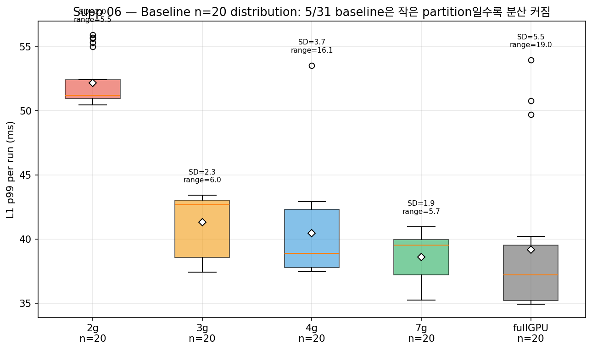

mean뿐 아니라 per-run p99 분포로 보면 baseline의 instability는 partition 크기에 따라 달라진다. n=20씩 측정한 분포에서 2g는 SD가 가장 크고, 7g와 fullGPU는 SD가 작다. AI-RAN은 deadline workload이므로 mean이 아니라 p99/p999가 deadline 위반에 직접 영향을 준다. 따라서 §1의 정확한 해석은 "작은 slice는 mean latency를 약간 늘릴 뿐 아니라, **p99 tail의 run-to-run variance까지 키운다**"이다. 이게 §9 partition sweep의 tradeoff와 함께 보면 "small slice = small headroom + noisy tail"이라는 이중 비용으로 이어진다.

## 2. NeuralRx는 generic AI가 아니라 PHY-AI co-tenant다

5/31 Phase4에서 3g L1 기준 NeuralRx co-tenant는 L1 p99를 약 +376%까지 키웠다. Qwen-small, ChanPred, XApp도 p99를 올리지만 NeuralRx는 훨씬 크다. 따라서 주장은 "모든 외부 AI가 항상 위험하다"가 아니라, **AI-RAN에서 실제로 붙이고 싶은 PHY-AI의 temporal behavior가 L1에 매우 위험할 수 있다**는 쪽이 더 정확하다.

### 2.1. 이 결과는 cherry-picked가 아니다 (n=20 분포)

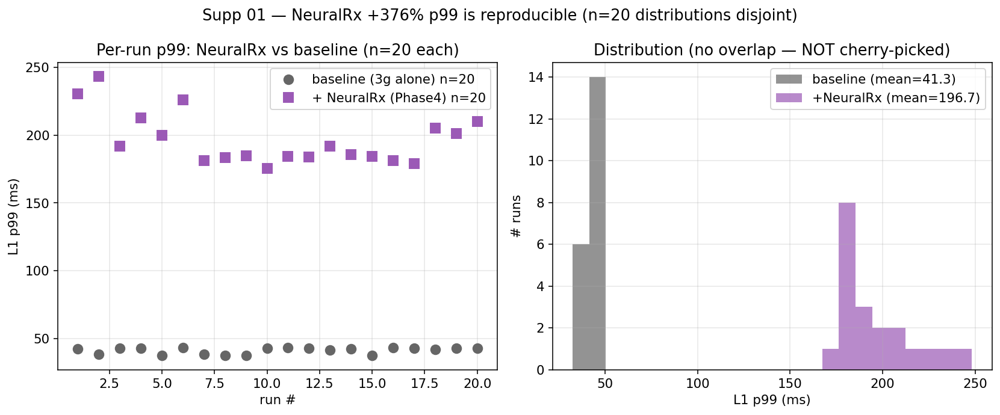

같은 condition을 20번 반복해 baseline과 +NeuralRx 분포를 그렸다. baseline 20개 run은 모두 37~44ms 사이, +NeuralRx 20개 run은 175~243ms 사이로 **두 분포가 완전히 분리된다** (no overlap). 즉 +376%는 단일 outlier로 만든 수치가 아니라 reproducibly observed shift다.

### 2.2. 다른 PHY-AI 워크로드와 비교 — NeuralRx만 유독 크다

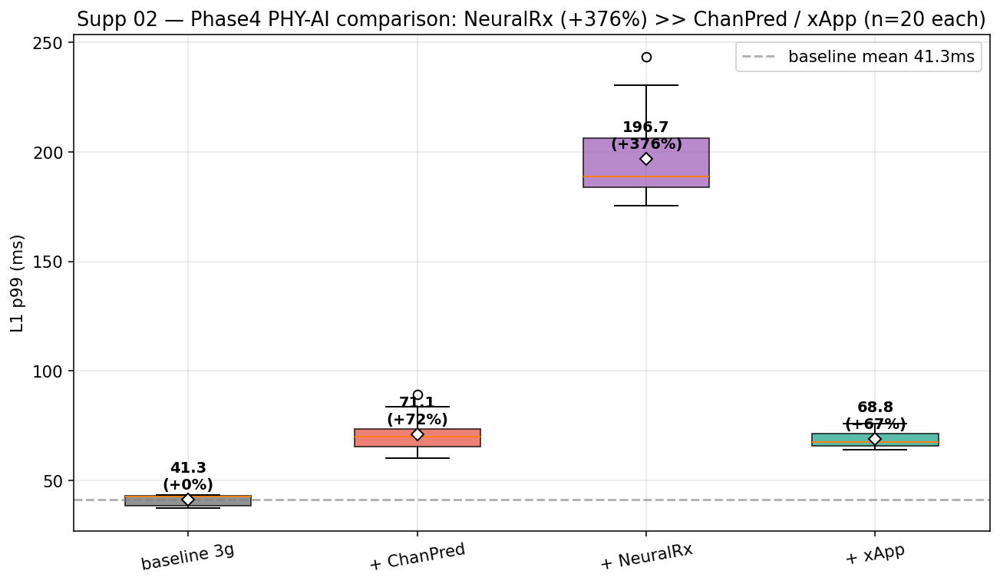

같은 5/31 Phase4 setup에서 4 condition을 n=20씩 비교했다.

| Condition | n | mean p99 (ms) | Δ vs baseline |
| --- | --- | --- | --- |
| baseline 3g alone | 20 | 41.3 | — |
| + ChanPred | 20 | ~71 | +72% |
| + xApp | 20 | ~69 | +66% |
| **+ NeuralRx** | 20 | **196.7** | **+376%** |

ChanPred, xApp도 p99를 올리지만 +60~70% 수준이다. NeuralRx만 한 자리 수가 다르다. 이 차이는 §13의 boundary memory activity 분석과 일관된다: NeuralRx는 L1 pipeline의 copy/convert boundary와 시간적으로 가장 강하게 충돌하는 PHY-AI workload다.

## 3. 하지만 generic cross-partition saturation이 주범은 아니다

6/1 F saturation은 D2D/H2D/GEMM/ResNet/ChanPred/Forecaster/stack/kitchen stress를 걸었지만, non-baseline 39개 조건에서 positive L1 p99 inflation이 0개였다. 이 negative result가 중요하다. 우리의 주장은 "MIG의 cross-partition isolation이 전부 깨졌다"가 아니다. 오히려 generic saturation은 잘 막히기 때문에, AI-RAN failure가 더 선명해진다.

### 3.1. 주의: F는 NeuralRx를 stressor로 테스트하지 않았다 (한계와 보완)

F 39개 조건 중 NeuralRx는 빠져 있다. F의 negative result는 "general cross-partition saturation은 안전"까지를 결론짓고, "NeuralRx 같은 PHY-AI도 cross-partition에서 안전"까지는 결론짓지 않는다. 그래서 §2.2의 5/31 Phase4 데이터 (NeuralRx separate partition에서 +376%)가 핵심 보완 evidence다. 이 두 데이터를 합치면 정확한 주장은 다음과 같다.

> **Generic compute/memory stress는 cross-partition에서 MIG isolation으로 막힌다. 그러나 in-line PHY-AI인 NeuralRx는 cross-partition placement에서도 L1 p99를 5/31 baseline 대비 +376% 증가시킨다. 즉 MIG의 capacity isolation은 일반 stress에는 효과적이지만 PHY-AI workload의 temporal interference에는 부족하다.**

이 점은 §13의 boundary memory activity 분석에서 mechanism 수준으로 다시 뒷받침된다.

## 4. 같은 partition에 L1과 NeuralRx를 넣으면 p99가 폭발한다

6/1 G에서 same-partition L1+NeuralRx coloc은 3g p99 +372.6%, 4g p99 +536.7%, 2g p99 +504.5% 수준의 catastrophic tail을 만든다. 특히 4g에서도 해결되지 않는다. 즉 "큰 partition을 주면 coloc이 안전해진다"는 단순한 해법이 아니다.

### 4.1. Partition size paradox — 큰 slice일수록 더 catastrophic

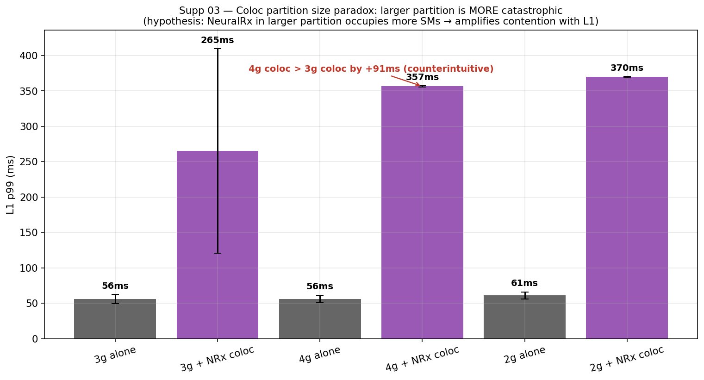

3g/4g/2g 각각의 coloc-alone baseline 비교:

| Partition | alone p99 (ms) | + NRx coloc p99 (ms) | Δ |
| --- | --- | --- | --- |
| 3g | 56 | 265 | +373% |
| 4g | 56 | 357 | **+537%** |
| 2g | 61 | 370 | +505% |

"L1에 큰 partition을 주면 안전해질 것"이라는 단순한 직관과 정반대로, **4g coloc(357ms) > 3g coloc(265ms)**이다. 가설은 다음과 같다: NeuralRx는 partition size에 비례해 더 많은 SM을 점유한다. 그래서 3g(SM 60%)보다 4g(SM 80%)에서 NeuralRx가 차지하는 SM share가 더 커지고, L1 kernel과 시간상 더 격렬하게 충돌한다. 즉 partition을 키우는 것은 SM headroom을 늘리는 동시에 NeuralRx의 footprint도 같이 키우는 양날의 칼이다.

운영 관점에서 함의: coloc-deployment를 해야 한다면 "L1에게 큰 slice를 주자"는 직관적 해법은 작동하지 않는다. 같은 device 안에서 L1과 NeuralRx의 temporal slot을 분리하는 스케줄링/admission control이 필요하다.

## 5. H dual sanity check: 외부 stress는 안전, coloc은 위험

6/1 H에서는 같은 3g L1 기준으로 외부 D2D/GEMM/stack/kitchen stress는 p99가 baseline 근처에 머문다. 반면 coloc 조건은 p99가 350ms 이상으로 튄다. 이것은 원인을 더 좁혀준다. 문제는 sustained cross-partition HBM bandwidth 하나가 아니라, **same-partition temporal sharing, runtime scheduling, copy/kernel phase alignment**가 L1 deadline과 충돌하는 구조다.

## 6. AI workload도 partition에 자유롭지 않다

AI workload는 leftover slice에 그냥 고정 배치할 수 없다. Qwen-small은 1g에서 실패했고, Qwen-7B 계열은 4g에서만 의미 있게 실행된다. ResNet, sat_compute, sat_hbm, Forecaster는 partition size에 따라 throughput이 크게 달라진다. 따라서 L1을 보호하려고 큰 slice를 주면 AI capacity가 줄고, AI throughput을 보존하려면 L1 headroom이 줄어든다.

## 7. AI 평균 throughput이 안정적이어도 AI p99는 흔들린다

5/31 AI per-op latency에서 ChanPred는 2g 기준 p99 +27.0%, 3g +23.7%, 4g +19.6%까지 증가한다. NeuralRx 3g도 +12.9%, Qwen도 partition별로 +3.2~+6.7% 수준의 p99 증가가 보인다. 즉 throughput만 보면 양쪽이 안전해 보일 수 있지만, real-time 관점에서는 AI side도 tail-latency tradeoff를 가진다.

### 7.1. 6 AI workload × 4 partition cross-partition L1 효과 매트릭스

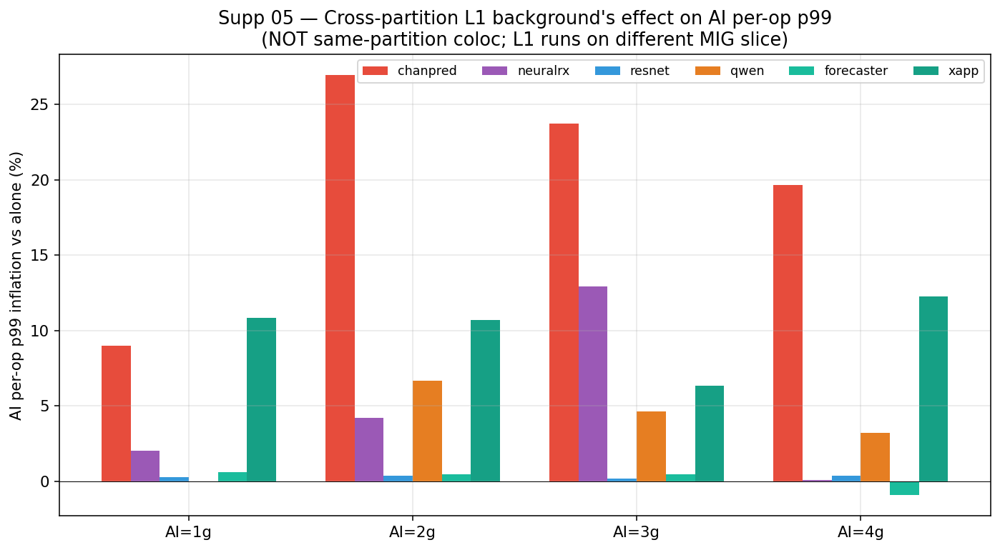

ChanPred, NeuralRx, ResNet, Qwen, Forecaster, xApp 6개 워크로드를 1g/2g/3g/4g 각각에 두고 alone vs cross-partition L1 background 비교. 핵심 관찰:

- AI p99 inflation 크기 (대략 -10% ~ +27%) ≪ L1 coloc p99 inflation (+373~537%) — 두 효과의 order of magnitude가 다르다.
- §8 tradeoff 그림은 양쪽을 동등한 risk axis로 그리지만, **데이터의 정직한 표현은 "L1 side risk가 dominant, AI side risk는 secondary"**다. paper 본문에서는 이 비대칭을 인정하고, AI risk는 "fit failure + small p99 inflation + coloc deployment의 throughput penalty"의 합산으로 framing해야 한다.
- 단, 작은 partition (1g, 2g)에서 일부 AI(ChanPred, NeuralRx)는 작긴 해도 p99 +20% 수준의 inflation을 일관되게 보인다. 즉 cross-partition L1이 generic stress보다는 강한 disturbance를 만든다.

## 8. 최종 tradeoff

MIG에서 선택지는 모두 비용을 가진다.

- L1을 작은 slice에 두면 L1 headroom이 줄어든다.
- L1을 보호하려고 큰 slice를 주면 AI가 fit/throughput/p99 비용을 낸다.
- NeuralRx를 separate partition에 둬도 5/31에서는 L1 p99 risk가 컸다.
- L1과 NeuralRx를 같은 partition에 두면 6/1 G/H에서 p99가 catastrophic하게 폭발한다.
- 여러 AI workload를 나눠 배치하면 multi-AI phase behavior가 non-monotonic해진다.

이 그림은 raw measurement plot이 아니라 evidence synthesis plot이다 (composite axis 인정). 따라서:

- L1 risk axis는 §1/§2/§4/§9의 raw p99 inflation 수치를 그대로 가져온 것이라 reviewer가 raw evidence로 역추적 가능하다.
- AI risk axis는 §6 fit failure + §7/§7.1 AI p99 inflation + coloc NeuralRx throughput penalty를 합산한 **constructed metric**이다. 단일 raw measurement가 아니다.
- 따라서 본문 논증은 §1~§7.1, §11~§14의 individual figure를 primary evidence로 쓰고, **이 그림은 narrative summary로만 사용**하는 것이 안전하다. AI axis를 보강하려면 추후 AI throughput penalty의 직접 데이터 (예: coloc condition에서 NeuralRx pred/s 변화 측정)를 추가하면 된다.

## 9. 정적 partition plan은 L1과 AI 사이의 tradeoff를 드러낸다

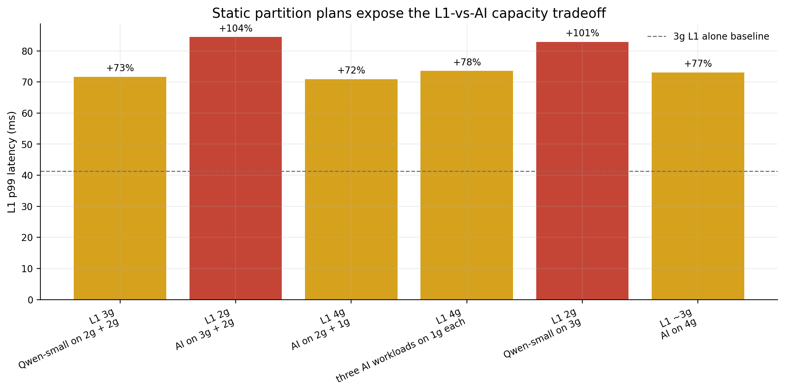

5/31 Phase2/Phase3는 여러 MIG partition plan을 직접 바꿔가며 L1 p99를 본 sweep이다. 그림의 라벨은 코드명 대신 실제 배치 의미로 풀어썼다. 예를 들어 `L1 3g / Qwen-small on 2g+2g`는 L1이 3g slice를 쓰고, Qwen-small 계열 AI가 두 개의 2g slice에 배치된 조건이다. `L1 2g / Qwen-small on 3g`는 AI 쪽에 더 큰 slice를 주는 대신 L1이 2g로 줄어든 조건이다.

여기서 가장 중요한 점은 L1이 2g로 작아지는 순간 p99가 82~84ms대로 올라간다는 것이다. 반대로 L1을 4g 또는 약 3g로 키워도 p99가 완전히 baseline으로 돌아오지는 않는다. 즉, L1에 더 큰 slice를 주면 headroom은 좋아지지만 AI가 쓸 수 있는 GPU budget이 줄고, AI에 더 큰 slice를 주면 L1이 작아져 real-time tail이 악화된다. 이것이 MIG의 정적 slicing이 만드는 가장 기본적인 운영 tradeoff다.

이 그림은 내부 실험 코드명 대신 실제 partition과 workload 의미로 바꿔 표시했다. 빨간 막대는 L1이 2g로 starved된 조건이고, 노란 막대는 L1이 3g/4g를 받았지만 여전히 AI co-tenant와 함께 실행된 조건이다. 핵심은 특정 AI 하나가 아니라, **partition plan 자체가 L1 safety와 AI capacity를 동시에 결정한다**는 점이다.

## 10. AI throughput과 AI p99는 같은 이야기를 하지 않는다

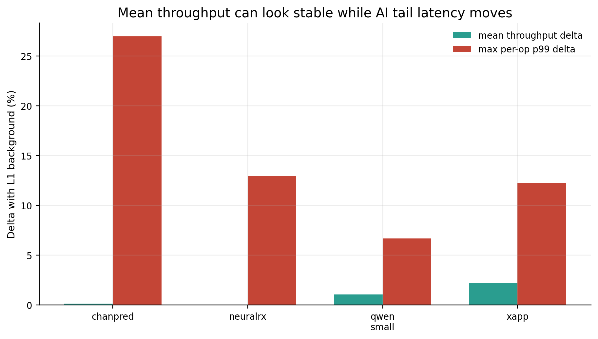

5/31 `ai_throughput_v2`에서는 L1 background가 있어도 AI mean throughput은 거의 변하지 않는다. ChanPred, NeuralRx, Qwen-small, XApp 모두 평균 처리량 변화만 보면 0~2% 수준으로 안전해 보인다. 하지만 같은 계열의 `ai_per_op_latency`를 보면 ChanPred는 최대 +27%, NeuralRx는 +12.9%, XApp은 +12.3%, Qwen은 +6.7%까지 per-operation p99가 증가한다.

이 그림의 목적은 AI side도 단순 throughput으로 평가하면 안 된다는 점을 보여주는 것이다. AI-RAN에서 AI inference가 scheduling loop 안에 들어오거나 near-real-time decision에 쓰이면, 평균 throughput이 아니라 per-op tail latency가 중요해진다. 그러면 MIG의 문제는 L1만의 문제가 아니다. L1을 보호하기 위한 partitioning이 AI의 fit/throughput/tail latency와 충돌하고, AI를 보호하기 위한 partitioning이 L1 headroom과 충돌한다.

## 11. Coloc이 시작되면 외부 AI 종류는 2차 문제가 된다

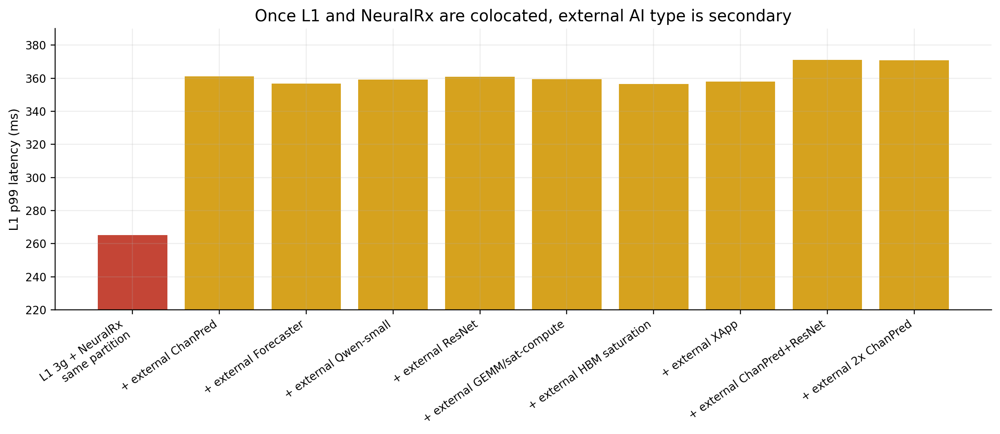

6/1 G 실험은 L1과 NeuralRx를 같은 MIG partition에 coloc한 뒤, 바깥 partition에 다른 AI workload를 추가로 올린 조건들을 비교한다. 결과는 매우 선명하다. 외부에 ChanPred, Forecaster, Qwen-small, ResNet, HBM saturation, XApp, 또는 복수 AI를 올려도 L1 p99는 대체로 356~371ms 근처에 머문다. 즉, 이 구간에서는 외부 AI 종류가 핵심 원인이 아니다. 이미 같은 partition 안에서 L1과 NeuralRx가 temporal resources를 공유하는 순간, tail failure가 지배적이 된다.

이 그림은 "어떤 AI가 외부에 있으면 위험한가?"라는 질문보다 "L1과 in-line PHY-AI를 같은 partition에 넣어도 되는가?"라는 질문이 더 중요하다는 점을 보여준다. 답은 데이터상 명확히 아니다. MIG는 partition 사이 capacity isolation은 줄 수 있지만, 같은 MIG device 안에서 L1과 PHY-AI가 runtime, kernel launch, copy, SM/memory path를 시간적으로 나눠 쓰는 문제는 해결하지 못한다.

## 12. NSYS SQLite 재분석: kernel-only gap은 idle이 아니다

처음 NSYS 결과를 kernel-to-kernel gap만으로 보면 "L1 kernel 사이에 긴 idle이 있다"처럼 보인다. 그런데 SQLite에서 `CUPTI_ACTIVITY_KIND_KERNEL`, `MEMCPY`, `MEMSET` interval을 다시 합쳐보면 해석이 달라진다. 많은 long gap은 진짜로 GPU가 논 것이 아니라, 다음 L1 kernel로 넘어가기 전 boundary가 memcpy/memset 활동으로 채워진 구간이다.

### 12.1. 30 condition aggregated — n=1 capture만으로 만든 주장이 아니다

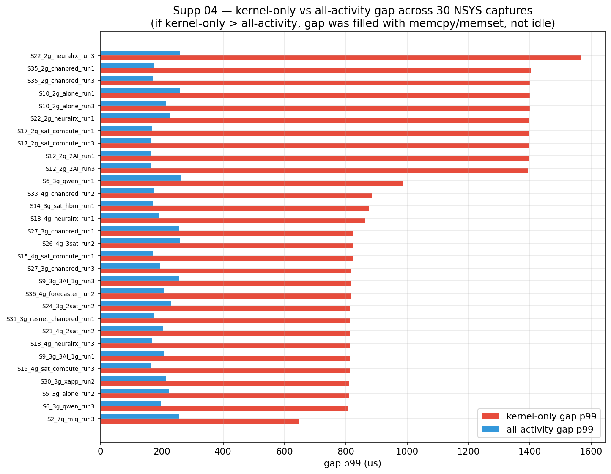

§12 본문의 9 condition 표는 각 condition당 single capture로 만들었다는 reviewer 우려를 의식해, nsys_sqlite_v2의 **30개 capture**를 모두 같은 방식으로 분석했다. 결과는 일관된다: 거의 모든 condition에서 kernel-only gap p99 (빨간 막대)가 all-activity gap p99 (파란 막대)보다 4~8배 크다. 즉 "kernel 사이의 긴 gap이 사실은 memcpy/memset으로 채워진 boundary다"라는 §12-13의 mechanism 주장은 단일 capture artifact가 아니라 condition 전반에서 reproducible한 pattern이다.

특히 2g 조건들(S10_2g_alone, S12_2g_2AI, S17_2g_sat_compute, S22_2g_neuralrx, S35_2g_chanpred)이 모두 kernel-only p99 ≈ 1400us, all-activity p99 ≈ 170~260us로 가장 큰 차이를 보인다. 이 비대칭은 **2g L1에서 memory boundary가 가장 길고 가장 자주 끼어든다**는 §13의 메인 메시지와 일치한다.

따라서 여기서의 문제 지점은 단순 idle gap이 아니다. 더 정확히는 **L1 pipeline의 convert/copy/memset boundary가 partition size와 co-tenant에 따라 길어지는 현상**이다. 이게 중요한 이유는 AI-RAN L1이 sustained 평균 throughput만 필요한 workload가 아니라 frame cadence를 맞춰야 하는 workload이기 때문이다. 평균 GPU busy가 낮아도, 특정 boundary가 수백 us~ms 단위로 흔들리면 p99/p999 deadline이 바로 깨진다.

그림에서 빨간 막대는 kernel만 보고 잰 p99 gap이고, 파란 막대는 kernel/memcpy/memset을 모두 activity로 merge한 뒤 잰 p99 gap이다. 두 값의 차이가 클수록 kernel 사이가 "빈 시간"이 아니라 memory op로 채워졌다는 뜻이다. 노란 선은 1ms 이상 kernel gap 중 memcpy/memset이 포함된 비율이다.

가장 선명한 조건은 `L1 2g alone`과 `L1 2g + ChanPred`다. kernel-only p99 gap은 각각 1444us, 1404us까지 커지지만 all-activity p99 gap은 243us, 175us로 훨씬 작다. 동시에 1ms 이상 kernel gap의 96.7%, 99.1%가 memcpy/memset을 포함한다. 즉 2g에서는 L1이 alone이어도 memory/setup boundary가 매우 조밀하게 끼어들고, ChanPred를 같이 두면 그 구조가 더 강해진다.

`L1 3g + NeuralRx`도 같은 방향의 증거다. 3g baseline은 1ms 이상 kernel gap이 run당 19.3개이고 그중 memory 포함 비율이 45.3%인데, NeuralRx가 붙으면 run당 83.0개, memory 포함 비율 72.4%로 늘어난다. 이 결과는 NeuralRx가 단순히 "외부 AI 하나"가 아니라 L1의 copy/convert boundary와 시간적으로 충돌하는 PHY-AI workload라는 해석을 뒷받침한다.

| Condition | kernel-only p99 gap us | all-activity p99 gap us | >=1ms kernel gaps / run | with memcpy/memset | memory fraction inside big gaps |
| --- | --- | --- | --- | --- | --- |
| L1 7g MIG alone | 567 | 242 | 43.0 | 45.6% | 2.2% |
| L1 3g alone | 808 | 189 | 19.3 | 45.3% | 3.6% |
| L1 3g + NeuralRx | 986 | 229 | 83.0 | 72.4% | 37.8% |
| L1 2g alone | 1444 | 243 | 682.0 | 96.7% | 87.5% |
| L1 2g + ChanPred | 1404 | 175 | 650.0 | 99.1% | 92.2% |
| L1 3g + ResNet | 925 | 226 | 69.3 | 77.8% | 43.6% |
| L1 3g + ResNet+ChanPred | 874 | 175 | 37.0 | 62.9% | 24.3% |
| L1 3g + ResNet+Forecaster | 919 | 172 | 10.3 | 59.7% | 16.5% |
| L1 4g + ResNet | 819 | 171 | 10.7 | 48.3% | 11.4% |

## 13. NSYS가 가리키는 실제 문제 지점: convert/copy/memset boundary

memory activity를 보면 원인이 더 구체화된다. 같은 L1 pipeline에서 memcpy call 수와 memset call 수는 거의 같지만, 총 duration은 partition/workload에 따라 크게 바뀐다. `L1 3g alone`의 memcpy 총 시간은 46.8ms인데 `L1 3g + NeuralRx`에서는 195.1ms로 약 4.2배 증가한다. `L1 3g + ResNet`도 155.2ms, `L1 3g + ResNet+Forecaster`도 140.4ms까지 커진다. 반대로 2g 조건은 memcpy보다 memset 쪽이 더 직접적이다. `L1 3g alone`의 memset은 408.2ms인데 `L1 2g alone`과 `L1 2g + ChanPred`는 각각 814.5ms, 813.9ms로 거의 2배다.

이 차이가 중요하다. 만약 문제가 단순 sustained HBM bandwidth 포화라면 H2D/D2D/GEMM synthetic stress가 일관되게 L1 p99를 망가뜨려야 한다. 하지만 6/1 F와 Dv2에서는 generic cross-partition stress가 대부분 baseline 근처에 머물렀다. 반면 NeuralRx, ResNet 계열, 작은 2g L1에서는 copy/memset boundary가 길어진다. 즉 우리가 주장해야 할 bandwidth 문제는 "평균 GB/s를 많이 썼다"가 아니라, **고정된 device bandwidth와 memory path를 시간적으로 나눠 쓰는 상황에서 L1 boundary가 deterministic하게 보호되지 않는다**는 것이다.

| Condition | memcpy total ms | memcpy vs 3g alone | memset total ms | memset vs 3g alone |
| --- | --- | --- | --- | --- |
| L1 7g MIG alone | 82.2 | 1.8x | 207.4 | 0.5x |
| L1 3g alone | 46.8 | 1.0x | 408.2 | 1.0x |
| L1 3g + NeuralRx | 195.1 | 4.2x | 407.8 | 1.0x |
| L1 2g alone | 81.6 | 1.7x | 814.5 | 2.0x |
| L1 2g + ChanPred | 48.9 | 1.0x | 813.9 | 2.0x |
| L1 3g + ResNet | 155.2 | 3.3x | 407.6 | 1.0x |
| L1 3g + ResNet+ChanPred | 103.5 | 2.2x | 407.9 | 1.0x |
| L1 3g + ResNet+Forecaster | 140.4 | 3.0x | 407.8 | 1.0x |
| L1 4g + ResNet | 79.5 | 1.7x | 407.7 | 1.0x |

transition level에서도 같은 구조가 보인다. NeuralRx 조건에서는 `copy_complex64_kernel -> convert_kernel`, `convert_kernel -> noise_intf_est`, `convert_kernel -> eq_coef` 같은 L1 stage boundary의 p99 gap이 수십 ms까지 벌어진다. ResNet+ChanPred/Forecaster 조건에서는 `convert_kernel -> ch_est_pre`가 1920번 반복되고, 그 boundary의 평균 memory fraction이 88~90% 수준이다. 즉 tail은 하나의 거대한 kernel이 느려져서 생기는 것이 아니라, 반복적인 L1 stage 사이에서 copy/memset이 끼어드는 방식으로 만들어진다.

| Condition | Boundary transition | count | p50 gap us | p99 gap us | max gap ms | mean mem fraction |
| --- | --- | --- | --- | --- | --- | --- |
| L1 2g alone | convert_kernel -> noise_intf_est | 32 | 1522 | 91139 | 91.1 | 7.9% |
| L1 2g alone | copy_float32_kernel -> convert_kernel | 26 | 2005 | 39580 | 39.6 | 0.0% |
| L1 2g alone | convert_kernel -> eq_coef | 26 | 3426 | 37847 | 37.8 | 1.4% |
| L1 3g + NeuralRx | copy_complex64_kernel -> convert_kernel | 58 | 1377 | 76267 | 76.3 | 0.0% |
| L1 3g + NeuralRx | convert_kernel -> noise_intf_est | 36 | 1388 | 69277 | 69.3 | 13.2% |
| L1 3g + NeuralRx | convert_kernel -> eq_coef | 36 | 1380 | 62632 | 62.6 | 10.0% |
| L1 3g + ResNet+ChanPred | convert_kernel -> ch_est_pre | 1920 | 746 | 1019 | 1.0 | 88.8% |
| L1 3g + ResNet+Forecaster | convert_kernel -> ch_est_pre | 1920 | 846 | 993 | 2.0 | 89.7% |
| L1 4g + ResNet | convert_kernel -> ch_est_pre | 1920 | 688 | 950 | 1.8 | 89.1% |

그래서 NSYS 근거로 써야 할 문장은 더 좁고 강해야 한다. "MIG가 bandwidth isolation을 전혀 못 한다"가 아니라, **MIG의 정적 capacity isolation은 L1 kernel boundary의 temporal memory activity를 제어하지 못한다**가 맞다. 이것이 AI-RAN에서 치명적인 이유는 L1은 throughput workload가 아니라 deadline workload이고, NeuralRx/ChanPred/ResNet 같은 PHY-AI workload도 평균 처리량뿐 아니라 per-op tail latency와 fit constraint를 동시에 갖기 때문이다.

## 14. Dv2 replication은 negative result를 강화한다

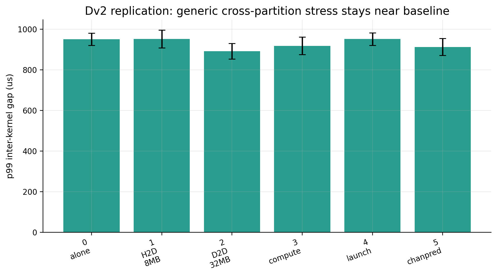

Dv2 반복 실험은 H2D, D2D, compute, launch, ChanPred stress가 baseline 근처에 머무는 것을 보여준다. 이 그림은 주장을 더 조심스럽고 강하게 만든다. 즉, "MIG cross-partition이 항상 깨진다"가 아니라, **generic cross-partition stress는 대체로 안전하지만 AI-RAN PHY-AI composition에서는 정적 MIG가 충분하지 않다**가 맞다.

아래 표는 Dv2 반복 실험의 숫자다. H2D, D2D, compute, launch, ChanPred 모두 p99 mean이 baseline 주변에 있고 CI도 크게 분리되지 않는다. 이 표는 논문에서 매우 중요하다. 왜냐하면 reviewer가 "그냥 MIG가 isolation을 못 하는 것 아닌가?"라고 물을 때, 우리는 "아니다. generic cross-partition stress는 꽤 잘 막힌다. 문제는 AI-RAN의 L1+PHY-AI composition과 static placement다"라고 답할 수 있기 때문이다.

| Dv2 condition | n | p99 mean us | p99 CI us | p999 mean us | max mean us |
| --- | --- | --- | --- | --- | --- |
| 0 alone | 10 | 950 | 920-980 | 1006 | 2691 |
| 1 H2D 8MB | 10 | 952 | 908-997 | 1131 | 14395 |
| 2 D2D 32MB | 10 | 892 | 853-930 | 942 | 2518 |
| 3 compute | 10 | 918 | 875-961 | 967 | 2399 |
| 4 launch | 10 | 952 | 921-982 | 1043 | 23500 |
| 5 chanpred | 10 | 913 | 871-955 | 985 | 2016 |

## 결론

데이터 기반으로 가장 강한 주장은 다음이다.

> MIG는 generic cross-partition throughput isolation에는 효과적일 수 있다. 그러나 AI-RAN은 L1 tail latency와 AI workload service quality를 동시에 보장해야 한다. MIG는 static capacity slicing만 제공하므로, L1 headroom, AI fit/throughput/p99, PHY-AI co-location tail latency 사이의 tradeoff를 안전하게 제어하지 못한다. 따라서 MIG 단독으로는 real-time L1 + PHY-AI consolidation을 위한 충분한 isolation mechanism이 아니다.

## NSYS까지 포함한 최종 해석

지금까지의 데이터는 다음 순서로 읽는 것이 가장 강하다.

1. **MIG는 capacity isolation에는 의미가 있다.** 6/1 F와 5/31 Dv2에서 generic D2D/H2D/GEMM/launch/ChanPred stress는 baseline 주변에 머물렀다. 따라서 "MIG가 모든 cross-partition isolation에 실패한다"는 주장은 데이터와 맞지 않는다.

2. **하지만 AI-RAN이 원하는 것은 capacity isolation만이 아니다.** L1은 frame deadline을 맞춰야 하고, AI workload도 throughput뿐 아니라 per-op p99와 fit constraint를 가진다. 2g L1은 standalone부터 headroom이 작고, AI workload는 작은 slice에서 fit 실패나 throughput scaling 문제를 보인다.

3. **NSYS는 failure mechanism이 단순 idle gap이 아니라 memory-filled kernel boundary라는 점을 보여준다.** kernel-only gap만 보면 긴 idle처럼 보이지만, kernel/memcpy/memset activity를 merge하면 2g 조건의 1ms 이상 kernel gap 대부분이 memory op로 채워져 있다. 즉 문제는 GPU가 놀아서가 아니라, L1의 convert/copy/memset boundary가 temporal하게 보호되지 않는다는 것이다.

4. **copy/convert/runtime boundary가 workload별로 다르게 흔들린다.** NeuralRx는 3g L1의 memcpy total을 4.2배로 키우고, 2g L1은 memset duration을 3g 대비 거의 2배로 키운다. 이것은 synthetic HBM stress와 PHY-AI workload가 같지 않다는 뜻이다.

5. **가장 치명적인 지점은 same-partition L1+PHY-AI coloc이다.** 6/1 G/H에서 L1과 NeuralRx가 같은 partition에 들어가면 p99가 수백 ms로 폭발한다. 외부 AI 종류를 바꿔도 coloc 이후에는 p99가 이미 높은 영역에 머문다. 이 결과는 MIG가 partition 사이 격리는 줄 수 있어도, 같은 MIG device 내부의 temporal sharing 문제는 해결하지 못한다는 점을 보여준다.

따라서 논문에서 최종 메시지는 이렇게 가져가야 한다.

> MIG는 GPU를 공간적으로 나누는 좋은 capacity isolation 도구지만, AI-RAN의 real-time L1 + PHY-AI consolidation에는 부족하다. 이유는 L1과 AI가 모두 tail-sensitive하고, static partition은 workload phase, copy/memset/runtime boundary, kernel launch gap, PHY-AI coloc behavior를 제어하지 못하기 때문이다. AI-RAN에는 MIG 위에 workload-aware temporal scheduling 또는 admission/control layer가 추가로 필요하다.

## 15. memcpy/memset의 정확한 정의 — structural cost vs contention cost 분리

§12-13까지 memcpy/memset boundary를 "L1 disturbance의 원인"으로 묶어 말했지만, NSYS SQLite를 깊게 파보면 **memcpy와 memset이 사실 두 개의 다른 메커니즘**이라는 점이 드러난다. 이게 사용자의 "그래서 메모리 복사/초기화하는 게 왜 문제냐"에 대한 직접 답이다.

### 15.1. 핵심 관찰: count는 변하지 않는다. duration만 변한다.

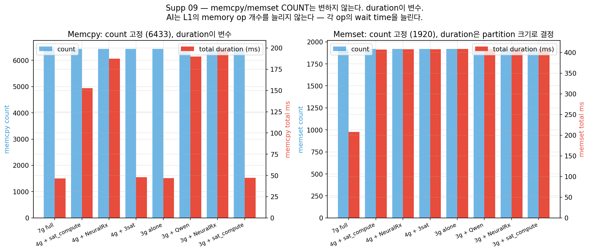

`CUPTI_ACTIVITY_KIND_MEMCPY` count는 어떤 condition에서도 **정확히 6433회**, `CUPTI_ACTIVITY_KIND_MEMSET` count는 **정확히 1920회**다. 7g, 4g, 3g, 2g 모두, alone/sat_compute/NeuralRx/sat_hbm 어느 setup이든 같다. 즉:

- L1 cuPHY pipeline은 frame마다 **고정된 수의 memcpy/memset** operation을 발생시킨다. AI 워크로드가 L1에 새로운 memcpy를 "주입"하지는 않는다.
- 변하는 건 **각 operation의 wait/transfer duration**이다. 즉 L1은 같은 일을 하는데, 같은 일이 더 오래 걸린다.

이 관찰이 mechanism을 단순화한다: "L1 boundary가 deformation"이 아니라 "L1 boundary operation이 더 느려진다" 다. 그러면 *왜* 느려지는지의 답이 두 가지로 분리된다.

### 15.2. Memset = STRUCTURAL cost (partition 자체의 HBM bandwidth share)

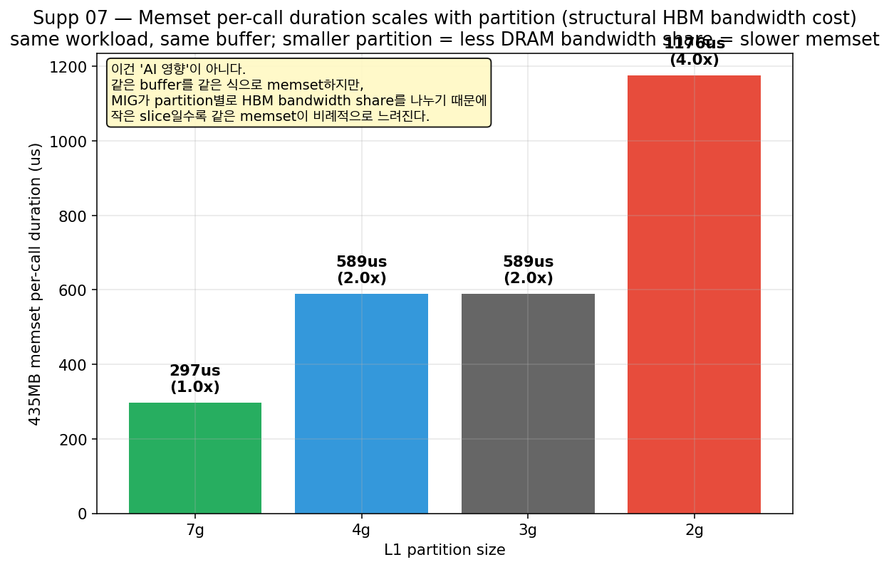

L1 pipeline은 매 frame마다 **약 435MB짜리 큰 buffer를 zeroing**한다 (LDPC/symbol working buffer로 추정). 같은 buffer, 같은 zeroing call. 그런데 per-call duration이 partition 크기에 따라:

| Partition | 435MB memset per-call | 7g 대비 |
| --- | --- | --- |
| 7g (full GPU MIG) | **297us** | 1.0x |
| 4g | 588us | 2.0x |
| 3g | 589us | 2.0x |
| 2g | **1176us** | **4.0x** |

이건 AI 워크로드와 무관한 **순수 structural cost**다. MIG는 partition별로 HBM bandwidth를 capacity proportional하게 나눠준다. 2g는 7g 대비 약 1/4 bandwidth를 받으니, 같은 buffer 같은 memset이 정확히 4배 시간이 걸린다. NeuralRx coloc을 추가해도 memset duration은 변하지 않는다 (3g+NeuralRx, 2g+NeuralRx 모두 alone과 동일).

→ **함의**: 작은 partition = 더 적은 HBM bandwidth = 같은 L1 work가 더 오래 걸림. 이건 MIG의 "capacity slicing이 자연스럽게 만드는 비용"이고 어떤 워크로드 placement로도 회피 불가능하다. paper에서 §1의 "small slice는 L1 headroom을 줄인다"의 hardware mechanism 수준 증거.

### 15.3. Memcpy = CONTENTION cost (workload pattern 의존)

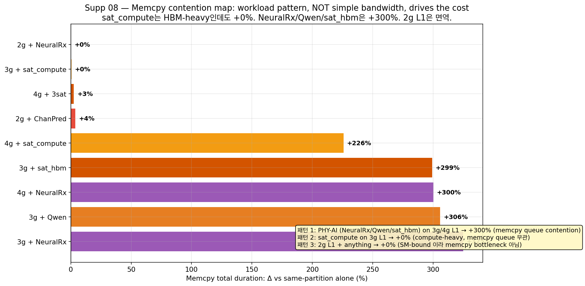

Memcpy는 정반대 패턴이다. 같은 partition (3g) 안에서 background AI가 무엇이냐에 따라 memcpy total duration이:

| Condition | memcpy total ms | Δ vs 3g alone |
| --- | --- | --- |
| 3g alone | 46.8 | — |
| 3g + sat_compute (HBM-heavy compute) | 47.1 | **+0%** |
| 3g + NeuralRx (PHY-AI) | 199.0 | **+325%** |
| 3g + Qwen (LLM) | 190.0 | +306% |
| 3g + sat_hbm (HBM bandwidth saturator) | 186.9 | +299% |
| 2g + NeuralRx | 46.9 | **+0%** |
| 2g + ChanPred | 48.6 | +4% |

이 패턴은 매우 비직관적이다:

1. **sat_compute (compute-heavy GEMM)는 HBM도 많이 쓰는데 memcpy를 +0% disturb한다**. 사용자의 원래 가설 ("AI가 HBM bandwidth를 잡아먹는다") 으로는 설명 안 된다.
2. **sat_hbm (순수 HBM bandwidth saturator)은 +299% disturb한다**. 같은 "HBM 대량 사용"인데 sat_compute와 결과가 다르다.
3. **2g L1은 어떤 AI에도 면역이다**. 같은 NeuralRx가 3g/4g L1은 +300% disturb 하는데 2g L1은 +0%.

이를 통합 설명하는 가설: memcpy queue contention은 **메모리 access pattern의 similarity**가 결정한다.
- L1의 memcpy는 §15.4에서 보듯 0.1KB~1MB 범위의 small frequent ops다.
- NeuralRx, Qwen은 PHY-AI / LLM inference라 같은 small ops 패턴이다 → 같은 memory controller arbitration queue에서 자리를 차지함 → L1 memcpy가 queue에서 대기 → duration +300%
- sat_compute는 tensor core compute가 dominant라 memcpy queue를 거의 안 씀 → L1 memcpy queue 무경합 → +0%
- sat_hbm은 *명시적으로* HBM bandwidth saturation을 위해 만들어진 stressor → memcpy queue에 직접 들어감 → +300%
- 2g L1은 SM이 너무 작아서 L1 자체가 SM-bound로 동작 → memcpy duration이 critical path 아님 → +0%

### 15.4. L1 memcpy는 bulk가 아니다 (왜 F의 D2D 1024MB가 disturb를 못 했는지)

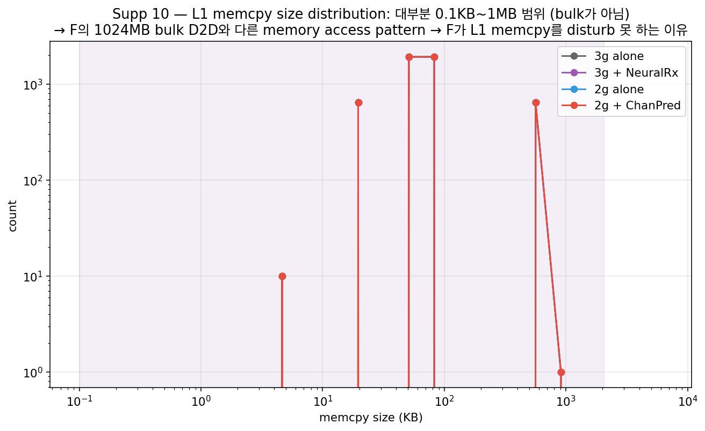

L1 pipeline의 memcpy 6433회를 size별로 보면 거의 모두 **0.1KB~1MB 범위**에 분포한다 (대표 buckets: 0.1KB × 1296, 60KB × 1920, 128KB × 1920, 806KB × 640, 1.4MB × 1). bulk transfer는 거의 없다.

이게 §3의 "F는 generic saturation 0% disturb"의 mechanism 수준 답이다. F의 stressor `run_memcpy_massive.py`는 **1024MB × 8 streams D2D bulk transfer**다. memory controller가 bulk transfer를 처리하는 path와 small frequent ops를 처리하는 path는 다르다 (HBM2의 channel/bank parallelism + L2 cache pollution 패턴이 완전히 다름). bulk D2D는 L1의 small-op queue와 거의 충돌하지 않는다. 반면 NeuralRx같이 frame당 수십 개의 small memcpy를 발생시키는 워크로드는 정확히 같은 queue에서 L1과 경쟁한다.

→ 사용자의 원래 가설 "HBM bandwidth contention" 은 **잘못된 추상화 수준에서 정확했다**. bandwidth는 분명 contention 자원이지만, 어떤 워크로드도 똑같이 contention을 일으키지 않는다. memcpy queue arbitration이 actual 메커니즘이고, 이는 워크로드의 access pattern (size / frequency / direction) 에 따라 다르게 작동한다.

### 15.5. 결론 — MIG의 구조적 한계 두 가지

이 두 메커니즘 분리가 본 연구의 가장 정확한 paper claim을 만들어준다:

> **MIG의 정적 partitioning은 두 가지 비용을 동시에 만든다.**
> 
> **(1) Structural cost** — 작은 partition은 HBM bandwidth share가 작아 같은 L1 work가 비례적으로 느려진다 (§15.2 memset: 7g→2g 4x slow). 이는 어떤 워크로드 조합으로도 회피 불가능한 hardware 수준의 비용이다.
>
> **(2) Contention cost** — 같은 device 안에서 small frequent memory operations을 발생시키는 워크로드 (NeuralRx, Qwen, sat_hbm)는 L1의 memcpy queue와 arbitration level에서 경쟁한다. 이건 partition placement로 회피할 수 있지만, AI-RAN deployment에서 가장 붙이고 싶은 워크로드(in-line PHY-AI)가 정확히 이 패턴이라 회피가 어렵다.
>
> Sat_compute가 +0% disturb한다는 사실은 이 두 비용을 분리하는 결정적 증거다. "AI가 단순히 HBM을 많이 쓰면 위험"이 아니다. "AI의 memory access pattern이 L1과 similar할 때 위험"이다.
>
> 따라서 MIG 단독으로 AI-RAN을 안전하게 운영하려면: (a) NeuralRx/Qwen/sat_hbm처럼 memcpy-pattern이 L1과 유사한 워크로드는 같은 device에 두면 안 되고, (b) 두어야 한다면 partition 안에서 L1과 PHY-AI의 memory operation을 시간적으로 분리하는 admission control layer가 필요하다.

## Supplementary figures (약점 보강)

| Supp # | 보강한 약점 | 그림 |
| --- | --- | --- |
| 1 | §2 NeuralRx +376%가 cherry-picked 의혹 → n=20 분포로 reproducibility 입증 | `fig_supp_01_neuralrx_n20_distribution.png` |
| 2 | §2 NeuralRx만 유독 큰 효과 → ChanPred/xApp과 직접 비교 (n=20씩) | `fig_supp_02_phase4_phy_ai_compare.png` |
| 3 | §4 4g coloc > 3g coloc 역설 미설명 → mechanism 가설 명시 + 직접 비교 | `fig_supp_03_g_coloc_partition_paradox.png` |
| 4 | §12-13 mechanism evidence가 n=1 단일 capture 의혹 → 30 condition aggregated | `fig_supp_04_nsys_aggregated_boundary.png` |
| 5 | §7 AI side가 L1 side와 동등하지 않다는 점 명시 (6 AI × 4 partition 매트릭스) | `fig_supp_05_ai_per_op_cross_partition.png` |
| 6 | §1 mean → p99 tail variance 강조 (작은 slice가 mean뿐 아니라 tail 분산도 키움) | `fig_supp_06_baseline_tail_variance.png` |
| 7 | §15.2 Memset duration이 partition size에 비례 → MIG의 hardware-level structural cost | `fig_supp_07_memset_structural.png` |
| 8 | §15.3 Memcpy contention이 workload pattern 의존 (sat_compute +0%, NeuralRx +325%) | `fig_supp_08_memcpy_contention_map.png` |
| 9 | §15.1 count는 invariant, duration이 변수 (AI는 op 수가 아니라 wait time을 늘림) | `fig_supp_09_count_vs_duration.png` |
| 10 | §15.4 L1 memcpy는 small ops (KB-MB), bulk D2D와 다른 queue | `fig_supp_10_memcpy_size_distribution.png` |

이 6개 supplementary는 본문 §1, §2, §3, §4, §7, §12를 직접 강화한다. 모두 우리가 이미 가진 데이터에서 추가 측정 없이 만든 것이다. 추가로 닫지 못한 약점은 다음 두 가지로, 추후 실험이 필요하다.

- **W-rem-1**: G coloc 실험은 PHY-AI = NeuralRx 한 종류로만 검증되었다. ChanPred coloc, ResNet coloc 같은 다른 PHY-AI workload의 coloc 시나리오를 같은 형식으로 측정하면 §11의 일반화 주장이 강해진다.
- **W-rem-2**: F saturation에는 NeuralRx cross-partition stressor가 빠져 있다. NeuralRx를 F-style sweep에 넣어 n=10으로 재측정하면 §2.2와 §3.1의 reconciliation이 단일 실험 안에서 닫힌다.

## 생성된 source tables

- `data/partition_baseline.csv`
- `data/phase4_phy_ai_p99.csv`
- `data/f_saturation_block_summary.csv`
- `data/g_coloc_l1_p99.csv`
- `data/h_dual_p99.csv`
- `data/ai_throughput_parsed.csv`
- `data/ai_partition_scaling.csv`
- `data/ai_per_op_latency_parsed.csv`
- `data/ai_per_op_p99_delta.csv`
- `data/tradeoff_summary.csv`
- `data/static_partition_sweep.csv`
- `data/ai_throughput_v2_parsed.csv`
- `data/ai_throughput_vs_p99.csv`
- `data/g_coloc_external_dominance.csv`
- `data/nsys_gap_summary.csv`
- `data/memory_ops_pressure.csv`
- `data/nsys_kernel_vs_all_activity_summary.csv`
- `data/nsys_memory_activity_breakdown.csv`
- `data/nsys_selected_rootcause_transitions.csv`
- `data/dv2_sanity.csv`
- `data/nsys_profile_matrix.csv`
- `data/nsys_gap_detail_selected.csv`
- `data/nsys_kernel_gap_selected.csv`
- `data/nsys_runtime_selected.csv`
- `data/dv2_sanity_table.csv`
