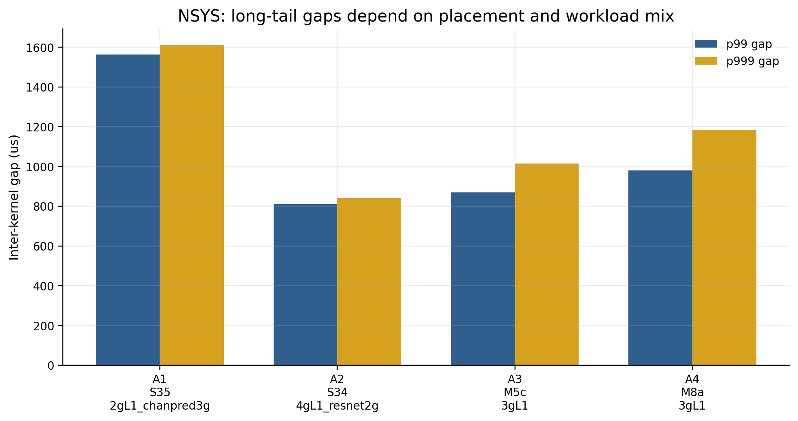
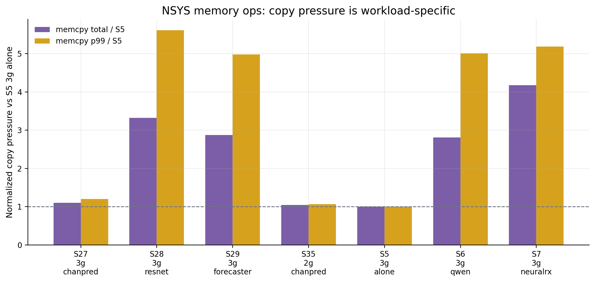

# MIG는 AI-RAN에 충분한 격리 추상화가 아니다: 시각 증거

생성일: 2026-06-01  
소스 범위: `cloudlab_results/results/20260531`, `cloudlab_results/results/20260601`

이 문서는 정리된 evidence를 그림 중심으로 다시 구성한 한국어 버전이다. 핵심 결론은 단순히 "L1만 격리하면 되는가"가 아니라, **L1 tail latency와 AI workload service quality를 동시에 만족해야 하는 AI-RAN에서 MIG의 정적 파티셔닝이 잘못된 제어 추상화**라는 점이다.

## 1. 작은 MIG slice는 L1 headroom을 줄인다

5/31 baseline에서 2g L1은 Full GPU v2 대비 mean latency가 약 +40.2% 증가한다. 7g/4g/3g는 비교적 안정적이지만, slice가 작아질수록 L1이 사용할 수 있는 SM/cache/memory-system headroom이 줄어든다. 이 결과는 "MIG가 capacity는 나눠주지만 real-time headroom까지 보장하지는 않는다"는 첫 번째 증거다.

## 2. NeuralRx는 generic AI가 아니라 PHY-AI co-tenant다

5/31 Phase4에서 3g L1 기준 NeuralRx co-tenant는 L1 p99를 약 +376%까지 키웠다. Qwen-small, ChanPred, XApp도 p99를 올리지만 NeuralRx는 훨씬 크다. 따라서 주장은 "모든 외부 AI가 항상 위험하다"가 아니라, **AI-RAN에서 실제로 붙이고 싶은 PHY-AI의 temporal behavior가 L1에 매우 위험할 수 있다**는 쪽이 더 정확하다.

## 3. 하지만 generic cross-partition saturation이 주범은 아니다

6/1 F saturation은 D2D/H2D/GEMM/ResNet/ChanPred/Forecaster/stack/kitchen stress를 걸었지만, non-baseline 39개 조건에서 positive L1 p99 inflation이 0개였다. 이 negative result가 중요하다. 우리의 주장은 "MIG의 cross-partition isolation이 전부 깨졌다"가 아니다. 오히려 generic saturation은 잘 막히기 때문에, AI-RAN failure가 더 선명해진다.

## 4. 같은 partition에 L1과 NeuralRx를 넣으면 p99가 폭발한다

6/1 G에서 same-partition L1+NeuralRx coloc은 3g p99 +372.6%, 4g p99 +536.7%, 2g p99 +504.5% 수준의 catastrophic tail을 만든다. 특히 4g에서도 해결되지 않는다. 즉 "큰 partition을 주면 coloc이 안전해진다"는 단순한 해법이 아니다.

## 5. H dual sanity check: 외부 stress는 안전, coloc은 위험

6/1 H에서는 같은 3g L1 기준으로 외부 D2D/GEMM/stack/kitchen stress는 p99가 baseline 근처에 머문다. 반면 coloc 조건은 p99가 350ms 이상으로 튄다. 이것은 원인을 더 좁혀준다. 문제는 sustained cross-partition HBM bandwidth 하나가 아니라, **same-partition temporal sharing, runtime scheduling, copy/kernel phase alignment**가 L1 deadline과 충돌하는 구조다.

## 6. AI workload도 partition에 자유롭지 않다

AI workload는 leftover slice에 그냥 고정 배치할 수 없다. Qwen-small은 1g에서 실패했고, Qwen-7B 계열은 4g에서만 의미 있게 실행된다. ResNet, sat_compute, sat_hbm, Forecaster는 partition size에 따라 throughput이 크게 달라진다. 따라서 L1을 보호하려고 큰 slice를 주면 AI capacity가 줄고, AI throughput을 보존하려면 L1 headroom이 줄어든다.

## 7. AI 평균 throughput이 안정적이어도 AI p99는 흔들린다

5/31 AI per-op latency에서 ChanPred는 2g 기준 p99 +27.0%, 3g +23.7%, 4g +19.6%까지 증가한다. NeuralRx 3g도 +12.9%, Qwen도 partition별로 +3.2~+6.7% 수준의 p99 증가가 보인다. 즉 throughput만 보면 양쪽이 안전해 보일 수 있지만, real-time 관점에서는 AI side도 tail-latency tradeoff를 가진다.

## 8. 최종 tradeoff

MIG에서 선택지는 모두 비용을 가진다.

- L1을 작은 slice에 두면 L1 headroom이 줄어든다.
- L1을 보호하려고 큰 slice를 주면 AI가 fit/throughput/p99 비용을 낸다.
- NeuralRx를 separate partition에 둬도 5/31에서는 L1 p99 risk가 컸다.
- L1과 NeuralRx를 같은 partition에 두면 6/1 G/H에서 p99가 catastrophic하게 폭발한다.
- 여러 AI workload를 나눠 배치하면 multi-AI phase behavior가 non-monotonic해진다.

이 마지막 그림은 단일 실험의 raw plot이 아니라 evidence synthesis plot이다. L1 축은 관측된 latency inflation을 사용했고, AI 축은 fit failure, AI p99 inflation, coloc NeuralRx throughput 감소 정황을 하나의 risk axis에 모은 것이다. 따라서 논문 본문에서는 앞선 개별 figure들을 primary evidence로 쓰고, 이 그림은 전체 tradeoff를 설명하는 summary figure로 쓰는 것이 안전하다.

## 9. 정적 partition plan은 L1과 AI 사이의 tradeoff를 드러낸다

5/31 Phase2/Phase3는 여러 MIG partition plan을 직접 바꿔가며 L1 p99를 본 sweep이다. 그림의 라벨은 코드명 대신 실제 배치 의미로 풀어썼다. 예를 들어 `L1 3g / Qwen-small on 2g+2g`는 L1이 3g slice를 쓰고, Qwen-small 계열 AI가 두 개의 2g slice에 배치된 조건이다. `L1 2g / Qwen-small on 3g`는 AI 쪽에 더 큰 slice를 주는 대신 L1이 2g로 줄어든 조건이다.

여기서 가장 중요한 점은 L1이 2g로 작아지는 순간 p99가 82~84ms대로 올라간다는 것이다. 반대로 L1을 4g 또는 약 3g로 키워도 p99가 완전히 baseline으로 돌아오지는 않는다. 즉, L1에 더 큰 slice를 주면 headroom은 좋아지지만 AI가 쓸 수 있는 GPU budget이 줄고, AI에 더 큰 slice를 주면 L1이 작아져 real-time tail이 악화된다. 이것이 MIG의 정적 slicing이 만드는 가장 기본적인 운영 tradeoff다.

이 그림은 내부 실험 코드명 대신 실제 partition과 workload 의미로 바꿔 표시했다. 빨간 막대는 L1이 2g로 starved된 조건이고, 노란 막대는 L1이 3g/4g를 받았지만 여전히 AI co-tenant와 함께 실행된 조건이다. 핵심은 특정 AI 하나가 아니라, **partition plan 자체가 L1 safety와 AI capacity를 동시에 결정한다**는 점이다.

## 10. AI throughput과 AI p99는 같은 이야기를 하지 않는다

5/31 `ai_throughput_v2`에서는 L1 background가 있어도 AI mean throughput은 거의 변하지 않는다. ChanPred, NeuralRx, Qwen-small, XApp 모두 평균 처리량 변화만 보면 0~2% 수준으로 안전해 보인다. 하지만 같은 계열의 `ai_per_op_latency`를 보면 ChanPred는 최대 +27%, NeuralRx는 +12.9%, XApp은 +12.3%, Qwen은 +6.7%까지 per-operation p99가 증가한다.

이 그림의 목적은 AI side도 단순 throughput으로 평가하면 안 된다는 점을 보여주는 것이다. AI-RAN에서 AI inference가 scheduling loop 안에 들어오거나 near-real-time decision에 쓰이면, 평균 throughput이 아니라 per-op tail latency가 중요해진다. 그러면 MIG의 문제는 L1만의 문제가 아니다. L1을 보호하기 위한 partitioning이 AI의 fit/throughput/tail latency와 충돌하고, AI를 보호하기 위한 partitioning이 L1 headroom과 충돌한다.

## 11. Coloc이 시작되면 외부 AI 종류는 2차 문제가 된다

6/1 G 실험은 L1과 NeuralRx를 같은 MIG partition에 coloc한 뒤, 바깥 partition에 다른 AI workload를 추가로 올린 조건들을 비교한다. 결과는 매우 선명하다. 외부에 ChanPred, Forecaster, Qwen-small, ResNet, HBM saturation, XApp, 또는 복수 AI를 올려도 L1 p99는 대체로 356~371ms 근처에 머문다. 즉, 이 구간에서는 외부 AI 종류가 핵심 원인이 아니다. 이미 같은 partition 안에서 L1과 NeuralRx가 temporal resources를 공유하는 순간, tail failure가 지배적이 된다.

이 그림은 "어떤 AI가 외부에 있으면 위험한가?"라는 질문보다 "L1과 in-line PHY-AI를 같은 partition에 넣어도 되는가?"라는 질문이 더 중요하다는 점을 보여준다. 답은 데이터상 명확히 아니다. MIG는 partition 사이 capacity isolation은 줄 수 있지만, 같은 MIG device 안에서 L1과 PHY-AI가 runtime, kernel launch, copy, SM/memory path를 시간적으로 나눠 쓰는 문제는 해결하지 못한다.

## 12. NSYS gap 분석: tail은 inter-kernel gap에서 보인다

NSYS deep analysis는 L1 kernel 자체의 평균 실행시간만으로는 tail을 설명하기 어렵고, kernel 사이 gap과 burst idle 구간이 중요하다는 점을 보여준다. 그림의 라벨은 실제 조건으로 풀어쓴 것이다. `L1 2g + ChanPred on 3g` 조건은 p99/p999 inter-kernel gap이 가장 크고, `L1 4g + ResNet on 2g`는 상대적으로 작다. `L1 3g + ResNet+ChanPred`, `L1 3g + ResNet+Forecaster`처럼 heterogeneous AI 조합은 중간에 위치한다.

이 결과는 우리가 말하는 bandwidth 문제가 단순히 "몇 GB/s를 썼는가"가 아니라는 점을 뒷받침한다. L1이 일정한 frame cadence를 유지하려면 다음 kernel이 제때 launch되고 copy/convert 단계가 제때 지나가야 한다. 하지만 small partition이나 특정 AI mix에서는 kernel 사이 빈 시간이 길어지고, 이 gap tail이 L1 p99/p999로 나타난다. 그래서 이 문제를 **temporal bandwidth 또는 scheduling headroom 부족**으로 해석하는 것이 sustained HBM bandwidth 하나로 설명하는 것보다 더 정확하다.

아래 표는 같은 NSYS SQLite 분석에서 가져온 전체 조건 요약이다. 코드명은 실제 partition/workload 의미로 풀어썼다. 여기서 중요한 패턴은 세 가지다. 첫째, p50 gap은 대부분 1us 수준으로 작기 때문에 평균적인 kernel cadence만 보면 문제가 작아 보인다. 둘째, p99/p999 gap과 top-tail share는 조건별로 크게 달라져 tail이 특정 시간 구간에 몰린다. 셋째, runtime API p99와 memcpy total이 workload별로 다르게 움직여서, 단순 SM 점유율이나 sustained HBM throughput 하나로 tail을 설명하기 어렵다.

| NSYS condition | p99 gap us | p999 gap us | top 1% gap share | runtime p99 us | memcpy total vs 3g alone |
| --- | --- | --- | --- | --- | --- |
| L1 7g MIG alone | 535 | 3707 | 54.4% | 306 | 1.8x |
| L1 3g alone | 808 | 1494 | 48.4% | 514 | 1.0x |
| L1 3g + Qwen | 856 | 3517 | 49.3% | 628 | 2.8x |
| L1 3g + NeuralRx | 983 | 3534 | 49.3% | 678 | 4.2x |
| L1 3g + 3 AI on 1g slices | 818 | 4226 | 52.1% | 525 | 1.1x |
| L1 2g alone | 1411 | 4786 | 46.6% | 1115 | 1.7x |
| L1 2g + 2 AI | 1413 | 1572 | 42.6% | 1116 | 1.9x |
| L1 3g + GEMM/sat-compute | 847 | 1000 | 46.3% | 520 | 1.9x |
| L1 3g + HBM saturation | 847 | 1161 | 47.8% | 528 | 2.0x |
| L1 2g + GEMM/sat-compute | 1399 | 1413 | 42.2% | 1106 | 1.0x |
| L1 4g + NeuralRx | 850 | 1028 | 46.0% | 520 | 2.1x |
| L1 4g + 2 synthetic stressors | 821 | 3903 | 50.3% | 516 | 1.8x |
| L1 2g + NeuralRx | 1437 | 4721 | 46.4% | 1130 | 2.1x |
| L1 3g + 2 synthetic stressors | 815 | 3284 | 49.6% | 513 | 1.0x |
| L1 4g + 3 synthetic stressors | 829 | 5127 | 52.7% | 563 | 1.8x |
| L1 3g + ChanPred | 822 | 3859 | 51.4% | 521 | 1.1x |
| L1 3g + ResNet | 934 | 2853 | 48.4% | 669 | 3.3x |
| L1 3g + Forecaster | 853 | 2501 | 48.7% | 634 | 2.9x |
| L1 3g + XApp | 814 | 3450 | 50.5% | 515 | 1.0x |
| L1 3g + ResNet+ChanPred | 862 | 1018 | 45.8% | 535 | 2.2x |
| L1 3g + ResNet+Forecaster | 853 | 991 | 45.1% | 628 | 3.0x |
| L1 4g + ChanPred | 876 | 1016 | 45.0% | 626 | 3.1x |
| L1 4g + ResNet | 817 | 949 | 46.0% | 516 | 1.7x |
| L1 2g + ChanPred | 1403 | 1425 | 43.0% | 1110 | 1.0x |
| L1 4g + Forecaster | 817 | 1811 | 49.6% | 510 | 1.0x |

더 자세히 보면 tail은 median이 아니라 극단부에서 생긴다. `L1 3g alone`도 p50 gap은 1.2us 수준이지만 p99/p999는 수백~수천 us로 벌어진다. small L1 또는 특정 AI co-tenant에서는 이 long-tail 구조가 더 커진다. 즉, L1 deadline 관점에서는 "대부분의 kernel gap이 짧다"가 안전을 의미하지 않는다. p99/p999 구간이 실제 frame tail을 만든다.

| Condition | p50 gap us | p90 gap us | p99 gap us | p999 gap us | max gap us | top 0.1% gap share |
| --- | --- | --- | --- | --- | --- | --- |
| L1 3g alone | 1.2 | 130 | 808 | 1494 | 966 | 40.6% |
| L1 3g + NeuralRx | 1.2 | 140 | 983 | 3534 | 999 | 39.4% |
| L1 2g alone | 1.1 | 131 | 1411 | 4786 | 998 | 35.2% |
| L1 2g + NeuralRx | 1.1 | 130 | 1437 | 4721 | 988 | 35.0% |
| L1 3g + ChanPred | 1.2 | 131 | 822 | 3859 | 999 | 42.8% |
| L1 2g + ChanPred | 1.1 | 129 | 1403 | 1425 | 829 | 32.4% |
| L1 3g + ResNet+ChanPred | 1.2 | 133 | 862 | 1018 | 1000 | 37.3% |
| L1 3g + ResNet+Forecaster | 1.1 | 135 | 853 | 991 | 998 | 36.5% |

## 13. Memory/copy pressure는 workload별로 다르다

NSYS memory-op summary는 각 workload가 L1 주변에 만드는 copy pressure가 다르다는 점을 보여준다. 이 그림은 `L1 3g alone`을 1.0으로 정규화했다. NeuralRx, Qwen, ResNet, Forecaster는 total memcpy나 memcpy p99가 baseline 대비 크게 달라진다. 반면 모든 workload가 같은 방식으로 나빠지는 것은 아니다.

이 그림의 역할은 mechanism 설명이다. 6/1 F/Dv2에서 generic D2D/H2D saturation이 L1 p99를 크게 망가뜨리지 않았는데, 5/31 NeuralRx나 6/1 coloc에서는 문제가 커졌다. 그 차이는 단순 bandwidth 양만으로는 설명하기 어렵다. PHY-AI는 copy, convert, kernel launch, framework runtime phase가 L1 pipeline과 특정 시간 패턴으로 겹칠 수 있고, 이 temporal overlap이 tail을 만든다.

아래 kernel/copy-level 표는 이 해석을 더 구체화한다. L1 파이프라인에서는 `convert_kernel`, `cupy_copy__complex64_complex64`, `cupy_copy__float32_float32` 같은 반복적인 copy/convert 단계가 많이 등장한다. median duration은 짧지만, 특정 조건에서는 post-gap p99와 max post-gap이 크게 벌어진다. 이 말은 kernel 자체가 항상 오래 걸리는 것이 아니라, kernel 사이 scheduling/copy boundary에서 긴 대기 구간이 생긴다는 뜻이다.

| Condition | Kernel/copy | count | median duration us | p99 post-gap us | max post-gap ms |
| --- | --- | --- | --- | --- | --- |
| L1 2g alone | convert_kernel | 7728 | 78.1 | 1605 | 117.2 |
| L1 2g alone | copy complex64_complex64 | 19200 | 3.0 | 136 | 74.6 |
| L1 2g alone | copy float32_float32 | 5760 | 1.6 | 328 | 39.6 |
| L1 2g + NeuralRx | convert_kernel | 7728 | 78.0 | 1922 | 120.8 |
| L1 2g + NeuralRx | copy complex64_complex64 | 19200 | 3.0 | 140 | 96.4 |
| L1 2g + NeuralRx | copy float32_float32 | 5760 | 1.6 | 344 | 6.0 |
| L1 3g + ChanPred | convert_kernel | 7728 | 79.4 | 871 | 118.9 |
| L1 3g + ChanPred | copy complex64_complex64 | 19200 | 2.7 | 144 | 90.0 |
| L1 3g + ChanPred | copy float32_float32 | 5760 | 1.6 | 302 | 4.6 |
| L1 3g + ResNet+ChanPred | convert_kernel | 7728 | 79.4 | 1006 | 114.8 |
| L1 3g + ResNet+ChanPred | copy complex64_complex64 | 19200 | 2.7 | 141 | 73.3 |
| L1 3g + ResNet+ChanPred | copy float32_float32 | 5760 | 1.6 | 275 | 1.5 |
| L1 3g + ResNet+Forecaster | convert_kernel | 7728 | 79.4 | 986 | 112.2 |
| L1 3g + ResNet+Forecaster | copy complex64_complex64 | 19200 | 2.7 | 135 | 73.7 |
| L1 3g + ResNet+Forecaster | copy float32_float32 | 5760 | 1.6 | 272 | 0.5 |
| L1 2g + ChanPred | convert_kernel | 7728 | 78.0 | 1420 | 120.6 |
| L1 2g + ChanPred | copy complex64_complex64 | 19200 | 3.0 | 128 | 73.7 |
| L1 2g + ChanPred | copy float32_float32 | 5760 | 1.6 | 273 | 2.4 |
| L1 3g alone | convert_kernel | 7728 | 79.4 | 828 | 120.6 |
| L1 3g alone | copy complex64_complex64 | 19200 | 2.7 | 142 | 74.0 |
| L1 3g alone | copy float32_float32 | 5760 | 1.6 | 283 | 4.0 |
| L1 3g + NeuralRx | convert_kernel | 7728 | 79.4 | 1380 | 110.0 |
| L1 3g + NeuralRx | copy complex64_complex64 | 19200 | 2.7 | 126 | 76.3 |
| L1 3g + NeuralRx | copy float32_float32 | 5760 | 1.6 | 330 | 4.1 |

Runtime API 관점에서도 비슷한 패턴이 보인다. top API는 대부분 `cuLaunchKernel`이고 총 API call 수는 동일하게 108,999개로 맞춰져 있다. 그런데 runtime total, p99, max는 조건별로 달라진다. 즉, 실행한 L1 pipeline 구조는 같아도 주변 AI workload와 partition placement에 따라 runtime layer에서 tail이 달라진다.

| Condition | API calls | runtime total ms | runtime p99 us | runtime max ms | top API |
| --- | --- | --- | --- | --- | --- |
| L1 3g alone | 108999 | 3436 | 514 | 259.6 | cuLaunchKernel |
| L1 3g + NeuralRx | 108999 | 4583 | 678 | 371.9 | cuLaunchKernel |
| L1 2g alone | 108999 | 5157 | 1115 | 174.6 | cuLaunchKernel |
| L1 2g + NeuralRx | 108999 | 5164 | 1130 | 182.4 | cuLaunchKernel |
| L1 3g + ChanPred | 108999 | 3620 | 521 | 201.1 | cuLaunchKernel |
| L1 2g + ChanPred | 108999 | 4340 | 1110 | 163.5 | cuLaunchKernel |
| L1 3g + ResNet+ChanPred | 108999 | 3427 | 535 | 260.1 | cuLaunchKernel |
| L1 3g + ResNet+Forecaster | 108999 | 3623 | 628 | 282.4 | cuLaunchKernel |

## 14. Dv2 replication은 negative result를 강화한다

Dv2 반복 실험은 H2D, D2D, compute, launch, ChanPred stress가 baseline 근처에 머무는 것을 보여준다. 이 그림은 주장을 더 조심스럽고 강하게 만든다. 즉, "MIG cross-partition이 항상 깨진다"가 아니라, **generic cross-partition stress는 대체로 안전하지만 AI-RAN PHY-AI composition에서는 정적 MIG가 충분하지 않다**가 맞다.

아래 표는 Dv2 반복 실험의 숫자다. H2D, D2D, compute, launch, ChanPred 모두 p99 mean이 baseline 주변에 있고 CI도 크게 분리되지 않는다. 이 표는 논문에서 매우 중요하다. 왜냐하면 reviewer가 "그냥 MIG가 isolation을 못 하는 것 아닌가?"라고 물을 때, 우리는 "아니다. generic cross-partition stress는 꽤 잘 막힌다. 문제는 AI-RAN의 L1+PHY-AI composition과 static placement다"라고 답할 수 있기 때문이다.

| Dv2 condition | n | p99 mean us | p99 CI us | p999 mean us | max mean us |
| --- | --- | --- | --- | --- | --- |
| 0 alone | 10 | 950 | 920-980 | 1006 | 2691 |
| 1 H2D 8MB | 10 | 952 | 908-997 | 1131 | 14395 |
| 2 D2D 32MB | 10 | 892 | 853-930 | 942 | 2518 |
| 3 compute | 10 | 918 | 875-961 | 967 | 2399 |
| 4 launch | 10 | 952 | 921-982 | 1043 | 23500 |
| 5 chanpred | 10 | 913 | 871-955 | 985 | 2016 |

## 결론

데이터 기반으로 가장 강한 주장은 다음이다.

> MIG는 generic cross-partition throughput isolation에는 효과적일 수 있다. 그러나 AI-RAN은 L1 tail latency와 AI workload service quality를 동시에 보장해야 한다. MIG는 static capacity slicing만 제공하므로, L1 headroom, AI fit/throughput/p99, PHY-AI co-location tail latency 사이의 tradeoff를 안전하게 제어하지 못한다. 따라서 MIG 단독으로는 real-time L1 + PHY-AI consolidation을 위한 충분한 isolation mechanism이 아니다.

## NSYS까지 포함한 최종 해석

지금까지의 데이터는 다음 순서로 읽는 것이 가장 강하다.

1. **MIG는 capacity isolation에는 의미가 있다.** 6/1 F와 5/31 Dv2에서 generic D2D/H2D/GEMM/launch/ChanPred stress는 baseline 주변에 머물렀다. 따라서 "MIG가 모든 cross-partition isolation에 실패한다"는 주장은 데이터와 맞지 않는다.

2. **하지만 AI-RAN이 원하는 것은 capacity isolation만이 아니다.** L1은 frame deadline을 맞춰야 하고, AI workload도 throughput뿐 아니라 per-op p99와 fit constraint를 가진다. 2g L1은 standalone부터 headroom이 작고, AI workload는 작은 slice에서 fit 실패나 throughput scaling 문제를 보인다.

3. **NSYS는 failure mechanism이 sustained bandwidth 하나가 아니라 temporal gap이라는 점을 보여준다.** p50 gap은 작지만 p99/p999 gap이 조건별로 커지고, top 0.1~1% gap이 전체 gap time의 큰 부분을 차지한다. 즉, 평균적인 GPU 사용률보다 긴 kernel 사이 빈 구간이 real-time tail을 만든다.

4. **copy/convert/runtime boundary가 workload별로 다르게 흔들린다.** NeuralRx, Qwen, ResNet, Forecaster는 memcpy total, memcpy p99, runtime p99가 서로 다른 패턴을 보인다. 이것은 synthetic HBM stress와 PHY-AI workload가 같지 않다는 뜻이다.

5. **가장 치명적인 지점은 same-partition L1+PHY-AI coloc이다.** 6/1 G/H에서 L1과 NeuralRx가 같은 partition에 들어가면 p99가 수백 ms로 폭발한다. 외부 AI 종류를 바꿔도 coloc 이후에는 p99가 이미 높은 영역에 머문다. 이 결과는 MIG가 partition 사이 격리는 줄 수 있어도, 같은 MIG device 내부의 temporal sharing 문제는 해결하지 못한다는 점을 보여준다.

따라서 논문에서 최종 메시지는 이렇게 가져가야 한다.

> MIG는 GPU를 공간적으로 나누는 좋은 capacity isolation 도구지만, AI-RAN의 real-time L1 + PHY-AI consolidation에는 부족하다. 이유는 L1과 AI가 모두 tail-sensitive하고, static partition은 workload phase, copy/runtime boundary, kernel launch gap, PHY-AI coloc behavior를 제어하지 못하기 때문이다. AI-RAN에는 MIG 위에 workload-aware temporal scheduling 또는 admission/control layer가 추가로 필요하다.

## 생성된 source tables

- `data/partition_baseline.csv`
- `data/phase4_phy_ai_p99.csv`
- `data/f_saturation_block_summary.csv`
- `data/g_coloc_l1_p99.csv`
- `data/h_dual_p99.csv`
- `data/ai_throughput_parsed.csv`
- `data/ai_partition_scaling.csv`
- `data/ai_per_op_latency_parsed.csv`
- `data/ai_per_op_p99_delta.csv`
- `data/tradeoff_summary.csv`
- `data/static_partition_sweep.csv`
- `data/ai_throughput_v2_parsed.csv`
- `data/ai_throughput_vs_p99.csv`
- `data/g_coloc_external_dominance.csv`
- `data/nsys_gap_summary.csv`
- `data/memory_ops_pressure.csv`
- `data/dv2_sanity.csv`
- `data/nsys_profile_matrix.csv`
- `data/nsys_gap_detail_selected.csv`
- `data/nsys_kernel_gap_selected.csv`
- `data/nsys_runtime_selected.csv`
- `data/dv2_sanity_table.csv`
