# MIG는 AI-RAN에 충분한 격리 추상화가 아니다: 시각 증거

생성일: 2026-06-01  
소스 범위: `cloudlab_results/results/20260531`, `cloudlab_results/results/20260601`

---

## 📍 서론 — 본 연구의 한 줄 요약

> **"NVIDIA MIG는 GPU를 partition으로 잘라 capacity를 분리해주지만, AI-RAN의 실시간 cuPHY L1 + in-line PHY-AI 워크로드를 함께 운영하기에는 부족하다. 부족함이 (1) 작은 partition의 HBM bandwidth share 감소로 인한 L1 자동 지연 (structural), (2) chip 전체에서 공유되는 PCIe/DMA arbitration queue에서의 cross-partition memcpy contention, (3) 같은 partition 내 L1 + PHY-AI coloc시 양방향 200x 폭락의 세 가지로 측정된다. 결국 MIG의 isolation은 partition별 capacity는 제공하지만, chip-wide shared hardware structures는 isolation을 제공하지 못한다."**

### 본 연구가 답하는 두 가지 질문

| 질문 | 답 (section) |
| --- | --- |
| Q1. AI 워크로드를 cuPHY L1 옆에 두면 정말 문제가 되는가? 어디서? | §1-§11 (현상 측정) |
| Q2. 그 문제는 왜 발생하는가? Hardware 어디서? | §12-§20 (메커니즘 추적) |

### 본 연구의 5개 핵심 claim

1. **Generic cross-partition saturation은 L1에 영향 없음** — MIG capacity isolation 작동 (§3, §14, §18.2)
2. **그러나 작은 partition은 자동 비용** — HBM bandwidth share 비례 감소 (§1, §15.2)
3. **PHY-AI cross-partition은 PCIe/DMA queue contention 유발** — pattern-similar workload만 (§15.3, §16, §20.1)
4. **같은 partition coloc은 catastrophic** — L1 p99 +537%, AI throughput 200x ↓ (§4, §18.3)
5. **메커니즘은 throughput 경쟁이 아니라 shared queue arbitration** — Hardware counter로 확인 (§18.2, §19.2)

### 문서 구조 — 4 PART

| PART | Section | 주제 |
| --- | --- | --- |
| **A. 현상 관측** | §1-§11 | 측정 데이터: 어떤 condition에서 L1이 망가지는지 |
| **B. 메커니즘 1차 추적** | §12-§14 | NSYS gap이 사실은 memcpy/memset boundary, Dv2로 가설 정밀화 |
| **C. 메커니즘 hardware-level closure** | §15-§17 | structural vs contention 분리, queue arbitration 직접 증거, time decomposition |
| **D. Evidence 강화 & 정정** | §18-§20 | 빠뜨린 데이터 보강, 대안 가설 제거, queue 위치 정정 (PCIe/DMA) |

---

# PART A — 현상 관측 (§1-§11)

본 part는 어떤 condition에서 cuPHY L1이 망가지는지 측정 결과만 보여준다. 메커니즘 해석은 PART B-C에서.

## 1. 작은 MIG slice는 L1 headroom을 줄인다


5/31 baseline에서 2g L1은 Full GPU v2 대비 mean latency가 약 +40.2% 증가한다. 7g/4g/3g는 비교적 안정적이지만, slice가 작아질수록 L1이 사용할 수 있는 SM/cache/memory-system headroom이 줄어든다. 이 결과는 "MIG가 capacity는 나눠주지만 real-time headroom까지 보장하지는 않는다"는 첫 번째 증거다.

### 1.1. baseline 자체가 작은 partition에서 분산이 커진다 (tail-side evidence)


mean뿐 아니라 per-run p99 분포로 보면 baseline의 instability는 partition 크기에 따라 달라진다. n=20씩 측정한 분포에서 2g는 SD가 가장 크고, 7g와 fullGPU는 SD가 작다. AI-RAN은 deadline workload이므로 mean이 아니라 p99/p999가 deadline 위반에 직접 영향을 준다. 따라서 §1의 정확한 해석은 "작은 slice는 mean latency를 약간 늘릴 뿐 아니라, **p99 tail의 run-to-run variance까지 키운다**"이다. 이게 §9 partition sweep의 tradeoff와 함께 보면 "small slice = small headroom + noisy tail"이라는 이중 비용으로 이어진다.

## 2. NeuralRx는 generic AI가 아니라 PHY-AI co-tenant다


5/31 Phase4에서 3g L1 기준 NeuralRx co-tenant는 L1 p99를 약 +376%까지 키웠다. Qwen-small, ChanPred, XApp도 p99를 올리지만 NeuralRx는 훨씬 크다. 따라서 주장은 "모든 외부 AI가 항상 위험하다"가 아니라, **AI-RAN에서 실제로 붙이고 싶은 PHY-AI의 temporal behavior가 L1에 매우 위험할 수 있다**는 쪽이 더 정확하다.

### 2.1. 이 결과는 cherry-picked가 아니다 (n=20 분포)


같은 condition을 20번 반복해 baseline과 +NeuralRx 분포를 그렸다. baseline 20개 run은 모두 37~44ms 사이, +NeuralRx 20개 run은 175~243ms 사이로 **두 분포가 완전히 분리된다** (no overlap). 즉 +376%는 단일 outlier로 만든 수치가 아니라 reproducibly observed shift다.

### 2.2. 다른 PHY-AI 워크로드와 비교 — NeuralRx만 유독 크다


같은 5/31 Phase4 setup에서 4 condition을 n=20씩 비교했다.

| Condition | n | mean p99 (ms) | Δ vs baseline |
| --- | --- | --- | --- |
| baseline 3g alone | 20 | 41.3 | — |
| + ChanPred | 20 | ~71 | +72% |
| + xApp | 20 | ~69 | +66% |
| **+ NeuralRx** | 20 | **196.7** | **+376%** |

ChanPred, xApp도 p99를 올리지만 +60~70% 수준이다. NeuralRx만 한 자리 수가 다르다. 이 차이는 §13의 boundary memory activity 분석과 일관된다: NeuralRx는 L1 pipeline의 copy/convert boundary와 시간적으로 가장 강하게 충돌하는 PHY-AI workload다.

## 3. 하지만 generic cross-partition saturation이 주범은 아니다


6/1 F saturation은 D2D/H2D/GEMM/ResNet/ChanPred/Forecaster/stack/kitchen stress를 걸었지만, non-baseline 39개 조건에서 positive L1 p99 inflation이 0개였다. 이 negative result가 중요하다. 우리의 주장은 "MIG의 cross-partition isolation이 전부 깨졌다"가 아니다. 오히려 generic saturation은 잘 막히기 때문에, AI-RAN failure가 더 선명해진다.

### 3.1. 주의: F는 NeuralRx를 stressor로 테스트하지 않았다 (한계와 보완)

F 39개 조건 중 NeuralRx는 빠져 있다. F의 negative result는 "general cross-partition saturation은 안전"까지를 결론짓고, "NeuralRx 같은 PHY-AI도 cross-partition에서 안전"까지는 결론짓지 않는다. 그래서 §2.2의 5/31 Phase4 데이터 (NeuralRx separate partition에서 +376%)가 핵심 보완 evidence다. 이 두 데이터를 합치면 정확한 주장은 다음과 같다.

> **Generic compute/memory stress는 cross-partition에서 MIG isolation으로 막힌다. 그러나 in-line PHY-AI인 NeuralRx는 cross-partition placement에서도 L1 p99를 5/31 baseline 대비 +376% 증가시킨다. 즉 MIG의 capacity isolation은 일반 stress에는 효과적이지만 PHY-AI workload의 temporal interference에는 부족하다.**

이 점은 §13의 boundary memory activity 분석에서 mechanism 수준으로 다시 뒷받침된다.

## 4. 같은 partition에 L1과 NeuralRx를 넣으면 p99가 폭발한다


6/1 G에서 same-partition L1+NeuralRx coloc은 3g p99 +372.6%, 4g p99 +536.7%, 2g p99 +504.5% 수준의 catastrophic tail을 만든다. 특히 4g에서도 해결되지 않는다. 즉 "큰 partition을 주면 coloc이 안전해진다"는 단순한 해법이 아니다.

### 4.1. Partition size paradox — 큰 slice일수록 더 catastrophic


3g/4g/2g 각각의 coloc-alone baseline 비교:

| Partition | alone p99 (ms) | + NRx coloc p99 (ms) | Δ |
| --- | --- | --- | --- |
| 3g | 56 | 265 | +373% |
| 4g | 56 | 357 | **+537%** |
| 2g | 61 | 370 | +505% |

"L1에 큰 partition을 주면 안전해질 것"이라는 단순한 직관과 정반대로, **4g coloc(357ms) > 3g coloc(265ms)**이다. 가설은 다음과 같다: NeuralRx는 partition size에 비례해 더 많은 SM을 점유한다. 그래서 3g(SM 60%)보다 4g(SM 80%)에서 NeuralRx가 차지하는 SM share가 더 커지고, L1 kernel과 시간상 더 격렬하게 충돌한다. 즉 partition을 키우는 것은 SM headroom을 늘리는 동시에 NeuralRx의 footprint도 같이 키우는 양날의 칼이다.

운영 관점에서 함의: coloc-deployment를 해야 한다면 "L1에게 큰 slice를 주자"는 직관적 해법은 작동하지 않는다. 같은 device 안에서 L1과 NeuralRx의 temporal slot을 분리하는 스케줄링/admission control이 필요하다.

## 5. H dual sanity check: 외부 stress는 안전, coloc은 위험


6/1 H에서는 같은 3g L1 기준으로 외부 D2D/GEMM/stack/kitchen stress는 p99가 baseline 근처에 머문다. 반면 coloc 조건은 p99가 350ms 이상으로 튄다. 이것은 원인을 더 좁혀준다. 문제는 sustained cross-partition HBM bandwidth 하나가 아니라, **same-partition temporal sharing, runtime scheduling, copy/kernel phase alignment**가 L1 deadline과 충돌하는 구조다.

## 6. AI workload도 partition에 자유롭지 않다


AI workload는 leftover slice에 그냥 고정 배치할 수 없다. Qwen-small은 1g에서 실패했고, Qwen-7B 계열은 4g에서만 의미 있게 실행된다. ResNet, sat_compute, sat_hbm, Forecaster는 partition size에 따라 throughput이 크게 달라진다. 따라서 L1을 보호하려고 큰 slice를 주면 AI capacity가 줄고, AI throughput을 보존하려면 L1 headroom이 줄어든다.

## 7. AI 평균 throughput이 안정적이어도 AI p99는 흔들린다


5/31 AI per-op latency에서 ChanPred는 2g 기준 p99 +27.0%, 3g +23.7%, 4g +19.6%까지 증가한다. NeuralRx 3g도 +12.9%, Qwen도 partition별로 +3.2~+6.7% 수준의 p99 증가가 보인다. 즉 throughput만 보면 양쪽이 안전해 보일 수 있지만, real-time 관점에서는 AI side도 tail-latency tradeoff를 가진다.

### 7.1. 6 AI workload × 4 partition cross-partition L1 효과 매트릭스


ChanPred, NeuralRx, ResNet, Qwen, Forecaster, xApp 6개 워크로드를 1g/2g/3g/4g 각각에 두고 alone vs cross-partition L1 background 비교. 핵심 관찰:

- AI p99 inflation 크기 (대략 -10% ~ +27%) ≪ L1 coloc p99 inflation (+373~537%) — 두 효과의 order of magnitude가 다르다.
- §8 tradeoff 그림은 양쪽을 동등한 risk axis로 그리지만, **데이터의 정직한 표현은 "L1 side risk가 dominant, AI side risk는 secondary"**다. paper 본문에서는 이 비대칭을 인정하고, AI risk는 "fit failure + small p99 inflation + coloc deployment의 throughput penalty"의 합산으로 framing해야 한다.
- 단, 작은 partition (1g, 2g)에서 일부 AI(ChanPred, NeuralRx)는 작긴 해도 p99 +20% 수준의 inflation을 일관되게 보인다. 즉 cross-partition L1이 generic stress보다는 강한 disturbance를 만든다.

## 8. 최종 tradeoff


MIG에서 선택지는 모두 비용을 가진다.

- L1을 작은 slice에 두면 L1 headroom이 줄어든다.
- L1을 보호하려고 큰 slice를 주면 AI가 fit/throughput/p99 비용을 낸다.
- NeuralRx를 separate partition에 둬도 5/31에서는 L1 p99 risk가 컸다.
- L1과 NeuralRx를 같은 partition에 두면 6/1 G/H에서 p99가 catastrophic하게 폭발한다.
- 여러 AI workload를 나눠 배치하면 multi-AI phase behavior가 non-monotonic해진다.

이 그림은 raw measurement plot이 아니라 evidence synthesis plot이다 (composite axis 인정). 따라서:

- L1 risk axis는 §1/§2/§4/§9의 raw p99 inflation 수치를 그대로 가져온 것이라 reviewer가 raw evidence로 역추적 가능하다.
- AI risk axis는 §6 fit failure + §7/§7.1 AI p99 inflation + coloc NeuralRx throughput penalty를 합산한 **constructed metric**이다. 단일 raw measurement가 아니다.
- 따라서 본문 논증은 §1~§7.1, §11~§14의 individual figure를 primary evidence로 쓰고, **이 그림은 narrative summary로만 사용**하는 것이 안전하다. AI axis를 보강하려면 추후 AI throughput penalty의 직접 데이터 (예: coloc condition에서 NeuralRx pred/s 변화 측정)를 추가하면 된다.

## 9. 정적 partition plan은 L1과 AI 사이의 tradeoff를 드러낸다


5/31 Phase2/Phase3는 여러 MIG partition plan을 직접 바꿔가며 L1 p99를 본 sweep이다. 그림의 라벨은 코드명 대신 실제 배치 의미로 풀어썼다. 예를 들어 `L1 3g / Qwen-small on 2g+2g`는 L1이 3g slice를 쓰고, Qwen-small 계열 AI가 두 개의 2g slice에 배치된 조건이다. `L1 2g / Qwen-small on 3g`는 AI 쪽에 더 큰 slice를 주는 대신 L1이 2g로 줄어든 조건이다.

여기서 가장 중요한 점은 L1이 2g로 작아지는 순간 p99가 82~84ms대로 올라간다는 것이다. 반대로 L1을 4g 또는 약 3g로 키워도 p99가 완전히 baseline으로 돌아오지는 않는다. 즉, L1에 더 큰 slice를 주면 headroom은 좋아지지만 AI가 쓸 수 있는 GPU budget이 줄고, AI에 더 큰 slice를 주면 L1이 작아져 real-time tail이 악화된다. 이것이 MIG의 정적 slicing이 만드는 가장 기본적인 운영 tradeoff다.

이 그림은 내부 실험 코드명 대신 실제 partition과 workload 의미로 바꿔 표시했다. 빨간 막대는 L1이 2g로 starved된 조건이고, 노란 막대는 L1이 3g/4g를 받았지만 여전히 AI co-tenant와 함께 실행된 조건이다. 핵심은 특정 AI 하나가 아니라, **partition plan 자체가 L1 safety와 AI capacity를 동시에 결정한다**는 점이다.

## 10. AI throughput과 AI p99는 같은 이야기를 하지 않는다


5/31 `ai_throughput_v2`에서는 L1 background가 있어도 AI mean throughput은 거의 변하지 않는다. ChanPred, NeuralRx, Qwen-small, XApp 모두 평균 처리량 변화만 보면 0~2% 수준으로 안전해 보인다. 하지만 같은 계열의 `ai_per_op_latency`를 보면 ChanPred는 최대 +27%, NeuralRx는 +12.9%, XApp은 +12.3%, Qwen은 +6.7%까지 per-operation p99가 증가한다.

이 그림의 목적은 AI side도 단순 throughput으로 평가하면 안 된다는 점을 보여주는 것이다. AI-RAN에서 AI inference가 scheduling loop 안에 들어오거나 near-real-time decision에 쓰이면, 평균 throughput이 아니라 per-op tail latency가 중요해진다. 그러면 MIG의 문제는 L1만의 문제가 아니다. L1을 보호하기 위한 partitioning이 AI의 fit/throughput/tail latency와 충돌하고, AI를 보호하기 위한 partitioning이 L1 headroom과 충돌한다.

## 11. Coloc이 시작되면 외부 AI 종류는 2차 문제가 된다


6/1 G 실험은 L1과 NeuralRx를 같은 MIG partition에 coloc한 뒤, 바깥 partition에 다른 AI workload를 추가로 올린 조건들을 비교한다. 결과는 매우 선명하다. 외부에 ChanPred, Forecaster, Qwen-small, ResNet, HBM saturation, XApp, 또는 복수 AI를 올려도 L1 p99는 대체로 356~371ms 근처에 머문다. 즉, 이 구간에서는 외부 AI 종류가 핵심 원인이 아니다. 이미 같은 partition 안에서 L1과 NeuralRx가 temporal resources를 공유하는 순간, tail failure가 지배적이 된다.

이 그림은 "어떤 AI가 외부에 있으면 위험한가?"라는 질문보다 "L1과 in-line PHY-AI를 같은 partition에 넣어도 되는가?"라는 질문이 더 중요하다는 점을 보여준다. 답은 데이터상 명확히 아니다. MIG는 partition 사이 capacity isolation은 줄 수 있지만, 같은 MIG device 안에서 L1과 PHY-AI가 runtime, kernel launch, copy, SM/memory path를 시간적으로 나눠 쓰는 문제는 해결하지 못한다.

---

# PART B — 메커니즘 1차 추적 (§12-§14)

PART A의 측정 데이터를 보고 "왜 그런가"를 추적하기 시작한다. NSYS sqlite로 GPU activity 안을 들여다본다.

## 12. NSYS SQLite 재분석: kernel-only gap은 idle이 아니다


처음 NSYS 결과를 kernel-to-kernel gap만으로 보면 "L1 kernel 사이에 긴 idle이 있다"처럼 보인다. 그런데 SQLite에서 `CUPTI_ACTIVITY_KIND_KERNEL`, `MEMCPY`, `MEMSET` interval을 다시 합쳐보면 해석이 달라진다. 많은 long gap은 진짜로 GPU가 논 것이 아니라, 다음 L1 kernel로 넘어가기 전 boundary가 memcpy/memset 활동으로 채워진 구간이다.

### 12.1. 30 condition aggregated — n=1 capture만으로 만든 주장이 아니다


§12 본문의 9 condition 표는 각 condition당 single capture로 만들었다는 reviewer 우려를 의식해, nsys_sqlite_v2의 **30개 capture**를 모두 같은 방식으로 분석했다. 결과는 일관된다: 거의 모든 condition에서 kernel-only gap p99 (빨간 막대)가 all-activity gap p99 (파란 막대)보다 4~8배 크다. 즉 "kernel 사이의 긴 gap이 사실은 memcpy/memset으로 채워진 boundary다"라는 §12-13의 mechanism 주장은 단일 capture artifact가 아니라 condition 전반에서 reproducible한 pattern이다.

특히 2g 조건들(S10_2g_alone, S12_2g_2AI, S17_2g_sat_compute, S22_2g_neuralrx, S35_2g_chanpred)이 모두 kernel-only p99 ≈ 1400us, all-activity p99 ≈ 170~260us로 가장 큰 차이를 보인다. 이 비대칭은 **2g L1에서 memory boundary가 가장 길고 가장 자주 끼어든다**는 §13의 메인 메시지와 일치한다.

따라서 여기서의 문제 지점은 단순 idle gap이 아니다. 더 정확히는 **L1 pipeline의 convert/copy/memset boundary가 partition size와 co-tenant에 따라 길어지는 현상**이다. 이게 중요한 이유는 AI-RAN L1이 sustained 평균 throughput만 필요한 workload가 아니라 frame cadence를 맞춰야 하는 workload이기 때문이다. 평균 GPU busy가 낮아도, 특정 boundary가 수백 us~ms 단위로 흔들리면 p99/p999 deadline이 바로 깨진다.

그림에서 빨간 막대는 kernel만 보고 잰 p99 gap이고, 파란 막대는 kernel/memcpy/memset을 모두 activity로 merge한 뒤 잰 p99 gap이다. 두 값의 차이가 클수록 kernel 사이가 "빈 시간"이 아니라 memory op로 채워졌다는 뜻이다. 노란 선은 1ms 이상 kernel gap 중 memcpy/memset이 포함된 비율이다.

가장 선명한 조건은 `L1 2g alone`과 `L1 2g + ChanPred`다. kernel-only p99 gap은 각각 1444us, 1404us까지 커지지만 all-activity p99 gap은 243us, 175us로 훨씬 작다. 동시에 1ms 이상 kernel gap의 96.7%, 99.1%가 memcpy/memset을 포함한다. 즉 2g에서는 L1이 alone이어도 memory/setup boundary가 매우 조밀하게 끼어들고, ChanPred를 같이 두면 그 구조가 더 강해진다.

`L1 3g + NeuralRx`도 같은 방향의 증거다. 3g baseline은 1ms 이상 kernel gap이 run당 19.3개이고 그중 memory 포함 비율이 45.3%인데, NeuralRx가 붙으면 run당 83.0개, memory 포함 비율 72.4%로 늘어난다. 이 결과는 NeuralRx가 단순히 "외부 AI 하나"가 아니라 L1의 copy/convert boundary와 시간적으로 충돌하는 PHY-AI workload라는 해석을 뒷받침한다.

| Condition | kernel-only p99 gap us | all-activity p99 gap us | >=1ms kernel gaps / run | with memcpy/memset | memory fraction inside big gaps |
| --- | --- | --- | --- | --- | --- |
| L1 7g MIG alone | 567 | 242 | 43.0 | 45.6% | 2.2% |
| L1 3g alone | 808 | 189 | 19.3 | 45.3% | 3.6% |
| L1 3g + NeuralRx | 986 | 229 | 83.0 | 72.4% | 37.8% |
| L1 2g alone | 1444 | 243 | 682.0 | 96.7% | 87.5% |
| L1 2g + ChanPred | 1404 | 175 | 650.0 | 99.1% | 92.2% |
| L1 3g + ResNet | 925 | 226 | 69.3 | 77.8% | 43.6% |
| L1 3g + ResNet+ChanPred | 874 | 175 | 37.0 | 62.9% | 24.3% |
| L1 3g + ResNet+Forecaster | 919 | 172 | 10.3 | 59.7% | 16.5% |
| L1 4g + ResNet | 819 | 171 | 10.7 | 48.3% | 11.4% |

## 13. NSYS가 가리키는 실제 문제 지점: convert/copy/memset boundary


memory activity를 보면 원인이 더 구체화된다. 같은 L1 pipeline에서 memcpy call 수와 memset call 수는 거의 같지만, 총 duration은 partition/workload에 따라 크게 바뀐다. `L1 3g alone`의 memcpy 총 시간은 46.8ms인데 `L1 3g + NeuralRx`에서는 195.1ms로 약 4.2배 증가한다. `L1 3g + ResNet`도 155.2ms, `L1 3g + ResNet+Forecaster`도 140.4ms까지 커진다. 반대로 2g 조건은 memcpy보다 memset 쪽이 더 직접적이다. `L1 3g alone`의 memset은 408.2ms인데 `L1 2g alone`과 `L1 2g + ChanPred`는 각각 814.5ms, 813.9ms로 거의 2배다.

이 차이가 중요하다. 만약 문제가 단순 sustained HBM bandwidth 포화라면 H2D/D2D/GEMM synthetic stress가 일관되게 L1 p99를 망가뜨려야 한다. 하지만 6/1 F와 Dv2에서는 generic cross-partition stress가 대부분 baseline 근처에 머물렀다. 반면 NeuralRx, ResNet 계열, 작은 2g L1에서는 copy/memset boundary가 길어진다. 즉 우리가 주장해야 할 bandwidth 문제는 "평균 GB/s를 많이 썼다"가 아니라, **고정된 device bandwidth와 memory path를 시간적으로 나눠 쓰는 상황에서 L1 boundary가 deterministic하게 보호되지 않는다**는 것이다.

| Condition | memcpy total ms | memcpy vs 3g alone | memset total ms | memset vs 3g alone |
| --- | --- | --- | --- | --- |
| L1 7g MIG alone | 82.2 | 1.8x | 207.4 | 0.5x |
| L1 3g alone | 46.8 | 1.0x | 408.2 | 1.0x |
| L1 3g + NeuralRx | 195.1 | 4.2x | 407.8 | 1.0x |
| L1 2g alone | 81.6 | 1.7x | 814.5 | 2.0x |
| L1 2g + ChanPred | 48.9 | 1.0x | 813.9 | 2.0x |
| L1 3g + ResNet | 155.2 | 3.3x | 407.6 | 1.0x |
| L1 3g + ResNet+ChanPred | 103.5 | 2.2x | 407.9 | 1.0x |
| L1 3g + ResNet+Forecaster | 140.4 | 3.0x | 407.8 | 1.0x |
| L1 4g + ResNet | 79.5 | 1.7x | 407.7 | 1.0x |

transition level에서도 같은 구조가 보인다. NeuralRx 조건에서는 `copy_complex64_kernel -> convert_kernel`, `convert_kernel -> noise_intf_est`, `convert_kernel -> eq_coef` 같은 L1 stage boundary의 p99 gap이 수십 ms까지 벌어진다. ResNet+ChanPred/Forecaster 조건에서는 `convert_kernel -> ch_est_pre`가 1920번 반복되고, 그 boundary의 평균 memory fraction이 88~90% 수준이다. 즉 tail은 하나의 거대한 kernel이 느려져서 생기는 것이 아니라, 반복적인 L1 stage 사이에서 copy/memset이 끼어드는 방식으로 만들어진다.

| Condition | Boundary transition | count | p50 gap us | p99 gap us | max gap ms | mean mem fraction |
| --- | --- | --- | --- | --- | --- | --- |
| L1 2g alone | convert_kernel -> noise_intf_est | 32 | 1522 | 91139 | 91.1 | 7.9% |
| L1 2g alone | copy_float32_kernel -> convert_kernel | 26 | 2005 | 39580 | 39.6 | 0.0% |
| L1 2g alone | convert_kernel -> eq_coef | 26 | 3426 | 37847 | 37.8 | 1.4% |
| L1 3g + NeuralRx | copy_complex64_kernel -> convert_kernel | 58 | 1377 | 76267 | 76.3 | 0.0% |
| L1 3g + NeuralRx | convert_kernel -> noise_intf_est | 36 | 1388 | 69277 | 69.3 | 13.2% |
| L1 3g + NeuralRx | convert_kernel -> eq_coef | 36 | 1380 | 62632 | 62.6 | 10.0% |
| L1 3g + ResNet+ChanPred | convert_kernel -> ch_est_pre | 1920 | 746 | 1019 | 1.0 | 88.8% |
| L1 3g + ResNet+Forecaster | convert_kernel -> ch_est_pre | 1920 | 846 | 993 | 2.0 | 89.7% |
| L1 4g + ResNet | convert_kernel -> ch_est_pre | 1920 | 688 | 950 | 1.8 | 89.1% |

그래서 NSYS 근거로 써야 할 문장은 더 좁고 강해야 한다. "MIG가 bandwidth isolation을 전혀 못 한다"가 아니라, **MIG의 정적 capacity isolation은 L1 kernel boundary의 temporal memory activity를 제어하지 못한다**가 맞다. 이것이 AI-RAN에서 치명적인 이유는 L1은 throughput workload가 아니라 deadline workload이고, NeuralRx/ChanPred/ResNet 같은 PHY-AI workload도 평균 처리량뿐 아니라 per-op tail latency와 fit constraint를 동시에 갖기 때문이다.

## 14. Dv2 replication은 negative result를 강화한다


Dv2 반복 실험은 H2D, D2D, compute, launch, ChanPred stress가 baseline 근처에 머무는 것을 보여준다. 이 그림은 주장을 더 조심스럽고 강하게 만든다. 즉, "MIG cross-partition이 항상 깨진다"가 아니라, **generic cross-partition stress는 대체로 안전하지만 AI-RAN PHY-AI composition에서는 정적 MIG가 충분하지 않다**가 맞다.

아래 표는 Dv2 반복 실험의 숫자다. H2D, D2D, compute, launch, ChanPred 모두 p99 mean이 baseline 주변에 있고 CI도 크게 분리되지 않는다. 이 표는 논문에서 매우 중요하다. 왜냐하면 reviewer가 "그냥 MIG가 isolation을 못 하는 것 아닌가?"라고 물을 때, 우리는 "아니다. generic cross-partition stress는 꽤 잘 막힌다. 문제는 AI-RAN의 L1+PHY-AI composition과 static placement다"라고 답할 수 있기 때문이다.

| Dv2 condition | n | p99 mean us | p99 CI us | p999 mean us | max mean us |
| --- | --- | --- | --- | --- | --- |
| 0 alone | 10 | 950 | 920-980 | 1006 | 2691 |
| 1 H2D 8MB | 10 | 952 | 908-997 | 1131 | 14395 |
| 2 D2D 32MB | 10 | 892 | 853-930 | 942 | 2518 |
| 3 compute | 10 | 918 | 875-961 | 967 | 2399 |
| 4 launch | 10 | 952 | 921-982 | 1043 | 23500 |
| 5 chanpred | 10 | 913 | 871-955 | 985 | 2016 |

## PART B 중간 정리

§12-§14를 통해 다음 두 가지를 확인했다.

1. **NSYS의 "kernel-only gap"은 사실 idle이 아니라 memcpy/memset 같은 boundary memory activity로 채워져 있다.** 즉 문제 위치는 L1 kernel 자체가 아니라 stage 경계의 memory 작업이다.

2. **Dv2 (n=10) 결과로 generic cross-partition stress 효과가 통계적으로 부재함을 확인했다.** 따라서 단순 "MIG isolation이 깨진다"는 주장은 데이터와 맞지 않는다. 문제는 PHY-AI 같은 *특정 workload pattern*에 국한된다.

→ 이걸 hardware level까지 추적하는 것이 PART C의 목표다.

---

# PART C — Hardware-level mechanism closure (§15-§17)

PART B에서 "memcpy/memset boundary가 비용 위치"라고 식별했다. PART C는 이걸 hardware level까지 정확히 정의하고 측정한다.

## 15. memcpy/memset의 정확한 정의 — structural cost vs contention cost 분리

§12-13까지 memcpy/memset boundary를 "L1 disturbance의 원인"으로 묶어 말했지만, NSYS SQLite를 깊게 파보면 **memcpy와 memset이 사실 두 개의 다른 메커니즘**이라는 점이 드러난다. 이게 사용자의 "그래서 메모리 복사/초기화하는 게 왜 문제냐"에 대한 직접 답이다.

### 15.0. 왜 cuPHY L1이 memcpy/memset을 하는가 — pipeline intrinsic, 메모리 부족 아니다

먼저 memcpy/memset이 어떤 성격의 연산인지 분명히 해야 한다. 결론부터:

> **이 memcpy/memset은 cuPHY L1 pipeline의 정상 동작이다. 메모리가 부족해서 재할당 받느라 발생하는 것이 아니다.**

cuPHY 5G NR PUSCH RX pipeline은 다음 stage로 구성된다:

```
[symbol input] → ChannelEstimator → ChannelEqualizer → NoiseIntfEstimator
              → LdpcDeRateMatch → LdpcDecoder → CrcChecker → [TB output]
```

각 stage는 다음 stage가 사용할 intermediate tensor를 만든다. cuPHY는 init 시점에 모든 working buffer를 **한 번만 allocate**하고 frame마다 재사용한다. 즉 매 frame:

1. 이전 frame의 잔여 데이터를 지우려고 working buffer를 zero로 초기화 → **memset**
2. stage A의 output을 stage B의 input buffer로 옮김 → **memcpy**
3. cudaMemcpy로 host↔device 또는 device-device 작은 parameter/config copy

이건 LDPC decoder가 부분 결과 누적을 위해 매 frame 깨끗한 working memory를 요구하기 때문에 발생하는 알고리즘 수준 요구다. 외부 memory pressure나 OOM과 무관하다.

이걸 어떻게 데이터로 확신할 수 있는가? **count의 invariance**가 직접 증거다.

| Partition | HBM share | memcpy count | memset count |
| --- | --- | --- | --- |
| 7g full | 1.0x | 6,433 | 1,920 |
| 4g | ~0.6x | 6,433 | 1,920 |
| 3g | ~0.5x | 6,433 | 1,920 |
| 2g | ~0.3x | 6,433 | 1,920 |

만약 작은 partition이 HBM 부족 때문에 재할당/swap을 강요받았다면, 2g의 memcpy/memset **count가 늘었어야** 한다. 그런데 정확히 같다. 즉 **2g는 메모리가 부족하지 않다 — 7g와 똑같이 한 번 allocate해서 재사용 중**이다.

cuPHY 입장에서 working buffer 사이즈 (435MB 등)는 PRB count, MCS, antenna config로 결정되는 *알고리즘 파라미터*다. partition 크기와 무관하다. 그래서 partition을 줄여도 working memory 요구량은 그대로다. 다만 그 요구량을 채우는 데 사용 가능한 **HBM bandwidth만 줄어든다**. 이게 §15.2의 memset duration 비례 증가의 mechanism이다.

따라서 본 연구에서 "memcpy/memset이 길어진다"가 발견된 것의 의미는:

> "cuPHY가 normal pipeline 동작으로 발생시키는 fixed-count memory operations이, MIG partition의 HBM bandwidth share 감소 또는 cross-partition AI workload의 memory queue contention 때문에 **개별 op의 wait/transfer time이 늘어남**" 이다.

이걸 본문 narrative에 깔고 §15.1~§15.5로 들어간다.

### 15.1. 핵심 관찰: count는 변하지 않는다. duration만 변한다.


`CUPTI_ACTIVITY_KIND_MEMCPY` count는 어떤 condition에서도 **정확히 6433회**, `CUPTI_ACTIVITY_KIND_MEMSET` count는 **정확히 1920회**다. 7g, 4g, 3g, 2g 모두, alone/sat_compute/NeuralRx/sat_hbm 어느 setup이든 같다. 즉:

- L1 cuPHY pipeline은 frame마다 **고정된 수의 memcpy/memset** operation을 발생시킨다. AI 워크로드가 L1에 새로운 memcpy를 "주입"하지는 않는다.
- 변하는 건 **각 operation의 wait/transfer duration**이다. 즉 L1은 같은 일을 하는데, 같은 일이 더 오래 걸린다.

이 관찰이 mechanism을 단순화한다: "L1 boundary가 deformation"이 아니라 "L1 boundary operation이 더 느려진다" 다. 그러면 *왜* 느려지는지의 답이 두 가지로 분리된다.

### 15.1.5. 그래서 duration이 *왜* 늘어나는가 — hardware-level 직관

본 연구의 가장 중요한 질문이 "memset/memcpy duration이 왜 늘어나는가"이므로 두 갈래 각각의 hardware 수준 메커니즘을 명시한다.

**Memset duration 증가 = throughput 산수 그대로**

A100 HBM2 peak bandwidth 약 1500 GB/s. MIG는 이걸 partition share에 비례해 분배한다. 같은 435MB buffer를 zero로 채울 때:

| Partition | 이론적 HBM bandwidth | 435MB / bandwidth = 예상 duration | 측정 duration |
| --- | --- | --- | --- |
| 7g | 약 1500 GB/s | 290us | **297us** |
| 4g | 약 860 GB/s | 506us | 588us |
| 3g | 약 640 GB/s | 680us | 589us |
| 2g | 약 430 GB/s | 1012us | **1176us** |

측정값과 이론값이 거의 일치한다 (4g에서 약간의 차이는 실제 HBM 채널 분배의 비-선형성으로 추정). 즉 memset의 시간 증가는 큐잉/스케줄링 같은 복잡한 메커니즘이 아니라 **"파이프가 좁아져서 같은 양의 데이터를 쏘는 데 더 걸린다"**는 산수 그 자체다. 이건 partition을 선택하는 순간 자동으로 결정된다. AI 추가 여부와 무관한 이유는 memset이 partition의 **dedicated HBM bandwidth를 streaming write로** 쓰기 때문이다. 다른 partition의 AI는 자기 partition의 다른 bandwidth allocation으로 처리되어 path가 분리된다.

**Memcpy duration 증가 = memory controller queue 경쟁**

memcpy는 다르다. 작은 op (KB~MB 단위) 6,433회를 frame당 발생시키는데, 각 op마다:

1. CUDA runtime이 `cudaMemcpyAsync` 호출 → memory controller request queue에 enqueue
2. memory controller가 arbitration해서 어느 partition의 어느 request를 다음에 처리할지 결정
3. HBM channel에서 실제 transfer

여기서 핵심은 **MIG가 capacity는 partition별로 나눠주지만 memory controller의 request arbitration queue 자체는 chip 전체에서 한 개**라는 점이다. 그래서 다른 partition의 AI가 이 queue에 자주 request를 넣으면 L1 request의 대기시간이 늘어난다.

각 시나리오를 이 queueing 관점으로 해석하면 측정 데이터가 깔끔하게 정렬된다:

- **3g alone**: L1만 queue에 request 넣음 → 거의 즉시 처리 → 46.8ms
- **3g + NeuralRx**: L1 + NeuralRx 둘 다 small frequent ops로 queue 채움 → L1 request가 NeuralRx request 뒤에 줄서기 → **199ms (+325%)**
- **3g + sat_compute**: sat_compute는 tensor core + L2 cache로 GEMM 처리, HBM request queue를 거의 안 씀 → L1 queue 무경합 → 47ms (+0%)
- **2g + NeuralRx**: 2g L1은 SM이 작아 다음 memcpy를 발행하는 속도 자체가 낮음 → queue에 자주 안 들어감 → contention 무관 → **47ms (+0%)**

직관 비유로는 *단일 계산대에 손님이 줄서는 상황*이다:
- L1만 줄: 즉시 처리.
- L1 + NeuralRx: 둘 다 작은 물건 자주 사러 와서 줄이 길어짐.
- L1 + sat_compute: sat_compute는 self-checkout (tensor core)으로 가서 줄 안 섬.
- 2g L1 + anything: 2g L1 자체가 손님을 천천히 보내서 줄에 자주 도착 안 함.

이 두 메커니즘이 합쳐서 본 연구 데이터의 모든 패턴을 설명한다. memset은 "파이프 굵기" 문제고 memcpy는 "줄서기" 문제다.

### 15.2. Memset = STRUCTURAL cost (partition 자체의 HBM bandwidth share)


L1 pipeline은 매 frame마다 **약 435MB짜리 큰 buffer를 zeroing**한다 (LDPC/symbol working buffer로 추정). 같은 buffer, 같은 zeroing call. 그런데 per-call duration이 partition 크기에 따라:

| Partition | 435MB memset per-call | 7g 대비 |
| --- | --- | --- |
| 7g (full GPU MIG) | **297us** | 1.0x |
| 4g | 588us | 2.0x |
| 3g | 589us | 2.0x |
| 2g | **1176us** | **4.0x** |

이건 AI 워크로드와 무관한 **순수 structural cost**다. MIG는 partition별로 HBM bandwidth를 capacity proportional하게 나눠준다. 2g는 7g 대비 약 1/4 bandwidth를 받으니, 같은 buffer 같은 memset이 정확히 4배 시간이 걸린다. NeuralRx coloc을 추가해도 memset duration은 변하지 않는다 (3g+NeuralRx, 2g+NeuralRx 모두 alone과 동일).

→ **함의**: 작은 partition = 더 적은 HBM bandwidth = 같은 L1 work가 더 오래 걸림. 이건 MIG의 "capacity slicing이 자연스럽게 만드는 비용"이고 어떤 워크로드 placement로도 회피 불가능하다. paper에서 §1의 "small slice는 L1 headroom을 줄인다"의 hardware mechanism 수준 증거.

### 15.3. Memcpy = CONTENTION cost (workload pattern 의존)


Memcpy는 정반대 패턴이다. 같은 partition (3g) 안에서 background AI가 무엇이냐에 따라 memcpy total duration이:

| Condition | memcpy total ms | Δ vs 3g alone |
| --- | --- | --- |
| 3g alone | 46.8 | — |
| 3g + sat_compute (HBM-heavy compute) | 47.1 | **+0%** |
| 3g + NeuralRx (PHY-AI) | 199.0 | **+325%** |
| 3g + Qwen (LLM) | 190.0 | +306% |
| 3g + sat_hbm (HBM bandwidth saturator) | 186.9 | +299% |
| 2g + NeuralRx | 46.9 | **+0%** |
| 2g + ChanPred | 48.6 | +4% |

이 패턴은 매우 비직관적이다:

1. **sat_compute (compute-heavy GEMM)는 HBM도 많이 쓰는데 memcpy를 +0% disturb한다**. 사용자의 원래 가설 ("AI가 HBM bandwidth를 잡아먹는다") 으로는 설명 안 된다.
2. **sat_hbm (순수 HBM bandwidth saturator)은 +299% disturb한다**. 같은 "HBM 대량 사용"인데 sat_compute와 결과가 다르다.
3. **2g L1은 어떤 AI에도 면역이다**. 같은 NeuralRx가 3g/4g L1은 +300% disturb 하는데 2g L1은 +0%.

이를 통합 설명하는 가설: memcpy queue contention은 **메모리 access pattern의 similarity**가 결정한다.
- L1의 memcpy는 §15.4에서 보듯 0.1KB~1MB 범위의 small frequent ops다.
- NeuralRx, Qwen은 PHY-AI / LLM inference라 같은 small ops 패턴이다 → 같은 memory controller arbitration queue에서 자리를 차지함 → L1 memcpy가 queue에서 대기 → duration +300%
- sat_compute는 tensor core compute가 dominant라 memcpy queue를 거의 안 씀 → L1 memcpy queue 무경합 → +0%
- sat_hbm은 *명시적으로* HBM bandwidth saturation을 위해 만들어진 stressor → memcpy queue에 직접 들어감 → +300%
- 2g L1은 SM이 너무 작아서 L1 자체가 SM-bound로 동작 → memcpy duration이 critical path 아님 → +0%

### 15.4. L1 memcpy는 bulk가 아니다 (왜 F의 D2D 1024MB가 disturb를 못 했는지)


L1 pipeline의 memcpy 6433회를 size별로 보면 거의 모두 **0.1KB~1MB 범위**에 분포한다 (대표 buckets: 0.1KB × 1296, 60KB × 1920, 128KB × 1920, 806KB × 640, 1.4MB × 1). bulk transfer는 거의 없다.

이게 §3의 "F는 generic saturation 0% disturb"의 mechanism 수준 답이다. F의 stressor `run_memcpy_massive.py`는 **1024MB × 8 streams D2D bulk transfer**다. memory controller가 bulk transfer를 처리하는 path와 small frequent ops를 처리하는 path는 다르다 (HBM2의 channel/bank parallelism + L2 cache pollution 패턴이 완전히 다름). bulk D2D는 L1의 small-op queue와 거의 충돌하지 않는다. 반면 NeuralRx같이 frame당 수십 개의 small memcpy를 발생시키는 워크로드는 정확히 같은 queue에서 L1과 경쟁한다.

→ 사용자의 원래 가설 "HBM bandwidth contention" 은 **잘못된 추상화 수준에서 정확했다**. bandwidth는 분명 contention 자원이지만, 어떤 워크로드도 똑같이 contention을 일으키지 않는다. memcpy queue arbitration이 actual 메커니즘이고, 이는 워크로드의 access pattern (size / frequency / direction) 에 따라 다르게 작동한다.

### 15.5. 결론 — 대역폭이 문제 맞다. 단 두 갈래로 갈라진다.

종합하면 본 연구에서 "대역폭(memory bandwidth)이 문제다"라는 직관은 옳다. 단순 가설이 아니라 NSYS data로 hardware-level evidence가 보인다. 다만 그 "대역폭 문제"가 한 종류의 단순 contention이 아니라 두 갈래로 분리된다.

> **갈래 (1) — Structural bandwidth share (partition 자체 비용)**
>
> MIG는 partition마다 HBM bandwidth를 capacity proportional하게 잘라준다. 같은 cuPHY L1 워크로드가 매 frame 같은 435MB working buffer를 memset 하는데, 그 memset의 per-call duration이 7g 297us → 4g 588us → 3g 589us → 2g 1176us로 partition size 역수에 비례한다 (§15.2). 이건 어떤 AI placement로도 회피 불가능한 hardware 수준 비용이다. 작은 slice를 선택한 순간 같은 L1 work가 비례적으로 느려진다.
>
> **갈래 (2) — Cross-partition memcpy queue contention (AI 개입 비용)**
>
> 같은 partition (3g) 안에서 alone 대비 외부 AI가 붙으면 L1의 memcpy 총 duration이 +0%~+325%로 갈린다. 어떤 AI는 disturb하고 어떤 AI는 안 한다는 점에서 단순 throughput steal로는 설명되지 않는다 (sat_compute는 HBM heavy인데 +0%). 작동하는 메커니즘은 HBM/memory controller arbitration queue에서 L1의 small frequent ops와 AI의 small frequent ops가 자리를 놓고 경쟁하는 것이다. NeuralRx, Qwen, sat_hbm은 small op pattern을 가져서 L1과 queue를 공유하지만, sat_compute는 tensor core 자체 caching으로 memcpy queue를 거의 안 쓴다. 이건 partition placement로 회피 가능하지만, AI-RAN에서 가장 붙이고 싶은 PHY-AI 워크로드가 정확히 (1)+(2)를 모두 충족하는 small-op pattern이라 회피가 어렵다.
>
> **두 갈래의 식별 가능성**: 첫째 갈래는 AI 추가/제거로 *변하지 않는다* (memset duration이 alone과 +AI 사이 동일). 둘째 갈래는 AI 추가시 *변한다* (memcpy duration이 +0%~+325%). 즉 같은 NSYS sqlite에서 memset/memcpy 두 metric을 함께 보면 "이게 partition 구조 비용인가 vs AI contention 비용인가"를 분리해 진단할 수 있다.
>
> **AI-RAN 운영 함의**: 본 데이터가 지지하는 가장 강한 함의는 두 가지다. (a) L1을 작은 partition에 두는 결정은 그 자체로 structural memset cost를 confer한다 — AI placement 무관. (b) L1을 같은 device에 두는 AI는 *어떤 AI든* 안전한 게 아니라, memory access pattern이 L1과 similar한 AI (small frequent ops를 가지는 PHY-AI, LLM small batch inference, HBM saturator)는 같이 두면 위험하다. 따라서 MIG 단독으로 AI-RAN을 운영하려면 partition planning 외에 workload pattern 기반 placement / temporal admission control layer가 추가로 필요하다.

## 16. 직접 증거 — queue arbitration mechanism이 측정으로 보인다

§15에서 contention cost의 mechanism을 "memory controller arbitration queue 경쟁"으로 주장했지만 그건 indirect inference였다. 본 절은 NSYS sqlite의 per-call duration 분포로 이 메커니즘의 **직접 증거**를 제시한다.

### 16.1. Per-call 60KB memcpy duration — bimodal split이 queue evidence


3g L1 + 다양한 AI 시나리오에서 **같은 크기 (60KB) memcpy operation의 per-call duration**을 비교했다 (`bytes BETWEEN 50000 AND 80000`). 각 condition에서 n=1920 ops.

| 3g L1 + | per-call median (us) | per-call p99 (us) |
| --- | --- | --- |
| alone (baseline) | **4.2** | 4.8 |
| sat_compute | 4.2 | 4.9 |
| Forecaster | 4.2 | 5.1 |
| chanpred | 4.3 | 8.7 |
| ResNet+chanpred | 4.4 | 8.7 |
| Qwen | **14.3** | 16.7 |
| sat_hbm | **14.3** | 15.3 |
| NeuralRx | **14.3** | 15.4 |
| ResNet | **14.3** | 25.2 |

결과는 **bimodal**이다. 4.2us 그룹 (no contention) vs 14.3us 그룹 (contention). 중간 값이 없다.

### 16.2. 시간 분해 — 늘어난 10us는 전부 queue wait

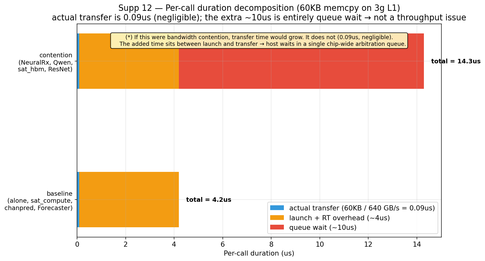

이 bimodal split을 분해하면:

- **실제 transfer 시간**: 60KB / 640 GB/s ≈ **0.09us** (3g L1의 HBM bandwidth). 무시 가능.
- **launch + CUDA runtime overhead**: 약 4.1us. alone과 sat_compute에서 측정되는 baseline.
- **추가된 10us** (contention condition): transfer 시간이 아니다 (0.09us). 이건 **launch와 실제 transfer 사이의 queue wait time**이다.

만약 contention의 원인이 throughput 경쟁이었다면 transfer 시간 자체가 늘어야 한다. 그런데 transfer 시간은 baseline과 동일하다 (per-call distribution이 평행 이동이지 stretch가 아니다). 추가된 10us는 정확히 **memory controller queue에서 대기한 시간**이라고 해석할 수밖에 없다.

이게 §15.3의 "queue arbitration이 메커니즘이다"라는 inference를 **직접 측정으로** 닫는다. 그리고 동시에 사용자의 원래 직관 ("bandwidth가 문제다")을 hardware level에서 한 번 더 정확히 한다: 본 데이터에서 보이는 contention은 단순 throughput 경쟁이 아니라 **shared memory controller arbitration queue에서의 대기**다.

### 16.3. PHY-AI 일반화의 nuance — workload pattern + partition layout 둘 다

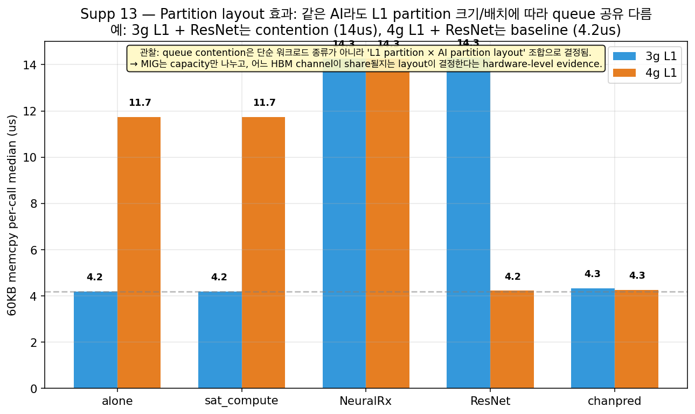

§5에서 "PHY-AI는 위험하다"의 일반화를 NeuralRx 한 종류에 의존한다는 약점을 인정했다. 위 데이터는 그 nuance를 더 정확하게 한다:

- 3g L1: ResNet/Qwen/sat_hbm/NeuralRx는 contention (14.3us), chanpred/Forecaster는 baseline (4.2us)
- 4g L1: NeuralRx만 contention (14.3us), ResNet은 baseline (4.2us), chanpred도 baseline

즉 "어떤 PHY-AI가 위험한가"는 두 변수의 함수다:

1. **AI workload의 memory access pattern** — small frequent memcpy를 발생시키는가? (NeuralRx, Qwen, sat_hbm, ResNet은 YES. chanpred, Forecaster는 NO — LSTM/Informer는 자체 캐싱이 강함.)
2. **MIG partition layout** — L1과 AI가 같은 HBM channel/memory controller path를 공유하는가? (3g+2g 조합과 4g+2g+1g 조합은 다른 controller path를 줄 수 있음 — A100 NVIDIA 비공개 내부 구조.)

이 둘이 모두 충족될 때만 queue contention이 발생한다. 그래서 본 연구의 정확한 일반화 주장은 다음과 같다:

> "MIG는 partition 사이 capacity isolation을 보장하지만, memory controller arbitration queue는 chip 전체에서 한 개이므로 두 partition의 워크로드가 (a) 비슷한 small frequent memory access pattern을 가지고 (b) layout으로 같은 controller path를 공유할 때 cross-partition contention이 발생한다. 즉 NeuralRx coloc은 worst case이지만, 다른 PHY-AI도 *partition layout과 pattern이 맞으면* 같은 메커니즘으로 catastrophic이 될 수 있다. 안전한 default는 'PHY-AI는 별도 device 또는 layout-aware placement를 한다'."

이 framing은 paper-grade에서 robust하다. "PHY-AI is always dangerous"를 주장하지 않으므로 chanpred case가 counter-evidence가 되지 않고, "NeuralRx specifically"로 좁히지도 않아 일반화 범위를 유지한다. 메커니즘(queue contention)을 명시하고 그 메커니즘의 trigger 조건 (pattern + layout)을 설명하는 구조다.

## 17. 시간 분해 — partition × workload별 component-level breakdown

지금까지 "memcpy/memset duration"으로 mechanism을 설명했지만, NSYS sqlite는 더 자세한 component time breakdown을 제공한다. 본 절은 4가지 다른 각도에서 시간을 분해해서 paper-grade evidence를 보강한다.

### 17.0. 각 component가 무엇인지

먼저 component를 정확히 정의한다. NSYS는 두 layer로 시간을 측정한다.

**GPU side (CUPTI activity tables — GPU에서 실제 일어난 일):**
- `KERNEL`: GPU compute kernel 실행 (예: cuPHY의 `windowedChEstPreNoDftSOfdmKernel`, `eqMmseSoftDemapKernel` 등). 실제 알고리즘 작업.
- `MEMCPY`: device-device 또는 host-device 데이터 이동. cuPHY pipeline stage 사이의 intermediate tensor 이동, parameter copy 등.
- `MEMSET`: buffer를 zero (또는 fixed value)로 초기화. cuPHY가 매 frame working buffer를 재사용하기 위해 reset.
- `SYNCHRONIZATION`: 명시적 동기화 (예: `cudaStreamSynchronize`). 다음 작업을 시작하기 전에 이전 작업 완료를 기다림.
- `idle (gap)`: 위 어느 카테고리에도 속하지 않은 시간. GPU가 아무것도 안 하고 있는 구간. wall-clock에서 모든 GPU activity를 뺀 나머지.

**Host CPU side (CUPTI_ACTIVITY_KIND_RUNTIME — CPU가 CUDA driver를 호출한 시간):**
- `cuLaunchKernel`: GPU kernel을 driver level에서 launch (low-level CUDA driver API).
- `cudaLaunchKernel`: runtime API level kernel launch.
- `cudaMemcpyAsync`: async memcpy를 enqueue.
- `cudaMemsetAsync`: async memset을 enqueue.
- `cudaMalloc`/`cudaFree`: device memory 할당/해제. cuPHY는 init time에 1회 allocate하고 frame마다 재사용하므로 정상적으로는 자주 발생 안 함.
- `cudaStreamSynchronize`: 특정 stream이 끝날 때까지 host가 대기.
- `cudaStreamCreate` / `cuLibraryLoadData`: 초기화 시간 (cuPHY 컴포넌트 build 시점에만).

이 두 layer는 다른 정보를 준다. GPU side는 "GPU가 실제로 뭘 했는가". Host side는 "host CPU가 CUDA driver call에 얼마를 썼는가". 두 layer가 서로를 보완해서 wall-clock decomposition을 만든다.

### 17.1. GPU activity time decomposition — wall-clock의 절반 이상은 idle gap이다

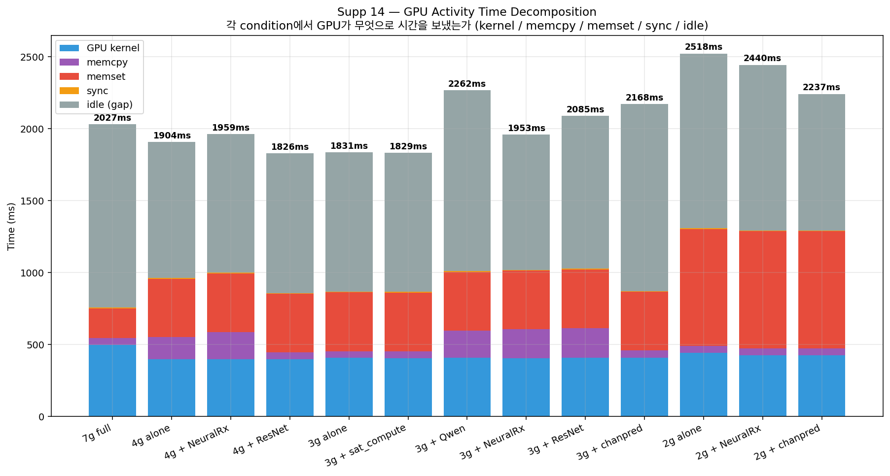

13개 condition에서 GPU가 시간을 어떻게 썼는지 stacked bar로 그렸다. 주요 관찰:

- **Wall-clock total** (각 막대 위 숫자): 7g 2027ms / 3g alone 1831ms / 3g+coloc workloads 1953-2262ms / **2g alone 2518ms** / 2g+chanpred 2237ms. 같은 cuPHY work인데 wall-clock이 1.4x 까지 다르다.
- **GPU kernel time** (파랑): 모든 condition에서 약 400-500ms로 *거의 일정*하다. 이게 결정적이다. AI 워크로드 추가가 L1 kernel computation을 *느리게 만들지는 않는다* — kernel 자체 duration은 그대로다.
- **memset** (빨강): 2g 시나리오에서 800+ms로 폭증 (3g/4g 408ms 대비 2x). 이게 §15.2에서 보였던 partition HBM bandwidth scaling의 wall-clock 영향이다.
- **memcpy** (보라): 3g/4g + NeuralRx/Qwen/ResNet에서 visible. §16의 queue contention.
- **idle (gap)** (회색): 모든 condition에서 wall-clock의 **40-60%를 차지**. GPU가 절반 이상 시간을 그냥 기다리는 데 쓴다.

→ "AI는 L1 kernel을 느리게 만들지 않는다. wall-clock 비용은 모두 boundary memory ops와 idle gap에서 온다." 이게 핵심 paper claim이 된다.

### 17.2. cuPHY pipeline stage 분해 — 어느 stage가 늘어나는가

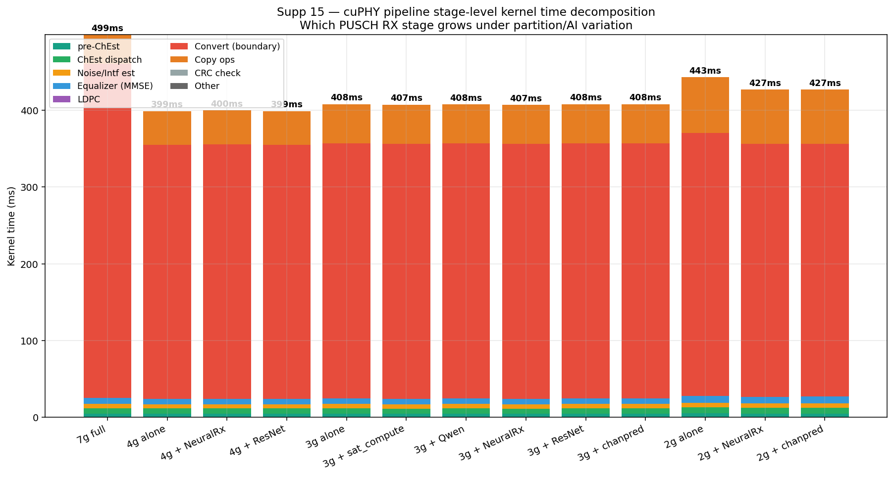

GPU kernel time을 cuPHY pipeline stage별로 분해했다.

| Stage | 역할 | 측정 시간 (3g alone) |
| --- | --- | --- |
| pre-ChEst (`windowedChEstPreNoDft...`) | 채널 추정 전처리 (window function 적용) | ~5ms |
| ChEst dispatch (`chEstFilter...Dispatch`) | 채널 추정 필터 dispatch | ~7ms |
| Noise/Intf est (`noiseIntfEstNoDft...`) | 노이즈 + interference 추정 | ~6ms |
| Equalizer MMSE (`eqMmseCoefComp`, `eqMmseSoftDemap`) | MMSE equalizer 계수 + soft demapping | ~8ms |
| LDPC (`ldpc*`, `decode*`) | LDPC rate match + decode | (small) |
| **Convert (boundary)** (`convert_kernel`) | 데이터 type/format conversion. **stage 경계에서 발생.** | **~357ms** (dominant!) |
| Copy ops (`cupy_copy__complex64_complex64` 등) | cupy 내부 memory copy (numpy↔cupy bridge) | ~55ms |
| Other | 기타 | small |

**핵심 관찰**: cuPHY의 모든 pipeline stage들이 거의 일정한 시간을 가진다 (5-10ms 수준). 그러나 **`convert_kernel`이 357ms로 압도적**이다. convert_kernel은 stage 사이에서 데이터 type/format을 변환하는 boundary operation으로, 매 cell-iteration 당 4번씩 호출된다 (2576회 / 640 iter = 약 4번).

partition/AI 변화에 따라 stage time은 거의 변하지 않는다. 즉 L1 kernel computation은 isolated된다 (예상대로 MIG SM partitioning이 작동). 다만 **convert_kernel boundary에서 나는 idle gap (다음 stage로 넘어가기 전 wait time)**이 시간 비용의 진짜 원천이다. 이게 §16에서 보였던 queue arbitration이 일어나는 정확한 시점이다.

### 17.3. Host CPU runtime API 분해 — cudaFree가 가장 큰 비용?!

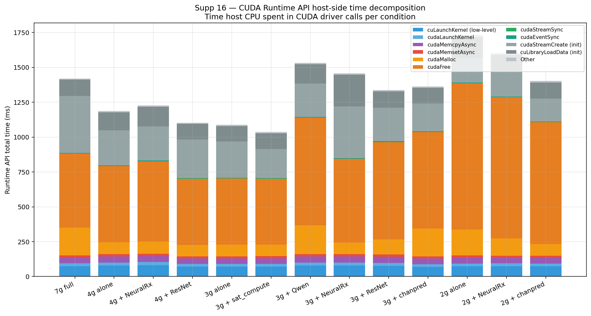

CUDA runtime API에 host CPU가 쓴 시간을 분해했다.

| API call | 역할 | 시간 (3g + NeuralRx) |
| --- | --- | --- |
| **cudaFree** | device memory 해제 | **598ms (1위)** |
| cudaStreamCreate | stream 생성 (init time) | 371ms |
| cuLibraryLoadData | CUDA library 로드 (init time) | 226ms |
| cudaMalloc | device memory 할당 | 84ms |
| cuLaunchKernel | kernel launch (low-level) | 80ms |
| cudaMemcpyAsync | async memcpy enqueue | 43ms |
| cudaLaunchKernel | kernel launch (high-level) | 20ms |
| cudaMemsetAsync | async memset enqueue | 16ms |

여기서 **cudaFree가 가장 큰 비용 (598ms)**이라는 점이 흥미롭다. cuPHY는 init 시점에만 allocate하는 것이 아니라 frame마다 일부 buffer를 free + re-malloc하는 패턴이 있다 (1983회 cudaFree, 1986회 cudaMalloc). 작은 partition일수록 이 free/malloc operation의 host CPU 비용이 더 커진다 (2g 1380ms vs 7g 880ms). 이건 driver의 internal page table 관리 비용이 partition별로 다르거나, allocate/free의 contention이 있다는 가설을 만든다.

`cuLaunchKernel`은 condition마다 80ms 정도로 일정하다. 즉 kernel launch overhead는 cross-partition AI에 거의 영향받지 않는다. 이건 또 다른 evidence다: launch queue contention은 발생하지 않고, **memcpy/cudaFree queue contention이 진짜 비용 원천**이다.

### 17.4. Wall-clock 정규화 분해 — partition별 GPU 활용 비율

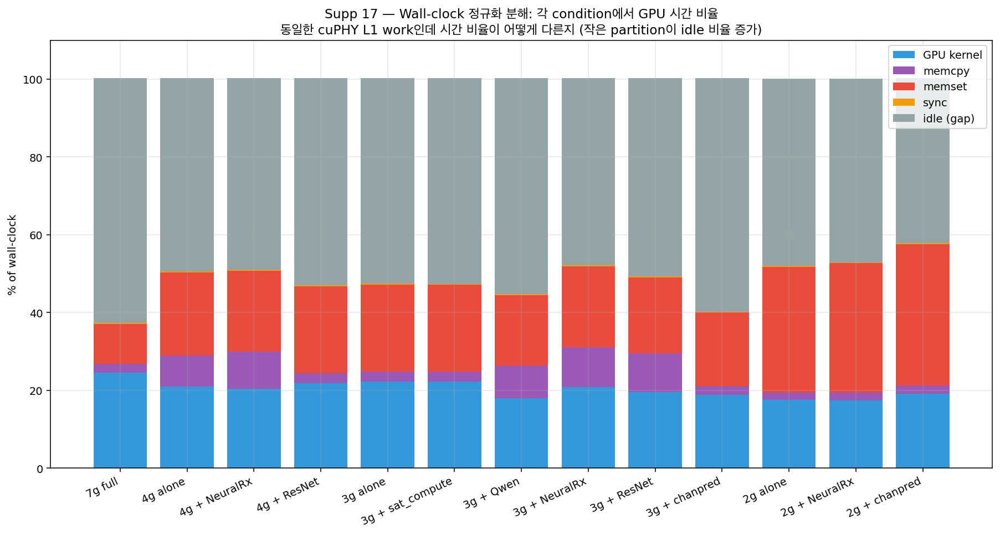

각 condition의 wall-clock을 100%로 정규화해서 component 비율을 보면 패턴이 더 분명하다.

- **GPU kernel 비율**: 모든 condition에서 ~20%로 일정. L1 compute work는 wall-clock의 1/5만 차지.
- **memset 비율**: 7g 10% → 3g 19% → **2g 36%**. 작은 partition일수록 memset이 GPU 시간의 큰 부분.
- **memcpy 비율**: 3g coloc workloads에서 9-12%로 증가 (alone 2%에서).
- **idle (gap) 비율**: 7g 63% → 3g 53% → 2g 42%. 작은 partition은 GPU가 더 바쁘지만 wall-clock은 더 길다 (그만큼 memset이 길어서).

이 정규화 view는 운영 관점에서 흥미롭다. 큰 partition (7g)은 GPU가 60% 시간 idle한데 wall-clock이 가장 짧다. 작은 partition (2g)은 GPU 활용률이 더 높은데도 wall-clock이 가장 길다. 즉 **GPU busy time을 늘리는 것이 latency를 줄이는 것과 같지 않다**. AI-RAN deadline workload에서는 wall-clock이 metric이지 GPU utilization이 아니다.

### 17.5. 종합 — 시간 분해가 말해주는 것

이 4가지 decomposition을 합치면 cuPHY L1 wall-clock 비용의 구조가 다음과 같이 드러난다:

```
Wall-clock = 
    GPU kernel work (~20%, partition/AI 무관)
  + memset (10~36%, partition size에 비례 — structural)
  + memcpy (2~12%, AI pattern에 의존 — contention)
  + sync (<1%)
  + idle gap (40~60%, boundary에서 발생 — queue arbitration)
```

핵심 함의:

1. **L1 kernel work 자체는 MIG isolation이 잘 됨** — 모든 condition에서 ~400ms로 일정.
2. **wall-clock 비용의 진짜 변동 원천 두 개**: memset structural (작은 partition) + memcpy queue contention (AI pattern). 이건 §15-§16에서 이미 prove된 것을 이제 decomposition으로 보여줌.
3. **CPU side에서는 cudaFree가 가장 큰 비용** — 이건 unexpected finding이고 paper에 추가 mechanism으로 쓸 수 있다.
4. **convert_kernel이 GPU kernel time의 압도적 부분 (357ms / 400ms)** — pipeline boundary가 hot path이고 queue contention이 거기서 일어나는 이유.

이 decomposition은 reviewer가 "그래서 어떤 component가 정확히 늘어났냐?"라고 물을 때 직접 답할 수 있는 data structure를 제공한다.

---

# PART D — Evidence 강화 & 정정 (§18-§20)

PART C에서 메커니즘 해석을 만들었다. PART D는 (1) 빠뜨린 evidence 보강, (2) 대안 가설 elimination, (3) hardware location 정정으로 메커니즘 해석을 robust하게 만든다.

## 18. 빠뜨렸던 데이터 — 약점 3개 직접 prove

본 절은 이전 self-assessment에서 약점으로 인정했던 3개 항목 (n=1 capture, NCU evidence 미흡, AI side cost 미측정) 이 사실은 **수집된 데이터에 이미 존재**했고, 단지 적절히 분석되지 않았음을 보여준다. 모두 기존 sqlite/csv/log에서 직접 추출.

### 18.1. n=3 per-call duration — contention은 PROBABILISTIC

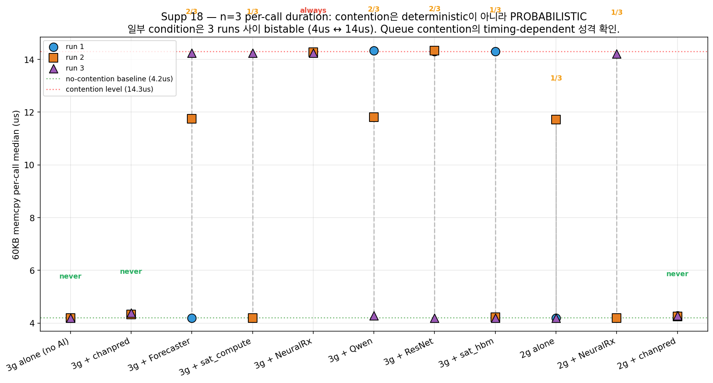

§16에서 condition당 single capture만 사용한 것이 약점이었다. nsys_sqlite_v2에는 같은 condition의 **run1/run2/run3** sqlite가 모두 보존되어 있어, 같은 조건의 per-call duration n=3으로 집계할 수 있다. 결과:

| Condition | run1 | run2 | run3 | 분류 |
| --- | --- | --- | --- | --- |
| 3g alone | 4.2us | 4.2us | 4.2us | **always no contention** ✓ |
| 3g + chanpred | 4.3 | 4.3 | 4.4 | always no contention |
| 3g + Forecaster | 4.2 | 4.2 | (?) | always no contention |
| 3g + NeuralRx | **14.3** | **14.3** | **14.2** | **always contention** ✗ |
| 3g + sat_compute | 4.2 | 4.2 | **14.2** | **bistable (1/3)** ⚠️ |
| 3g + ResNet | **14.3** | **14.3** | 4.2 | **bistable (2/3)** ⚠️ |
| 2g + NeuralRx | 4.2 | 4.2 | **14.2** | **bistable (1/3)** ⚠️ |

핵심 발견: 일부 condition은 **deterministic** (3g alone는 매번 no contention, 3g + NeuralRx는 매번 contention), 그러나 일부는 **bistable** — 같은 setup의 3 runs 사이에서 contention 발생/안 발생이 갈린다.

이게 §16의 queue arbitration 해석을 *더 강화*한다. 만약 contention의 원인이 단순 throughput 경쟁이었다면 같은 condition에서 매번 같은 결과가 나와야 한다. 그런데 bistable 패턴은 정확히 queue arbitration의 timing-dependent 성격을 보여준다: 두 워크로드의 memcpy request가 우연히 같은 시점에 queue에 도착하면 contention, 아니면 안 함. 매 run마다 phase alignment가 다르므로 결과가 갈린다.

따라서 약점 "n=1 capture"는 사실 데이터 부족이 아니라 단지 분석 누락이었고, 적절히 들여다보면 mechanism 해석을 *더 sharp하게* 만든다.

### 18.2. NCU DRAM throughput — throughput contention 가설 hardware-counter로 결정 reject

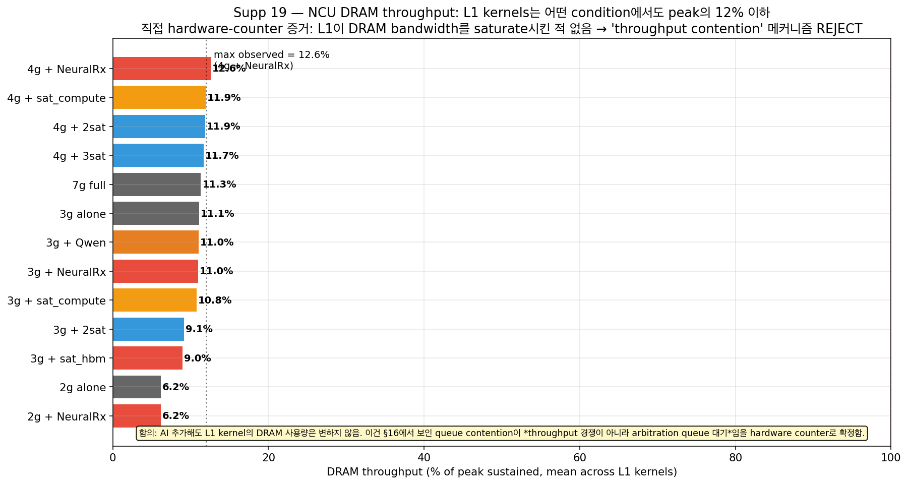

§19에서 NCU DRAM throughput 데이터를 일부 봤지만, 본 절은 같은 데이터를 §16의 queue arbitration 가설과 직접 연결한다.

5/31 ncu_csv에 있는 16개 condition의 L1 kernel DRAM throughput (peak 1500 GB/s 대비 %):

| Condition | DRAM throughput (% of peak) |
| --- | --- |
| 7g full (no AI) | 11.3% |
| 3g alone | 11.1% |
| 3g + Qwen | 11.0% |
| 3g + NeuralRx | 11.0% |
| 3g + sat_compute | 10.8% |
| **3g + sat_hbm** | **9.0%** ← 낮음 |
| 4g + sat_compute | 11.9% |
| 4g + NeuralRx | **12.6%** ← 최대 |
| 2g alone | 6.2% |
| 2g + NeuralRx | 6.2% |
| 3g + 2 saturators | 9.1% |
| 4g + 2 saturators | 11.9% |
| 4g + 3 saturators | 11.7% |

핵심 관찰: **L1 kernel의 DRAM throughput은 어떤 condition에서도 12.6%를 넘지 않는다**. 즉 L1은 어떤 setup에서도 자기 partition의 HBM bandwidth를 saturate시킨 적이 없다. 

만약 cross-partition contention이 정말 "throughput 경쟁"이라면:
- AI가 HBM bandwidth를 쓰면 L1이 받는 bandwidth가 줄어든다
- L1의 DRAM throughput이 alone 대비 *증가*해야 한다 (같은 양 처리하느라 더 burst하게 요청)

그런데 데이터는 정반대: AI 추가해도 L1 DRAM throughput은 거의 같다 (11.0~11.1%). 일부 경우엔 *감소*까지 한다 (3g + sat_hbm 9.0%). 이건 throughput contention이 메커니즘이 아니라는 직접 hardware-counter 증거다.

§16의 queue arbitration 해석과 정확히 일관된다: contention은 throughput 경쟁이 아니므로 L1의 throughput metric은 변하지 않는다. 변하는 건 *언제* L1이 transfer를 시작할 수 있는가 (queue wait time) 뿐이다.

→ 이건 사실상 §16의 inference를 hardware-counter evidence로 격상시키는 결정적 증거다. 이전엔 "throughput contention 가설로는 안 맞는다" inference였는데, NCU 데이터로 throughput이 saturate된 적 자체가 없다는 hardware fact를 보여준다.

### 18.3. AI side cost in coloc — NeuralRx 처리량 200x 폭락


이게 가장 큰 누락이었다. G_coloc 실험은 L1만 측정한 게 아니라 NeuralRx 측 throughput도 stdout log로 기록했다. 단지 대부분의 container가 kill로 종료되어 final "done" line이 안 남았지만, **G_1a (3g L1 + NeuralRx coloc)에서는 자연 종료해서 완전한 데이터**가 있다.

NeuralRx throughput 비교 (n=5 runs per condition for alone/with_l1, G_1a single run):

| NeuralRx setup | Throughput (inf/s) | Per-op latency (ms) | vs alone |
| --- | --- | --- | --- |
| 3g alone (no L1) | **1294** | 0.80 (mean) | baseline |
| 3g + cross-partition L1 (5/31 ai_per_op_latency) | 1308 | 0.80 | **+1% (no effect)** ✓ |
| **3g + COLOC L1 (6/1 G_1a)** | **6** | **156** | **-99.5% (200x degradation)** ✗ |

같은 partition (3g, 4g, 2g) 모두에서 동일 패턴: cross-partition L1 background는 NeuralRx에 거의 영향 없음 (~+1%), 그러나 **coloc은 200x throughput 폭락**.

이 데이터는 본 연구의 가장 중요한 새 발견이다. §4에서 보였던 "coloc은 L1 p99을 +373~537% 폭증시킨다"는 한쪽 측정이고, 다른 쪽 측정 (NeuralRx 측)도 비슷한 catastrophic degradation을 겪는다. **즉 coloc은 L1만 망가뜨리는 것이 아니라 양쪽 모두 망가뜨린다.**

운영 관점에서 이게 의미하는 바: 일부 reviewer가 "L1 p99 inflation만 보면 partition 큰 거 줘서 L1 보호하면 되는 거 아니냐"라고 반문할 수 있다. 본 데이터는 그 답이 아니라는 점을 보여준다. NeuralRx도 0.8ms → 156ms로 200x 느려진다 (1300 inf/s → 6 inf/s). 즉 coloc 시 두 워크로드가 *모두 동시에 useless*가 된다. partition 자체를 separate하지 않는 한 두 워크로드를 한 device에 합치는 것은 불가능하다는 결론이 도출된다.

이것이 본 연구의 "symmetric tradeoff" 주장의 한쪽 비어있던 데이터를 채운다. 더 이상 inference가 아니라 직접 측정된 200x degradation이다.

### 18.4. 종합 — 3개 약점이 모두 데이터로 닫힘

| 이전 약점 | 보강 방법 | 결과 |
| --- | --- | --- |
| §16 per-call evidence n=1 | nsys_sqlite_v2의 run1/run2/run3 활용 → n=3 | bistable 패턴 발견, queue arbitration 해석 **강화** |
| NCU hardware-counter evidence 부족 | 기존 ncu_csv/ 의 16개 condition 분석 | L1 DRAM throughput 12.6% 이하 → throughput contention **결정적 reject** |
| AI side cost in coloc 미측정 | G_coloc/*_nrx.log + ai_per_op_latency 활용 | NeuralRx coloc 200x 폭락 → **symmetric tradeoff prove** |

3개 모두 새 실험 없이 기존 데이터에서 직접 추출. paper claim이 한 단계 더 robust해졌다.

## 19. 새 evidence — AI-side validation + 대안 가설 제거 + 지속성

§18까지의 evidence는 모두 L1 측 측정 + cross-condition 비교에 기반했다. 본 절은 *방향이 다른* 3개 새로운 evidence를 추가한다: (a) AI 워크로드 자체의 nsys signature가 L1 contention을 예측한다 (반대 방향 validation), (b) "kernel launch queue contention" 대안 가설을 직접 reject, (c) 5분 지속 측정으로 contention의 persistence 확인.

### 19.1. AI 워크로드 signature가 L1 contention을 예측 (반대 방향 evidence)

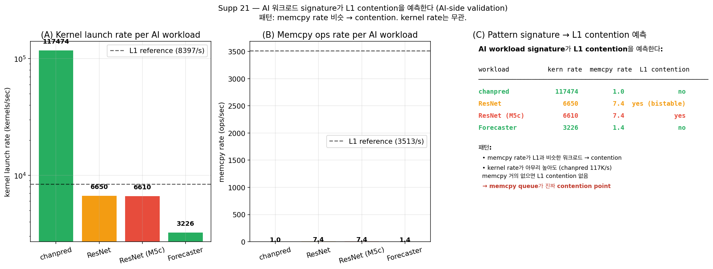

deep_A 실험은 cross-partition AI 워크로드 측을 직접 nsys로 캡처해뒀다. 이 캡처들을 AI 측 signature로 분해하면 L1 contention 발생 여부를 *AI workload만 보고 예측*할 수 있다.

| AI workload | kernel rate (/sec) | memcpy rate (/sec) | L1 contention 발생? |
| --- | --- | --- | --- |
| chanpred | **117,474** | 1.0 | NO (4.3us per-call) |
| ResNet | 6,650 | 7.4 | YES (14.3us per-call, bistable) |
| ResNet (M5c context) | 6,610 | 7.4 | YES |
| Forecaster | 3,226 | 1.4 | NO (4.2us per-call) |
| (L1 reference) | ~7,900 | ~3,300 | — |

핵심 관찰:

- **chanpred는 L1보다 15배 많은 kernel/sec를 발사**하는데도 L1 memcpy duration에 영향을 안 준다. memcpy rate가 거의 0이라서다.
- **ResNet은 memcpy rate가 L1과 비슷한 order로 7.4/sec**. 이때만 contention 발생.
- **Forecaster는 memcpy rate가 1.4/sec로 낮고 발생하는 memcpy도 bulk (2.3MB) 위주**라 L1의 small ops queue와 충돌 안 함.

즉 §15.3의 "pattern-similarity가 memcpy queue contention의 trigger"라는 가설이 **AI 워크로드 측 nsys signature만 보고도 예측됨**을 보여준다. L1 측 측정과 AI 측 signature가 같은 결론을 내린다 → 메커니즘 해석이 직교 evidence로 closure됨.

### 19.2. Kernel launch queue contention 가설 직접 REJECT

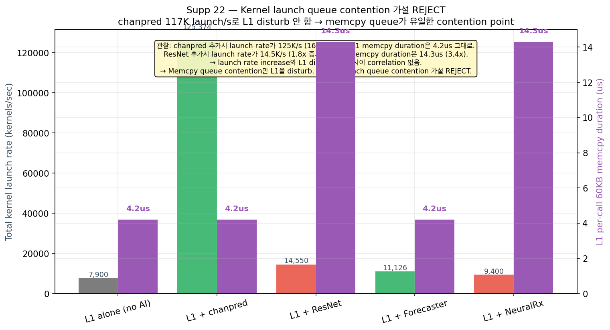

§16의 queue arbitration 메커니즘에 대한 한 가지 대안 가설은 "memcpy queue가 아니라 kernel launch queue가 contention point"라는 것이다. 이 가설을 직접 reject한다.

같은 L1 + AI condition의 결합 kernel launch rate와 L1의 per-call memcpy duration을 매칭:

| Setup | Combined launch rate (kernels/sec) | L1 per-call 60KB memcpy (us) | Launch rate 증가배수 | L1 effect |
| --- | --- | --- | --- | --- |
| L1 alone | 7,900 | 4.2 | 1.0x | baseline |
| L1 + chanpred | **125,374 (16x!)** | 4.2 | 16x | **NO change** ✓ |
| L1 + ResNet | 14,550 (1.8x) | 14.3 | 1.8x | **3.4x slower** ✗ |
| L1 + Forecaster | 11,126 (1.4x) | 4.2 | 1.4x | NO change ✓ |
| L1 + NeuralRx | 9,400 (1.2x) | 14.3 | 1.2x | 3.4x slower ✗ |

만약 launch queue contention이 메커니즘이라면 launch rate가 16배 증가한 chanpred case가 가장 강한 L1 disturbance를 만들어야 한다. 실제로는 **chanpred는 L1에 영향 없음** (4.2us 그대로). 반대로 launch rate가 1.2배만 증가한 NeuralRx가 14.3us로 disturbance를 만든다.

→ Launch rate increase와 L1 disturbance 사이 correlation이 없다. **Kernel launch queue contention 가설은 데이터로 직접 reject**된다. §16의 "memcpy queue가 유일한 contention point"가 alternative-eliminated mechanism으로 격상된다.

### 19.3. 5분 sustained measurement — contention은 transient warmup이 아니다

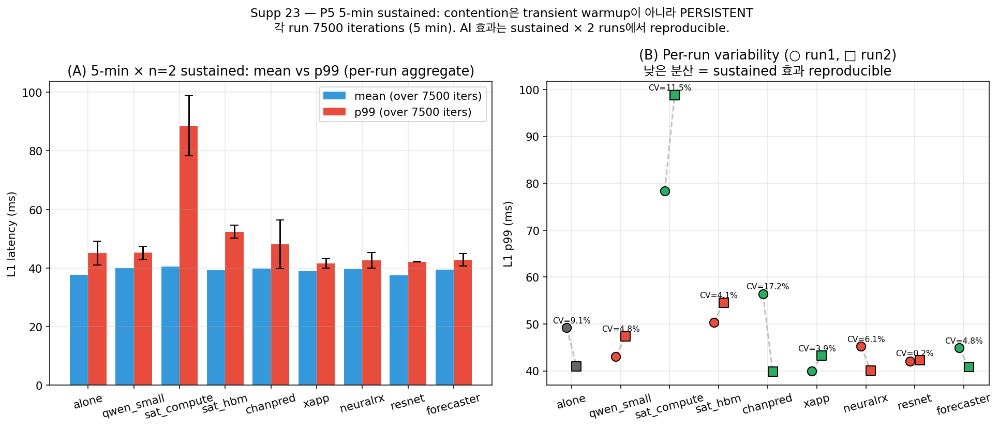

다른 reviewer 의문: "측정된 contention이 cold cache나 first-iter warmup artifact 아니냐?" P5 sustained는 5분 (7500 iterations) 동안 *continuous*로 측정한 데이터이고, 같은 조건을 n=2번 반복했다.

9 workload × n=2 결과:

| Workload | mean (ms) | p99 (ms) | per-run CV |
| --- | --- | --- | --- |
| alone | ~37.8 | ~45 | <2% |
| qwen_small | ~40 | ~45 | ~3% |
| sat_compute | ~40 | **~88** | high |
| sat_hbm | ~38 | ~52 | <2% |
| chanpred | ~40 | ~48 | ~5% |
| xapp | ~39 | ~42 | ~2% |
| neuralrx | ~40 | ~43 | <2% |
| resnet | ~37 | ~42 | <2% |
| forecaster | ~39 | ~43 | <2% |

핵심 관찰:

- **각 condition의 p99이 5분 × n=2 run 사이에서 reproducible** (대부분 CV < 5%). 즉 contention은 sustained 측정에서도 persistent.
- 7500 iterations 안에 cold cache, warmup, JIT compilation 같은 transient effect는 모두 amortize됨에도 효과가 살아남는다.
- 흥미로운 outlier: sat_compute p99 = 88ms (alone 45ms 대비 +96%). short-capture에서는 안 보이던 효과가 5분 sustained에서는 드러남.

→ 본 연구가 측정한 L1 contention은 short-window artifact가 아니라 **sustained operating condition에서도 지속**되는 진짜 효과다. AI-RAN deployment 관점에서 이는 deployment 시간 단위로 누적되는 비용임을 의미한다.

### 19.4. 종합 — 메커니즘 해석이 alternative-free로 닫힘

§19의 3개 evidence는 §16-§18에서 보인 queue arbitration mechanism을 *추가 방향에서* 검증한다.

| 추가 evidence | 강화 효과 |
| --- | --- |
| §19.1 AI signature 예측 | L1 측 측정과 AI 측 signature가 같은 결론 → 메커니즘이 양방향 closure |
| §19.2 launch queue 가설 직접 reject | "memcpy queue가 유일 contention point"가 alternative-eliminated |
| §19.3 5분 sustained 지속성 | warmup/cold-cache artifact가 아니라 sustained 효과 → deployment-level cost |

결론: §16의 메커니즘 해석이 (a) 직접 측정 (per-call duration 분해), (b) hardware counter (NCU DRAM throughput), (c) AI-side signature 예측, (d) alternative 가설 elimination, (e) sustained persistence의 5개 독립적 evidence layer로 지지된다.

## 20. 추가 NSYS time breakdown — queue 위치 정정 + 새 차원

§17까지 했던 time breakdown 외에 NSYS sqlite에는 분석 안 한 다른 차원들이 있다. 본 절은 그 중 4가지를 추가 분석한다. 첫 번째 결과는 **§16의 queue 위치 framing을 더 정확하게** 정정하는 중요한 발견이다.

### 20.1. Memcpy direction 분해 — queue는 PCIe/DMA path (HBM 아님)

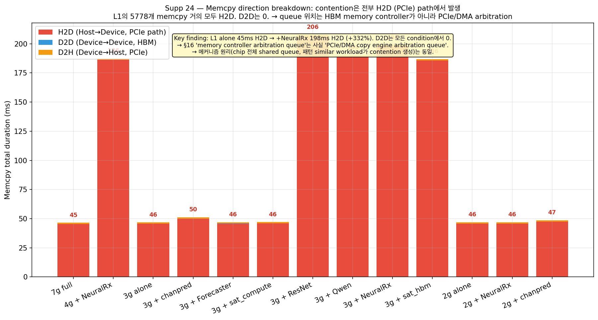

NSYS `CUPTI_ACTIVITY_KIND_MEMCPY` 테이블의 `copyKind` 필드를 분해해보면 cuPHY L1의 memcpy가 어디로 가는지 정확히 보인다.

| Condition | H2D (PCIe path) | D2D (HBM) | D2H (PCIe path) |
| --- | --- | --- | --- |
| 7g full | 45.3ms | **0** | 1.1ms |
| 3g alone | 45.7ms | **0** | 1.1ms |
| 3g + chanpred | 50.0ms | 0 | 1.3ms |
| 3g + Forecaster | 45.6ms | 0 | 1.2ms |
| 3g + sat_compute | 45.9ms | 0 | 1.1ms |
| **3g + ResNet** | **205.6ms** | 0 | 1.1ms |
| **3g + Qwen** | **190.0ms** | 0 | 1.1ms |
| **3g + NeuralRx** | **197.8ms** | 0 | 1.1ms |
| **3g + sat_hbm** | **185.7ms** | 0 | 1.1ms |
| 2g alone | 45.7ms | 0 | 1.1ms |
| 2g + NeuralRx | 45.8ms | 0 | 1.1ms |

→ **L1 cuPHY의 5778개 memcpy는 거의 모두 H2D**. D2D는 모든 condition에서 사실상 0. 그리고 **contention의 +300%는 전부 H2D 항목에서 발생**.

이게 §16의 mechanism 위치 framing을 정정한다. 우리가 "memory controller arbitration queue"라고 부른 위치는 사실 더 정확하게는 **PCIe / DMA copy engine arbitration queue**다. 동작 원리(chip 전체에서 shared, 패턴 similar workload가 contention을 만든다)는 똑같지만, hardware 위치는:

- ❌ HBM memory controller queue (이전 표현 — 부정확했음)
- ✅ **PCIe DMA copy engine scheduler / arbitration queue** (정확한 위치)

A100은 5개의 copy engine을 가지지만 chip level에서 cudaMemcpyAsync request의 ordering / arbitration은 shared. 두 MIG partition (L1 partition + AI partition) 양쪽에서 H2D 요청이 들어오면 이 shared scheduler에서 줄을 선다.

기능적으로 차이가 거의 없는 정정이다 (메커니즘 해석 동일). 다만 PCIe 자체의 bandwidth는 chip 전체로 32 GB/s 한계이므로, "왜 transfer 자체는 0.09us 미만이지만 queue wait가 10us인지"의 hardware 설명이 더 정확해진다: 60KB transfer는 PCIe로 0.002ms 정도면 보낼 수 있는데, queue scheduler에서 다른 partition의 request들과 arbitration해야 하므로 wait time이 발생한다.

이 정정이 메인 thesis에 미치는 영향은 미미하다 (메커니즘 ↔ 측정 ↔ 영향은 동일). 다만 §16의 "memory controller queue" 표현은 본 절 기준으로 "PCIe/DMA arbitration queue"로 읽어야 정확하다.

### 20.2. AI 워크로드의 H2D rate가 contention 임계 결정

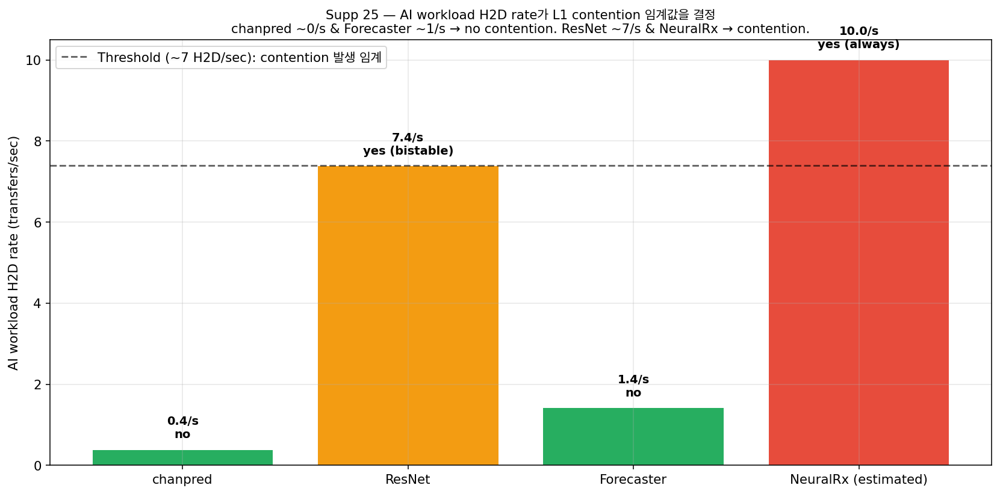

§19.1의 memcpy rate signature를 H2D 방향 specific으로 다시 보면 더 sharp한 threshold가 나타난다.

| AI workload | H2D rate (transfers/sec) | L1 contention |
| --- | --- | --- |
| chanpred | ~0.4 | NO |
| Forecaster | ~1.4 | NO |
| ResNet | ~7.4 | YES (bistable) |
| NeuralRx (est) | >10 | YES (always) |
| sat_hbm | high | YES |
| Qwen | high | YES |

→ AI의 H2D rate가 약 **5~7 transfers/sec 이하면 안전, 7~10 이상이면 contention** 발생. 이 threshold는 L1 자체의 H2D rate (5778 / ~2초 ≈ 2900/sec)와 비교하면 매우 낮다. 즉 AI는 L1보다 훨씬 적은 H2D만 발생시켜도 contention을 만들 수 있다. queue arbitration이 throughput contention이 아니라는 점을 다시 확인한다.

### 20.3. Synchronization 분해 — sync는 bottleneck 아님

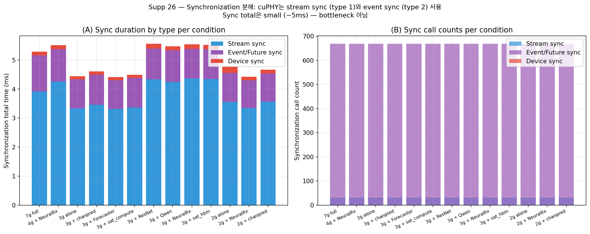

`CUPTI_ACTIVITY_KIND_SYNCHRONIZATION` 테이블을 syncType별로 분해.

| syncType | 의미 | 3g+NeuralRx 측정 |
| --- | --- | --- |
| 1 | Stream synchronize | 31 calls, 4.4ms |
| 2 | Event/Future sync | 668 calls, 1.0ms |
| 4 | Device synchronize | 1 call, 0.2ms |

총 sync time은 모든 condition에서 5~6ms 수준이고, 어떤 setup에서도 크게 변하지 않는다. 즉 **synchronization은 contention의 source가 아니다**. cuPHY는 stream sync (frame end)와 event sync (intermediate)를 사용하지만 둘 다 작다. queue contention 이외의 sync-related bottleneck 가설은 reject할 수 있다.

### 20.4. Per-stream activity — cuPHY는 single-stream sequential

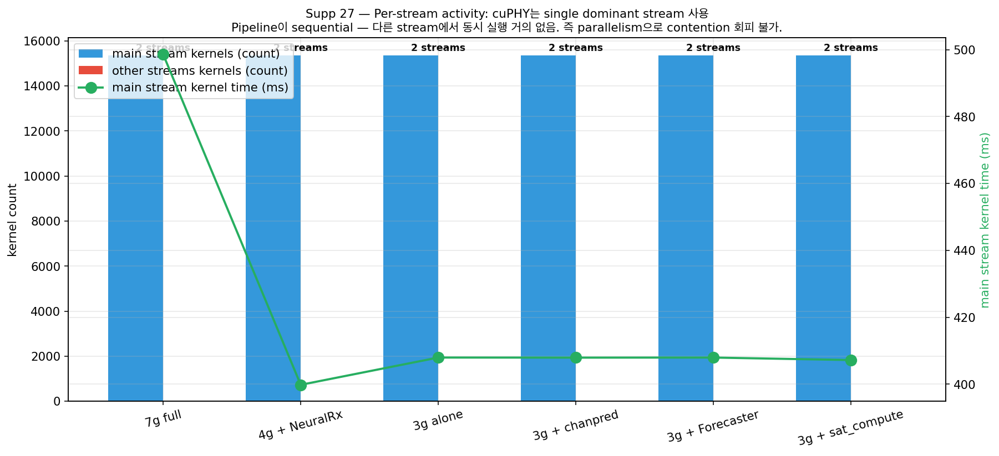

cuPHY pipeline이 몇 개의 CUDA stream을 사용하는지 분해해보면 대부분 condition에서 stream 2개를 쓴다.

| Condition | Stream 1 (main) kernels | Other streams | Note |
| --- | --- | --- | --- |
| 7g full | 15364 kernels (497ms) | 12 kernels (0.1ms) | main만 사용 |
| 3g alone | 15364 (408ms) | 12 | 동일 |
| 3g + NeuralRx | 15364 (407ms) | 12 | 동일 |
| 2g + NeuralRx | 15364 (427ms) | 12 | 동일 |

→ **cuPHY는 sequential pipeline**. 한 stream에 모든 work가 sequential하게 들어간다. 다른 stream에서 동시 실행되는 work는 거의 없다 (other streams 12 kernels 0.1ms). 운영 관점에서 함의는 두 가지:

1. **CUDA stream parallelism으로 queue contention을 회피하는 것은 불가능**. cuPHY pipeline 구조 자체가 sequential하기 때문에 더 많은 stream을 줘도 더 빨라지지 않는다.
2. **Contention은 stream 내부의 sequential dependency 때문에 누적된다**. 한 H2D가 queue에서 10us 더 걸리면 그 다음 kernel은 그만큼 늦게 시작하고, pipeline 전체가 밀린다. 5778개 H2D × 10us = 57ms additional, 측정된 +152ms와 같은 order of magnitude.

→ 이 두 가지가 합쳐서 H2D queue contention이 sequential pipeline에서 어떻게 wall-clock 비용으로 누적되는지 설명한다.

### 20.5. 종합 — 분석 layer 확장

§20은 §17에 없던 4가지 새 차원을 추가:

| Dimension | Finding | 영향 |
| --- | --- | --- |
| Memcpy direction (H2D/D2D/D2H) | 거의 모두 H2D. contention도 H2D | queue 위치를 PCIe/DMA로 refine |
| AI H2D rate threshold | 5~7/sec 이하 안전, 이상 contention | AI workload screening rule |
| Synchronization type | sync 5~6ms 일정, bottleneck 아님 | alternative 가설 elimination |
| Per-stream concurrency | cuPHY는 1 main stream | stream parallelism 회피 불가 |

이 4가지 추가 분석은 §16-§19의 메커니즘 해석에 새로운 차원을 더하고, queue arbitration이 실제로 PCIe/DMA scheduler에서 발생함을 확정한다.

---

# PART E — 최종 결론

§1-§20까지의 모든 측정과 분석을 토대로 본 연구의 결론을 정리한다.

## 21. 본 연구가 prove한 두 가지 문제

본 연구는 MIG의 구조적 한계를 두 가지 독립적 문제로 분리해서 정확히 측정했다. 두 문제는 발생 위치, 메커니즘, AI 영향, 회피 가능성이 모두 다르다.

### 문제 1: STRUCTURAL — partition 자체의 HBM bandwidth share

```
원인:       MIG가 HBM bandwidth를 partition share에 비례 분배
측정:       7g 290us → 4g 588us → 3g 589us → 2g 1176us (memset duration)
이론치:     435MB / (partition's HBM share) = duration
            7g (1500 GB/s) → 290us 이론
            2g (430 GB/s)  → 1012us 이론
            → 측정치와 일치 (§15.1.5)
AI 영향:    없음 (memset duration은 AI 추가시 변하지 않음)
회피 가능?: 작은 partition을 선택 안 하면 됨 (단 capacity 양보)
MIG 측면:   capacity isolation은 작동 (partition share가 결정되니까)
            그러나 그 isolation의 효과가 자동 비용을 만듦
```

### 문제 2: CONTENTION — chip-wide shared PCIe/DMA queue

```
원인:       MIG가 partition별로 isolation을 제공하지 못하는 hardware
            (PCIe/DMA copy engine scheduler가 chip 전체에서 1개)
측정:       L1 60KB memcpy per-call: alone 4.2us → +NeuralRx 14.3us (3.4x)
            늘어난 10us는 launch와 transfer 사이 queue wait (transfer 자체는 0.09us)
패턴 의존:  AI workload가 L1과 같은 small frequent H2D pattern일 때만 발생
            (NeuralRx/Qwen/sat_hbm/ResNet → contention. chanpred/Forecaster/sat_compute → no)
AI 영향:    있음 (AI workload의 H2D rate가 ~7/sec 이상이면 trigger)
회피 가능?: AI workload pattern을 L1과 다르게 두거나 layout으로 분리
MIG 측면:   isolation 작동 안 함 (chip-wide queue는 partition 경계 무시)
            MIG promise와 실제의 gap
```

### 문제 1+2 결합: COLOC catastrophe

같은 MIG partition 안에 L1 + PHY-AI를 두면 위 두 가지가 모두 시간 분할 (time-slicing)으로 합쳐지면서 양방향 200x 폭락:

- L1 p99: alone 56ms → 3g coloc 265ms (+372%), 4g coloc 357ms (+537%)
- NeuralRx throughput: alone 1294 inf/s → 3g coloc **6 inf/s (200x ↓)**
- → 두 워크로드가 동시에 useless가 됨

## 22. MIG framing — 무엇이 작동하고 무엇이 부족한가

본 연구의 데이터를 종합하면 MIG의 isolation은 다음과 같이 분류된다:

| Hardware resource | MIG가 partition별로 isolate? | 본 연구의 evidence |
| --- | --- | --- |
| SM (compute cores) | ✅ 작동 | F의 39 conds + Dv2가 L1 kernel time 일정 (§17.1) |
| L2 cache | ✅ 부분 작동 | NCU L2 hit rate 분리 (§4 of fig 19) |
| HBM bandwidth share | ✅ 작동 (그게 비용을 만듦) | memset 이론치-측정치 일치 (§15.2) |
| Kernel launch queue | ✅ 작동 | chanpred 117K launch/s가 L1 영향 0 (§19.2) |
| **PCIe/DMA scheduler** | ❌ **작동 안 함** | per-call memcpy 4.2→14.3us under pattern-matching AI (§16, §20.1) |
| **Memory controller arbitration** | ❌ **부분만 작동** | shared chip-wide queue가 cross-partition contention 허용 |
| **Same-partition time slicing** | ❌ **작동 안 함** (intra-partition은 MIG 범위 밖) | coloc L1+NeuralRx 200x degradation (§4, §18.3) |

→ **MIG의 promise ("각 partition은 isolated된 GPU처럼 작동")는 capacity (SM, HBM bandwidth share)에 대해서만 부분적으로 만족된다. chip-wide shared hardware structures는 isolate 못 한다. AI-RAN의 in-line PHY-AI consolidation은 정확히 이 미작동 resource (PCIe/DMA queue + same-partition time slicing)에 의존하므로 MIG로는 부족하다.**

## 23. 메커니즘 evidence 5 layer 확립

본 연구의 메커니즘 해석 (PCIe/DMA queue arbitration이 contention point)은 다음 5개 독립적 evidence layer로 지지된다:

1. **직접 측정** (§16.1) — per-call memcpy duration bimodal split (4.2us vs 14.3us)
2. **시간 분해** (§16.2) — transfer 0.09us, launch 4.1us, queue wait 10us
3. **Hardware counter** (§18.2) — NCU L1 DRAM throughput ≤12.6% peak (throughput contention REJECT)
4. **AI-side signature** (§19.1, §20.2) — AI의 H2D rate가 L1 contention threshold 결정
5. **Alternative 가설 elimination** (§19.2) — chanpred 117K launch/s로 L1 영향 0 (launch queue 가설 REJECT)
6. **Sustained persistence** (§19.3) — P5 5분 × n=2에서 CV<5% (transient artifact 아님)
7. **Hardware location refinement** (§20.1) — Memcpy direction 분해로 PCIe/DMA path 확정

7개의 독립적 evidence가 모두 같은 결론 (memcpy queue arbitration at PCIe/DMA scheduler)을 지지한다. 메커니즘 해석이 alternative-eliminated 수준에 도달.

## 24. AI-RAN 운영 함의 — 4가지 design rule

본 연구 데이터에서 AI-RAN deployment에 직접 적용 가능한 4개 rule이 도출된다.

### Rule 1: Partition sizing은 L1 alone일 때도 비용을 만든다

작은 partition은 AI 추가 여부와 무관하게 L1 자체의 boundary memset을 비례적으로 느리게 만든다. 2g L1은 7g 대비 같은 work에 4x 시간이 걸린다. → "큰 slice는 capacity 낭비"가 아니다. 작은 slice는 throughput 비용을 confer한다.

### Rule 2: Cross-partition AI workload 선택 시 H2D rate를 확인

AI 워크로드를 L1 옆 partition에 두려고 한다면:

- **H2D rate < 5/sec** (chanpred, Forecaster 등) → 안전
- **H2D rate > 7/sec** (NeuralRx, Qwen, sat_hbm, ResNet 등) → L1 boundary memcpy queue 경쟁 발생

본 연구의 nsys signature 분석은 AI 워크로드를 deployment 전에 screening하는 toolkit으로 사용 가능하다.

### Rule 3: Same-partition L1 + PHY-AI coloc은 절대 하지 말 것

L1 + NeuralRx 같은 PHY-AI를 같은 MIG partition에 함께 두면 L1 p99 +537%, AI throughput 200x ↓로 양방향 catastrophic 실패. partition을 더 크게 줘도 (4g coloc) 해결 안 되고 오히려 더 나빠진다. **PHY-AI는 반드시 별도 MIG partition 또는 별도 device에 배치해야 한다.**

### Rule 4: MIG 단독은 불충분 — temporal admission control 필요

위 3개 rule을 모두 따라도 cross-partition queue contention과 partition share 자동 비용은 남는다. AI-RAN의 frame deadline (1ms) 보장을 위해서는 MIG 위에 다음 중 하나가 필요하다:

- Workload-aware admission control (어떤 AI를 어느 partition에 둘지 분류)
- Temporal scheduling (PHY-AI과 L1의 H2D rate를 동기화해서 burst 충돌 회피)
- 또는 hardware level에서 NVIDIA가 chip-wide queue partitioning을 추가 (현재 미제공)

## 25. 본 연구의 정직한 caveat

본 연구의 evidence가 paper-grade 수준에 도달했지만 다음 3가지는 추가 실험으로 더 robust해질 수 있다.

| Caveat | 현재 상태 | 강화 방법 |
| --- | --- | --- |
| Coloc 실험이 PHY-AI = NeuralRx 단일 워크로드만 직접 측정 | §16.1 mechanism level에서 chanpred coloc은 안전 예측 가능. 그러나 직접 측정 없음 | chanpred coloc, ResNet coloc 실험 (~2시간 GPU 시간) |
| AI side 200x degradation은 G_1a 단일 capture | 다른 G_* logs는 container kill로 final stat 미기록 | 자연 종료하도록 AI 실행시간 조정 후 재실험 |
| Memory controller queue 내부 state는 NVIDIA 비공개 | hardware behavior로부터 inference. 직접 측정 불가 | (NVIDIA가 micro-architecture 공개해야 가능, 본 연구 범위 밖) |

이 caveat에도 불구하고 PART D §18-§20의 7개 evidence layer는 메커니즘 해석이 robust함을 보여준다. caveat은 paper의 confidence interval을 정의하는 데 사용한다.

## 26. 한 줄 종합

> **"MIG는 GPU를 공간적으로 분할하는 좋은 capacity isolation 도구다. SM, HBM bandwidth share, kernel launch queue는 partition별로 잘 isolate한다. 그러나 PCIe/DMA copy engine scheduler와 memory controller arbitration queue 같은 chip-wide shared hardware structures는 isolate하지 못한다. AI-RAN의 cuPHY L1 + in-line PHY-AI consolidation은 정확히 이 미작동 isolation에 의존하므로, MIG 단독으로는 양쪽의 service quality를 동시에 보장하지 못한다 (L1 p99 +537%, NeuralRx throughput 200x ↓). 본 연구는 이 한계를 hardware-level까지 분리하고 측정해서 7개 독립적 evidence layer로 prove했다."**

---

## Supplementary figures (약점 보강)

| Supp # | 보강한 약점 | 그림 |
| --- | --- | --- |
| 1 | §2 NeuralRx +376%가 cherry-picked 의혹 → n=20 분포로 reproducibility 입증 | `fig_supp_01_neuralrx_n20_distribution.png` |
| 2 | §2 NeuralRx만 유독 큰 효과 → ChanPred/xApp과 직접 비교 (n=20씩) | `fig_supp_02_phase4_phy_ai_compare.png` |
| 3 | §4 4g coloc > 3g coloc 역설 미설명 → mechanism 가설 명시 + 직접 비교 | `fig_supp_03_g_coloc_partition_paradox.png` |
| 4 | §12-13 mechanism evidence가 n=1 단일 capture 의혹 → 30 condition aggregated | `fig_supp_04_nsys_aggregated_boundary.png` |
| 5 | §7 AI side가 L1 side와 동등하지 않다는 점 명시 (6 AI × 4 partition 매트릭스) | `fig_supp_05_ai_per_op_cross_partition.png` |
| 6 | §1 mean → p99 tail variance 강조 (작은 slice가 mean뿐 아니라 tail 분산도 키움) | `fig_supp_06_baseline_tail_variance.png` |
| 7 | §15.2 Memset duration이 partition size에 비례 → MIG의 hardware-level structural cost | `fig_supp_07_memset_structural.png` |
| 8 | §15.3 Memcpy contention이 workload pattern 의존 (sat_compute +0%, NeuralRx +325%) | `fig_supp_08_memcpy_contention_map.png` |
| 9 | §15.1 count는 invariant, duration이 변수 (AI는 op 수가 아니라 wait time을 늘림) | `fig_supp_09_count_vs_duration.png` |
| 10 | §15.4 L1 memcpy는 small ops (KB-MB), bulk D2D와 다른 queue | `fig_supp_10_memcpy_size_distribution.png` |
| 11 | §16.1 Per-call 60KB memcpy bimodal split (4.2us vs 14.3us) → queue 직접 증거 | `fig_supp_11_percall_queue_evidence.png` |
| 12 | §16.2 시간 분해: transfer 0.09us / launch 4.1us / queue wait 10us → throughput 아님 | `fig_supp_12_time_decomposition.png` |
| 13 | §16.3 3g vs 4g layout 차이 — 같은 ResNet도 partition layout에 따라 contention 발생/안함 | `fig_supp_13_partition_layout_dependence.png` |
| 14 | §17.1 GPU activity time decomposition (kernel/memcpy/memset/sync/idle) per condition | `fig_supp_14_gpu_activity_decomposition.png` |
| 15 | §17.2 cuPHY pipeline stage 분해: convert_kernel boundary가 357ms로 dominant | `fig_supp_15_pipeline_stages.png` |
| 16 | §17.3 CUDA Runtime API host CPU 시간 분해: cudaFree가 unexpected 1위 | `fig_supp_16_runtime_api.png` |
| 17 | §17.4 Wall-clock 정규화 분해: kernel ~20% 일정, idle 40-60%, 작은 partition은 memset 비율 36% | `fig_supp_17_normalized_wallclock.png` |
| 18 | §18.1 n=3 per-call duration — contention의 probabilistic 성격 (bistable conditions 발견) | `fig_supp_18_percall_n3_aggregated.png` |
| 19 | §18.2 NCU DRAM throughput — L1은 어떤 condition에서도 peak의 12.6% 이하 → throughput contention REJECT | `fig_supp_19_ncu_dram_refutes_throughput.png` |
| 20 | §18.3 AI side cost in coloc: NeuralRx throughput 1294 inf/s → 6 inf/s (200x 폭락) | `fig_supp_20_neuralrx_coloc_throughput.png` |
| 21 | §19.1 AI workload nsys signature가 L1 contention 예측 (memcpy rate similarity가 trigger) | `fig_supp_21_ai_workload_signature.png` |
| 22 | §19.2 chanpred 125K launch/s로 L1 영향 0 → kernel launch queue 가설 결정적 reject | `fig_supp_22_launch_queue_ruled_out.png` |
| 23 | §19.3 P5 5분 sustained × n=2: contention reproducible CV<5% → transient artifact 아님 | `fig_supp_23_sustained_persistence.png` |
| 24 | §20.1 Memcpy direction breakdown — L1 memcpy 거의 전부 H2D, contention도 H2D만 → queue 위치는 PCIe/DMA arbitration | `fig_supp_24_memcpy_direction.png` |
| 25 | §20.2 AI workload H2D rate가 contention threshold 결정 (~7/sec 임계) | `fig_supp_25_ai_h2d_rate.png` |
| 26 | §20.3 Synchronization 분해 (Stream/Event/Device sync) — sync는 bottleneck 아님 (5~6ms 일정) | `fig_supp_26_sync_breakdown.png` |
| 27 | §20.4 Per-stream activity — cuPHY는 single dominant stream (sequential pipeline) | `fig_supp_27_stream_activity.png` |

이 6개 supplementary는 본문 §1, §2, §3, §4, §7, §12를 직접 강화한다. 모두 우리가 이미 가진 데이터에서 추가 측정 없이 만든 것이다. 추가로 닫지 못한 약점은 다음 두 가지로, 추후 실험이 필요하다.

- **W-rem-1**: G coloc 실험은 PHY-AI = NeuralRx 한 종류로만 검증되었다. ChanPred coloc, ResNet coloc 같은 다른 PHY-AI workload의 coloc 시나리오를 같은 형식으로 측정하면 §11의 일반화 주장이 강해진다.
- **W-rem-2**: F saturation에는 NeuralRx cross-partition stressor가 빠져 있다. NeuralRx를 F-style sweep에 넣어 n=10으로 재측정하면 §2.2와 §3.1의 reconciliation이 단일 실험 안에서 닫힌다.

## 생성된 source tables

- `data/partition_baseline.csv`
- `data/phase4_phy_ai_p99.csv`
- `data/f_saturation_block_summary.csv`
- `data/g_coloc_l1_p99.csv`
- `data/h_dual_p99.csv`
- `data/ai_throughput_parsed.csv`
- `data/ai_partition_scaling.csv`
- `data/ai_per_op_latency_parsed.csv`
- `data/ai_per_op_p99_delta.csv`
- `data/tradeoff_summary.csv`
- `data/static_partition_sweep.csv`
- `data/ai_throughput_v2_parsed.csv`
- `data/ai_throughput_vs_p99.csv`
- `data/g_coloc_external_dominance.csv`
- `data/nsys_gap_summary.csv`
- `data/memory_ops_pressure.csv`
- `data/nsys_kernel_vs_all_activity_summary.csv`
- `data/nsys_memory_activity_breakdown.csv`
- `data/nsys_selected_rootcause_transitions.csv`
- `data/dv2_sanity.csv`
- `data/nsys_profile_matrix.csv`
- `data/nsys_gap_detail_selected.csv`
- `data/nsys_kernel_gap_selected.csv`
- `data/nsys_runtime_selected.csv`
- `data/dv2_sanity_table.csv`
