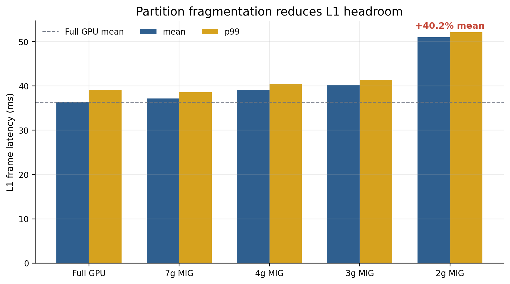
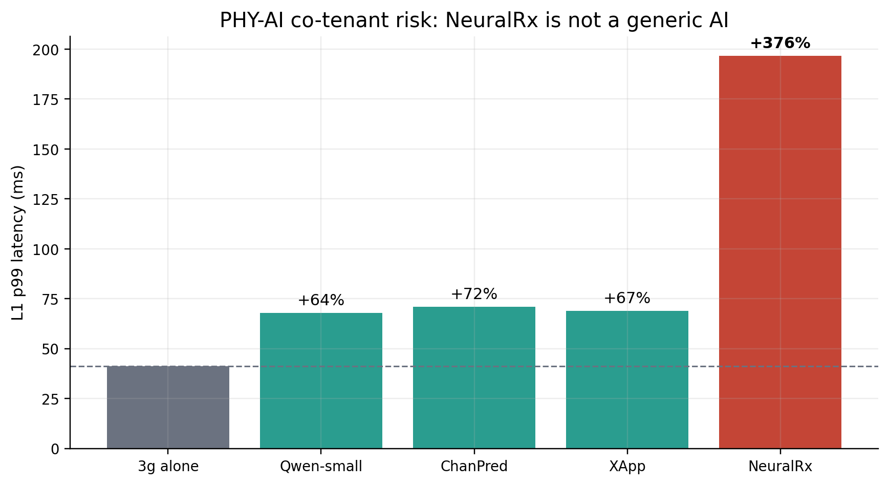
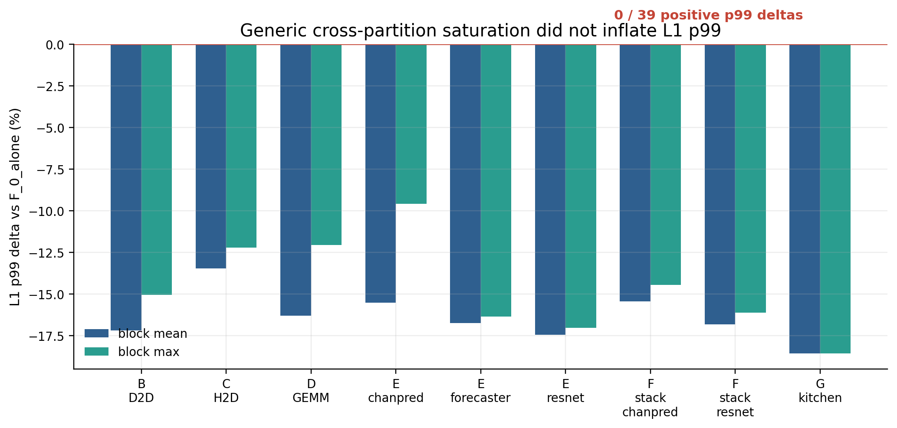
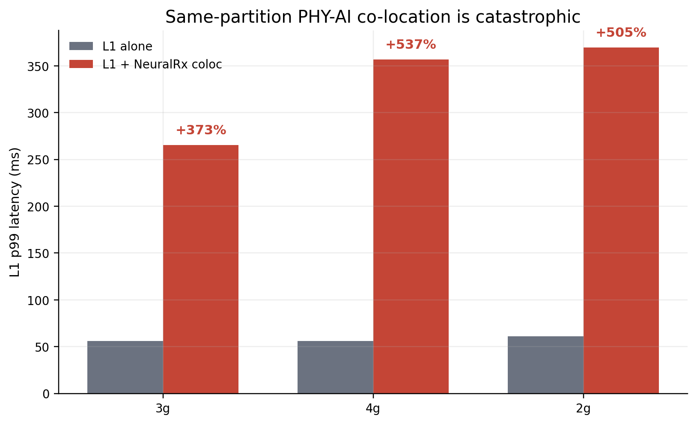
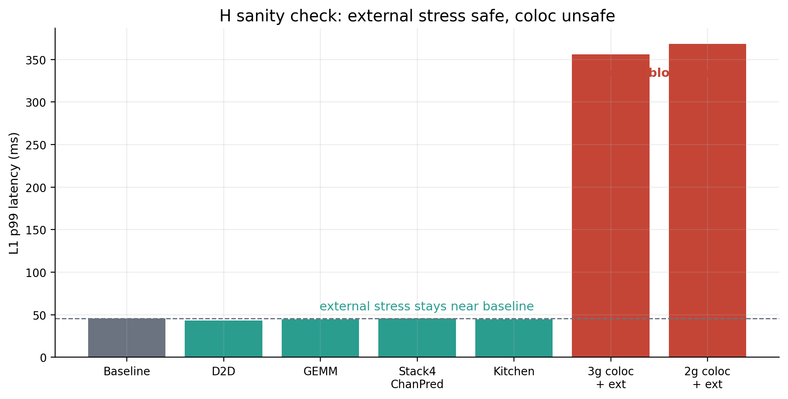
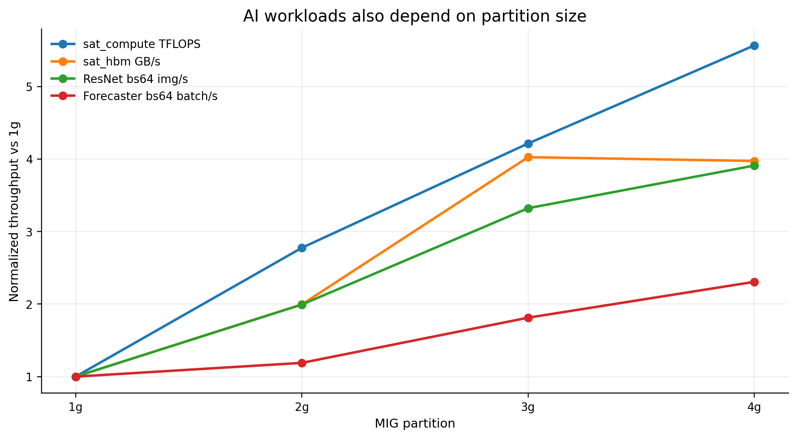
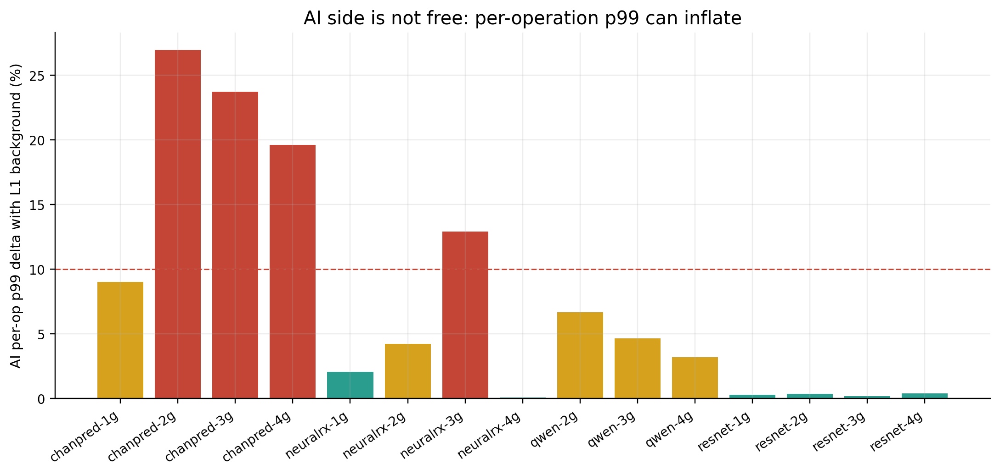
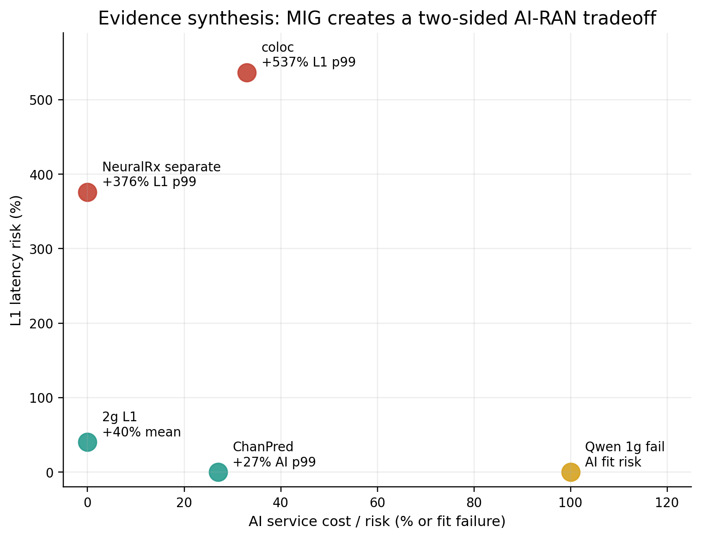

# MIG는 AI-RAN에 충분한 격리 추상화가 아니다: 시각 증거

생성일: 2026-06-01  
소스 범위: `cloudlab_results/results/20260531`, `cloudlab_results/results/20260601`

이 문서는 정리된 evidence를 그림 중심으로 다시 구성한 한국어 버전이다. 핵심 결론은 단순히 "L1만 격리하면 되는가"가 아니라, **L1 tail latency와 AI workload service quality를 동시에 만족해야 하는 AI-RAN에서 MIG의 정적 파티셔닝이 잘못된 제어 추상화**라는 점이다.

## 1. 작은 MIG slice는 L1 headroom을 줄인다

5/31 baseline에서 2g L1은 Full GPU v2 대비 mean latency가 약 +40.2% 증가한다. 7g/4g/3g는 비교적 안정적이지만, slice가 작아질수록 L1이 사용할 수 있는 SM/cache/memory-system headroom이 줄어든다. 이 결과는 "MIG가 capacity는 나눠주지만 real-time headroom까지 보장하지는 않는다"는 첫 번째 증거다.

## 2. NeuralRx는 generic AI가 아니라 PHY-AI co-tenant다

5/31 Phase4에서 3g L1 기준 NeuralRx co-tenant는 L1 p99를 약 +376%까지 키웠다. Qwen-small, ChanPred, XApp도 p99를 올리지만 NeuralRx는 훨씬 크다. 따라서 주장은 "모든 외부 AI가 항상 위험하다"가 아니라, **AI-RAN에서 실제로 붙이고 싶은 PHY-AI의 temporal behavior가 L1에 매우 위험할 수 있다**는 쪽이 더 정확하다.

## 3. 하지만 generic cross-partition saturation이 주범은 아니다

6/1 F saturation은 D2D/H2D/GEMM/ResNet/ChanPred/Forecaster/stack/kitchen stress를 걸었지만, non-baseline 39개 조건에서 positive L1 p99 inflation이 0개였다. 이 negative result가 중요하다. 우리의 주장은 "MIG의 cross-partition isolation이 전부 깨졌다"가 아니다. 오히려 generic saturation은 잘 막히기 때문에, AI-RAN failure가 더 선명해진다.

## 4. 같은 partition에 L1과 NeuralRx를 넣으면 p99가 폭발한다

6/1 G에서 same-partition L1+NeuralRx coloc은 3g p99 +372.6%, 4g p99 +536.7%, 2g p99 +504.5% 수준의 catastrophic tail을 만든다. 특히 4g에서도 해결되지 않는다. 즉 "큰 partition을 주면 coloc이 안전해진다"는 단순한 해법이 아니다.

## 5. H dual sanity check: 외부 stress는 안전, coloc은 위험

6/1 H에서는 같은 3g L1 기준으로 외부 D2D/GEMM/stack/kitchen stress는 p99가 baseline 근처에 머문다. 반면 coloc 조건은 p99가 350ms 이상으로 튄다. 이것은 원인을 더 좁혀준다. 문제는 sustained cross-partition HBM bandwidth 하나가 아니라, **same-partition temporal sharing, runtime scheduling, copy/kernel phase alignment**가 L1 deadline과 충돌하는 구조다.

## 6. AI workload도 partition에 자유롭지 않다

AI workload는 leftover slice에 그냥 고정 배치할 수 없다. Qwen-small은 1g에서 실패했고, Qwen-7B 계열은 4g에서만 의미 있게 실행된다. ResNet, sat_compute, sat_hbm, Forecaster는 partition size에 따라 throughput이 크게 달라진다. 따라서 L1을 보호하려고 큰 slice를 주면 AI capacity가 줄고, AI throughput을 보존하려면 L1 headroom이 줄어든다.

## 7. AI 평균 throughput이 안정적이어도 AI p99는 흔들린다

5/31 AI per-op latency에서 ChanPred는 2g 기준 p99 +27.0%, 3g +23.7%, 4g +19.6%까지 증가한다. NeuralRx 3g도 +12.9%, Qwen도 partition별로 +3.2~+6.7% 수준의 p99 증가가 보인다. 즉 throughput만 보면 양쪽이 안전해 보일 수 있지만, real-time 관점에서는 AI side도 tail-latency tradeoff를 가진다.

## 8. 최종 tradeoff

MIG에서 선택지는 모두 비용을 가진다.

- L1을 작은 slice에 두면 L1 headroom이 줄어든다.
- L1을 보호하려고 큰 slice를 주면 AI가 fit/throughput/p99 비용을 낸다.
- NeuralRx를 separate partition에 둬도 5/31에서는 L1 p99 risk가 컸다.
- L1과 NeuralRx를 같은 partition에 두면 6/1 G/H에서 p99가 catastrophic하게 폭발한다.
- 여러 AI workload를 나눠 배치하면 multi-AI phase behavior가 non-monotonic해진다.

이 마지막 그림은 단일 실험의 raw plot이 아니라 evidence synthesis plot이다. L1 축은 관측된 latency inflation을 사용했고, AI 축은 fit failure, AI p99 inflation, coloc NeuralRx throughput 감소 정황을 하나의 risk axis에 모은 것이다. 따라서 논문 본문에서는 앞선 개별 figure들을 primary evidence로 쓰고, 이 그림은 전체 tradeoff를 설명하는 summary figure로 쓰는 것이 안전하다.

## 결론

데이터 기반으로 가장 강한 주장은 다음이다.

> MIG는 generic cross-partition throughput isolation에는 효과적일 수 있다. 그러나 AI-RAN은 L1 tail latency와 AI workload service quality를 동시에 보장해야 한다. MIG는 static capacity slicing만 제공하므로, L1 headroom, AI fit/throughput/p99, PHY-AI co-location tail latency 사이의 tradeoff를 안전하게 제어하지 못한다. 따라서 MIG 단독으로는 real-time L1 + PHY-AI consolidation을 위한 충분한 isolation mechanism이 아니다.

## 생성된 source tables

- `data/partition_baseline.csv`
- `data/phase4_phy_ai_p99.csv`
- `data/f_saturation_block_summary.csv`
- `data/g_coloc_l1_p99.csv`
- `data/h_dual_p99.csv`
- `data/ai_throughput_parsed.csv`
- `data/ai_partition_scaling.csv`
- `data/ai_per_op_latency_parsed.csv`
- `data/ai_per_op_p99_delta.csv`
- `data/tradeoff_summary.csv`
