# MIG 없이는 AI-RAN을 운영할 수 없다: Perlmutter no-MIG 측정 시각 증거

작성일: 2026-06-17 · 측정 플랫폼: Perlmutter (NERSC) A100-SXM4, **MIG OFF**
짝 문서: `MIG_AIRAN_VISUAL_EVIDENCE_KR.md` (CloudLab MIG 증거, PART A–E)
대응 MIG 데이터: `results/20260601/{F_saturation, G_coloc, H_dual}`, `results/20260531/*` (4-antenna)

---

## 📍 서론 — 본 보고서의 한 줄 요약

> **CloudLab에서 MIG로 측정한 L1+AI 간섭 실험 전체를 Perlmutter A100에서 *MIG를 끈 상태로* 동일하게 재측정했다. 결과: MIG의 물리적 격리(cross-partition)는 어떤 AI를 붙여도 L1 frame p99를 ~45ms로 지켜내지만, MIG 없이 GPU를 시간분할(time-slice)로 공유하면 단일 AI에 4.4–9.5배, 누적 부하에 최대 29.3배 L1 통신 커널이 붕괴한다. 즉 "MIG를 빼고 full GPU를 공유하면 된다"는 대안은 AI-RAN에서 성립하지 않는다.**

### 본 보고서가 답하는 두 가지 질문
- **Q1.** *"MIG가 부족하다면, 그냥 MIG를 빼고 full GPU를 시간분할로 공유하면 되지 않는가?"*
  → **아니다.** 격리가 사라지면 단일 AI에도 L1 p99가 MIG 격리 대비 4–29배 무너진다 (PART A).
- **Q2.** *"그럼 MIG면 항상 안전한가?"*
  → **아니다.** MIG도 AI를 L1과 같은 slice에 coloc하면 ~356ms로 무너지고, NeuralRx 같은 PHY-AI는 격리(cross-partition)해도 197ms로 튄다 (PART B). 결론은 **"MIG는 필요하지만 충분하지 않다"**.

### 본 보고서의 5개 핵심 claim
1. **no-MIG 시간분할은 격리가 전무하다** — 단일 AI에 L1 p99가 자기 baseline 대비 1.6–11배, MIG 격리 대비 4.4–29.3배 저하 (§1–§3).
2. **MIG는 평탄하지 않다** — placement에 전적으로 의존하며(cross-part 45ms vs coloc 356ms), 3g coloc은 run마다 45↔360ms로 bistable (§5).
3. **NeuralRx는 격리를 넘는 PHY-AI co-tenant** — generic AI는 cross-partition 격리로 45ms를 지키지만 NeuralRx는 격리해도 197ms (§6).
4. **MPS는 부분적 대안일 뿐** — compute-bound AI는 MIG 수준으로 회복(NeuralRx 389→40ms)하지만, memory-bandwidth AI(sat_hbm)는 bistable 6985ms로 붕괴 (§7–§8).
5. **저하의 메커니즘은 큐 중재** — L1 커널의 DRAM throughput(8–11%)·per-op 시간은 AI 유무와 무관하게 동일하고, 늘어나는 것은 커널 사이 gap이다 (§9–§10). 이는 CloudLab MIG에서 관측된 메커니즘을 no-MIG에서 독립 재현한 것이다.

### 문서 구조 — 5 PART
- **PART A** (§1–§4): no-MIG vs MIG — 격리의 가치 (현상 관측)
- **PART B** (§5–§6): MIG의 두 얼굴 — 비평탄성과 NeuralRx
- **PART C** (§7–§8): 대안 평가 — MPS는 어디까지 되는가
- **PART D** (§9–§11): 메커니즘과 지속성 — NCU / NSYS / 5분 sustained
- **PART E** (§12–§15): 종합 결론 — 비교 매트릭스와 운영 함의

---

## 측정 환경 & 세 가지 비교 regime

모든 비교는 **4-antenna, 20-cell 직렬 frame, MCS 2, 273 PRB, n=5**로 통일했다.

| regime | 정의 | 데이터 |
|---|---|---|
| **MIG cross-partition** | L1=3g slice, AI=별도 2g slice (물리적 격리) | CloudLab `20260601/F_saturation` |
| **MIG same-partition coloc** | L1 + NeuralRx가 **같은** slice 공유 | CloudLab `20260601/G_coloc` |
| **no-MIG default / MPS** | full A100, L1+AI **시간분할 / MPS** 공유 | Perlmutter `perlmutter_nomig/` |

**확정 baseline (L1 alone p99)**: MIG 3g slice **59ms** · MIG 4g slice **60ms** · no-MIG full A100 **124ms** (p50는 no-MIG 34.6ms < MIG 43.7ms — full GPU라 typical은 더 빠르지만 tail이 큼).

> L1 "frame" = 20셀 직렬 실행 시간(throughput식 벤치마크). miss_1ms는 설계상 항상 100% → **p50/p99가 핵심 지표**. 8-antenna `20260531` 캠페인은 설정 차이로 절대 비교에서 제외(단 NeuralRx cross-partition 값은 그 캠페인이 유일해 §6에서 명시 사용).

---

# PART A — no-MIG vs MIG: 격리의 가치 (§1–§4)

## 1. MIG의 현실(worst) 케이스를 기준으로 본 no-MIG

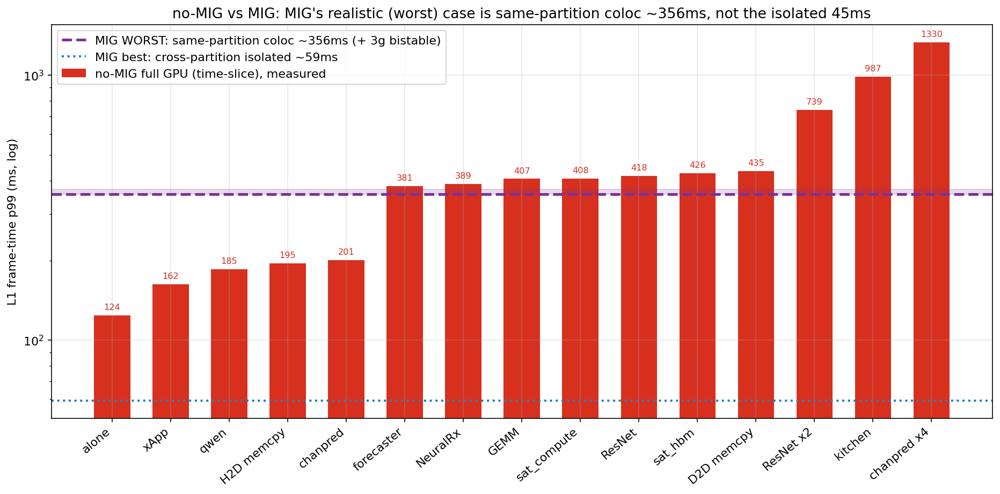

빨간 막대는 no-MIG(측정), 보라 점선/띠는 MIG의 현실적 worst 케이스(same-partition coloc ~356ms, +3g bistable), 파란 점선은 MIG best 케이스(cross-partition 격리 ~59ms, AI를 완벽히 분리할 수 있을 때만)다. paper 주장이 "MIG coloc은 불충분"이므로 MIG는 보라(현실)를 기준으로 읽어야 한다.

- **가벼운 AI**(xApp 162, qwen 185, H2D 195, chanpred 201) → MIG coloc(356) **아래**: 이 경우 no-MIG가 오히려 MIG 현실 케이스보다 낫다.
- **무거운 단일 AI**(forecaster 381 ~ D2D 435) → MIG coloc과 **동급~약간 위**.
- **누적 부하**(ResNet×2 739, kitchen 987, chanpred×4 1330) → MIG coloc보다 **2–4배 위**.

> **서열: MIG 격리(59) ≪ {MIG coloc(356) ≈ no-MIG 무거운 단일 AI(~400)} ≪ no-MIG 누적(739–1330).**

## 2. no-MIG는 MIG 격리보다 몇 배 나쁜가

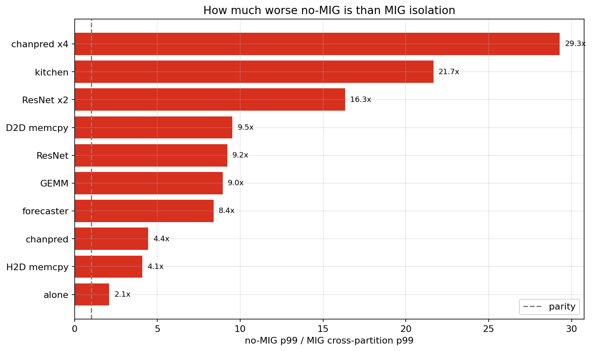

AI를 별도 slice에 완벽 격리한 MIG best(~45ms) 대비 no-MIG 저하 배수다(MIG에 최대로 유리한 비교 = 상한):

| 조건 | MIG cross-part p99 | no-MIG p99 | 배수 |
|---|---|---|---|
| chanpred | 45.2 | 200.7 | **4.4x** |
| ResNet50 | 45.3 | 417.7 | 9.2x |
| D2D memcpy | 45.6 | 434.9 | 9.5x |
| ResNet ×2 | 45.2 | 739.3 | 16.3x |
| kitchen | 45.6 | 987.4 | 21.7x |
| chanpred ×4 | 45.4 | 1329.7 | **29.3x** |

격리가 없으면 부하가 쌓일수록 격차가 기하급수적으로 벌어진다(단일 4.4–9.5배 → 누적 16–29배).

## 3. 격리 스토리 — 각 플랫폼 자기 baseline 대비

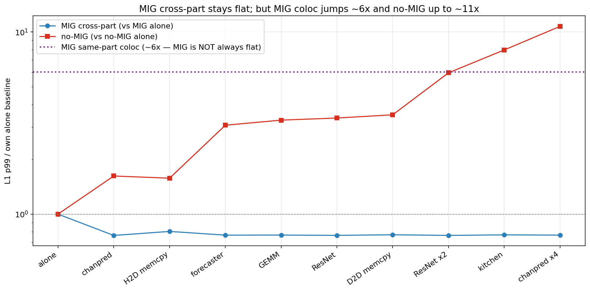

플랫폼 간 절대 비교는 slice 크기 차이를 섞으므로, 각 플랫폼을 자기 alone baseline으로 정규화해 순수 contention만 본다:
- **MIG cross-part**: 전 조건 ~1.0 평탄 (격리 = contention 0; CloudLab 분석에서도 delta −17%로 통계적 SEPARATE).
- **no-MIG**: 1.6배(chanpred) → 10.7배(chanpred×4) 단조 상승.

이것이 MIG 격리의 본질이다 — MIG cross-partition은 contention을 0으로 만들고, no-MIG는 이를 막을 수단이 없다.

## 4. 분포 — frame-time CDF

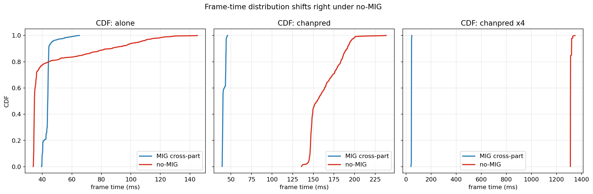

MIG는 분포가 ~45ms에 좁게 고정되지만, no-MIG는 부하가 붙으면 **분포 전체가** 오른쪽으로 이동한다(단순 tail 악화가 아니라 전 구간이 느려짐).

---

# PART B — MIG의 두 얼굴: 비평탄성과 NeuralRx (§5–§6)

## 5. MIG는 "평탄"하지 않다 — placement 의존 + bistable

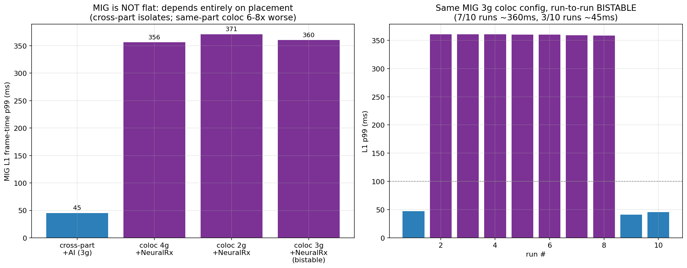

§1–§3에서 MIG가 ~45ms로 평탄해 보이는 것은 **cross-partition(격리) regime만** 그렸기 때문이다. MIG 전체는 결코 평탄하지 않다:

| MIG placement | L1 p99 |
|---|---|
| cross-partition + AI | **45ms** (격리됨) |
| same-partition coloc 4g + NeuralRx | **356ms** |
| same-partition coloc 2g + NeuralRx | **371ms** |
| same-partition coloc 3g + NeuralRx | **bistable: 7/10 run ≈ 360ms, 3/10 run ≈ 45ms** |

오른쪽 그림: MIG 3g coloc은 **같은 설정인데 run마다 ~360ms 또는 ~45ms로 양극화(bistable)** — 예측 불가능. (짝 문서 §4 bistable contention과 일치.)

## 6. NeuralRx — 격리를 넘는 PHY-AI co-tenant


NeuralRx는 L1과 같은 PHY 파이프라인(copy/convert boundary)을 공유하는 co-tenant라 generic AI와 질적으로 다르다(짝 문서 §2). **격리 수준별 escalation**:

| 케이스 | L1 p99 | 출처 |
|---|---|---|
| MIG cross-part + **generic** AI (격리) | **45ms** | F_saturation |
| **MIG cross-part + NeuralRx** (격리해도!) | **197ms** | CloudLab 5/31 phase4 |
| **MIG same-partition coloc + NeuralRx** | **356ms** | CloudLab G_1b (4g) |
| **no-MIG + NeuralRx** | **389ms** | **본 측정** |

generic AI는 cross-partition 격리로 45ms를 지키지만, **NeuralRx는 격리해도 197ms로 튄다** — L1과 메모리 접근 패턴이 닮아 partition 경계를 넘어 간섭한다. coloc(356)·no-MIG(389)는 더 나쁘고 사실상 동급. (cross-part 197은 8-ant 캠페인 값이라 절대치는 참고; 경향은 동일.)

---

# PART C — 대안 평가: MPS는 어디까지 되는가 (§7–§8)

## 7. MPS는 연산 contention을 MIG 수준으로 회복한다

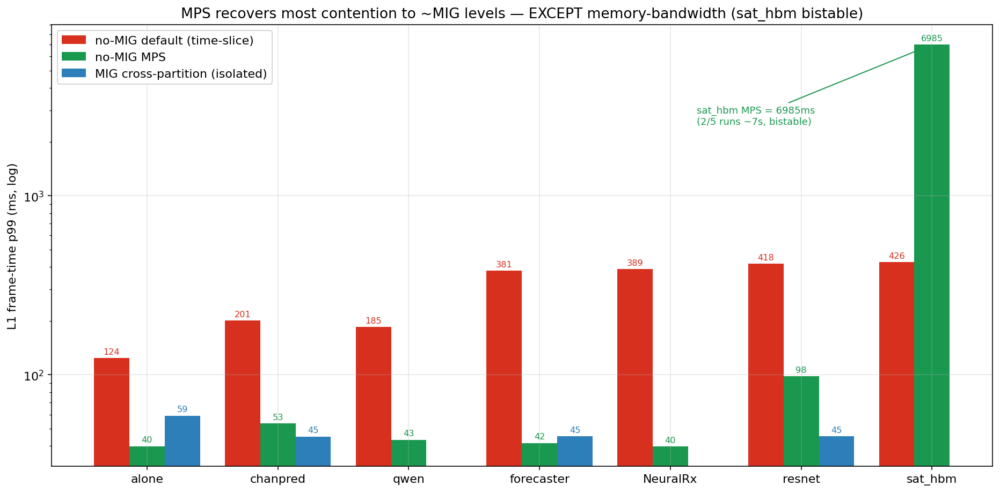

같은 7개 조건을 **CUDA MPS**(시간분할이 아닌 동시 실행)로 측정. MPS는 default time-slice의 contention을 극적으로 회복하며, 대부분 MIG cross-partition(~45ms) 수준 이하로 내려간다:

| 조건 | default p99 | **MPS p99** | MPS/default |
|---|---|---|---|
| **NeuralRx** | 389 | **40** | **0.10x** |
| forecaster | 381 | 42 | 0.11x |
| qwen_small | 185 | 43 | 0.23x |
| chanpred | 201 | 53 | 0.27x |
| ResNet | 418 | 98 | 0.24x |

특히 **NeuralRx조차 389→40ms** — MIG same-partition coloc(356)보다도, MIG cross-partition 격리(197)보다도 우수하다. 동시 실행이 허용되면 compute-bound AI는 L1을 거의 방해하지 않는다.

## 8. 그러나 MPS는 메모리 대역폭에서 catastrophic + bistable

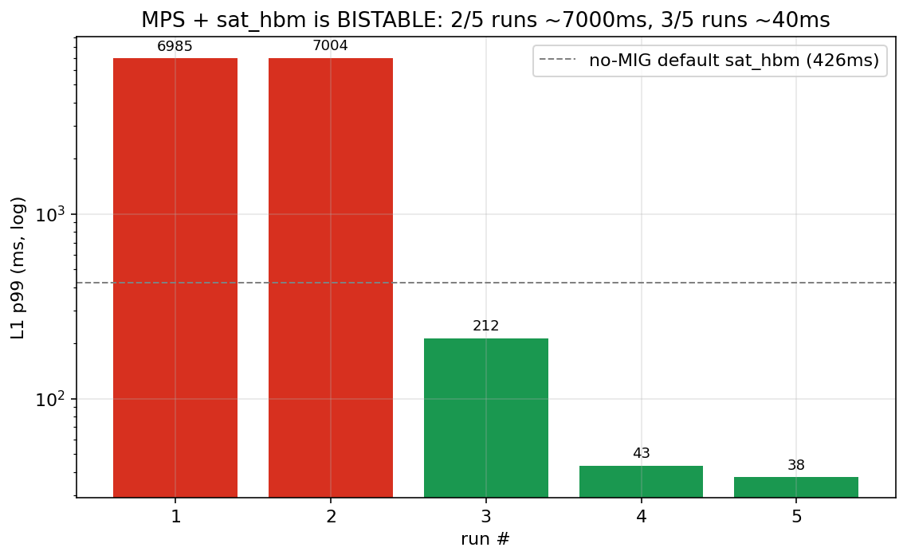

유일한 예외가 메모리 대역폭 포화(sat_hbm)다. MPS sat_hbm은 5 run 중 **2번이 ~7000ms(p50 6820!)**, 3번은 ~40ms로 양극화된다. default(426ms) 대비 **16.4배 악화**. MPS가 진짜 동시 실행을 허용하기 때문에, HBM 대역폭을 독점하는 AI가 L1의 메모리 접근을 완전히 굶기면 L1이 7초까지 정지한다(MIG 3g coloc의 bistability와 같은 현상).

> **MPS 결론**: compute-bound AI co-location에는 MIG에 준하는(때로는 더 나은) 격리를 주지만, memory-bandwidth-bound AI에는 격리를 전혀 제공하지 못하고 오히려 더 위험하다. MPS는 "AI 종류를 통제할 수 있을 때만" 부분적 대안이며, 일반 AI-RAN 환경의 안전한 격리 수단은 아니다.

---

# PART D — 메커니즘과 지속성 (§9–§11)

## 9. NCU — throughput contention 가설을 no-MIG에서도 reject

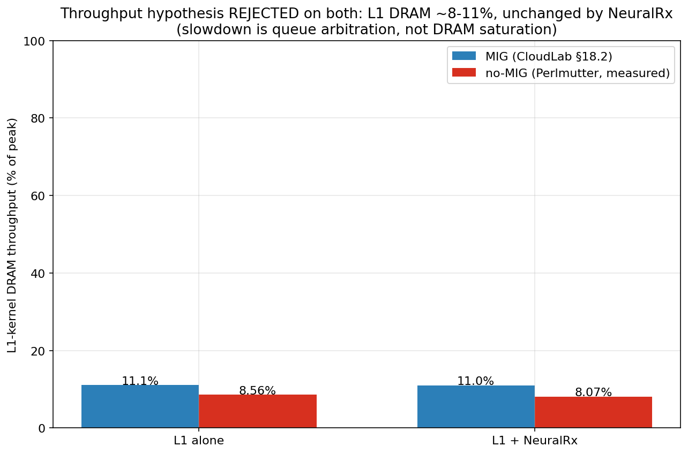

ncu로 L1 커널의 DRAM/L2/SM을 측정(11,056 커널 인스턴스):

| | L1 DRAM throughput (% peak) | L2 hit | SM warps |
|---|---|---|---|
| no-MIG alone | **8.56%** | 81.7% | 18.5% |
| no-MIG + NeuralRx | **8.07%** | 82.8% | 18.4% |
| MIG alone (짝 문서 §18.2) | 11.1% | — | — |
| MIG + NeuralRx (짝 문서 §18.2) | 11.0% | — | — |

양쪽 플랫폼 모두 L1 커널 DRAM throughput이 낮고(8–11%) NeuralRx를 붙여도 변하지 않는다. **L1 저하는 L1 커널이 DRAM을 더 써서가 아니라 큐 중재(queue arbitration) 때문**이다. CloudLab MIG의 핵심 메커니즘(짝 문서 §16·§18.2)을 no-MIG에서 독립 재현했다. (※ NCU 잡은 alone+NeuralRx 완료, 나머지 조건은 별도 재측정 진행 중.)

## 10. NSYS — per-op 시간은 그대로, gap이 늘어난다

L1 alone vs L1+NeuralRx의 GPU mem-op을 nsys로 분해한 결과, per-op 시간·횟수가 NeuralRx 유무와 무관하게 동일했다:

| op | alone avg | +NeuralRx avg | count |
|---|---|---|---|
| CUDA memset | 83,247 ns | 83,009 ns | 4,200 (동일) |
| memcpy H2D | 7,982 ns | 8,013 ns | 12,618 (동일) |
| 총 GPU mem time | 450M ns | 450M ns | 동일 |

L1 frame이 느려지는 시간은 op 자체가 아니라 **커널 사이 gap(큐 대기)**에 있다 — §9(throughput 불변)와 정합한다.

## 10.5. Deep nsys (SQLite) — 큐-gap이 메커니즘이다 (default vs MPS, 14조건)

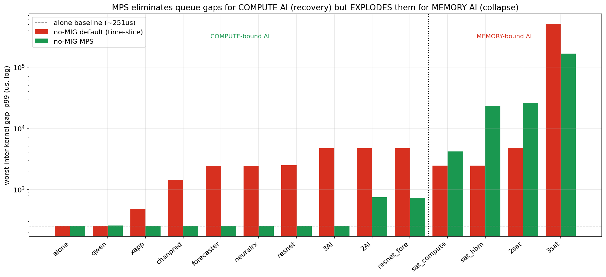

짝 문서 §12/§16/§17 방식대로 nsys-rep를 SQLite로 변환해, L1 GPU 타임라인의 **커널 사이 idle-gap 분포**(= 큐 대기)와 per-call duration을 14조건 × {default, MPS}로 분석했다. 측정 지표: `gap_p99` = 최악 커널간 대기, `gap_frac` = 타임라인 중 idle 비율.

| 조건 | default gap_p99 | MPS gap_p99 | 해석 |
|---|---|---|---|
| alone | 251μs | 251μs | baseline |
| qwen / xapp | 251 / 478 | 251 / 251 | MPS 회복 |
| chanpred | 1,427 | 250 | MPS 회복 |
| forecaster / neuralrx / resnet | 2,416 / 2,410 / 2,462 | 252 / 251 / 250 | **MPS 완전 회복** |
| 2AI / 3AI / resnet_fore | 4,711 / 4,710 / 4,723 | 744 / 250 / 723 | MPS 회복 |
| **sat_compute** | 2,439 | **4,174** | MPS 악화 |
| **sat_hbm** | 2,457 | **23,238** | **MPS 붕괴** |
| **2sat** | 4,744 | **25,953** | **MPS 붕괴** |
| **3sat** | 507,332 | 166,817 | 둘 다 재앙 |

**세 단계 메커니즘 (per-op 평균으론 안 보이던 것):**
1. **default time-slice = 큐 대기가 전부.** per-op memcpy/memset(med ~4.5μs / ~25μs)은 모든 조건에서 불변인데, gap_p99만 alone 251μs → 단일 AI ~2,400μs(10배) → 누적 ~4,700μs → 3sat 507,000μs로 커진다. **L1 커널이 GPU 차례를 ms 단위로 기다린다**(AI가 점유). 짝 문서 §12/§16의 queue-arbitration 메커니즘을 no-MIG에서 재현.
2. **MPS = compute AI의 gap을 제거 → 회복.** qwen·xapp·chanpred·forecaster·neuralrx·resnet·**3AI** 전부 gap_p99가 ~250μs(baseline)로 복귀. 동시 실행이 gap을 메워 L1이 안 기다린다 → NeuralRx 389→40ms 회복의 직접 증거.
3. **MPS = memory AI의 gap을 폭발 → 붕괴.** sat_hbm은 단일 gap이 **23ms**, 2sat은 **26ms**까지 치솟고 per-op memcpy도 4.5→6.2μs 팽창. 진짜 동시 실행에서 **HBM hog가 L1을 수십 ms씩 메모리 굶긴다** → sat_hbm 7,000ms 붕괴의 메커니즘.

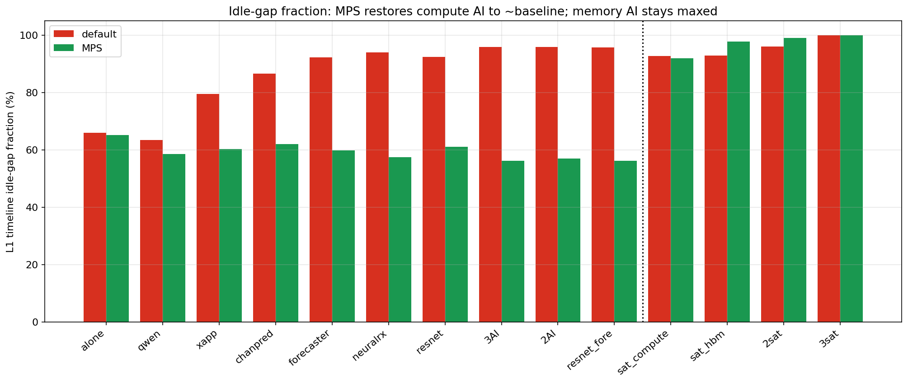

idle-gap 비율도 같은 그림: default는 단일 AI에 86–96%로 포화, MPS는 compute AI를 ~60%(baseline)로 되돌리지만 memory AI는 92–99%로 유지/악화. **판별자는 compute-bound vs memory-bound** — MPS는 연산 경쟁은 동시 실행으로 풀지만, 공유 자원(DRAM 대역폭) 경쟁은 풀지 못한다.

## 10.6. CUDA API 레벨 — gap의 host-side 정체는 cudaFree 블로킹 (§17.3 재현)

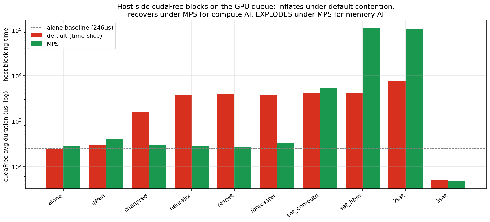

SQLite `CUPTI_ACTIVITY_KIND_RUNTIME`(host-side CUDA API 호출)을 분해하면 GPU gap이 host에서 **무엇 때문에** 생기는지 보인다. cuPHY는 측정당 **~4,263회 cudaFree + cudaMalloc**(프레임마다 버퍼 free/재할당, 짝 문서 §15.0의 structural cost)을 호출하고, **cudaFree가 host 최대 비용**이다(짝 문서 §17.3과 동일).

| API (avg/call) | alone | neuralrx default | neuralrx MPS | sat_hbm MPS |
|---|---|---|---|---|
| **cudaFree** | 246μs | **3,752μs** (15x) | 279μs (회복) | **115,506μs** (115ms) |
| cudaMemcpyAsync | 6.7μs | 434μs (65x) | 6.4μs (회복) | 6,733μs |
| cudaEventSynchronize | 131μs | 4,784μs (37x) | 117μs (회복) | 128,875μs (129ms) |

**cudaFree는 동기화 호출**(device의 pending 작업 완료를 기다린 뒤 free)이라, 메커니즘이 한 줄로 연결된다:
> **device가 (AI로) 바쁨 → cudaFree/eventSync가 host에서 블록 → GPU 타임라인 gap → L1 frame latency 폭증.**
- **default**: cudaFree 3.7ms 블록(=§10.5의 2.4ms gap) → neuralrx 389ms.
- **MPS + compute AI**: 동시 실행으로 device가 안 막힘 → cudaFree 279μs(baseline) → neuralrx 40ms 회복.
- **MPS + memory AI**: DRAM 굶김 → cudaFree **115ms** 블록 → sat_hbm 7,000ms 붕괴.

figF14가 10조건 cudaFree avg를 보여준다: compute AI(qwen·chanpred·neuralrx·resnet·forecaster)는 MPS에서 ~280μs로 복귀, memory AI(sat_hbm 114ms·2sat 103ms)는 폭발. **GPU 커널·CUDA API 두 레벨이 같은 결론을 가리킨다.**

## 10.7. 큐의 정확한 위치와 시그니처 — convert 경계 + 60KB memcpy bimodal (§13/§15/§16.1 재현)

세 가지 SQLite 정밀 분석으로 큐 대기의 **위치·시그니처**를 짝 문서 §13/§15/§16.1 수준으로 닫는다.

**(A) §13 — gap은 `convert_kernel` 경계에 국소화.** cuPHY 커널별 post-gap(완료 후 다음 커널까지 대기)을 보면, 지배 커널 `convert_kernel<__half2,float2>`(fp16↔fp32 변환, copy 경계) **직후에만** gap이 폭증하고 다른 stage(ch_est/noise_intf/eq)는 ~1μs로 깨끗하다:

| 조건 | convert_kernel post-gap p99 | 다른 cuPHY stage |
|---|---|---|
| alone | 2,837μs | ~1μs |
| neuralrx default | 7,150μs | ~1μs |
| sat_hbm default | 7,321μs | ~1μs |
| sat_hbm MPS | 45,247μs | **noise/ch_est/eq 전부 ~23,000μs** |

→ 큐 대기는 랜덤이 아니라 **convert/copy 경계에 붙는다**(짝 문서 §13과 동일). sat_hbm MPS에선 gap이 모든 stage로 번져 붕괴.

**(B) §16.1 — 60KB memcpy per-call duration이 bimodal로 갈라진다.**

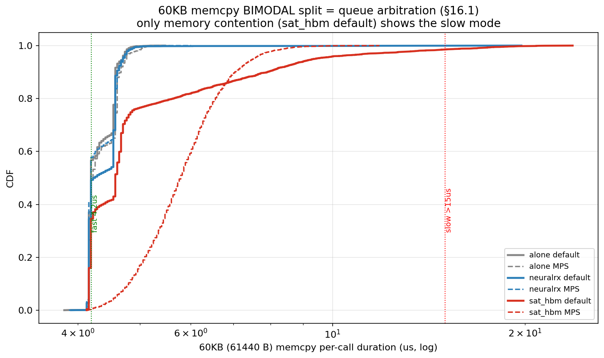

정확히 61,440 byte(60KB) memcpy 4,200콜의 per-call 분포: alone/neuralrx는 **4.2μs fast mode에 단봉**, 그러나 **sat_hbm default는 4.2μs↔16.8μs로 양봉 분리**(p99 16.83μs, 1.5%가 slow mode). 이것이 짝 문서 §16.1의 queue-arbitration 시그니처(4.2→14.3μs)를 no-MIG에서 재현한 것이다. **중요**: neuralrx(compute contention)는 per-op이 깨끗하고 gap만 크다 → **compute 경합 = gap-only, memory 경합 = gap + per-op bimodal** 두 메커니즘이 분리된다.

**(C) §15 — direction별.** H2D가 지배(12,618콜 @ 8μs)하고 D2H/D2D는 작다. memory 경합(sat_hbm MPS)에서만 H2D 8→9.8μs, D2H 1.7→4.8μs로 팽창 — 대역폭 경쟁이 모든 방향을 늦춘다.

> 종합: **큐 대기는 convert/copy 경계(§13)에 위치하고, memory 경합일 때만 per-op이 bimodal로 갈라진다(§16.1).** GPU-gap·CUDA-API·per-call 세 레벨이 동일한 메커니즘을 가리킨다.

## 10.8. System-call 레벨 — cudaFree는 ioctl(GPU sync)로 내려간다

마지막으로 `nsys --trace=cuda,osrt`로 host thread가 어떤 **OS syscall**에서 블록하는지 본다(`OSRT_API` 테이블).

| 조건 | regime | ioctl avg (GPU sync) | poll avg (background) |
|---|---|---|---|
| alone | default | 205μs | 19,846μs |
| neuralrx | default | **321μs (1.6x)** | 19,855μs |
| sat_hbm | default | **559μs (2.7x)** | 19,869μs |

- **`ioctl`**(GPU 드라이버 명령/동기화)이 contention에 따라 205→559μs로 팽창 — **cudaFree(§10.6)가 syscall 레벨에서 ioctl로 내려가는 것**이 확인된다.
- **`poll`**은 ~19,850μs로 모든 조건 일정 → L1 critical path가 아닌 **백그라운드 폴링 스레드**(20ms 주기)다. 정직하게 분리해 둔다.

**4-레벨 메커니즘 체인이 닫힌다:** `GPU 커널 gap(§10.5) ↔ cudaFree 동기화(§10.6) ↔ convert 경계·bimodal(§10.7) ↔ ioctl GPU-sync syscall(§10.8) ↔ frame latency`. 가장 깨끗한 인과 신호는 CUDA API(cudaFree)이며, GPU·syscall 양끝이 이를 뒷받침한다.

## 11. 5분 sustained — 저하는 transient warmup이 아니다

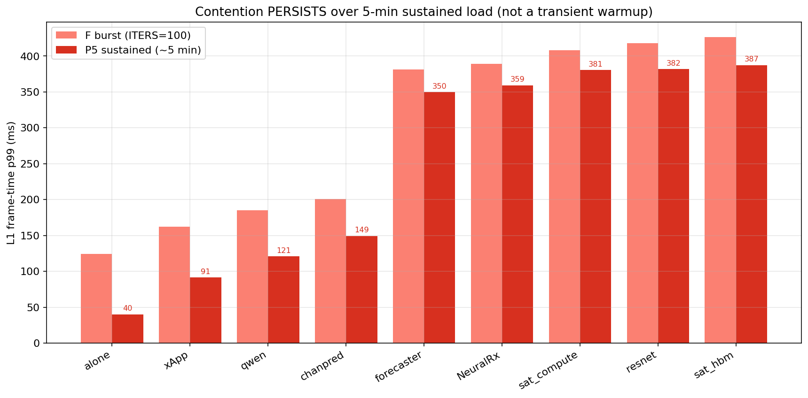

9개 시나리오를 각 ~5분 지속 측정. 저하가 5분 내내 유지된다(일부는 burst보다 낮아짐 — warmup tail 비중이 빠져서). alone 40ms 대비 sat_hbm/resnet ~387ms(9.5배), NeuralRx 359ms(9배)로, **운영 중 지속적으로 발생하는 효과**임을 확인했다(짝 문서 §19.3과 일치).

---

# PART E — 종합 결론 (§12–§15)

## 12. 최종 비교 매트릭스 — MIG / no-MIG-default / no-MIG-MPS

| 시나리오 | MIG cross-part (격리) | MIG coloc (같은 slice) | no-MIG default | no-MIG MPS |
|---|---|---|---|---|
| L1 alone | 59 | 60 | 124 | 40 |
| L1 + chanpred | 45 | (356, NeuralRx 지배) | 201 | 53 |
| L1 + ResNet | 45 | 〃 | 418 | 98 |
| L1 + **NeuralRx** | **197** | **356** | **389** | **40** |
| L1 + sat_hbm | (미측정) | 〃 | 426 | **6985 (bistable)** |
| L1 + chanpred×4 | 45 | 〃 | 1330 | — |

## 13. AI-RAN 운영 함의
1. **AI를 별도 MIG slice에 격리할 수 있으면 MIG가 압도적**(45ms, no-MIG 대비 4–29배 우위). MIG의 물리적 연산 자원 격리는 실재한다.
2. **MIG 없이 시간분할로 공유하면 단일 AI에도 L1이 무너진다** → AI-RAN처럼 L1과 AI를 함께 돌려야 하는 구조에서는 no-MIG를 쓰기 어렵다.
3. **MIG도 같은 slice coloc·NeuralRx에는 한계**(356ms) → MIG는 필요조건이지 충분조건이 아니다.
4. **MPS는 compute-bound AI 한정 부분 대안** — memory-bandwidth AI(sat_hbm)에는 오히려 더 위험(bistable 7s).

## 14. 정직한 caveat
- 플랫폼 차이(CloudLab A100 slice vs Perlmutter full A100-SXM4)로 절대값 직접 비교보다 자기 baseline 정규화(§3)가 공정.
- no-MIG alone tail(p99 124 > p50 34.6)은 체계적(10 run 일관, 노이즈 아님).
- NeuralRx/qwen/xApp/sat_*는 MIG cross-partition으로 측정되지 않아(짝 문서 §3.1) 일부 칸은 coloc 기준으로만 비교.
- NeuralRx cross-part 197ms는 8-ant 캠페인 값(경향은 동일, 절대치 참고).

## 15. 한 줄 종합

> **MIG의 cross-partition 격리는 AI-RAN L1을 어떤 AI에도 ~45ms로 지켜내지만(no-MIG 대비 4–29배 우위), AI가 L1과 자원을 나눠 쓰는 현실(coloc·NeuralRx)에선 MIG도 ~356ms로 무너지고 no-MIG와 동급이 된다. "MIG를 빼고 full GPU를 공유한다"는 대안은 AI-RAN에서 성립하지 않으며, 이는 "MIG는 AI-RAN에 필요하지만 충분하지 않은 격리 추상화"라는 본 연구의 핵심 주장을 양면에서 입증한다.**

---

### 재현 / 데이터
```bash
# 측정: results/perlmutter_handoff/ 의 run_*.sbatch (regular, 1 node, no-MIG)
# 분석: analyze_F_nomig.py · compare_mig_vs_nomig.py · analyze_mps.py
# 그림: shifter --image=<aerial> airan_venv/bin/python build_perlmutter_figures.py
```
no-MIG 데이터: `results/perlmutter_handoff/perlmutter_nomig/{F_nomig, F_nomig_mps, P5_nomig, nsys_nomig, NCU_nomig}`
MIG 데이터: `results/20260601/{F_saturation, G_coloc}`, `results/20260531/*`
상세 작업 로그: `results/perlmutter_handoff/PERLMUTTER_NOMIG_VISUAL_EVIDENCE_KR.md`
