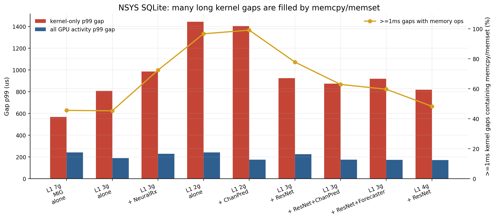
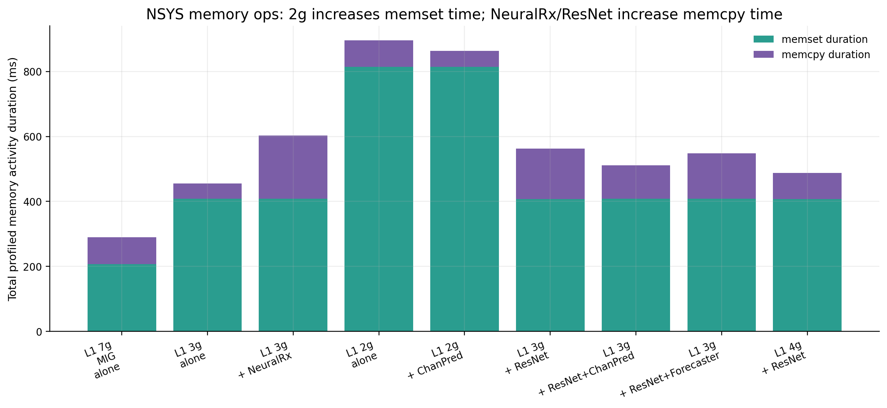

# NSYS Deep Root-Cause Fast Pass

## Kernel-only gap vs all GPU activity gap

핵심은 `kernel_gap_p99_us`와 `all_activity_gap_p99_us`의 차이다. 차이가 크면 kernel 사이가 진짜 idle이 아니라 memcpy/memset으로 채워졌다는 뜻이다.

| condition | runs | kernel_busy_pct | all_activity_busy_pct | kernel_gap_p99_us | all_activity_gap_p99_us | big_kernel_gaps_ge_1ms | big_gaps_with_mem_pct | mean_mem_fraction_in_big_gaps_pct |
| --- | --- | --- | --- | --- | --- | --- | --- | --- |
| L1 2g alone | 3 | 15.6 | 47.7 | 1443.8 | 242.6 | 682.0 | 96.7 | 87.5 |
| L1 3g + ResNet | 3 | 17.4 | 41.3 | 925.1 | 226.3 | 69.3 | 77.8 | 43.6 |
| L1 7g MIG alone | 3 | 22.7 | 35.7 | 567.3 | 242.2 | 43.0 | 45.6 | 2.2 |
| L1 3g + ResNet+ChanPred | 3 | 19.0 | 42.8 | 874.1 | 175.2 | 37.0 | 62.9 | 24.3 |
| L1 3g + ResNet+Forecaster | 3 | 18.7 | 43.9 | 919.0 | 172.5 | 10.3 | 59.7 | 16.5 |
| L1 4g + ResNet | 3 | 18.8 | 41.7 | 818.6 | 171.1 | 10.7 | 48.3 | 11.4 |
| L1 2g + ChanPred | 3 | 16.9 | 51.2 | 1403.5 | 175.1 | 650.0 | 99.1 | 92.2 |
| L1 3g alone | 3 | 18.8 | 39.7 | 807.9 | 189.1 | 19.3 | 45.3 | 3.6 |
| L1 3g + NeuralRx | 3 | 16.3 | 40.5 | 985.7 | 228.9 | 83.0 | 72.4 | 37.8 |

## Top long-gap transitions

### L1 2g + ChanPred

| transition | count | p50_gap_us | p99_gap_us | max_gap_ms | mean_mem_us_inside | mean_mem_fraction_pct |
| --- | --- | --- | --- | --- | --- | --- |
| convert_kernel -> copy_complex64_kernel | 3 | 119617.6 | 120639.5 | 120.6 | 9.7 | 0.0 |
| convert_kernel -> eq_coef | 2 | 81317.8 | 81317.8 | 81.3 | 18.9 | 0.6 |
| convert_kernel -> copy_float16_kernel | 3 | 79273.8 | 79522.8 | 79.5 | 0.0 | 0.0 |
| ch_est_filter -> copy_complex64_kernel | 3 | 74195.5 | 75246.6 | 75.2 | 0.0 | 0.0 |
| copy_complex64_kernel -> copy_float32_kernel | 6 | 73290.9 | 73716.2 | 73.7 | 0.0 | 0.0 |
| convert_kernel -> convert_kernel | 6 | 69000.1 | 71271.5 | 71.3 | 24.8 | 0.0 |
| copy_complex64_kernel -> convert_kernel | 8 | 615.5 | 2931.4 | 2.9 | 0.0 | 0.0 |
| copy_float32_kernel -> convert_kernel | 2 | 2371.0 | 2371.0 | 2.4 | 0.0 | 0.0 |

### L1 2g alone

| transition | count | p50_gap_us | p99_gap_us | max_gap_ms | mean_mem_us_inside | mean_mem_fraction_pct |
| --- | --- | --- | --- | --- | --- | --- |
| convert_kernel -> copy_complex64_kernel | 3 | 115527.7 | 117223.8 | 117.2 | 10.9 | 0.0 |
| convert_kernel -> noise_intf_est | 32 | 1521.6 | 91139.1 | 91.1 | 117.0 | 7.9 |
| convert_kernel -> copy_float16_kernel | 3 | 75758.1 | 82150.5 | 82.2 | 0.0 | 0.0 |
| copy_complex64_kernel -> copy_float32_kernel | 6 | 74224.4 | 74585.8 | 74.6 | 0.0 | 0.0 |
| ch_est_filter -> copy_complex64_kernel | 3 | 72985.4 | 74243.3 | 74.2 | 0.0 | 0.0 |
| convert_kernel -> convert_kernel | 6 | 70051.6 | 72895.1 | 72.9 | 32.6 | 0.0 |
| copy_float32_kernel -> convert_kernel | 26 | 2005.4 | 39580.4 | 39.6 | 0.0 | 0.0 |
| convert_kernel -> eq_coef | 26 | 3426.3 | 37847.1 | 37.8 | 32.1 | 1.4 |

### L1 3g + NeuralRx

| transition | count | p50_gap_us | p99_gap_us | max_gap_ms | mean_mem_us_inside | mean_mem_fraction_pct |
| --- | --- | --- | --- | --- | --- | --- |
| convert_kernel -> copy_complex64_kernel | 3 | 109402.1 | 109969.6 | 110.0 | 10.0 | 0.0 |
| copy_complex64_kernel -> convert_kernel | 58 | 1377.3 | 76266.6 | 76.3 | 0.0 | 0.0 |
| ch_est_filter -> copy_complex64_kernel | 3 | 73877.8 | 73992.3 | 74.0 | 0.0 | 0.0 |
| convert_kernel -> copy_float16_kernel | 3 | 72311.1 | 72618.2 | 72.6 | 0.0 | 0.0 |
| copy_complex64_kernel -> copy_float32_kernel | 6 | 70640.6 | 72177.0 | 72.2 | 0.0 | 0.0 |
| convert_kernel -> convert_kernel | 6 | 69468.3 | 70854.0 | 70.9 | 41.0 | 0.1 |
| convert_kernel -> noise_intf_est | 36 | 1387.5 | 69276.6 | 69.3 | 119.2 | 13.2 |
| convert_kernel -> eq_coef | 36 | 1380.1 | 62632.5 | 62.6 | 92.6 | 10.0 |

### L1 3g + ResNet

| transition | count | p50_gap_us | p99_gap_us | max_gap_ms | mean_mem_us_inside | mean_mem_fraction_pct |
| --- | --- | --- | --- | --- | --- | --- |
| convert_kernel -> copy_complex64_kernel | 3 | 108639.1 | 114277.3 | 114.3 | 9.6 | 0.0 |
| convert_kernel -> noise_intf_est | 17 | 1578.2 | 89216.6 | 89.2 | 64.7 | 4.6 |
| convert_kernel -> copy_float16_kernel | 3 | 73000.4 | 76796.3 | 76.8 | 0.0 | 0.0 |
| ch_est_filter -> copy_complex64_kernel | 3 | 71871.5 | 74365.8 | 74.4 | 0.0 | 0.0 |
| copy_complex64_kernel -> copy_float32_kernel | 7 | 72244.4 | 73796.2 | 73.8 | 0.0 | 0.0 |
| convert_kernel -> eq_coef | 19 | 2336.6 | 71374.1 | 71.4 | 32.7 | 2.2 |
| convert_kernel -> convert_kernel | 6 | 69961.5 | 70298.2 | 70.3 | 31.5 | 0.0 |
| copy_float32_kernel -> convert_kernel | 12 | 1872.3 | 39117.7 | 39.1 | 0.0 | 0.0 |

### L1 3g + ResNet+ChanPred

| transition | count | p50_gap_us | p99_gap_us | max_gap_ms | mean_mem_us_inside | mean_mem_fraction_pct |
| --- | --- | --- | --- | --- | --- | --- |
| convert_kernel -> copy_complex64_kernel | 3 | 114152.1 | 114818.0 | 114.8 | 10.7 | 0.0 |
| ch_est_filter -> copy_complex64_kernel | 3 | 74815.8 | 74888.7 | 74.9 | 0.0 | 0.0 |
| convert_kernel -> copy_float16_kernel | 3 | 74216.4 | 74349.4 | 74.3 | 0.0 | 0.0 |
| copy_complex64_kernel -> copy_float32_kernel | 6 | 71955.5 | 73309.9 | 73.3 | 0.0 | 0.0 |
| convert_kernel -> convert_kernel | 6 | 70005.6 | 71214.8 | 71.2 | 30.3 | 0.0 |
| copy_float32_kernel -> copy_complex64_kernel | 2 | 1488.6 | 1488.6 | 1.5 | 3.7 | 0.4 |
| convert_kernel -> noise_intf_est | 2 | 1224.9 | 1224.9 | 1.2 | 96.0 | 9.1 |
| convert_kernel -> ch_est_pre | 1920 | 745.6 | 1019.4 | 1.0 | 690.7 | 88.8 |

### L1 3g + ResNet+Forecaster

| transition | count | p50_gap_us | p99_gap_us | max_gap_ms | mean_mem_us_inside | mean_mem_fraction_pct |
| --- | --- | --- | --- | --- | --- | --- |
| convert_kernel -> copy_complex64_kernel | 3 | 105968.3 | 112247.1 | 112.2 | 9.8 | 0.0 |
| ch_est_filter -> copy_complex64_kernel | 3 | 73777.8 | 78704.0 | 78.7 | 0.0 | 0.0 |
| convert_kernel -> copy_float16_kernel | 3 | 73186.3 | 77349.0 | 77.3 | 0.0 | 0.0 |
| copy_complex64_kernel -> copy_float32_kernel | 6 | 70515.7 | 73714.4 | 73.7 | 0.0 | 0.0 |
| convert_kernel -> convert_kernel | 6 | 71121.4 | 72379.6 | 72.4 | 40.1 | 0.1 |
| convert_kernel -> noise_intf_est | 1 | 1169.9 | 1169.9 | 1.2 | 62.5 | 5.3 |
| convert_kernel -> ch_est_pre | 1920 | 845.9 | 992.8 | 2.0 | 732.8 | 89.7 |
| copy_complex64_kernel -> convert_kernel | 5 | 583.5 | 991.3 | 1.0 | 0.0 | 0.0 |

### L1 3g alone

| transition | count | p50_gap_us | p99_gap_us | max_gap_ms | mean_mem_us_inside | mean_mem_fraction_pct |
| --- | --- | --- | --- | --- | --- | --- |
| convert_kernel -> convert_kernel | 6 | 71182.1 | 120616.5 | 120.6 | 22.2 | 0.0 |
| convert_kernel -> copy_complex64_kernel | 3 | 116059.2 | 116854.6 | 116.9 | 9.5 | 0.0 |
| convert_kernel -> copy_float16_kernel | 3 | 74686.3 | 80284.5 | 80.3 | 0.0 | 0.0 |
| ch_est_filter -> copy_complex64_kernel | 3 | 76615.2 | 77921.8 | 77.9 | 0.0 | 0.0 |
| copy_complex64_kernel -> copy_float32_kernel | 6 | 73469.4 | 73966.2 | 74.0 | 0.0 | 0.0 |
| copy_complex64_kernel -> convert_kernel | 15 | 2000.6 | 16564.9 | 16.6 | 0.0 | 0.0 |
| convert_kernel -> eq_coef | 7 | 966.3 | 4808.2 | 4.8 | 17.4 | 1.6 |
| copy_float32_kernel -> convert_kernel | 7 | 1469.0 | 4004.0 | 4.0 | 0.0 | 0.0 |

### L1 4g + ResNet

| transition | count | p50_gap_us | p99_gap_us | max_gap_ms | mean_mem_us_inside | mean_mem_fraction_pct |
| --- | --- | --- | --- | --- | --- | --- |
| convert_kernel -> copy_complex64_kernel | 3 | 114923.6 | 115505.0 | 115.5 | 10.3 | 0.0 |
| ch_est_filter -> copy_complex64_kernel | 3 | 72656.1 | 75945.3 | 75.9 | 0.0 | 0.0 |
| convert_kernel -> copy_float16_kernel | 3 | 74504.0 | 74794.0 | 74.8 | 0.0 | 0.0 |
| copy_complex64_kernel -> copy_float32_kernel | 7 | 70512.0 | 73741.4 | 73.7 | 0.0 | 0.0 |
| convert_kernel -> convert_kernel | 6 | 68292.3 | 71829.1 | 71.8 | 30.2 | 0.0 |
| copy_float32_kernel -> convert_kernel | 1 | 2959.0 | 2959.0 | 3.0 | 0.0 | 0.0 |
| copy_complex64_kernel -> convert_kernel | 4 | 602.7 | 2741.9 | 2.7 | 0.0 | 0.0 |
| convert_kernel -> ch_est_pre | 1920 | 687.9 | 950.2 | 1.8 | 667.6 | 89.1 |

### L1 7g MIG alone

| transition | count | p50_gap_us | p99_gap_us | max_gap_ms | mean_mem_us_inside | mean_mem_fraction_pct |
| --- | --- | --- | --- | --- | --- | --- |
| convert_kernel -> copy_complex64_kernel | 3 | 114867.7 | 117175.2 | 117.2 | 9.7 | 0.0 |
| convert_kernel -> copy_float16_kernel | 3 | 75546.4 | 76986.5 | 77.0 | 0.0 | 0.0 |
| ch_est_filter -> copy_complex64_kernel | 3 | 73554.5 | 74690.2 | 74.7 | 0.0 | 0.0 |
| copy_complex64_kernel -> copy_float32_kernel | 7 | 71235.0 | 73753.6 | 73.8 | 0.0 | 0.0 |
| convert_kernel -> convert_kernel | 6 | 70512.0 | 70936.5 | 70.9 | 30.3 | 0.0 |
| copy_complex64_kernel -> convert_kernel | 44 | 1936.2 | 56155.2 | 56.2 | 0.0 | 0.0 |
| convert_kernel -> noise_intf_est | 20 | 1598.9 | 17843.3 | 17.8 | 49.8 | 4.2 |
| convert_kernel -> eq_coef | 27 | 1828.8 | 5261.9 | 5.3 | 40.0 | 2.8 |

## Memory activity summary

| condition | op | count | duration_ms | bytes_mb |
| --- | --- | --- | --- | --- |
| L1 2g alone | memcpy | 6433 | 81.6 | 870.9 |
| L1 2g alone | memset | 1920 | 814.5 | 301433.1 |
| L1 3g + ResNet | memcpy | 6433 | 155.2 | 870.9 |
| L1 3g + ResNet | memset | 1920 | 407.6 | 301433.1 |
| L1 7g MIG alone | memcpy | 6433 | 82.2 | 870.9 |
| L1 7g MIG alone | memset | 1920 | 207.4 | 301433.1 |
| L1 3g + ResNet+ChanPred | memcpy | 6433 | 103.5 | 870.9 |
| L1 3g + ResNet+ChanPred | memset | 1920 | 407.9 | 301433.1 |
| L1 3g + ResNet+Forecaster | memcpy | 6433 | 140.4 | 870.9 |
| L1 3g + ResNet+Forecaster | memset | 1920 | 407.8 | 301433.1 |
| L1 4g + ResNet | memcpy | 6433 | 79.5 | 870.9 |
| L1 4g + ResNet | memset | 1920 | 407.7 | 301433.1 |
| L1 2g + ChanPred | memcpy | 6433 | 48.9 | 870.9 |
| L1 2g + ChanPred | memset | 1920 | 813.9 | 301433.1 |
| L1 3g alone | memcpy | 6433 | 46.8 | 870.9 |
| L1 3g alone | memset | 1920 | 408.2 | 301433.1 |
| L1 3g + NeuralRx | memcpy | 6433 | 195.1 | 870.9 |
| L1 3g + NeuralRx | memset | 1920 | 407.8 | 301433.1 |

## Interpretation

이 재분석에서 문제 지점은 더 명확하다. 기존 kernel-only gap은 진짜 idle만 의미하지 않는다. 많은 long gap은 memcpy/memset으로 채워진 kernel boundary이다. 따라서 NSYS 근거는 `bandwidth total`보다 `L1 pipeline의 convert/copy/memset boundary가 co-tenant와 partition size에 따라 길어진다`로 써야 한다. `L1 2g alone`과 `L1 2g + ChanPred`는 1ms 이상 kernel gap의 96.7%, 99.1%가 memory op를 포함하고, memset duration도 3g baseline 대비 거의 2배다. `L1 3g + NeuralRx`는 memcpy total이 3g baseline 대비 4.2배로 늘고, big kernel gap 수와 memory 포함 비율도 함께 증가한다. 이것이 MIG가 static capacity slicing만으로 AI-RAN의 temporal guarantee를 주지 못한다는 더 구체적인 메커니즘이다.
